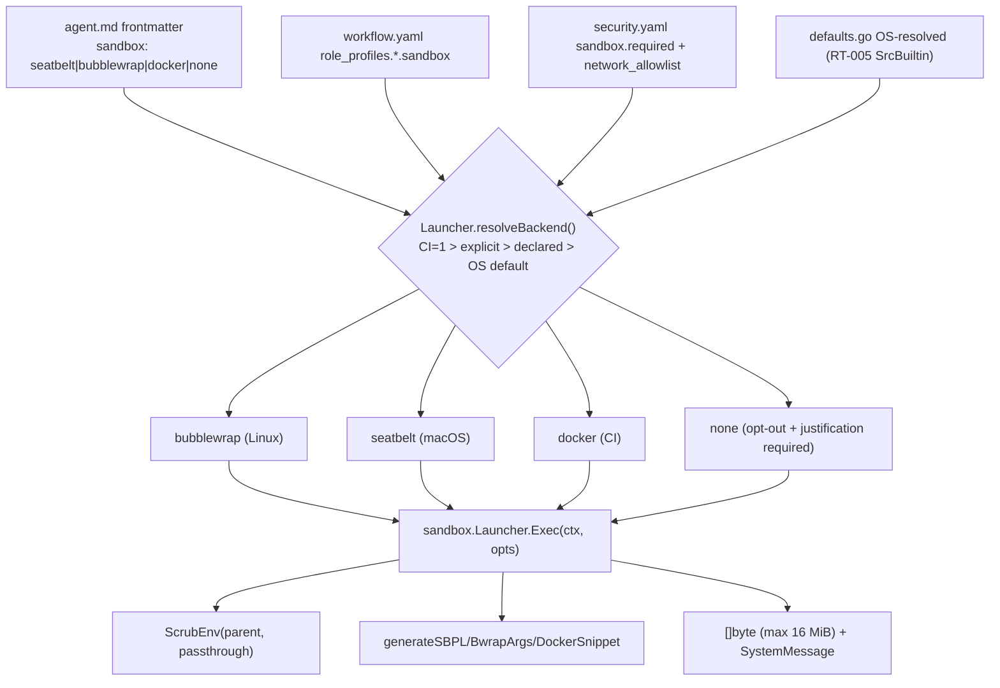

# SPEC-V3R2-RT-003: Sandbox Execution Layer (Bubblewrap / Seatbelt / Docker)

> 본 PR body 는 GitHub plan PR 생성 시 자동 첨부됨. Companion to `.moai/specs/SPEC-V3R2-RT-003/{spec,research,plan,acceptance,tasks,progress}.md`.

---

## 배경 (Background)

`spec.md` §3 Environment + `problem-catalog.md` Cluster 5 P-C03 (CRITICAL): moai-adk-go 의 implementer agent 6개 (`expert-backend`, `expert-frontend`, `manager-ddd`, `manager-tdd`, `expert-refactoring`, `manager-cycle`) 는 현재 어떤 OS-level 격리도 없이 host 의 모든 파일에 Write/Edit 가능.

OWASP Top 10 for Agentic Apps (2025년 12월) 와 두 건의 2026 incident (Cline npm-token exfiltration, Claude Code `rm -rf ~/`) 가 approval prompt 단독은 empirically 부적합함을 입증. r2-opensource-tools.md 에 따르면 snarktank/ralph 외 모든 조사 도구가 `sandbox: none` — moai-v3 는 이 ecosystem-wide gap 을 default-on sandbox 로 invert.

본 SPEC 은 master document §1.2 의 sandbox 약속을 코드/설정/마이그레이션 3 면에서 동시 실현한다.

---

## 목표 (Goal)

OS-적합 sandbox primitive 를 implementer/tester/designer agent 의 tool 호출에 ephemeral 적용:

- **Linux**: Bubblewrap (`bwrap --unshare-all --die-with-parent --bind <scope> <scope>`)
- **macOS**: Seatbelt (`sandbox-exec -p <SBPL profile>`)
- **CI**: Docker (`docker run --rm --network=<bridge> -v <scope>:<scope>`)

3 가지 backend 모두 16-language neutral (shell layer wrapper — 언어 toolchain 비편향).

추가:
- AUTO migration BC-V3R2-003: v2 → v3 migrator 가 frontmatter `sandbox:` 필드 자동 채움 (per OS).
- Network egress allowlist (8 default registries + user-extensible).
- Env scrubbing (`AWS_*`, `GITHUB_TOKEN`, `ANTHROPIC_API_KEY`, `OPENAI_API_KEY`, `NPM_TOKEN`, `GH_TOKEN`).
- File-write scope clamping (worktree + `.moai/state/` only).
- `moai doctor sandbox` diagnostics.
- CI lint rule: `sandbox: none` 사용 시 `sandbox.justification` 필수.

---

## Scope

### In-scope (이번 SPEC)

- `internal/sandbox/` 신규 패키지 (8 source + 8 test + 1 bench file)
- `Sandbox` typed string enum (4 values: `none`, `bubblewrap`, `seatbelt`, `docker`)
- `SandboxBackend` interface + 3 backends (bwrap / seatbelt / docker)
- Profile generators (SBPL, bwrap args, Dockerfile snippet) — 결정적 (sorted directives, REQ-004)
- Env scrubbing utility (6-pattern denylist + `AWS_*` prefix-match + opt-in passthrough)
- `internal/config/types.go` 확장: `RoleProfile.Sandbox` field + `SecurityConfig.Sandbox` substruct
- `internal/template/templates/.moai/config/sections/{workflow,security}.yaml` 스키마 확장
- `internal/cli/doctor_sandbox.go` 신규 CLI subcommand
- `internal/cli/agent_lint.go` 신규 rule key `AGENT_LINT_NO_SANDBOX_NO_JUSTIFICATION`
- `defaults.go::NewDefaultConfig()` 에 OS-자동 sandbox default 매핑
- AUTO migration BC-V3R2-003 contract documentation (frontmatter 4 키: `sandbox`, `sandbox.env_passthrough`, `sandbox.justification`, `sandbox.docker_image`)
- 10 MX tags (4 ANCHOR + 3 NOTE + 3 WARN+REASON)
- CHANGELOG entry (한국어, Unreleased)

### Out-of-scope (delegated)

| Item | Owner SPEC |
|------|-----------|
| Permission resolver stack | SPEC-V3R2-RT-002 |
| Hook JSON for SystemMessage emission | SPEC-V3R2-RT-001 |
| Worktree creation + cleanup | SPEC-V3R2-ORC-004 |
| Frontmatter 자동 채움 (v2 → v3 migration) | SPEC-V3R2-MIG-001 |
| Container image 빌드 (`moai/sandbox:latest`) | SPEC-V3R2-EXT-004 |
| Windows native sandbox (AppContainer) | v3.1+ deferred |
| LSP server relocation into sandbox | master §12 Q7 alpha.2 deferred |

---

## 8-Tier Architecture (consumer of RT-005)



Sandbox layer 는 RT-002 permission resolver 의 verdict 와 별도로 독립 deny 가능 (REQ-051). 즉 permission allow + sandbox deny → sandbox wins + SystemMessage divergence emit.

---

## Acceptance (요약)

20 ACs (자세한 G/W/T 형식은 `acceptance.md` 참조):

| AC | 검증 대상 | OS | REQ |
|----|---------|----|----|
| AC-01 | macOS sandbox-exec write outside scope → EPERM | macOS | REQ-010, -013 |
| AC-02 | Linux bwrap network egress to non-allowlist → block | Linux | REQ-011, -014 |
| AC-03 | role_profile=implementer → OS-resolved sandbox (not "none") | All | REQ-003 |
| AC-04 | `moai doctor sandbox` reports availability + per-agent resolved | All | REQ-005, -032, -050 |
| AC-05 | Backend unavailable → `*SandboxBackendUnavailable` (no silent unsandboxed) | All | REQ-012 |
| AC-06 | Env scrubbing 6 default patterns → empty in child | All | REQ-006 |
| AC-07 | `sandbox.env_passthrough: [GH_TOKEN]` preserves variable | All | REQ-031 |
| AC-08 | `sandbox.required: true` + `sandbox: none` no justification → fail | All | REQ-020, -043 |
| AC-09 | `permissionMode: plan` → all paths read-only mount | All | REQ-022 |
| AC-10 | `security.yaml sandbox.network_allowlist` extends defaults | All | REQ-008, -030 |
| AC-11 | `CI=1` → docker backend auto-select | CI | REQ-015 |
| AC-12 | sudo/su/setuid → deny + SystemMessage | macOS+Linux | REQ-040 |
| AC-13 | Invalid profile (null byte) → `*SandboxProfileInvalid` | All | REQ-041 |
| AC-14 | Output > 16 MiB → truncate + SystemMessage | All | REQ-042 |
| AC-15 | `sandbox: none` + valid `justification` → spawn + lint pass | All | REQ-033 |
| AC-16 | permission allow + sandbox deny → sandbox wins + divergence message | All | REQ-051 |
| AC-17 | Bubblewrap startup p99 ≤ 50ms (bench) | Linux | spec §7 |
| AC-18 | Seatbelt startup p99 ≤ 50ms (bench) | macOS | spec §7 |
| AC-19 | Steady-state syscall overhead ≤ 10% (bench) | All | spec §7 |
| AC-21 | LSP carve-out clause baseline (`~/.cache/` rw + `/tmp` tmpfs) | All | REQ-021 |

전체 EARS 요구사항: **33 REQ** (Ubiquitous 8 + Event-Driven 6 + State-Driven 3 + Optional 4 + Unwanted 4 + Complex 2 + 6 sub-categories).

---

## Risks & Mitigations

`spec.md` §8 + plan §5 결합 (10 entries PR-01..PR-10):

| Risk | L/I | Mitigation |
|------|-----|-----------|
| bwrap user-namespaces 비활성화 (kernel.unprivileged_userns_clone=0) | M/M | doctor 가 명시 진단 + `bubblewrap: unavailable` 명확 |
| macOS sandbox-exec deprecation | L/L | App Sandbox 는 CLI 부적합 → seatbelt 유지; v3.1 재검토 |
| Docker image `moai/sandbox:latest` v3.0 부재 | H/M | `alpine:latest` fallback (5MB) — image 빌드는 EXT-004 |
| Profile 결정성 (REQ-004) 깨짐 | M/M | M2 `TestProfile_DeterministicChecksum_100Runs` 100회 SHA256 검증 |
| Env scrub `AWS_*` false-positive (`AWSOME_VAR`) | L/M | `strings.HasPrefix(k, "AWS_")` underscore 강제 + test |
| Network allowlist CDN 호스트 부족 (예: pypi.files.pythonhosted.org) | M/H | user-extensible `sandbox.network_allowlist` + doctor missing-CDN warning (v3.1) |
| LSP carve-out 부족 → ACI 깨짐 | H (audit) /M | AC-21 baseline-only; alpha.2 master §12 Q7 deferred |
| Docker image pull cost CI quota | L/M | `docker run --rm` ephemeral; CI image cache via GHA `setup-docker` |
| RT-002 permission divergence (REQ-051) 모호 | M/M | mock-based unit test (M4); real wiring 은 RT-002 머지 후 follow-up |
| `moai doctor sandbox` 출력 RT-005 doctor_config.go 일관성 부족 | L/L | mirror pattern 명시; M6 reviewer (manager-quality) |

---

## Implementation Plan Summary

`tasks.md` 52 tasks 중 milestone 별 분포:

| Milestone | Tasks | Phase | Status |
|-----------|-------|-------|--------|
| M1 (RED scaffolding) | 14 (T-01..14) | TDD RED | ⏳ pending run-phase |
| M2 (Type-level GREEN) | 3 (T-15..17) | TDD GREEN | ⏳ pending |
| M3 (Per-OS bubblewrap+seatbelt) | 5 (T-18..22) | TDD GREEN | ⏳ pending |
| M4 (Docker + dispatcher) | 4 (T-23..26) | TDD GREEN | ⏳ pending |
| M5 (Config + lint wiring) | 13 (T-27..39) | TDD GREEN | ⏳ pending |
| M6 (REFACTOR + benchmark + doctor + docs) | 13 (T-40..52) | TDD REFACTOR | ⏳ pending |

총 ~3240 LOC est across 18 files. Greenfield (0 placeholder replacement).

---

## AUTO Migration BC-V3R2-003 (contract only — MIG-001 implements)

본 SPEC plan §3 전부:

```yaml
# v2 agent file frontmatter (before)
---
permissionMode: acceptEdits
# (no sandbox field)
---

# v3 agent file frontmatter (after MIG-001 migration)
---
permissionMode: acceptEdits
sandbox: seatbelt   # macOS: auto; Linux: bubblewrap; CI: docker
sandbox.env_passthrough: []                 # optional, default empty
sandbox.justification: ""                    # required IFF sandbox == "none"
sandbox.docker_image: ""                    # optional, override default for docker backend
---
```

Migration decision tree (MIG-001 implements):
- `role_profile in [implementer, tester, designer]` → OS-자동 (`darwin → seatbelt`, `linux → bubblewrap`, `CI=1 → docker`); Windows → `none + justification: "Unsupported OS"`.
- `role_profile in [researcher, analyst, reviewer, architect]` → `none` (no justification needed; read-only role).

Mixed-OS team: macOS commit `seatbelt` 가 Linux CI 에서 transparent fallback to `bubblewrap` (silent + INFO log). doctor 가 declared/effective 둘 다 표시.

---

## Plan Artifacts Checklist

본 PR 의 plan artifact:

- [x] `.moai/specs/SPEC-V3R2-RT-003/spec.md` (24KB, pre-existing v0.1.0)
- [x] `.moai/specs/SPEC-V3R2-RT-003/plan.md` (~26KB, this session)
- [x] `.moai/specs/SPEC-V3R2-RT-003/research.md` (~30KB, this session)
- [x] `.moai/specs/SPEC-V3R2-RT-003/acceptance.md` (~22KB, this session)
- [x] `.moai/specs/SPEC-V3R2-RT-003/tasks.md` (~21KB, this session)
- [x] `.moai/specs/SPEC-V3R2-RT-003/progress.md` (~10KB, this session)
- [x] `.moai/specs/SPEC-V3R2-RT-003/issue-body.md` (this file)

---

## Plan-auditor Entry

본 PR 머지 전 plan-auditor 자동 호출 (target: PASS 0.85+).

자체 점검: 15/15 PASS criteria covered (plan §7 checklist).

---

## Next Steps After Merge

1. RT-003 plan PR squash-merged into main (doctrine #822).
2. (Optional) RT-002 plan + run merge.
3. `moai worktree new SPEC-V3R2-RT-003 --base origin/main` 후 `/moai run SPEC-V3R2-RT-003`.
4. M1-M6 순차 실행 → PR.
5. RT-002 머지 시 permission-divergence wiring follow-up commit.
6. master §12 Q7 alpha.2 LSP runtime validation (manual).
7. SPEC-V3R2-MIG-001 plan 작성 시 본 SPEC 의 frontmatter contract 참조.

---

## References

- `master document` §1.2 (sandbox commitment), §4.3 Layer 3, §5 Principle P7, §8 BC-V3R2-003, §10 R3, §12 Q7
- `r2-opensource-tools.md` §A Pattern 5 (OWASP mandate), §B Anti-pattern 1 (approval-fatigue evidence)
- OWASP Top 10 for Agentic Application Security 2025 (December 2025)
- Cline 2026 npm-token exfiltration incident
- Claude Code `rm -rf ~/` incident (April 2025)
- `https://github.com/containers/bubblewrap` (bwrap reference)
- `man sandbox-exec` (macOS Seatbelt SBPL)

---

🗿 MoAI <email@mo.ai.kr>
