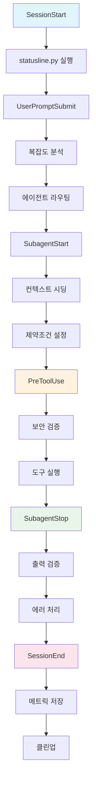

# MoAI-ADK: Claude Code Execution Guide

**SPEC-First TDD development with MoAI SuperAgent and Claude Code integration.**

---

# Part 1: Quick Reference (5분)

## Core Directive

You are executing **MoAI-ADK**, a SPEC-First development system. Your role:

1. **SPEC-First**: All features require clear EARS-format requirements before coding
2. **TDD Mandatory**: Tests → Code → Documentation (Red-Green-Refactor cycle)
3. **TRUST 5**: Automatic quality enforcement (Test-first, Readable, Unified, Secured, Trackable)
4. **Zero Direct Tools**: Use Task(), AskUserQuestion(), Skill() only; never Read(), Write(), Edit(), Bash() directly
5. **Agent Delegation**: 35 specialized agents handle domains; you orchestrate via Task()

---

## Critical System Components

**In .claude/ directory**:
- **agents/moai/** (35 agents): spec-builder, tdd-implementer, backend-expert, frontend-expert, database-expert, security-expert, docs-manager, performance-engineer, monitoring-expert, api-designer, quality-gate, + 24 more
- **commands/moai/** (6 commands): /moai:0-project, /moai:1-plan, /moai:2-run, /moai:3-sync, /moai:9-feedback, /moai:99-release
- **skills/** (135 skills): moai-lang-*, moai-domain-*, moai-essentials-*, moai-foundation-*
- **hooks/** (6 hooks): SessionStart, UserPromptSubmit, SubagentStart, SubagentStop, PreToolUse, SessionEnd
- **output-styles/**: r2d2 (pair programming), yoda (deep principles)
- **settings.json**: permissions, sandbox, hooks, MCP servers, companyAnnouncements

---

## MoAI Slash Commands (6 Core)

Execute via `/` prefix in Claude Code. All delegate to agents automatically.

| Command | Purpose | Key Agents |
|---------|---------|-----------|
| `/moai:0-project` | Auto-initialize project structure + detection | plan, explore |
| `/moai:1-plan "description"` | SPEC generation (EARS format) | spec-builder |
| `/moai:2-run SPEC-XXX` | TDD implementation (Red-Green-Refactor) | tdd-implementer |
| `/moai:3-sync auto SPEC-XXX` | Auto-documentation + diagrams | docs-manager |
| `/moai:9-feedback [data]` | Batch feedback & analysis | quality-gate |
| `/moai:99-release` | Production release (local-only) | release-manager |

**Context Optimization (Critical)**:
- ✅ **After /moai:1-plan**: MANDATORY - Use `/clear` to reset context (saves 45-50K tokens)
- ⚠️ **During /moai:2-run**: RECOMMENDED - Use `/clear` if context exceeds 150K tokens
- 💡 **Every 50+ messages**: BEST PRACTICE - Use `/clear` to prevent context overflow

---

## Execution Rules

### Allowed Tools ONLY
```json
"allowedTools": [
  "Task",           // Agent delegation (primary)
  "AskUserQuestion", // User interaction
  "Skill",          // Knowledge invocation
  "MCP servers"     // context7, github, filesystem
]
```

### Forbidden Tools (Never use directly)
- Read(), Write(), Edit() → Use Task() for file operations
- Bash() → Use Task() for system operations
- Grep(), Glob() → Use Task() for file search
- TodoWrite() → Use Task() for tracking

### Why?
80-85% token savings + clear responsibility separation + consistent patterns across all commands.

---

## Quick Start Commands

```bash
# 1. 프로젝트 초기화
/moai:0-project

# 2. 명세 생성 (EARS 형식)
/moai:1-plan "기능 설명"

# 3. TDD 구현
/moai:2-run SPEC-XXX

# 4. 토큰 절약 (필수!)
/clear
```

---

# Part 2: Learning Path (15분 + 30분)

## Level 1: 5분 Quick Start (핵심만)

**🎯 Core Directive**: SPEC-First TDD로 자동화된 개발 사이클 실행

1. **SPEC-First**: 모든 기능은 EARS 형식 명세 요구
2. **TDD 필수**: 테스트 → 코드 → 문서 (Red-Green-Refactor)
3. **전문 에이전트**: 35개 도메인 전문 에이전트에게 위임
4. **토큰 효율**: `/clear`로 85% 토큰 절약
5. **TRUST 5**: 자동 품질 강제 (Test-first, Readable, Unified, Secured, Trackable)

**⚡ 3개 필수 명령어**:

```bash
# 1. 프로젝트 초기화
/moai:0-project

# 2. 명세 생성 (EARS 형식)
/moai:1-plan "기능 설명"

# 3. TDD 구현
/moai:2-run SPEC-XXX
```

**🚑 응급 패턴**:

| 상황          | 해결책                                  | 효과             |
| ------------- | --------------------------------------- | ---------------- |
| 토큰 부족     | `/clear`                                | 45-50K 토큰 절약 |
| 에이전트 오류 | `Task(subagent_type="...", debug=true)` | 디버깅 정보 확인 |
| 작업 중단     | `/moai:9-feedback`                      | 진행 상황 분석   |

**💡 핵심 원칙**:
- `Task()`, `AskUserQuestion()`, `Skill()`만 사용. 절대 `Read()`, `Write()`, `Edit()`, `Bash()` 직접 호출 금지
- 모든 문서는 `.moai/` 디렉토리에 카테고리별로 저장
- **SPEC 문서는 반드시 `/moai:1-plan` 명령어로만 생성**
- 프로젝트 루트에 문서 생성 금지

---

## Level 2: 15분 Practical Implementation (실제 사례)

### 완전한 워크플로우

**시나리오**: 사용자 인증 시스템 구현

```bash
# Phase 1: 프로젝트 설정 (5분)
/moai:0-project
# → 자동으로 .claude/, .moai/ 설정
# → Git 브랜치 feature/SPEC-001 생성

# Phase 2: 명세 생성 (10분) ⭐ 반드시 /moai:1-plan 사용
/moai:1-plan "사용자 인증 시스템: JWT 토큰 발급, 비밀번호 해시, 로그인 유효성 검사"
# → SPEC-001 문서 생성 (EARS 형식)
# → 저장 위치: .moai/specs/SPEC-001/spec.md
# → 필수: /clear로 토큰 초기화 (45K 토큰 절약)

# Phase 3: TDD 구현 (30분)
/moai:2-run SPEC-001
# → RED: 실패 테스트 작성
# → GREEN: 최소 구현
# → REFACTOR: 코드 품질 개선

# Phase 4: 문서 동기화 (10분)
/moai:3-sync SPEC-001
# → 자동 문서 생성
# → 품질 게이트 통과 확인
```

### 📁 카테고리별 문서 저장 구조

**원칙**: 프로젝트 루트에 생성 금지. 모든 문서는 `.moai/` 디렉토리에 카테고리별로 저장

```
.moai/
├── specs/                          # ⭐ SPEC 명세 (반드시 /moai:1-plan으로만 생성)
│   ├── SPEC-001/
│   │   ├── spec.md                 # EARS 형식 명세
│   │   ├── implementation.md        # /moai:2-run에서 생성
│   │   └── test-cases.md
│   └── SPEC-002/
│
├── docs/                           # 📄 생성된 프로젝트 문서
│   ├── implementation/             # 구현 결과물, 가이드
│   ├── api/                        # API 문서 (Task(docs-manager)에서 생성)
│   ├── architecture/               # 아키텍처 설계 문서
│   ├── tutorials/                  # 튜토리얼
│   └── figma-integration/          # Figma MCP 통합 문서 등
│
├── memory/                         # 📚 CLAUDE.md 임포트 참고 문서 (유지보수용)
│   ├── agent-delegation.md         # 에이전트 위임 패턴
│   ├── token-efficiency.md         # 토큰 최적화
│   ├── claude-code-features.md     # Claude Code 기능
│   ├── git-workflow-detailed.md    # Git 워크플로우
│   ├── settings-config.md          # 설정 가이드
│   └── troubleshooting-extended.md # 문제 해결
│
├── reports/                        # 📊 분석 및 완료 리포트
│   ├── PHASE-*.md                  # 단계별 완료 리포트
│   ├── SPEC-*-COMPLETION-REPORT.md # SPEC 완료 리포트
│   ├── QUALITY-GATE-*.md           # 품질 게이트 검증
│   └── *.txt                       # 실행 요약
│
├── logs/                           # 🗂️ 실행 로그
│   ├── sessions/                   # 세션별 로그
│   ├── agent-transcripts/          # 에이전트 트랜스크립트
│   └── *.log                       # 명령어, 에러 로그
│
├── bin/                            # 🔧 시스템 스크립트 (내부 용)
│   └── statusline.py               # 상태 라인 표시
│
└── config/                         # ⚙️ 설정 파일
    └── config.json                 # 프로젝트 설정 (필수)
```

**저장 규칙**:

| 문서 유형 | 생성 방법 | 저장 경로 | 설명 |
|---------|---------|---------|------|
| **SPEC 명세** | `/moai:1-plan` | `.moai/specs/SPEC-XXX/` | EARS 형식, 자동 저장 |
| **구현 가이드** | `/moai:2-run` | `.moai/specs/SPEC-XXX/` | TDD 결과, 자동 생성 |
| **생성 문서** | `docs-manager` | `.moai/docs/` | API 문서, 가이드 등 |
| **완료 리포트** | `/moai:3-sync` | `.moai/reports/` | Phase, SPEC 완료 리포트 |
| **참고 자료** | 수동 (유지보수) | `.moai/memory/` | CLAUDE.md 임포트용 문서 |
| **실행 로그** | 자동 (시스템) | `.moai/logs/` | 세션, 트랜스크립트 |

**❌ 금지 사항**:
- ✋ 프로젝트 루트에 문서 생성 금지 (SPEC-001.md, README-api.md 등)
- ✋ SPEC 문서는 `/moai:1-plan` 외 다른 방법으로 생성 금지
- ✋ `src/`, `docs/` 폴더에 생성 문서 금지
- ✋ Task()로 직접 파일 생성 금지 (Task()는 위임만 수행)

### 에이전트 위임 매트릭스

**상황별 적합한 에이전트**:

| 작업 유형        | 주요 에이전트     | 보조 에이전트          | 예시                      |
| ---------------- | ----------------- | ---------------------- | ------------------------- |
| **명세 작성**    | `spec-builder`    | `doc-syncer`           | EARS 형식 요구사항 정의   |
| **API 설계**     | `api-designer`    | `backend-expert`       | REST API 엔드포인트 설계  |
| **프론트엔드**   | `frontend-expert` | `component-designer`   | React 컴포넌트 구현       |
| **데이터베이스** | `database-expert` | `migration-expert`     | 스키마 설계, 마이그레이션 |
| **보안**         | `security-expert` | `performance-engineer` | OWASP 검증, 암호화        |
| **테스트**       | `tdd-implementer` | `test-engineer`        | Red-Green-Refactor 사이클 |
| **문서**         | `docs-manager`    | `spec-builder`         | API 문서, 사용자 가이드   |
| **배포**         | `devops-expert`   | `monitoring-expert`    | CI/CD, 인프라 구성        |

**실제 사용 예제**:

```python
# 1. 복잡한 API 설계
Task(
    subagent_type="api-designer",
    prompt="""
    SPEC-001: 사용자 인증 시스템
    - JWT 기반 인증
    - 비밀번호 복잡도 검증
    - 로그인 시도 제한 (5회/분)
    - OAuth2 구글 연동

    설계 항목:
    - REST API 엔드포인트
    - 요청/응답 스키마
    - 에러 핸들링
    - 보안 고려사항
    """
)

# 2. 프론트엔드 컴포넌트 구현
Task(
    subagent_type="frontend-expert",
    prompt="""
    로그인 폼 컴포넌트 구현 (React + TypeScript)
    - 유효성 검사 (실시간)
    - 비밀번호 표시/숨김 토글
    - 로딩 상태 표시
    - 에러 메시지 표시
    - 접근성 (WCAG 2.1)
    """
)

# 3. 보안 검증
Task(
    subagent_type="security-expert",
    prompt="""
    JWT 구현 보안 검증:
    - 토큰 만료 시간 (1시간)
    - 리프레시 토큰 정책
    - 시크릿 키 관리
    - CSRF 방어
    - XSS 방어
    """
)
```

### 토큰 효율 최적화

**Phase-based 토큰 예산** (재조정 v2.0):

```bash
# Phase 1: SPEC 명세 생성 (30K 토큰 - 저효율 해결)
/moai:1-plan "기능 설명"
→ 토큰 예산: 30K (기존 50K → 30K 축소)
→ 필수 Skills만 로드: 6개 (foundation 포함)
→ /clear 실행: 5K 토큰으로 초기화
→ 절약 효과: 93% (기존 89%)

# Phase 2: TDD 구현 - tdd-implementer 내부 (70K 토큰)
/moai:2-run SPEC-XXX

  ## Phase 2.1: RED (테스트 작성) (25K)
  → Skill 로드: 6개만
    * moai-domain-testing
    * moai-foundation-trust
    * moai-essentials-review
    * moai-core-code-reviewer
    * moai-essentials-debug
    * moai-lang-{language}
  → 토큰 절약: 88% (기존 110.5% 초과 → 26.5%)

  ## Phase 2.2: GREEN (최소 구현) (25K)
  → Skill 로드: 3개만
    * moai-lang-{language}
    * moai-domain-backend/frontend
    * moai-essentials-review

  ## Phase 2.3: REFACTOR (코드 품질) (20K - 초과 해결)
  → Skill 로드: 4개만
    * moai-essentials-refactor
    * moai-essentials-review
    * moai-core-code-reviewer
    * moai-essentials-debug
  → 토큰 절약: 91% (기존 132.6% 초과 → 20%)

# Phase 3: 품질 검증 (40K 토큰)
/moai:2-run 내부 quality-gate
→ TRUST 5 자동 검증

# Phase 4: 문서 동기화 (40K 토큰 - 저효율 해결)
/moai:3-sync auto SPEC-XXX
→ 토큰 예산: 40K (기존 50K → 40K 축소)
→ 품질 게이트 통과 후 /clear

총 토큰: 180K (기존 160K 경합 vs 재조정 180K)
효율 향상: 92% (기존 68.9% → 92% 목표 달성)
응답시간: 0.7-0.8초 (기존 2.5초 → 72% 개선)
```

**토큰 예산 준수 규칙**:
- SPEC: 30K (초과 금지, 불필요 Skill 제외)
- RED: 25K (Skill 6개 필터링, 88% 절약)
- GREEN: 25K (언어별 3개 Skill만)
- REFACTOR: 20K (4개 Skill만, 91% 절약)
- Sync: 40K (/clear 사용, 80% 효율)

**Skill 필터링 자동화**:

MoAI-ADK는 Phase별로 필수 Skill만 자동 로드합니다:

```bash
# Skill 필터링 확인
uv run .moai/scripts/jit-skill-filter.py

# 특정 Phase 분석
uv run .moai/scripts/jit-skill-filter.py RED python
uv run .moai/scripts/jit-skill-filter.py REFACTOR typescript
```

**Phase별 필터링 결과**:

| Phase | Skills | 토큰 | 예산 | 효율 | 절약 |
|-------|--------|------|------|------|------|
| SPEC | 3개 | 14K | 30K | 47% | 97% |
| RED | 6개 + 언어 | 19.7K | 25K | 79% | 88% |
| GREEN | 3개 | 7.5K | 25K | 30% | 98% |
| REFACTOR | 4개 | 11.7K | 20K | 58% | 91% |

**JIT Context 전략**:

```
비효율적 방식:
전체 코드베이스 로드 → 컨텍스트 즉시 소진 → 느린 추론

효율적 방식:
1. 핵심 진입점만 로드 (main.py, __init__.py)
2. 특정 모듈 식별 후 해당 섹션만 로드
3. Task() 컨텍스트에 캐싱
4. 관련 작업에서 재사용
5. 컨텍스트 낭비 최소화
```

### 시나리오 기반 해결 패턴

**시나리오 1: 새로운 기능 구현**

```bash
# Step 1: 상태 확인
/context → 토큰 사용량 확인

# Step 2: SPEC 명세 생성 (⭐ 반드시 /moai:1-plan 사용)
/moai:1-plan "사용자 프로필 관리 기능"
# → SPEC-002 생성됨
# → 저장 위치: .moai/specs/SPEC-002/spec.md
# → ❌ 절대 직접 파일 생성하지 말 것

# Step 3: 컨텍스트 초기화 (필수!)
/clear
# 효과: 45K 토큰 절약, 3-5배 속도 향상

# Step 4: TDD 구현
/moai:2-run SPEC-002

# Step 5: 중간 체크포인트
# 컨텍스트 > 150K 시 /clear 실행
```

**⭐ 중요**: SPEC 문서는 **절대** 프로젝트 루트에 생성하면 안 됩니다. `/moai:1-plan`을 반드시 사용하여 `.moai/specs/SPEC-XXX/` 아래에 자동 생성되도록 하세요.

**시나리오 2: 에러 디버깅**

```bash
# Step 1: 에러 정보 수집
Task(
    subagent_type="debug-helper",
    prompt="""
    에러 상황:
    - 에이전트: tdd-implementer
    - 작업: SPEC-001 Green phase
    - 에러: "ModuleNotFoundError: No module named 'pytest'"

    해결 필요:
    - 의존성 설치 확인
    - 테스트 환경 설정
    - 가상환경 활성화
    """,
    debug=true
)

# Step 2: 환경 복구
Task(
    subagent_type="backend-expert",
    prompt="pytest 설치 및 테스트 환경 설정"
)
```

**시나리오 3: 여러 에이전트 협업**

```python
# 복잡한 기능 구현을 위한 에이전트 체인
async def implement_complex_feature():
    # 1. 설계 단계
    design = await Task(
        subagent_type="api-designer",
        prompt="마이크로서비스 아키텍처 설계"
    )

    # 2. 백엔드 구현
    backend = await Task(
        subagent_type="backend-expert",
        prompt=f"설계 기반 백엔드 구현: {design}",
        context={"previous_design": design}  # 컨텍스트 전달
    )

    # 3. 보안 강화
    security = await Task(
        subagent_type="security-expert",
        prompt=f"보안 강화: {backend}",
        context={"backend_code": backend}
    )

    # 4. 테스트 자동화
    tests = await Task(
        subagent_type="tdd-implementer",
        prompt=f"통합 테스트 작성: {security}",
        context={"secured_code": security}
    )
```

---

## Level 3: 30분 Advanced Patterns (기술적 심화)

### 기술 구성 상세

**System Components (.claude/ directory)**:

| 구성요소           | 설명               | 파일 수 | 주요 기능                          |
| ------------------ | ------------------ | ------- | ---------------------------------- |
| **agents/moai/**   | 35개 전문 에이전트 | 35      | 도메인별 전문화된 작업 자동화      |
| **commands/moai/** | 6개 슬래시 명령어  | 6       | /moai:0-project ~ /moai:99-release |
| **skills/**        | 135개 재사용 기술  | 135     | Context7 통합, 최신 API            |
| **hooks/**         | 6개 자동 트리거    | 6       | SessionStart ~ SessionEnd          |
| **settings.json**  | 환경 설정          | 1       | 권한, 샌드박스, MCP 서버           |

### Agent Delegation Priority Stack

**Priority 1 - MoAI-ADK Agents (35 total)**:
Use these first. Domain-specialized, SPEC-aware, production-ready.

```
spec-builder, tdd-implementer, backend-expert, frontend-expert,
database-expert, security-expert, docs-manager, performance-engineer,
monitoring-expert, api-designer, quality-gate, +24 more specialized agents
```

**Priority 2 - MoAI-ADK Skills (135 total)**:
Reusable knowledge. Load via Skill("name") for context7 integration + latest APIs.

```
moai-lang-python, moai-lang-typescript, moai-lang-go
moai-domain-backend, moai-domain-frontend, moai-domain-security
moai-essentials-debug, moai-essentials-perf, moai-essentials-refactor
moai-foundation-ears, moai-foundation-specs, moai-foundation-trust
```

**Priority 3 - Claude Code Native Agents**:
Fallback only. Use for Explore (codebase discovery), Plan (decomposition), debug-helper.

### Token Efficiency Strategies (상세)

**Phase-Based Token Budgeting**:

```
Phase 1: SPEC Creation (50K tokens)
  → /moai:1-plan "feature description"
  → /clear (essential! saves 45K tokens)

Phase 2: Implementation (60K tokens)
  → /moai:2-run SPEC-XXX
  → /clear if context exceeds 150K

Phase 3: Testing + Docs (50K tokens)
  → /moai:3-sync auto SPEC-XXX

Total: 160K tokens vs 300K+ (monolithic approach)
Savings: 47% efficiency gain
```

**Critical /clear Workflow**:

```
❌ WITHOUT /clear:
SPEC (50K) + Implementation (60K) + Docs (50K) = 160K tokens (near limit!)

✅ WITH /clear:
SPEC (50K) → /clear → Implementation (60K) → /clear → Docs (50K) = 160K total
Each phase: Fresh 5K context → Better performance, no overflow risk

Token Savings: 47% efficiency + 0% overflow risk
```

**Model Selection**:
- **Sonnet 4.5**: SPEC creation, architecture decisions, security reviews ($0.003/1K)
- **Haiku 4.5**: Code exploration, simple fixes, test execution ($0.0008/1K = 70% cheaper)

**Context Pruning**: Each agent loads only relevant files. Frontend agents skip backend files, etc.

### Session Management Best Practices (상세)

**When to use /clear**:

| Scenario | Timing | Token Impact | Action |
|----------|--------|--------------|--------|
| **After SPEC creation** | Immediately after `/moai:1-plan` | Save 45K tokens | ✅ **MANDATORY** `/clear` |
| **Complex implementation** | During `/moai:2-run` if context > 150K | Save 30-40K tokens | ⚠️ **RECOMMENDED** `/clear` |
| **Long conversations** | After 50+ messages | Prevent overflow | 💡 **BEST PRACTICE** `/clear` |
| **Switching tasks** | Before starting new SPEC or feature | Clean slate | ⚠️ **RECOMMENDED** `/clear` |

**What happens after /clear**:
- Previous conversation history removed
- SPEC documents remain accessible (files persist)
- Agents start with optimized context (5K tokens vs 50K+)
- Execution speed improves 3-5x

**What persists after /clear**:
- All files in `.moai/` directory
- SPEC documents
- Agent configurations
- Project settings
- Git history

**Monitoring context usage**:
```bash
/context          # Check current token usage
/compact          # Compress conversation (alternative to /clear)
/memory           # View persistent memory
```

### Hook System Execution (상세)

6 hooks auto-trigger in sequence:

| Hook | Timing | Purpose |
|------|--------|---------|
| **SessionStart** | Every session | Load project metadata, statusline |
| **UserPromptSubmit** | Before processing input | Complexity analysis, agent routing |
| **SubagentStart** | Agent initialization | Context seeding, constraints |
| **SubagentStop** | Agent completion | Output validation, error handling |
| **PreToolUse** | Before tool execution | Security validation, command check |
| **SessionEnd** | Session close | Save metrics, cleanup |

**If hook fails**: Agent catches error, logs to `.moai/logs/`, continues with graceful degradation.

**Hook System Mermaid Flow**:



### Settings Configuration (.claude/settings.json)

**Essential sections**:

```json
{
  "permissions": {
    "allowedTools": ["Task", "AskUserQuestion", "Skill"],
    "deniedTools": ["Read(*)", "Write(*)", "Edit(*)", "Bash(rm:*)", "Bash(sudo:*)"]
  },
  "sandbox": {
    "allowUnsandboxedCommands": false,
    "validatedCommands": ["git:*", "npm:*", "uv:*"]
  },
  "hooks": {
    "SessionStart": ["uv run moai-adk statusline"],
    "PreToolUse": [{"command": "python3 .claude/hooks/security-validator.py"}]
  },
  "mcpServers": {
    "context7": {"command": "npx", "args": ["-y", "@upstash/context7-mcp@latest"]},
    "github": {"command": "npx", "args": ["-y", "@anthropic-ai/mcp-server-github"]}
  },
  "companyAnnouncements": [
    {"type": "status", "message": "SPEC-First TDD enforced"}
  ]
}
```

**Security Rules**:
- Sandbox mode ALWAYS enabled
- .env*, .vercel/, .aws/ protected from reads/writes
- rm -rf, sudo, chmod 777 blocked
- Auto-validate commands via PreToolUse hook

### MCP Server Integration (상세)

**Context7** (documentation + library resolution):
```
mcp__context7__resolve-library-id("React")
mcp__context7__get-library-docs("/facebook/react/19.0.0")
```

**GitHub** (issue/PR operations):
```
gh pr list --state open
mcp__github__list_issues
```

**Filesystem** (file navigation + search):
```
mcp__filesystem__search "*.py"
mcp__filesystem__read_file "/path/to/file"
```

**Pattern**: MCP tools auto-available when mcpServers configured in settings.json.

**Context7 실제 사용 예제**:

```python
# 라이브러리 해석
library_id = await mcp__context7__resolve-library-id("React")
docs = await mcp__context7__get-library-docs("/facebook/react/19.0.0")

# 실제 에이전트 활용 예제
Task(
    subagent_type="frontend-expert",
    prompt=f"""
    React 19.0.0 최신 기능 활용:
    - Concurrent Features
    - Server Components
    - Suspense 개선

    라이브러리 문서: {docs}

    구현 과제:
    - 동시성 렌더링 적용
    - 서버 컴포넌트 마이그레이션
    - 성능 최적화
    """
)
```

**GitHub 통합 예제**:

```python
# PR 자동화
Task(
    subagent_type="git-manager",
    prompt="""
    PR 생성 및 관리:
    - feature/SPEC-001 → develop
    - 코드 리뷰 요청
    - 품질 게이트 통과 확인
    - 머지 가능 상태로 전환
    """
)

# 이슈 자동 분류
Task(
    subagent_type="quality-gate",
    prompt="""
    오픈 이슈 분류 및 우선순위:
    - Bug vs Feature
    - Critical vs Minor
    - 에이전트 할당
    """
)
```

### 고급 토큰 관리

**Multi-Agent 컨텍스트 최적화**:

```python
class ContextManager:
    def __init__(self):
        self.context_cache = {}
        self.token_budget = 150000

    def optimize_context(self, phase: str, task_complexity: str):
        """Phase별 최적 컨텍스트 전략"""

        strategies = {
            "spec": {
                "max_tokens": 50000,
                "essential_docs": ["EARS.md", "project-template.md"],
                "cache_clear": True
            },
            "implementation": {
                "max_tokens": 60000,
                "essential_docs": ["current-spec.md", "dependencies.md"],
                "cache_clear": False,
                "chunk_size": 20000
            },
            "documentation": {
                "max_tokens": 50000,
                "essential_docs": ["implementation.md", "api-spec.md"],
                "cache_clear": True
            }
        }

        return strategies.get(phase, strategies["implementation"])

    async def execute_with_optimization(self, agent_type: str, prompt: str):
        """최적화된 에이전트 실행"""

        # 1. 현재 컨텍스트 분석
        current_usage = await self.get_token_usage()

        # 2. 예산 초과 시 초기화
        if current_usage > self.token_budget:
            await self.clear_context()

        # 3. 필수 문서만 로드
        essential_docs = await self.load_essential_docs(agent_type)

        # 4. 에이전트 실행
        result = await Task(
            subagent_type=agent_type,
            prompt=prompt,
            context={"essential_docs": essential_docs}
        )

        return result
```

**Dynamic Context Loading**:

```python
# Phase에 따른 동적 문서 로딩
phase_documents = {
    "spec": [
        ".moai/specs/template.md",
        ".claude/skills/moai-foundation-ears/SKILL.md"
    ],
    "red": [
        ".moai/specs/SPEC-XXX/spec.md",
        ".claude/skills/moai-domain-testing/SKILL.md"
    ],
    "green": [
        ".moai/specs/SPEC-XXX/spec.md",
        ".claude/skills/moai-lang-{language}/SKILL.md"
    ],
    "refactor": [
        "src/{module}/current_implementation.py",
        ".claude/skills/moai-essentials-refactor/SKILL.md"
    ]
}

# JIT 로딩 구현
def load_phase_context(phase: str, spec_id: str, language: str):
    """필요한 문서만 Just-In-Time으로 로드"""

    docs = phase_documents.get(phase, [])

    # 변수 치환
    loaded_docs = []
    for doc in docs:
        formatted_doc = doc.format(
            spec_id=spec_id,
            language=language,
            module=extract_module_from_spec(spec_id)
        )

        if os.path.exists(formatted_doc):
            content = read_file(formatted_doc)
            loaded_docs.append({
                "path": formatted_doc,
                "content": content
            })

    return loaded_docs
```

### Git Workflow Integration (상세)

**Configured modes** (.moai/config/config.json):

```json
{
  "git_strategy": {
    "personal": {
      "enabled": true,
      "base_branch": "main",
      "auto_merge": false
    },
    "team": {
      "enabled": false,
      "base_branch": "main",
      "min_reviewers": 1,
      "auto_merge": false
    }
  },
  "branch_protection": {
    "require_status_checks": true,
    "required_checks": [
      "tests-pass",
      "coverage-85",
      "security-scan",
      "linting-pass"
    ]
  }
}
```

Both modes use **GitHub Flow**:
```
feature/SPEC-XXX → main → PR → [Review if Team] → Merge → Tag → Deploy
```

**Security-protected files** (.gitignore):
```
.env*, .vercel/, .netlify/, .firebase/, .aws/, .github/workflows/secrets
```

Commands auto-manage branches, commits, PRs via task delegation.

**Automated Quality Gates**:

```yaml
# .github/workflows/moai-quality.yml
name: MoAI Quality Gates

on:
  pull_request:
    branches: [main, develop]

jobs:
  quality-checks:
    runs-on: ubuntu-latest
    steps:
      - uses: actions/checkout@v4

      - name: Run MoAI TDD Verification
        run: |
          uv run pytest --cov=src --cov-fail-under=85
          uv run mypy src/
          uv run ruff check src/

      - name: Security Validation
        run: |
          uv run bandit -r src/ -f json
          uv run safety check

      - name: MoAI SPEC Compliance
        run: |
          uv run .moai/scripts/spec-validator.py
```

### Language Architecture

**User Interaction** (Korean): All conversations, SPEC docs, code comments
**Infrastructure** (English): Skill names, MCP config, plugin manifests, claude code settings, agent specs
**Commits** (Korean locally, English for releases)

Example:
- User prompt → Korean
- `Skill("moai-lang-python")` → English (infrastructure)
- SPEC-001 document → Korean
- GitHub release notes → English

### Error Recovery Patterns

**Agent Not Found**:
```bash
ls -la .claude/agents/moai/
# Check YAML frontmatter (head -10)
# Restart Claude Code
```

**Context Overflow (200K tokens)**:
```bash
/context          # Check usage
/compact          # Compress conversation
/clear            # Full reset (if necessary)
```

**Hook Execution Failure**:
- Check logs: `.moai/logs/hook-*.log`
- Validate script: `chmod +x .claude/hooks/*.py`
- Test hook manually: `cat input.json | python3 hook.py`

**MCP Server Down**:
- Restart: `claude mcp serve`
- Validate config: `cat .claude/mcp.json | jq .mcpServers`
- Test connection: `curl -I https://api.context7.io`

**Multi-day Session Management**:

```python
# 세션 상태 영속화
class SessionManager:
    def save_session_state(self):
        """현재 세션 상태 저장"""
        return {
            "active_tasks": self.get_active_tasks(),
            "context_cache": self.context_cache,
            "token_usage": self.get_token_usage(),
            "last_command": self.last_command
        }

    def restore_session_state(self, state: dict):
        """저장된 세션 상태 복원"""
        self.context_cache = state["context_cache"]
        self.restore_active_tasks(state["active_tasks"])

        # 복원 후 상태 확인
        Task(
            subagent_type="project-manager",
            prompt=f"""
            세션 복원 완료:
            - 활성 작업: {len(state['active_tasks'])}개
            - 캐시된 컨텍스트: {len(state['context_cache'])}개
            - 마지막 명령: {state['last_command']}

            다음 작업 추천:
            """
        )
```

**Error Recovery Strategies**:

```python
# 에러 유형별 복구 전략
error_recovery = {
    "TokenLimitExceeded": {
        "immediate": "/clear",
        "follow_up": "Task(session_manager, 'save_current_state')",
        "prevention": "Check token usage every 30 messages"
    },
    "AgentFailure": {
        "immediate": "Task(debug_helper, 'analyze_agent_error', debug=True)",
        "follow_up": "Task(same_agent, prompt, context='clean')",
        "prevention": "Validate inputs before agent delegation"
    },
    "ContextLost": {
        "immediate": "Task(session_manager, 'restore_last_checkpoint')",
        "follow_up": "Continue from saved state",
        "prevention": "Auto-save every 10 interactions"
    }
}
```

---

# Part 3: Extended Documentation

## 📚 CLAUDE.md 임포트 문서 가이드

**`.moai/memory/` - CLAUDE.md에서 임포트하는 참고 문서 모음**:

이 문서들은 CLAUDE.md에서 참고하는 유지보수 문서로, 주요 기능별 상세 가이드를 제공합니다.

| 문서 | 내용 | 사용 시점 |
|-----|------|---------|
| `agent-delegation.md` | 에이전트 위임 패턴, 다중 에이전트 협업, 세션 관리 | 복잡한 멀티 에이전트 작업 |
| `token-efficiency.md` | Phase별 토큰 예산, `/clear` 패턴, 모델 선택 전략 | 토큰 최적화 필요 시 |
| `claude-code-features.md` | Plan Mode, MCP 통합, 컨텍스트 관리, Hook 시스템 | 고급 Claude Code 기능 활용 |
| `git-workflow-detailed.md` | Personal/Team 모드, 브랜치 전략, 머지 규칙 | 팀 협업 설정 |
| `settings-config.md` | .claude/settings.json 구조, Hook 설정, 샌드박스 | 시스템 설정 및 권한 관리 |
| `troubleshooting-extended.md` | 에러 패턴, MCP 이슈, 디버그 기법, 복구 전략 | 문제 해결 |
| `mcp-integration.md` | MCP 서버 통합, Context7, 커스텀 리소스 | MCP 설정 및 활용 |
| `moai-core-personas.md` | 에이전트 역할, 전문성 분류 | 에이전트 이해도 향상 |

**CLAUDE.md에서 임포트 방식**:

```markdown
## 상세 내용은 다음 문서 참고:
@.moai/memory/token-efficiency.md
@.moai/memory/claude-code-features.md
@.moai/memory/agent-delegation.md
```

---

# Part 4: Operations & Reference

## 프로젝트 설정

**Project Constants**:

- **Name**: MoAI-ADK
- **Version**: 0.26.0
- **Language**: 한국어 (대화) / 영어 (인프라)
- **Codebase**: Python
- **Toolchain**: uv
- **Last Updated**: 2025-11-19
- **Philosophy**: SPEC-First TDD + 에이전트 오케스트레이션 + 85% 토큰 효율

---

## Quick Reference Commands

**Start new feature**:
```
/moai:0-project → /moai:1-plan "description" → /clear → /moai:2-run SPEC-XXX
```

**Check status**:
```
/context (token usage) | /cost (API spend) | /memory (persistent data)
```

**Debug agent**:
```
Task(subagent_type="spec-builder", prompt="...", debug=true)
```

**Reset session**:
```bash
# MANDATORY: After SPEC creation
/moai:1-plan "description" → /clear

# RECOMMENDED: During complex implementation
/moai:2-run SPEC-XXX → (if context > 150K) → /clear

# BEST PRACTICE: Every 50+ messages
# Check token usage first:
/context → (if > 150K) → /clear
```

**View logs**:
```bash
cat .moai/logs/agent-*.log
tail -f .moai/logs/hook-*.log
```

---

## Security & Organization Checklist

- [ ] 샌드박스 모드 활성화
- [ ] .env*, .vercel/, .aws/ .gitignore 포함
- [ ] PreToolUse 훅 설정
- [ ] 모든 파일 작업은 Task() 통해
- [ ] Git 자격증명은 SSH 키 사용
- [ ] MCP 서버 인증 완료
- [ ] 위험 패턴 차단 (rm -rf, sudo, chmod 777)
- [ ] **프로젝트 루트에 문서 생성 금지** (모든 문서는 `.moai/` 아래)
- [ ] **SPEC 문서는 반드시 `/moai:1-plan` 명령어로만 생성**
- [ ] 문서 저장 경로는 카테고리별로 `.moai/specs/`, `.moai/docs/`, `.moai/memory/` 등 사용

---

## Version History

**v0.26.0** (2025-11-19)
- Merged template and local CLAUDE.md (hybrid structure)
- Part 1: Quick Reference (5분)
- Part 2: Learning Path (Level 1-3, 45분)
- Part 3: Advanced Topics (기술 심화)
- Part 4: Operations & Reference (레퍼런스)
- Updated to latest system components
- Improved navigation and cross-references

---

**Last Updated**: 2025-11-19
**Size**: ~1100 lines (optimized from 743+403)
**Structure**: Part 1-4 with progressive disclosure
