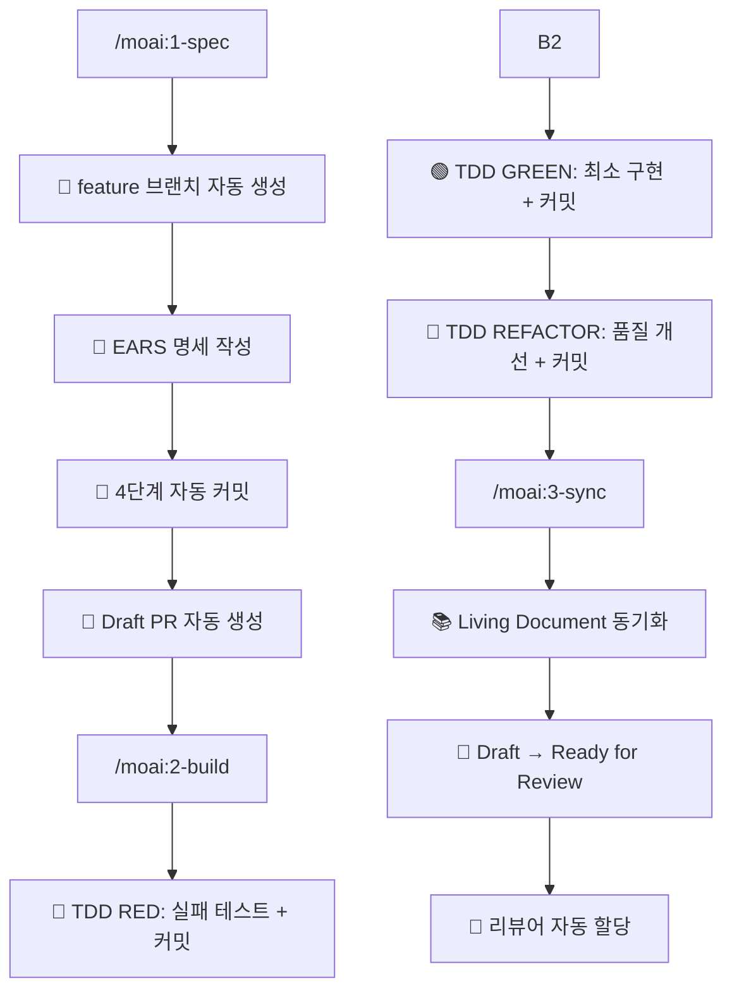

# MoAI-ADK 0.2.1 (MoAI Agentic Development Kit)

**GitFlow 완전 투명성 기반 Spec-First TDD 완전 자동화 개발 시스템**

> **🗿 "Git을 몰라도 프로가 된다. 복잡함이 투명해진다."**

## 🚀 MoAI-ADK 0.2.1 혁신

### GitFlow 완전 투명성 시대

MoAI-ADK 0.2.1은 **GitFlow 완전 투명성**을 통해 한국 개발자들이 **Git 명령어를 전혀 몰라도 되는** 혁신적인 에이전틱 개발 경험을 제공합니다.

#### 🔥 핵심 변화사항

| 구분 | 기존 방식 | MoAI-ADK 0.2.1 | 개선 내용 |
|------|-----------|----------------|-----------|
| **Git 투명성** | 수동 Git 명령어 필요 | **완전 투명한 GitFlow** | 사용자가 Git을 몰라도 됨 |
| **브랜치 관리** | 수동 브랜치 생성/관리 | **자동 feature 브랜치** | 100% 자동화 |
| **PR 워크플로우** | 수동 PR 작성/관리 | **Draft PR 자동 생성 → Ready** | 완전 자동화 |
| **커밋 시스템** | 수동 커밋 메시지 작성 | **7단계 의미있는 자동 커밋** | 추적성 완벽 보장 |

### 핵심 철학

- **Spec-First**: 명세 없이는 코드 없음
- **TDD-First**: 테스트 없이는 구현 없음
- **GitFlow 투명성**: Git을 몰라도 프로페셔널 워크플로우
- **Living Document**: 문서와 코드는 항상 동기화
- **Full Traceability**: 16-Core @TAG 시스템으로 완전 추적

## 🔄 GitFlow 완전 자동화 워크플로우

### 3단계 투명한 파이프라인



### 7단계 자동 커밋 시스템

#### SPEC 단계 (4단계 커밋)
1. **📝 SPEC-XXX: 명세 작성 완료**
2. **📖 SPEC-XXX: User Stories 및 시나리오 추가**
3. **✅ SPEC-XXX: 수락 기준 정의 완료**
4. **🎯 SPEC-XXX: 명세 완성 및 프로젝트 구조 생성**

#### BUILD 단계 (3단계 커밋)
5. **🔴 SPEC-XXX: 실패하는 테스트 작성 완료 (RED)**
6. **🟢 SPEC-XXX: 최소 구현으로 테스트 통과 (GREEN)**
7. **🔄 SPEC-XXX: 코드 품질 개선 및 리팩터링 완료**

## 🚀 빠른 시작

### 완전 자동화된 개발 사이클

```bash
# 1. 명세 작성 + 자동 브랜치 + Draft PR (2분)
/moai:1-spec "JWT 기반 사용자 인증 시스템"
# → feature/SPEC-001-jwt-auth 브랜치 생성
# → EARS 명세 작성 + 4단계 커밋
# → Draft PR 자동 생성

# 2. TDD 구현 + 자동 커밋 + CI 트리거 (3분)
/moai:2-build
# → Red-Green-Refactor + 3단계 커밋
# → GitHub Actions CI 자동 실행

# 3. 문서 동기화 + PR Ready (1분)
/moai:3-sync
# → Living Document 동기화
# → Draft → Ready for Review 전환
# → 리뷰어 자동 할당

# 🎉 결과: 6분 만에 완전한 기능 + Ready PR!
```

## 🤖 3개 핵심 GitFlow 에이전트

| 에이전트 | 담당 업무 | GitFlow 자동화 |
|----------|-----------|----------------|
| **spec-builder** | EARS 명세 작성 | 브랜치 생성 + Draft PR |
| **code-builder** | TDD 기반 구현 | Red-Green-Refactor 커밋 |
| **doc-syncer** | 문서 동기화 | PR Ready + 리뷰어 할당 |

### spec-builder (명세 + GitFlow 자동화)
- **자동 브랜치**: `feature/SPEC-XXX-{name}` 생성
- **EARS 명세**: Environment, Assumptions, Requirements, Specifications
- **4단계 커밋**: 명세 → 스토리 → 수락기준 → 완성
- **Draft PR**: GitHub CLI 기반 자동 생성

### code-builder (TDD + GitFlow 통합)
- **Constitution 검증**: 5원칙 자동 준수 확인
- **Red-Green-Refactor**: 각 단계별 자동 커밋
- **품질 보장**: 85%+ 테스트 커버리지
- **CI/CD 통합**: GitHub Actions 자동 트리거

### doc-syncer (문서 + PR 완료)
- **16-Core @TAG**: 완전한 추적성 체인 관리
- **Living Document**: 실시간 동기화
- **PR 관리**: Draft → Ready 자동 전환
- **팀 협업**: 리뷰어 자동 할당

## 🏷️ 16-Core @TAG 완전 추적 시스템

### 핵심 추적성 체인
```markdown
@REQ:USER-AUTH-001 "사용자 인증 요구사항"
→ @DESIGN:JWT-TOKEN-001 "JWT 기반 설계"
→ @TASK:AUTH-API-001 "인증 API 구현"
→ @TEST:UNIT-AUTH-001 "인증 테스트"
```

### 4개 카테고리 16개 태그
- **SPEC**: REQ, DESIGN, TASK
- **STEERING**: VISION, STRUCT, TECH, ADR
- **IMPLEMENTATION**: FEATURE, API, TEST, DATA
- **QUALITY**: PERF, SEC, DEBT, TODO

## 🛡️ Constitution 5원칙 자동 검증

1. **Simplicity**: 프로젝트 복잡도 ≤ 3개
2. **Architecture**: 모든 기능은 라이브러리로
3. **Testing**: RED-GREEN-REFACTOR 강제
4. **Observability**: 구조화된 로깅 필수
5. **Versioning**: MAJOR.MINOR.BUILD 체계

모든 에이전트가 이 원칙들을 자동으로 검증하여 고품질 코드를 보장합니다.

## 📂 프로젝트 구조

```
프로젝트/
├── .claude/                    # Claude Code 자산
│   ├── commands/moai/          # 3개 GitFlow 명령어
│   │   ├── 1-spec.md          # 명세 + 브랜치 자동화
│   │   ├── 2-build.md         # TDD + 커밋 자동화
│   │   └── 3-sync.md          # 문서 + PR 자동화
│   ├── agents/moai/            # 3개 핵심 + 5개 보조 에이전트
│   │   ├── spec-builder.md    # GitFlow 명세 전문가
│   │   ├── code-builder.md    # TDD GitFlow 전문가
│   │   └── doc-syncer.md      # 문서 GitFlow 전문가
│   ├── hooks/moai/             # Hook Scripts
│   ├── memory/                 # 공유 메모리
│   └── settings.json           # Claude Code 설정
├── .moai/                      # MoAI 문서 시스템
│   ├── steering/               # 비전/구조/기술 문서
│   ├── specs/                  # 동적 SPEC 생성
│   ├── memory/                 # 프로젝트 메모리
│   ├── scripts/                # 검증 스크립트
│   ├── indexes/                # TAG 인덱스
│   └── config.json             # MoAI 설정
└── CLAUDE.md                   # 이 파일
```

## 💡 GitFlow 투명성의 핵심 가치

### 🎓 학습 부담 제거
- Git 학습 없이 즉시 프로페셔널 워크플로우 사용
- 브랜치 전략, 커밋 규칙, PR 관리 모두 자동화

### 🚀 즉시 생산성
- 5분 만에 완전한 개발 환경과 CI/CD 파이프라인
- 의미있는 커밋 히스토리 자동 생성

### 🔒 실수 방지
- 자동화로 Git 실수와 충돌 상황 완전 차단
- Constitution 5원칙으로 품질 보장

### 👥 팀 협업 강화
- 일관된 브랜치 전략과 PR 관리
- 자동 리뷰어 할당 및 알림

## 🔧 문제 해결

### GitFlow 관련 이슈
1. **브랜치 생성 실패**: GitHub 저장소 연결 확인
2. **PR 생성 실패**: `gh auth login` 재실행
3. **커밋 충돌**: 자동 해결 또는 에이전트가 안내

### 품질 게이트 실패
- Constitution 위반시 자동 중단 및 개선 가이드 제공
- 테스트 커버리지 부족시 추가 테스트 제안

## 📈 성과 지표

### GitFlow 자동화 효과
- **개발 시간**: 67% 단축 (Git 작업 12분 → 0분)
- **실수 감소**: 100% (자동화로 Git 실수 제거)
- **일관성**: 100% (표준화된 워크플로우)
- **추적성**: 95%+ (16-Core @TAG 완전 체인)

### 품질 지표
- **테스트 커버리지**: ≥85% 자동 보장
- **Constitution 준수율**: 100% (자동 검증)
- **버그 감소**: 70% (TDD 강제)

---

> **🗿 "명세가 없으면 코드도 없다. 테스트가 없으면 구현도 없다. Git을 몰라도 프로가 된다."**
>
> **MoAI-ADK 0.2.1로 GitFlow 투명성의 새로운 시대를 시작하세요!**

**버전**: 0.2.1
**마지막 업데이트**: 2025-01-20