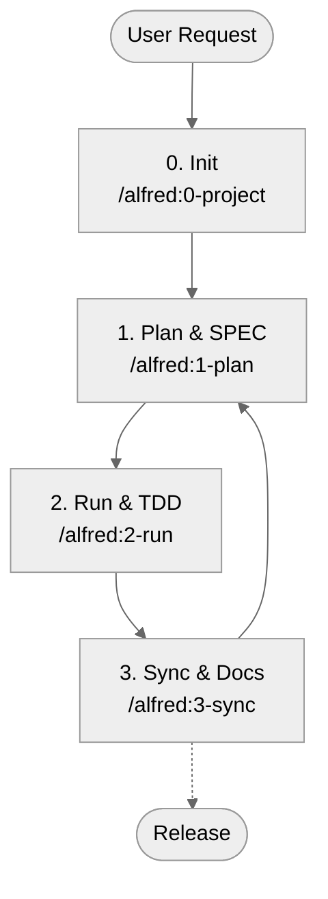

# MoAI-ADK (Agentic Development Kit)

[](https://pypi.org/project/moai-adk/)
[](https://opensource.org/licenses/MIT)
[](https://www.python.org/)
[](https://github.com/modu-ai/moai-adk/actions/workflows/moai-gitflow.yml)
[](https://codecov.io/gh/modu-ai/moai-adk)
[](https://github.com/modu-ai/moai-adk)

> **MoAI-ADK delivers a seamless development workflow that connects SPEC → TEST (TDD) → code → documentation with AI by your side.**

---

## 1. MoAI-ADK at a Glance

| Question | Quick Link |
| --- | --- |
| New here—what is it? | [What is MoAI-ADK?](#what-is-moai-adk) |
| How do I get started? | [5-Minute Quick Start](#5-minute-quick-start) |
| Curious about the core flow? | [Core Workflow (0 → 3)](#core-workflow-0--3) |
| What do Plan / Run / Sync commands do? | [Command Cheat Sheet](#command-cheat-sheet) |
| What are SPEC, TDD, TAG? | [Key Concepts at a Glance](#key-concepts-at-a-glance) |
| Tell me about agents/Skills | [Sub-agents & Skills Overview](#sub-agents--skills-overview) |
| Want to dive deeper? | [Additional Resources](#additional-resources) |

---

## What is MoAI-ADK?

MoAI-ADK (MoAI Agentic Development Kit) is an **open-source toolkit that brings AI into every step of your development workflow.** Alfred SuperAgent enforces the principle of “draft the SPEC first, validate with tests (TDD), and keep docs and code in sync” on your behalf.

If you are just getting started, remember three things:

1. State **what you want to build (SPEC)** upfront.
2. **Write tests first (TDD)** before filling in the implementation.
3. Keep **documentation/README/CHANGELOG** updated automatically.

Repeat these steps with the four `/alfred` commands and your project will stay coherent end to end.

---

## Why do you need it?

| Pain Point | How MoAI-ADK helps |
| --- | --- |
| “I can’t fully trust AI-generated code.” | SPEC → TEST → IMPLEMENTATION → DOCS are chained with TAGs. |
| “I keep asking the same questions because context is missing.” | Alfred retains key documents and history and guides you back. |
| “Prompting is hard.” | `/alfred` commands and packaged Skills supply standardized prompts. |
| “Docs and code drift apart.” | `/alfred:3-sync` automatically aligns README/CHANGELOG/Living Docs. |

---

## 5-Minute Quick Start

```bash
# 1. (Optional) Install uv — a much faster Python package manager than pip
curl -LsSf https://astral.sh/uv/install.sh | sh

# 2. Install MoAI-ADK (tool mode: isolated global execution)
uv tool install moai-adk

# 3. Start a new project
moai-adk init my-project
cd my-project

# 4. Invoke Alfred from Claude Code (or CLI)
claude  # Run Claude Code and use the command below
/alfred:0-project "Project Name"
```

> 🔍 Verification command: `moai-adk doctor` — checks Python/uv versions, `.moai/` structure, and availability of agents/Skills.

---

## Keeping MoAI-ADK Up-to-Date

### Check the current version
```bash
# Check the installed version
moai-adk --version

# Check the latest version on PyPI
uv tool list  # Shows the current version of moai-adk
```

### Upgrade

#### Option 1: Upgrade a single tool (recommended)
```bash
# Upgrade only moai-adk to the latest version
uv tool upgrade moai-adk
```

#### Option 2: Upgrade every installed tool
```bash
# Update all uv tool entries to their latest versions
uv tool update
```

#### Option 3: Install a specific version
```bash
# Reinstall a specific version (e.g., 0.4.2)
uv tool install moai-adk==0.4.2
```

### Validate after updating
```bash
# Check the installed version
moai-adk --version

# Make sure the project still works
moai-adk doctor

# Apply new templates to an existing project (optional)
moai-adk init .  # Keeps your code; refreshes only the .moai/ structure
```

> 💡 **Tip**: When a major or minor release drops, run `moai-adk init .` to bring in the latest agents/Skills/templates. Your existing code and customizations stay intact.

---

## Core Workflow (0 → 3)

Alfred orchestrates your project with four commands.



### 0. INIT — Prepare the project
- Interviews for intro, target audience, language, mode (locale)
- Auto-generates `.moai/config.json` and five `.moai/project/*` documents
- Detects language and assembles recommended Skill Packs (Foundation + Essentials + Domain/Language)
- Cleans templates, performs initial Git/backup checks

### 1. PLAN — Build alignment
- Drafts SPECs in EARS format (`@SPEC:ID` included) via `/alfred:1-plan`
- Produces Plan Board, implementation ideas, and risk assessment
- Auto-creates branches and Draft PRs in Team mode

### 2. RUN — Test-Driven Development
- Phase 1 `implementation-planner`: designs libraries, folders, TAG layout
- Phase 2 `tdd-implementer`: executes RED (failing test) → GREEN (minimal code) → REFACTOR
- `quality-gate` enforces TRUST 5 rules and checks coverage deltas

### 3. SYNC — Documentation & PR curation
- Syncs Living Docs, README, CHANGELOG, etc.
- Validates the TAG chain and recovers orphan TAGs
- Generates Sync Reports, flips Draft → Ready for Review, supports `--auto-merge`

---

## Command Cheat Sheet

| Command | What it does | Key Outputs |
| --- | --- | --- |
| `/alfred:0-project` | Collects project description, creates configs/docs, recommends Skills | `.moai/config.json`, `.moai/project/*`, initial report |
| `/alfred:1-plan <description>` | Analyzes requirements, drafts SPEC, builds Plan Board | `.moai/specs/SPEC-*/spec.md`, plan/acceptance docs, feature branch |
| `/alfred:2-run <SPEC-ID>` | Runs TDD, handles tests/implementation/refactor, verifies quality | `tests/`, `src/` implementations, quality report, TAG links |
| `/alfred:3-sync` | Syncs docs/README/CHANGELOG, consolidates TAG/PR status | `docs/`, `.moai/reports/sync-report.md`, ready-for-review PR |

> ❗ Every command follows the **Phase 0 (optional) → Phase 1 → Phase 2 → Phase 3** loop. Alfred reports current status and next-step suggestions automatically.

---

## Key Concepts at a Glance

### SPEC-First
- **Why?** You need a blueprint before building a house; gather requirements before coding.
- **How?** `/alfred:1-plan` produces SPECs in EARS format with a “WHEN… THEN…” structure.
- **Outcome:** A document tagged with `@SPEC:ID` + Plan Board + Acceptance criteria.

### TDD (Test-Driven Development)
- **RED**: Write a failing test first.
- **GREEN**: Implement the simplest code that makes it pass.
- **REFACTOR**: Polish the structure and remove duplication.
- `/alfred:2-run` automates the flow and logs RED/GREEN/REFACTOR commits.

### TAG System
- Connects `@SPEC:ID` → `@TEST:ID` → `@CODE:ID` → `@DOC:ID`.
- Search for a TAG anywhere to find related SPECs, tests, and docs instantly.
- `/alfred:3-sync` checks the TAG inventory and flags orphans.

### TRUST 5 Principles
1. **Test First** — Always start with tests.
2. **Readable** — Keep functions short and style consistent.
3. **Unified** — Align architecture, types, and contracts.
4. **Secured** — Validate inputs, protect secrets, run static analysis.
5. **Trackable** — TAGs, Git history, and docs move together.

> See `.moai/memory/development-guide.md` for the full rules.

---

## First Hands-on: Todo API Example

1. **Plan**
   ```bash
   /alfred:1-plan "API for adding, listing, updating, deleting todos"
   ```
   Alfred produces the SPEC (`.moai/specs/SPEC-TODO-001/spec.md`) plus plan/acceptance docs.

2. **Run**
   ```bash
   /alfred:2-run TODO-001
   ```
   Tests (`tests/test_todo_api.py`), implementation (`src/todo/`), and reports are created automatically.

3. **Sync**
   ```bash
   /alfred:3-sync
   ```
   Updates `docs/api/todo.md`, the TAG chain, and the Sync Report.

4. **Verification commands**
   ```bash
   rg '@(SPEC|TEST|CODE|DOC):TODO-001' -n
   pytest tests/test_todo_api.py -v
   cat docs/api/todo.md
   ```

> In 15 minutes you can ship a Todo API with SPEC → TDD → docs all linked together.

---

## Sub-agents & Skills Overview

Alfred combines **a 19-member team** (1 SuperAgent + 10 core sub-agents + 6 init sub-agents + 2 built-ins) with **44 Claude Skills**.

### Core Sub-agents (Plan → Run → Sync)

| Sub-agent | Model | Role |
| --- | --- | --- |
| project-manager 📋 | Sonnet | Project initialization, metadata interviews |
| spec-builder 🏗️ | Sonnet | Plan board creation, EARS SPEC drafting |
| code-builder 💎 | Sonnet | Runs `implementation-planner` + `tdd-implementer` for complete TDD |
| doc-syncer 📖 | Haiku | Syncs Living Docs, README, CHANGELOG |
| tag-agent 🏷️ | Haiku | Manages TAG inventory, detects orphans |
| git-manager 🚀 | Haiku | Handles GitFlow, Draft/Ready states, Auto Merge |
| debug-helper 🔍 | Sonnet | Diagnoses failures, suggests fix-forward strategies |
| trust-checker ✅ | Haiku | Enforces TRUST 5 quality gates |
| quality-gate 🛡️ | Haiku | Reviews coverage deltas and release blockers |
| cc-manager 🛠️ | Sonnet | Optimizes Claude Code sessions, deploys Skills |

### Skills (Progressive Disclosure)
- **Foundation (6)**: TRUST, TAG, SPEC, EARS, Git, Language detection
- **Essentials (4)**: Debug, Refactor, Review, Performance
- **Domain (10)**: Backend, Web API, Security, Data, Mobile, etc.
- **Language (23)**: Python, TypeScript, Go, Rust, Java, Swift, and more
- **Claude Code Ops (1)**: Session configuration, output style management

> Skills live in `.claude/skills/` as concise guides under 500 words. They load on demand to save context tokens.

---

## AI Model Selection Guide

| Scenario | Default Model | Why |
| --- | --- | --- |
| Specifications, design, refactoring, problem solving | **Claude 4.5 Sonnet** | Excels at deep reasoning and structured writing |
| Document sync, TAG checks, Git automation | **Claude 4.5 Haiku** | Great for rapid iterations and string-heavy tasks |

- Start with Haiku for patterned tasks; switch to Sonnet when nuanced judgment is required.
- If you switch models manually, document why—it helps teammates follow your reasoning.

---

## Frequently Asked Questions (FAQ)

- **Q. Can I install it on an existing project?**  
  A. Yes. Run `moai-adk init .` to add the `.moai/` structure without touching your code.
- **Q. How do I run tests?**  
  A. `/alfred:2-run` triggers them first; rerun `pytest`, `pnpm test`, etc., as needed.
- **Q. How can I confirm docs stay current?**  
  A. `/alfred:3-sync` produces a Sync Report—check it in your Pull Requests.
- **Q. Can I work manually?**  
  A. You can, but keep the SPEC → TEST → CODE → DOC order and always leave TAGs.

---

## Additional Resources

| Goal | Resource |
| --- | --- |
| Skill directory | `docs/skills/overview.md` and tiered docs |
| Sub-agent details | `docs/agents/overview.md` |
| Workflow guides | `docs/guides/workflow/` (Plan/Run/Sync) |
| Development guardrails | `.moai/memory/development-guide.md`, `.moai/memory/spec-metadata.md` |
| Release roadmap | `CHANGELOG.md`, `UPDATE-PLAN-0.4.0.md` |

---

## Community & Support

- GitHub Repo: <https://github.com/modu-ai/moai-adk>
- Issues & Discussions: Bug reports, feature requests, and ideas are welcome.
- PyPI: <https://pypi.org/project/moai-adk/>
- Contact: See `CONTRIBUTING.md` for contribution guidelines.

> 🙌 “No SPEC, no CODE.” Join Alfred for a consistent AI-driven development culture.

