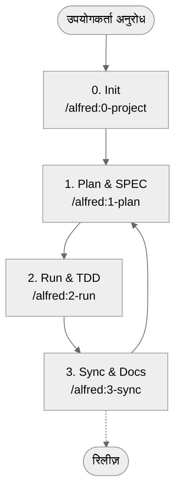

# MoAI-ADK (Agentic Development Kit)

[](https://pypi.org/project/moai-adk/)
[](https://opensource.org/licenses/MIT)
[](https://www.python.org/)
[](https://github.com/modu-ai/moai-adk/actions/workflows/moai-gitflow.yml)
[](https://codecov.io/gh/modu-ai/moai-adk)
[](https://github.com/modu-ai/moai-adk)

> **MoAI-ADK AI की मदद से SPEC → TEST (TDD) → कोड → दस्तावेज़ को सहजता से जोड़ने वाला विकास वर्कफ़्लो देता है।**

---

## 1. MoAI-ADK एक नज़र में

| प्रश्न | त्वरित लिंक |
| --- | --- |
| पहली बार देख रहा हूं, यह क्या है? | [MoAI-ADK क्या है?](#moai-adk-क्या-है) |
| शुरुआत कैसे करूं? | [5 मिनट का क्विक स्टार्ट](#5-मिनट-का-क्विक-स्टार्ट) |
| मूल प्रवाह देखना है | [कोर वर्कफ़्लो (0 → 3)](#कोर-वर्कफ़्लो-0--3) |
| Plan / Run / Sync क्या करते हैं? | [मुख्य कमांड सार](#मुख्य-कमांड-सार) |
| SPEC, TDD, TAG क्या हैं? | [महत्वपूर्ण अवधारणाएँ](#महत्वपूर्ण-अवधारणाएँ) |
| एजेंट/Skills के बारे में जानना है | [Sub-agent और Skills अवलोकन](#sub-agent-और-skills-अवलोकन) |
| और गहराई में पढ़ना चाहता हूं | [अतिरिक्त संसाधन](#अतिरिक्त-संसाधन) |

---

## MoAI-ADK क्या है?

MoAI-ADK (MoAI Agentic Development Kit) एक **ओपन-सोर्स टूलकिट** है जो विकास प्रक्रिया के हर चरण में AI को शामिल करता है। Alfred SuperAgent आपकी ओर से “पहले SPEC लिखें, TDD से सत्यापित करें, और दस्तावेज़ व कोड को सिंक रखें” के सिद्धांत को लागू करता है।

शुरुआत कर रहे हैं तो बस इन तीन बातों को याद रखें:

1. पहले स्पष्ट करें कि **क्या बनाना है (SPEC)**।
2. **हमेशा टेस्ट पहले लिखें (TDD)** और फिर कोड भरें।
3. सिस्टम को **दस्तावेज़/README/CHANGELOG** ऑटो-अपडेट करने दें।

इन चार `/alfred` कमांड के साथ यह चक्र दोहराएं और पूरा प्रोजेक्ट संगठित बना रहेगा।

---

## इसकी ज़रूरत क्यों है?

| परेशानी | MoAI-ADK कैसे मदद करता है |
| --- | --- |
| “AI का लिखा कोड भरोसेमंद नहीं लगता” | SPEC → TEST → IMPLEMENTATION → DOCS को TAG चेन से जोड़ा जाता है। |
| “कॉन्टेक्स्ट न होने से बार-बार वही सवाल करना पड़ता है” | Alfred मुख्य दस्तावेज़ और इतिहास याद रखता है और दोबारा मार्गदर्शन देता है। |
| “प्रॉम्प्ट लिखना मुश्किल है” | `/alfred` कमांड और तैयार Skills मानकीकृत प्रॉम्प्ट देते हैं। |
| “डॉक्यूमेंट और कोड में अंतर आ जाता है” | `/alfred:3-sync` README/CHANGELOG/Living Doc को अपने आप सिंक करता है। |

---

## 5 मिनट का क्विक स्टार्ट

```bash
# 1. (वैकल्पिक) uv इंस्टॉल करें — pip से कहीं तेज़ Python पैकेज मैनेजर
curl -LsSf https://astral.sh/uv/install.sh | sh

# 2. MoAI-ADK इंस्टॉल करें (tool मोड: पृथक ग्लोबल रन)
uv tool install moai-adk

# 3. नया प्रोजेक्ट शुरू करें
moai-adk init my-project
cd my-project

# 4. Claude Code (या CLI) से Alfred कॉल करें
claude  # Claude Code चलाएं और नीचे का कमांड उपयोग करें
/alfred:0-project "प्रोजेक्ट का नाम"
```

> 🔍 जांच कमांड: `moai-adk doctor` — Python/uv वर्ज़न, `.moai/` संरचना, और एजेंट/Skills की उपलब्धता सत्यापित करता है।

---

## MoAI-ADK को अपडेटेड रखें

### वर्तमान वर्ज़न देखें
```bash
# इंस्टॉल्ड वर्ज़न देखें
moai-adk --version

# PyPI पर नवीनतम वर्ज़न देखें
uv tool list  # moai-adk का वर्तमान वर्ज़न दिखाता है
```

### अपग्रेड करें

#### तरीका 1: सिर्फ एक टूल अपग्रेड करें (अनुशंसित)
```bash
# केवल moai-adk को नवीनतम वर्ज़न पर लाएं
uv tool upgrade moai-adk
```

#### तरीका 2: सभी इंस्टॉल्ड टूल अपग्रेड करें
```bash
# uv tool में मौजूद सभी टूल्स अपडेट करें
uv tool update
```

#### तरीका 3: किसी विशिष्ट वर्ज़न को इंस्टॉल करें
```bash
# चुना हुआ वर्ज़न इंस्टॉल करें (उदा. 0.4.2)
uv tool install moai-adk==0.4.2
```

### अपग्रेड के बाद सत्यापन
```bash
# इंस्टॉल्ड वर्ज़न पुनः देखें
moai-adk --version

# सुनिश्चित करें कि प्रोजेक्ट सही चल रहा है
moai-adk doctor

# (वैकल्पिक) पुराने प्रोजेक्ट में नए टेम्पलेट लागू करें
moai-adk init .  # कोड जस का तस, केवल .moai/ संरचना रिफ्रेश
```

> 💡 **Tip**: जब भी बड़ा (minor/major) अपडेट आए, `moai-adk init .` चलाएँ ताकि नवीनतम एजेंट/Skills/टेम्पलेट मिल सकें। मौजूदा कोड और कस्टमाइज़ेशन सुरक्षित रहते हैं।

---

## कोर वर्कफ़्लो (0 → 3)

Alfred चार कमांड से प्रोजेक्ट को आगे बढ़ाता है।



### 0. INIT — प्रोजेक्ट तैयारी
- परिचय, लक्ष्य समूह, भाषा, मोड (locale) का साक्षात्कार
- `.moai/config.json` और पाँच `.moai/project/*` दस्तावेज़ ऑटो-जनरेट
- भाषा पहचान और अनुशंसित Skill Pack (Foundation + Essentials + Domain/Language) लागू
- टेम्पलेट साफ़-सफाई, आरंभिक Git/बैकअप जाँच

### 1. PLAN — दिशा तय करना
- `/alfred:1-plan` EARS फ़ॉर्मेट में SPEC (`@SPEC:ID` सहित) तैयार करता है
- Plan Board, कार्यान्वयन विचार और जोखिम सूची बनती है
- टीम मोड में ब्रांच और Draft PR अपने आप बनते हैं

### 2. RUN — टेस्ट-ड्रिवन विकास
- फेज़ 1 `implementation-planner`: लाइब्रेरी, फ़ोल्डर, TAG डिज़ाइन
- फेज़ 2 `tdd-implementer`: RED (फेल टेस्ट) → GREEN (न्यूनतम कोड) → REFACTOR
- `quality-gate` TRUST 5 सिद्धांत और कवरेज परिवर्तन पर नज़र रखता है

### 3. SYNC — दस्तावेज़ और PR समन्वय
- Living Doc, README, CHANGELOG आदि को सिंक करना
- TAG चेन सत्यापित करना और अलग-थलग TAG वापस जोड़ना
- Sync Report बनाना, Draft → Ready for Review करना, `--auto-merge` सपोर्ट

---

## मुख्य कमांड सार

| कमांड | क्या करता है | मुख्य आउटपुट |
| --- | --- | --- |
| `/alfred:0-project` | प्रोजेक्ट विवरण इकट्ठा करता है, कॉन्फ़िग/दस्तावेज़ बनाता है, Skills सुझाता है | `.moai/config.json`, `.moai/project/*`, प्रारंभिक रिपोर्ट |
| `/alfred:1-plan <विवरण>` | आवश्यकताओं का विश्लेषण, SPEC ड्राफ्ट, Plan Board तैयार | `.moai/specs/SPEC-*/spec.md`, plan/acceptance दस्तावेज़, फीचर ब्रांच |
| `/alfred:2-run <SPEC-ID>` | TDD चलाता है, टेस्ट/इम्प्लिमेंटेशन/रीफ़ैक्टर संभालता है, गुणवत्ता जांचता है | `tests/`, `src/` इम्प्लिमेंटेशन, गुणवत्ता रिपोर्ट, TAG लिंक |
| `/alfred:3-sync` | दस्तावेज़/README/CHANGELOG सिंक, TAG/PR स्थिति समेकित | `docs/`, `.moai/reports/sync-report.md`, समीक्षा के लिए तैयार PR |

> ❗ हर कमांड **Phase 0 (वैकल्पिक) → Phase 1 → Phase 2 → Phase 3** चक्र का पालन करता है। Alfred वर्तमान स्थिति और अगला कदम अपने आप बताता है।

---

## महत्वपूर्ण अवधारणाएँ

### SPEC-First
- **क्यों?** जैसे घर बनाने से पहले नक्शा चाहिए, वैसे ही कोड से पहले आवश्यकताएँ तय हों।
- **कैसे?** `/alfred:1-plan` “WHEN… THEN…” संरचना वाले EARS SPEC तैयार करता है।
- **परिणाम:** `@SPEC:ID` टैग, Plan Board, और स्वीकृति मानदंड वाला दस्तावेज़।

### TDD (Test-Driven Development)
- **RED**: पहले फेल होने वाला टेस्ट लिखें।
- **GREEN**: टेस्ट पास कराने के लिए न्यूनतम कोड लिखें।
- **REFACTOR**: संरचना सुधारें और दोहराव हटाएँ।
- `/alfred:2-run` पूरा फ्लो ऑटोमेट कर RED/GREEN/REFACTOR लॉग बनाता है।

### TAG प्रणाली
- `@SPEC:ID` → `@TEST:ID` → `@CODE:ID` → `@DOC:ID` को जोड़ती है।
- किसी भी TAG को खोजने पर सम्बंधित SPEC, टेस्ट, दस्तावेज़ तुरंत मिलते हैं।
- `/alfred:3-sync` TAG इन्वेंट्री की जाँच कर अलग-थलग TAG की सूचना देता है।

### TRUST 5 सिद्धांत
1. **Test First** — हर बार टेस्ट से शुरुआत करें
2. **Readable** — छोटे, स्पष्ट फ़ंक्शन और सुसंगत शैली रखें
3. **Unified** — आर्किटेक्चर, टाइप और कॉन्ट्रैक्ट में एकरूपता रखें
4. **Secured** — इनपुट वैलिडेशन, संवेदनशील जानकारी की सुरक्षा, स्टैटिक एनालिसिस
5. **Trackable** — TAG, Git इतिहास और दस्तावेज़ साथ-साथ आगे बढ़ें

> विस्तृत नियम `.moai/memory/development-guide.md` में उपलब्ध हैं।

---

## पहला अभ्यास: Todo API उदाहरण

1. **Plan**
   ```bash
   /alfred:1-plan "टू-डू जोड़ने, देखने, अपडेट करने, हटाने का API"
   ```
   Alfred `.moai/specs/SPEC-TODO-001/spec.md` सहित SPEC और plan/acceptance दस्तावेज़ बनाता है।

2. **Run**
   ```bash
   /alfred:2-run TODO-001
   ```
   टेस्ट (`tests/test_todo_api.py`), इम्प्लिमेंटेशन (`src/todo/`), और रिपोर्ट अपने आप बनते हैं।

3. **Sync**
   ```bash
   /alfred:3-sync
   ```
   `docs/api/todo.md`, TAG चेन और Sync Report अपडेट होते हैं।

4. **सत्यापन कमांड**
   ```bash
   rg '@(SPEC|TEST|CODE|DOC):TODO-001' -n
   pytest tests/test_todo_api.py -v
   cat docs/api/todo.md
   ```

> सिर्फ 15 मिनट में SPEC → TDD → दस्तावेज़ जुड़े हुए Todo API तैयार हो जाता है।

---

## Sub-agent और Skills अवलोकन

Alfred में **19 सदस्यों की टीम** (1 SuperAgent + 10 कोर Sub-agent + 6 init Sub-agent + 2 बिल्ट-इन) और **44 Claude Skills** शामिल हैं।

### कोर Sub-agent (Plan → Run → Sync)

| Sub-agent | मॉडल | भूमिका |
| --- | --- | --- |
| project-manager 📋 | Sonnet | प्रोजेक्ट इनिशियलाइज़ेशन और मेटाडेटा साक्षात्कार |
| spec-builder 🏗️ | Sonnet | Plan Board निर्माण और EARS SPEC लेखन |
| code-builder 💎 | Sonnet | `implementation-planner` + `tdd-implementer` से पूर्ण TDD |
| doc-syncer 📖 | Haiku | Living Doc, README, CHANGELOG सिंक करता है |
| tag-agent 🏷️ | Haiku | TAG इन्वेंट्री प्रबंधन और अनाथ TAG का पता |
| git-manager 🚀 | Haiku | GitFlow, Draft/Ready स्थिति, Auto Merge सँभालता है |
| debug-helper 🔍 | Sonnet | विफलता विश्लेषण और fix-forward रणनीति देता है |
| trust-checker ✅ | Haiku | TRUST 5 क्वालिटी गेट लागू करता है |
| quality-gate 🛡️ | Haiku | कवरेज बदलाव और रिलीज़ अवरोध जाँचता है |
| cc-manager 🛠️ | Sonnet | Claude Code सत्र को अनुकूलित करता है और Skills तैनात करता है |

### Skills (ज़रूरत पड़ने पर लोड)
- **Foundation (6)**: TRUST, TAG, SPEC, EARS, Git, भाषा पहचान
- **Essentials (4)**: Debug, Refactor, Review, Performance
- **Domain (10)**: Backend, Web API, Security, Data, Mobile आदि
- **Language (23)**: Python, TypeScript, Go, Rust, Java, Swift सहित प्रमुख भाषाएँ
- **Claude Code Ops (1)**: सत्र कॉन्फ़िगरेशन और आउटपुट स्टाइल प्रबंधन

> Skills `.claude/skills/` में 500 शब्दों से कम गाइड के रूप में होते हैं। ज़रूरत पड़ने पर ही लोड होते हैं ताकि संदर्भ लागत घटे।

---

## AI मॉडल चयन गाइड

| परिदृश्य | डिफ़ॉल्ट मॉडल | कारण |
| --- | --- | --- |
| स्पेक लिखना, डिज़ाइन, रिफ़ैक्टरिंग, समस्या समाधान | **Claude 4.5 Sonnet** | गहरी तर्कशक्ति और संरचित लेखन में उत्कृष्ट |
| दस्तावेज़ सिंक, TAG जाँच, Git ऑटोमेशन | **Claude 4.5 Haiku** | तेज़ पुनरावृत्ति और स्ट्रिंग-हैवी कार्यों के लिए बेहतर |

- पैटर्न वाले कार्य Haiku से शुरू करें, जटिल निर्णय पर Sonnet पर जाएँ।
- यदि मॉडल मैन्युअल रूप से बदलते हैं तो कारण दर्ज करें; टीम सहयोग में मदद मिलेगी।

---

## अक्सर पूछे जाने वाले प्रश्न (FAQ)

- **प्रश्न: क्या मौजूदा प्रोजेक्ट में इंस्टॉल कर सकते हैं?**  
  उत्तर: हाँ। `moai-adk init .` चलाएँ; यह `.moai/` संरचना जोड़ता है, कोड को नहीं छूता।
- **प्रश्न: टेस्ट कैसे चलें?**  
  उत्तर: `/alfred:2-run` पहले चलाता है। आवश्यकता हो तो `pytest`, `pnpm test` आदि दोबारा चलाएँ।
- **प्रश्न: दस्तावेज़ हमेशा अपडेट हैं या नहीं, कैसे देखें?**  
  उत्तर: `/alfred:3-sync` Sync Report बनाता है; Pull Request में देखें।
- **प्रश्न: क्या सब कुछ हाथ से कर सकता हूँ?**  
  उत्तर: कर सकते हैं, पर SPEC → TEST → CODE → DOC क्रम और TAG लगाना अनिवार्य है।

---

## अतिरिक्त संसाधन

| उद्देश्य | संसाधन |
| --- | --- |
| Skills संरचना | `docs/skills/overview.md` और विभिन्न Tier दस्तावेज़ |
| Sub-agent विवरण | `docs/agents/overview.md` |
| वर्कफ़्लो गाइड | `docs/guides/workflow/` (Plan/Run/Sync) |
| विकास दिशानिर्देश | `.moai/memory/development-guide.md`, `.moai/memory/spec-metadata.md` |
| अपडेट योजना | `CHANGELOG.md`, `UPDATE-PLAN-0.4.0.md` |

---

## समुदाय और सहायता

- GitHub रिपोज़िटरी: <https://github.com/modu-ai/moai-adk>
- Issues & Discussions: बग रिपोर्ट, फीचर अनुरोध और विचारों का स्वागत है।
- PyPI: <https://pypi.org/project/moai-adk/>
- संपर्क: योगदान दिशानिर्देश के लिए `CONTRIBUTING.md` देखें।

> 🙌 “SPEC के बिना CODE नहीं” — Alfred के साथ एक संगत AI विकास संस्कृति का अनुभव करें।

