# MoAI-ADK (Agentic Development Kit)

[English](README.md) | [한국어](README.ko.md) | [ไทย](README.th.md) | [日本語](README.ja.md) | [中文](README.zh.md) | [हिन्दी](README.hi.md)

[](https://pypi.org/project/moai-adk/)
[](https://opensource.org/licenses/MIT)
[](https://www.python.org/)
[](https://github.com/modu-ai/moai-adk/actions/workflows/moai-gitflow.yml)
[](https://codecov.io/gh/modu-ai/moai-adk)
[](https://github.com/modu-ai/moai-adk)

> **MoAI-ADK AI के साथ विशिष्टता (SPEC) → परीक्षण (TDD) → कोड → दस्तावेज़ को स्वाभाविक रूप से जोड़ने वाला विकास वर्कफ़्लो प्रदान करता है।**

---

## 1. MoAI-ADK एक नज़र में

MoAI-ADK तीन मुख्य सिद्धांतों के साथ AI सहयोग विकास में क्रांति लाता है। नीचे दिए गए नेविगेशन से आपकी स्थिति के अनुसार उपयुक्त अनुभाग पर जाएं।

यदि आप MoAI-ADK से **पहली बार मिल रहे हैं** तो "MoAI-ADK क्या है?" से शुरू करें।
**जल्दी शुरू करना चाहते हैं?** "5 मिनट Quick Start" पर जाएं।
**पहले से इंस्टॉल किया है और अवधारणा समझना चाहते हैं?** "मुख्य अवधारणाएं आसानी से समझें" की सिफारिश है।

| प्रश्न                                      | सीधे देखें                                                         |
| ------------------------------------------- | ------------------------------------------------------------------ |
| पहली बार मिल रहे हैं, यह क्या है?           | [MoAI-ADK क्या है?](#moai-adk-क्या-है)                             |
| कैसे शुरू करें?                             | [5 मिनट Quick Start](#5-मिनट-quick-start)                          |
| बुनियादी प्रवाह जानना चाहते हैं             | [बुनियादी वर्कफ़्लो (0 → 3)](#बुनियादी-वर्कफ़्लो-0--3)             |
| Plan / Run / Sync कमांड क्या करते हैं?      | [मुख्य कमांड सारांश](#मुख्य-कमांड-सारांश)                          |
| SPEC·TDD·TAG क्या हैं?                      | [मुख्य अवधारणाएं आसानी से समझें](#मुख्य-अवधारणाएं-आसानी-से-समझें)  |
| एजेंट/Skills के बारे में जानना चाहते हैं    | [Sub-agent & Skills अवलोकन](#sub-agent--skills-अवलोकन)             |
| Claude Code Hooks कैसे काम करते हैं?        | [Claude Code Hooks गाइड](#claude-code-hooks-गाइड)                  |
| 4‑सप्ताह हैंड्स‑ऑन प्रोजेक्ट करना चाहते हैं | [दूसरा अभ्यास: Mini Kanban Board](#दूसरा-अभ्यास-mini-kanban-board) |
| और गहराई से अध्ययन करना चाहते हैं           | [अतिरिक्त संसाधन](#अतिरिक्त-संसाधन)                                |

---

## MoAI-ADK क्या है?

### समस्या: AI विकास में विश्वसनीयता संकट

आज कई डेवलपर्स Claude या ChatGPT की मदद चाहते हैं, लेकिन एक मौलिक संदेह को दूर नहीं कर पाते। **"क्या मैं इस AI द्वारा बनाए गए कोड पर वास्तव में भरोसा कर सकता हूं?"**

वास्तविकता यह है: जब AI से कहते हैं "लॉगिन सुविधा बनाओ", तो व्याकरणिक रूप से पूर्ण कोड मिलता है। लेकिन निम्नलिखित समस्याएं बार-बार आती हैं:

- **अस्पष्ट आवश्यकताएं**: "वास्तव में क्या बनाना है?" यह बुनियादी सवाल अनुत्तरित रहता है। ईमेल/पासवर्ड लॉगिन? OAuth? 2FA? सब कुछ अनुमान पर निर्भर है।
- **परीक्षण की कमी**: अधिकांश AI केवल "happy path" का परीक्षण करता है। गलत पासवर्ड? नेटवर्क त्रुटि? 3 महीने बाद production में bug फटता है।
- **दस्तावेज़ असंगति**: कोड बदलता है, दस्तावेज़ वैसा ही रहता है। "यह कोड यहाँ क्यों है?" यह सवाल दोहराया जाता है।
- **संदर्भ की हानि**: एक ही प्रोजेक्ट में भी हर बार शुरू से समझाना पड़ता है। प्रोजेक्ट की संरचना, निर्णय के कारण, पिछले प्रयास रिकॉर्ड नहीं होते।
- **परिवर्तन प्रभाव का पता नहीं**: जब आवश्यकताएं बदलती हैं, तो कौन सा कोड प्रभावित होता है, यह ट्रैक नहीं किया जा सकता।

### समाधान: SPEC-First TDD with Alfred SuperAgent

**MoAI-ADK** (MoAI Agentic Development Kit) इन समस्याओं को **व्यवस्थित रूप से हल** करने के लिए डिज़ाइन किया गया ओपन-सोर्स फ्रेमवर्क है।

मुख्य सिद्धांत सरल लेकिन शक्तिशाली है:

> **"कोड के बिना परीक्षण नहीं, परीक्षण के बिना SPEC नहीं"**

अधिक सटीक रूप से, यह उल्टा क्रम है:

> **"SPEC सबसे पहले आता है। SPEC के बिना परीक्षण नहीं। परीक्षण और कोड के बिना दस्तावेज़ पूर्ण नहीं।"**

जब यह क्रम बनाए रखा जाता है, तो चमत्कारी चीजें होती हैं:

**1️⃣ स्पष्ट आवश्यकताएं**
`/alfred:1-plan` कमांड से SPEC पहले लिखा जाता है। "लॉगिन सुविधा" जैसा अस्पष्ट अनुरोध "WHEN वैध क्रेडेंशियल प्रदान किए जाते हैं तो JWT टोकन जारी किया जाना चाहिए" जैसी **स्पष्ट आवश्यकता** में बदल जाता है। Alfred का spec-builder EARS वाक्यविन्यास का उपयोग करके केवल 3 मिनट में पेशेवर SPEC बनाता है।

**2️⃣ परीक्षण गारंटी**
`/alfred:2-run` स्वचालित रूप से Test-Driven Development (TDD) चलाता है। RED (असफल परीक्षण) → GREEN (न्यूनतम कार्यान्वयन) → REFACTOR (कोड सफाई) के क्रम में, **परीक्षण कवरेज 85% से अधिक की गारंटी** देता है। अब "बाद में परीक्षण" नहीं। परीक्षण कोड लेखन का नेतृत्व करता है।

**3️⃣ दस्तावेज़ स्वचालित समन्वय**
`/alfred:3-sync` एक कमांड से कोड, परीक्षण, दस्तावेज़ सभी **नवीनतम स्थिति में समन्वयित** होते हैं। README, CHANGELOG, API दस्तावेज़, और Living Document तक स्वचालित रूप से अपडेट होते हैं। 6 महीने बाद भी कोड और दस्तावेज़ मेल खाते हैं।

**4️⃣ @TAG प्रणाली से ट्रैकिंग**
सभी कोड, परीक्षण, दस्तावेज़ में `@TAG:ID` लगाया जाता है। बाद में आवश्यकताएं बदलने पर, `rg "@SPEC:AUTH-001"` एक कमांड से संबंधित परीक्षण, कार्यान्वयन, दस्तावेज़ **सभी मिल सकते हैं**। रिफैक्टरिंग में आत्मविश्वास आता है।

**5️⃣ Alfred संदर्भ याद रखता है**
19 AI एजेंट मिलकर प्रोजेक्ट की संरचना, निर्णय के कारण, कार्य इतिहास **सभी याद रखते हैं**। एक ही सवाल दोहराने की जरूरत नहीं।

### MoAI-ADK के मुख्य 3 वादे

शुरुआती लोग भी याद रख सकें, MoAI-ADK का मूल्य 3 बातों में सरल है:

**पहला, SPEC कोड से पहले आता है**
क्या बनाना है यह स्पष्ट रूप से परिभाषित करके शुरू करें। SPEC लिखते समय कार्यान्वयन से पहले समस्या मिल सकती है। टीम के साथ संचार लागत बहुत कम हो जाती है।

**दूसरा, परीक्षण कोड का नेतृत्व करता है (TDD)**
कार्यान्वयन से पहले परीक्षण लिखें (RED)। परीक्षण पास करने के लिए न्यूनतम कार्यान्वयन करें (GREEN)। फिर कोड साफ करें (REFACTOR)। परिणाम: कम बग, रिफैक्टरिंग में आत्मविश्वास, सभी समझ सकें ऐसा कोड।

**तीसरा, दस्तावेज़ और कोड हमेशा मेल खाते हैं**
`/alfred:3-sync` एक कमांड से सभी दस्तावेज़ स्वचालित अपडेट होते हैं। README, CHANGELOG, API दस्तावेज़, Living Document कोड के साथ हमेशा समन्वयित रहते हैं। छह महीने पहले का कोड बदलते समय निराशा नहीं होती।

---

## क्यों आवश्यक है?

### AI विकास की व्यावहारिक चुनौतियां

आधुनिक AI सहयोग विकास विभिन्न चुनौतियों का सामना करता है। MoAI-ADK इन सभी समस्याओं को **व्यवस्थित रूप से हल** करता है:

| चिंता                     | मौजूदा तरीके की समस्या                            | MoAI-ADK का समाधान                                  |
| ------------------------- | ------------------------------------------------- | --------------------------------------------------- |
| "AI कोड पर भरोसा नहीं"    | बिना परीक्षण का कार्यान्वयन, सत्यापन विधि अस्पष्ट | SPEC → TEST → CODE क्रम अनिवार्य, कवरेज 85%+ गारंटी |
| "हर बार वही समझाना"       | संदर्भ हानि, प्रोजेक्ट इतिहास अरिकॉर्ड            | Alfred सभी जानकारी याद रखता है, 19 AI टीम सहयोग     |
| "प्रॉम्प्ट लिखना मुश्किल" | अच्छा प्रॉम्प्ट बनाने का तरीका नहीं पता           | `/alfred` कमांड मानकीकृत प्रॉम्प्ट स्वचालित प्रदान  |
| "दस्तावेज़ हमेशा पुराने"  | कोड बदलने के बाद दस्तावेज़ अपडेट भूल जाते हैं     | `/alfred:3-sync` एक कमांड से स्वचालित समन्वय        |
| "कहां बदला पता नहीं"      | कोड खोज मुश्किल, इरादा अस्पष्ट                    | @TAG श्रृंखला से SPEC → TEST → CODE → DOC कनेक्ट    |
| "टीम ऑनबोर्डिंग समय लंबा" | नए सदस्य कोड संदर्भ नहीं समझ सकते                 | SPEC पढ़ने से इरादा तुरंत समझ आता है                |

### अभी अनुभव किए जा सकने वाले लाभ

MoAI-ADK अपनाने के तुरंत बाद निम्नलिखित महसूस कर सकते हैं:

- **विकास गति बढ़ती है**: स्पष्ट SPEC से दोहराए जाने वाले स्पष्टीकरण का समय कम
- **बग कम होते हैं**: SPEC आधारित परीक्षण से पहले पता लगाना
- **कोड समझ बढ़ती है**: @TAG और SPEC से इरादा तुरंत पता चलता है
- **रखरखाव लागत कम होती है**: कोड और दस्तावेज़ हमेशा मेल खाते हैं
- **टीम सहयोग कुशल होता है**: SPEC और TAG से स्पष्ट संचार

---

## 5 मिनट Quick Start

अब MoAI-ADK से पहला प्रोजेक्ट शुरू करते हैं। नीचे 5 चरणों का पालन करें, तो केवल **5 मिनट में** SPEC, TDD, दस्तावेज़ सभी जुड़ा हुआ प्रोजेक्ट पूरा होता है।

### चरण 1: uv इंस्टॉल करें (लगभग 30 सेकंड)

पहले `uv` इंस्टॉल करें। `uv` Rust में लिखा गया अत्यंत तेज़ Python पैकेज प्रबंधक है। मौजूदा `pip` से **10 गुना तेज़**, और MoAI-ADK के साथ पूरी तरह संगत है।

```bash
# macOS/Linux
curl -LsSf https://astral.sh/uv/install.sh | sh

# Windows (PowerShell)
powershell -c "irm https://astral.sh/uv/install.ps1 | iex"

# इंस्टॉलेशन पुष्टि
uv --version
# आउटपुट: uv 0.x.x
```

**uv क्यों?** MoAI-ADK uv की तेज़ इंस्टॉलेशन गति और स्थिरता का लाभ उठाने के लिए अनुकूलित है। प्रोजेक्ट अलगाव भी पूर्ण है इसलिए अन्य Python वातावरण प्रभावित नहीं होता।

### चरण 2: MoAI-ADK इंस्टॉल करें (लगभग 1 मिनट)

MoAI-ADK को वैश्विक टूल के रूप में इंस्टॉल करें। यह प्रोजेक्ट निर्भरता को प्रभावित नहीं करता।

```bash
# tool मोड में इंस्टॉल (अनुशंसित: अलग वातावरण में चलता है)
uv tool install moai-adk

# इंस्टॉलेशन पुष्टि
moai-adk --version
# आउटपुट: MoAI-ADK v1.0.0
```

इंस्टॉलेशन पूरा होने पर, `moai-adk` कमांड कहीं से भी उपयोग कर सकते हैं।

### चरण 3: प्रोजेक्ट बनाएं (लगभग 1 मिनट)

**नया प्रोजेक्ट शुरू करने के लिए:**

```bash
moai-adk init my-project
cd my-project
```

**मौजूदा प्रोजेक्ट में जोड़ने के लिए:**

```bash
cd your-existing-project
moai-adk init .
```

यह एक कमांड से निम्नलिखित स्वचालित रूप से उत्पन्न होता है:

```
my-project/
├── .moai/                   # MoAI-ADK प्रोजेक्ट सेटिंग्स
│   ├── config.json
│   ├── project/             # प्रोजेक्ट जानकारी
│   ├── specs/               # SPEC फाइलें
│   └── reports/             # विश्लेषण रिपोर्ट
├── .claude/                 # Claude Code स्वचालन
│   ├── agents/              # 19 AI टीम सदस्य
│   ├── commands/            # /alfred कमांड
│   ├── skills/              # 56 Claude Skills
│   └── settings.json
├── src/                     # कार्यान्वयन कोड
├── tests/                   # परीक्षण कोड
├── docs/                    # स्वतः जेनरेट किए दस्तावेज़
└── README.md
```

### चरण 4: Claude Code में Alfred शुरू करें (लगभग 2 मिनट)

Claude Code चलाएं और Alfred SuperAgent को कॉल करें:

```bash
# Claude Code चलाएं
claude
```

फिर Claude Code के कमांड इनपुट में निम्नलिखित दर्ज करें:

```
/alfred:0-project
```

यह कमांड निम्नलिखित करता है:

1. **प्रोजेक्ट जानकारी एकत्र करना**: "प्रोजेक्ट का नाम?", "लक्ष्य?", "मुख्य भाषा?"
2. **तकनीकी स्टैक स्वतः पहचान**: Python/JavaScript/Go आदि स्वचालित पहचान
3. **Skill Pack तैनाती**: उस भाषा के लिए 56 Skills में से आवश्यक तैयार
4. **प्रारंभिक रिपोर्ट उत्पन्न**: प्रोजेक्ट संरचना, अगले चरण सुझाव

### चरण 5: पहला SPEC लिखें (लगभग 1 मिनट)

प्रोजेक्ट प्रारंभीकरण पूरा होने पर, पहली सुविधा SPEC के रूप में लिखें:

```
/alfred:1-plan "उपयोगकर्ता पंजीकरण सुविधा"
```

स्वचालित रूप से उत्पन्न होता है:

- `@SPEC:USER-001` - विशिष्ट ID आवंटन
- `.moai/specs/SPEC-USER-001/spec.md` - EARS प्रारूप का पेशेवर SPEC
- `feature/spec-user-001` - Git ब्रांच स्वचालित निर्माण

### चरण 6: TDD कार्यान्वयन (लगभग 3 मिनट)

SPEC लिखे जाने पर, TDD तरीके से कार्यान्वयन करें:

```
/alfred:2-run USER-001
```

यह कमांड संभालता है:

- 🔴 **RED**: असफल परीक्षण स्वचालित लेखन (`@TEST:USER-001`)
- 🟢 **GREEN**: न्यूनतम कार्यान्वयन से परीक्षण पास (`@CODE:USER-001`)
- ♻️ **REFACTOR**: कोड गुणवत्ता सुधार

### चरण 7: दस्तावेज़ समन्वय (लगभग 1 मिनट)

अंत में सभी दस्तावेज़ स्वचालित समन्वयित करें:

```
/alfred:3-sync
```

स्वचालित रूप से उत्पन्न/अपडेट होता है:

- Living Document (API दस्तावेज़)
- README अपडेट
- CHANGELOG उत्पन्न
- @TAG श्रृंखला सत्यापन

### पूर्ण!

इन 7 चरणों से, निम्नलिखित सभी तैयार होते हैं:

✅ आवश्यकता विनिर्देश (SPEC)
✅ परीक्षण कोड (कवरेज 85%+)
✅ कार्यान्वयन कोड (@TAG से ट्रैक किया गया)
✅ API दस्तावेज़ (स्वतः जेनरेट)
✅ परिवर्तन इतिहास (CHANGELOG)
✅ Git कमिट इतिहास (RED/GREEN/REFACTOR)

**सब कुछ 15 मिनट में पूरा होता है!**

### उत्पन्न परिणाम सत्यापित करें

जांचें कि उत्पन्न परिणाम वास्तव में ठीक से बना है या नहीं:

```bash
# 1. TAG श्रृंखला पुष्टि (SPEC → TEST → CODE → DOC)
rg '@(SPEC|TEST|CODE):USER-001' -n

# 2. परीक्षण चलाएं
pytest tests/ -v

# 3. उत्पन्न दस्तावेज़ देखें
cat docs/api/user.md
cat README.md
```

> 🔍 **सत्यापन कमांड**: `moai-adk doctor` — Python/uv संस्करण, `.moai/` संरचना, एजेंट/Skills कॉन्फ़िगरेशन सभी तैयार हैं या नहीं जांचता है।
>
> ```bash
> moai-adk doctor
> ```
>
> सभी हरे चेकमार्क आने पर पूर्ण तैयार स्थिति है!

---

## MoAI-ADK नवीनतम संस्करण बनाए रखना

### संस्करण पुष्टि

```bash
# वर्तमान में इंस्टॉल संस्करण देखें
moai-adk --version

# PyPI पर नवीनतम संस्करण देखें
uv tool list  # moai-adk का वर्तमान संस्करण देखें
```

### अपग्रेड करना

#### विधि 1: moai-adk स्वयं अपडेट कमांड (सबसे सरल)

```bash
# MoAI-ADK स्वयं अपडेट कमांड - एजेंट/Skills टेम्पलेट भी साथ अपडेट
moai-adk update

# अपडेट के बाद प्रोजेक्ट में नया टेम्पलेट लागू करें (वैकल्पिक)
moai-adk init .
```

#### विधि 2: uv tool कमांड से अपग्रेड

**विशिष्ट टूल केवल अपग्रेड (अनुशंसित)**

```bash
# moai-adk केवल नवीनतम संस्करण में अपग्रेड
uv tool upgrade moai-adk
```

**सभी इंस्टॉल किए गए टूल अपग्रेड**

```bash
# सभी uv tool टूल नवीनतम संस्करण में अपग्रेड
uv tool update
```

**विशिष्ट संस्करण में इंस्टॉल**

```bash
# विशिष्ट संस्करण में पुनः इंस्टॉल (उदाहरण: 0.4.2)
uv tool install moai-adk==0.4.2
```

### अपडेट के बाद पुष्टि

```bash
# 1. इंस्टॉल संस्करण पुष्टि
moai-adk --version

# 2. प्रोजेक्ट सामान्य कार्य पुष्टि
moai-adk doctor

# 3. मौजूदा प्रोजेक्ट में नया टेम्पलेट लागू करें (आवश्यकतानुसार)
cd your-project
moai-adk init .  # मौजूदा कोड बना रहता है, केवल .moai/ संरचना और टेम्पलेट अपडेट

# 4. Alfred में अपडेट की गई सुविधाएं पुष्टि
cd your-project
claude
/alfred:0-project  # नई भाषा चयन सुविधा आदि देखें
```

> 💡 **सुझाव**:
>
> - `moai-adk update`: MoAI-ADK पैकेज संस्करण अपडेट + एजेंट/Skills टेम्पलेट समन्वय
> - `moai-adk init .`: मौजूदा प्रोजेक्ट में नया टेम्पलेट लागू (कोड सुरक्षित रहता है)
> - दोनों कमांड एक साथ चलाने से पूर्ण अपडेट पूरा होता है।
> - प्रमुख अपडेट (minor/major) आने पर उपरोक्त प्रक्रिया चलाकर नए एजेंट/Skills उपयोग कर सकते हैं।

---

## बुनियादी वर्कफ़्लो (0 → 3)

Alfred चार कमांड से प्रोजेक्ट को बार-बार विकसित करता है।

```mermaid
%%{init: {'theme':'neutral'}}%%
graph TD
    Start([उपयोगकर्ता अनुरोध]) --> Init[0. Init<br/>/alfred:0-project]
    Init --> Plan[1. Plan & SPEC<br/>/alfred:1-plan]
    Plan --> Run[2. Run & TDD<br/>/alfred:2-run]
    Run --> Sync[3. Sync & Docs<br/>/alfred:3-sync]
    Sync --> Plan
    Sync -.-> End([रिलीज़])
```



### 0. INIT — प्रोजेक्ट तैयारी

- प्रोजेक्ट परिचय, लक्ष्य, भाषा, मोड (locale) प्रश्न
- `.moai/config.json`, `.moai/project/*` दस्तावेज़ 5 प्रकार स्वतः उत्पन्न
- भाषा पहचान और अनुशंसित Skill Pack तैनाती (Foundation + Essentials + Domain/Language)
- टेम्पलेट सफाई, प्रारंभिक Git/बैकअप जांच

### 1. PLAN — क्या बनाना है सहमति

- EARS टेम्पलेट से SPEC लेखन (`@SPEC:ID` सहित)
- Plan Board, कार्यान्वयन विचार, जोखिम तत्व व्यवस्थित
- Team मोड में ब्रांच/प्रारंभिक Draft PR स्वतः निर्माण

### 2. RUN — परीक्षण संचालित विकास (TDD)

- Phase 1 `implementation-planner`: लाइब्रेरी, फ़ोल्डर, TAG डिज़ाइन
- Phase 2 `tdd-implementer`: RED (असफल परीक्षण) → GREEN (न्यूनतम कार्यान्वयन) → REFACTOR (सफाई)
- quality-gate TRUST 5 सिद्धांत, कवरेज परिवर्तन सत्यापित करता है

### 3. SYNC — दस्तावेज़ & PR व्यवस्थित

- Living Document, README, CHANGELOG आदि दस्तावेज़ समन्वय
- TAG श्रृंखला सत्यापन और orphan TAG पुनर्प्राप्ति
- Sync Report उत्पन्न, Draft → Ready for Review रूपांतरण, `--auto-merge` विकल्प समर्थन

---

## मुख्य कमांड सारांश

| कमांड                     | क्या करता है?                                                    | प्रतिनिधि उत्पाद                                                        |
| ------------------------- | ---------------------------------------------------------------- | ----------------------------------------------------------------------- |
| `/alfred:0-project`       | प्रोजेक्ट विवरण एकत्र, सेटिंग्स·दस्तावेज़ उत्पन्न, Skill अनुशंसा | `.moai/config.json`, `.moai/project/*`, प्रारंभिक रिपोर्ट               |
| `/alfred:1-plan <विवरण>`  | आवश्यकता विश्लेषण, SPEC ड्राफ्ट, Plan Board लेखन                 | `.moai/specs/SPEC-*/spec.md`, plan/acceptance दस्तावेज़, feature ब्रांच |
| `/alfred:2-run <SPEC-ID>` | TDD निष्पादन, परीक्षण/कार्यान्वयन/रिफैक्टरिंग, गुणवत्ता सत्यापन  | `tests/`, `src/` कार्यान्वयन, गुणवत्ता रिपोर्ट, TAG कनेक्शन             |
| `/alfred:3-sync`          | दस्तावेज़/README/CHANGELOG समन्वय, TAG/PR स्थिति व्यवस्थित       | `docs/`, `.moai/reports/sync-report.md`, Ready PR                       |

> ❗ सभी कमांड **Phase 0 (वैकल्पिक) → Phase 1 → Phase 2 → Phase 3** चक्र संरचना बनाए रखते हैं। निष्पादन के दौरान स्थिति और अगले चरण सुझाव Alfred स्वचालित रूप से रिपोर्ट करता है।

---

## मुख्य अवधारणाएं आसानी से समझें

MoAI-ADK 5 मुख्य अवधारणाओं से बना है। प्रत्येक अवधारणा आपस में जुड़ी है, और साथ काम करने पर शक्तिशाली विकास प्रणाली बनाती है।

### मुख्य अवधारणा 1: SPEC-First (आवश्यकता पहले)

**उपमा**: वास्तुकार के बिना भवन बनाने जैसा, डिज़ाइन के बिना कोडिंग नहीं करनी चाहिए।

**सार**: कार्यान्वयन से पहले **"क्या बनाना है" स्पष्ट रूप से परिभाषित** करें। यह केवल दस्तावेज़ नहीं, बल्कि टीम और AI दोनों समझ सकें ऐसा **निष्पादन योग्य स्पेक** है।

**EARS वाक्यविन्यास के 5 पैटर्न**:

1. **Ubiquitous** (बुनियादी सुविधा): "सिस्टम को JWT आधारित प्रमाणीकरण प्रदान करना चाहिए"
2. **Event-driven** (सशर्त): "WHEN वैध क्रेडेंशियल प्रदान किए जाते हैं, सिस्टम को टोकन जारी करना चाहिए"
3. **State-driven** (स्थिति में): "WHILE उपयोगकर्ता प्रमाणित अवस्था में है, सिस्टम को सुरक्षित संसाधन अनुमति देनी चाहिए"
4. **Optional** (वैकल्पिक): "WHERE रिफ्रेश टोकन उपलब्ध है, सिस्टम नया टोकन जारी कर सकता है"
5. **Constraints** (बाधा): "टोकन समाप्ति समय 15 मिनट से अधिक नहीं होना चाहिए"

**कैसे?** `/alfred:1-plan` कमांड EARS प्रारूप में पेशेवर SPEC स्वचालित रूप से बनाता है।

**क्या मिलता है**:

- ✅ टीम सभी समझें ऐसी स्पष्ट आवश्यकताएं
- ✅ SPEC आधारित परीक्षण केस (क्या परीक्षण करना है पहले से परिभाषित)
- ✅ आवश्यकता बदलने पर `@SPEC:ID` TAG से प्रभावित सभी कोड ट्रैक संभव

---

### मुख्य अवधारणा 2: TDD (Test-Driven Development)

**उपमा**: गंतव्य तय करके रास्ता खोजने जैसे, परीक्षण से लक्ष्य तय करके कोड लिखें।

**सार**: कार्यान्वयन **से पहले** परीक्षण पहले लिखें। यह खाना बनाने से पहले सामग्री जांचने जैसा, कार्यान्वयन से पहले आवश्यकताएं क्या हैं स्पष्ट करता है।

**3 चरण चक्र**:

1. **🔴 RED**: असफल परीक्षण पहले लिखें

   - SPEC की प्रत्येक आवश्यकता परीक्षण केस बनती है
   - अभी कार्यान्वयन नहीं इसलिए निश्चित रूप से असफल
   - Git कमिट: `test(AUTH-001): add failing test`

2. **🟢 GREEN**: परीक्षण पास करने का न्यूनतम कार्यान्वयन करें

   - सबसे सरल तरीके से परीक्षण पास
   - पूर्णता से पहले पास करना
   - Git कमिट: `feat(AUTH-001): implement minimal solution`

3. **♻️ REFACTOR**: कोड साफ और सुधारें
   - TRUST 5 सिद्धांत लागू
   - दोहराव हटाएं, पठनीयता बढ़ाएं
   - परीक्षण अभी भी पास होना चाहिए
   - Git कमिट: `refactor(AUTH-001): improve code quality`

**कैसे?** `/alfred:2-run` कमांड यह 3 चरण स्वचालित रूप से करता है।

**क्या मिलता है**:

- ✅ कवरेज 85% से अधिक गारंटी (बिना परीक्षण का कोड नहीं)
- ✅ रिफैक्टरिंग आत्मविश्वास (कभी भी परीक्षण से सत्यापन संभव)
- ✅ स्पष्ट Git इतिहास (RED → GREEN → REFACTOR प्रक्रिया ट्रैक)

---

### मुख्य अवधारणा 3: @TAG प्रणाली

**उपमा**: कूरियर ट्रैकिंग नंबर जैसे, कोड की यात्रा ट्रैक करनी चाहिए।

**सार**: सभी SPEC, परीक्षण, कोड, दस्तावेज़ में `@TAG:ID` लगाकर **एक-से-एक मैपिंग** बनाएं।

**TAG श्रृंखला**:

```
@SPEC:AUTH-001 (आवश्यकता)
    ↓
@TEST:AUTH-001 (परीक्षण)
    ↓
@CODE:AUTH-001 (कार्यान्वयन)
    ↓
@DOC:AUTH-001 (दस्तावेज़)
```

**TAG ID नियम**: `<डोमेन>-<3 अंक संख्या>`

- AUTH-001, AUTH-002, AUTH-003...
- USER-001, USER-002...
- एक बार आवंटित हो जाने पर **कभी बदलता नहीं**

**कैसे उपयोग?** आवश्यकताएं बदलने पर:

```bash
# AUTH-001 से संबंधित सब कुछ खोजें
rg '@TAG:AUTH-001' -n

# परिणाम: SPEC, TEST, CODE, DOC सभी एक बार में दिखते हैं
# → कहां संशोधन करना है स्पष्ट
```

**कैसे?** `/alfred:3-sync` कमांड TAG श्रृंखला सत्यापित करता है, orphan TAG (बिना मेल का TAG) खोजता है।

**क्या मिलता है**:

- ✅ सभी कोड का इरादा स्पष्ट (SPEC पढ़ने से यह कोड क्यों है समझ आता है)
- ✅ रिफैक्टरिंग के समय प्रभावित सभी कोड तुरंत पता चलता है
- ✅ 3 महीने बाद भी कोड समझ संभव (TAG → SPEC ट्रैकिंग)

---

### मुख्य अवधारणा 4: TRUST 5 सिद्धांत

**उपमा**: स्वस्थ शरीर जैसे, अच्छा कोड 5 तत्व सभी संतुष्ट करना चाहिए।

**सार**: सभी कोड निम्नलिखित 5 सिद्धांत अनिवार्य रूप से पालन करना चाहिए। `/alfred:3-sync` इसे स्वचालित रूप से सत्यापित करता है।

1. **🧪 Test First** (परीक्षण पहले)

   - परीक्षण कवरेज ≥ 85%
   - सभी कोड परीक्षण द्वारा सुरक्षित
   - सुविधा जोड़ना = परीक्षण जोड़ना

2. **📖 Readable** (पढ़ने में आसान कोड)

   - फ़ंक्शन ≤ 50 लाइन, फ़ाइल ≤ 300 लाइन
   - चर नाम इरादा प्रकट करे
   - लिंटर (ESLint/ruff/clippy) पास

3. **🎯 Unified** (सुसंगत संरचना)

   - SPEC आधारित आर्किटेक्चर बनाए रखें
   - समान पैटर्न दोहराया जाए (सीखने की अवस्था कम)
   - प्रकार सुरक्षा या रनटाइम सत्यापन

4. **🔒 Secured** (सुरक्षा)

   - इनपुट सत्यापन (XSS, SQL Injection रक्षा)
   - पासवर्ड हैशिंग (bcrypt, Argon2)
   - संवेदनशील जानकारी सुरक्षा (पर्यावरण चर)

5. **🔗 Trackable** (ट्रैक करने योग्य)
   - @TAG प्रणाली उपयोग
   - Git कमिट में TAG शामिल
   - सभी निर्णय दस्तावेज़ीकृत

**कैसे?** `/alfred:3-sync` कमांड TRUST सत्यापन स्वचालित रूप से करता है।

**क्या मिलता है**:

- ✅ उत्पादन गुणवत्ता कोड गारंटी
- ✅ पूरी टीम एक ही मानक से विकास
- ✅ बग कम, सुरक्षा कमजोरियां पहले रोकना

---

### मुख्य अवधारणा 5: Alfred SuperAgent

**उपमा**: निजी सचिव जैसे, Alfred सभी जटिल काम संभालता है।

**सार**: **19 AI एजेंट** मिलकर विकास प्रक्रिया पूरी स्वचालित करते हैं:

**एजेंट संरचना**:

- **Alfred SuperAgent**: पूर्ण ऑर्केस्ट्रेशन (1)
- **Core Sub-agent**: SPEC लेखन, TDD कार्यान्वयन, दस्तावेज़ समन्वय आदि विशेष कार्य (10)
- **Zero-project Specialist**: प्रोजेक्ट प्रारंभीकरण, भाषा पहचान आदि (6)
- **Built-in Agent**: सामान्य प्रश्न, कोडबेस अन्वेषण (2)

**56 Claude Skills**:

- **Foundation** (6): TRUST/TAG/SPEC/Git/EARS सिद्धांत
- **Essentials** (4): डिबगिंग, प्रदर्शन, रिफैक्टरिंग, कोड समीक्षा
- **Alfred** (11): वर्कफ़्लो स्वचालन
- **Domain** (10): बैकएंड, फ्रंटएंड, सुरक्षा आदि
- **Language** (24): Python, JavaScript, Go, Rust आदि
- **Ops** (1): Claude Code सत्र प्रबंधन

**कैसे?** `/alfred:*` कमांड आवश्यक विशेषज्ञ टीम स्वचालित रूप से सक्रिय करता है।

**क्या मिलता है**:

- ✅ प्रॉम्प्ट लेखन अनावश्यक (मानकीकृत कमांड उपयोग)
- ✅ प्रोजेक्ट संदर्भ स्वतः याद (एक ही सवाल दोहराना नहीं)
- ✅ सर्वोत्तम विशेषज्ञ टीम स्वतः गठन (स्थिति के अनुसार Sub-agent सक्रियण)

> **और गहराई से जानना चाहते हैं?** `.moai/memory/development-guide.md` में विस्तृत नियम देख सकते हैं।

---

## पहला अभ्यास: Todo API उदाहरण

अब MoAI-ADK का **पूरा वर्कफ़्लो सीधे अनुभव** करते हैं। सरल "कार्य प्रबंधन API" बनाते हुए SPEC, TDD, दस्तावेज़ कैसे जुड़ते हैं देखेंगे।

### चरण 1: PLAN - SPEC लेखन (लगभग 3 मिनट)

```bash
/alfred:1-plan "कार्य जोड़ना, देखना, संशोधित करना, हटाना API"
```

**निष्पादन परिणाम**:

Alfred का **spec-builder** निम्नलिखित स्वचालित रूप से उत्पन्न करता है:

```yaml
# .moai/specs/SPEC-TODO-001/spec.md

---
id: TODO-001
version: 0.0.1
status: draft
created: 2025-10-22
updated: 2025-10-22
author: @user
priority: high
---

# @SPEC:TODO-001: Todo Management API

## Ubiquitous Requirements
- सिस्टम कार्य जोड़ सकना चाहिए
- सिस्टम सभी कार्य देख सकना चाहिए
- सिस्टम विशिष्ट कार्य संशोधित कर सकना चाहिए
- सिस्टम कार्य हटा सकना चाहिए

## Event-driven Requirements
- WHEN नया कार्य POST /todos से अनुरोध किया जाता है, सिस्टम को कार्य सहेजना चाहिए और 201 प्रतिक्रिया लौटानी चाहिए
- WHEN मौजूद कार्य की ID से GET /todos/{id} अनुरोध किया जाता है, सिस्टम को वह कार्य लौटाना चाहिए
- WHEN न मौजूद कार्य ID से GET अनुरोध किया जाता है, सिस्टम को 404 त्रुटि लौटानी चाहिए

## Constraints
- कार्य शीर्षक कम से कम 1 वर्ण, अधिकतम 200 वर्ण होना चाहिए
- प्रत्येक कार्य स्वचालित रूप से निर्माण समय रिकॉर्ड करना चाहिए
```

**इसके अलावा निम्नलिखित भी स्वतः उत्पन्न होता है**:

- 📋 `Plan Board`: कार्यान्वयन विचार, जोखिम तत्व, समाधान रणनीति
- ✅ `Acceptance Criteria`: सत्यापन मानदंड
- 🌿 `feature/spec-todo-001` Git ब्रांच

### चरण 2: RUN - TDD कार्यान्वयन (लगभग 5 मिनट)

```bash
/alfred:2-run TODO-001
```

**Phase 1: कार्यान्वयन रणनीति स्थापना**

**implementation-planner** Sub-agent निम्नलिखित तय करता है:

- 📚 लाइब्रेरी: FastAPI + SQLAlchemy
- 📁 फ़ोल्डर संरचना: `src/todo/`, `tests/todo/`
- 🏷️ TAG डिज़ाइन: `@CODE:TODO-001:API`, `@CODE:TODO-001:MODEL`, `@CODE:TODO-001:REPO`

**Phase 2: RED → GREEN → REFACTOR**

**🔴 RED: परीक्षण पहले लिखना**

```python
# tests/test_todo_api.py
# @TEST:TODO-001 | SPEC: SPEC-TODO-001.md

import pytest
from src.todo.api import create_todo, get_todos

def test_create_todo_should_return_201_with_todo_id():
    """WHEN नया कार्य POST /todos से अनुरोध किया जाता है,
    सिस्टम को कार्य सहेजना चाहिए और 201 प्रतिक्रिया लौटानी चाहिए"""
    response = create_todo({"title": "किराने का सामान खरीदें"})
    assert response.status_code == 201
    assert "id" in response.json()
    assert response.json()["title"] == "किराने का सामान खरीदें"

def test_get_todos_should_return_all_todos():
    """सिस्टम सभी कार्य देख सकना चाहिए"""
    create_todo({"title": "कार्य 1"})
    create_todo({"title": "कार्य 2"})

    response = get_todos()
    assert response.status_code == 200
    assert len(response.json()) >= 2

def test_get_todo_with_invalid_id_should_return_404():
    """WHEN न मौजूद कार्य ID से GET अनुरोध किया जाता है,
    सिस्टम को 404 त्रुटि लौटानी चाहिए"""
    response = get_todo(999)
    assert response.status_code == 404
```

**निष्पादन**: `pytest tests/test_todo_api.py -v`
**परिणाम**: ❌ सभी असफल (create_todo परिभाषित नहीं)

**Git कमिट**:

```bash
git commit -m "🔴 test(TODO-001): add failing API tests"
```

**🟢 GREEN: न्यूनतम कार्यान्वयन**

```python
# src/todo/api.py
# @CODE:TODO-001:API | SPEC: SPEC-TODO-001.md | TEST: tests/test_todo_api.py

from fastapi import FastAPI, HTTPException
from pydantic import BaseModel
import uuid

app = FastAPI()
todos_db = {}

class TodoRequest(BaseModel):
    title: str

@app.post("/todos", status_code=201)
def create_todo(todo: TodoRequest):
    """@CODE:TODO-001:API - POST एंडपॉइंट"""
    todo_id = str(uuid.uuid4())
    todos_db[todo_id] = {"id": todo_id, "title": todo.title}
    return todos_db[todo_id]

@app.get("/todos")
def get_todos():
    """@CODE:TODO-001:API - GET all एंडपॉइंट"""
    return list(todos_db.values())

@app.get("/todos/{todo_id}")
def get_todo(todo_id: str):
    """@CODE:TODO-001:API - GET by ID एंडपॉइंट"""
    if todo_id not in todos_db:
        raise HTTPException(status_code=404, detail="Todo not found")
    return todos_db[todo_id]
```

**निष्पादन**: `pytest tests/test_todo_api.py -v`
**परिणाम**: ✅ सभी पास!

**Git कमिट**:

```bash
git commit -m "🟢 feat(TODO-001): implement minimal Todo API"
```

**♻️ REFACTOR: कोड सुधार**

```python
# src/todo/models.py
# @CODE:TODO-001:MODEL | SPEC: SPEC-TODO-001.md

from datetime import datetime
from sqlalchemy import Column, String, DateTime
from sqlalchemy.ext.declarative import declarative_base

Base = declarative_base()

class Todo(Base):
    """@CODE:TODO-001:MODEL - कार्य डेटा मॉडल"""
    __tablename__ = "todos"

    id = Column(String, primary_key=True)
    title = Column(String(200), nullable=False, index=True)  # बाधा: अधिकतम 200 वर्ण
    created_at = Column(DateTime, default=datetime.utcnow)   # स्वचालित निर्माण समय

    def validate(self):
        """@CODE:TODO-001:MODEL - सत्यापन"""
        if not self.title or len(self.title) > 200:
            raise ValueError("Title must be 1-200 characters")
```

**निष्पादन**: `pytest tests/test_todo_api.py -v`
**परिणाम**: ✅ अभी भी सभी पास!

**Git कमिट**:

```bash
git commit -m "♻️ refactor(TODO-001): add database models and validation"
```

**Phase 3: गुणवत्ता सत्यापन**

```bash
# TRUST सत्यापन
✅ Test First: कवरेज 87%
✅ Readable: सभी फ़ंक्शन < 50 लाइन
✅ Unified: API पैटर्न सुसंगत
✅ Secured: इनपुट सत्यापन पूर्ण
✅ Trackable: सभी कोड में @TAG:TODO-001 लगा
```

### चरण 3: SYNC - दस्तावेज़ समन्वय (लगभग 1 मिनट)

```bash
/alfred:3-sync
```

**स्वचालित रूप से निष्पादित**:

1. **TAG श्रृंखला सत्यापन**

   ```bash
   ✅ @SPEC:TODO-001 → .moai/specs/SPEC-TODO-001/spec.md
   ✅ @TEST:TODO-001 → tests/test_todo_api.py
   ✅ @CODE:TODO-001 → src/todo/ (3 फ़ाइलें)
   ✅ @DOC:TODO-001 → docs/api/todo.md (स्वतः उत्पन्न)

   TAG Chain Integrity: 100%
   Orphan TAGs: None
   ```

2. **Living Document उत्पन्न**

   ```markdown
   # @DOC:TODO-001: Todo Management API

   ## Overview

   कार्य प्रबंधन के लिए REST API CRUD संचालन के साथ।

   ## Endpoints

   ### Create Todo

   - विधि: POST
   - URL: /todos
   - अनुरोध: {"title": "string (1-200 वर्ण)"}
   - प्रतिक्रिया: 201 Created todo ऑब्जेक्ट के साथ
   - कार्यान्वयन में: @CODE:TODO-001:API
   - परीक्षण में: @TEST:TODO-001

   ### Get All Todos

   - विधि: GET
   - URL: /todos
   - प्रतिक्रिया: 200 OK todos सरणी के साथ

   [... आदि ...]
   ```

3. **README अपडेट**

   ```markdown
   ## सुविधाएँ

   - ✅ Todo Management API (AUTH-001)
   ```

4. **CHANGELOG उत्पन्न**

   ```markdown
   # परिवर्तन-लॉग

   ## [0.1.0] - 2025-10-22

   ### जोड़ा गया

   - CRUD संचालन के साथ Todo Management API (@SPEC:TODO-001)
     - नए कार्य बनाएं
     - सभी कार्य सूचीबद्ध करें
     - मौजूदा कार्य अपडेट करें
     - कार्य हटाएं

   ### कार्यान्वयन विवरण

   - SPEC: .moai/specs/SPEC-TODO-001/spec.md
   - परीक्षण: tests/test_todo_api.py (87% कवरेज)
   - कोड: src/todo/ मॉडल, API, रिपॉजिटरी परतों के साथ
   ```

### चरण 4: सत्यापन (लगभग 1 मिनट)

उत्पन्न सब कुछ ठीक से जुड़ा है या नहीं जांचें:

```bash
# 1️⃣ TAG श्रृंखला पुष्टि
rg '@(SPEC|TEST|CODE|DOC):TODO-001' -n

# आउटपुट:
# .moai/specs/SPEC-TODO-001/spec.md:1: # @SPEC:TODO-001: Todo Management API
# tests/test_todo_api.py:2: # @TEST:TODO-001 | SPEC: SPEC-TODO-001.md
# src/todo/api.py:5: # @CODE:TODO-001:API | SPEC: SPEC-TODO-001.md
# src/todo/models.py:5: # @CODE:TODO-001:MODEL | SPEC: SPEC-TODO-001.md
# docs/api/todo.md:1: # @DOC:TODO-001: Todo Management API


# 2️⃣ परीक्षण चलाएं
pytest tests/test_todo_api.py -v
# ✅ test_create_todo_should_return_201_with_todo_id PASSED
# ✅ test_get_todos_should_return_all_todos PASSED
# ✅ test_get_todo_with_invalid_id_should_return_404 PASSED
# ✅ 3 passed in 0.05s


# 3️⃣ उत्पन्न दस्तावेज़ देखें
cat docs/api/todo.md              # API दस्तावेज़ स्वतः उत्पन्न
cat README.md                      # Todo API जोड़ा गया
cat CHANGELOG.md                   # परिवर्तन इतिहास रिकॉर्ड


# 4️⃣ Git इतिहास पुष्टि
git log --oneline | head -5
# a1b2c3d ✅ sync(TODO-001): update docs and changelog
# f4e5d6c ♻️ refactor(TODO-001): add database models
# 7g8h9i0 🟢 feat(TODO-001): implement minimal API
# 1j2k3l4 🔴 test(TODO-001): add failing tests
# 5m6n7o8 🌿 Create feature/spec-todo-001 branch
```

### 15 मिनट बाद: पूर्ण प्रणाली

```
✅ SPEC लेखन (3 मिनट)
   └─ @SPEC:TODO-001 TAG आवंटित
   └─ EARS प्रारूप की स्पष्ट आवश्यकताएं

✅ TDD कार्यान्वयन (5 मिनट)
   └─ 🔴 RED: परीक्षण पहले लिखना
   └─ 🟢 GREEN: न्यूनतम कार्यान्वयन
   └─ ♻️ REFACTOR: गुणवत्ता सुधार
   └─ @TEST:TODO-001, @CODE:TODO-001 TAG आवंटित
   └─ कवरेज 87%, TRUST 5 सिद्धांत सत्यापन

✅ दस्तावेज़ समन्वय (1 मिनट)
   └─ Living Document स्वतः उत्पन्न
   └─ README, CHANGELOG अपडेट
   └─ TAG श्रृंखला सत्यापन पूर्ण
   └─ @DOC:TODO-001 TAG आवंटित
   └─ PR स्थिति: Draft → Ready for Review

परिणाम:
- 📋 स्पष्ट SPEC (SPEC-TODO-001.md)
- 🧪 85% से अधिक परीक्षण कवरेज (test_todo_api.py)
- 💎 उत्पादन गुणवत्ता कोड (src/todo/)
- 📖 स्वतः जेनरेट API दस्तावेज़ (docs/api/todo.md)
- 📝 परिवर्तन इतिहास ट्रैकिंग (CHANGELOG.md)
- 🔗 सब कुछ TAG से जुड़ा हुआ
```

> **यह MoAI-ADK की असली शक्ति है।** केवल सरल API कार्यान्वयन नहीं,
> SPEC से परीक्षण, कोड, दस्तावेज़ तक सभी सुसंगत रूप से जुड़ा हुआ **पूर्ण विकास आर्टिफैक्ट** बनता है!

---

## Sub-agent & Skills अवलोकन

Alfred **19 एजेंट** (SuperAgent 1 + Core Sub-agent 10 + 0-project Sub-agent 6 + Built-in 2) और **56 Claude Skills** के संयोजन से काम करता है।

### Core Sub-agents (Plan → Run → Sync)

| Sub-agent          | मॉडल   | भूमिका                                                            |
| ------------------ | ------ | ----------------------------------------------------------------- |
| project-manager 📋 | Sonnet | प्रोजेक्ट प्रारंभीकरण, मेटाडेटा साक्षात्कार                       |
| spec-builder 🏗️    | Sonnet | Plan बोर्ड, EARS SPEC लेखन                                        |
| code-builder 💎    | Sonnet | `implementation-planner` + `tdd-implementer` से पूरा TDD निष्पादन |
| doc-syncer 📖      | Haiku  | Living Doc, README, CHANGELOG समन्वय                              |
| tag-agent 🏷️       | Haiku  | TAG इन्वेंटरी, orphan पहचान                                       |
| git-manager 🚀     | Haiku  | GitFlow, Draft/Ready, Auto Merge                                  |
| debug-helper 🔍    | Sonnet | विफलता विश्लेषण, fix-forward रणनीति                               |
| trust-checker ✅   | Haiku  | TRUST 5 गुणवत्ता गेट                                              |
| quality-gate 🛡️    | Haiku  | कवरेज परिवर्तन और रिलीज़ अवरोध शर्त समीक्षा                       |
| cc-manager 🛠️      | Sonnet | Claude Code सत्र अनुकूलन, Skill तैनाती                            |

### Skills (Progressive Disclosure - v0.4 नया!)

Alfred **56 Claude Skills** को 4-tier आर्किटेक्चर में संरचित करके आवश्यकता पर ही Just-In-Time लोड करने वाली **Progressive Disclosure** पद्धति का उपयोग करता है। प्रत्येक Skill `.claude/skills/` निर्देशिका में संग्रहीत 1,000 से अधिक लाइनों की उत्पादन-स्तर मार्गदर्शिका है।

#### Foundation Tier (6)

मुख्य TRUST/TAG/SPEC/Git/EARS/Language सिद्धांतों वाले आधारभूत स्किल

| Skill                   | विवरण                                                                         |
| ----------------------- | ----------------------------------------------------------------------------- |
| `moai-foundation-trust` | TRUST 5-principles (Test 85%+, Readable, Unified, Secured, Trackable) सत्यापन |
| `moai-foundation-tags`  | @TAG मार्कर स्कैन और इन्वेंटरी उत्पन्न (CODE-FIRST सिद्धांत)                  |
| `moai-foundation-specs` | SPEC YAML frontmatter (7 अनिवार्य फ़ील्ड) और HISTORY अनुभाग सत्यापन           |
| `moai-foundation-ears`  | EARS (Easy Approach to Requirements Syntax) आवश्यकता लेखन मार्गदर्शिका        |
| `moai-foundation-git`   | Git workflow स्वचालन (branching, TDD commits, PR प्रबंधन)                     |
| `moai-foundation-langs` | प्रोजेक्ट भाषा/फ्रेमवर्क स्वतः पहचान (package.json, pyproject.toml आदि)       |

#### Essentials Tier (4)

दैनिक विकास कार्य के लिए मुख्य उपकरण

| Skill                      | विवरण                                                             |
| -------------------------- | ----------------------------------------------------------------- |
| `moai-essentials-debug`    | स्टैक ट्रेसिंग विश्लेषण, त्रुटि पैटर्न पहचान, त्वरित निदान समर्थन |
| `moai-essentials-perf`     | प्रदर्शन प्रोफाइलिंग, अड़चन बिंदु पहचान, ट्यूनिंग रणनीति          |
| `moai-essentials-refactor` | रिफैक्टरिंग मार्गदर्शिका, डिज़ाइन पैटर्न, कोड सुधार रणनीति        |
| `moai-essentials-review`   | स्वचालित कोड समीक्षा, SOLID सिद्धांत, कोड गंध पहचान               |

#### Alfred Tier (11)

MoAI-ADK आंतरिक वर्कफ़्लो ऑर्केस्ट्रेशन स्किल

| Skill                                  | विवरण                                                                                 |
| -------------------------------------- | ------------------------------------------------------------------------------------- |
| `moai-alfred-code-reviewer`            | भाषा-विशिष्ट सर्वोत्तम प्रथाएं, SOLID सिद्धांत, सुधार सुझाव सहित स्वचालित कोड समीक्षा |
| `moai-alfred-debugger-pro`             | स्टैक ट्रेसिंग विश्लेषण, त्रुटि पैटर्न पहचान, जटिल रनटाइम त्रुटि व्याख्या             |
| `moai-alfred-ears-authoring`           | EARS वाक्यविन्यास सत्यापन, 5 requirement पैटर्न मार्गदर्शिका                          |
| `moai-alfred-git-workflow`             | MoAI-ADK सम्मेलन (feature branch, TDD commits, Draft PR) स्वचालन                      |
| `moai-alfred-language-detection`       | प्रोजेक्ट भाषा/रनटाइम पहचान, बुनियादी परीक्षण उपकरण सिफारिश                           |
| `moai-alfred-performance-optimizer`    | प्रदर्शन प्रोफाइलिंग, अड़चन पहचान, भाषा-विशिष्ट अनुकूलन                               |
| `moai-alfred-refactoring-coach`        | रिफैक्टरिंग मार्गदर्शिका, डिज़ाइन पैटर्न, चरणबद्ध सुधार योजना                         |
| `moai-alfred-spec-metadata-validation` | SPEC YAML frontmatter (7 फ़ील्ड) और HISTORY अनुभाग अखंडता सत्यापन                     |
| `moai-alfred-tag-scanning`             | @TAG मार्कर पूर्ण स्कैन और इन्वेंटरी उत्पन्न (CODE-FIRST सिद्धांत)                    |
| `moai-alfred-trust-validation`         | TRUST 5-principles अनुपालन सत्यापन (Test 85%+, constraints, security, trackability)   |

---

## Claude Code Hooks गाइड

MoAI-ADK में 5 Claude Code Hooks हैं जो विकास प्रवाह में सहजता से एकीकृत होते हैं। ये सेशन शुरू/समाप्ति, टूल चलाने से पहले/बाद, और प्रॉम्प्ट सबमिट करते समय स्वतः चलते हैं—चेकपॉइंट, JIT कॉन्टेक्स्ट लोडिंग और सेशन प्रबंधन करते हुए।

### Hooks क्या हैं?

Claude Code सेशन की प्रमुख घटनाओं पर स्वतः ट्रिगर होने वाले event‑driven स्क्रिप्ट, जो बिना बाधा डाले सुरक्षा और उत्पादकता बढ़ाते हैं।

### स्थापित Hooks (5)

| Hook             | स्थिति    | फीचर                                                                                                             |
| ---------------- | --------- | ---------------------------------------------------------------------------------------------------------------- |
| SessionStart     | ✅ सक्रिय | प्रोजेक्ट स्थिति सारांश (भाषा/Git/SPEC प्रगति/चेकपॉइंट)                                                          |
| PreToolUse       | ✅ सक्रिय | जोखिम पहचान + स्वतः चेकपॉइंट (डिलीट/मर्ज/मल्टी‑एडिट/महत्वपूर्ण फाइलें) + **TAG Guard** (लापता @TAG का पता लगाना) |
| UserPromptSubmit | ✅ सक्रिय | JIT कॉन्टेक्स्ट लोडिंग (संबंधित SPEC/टेस्ट/कोड/डॉक्स स्वतः)                                                      |
| PostToolUse      | ✅ सक्रिय | कोड बदलाव के बाद स्वतः टेस्ट (Python/TS/JS/Go/Rust/Java आदि)                                                     |
| SessionEnd       | ✅ सक्रिय | सेशन क्लीनअप और स्टेट सेव                                                                                        |

#### PreToolUse Hook विवरण

**ट्रिगर**: फाइल संपादन, Bash कमांड, या MultiEdit ऑपरेशन चलाने से पहले
**उद्देश्य**: जोखिम भरे ऑपरेशन का पता लगाना और स्वचालित रूप से सुरक्षा चेकपॉइंट बनाना + TAG Guard

**सुरक्षा**:

- `rm -rf` (फाइल विलोपन)
- `git merge`, `git reset --hard` (Git खतरनाक ऑपरेशन)
- महत्वपूर्ण फाइलों का संपादन (`CLAUDE.md`, `config.json`)
- बड़े पैमाने पर संपादन (MultiEdit के माध्यम से एक साथ 10+ फाइलें)

**TAG Guard (v0.4.11 में नया)**:
बदली गई फाइलों में लापता @TAG एनोटेशन स्वचालित रूप से पता लगाता है:

- staged, modified और untracked फ़ाइलों को स्कैन करता है
- जब SPEC/TEST/CODE/DOC फ़ाइलों में आवश्यक @TAG मार्कर नहीं होता है तो चेतावनी देता है
- `.moai/tag-rules.json` के माध्यम से नियम कॉन्फ़िगर करें
- गैर-अवरोधक तरीका (सौम्य अनुस्मारक, निष्पादन नहीं रोकता)

**आप क्या देखते हैं**:

```
🛡️ चेकपॉइंट बनाया गया: before-delete-20251023-143000
   ऑपरेशन: delete
```

या जब TAG लापता हो:

```
⚠️ TAG अनुपस्थिति का पता चला: बनाई/संशोधित फ़ाइलों में @TAG नहीं है
 - src/auth/service.py → अपेक्षित टैग: @CODE:
 - tests/test_auth.py → अपेक्षित टैग: @TEST:
अनुशंसित कार्रवाई:
  1) फ़ाइल हेडर में SPEC/TEST/CODE/DOC प्रकार के लिए उपयुक्त @TAG जोड़ें
  2) rg से जांचें: rg '@(SPEC|TEST|CODE|DOC):' -n <पथ>
```

**क्यों महत्वपूर्ण**: गलतियों से डेटा हानि को रोकता है और @TAG ट्रेसेबिलिटी सुनिश्चित करता है। अगर कुछ गलत होता है तो आप हमेशा चेकपॉइंट से पुनर्स्थापित कर सकते हैं।

### तकनीकी विवरण

- स्थान: `.claude/hooks/alfred/`
- परिवेश चर: `$CLAUDE_PROJECT_DIR` (प्रोजेक्ट रूट)
- प्रदर्शन: प्रत्येक Hook <100ms
- लॉगिंग: त्रुटियाँ stderr पर (stdout JSON के लिए)

### अस्थायी रूप से निष्क्रिय करना

`.claude/settings.json` संपादित करें:

```json
{
  "hooks": {
    "SessionStart": [],
    "PreToolUse": ["risk-detector", "checkpoint-maker"]
  }
}
```

### समस्या निवारण

- नहीं चलता: `.claude/settings.json` जाँचें, `uv` इंस्टॉल/पथ, executable अनुमति `chmod +x .claude/hooks/alfred/alfred_hooks.py`
- धीमा: 100ms से अधिक वाले Hook देखें, अनावश्यक Hooks बंद करें, stderr त्रुटि देखें
- अधिक चेकपॉइंट: PreToolUse ट्रिगर/सीमा `core/checkpoint.py` में समायोजित करें
  | `moai-alfred-interactive-questions` | Claude Code Tools AskUserQuestion TUI मेनू मानकीकरण |

#### Domain Tier (10)

विशेष डोमेन विशेषज्ञता

| Skill                      | विवरण                                                                                   |
| -------------------------- | --------------------------------------------------------------------------------------- |
| `moai-domain-backend`      | बैकएंड आर्किटेक्चर, API डिज़ाइन, स्केलिंग मार्गदर्शिका                                  |
| `moai-domain-cli-tool`     | CLI टूल विकास, तर्क पार्सिंग, POSIX अनुपालन, उपयोगकर्ता-अनुकूल help संदेश               |
| `moai-domain-data-science` | डेटा विश्लेषण, विज़ुअलाइज़ेशन, सांख्यिकीय मॉडलिंग, पुनरुत्पादन योग्य अनुसंधान वर्कफ़्लो |
| `moai-domain-database`     | डेटाबेस डिज़ाइन, स्कीमा अनुकूलन, इंडेक्सिंग रणनीति, माइग्रेशन प्रबंधन                   |
| `moai-domain-devops`       | CI/CD पाइपलाइन, Docker containerization, Kubernetes ऑर्केस्ट्रेशन, IaC                  |
| `moai-domain-frontend`     | React/Vue/Angular विकास, स्थिति प्रबंधन, प्रदर्शन अनुकूलन, पहुंच-योग्यता                |
| `moai-domain-ml`           | मशीन लर्निंग मॉडल प्रशिक्षण, मूल्यांकन, तैनाती, MLOps वर्कफ़्लो                         |
| `moai-domain-mobile-app`   | Flutter/React Native विकास, स्थिति प्रबंधन, नेटिव एकीकरण                                |
| `moai-domain-security`     | OWASP Top 10, स्थैतिक विश्लेषण (SAST), निर्भरता सुरक्षा, secrets प्रबंधन                |
| `moai-domain-web-api`      | REST API, GraphQL डिज़ाइन पैटर्न, प्रमाणीकरण, संस्करण प्रबंधन, OpenAPI दस्तावेज़ीकरण    |

#### Language Tier (24)

प्रोग्रामिंग भाषा-विशिष्ट सर्वोत्तम प्रथाएं

| Skill                  | विवरण                                                  |
| ---------------------- | ------------------------------------------------------ |
| `moai-lang-python`     | pytest, mypy, ruff, black, uv पैकेज प्रबंधन            |
| `moai-lang-typescript` | Vitest, Biome, strict typing, npm/pnpm                 |
| `moai-lang-javascript` | Jest, ESLint, Prettier, npm पैकेज प्रबंधन              |
| `moai-lang-go`         | go test, golint, gofmt, मानक लाइब्रेरी                 |
| `moai-lang-rust`       | cargo test, clippy, rustfmt, ownership/borrow checker  |
| `moai-lang-java`       | JUnit, Maven/Gradle, Checkstyle, Spring Boot पैटर्न    |
| `moai-lang-kotlin`     | JUnit, Gradle, ktlint, coroutines, extension functions |
| `moai-lang-swift`      | XCTest, SwiftLint, iOS/macOS विकास पैटर्न              |
| `moai-lang-dart`       | flutter test, dart analyze, Flutter widget पैटर्न      |
| `moai-lang-csharp`     | xUnit, .NET tooling, LINQ, async/await पैटर्न          |
| `moai-lang-cpp`        | Google Test, clang-format, आधुनिक C++ (C++17/20)       |
| `moai-lang-c`          | Unity test framework, cppcheck, Make बिल्ड सिस्टम      |
| `moai-lang-scala`      | ScalaTest, sbt, कार्यात्मक प्रोग्रामिंग पैटर्न         |
| `moai-lang-ruby`       | RSpec, RuboCop, Bundler, Rails पैटर्न                  |
| `moai-lang-php`        | PHPUnit, Composer, PSR मानक                            |
| `moai-lang-sql`        | परीक्षण फ्रेमवर्क, क्वेरी अनुकूलन, माइग्रेशन प्रबंधन   |
| `moai-lang-shell`      | bats, shellcheck, POSIX अनुपालन                        |
| `moai-lang-haskell`    | HUnit, Stack/Cabal, शुद्ध कार्यात्मक प्रोग्रामिंग      |
| `moai-lang-elixir`     | ExUnit, Mix, OTP पैटर्न                                |
| `moai-lang-clojure`    | clojure.test, Leiningen, अपरिवर्तनीय डेटा संरचनाएं     |
| `moai-lang-lua`        | busted, luacheck, embedded scripting पैटर्न            |
| `moai-lang-julia`      | Test stdlib, Pkg manager, वैज्ञानिक गणना पैटर्न        |
| `moai-lang-r`          | testthat, lintr, डेटा विश्लेषण पैटर्न                  |
| `moai-lang-kotlin`     | JUnit, Gradle, ktlint, coroutines, extension functions |

#### Claude Code Ops (1)

Claude Code सत्र प्रबंधन

| Skill              | विवरण                                                                           |
| ------------------ | ------------------------------------------------------------------------------- |
| `moai-claude-code` | Claude Code agents, commands, skills, plugins, settings स्कैफोल्डिंग और निगरानी |

> **v0.4.10 नई सुविधा**: 56 Claude Skills 4-tier आर्किटेक्चर में संरचित (v0.4.10 में 100% पूर्ण)। प्रत्येक Skill Progressive Disclosure के माध्यम से आवश्यकता पर ही लोड होता है जिससे संदर्भ लागत न्यूनतम होती है। Foundation → Essentials → Alfred → Domain/Language/Ops स्तरों में संरचित, सभी स्किल 1,000 से अधिक लाइनों का आधिकारिक दस्तावेज़ और 300+ निष्पादन योग्य TDD उदाहरण शामिल हैं।

---

## AI मॉडल चयन गाइड

| स्थिति                                      | बुनियादी मॉडल         | कारण                                                    |
| ------------------------------------------- | --------------------- | ------------------------------------------------------- |
| विनिर्देश/डिज़ाइन/रिफैक्टरिंग/समस्या समाधान | **Claude 4.5 Sonnet** | गहरी तर्कशक्ति और संरचित लेखन में मजबूत                 |
| दस्तावेज़ समन्वय, TAG जांच, Git स्वचालन     | **Claude 4.5 Haiku**  | त्वरित पुनरावृत्ति कार्य, स्ट्रिंग प्रोसेसिंग में मजबूत |

- पैटर्न कार्य Haiku से शुरू करें, जटिल निर्णय की जरूरत हो तो Sonnet में बदलें।
- मैन्युअल रूप से मॉडल बदला है तो "क्यों बदला" लॉग में रखना सहयोग में मदद करता है।

---

## अक्सर पूछे जाने वाले प्रश्न (FAQ)

- **प्र. मौजूदा प्रोजेक्ट में इंस्टॉल कर सकते हैं?**
  - उ. हाँ। `moai-adk init .` चलाने पर मौजूदा कोड को छुए बिना केवल `.moai/` संरचना जोड़ी जाती है।
- **प्र. परीक्षण कैसे चलाएं?**
  - उ. `/alfred:2-run` पहले चलाता है, जरूरत हो तो `pytest`, `pnpm test` आदि भाषा-विशिष्ट कमांड फिर से चलाएं।
- **प्र. दस्तावेज़ हमेशा नवीनतम हैं कैसे पुष्टि करें?**
  - उ. `/alfred:3-sync` Sync Report उत्पन्न करता है। Pull Request में रिपोर्ट पुष्टि करें।
- **प्र. मैन्युअल रूप से आगे बढ़ा सकते हैं?**
  - उ. हाँ, लेकिन SPEC → TEST → CODE → DOC क्रम बनाए रखें और TAG अवश्य लगाएं।

---

## नवीनतम अपडेट (नया!)

| संस्करण     | मुख्य सुविधा                                                                                    | तिथि       |
| ----------- | ----------------------------------------------------------------------------------------------- | ---------- |
| **v0.4.11** | ✨ TAG Guard सिस्टम + CLAUDE.md फ़ॉर्मेटिंग सुधार + कोड सफाई                                    | 2025-10-23 |
| **v0.4.10** | 🔧 Hook Robustness सुधार + द्विभाषी दस्तावेज़ीकरण + Template भाषा कॉन्फ़िगरेशन                  | 2025-10-23 |
| **v0.4.9**  | 🎯 Hook JSON schema सत्यापन सुधार + व्यापक परीक्षण (468/468 पासिंग)                             | 2025-10-23 |
| **v0.4.8**  | 🚀 रिलीज़ स्वचालन + PyPI तैनाती + Skills परिष्करण                                               | 2025-10-23 |
| **v0.4.7**  | 📖 कोरियाई भाषा अनुकूलन + SPEC-First सिद्धांत दस्तावेज़ीकरण                                     | 2025-10-22 |
| **v0.4.6**  | 🎉 पूर्ण Skills v2.0 (100% Production-Ready) + 85,000 लाइन आधिकारिक दस्तावेज़ + 300+ TDD उदाहरण | 2025-10-22 |

> 📦 **अभी इंस्टॉल करें**: `uv tool install moai-adk==0.4.11` या `pip install moai-adk==0.4.11`

---
## Alfred की मेमोरी फ़ाइलें (.moai/memory/)

Alfred का ज्ञान आधार `.moai/memory/` में संग्रहीत **14 मेमोरी फ़ाइलों** से बना है। ये फ़ाइलें मानक, नियम और दिशानिर्देश परिभाषित करती हैं जिन्हें Alfred और Sub-agent विकास के दौरान संदर्भित करते हैं।

### मुख्य ज्ञान आधार (14 फ़ाइलें)

**मुख्य गाइड (3 फ़ाइलें)**:

| फ़ाइल                    | आकार  | उद्देश्य                              | उपयोगकर्ता            |
| ------------------------ | ----- | ------------------------------------- | --------------------- |
| `CLAUDE-AGENTS-GUIDE.md` | ~15KB | Sub-agent चयन और सहयोग गाइड           | Alfred, डेवलपर्स      |
| `CLAUDE-PRACTICES.md`    | ~12KB | व्यावहारिक वर्कफ़्लो उदाहरण और पैटर्न | Alfred, सभी Sub-agent |
| `CLAUDE-RULES.md`        | ~19KB | Skill/TAG/Git नियम और निर्णय मानक     | Alfred, सभी Sub-agent |

**मानक परिभाषाएँ (4 फ़ाइलें)**:

| फ़ाइल                          | आकार  | उद्देश्य                           | उपयोगकर्ता               |
| ------------------------------ | ----- | ---------------------------------- | ------------------------ |
| `CONFIG-SCHEMA.md`             | ~12KB | `.moai/config.json` स्कीमा परिभाषा | project-manager          |
| `DEVELOPMENT-GUIDE.md`         | ~14KB | SPEC-First TDD वर्कफ़्लो गाइड      | सभी Sub-agent, डेवलपर्स  |
| `GITFLOW-PROTECTION-POLICY.md` | ~6KB  | Git ब्रांच सुरक्षा नीति            | git-manager              |
| `SPEC-METADATA.md`             | ~9KB  | SPEC YAML फ्रंटमैटर मानक (SSOT)    | spec-builder, doc-syncer |

**कार्यान्वयन विश्लेषण (7 फ़ाइलें)**: Skills प्रबंधन, वर्कफ़्लो सुधार और टीम एकीकरण विश्लेषण के लिए आंतरिक रिपोर्ट और नीति दस्तावेज़

### मेमोरी फ़ाइलें कब लोड होती हैं?

**सत्र प्रारंभ (हमेशा)**:

- `CLAUDE.md`
- `CLAUDE-AGENTS-GUIDE.md`
- `CLAUDE-RULES.md`

**जस्ट-इन-टाइम (कमांड निष्पादन)**:

- `/alfred:1-plan` → `SPEC-METADATA.md`, `DEVELOPMENT-GUIDE.md`
- `/alfred:2-run` → `DEVELOPMENT-GUIDE.md`
- `/alfred:3-sync` → `DEVELOPMENT-GUIDE.md`

**सशर्त (आवश्यकतानुसार)**:

- Config परिवर्तन → `CONFIG-SCHEMA.md`
- Git संचालन → `GITFLOW-PROTECTION-POLICY.md`
- Skill निर्माण → `SKILLS-DESCRIPTION-POLICY.md`

### मेमोरी फ़ाइलें महत्वपूर्ण क्यों हैं

1. **एकल सत्य स्रोत (SSOT)**: प्रत्येक मानक केवल एक स्थान पर परिभाषित है, संघर्षों को समाप्त करता है
2. **संदर्भ दक्षता**: JIT लोडिंग प्रारंभिक सत्र ओवरहेड कम करती है (प्रारंभ में केवल 3 फ़ाइलें)
3. **सुसंगत निर्णय**: सभी Sub-agent `CLAUDE-RULES.md` के समान नियमों का पालन करते हैं
4. **ट्रेसेबिलिटी**: SPEC मेटाडेटा, @TAG नियम, Git मानक सभी दस्तावेज़ीकृत

### उपयोग आवृत्ति

| प्राथमिकता | फ़ाइलें                                            | उपयोग पैटर्न   |
| ---------- | -------------------------------------------------- | -------------- |
| बहुत उच्च  | `CLAUDE-RULES.md`                                  | सभी निर्णय     |
| उच्च       | `DEVELOPMENT-GUIDE.md`, `SPEC-METADATA.md`         | सभी कमांड      |
| मध्यम      | `CLAUDE-AGENTS-GUIDE.md`, `CLAUDE-PRACTICES.md`    | Agent समन्वय   |
| निम्न      | `CONFIG-SCHEMA.md`, `GITFLOW-PROTECTION-POLICY.md` | विशिष्ट संचालन |

> 📚 **पूर्ण विश्लेषण**: `.moai/memory/MEMORY-FILES-USAGE.md` में प्रत्येक फ़ाइल का उपयोग कौन करता है, कब लोड होती है, कहाँ संदर्भित है, और क्यों आवश्यक है, इसके व्यापक दस्तावेज़ीकरण के लिए देखें।

---

## अतिरिक्त संसाधन

| उद्देश्य              | संसाधन                                                               |
| --------------------- | -------------------------------------------------------------------- |
| Skills विस्तृत संरचना | `.claude/skills/` निर्देशिका (56 Skill)                              |
| Sub-agent विवरण       | `.claude/agents/alfred/` निर्देशिका                                  |
| वर्कफ़्लो गाइड        | `.claude/commands/alfred/` (0-3 कमांड)                               |
| विकास दिशानिर्देश     | `.moai/memory/development-guide.md`, `.moai/memory/spec-metadata.md` |
| रिलीज़ नोट्स          | GitHub Releases: https://github.com/modu-ai/moai-adk/releases        |

---

## समुदाय & समर्थन

| चैनल                     | लिंक                                                     |
| ------------------------ | -------------------------------------------------------- |
| **GitHub Repository**    | https://github.com/modu-ai/moai-adk                      |
| **Issues & Discussions** | https://github.com/modu-ai/moai-adk/issues               |
| **PyPI Package**         | https://pypi.org/project/moai-adk/ (नवीनतम: v0.4.11)     |
| **Latest Release**       | https://github.com/modu-ai/moai-adk/releases/tag/v0.4.11 |
| **Documentation**        | प्रोजेक्ट के भीतर `.moai/`, `.claude/`, `docs/` देखें    |

---

## 🚀 MoAI-ADK का दर्शन

> **"SPEC के बिना CODE नहीं"**

MoAI-ADK केवल कोड उत्पन्न करने का उपकरण नहीं है। Alfred SuperAgent और 19 सदस्यीय टीम, 56 Claude Skills मिलकर निम्नलिखित सुनिश्चित करते हैं:

- ✅ **विनिर्देश (SPEC) → परीक्षण (TDD) → कोड (CODE) → दस्तावेज़ (DOC) सुसंगतता**
- ✅ **@TAG प्रणाली से पूर्ण इतिहास ट्रैकिंग संभव**
- ✅ **कवरेज 87.84% से अधिक गारंटी**
- ✅ **4-चरण वर्कफ़्लो (0-project → 1-plan → 2-run → 3-sync) से बार-बार विकास**
- ✅ **AI के साथ सहयोग लेकिन, पारदर्शी और ट्रैक करने योग्य विकास संस्कृति**

Alfred के साथ **विश्वसनीय AI विकास** का नया अनुभव शुरू करें! 🤖

---

**MoAI-ADK** — SPEC-First TDD with AI SuperAgent & Complete Skills + TAG Guard

- 📦 PyPI: https://pypi.org/project/moai-adk/
- 🏠 GitHub: https://github.com/modu-ai/moai-adk
- 📝 License: MIT
- ⭐ Skills: 55+ Production-Ready Guides
- ✅ परीक्षण: 467/476 पास (85.60% कवरेज)
- 🏷️ TAG Guard: PreToolUse Hook में स्वचालित @TAG सत्यापन

---
