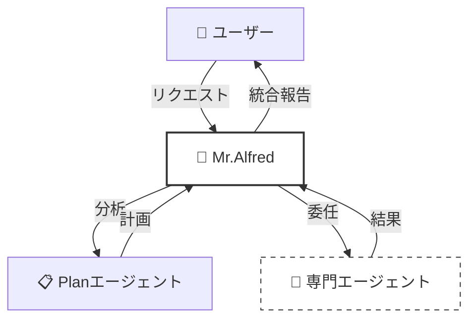
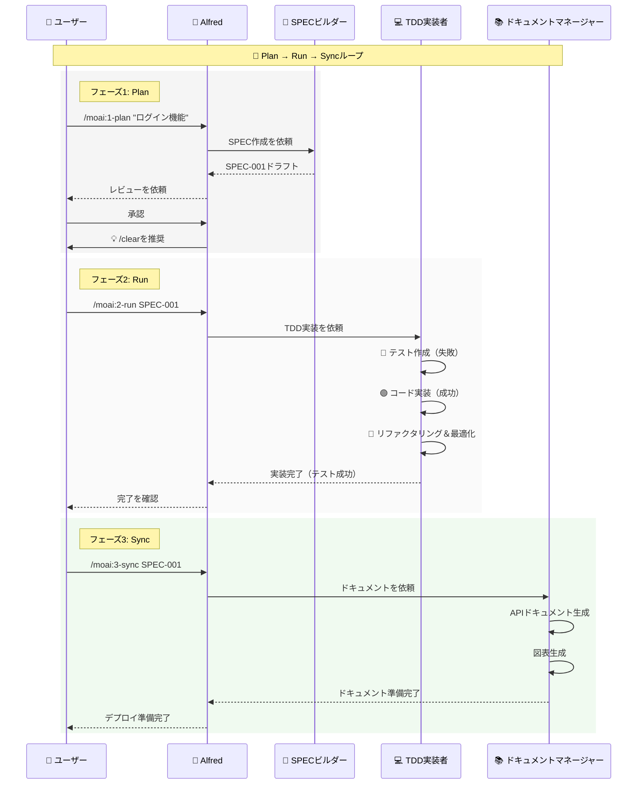
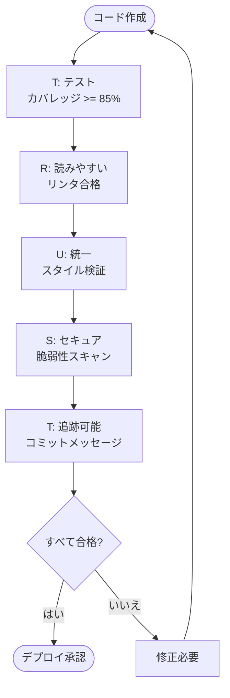
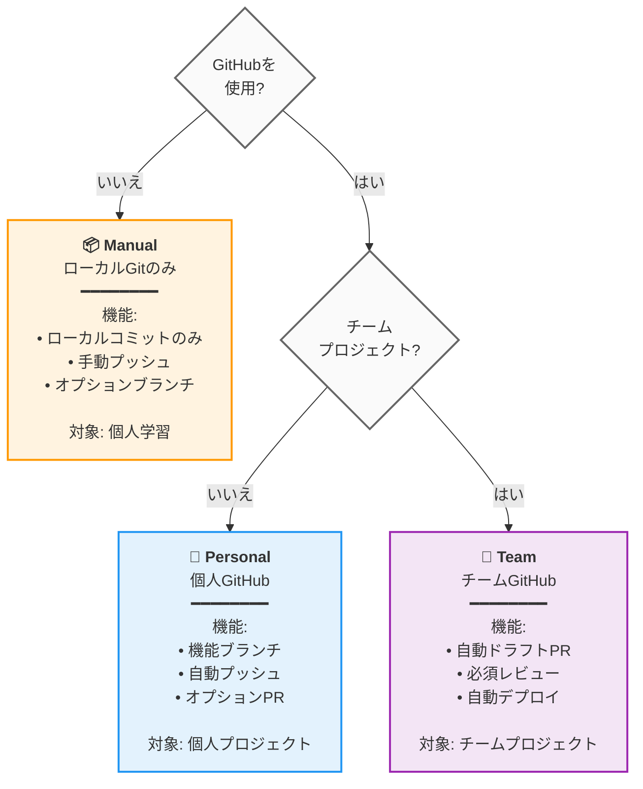

# 🗿 MoAI-ADK: Agentic AI ベース SPEC-First TDD 開発フレームワーク


**利用可能な言語:** [🇰🇷 한국어](./README.ko.md) | [🇺🇸 English](./README.md) | [🇯🇵 日本語](./README.ja.md) | [🇨🇳 中文](./README.zh.md)

[](https://pypi.org/project/moai-adk/)
[](https://opensource.org/licenses/MIT)
[](https://www.python.org/)

MoAI-ADK (Agentic Development Kit)は、**SPEC-First開発**、**テスト駆動開発**（TDD）、**AIエージェント**を組み合わせて、完全で透明な開発ライフサイクルを提供するオープンソースフレームワークです。

---

## 📑 目次（クイックナビゲーション）

### パートA: はじめに（30分）

| セクション                             | 時間  | 目標                     |
| ------------------------------------ | ----- | ------------------------ |
| [1. はじめに](#1-はじめに)              | 2分   | MoAI-ADKが何かを理解     |
| [2. インストールとセットアップ](#2-インストールとセットアップ) | 10分  | 基本環境構成             |
| [3. クイックスタート](#3-クイックスタート)     | 5分   | 最初の機能完成            |

### パートB: コア概念（45分）

| セクション                                      | 時間  | 目標                     |
| --------------------------------------------- | ----- | ------------------------ |
| [4. SPECとEARSフォーマット](#4-specとearsフォーマット) | 10分  | 仕様書作成の理解          |
| [5. Mr.Alfredとエージェント](#5-mralfredとエージェント) | 12分  | エージェントシステムの理解 |
| [6. 開発ワークフロー](#6-開発ワークフロー)          | 15分  | Plan → Run → Sync        |
| [7. コアコマンド](#7-コアコマンド)                  | 8分   | `/moai:0-3` コマンド      |

### パートC: 上級学習（2-3時間）

| セクション                                  | 目標               |
| ----------------------------------------- | ------------------ |
| [8. エージェントガイド](#8-エージェントガイド-26個) | 専門エージェントの活用 |
| [9. スキルライブラリ](#9-スキルライブラリ-22個)   | 22個のスキル探索     |
| [10. 組み合わせパターンと例](#10-組み合わせパターンと例) | 実際のプロジェクト例 |
| [11. TRUST 5 品質保証](#11-trust-5-品質保証)     | 品質保証システム     |

### パートD: 上級とリファレンス（必要に応じて）

| セクション                                   | 目的                  |
| ------------------------------------------ | --------------------- |
| [12. 高度な設定](#12-高度な設定)            | プロジェクトカスタマイズ |
| [13. MCPサーバー](#13-mcpサーバー)          | 外部ツール統合         |
| [14. FAQ & クイックリファレンス](#14-faq--クイックリファレンス) | よくある質問          |
| [15. 追加リソース](#15-追加リソース)        | ai-nano-bananaガイド  |

---

## 1. はじめに

### 🗿 MoAI-ADKとは？

**MoAI-ADK**（Agentic Development Kit）は、AIエージェントを搭載した次世代開発フレームワークです。**SPEC-First開発方法論**、**TDD**（テスト駆動開発）、**26個の専門AIエージェント**を組み合わせて、完全で透明な開発ライフサイクルを提供します。

### ✨ なぜMoAI-ADKを使うのか？


従来の開発の限界：

- ❌ 要件が不明確なため頻繁な手戻り
- ❌ ドキュメントとコードの不一致
- ❌ テスト延期による品質劣化
- ❌ 反復的なボイラープレートコード作成

MoAI-ADKの解決策：

- ✅ **明確なSPEC文書**から開始し、誤解を排除
- ✅ **自動ドキュメント同期**で常に最新状態を維持
- ✅ **TDD強制**で85%以上のテストカバレッジを保証
- ✅ **AIエージェント**で反復的タスクを自動化

### 🎯 コア機能


| 機能                   | 説明                                           | 定量的影響                                                                                                                                                                                             |
| --------------------- | --------------------------------------------- | ----------------------------------------------------------------------------------------------------------------------------------------------------------------------------------------------------- |
| **SPEC-First**        | すべての開発は明確な仕様から開始              | 要件変更による手戻りを**90%削減**<br/>明確なSPECが開発者-プランナー間の誤解を排除                                                                                                                      |
| **TDD強制**           | 自動Red-Green-Refactorサイクル                 | （85%以上カバレッジで）バグを**70%削減**<br/>テスト作成を含む総開発時間を**15%短縮**                                                                                                                    |
| **AIオーケストレーション** | Mr.Alfredが26個の専門AIエージェント（7階層）を指挥 | 平均トークン節約：セッションあたり5,000トークン（条件付き自動読み込み）<br/>**単純タスク**：0トークン（クイックリファレンス）<br/>**複雑タスク**：8,470トークン（自動スキル読み込み）<br/>手動に比べて**60-70%の時間節約** |
| **自動ドキュメント**   | コード変更時の自動ドキュメント同期（`/moai:3-sync`） | **100%ドキュメント鮮度**<br/>手動ドキュメント作成を排除<br/>最後のコミットからの自動同期                                                                                                        |
| **TRUST 5品質**       | Test, Readable, Unified, Secured, Trackable   | エンタープライズグレードの品質保証<br/>デプロイ後の緊急パッチを**99%削減**                                                                                                                           |

---

## 2. インストールとセットアップ

### 🎯 基本インストール（10分）

#### ステップ1: uvのインストール（1分）

```bash
# macOS / Linux
curl -LsSf https://astral.sh/uv/install.sh | sh

# Windows (PowerShell)
powershell -ExecutionPolicy ByPass -c "irm https://astral.sh/uv/install.ps1 | iex"

# インストール確認
uv --version
```

#### ステップ2: MoAI-ADKのインストール（2分）

```bash
# 最新バージョンをインストール
uv tool install moai-adk

# 最新バージョンに更新（既にインストール済みの場合）
uv tool update moai-adk

# インストール確認
moai-adk --version
```

#### ステップ3A: 新規プロジェクト初期化（3分）

```bash
# 新規プロジェクト作成
moai-adk init my-project
cd my-project

# プロジェクト構造確認
ls -la
```

生成されるファイル構造：

```
my-project/
├── .claude/              # Claude Code設定
├── .moai/                # MoAI-ADK設定
├── src/                  # ソースコード
├── tests/                # テストコード
├── .moai/specs/          # SPEC文書
├── README.md
└── pyproject.toml
```

---

#### ステップ3B: 既存プロジェクトのセットアップ（5分）

**既存プロジェクトに3ステップでMoAI-ADKを統合：**

```bash
# 既存プロジェクトに移動
cd your-existing-project

# カレントディレクトリでMoAI-ADKを初期化
moai-adk init .

# MoAI-ADK統合を確認
ls -la .claude/ .moai/
```

**プロジェクトに追加されるファイル：**

```
your-existing-project/
├── .claude/              # Claude Code設定（追加）
│   ├── agents/           # MoAI-ADKエージェント
│   ├── commands/         # カスタムコマンド
│   ├── hooks/             # 自動化ワークフロー
│   └── settings.json     # プロジェクト設定
├── .moai/                # MoAI-ADK設定（追加）
│   ├── config/           # プロジェクト設定
│   ├── memory/           # セッションメモリ
│   ├── specs/            # SPEC文書
│   └── docs/             # 自動生成ドキュメント
├── src/                  # 既存のソースコード（変更なし）
├── tests/                # 既存のテスト（変更なし）
└── README.md             # 既存のREADME（変更なし）
```

**重要：** 既存のファイルは一切変更されません。MoAI-ADKは設定ファイルのみを追加します。

---

#### ステップ4: Claude Codeの実行とプロジェクトメタデータの初期化

```bash
# プロジェクトディレクトリでClaude Codeを実行
claude

# Claude Code内でプロジェクトメタデータを初期化
> /moai:0-project
```

**`/moai:0-project`の機能：**
- ✅ プロジェクト構造の分析
- ✅ プログラミング言語とフレームワークの検出
- ✅ `.moai/config/config.json`にプロジェクトメタデータを生成
- ✅ デフォルトGitワークフロー設定
- ✅ セッションメモリシステムの作成
- ✅ 品質保証基準の設定

**期待される出力：**
```
✓ プロジェクト分析完了: Pythonプロジェクトを検出
✓ メタデータ生成完了: .moai/config/config.json
✓ Git戦略: Manualモード設定完了
✓ 品質ゲート: 85%テストカバレッジ目標
✓ プロジェクト初期化完了
```

これでSPEC-First TDD開発のためのプロジェクトメタデータと環境が準備できました！

---

## 3. クイックスタート

### 🎯 目標：5分で最初の機能を完成


---

### **ステップ1: 最初の機能を計画** ⏱️ 2分

Claude Code内：

```
> /moai:1-plan "ユーザーログイン機能を追加"
```

このコマンドは：

- 自動的にSPEC-001文書を生成
- 要件、制約、成功基準を定義
- テストシナリオを作成

---

### **ステップ2: コンテキスト初期化** ⏱️ 1分

```
> /clear
```

トークン効率のために以前のコンテキストをクリアします。

---

### **ステップ3: 実装（Run）** ⏱️ 2分

```
> /moai:2-run SPEC-001
```

このコマンドは：

- まずテストを作成（Red）
- コードを実装（Green）
- リファクタリング（Refactor）
- 自動的にTRUST 5検証を実行

---

### **ステップ4: ドキュメント（Sync）** ⏱️ （オプション）

```
> /moai:3-sync SPEC-001
```

自動的に：

- APIドキュメントを生成
- アーキテクチャ図を作成
- READMEを更新
- デプロイ準備完了

**完了！** 最初の機能が完全に実装されました。🎉

---

### 📁 詳細情報

- **高度なインストールオプション**: [12. 高度な設定](#12-高度な設定)
- **詳細なコマンド使用法**: [7. コアコマンド](#7-コアコマンド)
- **開発ワークフロー**: [6. 開発ワークフロー](#6-開発ワークフロー)

---

## 4. SPECとEARSフォーマット

### 📋 SPEC-First開発


**SPEC-Firstとは？**

すべての開発は**明確な仕様**から開始します。SPECは**EARS（Easy Approach to Requirements Syntax）フォーマット**に従い、以下を含みます：

- **要件**: 何を構築するか？
- **制約**: どのような制限があるか？
- **成功基準**: いつ完了か？
- **テストシナリオ**: どのように検証するか？

### 🎯 EARSフォーマットの例

```markdown
# SPEC-001: ユーザーログイン機能

## 要件

- ユーザーがメールとパスワードを入力し「ログイン」をクリックした時
- 資格情報が有効な場合
- システムはJWT（JSON Web Token）を発行しダッシュボードにナビゲートする

## 制約

- パスワードは8文字以上
- 5回連続失敗後アカウントをロック（30分）
- 応答時間は500ms未満

## 成功基準

- 有効な資格情報で100%成功率
- 無効な資格情報に対して明確なエラーメッセージ表示
- 応答時間 < 500ms
- テストカバレッジ >= 85%

## テストシナリオ

### TC-1: 成功ログイン

- 入力: email="user@example.com", password="secure123"
- 期待: トークン発行、ダッシュボードにナビゲート

### TC-2: 無効パスワード

- 入力: email="user@example.com", password="wrong"
- 期待: 「パスワードが正しくありません」エラーメッセージ

### TC-3: アカウントロック

- 入力: 5回連続失敗
- 期待: 「アカウントがロックされました。30分后再試行してください」
```

### 💡 EARSフォーマットの5種類

| タイプ              | 構文         | 例                                        |
| ----------------- | -------------- | ------------------------------------------- |
| **Ubiquitous**    | 常に実行       | 「システムは常に活動を記録する」            |
| **Event-driven**  | WHEN...THEN    | 「ユーザーがログインした時、トークンを発行」 |
| **State-driven**  | IF...THEN      | 「アカウントがアクティブな場合、ログインを許可」 |
| **Unwanted**      | shall not      | 「システムはパスワードを平文で保存してはならない」 |
| **Optional**      | where possible | 「可能な場合はOAuthログインを提供」         |

---

## 5. Mr.Alfredとエージェント

### 🎩 Mr.Alfred - スーパーエージェントオーケストレーター

**Mr.Alfredとは？**

Mr.AlfredはMoAI-ADKの**チーフオーケストレーター**で、ユーザーリクエストを分析し、適切な専門エージェントを選択してタスクを委任し、結果を統合します。

**Alfredの役割：**

1. **理解**: ユーザーリクエストを分析し、曖昧さを明確化
2. **計画**: Planエージェントを通じて実行計画を確立
3. **実行**: タスクを専門エージェントに委任（逐次/並列）
4. **統合**: すべての結果を収集し、ユーザーに報告



### 🔧 エージェントシステム（5階層階層）

MoAI-ADKは**26個の専門エージェント**を**5階層**に整理して最適なパフォーマンスを提供します。

**階層1: ドメイン専門家**（7エージェント）

- `expert-backend`: バックエンドアーキテクチャ、API開発
- `expert-frontend`: フロントエンド、React/Vue実装
- `expert-database`: データベース設計、最適化
- `expert-security`: セキュリティ分析、脆弱性スキャン
- `expert-devops`: デプロイ、インフラ、CI/CD
- `expert-uiux`: UI/UX設計、コンポーネント
- `expert-debug`: デバッグ、エラー分析

**階層2: ワークフローマネージャー**（8エージェント）

- `manager-spec`: SPEC作成（EARSフォーマット）
- `manager-tdd`: TDD実装（RED-GREEN-REFACTOR）
- `manager-docs`: 自動ドキュメント
- `manager-quality`: 品質検証（TRUST 5）
- `manager-strategy`: 実行戦略計画
- `manager-project`: プロジェクト初期化
- `manager-git`: Gitワークフロー
- `manager-claude-code`: Claude Code統合

**階層3: メタ生成器**（3エージェント）

- `builder-agent`: 新しいエージェント作成
- `builder-skill`: 新しいスキル作成
- `builder-command`: 新しいコマンド作成

**階層4: MCP統合器**（5エージェント）

- `mcp-context7`: リアルタイムライブラリドキュメント検索
- `mcp-sequential-thinking`: 複雑な推論分析
- `mcp-playwright`: Web自動化テスト
- `mcp-design`: Figmaデザインシステム
- `mcp-browser`: Webテスト自動化

**階層5: AIサービス**（1エージェント）

- `ai-nano-banana`: Gemini 3画像生成

---

## 6. 開発ワークフロー

### 🔄 無限Plan-Run-Syncループ

MoAI-ADK開発は**3フェーズの無限ループ**で進行します：



### 📊 詳細フェーズ説明

#### フェーズ1: Plan（設計、5-10分）

**目標**: 何を構築するか？

```bash
/moai:1-plan "ユーザーログイン機能"
```

このフェーズでは：

- ✅ 自動的にSPEC-001文書を生成
- ✅ EARSフォーマットで要件を定義
- ✅ 成功基準を明確化
- ✅ テストシナリオを作成

**出力**: `.moai/specs/SPEC-001/spec.md`

---

#### フェーズ2: Run（実装、20-40分）

**目標**: どのように構築するか？

```bash
/clear
/moai:2-run SPEC-001
```

このフェーズでは：

- 🔴 **RED**: 失敗するテストをまず作成
- 🟢 **GREEN**: 最小限のコードでテストを成功させる
- 🔵 **REFACTOR**: コードをクリーンアップ＆最適化

**自動検証**:

- テストカバレッジ >= 85%
- コードリント検証に合格
- セキュリティ検証に合格
- 型検証に合格

**出力**: 実装完了 + テストコード + 85%以上カバレッジ

---

#### フェーズ3: Sync（ドキュメント、10-15分）

**目標**: 完了したか？

```bash
/clear
/moai:3-sync SPEC-001
```

このフェーズでは：

- 📚 自動APIドキュメント生成
- 📊 アーキテクチャ図生成
- 🚀 デプロイガイド作成
- ✅ すべての変更を反映

**出力**: 最新のドキュメント + デプロイ準備完了

---

### 💡 ビジュアルワークフロー：「ブログコメント機能」例

```mermaid
flowchart LR
    Start([👤 ユーザーリクエスト]) -->|\"<br/>コメント機能を<br/>作成できますか？<br/>\"| Plan[\"<b>📋 PLAN</b><br/>（設計）<br/>━━━━━━<br/>✨ SPEC作成<br/>✅ 成功基準定義<br/>⏱️ 5分\"]

    Plan -->|\"<br/>SPEC-001<br/>準備完了<br/>\"| Run[\"<b>💻 RUN</b><br/>（実装）<br/>━━━━━━<br/>🔴 テスト作成<br/>🟢 コード実装<br/>🔵 リファクタリング<br/>⏱️ 20分\"]

    Run -->|\"<br/>テスト成功<br/>コード完了<br/>\"| Sync[\"<b>📚 SYNC</b><br/>（ドキュメント）<br/>━━━━━━<br/>🔗 APIドキュメント生成<br/>📊 図表<br/>🚀 デプロイ準備<br/>⏱️ 10分\"]

    Sync -->|\"<br/>完全自動化！<br/>\"| End([✅ 機能デプロイ済み])

    classDef planStyle fill:#e3f2fd,stroke:#1976d2,stroke-width:3px,color:#000
    classDef runStyle fill:#f3e5f5,stroke:#7b1fa2,stroke-width:3px,color:#000
    classDef syncStyle fill:#e8f5e9,stroke:#388e3c,stroke-width:3px,color:#000
    classDef normalStyle fill:#fafafa,stroke:#666,stroke-width:2px

    class Plan planStyle
    class Run runStyle
    class Sync syncStyle
    class Start,End normalStyle
```

---

## 7. コアコマンド

### 🎯 `/moai:0-project` - プロジェクト初期化

**目的**: プロジェクトメタデータを生成

**使用タイミング**: 新規プロジェクト開始時

```bash
/moai:0-project
```

**生成されるファイル**:

- `.moai/config/config.json`: プロジェクト設定
- `.moai/memory/`: プロジェクトメモリ
- `.moai/docs/`: 自動生成ドキュメント

---

### 📋 `/moai:1-plan` - SPEC作成

**目的**: EARSフォーマットでSPEC文書を生成

**使用タイミング**: 新機能開発開始前

```bash
/moai:1-plan "ログイン機能を追加"
```

**例**:

```bash
/moai:1-plan "ユーザープロフィールページを実装"
# → SPEC-002作成 (.moai/specs/SPEC-002/spec.md)

/moai:1-plan "支払いAPIを開発"
# → SPEC-003作成
```

**SPECに含まれるもの**:

- 要件
- 制約
- 成功基準
- テストシナリオ

**重要**: 次に`/clear`を実行する必要があります

```bash
/moai:1-plan "機能名"
# 完了後
/clear
```

---

### 💻 `/moai:2-run` - TDD実装

**目的**: RED-GREEN-REFACTORサイクルでコードを実装

**使用タイミング**: SPEC作成後の実装時

```bash
/moai:2-run SPEC-001
```

**例**:

```bash
/moai:2-run SPEC-001  # 基本実装
```

**自動実行**:

- 🔴 まずテストを作成
- 🟢 コードでテストを成功させる
- 🔵 リファクタリング＆最適化
- ✅ TRUST 5検証（自動）

**検証項目**:

- テストカバレッジ >= 85%
- リント検証に合格
- 型検証に合格
- セキュリティ検証に合格

---

### 📚 `/moai:3-sync` - ドキュメント同期

**目的**: ドキュメントにコード変更を反映

**使用タイミング**: 実装完了後

```bash
/moai:3-sync SPEC-001
```

**例**:

```bash
/moai:3-sync SPEC-001  # すべてのドキュメント
```

**自動生成ドキュメント**:

- APIリファレンス
- アーキテクチャ図
- デプロイガイド
- README更新
- CHANGELOG

---

### 🌳 **moai-worktree** - 並列SPEC開発のためのGitワークツリー管理

#### moai-worktreeが必要な理由：解決する問題

モダンなソフトウェア開発、特にSPEC-First TDD手法に従う場合、開発者は複数の機能を同時に作業する課題に頻繁に直面します。従来のGitワークフローは開発者に以下を強制します：

- **コンテキスト切り替え地獄**: 同じワークスペースでブランチを切り替え続け、コンテキストを失い未完了の作業のリスク
- **逐次開発**: 一度に1つのSPECのみを作業して生産性の低下
- **環境の競合**: 異なるSPECは異なる依存関係、データベース状態、または設定が必要

**moai-worktreeはこれらの問題を解決**し、各SPECの分離されたワークスペースを提供し、コンテキスト切り替えのオーバーヘッドなしで真の並列開発を可能にします。

#### コアコンセプト：SPECベースの並列開発

**Gitワークツリーとは？**

Gitワークツリーは同じGitリポジトリにリンクされた分離された作業ディレクトリで、異なるブランチを同時に異なる作業ディレクトリにチェックアウトできます。各ワークツリーは以下を持ちます：
- 独立したファイルシステム
- 分離された作業ディレクトリの状態
- 分離されたビルドアーティファクトと依存関係
- 独自のステージングエリアと未ステージングの変更

**moai-worktreeアーキテクチャ：**

```
メインリポジトリ/
├── .git/                    # 共有Gitリポジトリ
├── src/                     # メインブランチのファイル
└── worktrees/               # 自動生成ワークツリー
    ├── SPEC-001/
    │   ├── .git             # ワークツリー固有のgitファイル
    │   ├── src/             # SPEC-001の実装
    │   └── tests/           # SPEC-001のテスト
    ├── SPEC-002/
    │   ├── .git             # ワークツリー固有のgitファイル
    │   ├── src/             # SPEC-002の実装
    │   └── tests/           # SPEC-002のテスト
    └── SPEC-003/
        ├── .git             # ワークツリー固有のgitファイル
        ├── src/             # SPEC-003の実装
        └── tests/           # SPEC-003のテスト
```

#### SPEC-First開発のための主要な利点

**1. ゼロコンテキスト切り替え**
- 各SPECは独自の専用ワークスペースを持つ
- SPEC間で切り替えるときに作業コンテキストを絶対に失わない
- 特定の要件に対する精神的集中を維持

**2. 真の並列開発**
- SPEC-002のテストが実行されている間にSPEC-001の実装作業
- SPEC-004のドキュメント同期がされている間にSPEC-003のデバッグ
- 他のプロセスが完了するのを待つ必要なし

**3. 分離された環境**
- 異なるSPECは異なる依存関係のバージョンを使用できる
- 分離されたデータベース状態と設定
- SPEC間の汚染なし

**4. SPEC完了の追跡**
- アクティブなSPECリストの明確な視覚的表示
- 放棄または未完了のSPECの簡単な識別
- 完了した作業の体系的なクリーンアップ

#### 高度な機能

**スマート同期**
```bash
# 全ワークツリーを最新のメインブランチと同期
moai-worktree sync --all

# 競合解決で特定のワークツリーを同期
moai-worktree sync SPEC-001 --auto-resolve
```

**インテリジェントクリーナップ**
```bash
# マージされたブランチのワークツリーを自動削除
moai-worktree clean --merged-only

# 確認プロンプト付きの安全なクリーンアップ
moai-worktree clean --interactive
```

**パフォーマンスの最適化**
- **同時操作**: 複数のワークツリーを同時に修正可能
- **共有履歴**: 全ワークツリーは同じGitオブジェクトデータベースを共有
- **選択的同期**: 必要なときのみ変更を同期、リポジトリ全体はしない

#### moai-worktreeの使用時期

**理想的なシナリオ：**
- **複数のアクティブSPEC**: 3以上のSPECを同時に作業
- **長期間のタスク**: SPECの実装に数日から数週が必要
- **チームコラボレーション**: 異なる開発者が異なるSPECを作業
- **機能ブランチング**: 各SPECが独自の機能ブランチになる
- **環境分離**: 異なるSPECが異なる設定が必要

**実際の例ワークフロー：**

```bash
# 朝：新しいSPECを開始
moai-worktree new SPEC-005 "ユーザープロフィールの向上"
cd $(moai-worktree go SPEC-005)

# 他のSPECが完了している間にSPEC-005を実装
/moai:2-run SPEC-005

# 午後：全SPECのステータスを確認
moai-worktree status
# 出力：
# ✓ SPEC-001: 完了（マージ準備）
# ✓ SPEC-002: テスト進行中
# ⏳ SPEC-003: 実装フェーズ
# 🔄 SPEC-005: アクティブ開発

# 夜：完了したSPECをクリーンアップ
moai-worktree clean --merged-only
```

#### 技術的利点

**メモリ効率**: 共有Gitオブジェクトデータベースは複数のフルリポジトリと比較して最小限のメモリオーバーヘッドを意味

**ディスクスペースの最適化**: ワークツリーはリポジトリ履歴を共有し、作業ファイルにのみ追加のスペースを使用

**アトミック操作**: 各ワークツリー操作はアトミックで、リポジトリの破損を防止

**Gitネイティブ**: 標準Gitワークツリー機能を使用し、すべてのGitツールとの互換性を確保

#### MoAI-ADKワークフローとの統合

moai-worktreeはMoAI-ADK Plan-Run-Syncサイクルとシームレスに統合されます：

1. **Planフェーズ**: `moai-worktree new SPEC-XXX`が専用ワークスペースを作成
2. **Runフェーズ**: 他のSPECに影響を与えず分離された環境で作業
3. **Syncフェーズ**: `moai-worktree sync SPEC-XXX`がクリーンな統合を保証
4. **Cleanupフェーズ**: `moai-worktree clean`が完了したワークツリーを削除

この統合はSPEC-First TDD手法の原則を維持しながら、同時に複数のSPECを管理するための完全で体系的なアプローチを提供します。

**コマンド概要：**

```bash
# 利用可能なコマンドのリスト
moai-worktree --help

# SPEC開発のための新しいワークツリーを作成
moai-worktree new SPEC-001

# 全アクティブなワークツリーのリスト
moai-worktree list

# 特定のワークツリーに移動
moai-worktree go SPEC-001

# ワークツリーに切り替え（新しいシェルを開く）
moai-worktree switch SPEC-001

# ワークツリーをベースブランチと同期
moai-worktree sync SPEC-001

# 特定のワークツリーを削除
moai-worktree remove SPEC-001

# マージされたブランチワークツリーをクリーンアップ
moai-worktree clean

# ワークツリーのステータスと設定を表示
moai-worktree status

# ワークツリーの設定
moai-worktree config get
moai-worktree config set <key> <value>
```

---

### 📊 その他の便利なコマンド

| コマンド             | 目的                     | 使用タイミング           |
| ------------------- | ----------------------- | ----------------------- |
| `/moai:0-git`       | Gitワークフローセットアップ  | プロジェクト初期化      |
| `/moai:9-feedback`  | 改善フィードバック提出      | 問題発見時              |
| `/clear`            | コンテキスト初期化        | フェーズ後のトークン節約 |

---

### 🌳 **moai-worktree** - 並列SPEC開発のためのGit Worktree管理

#### なぜmoai-worktreeか？解決する問題

現代のソフトウェア開発、特にSPEC-First TDD方法論に従う時、開発者は複数の機能を同時に作業する課題に直面します。従来のGitワークフローは開発者を強制します：

- **コンテキストスイッチ地獄**: 同じワークスペースでブランチを切り替え続け、コンテキストを失い、未完了作業のリスク
- **逐次開発**: 一度に一つのSPECのみ作業し、生産性低下
- **環境競合**: 異なるSPECが異なる依存関係、データベース状態、設定を必要とする場合

**moai-worktreeはこれらの問題を解決**します。各SPECに分離されたワークスペースを提供し、コンテキストスイッチングオーバーヘッドなしで真の並列開発を可能にします。

#### コア概念: SPECベース並列開発

**Git Worktreeとは？**

Git worktreeは同じGitリポジトリにリンクされた別の作業ディレクトリで、複数の作業ディレクトリに異なるブランチを同時にチェックアウトできます。各worktreeは以下を持ちます：
- 独立したファイルシステム
- 分離された作業ディレクトリ状態
- 分離されたビルドアーティファクトと依存関係
- 独自のステージング領域と未ステージング変更

**moai-worktreeアーキテクチャ:**

```
メインリポジトリ/
├── .git/                    # 共有Gitリポジトリ
├── src/                     # メインブランチファイル
└── worktrees/               # 自動生成されたworktree
    ├── SPEC-001/
    │   ├── .git             # Worktree固有のgitファイル
    │   ├── src/             # SPEC-001実装
    │   └── tests/           # SPEC-001テスト
    ├── SPEC-002/
    │   ├── .git             # Worktree固有のgitファイル
    │   ├── src/             # SPEC-002実装
    │   └── tests/           # SPEC-002テスト
    └── SPEC-003/
        ├── .git             # Worktree固有のgitファイル
        ├── src/             # SPEC-003実装
        └── tests/           # SPEC-003テスト
```

#### SPEC-First開発のための主要な利点

**1. ゼロコンテキストスイッチング**
- 各SPECは専用ワークスペースを持つ
- SPEC間の切り替え時、作業コンテキストを絶対に失わない
- 特定要件への精神的集中を維持

**2. 真の並列開発**
- SPEC-002テスト実行中にSPEC-001実装作業
- SPEC-004ドキュメント同期中にSPEC-003デバッグ
- 他プロセス完了を待つ必要なし

**3. 分離された環境**
- 異なるSPECが異なる依存関係バージョンを使用可能
- 分離されたデータベース状態と設定
- SPEC間の汚染なし

**4. SPEC完了追跡**
- アクティブなSPECを明確に視覚的に表示
- 中断または未完了のSPECを簡単に特定
- 完了作業の体系的なクリーンアップ

#### 高度な機能

**スマート同期**
```bash
# すべてのworktreeを最新メインブランチと同期
moai-worktree sync --all

# 競合解決で特定worktreeを同期
moai-worktree sync SPEC-001 --auto-resolve
```

**インテリジェントクリーンアップ**
```bash
# マージされたブランチのworktreeを自動削除
moai-worktree clean --merged-only

# 確認プロンプト付き安全なクリーンアップ
moai-worktree clean --interactive
```

**パフォーマンス最適化**
- **同時操作**: 複数のworktreeを同時に変更可能
- **共有履歴**: すべてのworktreeが同じGitオブジェクトデータベースを共有
- **選択的同期**: リポジトリ全体ではなく必要な変更のみ同期

#### moai-worktree使用時期

**理想的なシナリオ:**
- **複数アクティブSPEC**: 3つ以上のSPECを同時に作業
- **長期実行タスク**: SPEC実装に数日または数週間
- **チーム協業**: 複数開発者が異なるSPEC作業
- **機能ブランチング**: 各SPECが独自機能ブランチに
- **環境分離**: 異なるSPECが異なる設定を必要

**実際の例ワークフロー:**

```bash
# 午前: 新規SPEC開始
moai-worktree new SPEC-005 "ユーザープロフィール改善"
cd $(moai-worktree go SPEC-005)

# 他のSPEC完了中にSPEC-005実装
/moai:2-run SPEC-005

# 午後: すべてのSPEC状態確認
moai-worktree status
# 出力:
# ✓ SPEC-001: 完了（マージ準備）
# ✓ SPEC-002: テスト実行中
# ⏳ SPEC-003: 実装フェーズ
# 🔄 SPEC-005: アクティブ開発

# 夕方: 完了したSPECクリーンアップ
moai-worktree clean --merged-only
```

#### 技術的利点

**メモリ効率**: 複数の完全リポジトリと比較して最小メモリオーバーヘッドで共有Gitオブジェクトデータベース使用

**ディスクスペース最適化**: Worktreeがリポジトリ履歴を共有し、作業ファイルのための追加スペースのみ使用

**原子操作**: 各worktree操作は原子で、リポジトリ破損を防止

**Gitネイティブ**: 標準Git worktree機能使用で、すべてのGitツールとの互換性を保証

#### MoAI-ADKワークフローとの統合

moai-worktreeはMoAI-ADK Plan-Run-Syncサイクルとシームレスに統合されます：

1. **Planフェーズ**: `moai-worktree new SPEC-XXX`が専用ワークスペースを作成
2. **Runフェーズ**: 他のSPECに影響を与えず分離環境で作業
3. **Syncフェーズ**: `moai-worktree sync SPEC-XXX`がクリーンな統合を保証
4. **Cleanupフェーズ**: `moai-worktree clean`が完了したworktreeを削除

この統合は、SPEC-First TDD方法論の原則を維持しながら複数のSPECを同時に管理するための完全で体系的なアプローチを提供します。

**コマンド概要:**

```bash
# 利用可能なコマンド一覧
moai-worktree --help

# SPEC開発用の新規worktree作成
moai-worktree new SPEC-001

# すべてのアクティブworktree一覧
moai-worktree list

# 特定worktreeに移動
moai-worktree go SPEC-001

# worktreeに切り替え（新しいシェルを開く）
moai-worktree switch SPEC-001

# worktreeをベースブランチと同期
moai-worktree sync SPEC-001

# 特定worktreeを削除
moai-worktree remove SPEC-001

# マージされたブランチworktreeクリーンアップ
moai-worktree clean

# worktree状態と設定表示
moai-worktree status

# worktree設定
moai-worktree config get
moai-worktree config set <key> <value>
```

---

## 8. エージェントガイド（26個）

### 🎯 エージェント選択ガイド

各エージェントは特定のドメイン専門性を持っています。タスクに合ったエージェントを選択してください。

### 階層1: ドメイン専門家

#### expert-backend（バックエンド開発）

**専門知識**: FastAPI、Django、Node.jsバックエンド開発
**使用例**:

- RESTful API設計と実装
- データベースクエリ最適化
- 認証と認可
- サーバーパフォーマンス最適化

```bash
@agent-expert-backend "FastAPIでユーザー認証APIを開発"
```

---

#### expert-frontend（フロントエンド開発）

**専門知識**: React、Vue、Next.jsフロントエンド
**使用例**:

- UIコンポーネント実装
- 状態管理（Redux、Zustand）
- API統合
- レスポンシブデザイン

```bash
@agent-expert-frontend "ReactでダッシュボードUIを実装"
```

---

#### expert-database（データベース）

**専門知識**: SQL、NoSQL、ORM、最適化
**使用例**:

- データベーススキーマ設計
- クエリ最適化
- 移行
- パフォーマンスチューニング

```bash
@agent-expert-database "大規模PostgreSQLテーブルを最適化"
```

---

#### expert-security（セキュリティ）

**専門知識**: セキュリティ分析、脆弱性スキャン、OWASP
**使用例**:

- セキュリティコードレビュー
- 脆弱性分析
- OWASP Top 10検証
- データ暗号化

```bash
@agent-expert-security "ログイン機能のセキュリティ監査"
```

---

#### expert-devops（DevOps）

**専門知識**: Docker、Kubernetes、CI/CD、デプロイ
**使用例**:

- Dockerイメージ最適化
- Kubernetes設定
- GitHub Actions CI/CD
- インフラ自動化

```bash
@agent-expert-devops "Next.jsアプリ用Dockerデプロイをセットアップ"
```

---

#### expert-uiux（UI/UX設計）

**専門知識**: デザインシステム、コンポーネント、アクセシビリティ
**使用例**:

- UIコンポーネントライブラリ設計
- デザインシステム開発
- アクセシビリティ（A11y）検証
- ユーザーエクスペリエンス最適化

```bash
@agent-expert-uiux "shadcn/uiに基づいたデザインシステムを構築"
```

---

#### expert-debug（デバッグ）

**専門知識**: 問題分析、エラー追跡、パフォーマンスプロファイリング
**使用例**:

- バグ分析
- パフォーマンスボトルネック分析
- ログ分析
- メモリリーク検出

```bash
@agent-expert-debug "遅いAPI応答時間を分析"
```

---

### 階層2: ワークフローマネージャー

#### manager-spec（SPEC作成）

**目的**: EARSフォーマットでSPEC文書を生成
**自動呼び出し**: `/moai:1-plan`実行時

```bash
@agent-manager-spec "ユーザープロフィールAPI用SPEC作成"
```

---

#### manager-tdd（TDD実装）

**目的**: RED-GREEN-REFACTORを自動実行
**自動呼び出し**: `/moai:2-run`実行時

```bash
@agent-manager-tdd "SPEC-001を実装"
```

---

#### manager-docs（ドキュメント自動化）

**目的**: APIドキュメント、図表、ガイドを自動生成
**自動呼び出し**: `/moai:3-sync`実行時

```bash
@agent-manager-docs "ログイン機能のドキュメントを生成"
```

---

#### manager-quality（品質検証）

**目的**: TRUST 5検証（Test, Readable, Unified, Secured, Trackable）
**自動呼び出し**: `/moai:2-run`完了後

```bash
@agent-manager-quality "コード品質を検証"
```

---

#### manager-strategy（戦略計画）

**目的**: 複雑な実装戦略を確立
**使用例**:

- マイクロサービスアーキテクチャ設計
- 移行計画
- パフォーマンス最適化戦略

```bash
@agent-manager-strategy "モノリスからマイクロサービスへの移行を計画"
# またはビルトインエージェント使用
@agent-Plan "モノリスからマイクロサービスへの移行を計画"
```

---

### 階層3: メタ生成器

#### builder-agent

**目的**: 新しいエージェントを作成
**使用例**: 組織固有エージェント作成

```bash
@agent-builder-agent "データ分析専門エージェントを作成"
```

---

#### builder-skill

**目的**: 新しいスキルを作成
**使用例**: チーム固有スキル開発

```bash
@agent-builder-skill "GraphQL API開発スキルモジュールを作成"
```

---

#### builder-command

**目的**: 新しいコマンドを作成
**使用例**: カスタムワークフロー自動化

```bash
@agent-builder-command "/moai:deployコマンド作成（自動デプロイワークフロー）"
```

---

### 階層4: MCP統合器

#### mcp-context7（ドキュメント検索）

**目的**: 最新ライブラリドキュメントのリアルタイム検索
**使用例**:

- React最新API確認
- FastAPIドキュメント参照
- ライブラリ互換性検証

```bash
@agent-mcp-context7 "React 19最新Hooks APIを検索"
```

---

#### mcp-sequential-thinking（高度な推論）

**目的**: 複雑な問題の多段階分析
**自動活性化**: 複雑性 > 中程度の場合
**使用例**:

- アーキテクチャ設計
- アルゴリズム最適化
- SPEC分析

```bash
@agent-mcp-sequential-thinking "マイクロサービスアーキテクチャ設計を分析"
```

---

#### mcp-playwright（Web自動化）

**目的**: E2Eテスト、Web自動化
**使用例**:

- E2Eテスト作成
- ビジュアル回帰テスト
- クロスブラウザ検証

```bash
@agent-mcp-playwright "ログイン機能用E2Eテストを作成"
```

---

### 階層5: AIサービス

#### ai-nano-banana（画像生成）

**目的**: Gemini 3で高品質画像を生成
**使用例**:

- UI/UXモックアップ生成
- 技術図表作成
- マーケティング資料
- ロゴ/アイコン生成

詳細は[15. 追加リソース](#15-追加リソース)を参照

---

## 9. スキルライブラリ（22個）


MoAI-ADKは**22個の専門スキル**を6カテゴリで提供します。各スキルは独立または組み合わせて使用できます。

### 📊 完全なスキルリスト

| カテゴリ       | スキル名                 | 説明                                           | バージョン |
| -------------- | ------------------------ | --------------------------------------------- | --------- |
| **Foundation** | moai-foundation-core     | TRUST 5、SPEC-First TDD、エージェント委任、トークン最適化 | 2.2.0     |
|                | moai-foundation-uiux     | デザインシステム、コンポーネント、アクセシビリティ、アイコン | 2.0.0     |
|                | moai-foundation-quality  | プロアクティブ品質検証、自動テスト             | 2.0.0     |
|                | moai-foundation-claude   | エージェント、スラッシュコマンド、MCP、フック、メモリ、IAM | 2.0.0     |
|                | moai-foundation-context  | 200Kトークン最適化、セッション永続性           | 3.0.0     |
| **Platform**   | moai-lang-unified        | 25+言語（Python、TS、Go、Rust、Java、C++など） | 2.0.0     |
|                | moai-platform-baas       | 9+ BaaS（Auth0、Clerk、Firebase、Supabaseなど） | 2.0.0     |
| **Library**    | moai-library-shadcn      | shadcn/ui、Radix、Tailwind、Reactコンポーネント | 2.0.0     |
|                | moai-library-toon        | TOONフォーマット、トークン効率エンコーディング（40-60%節約） | 3.0.0     |
|                | moai-library-mermaid     | 21図表タイプ、Playwright MCPレンダリング       | 7.0.0     |
|                | moai-library-nextra      | Next.jsドキュメント、MDX、テーマ、SSG         | 2.0.0     |
| **Connector**  | moai-connector-mcp       | 10+ MCPサーバー統合ガイド                     | 2.0.0     |
|                | moai-connector-figma     | デザインシステム、UIキット、デザイントークン   | 1.0.0     |
|                | moai-connector-notion    | ワークスペース、データベース、コンテンツ管理  | 1.0.0     |
|                | moai-connector-nano-banana | Gemini 3 Pro画像生成（テキスト/画像to画像）   | 1.0.1     |
| **Workflow**   | moai-workflow-project    | プロジェクト管理、言語初期化、テンプレート最適化 | 2.0.0     |
|                | moai-workflow-docs       | Markdown/Mermaid/韓国語検証、レポート作成     | 2.0.0     |
|                | moai-workflow-templates  | コードボイラープレート、フィードバックテンプレート | 3.0.0     |
|                | moai-workflow-testing    | Playwright E2E、ビジュアル回帰、クロスブラウザ | 2.0.0     |
|                | moai-workflow-jit-docs   | 意図ベースドキュメント自動検索＆キャッシュ    | 2.0.0     |
|                | moai-toolkit-essentials  | デバッグ、リファクタリング、最適化、レビュー    | 2.0.0     |
| **System**     | moai-system-universal    | 25+言語 + 9+ BaaS + セキュリティ + コンプライアンス | 2.0.0     |

**使用頻度**: Foundation（90%+）、Platform（80%+）、Workflow（85%）、Connector（70%）、Library（60%）、System（40%）

### 🎯 スキル使用ガイド

#### スキル呼び出し方法

```python
# 方法1: 直接呼び出し（開発者）
Skill("moai-lang-unified")

# 方法2: Alfred自動選択（一般ユーザー）
"PythonでFastAPIサーバーを作成"
→ Alfredが自動的にmoai-lang-unified + moai-platform-baasを選択
```

#### スキル組み合わせパターン

**バックエンドAPI**: `moai-foundation-core` + `moai-lang-unified` + `moai-platform-baas`

**フロントエンドUI**: `moai-foundation-uiux` + `moai-lang-unified` + `moai-library-shadcn`

**ドキュメント**: `moai-library-nextra` + `moai-workflow-docs` + `moai-library-mermaid`

**テスト**: `moai-lang-unified` + `moai-workflow-testing` + `moai-foundation-quality`

---

## 10. 組み合わせパターンと例

### 🎭 エージェント組み合わせパターン

MoAI-ADKの26個のエージェントはタスクタイプに基づいて最適な組み合わせで実行します。

### パターン1: 新機能開発

```text
manager-spec (SPEC生成)
  ↓
manager-strategy (実行計画)
  ↓
manager-tdd (TDD実装)
  ↓
manager-docs (ドキュメント同期)
```

**例**:

```bash
/moai:1-plan "ユーザーログイン機能"   # manager-spec
/clear
/moai:2-run SPEC-001               # manager-strategy → manager-tdd
/clear
/moai:3-sync SPEC-001              # manager-docs
```

---

### パターン2: パフォーマンス最適化

```text
expert-debug (問題分析)
  ↓
mcp-sequential-thinking (複雑性分析)
  ↓
expert-backend (最適化実装)
  ↓
manager-quality (検証)
```

**例**:

```bash
@agent-expert-debug "遅いAPI応答を分析"
# → ボトルネック発見（DBクエリN+1問題）

@agent-mcp-sequential-thinking "N+1問題最適化戦略を計画"
# → ORMクエリ最適化を提案

@agent-expert-backend "ORMクエリ最適化を実装"
# → select_related()、prefetch_related()を適用

@agent-manager-quality "パフォーマンステストと検証"
# → 応答時間500ms → 50ms（90%改善）
```

---

### パターン3: UI/UX開発

```text
expert-uiux (デザインシステム)
  ↓
expert-frontend (コンポーネント実装)
  ↓
mcp-playwright (E2Eテスト)
```

**例**:

```bash
@agent-expert-uiux "shadcn/uiに基づいたログインページ設計"
# → Button、Input、Cardコンポーネントの組み合わせ

@agent-expert-frontend "Reactログインフォームを実装"
# → shadcn/uiコンポーネント使用した実装

@agent-mcp-playwright "ログインシナリオ用E2Eテスト"
# → 成功/失敗ケースの自動テスト
```

---

### パターン4: セキュリティ監査

```text
expert-security (脆弱性スキャン)
  ↓
expert-backend (セキュリティパッチ)
  ↓
manager-quality (再検証)
```

---

### パターン5: マイクロサービスアーキテクチャ設計

```bash
@agent-mcp-sequential-thinking "モノリスからマイクロサービスへの移行戦略"
# → サービス分解戦略、APIゲートウェイ設計

@agent-expert-backend "ユーザーサービス＆注文サービスを開発"
# → サービス固有API実装

@agent-expert-devops "Kubernetesデプロイ設定"
# → Docker、K8sマニフェストを自動生成

@agent-manager-docs "サービス例ドキュメント"
# → サービスマップ、APIドキュメント、デプロイガイド
```

---

## 11. TRUST 5 品質保証


すべてのMoAI-ADKプロジェクトは**TRUST 5**品質フレームワークに準拠します。TRUST 5は5つのコア原則で構成されます：Test-First、Readable、Unified、Secured、Trackableで、エンタープライズグレードのソフトウェア品質を保証します。

### T - Test-First（テストファースト）

**原則**: すべての実装はテストから開始します。

**検証**:

- テストカバレッジ >= 85%
- 失敗テストをまず作成（Red）
- コードで成功（Green）
- リファクタリング

**自動化**: `manager-tdd`エージェントがTDDサイクルを自動実行

---

### R - Readable（読みやすい）

**原則**: コードは明確で理解しやすい必要があります。

**検証**:

- 明確な変数名（略語を最小化）
- コードコメント（複雑なロジック）
- コードレビューに合格
- リンタ検証に合格

**自動化**: `quality-expert`エージェントがスタイルガイドを適用

---

### U - Unified（統一）

**原則**: プロジェクト全体で一貫したスタイルを維持します。

**検証**:

- プロジェクトスタイルガイドに従う
- 一貫した命名規則
- 統一されたエラーハンドリング
- 標準化されたドキュメント形式

**自動化**: `quality-expert`エージェントが一貫性を検証

---

### S - Secured（セキュア）

**原則**: すべてのコードはセキュリティ検証に合格する必要があります。

**検証**:

- OWASP Top 10検証
- 依存関係脆弱性スキャン
- 暗号化ポリシー準拠
- アクセス制御検証

**自動化**: `expert-security`エージェントが自動セキュリティ監査を実行

---

### T - Trackable（追跡可能）

**原則**: すべての変更は明確に追跡可能である必要があります。

**検証**:

- 明確なコミットメッセージ
- 課題追跡（GitHub Issues）
- CHANGELOG維持
- コードレビュー記録

**自動化**: GitとGitHub Actions自動化

---

### 🎯 TRUST 5検証プロセス



---

## 12. 高度な設定

### 🔧 設定ファイルの場所

MoAI-ADKは`.claude/settings.json`ファイルを使用します。

### 📋 主な設定項目

```json
{
  "user": {
    "name": "USER_NAME"
  },
  "language": {
    "conversation_language": "ja",
    "agent_prompt_language": "ja"
  },
  "constitution": {
    "enforce_tdd": true,
    "test_coverage_target": 85
  },
  "git_strategy": {
    "mode": "personal",
    "branch_creation": {
      "prompt_always": true,
      "auto_enabled": false
    }
  },
  "github": {
    "spec_git_workflow": "develop_direct"
  },
  "statusline": {
    "enabled": true,
    "format": "compact",
    "style": "R2-D2"
  }
}
```

### 🌳 Git戦略（3モード）

MoAI-ADKは開発環境とチーム構成に合わせた3つのGit戦略を提供します。

#### モード選択決定木



#### モード比較

| 側面          | Manual      | Personal     | Team         |
| ------------- | ----------- | ------------ | ------------ |
| **使用例**    | 個人学習    | 個人GitHub    | チームプロジェクト |
| **GitHub**    | ❌          | ✅           | ✅           |
| **ブランチ**  | オプション  | 自動機能    | 自動機能    |
| **プッシュ**  | 手動        | 自動         | 自動         |
| **PR**        | なし        | 提案        | 自動作成     |
| **コードレビュー** | なし     | オプション   | **必須**     |
| **デプロイ**  | 手動        | 手動         | CI/CD自動   |
| **セットアップ時間** | **5分** | 15分         | 25分         |

#### クイックセットアップ

**Manual**（ローカルのみ）:

```json
{
  "git_strategy": {
    "mode": "manual",
    "branch_creation": {
      "prompt_always": true,
      "auto_enabled": false
    }
  }
}
```

**Personal**（個人GitHub）:

```json
{
  "git_strategy": {
    "mode": "personal",
    "branch_creation": {
      "prompt_always": false,
      "auto_enabled": true
    }
  }
}
```

**Team**（チームプロジェクト）:

```json
{
  "git_strategy": {
    "mode": "team",
    "branch_creation": {
      "prompt_always": false,
      "auto_enabled": true
    }
  }
}
```

---

## 13. MCPサーバー

MoAI-ADKは**MCP（Model Context Protocol）**サーバーを通じて外部ツールと統合します。

### 📡 サポートされているMCPサーバー

| MCPサーバー                    | 目的                     | 必須    | 使用方法                                    |
| ----------------------------- | ----------------------- | ------- | ------------------------------------------- |
| **Context7**                  | 最新ライブラリドキュメント検索 | ✅ **必須** | APIリファレンス、フレームワークドキュメント |
| **Sequential-Thinking**       | 複雑な多段階推論        | ✅ **推奨** | アーキテクチャ設計、アルゴリズム最適化、SPEC |
| **Playwright**                | ブラウザ自動化          | オプション | E2Eテスト、UI検証                         |
| **figma-dev-mode-mcp-server** | デザインシステム統合   | オプション | デザインtoコード変換                     |

### 🧮 Sequential-Thinking MCP（推奨）

**目的**: 複雑な問題の多段階推論による正確な分析

**自動活性化条件**:

- 複雑性 > 中程度（10+ファイル、アーキテクチャ変更）
- 依存関係 > 3つ以上
- SPEC生成またはPlanエージェント呼び出し
- リクエストに「複雑」「設計」「最適化」「分析」などのキーワード

**使用シナリオ**:

- 🏗️ マイクロサービスアーキテクチャ設計
- 🧩 複雑なデータ構造とアルゴリズム最適化
- 🔄 システム統合と移行計画
- 📋 SPEC分析と要件定義
- ⚙️ パフォーマンスボトルネック分析

### 🔌 Context7 MCP（必須）

**目的**: 最新ライブラリドキュメントとAPIリファレンスのリアルタイム検索

**活性化方法**: MoAI-ADKインストール時に自動活性化

**サポートされているライブラリ**（例）:

- `/vercel/next.js` - Next.js最新ドキュメント
- `/facebook/react` - React最新ドキュメント
- `/tiangolo/fastapi` - FastAPI最新ドキュメント

---

## 14. FAQ & クイックリファレンス

### Q1: スキルとエージェントの違いは？

**スキル:**

- 知識モジュール（知識ベース）
- 特定ドメインのパターン、ベストプラクティス、参照
- `.claude/skills/`ディレクトリにMarkdownファイルとして保存
- 例: `moai-lang-unified`、`moai-foundation-core`

**エージェント:**

- 実行者
- スキルを利用してタスクを実行
- `@agent-エージェント名`で呼び出し
- 例: `@agent-manager-spec`、`@agent-expert-backend`、`@agent-expert-security`

**関係:**

```
エージェント（expert-backend） + スキル（moai-lang-unified） = FastAPI実装
```

---

### Q2: SPECは常に必須ですか？

**SPEC生成推奨基準**:

| 条件                | SPEC要件                           |
| ------------------ | ---------------------------------- |
| 1-2ファイル変更     | オプション（単純な場合はスキップ可能） |
| 3-5ファイル変更     | 推奨（要件を明確化）              |
| 10+ファイル変更     | 必須（高複雑性）                   |
| 新機能追加         | 推奨                               |
| バグ修正           | オプション                         |

**SPECなしで進行**:

```bash
# SPECをスキップして直接実装
@agent-expert-backend "単純なバグ修正"
```

**SPECありで進行**:

```bash
/moai:1-plan "複雑な機能仕様"
/clear
/moai:2-run SPEC-001
```

---

### Q3: どのスキルを最初に学ぶべきですか？

**学習シーケンス（推奨）**:

**レベル1: 基本原則（30分）**

- `moai-foundation-core`: TRUST 5、SPEC-First TDD、エージェントオーケストレーション

**レベル2: 言語とドメイン（1時間）**

- `moai-lang-unified`: Python、TypeScriptを含む25言語
- `moai-platform-baas`: Supabase、Firebaseバックエンド統合

**レベル3: 専門ツール（2時間）**

- `moai-foundation-uiux`: UI/UXデザインシステム
- `moai-workflow-testing`: E2Eテスト
- `moai-workflow-docs`: ドキュメント検証

**レベル4: 高度な統合（3+時間）**

- `moai-connector-mcp`: MCPサーバー活用
- `moai-library-nextra`: ドキュメントサイト生成

---

### Q4: MCPサーバーインストールは必須ですか？

**必須MCPサーバー（2つ）**:

1. **Context7**（必須）

   - 最新ライブラリAPIドキュメントの自動参照
   - コード生成時のハルシネーション防止
   - インストール: 自動（`.mcp.json`に含まれる）

2. **Sequential-Thinking**（推奨）

   - 複雑な問題分析
   - アーキテクチャ設計、アルゴリズム最適化
   - インストール: 自動（`.mcp.json`に含まれる）

**オプションMCPサーバー**:

- Figma MCP: デザインtoコード変換
- Playwright MCP: Web自動化テスト
- Notion MCP: ドキュメント管理統合

**インストール検証**:

```bash
# MCPサーバーリスト確認
cat .mcp.json

# MCPサーバー有効/無効化（無効化時トークン節約）
> @
─────────────────────────────────────────────────────────
  ✓ [mcp] context7                enabled (⏎ to toggle)
  ○ [mcp] playwright              disabled (⏎ to toggle)
  ○ [mcp] notion                  disabled (⏎ to toggle)

```

---

### Q5: MoAI-ADKと通常のClaude Codeの違いは？

| 側面        | 通常のClaude Code    | MoAI-ADK                         |
| ----------- | ------------------- | -------------------------------- |
| 方法論      | 即興的会話型コーディング | SPEC-First TDD体系的アプローチ     |
| エージェント  | 一般目的            | 26個の専門エージェント（7階層）   |
| スキル      | なし                | 22個のドメイン固有スキル         |
| 品質        | 手動テスト          | TRUST 5自動品質ゲート             |
| ドキュメント  | 手動作成            | 自動同期（`/moai:3-sync`）       |

**結論**: MoAI-ADKはClaude Codeの強化版で、エンタープライズグレードの品質と効率を提供します。

---

### 💡 コアスキルクイックリファレンス

**最も頻繁に使用されるスキル**:

```python
# 1. 基本原則
Skill("moai-foundation-core")

# 2. 言語固有実装
Skill("moai-lang-unified")

# 3. 品質検証
Skill("moai-foundation-quality")

# 4. UI/UX実装
Skill("moai-foundation-uiux")

# 5. ドキュメント
Skill("moai-workflow-docs")
```

---

### 🎯 コアエージェントクイックリファレンス

**最も頻繁に使用されるエージェント**:

```bash
# 1. SPEC作成
/moai:1-plan "機能仕様"

# 2. TDD実装
/moai:2-run SPEC-001

# 3. ドキュメント
/moai:3-sync SPEC-001

# 4. パフォーマンス分析
@agent-expert-debug "コードボトルネックを発見して修正"

# 5. セキュリティ監査
@agent-expert-security "セキュリティチェックと問題修正"
```

---

### 📂 主なファイルパス

```
my-project/
├── .claude/
│   ├── settings.json          # プロジェクト設定
│   ├── skills/                # スキルライブラリ
│   └── commands/              # カスタムコマンド
├── .moai/
│   ├── config/config.json     # MoAI設定
│   ├── specs/                 # SPEC文書
│   ├── memory/                # プロジェクトメモリ
│   └── docs/                  # 自動生成ドキュメント
├── src/                       # ソースコード
├── tests/                     # テスト
└── README.md
```

---

## 15. 📸 ai-nano-bananaエージェント使用ガイド

**目的**: Google Gemini 3 Nano Banana Proを使用したプロフェッショナル画像生成

**コア機能**:

- ✅ 自然言語プロンプトから高品質画像を生成
- ✅ リアルタイムAI画像生成（トークン効率）
- ✅ Claude Codeで直接生成
- ✅ 複数スタイルサポート（リアル、アート、図表、モックアップなど）
- ✅ バッチ画像生成

**使用シナリオ**:

1. **UI/UXモックアップ**: Webサイト、アプリ画面設計
2. **技術図表**: アーキテクチャ、フローチャート
3. **ドキュメント画像**: README、プレゼンテーション
4. **マーケティング資料**: SNSコンテンツ、バナー
5. **ロゴ/アイコン**: プロジェクトブランディング

#### クイックスタート

```bash
# Claude Code内
@agent-ai-nano-banana "プロフェッショナルなログインページUIモックアップを生成"
```

#### プロンプトエンジニアリング

**効果的なプロンプトパターン**:

1. **スタイル指定**:

   ```
   "[リアル|アート|ミニマリスト|3D]スタイル画像を生成..."
   ```

2. **品質設定**:

   ```
   "[1024x1024|1920x1080]高解像度プロフェッショナル画像を生成..."
   ```

3. **レイアウト指定**:

   ```
   "[ダーク|ライト]テーマダッシュボードモックアップを生成..."
   ```

4. **背景設定**:

   ```
   "モダン[白|グラデーション|黒]背景..."
   ```

5. **ストーリーボード作成**:

   ```
   "4パネルストーリーボードを生成: step1, step2, step3, step4"
   ```

#### 実用的な例（5種類）

**1. Webログインページモックアップ**:

```
プロンプト: "メールとパスワード入力フィールド、ログインボタン付きの
モダンでクリーンなログインページUIモックアップを作成。ミニマリストデザインで青色
アクセントカラー。1024x768解像度、白背景、プロフェッショナルで
モダンな感じ"
```

**2. マイクロサービスアーキテクチャ図表**:

```
プロンプト: "5つのマイクロサービスを示す技術図表を作成：
API Gateway、User Service、Order Service、Payment Service、
Notification Service。矢印で接続を示す。
プロフェッショナルな技術図表スタイル、白背景"
```

**3. モバイルアプリ画面シリーズ**:

```
プロンプト: "3画面モバイルアプリストーリーボードを作成：
1) オンボーディング歓迎画面、2) ユーザープロフィール画面、3) 設定画面。
iOSスタイル、モダンデザイン、クリーンUI"
```

**4. SNSバナー（1200x630）**:

```
プロンプト: "AI開発会社用プロフェッショナルなLinkedInバナーを作成。
「AI-Powered Development」テキスト付きでモダンな技術要素を含む。
ダークテーマ、青と紫のグラデーション"
```

**5. ドキュメント用アイコンセット**:

```
プロンプト: "6つのシンプルでプロフェッショナルなフラットデザインアイコンを作成：
1) コードアイコン、2) データベースアイコン、3) サーバーアイコン、
4) セキュリティアイコン、5) テストアイコン、6) デプロイアイコン。
白背景、一貫したスタイル"
```

#### 高度な機能

- **バッチ生成**: 複数画像を同時に生成
- **反復リクエスト**: 微調整されたプロンプトで複数バージョンを生成
- **画像統合**: 生成された画像をドキュメント/プレゼンテーションに自動挿入
- **スタイル一貫性**: 同じスタイルで複数画像を生成

#### ベストプラクティス

✅ 推奨:

- 具体的なスタイルを指定（リアル、ミニマリスト、3dなど）
- 明確な色説明（青、グラデーション、ダークテーマなど）
- 解像度を指定（1024x1024、1920x1080など）
- コンテキストを提供（プロフェッショナル、プレゼンテーションなど）
- 複数プロンプトでバージョンを生成

❌ 非推奨:

- 抽象的すぎる説明
- 法的/権利問題のあるコンテンツ
- 実在の人物の肖像（合成顔を使用）
- 著作権のあるブランドロゴ
- ネガティブコンテンツ

#### Gemini 3 Nano Banana Pro仕様

- モデル: Google Gemini 3
- 応答時間: 5-30秒
- 最大解像度: 2048x2048
- トークン効率: 画像あたり約1,000-2,000トークン

#### トラブルシューティング

| 問題         | 原因         | 解決策              |
| ------------ | ------------ | ------------------- |
| 生成失敗     | APIエラー    | プロンプトを簡素化   |
| 品質が低い   | 不明確なプロンプト | 具体的な詳細を追加  |
| スタイル不一致 | スタイル未指定 | 「リアル」など指定   |
| タイムアウト | 複雑なリクエスト | 小さなリクエストから開始 |

#### 参照

- スキル: `moai-connector-nano-banana`
- 公式使用法: `/help` → "ai-nano-banana"
- 例: このガイド内5つの実用的な例
- Geminiドキュメント: <https://ai.google.dev/>

---

## 15. 追加リソース

### 🆘 サポート

**メールサポート**:

- 技術サポート: [support@mo.ai.kr](mailto:support@mo.ai.kr)

### 📊 スター履歴

[](https://star-history.com/#modu-ai/moai-adk&Date)

---

## 📝 ライセンス

MoAI-ADKは[MITライセンス](./LICENSE)の下でライセンスされています。

```text
MIT License

Copyright (c) 2025 MoAI-ADK Team

Permission is hereby granted, free of charge, to any person obtaining a copy
of this software and associated documentation files (the "Software"), to deal
in the Software without restriction, including without limitation the rights
to use, copy, modify, merge, publish, distribute, sublicense, and/or sell
copies of the Software, and to permit persons to whom the Software is
furnished to do so, subject to the following conditions:

The above copyright notice and this permission notice shall be included in all
copies or substantial portions of the Software.

THE SOFTWARE IS PROVIDED "AS IS", WITHOUT WARRANTY OF ANY KIND, EXPRESS OR
IMPLIED, INCLUDING BUT NOT LIMITED TO THE WARRANTIES OF MERCHANTABILITY,
FITNESS FOR A PARTICULAR PURPOSE AND NONINFRINGEMENT. IN NO EVENT SHALL THE
AUTHORS OR COPYRIGHT HOLDERS BE LIABLE FOR ANY CLAIM, DAMAGES OR OTHER
LIABILITY, WHETHER IN AN ACTION OF CONTRACT, TORT OR OTHERWISE, ARISING FROM,
OUT OF OR IN CONNECTION WITH THE SOFTWARE OR THE USE OR OTHER DEALINGS IN THE
SOFTWARE.
```

---

### ❤️ by MoAI-ADKチームで作成

**バージョン:** 0.30.2
**最終更新:** 2025-11-27
**哲学**: SPEC-First TDD + エージェントオーケストレーション + 85%トークン効率
**MoAI**: MoAIは「みんなのAI (Modu-ui AI)」を意味します。すべての人がAIを使えるようにすることが私たちの目標です。