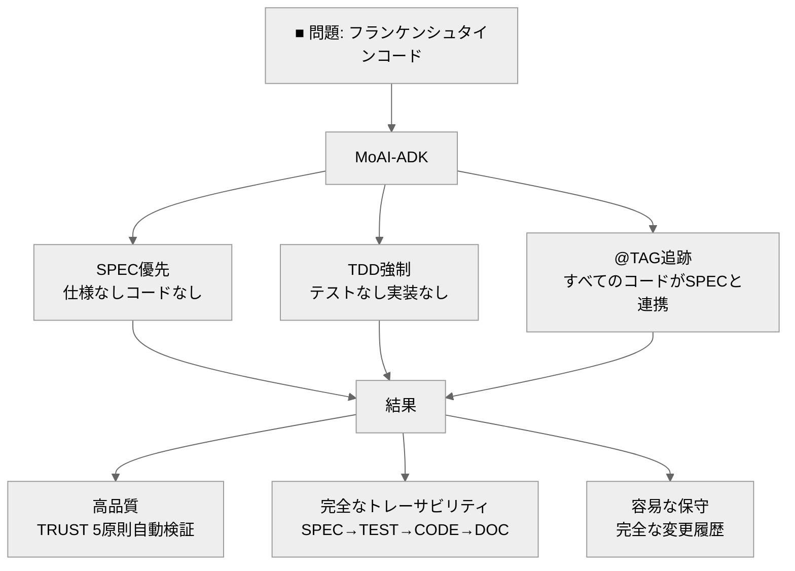

# MoAI-ADK (Agentic Development Kit)

[](https://pypi.org/project/moai-adk/)
[](https://opensource.org/licenses/MIT)
[](https://www.python.org/)
[](https://github.com/modu-ai/moai-adk/actions/workflows/moai-gitflow.yml)
[](https://codecov.io/gh/modu-ai/moai-adk)
[](https://github.com/modu-ai/moai-adk)

## MoAI-ADK: エージェンティックコーディング開発フレームワーク

**🌏 Languages**: [🇰🇷 한국어](./README.ko.md) | [🇺🇸 English](./README.md) | 🇯🇵 日本語 | [🇨🇳 中文](./README.zh.md) | [🇹🇭 ไทย](./README.th.md)


> **「仕様がなければコードもない」**

---

## MoAI-ADKとは？

MoAI-ADKは、AI支援開発による**SPEC優先TDD方法論**を可能にする汎用開発ツールキットです。以下を通じて高品質なソフトウェアを構築するための完全なフレームワークを提供します：

- 🎯 **SPEC優先開発**: すべての機能は明確な仕様から始まる
- 🧪 **テスト駆動開発**: 実装前に常にテスト
- 🏷️ **@TAG トレーサビリティ**: SPEC → TEST → CODE → DOCの完全な追跡
- 🤖 **Alfred SuperAgent**: 18以上の専門エージェントを管理するAIエージェントオーケストレーター
- 🌍 **汎用言語サポート**: 20以上のプログラミング言語で動作
- 🔒 **TRUST 5原則**: 自動品質保証

---

## 解決する課題

### AIコーディングの現実

- **「AIが生成したコードは保守不可能...」**
  - 同じ機能が毎回異なる実装
  - ファイルごとに一貫性のないコードスタイル
  - テストコードなし、バグ多数

- **「同じ質問、毎回異なる回答...」**
  - 以前の会話の記憶なし
  - 一貫したアーキテクチャの維持が困難
  - プロジェクト全体のコンテキストの欠如

- **「大量のコード、ドキュメントなし、追跡不可能...」**
  - なぜこのように実装されたか不明
  - コード変更履歴の追跡不可
  - 要件とコードの分断

- **「プロンプトエンジニアリングに終日費やす...」**
  - 完璧なプロンプトを見つけるために数十回の試行
  - AIに同じ制約を毎回繰り返し説明
  - 手動でのコード品質検証

### MoAI-ADKソリューション



---

## Alfred - AIエージェントエコシステム

こんにちは、MoAI SuperAgent **Alfred**です！


私はMoAI-ADKのSuperAgentであり中央オーケストレーターです。**AIエージェントチーム**（Alfred + 複数の専門エージェント）を調整して、Claude Code環境で完璧な開発サポートを提供します。

### ▶ 興味深い事実: AI構築のAI開発ツール

このプロジェクトのコードは**100% AIによって書かれています**。

- **AI協調設計**: GPT-5 ProとClaude 4.1 Opusが共同でアーキテクチャを設計
- **エージェンティックコーディング適用**: AIエージェントチーム（Alfred + 専門エージェント）がSPEC作成、TDD実装、ドキュメント同期を自律的に実行
- **透明性**: 不完全な部分を隠さず、コミュニティと共に改善するオープンソース

---

## クイックスタート（3分）

### インストール

```bash
# pipによるインストール
pip install moai-adk

# インストール確認
moai-adk --version
```

### 最初のプロジェクトを初期化

```bash
# 現在のディレクトリで初期化
moai-adk init

# 対話式プロンプトに従う:
# - プロジェクト名
# - 説明
# - 主要言語（Python、TypeScript、Java、Go、Rustなど）
# - モード（Personal/Team）
# - ロケール（ko/en/ja/zh/th）
```

### 3段階ワークフロー

```bash
# 1. SPEC作成（EARSメソッド）
/alfred:1-spec "ユーザー認証システム"
→ SPECドキュメント作成
→ featureブランチ作成
→ Draft PR作成

# 2. TDD実装（RED → GREEN → REFACTOR）
/alfred:2-build AUTH-001
→ RED: 失敗するテスト作成
→ GREEN: 最小実装
→ REFACTOR: コード品質向上

# 3. ドキュメント同期（TAGチェーン検証）
/alfred:3-sync
→ Living Document更新
→ @TAGチェーン整合性確認
→ PRをReadyに移行
```

---

## コア機能

### 1. SPEC優先TDD方法論

すべての開発はSPECドキュメントから始まります：

```yaml
---
id: AUTH-001
version: 0.0.1
status: draft
created: 2025-10-20
priority: high
---

# @SPEC:AUTH-001: JWT認証システム

## 要件（EARS形式）

### Ubiquitous
- システムはJWTベースの認証を提供しなければならない

### Event-driven
- WHEN ユーザーが有効な認証情報を提供すると、システムはJWTトークンを発行しなければならない
- WHEN トークンが期限切れになると、システムは401エラーを返さなければならない

### Constraints
- アクセストークンの有効期限は30分を超えてはならない
```

### 2. @TAGトレーサビリティシステム

```
@SPEC:AUTH-001 → @TEST:AUTH-001 → @CODE:AUTH-001 → @DOC:AUTH-001
```

すべてのコード要素は@TAGシステムを通じてSPECまで追跡されます。

### 3. TRUST 5原則

- **T**est First: 言語固有の最適ツール（Jest/Vitest、pytest、go test、cargo test、JUnit、flutter test）
- **R**eadable: 言語固有のリンター（ESLint/Biome、ruff、golint、clippy、dart analyze）
- **U**nified: 型安全性またはランタイム検証
- **S**ecured: 言語固有のセキュリティツールと静的解析
- **T**rackable: CODE-FIRST @TAGシステム（直接コードスキャン）

### 4. 汎用言語サポート

**20以上のプログラミング言語**:
- Python、TypeScript、JavaScript、Java、Go、Rust
- Dart、Swift、Kotlin、PHP、Ruby、Elixir
- Scala、Clojure、C++、C、C#、Haskell、Shell、Lua

**各言語は最適化されたツールチェーン**:
- 専用テストフレームワーク
- リンターとフォーマッター
- パッケージマネージャー
- ビルドシステム

---

## 18の専門エージェント

Alfredは18の専門エージェントを調整します：

### コアエージェント（9）
| エージェント | 役割 | 専門分野 | コマンド |
|-------|------|----------|---------|
| **spec-builder** 🏗️ | システムアーキテクト | SPEC作成、EARS | `/alfred:1-spec` |
| **code-builder** 💎 | リード開発者 | TDD実装 | `/alfred:2-build` |
| **doc-syncer** 📖 | テクニカルライター | ドキュメント同期 | `/alfred:3-sync` |
| **tag-agent** 🏷️ | ナレッジマネージャー | TAGトレーサビリティ | `@agent-tag-agent` |
| **git-manager** 🚀 | リリースエンジニア | Gitワークフロー | `@agent-git-manager` |
| **debug-helper** 🔬 | トラブルシューティング専門家 | エラー診断 | `@agent-debug-helper` |
| **trust-checker** ✅ | QAリード | TRUST検証 | `@agent-trust-checker` |
| **cc-manager** 🛠️ | DevOpsエンジニア | Claude Code設定 | `@agent-cc-manager` |
| **project-manager** 📋 | プロジェクトマネージャー | プロジェクト初期化 | `/alfred:0-project` |

### 0-project サブエージェント（6、v0.4.0の新機能）
| エージェント | 役割 | 専門分野 |
|-------|------|----------|
| **language-detector** 🔍 | テクアナリスト | 言語/フレームワーク検出 |
| **backup-merger** 📦 | データエンジニア | スマートバックアップファイルマージ |
| **project-interviewer** 💬 | ビジネスアナリスト | 要件収集 |
| **document-generator** 📝 | テクニカルライター | 自動ドキュメント化 |
| **feature-selector** 🎯 | アーキテクト | スキル選択（49のうち3-9） |
| **template-optimizer** ⚙️ | DevOpsエンジニア | テンプレート最適化 |

### 組み込みエージェント（3、Claude Code提供）
| エージェント | 専門分野 | ユースケース |
|-------|-----------|----------|
| **Explore** 🔍 | コードベース探索 | 大規模コードベースナビゲーション |
| **general-purpose** | 一般的なタスク | フォールバックエージェント |

---

## ドキュメント

- **クイックスタート**: [入門ガイド](./docs/getting-started.md)
- **SPEC作成**: [EARSメソッドガイド](./docs/spec-guide.md)
- **TDD実装**: [開発ガイド](./.moai/memory/development-guide.md)
- **@TAGシステム**: [TAG仕様](./.moai/memory/spec-metadata.md)
- **CLIリファレンス**: [コマンドリファレンス](./docs/cli-reference.md)
- **APIドキュメント**: [API Docs](./docs/api/)

---

## コントリビューション

コントリビューションを歓迎します！詳細は[CONTRIBUTING.md](./CONTRIBUTING.md)をご覧ください。

---

## ライセンス

MITライセンス - 詳細は[LICENSE](./LICENSE)をご覧ください。

---

## サポート

- **GitHub Issues**: [バグ報告や機能リクエスト](https://github.com/modu-ai/moai-adk/issues)
- **GitHub Discussions**: [質問やアイデアの共有](https://github.com/modu-ai/moai-adk/discussions)
- **ドキュメント**: [公式ドキュメント](./docs/)

---

**Made with ❤️ by MoAI Research Lab**

*MoAI-ADKは、MoAI Research Labによる「（仮題）エージェンティックコーディング」書籍プロジェクトの一部です。*
