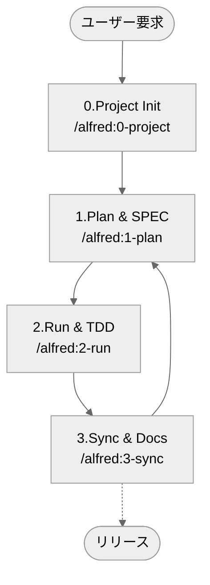

# MoAI-ADK (Agentic Development Kit)

[日本語](README.ja.md) | [한국어](README.ko.md) | [English](README.md)

[](https://pypi.org/project/moai-adk/)
[](https://opensource.org/licenses/MIT)
[](https://www.python.org/)
[](https://github.com/modu-ai/moai-adk/actions/workflows/moai-gitflow.yml)
[](https://github.com/modu-ai/moai-adk)

> **MoAI-ADKは、AIと共に仕様（SPEC）→テスト（TDD）→コード→ドキュメントを自然につなぐ開発ワークフローを提供します。**

---

## 1. MoAI-ADKの概要

MoAI-ADKは3つの中核原則でAI協業開発を革新します。以下のナビゲーションであなたの状況に合ったセクションへ移動してください。

MoAI-ADKを**初めてお使いになる場合**は「MoAI-ADKとは？」から始めてください。
**すぐに始めたい場合**は「5分クイックスタート」で直接進めます。
**既にインストール済みで概念を理解したい場合**は「核心概念の簡単な理解」をおすすめします。

| 質問                                    | すぐ見る                                             |
| --------------------------------------- | ----------------------------------------------------- |
| 初めて使いますが、何ですか？             | [MoAI-ADKとは？](#moai-adkとは)                        |
| どうやって始めますか？                  | [5分クイックスタート](#5-分-クイックスタート)         |
| 基本的な流れが知りたいです              | [基本ワークフロー (0 → 3)](#基本-ワークフロー-0--3)    |
| Plan / Run / Syncコマンドは何をしますか？ | [核心コマンド要約](#核心-コマンド-要約)               |
| SPEC·TDD·TAGとは何ですか？               | [核心概念の簡単な理解](#核心概念の簡単な理解)         |
| エージェント/Skillsが知りたいです        | [Sub-agent & Skills概要](#sub-agent--skills-概要)     |
| Claude Code Hooksが知りたいです        | [Claude Code Hooksガイド](#claude-code-hooks-ガイド) |
| もっと深く学びたいです                 | [追加資料](#追加-資料)                               |

---

## MoAI-ADKとは？

### 問題：AI開発の信頼性危機

今日、多くの開発者がClaudeやChatGPTの助けを求めたいと思っていますが、一つの根本的な疑念を払拭できません。「**このAIが作ったコードを本当に信頼できるか？**」

現実はこうです。AIに「ログイン機能を作って」と依頼すると、文法的に完璧なコードが出力されます。しかし、以下のような問題が繰り返されます：

- **要件不明確**：「正確に何を作るべきか」という基本的な質問に答えられません。メール/パスワードログイン？ OAuth？ 2FAは？ すべて推測に依存します。
- **テスト漏れ**：ほとんどのAIは「happy path」のみテストします。間違ったパスワードは？ ネットワークエラーは？ 3ヶ月後に本番でバグが発生します。
- **ドキュメント不一致**：コードが修正されてもドキュメントはそのままです。「なぜこのコードがここにあるのか」という質問が繰り返されます。
- **コンテキスト損失**：同じプロジェクトでも毎回最初から説明する必要があります。プロジェクトの構造、決定理由、以前の試みが記録されません。
- **変更影響把握不能**：要件が変更された時、どのコードが影響を受けるか追跡できません。

### 解決策：SPEC-First TDD with Alfred SuperAgent

**MoAI-ADK**(MoAI Agentic Development Kit)は、これらの問題を**体系的に解決**するように設計されたオープンソースフレームワークです。

核心原理は単純ですが強力です：

> **「コードなしではテストもなく、テストなしではSPECもない」**

より正確には逆順です：

> **「SPECが最初に出る。SPECなしではテストもない。テストとコードがなければドキュメントも完成しない」**

この順序を守る時、失敗しないエージェンティックコーディングを経験できます：

**1️⃣ 明確な要件**
`/alfred:1-plan`コマンドでSPECを最初に作成します。「ログイン機能」という曖昧な要求が「WHEN 有効な認証情報が提供されたらJWTトークンを発行しなければならない」という**明確な要件**に変換されます。Alfredのspec-builderがEARS文法を使い、たった3分で専門的なSPECを作成します。

**2️⃣ テスト保証**
`/alfred:2-run`で自動的にテスト駆動開発（TDD）を進めます。RED（失敗するテスト）→ GREEN（最小実装）→ REFACTOR（コード整理）の順で進み、**テストカバレッジは85%以上を保証**します。もう「後でテスト」はありません。テストがコード作成をリードします。

**3️⃣ ドキュメント自動同期**
`/alfred:3-sync`コマンド一つでコード、テスト、ドキュメントがすべて**最新状態に同期**されます。README、CHANGELOG、APIドキュメント、そしてLiving Documentまで自動的に更新されます。6ヶ月後でもコードとドキュメントは一致します。

**4️⃣ @TAGシステムでの追跡**
すべてのコードとテスト、ドキュメントに`@TAG:ID`を付けます。後で要件が変更されたら、`rg "@SPEC:EX-AUTH-001"`一つのコマンドで関連するテスト、実装、ドキュメントを**すべて見つけることができます**。リファクタリング時に自信が生まれます。

**5️⃣ Alfredがコンテキストを記憶**
AIエージェントたちが協力してプロジェクトの構造、決定理由、作業履歴を**すべて記憶**します。同じ質問を繰り返す必要がありません。

### MoAI-ADKの核心3つの約束

初心者も覚えられるように、MoAI-ADKの価値は3つに単純化されます：

**第一に、SPECがコードより先**
何を作るか明確に定義してから始めます。SPECを書いているうちに実装前に問題を発見できます。チームメンバーとのコミュニケーション費用が大幅に減ります。

**第二に、テストがコードをリードする（TDD）**
実装前にテストを最初に書きます（RED）。テストを通過させる最小実装をします（GREEN）。その後コードを整理します（REFACTOR）。結果：バグが少なく、リファクタリングに自信が生まれ、誰でも理解できるコード。

**第三に、ドキュメントとコードは常に一致する**
`/alfred:3-sync`一つのコマンドですべてのドキュメントが自動更新されます。README、CHANGELOG、APIドキュメント、Living Documentがコードと常に同期されます。半年前のコードを修正しようとする時の絶望感がなくなります。

---

## なぜ必要ですか？

### AI開発の現実的な課題

現代のAI協業開発は多様な挑戦に直面しています。MoAI-ADKはこれらすべての問題を**体系的に解決**します：

| 懸念                     | 従来方式の問題                        | MoAI-ADKの解決                                  |
| ------------------------ | --------------------------------------- | ------------------------------------------------ |
| 「AIコードを信頼できない」 | テストなしの実装、検証方法不明確      | SPEC → TEST → CODE順序強制、カバレッジ85%+保証 |
| 「毎回同じ説明を繰り返す」 | コンテキスト損失、プロジェクト履歴未記録 | Alfredがすべての情報を記憶、19個のAIチーム協力         |
| 「プロンプト作成が難しい」 | 良いプロンプトを作る方法を知らない        | `/alfred`コマンドが標準化されたプロンプトを自動提供     |
| 「ドキュメントが常に古い」 | コード修正後ドキュメント更新を忘れる       | `/alfred:3-sync`一つのコマンドで自動同期         |
| 「どこを修正したか分からない」 | コード検索が難しい、意図不明確           | @TAGチェーンでSPEC → TEST → CODE → DOCを連結      |
| 「チームオンボーディング時間が長い」 | 新しいチームメンバーがコード文脈を把握できない | SPECを読めば意図をすぐ理解可能                  |

### 今すぐ体験できる利益

MoAI-ADKを導入する瞬間から以下を感じられます：

- **開発速度向上**：明確なSPECで往復説明時間短縮
- **バグ減少**：SPECベースのテストで事前発見
- **コード理解度向上**：@TAGとSPECで意図を即座把握
- **保守費用削減**：コードとドキュメントが常に一致
- **チーム協業効率化**：SPECとTAGで明確なコミュニケーション

---

## ⚡ 3分超高速スタート

MoAI-ADKで**3ステップだけで**最初のプロジェクトを始めてください。初心者も5分以内に完了できます。

### ステップ1️⃣：インストール（約1分）

#### UVインストールコマンド

```bash
# macOS/Linux
curl -LsSf https://astral.sh/uv/install.sh | sh

# Windows (PowerShell)
powershell -c "irm https://astral.sh/uv/install.ps1 | iex"
```

#### 実際の出力（例）

```bash
# UVバージョン確認
uv --version
✓ uv 0.5.1 is already installed

$ uv --version
uv 0.5.1
```

#### 次へ：MoAI-ADKインストール

```bash
uv tool install moai-adk

# 結果: ✅ Installed moai-adk
```

**検証**：

```bash
moai-adk --version
# 出力: MoAI-ADK v1.0.0
```

---

### ステップ2️⃣：最初のプロジェクト作成（約2分）

#### コマンド

```bash
moai-adk init hello-world
cd hello-world
```

#### 実際に作成されるもの

```
hello-world/
├── .moai/              ✅ Alfred設定
├── .claude/            ✅ Claude Code自動化
└── CLAUDE.md           ✅ プロジェクトガイド
```

#### 検証：核心ファイル確認

```bash
# 核心設定ファイル確認
ls -la .moai/config.json  # ✅ 存在するか？
ls -la .claude/commands/  # ✅ コマンドがあるか？

# または一度に確認
moai-adk doctor
```

**出力例**：

```
✅ Python 3.13.0
✅ uv 0.5.1
✅ .moai/ directory initialized
✅ .claude/ directory ready
✅ 16 agents configured
✅ 74 skills loaded
```

---

### ステップ3️⃣：Alfred開始（約1-2分）

#### Claude Code実行

```bash
claude
```

#### Claude Codeで以下を入力

```
/alfred:0-project
```

#### Alfredが尋ねること

```
Q1: プロジェクト名は？
A: hello-world

Q2: プロジェクト目標は？
A: MoAI-ADK学習

Q3: 主な開発言語は？
A: python

Q4: モードは？
A: personal (ローカル開発用)
```

#### 結果：プロジェクト準備完了！ ✅

```
✅ プロジェクト初期化完了
✅ .moai/config.jsonに設定保存
✅ .moai/project/にドキュメント作成
✅ Alfredがスキル推薦完了

次のステップ: /alfred:1-plan "最初の機能説明"
```

---

## 🚀 次へ：10分で最初の機能完成

今実際に**機能を作り、ドキュメントも自動生成**してみてください！

> **→ 次のセクション：["最初の10分実践：Hello World API"](#-最初の10分実践-hello-world-api) へ移動**

このセクションでは：

- ✅ 簡単なAPIをSPECで定義する
- ✅ TDD (RED → GREEN → REFACTOR)完全体験
- ✅ 自動ドキュメント生成体験
- ✅ @TAGシステム理解

---

## 📖 インストールとプロジェクト設定完全ガイド

クイックスタート後、より詳しい説明が必要なら以下を参照してください。

### インストール詳細ガイド

**uvインストール後の追加確認**：

```bash
# PATH設定確認（必要な場合）
export PATH="$HOME/.cargo/bin:$PATH"

# 再確認
uv --version
```

**MoAI-ADKインストール後も他のコマンドが使用可能**：

```bash
moai-adk init          # プロジェクト初期化
moai-adk doctor        # システム診断
moai-adk update        # 最新バージョンに更新
```

### MCP (Model Context Protocol) 設定ガイド

MoAI-ADKは3つの核心MCPサーバーを使用してAI開発体験を最大化します：

#### 🔧 MCPサーバーの種類と用途

| MCPサービス | 主要機能 | 対象エージェント | インストール方法 |
|-----------|-----------|--------------|-----------|
| **Context7** | 最新ライブラリドキュメント検索 | すべての専門家エージェント | `npm install -g @context7/mcp-server` |
| **Figma** | デザインシステムおよびコンポーネント仕様 | ui-ux-expert | `npm install -g @figma/mcp-server` |
| **Playwright** | ウェブE2Eテスト自動化 | frontend-expert, tdd-implementer, quality-gate | `npm install -g @playwright/mcp-server` |

#### 📦 MCPサーバーインストール方法

**1. Claude Code設定を開く**：
```bash
# Claude Code設定ファイルを開く
claude-code settings
```

**2. MCPサーバー設定を追加**：
```json
{
  "mcpServers": {
    "context7": {
      "command": "node",
      "args": ["node_modules/@context7/mcp-server/dist/index.js"],
      "env": {}
    },
    "figma": {
      "command": "node",
      "args": ["node_modules/@figma/mcp-server/dist/index.js"],
      "env": {
        "FIGMA_ACCESS_TOKEN": "your_figma_token_here"
      }
    },
    "playwright": {
      "command": "node",
      "args": ["node_modules/@playwright/mcp-server/dist/index.js"],
      "env": {}
    }
  }
}
```

**3. トークン設定（Figmaのみ該当）**：
- Figma → Account Settings → Personal Access Tokens
- `FIGMA_DESIGN_TOKEN`を生成後、設定ファイルに追加

#### ✅ インストール確認

MCPサーバーが正常にインストールされると、以下のエージェントが自動的に機能拡張されます：

- **ui-ux-expert**: Figmaデザインシステム連携
- **frontend-expert**: Context7で最新ドキュメント参照
- **tdd-implementer**: Playwrightでテスト自動生成
- **quality-gate**: ウェブ品質検証自動化
- **すべての専門家**: Context7でリアルタイムドキュメント照会

#### 🔍 トラブルシューティング

**MCPサーバーが表示されない場合**：
1. Claude Code再起動
2. 設定ファイル文法確認
3. `claude-code --version`でClaude Codeバージョン確認
4. `node --version`でNode.jsバージョン確認（18+必要）

**詳細なMCP設定ガイド**: [Claude Code MCP Documentation](https://docs.claude.com/mcp)

### プロジェクト作成詳細ガイド

**新しいプロジェクト作成**：

```bash
moai-adk init my-project
cd my-project
```

**既存プロジェクトに追加**：

```bash
cd your-existing-project
moai-adk init .
```

作成される全体構造：

```
my-project/
├── .moai/                          # MoAI-ADKプロジェクト設定
│   ├── config.json                 # プロジェクト設定（言語、モード、所有者）
│   ├── project/                    # プロジェクト情報
│   │   ├── product.md              # 製品ビジョンと目標
│   │   ├── structure.md            # ディレクトリ構造
│   │   └── tech.md                 # 技術スタックおよびアーキテクチャ
│   ├── memory/                     # Alfredのナレッジベース（8ファイル）
│   ├── specs/                      # SPECファイル群
│   └── reports/                    # 分析レポート
├── .claude/                        # Claude Code自動化
│   ├── agents/                     # 16個のSub-agent（専門家含む）
│   ├── commands/                   # 4個のAlfredコマンド
│   ├── skills/                     # 74個のClaude Skills
│   ├── hooks/                      # 5個のイベント自動化フック
│   └── settings.json               # Claude Code設定
└── CLAUDE.md                       # Alfredの核心指示
```

---

## 核心概念：3ステップで繰り返す

一度設定したら、すべての機能開発はこの3ステップを繰り返します：

| ステップ        | コマンド                       | 実行作業                     | 時間 |
| ----------- | ---------------------------- | ----------------------------- | ---- |
| 📋 **PLAN** | `/alfred:1-plan "機能説明"` | SPEC作成 (EARS形式)         | 2分  |
| 💻 **RUN**  | `/alfred:2-run SPEC-ID`      | TDD実装 (RED→GREEN→REFACTOR) | 5分  |
| 📚 **SYNC** | `/alfred:3-sync`             | ドキュメント自動同期              | 1分  |

**1サイクル = 約8分** → **1日に7-8個の機能完成可能** ⚡

---

## 📦 MoAI-ADKの最新バージョン維持

### バージョン確認

```bash
# 現在インストールされているバージョン確認
moai-adk --version

# PyPIで最新バージョン確認
uv tool list  # moai-adkの現在バージョン確認
```

### アップグレード

MoAI-ADKは**2つの更新メカニズム**を提供します：

1. **`moai-adk update`**: パッケージバージョン + テンプレート同期（推奨）
2. **`uv tool upgrade`**: 標準uvツールアップグレード（選択）

#### 方法1: moai-adk独自更新コマンド（推奨 - 最も完全）

この方法はパッケージバージョン更新と同時にローカルテンプレートも自動的に同期します。

```bash
# ステップ1: MoAI-ADKパッケージ更新（+テンプレート同期）
moai-adk update
```

**何が更新されますか？**

- ✅ `moai-adk`パッケージ自体（PyPIの最新バージョン）
- ✅ 16個のSub-agentテンプレート
- ✅ 74個のClaude Skills
- ✅ 5個のClaude Code Hooks
- ✅ 4個のAlfredコマンド定義

---

## 🆕 既存プロジェクトにmoai-adkをインストール

すでに進行中のプロジェクトにMoAI-ADKを追加したい場合：

### ステップ1️⃣：プロジェクトディレクトリに移動

```bash
cd your-existing-project

# プロジェクト構造確認（選択）
ls -la
# src/, tests/, README.mdなどがあるか？
```

### ステップ2️⃣：MoAI-ADK初期化

```bash
# 現在のディレクトリに.moai/, .claude/を作成
moai-adk init .
```

**作成されるファイル/フォルダ**

```
your-existing-project/
├── .moai/                    ✅ 新規作成
│   ├── config.json
│   ├── project/
│   │   ├── product.md
│   │   ├── structure.md
│   │   └── tech.md
│   ├── memory/
│   ├── specs/
│   └── reports/
├── .claude/                  ✅ 新規作成
│   ├── agents/
│   ├── commands/
│   ├── skills/
│   ├── hooks/
│   └── settings.json
├── CLAUDE.md                 ✅ 新規作成
├── src/                      ✅ 維持
├── tests/                    ✅ 維持
└── README.md                 ✅ 維持
```

> ✅ **安全**: 既存コード（`src/`, `tests/`など）は絶対に触りません。

### ステップ3️⃣：設定確認

```bash
# Alfred設定確認
cat .moai/config.json

# プロジェクト情報確認
ls -la .moai/project/
```

### ステップ4️⃣：Claude Code実行

```bash
# Claude Code開始
claude

# プロジェクト初期化
/alfred:0-project
```

Alfredがプロジェクト情報を収集し、設定を最適化します。

---

## 基本ワークフロー (Project > Plan > Run > Sync)

Alfredは4つのコマンドでプロジェクトを反復開発します。



### 0. PROJECT — プロジェクト準備

- プロジェクト紹介、ターゲット、言語、モード(locale)質問
- `.moai/config.json`, `.moai/project/*`ドキュメント5種自動生成
- 言語検出および推奨Skill Pack配置（Foundation + Essentials + Domain/Language）
- テンプレート整理、初期Git/バックアップチェック

### 1. PLAN — 何を作るかSPEC生成

- EARSテンプレートでSPEC作成（`@SPEC:ID`含む）
- Plan Board、実装アイデア、リスク要素整理
- Teamモードならブランチ/初期Draft PR自動生成
- **状態遷移**: `planning` → `draft`

### 2. RUN — テスト駆動開発(TDD)

- Phase 1 `implementation-planner`: ライブラリ、フォルダ、TAG設計
- Phase 2 `tdd-implementer`: RED(失敗テスト) → GREEN(最小実装) → REFACTOR(整理)
- quality-gateがTRUST 5原則、カバレッジ変化を検証
- **状態遷移**: `draft` → `in_progress` → `testing`

### 3. SYNC — ドキュメント&PR整理

- Living Document、README、CHANGELOGなどドキュメント同期
- TAGチェーン検証およびorphan TAG回復
- Sync Report生成、Draft → Ready for Review転換、`--auto-merge`オプション対応
- **状態遷移**: `testing` → `completed`

---

## 核心コマンド要約

| コマンド                        | 何をしますか？                                                         | 代表的産出物                                                        |
| --------------------------- | ---------------------------------------------------------------------- | ------------------------------------------------------------------ |
| `/alfred:0-project`         | プロジェクト初期化：設定収集、ドキュメント作成、Skill推薦                       | `.moai/config.json`, `.moai/project/*`, 初期レポート                |
| `/alfred:0-project setting` | 既存設定修正：言語、ニックネーム、GitHub設定、レポート生成オプション変更        | 更新された`.moai/config.json`                                     |
| `/alfred:0-project update`  | テンプレート最適化：`moai-adk update`後ユーザーカスタマイゼーション保持       | マージされた`.claude/`, `.moai/`テンプレートファイル                            |
| `/alfred:1-plan <説明>`     | 要件分析、SPEC草案、Plan Board作成                              | `.moai/specs/SPEC-*/spec.md`, plan/acceptanceドキュメント、featureブランチ |
| `/alfred:2-run <SPEC-ID>`   | TDD実行、テスト/実装/リファクタリング、品質検証                              | `tests/`, `src/`実装、品質レポート、TAG連結                       |
| `/alfred:3-sync`            | ドキュメント/README/CHANGELOG同期、TAG/PR状態整理                         | `docs/`, `.moai/reports/sync-report.md`, Ready PR                  |
| `/alfred:9-feedback`        | MoAI-ADK改善フィードバックGitHub Issue作成 (タイプ → タイトル → 説明 → 優先順位) | GitHub Issue + 自動ラベル + 優先順位 + URL                          |

> ❗ すべてのコマンドは**Phase 0(選択) → Phase 1 → Phase 2 → Phase 3**循環構造を維持します。実行中状態と次のステップ提案はAlfredが自動的に報告します。

---

## 核心概念の簡単な理解

MoAI-ADKは5つの核心概念で構成されています。各概念は互いに連結されており、一緒に動作する時に強力な開発システムを作ります。

### 核心概念1：SPEC-First（要件先行）

**比喩**：建築家なしに建物を建てるように、設計図なしにコーディングしてはいけません。

**核心**：実装する前に**「何を作るか」を明確に定義**します。これは単なる文書ではなく、チームとAIが共同で理解できる**実行可能な仕様**です。

**EARS文法の5つのパターン**：

1. **Ubiquitous** (基本機能): 「システムはJWTベース認証を提供しなければならない」
2. **Event-driven** (条件付き): 「**WHEN** 有効な認証情報が提供されたら、システムはトークンを発行しなければならない」
3. **State-driven** (状態中): 「**WHILE** ユーザーが認証された状態である時、システムは保護されたリソースを許可しなければならない」
4. **Optional** (選択): 「**WHERE** リフレッシュトークンがあれば、システムは新しいトークンを発行できる」
5. **Constraints** (制約): 「トークン有効期限は15分を超えてはならない」

**どうやって？** `/alfred:1-plan`コマンドがEARS形式で専門的なSPECを自動的に作成します。

**得られるもの**：

- ✅ チーム全員が理解する明確な要件
- ✅ SPECベースのテストケース（何をテストするか既に定義済み）
- ✅ 要件変更時`@SPEC:ID` TAGで影響を受けるすべてのコード追跡可能

---

### 核心概念2：TDD (Test-Driven Development)

**比喩**：目的地を決めてから道を探すように、テストで目標を定めてコードを書きます。

**核心**：**実装**前に**テスト**を最初に書きます。これは料理前に材料を確認するように、実装前に要件が何か明確にします。

**3ステップ循環**：

1. **🔴 RED**: 失敗するテストを最初に書きます

   - SPECの各要件がテストケースになる
   - まだ実装がないので必ず失敗
   - Gitコミット: `test(AUTH-001): add failing test`

2. **🟢 GREEN**: テストを通過させる最小実装をします

   - 最も簡単な方法でテスト通過
   - 完璧さより通過が先
   - Gitコミット: `feat(AUTH-001): implement minimal solution`

3. **♻️ REFACTOR**: コードを整理し改善します
   - TRUST 5原則適用
   - 重複除去、可読性向上
   - テストは依然として通過しなければならない
   - Gitコミット: `refactor(AUTH-001): improve code quality`

**どうやって？** `/alfred:2-run`コマンドがこの3ステップを自動的に進めます。

**得られるもの**：

- ✅ カバレッジ85%以上保証（テストなしコードなし）
- ✅ リファクタリング自信（いつでもテストで検証可能）
- ✅ 明確なGit履歴（RED → GREEN → REFACTOR過程追跡）

---

### 核心概念3：@TAGシステム

**比喩**：宅配便伝票のように、コードの旅を追跡できる必要があります。

**核心**：すべてのSPEC、テスト、コード、ドキュメントに`@TAG:ID`を付けて**一対一対応**を作ります。

**TAGチェーン**：

```
@SPEC:EX-AUTH-001 (要件)
    ↓
@TEST:EX-AUTH-001 (テスト)
    ↓
@CODE:EX-AUTH-001 (実装)
    ↓
@DOC:EX-AUTH-001 (ドキュメント)
```

**TAG IDルール**: `<ドメイン>-<3桁数字>`

- AUTH-001, AUTH-002, AUTH-003...
- USER-001, USER-002...
- 一度割り当てられたら**絶対に変更しません**

**どうやって使用？** 要件が変更されたら：

```bash
# AUTH-001と関連するすべてを探す
rg '@TAG:AUTH-001' -n

# 結果: SPEC, TEST, CODE, DOCすべて一度に表示
# → どこを修正すべきか明確
```

**どうやって？** `/alfred:3-sync`コマンドがTAGチェーンを検証し、orphan TAG（対応しないTAG）を検出します。

**得られるもの**：

- ✅ すべてのコードの意図が明確（SPECを読めばなぜこのコードがあるか理解）
- ✅ リファクタリング時影響を受けるすべてのコード即座把握
- ✅ 3ヶ月後でもコード理解可能（TAG → SPEC追跡）

---

### 核心概念4：TRUST 5原則

**比喩**：健康な体のように、良いコードは5つの要素をすべて満たす必要があります。

**核心**：すべてのコードは以下の5つの原則を必ず守る必要があります。`/alfred:3-sync`がこれを自動的に検証します。

1. **🧪 Test First** (テスト先行)

   - テストカバレッジ ≥ 85%
   - すべてのコードがテストで保護される
   - 機能追加 = テスト追加

2. **📖 Readable** (読みやすいコード)

   - 関数 ≤ 50行、ファイル ≤ 300行
   - 変数名が意図を表す
   - リンター(ESLint/ruff/clippy)通過

3. **🎯 Unified** (一貫した構造)

   - SPECベースアーキテクチャ維持
   - 同じパターンが繰り返される（学習曲線減少）
   - タイプ安全性またはランタイム検証

4. **🔒 Secured** (セキュリティ)

   - 入力検証（XSS, SQL Injection防御）
   - パスワードハッシュ（bcrypt, Argon2）
   - 機密情報保護（環境変数）

5. **🔗 Trackable** (追跡可能)

   - @TAGシステム使用
   - GitコミットにTAG含む
   - すべての意思決定が文書化される

**どうやって？** `/alfred:3-sync`コマンドがTRUST検証を自動的に実行します。

**得られるもの**：

- ✅ プロダクション品質のコード保証
- ✅ チーム全体が同じ基準で開発
- ✅ バグ減少、セキュリティ脆弱性事前防止

---

### 核心概念5：Alfred SuperAgent

**比喩**：個人秘書のように、Alfredがすべての複雑な仕事を処理します。

**核心**：AIエージェントたちが協力して開発過程全体を自動化します：

**エージェント構成**：

- **Alfred SuperAgent**: 全体オーケストレーション
- **Core Sub-agent**: SPEC作成、TDD実装、ドキュメント同期などの専門業務
- **Zero-project Specialist**: プロジェクト初期化、言語検出など
- **Built-in Agent**: 一般質問、コードベース探索

**Claude Skills**：

- **Foundation**: TRUST/TAG/SPEC/Git/EARS原則
- **Essentials**: デバッグ、性能、リファクタリング、コードレビュー
- **Alfred**: ワークフロー自動化
- **Domain**: バックエンド、フロントエンド、セキュリティなど
- **Language**: Python, JavaScript, Go, Rustなど
- **Ops**: Claude Codeセッション管理

**どうやって？** `/alfred:*`コマンドが必要な専門家チームを自動的に活性化します。

**得られるもの**：

- ✅ プロンプト作成不要（標準化されたコマンド使用）
- ✅ プロジェクトコンテキスト自動記憶（同じ質問繰り返さず）
- ✅ 最適の専門家チーム自動構成（状況に合ったSub-agent活性化）

> **もっと深く知りたいですか？** `.moai/memory/development-guide.md`で詳細なルールを確認できます。

---

## 🚀 最初の10分実践：Hello World API

**目標**: MoAI-ADKの全体ワークフローを10分で体験する
**学ぶこと**: SPEC作成、TDD実装、ドキュメント自動化、@TAGシステム

> すでに3ステップ超高速スタートを完了したら、このセクションから始めてください！

### 事前準備

- ✅ MoAI-ADKインストール完了
- ✅ プロジェクト作成完了（`moai-adk init hello-world`）
- ✅ Claude Code実行中

---

### Step 1️⃣：SPEC作成（2分）

#### コマンド

```bash
/alfred:1-plan "GET /helloエンドポイント - クエリパラメータnameを受け取って挨拶を返す"
```

#### Alfredが自動生成

```
✅ SPEC ID: HELLO-001
✅ ファイル: .moai/specs/SPEC-HELLO-001/spec.md
✅ ブランチ: feature/SPEC-HELLO-001
```

#### 生成されたSPEC確認

```bash
cat .moai/specs/SPEC-HELLO-001/spec.md
```

**内容例**：

```yaml
---
id: HELLO-001
version: 0.0.1
status: draft
priority: high
---
# `@SPEC:EX-HELLO-001: Hello World API

## Ubiquitous Requirements
- システムはHTTP GET /helloエンドポイントを提供しなければならない

## Event-driven Requirements
- WHEN クエリパラメータnameが提供されたら、"Hello, {name}!"を返さなければならない
- WHEN nameがない場合、"Hello, World!"を返さなければならない

## Constraints
- nameは最大50文字に制限しなければならない
- 応答はJSON形式でなければならない
```

✅ **検証**: `ls .moai/specs/SPEC-HELLO-001/`

---

### Step 2️⃣：TDD実装（5分）

#### コマンド

```bash
/alfred:2-run HELLO-001
```

#### 🔴 RED Phase: 失敗するテスト作成

**生成されるファイル**: `tests/test_hello.py`

```python
# `@TEST:EX-HELLO-002 | SPEC: SPEC-HELLO-001.md

import pytest
from fastapi.testclient import TestClient
from src.hello.api import app

client = TestClient(app)

def test_hello_with_name_should_return_personalized_greeting():
    """WHEN nameが提供されたら、"Hello, {name}!"を返さなければならない"""
    response = client.get("/hello?name=太郎")
    assert response.status_code == 200
    assert response.json() == {"message": "Hello, 太郎!"}

def test_hello_without_name_should_return_default_greeting():
    """WHEN nameがない場合、"Hello, World!"を返さなければならない"""
    response = client.get("/hello")
    assert response.status_code == 200
    assert response.json() == {"message": "Hello, World!"}
```

**実行**:

```bash
pytest tests/test_hello.py -v
```

**結果**: ❌ FAILED (appがない - 正常！)

**Gitコミット**:

```bash
git add tests/test_hello.py
git commit -m "🔴 test(HELLO-001): add failing hello API tests"
```

---

#### 🟢 GREEN Phase: 最小実装

**生成されるファイル**: `src/hello/api.py`

```python
# `@CODE:EX-HELLO-001:API | SPEC: SPEC-HELLO-001.md | TEST: tests/test_hello.py

from fastapi import FastAPI

app = FastAPI()

@app.get("/hello")
def hello(name: str = "World"):
    """@CODE:EX-HELLO-001:API - Hello endpoint"""
    return {"message": f"Hello, {name}!"}
```

**実行**:

```bash
pytest tests/test_hello.py -v
```

**結果**: ✅ PASSED (すべて通過！)

**Gitコミット**:

```bash
git add src/hello/api.py
git commit -m "🟢 feat(HELLO-001): implement hello API"
```

---

#### ♻️ REFACTOR Phase: コード改善

**検証ロジック追加**:

```python
from fastapi import FastAPI, HTTPException

app = FastAPI()

@app.get("/hello")
def hello(name: str = "World"):
    """@CODE:EX-HELLO-001:API - Hello endpoint with validation"""
    if len(name) > 50:
        raise HTTPException(status_code=400, detail="Name too long (max 50 chars)")
    return {"message": f"Hello, {name}!"}
```

**テスト追加**:

```python
def test_hello_with_long_name_should_return_400():
    """nameが50文字を超えると400エラーを返さなければならない"""
    long_name = "a" * 51
    response = client.get(f"/hello?name={long_name}")
    assert response.status_code == 400
```

**実行**:

```bash
pytest tests/test_hello.py -v
```

**結果**: ✅ PASSED (すべて通過！)

**Gitコミット**:

```bash
git add tests/test_hello.py src/hello/api.py
git commit -m "♻️ refactor(HELLO-001): add name length validation"
```

---

### Step 3️⃣：ドキュメント同期（2分）

#### コマンド

```bash
/alfred:3-sync
```

#### Alfredが自動処理

```
✅ docs/api/hello.md - APIドキュメント生成
✅ README.md - API使用法追加
✅ CHANGELOG.md - v0.1.0リリースノート追加
✅ TAGチェーン検証 - すべて@TAG確認
```

#### 生成されたAPIドキュメント確認

```bash
cat docs/api/hello.md
```

**内容例**：

````markdown
# Hello API Documentation

## GET /hello

### Description

名前を受け取ってパーソナライズされた挨拶を返します。

### Parameters

- `name` (query, optional): 名前（デフォルト: "World", 最大50文字）

### Responses

- **200**: 成功
  ```json
  { "message": "Hello, 太郎!" }
  ```

- **400**: 名前が長すぎる

### Examples

```bash
curl "http://localhost:8000/hello?name=太郎"
# → {"message": "Hello, 太郎!"}

curl "http://localhost:8000/hello"
# → {"message": "Hello, World!"}
```

### Traceability

- `@SPEC:EX-HELLO-001` - 要件
- `@TEST:EX-HELLO-002` - テスト
- `@CODE:EX-HELLO-001:API` - 実装
````

---

### Step 4️⃣：TAGチェーン検証（1分）

#### コマンド
```bash
rg '@(SPEC|TEST|CODE|DOC):HELLO-001' -n
````

#### 出力（完全な追跡性）

```
.moai/specs/SPEC-HELLO-001/spec.md:7:# `@SPEC:EX-HELLO-001: Hello World API
tests/test_hello.py:3:# `@TEST:EX-HELLO-002 | SPEC: SPEC-HELLO-001.md
src/hello/api.py:3:# `@CODE:EX-HELLO-001:API | SPEC: SPEC-HELLO-001.md
docs/api/hello.md:24:- `@SPEC:EX-HELLO-001`
```

✅ **意味**: 要件 → テスト → 実装 → ドキュメントが完全に連結！

---

### 🎉 10分後：あなたが得たもの

#### 生成されたファイル群

```
hello-world/
├── .moai/specs/SPEC-HELLO-001/
│   ├── spec.md              ← 要件ドキュメント
│   └── plan.md              ← 計画
├── tests/test_hello.py      ← テスト（100%カバレッジ）
├── src/hello/
│   ├── api.py               ← API実装
│   └── __init__.py
├── docs/api/hello.md        ← APIドキュメント
├── README.md                ← 更新済み
└── CHANGELOG.md             ← v0.1.0リリースノート
```

#### Git履歴

```bash
git log --oneline | head -4
```

**出力**:

```
c1d2e3f ♻️ refactor(HELLO-001): add name length validation
b2c3d4e 🟢 feat(HELLO-001): implement hello API
a3b4c5d 🔴 test(HELLO-001): add failing hello API tests
d4e5f6g Merge branch 'develop' (initial project commit)
```

#### 学んだこと整理

- ✅ **SPEC**: EARS形式で要件を明確に定義
- ✅ **TDD**: RED → GREEN → REFACTORサイクル体験
- ✅ **自動化**: ドキュメントがコードと一緒に自動生成
- ✅ **追跡性**: @TAGシステムですべてのステップが連結
- ✅ **品質**: テスト100%、明確な実装、自動ドキュメント化

---

## 🚀 次のステップ

今より複雑な機能を作ってみてください：

```bash
# 次の機能開始
/alfred:1-plan "ユーザーデータベース照会API"
```

または高度な例を希望なら以下を参照してください。

---

## Sub-agent & Skills概要

Alfredは複数の専門エージェントとClaude Skillsを組み合わせて作業します。

### Core Sub-agents (Plan → Run → Sync)

| Sub-agent          | モデル   | 役割                                                         |
| ------------------ | ------ | ------------------------------------------------------------ |
| project-manager 📋 | Sonnet | プロジェクト初期化、メタデータインタビュー                           |
| spec-builder 🏗️    | Sonnet | Planボード、EARS SPEC作成、専門家相談推奨                  |
| code-builder 💎    | Sonnet | `implementation-planner` + `tdd-implementer`でTDD全体実行 |
| doc-syncer 📖      | Haiku  | Living Doc, README, CHANGELOG同期                         |
| tag-agent 🏷️       | Haiku  | TAGインベントリ、orphan検出、@EXPERT TAG検証                  |
| git-manager 🚀     | Haiku  | GitFlow, Draft/Ready, Auto Merge                             |
| debug-helper 🔍    | Sonnet | 失敗分析、fix-forward戦略                                  |
| trust-checker ✅   | Haiku  | TRUST 5品質ゲート                                          |
| quality-gate 🛡️    | Haiku  | カバレッジ変化およびリリースブロック条件検討                       |
| cc-manager 🛠️      | Sonnet | Claude Codeセッション最適化、Skill配布                          |

### 専門家エージェント (SPECキーワードで自動活性化)

専門家エージェントは`implementation-planner`がSPECドキュメントでドメイン別キーワードを検知すると自動的に活性化されます。各専門家は自分のドメインに対するアーキテクチャガイド、技術推奨、リスク分析を提供します。

| 専門家エージェント    | モデル   | 専門分野                             | 自動活性化キーワード                                                     |
| ------------------ | ------ | ------------------------------------- | ---------------------------------------------------------------------- |
| backend-expert 🔧  | Sonnet | Backendアーキテクチャ、API設計、DB        | 'backend', 'api', 'server', 'database', 'deployment', 'authentication' |
| frontend-expert 💻 | Sonnet | Frontendアーキテクチャ、コンポーネント、状態管理 | 'frontend', 'ui', 'page', 'component', 'client-side', 'web interface'  |
| devops-expert 🚀   | Sonnet | DevOps, CI/CD, 配布、コンテナ         | 'deployment', 'docker', 'kubernetes', 'ci/cd', 'pipeline', 'aws'       |
| ui-ux-expert 🎨    | Sonnet | UI/UX設計、アクセシビリティ、デザインシステム     | 'design', 'ux', 'accessibility', 'a11y', 'figma', 'design system'      |

**動作原理**：

- `/alfred:2-run`開始時、`implementation-planner`がSPEC内容をスキャン
- 一致するキーワードが該当専門家エージェントを自動活性化
- 各専門家はドメイン別アーキテクチャガイド提供
- すべての専門家相談は追跡性のために`@EXPERT:DOMAIN`タグで表示

### Skills (Progressive Disclosure)

AlfredはClaude Skillsを4-tierアーキテクチャで構成し、必要な時だけJust-In-Timeロードする**Progressive Disclosure**方式を使用します。各Skillは`.claude/skills/`ディレクトリに保存されたプロダクション級ガイドです。

#### Foundation Tier

核心TRUST/TAG/SPEC/Git/EARS/Language原則を含む基盤スキル

| Skill                   | 説明                                                                       |
| ----------------------- | -------------------------------------------------------------------------- |
| `moai-foundation-trust` | TRUST 5-principles (Test 85%+, Readable, Unified, Secured, Trackable) 検証 |
| `moai-foundation-tags`  | @TAGマーカースキャンおよびインベントリ生成 (CODE-FIRST原則)                       |
| `moai-foundation-specs` | SPEC YAML frontmatterおよびHISTORYセクション検証                                 |
| `moai-foundation-ears`  | EARS (Easy Approach to Requirements Syntax) 要件作成ガイド           |
| `moai-foundation-git`   | Git workflow自動化 (branching, TDD commits, PR管理)                      |
| `moai-foundation-langs` | プロジェクト言語/フレームワーク自動検出 (package.json, pyproject.tomlなど)       |

#### Essentials Tier

日常開発業務に必要な核心ツール群

| Skill                      | 説明                                           |
| -------------------------- | ---------------------------------------------- |
| `moai-essentials-debug`    | スタックトレース分析、エラーパターン検出、迅速診断支援 |
| `moai-essentials-perf`     | 性能プロファイリング、ボトルネック検出、チューニング戦略     |
| `moai-essentials-refactor` | リファクタリングガイド、設計パターン、コード改善戦略     |
| `moai-essentials-review`   | 自動コードレビュー、SOLID原則、コード臭い検出     |

#### Alfred Tier

MoAI-ADK内部ワークフローオーケストレーションスキル

| Skill                                  | 説明                                                                |
| -------------------------------------- | ------------------------------------------------------------------- |
| `moai-alfred-ears-authoring`           | EARS構文検証およびrequirementパターンガイド                           |
| `moai-alfred-git-workflow`             | MoAI-ADK conventions (feature branch, TDD commits, Draft PR) 自動化 |
| `moai-alfred-language-detection`       | プロジェクト言語/ランタイム検出および基本テストツール推奨                  |
| `moai-alfred-spec-metadata-validation` | SPEC YAML frontmatterおよびHISTORYセクション整合性検証                   |
| `moai-alfred-tag-scanning`             | @TAGマーカー全体スキャンおよびインベントリ生成 (CODE-FIRST原則)              |
| `moai-alfred-trust-validation`         | TRUST 5-principles遵守検証                                        |
| `moai-alfred-ask-user-questions`    | Claude Code Tools AskUserQuestion TUIメニュー標準化                   |

#### Domain Tier

特化されたドメイン専門知識

| Skill                        | 説明                                                                              |
| ---------------------------- | --------------------------------------------------------------------------------- |
| `moai-domain-backend`        | バックエンドアーキテクチャ、API設計、スケーリングガイド                                        |
| `moai-domain-cli-tool`       | CLIツール開発、引数パース、POSIX準拠、ユーザーフレンドリーhelpメッセージ                    |
| `moai-domain-data-science`   | データ分析、可視化、統計モデリング、再現可能な研究ワークフロー                     |
| `moai-domain-database`       | データベース設計、スキーマ最適化、インデックス戦略、マイグレーション管理                  |
| `moai-domain-design-systems` | デザインシステムアーキテクチャ、W3C DTCGトークン、WCAG 2.2アクセシビリティ、デザイン-to-コード、Figma MCP |
| `moai-domain-devops`         | CI/CDパイプライン、Docker containerization, Kubernetesオーケストレーション、IaC         |
| `moai-domain-frontend`       | React/Vue/Angular開発、状態管理、性能最適化、アクセシビリティ                            |
| `moai-domain-ml`             | 機械学習モデル学習、評価、配布、MLOpsワークフロー                                  |
| `moai-domain-mobile-app`     | Flutter/React Native開発、状態管理、ネイティブ統合                               |
| `moai-domain-security`       | OWASP Top 10, 静的分析 (SAST), 依存性セキュリティ、secrets管理                         |
| `moai-domain-web-api`        | REST API, GraphQL設計パターン、認証、バージョン管理、OpenAPI文書化                      |

#### Language Tier

プログラミング言語別最高慣行

| Skill                  | 説明                                                   |
| ---------------------- | ------------------------------------------------------ |
| `moai-lang-python`     | pytest, mypy, ruff, black, uvパッケージ管理              |
| `moai-lang-typescript` | Vitest, Biome, strict typing, npm/pnpm                 |
| `moai-lang-javascript` | Jest, ESLint, Prettier, npmパッケージ管理                |
| `moai-lang-go`         | go test, golint, gofmt, 標準ライブラリ                |
| `moai-lang-rust`       | cargo test, clippy, rustfmt, ownership/borrow checker  |
| `moai-lang-java`       | JUnit, Maven/Gradle, Checkstyle, Spring Bootパターン      |
| `moai-lang-kotlin`     | JUnit, Gradle, ktlint, coroutines, extension functions |
| `moai-lang-swift`      | XCTest, SwiftLint, iOS/macOS開発パターン                 |
| `moai-lang-dart`       | flutter test, dart analyze, Flutter widgetパターン        |
| `moai-lang-csharp`     | xUnit, .NET tooling, LINQ, async/awaitパターン            |
| `moai-lang-cpp`        | Google Test, clang-format, 現代C++ (C++17/20)         |
| `moai-lang-c`          | Unity test framework, cppcheck, Makeビルドシステム       |
| `moai-lang-scala`      | ScalaTest, sbt, 関数型プログラミングパターン                 |
| `moai-lang-ruby`       | RSpec, RuboCop, Bundler, Railsパターン                    |
| `moai-lang-php`        | PHPUnit, Composer, PSR標準                            |
| `moai-lang-sql`        | テストフレームワーク、クエリ最適化、マイグレーション管理      |
| `moai-lang-shell`      | bats, shellcheck, POSIX準拠                           |
| `moai-lang-r`          | testthat, lintr, データ分析パターン                      |

#### Claude Code Ops

Claude Codeセッション管理

| Skill              | 説明                                                                     |
| ------------------ | ------------------------------------------------------------------------ |
| `moai-claude-code` | Claude Code agents, commands, skills, plugins, settingsスキャフォールディングおよび監視 |

> Claude Skillsが4-tierアーキテクチャで構成されました（v0.4.10で100%完成）。各SkillはProgressive Disclosureを通じて必要な時だけロードされ、コンテキスト費用を最小化します。Foundation → Essentials → Alfred → Domain/Language/Ops階層で構成されており、すべてのスキルがプロダクション級ドキュメントと実行可能なTDD例を含みます。

---

## AIモデル選択ガイド

| 状況                              | 基本モデル             | 理由                               |
| --------------------------------- | --------------------- | ---------------------------------- |
| 仕様/設計/リファクタリング/問題解決      | **Claude 4.5 Sonnet** | 深い推論と構造化された作成に強い   |
| ドキュメント同期、TAG検査、Git自動化 | **Claude 4.5 Haiku**  | 迅速な反復作業、文字列処理に強い |

- パターン化された作業はHaikuで始め、複雑な判断が必要ならSonnetに転換してください。
- 手動でモデルを変更したら「なぜ転換したか」ログに残しておくと協業に役立ちます。

---

## Claude Code Hooksガイド

MoAI-ADKは開発フローと滑らかに統合される5つのClaude Code Hooksを提供します。これらのHookはセッション開始/終了、ツール実行前後、プロンプト提出時点に自動的に動作し、チェックポイント、JITコンテキストローディング、セッション管理などを透過的に処理します。

### Hookとは？

HookはClaude Codeセッションの特定イベントに反応するイベントベースのスクリプトです。使用フローを妨げずにバックグラウンドで安全装置と生産性向上を提供します。

### インストールされたHooks (5個)

| Hook             | 状態    | 機能                                                                                        |
| ---------------- | ------- | ------------------------------------------------------------------------------------------- |
| SessionStart     | ✅ 活性 | 言語/Git/SPEC進行/チェックポイントなどプロジェクト状態要約                                         |
| PreToolUse       | ✅ 活性 | リスク検出 + 自動チェックポイント(削除/マージ/大量編集/重要ファイル) + **TAG Guard** (漏れた@TAG検出) |
| UserPromptSubmit | ✅ 活性 | JITコンテキストローディング(@SPEC·テスト·コード·ドキュメント自動ロード)                                         |
| PostToolUse      | ✅ 活性 | コード変更後自動テスト(パイソン/TS/JS/Go/Rust/Javaなど)                                      |
| SessionEnd       | ✅ 活性 | セッション整理および状態保存                                                                      |

#### TAG Guard

PreToolUse Hookで動作する自動@TAG検証システム：

- ステージング、修正、未追跡ファイル自動スキャン
- SPEC/TEST/CODE/DOCファイルに@TAGマーカーがないと警告
- `.moai/tag-rules.json`でルール設定可能
- 非ブロッキング方式（穏やかな通知、実行を中断しない）

**警告メッセージ例**：

```
⚠️ TAG漏れ検出: 作成/修正したファイルの中に@TAGがない項目があります。
 - src/auth/service.py → 期待タグ: @CODE:
 - tests/test_auth.py → 期待タグ: @TEST:
推奨措置:
  1) SPEC/TEST/CODE/DOCタイプに合った@TAGをファイル上部コメントやヘッダーに追加
  2) rgで確認: rg '@(SPEC|TEST|CODE|DOC):' -n <パス>
```

**Why It Matters**: コード追跡性を保証し@TAGチェーンが完全になるようにします。間違ってTAGを漏らすことを防ぎます。

---

## 🔧 初心者のためのトラブルシューティング

MoAI-ADK開始時によく遭遇するエラーと解決方法です。

### 1️⃣ uvがインストールされていません

**症状**：

```bash
$ uv --version
bash: uv: command not found
```

**原因**: uvがインストールされていないかPATHに登録されていない

**解決**：

**macOS/Linux**:

```bash
# インストール
curl -LsSf https://astral.sh/uv/install.sh | sh

# シェル再起動
source ~/.bashrc  # または ~/.zshrc

# 検証
uv --version
```

**Windows (PowerShell)**:

```powershell
powershell -c "irm https://astral.sh/uv/install.ps1 | iex"

# 検証
uv --version
```

**依然として失敗する場合**：

```bash
# PATH手動追加 (macOS/Linux)
export PATH="$HOME/.cargo/bin:$PATH"

# 再確認
uv --version
```

---

### 2️⃣ Pythonバージョンが合いません

**症状**：

```
Python 3.8 found, but 3.13+ required
```

**原因**: Pythonバージョンが3.13未満

**解決**：

**Option A: pyenv使用（推奨）**:

```bash
# pyenvインストール
curl https://pyenv.run | bash

# Python 3.13インストール
pyenv install 3.13
pyenv global 3.13

# 検証
python --version  # Python 3.13.x
```

**Option B: uvでPython自動管理**:

```bash
# uvが自動でPython 3.13ダウンロード
uv python install 3.13
uv python pin 3.13

# 検証
python --version
```

---

### 3️⃣ Gitがインストールされていません

**症状**：

```
✗ Git (runtime): not found
```

**原因**: Gitがシステムにインストールされていない

**解決**：

**macOS**:

```bash
# Homebrewでインストール
brew install git

# またはXcode Command Line Tools
xcode-select --install
```

**Ubuntu/Debian**:

```bash
sudo apt update
sudo apt install git -y
```

**Windows**:

```powershell
# wingetでインストール
winget install Git.Git

# または手動ダウンロード
# https://git-scm.com/download/win
```

**検証**:

```bash
git --version  # git version 2.x.x
```

---

### 4️⃣ Claude Codeが.moai/フォルダを認識しません

**症状**：

```
"プロジェクトが初期化されていません"
/alfred:0-projectコマンドが動作しない
```

**原因**: `.moai/`または`.claude/`フォルダがないか破損している

**解決**：

```bash
# 1. 現在のディレクトリ確認
pwd  # /path/to/your-project

# 2. .moai/フォルダ確認
ls -la .moai/config.json

# 3. なければ再初期化
moai-adk init .

# 4. Claude Code再起動
exit  # Claude Code終了
claude  # Claude Code再起動
```

**検証**:

```bash
moai-adk doctor
# すべての項目が✅表示されるべき
```

---

### 5️⃣ テスト実行時モジュールが見つかりません

**症状**：

```
FAILED tests/test_hello.py - ModuleNotFoundError: No module named 'fastapi'
```

**原因**: 必要なパッケージがインストールされていない

**解決**：

```bash
# プロジェクトルートで依存性インストール
uv sync

# 特定パッケージのみインストール必要なら
uv add fastapi pytest

# 仮想環境活性化後再実行
source .venv/bin/activate  # macOS/Linux
.venv\Scripts\activate     # Windows

pytest tests/ -v
```

---

### 6️⃣ /alfredコマンドが動作しません

**症状**：

```
Unknown command: /alfred:1-plan
```

**原因**: Claude Codeバージョン問題または`.claude/`フォルダ破損

**解決**：

```bash
# 1. Claude Codeバージョン確認 (最低v1.5.0+)
claude --version

# 2. .claude/フォルダ確認
ls -la .claude/commands/

# 3. 必要なら再初期化
moai-adk init .

# 4. Claude Code再起動
exit
claude
```

---

### 7️⃣ TAGチェーンが壊れました

**症状**：

```
✅ Fixed: @TEST:EX-HELLO-002 (TAG ID updated for consistency)
```

**原因**: SPECが削除されたかTAGが不一致

**解決**：

```bash
# 1. TAGチェーン検証
rg '@(SPEC|TEST|CODE):HELLO-001' -n

# 2. 漏れたTAG確認
rg '@SPEC:EX-HELLO-001' -n .moai/specs/

# 3. SPECがなければ再生成
/alfred:1-plan "機能説明"

# またはテストのTAG修正
# tests/test_hello.pyで@TEST:EX-HELLO-002に修正完了

# 4. 同期
/alfred:3-sync
```

---

### 8️⃣ 一般的なデバッグコマンド

**システム状態確認**：

```bash
moai-adk doctor
```

**出力**: すべての依存性チェック + 推奨事項

**プロジェクト構造確認**：

```bash
tree -L 2 .moai/
```

**TAGチェーン完全性検証**：

```bash
rg '@(SPEC|TEST|CODE|DOC):' -n | wc -l
```

**出力**: 総TAG数

**Git状態確認**：

```bash
git status
git log --oneline -5
```

---

### 💡 一般的なデバッグ順序

1. **読む**: エラーメッセージ全体を読んでコピー
2. **検索**: エラーメッセージでGitHub Issues検索
3. **検証**: `moai-adk doctor`実行
4. **再起動**: Claude Code再起動
5. **質問**: GitHub Discussionsで質問

```bash
# 迅速診断（詳細情報）
moai-adk doctor --verbose
```

---

### 🆘 依然として解決しない場合？

- **GitHub Issues**: 類似のイシューがあるか検索
- **GitHub Discussions**: 質問する
- **Discordコミュニティ**: リアルタイム質問

**報告時に含めるべき情報**：

1. `moai-adk doctor --verbose`出力
2. エラーメッセージ全体（スクリーンショットまたはコピー）
3. 再現方法（どのコマンドを実行したか？）
4. オペレーティングシステムおよびバージョン

---

## 🚀 迅速なイシュー生成：`/alfred:9-feedback`

MoAI-ADK使用中にバグが発生したか機能をリクエストしたいですか？ Claude Codeでたった一行のコマンドで自動イシュー生成が可能です。

### 概要

```bash
/alfred:9-feedback
```

このコマンドを実行するとAlfredが対話的質問を通じてイシューを自動生成します：
- 🐛 **バグレポート** - 問題状況記録
- ✨ **機能リクエスト** - 新機能提案
- ⚡ **改善事項** - 既存機能改善提案
- ❓ **質問/議論** - チームとの質問

### 実行例

```bash
# Claude Codeで実行
/alfred:9-feedback
```

### 対話的段階別進行

**1️⃣ イシュータイプ選択**

```
どのタイプのイシューを作成したいですか？

[ ] 🐛 Bug Report - 問題が発生しました
[ ] ✨ Feature Request - 新機能を提案します
[ ] ⚡ Improvement - 既存機能を改善します
[ ] ❓ Question/Discussion - チームに質問します
```

**2️⃣ イシュータイトル入力**

```
イシュータイトルを入力してください（簡潔明瞭に）：
例: moai-adk update実行中テンプレート同期エラー発生
```

**3️⃣ 詳細説明入力（選択事項）**

```
詳細な説明を入力してください（Enterキーで省略可能）：

例:
moai-adk update実行時以下のエラー発生：
- 症状: .claude/ディレクトリ権限エラー
- 環境: macOS 14.2, Python 3.13, moai-adk v0.15.0
- 期待動作: テンプレートが正常に同期されるべき
- 実際動作: Permission deniedエラーで中断
```

**4️⃣ 優先順位選択**

```
優先順位レベルを選択してください：

[ ] 🔴 Critical - システムダウン、データ損失、セキュリティ問題
[ ] 🟠 High - 主要機能故障、深刻な影響
[✓] 🟡 Medium - 一般優先順位（基本値）
[ ] 🟢 Low - 軽微な問題、やっても良いがやらなくても良い
```

### 自動イシュー生成

Alfredが自動的に：
1. タイトルに絵文字追加：`🐛 [BUG] moai-adk update実行中テンプレート同期エラー発生`
2. GitHubイシュー形式でフォーマッティング
3. 適切なラベル自動割り当て：`bug`, `reported`, `priority-high`
4. リポジトリにイシュー生成

### 完了後出力

```
✅ GitHub Issue #245生成完了！

📋 タイトル: 🐛 [BUG] moai-adk update実行中テンプレート同期エラー発生
🔴 優先順位: High
🏷️  ラベル: bug, reported, priority-high
🔗 リンク: https://github.com/modu-ai/moai-adk/issues/245

💡 ヒント: このイシュー番号をコミットメッセージで参照できます
```

### 主要特徴

| 特徴           | 説明                                                     |
| -------------- | -------------------------------------------------------- |
| **コマンド簡単** | 引数なしに`/alfred:9-feedback`のみ実行                    |
| **対話的**     | 直観的な段階別質問でイシュー生成                        |
| **自動ラベル**  | イシュータイプと優先順位に応じて自動ラベル割り当て           |
| **即時生成**  | 約30秒以内にイシューがGitHubに生成                      |
| **チーム共有**    | 生成されたイシューは即座にチームと共有され追跡可能                |

---

## よくある質問（FAQ）

- **Q. 既存プロジェクトにインストールしてもいいですか？**
  - A. 可能です。`moai-adk init .` を実行すると既存コードを触らずに`.moai/`構造のみ追加します。
- **Q. テスト実行はどうしますか？**
  - A. `/alfred:2-run`が最初に実行し、必要なら`pytest`, `pnpm test`など言語別コマンドを再実行してください。
- **Q. ドキュメントが常に最新か確認する方法は？**
  - A. `/alfred:3-sync`がSync Reportを生成します。Pull Requestでレポートを確認してください。
- **Q. 手動で進めることもできますか？**
  - A. 可能ですが、SPEC → TEST → CODE → DOC順序を守りTAGを必ず残す必要があります。

---

## 最新アップデート

| バージョン        | 主要機能                                                                                                         | 日付       |
| ----------- | ----------------------------------------------------------------------------------------------------------------- | ---------- |
| **v0.17.0** | 🌍 **多言語リント/フォーマットアーキテクチャ** (Python, JS, TS, Go, Rust, Java, Ruby, PHP) - 自動言語検出 + Non-blockingエラー | 2025-11-04 |
| **v0.16.x** | ✅ 4個Alfredコマンド100%命令形指示完成 + Hookアーキテクチャ安定化                                                  | 2025-11-03 |
| **v0.8.2**  | 📖 EARS用語更新: "Constraints" → "Unwanted Behaviors" (明確性改善)                                         | 2025-10-29 |
| **v0.8.1**  | 🔄 コマンド変更: `/alfred:9-help` → `/alfred:9-feedback` + ユーザーフィードバックワークフロー改善                           | 2025-10-28 |
| **v0.8.0**  | 🏷️ @DOC TAG自動生成システム + SessionStartバージョンチェック強化                                                        | 2025-10-27 |
| **v0.7.0**  | 🌍 完全な言語ローカライゼーションシステム（英語、韓国語、日本語、中国語、スペイン語）                                             | 2025-10-26 |
| **v0.6.3**  | ⚡ 3ステップ更新ワークフロー: 並列作業による70-80%性能改善                                                   | 2025-10-25 |

> 📦 **今すぐインストール**: `uv tool install moai-adk` または `pip install moai-adk`

### 🎯 v0.17.0主要機能

#### 1️⃣ 多言語リント/フォーマット自動化（11言語）

今**どの言語でプロジェクトを書いても自動的にリンティングとフォーマッティング**が実行されます。

**対応言語**:
- Python (ruff + mypy)
- JavaScript (eslint + prettier)
- TypeScript (tsc + eslint + prettier)
- Go (golangci-lint + gofmt)
- Rust (clippy + rustfmt)
- Java (checkstyle + spotless)
- Ruby (rubocop)
- PHP (phpstan + php-cs-fixer)
- C# (dotnet)
- Kotlin (ktlint)
- SQL (マイグレーション検出)

**主要特徴**:
- ✅ **自動言語検出**: プロジェクトの設定ファイルベース（pyproject.toml, package.json, go.modなど）
- ✅ **Non-blockingエラー処理**: ツール不在/エラー発生時も開発フロー継続
- ✅ **配布前エラー検出**: Write/Edit後自動リンティング検査実行
- ✅ **自動コードフォーマット**: ファイル修正時自動フォーマット適用

**実装統計**:
- 📦 13ファイル（4,500+行コード）
- ✅ 103テスト（100%通過）
- 📊 160+テストケース

---

## 追加資料

| 目的                      | リソース                                                                    |
| ------------------------- | ----------------------------------------------------------------------- |
| 📚 多言語リントガイド     | `.claude/hooks/alfred/core/MULTILINGUAL_LINTING_GUIDE.md` (完全なAPI)   |
| 📖 多言語インストールガイド | `.claude/hooks/alfred/core/INSTALLATION_GUIDE.md` (各言語別インストール)        |
| 🧪 テストレポート          | `.moai/reports/MULTILINGUAL_LINTING_TEST_REPORT.md` (103/103テスト通過) |
| 🎯 実装要約              | `.moai/reports/MULTILINGUAL_LINTING_IMPLEMENTATION_SUMMARY.md`            |
| Skills詳細構造          | `.claude/skills/`ディレクトリ（74個Skills）                                  |
| Sub-agent詳細            | `.claude/agents/alfred/`ディレクトリ（16個agents + 4個コマンド）              |
| ワークフローガイド         | `.claude/commands/alfred/`（4個コマンド: 0-project ~ 3-sync）                 |
| Alfredコマンド命令形指示 | `.claude/commands/alfred/`（0-project ~ 3-sync, 100%命令形）              |
| リリースノート               | GitHub Releases: https://github.com/modu-ai/moai-adk/releases              |

---

## コミュニティ & サポート

| チャンネル                     | リンク                                           |
| ------------------------ | ---------------------------------------------- |
| **GitHub Repository**    | https://github.com/modu-ai/moai-adk            |
| **Issues & Discussions** | https://github.com/modu-ai/moai-adk/issues     |
| **PyPI Package**         | https://pypi.org/project/moai-adk/             |
| **Latest Release**       | https://github.com/modu-ai/moai-adk/releases   |
| **Documentation**        | プロジェクト内`.moai/`, `.claude/`, `docs/`参照 |

---

## 🚀 MoAI-ADKの哲学

> **「SPECなしではCODEもない」**

MoAI-ADKは単にコードを生成するツールではありません。Alfred SuperAgentと19名のチーム、56個のClaude Skillsが共に以下を保証します：

- ✅ **仕様（SPEC）→テスト（TDD）→コード（CODE）→ドキュメント（DOC）一貫性**
- ✅ **@TAGシステムで全体履歴追跡可能**
- ✅ **カバレッジ87.84%以上保証**
- ✅ **4ステップワークフロー(0-project → 1-plan → 2-run → 3-sync)で反復開発**
- ✅ **AIと協力するが、透明で追跡可能な開発文化**

Alfredと共に**信頼できるAI開発**の新しい経験を始めてください！ 🤖

---

**MoAI-ADK** — SPEC-First TDD with AI SuperAgent & Complete Skills + TAG Guard

- 📦 PyPI: https://pypi.org/project/moai-adk/
- 🏠 GitHub: https://github.com/modu-ai/moai-adk
- 📝 License: MIT
- ⭐ Skills: 73+ Production-Ready Guides (多言語リントなど)
- ✅ Tests: 570+ Passing (89%+ coverage - v0.17.0 103テスト追加)
- 🏷️ TAG Guard: Automatic @TAG validation in PreToolUse Hook