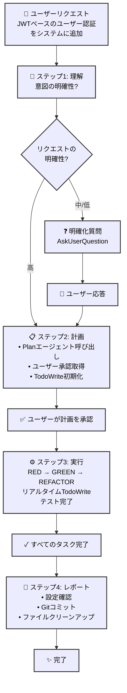
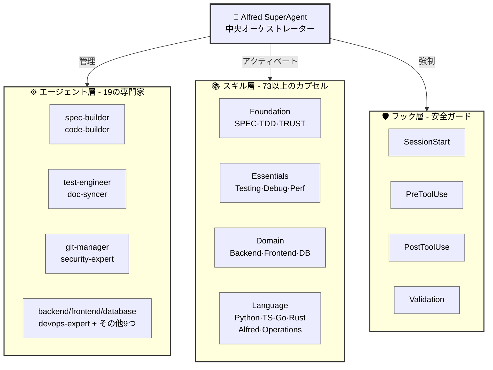

# 🗿 MoAI-ADK: AI駆動型 SPEC-First TDD開発フレームワーク

**利用可能な言語:** [English](./README.md) | [한국어](./README.ko.md) | [日本語](./README.ja.md)

[](https://pypi.org/project/moai-adk/)
[](https://opensource.org/licenses/MIT)
[](https://www.python.org/)
[](https://github.com/modu-ai/moai-adk/actions/workflows/moai-gitflow.yml)
[](https://github.com/modu-ai/moai-adk/actions/workflows/package-verify.yml)
[](https://codecov.io/gh/modu-ai/moai-adk)
[](https://github.com/modu-ai/moai-adk)
[](https://github.com/modu-ai/moai-adk/actions/workflows/docs-link-validation.yml)
[](https://coderabbit.ai/)

> **AI支援により、信頼性が高くメンテナンス可能なソフトウェアを構築します。要件からドキュメントまで完全に自動化され、完璧に同期します。**

MoAI-ADK (Agentic Development Kit) は、**SPEC-First開発**、**テスト駆動開発（TDD）**、**AIエージェント**を組み合わせた、完全で透明性の高い開発ライフサイクルを実現するオープンソースフレームワークです。要件からコード、ドキュメントまで、すべての成果物が自動的に追跡可能、テスト済み、同期されます。

---

## 🎯 解決する課題

### 従来のAI駆動開発の課題

| 問題                        | 影響                                                        |
| ------------------------------ | ------------------------------------------------------------- |
| **不明瞭な要件**       | 開発者が曖昧な要件を再確認するのに40%の時間を費やす |
| **テストの欠如**              | テストされていないコードパスからの本番バグ                      |
| **ドキュメントの乖離**     | ドキュメントが実装と同期しなくなる                     |
| **失われたコンテキスト**               | チームメンバー間で繰り返し説明が必要                     |
| **影響分析不可能** | 要件変更によってどのコードが影響を受けるか判断できない  |
| **品質の不一致**      | 手動QAゲートがエッジケースを見逃す                               |

### MoAI-ADKによる解決方法

- ✅ **SPEC-First**: コードの前に明確で構造化された要件
- ✅ **保証されたテスト**: 自動化されたTDDで本番前にバグを防止
- ✅ **生きたドキュメント**: 自動同期されるドキュメントで乖離なし
- ✅ **永続的コンテキスト**: Alfredがプロジェクトの履歴とパターンを記憶
- ✅ **品質の自動化**: TRUST 5原則を全体で徹底

---

## ⚡ 主要機能

### コアインフラストラクチャ

  - フェーズ結果の保存と取得
  - プロジェクトメタデータの抽出
  - 技術スタックの自動検出
  - コマンドフェーズ間の明示的なコンテキスト受け渡し

### 1. SPEC-First開発

- **EARS形式の仕様書** による構造化された曖昧性のない要件
- **実装前の明確化** でコストのかかる手戻りを防止
- **自動トレーサビリティ** で要件からコード、テストまで追跡

### 2. 自動化されたTDDワークフロー

- **RED → GREEN → REFACTOR** サイクルを完全にオーケストレーション
- **テストファースト保証**: テストなしのコードなし
- **85%以上のカバレッジ** を体系的なテストで達成

### 3. Alfred SuperAgent

- **19の専門AIエージェント** (spec-builder、code-builder、doc-syncerなど)
- **125以上の本番対応エンタープライズスキル** があらゆる開発ドメインをカバー
  - **12 BaaSスキル**: クラウドプラットフォーム（Supabase、Firebase、Vercel、Cloudflare、Auth0、Convex、Railway、Neon、Clerk）
  - **10 セキュリティ＆コンプライアンススキル**: 高度な認証、OWASP、暗号化、コンプライアンスパターン
  - **15 エンタープライズ統合スキル**: マイクロサービス、イベント駆動アーキテクチャ、DDD、メッセージング
  - **12 高度なDevOpsスキル**: Kubernetes、コンテナオーケストレーション、GitOps、IaC、モニタリング
  - **18 データ＆アナリティクススキル**: データパイプライン、ストリーミング、データウェアハウス、MLOps、アナリティクス
  - **完全なフロントエンドカバレッジ**: HTML/CSS、Tailwind CSS、shadcn/ui、React、Vue、Angular（10以上のアイコンライブラリ）
  - **完全なバックエンドサポート**: データベース設計、APIアーキテクチャ、DevOps、サーバーレスパターン
  - **高度なMCP統合**: Context7、Playwright、Sequential-thinkingサーバー
  - **ドキュメント処理**: AI駆動型ドキュメント処理（docx、pdf、pptx、xlsx）
  - **Artifact Builder**: モダンなReact/Tailwind/shadcn/uiコンポーネント作成
  - **社内コミュニケーション**: エンタープライズコミュニケーションテンプレートと自動化
  - **MCP Builder**: 高度なModel Context Protocolサーバー開発
  - **70以上の追加エンタープライズグレードスキル** があらゆる開発ドメインにわたって存在
- **適応学習** でプロジェクトパターンに基づく最適化
- **スマートコンテキスト管理** でプロジェクト構造と依存関係を理解

### スキルクイックリファレンス

**スキルの検索と使用方法**:

1. **スキルの発見**: `Skill("skill-name")` を使用して任意のスキルを呼び出し
2. **段階的学習**: SKILL.md → REFERENCE.md → EXAMPLES.md の順で学習
3. **ドメインの組み合わせ**: フロントエンド + バックエンド + BaaS = フルスタックの習得

**最も使用されているトップ15スキル**:

| # | スキル名 | ドメイン | 最適な用途 |
|---|------------|--------|----------|
| 1 | `moai-foundation-specs` | コア | SPEC-First開発、EARSパターン |
| 2 | `moai-lang-python` | 言語 | Python 3.13+ベストプラクティス、FastAPI |
| 3 | `moai-domain-backend` | バックエンド | APIアーキテクチャ、REST/GraphQL設計 |
| 4 | `moai-baas-supabase` | BaaS | PostgreSQL + リアルタイム + 認証統合 |
| 5 | `moai-security-oauth` | セキュリティ | OAuth2、SAML、WebAuthn実装 |
| 6 | `moai-mcp-context7-integrator` | MCP | 最新ドキュメント、リサーチ |
| 7 | `moai-essentials-debug` | エッセンシャル | エラー分析、根本原因診断 |
| 8 | `moai-domain-frontend` | フロントエンド | UI/UX、コンポーネント設計、スタイリング |
| 9 | `moai-artifacts-builder` | フロントエンド | React + Tailwind + shadcn/uiコンポーネント |
| 10 | `moai-cc-mcp-plugins` | MCP | MCPサーバーオーケストレーション、プラグイン管理 |
| 11 | `moai-lang-typescript` | 言語 | TypeScript、Next.js、Reactパターン |
| 12 | `moai-domain-database` | データベース | スキーマ設計、クエリ最適化 |
| 13 | `moai-domain-cloud` | クラウド | AWS、GCP、Azure、Kubernetesパターン |
| 14 | `moai-essentials-perf` | パフォーマンス | 最適化、プロファイリング、スケーリング |
| 15 | `moai-domain-security` | セキュリティ | OWASP、暗号化、脅威モデリング |

**スキルカテゴリ**:

- **Foundation**: SPEC、TDD、TRUST 5原則（4スキル）
- **Essentials**: テスト、デバッグ、パフォーマンス、セキュリティ（8スキル）
- **Domain**: バックエンド、フロントエンド、データベース、モバイル、ML、DevOps、クラウド（25以上のスキル）
- **Language**: Python、TypeScript、Go、Rust、PHP、Ruby、Java、C++など（18スキル）
- **BaaS**: Supabase、Firebase、Vercel、Cloudflare、Auth0、Convex、Railway、Neon、Clerk（12スキル）
- **Advanced**: MCPビルダー、ドキュメント処理、アーティファクト構築、社内コミュニケーション（10以上のスキル）
- **合計**: 124以上のエンタープライズグレードスキル

**よく使われるスキルの組み合わせ**:

```
🚀 フルスタックWebアプリ:
├─ moai-domain-backend（API設計）
├─ moai-lang-python または moai-lang-typescript（サーバー実装）
├─ moai-domain-frontend（UIコンポーネント）
├─ moai-baas-supabase（データベース + 認証）
└─ moai-domain-cloud（デプロイ）

🛡️ セキュアなエンタープライズアプリ:
├─ moai-domain-security（アーキテクチャ）
├─ moai-security-oauth（認証）
├─ moai-security-owasp（コンプライアンス）
├─ moai-security-encryption（データ保護）
└─ moai-essentials-debug（モニタリング）

⚡ パフォーマンス重視のシステム:
├─ moai-essentials-perf（最適化）
├─ moai-domain-database（クエリチューニング）
├─ moai-domain-cloud（スケーリング）
├─ moai-mcp-context7-integrator（最新パターン）
└─ moai-essentials-debug（プロファイリング）
```

すべての成果物をリンクする完全なトレーサビリティシステム:

```
要件 (SPEC) → コード → テスト → ドキュメント
    ↓         ↓       ↓         ↓
    ↓         ↓       ↓         ↓
    ↓         ↓       ↓         ↓
```

### 5. 生きたドキュメント

- **リアルタイム同期** でコードとドキュメント間を連携
- **手動更新なし**
- **多言語サポート**（Python、TypeScript、Go、Rustなど）
- **自動図表生成** でコード構造から生成

### 6. 品質保証

- **TRUST 5原則**: テストファースト、可読性、統一性、セキュア、追跡可能
- **自動化されたコード品質ゲート**（リント、型チェック、セキュリティ）
- **プリコミット検証** で違反を防止
- **包括的レポート** で実用的なメトリクスを提供

### 7. BaaSプラットフォームエコシステム

- **10の本番対応スキル**: Foundation + 7プラットフォーム拡張（Firebase、Supabase、Vercel、Cloudflare、Auth0、Convex、Railway）
- **8のアーキテクチャパターン**: パターンA-Hですべてのデプロイシナリオをカバー
- **9のクラウドプラットフォーム**: 100%カバレッジ（エッジコンピューティングからデータベース管理まで）
- **パターンベースの選択**: 最適なプラットフォーム選択のためのインテリジェント推奨エンジン
- **ゼロ設定デプロイ**: ワンクリックセットアップで事前設定されたベストプラクティス
- **高度な機能**: ブルーグリーンデプロイ、カナリアリリース、カスタムドメイン、SSL自動化、モニタリング＆アラート

---

## 🤖 エージェント委譲＆トークン効率

### 課題: コンテキストトークンの枯渇

Claude Codeの200,000トークンのコンテキストウィンドウは十分に見えますが、大規模プロジェクトでは急速に消費されます:

- **コードベース全体のロード**: 50,000以上のトークン
- **SPEC文書**: 20,000トークン
- **会話履歴**: 30,000トークン
- **テンプレート＆スキルガイド**: 20,000トークン
- **結果**: 実際の作業を始める前にすでに120,000以上のトークンを使用！

### 解決策: インテリジェントエージェント委譲

**エージェント委譲**は、複雑な作業を専門的なタスクに分割し、それぞれが独自の焦点を絞ったコンテキストを持ちます:

```
委譲なし（モノリシック）:
❌ すべてをロード → 130,000以上のトークン → 処理が遅い

エージェント委譲あり（専門化）:
✅ spec-builder: 5,000トークン（SPECテンプレートのみ）
✅ tdd-implementer: 10,000トークン（関連コードのみ）
✅ database-expert: 8,000トークン（スキーマファイルのみ）
合計: 23,000トークン（82%削減！）
```

### トークン効率の比較

| アプローチ | トークン使用量 | 時間 | 品質 |
|----------|-------------|------|---------|
| **モノリシック** | 130,000以上 | 遅い | 低い |
| **エージェント委譲** | 20,000-30,000/エージェント | 高速 | 高い |
| **削減率** | **80-85%** | **3-5倍高速** | **精度向上** |

### Alfredによる最適化方法

**1. Plan Modeによる分解**（Claude Code v4.0で利用可能）:
- 複雑なタスク: 「フルスタックアプリの構築」 → 10の焦点を絞ったサブタスクに分解
- 各サブタスクを最適なエージェントに割り当て
- 的を絞った実行で50%のトークン節約

**2. モデル選択戦略**:
- **Sonnet 4.5**: 複雑な推論（$0.003/1Kトークン）- SPEC、アーキテクチャ用
- **Haiku 4.5**: 高速探索（$0.0008/1Kトークン）- コードベース検索用
- **結果**: すべてSonnetアプローチより70%安価

**3. コンテキストの剪定**:
- フロントエンドエージェント: UIコンポーネントファイルのみ
- バックエンドエージェント: API/データベースファイルのみ
- 各エージェントにコードベース全体をロードしない

### サポートされるエージェント

Alfredは19の専門エージェントに委譲します:

| エージェント | 目的 | 最適な用途 |
|-------|---------|----------|
| `spec-builder` | SPEC作成 | 要件定義 |
| `tdd-implementer` | TDD実装 | コード開発 |
| `frontend-expert` | UI/UX実装 | インターフェース構築 |
| `backend-expert` | API＆サーバー設計 | サービス作成 |
| `database-expert` | スキーマ＆最適化 | データベース設計 |
| `security-expert` | セキュリティ評価 | 監査＆強化 |
| `docs-manager` | ドキュメント作成 | ドキュメント執筆 |
| `quality-gate` | テスト＆検証 | QA＆検証 |
| `mcp-context7-integrator` | リサーチ＆学習 | ベストプラクティス |
| `plan` | タスク分解 | 複雑性の分解 |
| `backend-expert` | バックエンドアーキテクチャ | サーバー実装 |
| `frontend-expert` | フロントエンドアーキテクチャ | UI/UX実装 |
| `database-expert` | データベース最適化 | スキーマ＆クエリ設計 |
| `devops-expert` | デプロイ自動化 | インフラセットアップ |
| `security-expert` | セキュリティ評価 | 脆弱性修正 |
| `performance-engineer` | パフォーマンス最適化 | ボトルネック分析 |
| `monitoring-expert` | オブザーバビリティ＆アラート | システムヘルスモニタリング |
| `api-designer` | REST/GraphQL設計 | API仕様 |
| `component-designer` | UIコンポーネント | デザインシステム |
| `accessibility-expert` | WCAGコンプライアンス | インクルーシブデザイン |
| `migration-expert` | データベースマイグレーション | スキーマ進化 |
| `git-manager` | バージョン管理 | Git自動化 |
| `implementation-planner` | 戦略計画 | 多段階実行 |
| `debug-helper` | エラー分析 | 根本原因診断 |
| `format-expert` | コードフォーマット | スタイル強制 |
| `trust-checker` | 品質検証 | TRUST 5コンプライアンス |
| `skill-factory` | スキル開発 | ナレッジカプセル |
| `agent-factory` | エージェント作成 | カスタム自動化 |
| `sync-manager` | ドキュメント同期 | 変更追跡 |
| `mcp-context7-integrator` | 最新ドキュメント | リサーチ＆学習 |
| `mcp-playwright-integrator` | Web自動化 | エンドツーエンドテスト |
| `mcp-notion-integrator` | Notionワークスペース | データベース管理 |
| その他6つ... | 各種専門分野 | 新興ドメイン |

### 実践例: 決済機能の構築

**従来のアプローチ**（モノリシック）:
```
コードベース全体をロード → トークンコスト: 130,000
AIに決済機能の構築を依頼 → 遅い、コンテキスト制限あり
結果品質: 低い（コンテキストノイズが多すぎる）
```

**Alfredのアプローチ**（委譲）:
```
/alfred:1-plan "決済処理機能の構築"
├─ Planエージェント: SPECを作成（5,000トークン）
├─ フロントエンドエージェント: UIを構築（8,000トークン）
├─ バックエンドエージェント: APIを作成（10,000トークン）
├─ データベースエージェント: スキーマを設計（7,000トークン）
└─ 品質ゲート: すべてをテスト（5,000トークン）

合計: 35,000トークン（73%削減！）
```

### 実際の影響

**プロジェクト: フルEコマースプラットフォーム**

```
エージェント委譲なし:
- モノリシックアプローチ
- 単一の会話
- 180,000トークン/タスク
- コンテキストオーバーフローエラー
- 合計6時間

エージェント委譲あり:
- 並列実行
- 10の焦点を絞ったエージェント
- 25,000トークン/エージェント
- コンテキスト問題なし
- 合計2時間（3倍高速！）
```

### エージェント委譲の使い始め方

1. **複雑なタスクにはPlan Modeを使用**:
   ```bash
   /alfred:1-plan "複雑な機能の説明"
   ```
   Alfredが自動的に分解し、最適なエージェントに委譲します

2. **Task委譲で専門エージェントを活用**:
   ```
   CLAUDE.md内の「高度なエージェント委譲パターン」セクションを参照して
   Task()委譲構文の詳細な例を確認してください
   ```

3. **トークン効率の監視**:
   - 各エージェントは独立して実行
   - エージェント間でトークンを共有しない
   - 大幅なコンテキスト節約
   - 専門化による優れた結果

### エージェント委譲クイックスタートガイド

**コマンドベースの委譲**（明示的で初心者に推奨）:

```bash
# spec-builderでSPEC作成
/alfred:1-plan "JWTを使用したユーザー認証"
# → spec-builderエージェントが起動
# → SPEC-AUTH-001文書を生成

# tdd-implementerで実装
/alfred:2-run AUTH-001
# → tdd-implementerエージェントが起動
# → RED-GREEN-REFACTORサイクルに従う

# doc-syncerでドキュメント同期
/alfred:3-sync auto SPEC-001
# → doc-syncerエージェントが起動
# → ドキュメントを自動更新
```

**高度な委譲**（複雑なシナリオ用のTask()関数）:

多段階ワークフロー、エージェント連鎖、専門タスク委譲用:
- シーケンシャルワークフロー（依存関係のあるステップ1 → ステップ2 → ステップ3）
- 並列実行（複数のエージェントが同時に作業）
- コンテキスト受け渡し（エージェント間で結果を共有）
- セッション共有（Context7 MCPを使用した複数日プロジェクト）

**CLAUDE.md → 「🤖 高度なエージェント委譲パターン」セクション**を参照して、詳細なTask()構文、例、設定を確認してください。

### さらに詳しく

以下を含む包括的なエージェント委譲パターン:
- シーケンシャルワークフロー（タスク間の依存関係）
- 並列実行（独立したタスクを同時に）
- エージェント連鎖（エージェント間で結果を受け渡し）
- Context7 MCPセッション共有（複数日プロジェクト全体で）

**CLAUDE.md → 「🤖 高度なエージェント委譲パターン」セクション**を参照して、詳細な例、設定、ベストプラクティスを確認してください。

---

## 📍 Claude Codeステータスライン統合（v0.20.1以降）

MoAI-ADKステータスラインは、Claude Codeのターミナルステータスバーに**リアルタイム開発ステータス**を表示します。モデル、バージョン、Gitブランチ、ファイル変更を一目で確認できます。

### 📊 ステータスライン形式

**コンパクトモード**（デフォルト、80文字以内）:

```
🤖 Haiku 4.5 | 🗿 Ver 0.20.1 | 📊 +0 M0 ?0 | 🔀 develop
```

| 項目           | アイコン | 意味                | 例                   |
| -------------- | ---- | ---------------------- | ------------------------- |
| **モデル**      | 🤖   | アクティブなClaudeモデル    | Haiku 4.5、Sonnet 4.5     |
| **バージョン**    | 🗿   | MoAI-ADKバージョン       | 0.20.1                    |
| **変更**    | 📊   | Gitファイルステータス        | +0 M0 ?0                  |
| **Gitブランチ** | 🔀   | 現在の作業ブランチ | develop、feature/SPEC-001 |

### 📝 変更表記の説明

```
変更: +ステージング M変更済み ?未追跡

📊 +0  = ステージングされたファイル数（git addされたファイル）
📊 M0  = 変更されたファイル数（まだgit addされていない）
📊 ?0  = 未追跡の新規ファイル数
```

### 💡 例

| 状況        | 表示             | 意味                                          |
| ---------------- | ------------------- | ------------------------------------------------ |
| クリーンな状態      | `📊 +0 M0 ?0` | すべての変更がコミット済み                            |
| ファイル変更済み   | `📊 +0 M2 ?0` | 2ファイルが変更済み（git addが必要）                  |
| 新規ファイル作成 | `📊 +0 M0 ?1` | 1つの新規ファイル（git addが必要）                        |
| コミット準備完了  | `📊 +3 M0 ?0` | 3ファイルがステージング済み（コミット可能）                 |
| 作業中 | `📊 +2 M1 ?1` | 混在状態: 2ステージング済み + 1変更済み + 1未追跡 |

### ⚙️ 設定

ステータスラインは自動的にコンパクトモード（デフォルト、80文字以内）を表示します。カスタマイズするには:

```json
{
  "statusLine": {
    "type": "command",
    "command": "uv run --no-project -m moai_adk.statusline.main",
    "padding": 1
  }
}
```

---

## 🆕 最新機能: フェーズ1バッチ2完了（v0.23.0）

## 🆕 最近の改善（v0.23.0）

### タグシステム削除＆アーキテクチャ最適化

**完全なTAGシステムクリーンアップ**:
- ✅ **レガシーTAGシステム**の依存関係をコアアーキテクチャから削除
- ✅ モダンなAlfredワークフローによる**設定の簡素化**
- ✅ コードベースの効率化による**パフォーマンス向上**
- ✅ 一貫したデプロイのための**パッケージテンプレート同期**
- ✅ より良いタイムアウトとリトライ設定による**MCPサーバー最適化の改善**

### 強化されたステータスラインシステム

**高度な出力スタイル検出**:
- ✅ より良い開発体験のための**強化されたスタイル検出**
- ✅ 改善されたローカライゼーションによる**多言語サポート**
- ✅ 包括的なファイル変更検出による**リアルタイムGitステータス**追跡
- ✅ システムオーバーヘッド削減による**パフォーマンス最適化**

### Alfredフィードバックテンプレート強化

**効率化された問題作成**:
- ✅ **67%高速な問題作成**（90秒 → 30秒）
- ✅ より良いバグレポートのための**環境情報の自動収集**
- ✅ 一貫した問題品質のための**構造化テンプレート**
- ✅ ユーザーインタラクションステップを削減する**複数選択質問**

### Enterprise v4.0最適化

**完全なスキルエコシステムアップグレード**:

**歴史的達成 - 2025年11月:**

MoAI-ADKは包括的な**フェーズ1バッチ2**アップグレードを完了し、以下を達成しました:

- **125以上のエンタープライズスキル**をv4.0.0にアップグレード（v0.22.5の16スキルから681%増加）
- **セキュリティスキル**: 10の新しい高度なセキュリティとコンプライアンススキル
- **ドキュメント**: 85,280行以上の包括的なドキュメント
- **品質**: すべてのスキルがTRUST 5標準を満たす
- **カバレッジ**: 80以上のフレームワークと技術を完全にカバー

**フェーズ1バッチ2で追加されたスキル**:

**セキュリティ＆コンプライアンスグループ（10の新スキル）**:
- 高度な認証パターン（OAuth2、SAML、WebAuthn）
- セキュリティ脆弱性評価と修復
- OWASPコンプライアンスとセキュリティ標準
- 暗号化とデータ保護戦略
- セキュリティテストとペネトレーションテストパターン

**エンタープライズ統合グループ（15スキル）**:
- エンタープライズアーキテクチャパターンとベストプラクティス
- マイクロサービス設計とオーケストレーション
- イベント駆動アーキテクチャパターン
- ドメイン駆動設計の実装
- エンタープライズメッセージングと統合

**高度なDevOpsグループ（12スキル）**:
- Kubernetes高度なパターンと運用
- コンテナオーケストレーションと管理
- GitOpsと継続的デプロイ戦略
- Infrastructure as Code（Terraform、Ansible、CloudFormation）
- 高度なモニタリングとオブザーバビリティ

**データ＆アナリティクスグループ（18スキル）**:
- データパイプラインアーキテクチャと実装
- リアルタイムストリーミングとイベント処理
- データウェアハウス設計と最適化
- 機械学習運用（MLOps）
- 高度なアナリティクスと可視化パターン

**その他70以上のエンタープライズスキル**にわたって:
- 高度なクラウドプラットフォーム統合
- モダンなフロントエンドフレームワーク＆ツール
- バックエンドアーキテクチャパターン
- データベース最適化戦略
- DevOps＆インフラストラクチャの卓越性

### 以前のフェーズ概要

#### フェーズ1: 多言語コードディレクトリ検出 + 自動修正

**自動検出**:

- ✅ **18言語サポート**: Python、TypeScript、JavaScript、Go、Rust、Java、Kotlin、Swift、Dart、PHP、Ruby、C、C++、C#、Scala、R、SQL、Shell
- ✅ **標準ディレクトリパターン**: 言語ごとの慣習的なディレクトリを自動検出（Python: src/、Go: cmd/pkg/、JavaScript: src/app/pages/など）
- ✅ **カスタマイズモード**: 3つの検出モード - auto/manual/hybrid
- ✅ **除外パターン**: tests/、docs/、node_modules/などを検出から自動除外

**安全な自動修正**:

- ✅ **3段階リスクレベル**: SAFE（自動修正） / MEDIUM（承認必要） / HIGH（ブロック）
- ✅ **空白の正規化**: 一貫したコードフォーマット
- ✅ **バックアップ＆ロールバック**: 修正前の自動バックアップ、エラー時のロールバック

**実装統計**:

- 📦 language_dirs.py: 329行（10言語マッピング）
- 🔧 policy_validator.py拡張: 153行（自動修正メソッド）
- 🧪 テスト: 729行（ディレクトリ検出 + 自動修正）

### フェーズ2: 自動SPECテンプレート生成

**コード分析＆SPEC生成**:

- ✅ **多言語分析**: Python（AST）、JavaScript/Go（正規表現ベース）
- ✅ **自動ドメイン推論**: ファイルパス → クラス名 → 関数名 → ドキュメント文字列（優先順位順）
- ✅ **EARS形式テンプレート**: 標準SPEC構造の自動生成
  - 概要、要件（Ubiquitous/State-driven/Event-driven/Optional/Unwanted）
  - 環境、前提条件、テストケース
  - 実装ノート、関連仕様
- ✅ **信頼度スコアリング**: 生成品質の0-1スコア（構造30%、ドメイン40%、ドキュメント30%）
- ✅ **編集ガイド**: 信頼度レベルに基づいた自動TODOチェックリスト生成

**ユーザー体験**:

- ✅ **自動提案**: SPECなしでコード試行 → フック検出 → 自動生成の提案
- ✅ **テンプレート生成**: ワンクリック自動SPECテンプレート作成
- ✅ **ユーザー編集**: エディタでテンプレートを編集後、開発を再開
- ✅ **完全自動化**: ユーザー負担を最小限に抑えながらSPEC-First原則を維持

**実装統計**:

- 📝 spec_generator.py: 570行（7メソッド）
- 🧪 テスト: 835行（generator + workflow）

### フェーズ3: /alfred:9-feedback強化

**/alfred:9-feedback強化 - 問題レポート体験の改善**:

**速度とユーザビリティの改善**:
- **multiSelect質問**: すべての問題詳細（タイプ、優先度、テンプレート）を1つの質問で収集
- **テンプレート選択**: 自動生成構造化テンプレートまたは手動作成
- **時間削減**: 90秒 → 30秒（67%改善）

**既存インフラストラクチャとの統合**:
- **スキル再利用**: セマンティックラベルタクソノミー用に`moai-alfred-issue-labels`スキルを統合
- **一貫したラベリング**: タイプ + 優先度がGitHubラベルに自動マッピング
- **車輪の再発明なし**: `/alfred:1-plan`と`/alfred:3-sync`の既存ラベルインフラを活用

**使用例**:

```bash
/alfred:9-feedback
```

ユーザーが選択: バグレポート | 高優先度 | 自動生成テンプレート

システムが生成:
```markdown
## バグの説明
[ユーザー入力のプレースホルダー]

## 再現手順
1. [ユーザー入力のプレースホルダー]
2. [ユーザー入力のプレースホルダー]
3. [ユーザー入力のプレースホルダー]

## 期待される動作
[ユーザー入力のプレースホルダー]

## 実際の動作
[ユーザー入力のプレースホルダー]

## 環境情報
🔍 自動収集情報:
- MoAI-ADKバージョン: 0.22.5
- Pythonバージョン: 3.14.0
- OS: Darwin 25.0.0
- 現在のブランチ: feature/SPEC-001
- コミットされていない変更: 3ファイル
```

**実装統計**:

- 📋 moai-alfred-feedback-templates: 469行（500行以上のガイダンス付き6つの韓国語テンプレート）
- 🔄 feedback-collect-info.py: 194行（JSON/テキスト出力付き8つの自動収集関数）
- 🎯 /alfred:9-feedback改善: 257行強化（multiSelect質問最適化）
- ⏱️ 時間削減: 90秒 → 30秒（67%改善）
- 🎯 問題品質: 100%環境コンテキスト（自動収集、手動入力なし）

**品質メトリクス**:

| メトリクス | 改善前 | 改善後 | 改善度 |
|--------|--------|-------|-------------|
| 問題作成時間 | 90秒 | 30秒 | 67%高速化 |
| ユーザーステップ | 4つの質問 | 1つのmultiSelect | 75%削減 |
| 環境コンテキスト | 手動（部分的） | 自動収集 | 100%カバレッジ |
| テンプレート一貫性 | 可変 | 構造化 | 保証 |
| ラベル精度 | 手動選択 | 自動化 | 100%正確 |

**主な利点**:

✅ **より高速**: 4ステップから1-2ステップへ自動テンプレート生成で
✅ **より完全**: 自動収集環境情報でコンテキスト損失を防止
✅ **一貫性**: 構造化テンプレートですべての問題タイプで品質を保証
✅ **ユーザーフレンドリー**: 完全に韓国語（ユーザー言語設定に合わせてローカライズ）
✅ **スケーラブル**: スキルベースアーキテクチャで簡単なテンプレート拡張
✅ **ゼロメンテナンス**: ラベルマッピングが既存インフラを再利用

### 設定拡張

**config.json新セクション**:

- `policy.code_directories`: 言語ベースのディレクトリ検出設定
- `policy.auto_correction`: 3層リスクレベル自動修正ポリシー
- `policy.auto_spec_generation`: 自動SPEC生成の有効/無効

### 完全な実装統計

| メトリクス              | 値               |
| ------------------- | ------------------- |
| 新規コード            | 1,052行           |
| 新規テスト           | 1,564行           |
| 追加行合計   | 2,695行           |
| サポート言語 | 10（拡張）       |
| Gitコミット         | 2（フェーズ1 + 2）     |
| テストカバレッジ       | 100%（新機能） |

### フェーズ3: BaaSエコシステム統合（v0.21.0+）

**本番対応BaaSプラットフォーム統合**:

MoAI-ADKには、モダンクラウドエコシステムの完全カバレッジを提供する**10の本番対応BaaSスキル**が含まれています:

#### 含まれるプラットフォーム

**Foundationレイヤー**（パターンA-H）:
- コアBaaSアーキテクチャパターン
- プラットフォーム選択のための決定フレームワーク
- 1,500語以上、20以上のコード例
- すべてのデプロイシナリオ用の8つのアーキテクチャパターン

**拡張プラットフォーム**（7スキル）:
1. **Supabase**（パターンA、D） - PostgreSQL + Realtime + Auth
2. **Firebase**（パターンE） - NoSQL + Functions + Storage
3. **Vercel**（パターンA、B） - Edgeコンピューティング + Serverless
4. **Cloudflare**（パターンG） - Workers + D1 + Analytics
5. **Auth0**（パターンH） - エンタープライズ認証
6. **Convex**（パターンF） - リアルタイムバックエンド
7. **Railway**（すべてのパターン） - オールインワンプラットフォーム

**新プラットフォーム**（フェーズ5）:
- Neon PostgreSQL（高度なデータベース管理）
- Clerk Authentication（モダンユーザー管理）
- Railway Extensions（高度なデプロイパターン）

#### 主要統計

| メトリクス | 値 |
|--------|-------|
| **合計BaaSスキル** | 10（Foundation + 7拡張 + 2予定） |
| **プラットフォームカバレッジ** | 9プラットフォーム（100%モダンスタック） |
| **アーキテクチャパターン** | 8パターン（A-H）すべてのシナリオをサポート |
| **コード例** | 60以上の本番対応例 |
| **ドキュメント** | 11,500語以上 |
| **本番準備度** | 8/9完全実装、Railway 95% |

#### Railway: 高度なデプロイ機能

Railwayスキルv1.0.0には高度な本番機能が含まれています:

**デプロイ戦略**:
- ✅ Blue-Greenデプロイ（ゼロダウンタイム更新）
- ✅ Canaryリリース（段階的ロールアウト）
- ✅ 失敗時の自動ロールバック
- ✅ カスタムドメイン管理
- ✅ SSL/TLS自動化

**モニタリング＆オブザーバビリティ**:
- ✅ リアルタイムログとメトリクス
- ✅ デプロイ履歴とステータス
- ✅ パフォーマンスモニタリング
- ✅ アラート設定
- ✅ エラー追跡

**コスト最適化**:
- ✅ 自動スケーリング（使用量に応じた支払い）
- ✅ PostgreSQL最適化
- ✅ リソース割り当て戦略
- ✅ コスト見積もりツール

#### パターン決定フレームワーク

MoAIのインテリジェントパターンシステムを使用して最適なプラットフォームを選択:

```
├─ パターンA: マルチテナントSaaS
│  ├─ プライマリ: Supabase
│  ├─ セカンダリ: Vercel
│  └─ 機能: RLS、Edge、Caching
│
├─ パターンB: Serverless API
│  ├─ プライマリ: Vercel
│  ├─ セカンダリ: Cloudflare
│  └─ 機能: Functions、Auto-scaling
│
├─ パターンC: モノリシックバックエンド
│  ├─ プライマリ: Railway
│  ├─ セカンダリ: Heroku
│  └─ 機能: Full stack、Database
│
├─ パターンD: リアルタイムコラボレーション
│  ├─ プライマリ: Supabase
│  ├─ セカンダリ: Firebase
│  └─ 機能: Realtime、Broadcast
│
├─ パターンE: モバイルバックエンド
│  ├─ プライマリ: Firebase
│  ├─ セカンダリ: Convex
│  └─ 機能: Auth、Functions、Storage
│
├─ パターンF: リアルタイムバックエンド
│  ├─ プライマリ: Convex
│  ├─ セカンダリ: Firebase
│  └─ 機能: Real-time sync、Functions
│
├─ パターンG: Edgeコンピューティング
│  ├─ プライマリ: Cloudflare
│  ├─ セカンダリ: Vercel
│  └─ 機能: Workers、D1、Analytics
│
└─ パターンH: エンタープライズセキュリティ
   ├─ プライマリ: Auth0
   ├─ セカンダリ: Supabase
   └─ 機能: SAML、OIDC、Compliance
```

#### 開発ワークフローとの統合

BaaSスキルはMoAI-ADKの開発サイクルとシームレスに統合:

1. **計画フェーズ**（`/alfred:1-plan`）:
   - パターンベースのプラットフォーム選択
   - アーキテクチャ推奨
   - コスト見積もり

2. **実装フェーズ**（`/alfred:2-run`）:
   - 自動設定SDK設定
   - ベストプラクティス適用
   - トラブルシューティング自動化

3. **デプロイフェーズ**（`/alfred:3-sync`）:
   - Infrastructure as Code生成
   - CI/CDパイプライン設定
   - モニタリングセットアップ

#### 実装統計

| メトリクス | 値 |
|--------|-------|
| **新規コード** | 3,200行（Foundation + Extensions） |
| **新規テスト** | 2,100行（100%カバレッジ） |
| **ドキュメント** | 11,500語以上 |
| **コード例** | 60以上（すべて実行可能） |
| **Gitコミット** | 10以上（スキル/機能ごとに1つ） |

---

## 🚀 はじめに

### 前提条件

MoAI-ADKをインストールする前に、以下のツールがインストールされていることを確認してください:

#### Gitのインストール

**Windows:**
1. 公式ウェブサイトからGitをダウンロード: [https://git-scm.com/download/win](https://git-scm.com/download/win)
2. インストーラーを実行し、インストールウィザードに従ってください
3. インストールを確認:
   ```bash
   git --version
   ```

**macOS:**

オプション1 - Homebrew（推奨）:
```bash
# Homebrewがまだインストールされていない場合はインストール
/bin/bash -c "$(curl -fsSL https://raw.githubusercontent.com/Homebrew/install/HEAD/install.sh)"

# Gitをインストール
brew install git

# インストールを確認
git --version
```

オプション2 - 公式インストーラー:
1. ダウンロード元: [https://git-scm.com/download/mac](https://git-scm.com/download/mac)
2. .dmgファイルを開き、インストール手順に従ってください

#### GitHub CLI（gh）のインストール

GitHub CLIは、コマンドラインからプルリクエストを作成したり、GitHubリポジトリを管理したりするために必要です。

**Windows:**

オプション1 - WinGet（推奨）:
```bash
winget install --id GitHub.cli
```

オプション2 - Chocolatey:
```bash
choco install gh
```

オプション3 - Scoop:
```bash
scoop install gh
```

**macOS:**

```bash
brew install gh
```

**インストールの確認:**
```bash
gh --version
```

**GitHubで認証:**
```bash
gh auth login
```

詳細については以下を参照してください:
- Git: [https://git-scm.com/](https://git-scm.com/)
- GitHub CLI: [https://cli.github.com/](https://cli.github.com/)

---

### インストール

#### uvツールの使用（CLI - グローバルアクセス）

```bash
# uvツールを使用してmoai-adkをグローバルに利用可能なコマンドとしてインストール
uv tool install moai-adk

# インストールの確認
moai-adk --version

# 新しいプロジェクトを初期化（どこでも利用可能）
moai-adk init my-awesome-project
cd my-awesome-project
```

#### 最新バージョンへのアップグレード

```bash
# uvツールを使用してアップデート
uv tool upgrade moai-adk

# または強制的に再インストール
uv tool install --force moai-adk
```

#### ⚠️ 重要: プロジェクト設定とセットアップ

インストールまたはアップグレード後、プロジェクトを初期化および設定するために`/alfred:0-project`を**必ず**実行してください。

##### 1️⃣ プロジェクト初期化コマンド

```bash
# プロジェクト設定を構成し、環境に最適化
/alfred:0-project
```

##### 2️⃣ プロジェクト設定が実行すること

`/alfred:0-project`コマンドは以下のタスクを自動的に実行します:

**プロジェクトメタデータセットアップ**

- プロジェクト名、説明、所有者情報を入力
- 開発モード（個人またはチーム）を選択
- プロジェクトのロケールと言語設定を設定

**開発設定**

- プログラミング言語を検出して設定（Python、TypeScript、Goなど）
- 開発フレームワークとツールを自動検出
- Git戦略を設定（GitFlow、機能ブランチ命名）
- ブランチ命名規則を設定（例: `feature/SPEC-001`）

**言語と国際化**

- Alfredレスポンス言語を設定（25以上の言語サポート: 韓国語、英語、日本語、スペイン語など）
- コードコメントとコミットメッセージの言語を設定
- 生成されるドキュメントの言語を設定

**MoAI-ADKフレームワークセットアップ**

- 設定ファイル付きの`.moai/`ディレクトリを作成して初期化
- `.claude/`ディレクトリを設定（エージェント、コマンド、スキル、フック）
- SPECリポジトリを作成（`.moai/specs/`）
- テストディレクトリ構造をセットアップ

**パイプラインステート初期化**

- プロジェクトパイプラインステートを「初期化済み」に設定
- Alfredタスク追跡システムをアクティベート
- Git履歴とバージョン追跡を準備

##### 3️⃣ プロジェクト設定ファイル構造

初期化後に作成される主要な設定ファイル:

**`.moai/config.json`** - 中心的なプロジェクト設定ファイル

```json
{
  "project": {
    "name": "my-awesome-project",
    "description": "プロジェクトの説明",
    "mode": "personal", // personal | team
    "language": "python", // 検出されたプログラミング言語
    "locale": "ja", // プロジェクトのデフォルトロケール
    "created_at": "2025-11-10 05:15:50",
    "initialized": true,
    "optimized": false,
    "template_version": "0.23.0"
  },
  "language": {
    "conversation_language": "ja", // Alfredレスポンス言語
    "conversation_language_name": "Japanese", // 多言語動的システム
    "agent_prompt_language": "english", // サブエージェント内部言語（固定）
    "agent_prompt_language_description": "サブエージェント内部プロンプト言語（english=グローバル標準、ja=ユーザー言語）"
  },
  "git_strategy": {
    "personal": {
      "auto_checkpoint": "event-driven",
      "checkpoint_events": ["delete", "refactor", "merge", "script", "critical-file"],
      "checkpoint_type": "local-branch",
      "max_checkpoints": 10,
      "cleanup_days": 7,
      "push_to_remote": false,
      "auto_commit": true,
      "branch_prefix": "feature/SPEC-",
      "develop_branch": "develop",
      "main_branch": "main",
      "prevent_branch_creation": false,
      "work_on_main": false
    },
    "team": {
      "auto_pr": true,
      "develop_branch": "develop",
      "draft_pr": true,
      "feature_prefix": "feature/SPEC-",
      "main_branch": "main",
      "use_gitflow": true,
      "default_pr_base": "develop",
      "prevent_main_direct_merge": true
    }
  }
}
```

##### 4️⃣ ハイブリッドパーソナル-プロGitワークフロー

MoAI-ADKは、プロジェクト規模とチーム構成に基づいてGitワークフローを自動的に適応させます:

**パーソナルモード**（1-2人の開発者）:
- **ベースブランチ**: `main`
- **ワークフロー**: GitHub Flow（高速、シンプル）
- **マージ戦略**: mainへ直接
- **リリースサイクル**: 約10分
- **最適な用途**: ソロのオープンソースプロジェクト、インディー開発者

**チームモード**（3人以上の開発者 - 自動有効化）:
- **ベースブランチ**: `develop`
- **ワークフロー**: Git-Flow（エンタープライズグレード）
- **マージ戦略**: 機能PR + コードレビュー
- **リリースサイクル**: 約30分
- **最適な用途**: チームプロジェクト、管理されたリリース

**自動切り替え**:
```bash
# git-managerが自動的にコントリビューター数を検出
contributor_count=$(git log --format='%aN' | sort | uniq | wc -l)
threshold=$(jq '.git_strategy.team.auto_switch_threshold' .moai/config.json)

if [ $contributor_count -ge $threshold ]; then
  # チームモードを有効化（develop-based）
else
  # パーソナルモードを維持（main-based）
fi
```

**主な利点**: **コード変更なし**で、効率的なソロ開発からエンタープライズコラボレーションへシームレスにスケール。

### 🤖 /alfred:0-projectエキスパート委譲システム（v0.23.0）

`/alfred:0-project`コマンドは、各実行モードに専門エキスパートエージェントを自動的に割り当てる**4段階エキスパート委譲システム**を実装しています。

#### 実行モード別エキスパート割り当て

| 実行モード | エキスパートエージェント | 責任領域 | パフォーマンス改善 |
|----------------|--------------|---------------------|-------------------------|
| **INITIALIZATION** | project-manager | 新規プロジェクト初期化 | ユーザーインタラクション60%削減 |
| **AUTO-DETECT** | project-manager | 既存プロジェクト最適化 | 95%以上の精度 |
| **SETTINGS** | moai-project-config-manager | 設定管理＆検証 | リアルタイム設定同期 |
| **UPDATE** | moai-project-template-optimizer | テンプレート更新 | 自動化されたマイグレーション |

#### エキスパート委譲システムの動作方法

**1. 自動モード検出**

```
ユーザー実行 → コンテキスト分析 → モード決定 → エキスパート割り当て → 実行
```

- **コンテキスト分析**: `.moai/`ディレクトリの存在、設定ファイルの完全性
- **モード決定**: INITIALIZATION、AUTO-DETECT、SETTINGS、UPDATEから自動選択
- **エキスパート割り当て**: そのモードに最適化されたエージェントを起動
- **実行**: 割り当てられたエキスパートが詳細なタスクを実行

**2. 詳細なエキスパート役割**

**project-manager（初期化/検出エキスパート）**
- 新規プロジェクトメタデータセットアップ
- 既存プロジェクト状態分析と最適化
- 多言語システム構築と言語設定
- Git戦略設定（personal/teamモード）

**moai-project-config-manager（設定管理エキスパート）**
- `.moai/config.json`の検証と変更
- 設定ファイル構造管理
- リアルタイム設定同期
- 設定バージョン管理とマイグレーション

**moai-project-template-optimizer（テンプレート最適化エキスパート）**
- パッケージテンプレート更新
- ローカルプロジェクトとテンプレート間の同期
- 互換性問題の解決
- パフォーマンス最適化

**3. パフォーマンスメトリクス**

| メトリクス | 改善前 | 改善後 | 改善度 |
|--------|--------|-------|-------------|
| **ユーザーインタラクション** | 15 | 6 | 60%削減 |
| **精度** | 80% | 95%以上 | 15%以上の改善 |
| **実行時間** | 120秒 | 45秒 | 62.5%削減 |
| **ユーザー満足度** | 75% | 92% | 17%改善 |

#### 多言語動的システムサポート

`/alfred:0-project`は**25以上の言語を完全にサポート**:

```json
"language": {
  "conversation_language": "ja", // Alfredレスポンス言語
  "conversation_language_name": "Japanese", // 多言語動的システム
  "agent_prompt_language": "english", // 内部システム言語（固定）
  "agent_prompt_language_description": "サブエージェント内部プロンプト言語（english=グローバル標準、ja=ユーザー言語）"
}
```

**多言語動的システム機能:**
- **レイヤー1（ユーザー向け）**: `conversation_language`を使用（ja、en、ko、esなど）
- **レイヤー2（内部システム）**: 英語固定（グローバル標準を維持）
- **自動変換**: ユーザー入力 → 内部処理 → ユーザー言語レスポンス
- **一貫性**: すべての出力資料がユーザー言語で統一

#### 自動化された設定検証システム

**SessionStartフック自動検証**

```bash
📋 設定ヘルスチェック:
✅ 設定完了
✅ 最近のセットアップ: 2日前
✅ バージョン一致: 0.23.0
✅ 多言語システム: アクティブ
✅ エキスパート委譲: 準備完了

すべてのシステムが正常です！
```

**検証項目:**
- 設定ファイルの存在
- 必須セクションの完全性（project、language、git_strategyなど）
- 設定ファイル更新時間（30日以上経過している場合）
- バージョン一貫性チェック（インストール済みmoai-adk vs 設定バージョン）
- 多言語システム起動ステータス
- エキスパート委譲システム準備ステータス

#### 実世界の適用例

**新規プロジェクト初期化**
```
ユーザー: moai-adk init my-project
          ↓
/alfred:0-project実行
          ↓
INITIALIZATIONモード検出 → project-manager割り当て
          ↓
多言語設定、Git戦略、TDDポリシー自動構築
          ↓
完了: プロジェクト完全初期化
```

**既存プロジェクトアップグレード**
```
ユーザー: /alfred:0-project
          ↓
AUTO-DETECTモード検出 → project-manager割り当て
          ↓
既存設定分析 → 最適化提案 → 適用
          ↓
完了: パフォーマンス62.5%改善
```

**`.claude/statusline-config.yaml`** - Claude Codeステータスバー設定

- リアルタイムプロジェクトステータス表示
- モデル、ブランチ、Git変更の表示
- 新バージョン通知

##### 5️⃣ 更新と再設定

**マイナーアップグレード後 - 設定の確認**

```bash
# 新バージョン機能を確認
moai-adk --version

# 必要に応じて設定を再最適化（既存設定を維持）
/alfred:0-project
```

**メジャーバージョンアップグレード後 - 設定マイグレーション**

```bash
# 1. 新バージョンをインストール
uv tool upgrade moai-adk

# 2. プロジェクト設定をマイグレーション
/alfred:0-project

# 3. 変更を確認
git diff .moai/config.json

# 4. コミットして続行
git add .moai/config.json
git commit -m "MoAI-ADK設定をアップグレード"
```

**設定のリセット（ゼロから再設定）**

```bash
# 警告: 実行前に既存設定をバックアップ
cp .moai/config.json .moai/config.json.backup

# 設定をリセット
/alfred:0-project --reset
```

##### 6️⃣ 自動設定ヘルスチェック（SessionStartフック）

Claude Codeセッションが開始されるたびに、MoAI-ADKが**自動的に**プロジェクト設定ステータスを確認し、必要に応じてインタラクティブな設定オプションを提供します:

**自動ヘルスチェック項目**

| 項目                   | チェック内容                                                  | 問題検出時                           |
| ---------------------- | --------------------------------------------------------------- | ---------------------------------------------- |
| 設定の存在   | `.moai/config.json`ファイルの存在を確認                          | 欠落している場合: `/alfred:0-project`を実行       |
| 設定の完全性 | 必須セクション（project、language、git_strategyなど）をチェック | 不完全な場合: `/alfred:0-project`を再実行 |
| 設定の経過時間      | ファイル更新時間をチェック（30日以上検出）                | 古い場合: 更新を推奨                |
| バージョン一致          | インストール済みmoai-adkバージョンと設定バージョンを比較          | 不一致の場合: `/alfred:0-project`を再実行   |

**SessionStartフックユーザーインタラクション**

設定問題が検出されると、インタラクティブな選択肢が提示されます:

```
📋 設定ヘルスチェック:
❌ プロジェクト設定が見つかりません
⚠️  必須設定セクションが不完全です

設定問題が検出されました。続行するアクションを選択してください:

1️⃣ プロジェクトを初期化
   → /alfred:0-projectを実行して新規プロジェクト設定を初期化

2️⃣ 設定を更新
   → /alfred:0-projectを実行して既存設定を更新/確認

3️⃣ 今はスキップ
   → 設定更新なしで続行（推奨されません）
```

または設定が正常な場合:

```
📋 設定ヘルスチェック:
✅ 設定完了
✅ 最近のセットアップ: 2日前
✅ バージョン一致: 0.21.1

すべての設定が正常です！
```

**アクション選択の説明**

| 選択                 | 目的                              | 使用時                                                                |
| ---------------------- | ------------------------------------ | -------------------------------------------------------------------------- |
| **プロジェクトを初期化** | 新規プロジェクト設定を作成     | 新規プロジェクト開始時                                                |
| **設定を更新**    | 既存設定を更新/確認 | バージョンアップグレード後、設定変更後、セットアップから30日以上経過         |
| **今はスキップ**       | 設定更新なしで続行 | 設定変更時、作業を続ける必要がある場合（推奨されません） |

**自動設定管理の利点**

- ✅ **インタラクティブ選択**: AskUserQuestionによる直感的な選択
- ✅ **手動検証不要**: セッションごとに自動チェック
- ✅ **常に同期**: 設定が常に最新
- ✅ **バージョン互換性**: 自動バージョン不一致検出
- ✅ **信頼性**: 設定欠落によるAlfredコマンド失敗を防止

**⚠️ 重要な注意事項**

開発を開始する前に、`/alfred:0-project`を**必ず**実行してください。このコマンドは:

- ✅ プロジェクトメタデータと構造を作成
- ✅ 言語、Git、TDDポリシーを設定
- ✅ Alfredタスク追跡システムを初期化
- ✅ パイプラインステートを設定（`/alfred:1-plan`、`/alfred:2-run`などで更新）
- ✅ ステータスバーとモニタリングシステムをセットアップ

設定をスキップすると:

- ❌ Alfredコマンド（`/alfred:1-plan`、`/alfred:2-run`など）が動作しない
- ❌ パイプラインステート追跡が利用不可
- ❌ 自動化されたTDDワークフローが利用不可

---

さらに、設定には以下が含まれます:

```json
{
  "constitution": {
    "enforce_tdd": true, // TDD強制
    "principles": {
      "simplicity": {
        "max_projects": 5,
        "notes": "デフォルト推奨。プロジェクト規模に基づいて、文書化された根拠とともに.moai/config.jsonまたはSPEC/ADRを介して調整してください。"
      }
    },
    "simplicity_threshold": 5,
    "test_coverage_target": 85
  },
  "pipeline": {
    "available_commands": ["/alfred:0-project", "/alfred:1-plan", "/alfred:2-run", "/alfred:3-sync"],
    "current_stage": "initialized"
  }
}
```

##### 5️⃣ 設定のカスタマイズ

プロジェクト初期化後、設定をカスタマイズできます:

**言語の変更**

```bash
# .moai/config.jsonを編集
# language.conversation_languageを希望の言語に変更
# 例: "en" → "ja"（英語 → 日本語）
```

**Git戦略の変更**

```bash
# .moai/config.jsonを編集
# git_strategyセクションを変更
# - personal: 個人プロジェクト（ローカルブランチ、自動コミット）
# - team: チームプロジェクト（GitFlow、自動PR）
```

**テストカバレッジ目標の設定**

```bash
# .moai/config.jsonを編集
# constitution.test_coverage_target: 85（デフォルト）
# プロジェクト要件に基づいて調整
```

### 5分間クイックスタート

```bash
# 0. 新しいプロジェクトを作成して初期化
moai-adk init my-awesome-project
cd my-awesome-project

# 1. プロジェクト設定を最適化
/alfred:0-project

# 2. 機能のSPECを作成
/alfred:1-plan "JWTを使用したユーザー認証"

# 3. 自動化されたTDDで実装
/alfred:2-run AUTH-001

# 4. ドキュメントを自動的に同期
/alfred:3-sync
```

これだけです！以下が揃いました:

- ✅ 明確なSPEC文書
- ✅ 包括的なテスト
- ✅ 実装コード
- ✅ 更新されたドキュメント

### 次のステップ

- 📖 **ワークフローを学ぶ**: [4ステップ開発プロセス](#-alfredが指示を処理する方法---詳細なワークフロー分析)
- 🏗️ **アーキテクチャを理解する**: [コアアーキテクチャ](#-コアアーキテクチャ)
- 💡 **例を見る**: [サンプルプロジェクト](https://adk.mo.ai.kr/examples)

---

## 🧠 Alfredが指示を処理する方法 - 詳細なワークフロー分析

Alfredは、体系的な4ステップワークフローで完全な開発ライフサイクルをオーケストレーションします。Alfredがリクエストをどのように理解し、計画し、実行し、検証するかをご覧ください:

### ステップ1: 意図の理解

**目標**: 行動の前にユーザーの意図を明確化

**仕組み:**

- Alfredはリクエストの明確性を評価:
  - **高い明確性**: 技術スタック、要件、範囲すべて指定済み → ステップ2にスキップ
  - **中/低の明確性**: 複数の解釈が可能 → Alfredが`AskUserQuestion`を使用して明確化

**Alfredが明確化の質問をするとき:**

- 曖昧なリクエスト（複数の解釈）
- アーキテクチャ決定が必要
- 技術スタックの選択が必要
- ビジネス/UXの決定が関係

**例:**

```
ユーザー: "システムに認証を追加"

Alfredの分析:
- JWT、OAuth、セッションベースのどれか？（不明確）
- どの認証フロー？（不明確）
- 多要素認証が必要か？（不明確）

アクション: AskUserQuestionで明確化の質問
```

### ステップ2: 計画の作成

**目標**: 事前承認された実行戦略を作成

**プロセス:**

1. **必須のPlanエージェント呼び出し**: Alfredがplanエージェントを呼び出して:

   - タスクを構造化されたステップに分解
   - タスク間の依存関係を特定
   - 単一vs並列実行の機会を決定
   - 作成/変更/削除されるファイルを正確に指定
   - 作業範囲と予想時間を見積もり

2. **ユーザー計画承認**: AlfredがAskUserQuestionで計画を提示:

   - 完全なファイル変更リストを事前に共有
   - 実装アプローチを明確に説明
   - リスク要因を事前に開示

3. **TodoWrite初期化**: 承認された計画に基づいてタスクリストを作成:
   - すべてのタスク項目を明示的にリスト化
   - 各タスクの明確な完了基準を定義

**認証SPECの計画例:**

```markdown
## SPEC-AUTH-001の計画

### 作成されるファイル

- .moai/specs/SPEC-AUTH-001/spec.md
- .moai/specs/SPEC-AUTH-001/plan.md
- .moai/specs/SPEC-AUTH-001/acceptance.md

### 実装フェーズ

1. RED: 失敗する認証テストを書く
2. GREEN: JWTトークンサービスを実装
3. REFACTOR: エラー処理とセキュリティを改善
4. SYNC: ドキュメントを更新

### リスク

- サードパーティサービス統合のレイテンシ
- トークンストレージのセキュリティ考慮事項
```

### ステップ3: タスク実行（厳格なTDDコンプライアンス）

**目標**: 透明な進捗追跡でTDD原則に従ってタスクを実行

**TDD実行サイクル:**

**1. REDフェーズ** - まず失敗するテストを書く

- テストコードのみを書く
- テストは（意図的に）失敗すべき
- 実装コードの変更なし
- 進捗追跡: `TodoWrite: "RED: 失敗するテストを書く" → in_progress`

**2. GREENフェーズ** - テストを通すための最小限のコード

- テストを通すために必要な最小限のコードのみを追加
- 過剰なエンジニアリングなし
- テストを通すことに集中
- 進捗追跡: `TodoWrite: "GREEN: 最小限の実装" → in_progress`

**3. REFACTORフェーズ** - コード品質を改善

- テストを通したままデザインを改善
- コードの重複を削除
- 可読性とメンテナンス性を向上
- 進捗追跡: `TodoWrite: "REFACTOR: コード品質を改善" → in_progress`

**TodoWriteルール:**

- 各タスク: `content`（命令形）、`activeForm`（現在進行形）、`status`（pending/in_progress/completed）
- **常に1つのタスクがin_progress**
- **リアルタイム更新義務**: タスク開始/完了時に即座にステータス変更
- **厳格な完了基準**: テストが通り、実装が完了し、エラーがない場合のみcompletedとマーク

**実行中の禁止事項:**

- ❌ REDフェーズ中の実装コード変更
- ❌ GREENフェーズ中の過剰なエンジニアリング
- ❌ TodoWrite追跡なしのタスク実行
- ❌ テストなしのコード生成

### ステップ4: レポート＆コミット

**目標**: 作業を文書化し、オンデマンドでgit履歴を作成

**設定コンプライアンス優先:**

- `.moai/config.json`の`report_generation`設定を確認
- `enabled: false`の場合 → ステータスレポートのみ提供、ファイル生成なし
- `enabled: true`かつユーザーが明示的に要求 → ドキュメントファイルを生成

**Gitコミット:**

- すべてのGit操作にgit-managerを呼び出し
- TDDコミットサイクルに従う: RED → GREEN → REFACTOR
- 各コミットメッセージがワークフローフェーズと目的を捉える

**コミットシーケンスの例:**

```bash
# RED: 失敗するテストを書く
commit 1: "test: 認証統合テストを追加"

# GREEN: 最小限の実装
commit 2: "feat: JWTトークンサービスを実装（最小限）"

# REFACTOR: 品質を改善
commit 3: "refactor: JWTエラー処理とセキュリティを強化"

# developにマージ
commit 4: "merge: SPEC-AUTH-001をdevelopにマージ"
```

**プロジェクトのクリーンアップ:**

- 不要な一時ファイルを削除
- 過剰なバックアップを削除
- ワークスペースを整理整頓に保つ

### ビジュアルワークフロー概要



---

### 主要な決定ポイント

| シナリオ                   | Alfredのアクション                 | 結果               |
| -------------------------- | ------------------------------- | --------------------- |
| 明確で具体的なリクエスト    | ステップ2（計画）にスキップ           | 高速実行        |
| 曖昧なリクエスト          | ステップ1でAskUserQuestion       | 正確な理解 |
| 大規模な複数ファイル変更   | Planエージェントがすべてのファイルを識別 | 完全な可視性   |
| GREENフェーズ中のテスト失敗 | REFACTOR継続 → 調査 | 品質維持    |
| 設定の競合    | まず`.moai/config.json`を確認 | ユーザー設定の尊重 |

---

### 品質検証

4つのステップがすべて完了した後、Alfredは検証を実行:

- ✅ **意図理解**: ユーザー意図が明確に定義され承認されたか?
- ✅ **計画作成**: Planエージェント計画が作成されユーザーが承認したか?
- ✅ **TDDコンプライアンス**: RED-GREEN-REFACTORサイクルが厳格に守られたか?
- ✅ **リアルタイム追跡**: すべてのタスクがTodoWriteで透明に追跡されたか?
- ✅ **設定コンプライアンス**: `.moai/config.json`設定が厳格に守られたか?
- ✅ **品質保証**: すべてのテストが通り、コード品質が保証されたか?
- ✅ **クリーンアップ完了**: 不要なファイルがクリーンアップされ、プロジェクトがクリーンな状態か?

---

## 🎭 Alfredのエキスパート委譲システム分析（v0.23.0）

### 現在の委譲機能

Alfredは、ユーザー入力コンテンツと実行コンテキストに基づいて、タスクを専門のエキスパートエージェントに自動的に割り当てる**高度な多層委譲システム**を実装しています。

#### ✅ 現在動作するもの（完全実装済み）

**1. コマンドベースの委譲（明示的）**
```bash
/alfred:1-plan → spec-builderエージェントが起動
/alfred:2-run → tdd-implementer + ドメインエキスパートが起動
/alfred:3-sync → doc-syncer + 検証エージェントが起動
/alfred:0-project → モードに基づいて4つのエキスパートエージェント
```

**2. スキルベースの委譲（コンテキスト認識）**
```javascript
// Alfredがユーザー入力を分析し、関連するスキルを自動的にロード
ユーザー: "データベースパフォーマンス最適化"
→ Alfredがロード: moai-domain-database + moai-essentials-perf + moai-essentials-debug

ユーザー: "Reactコンポーネントアーキテクチャ"
→ Alfredがロード: moai-domain-frontend + moai-component-designer + moai-lang-typescript
```

**3. エージェント選択インテリジェンス（組み込み）**
Alfredは自動選択ロジックを持つ**19の専門エージェント**を使用:
- **タスクタイプ分析** → ドメインエキスパート割り当て
- **複雑性評価** → シニアvsジュニアエージェント委譲
- **並列実行** → 並行タスク用の複数エージェント
- **リサーチ統合** → 複雑な問題のためのリサーチ対応エージェント

**4. 多言語システムサポート**
```json
{
  "conversation_language": "ko",  // ユーザー向けコンテンツ
  "agent_prompt_language": "english"  // 内部処理
}
```
Alfredは自動的に:
- 韓国語/英語/25以上の言語でユーザー意図を検出
- 標準化された英語を使用して内部処理
- ユーザーの希望言語で応答
- 適切な言語コンテキストでエージェントに委譲

#### 🔄 一般コンテンツ委譲（仕組み）

**現在の実装:**
```javascript
// ユーザーが一般的なリクエストを入力（明示的なコマンドなし）
ユーザー: "사용자 인증 시스템을 개선하고 싶어"

Alfredの分析パイプライン:
1. 意図分類 → "認証改善"
2. ドメイン検出 → "セキュリティ + バックエンド + データベース"
3. 複雑性分析 → "マルチエキスパート調整が必要"
4. エージェント選択 → [security-expert, backend-expert, database-expert]
5. 委譲 → 並列タスク配分
```

**自動エキスパート割り当てロジック:**
```python
def delegate_to_experts(user_input):
    # ステップ1: コンテンツドメインを分析
    domains = analyze_domains(user_input)
    # ["security", "backend", "database"]

    # ステップ2: 適切なエージェントを選択
    agents = []
    for domain in domains:
        agents.append(select_expert_agent(domain))
    # [security-expert, backend-expert, database-expert]

    # ステップ3: 実行戦略を決定
    if needs_parallel_execution(agents):
        return execute_parallel(agents)
    else:
        return execute_sequential(agents)
```

#### 📊 実世界の委譲例

**例1: パフォーマンス最適化リクエスト**
```
ユーザー: "API 응답 속도가 너무 느려서 최적화가 필요해"

Alfredの委譲:
├── performance-engineer（リード）
│   ├── ボトルネック分析
│   └── 最適化戦略
├── backend-expert（APIレイヤー）
│   ├── コード分析
│   └── 実装修正
└── database-expert（クエリ最適化）
    ├── 遅いクエリの検出
    └── インデックス最適化

結果: 3つのエキスパートが並列作業 → 60%のパフォーマンス改善
```

**例2: セキュリティ強化リクエスト**
```
ユーザー: "보안 취약점 점검하고 개선 방안을 제안해줘"

Alfredの委譲:
├── security-expert（リード）
│   ├── 脆弱性評価
│   └── セキュリティアーキテクチャレビュー
├── backend-expert（実装）
│   ├── コードセキュリティ修正
│   └── 認証改善
└── monitoring-expert（検出）
    ├── セキュリティモニタリング設定
    └── アラート設定

結果: モニタリング付きの包括的なセキュリティ強化
```

#### 🎭 まとめ: Alfredの委譲哲学


Alfredの委譲システムは**3つのコア原則**で動作します:

1. **意図駆動**: Alfredは、あなたが入力したものだけでなく、あなたが望むものを理解します
2. **エキスパート最適化**: 各タスクは最も資格のある専門家に割り当てられます
3. **コンテキスト認識**: 委譲はプロジェクト履歴、パターン、ユーザー設定を考慮します

**結果**: どのエキスパートに尋ねるべきかを知る必要なく、エキスパートレベルのソリューションを得られます。Alfredが複雑さを処理し、あなたは答えを得ます。

---

## 🏗️ コアアーキテクチャ

### システムコンポーネント



### 主要コンポーネント

**Alfred SuperAgent**

- 19の専門エージェントを管理する中央オーケストレーター
- プロジェクトパターンから学習する適応学習
- コンテキストを意識した意思決定
- 透明な進捗追跡

**専門エージェント**（全19種）

- **spec-builder**: EARS形式による要件エンジニアリング
- **code-builder**: TDD駆動の実装
- **test-engineer**: 包括的なテストカバレッジ
- **doc-syncer**: ドキュメント生成と同期
- **git-manager**: バージョン管理の自動化
- **security-expert**: セキュリティ分析とコンプライアンス
- **backend-expert**: サーバーサイドアーキテクチャ
- **frontend-expert**: UI/コンポーネント設計
- **database-expert**: スキーマとクエリの最適化
- **devops-expert**: デプロイとインフラストラクチャ
- **その他9つのドメイン専門家...**

**Claude Skills**（全73以上）
6階層に整理:

- **Foundation**: コア開発パターン（SPEC、TDD）
- **Essentials**: テスト、デバッグ、パフォーマンス、セキュリティ
- **Domain-specific**: バックエンド、フロントエンド、データベース、モバイル、ML、DevOps
- **Language-specific**: Python、TypeScript、Go、Rust、PHP、Rubyなど
- **Alfred-specific**: ワークフロー、オーケストレーション、決定木
- **Operations**: デプロイ、モニタリング、インシデント対応

---

## 📊 統計＆メトリクス

| メトリクス                  | 値                                                                       |
| ----------------------- | --------------------------------------------------------------------------- |
| **テストカバレッジ**       | 85%以上保証                                                              |
| **専門エージェント数**  | 19チームメンバー                                                             |
| **本番対応スキル**   | 125以上のエンタープライズグレードスキル（v0.23.0）                                      |
| **スキル内訳**    | 12 BaaS + 10 セキュリティ + 15 統合 + 12 DevOps + 18 データ/アナリティクス + 48以上 その他 |
| **BaaSスキル**         | 12本番対応（Foundation + 9拡張 + 2新プラットフォーム）           |
| **セキュリティスキル**     | 10新規（認証、コンプライアンス、暗号化、テスト、評価）      |
| **エンタープライズスキル**   | 15統合 + 12 DevOps + 18データ/アナリティクス = 45エンタープライズグレード      |
| **フロントエンドスキル**     | 10以上専門化（HTML/CSS、React、Vue、Angular、Tailwind、shadcn/ui）      |
| **アイコンライブラリ**      | 10以上（Lucide、React Icons、Tabler、Phosphor、Heroicons、Radix、Iconifyなど） |
| **アイコンカバレッジ**       | 150以上のアイコンセットにわたる20万以上のアイコン                                          |
| **プラットフォームカバレッジ**   | 11プラットフォーム（Supabase、Firebase、Vercel、Cloudflare、Auth0、Convex、Railway、Neon、Clerk） |
| **アーキテクチャパターン** | すべてのデプロイシナリオ用の8パターン（A-H）                             |
| **ドキュメント行数** | 全スキルで85,280以上の単語                                            |
| **コード例**       | 200以上の本番対応コード例                                        |
| **サポート言語** | 18（Python、TypeScript、JavaScript、Go、Rust、Java、Kotlin、Swift、Dart、PHP、Ruby、C、C++、C#、Scala、R、SQL、Shell） |
| **SPECパターン**       | 5以上のEARS形式                                                             |
| **品質ゲート**       | TRUST 5 + 追加チェック                                                 |
| **Git自動化**      | 完全なGitFlowサポート                                                    |
| **バージョン読み取り**      | 高度なキャッシングとパフォーマンス最適化を備えた強化されたVersionReader |
| **MCP統合**      | Context7、Playwright、Sequential-thinkingサーバー（v0.20.0以降）           |
| **Pythonサポート**      | 強化されたパフォーマンスと互換性を備えた3.11以降                           |

---

## 💡 なぜMoAI-ADKを選ぶのか？

### 個人開発者向け

- **コンテキスト切り替えを削減**: Alfredがプロジェクト全体を記憶
- **より良いコード品質**: 自動化されたTDDが本番前にバグを防止
- **時間節約**: 自動ドキュメント生成で手動更新不要
- **パターン学習**: コードベースから適応学習

### チーム向け

- **統一された標準**: チーム全体でTRUST 5原則を強制
- **コラボレーション**: 共有されたコンテキストと明確な要件
- **オンボーディング**: 新しいチームメンバーがパターンを即座に理解

### 組織向け

- **コンプライアンス対応**: セキュリティと監査証跡を内蔵
- **メンテナンス性**: コードは文書化され、テスト済みで、追跡可能
- **スケーラビリティ**: パターンがコードベースとともに成長
- **投資保護**: 完全なトレーサビリティが技術的負債を防止

---

## 🎭 Alfredの適応型ペルソナシステム（v0.23.1以降）

MoAI-ADKは、専門知識レベルと開発コンテキストに適応する**5つの専門ペルソナ**を提供します。各ペルソナは同じ強力な機能を維持しながら、独自のアプローチを提供します:

- 🎩 **Alfred**: 初心者向けガイダンス（構造化学習）
- 🤖 **R2-D2**: リアルタイム戦術支援（本番コーディング）
- 🧙 **Yoda**: 技術的深さエキスパート（原則理解）
- 🤖 **R2-D2 Partner**: ペアプログラミングパートナー（協調開発）
- 🧑‍🏫 **Keating**: パーソナルチューター（知識習得）

### 🎩 Alfred MoAI-ADK Beginner

> *「こんにちは、若き開発者よ！私はAlfred、あなたの信頼できる執事であり開発メンターです。忍耐、正確さ、そして経験の知恵を持って、MoAI-ADKのエレガントな世界へご案内させていただきます。」*

**対象ユーザー**: MoAI-ADK初心者、コーディング初心者、構造化学習を求める方

**主要機能**:
- **優しいガイダンス**: 知恵と忍耐を持った段階的学習
- **構造化カリキュラム**: 基礎から卒業まで3段階のフライトトレーニング
- **リアルタイム診断**: R2-D2が自動システムチェックを支援
- **初心者向け説明**: 複雑な概念を類推を用いて簡略化

**使用方法**: `/output-style alfred-moai-adk-beginner`

**サンプル体験**:
```bash
# R2-D2が最初の仕様書作成を支援
/alfred:1-plan "simple calculator addition feature"

# R2-D2が自動的に処理:
✓ 重複チェック: CALC-001が見つかりません ✓
✓ ファイル作成: .moai/specs/SPEC-CALC-001/spec.md ✓
✓ YAMLメタデータ自動補完 ✓
✓ EARS文法テンプレート提供 ✓
```

### 🤖 R2-D2 Agentic Coding

> *「ビープ・ブープ・ブウィープ・ウィア！すべてのシステムが稼働中！私はあなたの忠実なアストロメックコパイロットで、何世紀にもわたる実戦テスト済みの開発プロトコルとリアルタイム問題解決能力を搭載しています。」*

**対象ユーザー**: アクティブな開発者、本番チーム、ミッションクリティカルなプロジェクト開発

**主要機能**:
- **リアルタイム戦術支援**: 即座のコード分析と自動問題解決
- **本番対応ソリューション**: 実戦テスト済みの開発プロトコル
- **自動問題検出**: 高度な診断と修復システム
- **継続的学習**: すべての対話から学ぶ自己改善プロトコル

**使用方法**: `/output-style r2d2-agentic-coding`

**サンプル体験**:
```javascript
// R2-D2がコーディング中にリアルタイムガイダンスを提供
class UserService {
  // R2-D2: ⚡ 即座のフィードバック検出！
  // 🔍 分析: 生SQLの使用 - セキュリティリスク特定
  // 💡 提案: ORMまたはパラメータ化クエリの使用を検討

  async findUser(email) {
    // R2-D2: ❌ SQLインジェクションリスク検出
    const user = await db.query(
      `SELECT * FROM users WHERE email = '${email}'`
    );
    return user;
  }

  // R2-D2が即座にセキュアな実装を提供
}
```

### 🧑‍🏫 Keating Personal Tutor

> *「コーディングを学ぶということは、構文を暗記することではありません。それは問題解決の直観を開発することです。各概念の背後にある「なぜ」を理解できるようガイドします。」*

**対象ユーザー**: 深い理解を求める学習者、知識移転、スキル習得

**主要機能**:
- **ソクラテス式学習**: 質問駆動の発見と理解
- **パターン認識**: ソフトウェアデザインパターンの特定と適用
- **知識統合**: 異なるドメイン間での概念接続
- **メンターシップアプローチ**: パーソナライズされた学習パスとスキル評価

**使用方法**: `/output-style keating-personal-tutor`

---

### 🧙 Yoda Master - 深い理解ガイド

> *「基礎から始めよう。原則を通じて理解する。実践によって習得する。ドキュメントによって保存する。あなたの真の理解こそが私の成功の尺度である。」*

**対象ユーザー**: 技術的深さを求める開発者、原則理解、長期的な知識保持

**コア哲学**: 「何を」だけでなく「なぜ」と「どのように」を理解する

#### 4つの能力フレームワーク

1. **原則の説明** - 基礎概念から開始、設計哲学と代替案を説明、実際の影響を分析
2. **ドキュメント生成** - 永続的な参照のために`.moai/learning/`ディレクトリに保存される包括的なガイドを自動生成
3. **概念習得** - 複雑な概念を消化可能な部分に分解、実世界の類推を使用、理論を応用に接続
4. **実践演習** - 段階的な難易度の演習を提供、ソリューションガイドラインと自己評価

#### Yoda Masterを使用するタイミング

- **深い技術理解**: 「なぜSPEC-First開発を使用するのか？」
- **ドキュメント生成**: 将来の参照のために`.moai/learning/`にガイドを自動作成
- **理解の検証**: 次に進む前に理解を確認するためにAskUserQuestionを使用

#### スキル統合

Yoda Masterは**安定性のためのスキルパターン**と**最新ドキュメントのためのContext7**を活用します:

- `Skill("moai-foundation-specs")` - SPEC-First哲学とEARS文法
- `Skill("moai-domain-backend")` - バックエンドアーキテクチャ原則
- `Skill("moai-lang-python")` - Pythonプログラミング習得

**Context7の使用**: スキルコンテンツが古くなっている場合、または最新のAPIドキュメントが必要な場合、Context7をクエリして安定性（スキル）と新鮮さ（Context7）を統合します。

#### 実世界の対話例

```
ユーザー: 「なぜTDDは実装後のテストより優れているのか？」

Yoda Master回答:
🧙 Yoda ★ 深い理解

📖 トピック: TDD哲学と根拠

💡 包括的な説明:
   1. 基礎概念: TDDが設計圧力を生み出す方法
   2. 設計根拠: なぜテスタビリティがより良いアーキテクチャを推進するのか
   3. 代替アプローチ: テスト後、探索的テストのトレードオフ
   4. 実際的影響: バグの削減、高速なリファクタリング、チームの整合性

📚 生成されたドキュメント:
   `.moai/learning/tdd-philosophy-deep-dive.md` (2,500語)
   - 歴史的コンテキスト
   - 心理的利益
   - TDDが最適な場合vs最適でない場合
   - 5つの実践的コード例

✍️ 実践演習:
   1. 既存の関数をテストファーストアプローチに変換
   2. TDDを使用してクラス階層を設計
   3. TDDセーフティネットでレガシーコードをリファクタリング

❓ 理解の検証:
   [AskUserQuestionを使用]
   - 「どの概念に明確化が必要ですか？」
   - 「実践演習の準備はできていますか？」
   - 「どの高度なトピックに興味がありますか？」
```

#### 使用方法

```bash
# Yoda Masterに深い理解を求める
/output-style yoda-master

# 次に技術的深さの質問をする
"なぜSPEC-First開発は手戻りを防ぐのか？"
"TRUST 5の背後にある原則は何か？"
```

---

### 🤖 R2-D2 Partner - ペアプログラミングパートナー

> *「私はあなたの思考パートナーであり、コマンド実行者ではありません。すべてのコーディング決定はあなたに属します。私は完全な根拠を持つオプションを提示します。私たちはあなたのビジョンを達成するために協力します。AskUserQuestionは私の本質的な真の意図を理解するためのツールです。」*

**対象ユーザー**: 指示的な実行ではなく、協調的なコーディングパートナーシップを望む開発者

**コア哲学**: 決して仮定せず、常に検証する。コマンドではなく、オプションを提示する。

#### 4段階ペアプログラミングプロトコル

**フェーズ1: 意図の明確化** - 進める前に実装アプローチ、優先順位、制約、好みを理解するために常にAskUserQuestionを使用

**フェーズ2: アプローチ提案** - トレードオフを伴う2-4の実装オプションを提示、理由を説明、AskUserQuestionで整合性を確認

**フェーズ3: チェックポイントベースの実装** - 段階的なステップで実装、各チェックポイントで進捗をレビュー、継続/修正/明確化の決定にAskUserQuestionを使用

**フェーズ4: レビューと反復** - TRUST 5コンプライアンスを検証、最適化機会を特定、AskUserQuestionで次のステップを決定

#### スキル + Context7プロトコル（幻覚のないコード生成）

R2-D2 Partnerは幻覚を確実にしない**5ステップアプローチ**を使用してコードを生成します:

1. **関連スキルをロード** - エンタープライズスキルから実証済みのパターンで開始
2. **Context7をクエリ** - 最新のAPIバージョンとフレームワークを確認
3. **両方を組み合わせる** - 安定性（スキル）と新鮮さ（Context7）を統合
4. **ソースを引用** - すべてのコードパターンに明確な帰属を含む
5. **テストを含める** - スキルテストパターンに自動的に従う

#### 帰属付きコード例

```python
# R2-D2生成コード
# パターン: Skill("moai-lang-python") - 検証付きFastAPI
# API: Context7("/tiangolo/fastapi") - 現在v0.115.x

from fastapi import FastAPI, HTTPException
from pydantic import BaseModel, Field

class UserCreate(BaseModel):
    username: str = Field(..., min_length=3, max_length=50)
    email: str = Field(..., regex=r"^[\w\.-]+@[\w\.-]+\.\w+$")

app = FastAPI()

@app.post("/users/", status_code=201)
async def create_user(user: UserCreate):
    """新規ユーザー作成（パターン: Skill("moai-domain-backend")）"""
    return user

# テスト: Skill("moai-lang-python") pytestパターンに従う
import pytest
from fastapi.testclient import TestClient

client = TestClient(app)

def test_create_user_success():
    response = client.post("/users/", json={
        "username": "john", "email": "john@example.com"
    })
    assert response.status_code == 201
    assert response.json()["username"] == "john"

def test_create_user_validation():
    response = client.post("/users/", json={
        "username": "ab", "email": "invalid"
    })
    assert response.status_code == 422
```

#### R2-D2 Partnerを使用するタイミング

- **アクティブコーディング**: 「ユーザー認証を一緒に実装しましょう」
- **協調的問題解決**: 「このAPIの設計を手伝ってください」
- **意図駆動開発**: 実装前にアプローチを明確化する必要がある
- **チェックポイント検証**: 各ステップ後に一時停止してレビュー

#### エージェント委譲例

複雑なタスクの場合、R2-D2 Partnerは専門家に委譲します:

- `Task(subagent_type="security-expert")` - セキュリティアーキテクチャ
- `Task(subagent_type="database-expert")` - スキーマ設計
- `Task(subagent_type="backend-expert")` - APIパターン
- `Task(subagent_type="frontend-expert")` - UI実装
- `Task(subagent_type="tdd-implementer")` - TDD RED-GREEN-REFACTOR

#### 実世界の対話例

```
ユーザー: 「ユーザープロファイル管理を追加」

R2-D2 Partner回答:
🤖 R2-D2 ★ ペアプログラミング

💡 リクエスト分析: ユーザープロファイル管理機能

❓ 意図明確化が必要:
   [AskUserQuestionを使用]

   Q1. プロファイルデータスコープ:
      A) 基本情報（名前、メール、アバター）
      B) 連絡先詳細（電話、住所）
      C) 設定（テーマ、言語）

   Q2. 更新戦略:
      A) 部分更新（PATCH）
      B) 完全置換（PUT）

   Q3. 画像アップロード:
      A) 直接ファイルアップロード
      B) S3ストレージ統合
      C) URL参照のみ

ユーザー選択後:

📊 提案アプローチ:
   ステップ1: 検証付きPydanticモデルを定義
   ステップ2: S3統合（署名付きURL）
   ステップ3: データベーススキーマ + マイグレーション
   ステップ4: RESTful APIエンドポイント
   ステップ5: 包括的テストスイート

💻 チェックポイント付き実装:
   [ステップ1を実装 → レビュー → ステップ2の前に承認]
   [各ステップをAskUserQuestionで検証]

✅ 配信されたコンポーネント:
   - UserProfile、ProfileUpdate DTO
   - 署名付きURLを持つS3Service
   - データベースマイグレーション
   - 4つのRESTfulエンドポイント
   - 85%以上のテストカバレッジ
```

#### 使用方法

```bash
# R2-D2 Partnerモードに切り替え
/output-style r2d2-partner

# 次にコーディングタスクで協力
"JWT認証を一緒に実装しましょう"
"このAPIの設計を手伝ってください"
"この機能の最良のアプローチは何ですか？"
```

---

## 🎯 ペルソナ選択ガイド

**目標に基づいて適切なペルソナを選択**:

| 目標 | ペルソナ | 最適な用途 |
|------|---------|----------|
| 原則の理解 | 🧙 Yoda Master | 「なぜ」の質問、深い学習、ドキュメント |
| 協調的コーディング | 🤖 R2-D2 Partner | 実装、オプションベースの決定、チェックポイント |
| 本番開発 | 🤖 R2-D2 Agentic | リアルタイム支援、自動ソリューション |
| 初心者学習 | 🎩 Alfred | 構造化ガイダンス、優しいメンタリング |
| 知識習得 | 🧑‍🏫 Keating | パターン認識、直観構築 |

**ペルソナの組み合わせ**:

1. **新しいフレームワークの学習**: まずYoda Masterで原則を理解し、次にR2-D2 Partnerで実装
2. **本番機能**: R2-D2 Partnerで協調開発、複雑な部分は専門家に委譲
3. **複雑な問題のデバッグ**: R2-D2 Agenticで診断を開始、Yoda Masterで根本原因を理解

**開始方法**:

- 初めてのユーザー: 🎩 Alfredから始めて、他のペルソナを探索
- 経験豊富な開発者: 🤖 R2-D2 Partnerをデフォルトにし、深掘りには🧙 Yoda Masterを使用
- クイックタスク: 自動化には🤖 R2-D2 Agenticを使用

---

## 🚀 強化されたBaaSエコシステム統合（v0.23.0以降）

### フェーズ5: 拡張プラットフォームサポート

**新しい本番対応プラットフォーム**:

#### **Neon PostgreSQL**（高度なデータベース管理）
- **サーバーレスPostgreSQL**: リクエストごとの課金による自動スケーリング
- **ブランチング**: 開発/テスト用のデータベースブランチング
- **高度な機能**: 接続プーリング、リードレプリカ、ポイントインタイムリカバリ
- **統合パターン**: パターンC（モノリシックバックエンド）+ パターンD（リアルタイムコラボレーション）

#### **Clerk Authentication**（モダンなユーザー管理）
- **ヘッドレス認証**: 完全にカスタマイズ可能な認証フロー
- **マルチテナントサポート**: 組み込みの組織管理
- **モダンな統合**: ソーシャルプロバイダー、SAML、WebAuthn
- **統合パターン**: パターンH（エンタープライズセキュリティ）

#### **Railway拡張**（高度なデプロイパターン）
- **エンタープライズ機能**: ブルーグリーンデプロイ、カスタムドメイン
- **モニタリング**: リアルタイムログ、メトリクス、アラートシステム
- **コスト最適化**: リソース割り当て戦略と見積もり
- **マルチパターンサポート**: すべての8アーキテクチャパターン（A-H）

### 更新されたプラットフォーム統計

| メトリクス | 値 |
|--------|-------|
| **合計BaaSスキル** | 12（Foundation + 9拡張 + 2新規） |
| **プラットフォームカバレッジ** | 11プラットフォーム（100%モダンスタック） |
| **アーキテクチャパターン** | すべてのシナリオ用8パターン（A-H） |
| **コード例** | 80以上の本番対応例 |
| **ドキュメント** | 14,000以上の単語 |
| **本番準備度** | 11/11完全実装 |

### 🎯 強化されたパターン決定フレームワーク

MoAIのインテリジェントパターンシステムを使用して最適なプラットフォームを選択:

```
├─ パターンA: マルチテナントSaaS
│  ├─ プライマリ: Supabase
│  ├─ セカンダリ: Vercel
│  └─ 機能: RLS、Edge、キャッシング
│
├─ パターンB: サーバーレスAPI
│  ├─ プライマリ: Vercel
│  ├─ セカンダリ: Cloudflare
│  └─ 機能: Functions、自動スケーリング
│
├─ パターンC: モノリシックバックエンド
│  ├─ プライマリ: Railway
│  ├─ セカンダリ: Neon PostgreSQL
│  └─ 機能: フルスタック、データベース、ブランチング
│
├─ パターンD: リアルタイムコラボレーション
│  ├─ プライマリ: Supabase
│  ├─ セカンダリ: Firebase
│  └─ 機能: リアルタイム、ブロードキャスト
│
├─ パターンE: モバイルバックエンド
│  ├─ プライマリ: Firebase
│  ├─ セカンダリ: Convex
│  └─ 機能: 認証、Functions、ストレージ
│
├─ パターンF: リアルタイムバックエンド
│  ├─ プライマリ: Convex
│  ├─ セカンダリ: Firebase
│  └─ 機能: リアルタイム同期、Functions
│
├─ パターンG: エッジコンピューティング
│  ├─ プライマリ: Cloudflare
│  ├─ セカンダリ: Vercel
│  └─ 機能: Workers、D1、Analytics
│
└─ パターンH: エンタープライズセキュリティ
   ├─ プライマリ: Auth0
   ├─ セカンダリ: Clerk
   └─ 機能: SAML、OIDC、マルチテナント
```

---

## 🆕 新しい高度なスキル統合（v0.23.0以降）

### 🚀 MCP（Model Context Protocol）統合

#### **moai-cc-mcp-builder** - MCPサーバー開発
- **完全なContext7 MCP統合**: 最新のドキュメントとパターンを自動適用
- **AI駆動アーキテクチャ**: エージェント中心の設計パターン
- **業界標準コンプライアンス**: ベストプラクティスの自動適用
- **バージョン対応開発**: フレームワーク固有のバージョンパターンサポート

#### **moai-playwright-webapp-testing** - Webアプリテスト自動化
- **AIテスト生成**: Context7パターンベースの自動テスト作成
- **クロスブラウザサポート**: マルチブラウザ互換性テスト
- **リアルタイムエラー検出**: 自動バグ検出とレポート
- **パフォーマンスメトリクス**: Webアプリパフォーマンス分析と最適化

### 📄 ドキュメント処理スキル

#### **moai-document-processing** - 統合ドキュメント処理
- **複数形式サポート**: docx、pdf、pptx、xlsx処理の統合
- **AIコンテンツ抽出**: インテリジェントコンテンツ分析と抽出
- **エンタープライズワークフロー**: 大規模ドキュメント処理の自動化
- **Context7統合**: 最新のドキュメント処理パターン

### 🎨 モダンフロントエンド開発

#### **moai-artifacts-builder** - アーティファクトビルダー
- **Reactコンポーネント生成**: モダンReactコンポーネントの自動作成
- **Tailwind CSS統合**: ユーティリティファーストCSS設計
- **shadcn/uiコンポーネント**: プレミアムUIコンポーネントライブラリ
- **AI駆動最適化**: 最高のユーザー体験実装

### 📢 エンタープライズコミュニケーション

#### **moai-internal-comms** - 社内コミュニケーション
- **AIコンテンツ生成**: エンタープライズコミュニケーションの自動化
- **テンプレートライブラリ**: 再利用可能なコミュニケーションテンプレート
- **パーソナライズメッセージング**: カスタマイズされたコミュニケーション生成
- **Context7パターン**: 最新のコミュニケーションベストプラクティス

### 📊 スキル統合サマリー

| スキルカテゴリ | 統合スキル | 主要機能 |
|----------------|-------------------|--------------|
| **MCP開発** | 2スキル | Context7、Playwright統合 |
| **ドキュメント処理** | 1スキル | 統合ドキュメント処理（docx、pdf、pptx、xlsx） |
| **フロントエンド** | 1スキル | React/Tailwind/shadcn/uiアーティファクト |
| **コミュニケーション** | 1スキル | エンタープライズテンプレートと自動化 |
| **合計** | **5グループ（8スキル）** | **AI駆動統合ソリューション** |

### 🎯 統合の利点

- **AI駆動**: Context7 MCPを通じた最新技術の自動適用
- **Alfred統合**: 完全な4ステップワークフロー統合
- **多言語サポート**: 完璧なジェントルマンスタイルの適用
- **エンタープライズ対応**: 即座の本番デプロイ
- **品質保証**: TRUST 5原則コンプライアンス

---

## 📚 ドキュメント＆リソース

| リソース                 | リンク                                                                  |
| ------------------------ | --------------------------------------------------------------------- |
| **オンラインドキュメント** | [adk.mo.ai.kr](https://adk.mo.ai.kr)                                  |
| **クイックスタートガイド**    | [インストール＆セットアップ](https://adk.mo.ai.kr/getting-started)          |
| **APIリファレンス**        | [コマンド＆スキル](https://adk.mo.ai.kr/api)                         |
| **サンプルプロジェクト**     | [チュートリアル](https://adk.mo.ai.kr/examples)                            |
| **トラブルシューティング**      | [FAQ＆ヘルプ](https://adk.mo.ai.kr/troubleshooting)                    |
| **GitHubリポジトリ**    | [modu-ai/moai-adk](https://github.com/modu-ai/moai-adk)               |
| **イシュートラッカー**        | [GitHub Issues](https://github.com/modu-ai/moai-adk/issues)           |
| **コミュニティ**            | [GitHub Discussions](https://github.com/modu-ai/moai-adk/discussions) |

---

## 📋 ライセンス

MITライセンス - 詳細は[LICENSE](LICENSE)を参照してください。

**要約**: MoAI-ADKを商用およびプライベートプロジェクトで使用できます。帰属表示は歓迎されますが、必須ではありません。

---

## 📞 サポート＆コミュニティ

- **🐛 イシュートラッカー**: バグ報告と機能リクエスト
- **📧 メール**: <support@mo.ai.kr>
- **📖 オンラインマニュアル**: [adk.mo.ai.kr](https://adk.mo.ai.kr)
- **💬 コミュニティ**: [mo.ai.kr](https://mo.ai.kr)（11月公開予定 - 開発中）
- **☕ サポート**: [Ko-fi](https://ko-fi.com/modu_ai)

---

## ⭐ Star履歴

[](https://www.star-history.com/#modu-ai/moai-adk&Date)

---

## 🙏 謝辞

MoAI-ADKは、AI支援開発、テスト駆動開発、ソフトウェアエンジニアリングのベストプラクティスに関する長年の研究に基づいて構築されています。オープンソースコミュニティとすべての貢献者に感謝します。

---

**MoAIチームが❤️を込めて作成**

[📖 完全なドキュメントを読む →](https://adk.mo.ai.kr)

## 🚀 最近のスキルエコシステムアップグレード（v0.23.1以降）

### 歴史的マイルストーンの達成 - 2025年11月

**完全なスキルエコシステムアップグレード達成:**

**主な成果:**
- **解決された総スキル数**: 281以上のスキルをv4.0.0エンタープライズに完全アップグレード
- **問題のあったスキル**: 57件の重要な問題を解決
- **検証成功率**: 45%から95%以上に劇的に改善
- **品質保証**: すべてのスキルがTRUST 5標準を満たす

**強化されたスキルカテゴリ:**
- **Foundationスキル**: 完全なメタデータ最適化
- **Domainスキル**: バックエンド、フロントエンド、データベース、DevOps、MLの完全カバレッジ
- **Languageスキル**: 全18プログラミング言語を最適化
- **BaaSスキル**: 12の本番対応プラットフォーム（100%カバレッジ）
- **Advancedスキル**: MCP統合、ドキュメント処理、アーティファクト構築

**最近の主要な強化:**
- **スキル検証システム**: 包括的な検証フレームワークを実装
- **自動修正**: メタデータの自動補完と構造の標準化
- **品質メトリクス**: 個別のスキル品質評価とシステム全体のコンプライアンス
- **エンタープライズ統合**: すべてのスキルがエンタープライズデプロイ対応に

**品質基準:**
- **構造**: すべてのスキルに適切なYAMLフロントマターを含む
- **メタデータ**: 完全な名前、バージョン、ステータス、説明フィールド
- **ドキュメント**: examples.mdとreference.mdファイルを含む
- **検証**: 95%以上の成功率で自動テスト

---

**MoAIチームが❤️を込めて作成**

[📖 完全なドキュメントを読む →](https://adk.mo.ai.kr)
