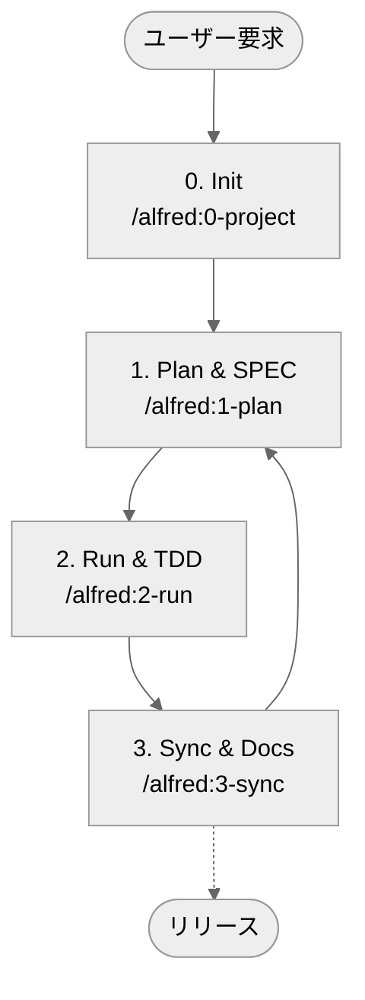

# MoAI-ADK (Agentic Development Kit)

[한국어](README.ko.md) |[English](README.md) | [ไทย](README.th.md) | [日本語](README.ja.md) | [中文](README.zh.md) | [हिन्दी](README.hi.md)

[](https://pypi.org/project/moai-adk/)
[](https://opensource.org/licenses/MIT)
[](https://www.python.org/)
[](https://github.com/modu-ai/moai-adk/actions/workflows/moai-gitflow.yml)
[](https://codecov.io/gh/modu-ai/moai-adk)
[](https://github.com/modu-ai/moai-adk)

> **MoAI-ADK は、SPEC→TEST (TDD)→ コード → ドキュメントを AI とともに滑らかにつなぐ開発ワークフローを提供します。**

---

## 1. MoAI-ADK を一目で

| 質問                             | ショートカット                                                 |
| -------------------------------- | -------------------------------------------------------------- |
| 初めてです。どんなツール？       | [MoAI-ADK とは？](#moai-adkとは)                               |
| どうやって始めるの？             | [5 分クイックスタート](#5分クイックスタート)                   |
| 基本フローが知りたい             | [コアワークフロー (0 → 3)](#コアワークフロー-0--3)             |
| Plan / Run / Sync は何をする？   | [主要コマンドまとめ](#主要コマンドまとめ)                      |
| SPEC・TDD・TAG とは？            | [主要コンセプトを理解する](#主要コンセプトを理解する)          |
| エージェントと Skills が知りたい | [Sub-agent と Skills の概要](#sub-agent-と-skills-の概要)      |
| Claude Code Hooks の動作は？     | [Claude Code Hooks ガイド](#claude-code-hooks-ガイド)          |
| もっと学びたい                   | [追加リソース](#追加リソース)                                  |

---

## MoAI-ADK とは？

MoAI-ADK（MoAI Agentic Development Kit）は、**開発プロセスのすべてのステップに AI を組み込むオープンソースのツールキット**です。Alfred SuperAgent が「まず SPEC を作り、テスト（TDD）で検証し、ドキュメントとコードを常に同期させる」という原則を代わりに守ってくれます。

初めて使う場合は、次の 3 つだけ覚えてください。

1. **何を作るのか（SPEC）** を先に言語化する。
2. **テストを先に書き（TDD）**、その後で実装する。
3. **ドキュメント / README / CHANGELOG** を自動で最新に保つ。

この流れを 4 つの `/alfred` コマンドで繰り返せば、プロジェクト全体の整合性が保たれます。

---

## なぜ必要なのか？

| 課題                                | MoAI-ADK の支援内容                                          |
| ----------------------------------- | ------------------------------------------------------------ |
| 「AI が書いたコードを信頼しづらい」 | SPEC → TEST → IMPLEMENTATION → DOCS を TAG チェーンで連結    |
| 「文脈がなく毎回同じ質問になる」    | Alfred が主要ドキュメントと履歴を覚えて案内                  |
| 「プロンプト作成が難しい」          | `/alfred` コマンドと準備済み Skills が標準プロンプトを提供   |
| 「ドキュメントとコードが乖離する」  | `/alfred:3-sync` が README／CHANGELOG／Living Doc を自動整合 |

---

## 5 分クイックスタート

```bash
# 1.（任意）uv をインストール — pip より速い Python パッケージマネージャー
curl -LsSf https://astral.sh/uv/install.sh | sh

# 2. MoAI-ADK をインストール（tool モード: グローバル隔離実行）
uv tool install moai-adk

# 3. 新規プロジェクトを開始
moai-adk init my-project
cd my-project

# 4. Claude Code（または CLI）から Alfred を呼び出す
claude  # Claude Code を起動して以下のコマンドを実行
/alfred:0-project "プロジェクト名"
```

> 🔍 確認コマンド: `moai-adk doctor` — Python/uv バージョン、`.moai/` 構造、エージェント／Skills の準備状況をチェックします。

---

## MoAI-ADK を最新に保つ

### 現在のバージョンを確認

```bash
# インストールされているバージョンを確認
moai-adk --version

# PyPI の最新バージョンを確認
uv tool list  # moai-adk の現在のバージョンを表示
```

### アップグレード方法

#### 方法 1: 個別ツールのみアップグレード（推奨）

```bash
# moai-adk だけを最新バージョンにアップグレード
uv tool upgrade moai-adk
```

#### 方法 2: インストール済みツールを一括アップグレード

```bash
# uv tool の全ツールを最新バージョンに更新
uv tool update
```

#### 方法 3: 指定バージョンをインストール

```bash
# 指定バージョンを再インストール（例: 0.4.2）
uv tool install moai-adk==0.4.2
```

### アップデート後の確認

```bash
# インストール済みバージョンを確認
moai-adk --version

# プロジェクトが正常稼働するか確認
moai-adk doctor

# 既存プロジェクトに新テンプレートを適用（任意）
moai-adk init .  # 既存コードは維持し、.moai/ 構造のみ更新
```

> 💡 **Tip**: メジャー／マイナー更新があったら `moai-adk init .` を実行し、最新のエージェント／Skills／テンプレートを取り込んでください。既存のコードやカスタマイズは安全です。

---

## コアワークフロー (0 → 3)

Alfred は 4 つのコマンドでプロジェクトを推進します。



### 0. INIT — プロジェクト準備

- プロジェクト紹介、ターゲット、言語、モード（ロケール）をヒアリング
- `.moai/config.json` と `.moai/project/*` の 5 文書を自動生成
- 言語検出と推奨 Skill Pack（Foundation + Essentials + Domain/Language）を配置
- テンプレート整理、初期 Git／バックアップチェックを実施

### 1. PLAN — 方向性を揃える

- `/alfred:1-plan` が EARS 形式 SPEC（`@SPEC:ID` 付き）を作成
- Plan Board、実装アイデア、リスク整理を生成
- チームモードでは自動でブランチ／Draft PR を作成

### 2. RUN — テスト駆動開発

- フェーズ 1 `implementation-planner`: ライブラリ、フォルダー、TAG 設計
- フェーズ 2 `tdd-implementer`: RED（失敗テスト）→ GREEN（最小実装）→ REFACTOR
- `quality-gate` が TRUST 5 の原則とカバレッジ変化を検証

### 3. SYNC — ドキュメントと PR を整理

- Living Doc、README、CHANGELOG などを同期
- TAG チェーンを検証し、孤立した TAG を復旧
- Sync Report を生成し、Draft → Ready for Review、`--auto-merge` に対応

---

## 主要コマンドまとめ

| コマンド                  | 内容                                                     | 主なアウトプット                                                         |
| ------------------------- | -------------------------------------------------------- | ------------------------------------------------------------------------ |
| `/alfred:0-project`       | プロジェクト説明の収集、設定／文書生成、Skill 提案       | `.moai/config.json`, `.moai/project/*`, 初期レポート                     |
| `/alfred:1-plan <説明>`   | 要件分析、SPEC 下書き、Plan Board 作成                   | `.moai/specs/SPEC-*/spec.md`, plan/acceptance 文書, フィーチャーブランチ |
| `/alfred:2-run <SPEC-ID>` | TDD 実行、テスト／実装／リファクタリング、品質検証       | `tests/`, `src/` 実装, 品質レポート, TAG 連携                            |
| `/alfred:3-sync`          | ドキュメント／README／CHANGELOG 同期、TAG／PR 状態を整理 | `docs/`, `.moai/reports/sync-report.md`, レビュー準備済み PR             |

> ❗ すべてのコマンドは **Phase 0（任意）→ Phase 1 → Phase 2 → Phase 3** のループを守ります。Alfred が現在の状況と次のステップを自動で報告します。

---

<!-- TRANSLATION NEEDED: This section should be translated to Japanese -->
<!-- For complete documentation in English, see README.md -->
<!-- For complete documentation in Korean, see README.ko.md -->

## 🎯 NEW in v0.5.7: SPEC GitHub Issue Automation

MoAI-ADK now provides automatic GitHub Issue synchronization from SPEC documents in team mode.

### Key Features

✅ **Automatic Issue Creation**: GitHub Issue created on every PR with SPEC file changes
✅ **Metadata Extraction**: ID, version, status, priority automatically parsed
✅ **PR Integration**: Issue linked to PR via automatic comment
✅ **Label Management**: Priority-based labels auto-applied
✅ **CodeRabbit Review** (local only): AI-powered SPEC quality validation

### How It Works

1. Create SPEC with `/alfred:1-plan`
2. Push to feature branch
3. GitHub Actions automatically creates Issue
4. PR comment added with Issue link
5. CodeRabbit reviews SPEC quality (local only)

For complete documentation, see:
- English: [README.md](README.md#spec-github-issue-automation)
- Korean: [README.ko.md](README.ko.md#spec-github-issue-자동화)

---

## 主要コンセプトを理解する

### SPEC-First

- **なぜ?** 家を建てる前に設計図が必要なように、実装前に要件を整理します。
- **どうやって?** `/alfred:1-plan` が “WHEN… THEN…” 構造を持つ EARS 形式 SPEC を生成します。
- **結果:** `@SPEC:ID` 付きの文書 + Plan Board + 受け入れ基準。

### TDD (Test-Driven Development)

- **RED**: まず失敗するテストを書く。
- **GREEN**: テストが通る最小限のコードを書く。
- **REFACTOR**: 構造を整え重複を除去する。
- `/alfred:2-run` がフローを自動化し、RED/GREEN/REFACTOR のログを残します。

### TAG システム

- `@SPEC:ID` → `@TEST:ID` → `@CODE:ID` → `@DOC:ID` を連結します。
- TAG を検索すれば関連する SPEC・テスト・ドキュメントを一括で追跡可能。
- `/alfred:3-sync` が TAG インベントリを確認し、孤立した TAG を通知します。

### TRUST 5 原則

1. **Test First** — テストを必ず先に書く
2. **Readable** — 短い関数と一貫したスタイルを保つ
3. **Unified** — アーキテクチャと型／契約を整合させる
4. **Secured** — 入力検証、情報保護、静的解析を行う
5. **Trackable** — TAG、Git 履歴、ドキュメントを連動させる

> 詳細なルールは `.moai/memory/development-guide.md` を参照してください。

---

## 最初のハンズオン: Todo API 例

1. **Plan**

   ```bash
   /alfred:1-plan "Todo の追加・取得・更新・削除 API"
   ```

   Alfred が SPEC (`.moai/specs/SPEC-TODO-001/spec.md`) と plan/acceptance 文書を生成します。

2. **Run**

   ```bash
   /alfred:2-run TODO-001
   ```

   テスト (`tests/test_todo_api.py`)、実装 (`src/todo/`)、レポートが自動で作成されます。

3. **Sync**

   ```bash
   /alfred:3-sync
   ```

   `docs/api/todo.md`、TAG チェーン、Sync Report を更新します。

4. **確認コマンド**
   ```bash
   rg '@(SPEC|TEST|CODE|DOC):TODO-001' -n
   pytest tests/test_todo_api.py -v
   cat docs/api/todo.md
   ```

> わずか 15 分で、SPEC → TDD → ドキュメントが連携した Todo API を完成できます。

---

## Sub-agent と Skills の概要

Alfred は **19 名のチーム**（SuperAgent 1 + コア Sub-agent 10 + 0-project Sub-agent 6 + ビルトイン 2）と **56 個の Claude Skills** を組み合わせて動作します。

### コア Sub-agent（Plan → Run → Sync）

| Sub-agent          | モデル | 役割                                                            |
| ------------------ | ------ | --------------------------------------------------------------- |
| project-manager 📋 | Sonnet | プロジェクト初期化とメタデータインタビュー                      |
| spec-builder 🏗️    | Sonnet | Plan Board 作成、EARS SPEC 執筆                                 |
| code-builder 💎    | Sonnet | `implementation-planner` と `tdd-implementer` で TDD を一貫実行 |
| doc-syncer 📖      | Haiku  | Living Doc、README、CHANGELOG を同期                            |
| tag-agent 🏷️       | Haiku  | TAG インベントリ管理、孤立 TAG の検出                           |
| git-manager 🚀     | Haiku  | GitFlow、Draft/Ready、Auto Merge を管理                         |
| debug-helper 🔍    | Sonnet | 失敗分析と fix-forward 戦略の提案                               |
| trust-checker ✅   | Haiku  | TRUST 5 の品質ゲートを検証                                      |
| quality-gate 🛡️    | Haiku  | カバレッジ変化とリリース阻害要因をレビュー                      |
| cc-manager 🛠️      | Sonnet | Claude Code セッション最適化と Skills 配備                      |

### Skills（段階的開示）

- **Foundation (6)**: TRUST, TAG, SPEC, EARS, Git, 言語ポリシー
- **Essentials (4)**: Debug, Refactor, Review, Performance
- **Alfred Tier (11)**: MoAI‑ADK の内部オーケストレーション（Plan/Run/Sync、TAG、TRUST 等）
- **Domain/Language/Ops**: バックエンド/Web API/セキュリティ、主要言語パック、Claude Code 運用

> Skills は `.claude/skills/` に保存され、必要なときにのみ JIT で読み込みます（合計 56 Skills）。

---

## AI モデル選択ガイド

| シーン                                     | デフォルトモデル      | 理由                                 |
| ------------------------------------------ | --------------------- | ------------------------------------ |
| SPEC／設計／リファクタリング／問題解決     | **Claude 4.5 Sonnet** | 深い推論と構造化された文章が得意     |
| ドキュメント同期、TAG チェック、Git 自動化 | **Claude 4.5 Haiku**  | 繰り返しの速い作業や文字列処理が得意 |

- パターン化された作業は Haiku から始め、判断が難しい場合は Sonnet に切り替えましょう。
- 手動でモデルを切り替えた場合は、理由をログに残すとチームの理解が進みます。

---

## Claude Code Hooks ガイド

MoAI-ADK は開発フローに統合された 5 つの Claude Code Hooks を提供します。セッション開始/終了、ツール実行の前後、プロンプト送信のタイミングで自動実行され、チェックポイント、JIT コンテキスト読み込み、セッション管理を行います。

### Hooks とは？

Claude Code セッションの重要イベントで自動発火するイベント駆動スクリプトです。作業を妨げずに安全性と生産性を高めます。

### インストール済み Hooks（5）

| Hook                 | 状態    | 機能                                                                                                       |
| -------------------- | ------- | ---------------------------------------------------------------------------------------------------------- |
| **SessionStart**     | ✅ 有効 | プロジェクト状態の要約（言語/Git/SPEC 進捗/チェックポイント）                                              |
| **PreToolUse**       | ✅ 有効 | リスク検知 + 自動チェックポイント（削除/マージ/一括編集/重要ファイル） + **TAG Guard** （@TAG の欠落検出） |
| **UserPromptSubmit** | ✅ 有効 | JIT コンテキスト読み込み（関連する SPEC/テスト/コード/ドキュメントを自動ロード）                           |
| **PostToolUse**      | ✅ 有効 | 変更後の自動テスト実行（9 言語対応: Python、TS、JS、Go、Rust、Java、Kotlin、Swift、Dart）                  |
| **SessionEnd**       | ✅ 有効 | セッションクリーンアップと状態保存                                                                         |

#### PreToolUse Hook の詳細

**トリガー**: ファイル編集、Bash コマンド、MultiEdit 操作の実行前
**目的**: 危険な操作を検出し、自動的に安全チェックポイントを作成 + TAG Guard

**保護対象**:

- `rm -rf`（ファイル削除）
- `git merge`、`git reset --hard`（Git 危険操作）
- 重要ファイルの編集（`CLAUDE.md`、`config.json`）
- 大量編集（MultiEdit で 10 ファイル以上を一度に）

**TAG Guard（v0.4.11 新機能）**:
変更されたファイルの@TAG アノテーション欠落を自動検出:

- staged、modified、untracked ファイルをスキャン
- SPEC/TEST/CODE/DOC ファイルに必要な@TAG マーカーがない場合に警告
- `.moai/tag-rules.json`でルール設定可能
- 非ブロッキング方式（優しいリマインダー、実行を停止しない）

**表示内容**:

```
🛡️ Checkpoint created: before-delete-20251023-143000
   Operation: delete
```

または、TAG が欠落している場合:

```
⚠️ TAG欠落検出: 作成/変更されたファイルに@TAGがありません
 - src/auth/service.py → 期待されるタグ: @CODE:
 - tests/test_auth.py → 期待されるタグ: @TEST:
推奨アクション:
  1) SPEC/TEST/CODE/DOCタイプに適した@TAGをファイルヘッダーに追加
  2) rgで確認: rg '@(SPEC|TEST|CODE|DOC):' -n <パス>
```

**重要性**: ミスによるデータ損失を防ぎ、@TAG トレーサビリティを保証。問題が発生した場合は、常にチェックポイントから復元できます。

### 技術情報

- 位置: `.claude/hooks/alfred/`
- 環境変数: `$CLAUDE_PROJECT_DIR`（プロジェクトルートを動的参照）
- 性能: 各 Hook は <100ms で実行
- ロギング: エラーは stderr（stdout は JSON 用）

### 無効化するには

`.claude/settings.json` を編集:

```json
{
  "hooks": {
    "SessionStart": [],
    "PreToolUse": ["risk-detector", "checkpoint-maker"]
  }
}
```

### トラブルシューティング

- 実行されない: `.claude/settings.json` を確認、`uv` がインストール済みか、実行権限 `chmod +x .claude/hooks/alfred/alfred_hooks.py`
- パフォーマンス低下: 100ms 超の Hook がないか、不要 Hook を無効化、stderr のエラー確認
- チェックポイントが多すぎる: PreToolUse の条件/閾値を調整（`core/checkpoint.py`）

---

## 最新アップデート

| バージョン  | 主な機能                                                                     | 日付       |
| ----------- | ---------------------------------------------------------------------------- | ---------- |
| **v0.5.7**  | 🎯 SPEC → GitHub Issue 自動化 + CodeRabbit 統合 + 自動 PR コメント           | 2025-10-27 |
| **v0.4.11** | ✨ TAG Guard システム + CLAUDE.md フォーマット改善 + コードクリーンアップ    | 2025-10-23 |
| **v0.4.10** | 🔧 Hook 堅牢性向上 + バイリンガルドキュメント + テンプレート言語設定         | 2025-10-23 |
| **v0.4.9**  | 🎯 Hook JSON スキーマ検証修正 + 包括的テスト（468/468 パス）                 | 2025-10-23 |
| **v0.4.8**  | 🚀 リリース自動化 + PyPI デプロイ + Skills 改良                              | 2025-10-23 |
| **v0.4.7**  | 📖 韓国語最適化 + SPEC-First 原則ドキュメント                                | 2025-10-22 |
| **v0.4.6**  | 🎉 完全 Skills v2.0（100%本番対応）+ 85,000 行公式ドキュメント + 300+ TDD 例 | 2025-10-22 |

> 📦 **今すぐインストール**: `uv tool install moai-adk==0.4.11` または `pip install moai-adk==0.4.11`

---

## よくある質問 (FAQ)

- **Q. 既存プロジェクトにも導入できますか？**  
  A. はい。`moai-adk init .` を実行すれば `.moai/` 構造だけを追加し、コードは触りません。
- **Q. テストはどうやって実行しますか？**  
  A. まず `/alfred:2-run` が実行します。必要に応じて `pytest` や `pnpm test` などを再実行してください。
- **Q. ドキュメントが常に最新か確認するには？**  
  A. `/alfred:3-sync` が Sync Report を生成します。Pull Request で確認してください。
- **Q. 手動で進めてもいいですか？**  
  A. 可能ですが、SPEC → TEST → CODE → DOC の順序と TAG の付与は必須です。

---
## Alfred のメモリファイル (.moai/memory/)

Alfred の知識ベースは、`.moai/memory/`に保存された**14 個のメモリファイル**で構成されています。これらのファイルは、Alfred と Sub-agent が開発中に参照する標準、ルール、ガイドラインを定義します。

### コア知識ベース（14 ファイル）

**コアガイド（3 ファイル）**：

| ファイル                 | サイズ | 用途                               | 使用者               |
| ------------------------ | ------ | ---------------------------------- | -------------------- |
| `CLAUDE-AGENTS-GUIDE.md` | ~15KB  | Sub-agent 選択と協業ガイド         | Alfred、開発者       |
| `CLAUDE-PRACTICES.md`    | ~12KB  | 実践的なワークフロー例とパターン   | Alfred、全 Sub-agent |
| `CLAUDE-RULES.md`        | ~19KB  | Skill/TAG/Git ルールと意思決定標準 | Alfred、全 Sub-agent |

**標準定義（4 ファイル）**：

| ファイル                       | サイズ | 用途                                 | 使用者                   |
| ------------------------------ | ------ | ------------------------------------ | ------------------------ |
| `CONFIG-SCHEMA.md`             | ~12KB  | `.moai/config.json`スキーマ定義      | project-manager          |
| `DEVELOPMENT-GUIDE.md`         | ~14KB  | SPEC-First TDD ワークフローガイド    | 全 Sub-agent、開発者     |
| `GITFLOW-PROTECTION-POLICY.md` | ~6KB   | Git ブランチ保護ポリシー             | git-manager              |
| `SPEC-METADATA.md`             | ~9KB   | SPEC YAML フロントマター標準（SSOT） | spec-builder、doc-syncer |

**実装分析（7 ファイル）**：Skills 管理、ワークフロー改善、チーム統合分析のための内部レポートとポリシー文書

### メモリファイルはいつロードされますか？

**セッション開始時（常時）**：

- `CLAUDE.md`
- `CLAUDE-AGENTS-GUIDE.md`
- `CLAUDE-RULES.md`

**Just-In-Time（コマンド実行時）**：

- `/alfred:1-plan` → `SPEC-METADATA.md`、`DEVELOPMENT-GUIDE.md`
- `/alfred:2-run` → `DEVELOPMENT-GUIDE.md`
- `/alfred:3-sync` → `DEVELOPMENT-GUIDE.md`

**条件付き（必要時）**：

- Config 変更 → `CONFIG-SCHEMA.md`
- Git 操作 → `GITFLOW-PROTECTION-POLICY.md`
- Skill 作成 → `SKILLS-DESCRIPTION-POLICY.md`

### メモリファイルが重要な理由

1. **単一真実源（SSOT）**：各標準が正確に 1 箇所のみに定義され、競合を排除
2. **コンテキスト効率**：JIT ロードで初期セッションのオーバーヘッドを削減（開始時は 3 ファイルのみ）
3. **一貫した意思決定**：全 Sub-agent が`CLAUDE-RULES.md`の同じルールに従う
4. **トレーサビリティ**：SPEC メタデータ、@TAG ルール、Git 標準がすべて文書化

### 使用頻度

| 優先度     | ファイル                                           | 使用パターン     |
| ---------- | -------------------------------------------------- | ---------------- |
| 非常に高い | `CLAUDE-RULES.md`                                  | すべての意思決定 |
| 高い       | `DEVELOPMENT-GUIDE.md`、`SPEC-METADATA.md`         | すべてのコマンド |
| 中程度     | `CLAUDE-AGENTS-GUIDE.md`、`CLAUDE-PRACTICES.md`    | Agent 調整       |
| 低い       | `CONFIG-SCHEMA.md`、`GITFLOW-PROTECTION-POLICY.md` | 特定の操作       |

> 📚 **完全な分析**：`.moai/memory/MEMORY-FILES-USAGE.md`で、各ファイルを誰が使用するか、いつロードされるか、どこで参照されるか、なぜ必要かについての包括的なドキュメントを確認してください。

---

## 追加リソース

| 目的               | リソース                                                             |
| ------------------ | -------------------------------------------------------------------- |
| Skills 詳細構造    | `docs/skills/overview.md` および Tier ごとのドキュメント             |
| Sub-agent 詳細     | `docs/agents/overview.md`                                            |
| ワークフローガイド | `docs/guides/workflow/`（Plan/Run/Sync）                             |
| 開発ガイドライン   | `.moai/memory/development-guide.md`, `.moai/memory/spec-metadata.md` |
| アップデート計画   | `CHANGELOG.md`, `UPDATE-PLAN-0.4.0.md`                               |

---

## コミュニティとサポート

| チャンネル               | リンク                                                   |
| ------------------------ | -------------------------------------------------------- |
| **GitHub Repository**    | https://github.com/modu-ai/moai-adk                      |
| **Issues & Discussions** | https://github.com/modu-ai/moai-adk/issues               |
| **PyPI Package**         | https://pypi.org/project/moai-adk/ (最新: v0.4.11)       |
| **Latest Release**       | https://github.com/modu-ai/moai-adk/releases/tag/v0.4.11 |
| **Documentation**        | プロジェクト内の `.moai/`, `.claude/`, `docs/` を参照    |

---

## 🚀 MoAI-ADK Philosophy

> **「SPEC がなければ CODE もない」**

MoAI-ADK は単なるコード生成ツールではありません。19 名のチームと 56 個の Claude Skills を持つ Alfred SuperAgent が一緒に保証します:

- ✅ **SPEC → TEST (TDD) → CODE → DOCS の一貫性**
- ✅ **@TAG システムによる完全な履歴追跡**
- ✅ **87.84%+のカバレッジ保証**
- ✅ **4 段階ワークフロー（0-project → 1-plan → 2-run → 3-sync）による反復開発**
- ✅ **AI との透明でトレース可能なコラボレーション**

Alfred と一緒に**信頼できる AI 開発**の新しい体験を始めましょう！ 🤖

---

**MoAI-ADK v1.0.0** — AI SuperAgent & Complete Skills v2.0 + TAG Guard を備えた SPEC-First TDD

- 📦 PyPI: https://pypi.org/project/moai-adk/
- 🏠 GitHub: https://github.com/modu-ai/moai-adk
- 📝 License: MIT
- ⭐ Skills: 55+ 本番対応ガイド
- ✅ テスト結果: 467/476 パス (85.60% カバレッジ)
- 🏷️ TAG Guard: PreToolUse Hook で自動@TAG 検証

---
