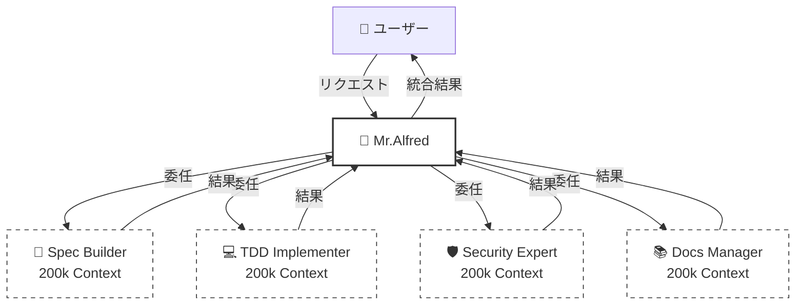
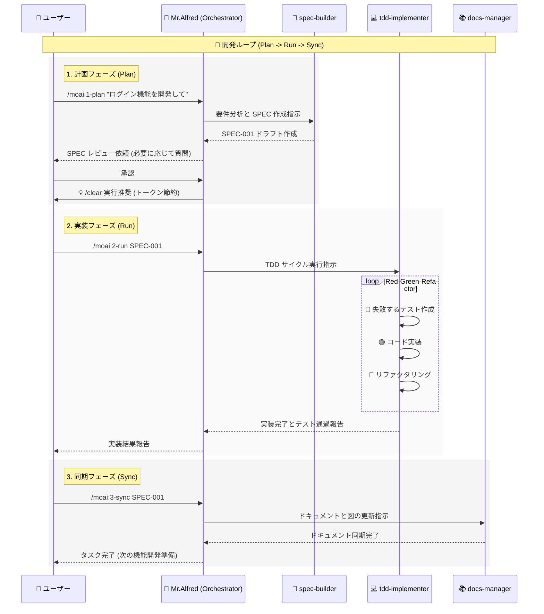

# 🗿 MoAI-ADK: AI 駆動型 SPEC-First TDD 開発フレームワーク

**利用可能な言語:** [🇰🇷 한국어](./README.ko.md) | [🇺🇸 English](./README.md) | [🇯🇵 日本語](./README.ja.md) | [🇨🇳 中文](./README.zh.md)

[](https://pypi.org/project/moai-adk/)
[](https://opensource.org/licenses/MIT)
[](https://www.python.org/)

MoAI-ADK (Agentic Development Kit) は、**SPEC-First 開発**、**テスト駆動開発 (TDD)**、**AI エージェント**を組み合わせ、完全かつ透明性の高い開発ライフサイクルを提供するオープンソースフレームワークです。

---

## 🚀 インストールとアップデート

MoAI-ADK は `uv` ツールを使用してインストールおよび管理することを推奨します。

### uv のインストール (事前準備)

**macOS / Linux:**

```bash
curl -LsSf https://astral.sh/uv/install.sh | sh
```

**Windows:**

```powershell
powershell -ExecutionPolicy ByPass -c "irm https://astral.sh/uv/install.ps1 | iex"
```

### パッケージのインストール (Global)

```bash
uv tool install moai-adk

# 新規プロジェクトの作成
moai-adk init project-name
cd project-name
claude

# 既存プロジェクトでの初期化
cd existing-project
moai-adk init .
claude
```

### パッケージのアップデート (Global)

```bash
uv tool update moai-adk
```

### プロジェクトのアップデート

既存プロジェクトの設定を最新バージョンにアップデートするには、プロジェクトルートで以下のコマンドを実行してください:

```bash
cd project-name
moai-adk update
claude
```

---

## ⚙️ 設定 (Configuration)

プロジェクトルートの `.moai/config/config.json` ファイルですべての設定を管理します。

### 主な設定項目

- **`user.name`**: ユーザー名 (例: "GOOS") - _Mr.Alfred があなたを呼ぶ名前です。_
- **`language.conversation_language`**: 会話言語 (例: "ja") - _すべてのメッセージ、SPEC、ドキュメントがこの言語で生成されます。_
- **`language.agent_prompt_language`**: エージェント推論言語 (推奨: "en") - _最高のパフォーマンスを得るために英語のままにすることを推奨します。_
- **`constitution.enforce_tdd`**: TDD 強制 (デフォルト: true)

---

## 🤖 エージェント委任とトークン効率 (2M トークンの活用)

### 💡 200k \* 10 = 2M トークンの魔法

Claude Code の会話セッションは **200k トークン** に制限されていますが、MoAI-ADK は **最大 10 体のエージェントを並列で運用** できます。
各エージェントは独立した 200k トークンのコンテキストを持つため、理論的には **2,000,000 (2M) トークン** のコンテキストを活用するのと同じ効果が得られます。



### 🎯 明示的なエージェント委任 (多言語ユーザー必読)

自動トリガーも機能しますが、日本語などの非英語圏の言語を使用する場合は、**明示的な委任** が最も正確で効率的です。

**使用例:**

> **"@agent-docs-manager README.md を日本語の README.ja.md に翻訳して"**

> **"@agent-tdd-implementer SPEC-001 の仕様に基づいてログイン機能を実装して"**

> **"@agent-spec-builder ユーザー認証システムの要件を分析して SPEC を作成して"**

---

## 🔌 MCP サーバー設定

MoAI-ADK は強力な機能のために MCP (Model Context Protocol) サーバーを活用します。
チャットで `@` を入力すると、MCP サーバーの状態を確認し、オン/オフを切り替えることができます。

```text
> @
───────────────────────────────────────────────────────────
  ✓ [mcp] context7                   enabled  (⏎ to toggle)
  ○ [mcp] playwright                 disabled (⏎ to toggle)
  ○ [mcp] figma-dev-mode-mcp-server  disabled (⏎ to toggle)
```

- **context7 (必須)**: 最新のライブラリドキュメントとベストプラクティスを提供します。常に有効にしてください。
- **playwright**: ブラウザ自動化および E2E テストに使用されます。必要な場合のみ有効にしてください。
- **figma-dev-mode-mcp-server**: Figma デザインページの作業が必要な場合に使用します。

---

## 🔄 開発ワークフロー (Alfred との対話)

MoAI-ADK の開発は **Plan (企画) -> Run (実装) -> Sync (同期)** の無限ループで進行します。
Mr.Alfred はこの過程でユーザーの意図を把握し、専門エージェントを指揮して作業を完遂します。

### 1. Plan (`/moai:1-plan`)

ユーザーの曖昧なアイデアを明確な **EARS フォーマットの SPEC ドキュメント** に変換します。
Alfred は `spec-builder` に指示して要件を分析し、不足している部分を質問しながら完璧な仕様書を作成します。

### 2. Run (`/moai:2-run`)

確定した SPEC を基に **TDD (Red-Green-Refactor)** サイクルを回します。
Alfred は `tdd-implementer` にテスト作成を指示し、テストを通過するコードを実装した後、品質のためにリファクタリングを実行します。

### 3. Sync (`/moai:3-sync`)

実装されたコードを分析して **ドキュメントとダイアグラムを最新化** します。
Alfred は `docs-manager` を通じて、コードが変更されるたびにドキュメントが自動的に同期されるようにします。

### MoAI-ADK Agentic Workflow



---

## 💻 コマンド使用法 (Commands)

### 1. `/moai:0-project` (プロジェクト初期化)

- **目的**: 新しいプロジェクト構造を初期化し、設定を検知します。
- **実行**: `.moai` ディレクトリ作成、設定ファイル作成、Git リポジトリ設定。
- **委任**: `project-manager`

### 2. `/moai:1-plan` (仕様書生成)

- **目的**: ユーザー要件を分析し、EARS フォーマットの SPEC ドキュメントを生成します。
- **使用法**: `/moai:1-plan "JWT トークンベースのユーザー認証システム"`
- **委任**: `spec-builder`
- **重要**: 実行後は必ず `/clear` を実行してコンテキストを空にする必要があります (45-50k トークン節約)。

### 3. `/moai:2-run` (TDD 実装)

- **目的**: 生成された SPEC を基に Red-Green-Refactor TDD サイクルを実行します。
- **使用法**: `/moai:2-run SPEC-001`
- **委任**: `tdd-implementer`

### 4. `/moai:3-sync` (ドキュメント同期)

- **目的**: 実装されたコードを分析し、ドキュメント、ダイアグラム、API 仕様を自動生成および同期します。
- **使用法**: `/moai:3-sync SPEC-001`
- **委任**: `docs-manager`

### 5. `/moai:9-feedback` (フィードバックと改善)

- **目的**: ユーザーが機能改善を要求したりバグを報告したりする際に使用します。コードレビューやテスト結果を分析して改善点を導き出します。
- **委任**: `quality-gate`, `debug-helper`

---

## 🕵️ エージェントとスキル (Agents & Skills)

MoAI-ADK は 35 の専門エージェントと 135 以上のスキルを保有しています。

### 📋 企画および設計 (Planning & Design)

| エージェント             | 役割と説明                                                                         | 主なスキル (Skills)                                       |
| :----------------------- | :--------------------------------------------------------------------------------- | :-------------------------------------------------------- |
| **`spec-builder`**       | ユーザー要件を分析し、EARS フォーマットの SPEC ドキュメントを作成します。          | `moai-foundation-ears`, `moai-foundation-specs`           |
| **`api-designer`**       | REST/GraphQL API アーキテクチャ、エンドポイント、スキーマを設計します。            | `moai-domain-api`, `moai-domain-microservices`            |
| **`component-designer`** | 再利用可能な UI コンポーネント構造とデザインシステムを設計します。                 | `moai-domain-design-systems`, `moai-domain-ui-components` |
| **`ui-ux-expert`**       | ユーザーエクスペリエンス (UX) フローとインターフェース (UI) デザインを担当します。 | `moai-domain-ux-research`, `moai-domain-wireframing`      |

### 💻 実装 (Implementation)

| エージェント          | 役割と説明                                                             | 主なスキル (Skills)                                               |
| :-------------------- | :--------------------------------------------------------------------- | :---------------------------------------------------------------- |
| **`tdd-implementer`** | TDD サイクル (Red-Green-Refactor) を厳格に遵守し、コードを実装します。 | `moai-foundation-trust`, `moai-essentials-testing`                |
| **`backend-expert`**  | サーバーロジック、データベース連携、ビジネスロジックを実装します。     | `moai-domain-backend`, `moai-lang-python`, `moai-lang-go` など    |
| **`frontend-expert`** | Web フロントエンド、状態管理、UI インタラクションを実装します。        | `moai-domain-frontend`, `moai-lang-react`, `moai-lang-typescript` |
| **`database-expert`** | DB スキーマ設計、クエリ最適化、マイグレーションを実行します。          | `moai-domain-database`, `moai-domain-etl`                         |

### 🛡️ 品質およびセキュリティ (Quality & Security)

| エージェント               | 役割と説明                                                                   | 主なスキル (Skills)                                                       |
| :------------------------- | :--------------------------------------------------------------------------- | :------------------------------------------------------------------------ |
| **`security-expert`**      | セキュリティ脆弱性点検、OWASP 準拠、セキュアコーディングガイドを提供します。 | `moai-domain-security`, `moai-security-oauth`, `moai-essentials-security` |
| **`quality-gate`**         | コード品質、カバレッジ、TRUST 5 原則の遵守有無を最終検証します。             | `moai-core-quality-gates`, `moai-core-compliance`                         |
| **`test-engineer`**        | ユニット/統合/E2E テスト戦略の策定およびテストコードを高度化します。         | `moai-essentials-testing`, `mcp-playwright-integration`                   |
| **`accessibility-expert`** | Web アクセシビリティ (WCAG) 標準準拠有無を診断し改善します。                 | `moai-domain-accessibility`                                               |
| **`format-expert`**        | コードスタイルガイドおよびリンティングルールを適用します。                   | `moai-core-validation`                                                    |
| **`debug-helper`**         | ランタイムエラーの原因を分析し、解決策を提示します。                         | `moai-essentials-debugging`, `moai-essentials-profiling`                  |

### 🚀 DevOps および管理 (DevOps & Management)

| エージェント               | 役割と説明                                                               | 主なスキル (Skills)                                             |
| :------------------------- | :----------------------------------------------------------------------- | :-------------------------------------------------------------- |
| **`devops-expert`**        | CI/CD パイプライン、クラウドインフラ (IaC)、デプロイ自動化を担当します。 | `moai-domain-devops`, `moai-domain-cloud`, `docker-integration` |
| **`monitoring-expert`**    | システムモニタリング、ロギング設定、アラートシステムを構築します。       | `moai-domain-monitoring`, `moai-core-monitoring`                |
| **`performance-engineer`** | システムパフォーマンスのボトルネックを分析し、最適化案を適用します。     | `moai-essentials-performance`, `moai-essentials-profiling`      |
| **`docs-manager`**         | プロジェクトドキュメントを生成、更新し、管理します。                     | `moai-essentials-documentation`, `moai-foundation-specs`        |
| **`git-manager`**          | Git ブランチ戦略、PR 管理、バージョンタギングを実行します。              | `moai-essentials-git`, `moai-essentials-versioning`             |
| **`project-manager`**      | プロジェクト全般の進行状況を調整し管理します。                           | `moai-essentials-agile`, `moai-essentials-collaboration`        |

### 🛠️ 特殊ツール (Specialized Tools)

| エージェント        | 役割と説明                                           | 主なスキル (Skills)         |
| :------------------ | :--------------------------------------------------- | :-------------------------- |
| **`agent-factory`** | 新しいカスタムエージェントを生成し設定します。       | `moai-core-agent-factory`   |
| **`skill-factory`** | 新しい MoAI スキルを定義し、ライブラリに追加します。 | `moai-core-task-delegation` |

---

## 📍 Claude Code ステータスライン統合

MoAI-ADK ステータスラインは、Claude Code ターミナルのステータスバーに **リアルタイムの開発状態** を表示します。モデル、バージョン、Git ブランチ、ファイル変更を一目で確認できます。

### 📊 ステータスライン形式

**コンパクトモード** (デフォルト, ≤80 文字):

```
🤖 Haiku 4.5 (v2.0.46) | 🗿 v0.26.0 | 📊 +0 M0 ?0 | 💬 R2-D2 | 🔀 develop
```

| 項目           | アイコン | 意味                            | 例                                        |
| -------------- | -------- | ------------------------------- | ----------------------------------------- |
| **モデル**     | 🤖       | Claude モデル + Code バージョン | Haiku 4.5 (v2.0.46), Sonnet 4.0 (v4.0.15) |
| **バージョン** | 🗿       | MoAI-ADK バージョン             | v0.26.0                                   |
| **変更**       | 📊       | Git ファイル状態                | +0 M0 ?0                                  |
| **スタイル**   | 💬       | 選択された UI/UX スタイル       | R2-D2, Yoda, default                      |
| **ブランチ**   | 🔀       | 現在の作業ブランチ              | develop, feature/SPEC-001                 |

### 📝 変更表記の説明

```
変更: +staged Mmodified ?untracked

📊 +0  = ステージングされたファイル数 (git add 済み)
📊 M0  = 修正されたファイル数 (まだ git add されていない)
📊 ?0  = 追跡されていない新しいファイル数
```

### 💡 例

| 状況           | 表示          | 意味                                               |
| -------------- | ------------- | -------------------------------------------------- |
| クリーンな状態 | `📊 +0 M0 ?0` | すべての変更がコミット済み                         |
| ファイル修正   | `📊 +0 M2 ?0` | 2 つのファイルが修正 (git add 必要)                |
| 新規ファイル   | `📊 +0 M0 ?1` | 1 つの新規ファイル (git add 必要)                  |
| コミット準備   | `📊 +3 M0 ?0` | 3 つのファイルがステージング (コミット準備完了)    |
| 作業進行中     | `📊 +2 M1 ?1` | 混合状態: 2 つステージング + 1 つ修正 + 1 つ未追跡 |

---

## 📚 ドキュメントとリソース

詳細情報は以下のメモリファイルを参照してください。

- **`.moai/memory/agents.md`**: 35 のエージェント詳細説明
- **`.moai/memory/commands.md`**: 6 つのコマンド実行プロセス
- **`.moai/memory/skills.md`**: 135 のスキルカタログ
- **`.moai/memory/delegation-patterns.md`**: エージェント委任パターン
- **`.moai/memory/token-optimization.md`**: トークン最適化戦略

---

## 📋 ライセンス

MoAI-ADK は [MIT ライセンス](LICENSE) の下で配布されています。

---

## 📞 サポートとコミュニティ

- **GitHub Issues**: [バグ報告および機能リクエスト](https://github.com/modu-ai/moai-adk/issues)
- **GitHub Discussions**: [質問およびアイデア共有](https://github.com/modu-ai/moai-adk/discussions)
- **Email**: <support@mo.ai.kr>

---

## ⭐ スターヒストリー

[](https://star-history.com/#modu-ai/moai-adk&Date)

---

**プロジェクト**: MoAI-ADK
**バージョン**: 0.26.0
**最終更新**: 2025-11-20
**哲学**: SPEC-First TDD + エージェントオーケストレーション + 85% トークン効率
**MoAI**: みんなの AI (Modu-ui AI) を意味します。すべての人が AI を使えるようにすることが私たちの目標です。

Copyleft 2025 MoAI (https//mo.ai.kr , coming soon)
