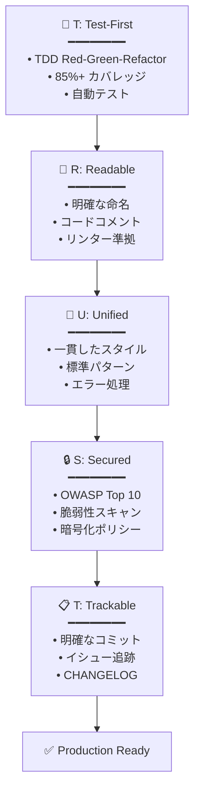

# 🗿 MoAI-ADK: Agentic AI 開発フレームワーク


**利用可能な言語:** [🇰🇷 한국어](./README.ko.md) | [🇺🇸 English](./README.md) | [🇯🇵 日本語](./README.ja.md) | [🇨🇳 中文](./README.zh.md)

[](https://pypi.org/project/moai-adk/)
[](./LICENSE)
[](https://www.python.org/)

> **"バイブコーディングの目的は迅速な生産性ではなく、コード品質である"**

MoAI-ADKは**高品質なコードを作成するAI開発環境**を提供します。SPEC-First TDD、テスト駆動開発、継続的リファクタリング、そして20個の専門AIエージェントが一緒に働きます。

---

## 🎁 MoAI-ADK スポンサー: z.ai GLM 4.7

**💎 コスト効率の良いAI開発のための最適ソリューション**

MoAI-ADKは**z.ai GLM 4.7**とのパートナーシップを通じて、開発者に経済的なAI開発環境を提供します。

### 🚀 GLM 4.7 特別特典

| 特典                  | 説明                                           |
| ------------------- | ---------------------------------------------- |
| **💰 70% コスト削減**  | Claude比 1/7価格で同等性能                      |
| **⚡ 高速応答**       | 最適化されたインフラで低レイテンシ応答提供       |
| **🔄 互換性**         | Claude Codeと完全互換、別途コード修正不要        |
| **📈 無制限使用**     | 日次/週次トークンリミットなしで自由に使用        |

### 🎁 登録特別割引

**👉 [GLM 4.7 登録 (10% 追加割引)](https://z.ai/subscribe?ic=1NDV03BGWU)**

このリンクから登録すると:

- ✅ **追加10%割引**特典
- ✅ **MoAIオープンソース開発**に貢献 (リワードクレジットはオープンソースプロジェクトに使用されます)

### 💡 使用ガイド

```bash
# 1. GLM APIキー発行
上記リンクから登録後APIキー発行

# 2. MoAI-ADKでGLM設定
moai glm YOUR_API_KEY
```

> **💡 ヒント**: Worktree環境でGLM 4.7を活用すると、Opusで設計してGLMで大量実装してコストを最大70%削減できます。

---

## 🌟 核心価値

- **🎯 SPEC-First**: 明確な仕様書で90%再作業削減
- **🔴 TDD強制**: 85%+テストカバレッジ自動保証
- **🤖 AIオーケストレーション**: 20個専門エージェント + 48個スキル
- **🌐 多言語ルーティング**: 韓国語/英語/日本語/中国語自動サポート
- **🌳 Worktree並列開発**: 完全分離環境で無制限並列作業
- **🏆 MoAI Rank**: バイブコーディングリーダーボードでモチベーション

---

> **📚 詳細は公式オンラインドキュメントを参照してください:** [https://adk.mo.ai.kr](https://adk.mo.ai.kr)
>

## 1. 30秒インストール

### 🚀 方法1: クイックインストール (推奨)

```bash
curl -LsSf https://moai-adk.github.io/MoAI-ADK/install.sh | sh
```

### 🔧 方法2: 手動インストール

```bash
# Step 1: uv インストール (macOS/Linux)
curl -LsSf https://astral.sh/uv/install.sh | sh

# Step 2: MoAI-ADK インストール
uv tool install moai-adk
```

### 🔨 開発者向け: GitHub Pages設定 (オプション)

> **注意:** このセクションはインストールスクリプトを直接ホストしたい開発者向けのオプションです。一般ユーザーはスキップできます。

インストールスクリプトを自分でホストするには、GitHub Repositoryで以下を設定してください:

**1. GitHub Pagesを有効化**
```
Settings → Pages
Source: GitHub Actions
```

**2. リリース時の自動デプロイ**
- Releaseを公開すると自動的にGitHub Pagesにデプロイされます
- デプロイURL: `https://moai-adk.github.io/MoAI-ADK/install.sh`

**3. ローカルテスト**
```bash
# インストールスクリプトをローカルでテスト
bash install/install.sh
```

---

### 🎨 対話型設定ウィザード

`moai init`コマンド実行時に**9段階対話型ウィザード**が開始されます:


---

#### Step 1: 言語選択

対話言語を選択します。以降の案内がすべて選択した言語で表示されます。

```
🌐 Language Selection
❯ Select your conversation language: [↑↓] Navigate  [Enter] Select
❯ Japanese (日本語)
  English
  Korean (한국어)
  Chinese (中文)
```

---

#### Step 2: 名前入力

ユーザー名を入力します。AIがパーソナライズされた応答を提供します。

```
👤 ユーザー設定
❯ ユーザー名を入力してください (選択事項):
```

---

#### Step 3: GLM APIキー入力

Z.AI社のGLM APIキーを入力します。

```
🔑 APIキー入力
GLM CodePlan API key (optional - press Enter to skip)

✓ 既存GLM APIキーが見つかりました: 99c1a2df...
Enterを押すと既存キー維持、新しいキーを入力すると交換されます

? GLM APIキーを入力してください:
```

> 🎁 **GLM登録特典**: GLMアカウントがない場合は下記リンクで登録してください!
>
> **👉 [GLM 登録 (10% 追加割引)](https://z.ai/subscribe?ic=1NDV03BGWU)**
>
> このリンクから登録すると**追加10%割引**特典を受けられます。
> また、リンクを通じた登録時に発生するリワードは**MoAIオープンソース開発**に使用されます。🙏

---

#### Step 4: プロジェクト設定

プロジェクト名を入力します。

```
📁 プロジェクト設定
❯ プロジェクト名: MoAI-ADK
```

---

#### Step 5: Git設定

Gitモードを選択します。

```
🔀 Git設定
❯ Gitモードを選択してください: [↑↓] Navigate  [Enter] Select
❯ manual (ローカルのみ) - ローカルリポジトリのみ使用
  personal (GitHub個人) - GitHub個人アカウント使用
  team (GitHubチーム) - GitHubチーム/組織使用
```

---

#### Step 6: GitHubユーザー名

personal/team選択時にGitHubユーザー名を入力します。

```
❯ GitHubユーザー名:
```

---

#### Step 7: コミットメッセージ言語

Gitコミットメッセージに使用する言語を選択します。

```
🗣️ 出力言語設定
❯ コミットメッセージ言語: [↑↓] Navigate  [Enter] Select
  English
❯ Japanese (日本語)
  Korean (한국어)
  Chinese (中文)
```

---

#### Step 8: コードコメント言語

コードコメントに使用する言語を選択します。

```
❯ コードコメント言語: [↑↓] Navigate  [Enter] Select
  English
❯ Japanese (日本語)
  Korean (한국어)
  Chinese (中文)
```

---

#### Step 9: ドキュメント言語

ドキュメントに使用する言語を選択します。

```
❯ ドキュメント言語: [↑↓] Navigate  [Enter] Select
  English
❯ Japanese (日本語)
  Korean (한국어)
  Chinese (中文)
```

> 💡 **トークン最適化戦略**: エージェントに指示する内部プロンプトは**英語で固定**されています。
>
> **理由**: 非英語圏言語はClaudeで**12%~20%トークンを追加消費**します。無限反復エージェント作業が多くなるとコストと週次トークンリミットに大きな影響を与えるため、MoAIは内部エージェント指示は英語で固定し**一般対話のみユーザー言語で提供**します。
>
> これがMoAIの**トークン浪費を減らすための取り組み**です。

---

#### インストール完了

すべての設定が完了すると5段階インストールが自動進行します:

```
🚀 Starting installation...

Phase 1: Preparation and backup...        ████████████████ 100%
Phase 2: Creating directory structure...  ████████████████ 100%
Phase 3: Installing resources...          ████████████████ 100%
Phase 4: Generating configurations...     ████████████████ 100%
Phase 5: Validation and finalization...   ████████████████ 100%

✅ Initialization Completed Successfully!
────────────────────────────────────────────────────────────────

📊 Summary:
  📁 Location:   /path/to/my-project
  🌐 Language:   Auto-detect (use /moai:0-project)
  🔀 Git:        manual (github-flow, branch: manual)
  🌍 Locale:     ja
  📄 Files:      47 created
  ⏱️  Duration:   1234ms

🚀 Next Steps:
  1. Run cd my-project to enter the project
  2. Run /moai:0-project in Claude Code for full setup
  3. Start developing with MoAI-ADK!
```

### 既存プロジェクトに追加

```bash
cd your-existing-project
moai init .
# 既存ファイルはそのまま維持されます
```

---

### 🔄 MoAI-ADK アップデート

既存プロジェクトを最新バージョンにアップデートします。

```bash
moai update
```

**3段階スマートアップデートワークフロー**:

```
Stage 1: 📦 パッケージバージョン確認
         └─ PyPIで最新バージョン確認 → 必要時自動アップグレード

Stage 2: 🔍 Configバージョン比較
         └─ パッケージテンプレート vs プロジェクト設定比較
         └─ 同一ならスキップ (70-80% 性能向上)

Stage 3: 📄 テンプレート同期
         └─ バックアップ作成 → テンプレートアップデート → ユーザー設定復元
```

**主要オプション**:

```bash
# バージョンのみ確認 (アップデートなし)
moai update --check

# テンプレートのみ同期 (パッケージアップグレードスキップ)
moai update --templates-only

# 設定編集モード (initウィザード再実行)
moai update --config
moai update -c

# バックアップなし強制アップデート
moai update --force

# All is well~ 自動モード (すべての確認自動承認)
moai update --yes
```

**マージ戦略選択**:

```
🔀 Choose merge strategy:
  [1] Auto-merge (default)
      → テンプレート + ユーザー変更事項自動保存
  [2] Manual merge
      → バックアップ + マージガイド作成 (直接制御)
```

```bash
# Auto-merge強制 (デフォルト)
moai update --merge

# Manual merge強制
moai update --manual
```

**自動保存項目**:

| 項目              | 説明                                          |
| ----------------- | --------------------------------------------- |
| **ユーザー設定**     | `.claude/settings.local.json` (MCP, GLM設定) |
| **カスタムエージェント** | テンプレートにないユーザー生成エージェント    |
| **カスタムコマンド**   | ユーザー定義スラッシュコマンド                |
| **カスタムスキル**     | ユーザー定義スキル                             |
| **カスタムフック**       | ユーザー定義フックスクリプト                   |
| **SPECドキュメント**       | `.moai/specs/` フォルダ全体                  |
| **レポート**          | `.moai/reports/` フォルダ全体                |

> 💡 **アップデートヒント**: `moai update -c`でいつでも言語、APIキー、Git設定を変更できます。
> ユーザーのコマンド、エージェント、スキル、フックはmoai以外のフォルダに生成して使用すると良いです。

---

## 2. プロジェクトドキュメント生成 (選択事項)

新規プロジェクトや既存プロジェクトで**Claude Codeがプロジェクトを理解するのを助ける**プロジェクトドキュメントを自動生成できます:

```
> /moai:0-project
```

### 生成される3つのファイル

| ファイル                        | 目標          | 主要内容                                                  |
| ------------------------------- | ------------- | ---------------------------------------------------------- |
| `.moai/project/product.md`      | **製品概要** | プロジェクト名/説明、ターゲットユーザー、核心機能、使用事例      |
| `.moai/project/structure.md`    | **構造分析** | ディレクトリツリー、主要フォルダ目的、核心ファイル位置、モジュール構成   |
| `.moai/project/tech.md`         | **技術スタック** | 使用技術、フレームワーク選択理由、開発環境、ビルド/デプロイ設定 |

### なぜ必要なのか？

- **コンテキスト提供**: Claude Codeがプロジェクト文脈を迅速把握
- **一貫性維持**: チームメンバー間のプロジェクト理解度共有
- **オンボーディング加速**: 新規開発者のプロジェクト把握時間短縮
- **AI協業最適化**: より正確なコード提案とレビュー可能

> 💡 **ヒント**: プロジェクト初期または構造変更時に`/moai:0-project`を実行すると最新状態でドキュメントが更新されます。

---

## 3. 核心コマンド集

### 🎯 `/moai:0-project` - プロジェクト初期化

```bash
> /moai:0-project
```

プロジェクトの現在状態を自動分析して最適の開発環境を構成します。プログラミング言語とフレームワークを検出し、Gitワークフローと品質保証基準を自動設定します。すべての構成が完了するとすぐに開発を開始できる準備状態になります。

**作業内容**:

- ✅ プロジェクト構造分析
- ✅ プログラミング言語/フレームワーク検出
- ✅ `.moai/config/config.yaml` 生成
- ✅ Gitワークフロー設定
- ✅ セッションメモリシステム構成
- ✅ 品質保証基準設定

---

### 📋 `/moai:1-plan` - SPEC作成

```bash
> /moai:1-plan "機能説明"
```

EARS形式を使用して曖昧さのない仕様書を自動生成します。要求事項定義、成功基準、テストシナリオを含めて開発方向を明確に提示します。生成されたSPECは開発チームとAIが同一理解を共有する単一ソース（Source of Truth）として作動します。

**自動生成**:

- EARS形式仕様書
- 要求事項定義
- 成功基準
- テストシナリオ

**例**:

```bash
> /moai:1-plan "ユーザープロフィールページ"
# → SPEC-002 生成

> /moai:1-plan "決済API"
# → SPEC-003 生成
```

**重要**: 必ず次に`> /clear`実行

---

### 💻 `/moai:2-run` - TDD実装

```bash
> /moai:2-run SPEC-001
```

Red-Green-Refactorサイクルを通じてテストを先に書き、それを通過するコードを実装します。すべての実装は85%以上のテストカバレッジとリンティング、タイプ検査、セキュリティ検査を通過しなければなりません。TRUST 5品質原則を自動検証して安定したコードのみコミットされます。

**自動実行**:

- 🔴 テスト先作成 (Red)
- 🟢 テスト通過コード (Green)
- 🔵 リファクタリング (Refactor)
- ✅ TRUST 5検証

**検証項目**:

- テストカバレッジ >= 85%
- リンティング通過
- タイプ検査通過
- セキュリティ検査通過

---

### 📚 `/moai:3-sync` - ドキュメント同期

```bash
> /moai:3-sync SPEC-001
```

品質検証を開始にドキュメント同期、Gitコミット、PR自動化を行います。APIドキュメント、アーキテクチャ図、README、CHANGELOGを自動生成して最新状態を維持します。変更事項を自動コミットしてチームモードではPRをDraftからReadyに転換します。

**自動実行される作業**:

1. **Phase 1: 品質検証**
   - テスト実行 (pytest, jest, go test等)
   - リンター検査 (ruff, eslint, golangci-lint等)
   - タイプチェッカー (mypy, tsc, go vet等)
   - コードレビュー (manager-quality)

2. **Phase 2-3: ドキュメント同期**
   - APIドキュメント自動生成
   - アーキテクチャ図更新
   - README更新
   - SPECドキュメント同期

3. **Phase 4: Git自動化**
   - 変更事項コミット
   - PR Draft → Ready転換
   - (選択) Auto-merge

**実行モード**:

- `auto` (デフォルト): 変更されたファイルのみ選択同期
- `force`: 全体ドキュメント再生成
- `status`: 状態確認のみ実行
- `project`: プロジェクト全体同期

**詳細**: コマンドファイル参照

---

### 🚀 `/moai:alfred` - 完全自律自動化

```bash
> /moai:alfred "機能説明"
```

ユーザーが目標を提示するとAIが自ら探索、計画、実装、検証をすべて行います。並列探索でコードベースを分析し、自律ループを通じて問題を自ら修正します。完了マーカー(`<promise>DONE</promise>`)を検知すると自動終了して開発者は最終結果のみ確認すれば良いです。

**一度に実行**:

1. **Phase 0**: 並列探索 (Explore + Research + Quality)
2. **Phase 1**: SPEC生成 (EARS形式)
3. **Phase 2**: TDD実装 (自律ループ)
4. **Phase 3**: ドキュメント同期

**オプション**:

- `--loop`: 自律反復修正活性化 (AIが自ら問題解決)
- `--max N`: 最大反復回数指定 (デフォルト: 100)
- `--parallel`: 並列探索活性化 (より高速な分析)
- `--branch`: 機能ブランチ自動作成
- `--pr`: 完了後Pull Request作成
- `--resume SPEC`: 続きから

**例**:

```bash
# 基本自律実行
> /moai:alfred "JWT認証追加"

# 自動ループ + 並列探索
> /moai:alfred "JWT認証" --loop --parallel

# 続きから
> /moai:alfred resume SPEC-AUTH-001
```

---

### 🔁 `/moai:loop` - 自律反復修正

```bash
> /moai:loop
```

AIが自らLSPエラー、テスト失敗、カバレッジ不足を診断して修正を反復します。並列診断でLSP、AST-grep、Tests、Coverageを同時実行して3-4倍速く問題を解決します。完了マーカーを検知または最大反復回数に到達するまで自律的に実行されます。

**自律ループフロー**:

```text
並列診断 → TODO生成 → 修正実行 → 検証 → 反復
    ↓
完了マーカー検知 → <promise>DONE</promise>
```

**オプション**:

- `--max N`: 最大反復回数 (デフォルト: 100)
- `--auto`: 自動修正活性化 (Level 1-3)
- `--parallel`: 並列診断実行 (推奨)
- `--errors`: エラーのみ修正
- `--coverage`: カバレッジ包含 (85%目標)
- `--resume ID`: スナップショット復元

**例**:

```bash
# 基本自律ループ
> /moai:loop

# 並列 + 自動修正
> /moai:loop --parallel --auto

# 最大50回反復
> /moai:loop --max 50

# スナップショット復元
> /moai:loop --resume latest
```

---

### 🔧 `/moai:fix` - 単発自動修正

```bash
> /moai:fix
```

LSPエラー、linting問題を並列でスキャンして一度に修正します。Level 1-2は即時修正し、Level 3はユーザー承認後修正し、Level 4は手動修正が必要だと報告します。`--dry`オプションでプレビュー確認後実際の修正を適用できます。

**並列スキャン**:

```text
LSP ├─┐
    ├─→ 統合結果 (3.75倍高速)
AST ├─┤
    ├─┘
Linter
```

**修正レベル**:

| Level | 説明      | 承認   | 例                 |
| ----- | --------- | ------ | -------------------- |
| 1     | 即時修正 | 不要 | import整列、空白    |
| 2     | 安全修正 | ログのみ | 変数名、タイプ追加 |
| 3     | 承認必要 | 必要   | ロジック変更、API修正  |
| 4     | 手動必要 | 不可 | セキュリティ、アーキテクチャ       |

**オプション**:

- `--dry`: プレビューのみ (実際修正なし)
- `--parallel`: 並列スキャン (推奨)
- `--level N`: 最大修正レベル (デフォルト: 3)
- `--errors`: エラーのみ修正
- `--security`: セキュリティ検査包含
- `--no-fmt`: フォーマットスキップ

**例**:

```bash
# 基本修正
> /moai:fix

# 並列スキャン
> /moai:fix --parallel

# プレビュー
> /moai:fix --dry

# 特定ファイル
> /moai:fix src/auth.py
```

---

### ⏹️ `/moai:cancel-loop` - ループキャンセル

```bash
> /moai:cancel-loop
```

実行中の自律ループを安全にキャンセルしてすべての進行状態をスナップショットで保存します。キャンセル時TODO状態、修正履歴、反復回数がすべて保存されて後で続きから継続できます。`--list`オプションで以前スナップショットを確認して特定時点で復元できます。

**オプション**:

- `--force`: 確認なしキャンセル
- `--snapshot`: スナップショット保存
- `--keep`: stateファイル保存
- `--reason TEXT`: キャンセル事由記録
- `--list`: スナップショットリスト確認

**復元**:

```bash
# 最新スナップショット復元
> /moai:loop --resume latest

# 特定スナップショット復元
> /moai:loop --resume cancel-20240111-105230
```

**例**:

```bash
# 基本キャンセル (確認後)
> /moai:cancel-loop

# 強制キャンセル
> /moai:cancel-loop --force

# スナップショット保存
> /moai:cancel-loop --snapshot

# スナップショットリスト
> /moai:cancel-loop --list
```

**実際出力結果**:

```

⏺ ✅ ループキャンセル完了

  状態報告

  ═══════════════════════════════════════════════════════
           Loop: Cancelled (No Active Loop)
  ═══════════════════════════════════════════════════════

  ### Status
  - 実行中ループ: なし
  - 完了作業: 100%
  - 残りTODO: 0個

  ### Completed Tasks
  ✅ README.ja.md "3. 核心コマンド集" セクション更新
  ✅ Fenced code blocks言語指定追加 (MD040) - 9件
  ✅ Emphasis → Heading変更 (MD036) - 2件
  ✅ Table column style修正 (MD060) - 2件

  ### Changes Summary
  - コマンド個数: 4個 → 8個 (loop, fix, cancel-loop追加)
  - 説明スタイル: 簡単リスト → 3文以上詳細説明
  - Markdown linting: 13件問題 → 0件

  ═══════════════════════════════════════════════════════

  最終ファイル状態

  README.ja.md:
  - すべてmarkdown linting問題解決
  - 8個核心コマンド詳細説明完了
  - 標準markdown形式準拠

  ---
  すべての作業が正常完了しました！🎉
```


---

## 4. Mr.AlfredとSub-Agents

### 🎩 Mr.Alfred - Super Agent (首席オーケストレーター)

**役割**: ユーザーリクエストを分析して適切な専門エージェントに委任

**作業フロー**:

1. **Understand**: リクエスト分析及び明確化
2. **Plan**: Planエージェントを通じ実行計画策定
3. **Execute**: 専門エージェントに作業委任 (順次/並列)
4. **Integrate**: 結果統合及びユーザー報告

### 🌐 多言語自動ルーティング (NEW)

Alfredは4つの言語リクエストを自動認識して正しいエージェントを呼び出します:

| リクエスト言語 | 例                        | 呼出エージェント  |
| --------- | --------------------------- | -------------- |
| 英語      | "Design backend API"        | expert-backend |
| 韓国語    | "백엔드 API 설계해줘"       | expert-backend |
| 日本語    | "バックエンドAPIを設計して" | expert-backend |
| 中国語    | "设计后端API"               | expert-backend |

---

### 🔧 Tier 1: ドメイン専門家 (8個)

| エージェント               | 専門分野                | 使用例              |
| ---------------------- | ------------------------ | ---------------------- |
| **expert-backend**     | FastAPI, Django, DB設計 | API設計、クエリ最適化  |
| **expert-frontend**    | React, Vue, Next.js      | UIコンポーネント、状態管理 |
| **expert-security**    | セキュリティ分析、OWASP         | セキュリティ監査、脆弱性分析 |
| **expert-devops**      | Docker, K8s, CI/CD       | デプロイ自動化、インフラ    |
| **expert-debug**       | バグ分析、性能          | 問題診断、ボトルネック解決   |
| **expert-performance** | プロファイリング、最適化       | 応答時間改善         |
| **expert-refactoring** | コードリファクタリング、AST-Grep  | 大規模コード変換       |
| **expert-testing**     | テスト戦略、E2E         | テスト計画、カバレッジ  |

---

### 🎯 Tier 2: ワークフロー管理者 (8個)

| エージェント                | 役割             | 自動呼出時期    |
| ----------------------- | ---------------- | ----------------- |
| **manager-spec**        | SPEC作成 (EARS) | `/moai:1-plan`    |
| **manager-tdd**         | TDD自動実行    | `/moai:2-run`     |
| **manager-docs**        | ドキュメント自動生成   | `/moai:3-sync`    |
| **manager-quality**     | TRUST 5検証     | 実装完了後      |
| **manager-strategy**    | 実行戦略策立   | 複雑な企画時    |
| **manager-project**     | プロジェクト初期化  | `/moai:0-project` |
| **manager-git**         | Gitワークフロー   | ブランチ/PR管理    |
| **manager-claude-code** | Claude Code統合 | 設定最適化       |

---

### 🏗️ Tier 3: Claude Code Builder (4個)

| エージェント            | 役割             | 使用例            |
| ------------------- | ---------------- | -------------------- |
| **builder-agent**   | 新エージェント生成 | 組織専門家エージェント |
| **builder-skill**   | 新スキル生成     | チーム専用スキルモジュール    |
| **builder-command** | 新コマンド生成   | カスタムワークフロー    |
| **builder-plugin**  | プラグイン生成    | デプロイ用プラグイン      |

---

## 5. Agent-Skills

### 📚 スキルライブラリ構造

```text
🏗️ Foundation (5)    → 核心哲学、実行ルール
🎯 Domain (4)        → ドメイン専門知識
💻 Language (16)     → 16個プログラミング言語
🚀 Platform (10)     → クラウド/BaaS統合
📋 Workflow (7)      → 自動化ワークフロー
📚 Library (4)       → 特殊ライブラリ
🛠️ Tool (2)          → 開発ツール
```

### よく使うスキル組合せ

| 目的              | スキル組合せ                                                                |
| ----------------- | ------------------------------------------------------------------------ |
| **バックエンドAPI**    | `moai-lang-python` + `moai-domain-backend` + `moai-platform-supabase`    |
| **フロントエンドUI** | `moai-lang-typescript` + `moai-domain-frontend` + `moai-library-shadcn`  |
| **ドキュメント生成**     | `moai-library-nextra` + `moai-workflow-docs` + `moai-library-mermaid`    |
| **テスト**        | `moai-lang-python` + `moai-workflow-testing` + `moai-foundation-quality` |

### スキル使用法

```python
# 方法1: 直接呼出 (Agent)
Skill("moai-lang-python")

# 方法2: Alfred自動選択 (一般ユーザー)
"FastAPIサーバー作成して"
→ Alfredが自動でmoai-lang-python選択
```

---

## 5. TRUST 5品質原則

MoAI-ADKのすべてプロジェクトは**TRUST 5**品質フレームワークに従います。

### 🏆 TRUST 5 = Test + Readable + Unified + Secured + Trackable



### T - Test-First (テスト優先)

**原則**: すべての実装はテストから開始

**検証**:

- テストカバレッジ >= 85%
- 失敗するテスト先作成 (Red)
- テスト通過コード (Green)
- リファクタリング (Refactor)

### R - Readable (可読性)

**原則**: コードは明確で理解しやすいべき

**検証**:

- 明確な変数名
- 複雑なロジックにコメント
- コードレビュー通過
- リンター検査通過

### U - Unified (統一性)

**原則**: プロジェクト全体に一貫したスタイル維持

**検証**:

- プロジェクトスタイルガイド準拠
- 一貫した命名規則
- 統一されたエラー処理
- 標準ドキュメント形式

### S - Secured (セキュリティ)

**原則**: すべてのコードはセキュリティ検査通過

**検証**:

- OWASP Top 10チェック
- 依存関係脆弱性スキャン
- 暗号化ポリシー準拠
- アクセス制御検証

### T - Trackable (追跡可能性)

**原則**: すべての変更は明確に追跡可能

**検証**:

- 明確なコミットメッセージ
- イシュー追跡 (GitHub Issues)
- CHANGELOG維持
- コードレビュー記録

---

## 6. 自動品質検査

### 🔍 AST-Grep基盤構造的検査

**AST-Grep**はテキストではなく**コード構造**を分析します:

| 機能              | 説明             | 例                                  |
| ----------------- | ---------------- | ------------------------------------- |
| **構造的検索**   | ASTパターンマッチング    | パラメータ化されないSQLクエリ探求     |
| **セキュリティスキャン**     | 自動脆弱点探知 | SQL Injection, XSS, ハードコードされた秘密鍵 |
| **パターンリファクタリング** | 安全コード変換 | 変数名一括変更、関数抽出           |
| **多言語サポート**   | 40+ 言語         | Python, TypeScript, Go, Rust...       |

### 自動検査フロー

```text
コード作成
    ↓
[Hook] AST-Grep 自動スキャン
    ↓
⚠️  脆弱点発見時即時通知
    ↓
✅ 安全コードでリファクタリング
```

**検出例**:

```bash
⚠️  AST-Grep: Potential SQL injection in src/auth.py:47
   Pattern: execute(f"SELECT * FROM users WHERE id={user_id}")
   Suggestion: execute("SELECT * FROM users WHERE id=%s", (user_id,))
```

---

## 7. 🌳 Worktree並列開発

MoAI-ADKの核心革新: **Worktreeで完全分離、無制限並列開発**

### 💡 なぜWorktreeなのか？

**問題点**: `moai glm`/`moai cc`でLLMを変更すると**すべて開かれたセッション**に適用されます。同一セッションでモデルを変更すると認証エラーでその後進行が困難です。

**解決策**: Git Worktreeで各SPECを完全分離して独立LLM設定維持

---

### 📦 Worktreeワークフロー

```text
┌─────────────────────────────────────────────────────────────────┐
│  ターミナル1 (Claude Opus) - SPEC設計専用                        │
│  ━━━━━━━━━━━━━━━━━━━━━━━━━━━━━━━━━━━━━━━━━━━━━━━━━━━━━━━━━━━━━  │
│  $ cd my-project                                                │
│  $ claude                                                        │
│                                                                  │
│  > /moai:1-plan "ユーザー認証システム" --worktree                   │
│  ✅ SPEC-AUTH-001 生成完了                                      │
│  ✅ Worktree生成: ~/moai/worktrees/my-project/SPEC-AUTH-001     │
│  ✅ Branch: feature/SPEC-AUTH-001                                │
│                                                                  │
│  > /moai:1-plan "決済システム" --worktree                          │
│  ✅ SPEC-PAY-002 生成完了                                       │
│  ✅ Worktree生成: ~/moai/worktrees/my-project/SPEC-PAY-002      │
│                                                                  │
│  > /moai:1-plan "ダッシュボードUI" --worktree                         │
│  ✅ SPEC-UI-003 生成完                                        │
│  ✅ Worktree生成: ~/moai/worktrees/my-project/SPEC-UI-003       │
│                                                                  │
│  💡 OpusですべてSPEC計画完了 (セッション維持中...)                  │
└─────────────────────────────────────────────────────────────────┘

┌─────────────────────────────────────────────────────────────────┐
│  ターミナル2 - SPEC-AUTH-001 Worktree (GLM 4.7)                    │
│  ━━━━━━━━━━━━━━━━━━━━━━━━━━━━━━━━━━━━━━━━━━━━━━━━━━━━━━━━━━━━━  │
│  $ moai-worktree go SPEC-AUTH-001                                │
│  # または省略形: moai-wt go SPEC-AUTH-001                          │
│                                                                  │
│  📁 現在位置: ~/moai/worktrees/my-project/SPEC-AUTH-001        │
│  🔀 Branch: feature/SPEC-AUTH-001                                │
│                                                                  │
│  $ moai glm                                                       │
│  ✅ Switched to GLM backend                                      │
│                                                                  │
│  $ claude                                                        │
│  > /moai:2-run SPEC-AUTH-001                                     │
│  🔄 TDD実行中... (Red → Green → Refactor)                       │
│  ✅ 実装完了!                                                   │
│  ✅ テスト通過 (Coverage: 92%)                                  │
│                                                                  │
│  > /moai:3-sync SPEC-AUTH-001                                    │
│  ✅ ドキュメント同期完了                                             │
│                                                                  │
│  # 完了後マージ                                                   │
│  $ git checkout main                                             │
│  $ git merge feature/SPEC-AUTH-001                               │
│  $ moai-worktree clean --merged-only                             │
└─────────────────────────────────────────────────────────────────┘

┌─────────────────────────────────────────────────────────────────┐
│  ターミナル3 - SPEC-PAY-002 Worktree (GLM 4.7)                     │
│  ━━━━━━━━━━━━━━━━━━━━━━━━━━━━━━━━━━━━━━━━━━━━━━━━━━━━━━━━━━━━━  │
│  $ moai-wt go SPEC-PAY-002                                       │
│  $ moai glm                                                       │
│  $ claude                                                        │
│                                                                  │
│  > /moai:alfred SPEC-PAY-002                                     │
│  🔄 Plan → Run → Sync 自動実行                                  │
│  ✅ 完了!                                                        │
│                                                                  │
│  $ git checkout main && git merge feature/SPEC-PAY-002           │
└─────────────────────────────────────────────────────────────────┘

┌─────────────────────────────────────────────────────────────────┐
│  ターミナル4 - SPEC-UI-003 Worktree (GLM 4.7)                      │
│  ━━━━━━━━━━━━━━━━━━━━━━━━━━━━━━━━━━━━━━━━━━━━━━━━━━━━━━━━━━━━━  │
│  $ moai-wt go SPEC-UI-003                                        │
│  $ moai glm                                                       │
│  $ claude                                                        │
│  > /moai:alfred SPEC-UI-003                                      │
│  ✅ 完了!                                                        │
└─────────────────────────────────────────────────────────────────┘
```

---

### 🎯 核心ワークフロー

#### Phase 1: Claude 4.5 Opusで計画 (ターミナル1)

```bash
/moai:1-plan "機能説明" --worktree
```

- ✅ SPECドキュメント生成
- ✅ Worktree自動生成
- ✅ 機能ブランチ自動生成

#### Phase 2: GLM 4.7で実装 (ターミナル2, 3, 4...)

```bash
moai-wt go SPEC-ID
moai glm
claude
> /moai:2-run SPEC-ID
> /moai:3-sync SPEC-ID
```

- ✅ 独立した作業環境
- ✅ GLMコスト効率
- ✅ 衝突なし並列開発

**Phase 3: マージ及び整理**

```bash
git checkout main
git merge feature/SPEC-ID
moai-wt clean --merged-only
```

---

### ✨ Worktree長所

| 長所            | 説明                                      |
| --------------- | ----------------------------------------- |
| **完全分離**   | 各SPECが独立Git状態、ファイル衝突なし |
| **LLM独立**    | 各Worktreeで別LLM設定可能        |
| **無制限並列** | 依存性なし無制限SPEC並列開発          |
| **安全マージ**   | 完了SPECのみ順次的にmainにマージ      |

---

### 📊 Worktreeコマンド

| コマンド                   | 説明                             | 使用例                      |
| ------------------------ | -------------------------------- | ------------------------------ |
| `moai-wt new SPEC-ID`    | 新Worktree生成                 | `moai-wt new SPEC-AUTH-001`    |
| `moai-wt go SPEC-ID`     | Worktree進入 (新シェル開く)       | `moai-wt go SPEC-AUTH-001`     |
| `moai-wt list`           | Worktreeリスト確認               | `moai-wt list`                 |
| `moai-wt remove SPEC-ID` | Worktree削除                    | `moai-wt remove SPEC-AUTH-001` |
| `moai-wt status`         | Worktree状態及びレジストリ確認 | `moai-wt status`               |
| `moai-wt sync [SPEC-ID]` | Worktree同期                  | `moai-wt sync --all`           |
| `moai-wt clean`          | マージWorktree整理             | `moai-wt clean --merged-only`  |
| `moai-wt recover`        | ディスクからレジストリ復復       | `moai-wt recover`              |
| `moai-wt config`         | Worktree設定確認               | `moai-wt config root`          |

---

## 8. MoAI Rank 紹介

**エージェンティックコーディングの新次元**: あなたのコーディング旅を追跡して、グローバル開発者たちと競争してください！

### なぜMoAI Rankなのか？

| 機能                   | 説明                       |
| ---------------------- | -------------------------- |
| **📊 トークントラッキング**      | セッション別AI使用量自動記録 |
| **🏆 グローバルリーダーボード**  | 日間/週間/月間/全体順位   |
| **🎭 コーディングスタイル分析** | あなただけの開発パターン発見    |
| **📈 ダッシュボード**         | 可視化された統計とインサイト   |

---

### 🚀 CLIコマンド

```bash
❯ moai rank
Usage: moai rank [OPTIONS] COMMAND [ARGS]...

  MoAI Rank - Token usage leaderboard.

  Track your Claude Code token usage and compete on the leaderboard.
  Visit https://rank.mo.ai.kr for the web dashboard.

Commands:
  register   Register with MoAI Rank via GitHub OAuth.
  status     Show your current rank and statistics.
  exclude    Exclude a project from session tracking.
  include    Re-include a previously excluded project.
  logout     Remove stored MoAI Rank credentials.
```

---

### Step 1: GitHub OAuth登録

```bash
❯ moai rank register

╭──────────────────────────── Registration ────────────────────────────╮
│ MoAI Rank Registration                                               │
│                                                                      │
│ This will open your browser to authorize with GitHub.                │
│ After authorization, your API key will be stored securely.           │
╰──────────────────────────────────────────────────────────────────────╯

Opening browser for GitHub authorization...
Waiting for authorization (timeout: 5 minutes)...

╭───────────────────────── Registration Complete ──────────────────────╮
│ Successfully registered as your-github-id                            │
│                                                                      │
│ API Key: moai_rank_a9011fac_c...                                     │
│ Stored in: ~/.moai/rank/credentials.json                             │
╰──────────────────────────────────────────────────────────────────────╯

╭───────────────────────── Global Hook Installed ──────────────────────╮
│ Session tracking hook installed globally.                            │
│                                                                      │
│ Your Claude Code sessions will be automatically tracked.             │
│ Hook location: ~/.claude/hooks/moai/session_end__rank_submit.py      │
│                                                                      │
│ To exclude specific projects:                                        │
│   moai rank exclude /path/to/project                                 │
╰──────────────────────────────────────────────────────────────────────╯
```

---

### Step 2: 私の順位確認

```bash
❯ moai rank status

╭────────────────────────────── MoAI Rank ─────────────────────────────╮
│ your-github-id                                                       │
│                                                                      │
│ 🏆 Global Rank: #42                                                  │
╰──────────────────────────────────────────────────────────────────────╯
╭───── Daily ──────╮  ╭───── Weekly ─────╮  ╭──── Monthly ─────╮  ╭──── All Time ────╮
│ #12              │  │ #28              │  │ #42              │  │ #156             │
╰──────────────────╯  ╰──────────────────╯  ╰──────────────────╯  ╰──────────────────╯
╭─────────────────────────── Token Usage ──────────────────────────────╮
│ 1,247,832 total tokens                                               │
│                                                                      │
│ Input  ██████████████░░░░░░ 847,291 (68%)                            │
│ Output ██████░░░░░░░░░░░░░░ 400,541 (32%)                            │
│                                                                      │
│ Sessions: 47                                                         │
╰──────────────────────────────────────────────────────────────────────╯

● Hook: Installed  |  https://rank.mo.ai.kr
```

---

### Step 3: ウェブダッシュボード


**[https://rank.mo.ai.kr](https://rank.mo.ai.kr)**

ダッシュボードで:

- トークン使用量推移
- ツール使用統計
- モデル別使用分析
- 週間/月間レポート

📖 **詳細**: [modu-ai/moai-rank](https://github.com/modu-ai/moai-rank)リポジトリを参照してください。

---

### Step 4: 収集メトリック

| メトリック          | 説明                          |
| --------------- | ----------------------------- |
| **トークン使用量** | 入力/出力トークン、キャッシュトークン     |
| **ツール使用**   | Read, Edit, Bash等使用回数 |
| **モデル使用**   | Opus, Sonnet, Haiku別分量    |
| **コードメトリック** | 追加/削除ライン、修正ファイル     |
| **セッション情報**   | 継続時間、ターン数、タイムスタンプ  |

### 🔒 プライバシー保護

```bash
# 現在プロジェクト除外
moai rank exclude

# 特定パス除外
moai rank exclude /path/to/private

# ワイルドカードパターン
moai rank exclude "*/confidential/*"

# 除外リスト確認
moai rank list-excluded
```

**保証**: 収集データは**数値メトリックのみ** (コード内容、ファイルパス非転送)

---

## 9. FAQ 5個

### Q1: SPECは常に必要ですか？

| 条件          | SPEC必要有無   |
| ------------- | ---------------- |
| 1-2ファイル修正 | 選択 (省略可能) |
| 3-5ファイル修正 | 推奨             |
| 10+ファイル修正 | 必須             |
| 新機能追加  | 推奨             |
| バグ修正     | 選択             |

### Q2: MCPサーバーインストールが必要ですか？

**必須 (2個)**:

- **Context7**: 最新ライブラリドキュメント、Skillラッパンス生成時使用

**選択**:
- claude-in-chrome: ブラウザでClaude使用及びウェブ自動化テスト
- Playwright: ウェブ自動化テスト
- Figma: デザインシステム

### Q3: MoAI Rankは費用がかかりますか？

無料です。セッションデータのみ自動収集します。

### Q4: GLM設定は必須ですか？

違います。Claudeのみ使用でも良いです。ただ、コスト削減のために推奨します。

### Q5: 既存プロジェクトにも適用可能ですか？

はい。`moai init .`で既存ファイルはそのまま維持されます。

---

## 17. コミュニティ & サポート

### 🌐 参加する

- **Discord (公式)**: [https://discord.gg/umywNygN](https://discord.gg/umywNygN)
- **GitHub**: [https://github.com/modu-ai/moai-adk](https://github.com/modu-ai/moai-adk)
- **開発者ブログ**: [https://goos.kim](https://goos.kim)

### 🆘 サポート

- メール: [support@mo.ai.kr](mailto:support@mo.ai.kr)
- ドキュメント: [https://adk.mo.ai.kr](https://adk.mo.ai.kr)

---

## 📝 ライセンス

Copyleft License (COPYLEFT-3.0) - [LICENSE](./LICENSE)

---

## 🙏 Made with ❤️ by MoAI-ADK Team

**Last Updated:** 2026-01-11
**Philosophy**: SPEC-First TDD + Agent Orchestration + Hybrid LLM
**MoAI**: MoAIは"みんなのためのAI (Modu-ui AI)"を意味します。

> **"無限可能主義 - みんなのAI"**
