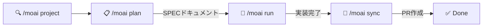
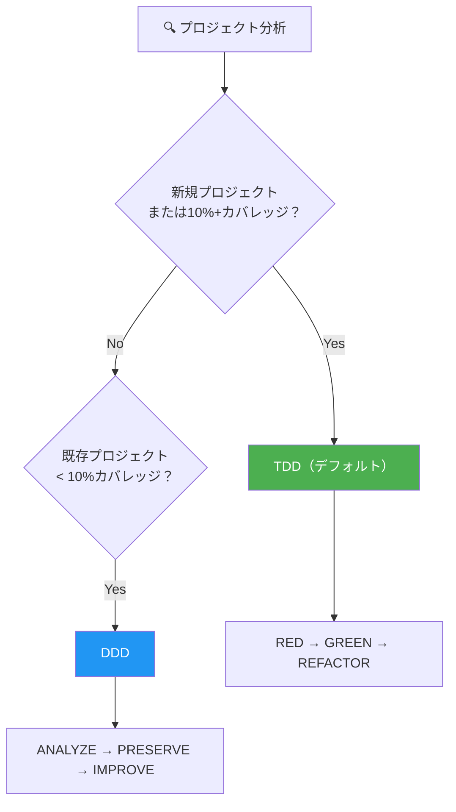
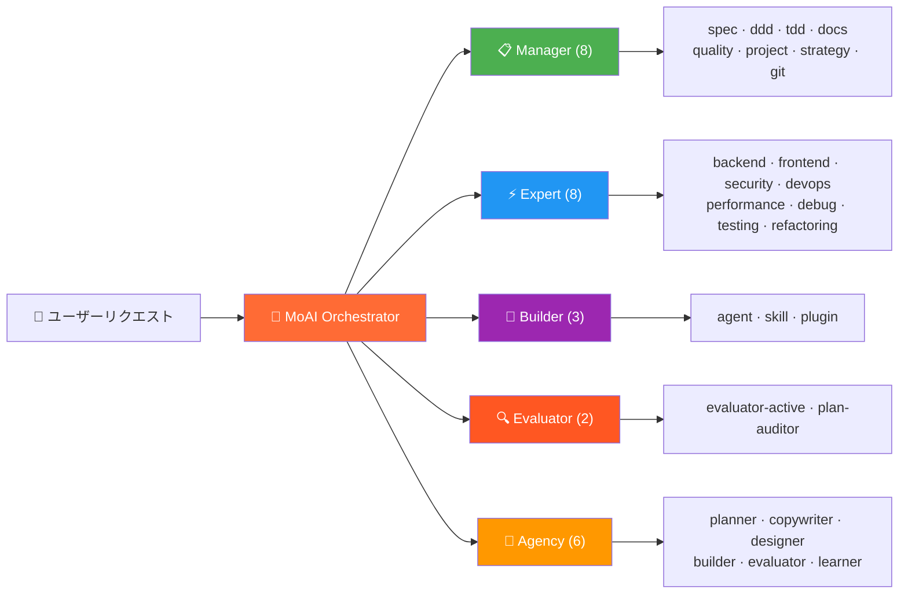
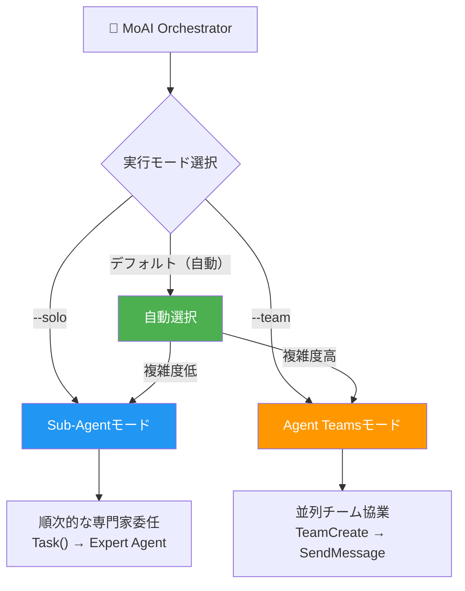
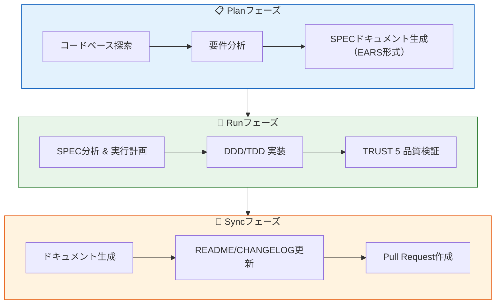
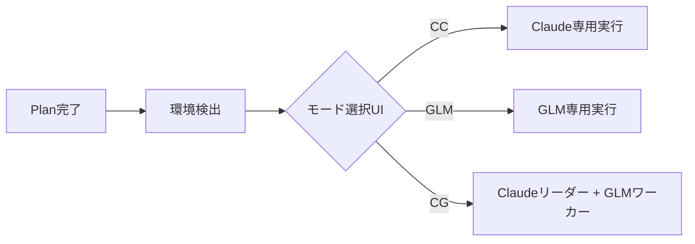
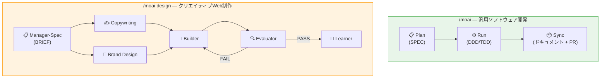
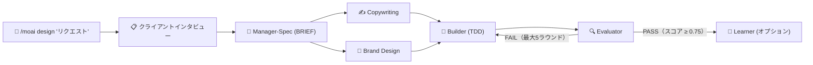

<p align="center">
  
</p>

<h1 align="center">MoAI-ADK</h1>

<p align="center">
  <strong>Claude Codeのための Agentic Development Kit</strong>
</p>

<p align="center">
  <a href="./README.md">English</a> ·
  <a href="./README.ko.md">한국어</a> ·
  <a href="./README.ja.md">日本語</a> ·
  <a href="./README.zh.md">中文</a>
</p>

<p align="center">
  <a href="https://github.com/modu-ai/moai-adk/actions/workflows/ci.yml"></a>
  <a href="https://github.com/modu-ai/moai-adk/actions/workflows/codeql.yml"></a>
  <a href="https://codecov.io/gh/modu-ai/moai-adk"></a>
  <br>
  <a href="https://go.dev/"></a>
  <a href="https://github.com/modu-ai/moai-adk/releases"></a>
  <a href="./LICENSE"></a>
</p>

<p align="center">
  <a href="https://adk.mo.ai.kr"><strong>公式ドキュメント</strong></a>
</p>

---

> 📚 **[公式ドキュメント](https://adk.mo.ai.kr)**

---

> **「バイブコーディングの目的は、素早い生産性ではなく、コード品質である。」**

MoAI-ADKは、Claude Codeのための**高性能AI開発環境**です。26の専門AIエージェントと47のスキルが連携し、品質の高いコードを生み出します。新規プロジェクトと機能開発にはTDD（デフォルト）を、テストカバレッジが低い既存プロジェクトにはDDDを自動的に適用し、Sub-AgentとAgent Teamsの二重実行モードをサポートします。

Goで書かれたシングルバイナリ -- 依存関係なしに、あらゆるプラットフォームで即座に実行できます。

---

## v2.12.0の新機能

MoAI-ADK v2.12.0は、デザインシステム、Claude Codeネイティブ統合、Opus 4.7サポートの主要なアップグレードを導入します。

### 主要なマイルストーン

| バージョン | ハイライト |
|----------|---------|
| **v2.9.0** | Claude Code v2.1.89-90 ネイティブスキル統合 (Opus 4.6) |
| **v2.10.x** | LSPスイート拡張、SPEC-CC297-001 `permissionMode`属性サポート、Opus 4.7プレビュー |
| **v2.11.x** | 自己学習システム統合、マルチソース文書読み込み、強化されたメモリ管理 |
| **v2.12.0** | **[SPEC-AGENCY-ABSORB-001]** /agency → /moai design統合、Opus 4.7完全サポート、Adaptive Thinkingネイティブ統合 |

### 主要な変更点

**デザインシステム統合 (SPEC-AGENCY-ABSORB-001)**

従来の `/agency` コマンドは `/moai design` に完全に統合されました。既存の `/agency/` プロジェクトは以下で自動マイグレーションできます:

```bash
moai migrate agency
```

メリット:
- デュアル `/moai` + `/agency` コマンドではなく、単一の統合デザインワークフロー
- MoAIコアとの改善された統合 (ブランドコンテキスト、品質ゲート、SPEC駆動ワークフロー)
- 強化されたドキュメント [adk.mo.ai.kr](https://adk.mo.ai.kr)

**Opus 4.7ネイティブサポート**

MoAI-ADKはClaude Opus 4.7をネイティブAdaptive Thinkingでサポートします:

- 推論の自動動的トークン割り当て (固定予算なし)
- 簡潔なプロンプト表現による高速推論
- 複雑なタスクでのより良いコスト効率

**自己学習とメモリ進化**

v2.11+の自己学習システムはエージェント学習と統合されます:

- エージェントが修正から自動的に教訓をキャプチャ
- メモリシステムがセッション間で永続化 (`.claude/agent-memory/`)
- ドキュメントがタスクコンテキストに基づいてジャストインタイムで読み込み

---

## なぜMoAI-ADKなのか？

PythonベースのMoAI-ADK（約73,000行）をGoで完全に書き直しました。

| 項目 | Python Edition | Go Edition |
|------|---------------|------------|
| デプロイ | pip + venv + 依存関係 | **シングルバイナリ**、依存関係なし |
| 起動時間 | ~800ms インタプリタ起動 | **~5ms** ネイティブ実行 |
| 並行処理 | asyncio / threading | **ネイティブgoroutines** |
| 型安全性 | ランタイム（mypy任意） | **コンパイル時に強制** |
| クロスプラットフォーム | Pythonランタイムが必要 | **ビルド済みバイナリ**（macOS, Linux, Windows） |
| フック実行 | Shellラッパー + Python | **コンパイル済みバイナリ**、JSONプロトコル |

### 主要な数値

- **38,700+行** Goコード、**38個**のパッケージ
- **85-100%** テストカバレッジ
- **26個** 専門AIエージェント + **47個** スキル
- **18個** プログラミング言語対応
- **27個** Claude Codeフックイベント

---

## ハーネスエンジニアリングアーキテクチャ

MoAI-ADKは**ハーネスエンジニアリング（Harness Engineering）**パラダイムを実装しています — コードを直接書く代わりに、AIエージェントのための環境を設計します。

| コンポーネント | 説明 | コマンド |
|--------------|------|---------|
| **自己検証ループ** | エージェントがコード作成→テスト→失敗→修正→合格サイクルを自律的に繰り返す | `/moai loop` |
| **コンテキストマップ** | コードベースのアーキテクチャマップとドキュメントをエージェントが常時参照可能 | `/moai codemaps` |
| **セッション永続化** | `progress.md`が完了フェーズを追跡し、中断した実行を自動的に再開 | `/moai run SPEC-XXX` |
| **失敗チェックリスト** | すべての受け入れ基準が実行開始時にpendingタスクとして登録され、実装完了時にcompletedに更新 | `/moai run SPEC-XXX` |
| **言語非依存** | 16言語対応：言語を自動検出し、適切なLSP/リンター/テスト/カバレッジツールを自動選択 | 全ワークフロー |
| **ガベージコレクション** | デッドコード、AIスロップ、未使用インポートの定期スキャンと除去 | `/moai clean` |
| **スキャフォールディング優先** | 実装前に空ファイルスタブを作成し、エントロピーを防止 | `/moai run SPEC-XXX` |

> 「人間が方向を定め（Steer）、エージェントが実行する（Execute）。」 — エンジニアの役割がコードを書くことから、ハーネスの設計（SPEC、品質ゲート、フィードバックループ）へと移行します。

---

## システム要件

| プラットフォーム | サポート環境 | 備考 |
|----------------|------------|------|
| macOS | Terminal, iTerm2 | 完全サポート |
| Linux | Bash, Zsh | 完全サポート |
| Windows | **WSL（推奨）**, PowerShell 7.x+ | ネイティブcmd.exeは非サポート |

**前提条件：**
- **Git**が全プラットフォームでインストールされている必要があります
- **Windowsユーザー**: [Git for Windows](https://gitforwindows.org/)が**必須**です（Git Bash含む）
  - **WSL**（Windows Subsystem for Linux）の使用を推奨します
  - PowerShell 7.x以上も対応しています
  - レガシーWindows PowerShell 5.xおよびcmd.exeは**非サポート**です

---

## クイックスタート

### 1. インストール

#### macOS / Linux / WSL

```bash
curl -fsSL https://raw.githubusercontent.com/modu-ai/moai-adk/main/install.sh | bash
```

#### Windows（PowerShell 7.x+）

> **推奨**: 最適な体験のため、WSLで上記のLinuxインストールコマンドを使用してください。

```powershell
irm https://raw.githubusercontent.com/modu-ai/moai-adk/main/install.ps1 | iex
```

> [Git for Windows](https://gitforwindows.org/)が先にインストールされている必要があります。

#### ソースからビルド（Go 1.26+）

```bash
git clone https://github.com/modu-ai/moai-adk.git
cd moai-adk && make build
```

> ビルド済みバイナリは[Releases](https://github.com/modu-ai/moai-adk/releases)ページからダウンロードできます。

### 2. Windows固有の問題

#### 韓国語ユーザー名パスエラー

Windowsのユーザー名に非ASCII文字（韓国語、中国語など）が含まれている場合、
Windows 8.3短縮ファイル名変換により `EINVAL` エラーが発生する可能性があります。

**回避策1:** 代替一時ディレクトリの設定：

```bash
# コマンドプロンプト
set MOAI_TEMP_DIR=C:\temp
mkdir C:\temp 2>nul

# PowerShell
$env:MOAI_TEMP_DIR="C:\temp"
New-Item -ItemType Directory -Path "C:\temp" -Force
```

**回避策2:** 8.3ファイル名生成を無効化（管理者権限が必要）：

```bash
fsutil 8dot3name set 1
```

**回避策3:** ASCIIのみのユーザー名で新しいWindowsユーザーアカウントを作成。

### 3. プロジェクトの初期化

```bash
moai init my-project
```

対話型ウィザードが言語、フレームワーク、方法論を自動検出し、Claude Code統合ファイルを生成します。

### 4. Claude Codeで開発を開始

```bash
# Claude Code 起動後
/moai project                            # プロジェクトドキュメント生成（product.md, structure.md, tech.md）
/moai plan "ユーザー認証機能を追加"       # SPECドキュメント生成
/moai run SPEC-AUTH-001                   # DDD/TDD 実装
/moai sync SPEC-AUTH-001                  # ドキュメント同期 & PR作成
/moai github issues                      # GitHub issue自動化 (Agent Teams)
/moai github pr 123                       # PR多角度レビュー (multi-perspective)
```


```mermaid
graph LR
    A["🔍 /moai project"] --> B["📋 /moai plan"]
    B -->|"SPECドキュメント"| C["🔨 /moai run"]
    C -->|"実装完了"| D["📄 /moai sync"]
    D -->|"PR作成"| E["✅ Done"]
```

---

## MoAI開発方法論

MoAI-ADKは、プロジェクトの状態に応じて最適な開発方法論を自動選択します。


```mermaid
flowchart TD
    A["🔍 プロジェクト分析"] --> B{"新規プロジェクト<br/>または10%+カバレッジ？"}
    B -->|"Yes"| C["TDD（デフォルト）"]
    B -->|"No"| D{"既存プロジェクト<br/>< 10%カバレッジ？"}
    D -->|"Yes"| E["DDD"]
    C --> F["RED → GREEN → REFACTOR"]
    E --> G["ANALYZE → PRESERVE → IMPROVE"]

    style C fill:#4CAF50,color:#fff
    style E fill:#2196F3,color:#fff
```

### TDD方法論（デフォルト）

新規プロジェクトおよび機能開発に推奨されるデフォルトの方法論です。テストを先に書きます。

| フェーズ | 説明 |
|---------|------|
| **RED** | 期待される振る舞いを定義する失敗テストを作成 |
| **GREEN** | テストを通過する最小限のコードを作成 |
| **REFACTOR** | テストを維持しながらコード品質を改善。REFACTOR完了後、`/simplify`が自動実行されます。 |

ブラウンフィールドプロジェクト（既存コードベース）では、**RED前の分析ステップ**が追加されます：テスト作成前に既存コードを読んで現在の振る舞いを把握します。

### DDD方法論（カバレッジ < 10%の既存プロジェクト）

テストカバレッジが最小限の既存プロジェクトで安全にリファクタリングするための方法論です。

```
ANALYZE   → 既存コードと依存関係の分析、ドメイン境界の特定
PRESERVE  → 特性テストの作成、現在の振る舞いのスナップショット取得
IMPROVE   → テストで保護された状態での段階的な改善。IMPROVE完了後、/simplifyが自動実行されます。
```

> 方法論は `moai init` 時に自動選択され（`--mode <ddd|tdd>`、デフォルト: tdd）、`.moai/config/sections/quality.yaml` の `development_mode` で変更できます。
>
> **注意**: MoAI-ADK v2.5.0+では、バイナリ方法論選択（TDDまたはDDDのみ）を使用しています。ハイブリッドモードは明確性と一貫性を保つために削除されました。

### 自動品質 & スケールアウトレイヤー

MoAI-ADK v2.6.0+は、MoAIが**自律的に**呼び出す2つのClaude Codeネイティブスキルを統合しています — フラグや手動コマンドは不要です。

| スキル | 役割 | トリガー |
|--------|------|---------|
| `/simplify` | 品質強化 | TDD REFACTORおよびDDD IMPROVEフェーズ完了後に**常時**実行 |
| `/batch` | スケールアウト実行 | タスクの複雑さが閾値を超えた時に自動トリガー |

**`/simplify` — 自動品質パス**

並列エージェントを使用して変更されたコードを再利用の機会、品質問題、効率性、CLAUDE.mdへの準拠の観点からレビューし、発見された問題を自動修正します。設定不要で、毎実装サイクル後にMoAIが直接呼び出します。

**`/batch` — 並列スケールアウト**

大規模な並列作業のために、隔離されたgit worktreeで数十のエージェントを起動します。各エージェントはテストを実行して結果を報告し、MoAIがそれらをマージします。ワークフロー別の自動トリガー条件:

| ワークフロー | トリガー条件 |
|------------|------------|
| `run` | タスク数 ≥ 5、または予測ファイル変更数 ≥ 10、または独立タスク数 ≥ 3 |
| `mx` | ソースファイル数 ≥ 50 |
| `coverage` | P1+P2カバレッジギャップ ≥ 10 |
| `clean` | 確認済みデッドコード項目 ≥ 20 |

---

## AIエージェントオーケストレーション

MoAIは**戦略的オーケストレーター**です。直接コードを書くのではなく、27の専門エージェントにタスクを委任します。


```mermaid
graph LR
    U["👤 ユーザーリクエスト"] --> M["🗿 MoAI Orchestrator"]

    M --> MG["📋 Manager (8)"]
    M --> EX["⚡ Expert (8)"]
    M --> BL["🔧 Builder (3)"]
    M --> EV["🔍 Evaluator (2)"]
    M --> AG["🎨 Agency (6)"]

    MG --> MG1["spec · ddd · tdd · docs<br/>quality · project · strategy · git"]
    EX --> EX1["backend · frontend · security · devops<br/>performance · debug · testing · refactoring"]
    BL --> BL1["agent · skill · plugin"]
    EV --> EV1["evaluator-active · plan-auditor"]
    AG --> AG1["planner · copywriter · designer<br/>builder · evaluator · learner"]

    style M fill:#FF6B35,color:#fff
    style MG fill:#4CAF50,color:#fff
    style EX fill:#2196F3,color:#fff
    style BL fill:#9C27B0,color:#fff
    style EV fill:#FF5722,color:#fff
    style AG fill:#FF9800,color:#fff
```

### エージェントカテゴリ

| カテゴリ | 数量 | エージェント | 役割 |
|----------|------|---------|------|
| **Manager** | 8 | spec, ddd, tdd, docs, quality, project, strategy, git | ワークフロー調整、SPEC作成、品質管理 |
| **Expert** | 8 | backend, frontend, security, devops, performance, debug, testing, refactoring | ドメイン専門の実装、分析、最適化 |
| **Builder** | 3 | agent, skill, plugin | 新しいMoAIコンポーネントの作成 |
| **Evaluator** | 2 | evaluator-active, plan-auditor | 独立的品質評価、計画段階文書監査 |
| **Agency** | 6 | planner, copywriter, designer, builder, evaluator, learner | クリエイティブプロダクションパイプライン |

### 47スキル（プログレッシブディスクロージャー）

トークン効率のため、3段階のプログレッシブディスクロージャーシステムで管理されています：

| カテゴリ | スキル数 | 例 |
|----------|---------|------|
| **Foundation** | 5 | core, claude, philosopher, quality, context |
| **Workflow** | 11 | spec, project, ddd, tdd, testing, worktree, thinking... |
| **Domain** | 5 | backend, frontend, database, uiux, data-formats |
| **Language** | 18 | Go, Python, TypeScript, Rust, Java, Kotlin, Swift, C++... |
| **Platform** | 9 | Vercel, Supabase, Firebase, Auth0, Clerk, Railway... |
| **Library** | 3 | shadcn, nextra, mermaid |
| **Tool** | 2 | ast-grep, svg |
| **Specialist** | 10 | Figma, Flutter, Electron, Pencil... |

---

## モデルポリシー（トークン最適化）

MoAI-ADKは、Claude Codeサブスクリプションプランに基づいて、26のエージェントに最適なAIモデルを割り当てます。プランのレート制限内で品質を最大化します。

| ポリシー | プラン | 🟣 Opus | 🔵 Sonnet | 🟡 Haiku | 用途 |
|----------|--------|------|--------|-------|------|
| **High** | Max $200/月 | 22 | 1 | 4 | 最高品質、最大スループット |
| **Medium** | Max $100/月 | 4 | 18 | 5 | 品質とコストのバランス |
| **Low** | Plus $20/月 | 0 | 11 | 16 | 経済的、Opusなし |

> **なぜ重要なのか？** Plus $20プランにはOpusが含まれていません。`Low`に設定すると、すべてのエージェントがSonnetとHaikuのみを使用し、レート制限エラーを防止します。上位プランでは、重要なエージェント（セキュリティ、戦略、アーキテクチャ）にOpusを、通常タスクにSonnet/Haikuを配分します。

### ティア別エージェントモデル配分

#### Manager Agents

| エージェント | High | Medium | Low |
|------------|------|--------|-----|
| manager-spec | 🟣 opus | 🟣 opus | 🔵 sonnet |
| manager-strategy | 🟣 opus | 🟣 opus | 🔵 sonnet |
| manager-ddd | 🟣 opus | 🔵 sonnet | 🔵 sonnet |
| manager-tdd | 🟣 opus | 🔵 sonnet | 🔵 sonnet |
| manager-project | 🟣 opus | 🔵 sonnet | 🟡 haiku |
| manager-docs | 🔵 sonnet | 🟡 haiku | 🟡 haiku |
| manager-quality | 🟡 haiku | 🟡 haiku | 🟡 haiku |
| manager-git | 🟡 haiku | 🟡 haiku | 🟡 haiku |

#### Expert Agents

| エージェント | High | Medium | Low |
|------------|------|--------|-----|
| expert-backend | 🟣 opus | 🔵 sonnet | 🔵 sonnet |
| expert-frontend | 🟣 opus | 🔵 sonnet | 🔵 sonnet |
| expert-security | 🟣 opus | 🟣 opus | 🔵 sonnet |
| expert-debug | 🟣 opus | 🔵 sonnet | 🔵 sonnet |
| expert-refactoring | 🟣 opus | 🔵 sonnet | 🔵 sonnet |
| expert-devops | 🟣 opus | 🔵 sonnet | 🟡 haiku |
| expert-performance | 🟣 opus | 🔵 sonnet | 🟡 haiku |
| expert-testing | 🟣 opus | 🔵 sonnet | 🟡 haiku |

#### Builder Agents

| エージェント | High | Medium | Low |
|------------|------|--------|-----|
| builder-agent | 🟣 opus | 🔵 sonnet | 🟡 haiku |
| builder-skill | 🟣 opus | 🔵 sonnet | 🟡 haiku |
| builder-plugin | 🟣 opus | 🔵 sonnet | 🟡 haiku |

#### Team Agents

| エージェント | High | Medium | Low |
|------------|------|--------|-----|
| team-reader | 🟡 haiku | 🟡 haiku | 🟡 haiku |
| team-coder | 🟣 opus | 🔵 sonnet | 🔵 sonnet |
| team-tester | 🟣 opus | 🔵 sonnet | 🟡 haiku |
| team-designer | 🟣 opus | 🔵 sonnet | 🟡 haiku |
| team-validator | 🟡 haiku | 🟡 haiku | 🟡 haiku |

### 設定方法

```bash
# プロジェクト初期化時
moai init my-project          # 対話型ウィザードでモデルポリシーを選択

# 既存プロジェクトの再設定
moai update                   # 対話型ウィザードで各設定ステップを案内
```

`moai update` 実行時に以下の質問が表示されます：
- **モデルポリシーをリセットしますか？** (y/n) - モデルポリシー設定ウィザードを再実行
- **GLM設定を更新しますか？** (y/n) - settings.local.jsonでGLM環境変数を設定

> デフォルトポリシーは `High` です。GLM設定は `settings.local.json` に分離され、Gitに追跡されません。

---

## 二重実行モード

MoAI-ADKは、Claude Codeがサポートする**Agent Teams**（デフォルト）と**Sub-Agent**の2つの実行モードを提供します。


```mermaid
graph TD
    A["🗿 MoAI Orchestrator"] --> B{"実行モード選択"}
    B -->|"--solo"| C["Sub-Agentモード"]
    B -->|"--team"| D["Agent Teamsモード"]
    B -->|"デフォルト（自動）"| E["自動選択"]

    C --> F["順次的な専門家委任<br/>Task() → Expert Agent"]
    D --> G["並列チーム協業<br/>TeamCreate → SendMessage"]
    E -->|"複雑度高"| D
    E -->|"複雑度低"| C

    style C fill:#2196F3,color:#fff
    style D fill:#FF9800,color:#fff
    style E fill:#4CAF50,color:#fff
```

### Agent Teamsモード（デフォルト）

MoAI-ADKはプロジェクトの複雑度を自動分析し、最適な実行モードを選択します：

| 条件 | 選択モード | 理由 |
|------|-----------|------|
| ドメイン3つ以上 | Agent Teams | マルチドメイン協調 |
| 影響ファイル10以上 | Agent Teams | 大規模変更 |
| 複雑度スコア7以上 | Agent Teams | 高複雑度 |
| その他 | Sub-Agent | シンプル、予測可能 |

**Agent Teamsモード**は並列チームベースの開発を使用します：

- 複数のエージェントが同時に作業し、共有タスクリストで協業
- `TeamCreate`、`SendMessage`、`TaskList` によるリアルタイム調整
- 大規模な機能開発やマルチドメインタスクに最適

```bash
/moai plan "大規模機能"          # 自動: researcher + analyst + architect 並列
/moai run SPEC-XXX               # 自動: backend-dev + frontend-dev + tester 並列
/moai run SPEC-XXX --team        # Agent Teamsモードを強制
```

**Agent Teams向け品質フック：**
- **TeammateIdle Hook**: チームメートがアイドル状態になる前にLSP品質ゲートを検証（エラー、型エラー、リントエラー）
- **TaskCompleted Hook**: タスクがSPEC-XXXパターンを参照する場合、SPECドキュメントの存在を検証
- すべての検証はグレースフルデグラデーション - 警告をログに記録しますが作業は続行します

### Sub-Agentモード（`--solo`）

Claude Codeの `Task()` APIを使用した順次的なエージェント委任方式です。

- 1つの専門エージェントにタスクを委任し、結果を受け取る
- 段階的にManager → Expert → Qualityの順に進行
- シンプルで予測可能なワークフローに最適

```bash
/moai run SPEC-AUTH-001 --solo    # Sub-Agentモードを強制
```

---

## MoAIワークフロー

### Plan → Run → Sync パイプライン

MoAIの中核ワークフローは3つのフェーズで構成されています：


```mermaid
graph TB
    subgraph Plan ["📋 Planフェーズ"]
        P1["コードベース探索"] --> P2["要件分析"]
        P2 --> P3["SPECドキュメント生成（EARS形式）"]
    end

    subgraph Run ["🔨 Runフェーズ"]
        R1["SPEC分析 & 実行計画"] --> R2["DDD/TDD 実装"]
        R2 --> R3["TRUST 5 品質検証"]
    end

    subgraph Sync ["📄 Syncフェーズ"]
        S1["ドキュメント生成"] --> S2["README/CHANGELOG更新"]
        S2 --> S3["Pull Request作成"]
    end

    Plan --> Run
    Run --> Sync

    style Plan fill:#E3F2FD,stroke:#1565C0
    style Run fill:#E8F5E9,stroke:#2E7D32
    style Sync fill:#FFF3E0,stroke:#E65100
```

#### 実行モード選択ゲート

PlanフェーズからRunフェーズへの移行時、MoAIは現在の実行環境（cc/glm/cg）を自動検出し、実装開始前にユーザーがモードを確認または変更できる選択UIを表示します。


```mermaid
graph LR
    A["Plan完了"] --> B["環境検出"]
    B --> C{"モード選択UI"}
    C -->|"CC"| D["Claude専用実行"]
    C -->|"GLM"| E["GLM専用実行"]
    C -->|"CG"| F["Claudeリーダー + GLMワーカー"]
```

このゲートにより、環境の状態に関係なく正しい実行モードが使用され、実装中のモード不一致を防止します。

### /moai サブコマンド

すべてのサブコマンドはClaude Code内で `/moai <subcommand>` として呼び出されます。

#### コアワークフロー

| サブコマンド | エイリアス | 目的 | 主要フラグ |
|------------|---------|------|----------|
| `plan` | `spec` | SPECドキュメント作成（EARS形式） | `--worktree`, `--branch`, `--resume SPEC-XXX`, `--team` |
| `run` | `impl` | SPECのDDD/TDD実装 | `--resume SPEC-XXX`, `--team` |
| `sync` | `docs`, `pr` | ドキュメント同期、コードマップ、PR作成 | `--merge`, `--skip-mx` |

#### 品質とテスト

| サブコマンド | エイリアス | 目的 | 主要フラグ |
|------------|---------|------|----------|
| `fix` | — | LSPエラー、リンティング、型エラーの自動修正（シングルパス） | `--dry`, `--seq`, `--level N`, `--resume`, `--team` |
| `loop` | — | 反復自動修正（最大100回まで完了） | `--max N`, `--auto-fix`, `--seq` |
| `review` | `code-review` | セキュリティと@MXタグコンプライアンス確認を含むコードレビュー | `--staged`, `--branch`, `--security` |
| `coverage` | `test-coverage` | テストカバレッジ分析とギャップ埋め（16言語対応） | `--target N`, `--file PATH`, `--report` |
| `e2e` | — | E2Eテスト（Claude-in-Chrome、Playwright CLI、またはAgent Browser） | `--record`, `--url URL`, `--journey NAME` |
| `clean` | `refactor-clean` | デッドコード識別と安全な削除 | `--dry`, `--safe-only`, `--file PATH` |

#### ドキュメントとコードベース

| サブコマンド | エイリアス | 目的 | 主要フラグ |
|------------|---------|------|----------|
| `project` | `init` | プロジェクトドキュメント生成（product.md, structure.md, tech.md, .moai/project/codemaps/） | — |
| `mx` | — | コードベース走査と@MXコード注釈追加 | `--all`, `--dry`, `--priority P1-P4`, `--force`, `--team` |
| `codemaps` | `update-codemaps` | `.moai/project/codemaps/` にアーキテクチャドキュメント生成 | `--force`, `--area AREA` |
| `feedback` | `fb`, `bug`, `issue` | ユーザーフィードバック収集とGitHub Issue作成 | — |

#### デフォルトワークフロー

| サブコマンド | 目的 | 主要フラグ |
|------------|------|----------|
| *(なし)* | 完全自律的な plan → run → sync パイプライン。複雑度スコア >= 5 の場合、SPECを自動生成 | `--loop`, `--max N`, `--branch`, `--pr`, `--resume SPEC-XXX`, `--team`, `--solo` |

### 実行モードフラグ

ワークフロー実行中のエージェント送信方法を制御します：

| フラグ | モード | 説明 |
|-------|--------|------|
| `--team` | Agent Teams | 並列チームベースの実行。複数のエージェントが同時に作業 |
| `--solo` | Sub-Agent | 段階ごとの順次シングルエージェント委任 |
| *(デフォルト)* | 自動 | 複雑度に基づいてシステムが自動選択（ドメイン >= 3、ファイル >= 10、スコア >= 7） |

**`--team` は3つの実行環境をサポートしています：**

| 環境 | コマンド | リーダー | ワーカー | 用途 |
|------|---------|---------|---------|------|
| Claude-only | `moai cc` | Claude | Claude | 最高品質 |
| GLM-only | `moai glm` | GLM | GLM | 最大コスト削減 |
| CG (Claude+GLM) | `moai cg` | Claude | GLM | 品質とコストのバランス |

> **v2.7.1 新機能**: CGモードが**デフォルト**のチームモードになりました。`--team` を使用する場合、`moai cc` または `moai glm` で明示的に変更しない限り、CGモードで実行されます。

> **注意**: `moai cg` はtmuxペーンレベルの環境隔離を使用してClaudeリーダーとGLMワーカーを分離します。`moai glm` から切り替える場合、`moai cg` は自動的にGLM設定を最初にリセットします -- `moai cc` を実行する必要はありません。

### 自律開発ループ（Ralph Engine）

LSP診断とAST-grepを組み合わせた自律的なエラー修正エンジンです：

```bash
/moai fix       # シングルパス：スキャン → 分類 → 修正 → 検証
/moai loop      # 反復修正：完了マーカー検出まで繰り返し（最大100回）
```

**Ralph Engineの動作：**
1. **並列スキャン**: LSP診断 + AST-grep + リンターを同時実行
2. **自動分類**: エラーをLevel 1（自動修正）～ Level 4（ユーザー介入）に分類
3. **収束検知**: 同一エラーの繰り返し時に代替戦略を適用
4. **完了条件**: 0エラー、0型エラー、85%以上のカバレッジ

### 推奨ワークフローチェーン

**新機能開発：**
```
/moai plan → /moai run SPEC-XXX → /moai review → /moai coverage → /moai sync SPEC-XXX
```

**バグ修正：**
```
/moai fix (または /moai loop) → /moai review → /moai sync
```

**リファクタリング：**
```
/moai plan → /moai clean → /moai run SPEC-XXX → /moai review → /moai coverage → /moai codemaps
```

**ドキュメント更新：**
```
/moai codemaps → /moai sync
```

---

## TRUST 5 品質フレームワーク

すべてのコード変更は、5つの品質基準で検証されます：

| 基準 | 説明 | 検証項目 |
|------|------|-----------|
| **T**ested | テスト済み | 85%以上のカバレッジ、特性テスト、ユニットテスト合格 |
| **R**eadable | 可読性が高い | 明確な命名規則、一貫したコードスタイル、リントエラー0 |
| **U**nified | 統一されている | 一貫したフォーマット、インポート順序、プロジェクト構造の遵守 |
| **S**ecured | 安全である | OWASP準拠、入力検証、セキュリティ警告0 |
| **T**rackable | 追跡可能 | コンベンショナルコミット、Issue参照、構造化ログ |

---

## タスクメトリクスロギング

MoAI-ADKは開発セッション中のTaskツールメトリクスを自動的にキャプチャします：

- **ロケーション**: `.moai/logs/task-metrics.jsonl`
- **キャプチャメトリクス**: トークン使用量、ツール呼び出し、実行時間、エージェント型
- **目的**: セッション分析、パフォーマンス最適化、コスト追跡

メトリクスはTaskツール完了時にPostToolUseフックによってログに記録されます。このデータを使用してエージェントの効率を分析し、トークン消費を最適化します。

---

## CLIコマンド

| コマンド | 説明 |
|--------|------|
| `moai init` | 対話型プロジェクト設定（言語/フレームワーク/方法論の自動検出） |
| `moai doctor` | システム状態の診断と環境検証 |
| `moai status` | Gitブランチ、品質メトリクスなどのプロジェクト状態概要 |
| `moai update` | 最新バージョンへのアップデート（自動ロールバック対応） |
| `moai update --check` | インストールなしでアップデートを確認 |
| `moai update --project` | プロジェクトテンプレートのみ同期 |
| `moai worktree new <name>` | 新しいGit worktreeを作成（並列ブランチ開発） |
| `moai worktree list` | アクティブなworktree一覧 |
| `moai worktree switch <name>` | worktreeの切り替え |
| `moai worktree sync` | アップストリームと同期 |
| `moai worktree remove <name>` | worktreeの削除 |
| `moai worktree clean` | 古いworktreeのクリーンアップ |
| `moai worktree go <name>` | 現在のシェルでworktreeディレクトリに移動 |
| `moai hook <event>` | Claude Codeフックディスパッチャー |
| `moai glm` | GLM 5 APIでClaude Codeを起動（コスト効率的な代替案） |
| `moai cc` | GLM設定なしでClaude Codeを起動（Claude専用モード） |
| `moai cg` | CG モードを起動 — Claudeリーダー + GLMチームメート（Claude Code自動起動、tmux必須） |
| `moai version` | バージョン、コミットハッシュ、ビルド日時の情報 |

---

## CG モード（Claude + GLM ハイブリッド）

CG モードは、リーダーが **Claude API**、ワーカーが **GLM API** を使用するハイブリッドモードです。tmux セッションレベルの環境変数によるペーン隔離で実現されます。

### 仕組み

```
moai cg 実行
    │
    ├── 1. tmux セッション環境変数に GLM 設定を注入
    │      (ANTHROPIC_AUTH_TOKEN, BASE_URL, MODEL_* 変数)
    │
    ├── 2. settings.local.json から GLM 環境変数を削除
    │      → リーダーペーンは Claude API を使用
    │
    ├── 3. CLAUDE_CODE_TEAMMATE_DISPLAY=tmux を設定
    │      → ワーカーは新しいペーンで GLM 環境変数を継承
    │
    └── 4. Claude Code を起動（現在のプロセスを置換）

┌─────────────────────────────────────────────────────────────┐
│  LEADER（現在の tmux ペーン、Claude API）                    │
│  - /moai --team 実行時にワークフローを調整                    │
│  - plan、quality、sync フェーズを処理                        │
│  - GLM 環境変数なし → Claude API を使用                      │
└──────────────────────┬──────────────────────────────────────┘
                       │ Agent Teams（新しい tmux ペーン）
                       ▼
┌─────────────────────────────────────────────────────────────┐
│  TEAMMATES（新しい tmux ペーン、GLM API）                    │
│  - tmux セッション環境変数を継承 → GLM API を使用             │
│  - run フェーズの実装タスクを実行                            │
│  - SendMessage でリーダーと通信                             │
└─────────────────────────────────────────────────────────────┘
```

### 使い方

```bash
# 1. GLM API キーを保存（初回のみ）
moai glm sk-your-glm-api-key

# 2. tmux 環境を確認（既に tmux 使用中はスキップ）
# 新しい tmux セッションが必要な場合:
tmux new -s moai

# TIP: VS Code ターミナルのデフォルトを tmux に設定すると、
# 自動的に tmux 環境で起動され、この手順をスキップできます。

# 3. CG モードを起動（Claude Code を自動的に起動）
moai cg

# 4. チームワークフローを実行
/moai --team "タスクの説明"
```

### 注意事項

| 項目 | 説明 |
|------|------|
| **tmux 環境** | 既に tmux を使用中のターミナルでは新しいセッション作成は不要。VS Code ターミナルのデフォルトを tmux に設定すると便利。 |
| **自動起動** | `moai cg` は現在のペーンで Claude Code を自動的に起動します。`claude` を別途実行する必要はありません。 |
| **セッション終了時** | session_end フックが tmux セッション環境変数を自動削除 → 次セッションは Claude に復帰 |
| **Agent Teams 通信** | SendMessage ツールでリーダー↔ワーカー間の通信が可能 |

### モード比較

| コマンド | リーダー | ワーカー | tmux 必要 | コスト削減 | 使用シナリオ |
|----------|----------|----------|-----------|------------|--------------|
| `moai cc` | Claude | Claude | 不要 | - | 複雑な作業、最高品質 |
| `moai glm` | GLM | GLM | 推奨 | ~70% | コスト最適化 |
| `moai cg` | Claude | GLM | **必須** | **~60%** | 品質とコストのバランス |

### 表示モード

Agent Teams は 2 つの表示モードをサポート:

| モード | 説明 | 通信 | リーダー/ワーカー分離 |
|--------|------|------|----------------------|
| `in-process` | デフォルトモード、すべてのターミナル | ✅ SendMessage | ❌ 同じ環境変数 |
| `tmux` | 分割ペイン表示 | ✅ SendMessage | ✅ セッション環境変数分離 |

**CG モードは `tmux` 表示モードでのみリーダー/ワーカー API 分離が可能です。**

---

## Claude x GLM マルチLLM

MoAI-ADKは、**z.ai GLM** をClaude Codeの代替AIバックエンドとしてサポートし、マルチLLM開発ワークフローを実現します。

| 項目 | 内容 |
|------|------|
| GLM Coding Plan | **$10/月**から（[z.ai](https://z.ai/subscribe?ic=1NDV03BGWU)） |
| 互換性 | コード変更なしでClaude Codeとそのまま利用可能 |
| モデル | GLM-5、GLM-4.7、GLM-4.5-Air、および無料モデル |

**デフォルトモデルマッピング：**

| Claude ティア | GLM モデル | 入力（100万トークンあたり） | 出力（100万トークンあたり） |
|--------------|-----------|--------------------------|--------------------------|
| Opus | GLM-4.7 | $0.60 | $2.20 |
| Sonnet | GLM-4.7 | $0.60 | $2.20 |
| Haiku | GLM-4.5-Air | $0.20 | $1.10 |

> 無料モデルも利用可能：GLM-4.7-Flash、GLM-4.5-Flash。詳細は [z.ai Pricing](https://docs.z.ai/guides/overview/pricing) を参照。

**[GLM Coding Planに登録する](https://z.ai/subscribe?ic=1NDV03BGWU)**

---

## @MX Tag System

MoAI-ADKは**@MXコード注釈システム**を使用して、AIエージェント間のコンテキスト、不変量、危険ゾーンを伝達します。

### @MXタグとは？

@MXタグはインラインコード注釈で、AIエージェントがコードベースをより速く、より正確に理解するのに役立ちます。

```go
// @MX:ANCHOR: [AUTO] Hook registry dispatch - 5+ callers
// @MX:REASON: [AUTO] Central entry point for all hook events, changes have wide impact
func DispatchHook(event string, data []byte) error {
    // ...
}

// @MX:WARN: [AUTO] Goroutine executes without context.Context
// @MX:REASON: [AUTO] Cannot cancel goroutine, potential resource leak
func processAsync() {
    go func() {
        // ...
    }()
}
```

### タグ型

| タグ型 | 目的 | 説明 |
|--------|------|------|
| `@MX:ANCHOR` | 重要な契約 | fan_in >= 3 の関数、変更による広範な影響 |
| `@MX:WARN` | 危険ゾーン | Goroutines、複雑度 >= 15、グローバル状態変更 |
| `@MX:NOTE` | コンテキスト | マジック定数、godoc不足、ビジネスルール |
| `@MX:TODO` | 未完了作業 | テストなし、未実装機能 |

### なぜすべてのコードに@MXタグがないのか？

@MXタグシステムは**すべてのコードにタグを追加するためではなく設計されていません。** 中核原則は**「AIが最初に気付く必要がある最も危険/重要なコードのみをマークする」**ことです。

| 優先度 | 条件 | タグ型 |
|--------|------|--------|
| **P1（致命的）** | fan_in >= 3 | `@MX:ANCHOR` |
| **P2（危険）** | goroutine、複雑度 >= 15 | `@MX:WARN` |
| **P3（コンテキスト）** | マジック定数、godocなし | `@MX:NOTE` |
| **P4（欠落）** | テストファイルなし | `@MX:TODO` |

**ほとんどのコードはいずれの条件も満たさないため、タグはありません。** これは**正常です**。

### 例：タグ判定

```go
// ❌ タグなし（fan_in = 1、低複雑度）
func calculateTotal(items []Item) int {
    total := 0
    for _, item := range items {
        total += item.Price
    }
    return total
}

// ✅ @MX:ANCHOR 追加（fan_in = 5）
// @MX:ANCHOR: [AUTO] Config manager load - 5+ callers
// @MX:REASON: [AUTO] Entry point for all CLI commands
func LoadConfig() (*Config, error) {
    // ...
}
```

### 設定（`.moai/config/sections/mx.yaml`）

```yaml
thresholds:
  fan_in_anchor: 3        # < 3 callers = no ANCHOR
  complexity_warn: 15     # < 15 complexity = no WARN
  branch_warn: 8          # < 8 branches = no WARN

limits:
  anchor_per_file: 3      # Max 3 ANCHOR tags per file
  warn_per_file: 5        # Max 5 WARN tags per file

exclude:
  - "**/*_generated.go"   # Exclude generated files
  - "**/vendor/**"        # Exclude external libraries
  - "**/mock_*.go"        # Exclude mock files
```

### MX Tag スキャン実行

```bash
# コードベース全体をスキャン（Goプロジェクト）
/moai mx --all

# プレビューのみ（ファイル修正なし）
/moai mx --dry

# 優先度でスキャン（P1のみ）
/moai mx --priority P1

# 特定の言語のみスキャン
/moai mx --all --lang go,python
```

### 他のプロジェクトも@MXタグが少ない理由

| 状況 | 理由 |
|-----|------|
| **新規プロジェクト** | ほとんどの関数 fan_in = 0 → タグなし（正常） |
| **小規模プロジェクト** | 関数少数 = シンプルなコールグラフ = タグ少数 |
| **高品質コード** | 低複雑度、goroutineなし → WARNタグなし |
| **高い閾値** | `fan_in_anchor: 5` = さらに少ないタグ |

### 中核原則

@MXタグシステムは**「シグナルとノイズの比率」**を最適化します：

- ✅ **本当に重要なコードのみをマーク** → AIが中核領域を素早く識別
- ❌ **すべてのコードにタグ付け** → ノイズが増加、重要なタグが見つけにくくなる

---

## Design System: Hybrid Web & App Production (v3.2, SPEC-AGENCY-ABSORB-001)

> 作りたいものを説明するだけ。Design Systemがインタビュー、デザイン、ビルド、テスト、学習を自律的に行います。

MoAI-ADKは統合された **Design System** を含みます — Webサイトやアプリを自律的に制作する専用ハーネスです。`/moai "説明"`が開発ワークフロー全体を実行するように、`/moai design "説明"`はブリーフからデプロイ用コードまでの完全なクリエイティブプロダクションパイプラインを実行します。

### デザインシステムとは？ — /moai vs /moai design の比較


```mermaid
flowchart TB
    subgraph MOAI["/moai — 汎用ソフトウェア開発"]
        direction LR
        M1["📋 Plan<br>(SPEC)"] --> M2["⚙️ Run<br>(DDD/TDD)"] --> M3["📦 Sync<br>(ドキュメント + PR)"]
    end

    subgraph DESIGN["/moai design — クリエイティブWeb制作"]
        direction LR
        D1["📋 Manager-Spec<br>(BRIEF)"] --> D2["✍️ Copywriting"]
        D1 --> D3["🎨 Brand Design"]
        D2 --> D4["🔨 Builder"]
        D3 --> D4
        D4 --> D5["🔍 Evaluator"]
        D5 -->|"FAIL"| D4
        D5 -->|"PASS"| D6["🧠 Learner"]
    end

    style MOAI fill:#e8f5e9,stroke:#4caf50
    style DESIGN fill:#fff3e0,stroke:#ff9800
```

| 側面 | `/moai` | `/moai design` |
|------|---------|-----------|
| **目的** | あらゆるソフトウェア (バックエンド、CLI、ライブラリ、API) | Webサイト、ランディングページ、Webアプリ |
| **入力** | 機能説明 → SPEC | ビジネスゴール → BRIEF |
| **ユニークフェーズ** | DDD/TDD実装サイクル | コピーライティング + デザインシステム → コード |
| **品質** | manager-quality 1回パス | **GAN Loop** (Builder↔Evaluator、最大5ラウンド) |
| **自己学習** | なし | **Learner**がパターン検出 → スキル進化を提案 |
| **ブランド** | なし | ブランドコンテキストが憲法的制約 |
| **実装** | 20エージェント (manager/expert/builder) | 4スキル (copywriting、brand-design、design-import、gan-loop) + evaluator-active |

**どちらを使うべき？**
- REST API、CLIツール、ライブラリを構築する？ → `/moai`
- マーケティングWebサイト、SaaS ランディングページ、デザイン付きWebアプリを構築する？ → `/moai design`
- コピー、デザイントークン、コードを分離したアーティファクトとして必要？ → `/moai design`

### クイックスタート：1コマンドでフルパイプライン

```bash
/moai design "AI開発者ツールスタートアップ向けSaaSランディングページ"
```

この1行で**完全な自律ワークフロー**が開始されます：

1. **クライアントインタビュー** — Manager-specがビジネス、ブランド、技術に関する9つの構造化質問を実施（設定済みならスキップ）
2. **BRIEF生成** — Manager-specがリクエストを包括的プロジェクトブリーフに展開
3. **コピー＋デザイン** — moai-domain-copywritingがブランド準拠のマーケティングコピーを作成、moai-domain-brand-designがトークンベースのデザインシステムを生成（Path B）。代替案Path A：moai-workflow-design-importがClaude Designハンドオフバンドルをパース
4. **コード実装** — expert-frontendがTDDでプロダクションコードを実装（デフォルト：Next.js + Tailwind）
5. **品質保証** — evaluator-activeがPlaywrightテスト、Lighthouse監査、4次元スコアリングを実行
6. **GAN Loop** — 品質未達ならexpert-frontendとevaluator-activeがmoai-workflow-gan-loop経由で反復（最大5ラウンド）
7. **自己学習** — (オプション) Learnerがパターンを検出しスキル改善を提案

**所要時間**：完全なランディングページで15〜45分、完全自律。

### パイプラインアーキテクチャ


```mermaid
flowchart LR
    REQ["🎯 /moai design 'リクエスト'"] --> INT["📋 クライアントインタビュー"]
    INT --> P["📝 Manager-Spec (BRIEF)"]
    P --> C["✍️ Copywriting"]
    P --> D["🎨 Brand Design"]
    C --> B["🔨 Builder (TDD)"]
    D --> B
    B --> E["🔍 Evaluator"]
    E -->|"FAIL（最大5ラウンド）"| B
    E -->|"PASS（スコア ≥ 0.75）"| L["🧠 Learner (オプション)"]
```

### 各スキルの役割

| スキル | 機能 |
|--------|------|
| **manager-spec** | クライアントインタビュー実施、構造化BRIEF文書生成 |
| **moai-domain-copywriting** | 構造化JSONでマーケティングコピー作成 — ヘッドライン、本文、CTA — ブランドボイスルール適用 |
| **moai-domain-brand-design** | 完全なデザインシステム生成 — カラートークン、タイポグラフィスケール、スペーシング、コンポーネント仕様 (Path B) |
| **moai-workflow-design-import** | Claude Designハンドオフバンドル(ZIP/HTML)パースでデザイントークンとコンポーネント抽出 (Path A) |
| **expert-frontend** | TDD（RED-GREEN-REFACTOR）でプロダクションコード実装。デフォルト：Next.js、TypeScript、Tailwind、shadcn/ui |
| **evaluator-active** | Playwrightビジュアルテスト＋Lighthouse監査。4次元スコアリング：デザイン品質(30%)、オリジナリティ(25%)、完成度(25%)、機能性(20%) |
| **moai-workflow-gan-loop** | GAN Loop反復管理：Builder-Evaluator間でSprint Contract協商、実装、スコアリング、停滞検知 |
### GAN Loop：敵対的品質保証

evaluator-activeは**デフォルトで懐疑的** — 欠陥を見つけるよう調整されています。

**自動不合格トリガー**（スコア無関係）：
- コピーテキストがmoai-domain-copywriting出力と不一致
- AIデザインクリシェ検出（紫グラデーション＋白カード＋汎用アイコン）
- モバイルビューポート崩壊
- リンク404エラー
- Lighthouseアクセシビリティ < 80

**反復フロー**：evaluator-activeがfile:line参照付き具体的フィードバック提供 → Builder修正 → 再評価。3回失敗後ユーザーにエスカレーション。

### ブランドコンテキスト：クリエイティブ憲法

初回実行時、Design Systemが**構造化クライアントインタビュー**（4フェーズ9質問）を実施：

| フェーズ | 質問 | 保存先 |
|---------|------|--------|
| ビジネスコンテキスト | 目標、ターゲット顧客、成功KPI | `.moai/project/brand/target-audience.md` |
| ブランドアイデンティティ | ボイス形容詞、参考サイト、デザイン志向 | `.moai/project/brand/brand-voice.md`、`visual-identity.md` |
| 技術スコープ | 必要ページ、技術要件 | `.moai/project/tech.md` |
| 品質期待 | 優先事項 | `.moai/config/sections/design.yaml` |

ブランドコンテキストは**全スキル**に不変制約として伝達されます。evaluator-activeはブランド一貫性を必須合格基準として評価。5プロジェクト以上完了後、インタビューは主要3質問に短縮。

### 自己進化とセーフティ

全スキルは**静的＋動的ゾーン**構造：
- **静的ゾーン**：コア原則（自動変更不可）
- **動的ゾーン**：ルール、ヒューリスティック、アンチパターン（Learner経由で進化）

**知識卒業**：observation（1回）→ heuristic（3回）→ rule（5回、信頼度 ≥ 0.80）→ graduated（ユーザー承認後適用）

**5層セーフティアーキテクチャ**：
1. **Frozen Guard** — アイデンティティ、安全ガードレール、倫理的境界の変更をブロック
2. **Canary Check** — 直近3プロジェクトでシャドウ評価、スコア低下 > 0.10で拒否
3. **Contradiction Detector** — 既存ルールと矛盾するルールをフラグ
4. **Rate Limiter** — 週最大3回進化、24時間クールダウン、最大50アクティブ学習
5. **Human Oversight** — before/after diffと根拠提示、ユーザー承認必須

### コマンド

```bash
# 自律ワークフロー（推奨）
/moai design "AIスタートアップ向けSaaSランディングページ"  # フルパイプライン：インタビュー → ビルド → テスト → 学習

# ステップバイステップ
/moai design brief "開発者ツールランディングページ"        # インタビュー＋BRIEFのみ（ビルド前レビュー）
/moai design build BRIEF-001                             # 既存BRIEFからフルパイプライン実行
/moai design import /path/to/design.zip                  # Claude Design ハンドオフバンドル import (Path A)

# レガシー Agency コマンド（deprecated、/moai design にリダイレクト）
/agency "..."                                                # /moai design にリダイレクト + 廃止予定警告
/agency brief "..."                                          # サポート終了; /moai design brief を使用
```

### デフォルト技術スタック（設定可能）

| レイヤー | デフォルト | 設定ファイル |
|---------|-----------|-------------|
| フレームワーク | Next.js + App Router | `.moai/project/tech.md` |
| 言語 | TypeScript（strict） | `.moai/project/tech.md` |
| スタイリング | Tailwind CSS v4 | `.moai/project/tech.md` |
| コンポーネント | shadcn/ui | `.moai/project/tech.md` |
| テスティング | Vitest + Playwright | `.moai/config/sections/design.yaml` |
| ホスティング | Vercel | `.moai/project/tech.md` |

### /agency からの移行

`/agency` を使用中の既存プロジェクトは、以下のコマンドで `/moai design` に移行できます：

```bash
moai migrate agency
```

このコマンドは `.agency/` データを `.moai/project/brand/` と `.moai/config/sections/design.yaml` に安全に移動します。 元のデータは復旧用に `.agency.archived/` に保持されます。

> [Design System ドキュメント](https://adk.mo.ai.kr)

---

## データベースワークフロー: /moai db

MoAI プロジェクトのデータベースメタデータ管理システムです。4つのサブコマンド(init、refresh、verify、list)を使用してスキーマドキュメント、マイグレーション、ERDダイアグラム、シードデータを管理します。

### クイックスタート

```bash
# データベースメタデータを初期化（対話形式インタビュー）
/moai db init

# マイグレーションを再スキャンしてスキーマドキュメントを更新
/moai db refresh

# schema.md とマイグレーションファイル間の差異を確認
/moai db verify

# schema.md のすべてのテーブルを表示
/moai db list
```

### サブコマンド

| コマンド | 目的 | 使用時期 |
|---------|------|---------|
| **init** | データベースエンジン、ORM、マルチテナント戦略、マイグレーションツールの対話形式設定。`.moai/project/db/` に7ファイルテンプレートセットをスカフォルディング | 新規プロジェクト初期化、データベース作業前 |
| **refresh** | マイグレーションファイルをスキャンして、現在のマイグレーション状態から `schema.md`、`erd.mmd`(Mermaid ERD)、`migrations.md` を再生成 | マイグレーション追加/修正後、マイルストーン同期時 |
| **verify** | 読み取り専用ドリフト検出: `schema.md` テーブルセットと実際のマイグレーションファイルを比較、ドリフト検出時に 0 以外で終了 | PR提出前、CI/CDパイプラインで |
| **list** | 読み取り専用テーブルリスト: `schema.md` のすべてのテーブルを整列Markdownテーブル形式で表示 | プロジェクト概要確認、ドキュメント確認 |

### ディレクトリ構造

`/moai db init` は `.moai/project/db/` に以下の構造を作成します:

```
.moai/project/db/
├── README.md              # データベース概要とセットアップ手順
├── schema.md              # テーブルスキーマドキュメント（自動生成）
├── erd.mmd                # Mermaid形式のEntity-Relationship Diagram
├── migrations.md          # マイグレーション履歴と順序
├── rls-policies.md        # 行レベルセキュリティポリシー（PostgreSQL）
├── queries.md             # 重要なクエリとパフォーマンスノート
└── seed-data.md           # サンプルデータとシーディング手順
```

### サポートするデータベース技術

6つのマイグレーションファイルパターンを自動検出・サポート:

| マイグレーションタイプ | ファイルパターン | 例 |
|------|---------|------|
| **Prisma** | `prisma/migrations/*/migration.sql` | `20260401120000_add_users_table/migration.sql` |
| **Alembic** | `alembic/versions/*.py` | `a1b2c3d4e5f6_add_users_table.py` |
| **Rails** | `db/migrate/*.rb` | `20260401120000_add_users_table.rb` |
| **Raw SQL** | `db/migrations/*.sql` | `001_add_users_table.sql` |
| **Supabase** | `supabase/migrations/*.sql` | `20260401120000_initial_schema.sql` |
| **汎用** | `migrations/*.sql` または `db/*.sql` | カスタムパターン対応 |

16のプログラミング言語エコシステム(Go、Python、TypeScript、Javaなど)を一般的なパッケージパスでサポート。

### 統合

- **PostToolUse Hook**: マイグレーションファイル編集時に `schema.md`、`erd.mmd`、`migrations.md` を自動更新
- **ドリフト検出**: スキーマドキュメントが実際のマイグレーションと同期状態を保つ
- **Mermaidダイアグラム**: ドキュメント・設計レビュー用にERDダイアグラムを自動生成
- **Phase 4.1a DB検出**: `/moai project` が検出されたデータベース技術に基づいて `/moai db` 推奨事項を自動表示

### 設定

データベース設定は `.moai/config/sections/db.yaml` に保存されます:

```yaml
db:
  enabled: true
  dir: ".moai/project/db"
  auto_sync: true
  migration_patterns:
    - "prisma/migrations/*/migration.sql"
    - "alembic/versions/*.py"
    - "db/migrate/*.rb"
  engine: ""  # init インタビュー中に入力
  orm: ""     # init インタビュー中に入力
  multi_tenant: false
  migration_tool: ""
```

### ワークフロー例

1. **新規プロジェクト**: `/moai db init` を実行し、データベースセットアップについて4つの質問に回答
2. **開発中**: 通常通りマイグレーションを作成; `/moai db` は自動的にドキュメントを同期
3. **PR前**: `/moai db verify` を実行してスキーマドリフトを確認
4. **レビュー**: PR内で `.moai/project/db/erd.mmd` を参照してスキーマを視覚的にレビュー

### 使用時期

- **常に有効**: `moai init` 中にデータベースを持つ全プロジェクトで有効化
- **Init**: 新規プロジェクト、データベースアーキテクチャ変更時
- **Refresh**: 大規模マイグレーション作業後、主要なコミット前
- **Verify**: CI/CDパイプラインの一部、PR前チェック
- **List**: クイックリファレンス、ドキュメント生成

---

## よくある質問

### Q: なぜすべてのGoコードに@MXタグがないのか？

**A: これは正常です。** @MXタグは「必要な場所にのみ」追加されます。ほとんどのコードはシンプルで安全なため、タグは必要ありません。

| 質問 | 回答 |
|------|------|
| タグがないのは問題か？ | **いいえ。** ほとんどのコードはタグを必要としません。 |
| タグはいつ追加されるか？ | **高い fan_in**、**複雑なロジック**、**危険パターン**のみ |
| すべてのプロジェクトは似ているか？ | **はい。** すべてのプロジェクトのほとんどのコードはタグを持たちません。 |

詳細は上記の**「@MX Tag System」**セクションを参照してください。

---

### Q: ステータスラインで表示されるセグメントをカスタマイズするにはどうすればいいですか？

Statusline v3は**マルチラインレイアウト**とリアルタイムAPI使用量モニタリングを提供します：

**Fullモード**（5行 — 40ブロック個別バー）：
```
🤖 Opus 4.6 │ 🔅 v2.1.74 │ 🗿 v2.7.12 │ ⏳ 5h 32m │ 💬 MoAI
CW: 🔋 █████████████████████░░░░░░░░░░░░░░░░░░░ 52%
5H: 🔋 █░░░░░░░░░░░░░░░░░░░░░░░░░░░░░░░░░░░░░░░ 4%
7D: 🔋 ██████████████████████░░░░░░░░░░░░░░░░░░░ 56%
📁 moai-adk-go │ 🔀 main │ 📊 +0 M38 ?2
```

**デフォルトモード**（3行 — 10ブロックインラインバー）：
```
🤖 Opus 4.6 │ 🔅 v2.1.74 │ 🗿 v2.7.12 │ ⏳ 16m │ 💬 MoAI
CW: 🔋 ██░░░░░░░░ 25% │ 5H: 🔋 █░░░░░░░░░ 12% │ 7D: 🔋 ░░░░░░░░░░ 3%
📁 moai-adk-go │ 🔀 fix/my-feature │ 📊 +0 M38 ?2
```

2つの表示モードをサポートしています：

- **Full**（5行）: すべてのセグメント + 40ブロック使用量バーを個別行表示（model、context、usage bars、git、version、output style、directory）
- **Default**（3行）: コアセグメント + 10ブロックインライン使用量バー（model、context、usage bars、git status、branch、version）

`.moai/config/sections/statusline.yaml` を直接編集してください：

```yaml
statusline:
  preset: default  # or full
  segments:
    model: true
    context: true
    usage_5h: true    # 5時間API使用量バー
    usage_7d: true    # 7日間API使用量バー
    output_style: true
    directory: true
    git_status: true
    claude_version: true
    moai_version: true
    git_branch: true
```

> **注意**: v2.7.8からセグメントプリセット選択UIが`moai init`/`moai update`ウィザードから削除されました。上記のYAMLファイルで直接設定してください。

---

### Q: ステータスラインのバージョンインジケータはどういう意味ですか？

MoAIステータスラインはアップデート通知付きのバージョン情報を表示します：

```
🗿 v2.2.2 ⬆️ v2.2.5
```

- **`v2.2.2`**: 現在インストールされているバージョン
- **`⬆️ v2.2.5`**: 利用可能な新バージョン

最新バージョンを使用している場合、バージョン番号のみが表示されます：
```
🗿 v2.2.5
```

**アップデート**: `moai update` を実行すると、アップデート通知は消えます。

**注意**: これはClaude Codeの組み込みバージョンインジケータ（`🔅 v2.1.38`）とは異なります。MoAIインジケータはMoAI-ADKバージョンを追跡し、Claude Codeは自身のバージョンを別途表示します。

---

### Q: 「外部CLAUDE.mdファイルのインポートを許可しますか？」という警告が表示されます

プロジェクトを開くとき、Claude Codeは外部ファイルインポートについてのセキュリティプロンプトを表示することがあります：

```
External imports:
  /Users/<user>/.moai/config/sections/quality.yaml
  /Users/<user>/.moai/config/sections/user.yaml
  /Users/<user>/.moai/config/sections/language.yaml
```

**推奨アクション**: **「いいえ、外部インポートを無効にします」** を選択 ✅

**なぜか？**
- プロジェクトの `.moai/config/sections/` にはこれらのファイルが既に含まれています
- プロジェクト固有の設定はグローバル設定より優先されます
- 必須設定はCLAUDE.mdテキストに既に埋め込まれています
- 外部インポートを無効にしても機能に影響しません、より安全です

**これらのファイルは何か？**
- `quality.yaml`: TRUST 5フレームワークと開発方法論設定
- `language.yaml`: 言語設定（会話、コメント、コミット）
- `user.yaml`: ユーザー名（Co-Authored-Byアトリビューションの場合は任意）

---

## コントリビューション

コントリビューションを歓迎します！ 詳しいガイドは[CONTRIBUTING.md](CONTRIBUTING.md)をご覧ください。

### クイックスタート

1. リポジトリをフォークしてください
2. フィーチャーブランチを作成：`git checkout -b feature/my-feature`
3. テストを作成（新規コードはTDD、既存コードは特性テスト）
4. すべてのテストの合格を確認：`make test`
5. リンティングの合格を確認：`make lint`
6. コードフォーマット：`make fmt`
7. コンベンショナルコミットメッセージでコミット
8. プルリクエストをオープン

**コード品質要件**：85%以上のカバレッジ / リントエラー0 / 型エラー0 / コンベンショナルコミット

### コミュニティ

- [Issues](https://github.com/modu-ai/moai-adk/issues) -- バグ報告、機能リクエスト

---

## Star History

[](https://www.star-history.com/#modu-ai/moai-adk&type=date&legend=top-left)

---

## ライセンス

[Apache License 2.0](./LICENSE) -- 詳細はLICENSEファイルをご参照ください。

## 関連リンク

- [公式ドキュメント](https://adk.mo.ai.kr)
- [Claude Code](https://docs.anthropic.com/en/docs/claude-code)
