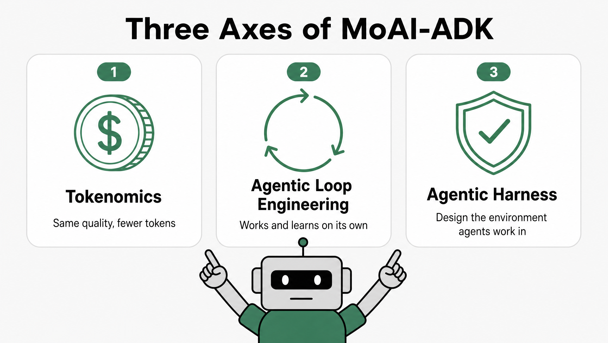
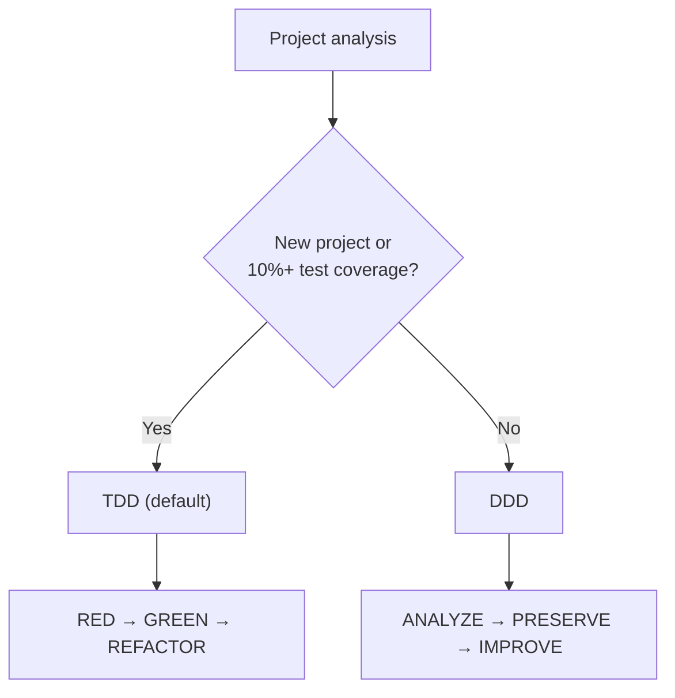

<p align="center">
  
</p>

<h1 align="center">MoAI-ADK</h1>

<p align="center">
  <strong>Claude Codeのためのエージェンティック開発ハーネス</strong>
</p>

<p align="center">
  <a href="./README.md">English</a> ·
  <a href="./README.ko.md">한국어</a> ·
  日本語 ·
  <a href="./README.zh.md">中文</a>
</p>

<p align="center">
  <a href="https://book.mo.ai.kr" target="_blank"><strong>公式書籍『Claude Code 実践エージェンティックコーディング』</strong></a><br>
  MoAI-ADK 製作者による実践ハーネスエンジニアリングガイド — <a href="https://book.mo.ai.kr" target="_blank">book.mo.ai.kr</a>
</p>

<p align="center">
  <a href="https://github.com/modu-ai/moai-adk/actions/workflows/ci.yml"></a>
  <a href="https://github.com/modu-ai/moai-adk/actions/workflows/codeql.yml"></a>
  <a href="https://codecov.io/gh/modu-ai/moai-adk"></a>
  <br>
  <a href="https://go.dev/"></a>
  <a href="https://github.com/modu-ai/moai-adk/releases"></a>
  <a href="./LICENSE"></a>
</p>

<p align="center">
  <a href="https://adk.mo.ai.kr"><strong>公式ドキュメント</strong></a> ·
  <a href="https://adk.mo.ai.kr/book">書籍: Claude Code 実践エージェンティックコーディング</a> ·
  <a href="https://discord.gg/Z7E7Mdc5aN">Discord</a>
</p>

---

> **「コードを書くな。コードを書く環境を設計しろ。」**

---

## MoAI-ADK とは何か

MoAI-ADK（Agentic Development Kit）は、Claude Code を外側から包み込むハーネスであり、モデルの確率的な出力を信頼できるものに変える。モデルはトークン単位で進むワーカーであり、予算も、品質基準も、前回のセッションがどこで途切れたかも覚えていない。コストの上限、テストスイートの通過、自己改善のループ、`/clear` を越えて残る継続性 — こうした性質は毎ターンのプロンプトで植え直せるものではない。システムが外側から強制しなければならない。

Claude Code を置き換えるものではない。Claude Code がユーザーに委ねている部分 — モデルルーティング、品質ゲート、コスト制御、学習ループ、セッション継続性 — を構造として包むだけである。Go で書かれた単一バイナリで、macOS・Linux・Windows を追加の依存関係なしに動く。


---

## ハーネスの 3 つの軸

MoAI-ADK の価値は 3 つの柱に支えられている — [ドキュメントサイト](https://adk.mo.ai.kr/ja/core-concepts)が全体を整理する基準にしているのと同じ 3 つである。それぞれの柱が、エージェンティックなシステムはどうあるべきかという問いに一つずつ答える。



| 柱 | 主な問い |
|---|---|
| 🪙 **トークノミクス** | 同じ品質を、より少ないトークンでどう得るか |
| 🧠 **エージェンティックループエンジニアリング** | ループはどう自ら働き、学ぶか |
| 🛡️ **エージェンティックハーネス** | エージェントがよく働く環境をどう設計するか |

### 🪙 トークノミクス — 同じ品質をより少ないトークンで

トークン単価はこの 3 年で **98% 下落した**（Linux Foundation）が、同じ期間に企業の AI 支出は **320% 上昇した**。単価の下落を量の爆発が圧倒した結果である。エージェントは一つの課題を解くために数十から数百のステップを回し、それに比例してトークンを燃やす。従量課金ではこれがそのまま請求書になり、サブスクリプションでは全モデルが共有する週間クォータを食い潰す。

Uber はエンジニア 5,000 名に Claude Code を展開し、**1 年分のコーディング予算を 4 か月で使い切って**から月次のトークン上限を課した。Meta・Amazon・Microsoft も無制限 AI ポリシーを相次いで撤回した。タスクに合ったモデルを選び、トークン効率を高める **トークノミクス** がテック業界の新しい基準になった。


従来のコスト管理は単価が上がる前提で作られている。だから「単価は下がるのに総コストは上がる」という逆説の前では無力である。ボトルネックは単価ではなく量、より正確にはエージェントが課題を終える前に回すステップ数にある。

**コストはモデル単価ではなく割り当てで決まる。** DeepSWE リーダーボード（113 課題、effort 段階別ビュー）がこれを示している。同じ Claude 系の中でも、課題あたりコストはトークンの単価ではなく、モデルがどれだけ効率的に *完走* するかを追う。

| モデル [effort] | Pass@1 | 課題あたりコスト | 出力トークン | ステップ |
|---|---|---|---|---|
| claude-opus-5 [low] | 58% | **$1.66** | 20k | 36 |
| claude-opus-5 [medium] | 69% | $3.29 | 37k | 52 |
| claude-opus-5 [high] | 73% | $6.08 | 64k | 73 |
| claude-opus-5 [max] | 74% | $11.84 | 118k | 99 |
| claude-sonnet-5 [max] | 54% | **$26.40** | 214k | 268 |

Opus 5 は **最も低い** effort でも Sonnet 5 の **最も高い** effort よりスコアが高く（58% vs 54%）、課題あたりコストは 16 分の 1 だ（$1.66 vs $26.40）— Sonnet のトークン単価のほうが安いにもかかわらず。原因は 36 対 268 のステップ数: 請求書を書くのはトークンの料率ではなくリトライループである。コストは**タスクに合ったモデルと推論深度を割り当てること**で決まり、単価ではない。

#### 4 つの段階: 測定 → ルーティング → ダイエット → 防御

トークノミクスは 4 つの段階で動く。各段階がコストの一面を担い、ともに閉じたループを形成する。測定が先行してこそルーティングとダイエットの効果を検証でき、防御がなければ一度の予算超過がセッションを切断する。


**測定 — SPEC 単位のトークン会計。** 各 SPEC（仕様書）が消費したトークンを透明に計量する。transcript JSONL の usage を合算して `progress.md` のトークン会計ブロックに記録し、`moai spec audit` のカラムで照会する。この層が残り 3 段階の基準線である。

**ルーティング — タスクに合ったモデルと推論深度を割り当てる。** 作業フェーズ（plan / run / sync）と SPEC サイズ（Tier S/M/L）に応じて、モデルと推論 effort（low / medium / high / max）を宣言的に割り当てる。深い推論が必要な計画フェーズには高推論モデルを、機械的繰り返しが多い実装フェーズには軽量モデルを振り向ける。

- **No-Haiku 3ティア・ポリシー** — Haiku をルーティングセットから除外する。Sonnet の low effort が単発・入力支配の作業を担い、マルチターンのエージェンティック行はすべて Opus が担う。
- **プロファイルマトリクス** — 11 エージェント × 3 プロファイル = 33 セル。`moai model profile` が各エージェントの `{model, effort}` ペアを解決する。
- **CG モード** — `moai cg` は Claude リーダー（戦略・計画・監査）と GLM ワーカー（大量実装）を組み合わせる。実装中心の作業で **60-70% のコスト削減**。


**実測で検証したコストパフォーマンス — Opus 5 の最適点は medium。** ルーティングの根拠は DeepSWE v1.1（datacurve.ai、113 課題・91 リポ・5 言語、2026-07-25）の実測である。

| モデル [effort] | スコア | 課題あたりコスト | 備考 |
|---|---|---|---|
| opus-5 [low] | 58%±2 | $1.66 | |
| opus-5 [medium] | **69%±1** | **$3.29** | **コストパフォーマンスの膝** |
| opus-5 [high] | 73%±2 | $6.08 | スコア +4pt、コスト 1.8 倍 |
| opus-5 [xhigh] | 73%±3 | $9.07 | **純損失** — high と同点、コストだけ +49% |
| opus-5 [max] | 74%±4 | $11.84 | |
| glm-5.2 [max] | 44%±2 | $3.92 | API 従量制では劣位 · z.ai 定額制で価値 |
| sonnet-5 [max] | 54%±4 | $26.40 | opus-5 [low] にパレート支配される |


> 出典: [DeepSWE v1.1 リーダーボード](https://deepswe.datacurve.ai)（datacurve.ai、113 課題、2026-07-25）

`medium` を実装エージェントのデフォルトアンカーに据え、`xhigh` はマトリクスから外した。`high` プロファイルを適用すると **コスト −33%、品質 +3.3pt** が同時に達成される — 安くて、より正確である。

**検証コストの節約 — コンテキストは軽く、証拠はディスクに。** 検証コマンドの長大な出力はディスクファイルにリダイレクトし、コンテキストには終了コードと bounded tail（最大 50 行）だけを残す。プロンプトキャッシュの再利用（キャッシュ読み取りは 0.1×）と、コンテキストダイエットのための `/clear` 戦略（1M 50% / 200K 90% の閾値で自動推奨）がウィンドウを軽く保つ。

**予算防衃 — 超過前に止め、次セッションに引き継ぐ。** Token Circuit Breaker がハードリミット（デフォルト 90%）で安全に中断し、進捗を `progress.md` に保存して、ペースト可能なレジュームメッセージを発行する。ステータスラインはコンテキスト使用率・キャッシュ適中率・レートリミット枯渇率を常に表示し続ける。

### 🧠 エージェンティックループエンジニアリング — 自ら働き、学ぶループ

ハーネスは静的な構造ではない。ループは自ら回り、観察がその過程で蓄積し、指針がサイクルごとに進化する。

**宣言型ループ。** `/moai goal "<condition>"` は、宣言された完了条件が満たされるかターン上限（デフォルト 30）に達するまでセッションを動かし続ける。`/moai loop` は LSP 診断・AST-grep・リンターを並列スキャンし、問題をレベル別に仕分けてキューが空になるまで回す。ループは毎ターンのプロンプトで駆動されるのではなく、宣言された終着状態に向かって自ら進む。

**4 段階学習ラダー。** 観察ははしごに沿って指針へと昇格する: 観察（≥1）→ ヒューリスティック（≥3）→ ルール（≥5）→ 自動更新（≥10、ユーザー承認必須）; 信頼度しきい値 0.70。ルーティング決定とゲート証拠はプライバシー保持ダイジェストとして記録される。すべての適用は `moai harness rollback` で元に戻せる。ハーネス編集（ルール・エージェント・フックの変更）には予測・検証の規律が適用される: 編集ごとに反証可能な予測を記録し、held-in/held-out の二重チェックを通過して初めて採用され、却下された編集も記録に残る。

**決定メモリ。** 質問は不確実性が最も高い箇所（p ≈ 0.5）から出て、推奨はシステムデフォルトではなく観測された統計的多数に従う。ハーネスはユーザーが下しがちな決定を学び、汎用デフォルトの代わりに適切な選択肢を提示する。

### 🛡️ エージェンティックハーネス — エージェントが働く環境を設計する

自らコードを書く代わりに、エージェントがよく働く環境を設計する。この柱が、ほかの二つを可能にする構造である。

**SPEC 3 フェーズライフサイクル。** plan → run → sync。Tier S/M/L のサイズ分類が検証深度と PR ルーティングを決定し、GEARS 形式の要件と受入基準が完了を証拠で判定する。


**TRUST 5 品質ゲート。** Tested（85%+ カバレッジ）・Readable ・ Unified ・ Secured ・ Trackable をすべての変更に適用する。判定するのはエージェントではなくゲートである。

**11 エージェントカタログ。** MoAI カスタム 10 + 内蔵 Explore。計画と監査を最初から分離し、作成側が自作業に点数をつけないようにする。

**拡張ポイント。** Harness v4 Builder が自然言語リクエストをプロジェクト専用のエージェント・スキル・コマンド・フックの足場に変換する。`@MX` タグは AI エージェント間でコンテキスト・不変量・危険ゾーンをコード内で受け渡す。`worktree` 分離は `/moai plan --worktree` で SPEC ごとに並列開発用の隔離ワークスペースを追加する。

---

## クイックスタート

### インストール

#### macOS / Linux / WSL

```bash
curl -fsSL https://raw.githubusercontent.com/modu-ai/moai-adk/main/install.sh | bash
```

#### Windows (PowerShell 7.x+)

```powershell
irm https://raw.githubusercontent.com/modu-ai/moai-adk/main/install.ps1 | iex
```

#### ソースからビルド (Go 1.26+)

```bash
git clone https://github.com/modu-ai/moai-adk.git
cd moai-adk && make build
```

### プロジェクト初期化

```bash
moai init my-project
```

対話型ウィザードが言語・フレームワーク・方法論を自動検出し、モデルポリシーを選んだ後、Claude Code 統合ファイルを生成する。

### 最初のワークフロー

```bash
claude        # launch Claude Code inside the project
```

```text
/moai plan "Add JWT login"      # SPEC を作成
/moai run SPEC-AUTH-001         # TDD/DDD 実装
/moai sync SPEC-AUTH-001        # docs 同期 + PR 作成
```

自然言語でも動く。`/moai "fix the login bug"` はインテント分析（Analyze-First ルーティング）を起動し、リクエストを読んで適切なワークフローに振り分ける。

### 要件

| プラットフォーム | 対応環境 | 備考 |
|----------|----------------------|-------|
| macOS | Terminal, iTerm2 | 完全サポート |
| Linux | Bash, Zsh | 完全サポート |
| Windows | **WSL（推奨）**, PowerShell 7.x+ | ネイティブ cmd.exe は非サポート |

**前提条件**

- すべてのプラットフォームで **Git** 必須
- **Claude Code** — MoAI-ADK は Claude Code 用のハーネスである
- **推奨**: `gh` CLI（PR 自動化）· `tmux`（CG モード）· 使用言語のリンター/テストツールチェイン（例: `golangci-lint`）

---

## リファレンス

### /moai スラッシュコマンド（15）

| サブコマンド | 役割 |
|------------|------|
| `plan` / `run` / `sync` | SPEC 3 フェーズパイプライン |
| `project` / `harness` | プロジェクト文書・ハーネス生成 · ハーネスライフサイクル |
| `goal` / `loop` / `fix` | 宣言型ゴールループ · 反復修正 · 単発修正 |
| `review` / `gate` / `clean` | コードレビュー（`--deep` で複数エージェントによる対抗的脆弱性スキャン） · コミット前品質ゲート · デッドコード削除 |
| `mx` / `codemaps` / `feedback` | @MX アノテーション · アーキテクチャ文書 · GitHub Issue 報告 |
| `e2e` | マルチプラットフォーム E2E テスト（Web/モバイル/デスクトップ、CLI 優先） |
| *(自然言語)* | Analyze-First ルーティング: 自律的な plan → run → sync パイプライン |

> **退役した 4 サブコマンド**: `design` · `brain` · `coverage` · `security`（SPEC-SUBCOMMAND-RETIRE-001、status: completed）。`security` は `moai-ref-owasp-checklist` + `moai-ref-llm-security` スキルに置き換わり、`e2e` は E2E-REVIVAL で復活して現在アクティブである。

> → 詳細: [Workflow Commands](https://adk.mo.ai.kr/ja/workflow-commands) · [Utility Commands](https://adk.mo.ai.kr/ja/utility-commands)

### CLI コマンド（頻繁に使う 13 個）

| コマンド | 説明 |
|---------|-------------|
| `moai init` | 対話型プロジェクトセットアップ（言語/フレームワーク/方法論を自動検出） |
| `moai doctor` | システム状態診断と環境検証 |
| `moai status` | プロジェクト状態要約（Git ブランチ、品質指標） |
| `moai update` | 最新版へアップデート（自動ロールバック対応） |
| `moai cc` / `moai glm` / `moai cg` | Claude 専用 / GLM 専用 / ハイブリッド Claude リーダー + GLM ワーカーセッション |
| `moai worktree <new|list|switch|sync|remove|clean|go>` | 並列 SPEC 開発用 Git worktree 管理 |
| `moai session <list|register|current>` | マルチセッション調整 |
| `moai spec <audit|archive|lint|list|new>` | SPEC ライフサイクルツール |
| `moai goal <arm|status|clear>` | Goal エンジン CLI |
| `moai harness <status|apply|rollback|disable>` | harness 学習ライフサイクル |
| `moai handoff <save|list>` | セッションハンドオフ記録 |
| `moai preference <list|decay-scan|toggle>` | 決定メモリ管理 |
| `moai web` | Web Console — 6 タブ設定コンソール |

> 全 36 コマンド: [CLI Reference](https://adk.mo.ai.kr/ja/cli-reference)

### 11 エージェントカタログ

| カテゴリ | エージェント | コスト | 役割 |
|----------|-------|------|------|
| **Manager** | manager-spec | 🔴 | Plan フェーズ SPEC 作成 |
| | manager-develop | 🔴 | Run フェーズ TDD/DDD/autofix 実装 |
| | manager-docs | 🔵 | Sync フェーズ ドキュメント化 |
| | manager-git | 🩵 | PR 作成とルーティング |
| | manager-design | 🟠 | Design フェーズ協業（Claude Design） |
| **Evaluator** | plan-auditor | 🔴 | 独立計画監査（バイアス防止） |
| | sync-auditor | 🔴 | 4 次元品質スコアリング（Functionality 40 · Security 25 · Craft 20 · Consistency 15） |
| **Builder** | builder-harness | 🟠 | プロジェクト専用エージェント・スキル・コマンド・フックの足場作り |
| **Advisor** | super-advisor | 🔵 | オンデマンド高推論コンサル（E1-E4 エスカレーション） |
| **Specialist** | e2e-tester | 🟠 | Web/モバイル/デスクトップ E2E テスト実行（CLI 優先） |
| **Built-in** | Explore | ⚪ | 読み取り専用コードベース探索 |

コスト色はデフォルト `medium` プロファイルの model×effort セル基準（`moai model profile` で確認）: 🔴 opus+high · 🟠 opus+medium · 🔵 opus+low · 🩵 sonnet+low · ⚪ セッションモデル継承（ユーザー追加エージェント）。プロファイル（`high`/`low`）切り替え時に割り当てが変わる。長期委任の進行状況は Task チャンネルに記録され、オーケストレーターがアイコン Progress Board として中継する。

### TRUST 5 品質ゲート

| 基準 | 意味 | 検証 |
|-----------|---------|------------|
| **T**ested | テスト済み | 85%+ カバレッジ、特性化テスト、単体テスト通過 |
| **R**eadable | 読みやすい | 明確な命名、一貫したスタイル、リントエラー 0 |
| **U**nified | 統一されている | 一貫したフォーマット、import 順序、プロジェクト構造準拠 |
| **S**ecured | セキュア済み | OWASP 準拠、入力検証、セキュリティ警告 0 |
| **T**rackable | 追跡可能 | Conventional commits、issue 参照、構造化ロギング |

### 方法論の選択（TDD vs DDD）


```mermaid
flowchart TD
    A["Project analysis"] --> B{"New project or<br/>10%+ test coverage?"}
    B -->|"Yes"| C["TDD (default)"]
    B -->|"No"| D["DDD"]
    C --> F["RED → GREEN → REFACTOR"]
    D --> G["ANALYZE → PRESERVE → IMPROVE"]
```

| 方法論 | サイクル | 対象 |
|-------------|-------|-----|
| **TDD** (デフォルト) | RED → GREEN → REFACTOR | 新規プロジェクトと機能作業 |
| **DDD** | ANALYZE → PRESERVE → IMPROVE | カバレッジ 10% 未満の既存コード |

---

## ステータスラインの読み方

```
🤖 Opus │ 🧠 xhigh·t │ ♻️ 87% │ 🔅 v2.1.212 │ 🗿 v3.0.0 │ ⏳ 2h 34m │ 💬 MoAI
🪫 CW: ████████░░ 88% (⚠️/clear) │ 🔋 5H: ████░░░░░░ 45% (4h 30m) │ 🪫 7D: ████████░░ 82% (Jan 21)
📁 moai-adk-go │ 🔀 modu-ai/moai-adk | 🅱️ feat/statusline ↑2 +3 │ 💾 +1 M2 ?0 │ 📋 [run SPEC-AUTH-001-run] │ 💌 PR #1042 (⌥approved)
```

| 要素 | 意味 |
|------|------|
| 🤖 モデル | 現在アクティブなモデル |
| 🧠 effort | 推論 effort レベル — 拡張推論が有効なら `·t` 接尾辞 |
| ♻️ キャッシュ適中率 | プロンプトキャッシュ適中率 |
| CW: コンテキスト | コンテキストウィンドウ使用率 + 2 段階 `/clear` マーカー（⚠️ ソフト、🛑 ハード） |
| 5H / 7D | 料金プラン使用率 + リセット時間 |
| 📁 ディレクトリ | プロジェクトディレクトリ名 |
| 🔀 リポジトリ | GitHub リポジトリ ID `owner/name` |
| 🅱️ ブランチ | 現在のブランチ + `↑`ahead `↓`behind + `+`dirty 数 |
| 💾 git 状態 | staged / modified / untracked 数 |
| 📋 タスク | アクティブ SPEC ワークフロー `[コマンド SPEC-ID-フェーズ]` |
| 💌 PR | アクティブ GitHub PR 番号 + レビュー状態（`⌥state`） |

> 詳細: [Statusline Guide](https://adk.mo.ai.kr/ja/advanced/statusline)

---

## FAQ

### Q: すべての関数に @MX タグがないのはなぜですか？

正常である。タグはファンインが高いか、複雑か、危険なコードだけを選んで表示する。どのプロジェクトでもコードの大部分はどのタグ基準にも引っかからず、タグがないファイルは欠陥ではない。

### Q: ステータスラインのバージョン表示はどういう意味ですか？

```
🗿 v3.0.0 ⬆️ v3.0.1
```

最初の値が現在インストールされている MoAI-ADK のバージョン、矢印が受け取れるアップデートを示す。`moai update` を実行すると消える。

### Q: GLM なしで Claude だけで使えますか？

使える。`moai cc` が Claude 専用セッションを起動する。CG モード（`moai cg`、Claude リーダー + GLM ワーカー）と GLM 専用（`moai glm`）はコスト削減の選択肢であり、ハーネス・SPEC ワークフロー・品質ゲートは 3 つのモードすべてで同じように動く。

### Q: 既存のプロジェクトにも使えますか？

使える。`moai init` がプロジェクト状態を検出して方法論を選ぶ — カバレッジ 10% 未満の既存コードには DDD（特性化テストで動作を固定してから段階的に改善）、新規または十分にテストされたコードには TDD を適用する。

---

## コミュニティとドキュメント

### 貢献について

貢献はいつでも歓迎する。詳細な手順は [CONTRIBUTING.md](CONTRIBUTING.md) にまとめた。

1. リポジトリをフォーク
2. 機能ブランチ作成: `git checkout -b feature/my-feature`
3. テスト作成（新規コードは TDD、既存コードは特性化テスト）
4. テスト・リント・フォーマットの通過確認: `make test` · `make lint` · `make fmt`
5. Conventional commit メッセージでコミットし、プルリクエストを作成

**コード品質要件**: 85%+ カバレッジ · リントエラー 0 · 型エラー 0 · Conventional commits

### コミュニティ

- [Discord](https://discord.gg/Z7E7Mdc5aN) — リアルタイム討論と tips
- [Issues](https://github.com/modu-ai/moai-adk/issues) — バグ報告、機能リクエスト（Claude Code 内では `/moai feedback`）

### ライセンス

[Apache License 2.0](./LICENSE) — 詳細は LICENSE ファイルを参照。

### ドキュメントガイド

[adk.mo.ai.kr](https://adk.mo.ai.kr) オンラインドキュメントは 12 セクションで構成されている。

| セクション | 説明 |
|---------|------|
| [Getting Started](https://adk.mo.ai.kr/ja/getting-started) | はじめに、インストール、Windows ガイド、init ウィザード、クイックスタート、CLI 概要、FAQ |
| [Core Concepts](https://adk.mo.ai.kr/ja/core-concepts) | MoAI-ADK の位置づけ、憲法、ハーネスエンジニアリング、SPEC ベース開発、DDD、TRUST 5 |
| [Workflow Commands](https://adk.mo.ai.kr/ja/workflow-commands) | `plan` · `run` · `sync` — SPEC パイプラインの要 |
| [Utility Commands](https://adk.mo.ai.kr/ja/utility-commands) | `fix` · `loop` · `gate` · `review` · `clean` · `codemaps` · `e2e` · `feedback` · `goal` |
| [CLI Reference](https://adk.mo.ai.kr/ja/cli-reference) | すべての `moai` バイナリコマンド — `status`、`profile`、`doctor`、`update`、`web`、`goal`、`handoff`、`harness`、`init`、`worktree` など |
| [Claude Code Guide](https://adk.mo.ai.kr/ja/claude-code) | Claude Code 統合 — 基礎、コンテキスト・メモリ、エージェンティック、拡張性（スキル・フック・プラグイン） |
| [Multi-LLM](https://adk.mo.ai.kr/ja/multi-llm) | CG モードとモデルポリシー |
| [Cost Optimization](https://adk.mo.ai.kr/ja/cost-optimization) | プロンプトキャッシュ戦略とトークンコスト削減 |
| [Guides](https://adk.mo.ai.kr/ja/guides) | CI 自動化、multi-LLM CI など実運用レシピ |
| [Git Worktree](https://adk.mo.ai.kr/ja/worktree) | 並列 SPEC 開発用 worktree ガイド、事例、FAQ |
| [Advanced](https://adk.mo.ai.kr/ja/advanced) | トークノミクス概要、トークン予算、ステータスライン、settings.json、フック、@MX タグ、スキルガイド、Harness v4 Builder、自己進化、決定メモリ、カタログシステム、セキュリティノート、CLAUDE.md/エージェントガイド |
| [Contributing](https://adk.mo.ai.kr/ja/contributing) | オープンソース貢献ガイド |

### リンク

- [公式ドキュメント](https://adk.mo.ai.kr)
- [書籍: Claude Code 実践エージェンティックコーディング](https://adk.mo.ai.kr/book)
- [CHANGELOG](./CHANGELOG.md)
- [Claude Code](https://code.claude.com/docs/en)
- [Discord コミュニティ](https://discord.gg/Z7E7Mdc5aN)
