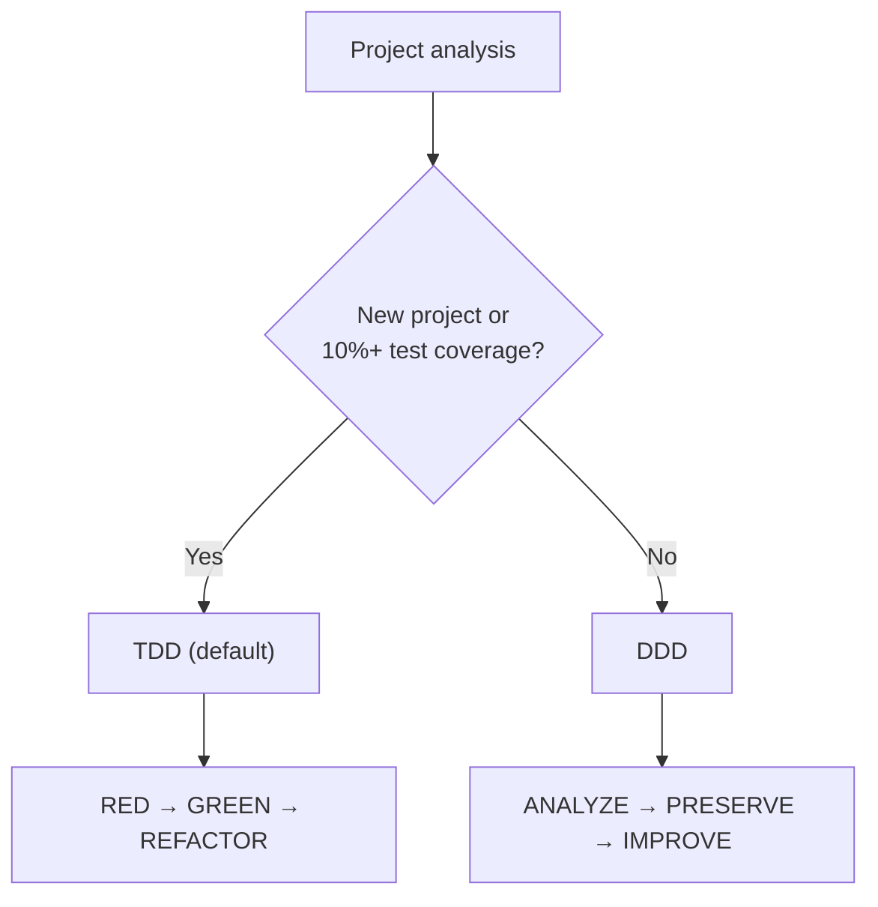

<p align="center">
  
</p>

<h1 align="center">MoAI-ADK</h1>

<p align="center">
  <strong>Claude Codeのためのエージェンティック開発ハーネス — コスト、自己改善、品質管理の3つをまとめて押さえる</strong>
</p>

<p align="center">
  <a href="./README.md">English</a> ·
  <a href="./README.ko.md">한국어</a> ·
  日本語 ·
  <a href="./README.zh.md">中文</a>
</p>

<p align="center">
  <a href="https://book.mo.ai.kr" target="_blank"><strong>公式書籍『Claude Code 実践エージェンティックコーディング』</strong></a><br>
  MoAI-ADK 製作者による実践ハーネスエンジニアリングガイド — <a href="https://book.mo.ai.kr" target="_blank">book.mo.ai.kr</a>
</p>

<p align="center">
  <a href="https://github.com/modu-ai/moai-adk/actions/workflows/ci.yml"></a>
  <a href="https://github.com/modu-ai/moai-adk/actions/workflows/codeql.yml"></a>
  <a href="https://codecov.io/gh/modu-ai/moai-adk"></a>
  <br>
  <a href="https://go.dev/"></a>
  <a href="https://github.com/modu-ai/moai-adk/releases"></a>
  <a href="./LICENSE"></a>
</p>

<p align="center">
  <a href="https://adk.mo.ai.kr"><strong>公式ドキュメント</strong></a> ·
  <a href="https://adk.mo.ai.kr/book">書籍: Claude Code 実践エージェンティックコーディング</a>
</p>

---

> **"モデルはトークン単位で動く確率的ワーカーである。毎ターン、自分にいくらかかるべきか、仕事の品質が良いか、前回のセッションがどこで途切れたかを記憶しない。ハーネスはこの3つを外側から強制する。"**

---

## MoAI-ADK: 3つの中核を備えたエージェンティック・ハーネス

MoAI-ADK（Agentic Development Kit）は、Claude Codeにコードを生成させ、そのコードを予測可能なコストで信頼できるものにし、継続的に改善されていく軌道に乗せる。ハーネスとは、モデルを外側から包み込むシステムである。モデルはトークン単位で動く確率的ワーカーであり、毎ターン予算も、品質基準も、前回のセッションがどこで途切れたかも記憶しない。コストの上限、通過するテストスイート、蓄積する学習ループ、`/clear`をまたぐ連続性 — こうした性質は毎ターンのプロンプトで植え直せるものではなく、システムが外側から強制しなければならない。

必要なのはこの3つだ。MoAI-ADKはClaude Codeを3つすべてで包み込む — 1つだけではなく:

- **🪙 コスト** — トークノミクス: 同じ品質をより少ないトークンで、同じトークンでより高い品質を。
- **🧠 自己改善** — エージェンティック・ループ・エンジニアリング: ハーネスは回すほど改善され、観察をルールに変える。
- **🛡️ 品質管理** — エージェンティック・ハーネス: SPECライフサイクル、TRUST 5ゲート、そして手戻り（最大のトークン浪費）を防ぐ隔離。

Claude Codeを置き換えるものではない。Claude Codeがユーザーに委ねている部分 — モデルルーティング、品質ゲート、コスト制御、学習ループ、セッション継続性 — を構造で包み込むだけである。Goで書かれた単一バイナリなので、macOS・Linux・Windowsで追加の依存関係なしにそのまま動く。

<p align="center">
  
</p>

---

## v3.1 の新機能 — カンバンモード

セッションはコンテキストウィンドウを1つしか持たない。長いSPECはそれを埋め尽くし、後に続く作業は先行したすべてを背負ったまま進む。もう不要になった計画がレビュー中もウィンドウに残り、そのレビューがドキュメント作成中もまだ残っている。よくある逃げ道である`/clear`は、その重荷と一緒に文脈まで捨ててしまう。

カンバンモードは1つの作業を**ターミナル1つではなく5つ**に分ける。リードセッションがチェーンを進め、4つの同伴セッションが`plan`・`run`・`review`・`sync`を1列ずつ受け持ち、**自分の列の文脈だけ**を背負う。上限がなくなるわけではない — 各セッションの上限はそのままだ。変わるのは、どのセッションも4フェーズ分の履歴を抱え込まないという点であり、同じ予算がはるかに遠くまで届き、終わったフェーズはカードを失わずに片付けられる。

<p align="center">
  
</p>

列ごとにバックエンドとeffortを変えられる。上の画面ではPlanをOpus 5のhighで、RunをGLM 5.2のxhighで、SyncをGLM 5.2で動かしている。列ごとに必要な推論の深さが同じではないからだ。

### はじめかた

```bash
moai cc -k                          # リード — run-id を知らせ、チェーンを敷く
moai cc -k --name plan-<run-id>     # 同伴セッション、それぞれ別のターミナルで
moai cc -k --name run-<run-id>
moai cc -k --name review-<run-id>
moai cc -k --name sync-<run-id>
```

同伴セッションは**ターミナルを1つずつ新しく開いて手で**起動する。セッションが別のセッションを立ち上げることはない。どの列でも`moai cc`を`moai glm`に替えれば、その列だけGLMバックエンドで動く。

ボードは`backlog → plan → run → review → sync → done`の6列だ。`backlog`には意図的に担当セッションを置いていない。だから作業は人が入れたときにだけボードに入る。

```text
/moai todo "rename のヒントが古い"   # カードを追加
/moai todo                           # キューを確認
```

ボードを正直に保つ規則が2つある。リードはカードの`progress.md`から**自分で読んだ証拠だけ**でカードを進める — 同伴セッションの返信では進めない。返信は観測ではなく主張であり、セッション間の到達も保証されていないからだ。そしてフェーズが終わるとリードは該当セッションの`/clear`を依頼する。`/clear`は人が直接打つコマンドで、指示として送れないためである。

### ボードを目で見る

`moai web`はローカルコンソールを立ち上げる。カンバン画面では5セッションのチェーンとSPECパイプラインを並べて見られ、Overview・Specs・Monitor・Settingsの画面も付く。

<p align="center">
  
</p>

詳しい案内: [カンバンモード](https://adk.mo.ai.kr/ja/advanced/kanban-mode) · [`/moai todo`](https://adk.mo.ai.kr/ja/utility-commands/moai-todo)

---

## なぜ3つが揃っていなければならないのか

コストだけを最適化するのは罠である。コストだけを押し進めると、品質は知らずのうちに損なわれ、手戻りとデバッグのループが続く。そして手戻りこそ、すべてのトークン支出の中で最も高くつく。学習ループのない品質ゲートだけを立てれば、毎セッション同じ失敗が再発する。コスト上限のない自律ループを回せば、暴走したタスク1つがクォータを食い潰す。3つは互いを支え合う: **コストは品質が手戻りを防ぐことで経済的に保たれ、品質はループが機能したパターンを取り込むことで強制可能に保たれ、ループはコストゲートが超過前に止めることで手頃な価格に保たれる。**

MoAI-ADKのすべての設計判断は、この3つのいずれかに向けられている。どのモデルを使うか、どこまで深く推論するか、コンテキストをどう使うか — いずれもターンごとの運任せではなく、システムが決定し、その決定を記録して次の実行が賢くなるようにする。

<p align="center">
  
</p>

---

## 🪙 コスト — トークノミクス

トークンの単価は下がり続けているのに、実際のエージェントワークフローの支出は上がる。エージェントは一つの課題を解くために数十〜数百ステップを回し、それに比例してトークンを消費する。従量課金ではこれがそのまま請求書になり、サブスクリプションでは全モデルが共有する週間クォータを食い潰す。

### コストは単価ではなく割り当てで決まる

DeepSWEリーダーボード（113タスク、effort段階別ビュー）の実測値がこの問題を示している。同じClaude系の中でも、課題あたりのコストはトークン単価ではなく、モデルがどれだけ効率的に*完走*するかを追う。

| モデル [effort] | Pass@1 | 課題あたりコスト | 出力トークン | ステップ |
|---|---|---|---|---|
| claude-opus-5 [low] | 58% | **$1.66** | 20k | 36 |
| claude-opus-5 [medium] | 69% | $3.29 | 37k | 52 |
| claude-opus-5 [high] | 73% | $6.08 | 64k | 73 |
| claude-opus-5 [max] | 74% | $11.84 | 118k | 99 |
| claude-sonnet-5 [max] | 54% | **$26.40** | 214k | 268 |

Opus 5は**最も低い**effortでもSonnet 5の**最も高い**effortよりスコアが高く（58% vs 54%）、課題あたりコストは16分の1だ（$1.66 vs $26.40）— Sonnetのトークン単価のほうが安いにもかかわらずである。原因は36ステップ対268ステップ: 請求書を書くのはトークンの料率ではなくリトライループだ。「弱いモデルを強く使えば安くなる」という通念は成立しない。コストは単価ではなく**タスクに合ったモデル・推論深度の割り当て**が決まる。

MoAI-ADKはこの割り当てをその場の運任せにせず、システム化する。

<p align="center">
  
</p>

### ルーティング — タスクごとに適切なモデルと推論深度を

<p align="center">
  
</p>

**Tier×Phaseマトリクス**. 作業フェーズ（plan / run / sync）とSPECサイズ（Tier S / M / L）に応じて、モデルと推論深度（effort）を宣言的に割り当てる。深い推論が必要な計画フェーズには高推論モデルを、機械的繰り返しが多い実装フェーズには軽量モデルを割り当て、コスト対品質を最大化する。

**No-Haiku 3ティア・ポリシー**. Haikuをルーティングモデルセットから排除し、タスクの性格に合わせた3ティア構造で作業を分散する。Sonnet low effortは単発・入力支配の作業（gitの機械的作業、読み取り専用検索）を担ってステップ数を最小化し、マルチターンのエージェンティック行はすべてOpusが担当する。`max` effortは呼び出し頻度が最も低い2行のために残す。

**プロファイルマトリクス**. 単一のper-agentプロファイルマトリクスが、維持される12個のエージェントそれぞれを`{model, effort}`ペアにマッピングする — 36セル。プロファイルは1つだけ — `high` / `medium`（デフォルト）/ `low`、`llm.profile`（`moai init --profile`、`moai update --profile`）で選択 — がアクティブ列を選び、`moai model profile`が各エージェントのセルを解決する。`Explore`を含む維持されるすべてのエージェントがマトリクスからmodel+effortを受け取り（どこにもHaikuはない）、セッションモデルを継承するのはユーザー定義エージェントだけだ。

**CGモード（Claude + GLM）**. `moai cg`はClaudeリーダーとGLMワーカーを組み合わせたハイブリッドモードである。戦略・計画・監査はClaudeが担当し、大量の実装作業はGLMが担当する。実装集中作業で**60-70%のコスト削減**効果がある。

<p align="center">
  
</p>

### 検証経済 — コンテキストはダイエットし、証拠はディスクへ

**verify-diet**. 検証コマンドの長大な出力をディスクファイルにリダイレクトし、コンテキストには終了コードとbounded tail（最大50行）だけ残す。このファイル・リダイレクト契約は検証証拠の完全性を保ちながらコンテキスト消費を削減する。証拠は`.moai/state/verify/<session>/`配下に永続化される。

**プロンプトキャッシュ**. リクエストの接頭部が直前のリクエストと同一の場合、その部分を再処理せず再利用する。キャッシュから読んだトークンは基本入力単価の0.1倍で課金される。常時ロードされる指示を最小化すれば、この適中率はすぐに上がる。ステータスラインのキャッシュ適中率セグメント（`♻️`）でリアルタイムの確認が可能。

**コンテキストダイエット**. `/clear`戦略を適用する。SPECフェーズが終われば`/clear`して進行状態を`progress.md`に保存し、ペースト可能なレジュームメッセージを発行する。コンテキストウィンドウ閾値（1Mモデル50% / 200Kモデル90%）で自動的な推奨が表示される。

### 予算防御 — 超過前に停止し、次セッションへ継ぐ

**Token Circuit Breaker**. エージェント別トークン使用量がhard-limit（デフォルト90%）に達すると、安全な中断を実行する。進行状態を`progress.md`に保存し、ペースト可能なレジュームメッセージ（paste-ready resume）を発行し、自動`/clear`は絶対にしない。システムは`/clear`を実行するよう推奨するだけであり、ユーザーが判断して実行する。

**ステータスライン**. コンテキスト使用率（CW%）、プロンプトキャッシュ適中率、レートリミット枯渇率をターミナル下端に常に表示すれば、トークン運用状態を一瞥で読める。CW%の隣の`(⚠️/clear)`マーカーは、モデル別閾値で表示される。

トークノミクスは 4 つの段階で動く。各段階がコストの一面を担い、ともに閉じたループを形成する。測定が先行してこそルーティングとダイエットの効果を検証でき、防御がなければ一度の予算超過がセッションを切断する。

---

## 🧠 自己改善 — エージェンティック・ループ・エンジニアリング

前回のセッションの失敗を繰り返さないセッションが最も安い。自己改善は、毎回の実行を次の実行の材料に変える: ルーティング決定とゲート証拠が記録され、繰り返されるパターンはルールに昇格し、宣言されたgoalが条件を満たすまでセッションを働かせ続ける。

**`/moai goal`・`/moai loop`**. 完了条件を一つ宣言すれば、満たされるかターン限界（デフォルト30）に達するまでセッションが自律的に動作する。`--max-turns 0`で自動コンパクション駆動の無限goalをarmでき、`--max-duration`と停滞ガードが実際の上限になる。`/moai loop`はLSP診断・AST-grep・リンターを並列スキャンし、出てきた問題をレベル別に仕分けてキューが空になるまで回す。

**Routing Ledger**. ルーティング決定とゲート証拠をプライバシー保持ダイジェストとして記録する。観察がルールに昇格する。

**4段階学習ラダー**. 観察（≥1）→ ヒューリスティック（≥3）→ ルール（≥5）→ 自動更新（≥10、ユーザー承認必須）; 信頼度下限0.70。すべての適用は`moai harness rollback`で元に戻せる。ハーネス編集（ルール・エージェント・フックの修正）には予測–検証の規律が適用される: 編集ごとに反証可能な予測を記録し、held-in/held-outの二重チェックを通過して初めて採用され、却下された編集も記録に残る。

**決定メモリ**. 質問は不確実性が最も高い箇所（p ≈ 0.5）から出て、推奨はシステムデフォルトではなく観測された統計的多数に従う。

---

## 🛡️ 品質管理 — エージェンティック・ハーネス

手戻りが最大のトークン浪費である — 出荷されて戻ってきたバグ1つは、すべてのルーティング最適化を合わせたよりも高くつく。品質管理は「完了」を*検証された完了*にし、並列エージェント同士が互いに踏み荒らさないよう作業を隔離する。

### SPEC 3フェーズライフサイクル

plan → run → sync。Tier S/M/Lサイズ分類が検証深度とPRルーティングを決定し、GEARS形式要件 + 受入基準で完了を証拠で判定する。

<p align="center">
  
</p>

**TRUST 5品質ゲート**. Tested（85%+カバレッジ）・Readable・Unified・Secured・Trackable、すべての変更に適用される。検証はエージェントではなくゲートが判定する。

**12エージェントカタログ**. MoAIカスタム11 + 内蔵Explore。計画と監査を設計段階から分離し、作成した側が自作業に点数をつけないようにする。

### 拡張ポイント — 実績あるパターンをプロジェクト固有に複製

**Harness v4 Builder**. 自然言語リクエスト → ドメイン・目標・制約抽出 → 承認ゲート → プロジェクト専用エージェント・スキル・コマンド・フックの足場作り。

**@MXタグ**. AIエージェント間でコンテキスト・不変コントラクト・危険ゾーンを受け渡すインラインコードアノテーション。

**worktree隔離**. SPEC ごとに独立した作業ツリーを用意する。`moai cc -w <名前>` で入り、`--spawn` を付けると現在のセッションを保ったまま新しいウィンドウで開く。

---

## インフラが3つすべてを支える

追加の依存関係なしにmacOS・Linux・Windowsで動くGoの単一バイナリは、トークノミクスだけでなく3つすべての基盤である。フックシステムがゲートを機械的に強制し、ステータスラインがコストとコンテキストをリアルタイムで示し、SPECライフサイクルが`/clear`をまたいで作業を続かせる。3つすべてが同じバイナリの上で動く — どれも後付けではない。

---

## クイックスタート

### インストール

#### macOS / Linux / WSL

```bash
curl -fsSL https://adk.mo.ai.kr/install.sh | bash
```

#### Windows (PowerShell 7.x+)

```powershell
irm https://adk.mo.ai.kr/install.ps1 | iex
```

#### ソースからビルド (Go 1.26+)

```bash
git clone https://github.com/modu-ai/moai-adk.git
cd moai-adk && make build
```

### プロジェクト初期化

```bash
moai init my-project
```

対話型ウィザードが言語とフレームワーク、方法論を自動検出し、モデルポリシーを選んだ後、Claude Code統合ファイルまで作成する。

### 最初のワークフロー

```bash
claude        # launch Claude Code inside the project
```

```text
/moai plan "Add JWT login"      # SPEC を作成
/moai run SPEC-AUTH-001         # TDD/DDD 実装
/moai sync SPEC-AUTH-001        # docs 同期 + PR 作成
```

自然言語でも構わない。`/moai "fix the login bug"`と書けば、インテント分析（Analyze-Firstルーティング）がリクエストを読み適切なワークフローへ回す。

### 要件

| プラットフォーム | 対応環境 | 備考 |
|----------|----------------------|-------|
| macOS | Terminal, iTerm2 | 完全サポート |
| Linux | Bash, Zsh | 完全サポート |
| Windows | **WSL（推奨）**, PowerShell 7.x+ | ネイティブ cmd.exe は非サポート |

**前提条件**

- すべてのプラットフォームで **Git** インストール必須
- **Claude Code** — MoAI-ADKはClaude Code用のハーネスである
- **推奨**: `gh` CLI（PR自動化）· `tmux`（CGモード）· 使用言語のリント/テストツールチェイン（例: `golangci-lint`）

---

## リファレンス

### /moai スラッシュコマンド（16）

| サブコマンド | 役割 |
|------------|------|
| `plan` / `run` / `sync` | SPEC 3フェーズパイプライン |
| `project` / `harness` | プロジェクト docs+harness 生成 · harness ライフサイクル |
| `goal` / `loop` / `fix` | 宣言的 goal ループ · 反復修正 · シングルパス修正 |
| `review` / `gate` / `clean` | コードレビュー（`--deep`でマルチエージェントの敵対的脆弱性スキャン） · pre-commit 品質ゲート · デッドコード削除 |
| `mx` / `codemaps` / `feedback` | @MX アノテーション · アーキテクチャ docs · GitHub issue 報告 |
| `e2e` / `todo` | マルチプラットフォーム E2E テスト（Web/モバイル/デスクトップ、CLI 優先） · カンバンのバックログキュー |
| *(自然言語)* | Analyze-First ルーティング: 自律的な plan → run → sync パイプライン |

> **退役した 4 サブコマンド**: `design` · `brain` · `coverage` · `security`（SPEC-SUBCOMMAND-RETIRE-001、status: completed）。`security` は `moai-ref-owasp-checklist` + `moai-ref-llm-security` スキルに置き換わり、`e2e` は E2E-REVIVAL で復活して現在アクティブである。

> → 詳細: [Workflow Commands](https://adk.mo.ai.kr/ja/workflow-commands) · [Utility Commands](https://adk.mo.ai.kr/ja/utility-commands)

### CLI コマンド（頻繁に使う 13 個）

| コマンド | 説明 |
|---------|-------------|
| `moai init` | 対話型プロジェクトセットアップ（言語/フレームワーク/方法論を自動検出） |
| `moai doctor` | システム状態診断と環境検証 |
| `moai status` | プロジェクト状態要約（Git ブランチ、品質指標） |
| `moai update` | 最新版へアップデート（自動ロールバック対応） |
| `moai cc` / `moai glm` / `moai cg` | Claude 専用 / GLM 専用 / ハイブリッド Claude リーダー + GLM ワーカーセッション |
| `moai worktree <sync\|done\|remove\|clean\|recover\|snapshot\|verify\|restore>` | Git worktree の保守（worktree への移動はランチャーの役割） |
| `moai session <list\|register\|current>` | マルチセッション調整 |
| `moai spec <audit\|archive\|lint\|list\|new>` | SPEC ライフサイクルツール |
| `moai goal <arm\|status\|clear>` | Goal エンジン CLI |
| `moai harness <status\|apply\|rollback\|disable>` | harness 学習ライフサイクル |
| `moai handoff <save\|list>` | セッションハンドオフ記録 |
| `moai preference <list\|decay-scan\|toggle>` | 決定メモリ管理 |
| `moai web` | Web Console — 5 画面（Overview · Kanban · Specs · Monitor · Settings）、10 タブ設定 |

> コマンド全一覧: [CLI Reference](https://adk.mo.ai.kr/ja/cli-reference)

### MCP サーバー

`moai init` はデフォルトで**正確に1つの**アクティブ MCP エントリをプロビジョニングします — セルフホストの `moai mcp-server`（ローカル stdio サーバー）です。これは MoAI 固有の17個のツールを5つのグループにわたって公開します。4つの documented-but-disabled エントリ（`context7`, `chrome-devtools`, `playwright`, `ast-grep`）は `moai mcp add <name>` で有効化します。汎用の `moai mcp add|remove|list` CLI が atomic-RWM シームでエントリを管理し、ユーザーが `.mcp.json` を手編集することはありません。

| グループ | ツール | 目的 |
|-------|-------|---------|
| SPEC ライフサイクル | `spec_progress`, `spec_audit`, `spec_drift` | 時代分類 + ドリフト検出 |
| 検証 | `verify_snapshot`, `verify_trend` | キーごとの証拠スナップショット |
| ゴール + セッション | `goal_arm`, `goal_status`, `session_list` | 自律ループ + マルチセッション調整 |
| クロスモデル監査 | `audit_multi`, `codex_audit`, `glm_audit`, `audit_cache` | 多重監査者収束 |
| codex 委任 | `codex_task`, `codex_setup`, `codex_job_*` | バックグラウンドクロスモデルジョブ |

すべてのバックエンドは fail-open です: GLM（`~/.moai/.env.glm`）と codex（`~/.codex/auth.json`）は任意であり — 利用不可なバックエンドは `inconclusive` を返し、hard error にはなりません。

> 詳細: [MCP サーバーガイド](https://adk.mo.ai.kr/ja/guides/mcp-server) · [Claude Code MCP](https://adk.mo.ai.kr/ja/claude-code/extensibility/mcp)

### 12 エージェントカタログ

| カテゴリ | エージェント | コスト | 役割 |
|----------|-------|------|------|
| **Manager** | manager-spec | 🔴 | Plan フェーズ SPEC 作成 |
| | manager-develop | 🔴 | Run フェーズ TDD/DDD/autofix 実装 |
| | manager-docs | 🔵 | Sync フェーズ ドキュメント化 |
| | manager-git | 🩵 | PR 作成とルーティング |
| | manager-design | 🟠 | Design フェーズ協業（Claude Design） |
| | manager-kanban | 🔴 | 階層型チーム Tier L 調整（唯一の Agent-carrier、depth-2 seal） |
| **Evaluator** | plan-auditor | 🔴 | 独立計画監査（バイアス防止） |
| | sync-auditor | 🔴 | 4 次元品質スコアリング（Functionality 40 · Security 25 · Craft 20 · Consistency 15） |
| **Builder** | builder-harness | 🟠 | プロジェクト専用エージェント・スキル・コマンド・フックの足場作り |
| **Advisor** | super-advisor | 🔵 | オンデマンド高推論コンサル（E1-E4 エスカレーション） |
| **Specialist** | e2e-tester | 🟠 | Web/モバイル/デスクトップ E2E テスト実行（CLI 優先） |
| **Built-in** | Explore | ⚪ | 読み取り専用コードベース探索 |

コスト色はデフォルト `medium` プロファイルの model×effort セル基準（`moai model profile` で確認）: 🔴 opus+high · 🟠 opus+medium · 🔵 opus+low · 🩵 sonnet+low · ⚪ セッションモデル継承（ユーザー追加エージェント）。プロファイル（`high`/`low`）切り替え時に割り当てが変わる。長期委任の進行状況は Task チャンネルに記録され、オーケストレーターがアイコン Progress Board として中継する。

### TRUST 5 品質ゲート

| 基準 | 意味 | 検証 |
|-----------|---------|------------|
| **T**ested | テスト済み | 85%+ カバレッジ、特性化テスト、単体テスト通過 |
| **R**eadable | 読みやすい | 明確な命名、一貫したスタイル、リントエラー 0 |
| **U**nified | 統一されている | 一貫したフォーマット、import 順序、プロジェクト構造準拠 |
| **S**ecured | セキュア済み | OWASP 準拠、入力検証、セキュリティ警告 0 |
| **T**rackable | 追跡可能 | Conventional commits、issue 参照、構造化ロギング |

### 方法論の選択（TDD vs DDD）


```mermaid
flowchart TD
    A["Project analysis"] --> B{"New project or<br/>10%+ test coverage?"}
    B -->|"Yes"| C["TDD (default)"]
    B -->|"No"| D["DDD"]
    C --> F["RED → GREEN → REFACTOR"]
    D --> G["ANALYZE → PRESERVE → IMPROVE"]
```

| 方法論 | サイクル | 対象 |
|-------------|-------|-----|
| **TDD** (デフォルト) | RED → GREEN → REFACTOR | 新規プロジェクトと機能作業 |
| **DDD** | ANALYZE → PRESERVE → IMPROVE | カバレッジ 10% 未満の既存コード |

### カンバンモード

`--kanban`（短縮 `-k`）は、`kanban_chain` ゴールプリセットを武装するセッションランチャースイッチです — 1つの SPEC をマルチセッションボード調整とともに `plan → run → verify → sync` で駆動します。ボードの骨格は **Origin-Trail Chain** です: append-only の JSONL 系譜ツリーで、worktree の祖先を追跡し、深さ健忘（`/clear` 後のルートからリーフまでのチェーン復元）を解決し、ハートビート古びで dead leader セッションを検出します。

| 概念 | 役割 |
|---------|-------------|
| Origin-Trail Chain | `.moai/state/chain/events.jsonl` の append-only JSONL イベントストリーム |
| WorktreeNode（13フィールド） | セッションごとの状態: ID、親、深さ、origin chain、マイルストーン、再開ターゲット |
| CWD 衝突解決 | `(worktree_path, session_id)` の組が再利用パスを区別 |
| 深さ上限（depth ceiling） | ネスト複雑度を制限 |

> **現在利用可能**: `moai cc -k`（または `moai glm -k`）がリードを起動し、`-k --name <role>-<run-id>` で同伴セッションを1つずつ参加させます — ターミナルごとに1つ、手で起動します。`moai chain <status|lineage|back|list|prune>` が系譜を読み、`moai todo <add|list|next|done>` が `backlog` カラムを操作します。起動手順は上の「v3.1 の新機能 — カンバンモード」節にあります。

> 詳細: [カンバンモードガイド](https://adk.mo.ai.kr/ja/advanced/kanban-mode)

---

## ステータスラインの読み方

```
🤖 Opus │ 🧠 xhigh·t │ ♻️ 87% │ 🔅 v2.1.212 │ 🗿 v3.0.1 │ ⏳ 2h 34m │ 💬 MoAI
🪫 CW: ████████░░ 88% (⚠️/clear) │ 🔋 5H: ████░░░░░░ 45% (4h 30m) │ 🪫 7D: ████████░░ 82% (Jan 21)
📁 moai-adk-go │ 🔀 modu-ai/moai-adk | 🅱️ feat/statusline ↑2 +3 │ 💾 +1 M2 ?0 │ 📋 [run SPEC-AUTH-001-run] │ 💌 PR #1042 (⌥approved)
```

| 要素 | 意味 |
|------|------|
| 🤖 モデル | 現在アクティブなモデル |
| 🧠 effort | 推論 effort レベル — 拡張推論が有効なら `·t` 接尾辞 |
| ♻️ キャッシュ適中率 | プロンプトキャッシュ適中率 |
| CW: コンテキスト | コンテキストウィンドウ使用率 + 2 段階 `/clear` マーカー（⚠️ ソフト、🛑 ハード） |
| 5H / 7D | 料金プラン使用率 + リセット時間 |
| 📁 ディレクトリ | プロジェクトディレクトリ名 |
| 🔀 リポジトリ | GitHub リポジトリ ID `owner/name` |
| 🅱️ ブランチ | 現在のブランチ + `↑`ahead `↓`behind + `+`dirty 数 |
| 💾 git 状態 | staged / modified / untracked 数 |
| 📋 タスク | アクティブ SPEC ワークフロー `[コマンド SPEC-ID-フェーズ]` |
| 💌 PR | アクティブ GitHub PR 番号 + レビュー状態（`⌥state`） |

> 詳細: [Statusline Guide](https://adk.mo.ai.kr/ja/advanced/statusline)

---

## Claude × GLM マルチ LLM

MoAI-ADK は Claude Code のバックエンドとして **z.ai GLM** も使える。切り替えは環境変数だけで済み、コードの変更は不要である。ハーネス・SPEC ワークフロー・品質ゲートは、どのバックエンドでも同じように動く。

| 項目 | 内容 |
|---|---|
| GLM Coding Plan | 月額 **$10** から（[申し込み](https://z.ai/subscribe?ic=1NDV03BGWU)） |
| 互換性 | Claude Code にそのまま差し替えられる — コード変更なし |
| モデル | glm-5.3、glm-4.7、glm-4.5-air、および無料モデル |

### 3 つの実行モード

| コマンド | リーダー | ワーカー | tmux | コスト削減 | 用途 |
|---|---|---|---|---|---|
| `moai cc` | Claude | Claude | 不要 | — | 品質最優先、複雑な作業 |
| `moai glm` | GLM | GLM | 推奨 | 約 70% | コスト最適化 |
| `moai cg` | Claude | GLM | **必須** | 約 60% | 品質とコストの両立 |

**CG モード**はハイブリッドである。戦略・計画・監査は Claude リーダーが担い、大量の実装は GLM ワーカーが担う。両者は tmux のセッション単位の環境分離でつながっている。

```bash
moai glm sk-your-glm-api-key   # キーを一度だけ保存する
moai cg                        # CG モードに入る（Claude リーダー + GLM ワーカー）
```

### デフォルトのモデル対応

Claude の各ティアは `ANTHROPIC_DEFAULT_*_MODEL` 環境変数を通して GLM モデルに対応づけられる。

| Claude ティア | GLM モデル | コンテキスト |
|---|---|---|
| Opus | glm-5.3 | 1M |
| Sonnet | glm-5.3 | 1M |
| Haiku | glm-5.3 | 1M |
| Fable | glm-5.3 | 1M |

> 無料モデル（GLM-4.7-Flash、GLM-4.5-Flash）も使える。一覧は [z.ai の料金表](https://docs.z.ai/guides/overview/pricing) を参照。
>
> → 詳細: [Multi-LLM ガイド](https://adk.mo.ai.kr/ja/multi-llm)

---

## FAQ

### Q: すべての関数に @MX タグがないのはなぜですか？

正常である。タグはファンインが高いか、複雑か、危険なコードだけを選んで表示する。どのプロジェクトでもコードの大部分はどのタグ基準にも引っかからず、タグがないファイルは欠陥ではない。

### Q: ステータスラインのバージョン表示はどういう意味ですか？

```
🗿 v3.0.1 ⬆️ v3.0.2
```

最初の値は現在インストールされている MoAI-ADK のバージョンであり、矢印は受け取れるアップデートがあることを示している。`moai update`を実行すると消える。

### Q: GLM なしで Claude だけで使えますか？

使える。`moai cc` が Claude 専用セッションを起動する。CG モード（`moai cg`、Claude リーダー + GLM ワーカー）と GLM 専用（`moai glm`）はコスト削減の選択肢であり、ハーネス・SPEC ワークフロー・品質ゲートは 3 つのモードすべてで同じように動く。

### Q: 既存のプロジェクトにも使えますか？

使える。`moai init` がプロジェクト状態を検出して方法論を選ぶ — カバレッジ 10% 未満の既存コードには DDD（特性化テストで動作を固定してから段階的に改善）、新規または十分にテストされたコードには TDD を適用する。

---

## コミュニティとドキュメント

### 貢献について

貢献はいつでも歓迎する。詳細な手順は [CONTRIBUTING.md](CONTRIBUTING.md) にまとめた。

1. リポジトリをフォーク
2. 機能ブランチ作成: `git checkout -b feature/my-feature`
3. テスト作成（新規コードは TDD、既存コードは特性化テスト）
4. テスト・リント・フォーマットの通過確認: `make test` · `make lint` · `make fmt`
5. Conventional commit メッセージでコミットし、プルリクエストを作成

**コード品質要件**: 85%+ カバレッジ · リントエラー 0 · 型エラー 0 · Conventional commits

### コミュニティ

- [Issues](https://github.com/modu-ai/moai-adk/issues) — バグ報告、機能リクエスト（Claude Code 内では `/moai feedback`）

### ライセンス

[Apache License 2.0](./LICENSE) — 詳細は LICENSE ファイルを参照。

### ドキュメントガイド

[adk.mo.ai.kr](https://adk.mo.ai.kr) オンラインドキュメントは 12 セクションで構成されている。

| セクション | 説明 |
|---------|------|
| [Getting Started](https://adk.mo.ai.kr/ja/getting-started) | はじめに、インストール、Windows ガイド、init ウィザード、クイックスタート、CLI 概要、FAQ |
| [Core Concepts](https://adk.mo.ai.kr/ja/core-concepts) | MoAI-ADK の位置づけ、憲法、ハーネスエンジニアリング、SPEC ベース開発、DDD、TRUST 5 |
| [Workflow Commands](https://adk.mo.ai.kr/ja/workflow-commands) | `plan` · `run` · `sync` — SPEC パイプラインの要 |
| [Utility Commands](https://adk.mo.ai.kr/ja/utility-commands) | `fix` · `loop` · `gate` · `review` · `clean` · `codemaps` · `e2e` · `feedback` · `goal` |
| [CLI Reference](https://adk.mo.ai.kr/ja/cli-reference) | すべての `moai` バイナリコマンド — `status`、`profile`、`doctor`、`update`、`web`、`goal`、`handoff`、`harness`、`init`、`worktree` など |
| [Claude Code Guide](https://adk.mo.ai.kr/ja/claude-code) | Claude Code 統合 — 基礎、コンテキスト・メモリ、エージェンティック、拡張性（スキル・フック・プラグイン） |
| [Multi-LLM](https://adk.mo.ai.kr/ja/multi-llm) | CG モードとモデルポリシー |
| [Cost Optimization](https://adk.mo.ai.kr/ja/cost-optimization) | プロンプトキャッシュ戦略とトークンコスト削減 |
| [Guides](https://adk.mo.ai.kr/ja/guides) | CI 自動化、multi-LLM CI など実運用レシピ |
| [Git Worktree](https://adk.mo.ai.kr/ja/worktree) | 並列 SPEC 開発用 worktree ガイド、事例、FAQ |
| [Advanced](https://adk.mo.ai.kr/ja/advanced) | トークノミクス概要、トークン予算、ステータスライン、settings.json、フック、@MX タグ、スキルガイド、Harness v4 Builder、自己進化、決定メモリ、カタログシステム、セキュリティノート、CLAUDE.md/エージェントガイド |
| [Contributing](https://adk.mo.ai.kr/ja/contributing) | オープンソース貢献ガイド |

### リンク

- [公式ドキュメント](https://adk.mo.ai.kr)
- [書籍: Claude Code 実践エージェンティックコーディング](https://adk.mo.ai.kr/book)
- [CHANGELOG](./CHANGELOG.md)
- [Claude Code](https://code.claude.com/docs/en)

---

## スター履歴

<a href="https://www.star-history.com/?type=date&repos=modu-ai%2Fmoai-adk">
 <picture>
   <source media="(prefers-color-scheme: dark)" srcset="https://api.star-history.com/chart?repos=modu-ai/moai-adk&type=date&theme=dark&legend=top-left&sealed_token=9wFuBO5GMKxHZsaknxlIW3oypXLJlyW1qqq8T--aTRyfp6j9EK9KTR2vJvyAG8AKSs3Lindw7LUt-m-I6ysz9BoV6kdtrKlJYTViQAYR56A_3ie4ZVOqIw" />
   <source media="(prefers-color-scheme: light)" srcset="https://api.star-history.com/chart?repos=modu-ai/moai-adk&type=date&legend=top-left&sealed_token=9wFuBO5GMKxHZsaknxlIW3oypXLJlyW1qqq8T--aTRyfp6j9EK9KTR2vJvyAG8AKSs3Lindw7LUt-m-I6ysz9BoV6kdtrKlJYTViQAYR56A_3ie4ZVOqIw" />
   
 </picture>
</a>

<p align="center">
  <sub>MoAI-ADK チーム制作 · <a href="https://adk.mo.ai.kr">adk.mo.ai.kr</a></sub>
</p>
