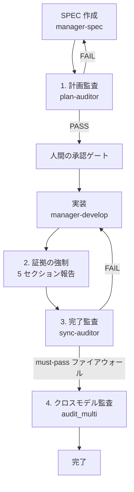

<p align="center">
  
</p>

<h1 align="center">MoAI-ADK</h1>

<p align="center">
  <strong>コードを書くエージェントと、そのコードを判定するエージェントを切り離す Claude Code ハーネス</strong>
</p>

<p align="center">
  <a href="./README.md">English</a> ·
  <a href="./README.ko.md">한국어</a> ·
  日本語 ·
  <a href="./README.zh.md">中文</a>
</p>

<p align="center">
  <a href="https://book.mo.ai.kr" target="_blank"><strong>公式書籍: Claude Code による実践エージェンティックコーディング</strong></a><br>
  MoAI-ADK 作者によるハーネスエンジニアリング実践ガイド — <a href="https://book.mo.ai.kr" target="_blank">book.mo.ai.kr</a>
</p>

<p align="center">
  <a href="https://github.com/modu-ai/moai-adk/actions/workflows/ci.yml"></a>
  <a href="https://github.com/modu-ai/moai-adk/actions/workflows/codeql.yml"></a>
  <a href="https://codecov.io/gh/modu-ai/moai-adk"></a>
  <br>
  <a href="https://go.dev/"></a>
  <a href="https://github.com/modu-ai/moai-adk/releases"></a>
  <a href="./LICENSE"></a>
</p>

<p align="center">
  <a href="https://adk.mo.ai.kr/ja"><strong>公式ドキュメント</strong></a> ·
  <a href="https://adk.mo.ai.kr/ja/getting-started">はじめに</a> ·
  <a href="https://adk.mo.ai.kr/book">書籍</a>
</p>

---

> **「エージェントにコードを書かせることは、もう難しくない。難しいのは、そのコードを良しと言ったのが誰かということだ。」**

---

## エージェントは自分の答案を自分で採点する

エージェントに機能をひとつ任せれば、コードが返ってくる。テストも一緒に返ってきて、最後に「テストは通りました」という一文が付く。

その一文は **主張であって事実ではない。** コードを書いた主体と、そのコードを良しと判定した主体が同一だからだ。試験を受けた本人が自分の答案を採点し、その採点を検証する者は誰もいない。

ここに二つ目の問題が重なる。言語モデルは構造的に **同意する側へ傾いている。** MoAI-ADK がすべての監査エージェントに課している規律は、この偏りを名指しする。

> 同意に抗え。RLHF の訓練勾配は迎合へ偏るため、根拠を示さずに PASS したいという衝動は、判定ではなく迎合のシグナルとして扱え。
>
> — `.claude/rules/moai/core/agent-common-protocol.md`

自己採点と同意バイアスが重なれば、結果はひとつに決まる。**通ったという報告は、実際に通った件数より常に多くなる。**

バイブコーディングはこの問題を速度で覆い隠す。成果物が速く出てくるため、検証の薄さが見えにくい。MoAI-ADK は逆の方向を選んだ。速度を少し譲り、**判定する主体を書く主体から切り離す。**

## 書く側と判定する側を分ける

反論しにくいのはこの一点だ。

> **あるエージェントが自分の作業を検証したという主張は、その主張を検証する別の主体がいなければ検証ではない。**

これはモデルの性能問題ではなく構造の問題だ。だから「私たちのモデルは正直です」では答えにならない。より良いモデルを使えば自己採点の精度は上がるが、自己採点であるという事実は変わらない。判定主体を分けない限り残り続ける。

MoAI-ADK は、SPEC を書くエージェント、実装するエージェント、計画を監査するエージェント、完了を監査するエージェントをそれぞれ別に置く。監査役は実装者の報告を読まない。コマンドを自分で実行し、その出力を見る。

## 四重のクロスチェック

ひとつの作業が完了と認められるには、判定主体の異なる四つの関門を通る必要がある。


```mermaid
flowchart TD
    A[SPEC 作成<br/>manager-spec] --> B[1. 計画監査<br/>plan-auditor]
    B -->|PASS| C[人間の承認ゲート]
    C --> D[実装<br/>manager-develop]
    D --> E[2. 証拠の強制<br/>5 セクション報告]
    E --> F[3. 完了監査<br/>sync-auditor]
    F -->|must-pass ファイアウォール| G[4. クロスモデル監査<br/>audit_multi]
    G --> H[完了]
    B -->|FAIL| A
    F -->|FAIL| D
```

### 1. 計画監査 — コードを書く前に

`plan-auditor` が SPEC 文書を敵対的な視点で審査する。基準は規模に応じて変わる — Tier S は 0.75、M は 0.80、L は 0.85。

肝心なのは採点の仕方だ。

- **次元ごとに独立して採点する。** ある領域の PASS が別の領域の FAIL を相殺しない。
- **根拠のない PASS は自動的に降格する。** 証拠を示せない PASS 判定は UNVERIFIED に下がり、must-pass 基準では FAIL として数えられる。
- **点数が下がれば止まる。** 再監査で前回より点数が下がった場合、無限に繰り返す代わりに STOP を出し、範囲の縮小を人間に問う。

計画段階で取り除いた欠陥は、実装段階で取り除く同じ欠陥よりはるかに安い。

### 2. 証拠の強制 — 見ていないものを書かせる

検証を報告する際、五つのセクションを埋める必要がある。

| セクション | 内容 |
|---|---|
| Claim | 何を主張するのか |
| Evidence | 実際に実行したコマンドと **その出力そのもの**（要約は不可） |
| Baseline-attribution | 何に対して測定したのか |
| **Gaps** | 検証**していない**もの |
| Residual-risk | 検証してもなお残るリスク |

四番目のセクションがこの形式の要だ。見ていないものを明示的に書かせれば、検証していない項目が通ったかのように静かに通過することはできない。

同じ規律が逆方向にも働く。欠陥が **ある** という主張もツールで確認しなければならない。テキストパターンから推論した欠陥は仮説であって欠陥ではない。

詳細: [検証主張の整合性](https://adk.mo.ai.kr/ja/core-concepts/verification-claim-integrity)

### 3. 完了監査 — 平均では覆えない

`sync-auditor` が実装結果を四つの次元で採点する。Functionality 40%、Security 25%、Craft 20%、Consistency 15%。

この関門を他と分けているのは二点だ。

- **must-pass ファイアウォール。** Functionality と Security はそれぞれ独立に通過しなければならない。どちらかが落ちれば、他の点数に関わらず全体 FAIL となる。
- **算術平均ではなく調和平均。** ひとつの次元が低ければ全体が引きずり下ろされる。得意な領域で不得意な領域を覆うことはできない。

監査役は実装者の報告を信用しない。テストランナーを自分で走らせ、その出力を SPEC の受け入れ基準表と突き合わせる。

### 4. クロスモデル監査 — 別ベンダーのモデルに聞く

同系統のモデルが同じ偏りを共有しているなら、その系統の内部でいくら分割しても偏りは濾し取れない。`audit_multi` は Claude・codex・GLM に **それぞれ独立して** 判定させ、結果を収束させる。判定が割れた場合は、その不一致自体を表に出す。

いずれかのバックエンドが使えなくても監査は進む。応答のないバックエンドは `inconclusive` を返すだけで、エラーにはならない。

### この四重を支えるもの

クロスチェックはただではない。判定主体を増やせばトークンを多く使い、セッションも長くなる。以下はそのコストを負担可能にする基盤だ。

| | |
|---|---|
| **コスト管理** | 役割ごとのモデル・推論強度ルーティングとコンテキスト予算管理。監査層を増やしてもコストが線形に増えないようにする |
| **16 言語** | Go・Python・TypeScript・Rust・Java など 16 言語を対等に検出し、各言語の標準 lint・test ツールで監査する |
| **セッション継続性** | コンテキスト上限に達すると、貼り付け可能な再開メッセージを生成し、次のセッションが同じ地点から引き継ぐ |
| **並列の安全性** | エージェントごとに隔離された git ワークツリーで作業するため、同時に動く判定主体が互いの作業ツリーを上書きしない |

## エージェント同士はどう通信するのか

クロスチェックが実際に機能するには、判定主体が別々の文脈に存在しなければならない。同じ会話の中にいると、先行する主張に染まるからだ。

カンバンモードは各段階を **独立したセッション** として立ち上げる。リードセッションがカードを六つのカラム（`backlog → plan → run → review → sync → done`）へ移し、各カラムを担当する伴走セッションにメッセージで作業を指示する。

リードが守る規律がひとつある。

> **リードは報告を信じてカードを動かさない。根拠を自分で読んで動かす。**

伴走セッションが「終わりました」と答えても、それだけではカードは動かない。リードはその段階が残した証拠ファイルを読み、読めない場合や古い場合はカードをその場に留め、理由を報告する。失敗のシグナルがないことは、通過した証拠ではない。

さらに大規模な作業では、`manager-kanban` が受け入れ基準ごとの PASS 主張に対して他エージェントによるクロス検証を発動する。

そして、どんな点数も人間を飛び越えない。実装着手前の承認ゲートは、監査の点数がいくら高くても迂回されない。

詳細: [カンバンモード](https://adk.mo.ai.kr/ja/advanced/kanban-mode)

## 何が変わるのか

| | Claude Code 単体 | 一般的なハーネス | MoAI-ADK |
|---|---|---|---|
| コード生成 | 可能 | 可能 | 可能 |
| 品質を判定する主体 | 作成者本人 | 作成者本人 | **分離された監査役** |
| 計画段階の審査 | なし | ほぼなし | Tier 別のしきい値 |
| 証拠の要求 | なし | 規約次第 | 5 セクション、Gaps 必須 |
| 未検証 PASS の扱い | 通過 | 通過 | **FAIL へ降格** |
| 次元間の相殺 | 該当なし | 平均で覆われる | **must-pass ファイアウォール** |
| 別系統モデルによる検証 | なし | まれ | claude + codex + GLM の収束 |
| 判定主体の文脈 | 共有 | ほぼ共有 | セッション・ワークツリーで分離 |

MoAI-ADK は Claude Code を置き換えない。Claude Code が利用者に委ねている部分 — 判定主体の分離、証拠の規約、監査ゲート、セッション継続性 — を構造で埋める。Go で書かれた単一バイナリで、macOS・Linux・Windows 上で追加の依存なしに動く。

## はじめる

### インストール

```bash
# macOS / Linux / WSL
curl -fsSL https://adk.mo.ai.kr/install.sh | bash
```

```powershell
# Windows (PowerShell 7.x+)
irm https://adk.mo.ai.kr/install.ps1 | iex
```

```bash
# ソースからビルド (Go 1.26+)
git clone https://github.com/modu-ai/moai-adk.git
cd moai-adk && make build
```

### 最初のプロジェクト

```bash
moai init my-project
```

対話ウィザードが言語・フレームワーク・方法論を自動検出し、モデルポリシーを選び、Claude Code 連携ファイルを生成する。

### 最初のワークフロー

```bash
claude        # プロジェクト内で Claude Code を起動
```

```text
/moai plan "JWT ログインを追加"   # SPEC 作成 → 計画監査
/moai run SPEC-AUTH-001           # TDD/DDD 実装 → 証拠の記録
/moai sync SPEC-AUTH-001          # 完了監査 → ドキュメント同期 → PR
```

自然言語でも動く。`/moai "ログインのバグを直して"` と書けば、意図を解析して適切なワークフローへ振り分ける。

### 必要なもの

- **Git** — すべてのプラットフォームで必須
- **Claude Code** — MoAI-ADK は Claude Code を包むハーネスである
- 推奨: `gh` CLI（PR 自動化）· `tmux`（CG モード）· プロジェクト言語の lint・test ツール

Windows では **WSL の利用を推奨**する。PowerShell 7.x 以降もサポートするが、ネイティブの `cmd.exe` はサポートしない。

詳細: [インストールガイド](https://adk.mo.ai.kr/ja/getting-started) · [クイックスタート](https://adk.mo.ai.kr/ja/getting-started/quickstart)

## ドキュメント

全ドキュメントは [adk.mo.ai.kr](https://adk.mo.ai.kr/ja) にある。

| 何を探しているか | ドキュメント |
|---|---|
| MoAI-ADK とは何か、なぜこう設計したのか | [コアコンセプト](https://adk.mo.ai.kr/ja/core-concepts) |
| インストールから最初の SPEC まで | [はじめに](https://adk.mo.ai.kr/ja/getting-started) |
| `plan` · `run` · `sync` の 3 段階パイプライン | [ワークフローコマンド](https://adk.mo.ai.kr/ja/workflow-commands) |
| `review` · `gate` · `fix` などその他のコマンド | [ユーティリティコマンド](https://adk.mo.ai.kr/ja/utility-commands) |
| すべての CLI フラグとオプション | [CLI リファレンス](https://adk.mo.ai.kr/ja/cli-reference) |
| 並列作業のためのワークツリー隔離 | [ワークツリー](https://adk.mo.ai.kr/ja/worktree) |
| トークンコストを下げる方法 | [コスト最適化](https://adk.mo.ai.kr/ja/cost-optimization) |
| Claude と GLM を併用する | [マルチ LLM](https://adk.mo.ai.kr/ja/multi-llm) |
| エージェント・フック・設定のカスタマイズ | [応用](https://adk.mo.ai.kr/ja/advanced) |
| 実践シナリオ別の例 | [ガイド](https://adk.mo.ai.kr/ja/guides) |
| Claude Code 自体の機能 | [Claude Code](https://adk.mo.ai.kr/ja/claude-code) |
| バージョンごとの変更点 | [変更履歴](https://adk.mo.ai.kr/ja/changelog) |
| 外部資料とリンク集 | [リソース](https://adk.mo.ai.kr/ja/resources) |

## 一緒に作る

Issue と PR を歓迎する。貢献方法は [コントリビューションガイド](https://adk.mo.ai.kr/ja/contributing) にまとめてある。

- **バグ報告・機能提案** — [GitHub Issues](https://github.com/modu-ai/moai-adk/issues)
- **セッション内から報告** — `/moai feedback`
- **ライセンス** — [Apache-2.0](./LICENSE)

## Star History

<a href="https://star-history.com/#modu-ai/moai-adk&Date">
  
</a>
