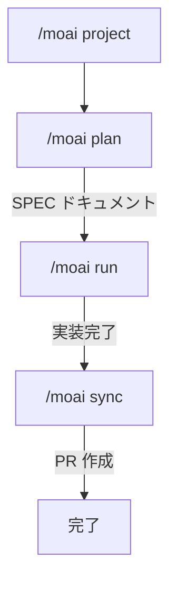
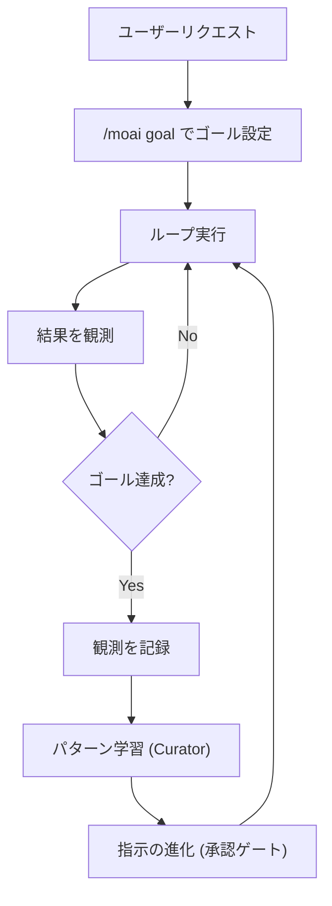
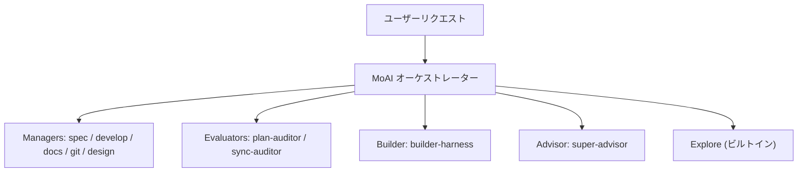
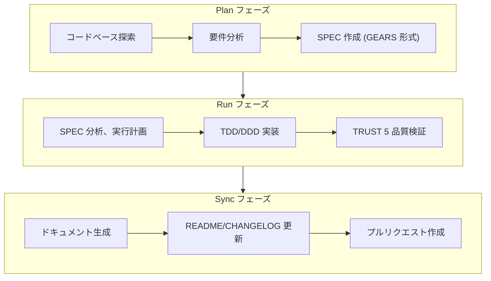
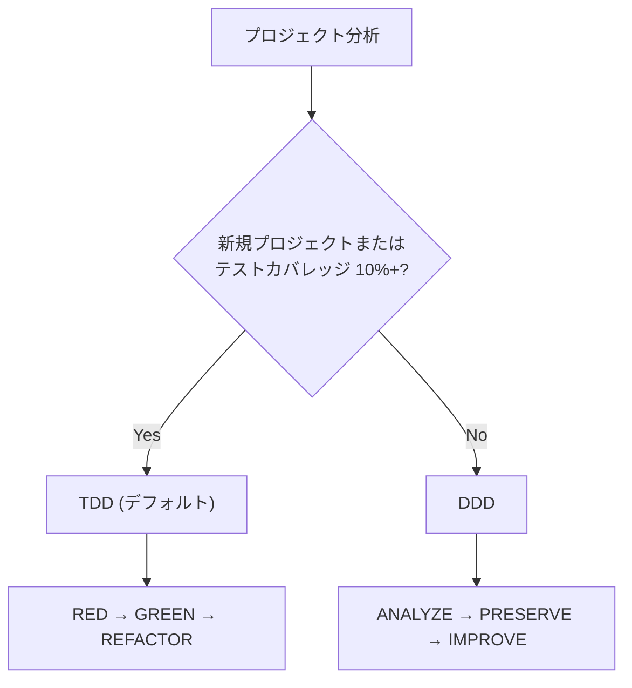

<p align="center">
  
</p>

<h1 align="center">MoAI-ADK</h1>

<p align="center">
  <strong>トークノミクスのために設計されたエージェンティック開発キット</strong>
</p>

<p align="center">
  <a href="./README.md">English</a> ·
  <a href="./README.ko.md">한국어</a> ·
  日本語 ·
  <a href="./README.zh.md">中文</a>
</p>

<p align="center">
  <a href="https://github.com/modu-ai/moai-adk/actions/workflows/ci.yml"></a>
  <a href="https://github.com/modu-ai/moai-adk/actions/workflows/codeql.yml"></a>
  <a href="https://codecov.io/gh/modu-ai/moai-adk"></a>
  <br>
  <a href="https://go.dev/"></a>
  <a href="https://github.com/modu-ai/moai-adk/releases"></a>
  <a href="./LICENSE"></a>
</p>

<p align="center">
  <a href="https://adk.mo.ai.kr"><strong>公式ドキュメント</strong></a> ·
  <a href="https://adk.mo.ai.kr/book">書籍: Claude Code 実践エージェンティックコーディング</a> ·
  <a href="https://discord.gg/Z7E7Mdc5aN">Discord</a>
</p>

---

> **「バイブコーディングの目的は、素早い生産性ではなくコード品質である。」**

MoAI-ADK (Agentic Development Kit) は、**トークノミクス** (Token Economics) を北極星とするエージェンティック開発キットです。より少ないトークンで同じコード品質を、同じトークンでより高い品質を実現します。モデル選択・推論の深さ・コンテキスト使用は、運任せではなくシステムが管理します。

Go で書かれた単一バイナリ。macOS・Linux・Windows で依存関係ゼロ、即座に動作します。

---

## なぜトークノミクスか

トークン価格は下がり続けていますが、エージェンティック開発は価格の下落より速くトークンを消費します。より多くのエージェントが並列で動き、コンテキストは長くなり、推論は深くなる — つまり実際のコストを決めるのは**モデルの価格表ではなく、トークンをどう運用するか**です。

MoAI-ADK の答えは 3 つの要素からなります:

1. **各タスクに適切なモデルと推論の深さを割り当てる** — 計画は深く、実装は安く、検証は独立して。
2. **コンテキストをダイエットする** — 常時ロードされる指示を最小化し、プロンプトキャッシュのヒット率を計測する。
3. **システムに予算を守らせる** — エージェントごとのトークン使用量を追跡し、上限に達する前に優雅に停止する。クラッシュの途中で止まることは決してない。

---

## 3 つの柱

### 柱 1 — トークノミクス (Token Economics)

ドルあたりの品質を最大化するインテリジェントなリソース配分。No-Haiku 3 ティアモデルポリシー (max / medium / low)、プラン対応ティアプロファイル (API 従量課金 vs. サブスクリプションプラン)、Claude × GLM ハイブリッド (CG モード、実装中心の作業で 60-70% のコスト削減)、そして予算超過の前に優雅に中断する Token Circuit Breaker。

### 柱 2 — 再帰的自己学習

ループが観測を蓄積し、ハーネスが学習し、指示が進化します。Routing Observation Ledger がルーティング決定を記録し、Curator がそれを改善提案に変換し、4 ティア学習ラダー (観測 → ヒューリスティック → ルール → 自動更新) がハーネスをアップグレードします — 常にユーザー承認ゲートの背後で。

### 柱 3 — エージェンティックハーネス

コードを直接書く代わりに、エージェントがうまく働ける環境を設計します: 11 エージェントカタログ、SPEC ベースの 3 フェーズワークフロー (plan → run → sync)、TRUST 5 品質ゲート、そして自然言語のリクエストからプロジェクト固有のハーネスを生成する Harness v4 Builder。

---

## 数字で見る v3

v2.14.0 (2026-04-24) から v3.0.0-rc11 (2026-07-13) まで — **80 日間**:

- 2 つのタグ間で **2,373 コミット** — feat 727 · docs 517 · fix 240
- **9 つのリリース候補** (rc1 → rc11)
- エージェントカタログを **22 → 10** に統合 (エージェントを減らし、委譲を安く)
- `.moai/specs/` 配下で spec ファースト開発を駆動する **480+ の SPEC ドキュメント**
- **27** のテンプレート管理 `moai-*` スキル · **36** のトップレベル CLI コマンド · **16** のプログラミング言語をサポート

---

## クイックスタート

### 1. インストール

#### macOS / Linux / WSL

```bash
curl -fsSL https://raw.githubusercontent.com/modu-ai/moai-adk/main/install.sh | bash
```

#### Windows (PowerShell 7.x+)

> **推奨**: 最良の体験のため、上記の Linux インストールコマンドで WSL を使用してください。

```powershell
irm https://raw.githubusercontent.com/modu-ai/moai-adk/main/install.ps1 | iex
```

> 先に [Git for Windows](https://gitforwindows.org/) のインストールが必要です。

#### ソースからビルド (Go 1.26+)

```bash
git clone https://github.com/modu-ai/moai-adk.git
cd moai-adk && make build
```

> ビルド済みバイナリは [Releases](https://github.com/modu-ai/moai-adk/releases) ページで入手できます。

### 2. プロジェクトの初期化

```bash
moai init my-project
```

対話式ウィザードが言語・フレームワーク・方法論を自動検出し、モデルポリシーを選択して、Claude Code 統合ファイルを生成します。

### 3. Claude Code で開発を開始

```bash
claude        # プロジェクト内で Claude Code を起動
```

```text
/moai plan "Add JWT login"      # SPEC を作成
/moai run SPEC-AUTH-001         # TDD/DDD 実装
/moai sync SPEC-AUTH-001        # ドキュメント同期 + PR 作成
```

自然言語で頼むだけでも構いません — `/moai "fix the login bug"` は意図分析 (Analyze-First ルーティング) を通り、どの会話言語でも適切なワークフローに着地します。


```mermaid
flowchart TD
    A["/moai project"] --> B["/moai plan"]
    B -->|"SPEC ドキュメント"| C["/moai run"]
    C -->|"実装完了"| D["/moai sync"]
    D -->|"PR 作成"| E["完了"]
```

### 4. Windows 注意事項: 非 ASCII ユーザー名パス

Windows のユーザー名に非 ASCII 文字 (日本語・韓国語・中国語など) が含まれる場合、Windows の 8.3 短縮ファイル名変換に起因する `EINVAL` エラーに遭遇することがあります。回避策:

```powershell
# Option 1: point MoAI at an ASCII-only temp directory
$env:MOAI_TEMP_DIR="C:\temp"
New-Item -ItemType Directory -Path "C:\temp" -Force

# Option 2: disable 8.3 filename generation (requires admin)
fsutil 8dot3name set 1
```

3 つ目の選択肢は、ASCII のみのユーザー名で Windows アカウントを作成することです。

---

## システム要件

| プラットフォーム | サポート環境 | 備考 |
|----------|----------------------|-------|
| macOS | Terminal, iTerm2 | 完全サポート |
| Linux | Bash, Zsh | 完全サポート |
| Windows | **WSL (推奨)**, PowerShell 7.x+ | ネイティブ cmd.exe は非サポート |

**前提条件:**

- **Git** — すべてのプラットフォームでインストール必須
- **Claude Code** — MoAI-ADK は Claude Code のためのハーネスです
- **Windows ユーザー**: [Git for Windows](https://gitforwindows.org/) が**必須** (Git Bash を含む)。レガシーの Windows PowerShell 5.x と cmd.exe は**非サポート**
- **推奨**: `gh` CLI (PR 自動化) · `tmux` (CG モード) · 使用言語の lint/test ツールチェーン (例: `golangci-lint`)

---

## ビジュアルアイデンティティ — マスコットテーマ

ドキュメントサイト([adk.mo.ai.kr](https://adk.mo.ai.kr))と `moai web` コンソールは、모두의AI のキャラクターマスコット(MascotCoding / MascotTalking / MascotBubble)から派生した **マスコットグリーン** テーマ(`#3d7d5f`)を共有します。マスコットはヒーロー、404ページ、セクション区切りで感情的なアンカーとして登場します。

---

## 設計の系譜 — ハーネスエンジニアリング

MoAI-ADK は、Lilian Weng の [**Harness Engineering for Self-Improvement**](https://lilianweng.github.io/posts/2026-07-04-harness/) (2026-07-04) で示されたハーネスエンジニアリングのフレームワークを意図的に継承し、その設計パターンと自己改善ループを動作する実装へと翻訳しています。

> **ハーネスとは何か?** — 「ハーネスとは、ベースモデルを取り巻くシステムであり、実行をオーケストレートし、モデルがどう考え計画するか、どうツールを呼び行動するか、どう知覚しコンテキストを管理するか、どう成果物を保存するか、どう結果を評価するかを決定するものである。」 — Lilian Weng (2026-07-04)

Weng は、再帰的自己改善 (RSI) への短期的な道は「モデルが自身の重みを編集すること」ではなく、**トレーニングパイプラインとデプロイメントシステム — つまりハーネス — を改善すること**だと予測しました。MoAI-ADK はまさにこの道を進みます: モデルの重みではなく、ハーネス (スキルとエージェント指示) を再帰的に改善します。

### 継承マップ — Weng のフレームワークから MoAI-ADK へ

| Lilian Weng のハーネス概念 | MoAI-ADK の実装 |
|---|---|
| **Harness** — ベースモデルを取り巻く実行/運用レイヤー | MoAI-ADK = Claude Code ハーネス (単一 Go バイナリ + CLAUDE.md オーケストレーター) |
| **Pattern 1: Workflow Automation** — plan → execute → observe → improve のゴールループ | `/moai goal` エンジン、`/moai loop` Ralph Engine、Analyze-First ルーティング |
| **Pattern 2: File-System Persistent Memory** — 「ファイルに永続化された状態」 | `.moai/specs/`、`progress.md`、`usage-log.jsonl`、`.moai/state/`、セッションハンドオフ |
| **Pattern 3: Sub-agents & Backend Jobs** — 並列性を明示的かつ検査可能にする | 11 の保持エージェント、`Agent()` スポーン、動的ワークフロー |
| **Self-Harness** — propose-evaluate-accept、境界付き編集 + 回帰ゲート | `internal/harness/` 4 ティアラダー + 5 レイヤー安全パイプライン (applier = 境界付き編集、回帰ゲート = 検証) |
| **Meta-Harness** — 「ハーネスを最適化するハーネス」 | `builder-harness` — ハーネスがハーネスを構築、`/moai project` が自動生成 |
| **「Improve the improver」** — RSI の短期的な道はデプロイメントシステムの改善 | 再帰的ハーネス進化 — ループが観測を蓄積し、ハーネスが自身のスキル/エージェント指示をアップグレード |
| **「評価者と権限はループの外に置く」** — 報酬ハッキング防御 | Layer-5 ユーザー承認ゲート + 実装着手承認 — 人間の監督は進化ループの外に位置する |
| **「人間はスタックの上位へ移るのであり、ループの外に出るのではない」** | オーケストレーターが人間との唯一の接点、AskUserQuestion によるゲート付き決定と SPEC 承認ゲート |

> Weng の警告は忠実に守られています: 評価者と権限制御はハーネス進化ループの**外**に留まらなければなりません。MoAI-ADK は Tier-4 自動更新をユーザー承認ゲートに紐付けているため、自動化された進化が人間の監督なしの閉ループとして動くことは決してありません。

---

## トークノミクス詳説

### No-Haiku 3 ティアモデルポリシー

モデルと推論の深さ (effort) は、作業フェーズと SPEC サイズ (Tier S/M/L) によって宣言的に割り当てられます。ポリシーティアは閉集合 — `max`、`medium`、`low` — を形成し、`internal/config/model_routing.go` の HARD lint ルールで検証されます (閉集合: effort `low/medium/high/xhigh/max`、tier `S/M/L`、phase `plan/run/sync`)。

| ポリシー | 対象プラン | 特徴 |
|--------|-------------|-----------|
| **max** | Max $200/月 | 最高品質 — 計画と監査に Opus クラスのモデル |
| **medium** | Max $100/月 | 品質とコストのバランス |
| **low** | Plus $20/月 | Opus アクセスなし — Sonnet 中心のルーティング |

「No-Haiku」という名前は、品質クリティカルなフェーズを最安モデルにルーティングすることから離れた v3 の転換を示します: 安価なモデルは安全な場所でのみ使われ、独立した判断が必要な場所では決して使われません。

### プラン対応ティアプロファイル (plan_type)

同じワークフローでも、**API 従量課金とサブスクリプションプラン**では最適な配分が異なります。プラン対応プロファイルは、課金プランごとに独立した Tier × Phase のモデル/effort マトリクスを適用し、GLM バックエンドには effort オーバーレイを重ねます。

### Claude × GLM ハイブリッド (CG モード)

`moai cg` は Claude リーダーと GLM ワーカーを走らせます: 戦略・計画・監査は Claude API に留め、大量の実装は GLM に任せます。実装中心の作業ではコストを **60-70%** 削減します。

MoAI-ADK は Claude Code の代替バックエンドとして **z.ai GLM** をサポートします — コード変更は不要です。

| 項目 | 詳細 |
|------|---------|
| GLM Coding Plan | **$10/月**から ([z.ai](https://z.ai/subscribe?ic=1NDV03BGWU)) |
| 互換性 | Claude Code でそのまま動作 |
| モデル | glm-5.2[1m]、glm-4.7、glm-4.5-air、および無料モデル |

**デフォルトのモデルマッピング:**

| Claude ティア | GLM モデル | 入力 (100 万トークンあたり) | 出力 (100 万トークンあたり) |
|-------------|-----------|----------------------|------------------------|
| Opus / Sonnet / Haiku / Fable | glm-5.2[1m] | $2.00 | $8.00 |

> Claude の 4 ティアすべてが、単一の 1M コンテキストモデル `glm-5.2[1m]` に統一されています。1M コンテキストモデルと 200K コンテキストモデルをティアスロット間で混在させると、エージェントスポーンのセッション共有が壊れます — 1M コンテキストセッションと 200K コンテキストセッションは共有できません。

> `[1m]` サフィックスは Claude Code の 1M トークンコンテキストモードを有効化します。Claude Code はサフィックスをパースして除去してから上流の z.ai API を呼び出します。マッピングは 4 つの `ANTHROPIC_DEFAULT_*_MODEL` 環境変数 (`OPUS`/`SONNET`/`HAIKU`/`FABLE`、最後のものは Claude Code v2.1.202 から公式サポート) で実装され、すべて `glm-5.2` に設定されます。

**モード比較:**

| コマンド | リーダー | ワーカー | tmux | コスト削減 | 適した用途 |
|---------|--------|---------|------|--------------|----------|
| `moai cc` | Claude | Claude | 不要 | — | 複雑な作業、最高品質 |
| `moai glm` | GLM | GLM | 推奨 | ~70% | 最大のコスト削減 |
| `moai cg` | Claude | GLM | **必須** | **~60%** | 品質とコストのバランス |

**CG モードの実践:**

```bash
# 1. Save your GLM API key (once)
moai glm sk-your-glm-api-key

# 2. Make sure you are inside tmux (skip if already there)
tmux new -s moai

# 3. Launch CG mode (starts Claude Code automatically)
moai cg
```

CG モードは、tmux セッションレベルの環境変数によってリーダーをワーカーから隔離します: GLM 設定は tmux セッション env に注入され (ワーカーは新しいペインでそれを継承)、`settings.local.json` からは除去されます (リーダーペインは Claude API に留まる)。セッション終了フックが tmux env を自動的にクリアします。

### Token Circuit Breaker

`internal/runtime/budget.go` は警告優先ポリシーでエージェントごとのトークン使用量を追跡します: 使用量が増えるにつれ警告し、ハード閾値で**優雅な中断** (進捗保存 + ハンドオフメッセージ出力) を実行します。セッションを自動的にクリアすることは決してありません。

### コンテキストダイエット + プロンプトキャッシング

- 常時ロードコンテキストの予算ガード — スリム化された CLAUDE.md とパススコープ付きルールファイルが、ターンごとの固定コストを抑える
- **キャッシュヒット率**のステータスラインセグメントが、ダイエットの効果をリアルタイムで計測可能にする
- 検証出力はファイルリダイレクト契約に乗る — 長いログはディスクへ、コンテキストには終了コードと境界付き末尾のみ

---

## 再帰的自己学習

MoAI-ADK のコアイノベーションは、エージェントが自身の運用から学習する再帰的システムです。2 つの動きで構成されます: 観測を蓄積するループと、そこから進化するハーネス。


```mermaid
flowchart TD
    A["ユーザーリクエスト"] --> B["/moai goal でゴール設定"]
    B --> C["ループ実行"]
    C --> D["結果を観測"]
    D --> E{"ゴール達成?"}
    E -->|"No"| C
    E -->|"Yes"| F["観測を記録"]
    F --> G["パターン学習 (Curator)"]
    G --> H["指示の進化 (承認ゲート)"]
    H --> C
```

### 自己進化するハーネス

```
loop runs → observations accumulate (Routing Ledger) → patterns learned (Curator) → instructions evolve (approval gate)
```

- **Routing Observation Ledger** (`internal/harness/routing/`) — ルーティング決定とゲート証拠をプライバシー保護ダイジェストとして記録
- **4 ティア学習ラダー** (`internal/harness/learner.go`) — 観測 (≥1) → ヒューリスティック (≥3) → ルール (≥5) → 自動更新 (≥10、ユーザー承認必須)、信頼度フロア 0.70
- **5 レイヤー安全パイプライン** — observer (`internal/harness/observer.go`) → learner → applier (`internal/harness/applier.go`、スナップショット優先の境界付き編集) → config/marker アップデーター → ユーザー承認ゲート。すべての適用は `moai harness rollback` で可逆
- 成果物は `.moai/harness/` 配下に保存 (`usage-log.jsonl`、学習済みルール)

```bash
moai harness status      # learning state: observations, patterns, proposals
moai harness apply       # apply a proposal (passes the user approval gate)
moai harness rollback    # revert the last application
moai harness disable     # turn learning off
```

### /moai goal — 宣言的エージェンティックループ

完了条件を宣言すると、条件が成立するかターン上限 (デフォルト 30) に達するまでセッションが働き続けます。`internal/goal/` に、セッションごとのゴール状態 (`.moai/state/goal/<session-id>.json`) とハイブリッド 2 ティア Stop フック評価器として実装されています — Tier 1 は機械的チェック (終了コード、grep カウント、ファイル存在、ターン上限)、Tier 2 はチェックポイント経由のオーケストレーター自己評価です。

```text
/moai goal "go test ./... exits 0 and every AC is recorded as PASS"
/moai goal status
/moai goal clear
```

### /moai loop vs /moai fix — 診断的自己修復

`/moai loop` は Ralph Engine (`internal/ralph/engine.go`) 上に構築されたゴールエンジンプリセットです: LSP 診断 + AST-grep + リンターで並列スキャンし、所見を Level 1 (自動修正可能) から Level 4 (人間が必要) に分類し、キューが空になるまで反復します — 同じエラーが繰り返されると戦略を切り替える収束検出と、セーフティストップとしてのハード反復上限付きです。

| コマンド | ゴール | 実行 | 使いどころ |
|---------|------|-----------|-------------|
| `/moai fix` | シングルパス修復 | スキャン→分類→修正→検証を 1 パス | 明確なエラー、素早い修正 |
| `/moai loop` | 完了まで反復 | 診断 → 分類 → 修正 → 検証のループ | 複合エラー、根本原因の修復 |

### Analyze-First ルーティング

言語に依存しない意図分析が `/moai` のデフォルトルーティングです。リクエストは意味で分類され — 英語キーワードマッチングでゲートされることは決してなく — どの会話言語でも動作します:

1. 意図分析 (言語非依存の分類)
2. コンテキスト充足チェック (コンテキスト不足時はソクラテス式インタビューが起動)
3. 実行計画の構成 (スキル / エージェント / 動的ワークフローのチェーン)
4. オーケストレーションモード選択 (solo-sequential / parallel-subagents / dynamic-workflow)

### セッションハンドオフ自動再開

コンテキストウィンドウの閾値 (1M コンテキストモデルで 50%、200K モデルで 90%) に達すると、MoAI はペースト可能な再開メッセージ — 進捗状態、適用済みレッスン、検証可能な前提条件を含む — を出力します。`/clear` 後にペースト 1 回で次のセッションが継続できます。

---

## エージェンティックハーネス

コードを直接書く代わりに、エージェントが働く環境を構築します。

### 11 エージェントカタログ

11 の保持エージェント: 10 の MoAI カスタムと Anthropic ビルトインの `Explore`。

| カテゴリ | エージェント | 役割 |
|----------|-------|------|
| **Manager** | manager-spec | Plan フェーズの SPEC 作成 |
| | manager-develop | Run フェーズの TDD/DDD/autofix 実装 |
| | manager-docs | Sync フェーズのドキュメント |
| | manager-git | PR 作成とルーティング |
| | manager-design | Design フェーズの協業 (Claude Design) |
| **Evaluator** | plan-auditor | 独立した計画監査 (バイアス防止) |
| | sync-auditor | 4 次元品質スコアリング (Functionality 40 · Security 25 · Craft 20 · Consistency 15) |
| **Builder** | builder-harness | プロジェクト固有のエージェント・スキル・コマンド・フックをスキャフォールド |
| **Advisor** | super-advisor | オンデマンドの高推論コンサルテーション (E1-E4 エスカレーション) |
| **Specialist** | e2e-tester | Web・モバイル・デスクトップの E2E テスト実行 (CLI 優先) |
| **Built-in** | Explore | 読み取り専用のコードベース探索 |

計画と監査は設計上分離されています — 作成者が自分の仕事を採点することはありません。


```mermaid
flowchart TD
    U["ユーザーリクエスト"] --> M["MoAI オーケストレーター"]
    M --> MG1["Managers: spec / develop / docs / git / design"]
    M --> EV["Evaluators: plan-auditor / sync-auditor"]
    M --> BD["Builder: builder-harness"]
    M --> AD["Advisor: super-advisor"]
    M --> EX["Explore (ビルトイン)"]
```

### SPEC 3 フェーズライフサイクル

```
/moai plan → [plan-auditor audit] → Implementation Kickoff Approval (human gate) → /moai run → /moai sync → [sync-auditor scoring]
```

- ライフサイクルは厳密に 3 フェーズ — **plan → run → sync**
- Tier S/M/L のサイズ分類が検証の深さと PR ルーティングを決定
- GEARS 形式の要件と受け入れ基準 (AC) — 完了は「できたように見える」ではなく証拠で判定


```mermaid
flowchart TB
    subgraph Plan ["Plan フェーズ"]
        P1["コードベース探索"] --> P2["要件分析"]
        P2 --> P3["SPEC 作成 (GEARS 形式)"]
    end

    subgraph Run ["Run フェーズ"]
        R1["SPEC 分析、実行計画"] --> R2["TDD/DDD 実装"]
        R2 --> R3["TRUST 5 品質検証"]
    end

    subgraph Sync ["Sync フェーズ"]
        S1["ドキュメント生成"] --> S2["README/CHANGELOG 更新"]
        S2 --> S3["プルリクエスト作成"]
    end

    Plan --> Run
    Run --> Sync
```

### 開発方法論 — TDD と DDD

MoAI-ADK は `moai init` 時にプロジェクトの状態から方法論を選択します (`--mode <ddd|tdd>`、デフォルト: tdd)。後から `.moai/config/sections/quality.yaml` の `development_mode` で変更できます。


```mermaid
flowchart TD
    A["プロジェクト分析"] --> B{"新規プロジェクトまたは<br/>テストカバレッジ 10%+?"}
    B -->|"Yes"| C["TDD (デフォルト)"]
    B -->|"No"| D["DDD"]
    C --> F["RED → GREEN → REFACTOR"]
    D --> G["ANALYZE → PRESERVE → IMPROVE"]
```

| 方法論 | サイクル | 対象 |
|-------------|-------|-----|
| **TDD** (デフォルト) | RED (失敗するテスト) → GREEN (最小限の合格) → REFACTOR (グリーンテスト下での品質向上) | 新規プロジェクトと機能開発 |
| **DDD** | ANALYZE (依存関係、ドメイン境界) → PRESERVE (特性テスト) → IMPROVE (テスト保護下での漸進的変更) | カバレッジ 10% 未満の既存コード |

### TRUST 5 品質ゲート

すべてのコード変更は 5 つの基準で検証されます:

| 基準 | 意味 | 検証 |
|-----------|---------|------------|
| **T**ested | テスト済み | 85%+ カバレッジ、特性テスト、ユニットテスト合格 |
| **R**eadable | 可読性 | 明確な命名、一貫したスタイル、lint エラー 0 |
| **U**nified | 統一性 | 一貫したフォーマット、import 順序、プロジェクト構造の遵守 |
| **S**ecured | セキュア | OWASP 準拠、入力検証、セキュリティ警告 0 |
| **T**rackable | 追跡可能 | Conventional commits、issue 参照、構造化ログ |

### Harness v4 Builder

```text
/moai harness "build me a harness for CLI template development"
```

自然言語のリクエストがドメイン/ゴール/制約の抽出と承認ゲートを通り、プロジェクト固有のエージェント・スキル・コマンドを生成します。`/moai project` はプロジェクトドキュメント (product.md、structure.md、tech.md、codemaps/) を生成し、あわせてハーネスを自動構成します。

### オーケストレーションプリミティブ

静的な Agent Teams レイヤーは v3 で廃止されました。誰が計画を保持するかで選ぶ 3 つのオーケストレーションプリミティブが残ります:

| プリミティブ | 形態 | 適した用途 |
|-----------|-------|----------|
| 逐次サブエージェント | オーケストレーターがターンごとに委譲 | コーディング中心の作業 |
| 並列ファンアウト | 1 ターンで複数の読み取り専用 `Agent()` 呼び出し | リサーチ、レビュー、監査 |
| 動的ワークフロー | スクリプトが数十のエージェントをオーケストレート、結果はスクリプト変数に保持 | コードベース一括処理、大規模マイグレーション |

ネイティブの Claude Code チームメイトランタイム (`moai cg` の tmux ペイン) はこの廃止の影響を受けません。

### Decision Memory

MoAI-ADK は AskUserQuestion での決定を記録し、将来の推奨をパーソナライズします:

- **3 ティアメモリ** — Core (ホットな好み) / Recall (直近セッション) / Archival (ソフト削除付き 28 日 TTL)
- **適応的配置** — 質問は不確実性が最も高い場所 (p ≈ 0.5) で発火し、推奨はシステムデフォルトではなく観測された統計的多数派に従う
- **減衰ポリシー** — べき乗則の重み `(age+1)^(-0.5)`。好みを使うとリフレッシュされる
- **コントロール** — `moai preference list | decay-scan | toggle`。セキュリティ関連のセンシティブなドメインでは開示付きの中立的な推奨

---

## なぜ Go か

Python ベースの MoAI-ADK (約 73,000 行) は Go で完全に書き直されました。

| 観点 | Python 版 | Go 版 |
|--------|---------------|------------|
| 配布 | pip + venv + 依存関係 | **単一バイナリ**、依存関係ゼロ |
| 起動時間 | 約 800ms のインタープリタ起動 | **約 5ms** のネイティブ実行 |
| 並行性 | asyncio / threading | **ネイティブゴルーチン** |
| 型安全性 | ランタイム (mypy 任意) | **コンパイル時に強制** |
| クロスプラットフォーム | Python ランタイム必須 | **ビルド済みバイナリ** (macOS、Linux、Windows) |
| フック実行 | シェルラッパー + Python | **コンパイル済みバイナリ**、JSON プロトコル |

---

## ツールリファレンス

### `/moai` スラッシュサブコマンド

> **重要な区別**: `moai` (ターミナル CLI) ≠ `/moai` (Claude Code スラッシュコマンド)。前者はシェルで実行する Go バイナリ (`moai init`、`moai doctor`)、後者は Claude Code チャット内で実行する AI ワークフロールーター (`/moai plan`、`/moai run`) です。両者は別のツールです。

16 エントリ — 15 の名前付きサブコマンドと自然言語デフォルト:

| サブコマンド | 役割 |
|------------|------|
| `plan` / `run` / `sync` | SPEC 3 フェーズパイプライン |
| `goal` / `loop` / `fix` | 宣言的ゴールループ · 反復修復 · シングルパス修復 |
| `project` / `harness` | プロジェクトドキュメント + ハーネス生成 · ハーネスライフサイクル |
| `review` / `gate` / `clean` | コードレビュー · プレコミット品質ゲート · デッドコード除去 |
| `mx` / `codemaps` / `feedback` | @MX アノテーション · アーキテクチャドキュメント · GitHub issue 報告 |
| `e2e` | マルチプラットフォーム E2E テスト (Web/モバイル/デスクトップ、CLI 優先) |
| *(自然言語)* | 自律的な plan → run → sync パイプラインへの Analyze-First ルーティング |

### CLI コマンド (トップレベル 36)

`moai` バイナリは 36 のトップレベルコマンドを登録します。日常的に使うセット:

| コマンド | 説明 |
|---------|-------------|
| `moai init` | 対話式プロジェクトセットアップ (言語/フレームワーク/方法論の自動検出) |
| `moai doctor` | システムヘルス診断と環境検証 |
| `moai status` | プロジェクトステータス要約 (Git ブランチ、品質メトリクス) |
| `moai update` | 最新バージョンへ更新 (自動ロールバック対応) |
| `moai update -c` | init ウィザードを再実行して設定を編集 (テンプレート同期なし) |
| `moai cc` / `moai glm` / `moai cg` | Claude のみ / GLM のみ / ハイブリッド Claude リーダー + GLM ワーカーのセッション |
| `moai worktree <new\|list\|switch\|sync\|remove\|clean\|go>` | 並列 SPEC 開発のための Git worktree 管理 |
| `moai session <list\|register\|current>` | マルチセッション調整 |
| `moai spec <audit\|archive\|lint\|list\|new>` | SPEC ライフサイクルツール |
| `moai goal <arm\|status\|clear>` | ゴールエンジン CLI |
| `moai harness <status\|apply\|rollback\|disable>` | ハーネス学習ライフサイクル |
| `moai handoff <save\|list>` | セッションハンドオフ記録 |
| `moai preference <list\|decay-scan\|toggle>` | Decision Memory 管理 |
| `moai hook <event>` | Claude Code フックディスパッチャー |
| `moai web` | Web コンソール — 設定 CRUD、SPEC ボード、エージェント構成 (en/ko/ja/zh) |
| `moai inventory` | セッション・worktree・ハーネスの読み取り専用インベントリ (`--json` 対応) |
| `moai version` | バージョン、コミットハッシュ、ビルド日時 |

その他の登録コマンド: `mx`、`clean`、`codemaps`、`feedback`、`loop`、`lsp`、`ast-grep`、`agent`、`workflow`、`statusline`、`telemetry`、`constitution`、`state`、`tool-policy`、`migrate`、`profile`、`pr`、`github`、`research`。

### フック

すべてのフックイベントは、JSON stdin/stdout 通信による Claude Code フックプロトコルに従います:

- **27 のイベントタイプ** — SessionStart、PreToolUse、PostToolUse、SessionEnd、Stop、SubagentStop、PreCompact、PostCompact、TeammateIdle、TaskCompleted など
- **4 つのフックタイプ** — command (シェルスクリプト)、prompt (LLM 評価)、agent (サブエージェント検証)、http (webhook エンドポイント)
- タスクメトリクスは `.moai/logs/task-metrics.jsonl` に記録され、セッション分析とコスト追跡に使われます

### ステータスライン

MoAI は Claude Code ターミナルの下部にリッチなステータスラインを表示します: モデルティア/effort、MoAI バージョン (更新マーカー付き)、Git ブランチと変更状態、コンテキストウィンドウ使用率 (CW%)、キャッシュヒット率、セッションコスト/トークン。

CW% には 2 段階の `/clear` マーカーがあります — モデル固有の閾値 (Opus 4.8 や GLM-5.2[1m] のような 1M コンテキストモデルで 50%、200K モデルで 90%) でのソフト警告と、絶対上限でのハードマーカー。Claude Code は GLM-5.2 を 200K モデルと誤報告します (上流 Issue #653)。MoAI は `internal/statusline/memory.go` で 1M に補正しているため、MoAI ステータスラインの CW% を信頼してください。

### 出力スタイル

| スタイル | 特徴 | 対象 |
|-------|-----------|----------|
| **MoAI** (expert) | 密度が高く簡潔 | 経験豊富な開発者 |
| **MoAI-Easy** (basic) | フレンドリーで説明的 — 製品デフォルト | 新規ユーザー |
| **MoAI-Learn** (learn) | ソクラテス式チューター | 学習者 |

切り替えは `/config` から (最優先スコープの `settings.local.json` に保存)。出力スタイルはセッション開始時に 1 回だけ読み込まれます — 変更は `/clear` または新しいセッションから反映されます。

### @MX タグシステム

@MX タグは、コンテキスト・不変条件契約・危険ゾーンを AI エージェント間で受け渡すインラインコードアノテーションです。

```go
// @MX:ANCHOR: [AUTO] Hook registry dispatch - 5+ callers
// @MX:REASON: [AUTO] Central entry point for all hook events, changes have wide impact
func DispatchHook(event string, data []byte) error {
    // ...
}
```

| タグ | 目的 | トリガー |
|-----|---------|---------|
| `@MX:ANCHOR` | 不変条件契約 | fan_in >= 3 — 変更の影響が広い |
| `@MX:WARN` | 危険ゾーン | ゴルーチン、複雑度 >= 15、グローバル状態の変更 |
| `@MX:NOTE` | コンテキスト | マジック定数、ドキュメント欠落、ビジネスルール |
| `@MX:TODO` | 未完了作業 | テスト欠落、未実装機能 |

このシステムはシグナル対ノイズ比を最適化します: **AI が最初に注目すべきコードだけがタグを持ちます。**ほとんどのコードはどの基準にも該当せずタグを持ちません — それが正常であり意図された状態です。閾値とファイルごとの上限は `.moai/config/sections/mx.yaml` で設定し、スキャンは `/moai mx --all` (または `--dry`、`--priority P1`) で実行します。

### Worktree 分離

`/moai plan --worktree` は各 SPEC に並列開発のための分離された git worktree を与えます。`moai worktree` がライフサイクルを管理します (`new --tmux` は worktree 内に tmux セッションを自動作成)。

### サポート 16 言語

go · python · typescript · javascript · rust · java · kotlin · csharp · ruby · php · elixir · cpp · scala · r · flutter · swift — プロジェクトマーカーで検出され、それぞれ標準の lint/format/test ツールチェーンが実行されます。未インストールのツールは静かにスキップされます。

---

## FAQ

### Q: なぜすべての関数に @MX タグが付かないのですか?

**それが正常です。**タグは fan-in の高い、複雑な、あるいは危険なコードだけに付きます。どのプロジェクトでもほとんどのコードはタグの基準に該当しません — タグのないファイルは欠陥ではありません。

### Q: ステータスラインのバージョンインジケーターは何を意味しますか?

```
🗿 v3.0.0-rc10 ⬆️ v3.0.0-rc11
```

最初の値はインストール済みの MoAI-ADK バージョンで、矢印は利用可能な更新を示します (`moai update` の実行で消えます)。これは Claude Code 自身のバージョンインジケーターとは別物です。

### Q: Claude Code が「Allow external CLAUDE.md file imports?」と尋ねてきます

**「No, disable external imports.」を選択してください。**プロジェクトの `.moai/config/sections/` にはすでにこれらのファイルが含まれており、プロジェクトスコープの設定が優先されます。外部インポートの無効化は機能を損なわず、よりセキュアな選択です。

---

## コントリビューション

コントリビューションを歓迎します! 詳細なガイドラインは [CONTRIBUTING.md](CONTRIBUTING.md) を参照してください。

1. リポジトリをフォーク
2. フィーチャーブランチを作成: `git checkout -b feature/my-feature`
3. テストを書く (新規コードは TDD、既存コードは特性テスト)
4. テスト・lint・フォーマットの合格を確認: `make test` · `make lint` · `make fmt`
5. Conventional commit メッセージでコミットし、プルリクエストを作成

**コード品質要件**: 85%+ カバレッジ · lint エラー 0 · 型エラー 0 · Conventional commits

### コミュニティ

- [Discord](https://discord.gg/Z7E7Mdc5aN) — リアルタイムの議論とヒント
- [Issues](https://github.com/modu-ai/moai-adk/issues) — バグ報告、機能リクエスト (Claude Code 内からは `/moai feedback` でも可)

---

## Star History

[](https://www.star-history.com/#modu-ai/moai-adk&type=date&legend=top-left)

---

## ライセンス

[Apache License 2.0](./LICENSE) — 詳細は LICENSE ファイルを参照してください。

## リンク

- [公式ドキュメント](https://adk.mo.ai.kr)
- [書籍: Claude Code 実践エージェンティックコーディング](https://adk.mo.ai.kr/book)
- [CHANGELOG](./CHANGELOG.md)
- [Claude Code](https://docs.anthropic.com/en/docs/claude-code)
- [Discord コミュニティ](https://discord.gg/Z7E7Mdc5aN)
