<p align="center">
  
</p>

<h1 align="center">MoAI-ADK</h1>

<p align="center">
  <strong>検証駆動のエージェント・オーケストレーション・ハーネス — Claude Code の書くコードを信頼できるものにする構造</strong>
</p>

<p align="center">
  <a href="./README.md">English</a> ·
  <a href="./README.ko.md">한국어</a> ·
  日本語 ·
  <a href="./README.zh.md">中文</a>
</p>

<p align="center">
  <a href="https://github.com/modu-ai/moai-adk/actions/workflows/ci.yml"></a>
  <a href="https://github.com/modu-ai/moai-adk/actions/workflows/codeql.yml"></a>
  <a href="https://codecov.io/gh/modu-ai/moai-adk"></a>
  <br>
  <a href="https://go.dev/"></a>
  <a href="https://github.com/modu-ai/moai-adk/releases"></a>
  <a href="./LICENSE"></a>
</p>

<p align="center">
  <a href="https://adk.mo.ai.kr"><strong>公式ドキュメント</strong></a> ·
  <a href="https://adk.mo.ai.kr/book">書籍：Claude Code ではじめる実践エージェンティック・コーディング</a> ·
  <a href="https://discord.gg/Z7E7Mdc5aN">Discord</a>
</p>

---

> **「モデルはトークン単位で進む確率的な作業者である。今のターンで何をどれだけ使ったか、成果の質はどうか、前のセッションでどこまで進んだかを、ターンごとに覚えてはいない。ハーネスはこの三つを外から強制する。」**

---

## v3.1 の新機能 — カンバンモード

> v3.1 は 8 月 15 日、光復節に合わせてリリースする。単一セッションがコンテキスト上限に縛られたまま作業する従来の形からの解放を意図した。ただし上限そのものが消えるわけではない — 実際に変わる点は下記のとおりだ。

セッションはコンテキスト・ウィンドウをひとつ消費する。長い SPEC がその窓を埋め、後続の作業は先行するすべてを背負って進む。もう不要になった計画はレビュー中も窓に残り、そのレビューはドキュメント執筆中もまた残っている。よくある脱出口である `/clear` は、荷物と一緒に文脈ごと捨ててしまう。

カンバンモードは作業ひとつを**ターミナル 1 台ではなく 4 台に**分割する。リード・セッションがチェーンを運転し、3 つのコンパニオン・セッションが `plan`・`run`・`sync` の 1 列ずつを担い、**自分の列の文脈だけ**を背負う。レビューは独立した列ではなく、sync ゲートが吸収する — sync 段階がレビュー・レンズを自ら回して判定を下す。無制限になるわけではない — セッションごとの上限はそのままある。変わるのは、どのセッションも 3 フェーズ分の履歴を背負わなくなる点であり、だから同じ予算ではるかに遠くまで届き、終わったフェーズはカードを失わずに空にできる。

<p align="center">
  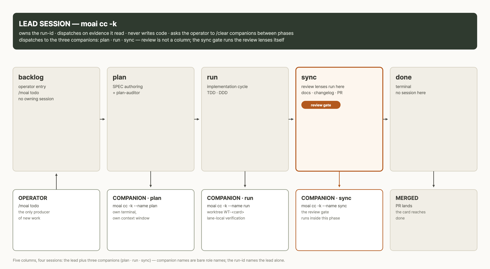
</p>

列ごとにバックエンドと推論強度を変えられる。上の画面では Plan を Opus 5 high、Run を GLM 5.2 xhigh、Sync を GLM 5.2 で動かしている。列ごとに必要な推論の深さは同じではないからだ。

### 始め方

```bash
moai cc -k                    # リード — run-id を告知し、チェーンを敷く
moai cc -k --name plan        # コンパニオン、各自別ターミナルで
moai cc -k --name run
moai cc -k --name sync
```

コンパニオン・セッションは**ターミナルを 1 つずつ新しく開いて手動で**立ち上げる。名前は役割名だけで付ける — run-id はリード・セッションの識別子であり、コンパニオンはそれを背負わない。同じ役割名がすでに生きていれば次の番号が付く。セッションが別のセッションの代わりに立つことはない。どの列でも `moai cc` の代わりに `moai glm` を使えば、その列だけ GLM バックエンドで動く。

### どのバックエンドをどの列に

カンバンを開くとき、ブートストラップ案内が既定の推奨も一緒に知らせます — トークンの空きを優先するなら、リードは `moai glm -k`、plan は `moai cc -k --name plan`、run は `moai glm -k --name run`、sync は `moai cc -k --name sync`。理由はレーンごとに必要な推論の種類です。plan と sync は判断とレビューを回す列なので Claude に置き、run は実装中心なので GLM でコストを下げます。リードは判定を下す席ではなく、キューを見張ってカードを運ぶ席なので、待ち続けても安い GLM が合います。GLM リードの下で Claude の判定が必要になったら、`judge` という名前のセッションから抜け道を作ります — GLM リードが Claude を使う唯一の経路です。あるアカウントが 429 で詰まり始めたら、レーンをアカウントに分散して置く運用が効きます。この組み合わせはあくまで既定の推奨 — 別の組み合わせも、全セッションをひとつのバックエンドに統一しても構いません。

### ファクトリーモード — レーン N 本で複数のカードを同時に

`-f` はファクトリーリードを開く。これがカンバンの 2 つ目の形態だ。カンバンのカードが列を渡り歩くのに対し、ファクトリーのカードは**丸ごと 1 本のレーン**へ入り、そのレーンがセッション内で `plan → run → sync` を直列に運ぶ。各段階は `Agent()` サブエージェントとしてスポーンされる。レーンのラベルは `lane-1` … `lane-N`。

```bash
moai cc -f                    # リード — 既定はレーン 1 本 (lane-1)
moai cc -f 4                  # リード — レーン 4 本
moai cc -f lane-1             # レーン 1 本、各自別ターミナルで
moai glm -f lane-3            # …GLM バックエンドのレーンも同じ形
```

レーンは `moai cc -f lane-<n>` で 1 本ずつ増やす。生きているセッションが使っているラベルは次の空き番号へ繰り上がる。1 本のレーンは最大 10 個の `Agent()` サブエージェントを同時に走らせ、書き込みを担うスポーンはそれぞれの worktree に隔離される。レーンを一度に全部立ち上げてはいけない — まず最初の 1 本を上げ、実際に出力が出ているのを確かめてから残りを活性化する。カードがレーンをまたいで分割されることはない。`-k` は 3 役割のカンバンチェーンを回すトークンのままで、1 回の起動に進入トークンは 1 つだけだから `-k` と `-f` の併用はエラーになる。`moai cg` はファクトリーモードを拒否する。

> 詳しくは: [カンバンモード — ファクトリーモード](https://adk.mo.ai.kr/ja/advanced/kanban-mode)

ボードは `backlog → plan → run → sync → done` の 5 列である。`backlog` には意図的に担当セッションを置かない。だから仕事は人が入れたときだけボードに入る。

```text
/moai todo "rename のヒントが古い"   # カード追加
/moai todo                          # キュー確認
```

ボードを正直に保つルールが 2 つある。リードはカードの `progress.md` を**自分で読んだ証拠だけで**カードを進める — コンパニオンの返信では進めない。返信は観測ではなく主張であり、セッション間の配信は保証されないからだ。そしてフェーズが終わると、リードは当該セッションの `/clear` を依頼する。`/clear` は人が直接打つコマンドなので、指示としては送れない。

### 4 つのセッションが共有する言葉

カンバン文書が繰り返す語彙を 1 枚の絵にまとめるとこうなる。**列** (column) はボードの段階であり、**レーン** (lane) はカード 1 枚をその段階の間を最後まで運ぶセッションとワークツリーの組である — 停留所と路線の違いだ。

```text
オペレーター ── /moai todo ──▶ backlog ─▶ plan ─▶ run ─▶ sync ─▶ done
                          (リードが読んだ証拠だけでカードを次の列へ)

レーン — カード t0:  run セッション + ワークツリー WT-t0   ┐ 2 つの流れは同じボードを
レーン — カード t1:  run セッション + ワークツリー WT-t1   ┘ 並んで流れ、混ざらない
```

| 語 | 一行定義 |
|---|---|
| カード (card) | 作業単位 1 つ。`/moai todo` で入り、短い ID で呼ばれる |
| 列 (column) | ボードの段階 1 つ — 5 列は固定順序 |
| バックログ (backlog) | 入口の待ち列。担当セッションがなく、人だけが投入できる |
| レーン (lane) | カード 1 枚を最後まで運ぶセッション＋ワークツリーの組。並行作業の流れ 1 つ |
| リード (lead) | 調整するセッション。読んだ証拠だけでカードを進め、コードは自分で書かない |
| コンパニオン (companion) | 列ごとに座って作業するセッション。ターミナル 1 つずつ人が手で立ち上げる |
| ラン ID (run-id) | リードが開始時に告知する短い識別子。リード・セッションの名前であり、コンパニオンはそれを背負わない |
| ワークツリー (worktree) | カード専用の隔離チェックアウト（`WT-<カード>` ブランチ）。run から sync まで 1 本が貫く |
| ディスパッチ (dispatch) | リードがコンパニオンに送る指示 — 仕事へのポインタであって複製ではない |

定義と例を備えた正式な用語集: [カンバンボード用語](https://adk.mo.ai.kr/ja/core-concepts/kanban-board-terms)

### ボードを目で見る

`moai web` はローカル・コンソールを立ち上げる。カンバン画面でカンバン・チェーンと SPEC パイプラインを一緒に眺め、Overview・Specs・Monitor・Settings 画面も併せ持つ。

<p align="center">
  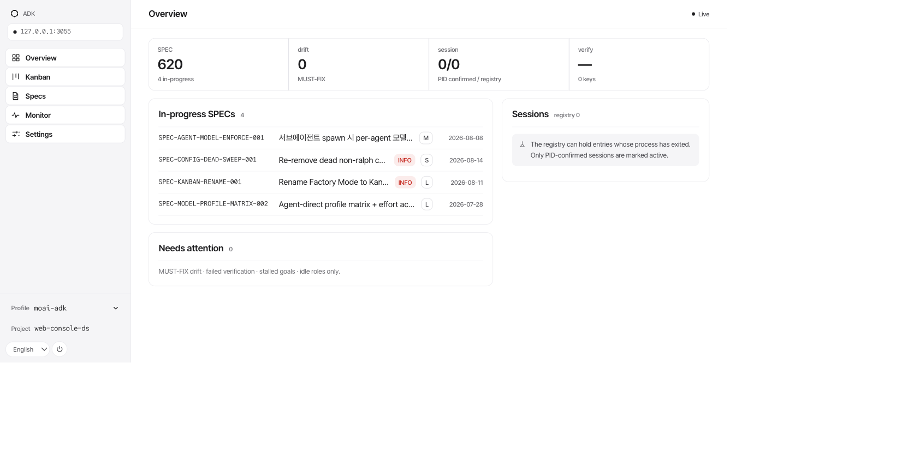
</p>

詳しくは: [カンバンモード](https://adk.mo.ai.kr/ja/advanced/kanban-mode) · [manager-lead リードコーディネーター](https://adk.mo.ai.kr/ja/advanced/manager-lead) · [`/moai todo`](https://adk.mo.ai.kr/ja/utility-commands/moai-todo)

---

## なぜ moai-adk なのか

エージェントがコードを書く時代になったが、エージェントの出力をそのまま信頼することはできない。「テストが通りました」という言葉が、実際にテストを回した結果なのか、単なるエージェントの推測なのかを見分けることが、最初から最大の問題だった。moai-adk はまさにその地点から出発する — **検証していない完了宣言をシステム・レベルで禁止**し、すべての完了主張に、実際に実行したコマンドとその出力を証拠として結び付ける。

moai-adk は Claude Code を外から包むハーネスである。Claude Code を置き換えるのではなく、ユーザーが手で管理してきた部分 — どのモデルを使うか、どれだけ深く推論するか、結果をどう検証するか、セッションが切れたときどうつなぐか、並行実行時にお互いを踏まないようどう分離するか — を構造として引き受ける。検証の完全性、SPEC ライフサイクル、本物の境界を持つ自律実行、生きたコードベース・ナビゲーター、自己改善ループ、並行安全な構造。この 6 つが moai-adk のアイデンティティを形づくる。

<p align="center">
  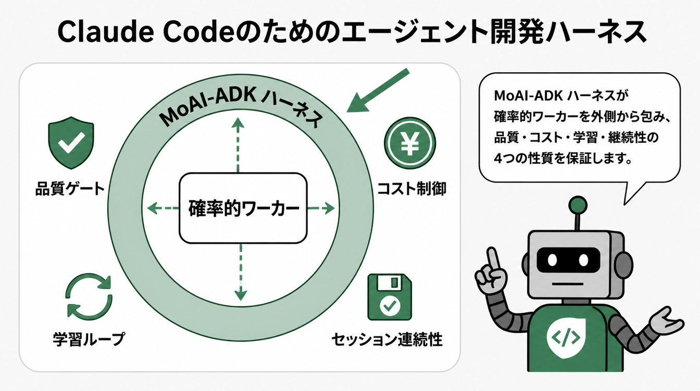
</p>

このアイデンティティは 3 つの核に整理される — 同じ品質をより少ないトークンで得る**コスト** (トークノミクス)、観測をルールに変えて動くほど賢くなる**自己改善** (エージェンティック・ループ・エンジニアリング)、そして手戻りを構造的に防ぐ**品質管理** (SPEC ライフサイクル・TRUST 5 ゲート・分離)。どれ 1 つだけでは足りない — それぞれがなぜ他を必要とするかは下で見る。

### 8 つの差別化ポイント

| 差別化ポイント | 説明 |
|---|---|
| **偽りの検証なし** | 「テストが通った」という主張は、必ず実際に実行したコマンドとその出力に帰属する。回していない検証を成功として語ることをシステムが禁止する — 検証主張の完全性 (verification-claim integrity) がすべてのエージェントとオーケストレータの表面に結び付いている。 |
| **自律 + 本物の境界** | `/moai goal` が完了条件を宣言すると、セッションは条件が満たされるまで自力で作業する。ただしターン上限（デフォルト 30）、停滞ガード、実時間予算、事前承認ゲートという 4 つのハードな境界が付いており、無限ループに陥らない。 |
| **並行安全** | SPEC ごとに独立した作業ツリーを与え、ブランチ状態ガードがプライマリ・チェックアウトでの誤ったブランチ切替を防ぎ、書き込みエージェントの起動前にリモートとの乖離を検査する。書き込み可能なエージェント 2 つが同時に動くことはない。 |
| **長期の継続** | `/clear` を越えて作業は続く。進行状況は `progress.md` に、ハンドオフ・メッセージはメモリに、ルーティング決定は決定メモリに残る。次のセッションは更地からではなく、前のセッションが学んだ地点から始める。 |
| **コスト効率** | モデルと推論の深さを作業段階と SPEC サイズに合わせて宣言的に割り当てる。Claude リーダー + GLM ワーカーの CG モードは実装中心の作業でコストを 60–70% 減らす。プロンプト・キャッシュを再利用し、長い出力はディスクに流してコンテキストを軽く保つ。 |
| **16 プログラミング言語の同等サポート** | Go、Python、TypeScript、JavaScript、Rust、Java、Kotlin、C#、Ruby、PHP、Elixir、C++、Scala、R、Flutter、Swift — 16 のプログラミング言語をマーカー・ベースの自動検出でひとつの集合として扱う。どれか 1 つが優遇されることはない。 |
| **自己改善** | 繰り返される失敗パターンを観測すると、ルール変更提案として上げる。黙って適用せず、承認を受けて反映する。ルーティング決定とゲート証拠が決定メモリに蓄積され、次の実行の材料になる。 |
| **母語への配慮** | 韓国語・日本語・中国語・英語の 4 ロケールを同じ PRで扱い、翻訳調を禁じ、母語の文を別に持つ。母語を使うユーザーに英語を強要しない。 |

### 何が違うのか

| | Claude Code 単独 | 一般的なハーネス | **moai-adk** |
|---|---|---|---|
| 完了主張の証拠帰属 | ユーザーが手で確認 | 通常ない | システムが強制（5 セクション証拠レポート形式） |
| SPEC ライフサイクル | なし | 限定的 | plan→run→sync 3 フェーズ + Tier S/M/L |
| 自律ループのハードな境界 | 該当なし | 大抵ターン上限のみ | ターン上限 + 停滞ガード + 実時間 + 承認ゲート |
| 並行作業の分離 | 手動 | 限定的 | worktree + ブランチガード + 起動前同期検査 |
| セッション継続性 | `/clear` で切断 | 限定的 | ハンドオフ + メモリ + 進行ファイル |
| 16 プログラミング言語の同等扱い | 該当なし | 該当なし | マーカー自動検出 + 言語別ツールチェーン |
| 自己改善ループ | なし | 限定的 | 失敗観測 → ルール昇格（承認制） |

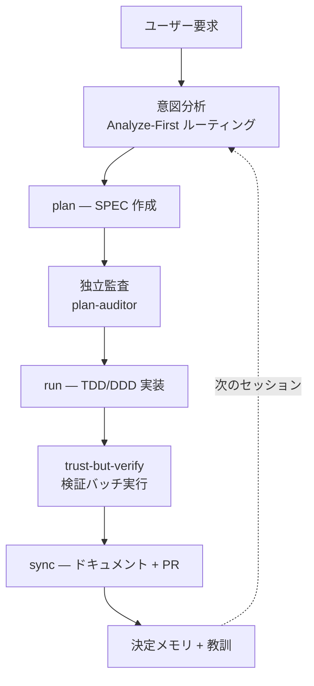
```mermaid
flowchart TD
    User["ユーザー要求"] --> Analyze["意図分析<br/>Analyze-First ルーティング"]
    Analyze --> Plan["plan — SPEC 作成"]
    Plan --> Audit["独立監査<br/>plan-auditor"]
    Audit --> Run["run — TDD/DDD 実装"]
    Run --> Verify["trust-but-verify<br/>検証バッチ実行"]
    Verify --> Sync["sync — ドキュメント + PR"]
    Sync --> Learn["決定メモリ + 教訓"]
    Learn -.次のセッション.-> Analyze
```

### 3 つの核が互いを支える

コストだけを押すと品質は静かに崩れる — 手戻りとデバッグ・ループが続き、手戻りはあらゆるトークン支出のうち最も高くつく。品質ゲートだけあって学習ループがなければ、同じ失敗が毎セッション繰り返される。コスト上限のない自律ループは、暴走した 1 件のタスクが割り当て全体を燃やし切る。3 つの核は互いを支える — **品質が手戻りを防ぐからコストは経済的に保たれ、ループが効いたものを拾うから品質は強制可能のままであり、コスト・ゲートが超過前に止めるからループは手の届く範囲に留まる。**

すべての設計判断はこの 3 つの核のどれかに属する。どのモデルを使うか、どれだけ深く推論するか、コンテキストをどう使うか — 何 1 つターンごとのその場勘に任されない。システムが決定し、その決定を記録して次の実行を賢くする。

<p align="center">
  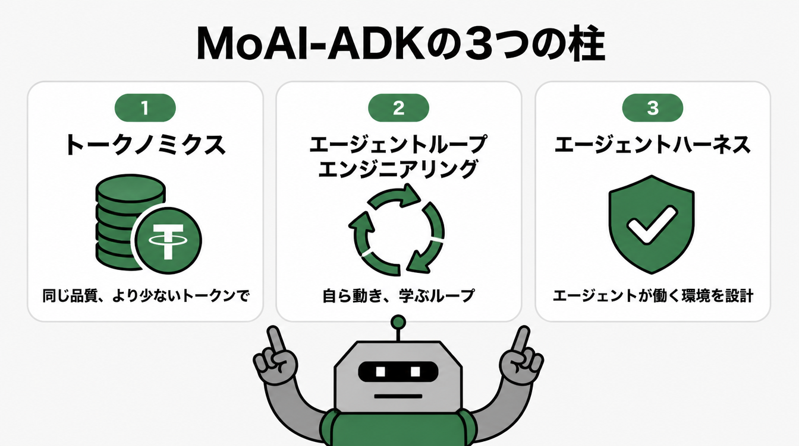
</p>

### コストは単価ではなく割り当てで決まる

トークン価格は 3 年間で **98% 下がった**のに (Linux Foundation)、同じ期間に企業の AI 支出は **320% 上昇した**。価格下落を利用量の増加が上書きしたのである。エージェントは 1 課題を解くために数十〜数百ステップを回り、トークンをそれに比例して燃やす。従量課金ではこれがそのまま請求書になり、サブスクリプションでは全モデルが共有する週次割り当てを食い潰す。

Uber は Claude Code をエンジニア 5,000 人に展開し、**4 か月で 1 年分のコーディング予算を燃やして**月次トークン上限を導入した。Meta・Amazon・Microsoft もそれぞれ無制限 AI ポリシーを撤回した。課題に合うモデルを割り当ててトークン効率を上げる**トークノミクス**は、テック業界の新しい基準線になった。

従来のコスト管理は単価の上昇に合わせて作られたので、単価は下がるのに総支出は増えるというこの逆説の前で無力だ。ボトルネックは単価ではなく利用量、正確には、エージェントが課題を終える前に回すステップ数である。

DeepSWE リーダーボード（課題 113、努力度別ビュー）がこれを示す。同じ Claude 系の中で、課題ごとのコストはモデルがトークンをいくらで売るかではなく、**どれだけ効率的に終えるか**に追従する。

| モデル [effort] | スコア | 課題コスト | 備考 |
|---|---|---|---|
| opus-5 [low] | 58%±2 | **$1.66** | |
| opus-5 [medium] | **69%±1** | **$3.29** | **費用対効果の変曲点** |
| opus-5 [high] | 73%±2 | $6.08 | スコア +4、コスト 1.8 倍 |
| opus-5 [xhigh] | 73%±3 | $9.07 | 純損 — high と同点、コストだけ +49% |
| opus-5 [max] | 74%±4 | $11.84 | |
| glm-5.2 [max] | 44%±2 | $3.92 | API 課金では不利 · z.ai 定額制では有用 |
| sonnet-5 [max] | 54%±4 | $26.40 | opus-5 [low] に支配される |

Opus 5 を最も低い努力度で回した方が、Sonnet 5 を最も高い努力度で回したよりスコアが高く (58% vs 54%)、課題コストは 16 分の 1 だ ($1.66 vs $26.40) — Sonnet のトークン単価が安いという事実には勝てない点に注意。原因は 268 ステップ対 36 ステップである。請求書を書くのはトークン単価ではなく、再試行ループだ。コストは**課題ごとに正しいモデルと推論の深さを割り当てる**ことで決まる。

<p align="center">
  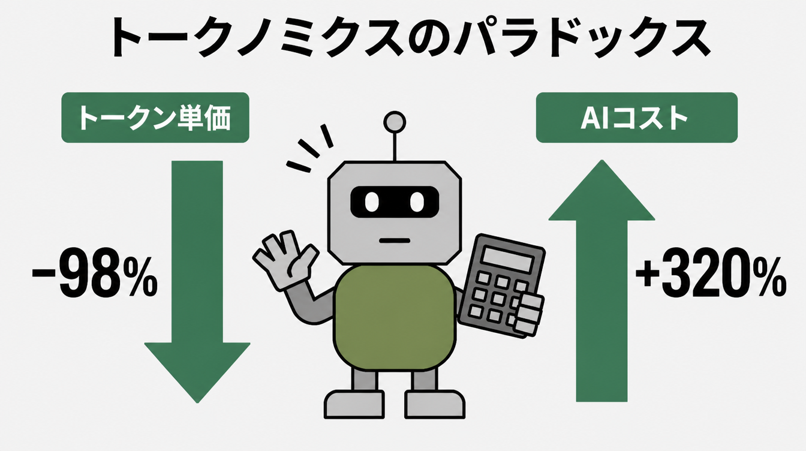
</p>

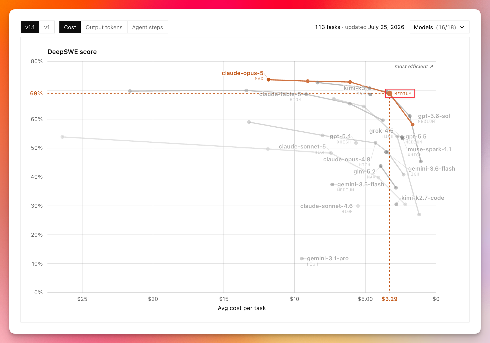

> 出典: [DeepSWE v1.1 リーダーボード](https://deepswe.datacurve.ai) (datacurve.ai、課題 113、2026-07-25)

---

## クイックスタート

### インストール

#### macOS / Linux / WSL

```bash
curl -fsSL https://adk.mo.ai.kr/install.sh | bash
```

#### Windows (PowerShell 7.x+)

```powershell
irm https://adk.mo.ai.kr/install.ps1 | iex
```

#### ソースからビルド (Go 1.26+)

```bash
git clone https://github.com/modu-ai/moai-adk.git
cd moai-adk && make build
```

すでにインストール済みなら、`moai update` で最新版に上げる。

> 💡 **コストを減らすには — z.ai GLM 推奨**: [このリンク](https://z.ai/subscribe?ic=1NDV03BGWU)から z.ai に登録すると一定トークンがボーナスでもらえる。このリンクは moai-adk オープンソース開発を支援する経路でもある。無料モデル (GLM-4.7-Flash, GLM-4.5-Flash) もあるので、[z.ai 料金プラン](https://docs.z.ai/guides/overview/pricing)を参照のこと。

### プロジェクトの初期化

```bash
moai init my-project
cd my-project
```

対話式ウィザードが言語・フレームワーク・方法論を自動検出し、モデル方針を選んだうえで Claude Code 統合ファイルまで生成する。

### 最初のワークフロー

```bash
claude        # または moai cc — プロジェクト内で Claude Code を実行
```

```text
/moai plan "JWT ログインを追加"      # SPEC 作成
/moai run SPEC-AUTH-001              # TDD/DDD 実装
/moai sync SPEC-AUTH-001             # ドキュメント同期 + PR 作成
```

自然言語でも通じる。`/moai "ログインのバグを直して"` のように書くと、意図分析 (Analyze-First ルーティング) がリクエストを読んで適切なワークフローへ渡す。

### 要件

| プラットフォーム | 対応環境 | 備考 |
|---|---|---|
| macOS | Terminal, iTerm2 | 完全対応 |
| Linux | Bash, Zsh | 完全対応 |
| Windows | **WSL 推奨**, PowerShell 7.x+ | ネイティブ cmd.exe 非対応 |

- **Git** — 全プラットフォームで必須
- **Claude Code** — moai-adk は Claude Code のためのハーネスである
- **推奨**: `gh` CLI（PR 自動化）、`tmux`（CG モード）、使用言語のリント/テスト・ツールチェーン（例: `golangci-lint`）

---

## 主要機能

### 単一エントリポイント `/moai`

自然言語と 16 個のサブコマンドが同じパイプラインに入る。`/moai plan`・`/moai run`・`/moai sync` が SPEC パイプラインの主軸で、`goal`・`loop`・`fix`・`review`・`gate`・`clean`・`codemaps`・`e2e`・`mx`・`feedback`・`project`・`harness`・`todo` が周囲を埋める。

> 引退したサブコマンド 4 つ — `design` · `brain` · `coverage` · `security`。`security` の役割は `moai-ref-owasp-checklist` + `moai-ref-llm-security` スキルが引き継ぐ。

### MCP サーバー

`moai init` はデフォルトで**ちょうど 1 つ**の有効な MCP エントリを用意する — 自前の `moai mcp-server`（ローカル stdio サーバー）だ。このサーバーが 6 グループにまとめた 21 個の MoAI ツールを Claude Code に公開する。ドキュメントに記載された非活性の 4 エントリ（`context7`・`chrome-devtools`・`playwright`・`ast-grep`）は `moai mcp add <名前>` で有効化する。`moai mcp add|remove|list` CLI が atomic-RWM seam でエントリを管理するため、ユーザーが `.mcp.json` を手で編集する必要はない。

| グループ | ツール | 目的 |
|------|------|------|
| SPEC ライフサイクル | `spec_progress`, `spec_audit`, `spec_drift` | 時代分類 + ドリフト検出 |
| 検証 | `verify_snapshot`, `verify_trend` | キー別証拠スナップショット |
| ゴール + セッション | `goal_arm`, `goal_status`, `session_list` | 自律ループ + マルチセッション調整 |
| クロスモデル監査 | `audit_multi`, `codex_audit`, `glm_audit`, `audit_cache` | 多監査者収束 |
| codex 委譲 | `codex_task`, `codex_setup`, `codex_job_*` | バックグラウンド・クロスモデル作業 |
| GLM 委譲 | `glm_task`, `glm_job_status`, `glm_job_result`, `glm_job_cancel` | GLM(z.ai)へのバックグラウンド作業委譲 |

すべてのバックエンドは fail-open だ — GLM（`~/.moai/.env.glm`）と codex（`~/.codex/auth.json`）はオプションであり、利用不能なバックエンドは `inconclusive` を返すだけで hard error ではない。

> 詳しくは: [MCP サーバー・ガイド](https://adk.mo.ai.kr/ja/guides/mcp-server) · [Claude Code MCP](https://adk.mo.ai.kr/ja/claude-code/extensibility/mcp)

### ゴール・エンジン — 本物の境界を持つ自律ループ

完了条件を宣言すると、セッションは条件が満たされるまで自力で作業する。ターン上限、停滞ガード、実時間予算、事前承認ゲートが付いており、無限ループに陥らない。機械的条件（コマンドの終了コード）とモデル条件（対話記録の主張）を併用できる。`--max-turns 0` で auto-compact 駆動の無限ゴールを武装することもできる — その場合は `--max-duration` と停滞ガードが境界を作る。

### 並行 worktree

SPEC ごとに独立した作業ツリーを与える。`moai cc -w <名前>` で入り、`--spawn` を付けると現在のセッションを保ったまま新しいウィンドウで開く。ブランチ状態ガードがプライマリ・チェックアウトでの誤ったブランチ切替を防ぐ。

### カンバンモード

`--kanban`（短縮 `-k`）はセッション・ランチャーのスイッチで、リード・セッションの指揮のもと単一の SPEC を `plan → run → sync` で押し進め、マルチセッション・ボードで調整する。ボードの背骨が** Origin-Trail Chain**だ — append-only の JSONL 系譜ツリーでワークツリーの祖先を追跡し、深さの健忘（`/clear` 後のルートからリーフへのチェーン復元）を解決し、ハートビートの鈍りから死んだリーダー・セッションを検出する。

| 概念 | 機能 |
|------|--------|
| Origin-Trail Chain | `.moai/state/chain/events.jsonl` の append-only JSONL イベント・ストリーム |
| WorktreeNode (13 フィールド) | セッションごとの状態: ID、親、深さ、origin チェーン、マイルストーン、再開目標 |
| CWD 衝突の解決 | `(worktree_path, session_id)` の組で再利用パスを区別 |
| 深さの上限 | 入れ子の複雑さを制限 |

> **今すぐ使える**: `moai cc -k`（または `moai glm -k`）でリードを立ち上げ、`-k --name <role>` でコンパニオンを 1 つずつ接続する — ターミナル 1 台に 1 つ、手で立ち上げる。`moai chain <status|lineage|back|list|prune>` で系譜を読み、`moai todo`（引数なしでキュー表示、`add`·`list`·`next`·`done`·`unpick`、2 語以上はそのままカード追加）で `backlog` 列を運用する。起動手順は上の「v3.1 の新機能 — カンバンモード」節にある。

> 詳しくは: [カンバンモード・ガイド](https://adk.mo.ai.kr/ja/advanced/kanban-mode)

### CG モード — Claude リーダー + GLM ワーカー

Claude が戦略・計画・監査を担い、GLM が大量実装を担う。tmux セッション単位の環境分離で両者をつなぎ、実装中心の作業でコストを 60–70% 減らす。

<p align="center">
  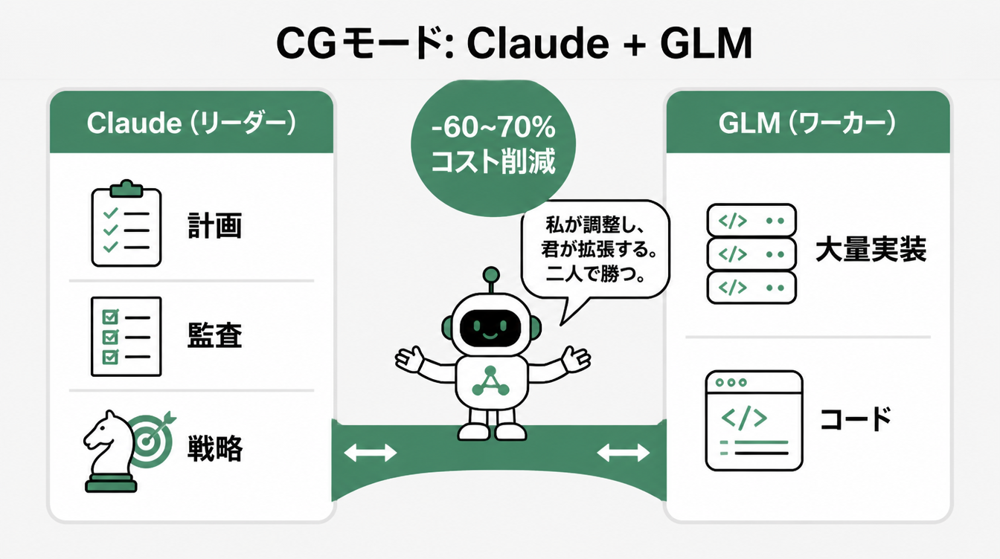
</p>

### 16 プログラミング言語の同等サポート

Go、Python、TypeScript、JavaScript、Rust、Java、Kotlin、C#、Ruby、PHP、Elixir、C++、Scala、R、Flutter、Swift。マーカー・ベースの自動検出で各言語の標準リント/フォーマット/テスト・ツールチェーンを回す。

### 自動品質ゲート

TRUST 5 (Tested · Readable · Unified · Secured · Trackable) がすべての変更に適用される。`/moai gate` がリント + フォーマット + 型 + テストを一括で回し、sync-auditor が機能・セキュリティ・制作・一貫性の 4 次元で採点する。

### @MX タグ

AI エージェント同士がコンテキスト・不変条件・危険区域をやり取りするインラインのコード注記。ファンインが高い、複雑、危険なコードだけを選んで印を付ける。

### Navigator — 生きたコードベース地図

`@NAV:DEC`・`@NAV:SYM`・`@MX:SPEC` の 3 系統を、アドレス指定可能な 1 つのグラフ (`nav-graph.json`) にまとめる。設計決定・SPEC・コードシンボルが双方向につながり、コードを直すときにその決定の文脈が付いてくる。

### セッション・ハンドオフ

`/clear` を越えて作業は続く。6 ブロックの paste-ready resume メッセージが進行状況を次のセッションへ運び、自動注入モードではメッセージ 1 行でセッションを再開する。

### loop / fix — エラー駆動開発

`/moai loop` が LSP 診断・AST-grep・リンターを並行でさらって拾った問題をレベルごとにまとめ、キューが空になるまで回る。`/moai fix` は 1 パスで終える単発修理だ。

### review --deep

`/moai review --deep` がマルチエージェントの敵対的脆弱性スキャンを回す。OWASP · LLM セキュリティ · サプライチェーン · DevSecOps のリファレンス・スキルが後ろに付く。

### 4 ロケール・ドキュメント

韓国語・日本語・中国語・英語のドキュメントを同じ PR で扱う。翻訳調を禁じ、母語の文を別に持ち、4 ロケール・パリティ検査がビルド・ゲートに結び付いている。

### moai web コンソール

<p align="center">
  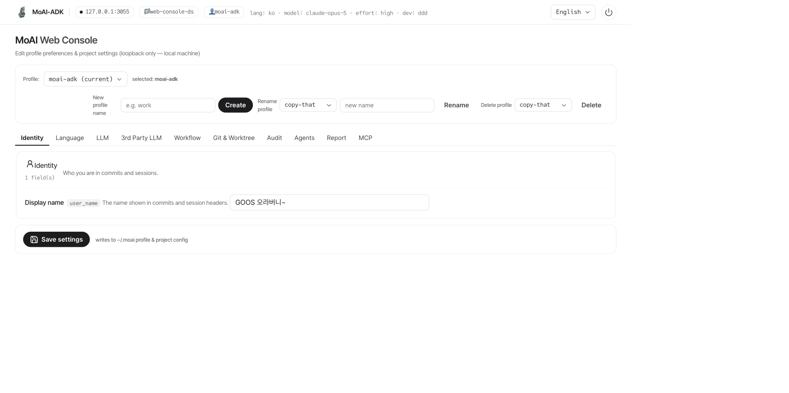
</p>

`moai web` がローカルホスト限定のコンソールを開く。画面は Overview・Kanban・Specs・Monitor・Settings の 5 つで、設定画面は Identity・Language・LLM・3rd Party LLM・Workflow・Git & Worktree・Audit・Agents・Report・MCP・Cross-Session の 11 タブに分かれる。プロファイルの作成・改名・削除も同じ画面で行う。

### ref / domain スキル

`moai-ref-api-patterns`、`moai-ref-owasp-checklist`、`moai-ref-llm-security`、`moai-ref-react-patterns`、`moai-ref-testing-pyramid`、`moai-ref-ui-polish`、`moai-ref-secops`、`moai-ref-supply-chain`、`moai-ref-seo`、`moai-ref-git-workflow` と `moai-domain-backend`、`moai-domain-frontend`、`moai-domain-database`、`moai-domain-testing`、`moai-domain-uiux` がエージェントに現場の知識を注入する。

### クロスプラットフォーム

追加の依存なしに macOS・Linux・Windows で動く Go 単一バイナリ。フック・システムがゲートを機械的に強制し、ステータスラインがコストとコンテキストをリアルタイムで示す。

---

## どう動くのか

### SPEC 3 フェーズ・ライフサイクル

すべての作業は plan → run → sync の 3 フェーズで流れる。Tier S/M/L のサイズ分類が検証の深さと PR ルーティングを決める。GEARS 形式の要件と受入基準が完了を証拠で判定する。

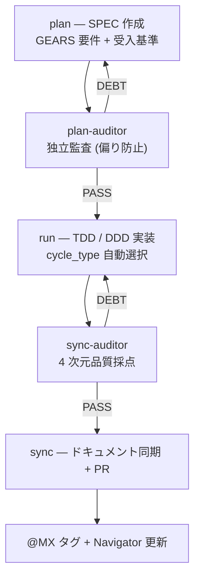
```mermaid
flowchart TD
    P["plan — SPEC 作成<br/>GEARS 要件 + 受入基準"] --> PA["plan-auditor<br/>独立監査 (偏り防止)"]
    PA -->|PASS| R["run — TDD / DDD 実装<br/>cycle_type 自動選択"]
    PA -->|DEBT| P
    R --> SA["sync-auditor<br/>4 次元品質採点"]
    SA -->|PASS| S["sync — ドキュメント同期 + PR"]
    SA -->|DEBT| R
    S --> MX["@MX タグ + Navigator 更新"]
```

<p align="center">
  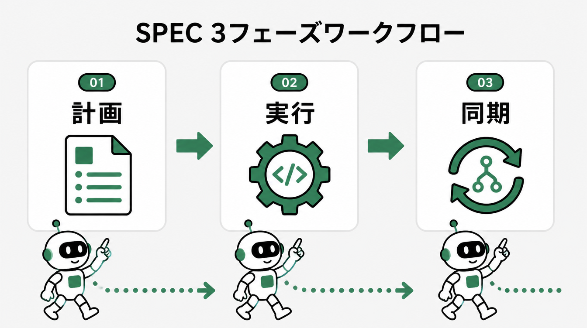
</p>

方法論 (TDD/DDD) はプロジェクトの状態が選ぶ。`moai init` がカバレッジを見て自動で決める。

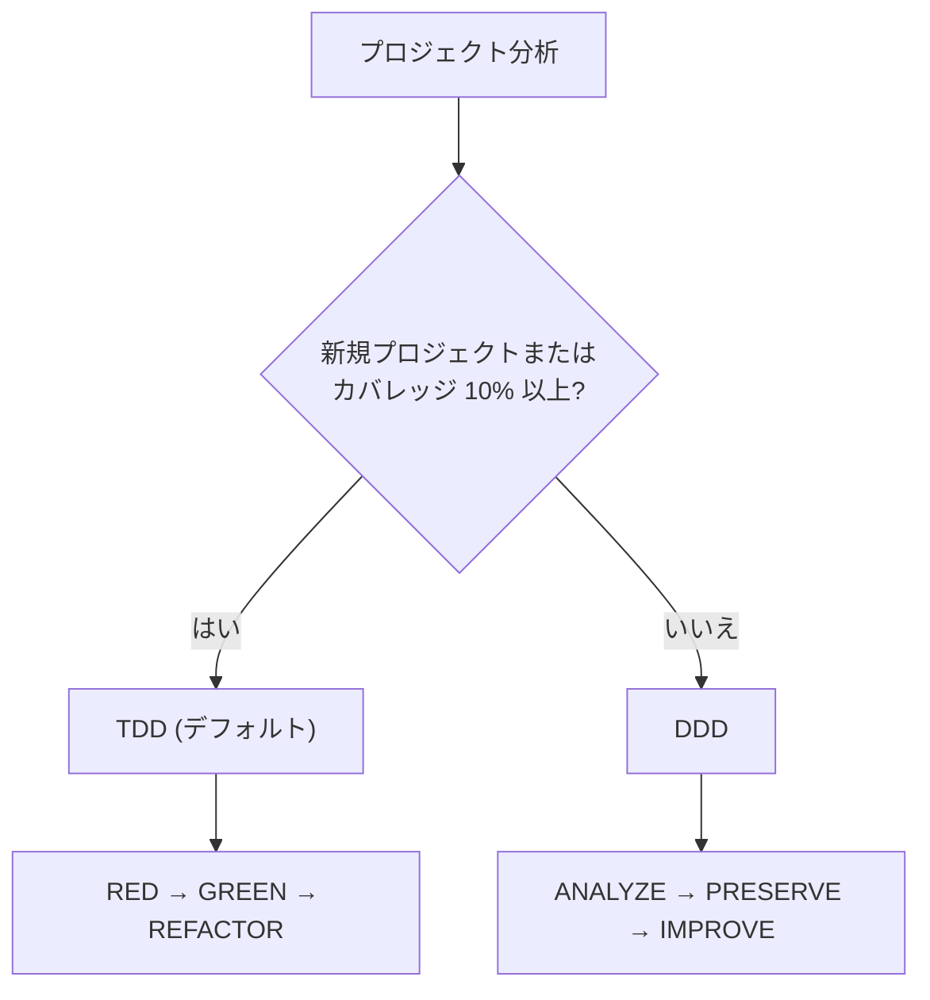
```mermaid
flowchart TD
    A["プロジェクト分析"] --> B{"新規プロジェクトまたは<br/>カバレッジ 10% 以上?"}
    B -->|"はい"| C["TDD (デフォルト)"]
    B -->|"いいえ"| D["DDD"]
    C --> F["RED → GREEN → REFACTOR"]
    D --> G["ANALYZE → PRESERVE → IMPROVE"]
```

| 方法論 | サイクル | 対象 |
|---|---|---|
| **TDD** (デフォルト) | RED → GREEN → REFACTOR | 新規プロジェクト・機能作業 |
| **DDD** | ANALYZE → PRESERVE → IMPROVE | カバレッジ 10% 未満の既存コード |

### 12 エージェント・カタログ

| 分類 | エージェント | コスト | 役割 |
|------|------|------|------|
| **マネージャー** | manager-spec | 🔴 | plan 段階の SPEC 作成 |
| | manager-develop | 🔴 | run 段階の TDD/DDD/autofix 実装 |
| | manager-docs | 🔵 | sync 段階のドキュメント化 |
| | manager-git | 🩵 | PR 作成・ルーティング |
| | manager-design | 🟠 | デザイン段階の協業 (Claude Design) |
| | manager-kanban | 🔴 | 階層チーム Tier L 調整（唯一の Agent 保持、深さ 2 封印） |
| **評価者** | plan-auditor | 🔴 | 独立 plan 監査（偏り防止） |
| | sync-auditor | 🔴 | 4 次元品質採点（機能性 40 · セキュリティ 25 · 制作 20 · 一貫性 15） |
| **ビルダー** | builder-harness | 🟠 | プロジェクト専用エージェント・スキル・コマンド・フックのスキャフォールド |
| **アドバイザー** | super-advisor | 🔵 | 高推論コンサル（E1-E4 エスカレーション） |
| **スペシャリスト** | e2e-tester | 🟠 | Web/モバイル/デスクトップ E2E テスト実行（CLI ファースト） |
| **内蔵** | Explore | ⚪ | 読み取り専用のコードベース探査 |

コスト色はデフォルト `medium` プロファイルのモデル×推論セルに従う (`moai model profile` で確認): 🔴 opus+high · 🟠 opus+medium · 🔵 opus+low · 🩵 sonnet+low · ⚪ セッション・モデル継承（ユーザー追加エージェント）。プロファイル (`high`/`low`) を切り替えると配属が変わる。執筆と監査を最初から分けて担わせるので、自分の仕事を自分で採点する事態が起こらない。

### trust-but-verify — 完了主張に証拠を結び付ける

エージェントが「テストが通った」と報告しても、オーケストレータはその主張を額面通りには受け取らず、自分で検証バッチを回す。7 つの読み取り専用検証（テスト・カバレッジ・サブエージェント境界・センチネル・スキャン・CLI スモーク・ベンチマーク・リント）を 1 ターンで並行に回し、それぞれの exit code と出力を証拠として残す。

検証主張の完全性 (verification-claim integrity) ルールがこの流れを背で支える — 回していない検証を成功として語ってはならず、以前に測った値を新しい測定のように持ち込んではならず、観測できなかったことを空欄のまま通してはならない。5 セクションの報告形式（主張 · 証拠 · baseline 帰属 · 未検証 · 残余リスク）が、エージェントとオーケストレータのすべての完了報告に結び付いている。

### 検証コストを削り、予算超過の前に止まる

検証は必要だが、検証出力までコンテキストに座る必要はない。冗長な検証出力はディスクに流し、コンテキストには exit code と刈り込んだ末尾（最大 50 行）だけを残す。プロンプト・キャッシュを再利用し（キャッシュ読み取りは 0.1 倍の費用）、コンテキスト・ダイエットの `/clear` 戦略がしきい値（1M 50% / 200K 90%）で勧告を出す。

予算側はトークン・サーキットブレーカーが守る — ハード上限（デフォルト 90%）で実行を中止し、進行状況を `progress.md` に保存し、貼り付けるだけで再開できる resume メッセージを出す。ステータスラインがコンテキスト使用率・キャッシュ命中率・レート制限消費を常に示すので、超過は見過ごされずに通り抜けない。

### ステータスラインの読み方

```
🤖 Opus │ 🧠 xhigh·t │ ♻️ 87% │ 🔅 cc v2.1.212 │ 🗿 v3.1.1 │ ⏳ 2h 34m │ 💬 MoAI
🪫 CW: ████████░░ 88% (⚠️/clear) │ 🔋 5H: ████░░░░░░ 45% (4h 30m) │ 🪫 7D: ████████░░ 82% (Jan 21)
📁 moai-adk-go │ 📡 modu-ai/moai-adk | 🅱️ feat/statusline ↑2 +3 │ 📫 +1 M2 ?0 │ 📋 [run SPEC-AUTH-001-run] │ 💌 PR #1042 (⌥approved)
🏷️ run │ 🔄 TODO: 1 / 3 │ 🔀 2 / 1
```

| 要素 | 意味 |
|------|------|
| 🤖 モデル | 現在のアクティブ・モデル |
| 🧠 effort | 推論強度 — 拡張推論が有効なら `·t` 接尾 |
| ♻️ キャッシュ命中率 | プロンプト・キャッシュ命中率 |
| CW: コンテキスト | コンテキスト・ウィンドウ使用率 + 2 段階 `/clear` マーカー (⚠️ ソフト, 🛑 ハード) |
| 5H / 7D | 料金プラン使用率 + リセット時刻 |
| 📁 ディレクトリ | プロジェクト・ディレクトリ名 |
| 📡 リポジトリ | GitHub リポジトリ `owner/name` (PR アイコン 🔀 と区別) |
| 🅱️ ブランチ | 現在のブランチ + `↑`先行 `↓`遅行 + `+`変更数 |
| 📫 git 状態 | メールボックス・アイコン（📬 ステージ / 📫 修正 / 📪 未追跡 / 📭 クリーン）+ 件数 |
| 📋 タスク | アクティブな SPEC ワークフロー `[コマンド SPEC-ID-フェーズ]` |
| 💌 PR | アクティブな GitHub PR 番号 + レビュー状態 (`⌥状態`) |
| 🏷️ セッション行 | 最終行に条件付き — セッション名 · 👤 エージェント · 🔄 `TODO: 進行中 / 待機` バックログ · 🔀 開いている issue/PR 数 |

> 詳しくは: [ステータスライン・ガイド](https://adk.mo.ai.kr/ja/advanced/statusline)

---

## ワークフロー例

### 新機能を作る (TDD)

```text
/moai plan "ユーザー・プロフィール画像アップロードを追加"
/moai run SPEC-PROFILE-001
/moai sync SPEC-PROFILE-001
```

新規コードやカバレッジが十分なコードには TDD (RED → GREEN → REFACTOR) が付く。`moai init` がプロジェクト状態を検出し、TDD と DDD のどちらかを選ぶ。

### 長時間回す (goal)

```text
/moai plan "決済モジュールのリファクタリング"
/moai run SPEC-PAY-001
/moai goal "go test ./... exits 0 && lint clean, or stop after 20 turns"
```

完了条件を宣言すると、セッションは条件が満たされるまで自力で作業する。ターン上限はデフォルト 30 で、停滞ガードが付いている。コンテキストがしきい値 (1M 50% / 200K 90%) に達すると `/clear` を勧め、進行状況を `progress.md` に保存する。

### 並行で回す (worktree)

```bash
moai cc -w feature-auth        # auth 作業ツリーを開く
moai cc -w feature-billing --spawn   # billing は新しいウィンドウで、現在のセッションを保持
```

```text
# auth ツリーの中で
/moai run SPEC-AUTH-001

# billing ツリーの中で
/moai run SPEC-BILL-001
```

SPEC ごとに独立した作業ツリーを与え、2 つのエージェントが互いを踏まないようにする。ブランチ状態ガードがプライマリ・チェックアウトでの誤ったブランチ切替を防ぐ。

### コストを減らす (CG モード)

```bash
moai glm sk-your-glm-api-key   # キーを一度保存
moai cg                        # Claude リーダー + GLM ワーカーのハイブリッドへ
```

```text
/moai run SPEC-DATA-001        # 実装中心の作業 → GLM ワーカーが大量実装を担当
```

CG モードは Claude リーダーが戦略・計画・監査を担い、GLM ワーカーが大量実装を担う。実装中心の作業でコストを 60–70% 減らす。ハーネス・SPEC ワークフロー・品質ゲートは 3 モードすべてで同一に動く。

### バグを自動で直す (loop)

```text
/moai loop
```

LSP 診断・AST-grep・リンターを並行でさらって拾った問題をレベルごとにまとめ、キューが空になるまで回る。単発の問題は `/moai fix` で 1 パスで終える。

---

## 設定とプロファイル

### `.moai/config/sections/`

プロジェクト設定は YAML のセクション・ファイルに分かれる。

| セクション | 役割 |
|---|---|
| `language.yaml` | ユーザー名 · 会話言語 · コードコメント言語 · コミットメッセージ言語 |
| `quality.yaml` | 品質ゲート · 開発モード (TDD/DDD) · カバレッジ |
| `harness.yaml` | ハーネスの深さ (minimal · standard · thorough) · 自動検出 |
| `workflow.yaml` | ワークフローの動作 |
| `lsp.yaml` | LSP ゲートしきい値 (SSOT) |
| `user.yaml` | ユーザー情報 |

環境変数がファイルの値を上書きする。優先順位の詳細と全セクション一覧は [CLI リファレンス](https://adk.mo.ai.kr/ja/cli-reference)を参照のこと。

### モデル・プロファイル — high / medium / low

`moai model profile` が 11 エージェント × 3 プロファイル = 33 セルの `{model, effort}` 組を解決する。

<p align="center">
  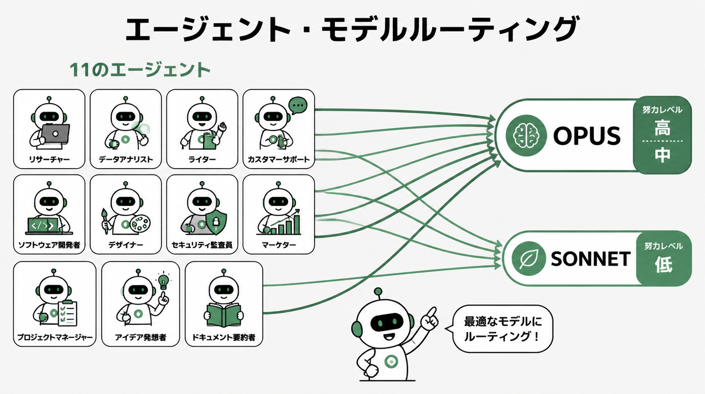
</p>

| プロファイル | 性格 | いつ |
|---|---|---|
| **high** | Opus 中心、高い推論 | 複雑な計画 · セキュリティ監査 · 難しいデバッグ |
| **medium** (デフォルト) | バランス | 通常の SPEC |
| **low** | Sonnet + 低い推論 | 機械的反復 · ドキュメント · 単発作業 |

配属は作業段階 (plan / run / sync) と SPEC サイズ (Tier S / M / L) に従う — 深い推論が必要な計画段階に推論の強いモデルを、機械的反復が続く実装段階に軽いモデルを。No-Haiku 3 層ポリシーにより、単発・入力支配の作業は Sonnet low、マルチターンのエージェンティック作業はすべて Opus が担う。

### settings.json / settings.local.json の分離

| ファイル | 役割 | テンプレート |
|---|---|---|
| `.claude/settings.json` | テンプレートからレンダリング — プロジェクト共有設定 | 含む |
| `.claude/settings.local.json` | ランタイム管理 — マシンごとの値 (tmux pane ID · API トークン · 絶対パス) | **絶対に含めない** |

`settings.local.json` は `moai glm`・`moai cc`・`moai cg` がランタイムに書き換え、SessionStart フックが環境を満たす。誤ってコミットしたら `git rm --cached .claude/settings.local.json` で除外する。

---

## どこでも動く

### 16 プログラミング言語の同等サポート

| | | | |
|---|---|---|---|
| Go | Python | TypeScript | JavaScript |
| Rust | Java | Kotlin | C# |
| Ruby | PHP | Elixir | C++ |
| Scala | R | Flutter | Swift |

各言語をプロジェクト・マーカーで自動検出し、その言語の標準リント/フォーマット/テスト・ツールチェーンを回す。未インストールのツールは静かに飛ばす。Dart/Flutter の正式名称は "flutter" だ。どれか 1 つが優遇されることはない。

### 4 ロケール・ドキュメント

| ロケール | サイト |
|---|---|
| 한국어 | adk.mo.ai.kr/ko |
| English | adk.mo.ai.kr/en |
| 日本語 | adk.mo.ai.kr/ja |
| 中文 | adk.mo.ai.kr/zh |

4 つのロケールを同じ PR で扱い、4 ロケール・パリティ検査がビルド・ゲートに結び付いている。翻訳調を禁じ、母語の文を別に持つ。

### オペレーティングシステム

| プラットフォーム | 状態 |
|---|---|
| macOS | 完全対応 (Terminal, iTerm2) |
| Linux | 完全対応 (Bash, Zsh) |
| Windows | WSL 推奨、PowerShell 7.x+ 対応、ネイティブ cmd.exe 非対応 |

### Claude + GLM

z.ai GLM を Claude Code の代替バックエンドとして使う。環境変数を変えるだけでコードはそのままだ。3 つの実行モードがある。

| コマンド | リーダー | ワーカー | tmux | コスト削減 |
|---|---|---|---|---|
| `moai cc` | Claude | Claude | 不要 | — |
| `moai glm` | GLM | GLM | 推奨 | 約 70% |
| `moai cg` | Claude | GLM | **必須** | 約 60% |

GLM Coding Plan は月 $10 から。glm-5.3、glm-4.7、glm-4.5-air と無料モデル (GLM-4.7-Flash, GLM-4.5-Flash) が使える。

Claude の各ティアは `ANTHROPIC_DEFAULT_*_MODEL` 環境変数を通じて GLM モデルにマッピングされる:

| Claude ティア | GLM モデル | コンテキスト |
|---|---|---|
| Opus | glm-5.3 | 1M |
| Sonnet | glm-5.3 | 1M |
| Haiku | glm-5.3 | 1M |
| Fable | glm-5.3 | 1M |

> 詳しくは: [Multi-LLM ガイド](https://adk.mo.ai.kr/ja/multi-llm) · [z.ai 料金](https://docs.z.ai/guides/overview/pricing)

---

## ドキュメントと学習

### 公式ドキュメント — adk.mo.ai.kr

[adk.mo.ai.kr](https://adk.mo.ai.kr) のオンライン・ドキュメントは 12 セクションに分かれる。

| セクション | 説明 |
|---|---|
| [はじめに](https://adk.mo.ai.kr/ja/getting-started) | 紹介 · インストール · Windows ガイド · init ウィザード · クイックスタート · CLI 概要 · FAQ |
| [基本概念](https://adk.mo.ai.kr/ja/core-concepts) | アイデンティティ · 憲法 · ハーネス・エンジニアリング · SPEC ベース開発 · DDD · TRUST 5 |
| [ワークフロー・コマンド](https://adk.mo.ai.kr/ja/workflow-commands) | `plan` · `run` · `sync` — SPEC パイプラインの主軸 |
| [ユーティリティ・コマンド](https://adk.mo.ai.kr/ja/utility-commands) | `fix` · `loop` · `gate` · `review` · `clean` · `codemaps` · `e2e` · `feedback` · `goal` · `todo` |
| [CLI リファレンス](https://adk.mo.ai.kr/ja/cli-reference) | ターミナル `moai` バイナリのすべてのコマンド (全 36 個) |
| [Claude Code ガイド](https://adk.mo.ai.kr/ja/claude-code) | Claude Code 統合 — 基礎 · コンテキスト/メモリ · エージェンティック · 拡張性 |
| [Multi-LLM](https://adk.mo.ai.kr/ja/multi-llm) | CG モードとモデル方針 |
| [コスト最適化](https://adk.mo.ai.kr/ja/cost-optimization) | プロンプト・キャッシュ戦略とトークン費用の削減 |
| [ガイド](https://adk.mo.ai.kr/ja/guides) | CI 自動化 · マルチ LLM CI などの実運用レシピ |
| [Git Worktree](https://adk.mo.ai.kr/ja/worktree) | 並行 SPEC 開発のための worktree ガイド |
| [Advanced](https://adk.mo.ai.kr/ja/advanced) | トークノミクス · トークン予算 · ステータスライン · settings.json · フック · @MX タグ · スキル · Harness v4 Builder · 自己進化 · 決定メモリ |
| [コントリビュート](https://adk.mo.ai.kr/ja/contributing) | オープンソース貢献ガイド |

### 書籍

[**Claude Code ではじめる実践エージェンティック・コーディング**](https://adk.mo.ai.kr/book) — moai-adk 著者による実践ハーネス・エンジニアリング・ガイド。[book.mo.ai.kr](https://book.mo.ai.kr)

### CLI コマンド表 (よく使う 14 個)

| コマンド | 説明 |
|---|---|
| `moai init` | 対話式プロジェクト設定 (言語/フレームワーク/方法論を自動検出) |
| `moai doctor` | システム状態の診断と環境検証 |
| `moai status` | プロジェクト状態の要約 (Git ブランチ、品質指標) |
| `moai update` | 最新版へ更新 (削除前バックアップ · 自動ロールバック対応) |
| `moai graph <build\|query>` | コードベースグラフ (edges.jsonl) の生成・照会 — 呼び出し元の検索、影響半径、マイルストーンの交差検査 |
| `moai cc` / `moai glm` / `moai cg` | Claude 専用 / GLM 専用 / ハイブリッドのセッション |
| `moai worktree <sync\|done\|remove\|clean\|recover\|snapshot\|verify\|restore>` | Git worktree の保守 (ワークツリーへの出入りはランチャーの仕事) |
| `moai session <list\|register\|current>` | マルチセッション調整 |
| `moai spec <audit\|archive\|lint\|list\|new>` | SPEC ライフサイクル・ツール |
| `moai goal <arm\|status\|clear>` | ゴール・エンジン CLI |
| `moai harness <status\|apply\|rollback\|disable>` | ハーネス学習ライフサイクル |
| `moai handoff <save\|list>` | セッション・ハンドオフ記録 |
| `moai preference <list\|decay-scan\|toggle>` | 決定メモリ管理 |
| `moai web` | Web コンソール — 5 画面 (Overview · Kanban · Specs · Monitor · Settings)、11 タブ設定 |

> 全 36 コマンド: [CLI リファレンス](https://adk.mo.ai.kr/ja/cli-reference)

### ref / domain スキル

**ref (現場の知識)**: `moai-ref-api-patterns`, `moai-ref-owasp-checklist`, `moai-ref-llm-security`, `moai-ref-react-patterns`, `moai-ref-testing-pyramid`, `moai-ref-ui-polish`, `moai-ref-secops`, `moai-ref-supply-chain`, `moai-ref-seo`, `moai-ref-git-workflow`

**domain (専門領域)**: `moai-domain-backend`, `moai-domain-frontend`, `moai-domain-database`, `moai-domain-testing`, `moai-domain-uiux`, `moai-domain-html-report`, `moai-domain-humanize`, `moai-domain-svg-infographic`

### CHANGELOG

最近の変更は [CHANGELOG.md](./CHANGELOG.md) を参照のこと。

### コード品質の要件

すべての貢献は TRUST 5 ゲートを通る — カバレッジ 85% 以上 · リントエラー 0 · 型エラー 0 · Conventional commits。既存コードは特性化テストで振る舞いを固定してから漸進改善 (DDD)、新規コードは RED → GREEN → REFACTOR (TDD)。

---

## よくある質問

### すべての関数に @MX タグがないのはなぜ?

正常である。タグはファンインが高い、複雑、危険なコードにだけ付く。どのプロジェクトでも大半のコードはタグのしきい値に達せず、タグのないファイルは欠陥ではない。

### ステータスラインのバージョン表示は何を意味する?

```
🗿 v3.1.0 ⬆️ v3.1.1
```

前の値が現在インストールされている moai-adk のバージョンで、矢印は利用可能な更新があることを示す。`moai update` を実行すると消える。

### GLM なしで Claude だけ使える?

使える。`moai cc` が Claude 専用セッションを立ち上げる。CG モード (`moai cg`、Claude リーダー + GLM ワーカー) と GLM 専用 (`moai glm`) はコスト削減オプションであり、ハーネス·SPEC ワークフロー·品質ゲートは 3 モードすべてで同一に動く。

### 既存プロジェクトでも使える?

使える。`moai init` がプロジェクト状態を検出して方法論を選ぶ — カバレッジ 10% 未満の既存コードには DDD (特性化テストで振る舞いを固定してから漸進改善)、新規・十分にテストされたコードには TDD。

---

## 一緒に作りましょう

### コントリビュート

貢献はいつでも歓迎する。詳細な手順は [CONTRIBUTING.md](CONTRIBUTING.md) にまとめてある。

1. リポジトリをフォーク
2. 機能ブランチを作成: `git checkout -b feature/my-feature`
3. テストを書く — 新規コードは TDD、既存コードは特性化テスト
4. テスト · リント · フォーマットの通過を確認: `make test` · `make lint` · `make fmt`
5. Conventional commit メッセージでコミットし、プルリクエストを開く

**コード品質の要件**: カバレッジ 85% 以上 · リントエラー 0 · 型エラー 0 · Conventional commits

### フィードバック

Claude Code の中では `/moai feedback` でバグ報告と機能要望を GitHub イシューに直接上げる。ターミナルからは [GitHub Issues](https://github.com/modu-ai/moai-adk/issues) を使う。

### コミュニティ

- [Discord](https://discord.gg/Z7E7Mdc5aN) — リアルタイムの議論と Tips
- [GitHub Issues](https://github.com/modu-ai/moai-adk/issues) — バグ報告 · 機能要望

### ライセンス

[Apache License 2.0](./LICENSE) — 詳細は LICENSE ファイルを参照のこと。

---

## スター履歴

<a href="https://www.star-history.com/?type=date&repos=modu-ai%2Fmoai-adk">
 <picture>
   <source media="(prefers-color-scheme: dark)" srcset="https://api.star-history.com/chart?repos=modu-ai/moai-adk&type=date&theme=dark&legend=top-left&sealed_token=9wFuBO5GMKxHZsaknxlIW3oypXLJlyW1qqq8T--aTRyfp6j9EK9KTR2vJvyAG8AKSs3Lindw7LUt-m-I6ysz9BoV6kdtrKlJYTViQAYR56A_3ie4ZVOqIw" />
   <source media="(prefers-color-scheme: light)" srcset="https://api.star-history.com/chart?repos=modu-ai/moai-adk&type=date&legend=top-left&sealed_token=9wFuBO5GMKxHZsaknxlIW3oypXLJlyW1qqq8T--aTRyfp6j9EK9KTR2vJvyAG8AKSs3Lindw7LUt-m-I6ysz9BoV6kdtrKlJYTViQAYR56A_3ie4ZVOqIw" />
   
 </picture>
</a>

<p align="center">
  <sub>MoAI-ADK チームが作りました · <a href="https://adk.mo.ai.kr">adk.mo.ai.kr</a></sub>
</p>
