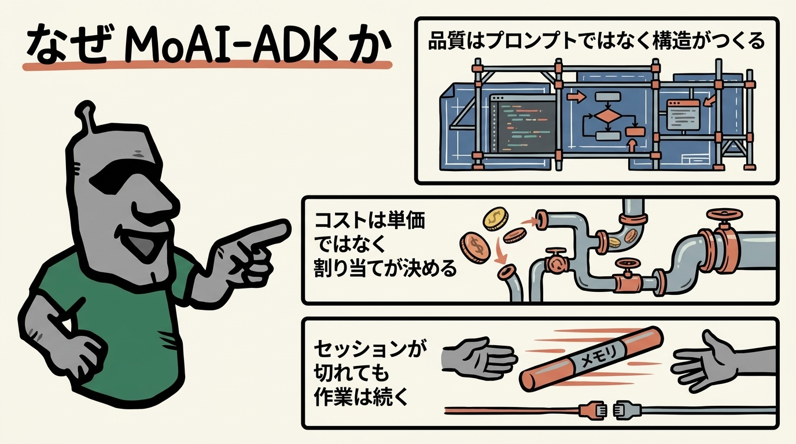
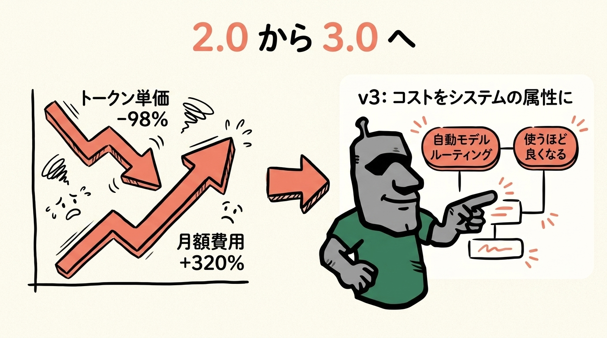
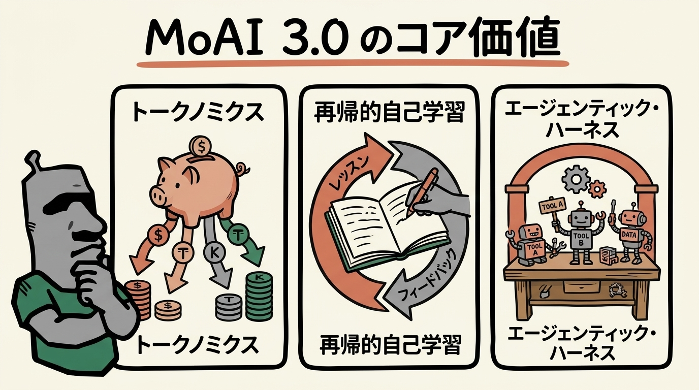
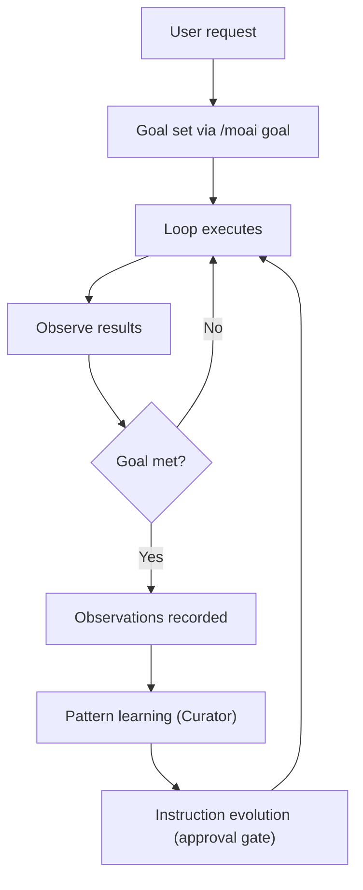
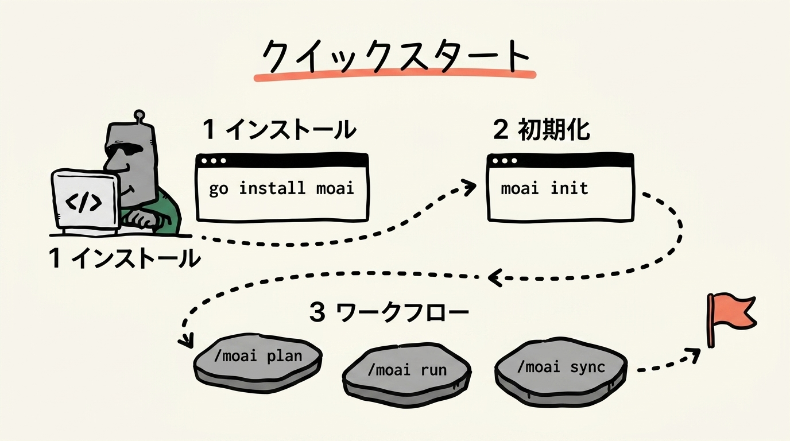
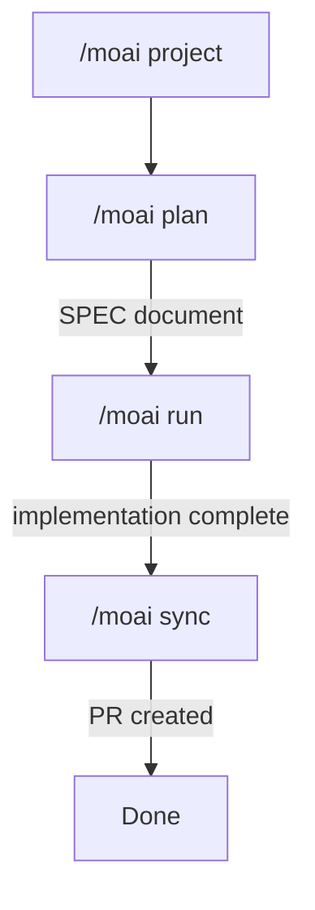
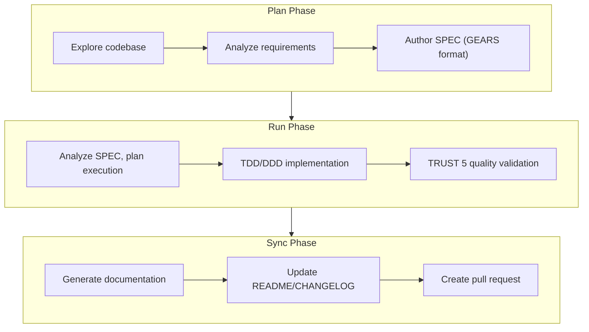
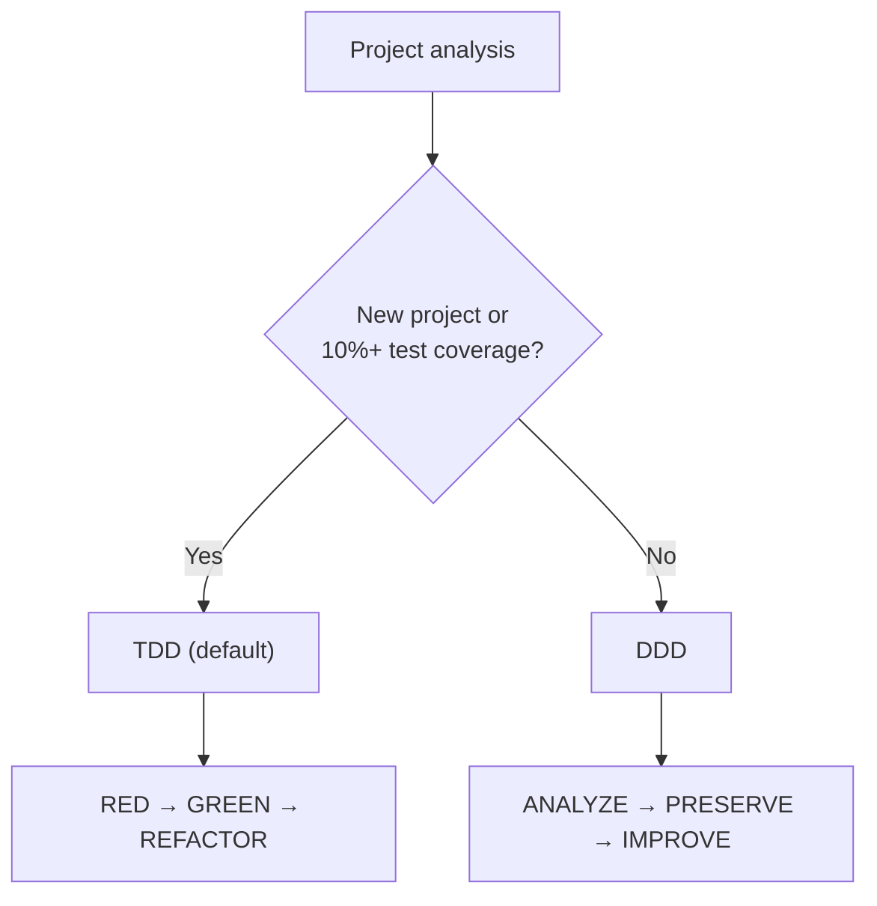
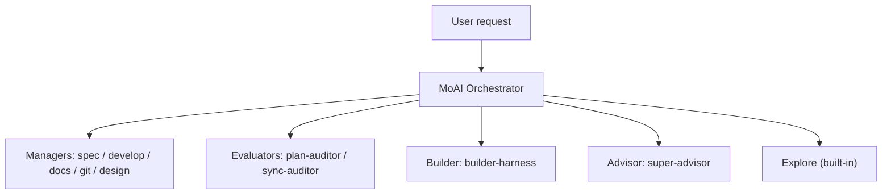

<p align="center">
  
</p>

<h1 align="center">MoAI-ADK</h1>

<p align="center">
  <strong>トークノミクスのために設計されたエージェンティック開発キット</strong>
</p>

<p align="center">
  <a href="./README.md">English</a> ·
  <a href="./README.ko.md">한국어</a> ·
  日本語 ·
  <a href="./README.zh.md">中文</a>
</p>

<p align="center">
  <a href="https://github.com/modu-ai/moai-adk/actions/workflows/ci.yml"></a>
  <a href="https://github.com/modu-ai/moai-adk/actions/workflows/codeql.yml"></a>
  <a href="https://codecov.io/gh/modu-ai/moai-adk"></a>
  <br>
  <a href="https://go.dev/"></a>
  <a href="https://github.com/modu-ai/moai-adk/releases"></a>
  <a href="./LICENSE"></a>
</p>

<p align="center">
  <a href="https://adk.mo.ai.kr"><strong>公式ドキュメント</strong></a> ·
  <a href="https://adk.mo.ai.kr/book">書籍: Claude Code 実践エージェンティックコーディング</a> ·
  <a href="https://discord.gg/Z7E7Mdc5aN">Discord</a>
</p>

---

> **「バイブコーディングの目的は、素早い生産性ではなくコード品質である。」**

---


## MoAI-ADK とは

MoAI-ADK (Agentic Development Kit) は、Claude Code の**上に**乗るハーネスです。ハーネスとは、モデルを外側から包み込むシステムのことです。モデルはトークン単位で動く確率的なワーカーであり、予算も品質基準も、前回のセッションがどこで途切れたかも記憶しません。コストの上限、通過するテストスイート、`/clear` をまたいだ継続性 — こうした性質は、毎ターンのプロンプトで植え直せるものではなく、システムが外側から強制しなければなりません。そのシステムこそがハーネスです。

すべての設計はトークノミクス (Token Economics) を目指しています — 同じ品質をより少ないトークンで、同じトークンならより高い品質で。どのモデルを使うか、どこまで深く推論するか、コンテキストをどう消費するかは、その場の運任せではなくシステムが決めます。

Claude Code を置き換えるものではありません。Claude Code がユーザーに委ねている部分 — モデルルーティング、品質ゲート、コスト制御、セッション継続性 — を構造で包むだけです。Go で書かれた単一バイナリなので、macOS・Linux・Windows で追加の依存関係なしにそのまま動きます。

---

## なぜ MoAI-ADK なのか



Claude Code 単体でもコードは出てきます。問題は、そのコードが毎回同じ品質で、予測可能なコストで出てくるかどうかです。導入判断に必要な論拠を 3 つに圧縮します。

### 論拠 1 — 品質はプロンプトではなく構造がつくる

プロンプトで植え付けた規律は、コンテキストが圧縮された瞬間に消えます。「テストファースト」「カバレッジ 85%」「作成者とレビュアーの分離」といった基準は毎ターン言い直せるものではなく、言い直したとしてもモデルは自分がそれを守ったことを証明できません。MoAI-ADK はこの基準をパイプラインとして強制します — すべての変更は SPEC 3 フェーズ (plan → run → sync) を通過し、TRUST 5 ゲート (85%+ カバレッジを含む) が通過の証拠を要求し、計画を書いたエージェントと監査するエージェントを分離して自己採点を防ぎます。完了を判定するのは「できた気がする」ではなく、テスト出力と受け入れ基準です。

### 論拠 2 — コストはモデル単価ではなく割り当てが決める

下の [2.0 から 3.0 へ](#20-から-30-へ) 節の実測が示すとおり、同じ Claude 系列の中でも解決タスクあたりのコストは 2 倍以上開きます — 弱いモデルを最高 effort で回すほうがむしろ高くつき、スコアも低いのです。この割り当てを人間が毎タスク手動で調整することはできません。MoAI-ADK は Tier×Phase マトリクスでモデルと推論の深さを宣言的に割り当て、検証ログをディスクにリダイレクトしてコンテキストをダイエットし、Token Circuit Breaker で予算を守ります。コスト管理が個人の習慣ではなくシステムの性質になります。

### 論拠 3 — セッションは途切れても作業は続く

コンテキストウィンドウは有限で、`/clear` は避けられません。素の Claude Code では、その境界のたびに進捗・教訓・前提条件が蒸発します。MoAI-ADK はセッション境界でハンドオフを自動生成し、貼り付け一回で次のセッションが続き、ループが積み上げた観察は学習ラダーを昇ってハーネスの指針へと昇格します。作業の単位がセッションではなくプロジェクトになります。

### 想定される反論 2 つ

- **「プロンプトを工夫すれば済むのでは」** — プロンプトは依頼であり、ハーネスは強制です。コンテキスト圧縮・セッション境界・モデル切り替えを越えて生き残るルールは、ファイルとゲートとして存在するルールだけです。
- **「導入オーバーヘッドが大きいのでは」** — 依存関係のない Go 単一バイナリ 1 つです。`moai init` 直後からステータスライン・品質ゲート・`/moai` コマンドが動きます。既存の Claude Code ワークフローを置き換えるのではなく包むので、今のやり方はそのまま維持されます。

一行にまとめると — **Claude Code がコードを書き、MoAI-ADK はそのコードを信頼でき、コストを予測可能にします。**

---

## 2.0 から 3.0 へ



v3 を使うべき理由は、機能が増えたからではありません。コストと学習という 2 つの軸を、システムが引き受けたからです。v2 が個々のレバー (キャッシュ、GLM) を手渡す道具だったとすれば、v3 はそのレバーを閉じたループにまとめ、システムの性質へと変えます。

### 問題 — トークン単価は下がったのに、コストは上がった

トークン単価は下がり続けているのに、エージェンティックワークロードの実際の支出は上がっています。エージェントは 1 つの課題を解くために数十から数百のステップを回り、その分だけトークンを燃やします。従量課金ではこれがそのまま請求書になり、サブスクリプションでは全モデルが共有する週次クォータを削っていきます。だからこそ「どのモデルをどれだけ深く回すか」というトークンの規律が競争軸になります。単価の引き下げはこの問題を解いてくれません。

### 証拠 — 同じエコシステム内でもコストは 2 倍以上に開く

同じ Claude 系列、同じ最高 effort (max) で回しても、課題 1 つを解くコストは大きく開きます。DeepSWE リーダーボード (113 tasks) の実測をまとめた内部レポートの数字です。

| モデル [max] | Pass@1 | 課題あたりコスト | $/解決課題 | トークン/解決課題 | ステップ |
|---|---|---|---|---|---|
| claude-opus-4.8 | 59% | $13.22 | **$22.4** | 229k | 120 |
| claude-fable-5 | 70% | $21.63 | $30.9 | 170k | 88 |
| claude-sonnet-5 | 54% | $26.40 | $48.9 | 396k | 268 |

要点は、sonnet-5 max が opus-4.8 max より **高くつくのに (課題あたり $26.40 vs $13.22) スコアは低い (54% vs 59%)** ということです。原因は 268 ステップ・214k 出力トークン — 最高 effort ではリトライループが暴走します。「弱いモデルを強く回せば安い」という通念は成立しません。むしろステップを 3 倍回してクォータをより多く燃やします。つまり、コストはモデル単価ではなく、**作業に合ったモデルと推論の深さの割り当て**が決めるのです。

### v3 の答え — コストをシステムの性質に

v3 はこの割り当てをその場の運に任せず、4 層のトークノミクススタックで閉じます。

1. **計測** — SPEC 単位のトークン会計。ステータスラインがコスト・CW%・キャッシュヒット率を毎ターン提示し、検証の実測を `.moai/state/verify/` に残します。
2. **ルーティング** — Tier (S/M/L)×Phase マトリクスでモデルと effort を宣言的に割り当て、従量課金とサブスクリプションを区別する plan_type プロファイルを重ねます。上の実測がそのまま方針になります — 推論には上位モデル、実行には high の上限、機械的作業には最安値。
3. **検証経済** — verify-diet。検証ログの原文はディスクにリダイレクトし、コンテキストには終了コードと末尾要約だけを残します。
4. **予算防御** — Token Circuit Breaker が予算超過の前に優雅に停止し、ハンドオフを作成します。

v2 にもキャッシュと GLM というレバーはありました。v3 はそのレバーを計測 → ルーティング → ダイエット → 防御へとまとめ、コストを一度組めば終わる設定ではなく、毎ターン保たれるシステムの性質にします。

### 第二の軸 — 使うほど良くなる

v2 のハーネスは、セッションが終わればその場に止まっていました。v3 はループ (`/moai goal`・`/moai loop`) が観測を蓄積し、その観測がスキルとエージェントの指示を磨きます。4 ティアの学習ラダー (観測 ≥1 → ヒューリスティック ≥3 → ルール ≥5 → 自動更新 ≥10、ユーザー承認必須・信頼度フロア 0.70) は `internal/harness/learner.go` に実装されて動いており、すべての適用は `moai harness rollback` で戻せます。観測をルールへ昇格させる Curator パイプラインはまだ磨いている途中ですが、学習ラダーのエンジン自体はライブです。詳しい動きは下の[再帰的自己学習](#再帰的自己学習--ハーネスが進化)の節で扱います。

### で、何が変わったのか (証拠)

下表の右側の項目は、すべて v2.14.0 → v3.0.0 の区間で新たに入ったものです。

| 軸 | v2.x | v3.x |
|-----|-------|-------|
| モデル方針 | フェーズ・サイズ無関係の手動選択 | **No-Haiku 3 ティアモデル方針** (max / medium / low) + 料金プラン認識の plan_type プロファイル |
| コスト制御 | 事後確認 | **Token Circuit Breaker** — 予算超過の前に優雅な中断 + ハンドオフ生成 |
| 学習 · ループ | セッション間で静的 | **自己進化するハーネス** (Routing Ledger + Curator) · **Decision Memory** · **`/moai goal` 条件宣言型ループ** |
| エージェント構成 | 多数のエージェント、役割が混在 | **11 エージェントカタログ** — 計画/監査の役割分離、より少ないエージェントでより安い委譲 |
| マルチ LLM | 単一バックエンド | **CG モード** (Claude リーダー + GLM ワーカー) — 実装作業で 60-70% 削減 |
| ターミナル UX | 初期 CLI | **TUX v3** — Charm ベースのウィザード・変更プレビュー・ライブ進捗表示 |

### v3 を作った 8 つのテーマ

v2.14.0 以降に積み上がったコミットをテーマで束ねると 8 つの筋になります。以下のコミット数はコミットタイトル基準の集計で、絶対量ではなく相対的な規模を示す信号です。

| テーマ | 証拠 (SPEC 系列 / キーワードコミット数) | v3 の成果物 |
|------|-----------------------------------|-----------|
| ハーネスの深化 | `harness` 283 · HARNESS-EVOLVE 34 · HARNESS-V4 18 | 自己進化するハーネス (Ledger+Curator)、Harness v4 Builder |
| Web Console | WEB-CONSOLE 134 · WEBCONF-SIMPLIFY 21 · `web` 188 | `moai web` 6 タブ設定コンソール + 4 色ティアバッジ |
| エージェントカタログ・チーム引退 | `agent` 182 · AGENT-TEAM-REBUILD 15 · AGENT-TEAM-RETIRE 13 | カタログ整備 → 11 個、静的 Agent Teams の引退 |
| セッション継続性・自動化ループ | `handoff` 91 · `session` 83 · `loop` 52 · `goal` 38 | auto-resume ハンドオフ、`/moai goal` エンジン、Ralph ループ、Decision Memory |
| CLI/ターミナル UX | CLI-TUX-V3 56 · `tux` 56 | Charm (huh v2/bubbletea v2) ウィザード、変更プレビュー |
| トークノミクス | `glm` 49 · `token` 44 · `cache` 28 · model-policy 21 · WORKFLOW-CACHE-OPT 12 | No-Haiku 3 ティア、plan_type、CG/GLM、Circuit Breaker、プロンプトキャッシュ |
| ドキュメント・i18n 再構築 | DOCS-V3-REBUILD 49 · `docs-site` 38 · HUMANIZE 19 | geekdoc 移行、4-locale、ドキュメント humanize |
| セキュリティ・分離・中立性 | SEC-HARDEN 41 · TEMPLATE-ISOLATION 23 · `permission` 16 | 8 ティア設定マージ、OS サンドボックス、テンプレート中立性ガード |

### 数字で見る v3

v2.14.0 (2026-04-24) から v3.0.0 (2026-07-16) までの **80 日**で **2,373 コミット**が積み上がりました (**feat 816** · fix 252 · docs 581)。結果はこうです。

- **500 個**の SPEC ドキュメントに基づく開発 (`.moai/specs/`)
- **moai-\* 27 個**のテンプレート管理スキル · **36 個**のトップレベル CLI コマンド · **16 個**の `/moai` サブコマンド (+ 自然言語のデフォルト経路)
- **11 エージェント**カタログ (MoAI カスタム 10 + ビルトインの Explore) · **16 個**のサポート言語

これらの変更は例外なく plan → run → sync パイプラインを通過しました。

---

## MoAI 3.0 の核心的価値と能力



MoAI 3.0 を動かす価値は 3 つです。価値ごとに、それを成す能力を下に添えました。コマンドと表は[リファレンス](#リファレンス)で詳しく扱います。

### トークノミクス — コストをシステムが管理

コストはモデルの価格ではなく、トークンの運用方法が決めます。作業ごとに合ったモデルと推論の深さを割り当て、コンテキストをダイエットし、予算をシステムが守ります。

- **No-Haiku 3 ティアモデル方針** — フェーズと SPEC サイズ (Tier S/M/L) ごとに、モデルと推論エフォート (effort) を宣言的に割り当てます。方針は 3 つ — max / medium / low。
- **plan_type プロファイル** — 料金プラン認識。API 従量課金とサブスクリプションに別々の Tier×Phase マトリクスを適用し、GLM バックエンドには effort オーバーレイを重ねます。
- **CG モード** — `moai cg` は Claude リーダーが計画・監査し、GLM ワーカーが大量の実装を担うハイブリッドです。実装中心の作業で **60-70% のコスト削減**。
- **Token Circuit Breaker + ステータスライン** — ステータスラインがコスト・CW% (コンテキストウィンドウ使用率)・キャッシュヒット率を毎ターン表示し、予算超過の前に安全に中断します。CW% の隣の 2 段階 `/clear` マーカーは、モデル別の閾値 (1M コンテキストモデルで 50%、200K モデルで 90%) で現れます。Claude Code は GLM-5.2 を 200K モデルと誤報告しますが (上流 Issue #653)、MoAI が `internal/statusline/memory.go` で 1M に補正します。
- **コンテキストダイエット + プロンプトキャッシュ** — 常時ロードされる指示を最小化し、検証ログはディスクにリダイレクトしてコンテキストには要約だけを残します。キャッシュヒット率をステータスラインに露出し、ダイエットの効果を即座に測ります。

> → 詳しくは: [モデル方針](https://adk.mo.ai.kr/ja/multi-llm/model-policy) · [No-Haiku 3 ティア](https://adk.mo.ai.kr/ja/advanced/no-haiku-3tier) · [plan_type プロファイル](https://adk.mo.ai.kr/ja/advanced/plan-type-profiles) · [CG モード](https://adk.mo.ai.kr/ja/multi-llm/cg-mode) · [ステータスライン](https://adk.mo.ai.kr/ja/advanced/statusline) · [トークン予算](https://adk.mo.ai.kr/ja/advanced/token-budget) · [プロンプトキャッシング](https://adk.mo.ai.kr/ja/cost-optimization/prompt-caching)

### 再帰的自己学習 — ハーネスが進化

エージェントは自ら働きながら学びます。ループが観測を蓄積し、その観測からハーネスが進化します。


```mermaid
flowchart TD
    A["User request"] --> B["Goal set via /moai goal"]
    B --> C["Loop executes"]
    C --> D["Observe results"]
    D --> E{"Goal met?"}
    E -->|"No"| C
    E -->|"Yes"| F["Observations recorded"]
    F --> G["Pattern learning (Curator)"]
    G --> H["Instruction evolution (approval gate)"]
    H --> C
```

- **Routing Observation Ledger** — ルーティング決定とゲート証拠を、プライバシー保護ダイジェストとして記録します。
- **4 ティア学習ラダー** — 観測 (≥1) → ヒューリスティック (≥3) → ルール (≥5) → 自動更新 (≥10、ユーザー承認必須)、信頼度フロア 0.70。
- **Curator + 5 レイヤー安全パイプライン** — スナップショット優先の境界付き編集。すべての適用は `moai harness rollback` で戻せます。
- **`/moai goal`** — 完了条件を 1 つ宣言するだけで、条件が成立するかターン上限 (デフォルト 30) に達するまでセッションが自ら働きます。実装は `internal/goal/`、状態は `.moai/state/goal/<session-id>.json` に収まり、判定は 2 ティアの Stop フック評価器 (Tier 1 は機械的チェック · Tier 2 はオーケストレーターの自己評価) が担います。
- **セッションハンドオフ auto-resume** — コンテキストウィンドウの閾値 (1M モデルで 50% / 200K モデルで 90%) に達すると、ペースト 1 回で次のセッションが続きます。進捗状態・レッスン・前提条件が自動的に含まれます。
- **Decision Memory** — 3 ティア (Core / Recall / Archival 28 日 TTL)。質問は不確実性が最も高いところ (p ≈ 0.5) で発火し、推奨はシステムのデフォルトではなく観測された統計的多数派に従います。減衰ポリシーはべき乗則の重み `(age+1)^(-0.5)` で、制御は `moai preference list | decay-scan | toggle` で行います。

```bash
moai harness status      # learning state: observations, patterns, proposals
moai harness apply       # apply a proposal (passes the user approval gate)
moai harness rollback    # revert the last application
moai harness disable     # turn learning off
```

```text
/moai goal "go test ./... exits 0 and every AC is recorded as PASS"
/moai goal status
/moai goal clear
```

> → 詳しくは: [自己進化するハーネス](https://adk.mo.ai.kr/ja/advanced/self-evolving) · [Decision Memory](https://adk.mo.ai.kr/ja/advanced/decision-memory) · [カタログシステム](https://adk.mo.ai.kr/ja/advanced/catalog-system)

### エージェンティックハーネス — エージェントが働く環境を設計

コードを直接書く代わりに、エージェントがうまく働く環境を設計します。

- **SPEC 3 フェーズライフサイクル** — plan → run → sync。Tier S/M/L のサイズ分類が検証の深さと PR ルーティングを決め、GEARS 形式の要件 + 受け入れ基準で完了を証拠で判定します。
- **TRUST 5 品質ゲート** — Tested (85%+ カバレッジ) · Readable · Unified · Secured · Trackable、すべての変更に適用。
- **11 エージェントカタログ** — MoAI カスタム 10 個 + ビルトインの Explore。計画と監査を設計段階から分離し、作成した側が自分の仕事に採点しないようにします。
- **Harness v4 Builder** — 自然言語のリクエスト → ドメイン・ゴール・制約の抽出 → 承認ゲート → プロジェクト固有のエージェント・スキル・コマンドを生成。
- **@MX タグ** — AI エージェント間でコンテキスト・不変条件契約・危険ゾーンを受け渡すインラインコードアノテーション。
- **worktree 分離** — `/moai plan --worktree` で SPEC ごとに並列開発用の分離された worktree を与えます。
- **Web Console** — `moai web` はブラウザで設定を編集する 6 タブのコンソール + サブエージェント 4 色ティアバッジを提供します (en/ko/ja/zh)。
- **OS サンドボックス + 8 ティア設定マージ** — ツール実行を OS レベルのサンドボックス (Bubblewrap/Seatbelt/Docker) で分離し、設定は 8 ティア優先順位マージで決定論的に解決します。

> → 詳しくは: [ワークフローコマンド](https://adk.mo.ai.kr/ja/workflow-commands) · [Harness v4 Builder](https://adk.mo.ai.kr/ja/advanced/harness-v4-builder) · [@MX タグ](https://adk.mo.ai.kr/ja/advanced/mx-tags)

---

## クイックスタート



`moai init` が終わった瞬間、ハーネスがすぐに動きます。Claude Code のステータスラインにコスト/コンテキストのゲージが出て、TRUST 5 品質ゲートがワークフローに組み込まれ、`/moai` コマンド一式をチャットで使えます。

### インストール

#### macOS / Linux / WSL

```bash
curl -fsSL https://raw.githubusercontent.com/modu-ai/moai-adk/main/install.sh | bash
```

#### Windows (PowerShell 7.x+)

> **推奨**: 最も快適に使うには、上の Linux インストールコマンドで WSL を使用してください。

```powershell
irm https://raw.githubusercontent.com/modu-ai/moai-adk/main/install.ps1 | iex
```

> 先に [Git for Windows](https://gitforwindows.org/) がインストールされている必要があります。

#### ソースからビルド (Go 1.26+)

```bash
git clone https://github.com/modu-ai/moai-adk.git
cd moai-adk && make build
```

> ビルド済みバイナリは [Releases](https://github.com/modu-ai/moai-adk/releases) ページで入手できます。

### プロジェクトの初期化

```bash
moai init my-project
```

対話式ウィザードが言語・フレームワーク・方法論を自動検出し、モデル方針を選んだうえで Claude Code 統合ファイルまで作成します。

### 最初のワークフロー

```bash
claude        # launch Claude Code inside the project
```

```text
/moai plan "Add JWT login"      # author a SPEC
/moai run SPEC-AUTH-001         # TDD/DDD implementation
/moai sync SPEC-AUTH-001        # sync docs + create PR
```

自然言語で投げても構いません。`/moai "fix the login bug"` のように書けば、意図分析 (Analyze-First ルーティング) がリクエストを読んで適切なワークフローへ渡します。どの会話言語で書いても通じます。


```mermaid
flowchart TD
    A["/moai project"] --> B["/moai plan"]
    B -->|"SPEC document"| C["/moai run"]
    C -->|"implementation complete"| D["/moai sync"]
    D -->|"PR created"| E["Done"]
```

### システム要件

| プラットフォーム | サポート環境 | 備考 |
|----------|----------------------|-------|
| macOS | Terminal, iTerm2 | 完全サポート |
| Linux | Bash, Zsh | 完全サポート |
| Windows | **WSL (推奨)**, PowerShell 7.x+ | ネイティブ cmd.exe は非サポート |

**前提条件**

- すべてのプラットフォームで **Git** のインストールが必須
- **Claude Code** — MoAI-ADK は Claude Code のためのハーネスです
- **Windows ユーザー**: [Git for Windows](https://gitforwindows.org/) が**必須** (Git Bash を含む)。レガシーの Windows PowerShell 5.x と cmd.exe は**非サポート**
- **推奨**: `gh` CLI (PR 自動化) · `tmux` (CG モード) · 使用言語の lint/test ツールチェーン (例: `golangci-lint`)

### Windows の非 ASCII ユーザー名パス

Windows のユーザー名に非 ASCII 文字 (韓国語・中国語など) が混ざっていると、8.3 短縮ファイル名変換のせいで `EINVAL` エラーが出ることがあります。回避策は次のとおりです。

```powershell
# Option 1: point MoAI at an ASCII-only temp directory
$env:MOAI_TEMP_DIR="C:\temp"
New-Item -ItemType Directory -Path "C:\temp" -Force

# Option 2: disable 8.3 filename generation (requires admin)
fsutil 8dot3name set 1
```

3 つ目の方法は、ASCII のみのユーザー名で Windows アカウントを新規作成することです。

---

## リファレンス

各価値に付いた能力を、コマンド表・パイプライン・エージェント・アノテーションまで一箇所にまとめました。個別項目の詳説ドキュメントは、各表の下のリンクをたどってください。

### /moai スラッシュサブコマンド

> **間違えやすい区別**: `moai` (ターミナル CLI) と `/moai` (Claude Code スラッシュコマンド) は別のツールです。前者はシェルで実行する Go バイナリ (`moai init`、`moai doctor`)、後者は Claude Code チャットで呼ぶ AI ワークフロールーター (`/moai plan`、`/moai run`) です。

名前付きサブコマンド 16 個 + 自然言語のデフォルト経路:

| サブコマンド | 役割 |
|------------|------|
| `plan` / `run` / `sync` | SPEC 3 フェーズパイプライン |
| `project` / `harness` / `design` | プロジェクトドキュメント+ハーネス生成 · ハーネスライフサイクル · Design フェーズ協業 |
| `goal` / `loop` / `fix` | 宣言的ゴールループ · 反復修復 · シングルパス修復 |
| `review` / `gate` / `clean` | コードレビュー · プレコミット品質ゲート · デッドコード除去 |
| `mx` / `codemaps` / `feedback` | @MX アノテーション · アーキテクチャドキュメント · GitHub issue 報告 |
| `e2e` | マルチプラットフォーム E2E テスト (Web/モバイル/デスクトップ、CLI 優先) |
| *(自然言語)* | 自律的な plan → run → sync パイプラインへの Analyze-First ルーティング |

> → 詳しくは: [ワークフローコマンド](https://adk.mo.ai.kr/ja/workflow-commands) · [ユーティリティコマンド](https://adk.mo.ai.kr/ja/utility-commands)

### CLI コマンド (トップレベル 36)

`moai` バイナリに登録されたトップレベルコマンドは 36 個です。そのうち日常的に手が伸びるものから見ていきます。

| コマンド | 説明 |
|---------|-------------|
| `moai init` | 対話式プロジェクトセットアップ (言語/フレームワーク/方法論の自動検出) |
| `moai doctor` | システムヘルス診断と環境検証 |
| `moai status` | プロジェクトステータス要約 (Git ブランチ、品質メトリクス) |
| `moai update` | 最新バージョンへ更新 (自動ロールバック対応) |
| `moai update -c` | init ウィザードを再実行して設定を編集 (テンプレート同期なし) |
| `moai cc` / `moai glm` / `moai cg` | Claude のみ / GLM のみ / ハイブリッド Claude リーダー + GLM ワーカーのセッション |
| `moai worktree <new\|list\|switch\|sync\|remove\|clean\|go>` | 並列 SPEC 開発のための Git worktree 管理 |
| `moai session <list\|register\|current>` | マルチセッション調整 |
| `moai spec <audit\|archive\|lint\|list\|new>` | SPEC ライフサイクルツール |
| `moai goal <arm\|status\|clear>` | ゴールエンジン CLI |
| `moai harness <status\|apply\|rollback\|disable>` | ハーネス学習ライフサイクル |
| `moai handoff <save\|list>` | セッションハンドオフ記録 |
| `moai preference <list\|decay-scan\|toggle>` | Decision Memory 管理 |
| `moai hook <event>` | Claude Code フックディスパッチャー |
| `moai web` | Web Console — 6 タブ設定コンソール (identity, language, launch, git_strategy, llm, agentfm) + サブエージェント 4 色ティアバッジ (en/ko/ja/zh) |
| `moai inventory` | セッション・worktree・ハーネスの読み取り専用インベントリ (`--json` 対応) |
| `moai version` | バージョン、コミットハッシュ、ビルド日時 |

残りの登録コマンドは次のとおりです: `agent`, `ast-grep`, `clean`, `constitution`, `github`, `loop`, `lsp`, `migrate`, `migration`, `mx`, `profile`, `pr`, `research`, `state`, `telemetry`, `tool-policy`, `verify`, `workflow`。

> コマンドごとにリファレンスページが docs-site に用意されています。特に v3 では `goal`、`handoff`、`harness`、`init`、`launchers`、`loop`、`pr`、`session`、`spec`、`tool-policy`、`worktree` など **CLI リファレンスページ 11 個**が新たに加わりました。
> → 詳しくは: [CLI リファレンス](https://adk.mo.ai.kr/ja/cli-reference)

### SPEC 3 フェーズ · 開発方法論 · TRUST 5

```
/moai plan → [plan-auditor audit] → Implementation Kickoff Approval (human gate) → /moai run → /moai sync → [sync-auditor scoring]
```

`/moai` のデフォルトルーティングは言語非依存の意図分析です — リクエストを英語キーワードではなく意味で分類するため、どの会話言語で書いても通じます。

1. 意図分析 (言語非依存の分類)
2. コンテキスト充足チェック (不足時はソクラテス式インタビューを起動)
3. 実行計画の構成 (スキル / エージェント / 動的ワークフローのチェーン)
4. オーケストレーションモード選択 (solo-sequential / parallel-subagents / dynamic-workflow)


```mermaid
flowchart TB
    subgraph Plan ["Plan Phase"]
        P1["Explore codebase"] --> P2["Analyze requirements"]
        P2 --> P3["Author SPEC (GEARS format)"]
    end

    subgraph Run ["Run Phase"]
        R1["Analyze SPEC, plan execution"] --> R2["TDD/DDD implementation"]
        R2 --> R3["TRUST 5 quality validation"]
    end

    subgraph Sync ["Sync Phase"]
        S1["Generate documentation"] --> S2["Update README/CHANGELOG"]
        S2 --> S3["Create pull request"]
    end

    Plan --> Run
    Run --> Sync
```

方法論は `moai init` がプロジェクトの状態を見て決めます (`--mode <ddd|tdd>`、デフォルト tdd)。後から変えるには `.moai/config/sections/quality.yaml` の `development_mode` を書き換えるだけです。


```mermaid
flowchart TD
    A["Project analysis"] --> B{"New project or<br/>10%+ test coverage?"}
    B -->|"Yes"| C["TDD (default)"]
    B -->|"No"| D["DDD"]
    C --> F["RED → GREEN → REFACTOR"]
    D --> G["ANALYZE → PRESERVE → IMPROVE"]
```

| 方法論 | サイクル | 対象 |
|-------------|-------|-----|
| **TDD** (デフォルト) | RED (失敗するテスト) → GREEN (最小限の合格) → REFACTOR (グリーンテスト下での品質向上) | 新規プロジェクトと機能開発 |
| **DDD** | ANALYZE (依存関係、ドメイン境界) → PRESERVE (特性テスト) → IMPROVE (テスト保護下での漸進的変更) | カバレッジ 10% 未満の既存コード |

| 基準 | 意味 | 検証 |
|-----------|---------|------------|
| **T**ested | テスト済み | 85%+ カバレッジ、特性テスト、ユニットテスト合格 |
| **R**eadable | 可読性 | 明確な命名、一貫したスタイル、lint エラー 0 |
| **U**nified | 統一性 | 一貫したフォーマット、import 順序、プロジェクト構造の遵守 |
| **S**ecured | セキュア | OWASP 準拠、入力検証、セキュリティ警告 0 |
| **T**rackable | 追跡可能 | Conventional commits、issue 参照、構造化ログ |

`/moai loop` は Ralph Engine (`internal/ralph/engine.go`) の上に乗せたゴールエンジンプリセットで、LSP 診断・AST-grep・リンターを並列でスキャンし、所見を Level 1 (自動修正可能) から Level 4 (人間が必要) まで分類したうえで、キューが空になるまで回します。

| コマンド | ゴール | 実行 | 使いどころ |
|---------|------|-----------|-------------|
| `/moai fix` | シングルパス修復 | スキャン→分類→修正→検証を 1 回 | 明確なエラー、素早い修正 |
| `/moai loop` | 完了まで反復 | 診断 → 分類 → 修正 → 検証のループ | 複合エラー、根本原因の修復 |

### 11 エージェントカタログ · オーケストレーションプリミティブ

保持エージェント 11 個: MoAI カスタム 10 個 + Anthropic ビルトインの `Explore`。

| カテゴリ | エージェント | 役割 |
|----------|-------|------|
| **Manager** | manager-spec | Plan フェーズの SPEC 作成 |
| | manager-develop | Run フェーズの TDD/DDD/autofix 実装 |
| | manager-docs | Sync フェーズのドキュメント |
| | manager-git | PR 作成とルーティング |
| | manager-design | Design フェーズの協業 (Claude Design) |
| **Evaluator** | plan-auditor | 独立した計画監査 (バイアス防止) |
| | sync-auditor | 4 次元品質スコアリング (Functionality 40 · Security 25 · Craft 20 · Consistency 15) |
| **Builder** | builder-harness | プロジェクト固有のエージェント・スキル・コマンド・フックをスキャフォールド |
| **Advisor** | super-advisor | オンデマンドの高推論コンサルテーション (E1-E4 エスカレーション) |
| **Specialist** | e2e-tester | Web/モバイル/デスクトップの E2E テスト実行 (CLI 優先) |
| **Built-in** | Explore | 読み取り専用のコードベース探索 |


```mermaid
flowchart TD
    U["User request"] --> M["MoAI Orchestrator"]
    M --> MG1["Managers: spec / develop / docs / git / design"]
    M --> EV["Evaluators: plan-auditor / sync-auditor"]
    M --> BD["Builder: builder-harness"]
    M --> AD["Advisor: super-advisor"]
    M --> EX["Explore (built-in)"]
```

静的な Agent Teams レイヤーは v3 で退きました。いま残っているのはオーケストレーションプリミティブの 3 つで、誰が計画を握るかで選び分けます。

| プリミティブ | 形態 | 適した用途 |
|-----------|-------|----------|
| 逐次サブエージェント | オーケストレーターがターンごとに委譲 | コーディング中心の作業 |
| 並列ファンアウト | 1 ターンで複数の読み取り専用 `Agent()` 呼び出し | リサーチ、レビュー、監査 |
| 動的ワークフロー | スクリプトが数十のエージェントをオーケストレート; 結果はスクリプト変数に保持 | コードベース一括処理、大規模マイグレーション |

ネイティブの Claude Code チームメイトランタイム (`moai cg` の tmux ペイン) は、この引退とは関係なくそのまま動きます。大規模な並列一括処理・監査・マイグレーションを 1 リクエストで回すには、`/effort ultracode` (xhigh エフォート + 動的ワークフローの自動オーケストレーション、Claude Code v2.1.154+) を使うか、リクエストの先頭に `ultracode` キーワードを付けるだけです。

> → 詳しくは: [動的ワークフローと Ultracode](https://adk.mo.ai.kr/ja/advanced/ultracode-workflows)

### @MX タグ · フック · 出力スタイル

@MX タグは、AI エージェント間でコンテキストと不変条件契約、危険ゾーンを受け渡すインラインコードアノテーションです。

```go
// @MX:ANCHOR: [AUTO] Hook registry dispatch - 5+ callers
// @MX:REASON: [AUTO] Central entry point for all hook events, changes have wide impact
func DispatchHook(event string, data []byte) error {
    // ...
}
```

| タグ | 目的 | トリガー |
|-----|---------|---------|
| `@MX:ANCHOR` | 不変条件契約 | fan_in >= 3 — 変更の影響が広い |
| `@MX:WARN` | 危険ゾーン | ゴルーチン、複雑度 >= 15、グローバル状態の変更 |
| `@MX:NOTE` | コンテキスト | マジック定数、ドキュメント欠落、ビジネスルール |
| `@MX:TODO` | 未完了作業 | テスト欠落、未実装機能 |

要点はシグナル対ノイズ比です。AI が真っ先に知るべきコードにだけタグが付きます。ほとんどのコードはどの基準にも該当せずタグが付きませんが、これは欠陥ではなく、もともとそう設計された動作です。閾値とファイルごとの上限は `.moai/config/sections/mx.yaml` で調整し、タグは plan/run/sync フェーズ内で自動的に作成・管理されます。

フックは JSON stdin/stdout でやり取りする Claude Code フックプロトコルに従います。

- **26 のイベントタイプ** — SessionStart、PreToolUse、PostToolUse、SessionEnd、Stop、SubagentStop、PreCompact、PostCompact、TeammateIdle、TaskCompleted など
- **4 つのフックタイプ** — command (シェルスクリプト)、prompt (LLM 評価)、agent (サブエージェント検証)、http (webhook エンドポイント)
- タスクメトリクスは、セッション分析とコスト追跡のために `.moai/logs/task-metrics.jsonl` に記録されます

出力スタイルは 3 つです。切り替えは `/config` で行い (選択値は最優先スコープの `settings.local.json` に保存)、セッション開始時に 1 回だけ読み込まれるため、`/clear` または新しいセッションから反映されます。

| スタイル | 特徴 | 対象 |
|-------|-----------|----------|
| **MoAI** (expert) | 密度が高く簡潔 | 経験豊富な開発者 |
| **MoAI-Easy** (basic) | フレンドリーで説明的 — 製品デフォルト | 新規ユーザー |
| **MoAI-Learn** (learn) | ソクラテス式チューター | 学習者 |

**16 個のサポート言語**: go · python · typescript · javascript · rust · java · kotlin · csharp · ruby · php · elixir · cpp · scala · r · flutter · swift — プロジェクトマーカーで検出し、言語ごとにその言語の標準 lint/format/test ツールチェーンを実行します。インストールされていないツールは黙ってスキップします。

> → 詳しくは: [@MX タグシステム](https://adk.mo.ai.kr/ja/advanced/mx-tags) · [フックガイド](https://adk.mo.ai.kr/ja/advanced/hooks-guide) · [フックリファレンス](https://adk.mo.ai.kr/ja/advanced/hooks-reference) · [Git Worktree ガイド](https://adk.mo.ai.kr/ja/worktree) · [Advanced ガイド](https://adk.mo.ai.kr/ja/advanced)

---

## ステータスラインの読み方

`moai init` 直後から Claude Code のステータスラインが 3 行で表示されます。上から順にセッション情報 · 使用量ゲージ · リポ状態です。

```
🤖 Opus │ 🧠 xhigh·t │ ♻️ 87% │ 🔅 v2.1.212 │ 🗿 v3.0.0 │ ⏳ 2h 34m │ 💬 MoAI
🪫 CW: ████████░░ 88% (⚠️/clear) │ 🔋 5H: ████░░░░░░ 45% (4h 30m) │ 🪫 7D: ████████░░ 82% (Jan 21)
📁 moai-adk-go │ 🔀 modu-ai/moai-adk | 🅱️ feat/statusline ↑2 +3 │ 💾 +1 M2 ?0 │ 📋 [run SPEC-AUTH-001-run] │ 💌 PR #1042 (⌥approved)
```

| 要素 | 意味 |
|------|------|
| 🤖 モデル | 現在アクティブなモデル (例: Opus) |
| 🧠 effort | 推論の effort レベル — 拡張思考がオンなら `·t` 接尾 |
| ♻️ キャッシュヒット率 | プロンプトキャッシュのヒット率 `cache_read / (read + creation)` |
| 🔅 Claude バージョン | Claude Code のバージョン |
| 🗿 MoAI バージョン | MoAI-ADK のバージョン — アップデートがあれば `-> 🗿 v新規` を表示 |
| ⏳ セッション時間 | 現在のセッションの経過時間 |
| 💬 出力スタイル | アクティブな出力スタイル (MoAI / MoAI-Easy / MoAI-Learn) |
| CW: コンテキスト | コンテキストウィンドウ使用率 + 2 段階 `/clear` マーカー (⚠️ ソフト、🛑 ハード) |
| 5H: 5 時間使用量 | 5 時間プランの使用率 + リセットまでの残り時間 |
| 7D: 7 日使用量 | 7 日プランの使用率 + リセット日 |
| 🔋 / 🪫 バッテリー | ゲージ前のバッテリーアイコン — 70% を超えると 🪫 に変わる |
| 📁 ディレクトリ | プロジェクトディレクトリ名 |
| 🔀 リポ | GitHub リポの identity `owner/name` (設定スキーマ外の 17 番目のセグメント) |
| 🅱️ ブランチ | 現在のブランチ + `↑`ahead `↓`behind + `+`ダーティカウント |
| `[WT]` worktree | アクティブ worktree のときブランチ前に付く接頭 |
| 💾 git 状態 | staged / modified / untracked カウント (`+S M_M ?U`) |
| 📋 タスク | アクティブ SPEC ワークフロー `[コマンド SPEC-ID-段階]` |
| 💌 PR | アクティブ GitHub PR 番号 + レビュー状態 (`⌥state`) |

セグメントは 16 個の正式キーで直接オンオフします — 名前付きプリセット (full/compact/minimal) はありません。各セグメントは表示するデータがないと静かに隠れます。詳しい設定 · データソース · 非表示条件は [ステータスラインガイド](https://adk.mo.ai.kr/ja/advanced/statusline) で扱います。

---

## FAQ

### Q: なぜすべての関数に @MX タグが付いていないのですか?

**それが正常です。**タグは fan-in が高い、複雑、あるいは危険なコードだけを選んで表示します。どのプロジェクトでもコードのほとんどはどのタグ基準にも該当せず、タグのないファイルは欠陥ではありません。

### Q: ステータスラインのバージョン表示は何を意味しますか?

```
🗿 v3.0.0 ⬆️ v3.0.1
```

前の値はいまインストールされている MoAI-ADK のバージョンで、矢印は入手できる更新があることを示します (`moai update` を実行すると消えます)。Claude Code 自身のバージョン表示とは別物です。

### Q: GLM なしで Claude だけで使えますか?

**使えます。**`moai cc` が Claude 専用のセッションです。CG モード (`moai cg`、Claude リーダー + GLM ワーカー) と GLM 専用 (`moai glm`) はコスト削減のための選択肢にすぎず、ハーネス・SPEC ワークフロー・品質ゲートは 3 モードすべてで同じように動きます。

### Q: 既存のプロジェクトにも適用できますか?

**適用できます。**`moai init` がプロジェクトの状態を検出して方法論を決めます — カバレッジ 10% 未満の既存コードには DDD (特性テストで動作を固定してから漸進的に改善)、新規/十分にテストされたコードには TDD が付きます。

---

## コミュニティとドキュメント

### コントリビューション

コントリビューションはいつでも歓迎します。詳しい手順は [CONTRIBUTING.md](CONTRIBUTING.md) にまとめてあります。

1. リポジトリをフォーク
2. フィーチャーブランチを作成: `git checkout -b feature/my-feature`
3. テストを書く (新規コードは TDD、既存コードは特性テスト)
4. テスト・lint・フォーマットの合格を確認: `make test` · `make lint` · `make fmt`
5. Conventional commit メッセージでコミットし、プルリクエストを開く

**コード品質要件**: 85%+ カバレッジ · lint エラー 0 · 型エラー 0 · Conventional commits

### コミュニティ

- [Discord](https://discord.gg/Z7E7Mdc5aN) — リアルタイムの議論とヒント
- [Issues](https://github.com/modu-ai/moai-adk/issues) — バグ報告、機能リクエスト (Claude Code 内からは `/moai feedback`)

### ライセンス

[Apache License 2.0](./LICENSE) — 詳細は LICENSE ファイルを参照してください。

### ドキュメンテーションガイド

[adk.mo.ai.kr](https://adk.mo.ai.kr) のオンラインドキュメントは 12 のセクションに分かれています。各セクションが何を扱い、どこから入ればよいかを整理しました。

| セクション | 説明 |
|------|------|
| [Getting Started](https://adk.mo.ai.kr/ja/getting-started) | 紹介、インストール、Windows ガイド、init ウィザード、クイックスタート、CLI 概要、FAQ |
| [Core Concepts](https://adk.mo.ai.kr/ja/core-concepts) | MoAI-ADK の正体、憲法、ハーネスエンジニアリング、SPEC ベース開発、DDD、TRUST 5 |
| [Workflow Commands](https://adk.mo.ai.kr/ja/workflow-commands) | `plan` · `run` · `sync` · `project` · `harness` · `design` — SPEC パイプラインの主軸 |
| [Utility Commands](https://adk.mo.ai.kr/ja/utility-commands) | `fix` · `loop` · `gate` · `review` · `clean` · `codemaps` · `e2e` · `feedback` · `goal` · `moai` |
| [CLI Reference](https://adk.mo.ai.kr/ja/cli-reference) | ターミナル `moai` バイナリのすべてのコマンド — `status`、`profile`、`doctor`、`update`、`web`、`goal`、`handoff`、`harness`、`init`、`worktree` など |
| [Claude Code Guide](https://adk.mo.ai.kr/ja/claude-code) | Claude Code 統合 — 基礎、コンテキスト・メモリ、エージェンティック、拡張性 (スキル・フック・プラグイン) |
| [Multi-LLM](https://adk.mo.ai.kr/ja/multi-llm) | CG モード (Claude リーダー + GLM ワーカー) とモデル方針 |
| [Cost Optimization](https://adk.mo.ai.kr/ja/cost-optimization) | プロンプトキャッシング戦略とトークンコスト削減 |
| [Guides](https://adk.mo.ai.kr/ja/guides) | CI 自律化、マルチ LLM CI などの実践運用レシピ |
| [Git Worktree](https://adk.mo.ai.kr/ja/worktree) | 並列 SPEC 開発のための worktree ガイド、例、FAQ |
| [Advanced](https://adk.mo.ai.kr/ja/advanced) | トークノミクス概要、トークン予算、ステータスライン、settings.json、フック、@MX タグ、スキルガイド、Harness v4 Builder、自己進化、Decision Memory、カタログシステム、セキュリティノート、CLAUDE.md/エージェントガイドなどの深掘りテーマ |
| [Contributing](https://adk.mo.ai.kr/ja/contributing) | オープンソース貢献ガイド |

### リンク

- [公式ドキュメント](https://adk.mo.ai.kr)
- [書籍: Claude Code 実践エージェンティックコーディング](https://adk.mo.ai.kr/book)
- [CHANGELOG](./CHANGELOG.md)
- [Claude Code](https://docs.anthropic.com/en/docs/claude-code)
- [Discord コミュニティ](https://discord.gg/Z7E7Mdc5aN)
