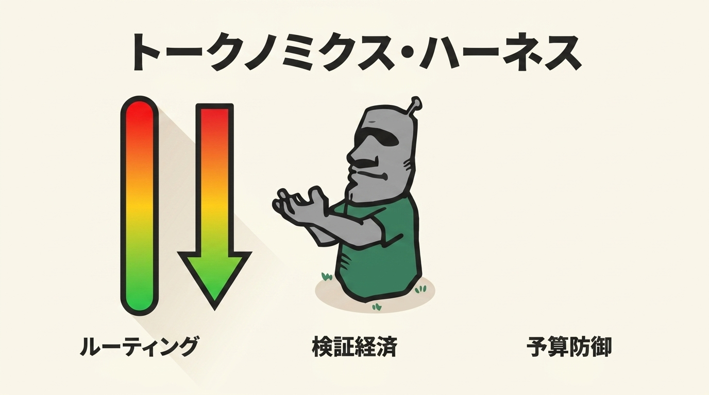
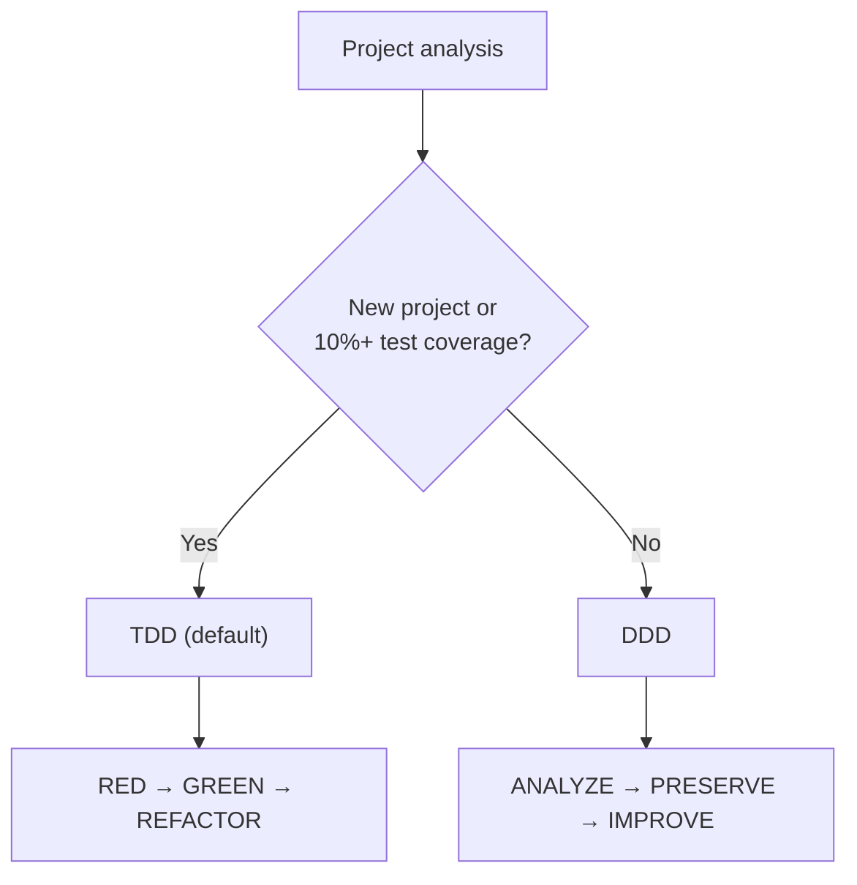

<p align="center">
  
</p>

<h1 align="center">MoAI-ADK</h1>

<p align="center">
  <strong>トークノミクスのために設計されたエージェンティック開発キット</strong>
</p>

<p align="center">
  <a href="./README.md">English</a> ·
  <a href="./README.ko.md">한국어</a> ·
  日本語 ·
  <a href="./README.zh.md">中文</a>
</p>

<p align="center">
  <a href="https://book.mo.ai.kr" target="_blank"><strong>公式書籍『Claude Code 実践エージェンティックコーディング』</strong></a><br>
  MoAI-ADK製作者による実践的ハーネスエンジニアリングガイド — <a href="https://book.mo.ai.kr" target="_blank">book.mo.ai.kr</a>
</p>

<p align="center">
  <a href="https://github.com/modu-ai/moai-adk/actions/workflows/ci.yml"></a>
  <a href="https://github.com/modu-ai/moai-adk/actions/workflows/codeql.yml"></a>
  <a href="https://codecov.io/gh/modu-ai/moai-adk"></a>
  <br>
  <a href="https://go.dev/"></a>
  <a href="https://github.com/modu-ai/moai-adk/releases"></a>
  <a href="./LICENSE"></a>
</p>

<p align="center">
  <a href="https://adk.mo.ai.kr"><strong>公式ドキュメント</strong></a> ·
  <a href="https://adk.mo.ai.kr/book">書籍: Claude Code 実践エージェンティックコーディング</a> ·
  <a href="https://discord.gg/Z7E7Mdc5aN">Discord</a>
</p>

---

> **"トークノミクスは、トークン消費を経済的にすることを目的とするハーネスである。"**

---

## MoAI-ADKはトークノミクス・ハーネスである

MoAI-ADK（Agentic Development Kit）は、Claude Codeにコードを生成させ、そのコードを予測可能なコストで信頼できるようにする。ハーネスとは、モデルを外側から包み込むシステムのことである。モデルはトークン単位で動く確率的なワーカーであり、予算も品質基準も、前回のセッションがどこで途切れたかも記憶しない。コストの上限、通過するテストスイート、`/clear` をまたいだ継続性 — こうした性質は毎ターンのプロンプトで植え直せるものではなく、システムが外側から強制しなければならない。

すべての設計はトークノミクスを指向している。どのモデルを使うか、どこまで深く推論するか、コンテキストをどう消費するかは、その場の運任せではなくシステムが決める。Claude Code を置き換えるものではない。Claude Code がユーザーに委ねている部分 — モデルルーティング、品質ゲート、コスト制御、セッション継続性 — を構造で包むだけである。Go で書かれた単一バイナリなので、macOS・Linux・Windows で追加の依存関係なしにそのまま動く。

---

## なぜトークノミクスなのか

トークンの単価は下がり続けているのに、実際のエージェンティックワークフローの支出は上がる。エージェントは一つの課題を解くために数十〜数百ステップを回し、それに比例してトークンを消費する。従量課金ではこれがそのまま請求書になり、サブスクリプションでは全モデルが共有する週間クォータを食い潰す。

### コストはモデル単価ではなく割り当てで決まる

DeepSWE リーダーボード（113 tasks）の実測値がこの問題を示している。同じ Claude 系で、同じ max effort でも、課題あたりのコストは大きく異なる。

| モデル [max] | Pass@1 | 課題あたりコスト | $/解決課題 | トークン/解決課題 | ステップ |
|---|---|---|---|---|---|
| claude-opus-4.8 | 59% | $13.22 | **$22.4** | 229k | 120 |
| claude-fable-5 | 70% | $21.63 | $30.9 | 170k | 88 |
| claude-sonnet-5 | 54% | $26.40 | **$48.9** | 396k | 268 |

Sonnet 5 max は Opus 4.8 max より**高くつく（課題あたり $26.40 vs $13.22）のにスコアが低い（54% vs 59%）**。原因は 268 ステップ — max effort ではリトライループが暴走する。「弱いモデルを強く使えば安くなる」という通念は成立しない。むしろ 3 倍のステップを回し、より多くのクォータを消費する。つまり、コストはモデル単価ではなく**タスクに合ったモデル・推論深度の割り当て**が決まる。

MoAI-ADK はこの割り当てをその場の運任せにせず、システム化する。

---

## 3軸で経済化

### ルーティング — タスクに合ったモデルと推論深度を割り当てる

**Tier×Phase マトリクス**。作業フェーズ（plan / run / sync）と SPEC サイズ（Tier S / M / L）に応じて、モデルと推論深度（effort）を宣言的に割り当てる。深い推論が必要な計画フェーズには高推論モデルを、機械的繰り返しが多い実装フェーズには軽量モデルを割り当て、コスト対品質を最大化する。

**No-Haiku 3ティア・ポリシー**。Haiku をルーティングモデルセットから排除し、3 ティア構造（Sonnet / Opus / Fable）で作業を分散する。機械的作業には Sonnet low effort を割り当ててステップ数を最小化し、推論が必要な箇所には上位モデルを割り当てる。

**プロファイルマトリクス**。単一の per-agent プロファイルマトリクスが、維持される各エージェントを `{model, effort}` ペアにマッピングする。1 つのプロファイル軸 — `max` / `medium`（デフォルト）/ `low`、`llm.profile`（`moai init --profile`、`moai update --profile`）で選択 — がアクティブ列を選び、`moai model profile` が各エージェントのセルを解決する。10 個のグループ化されたエージェントはマトリクスから model+effort を受け取り（どこにも Haiku はない）、`Explore` とユーザー定義エージェントはセッションモデルを継承する。

**CG モード（Claude + GLM）**。`moai cg` は Claude リーダーと GLM ワーカーを組み合わせたハイブリッドモードである。戦略・計画・監査は Claude が担当し、大量の実装作業は GLM が担当する。実装集中作業で **60-70% のコスト削減** 効果がある。

### 検証経済 — コンテキストをダイエットし、証拠はディスクに

**verify-diet**。検証コマンドの長大な出力をディスクファイルにリダイレクトし、コンテキストには終了コードと bounded tail（最大 50 行）だけ残す。このファイル・リダイレクト契約は検証証拠の完全性を保ちながらコンテキスト消費を削減する。証拠は `.moai/state/verify/<session>/` 配下に永続化される。

**プロンプトキャッシュ**。リクエストの接頭部が直前のリクエストと同一の場合、その部分を再処理せず再利用する。キャッシュから読んだトークンは基本入力単価の 0.1 倍で課金される。常時ロードされる指示を最小化すれば、この適中率はすぐに上がる。ステータスラインのキャッシュ適中率セグメント（`♻️`）でリアルタイムの確認が可能。

**コンテキストダイエット**。`/clear` 戦略を適用する。SPEC フェーズが終われば `/clear` して進行状態を `progress.md` に保存し、ペースト可能なレジュームメッセージを発行する。コンテキストウィンドウ閾値（1M モデル 50% / 200K モデル 90%）で自動的な推奨が表示される。

### 予算防御 — 超過前に停止して次セッションへ継ぐ

**Token Circuit Breaker**。エージェント別トークン使用量が hard-limit（デフォルト 90%）に達すると、安全な中断を実行する。進行状態を `progress.md` に保存し、ペースト可能なレジュームメッセージ（paste-ready resume）を発行し、自動 `/clear` は絶対にしない。システムは `/clear` を実行するよう推奨するだけであり、ユーザーが判断して実行する。

**ステータスライン**。コンテキスト使用率（CW%）、プロンプトキャッシュ適中率、レートリミット枯渇率をターミナル下端に常に表示すれば、トークン運用状態を一瞥で読める。CW% の隣の `(⚠️/clear)` マーカーは、モデル別閾値で表示される。

---

## インフラがトークノミクスを持続させる

### 品質構造 — 手戻し・デバッグ繰り返し（トークン浪費最悪ケース）を防ぐ

**SPEC 3 フェーズライフサイクル**。plan → run → sync。Tier S/M/L サイズ分類が検証深度と PR ルーティングを決定し、GEARS 形式要件 + 受入基準で完了を証拠で判定する。

**TRUST 5 品質ゲート**。Tested（85%+ カバレッジ）・Readable ・ Unified ・ Secured ・ Trackable、すべての変更に適用される。検証はエージェントではなくゲートが判定する。

**11 エージェントカタログ**。MoAI カスタム 10 + 内蔵 Explore。計画と監査を設計段階から分離し、作成した側が自作業に点数をつけないようにする。

### 学習ループ — ループが回るほどトークン効率が改善する

**`/moai goal`・`/moai loop`**。完了条件を一つ宣言すれば、満たされるかターン限界（デフォルト 30）に達するまでセッションが自律的に動作する。`/moai loop` は LSP 診断・AST-grep ・リンターを並列スキャンし、出てきた問題をレベル分けしてキューが空になるまで回す。

**Routing Ledger**。ルーティング決定とゲート証拠をプライバシー保持ダイジェストとして記録する。観察がルールに昇格する。

**4 段階学習ラダー**。観察（≥1）→ ヒューリスティック（≥3）→ ルール（≥5）→ 自動更新（≥10、ユーザー承認必須）；信頼度下限 0.70。すべての適用は `moai harness rollback` で元に戻せる。

**決定メモリ**。質問は不確実性が最も高い箇所（p ≒ 0.5）から出て、推奨はシステムデフォルトではなく観測された統計的多数に従う。

### 拡張ポイント — 同一パターンをプロジェクト固有に複製して再利用効率

**Harness v4 Builder**。自然言語リクエスト → ドメイン・目標・制約抽出 → 承認ゲート → プロジェクト専用エージェント・スキル・コマンド・フックの足場作り。

**@MX タグ**。AI エージェント間でコンテキスト・不変コントラクト・危険ゾーンを受け渡すインラインコードアノテーション。

**worktree 分離**。`/moai plan --worktree` で SPEC ごとに並列開発用分離 worktree を追加する。

---



---

## クイックスタート

### インストール

#### macOS / Linux / WSL

```bash
curl -fsSL https://raw.githubusercontent.com/modu-ai/moai-adk/main/install.sh | bash
```

#### Windows (PowerShell 7.x+)

```powershell
irm https://raw.githubusercontent.com/modu-ai/moai-adk/main/install.ps1 | iex
```

#### ソースからビルド（Go 1.26+）

```bash
git clone https://github.com/modu-ai/moai-adk.git
cd moai-adk && make build
```

### プロジェクト初期化

```bash
moai init my-project
```

対話型ウィザードが言語とフレームワーク、方法論を自動検出し、モデルポリシーを選んだ後、Claude Code 統合ファイルまで作成する。

### 最初のワークフロー

```bash
claude        # launch Claude Code inside the project
```

```text
/moai plan "Add JWT login"      # SPEC を作成
/moai run SPEC-AUTH-001         # TDD/DDD 実装
/moai sync SPEC-AUTH-001        # docs 同期 + PR 作成
```

自然言語でも構わない。`/moai "fix the login bug"` と書けば、インテント分析（Analyze-First ルーティング）がリクエストを読み適切なワークフローへ回す。

### 要件

| プラットフォーム | 対応環境 | 備考 |
|----------|----------------------|-------|
| macOS | Terminal, iTerm2 | 完全サポート |
| Linux | Bash, Zsh | 完全サポート |
| Windows | **WSL（推奨）**, PowerShell 7.x+ | ネイティブ cmd.exe は非サポート |

**前提条件**

- すべてのプラットフォームで **Git** インストール必須
- **Claude Code** — MoAI-ADK は Claude Code 用のハーネスである
- **推奨**: `gh` CLI（PR 自動化）· `tmux`（CG モード）· 使用言語のリント/テストツールチェイン（例: `golangci-lint`）

---

## リファレンス

### /moai スラッシュコマンド（16個）

| サブコマンド | 役割 |
|------------|------|
| `plan` / `run` / `sync` | SPEC 3 フェーズパイプライン |
| `project` / `harness` / `design` | プロジェクト docs+harness 生成 · harness ライフサイクル · Design-phase 協業 |
| `goal` / `loop` / `fix` | 宣言的 goal ループ · 反復修正 · シングルパス修正 |
| `review` / `gate` / `clean` | コードレビュー · pre-commit 品質ゲート · デッドコード削除 |
| `mx` / `codemaps` / `feedback` | @MX アノテーション · アーキテクチャ docs · GitHub issue 報告 |
| `e2e` | マルチプラットフォーム E2E テスト（Web/モバイル/デスクトップ、CLI 優先） |
| *(自然言語)* | Analyze-First ルーティング: 自律 plan → run → sync パイプラインへ |

> → 詳細: [Workflow Commands](https://adk.mo.ai.kr/ja/workflow-commands) · [Utility Commands](https://adk.mo.ai.kr/ja/utility-commands)

### CLI コマンド（頻繁に使う 12個）

| コマンド | 説明 |
|---------|-------------|
| `moai init` | 対話型プロジェクトセットアップ（言語/フレームワーク/方法論の自動検出） |
| `moai doctor` | システム状態診断と環境検証 |
| `moai status` | プロジェクト状態要約（Git ブランチ、品質指標） |
| `moai update` | 最新版へアップデート（自動ロールバック対応） |
| `moai cc` / `moai glm` / `moai cg` | Claude 専用 / GLM 専用 / ハイブリッド Claude リーダー + GLM ワーカーセッション |
| `moai worktree <new|list|switch|sync|remove|clean|go>` | 並列 SPEC 開発用 Git worktree 管理 |
| `moai session <list|register|current>` | マルチセッション調整 |
| `moai spec <audit|archive|lint|list|new>` | SPEC ライフサイクルツール |
| `moai goal <arm|status|clear>` | Goal エンジン CLI |
| `moai harness <status|apply|rollback|disable>` | harness 学習ライフサイクル |
| `moai handoff <save|list>` | セッション ハンドオフ記録 |
| `moai preference <list|decay-scan|toggle>` | 決定メモリ管理 |
| `moai web` | Web Console — 6 タブ設定コンソール |

> 全 36 コマンド: [CLI Reference](https://adk.mo.ai.kr/ja/cli-reference)

### 11 エージェントカタログ

| カテゴリ | エージェント | 役割 |
|----------|-------|------|
| **Manager** | manager-spec | Plan-phase SPEC 作成 |
| | manager-develop | Run-phase TDD/DDD/autofix 実装 |
| | manager-docs | Sync-phase ドキュメント化 |
| | manager-git | PR 作成とルーティング |
| | manager-design | Design-phase 協業（Claude Design） |
| **Evaluator** | plan-auditor | 独立計画監査（バイアス防止） |
| | sync-auditor | 4 次元品質スコアリング（Functionality 40 · Security 25 · Craft 20 · Consistency 15） |
| **Builder** | builder-harness | プロジェクト専用エージェント、スキル、コマンド、フックスキャフォールディング |
| **Advisor** | super-advisor | オンデマンド高推論コンサルティング（E1-E4 エスカレーション） |
| **Specialist** | e2e-tester | Web/モバイル/デスクトップ E2E テスト実行（CLI 優先） |
| **Built-in** | Explore | 読み取り専用コードベース探索 |

### TRUST 5 品質ゲート

| 基準 | 意味 | 検証 |
|-----------|---------|------------|
| **T**ested | テスト済み | 85%+ カバレッジ、特性化テスト、単体テスト通過 |
| **R**eadable | 読みやすさ | 明確な命名、一貫したスタイル、リントエラー 0 |
| **U**nified | 統一されている | 一貫したフォーマット、import 順序、プロジェクト構造準拠 |
| **S**ecured | セキュア済み | OWASP 準拠、入力検証、セキュリティ警告 0 |
| **T**rackable | 追跡可能 | Conventional commits、issue 参照、構造化されたロギング |

### 方法論の選択（TDD vs DDD）


```mermaid
flowchart TD
    A["Project analysis"] --> B{"New project or<br/>10%+ test coverage?"}
    B -->|"Yes"| C["TDD (default)"]
    B -->|"No"| D["DDD"]
    C --> F["RED → GREEN → REFACTOR"]
    D --> G["ANALYZE → PRESERVE → IMPROVE"]
```

| 方法論 | サイクル | 対象 |
|-------------|-------|-----|
| **TDD** (デフォルト) | RED → GREEN → REFACTOR | 新規プロジェクトと機能作業 |
| **DDD** | ANALYZE → PRESERVE → IMPROVE | カバレッジ 10% 未満の既存コード |

---

## ステータスラインの読み方

```
🤖 Opus │ 🧠 xhigh·t │ ♻️ 87% │ 🔅 v2.1.212 │ 🗿 v3.0.0 │ ⏳ 2h 34m │ 💬 MoAI
🪫 CW: ████████░░ 88% (⚠️/clear) │ 🔋 5H: ████░░░░░ 45% (4h 30m) │ 🪫 7D: ████████░░ 82% (Jan 21)
📁 moai-adk-go │ 🔀 modu-ai/moai-adk | 🅱️ feat/statusline ↑2 +3 │ 💾 +1 M2 ?0 │ 📋 [run SPEC-AUTH-001-run] │ 💌 PR #1042 (⌥approved)
```

| 要素 | 意味 |
|------|------|
| 🤖 モデル | 現在アクティブなモデル |
| 🧠 effort | 推論努力レベル — 拡張推論が有効なら `·t` 接尾辞 |
| ♻️ キャッシュ適中率 | プロンプトキャッシュ適中率 |
| CW: コンテキスト | コンテキストウィンドウ使用率 + 2 段階 `/clear` マーカー（⚠️ ソフト、🛑 ハード） |
| 5H / 7D | プラン使用率 + リセット時間 |
| 📁 ディレクトリ | プロジェクトディレクトリ名 |
| 🔀 リポジトリ | GitHub リポジトリ identity `owner/name` |
| 🅱️ ブランチ | 現在のブランチ + `↑`ahead `↓`behind + `+`dirty 数 |
| 💾 git 状態 | staged / modified / untracked 数 |
| 📋 タスク | アクティブ SPEC ワークフロー `[コマンド SPEC-ID-フェーズ]` |
| 💌 PR | アクティブ GitHub PR 番号 + レビュー状態（`⌥state`） |

> 詳細: [Statusline Guide](https://adk.mo.ai.kr/ja/advanced/statusline)

---

## FAQ

### Q: すべての関数に @MX タグがないのはなぜですか？

正常である。タグはファンインが高いか複雑か危険なコードだけを選んで表示する。どのプロジェクトでも、コードの大部分はどのタグ基準にも引っかからず、タグがないファイルは欠陥ではない。

### Q: ステータスラインのバージョン表示はどういう意味ですか？

```
🗿 v3.0.0 ⬆️ v3.0.1
```

最初の値は現在インストールされている MoAI-ADK のバージョンであり、矢印は受け取れるアップデートがあることを示している。

### Q: GLM なしで Claude だけで使えますか？

使える。`moai cc` が Claude 専用セッションである。CG モード（`moai cg`、Claude リーダー + GLM ワーカー）と GLM 専用（`moai glm`）はコスト削減のための選択肢に過ぎず、ハーネス・SPEC ワークフロー・品質ゲートはすべてのモードで同一に動作する。

### Q: 既存のプロジェクトにも適用されますか？

適用される。`moai init` がプロジェクト状態を検出して方法論を決定する — カバレッジ 10% 未満の既存コードには DDD（特性化テストで動作を固定した後段階的改善）、新規/十分にテストされたコードには TDD が適用される。

---

## コミュニティとドキュメント

### 貢献について

貢献はいつでも歓迎する。詳細な手順は [CONTRIBUTING.md](CONTRIBUTING.md) にまとめた。

1. リポジトリをフォーク
2. 機能ブランチ作成: `git checkout -b feature/my-feature`
3. テスト作成（新規コードは TDD、既存コードは特性化テスト）
4. テスト・リント・フォーマット通過確認: `make test` · `make lint` · `make fmt`
5. Conventional commit メッセージでコミットし、プルリクエストをオープン

**コード品質要件**: 85%+ カバレッジ · リントエラー 0 · タイプエラー 0 · Conventional commits

### コミュニティ

- [Discord](https://discord.gg/Z7E7Mdc5aN) — リアルタイム討論と tips
- [Issues](https://github.com/modu-ai/moai-adk/issues) — バグレポート、機能リクエスト（Claude Code 内では `/moai feedback`）

### ライセンス

[Apache License 2.0](./LICENSE) — 詳細は LICENSE ファイルを参照。

### ドキュメントガイド

[adk.mo.ai.kr](https://adk.mo.ai.kr) オンラインドキュメントは 12 セクションに分かれている。

| セクション | 説明 |
|---------|------|
| [Getting Started](https://adk.mo.ai.kr/ja/getting-started) | はじめに、インストール、Windows ガイド、init ウィザード、クイックスタート、CLI 概要、FAQ |
| [Core Concepts](https://adk.mo.ai.kr/ja/core-concepts) | MoAI-ADK 同一性、憲法、ハーネスエンジニアリング、SPEC ベース開発、DDD、TRUST 5 |
| [Workflow Commands](https://adk.mo.ai.kr/ja/workflow-commands) | `plan` · `run` · `sync` — SPEC パイプラインの要 |
| [Utility Commands](https://adk.mo.ai.kr/ja/utility-commands) | `fix` · `loop` · `gate` · `review` · `clean` · `codemaps` · `e2e` · `feedback` · `goal` |
| [CLI Reference](https://adk.mo.ai.kr/ja/cli-reference) | 端末 `moai` バイナリの全コマンド — `status`, `profile`, `doctor`, `update`, `web`, `goal`, `handoff`, `harness`, `init`, `worktree` など |
| [Claude Code Guide](https://adk.mo.ai.kr/ja/claude-code) | Claude Code 統合 — 基礎、コンテキスト・メモリ、エージェンティック、拡張性（スキル・フック・プラグイン） |
| [Multi-LLM](https://adk.mo.ai.kr/ja/multi-llm) | CG モードとモデルポリシー |
| [Cost Optimization](https://adk.mo.ai.kr/ja/cost-optimization) | プロンプトキャッシュ戦略とトークンコスト削減 |
| [Guides](https://adk.mo.ai.kr/ja/guides) | CI 自動化、multi-LLM CI などの実戦運用レシピ |
| [Git Worktree](https://adk.mo.ai.kr/ja/worktree) | 並列 SPEC 開発用 worktree ガイド、例、FAQ |
| [Advanced](https://adk.mo.ai.kr/ja/advanced) | トークノミクス概要、トークン予算、ステータスライン、settings.json、フック、@MX タグ、スキルガイド、Harness v4 Builder、自己進化、決定メモリ、カタログシステム、セキュリティノート、CLAUDE.md/エージェントガイド |
| [Contributing](https://adk.mo.ai.kr/ja/contributing) | オープンソース貢献ガイド |

### リンク

- [公式ドキュメント](https://adk.mo.ai.kr)
- [書籍: Claude Code 実践エージェンティックコーディング](https://adk.mo.ai.kr/book)
- [CHANGELOG](./CHANGELOG.md)
- [Claude Code](https://docs.anthropic.com/en/docs/claude-code)
- [Discord コミュニティ](https://discord.gg/Z7E7Mdc5aN)
