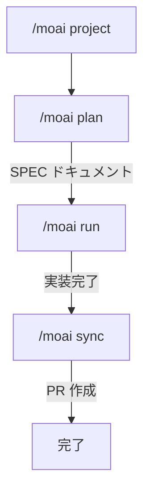
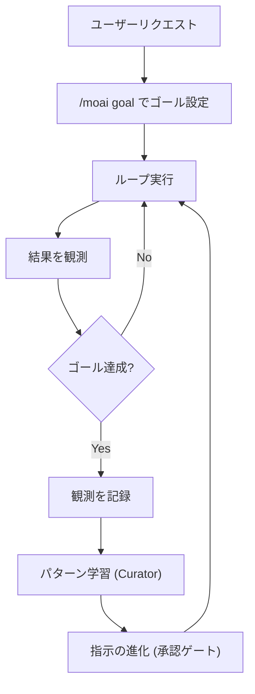
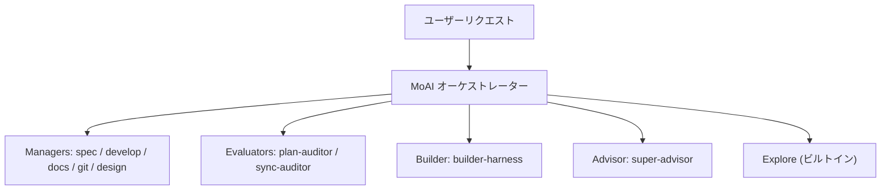
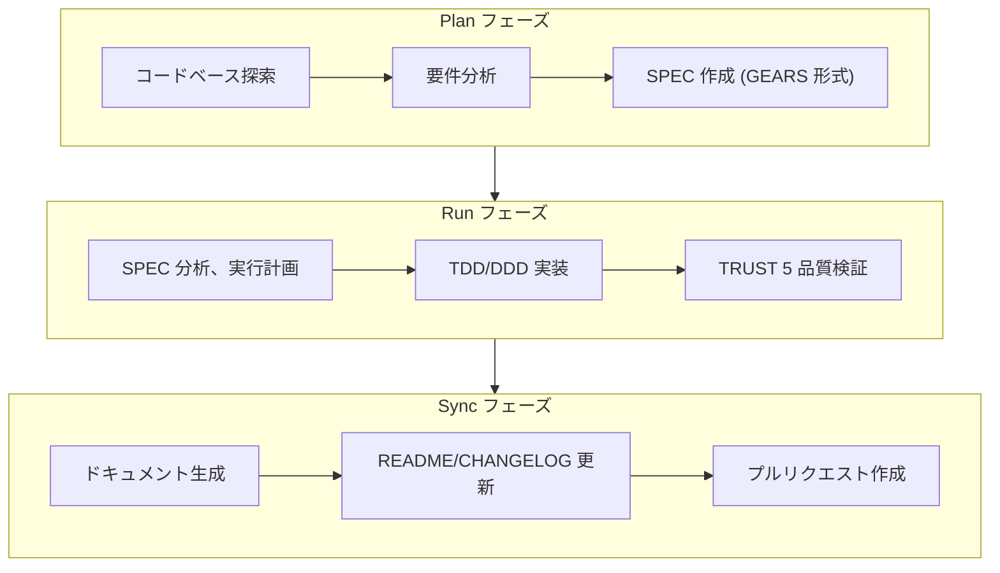
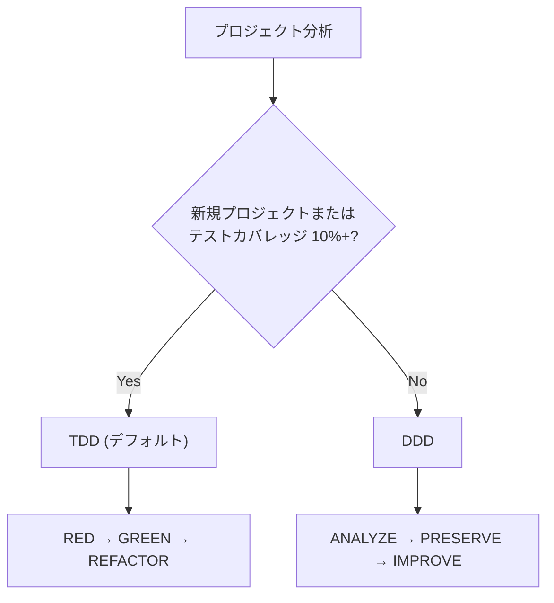

<p align="center">
  
</p>

<h1 align="center">MoAI-ADK</h1>

<p align="center">
  <strong>トークノミクスのために設計されたエージェンティック開発キット</strong>
</p>

<p align="center">
  <a href="./README.md">English</a> ·
  <a href="./README.ko.md">한국어</a> ·
  日本語 ·
  <a href="./README.zh.md">中文</a>
</p>

<p align="center">
  <a href="https://github.com/modu-ai/moai-adk/actions/workflows/ci.yml"></a>
  <a href="https://github.com/modu-ai/moai-adk/actions/workflows/codeql.yml"></a>
  <a href="https://codecov.io/gh/modu-ai/moai-adk"></a>
  <br>
  <a href="https://go.dev/"></a>
  <a href="https://github.com/modu-ai/moai-adk/releases"></a>
  <a href="./LICENSE"></a>
</p>

<p align="center">
  <a href="https://adk.mo.ai.kr"><strong>公式ドキュメント</strong></a> ·
  <a href="https://adk.mo.ai.kr/book">書籍: Claude Code 実践エージェンティックコーディング</a> ·
  <a href="https://discord.gg/Z7E7Mdc5aN">Discord</a>
</p>

---

> **「バイブコーディングの目的は、素早い生産性ではなくコード品質である。」**

MoAI-ADK (Agentic Development Kit) は、**トークノミクス** (Token Economics) を北極星とするエージェンティック開発キットです。より少ないトークンで同じコード品質を、同じトークンでより高い品質を実現します。モデル選択・推論の深さ・コンテキスト使用は、運任せではなくシステムが管理します。

Go で書かれた単一バイナリ。macOS・Linux・Windows で依存関係ゼロ、即座に動作します。

---

## コア概念

### トークノミクス (Token Economics)

ドルあたりの品質を最大化するインテリジェントなリソース配分。No-Haiku 3 ティアモデルポリシー (max / medium / low)、プラン対応ティアプロファイル (API 従量課金 vs. サブスクリプションプラン)、Claude × GLM ハイブリッド (CG モード、実装中心の作業で 60-70% のコスト削減)、そして予算超過の前に優雅に中断する Token Circuit Breaker。

### 再帰的自己学習

ループが観測を蓄積し、ハーネスが学習し、指示が進化します。Routing Observation Ledger がルーティング決定を記録し、Curator がそれを改善提案に変換し、4 ティア学習ラダー (観測 → ヒューリスティック → ルール → 自動更新) がハーネスをアップグレードします — 常にユーザー承認ゲートの背後で。

### エージェンティックハーネス

コードを直接書く代わりに、エージェントがうまく働ける環境を設計します: 11 エージェントカタログ、SPEC ベースの 3 フェーズワークフロー (plan → run → sync)、TRUST 5 品質ゲート、そして自然言語のリクエストからプロジェクト固有のハーネスを生成する Harness v4 Builder。

---

## クイックスタート

### 1. インストール

#### macOS / Linux / WSL

```bash
curl -fsSL https://raw.githubusercontent.com/modu-ai/moai-adk/main/install.sh | bash
```

#### Windows (PowerShell 7.x+)

> **推奨**: 最良の体験のため、上記の Linux インストールコマンドで WSL を使用してください。

```powershell
irm https://raw.githubusercontent.com/modu-ai/moai-adk/main/install.ps1 | iex
```

> 先に [Git for Windows](https://gitforwindows.org/) のインストールが必要です。

#### ソースからビルド (Go 1.26+)

```bash
git clone https://github.com/modu-ai/moai-adk.git
cd moai-adk && make build
```

> ビルド済みバイナリは [Releases](https://github.com/modu-ai/moai-adk/releases) ページで入手できます。

### 2. プロジェクトの初期化

```bash
moai init my-project
```

対話式ウィザードが言語・フレームワーク・方法論を自動検出し、モデルポリシーを選択して、Claude Code 統合ファイルを生成します。

### 3. Claude Code で開発を開始

```bash
claude        # プロジェクト内で Claude Code を起動
```

```text
/moai plan "Add JWT login"      # SPEC を作成
/moai run SPEC-AUTH-001         # TDD/DDD 実装
/moai sync SPEC-AUTH-001        # ドキュメント同期 + PR 作成
```

自然言語で頼むだけでも構いません — `/moai "fix the login bug"` は意図分析 (Analyze-First ルーティング) を通り、どの会話言語でも適切なワークフローに着地します。


```mermaid
flowchart TD
    A["/moai project"] --> B["/moai plan"]
    B -->|"SPEC ドキュメント"| C["/moai run"]
    C -->|"実装完了"| D["/moai sync"]
    D -->|"PR 作成"| E["完了"]
```

### 4. Windows 注意事項: 非 ASCII ユーザー名パス

Windows のユーザー名に非 ASCII 文字 (日本語・韓国語・中国語など) が含まれる場合、Windows の 8.3 短縮ファイル名変換に起因する `EINVAL` エラーに遭遇することがあります。回避策:

```powershell
# Option 1: point MoAI at an ASCII-only temp directory
$env:MOAI_TEMP_DIR="C:\temp"
New-Item -ItemType Directory -Path "C:\temp" -Force

# Option 2: disable 8.3 filename generation (requires admin)
fsutil 8dot3name set 1
```

3 つ目の選択肢は、ASCII のみのユーザー名で Windows アカウントを作成することです。

---

## システム要件

| プラットフォーム | サポート環境 | 備考 |
|----------|----------------------|-------|
| macOS | Terminal, iTerm2 | 完全サポート |
| Linux | Bash, Zsh | 完全サポート |
| Windows | **WSL (推奨)**, PowerShell 7.x+ | ネイティブ cmd.exe は非サポート |

**前提条件:**

- **Git** — すべてのプラットフォームでインストール必須
- **Claude Code** — MoAI-ADK は Claude Code のためのハーネスです
- **Windows ユーザー**: [Git for Windows](https://gitforwindows.org/) が**必須** (Git Bash を含む)。レガシーの Windows PowerShell 5.x と cmd.exe は**非サポート**
- **推奨**: `gh` CLI (PR 自動化) · `tmux` (CG モード) · 使用言語の lint/test ツールチェーン (例: `golangci-lint`)

---

## 再帰的自己学習

MoAI-ADK のコアイノベーションは、エージェントが自身の運用から学習する再帰的システムです。2 つの動きで構成されます: 観測を蓄積するループと、そこから進化するハーネス。


```mermaid
flowchart TD
    A["ユーザーリクエスト"] --> B["/moai goal でゴール設定"]
    B --> C["ループ実行"]
    C --> D["結果を観測"]
    D --> E{"ゴール達成?"}
    E -->|"No"| C
    E -->|"Yes"| F["観測を記録"]
    F --> G["パターン学習 (Curator)"]
    G --> H["指示の進化 (承認ゲート)"]
    H --> C
```

### 自己進化するハーネス

```
loop runs → observations accumulate (Routing Ledger) → patterns learned (Curator) → instructions evolve (approval gate)
```

- **Routing Observation Ledger** (`internal/harness/routing/`) — ルーティング決定とゲート証拠をプライバシー保護ダイジェストとして記録
- **4 ティア学習ラダー** (`internal/harness/learner.go`) — 観測 (≥1) → ヒューリスティック (≥3) → ルール (≥5) → 自動更新 (≥10、ユーザー承認必須)、信頼度フロア 0.70
- **5 レイヤー安全パイプライン** — observer (`internal/harness/observer.go`) → learner → applier (`internal/harness/applier.go`、スナップショット優先の境界付き編集) → config/marker アップデーター → ユーザー承認ゲート。すべての適用は `moai harness rollback` で可逆
- 成果物は `.moai/harness/` 配下に保存 (`usage-log.jsonl`、学習済みルール)

```bash
moai harness status      # learning state: observations, patterns, proposals
moai harness apply       # apply a proposal (passes the user approval gate)
moai harness rollback    # revert the last application
moai harness disable     # turn learning off
```

### /moai goal — 宣言的エージェンティックループ

完了条件を宣言すると、条件が成立するかターン上限 (デフォルト 30) に達するまでセッションが働き続けます。`internal/goal/` に、セッションごとのゴール状態 (`.moai/state/goal/<session-id>.json`) とハイブリッド 2 ティア Stop フック評価器として実装されています — Tier 1 は機械的チェック (終了コード、grep カウント、ファイル存在、ターン上限)、Tier 2 はチェックポイント経由のオーケストレーター自己評価です。

```text
/moai goal "go test ./... exits 0 and every AC is recorded as PASS"
/moai goal status
/moai goal clear
```

### /moai loop vs /moai fix — 診断的自己修復

`/moai loop` は Ralph Engine (`internal/ralph/engine.go`) 上に構築されたゴールエンジンプリセットです: LSP 診断 + AST-grep + リンターで並列スキャンし、所見を Level 1 (自動修正可能) から Level 4 (人間が必要) に分類し、キューが空になるまで反復します — 同じエラーが繰り返されると戦略を切り替える収束検出と、セーフティストップとしてのハード反復上限付きです。

| コマンド | ゴール | 実行 | 使いどころ |
|---------|------|-----------|-------------|
| `/moai fix` | シングルパス修復 | スキャン→分類→修正→検証を 1 パス | 明確なエラー、素早い修正 |
| `/moai loop` | 完了まで反復 | 診断 → 分類 → 修正 → 検証のループ | 複合エラー、根本原因の修復 |

### Analyze-First ルーティング

言語に依存しない意図分析が `/moai` のデフォルトルーティングです。リクエストは意味で分類され — 英語キーワードマッチングでゲートされることは決してなく — どの会話言語でも動作します:

1. 意図分析 (言語非依存の分類)
2. コンテキスト充足チェック (コンテキスト不足時はソクラテス式インタビューが起動)
3. 実行計画の構成 (スキル / エージェント / 動的ワークフローのチェーン)
4. オーケストレーションモード選択 (solo-sequential / parallel-subagents / dynamic-workflow)

### セッションハンドオフ自動再開

コンテキストウィンドウの閾値 (1M コンテキストモデルで 50%、200K モデルで 90%) に達すると、MoAI はペースト可能な再開メッセージ — 進捗状態、適用済みレッスン、検証可能な前提条件を含む — を出力します。`/clear` 後にペースト 1 回で次のセッションが継続できます。

→ 続きを読む: [自己進化するハーネス](https://adk.mo.ai.kr/ja/advanced/self-evolving) · [Decision Memory](https://adk.mo.ai.kr/ja/advanced/decision-memory)

---

## エージェンティックハーネス

コードを直接書く代わりに、エージェントが働く環境を構築します。

### 11 エージェントカタログ

11 の保持エージェント: 10 の MoAI カスタムと Anthropic ビルトインの `Explore`。

| カテゴリ | エージェント | 役割 |
|----------|-------|------|
| **Manager** | manager-spec | Plan フェーズの SPEC 作成 |
| | manager-develop | Run フェーズの TDD/DDD/autofix 実装 |
| | manager-docs | Sync フェーズのドキュメント |
| | manager-git | PR 作成とルーティング |
| | manager-design | Design フェーズの協業 (Claude Design) |
| **Evaluator** | plan-auditor | 独立した計画監査 (バイアス防止) |
| | sync-auditor | 4 次元品質スコアリング (Functionality 40 · Security 25 · Craft 20 · Consistency 15) |
| **Builder** | builder-harness | プロジェクト固有のエージェント・スキル・コマンド・フックをスキャフォールド |
| **Advisor** | super-advisor | オンデマンドの高推論コンサルテーション (E1-E4 エスカレーション) |
| **Specialist** | e2e-tester | Web・モバイル・デスクトップの E2E テスト実行 (CLI 優先) |
| **Built-in** | Explore | 読み取り専用のコードベース探索 |

計画と監査は設計上分離されています — 作成者が自分の仕事を採点することはありません。


```mermaid
flowchart TD
    U["ユーザーリクエスト"] --> M["MoAI オーケストレーター"]
    M --> MG1["Managers: spec / develop / docs / git / design"]
    M --> EV["Evaluators: plan-auditor / sync-auditor"]
    M --> BD["Builder: builder-harness"]
    M --> AD["Advisor: super-advisor"]
    M --> EX["Explore (ビルトイン)"]
```

### SPEC 3 フェーズライフサイクル

```
/moai plan → [plan-auditor audit] → Implementation Kickoff Approval (human gate) → /moai run → /moai sync → [sync-auditor scoring]
```

- ライフサイクルは厳密に 3 フェーズ — **plan → run → sync**
- Tier S/M/L のサイズ分類が検証の深さと PR ルーティングを決定
- GEARS 形式の要件と受け入れ基準 (AC) — 完了は「できたように見える」ではなく証拠で判定


```mermaid
flowchart TB
    subgraph Plan ["Plan フェーズ"]
        P1["コードベース探索"] --> P2["要件分析"]
        P2 --> P3["SPEC 作成 (GEARS 形式)"]
    end

    subgraph Run ["Run フェーズ"]
        R1["SPEC 分析、実行計画"] --> R2["TDD/DDD 実装"]
        R2 --> R3["TRUST 5 品質検証"]
    end

    subgraph Sync ["Sync フェーズ"]
        S1["ドキュメント生成"] --> S2["README/CHANGELOG 更新"]
        S2 --> S3["プルリクエスト作成"]
    end

    Plan --> Run
    Run --> Sync
```

### 開発方法論 — TDD と DDD

MoAI-ADK は `moai init` 時にプロジェクトの状態から方法論を選択します (`--mode <ddd|tdd>`、デフォルト: tdd)。後から `.moai/config/sections/quality.yaml` の `development_mode` で変更できます。


```mermaid
flowchart TD
    A["プロジェクト分析"] --> B{"新規プロジェクトまたは<br/>テストカバレッジ 10%+?"}
    B -->|"Yes"| C["TDD (デフォルト)"]
    B -->|"No"| D["DDD"]
    C --> F["RED → GREEN → REFACTOR"]
    D --> G["ANALYZE → PRESERVE → IMPROVE"]
```

| 方法論 | サイクル | 対象 |
|-------------|-------|-----|
| **TDD** (デフォルト) | RED (失敗するテスト) → GREEN (最小限の合格) → REFACTOR (グリーンテスト下での品質向上) | 新規プロジェクトと機能開発 |
| **DDD** | ANALYZE (依存関係、ドメイン境界) → PRESERVE (特性テスト) → IMPROVE (テスト保護下での漸進的変更) | カバレッジ 10% 未満の既存コード |

### TRUST 5 品質ゲート

すべてのコード変更は 5 つの基準で検証されます:

| 基準 | 意味 | 検証 |
|-----------|---------|------------|
| **T**ested | テスト済み | 85%+ カバレッジ、特性テスト、ユニットテスト合格 |
| **R**eadable | 可読性 | 明確な命名、一貫したスタイル、lint エラー 0 |
| **U**nified | 統一性 | 一貫したフォーマット、import 順序、プロジェクト構造の遵守 |
| **S**ecured | セキュア | OWASP 準拠、入力検証、セキュリティ警告 0 |
| **T**rackable | 追跡可能 | Conventional commits、issue 参照、構造化ログ |

### Harness v4 Builder

```text
/moai harness "build me a harness for CLI template development"
```

自然言語のリクエストがドメイン/ゴール/制約の抽出と承認ゲートを通り、プロジェクト固有のエージェント・スキル・コマンドを生成します。`/moai project` はプロジェクトドキュメント (product.md、structure.md、tech.md、codemaps/) を生成し、あわせてハーネスを自動構成します。

### オーケストレーションプリミティブ

静的な Agent Teams レイヤーは v3 で廃止されました。誰が計画を保持するかで選ぶ 3 つのオーケストレーションプリミティブが残ります:

| プリミティブ | 形態 | 適した用途 |
|-----------|-------|----------|
| 逐次サブエージェント | オーケストレーターがターンごとに委譲 | コーディング中心の作業 |
| 並列ファンアウト | 1 ターンで複数の読み取り専用 `Agent()` 呼び出し | リサーチ、レビュー、監査 |
| 動的ワークフロー | スクリプトが数十のエージェントをオーケストレート、結果はスクリプト変数に保持 | コードベース一括処理、大規模マイグレーション |

ネイティブの Claude Code チームメイトランタイム (`moai cg` の tmux ペイン) はこの廃止の影響を受けません。

### Ultracode — xhigh Effort + 自動オーケストレーション

```text
/effort ultracode
```

`/effort ultracode` は `xhigh` の推論エフォートと動的ワークフローの自動オーケストレーションを組み合わせます (Claude Code v2.1.154+)。セッション内の実質的なタスクごとに最適なオーケストレーションプリミティブが自動的に選ばれ、大規模なファンアウトはスクリプトとして実行され、その中間結果はセッションコンテキストではなくスクリプト変数に保持されます。コードベース全体のスキャンや数百の独立したタスクなど、ファンアウトそのものが支配的なコストとなる大規模な並列一括処理・監査・マイグレーションで活用してください。単発のリクエストであれば、セッション全体を切り替える代わりに `ultracode` キーワードを先頭に付けてください。

→ 続きを読む: [動的ワークフローと Ultracode](https://adk.mo.ai.kr/ja/advanced/ultracode-workflows)

### Decision Memory

MoAI-ADK は AskUserQuestion での決定を記録し、将来の推奨をパーソナライズします:

- **3 ティアメモリ** — Core (ホットな好み) / Recall (直近セッション) / Archival (ソフト削除付き 28 日 TTL)
- **適応的配置** — 質問は不確実性が最も高い場所 (p ≈ 0.5) で発火し、推奨はシステムデフォルトではなく観測された統計的多数派に従う
- **減衰ポリシー** — べき乗則の重み `(age+1)^(-0.5)`。好みを使うとリフレッシュされる
- **コントロール** — `moai preference list | decay-scan | toggle`。セキュリティ関連のセンシティブなドメインでは開示付きの中立的な推奨

→ 続きを読む: [Harness v4 Builder](https://adk.mo.ai.kr/ja/advanced/harness-v4-builder) · [カタログシステム](https://adk.mo.ai.kr/ja/advanced/catalog-system)

---

## ツールリファレンス

### `/moai` スラッシュサブコマンド

> **重要な区別**: `moai` (ターミナル CLI) ≠ `/moai` (Claude Code スラッシュコマンド)。前者はシェルで実行する Go バイナリ (`moai init`、`moai doctor`)、後者は Claude Code チャット内で実行する AI ワークフロールーター (`/moai plan`、`/moai run`) です。両者は別のツールです。

16 エントリ — 15 の名前付きサブコマンドと自然言語デフォルト:

| サブコマンド | 役割 |
|------------|------|
| `plan` / `run` / `sync` | SPEC 3 フェーズパイプライン |
| `goal` / `loop` / `fix` | 宣言的ゴールループ · 反復修復 · シングルパス修復 |
| `project` / `harness` | プロジェクトドキュメント + ハーネス生成 · ハーネスライフサイクル |
| `review` / `gate` / `clean` | コードレビュー · プレコミット品質ゲート · デッドコード除去 |
| `mx` / `codemaps` / `feedback` | @MX アノテーション · アーキテクチャドキュメント · GitHub issue 報告 |
| `e2e` | マルチプラットフォーム E2E テスト (Web/モバイル/デスクトップ、CLI 優先) |
| *(自然言語)* | 自律的な plan → run → sync パイプラインへの Analyze-First ルーティング |

→ 詳細: [ワークフローコマンド](https://adk.mo.ai.kr/ja/workflow-commands) · [ユーティリティコマンド](https://adk.mo.ai.kr/ja/utility-commands)

### CLI コマンド (トップレベル 36)

`moai` バイナリは 36 のトップレベルコマンドを登録します。日常的に使うセット:

| コマンド | 説明 |
|---------|-------------|
| `moai init` | 対話式プロジェクトセットアップ (言語/フレームワーク/方法論の自動検出) |
| `moai doctor` | システムヘルス診断と環境検証 |
| `moai status` | プロジェクトステータス要約 (Git ブランチ、品質メトリクス) |
| `moai update` | 最新バージョンへ更新 (自動ロールバック対応) |
| `moai update -c` | init ウィザードを再実行して設定を編集 (テンプレート同期なし) |
| `moai cc` / `moai glm` / `moai cg` | Claude のみ / GLM のみ / ハイブリッド Claude リーダー + GLM ワーカーのセッション |
| `moai worktree <new\|list\|switch\|sync\|remove\|clean\|go>` | 並列 SPEC 開発のための Git worktree 管理 |
| `moai session <list\|register\|current>` | マルチセッション調整 |
| `moai spec <audit\|archive\|lint\|list\|new>` | SPEC ライフサイクルツール |
| `moai goal <arm\|status\|clear>` | ゴールエンジン CLI |
| `moai harness <status\|apply\|rollback\|disable>` | ハーネス学習ライフサイクル |
| `moai handoff <save\|list>` | セッションハンドオフ記録 |
| `moai preference <list\|decay-scan\|toggle>` | Decision Memory 管理 |
| `moai hook <event>` | Claude Code フックディスパッチャー |
| `moai web` | Web コンソール — 設定 CRUD、SPEC ボード、エージェント構成 (en/ko/ja/zh) |
| `moai inventory` | セッション・worktree・ハーネスの読み取り専用インベントリ (`--json` 対応) |
| `moai version` | バージョン、コミットハッシュ、ビルド日時 |

その他の登録コマンド: `mx`、`clean`、`codemaps`、`feedback`、`loop`、`lsp`、`ast-grep`、`agent`、`workflow`、`statusline`、`telemetry`、`constitution`、`state`、`tool-policy`、`migrate`、`profile`、`pr`、`github`、`research`。

→ 詳細: [CLI リファレンス](https://adk.mo.ai.kr/ja/cli-reference)。CLI リファレンスセクションには、`goal`・`handoff`・`harness`・`init`・`launchers`・`loop`・`pr`・`session`・`spec`・`tool-policy`・`worktree` を含む **11 の新しい個別コマンドページ**が追加されました。

### フック

すべてのフックイベントは、JSON stdin/stdout 通信による Claude Code フックプロトコルに従います:

- **27 のイベントタイプ** — SessionStart、PreToolUse、PostToolUse、SessionEnd、Stop、SubagentStop、PreCompact、PostCompact、TeammateIdle、TaskCompleted など
- **4 つのフックタイプ** — command (シェルスクリプト)、prompt (LLM 評価)、agent (サブエージェント検証)、http (webhook エンドポイント)
- タスクメトリクスは `.moai/logs/task-metrics.jsonl` に記録され、セッション分析とコスト追跡に使われます

→ 詳細: [フックガイド](https://adk.mo.ai.kr/ja/advanced/hooks-guide) · [フックリファレンス](https://adk.mo.ai.kr/ja/advanced/hooks-reference)

### ステータスライン

MoAI は Claude Code ターミナルの下部にリッチなステータスラインを表示します: モデルティア/effort、MoAI バージョン (更新マーカー付き)、Git ブランチと変更状態、コンテキストウィンドウ使用率 (CW%)、キャッシュヒット率、セッションコスト/トークン。

CW% には 2 段階の `/clear` マーカーがあります — モデル固有の閾値 (Opus 4.8 や GLM-5.2[1m] のような 1M コンテキストモデルで 50%、200K モデルで 90%) でのソフト警告と、絶対上限でのハードマーカー。Claude Code は GLM-5.2 を 200K モデルと誤報告します (上流 Issue #653)。MoAI は `internal/statusline/memory.go` で 1M に補正しているため、MoAI ステータスラインの CW% を信頼してください。

→ 詳細: [ステータスライン](https://adk.mo.ai.kr/ja/advanced/statusline)

### 出力スタイル

| スタイル | 特徴 | 対象 |
|-------|-----------|----------|
| **MoAI** (expert) | 密度が高く簡潔 | 経験豊富な開発者 |
| **MoAI-Easy** (basic) | フレンドリーで説明的 — 製品デフォルト | 新規ユーザー |
| **MoAI-Learn** (learn) | ソクラテス式チューター | 学習者 |

切り替えは `/config` から (最優先スコープの `settings.local.json` に保存)。出力スタイルはセッション開始時に 1 回だけ読み込まれます — 変更は `/clear` または新しいセッションから反映されます。

→ 詳細: [Advanced](https://adk.mo.ai.kr/ja/advanced) · [Claude Code Guide](https://adk.mo.ai.kr/ja/claude-code/foundations)

### @MX タグシステム

@MX タグは、コンテキスト・不変条件契約・危険ゾーンを AI エージェント間で受け渡すインラインコードアノテーションです。

```go
// @MX:ANCHOR: [AUTO] Hook registry dispatch - 5+ callers
// @MX:REASON: [AUTO] Central entry point for all hook events, changes have wide impact
func DispatchHook(event string, data []byte) error {
    // ...
}
```

| タグ | 目的 | トリガー |
|-----|---------|---------|
| `@MX:ANCHOR` | 不変条件契約 | fan_in >= 3 — 変更の影響が広い |
| `@MX:WARN` | 危険ゾーン | ゴルーチン、複雑度 >= 15、グローバル状態の変更 |
| `@MX:NOTE` | コンテキスト | マジック定数、ドキュメント欠落、ビジネスルール |
| `@MX:TODO` | 未完了作業 | テスト欠落、未実装機能 |

このシステムはシグナル対ノイズ比を最適化します: **AI が最初に注目すべきコードだけがタグを持ちます。**ほとんどのコードはどの基準にも該当せずタグを持ちません — それが正常であり意図された状態です。閾値とファイルごとの上限は `.moai/config/sections/mx.yaml` で設定し、スキャンは `/moai mx --all` (または `--dry`、`--priority P1`) で実行します。

→ 詳細: [@MX タグ](https://adk.mo.ai.kr/ja/advanced/mx-tags)

### Worktree 分離

`/moai plan --worktree` は各 SPEC に並列開発のための分離された git worktree を与えます。`moai worktree` がライフサイクルを管理します (`new --tmux` は worktree 内に tmux セッションを自動作成)。

→ 詳細: [Git Worktree](https://adk.mo.ai.kr/ja/worktree)

### サポート 16 言語

go · python · typescript · javascript · rust · java · kotlin · csharp · ruby · php · elixir · cpp · scala · r · flutter · swift — プロジェクトマーカーで検出され、それぞれ標準の lint/format/test ツールチェーンが実行されます。未インストールのツールは静かにスキップされます。

→ 詳細: [CLI リファレンス](https://adk.mo.ai.kr/ja/cli-reference) · [Advanced](https://adk.mo.ai.kr/ja/advanced)

---

## FAQ

### Q: なぜすべての関数に @MX タグが付かないのですか?

**それが正常です。**タグは fan-in の高い、複雑な、あるいは危険なコードだけに付きます。どのプロジェクトでもほとんどのコードはタグの基準に該当しません — タグのないファイルは欠陥ではありません。

### Q: ステータスラインのバージョンインジケーターは何を意味しますか?

```
🗿 v3.0.0-rc11 ⬆️ v3.0.0-rc12
```

最初の値はインストール済みの MoAI-ADK バージョンで、矢印は利用可能な更新を示します (`moai update` の実行で消えます)。これは Claude Code 自身のバージョンインジケーターとは別物です。

## コントリビューション

コントリビューションを歓迎します! 詳細なガイドラインは [CONTRIBUTING.md](CONTRIBUTING.md) を参照してください。

1. リポジトリをフォーク
2. フィーチャーブランチを作成: `git checkout -b feature/my-feature`
3. テストを書く (新規コードは TDD、既存コードは特性テスト)
4. テスト・lint・フォーマットの合格を確認: `make test` · `make lint` · `make fmt`
5. Conventional commit メッセージでコミットし、プルリクエストを作成

**コード品質要件**: 85%+ カバレッジ · lint エラー 0 · 型エラー 0 · Conventional commits

### コミュニティ

- [Discord](https://discord.gg/Z7E7Mdc5aN) — リアルタイムの議論とヒント
- [Issues](https://github.com/modu-ai/moai-adk/issues) — バグ報告、機能リクエスト (Claude Code 内からは `/moai feedback` でも可)

---

## ライセンス

[Apache License 2.0](./LICENSE) — 詳細は LICENSE ファイルを参照してください。

## ドキュメンテーションガイド

公式ドキュメントサイト [adk.mo.ai.kr](https://adk.mo.ai.kr) は 12 のセクションで構成されています。各セクションの日本語版は `https://adk.mo.ai.kr/ja/<セクション>` で読めます。

| セクション | 内容 | パス |
|----------|------|------|
| Getting Started | インストール・初期化ウィザード・クイックスタート・CLI・FAQ | [/ja/getting-started](https://adk.mo.ai.kr/ja/getting-started) |
| Core Concepts | 全体像・憲法・ハーネスエンジニアリング・SPEC ベース開発・DDD・TRUST 5 | [/ja/core-concepts](https://adk.mo.ai.kr/ja/core-concepts) |
| Workflow Commands | `plan` / `run` / `sync` / `project` / `harness` / `design` | [/ja/workflow-commands](https://adk.mo.ai.kr/ja/workflow-commands) |
| Utility Commands | `fix` / `loop` / `gate` / `mx` / `review` / `clean` / `codemaps` / `e2e` / `feedback` / `goal` / `moai` | [/ja/utility-commands](https://adk.mo.ai.kr/ja/utility-commands) |
| CLI Reference | 36 のトップレベル CLI コマンドの個別リファレンス | [/ja/cli-reference](https://adk.mo.ai.kr/ja/cli-reference) |
| Claude Code Guide | 基礎・コンテキストとメモリ・エージェンティック・拡張機能 | [/ja/claude-code](https://adk.mo.ai.kr/ja/claude-code) |
| Multi-LLM | CG モード・モデルポリシー | [/ja/multi-llm](https://adk.mo.ai.kr/ja/multi-llm) |
| Cost Optimization | プロンプトキャッシング | [/ja/cost-optimization](https://adk.mo.ai.kr/ja/cost-optimization) |
| Guides | CI 自律化・マルチ LLM CI | [/ja/guides](https://adk.mo.ai.kr/ja/guides) |
| Git Worktree | ガイド・例・FAQ | [/ja/worktree](https://adk.mo.ai.kr/ja/worktree) |
| Advanced | トークノミクス詳説・ステータスライン・フック・@MX タグ・ハーネス v4 Builder・自己進化・Decision Memory・カタログシステム他 | [/ja/advanced](https://adk.mo.ai.kr/ja/advanced) |
| Contributing | コントリビューションガイド | [/ja/contributing](https://adk.mo.ai.kr/ja/contributing) |

## リンク

- [公式ドキュメント](https://adk.mo.ai.kr)
- [書籍: Claude Code 実践エージェンティックコーディング](https://adk.mo.ai.kr/book)
- [CHANGELOG](./CHANGELOG.md)
- [Claude Code](https://docs.anthropic.com/en/docs/claude-code)
- [Discord コミュニティ](https://discord.gg/Z7E7Mdc5aN)
