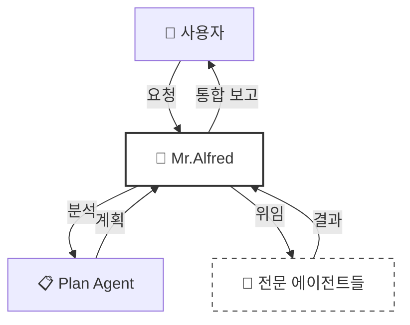
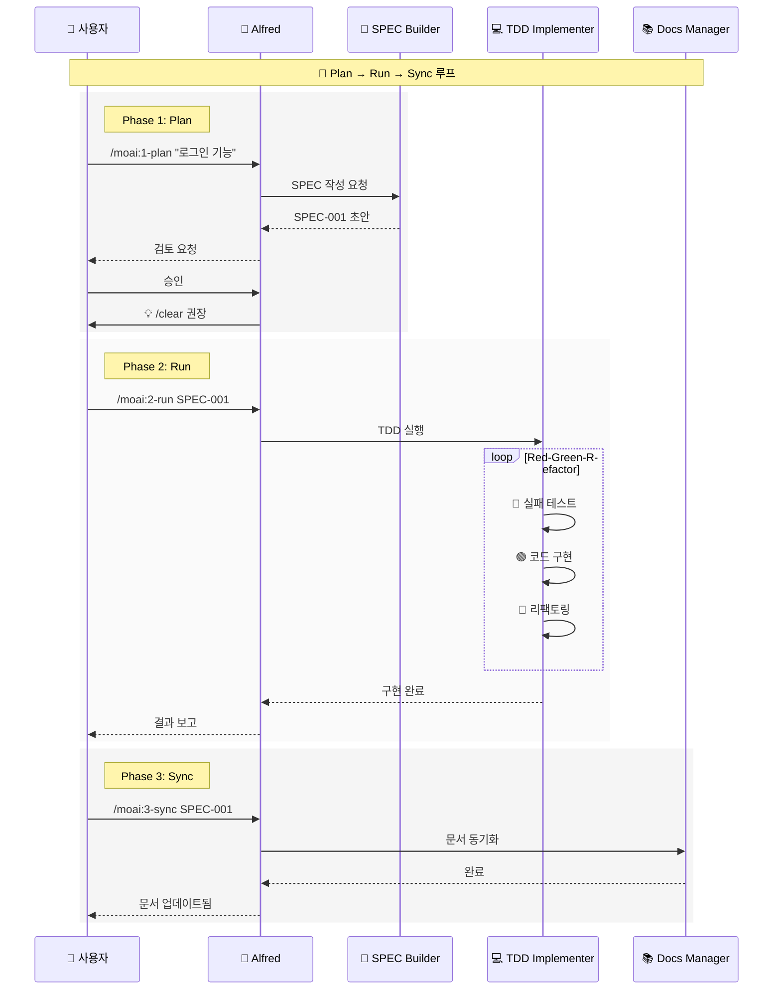
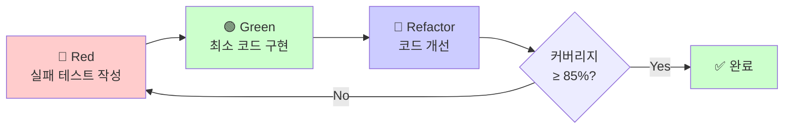
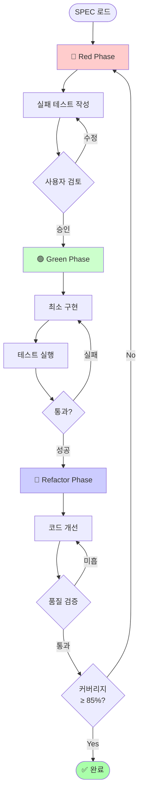
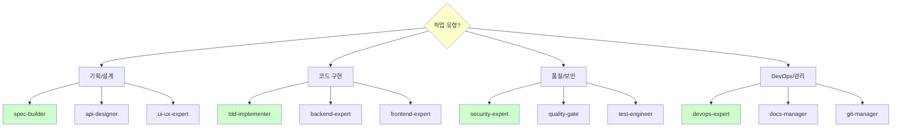
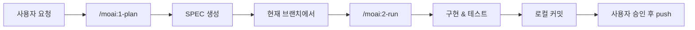
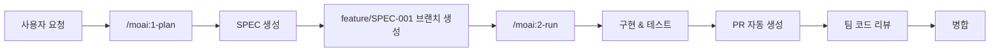

# 🗿 MoAI-ADK: Agentic AI 기반 SPEC-First TDD 개발 프레임워크

**사용 가능한 언어:** [🇰🇷 한국어](./README.ko.md) | [🇺🇸 English](./README.md) | [🇯🇵 日本語](./README.ja.md) | [🇨🇳 中文](./README.zh.md)

[](https://pypi.org/project/moai-adk/)
[](https://opensource.org/licenses/MIT)
[](https://www.python.org/)

---

## 📑 목차

1. [소개](#1-소개-introduction)
2. [빠른 시작](#2-빠른-시작-quick-start---5분)
3. [핵심 개념](#3-핵심-개념-core-concepts)
4. [설치 및 설정](#4-설치-및-설정-installation--setup)
5. [개발 워크플로우](#5-개발-워크플로우-development-workflow)
6. [핵심 커맨드](#6-핵심-커맨드-essential-commands)
7. [에이전트 가이드](#7-에이전트-가이드-agent-guide)
8. [스킬 라이브러리](#8-스킬-라이브러리-skill-library)
9. [실용 예제](#9-실용-예제-practical-examples)
10. [TRUST 5 품질 보증](#10-trust-5-품질-보증-quality-assurance)
11. [설정](#11-설정-configuration)
12. [MCP 서버](#12-mcp-서버-mcp-integration)
13. [고급 기능](#13-고급-기능-advanced-features)
14. [문제 해결](#14-문제-해결-troubleshooting)
15. [추가 자료](#15-추가-자료-additional-resources)

---

## 1. 소개 (Introduction)

### 🗿 MoAI-ADK란?

**MoAI-ADK (Agentic Development Kit)**는 AI 에이전트를 활용한 차세대 개발 프레임워크입니다. **SPEC-First 개발 방법론**과 **TDD(Test-Driven Development, 테스트 주도 개발)**, 그리고 **35명의 전문 AI 에이전트**를 결합하여 완전하고 투명한 개발 라이프사이클을 제공합니다.

### ✨ 왜 MoAI-ADK를 사용할까?

전통적인 개발 방식의 한계:
- ❌ 불명확한 요구사항으로 인한 잦은 재작업
- ❌ 문서화가 코드와 동기화되지 않음
- ❌ 테스트 작성을 미루다 품질 저하
- ❌ 반복적인 보일러플레이트 작성

MoAI-ADK의 해결책:
- ✅ **명확한 SPEC 문서**로 시작하여 오해 제거
- ✅ **자동 문서 동기화**로 항상 최신 상태 유지
- ✅ **TDD 강제**로 85% 이상 테스트 커버리지 보장
- ✅ **AI 에이전트**가 반복 작업을 자동화

### 🎯 핵심 특징

| 특징 | 설명 | 효과 |
|------|------|------|
| **SPEC-First** | 모든 개발은 명확한 명세서로 시작 | 요구사항 명확화, 커뮤니케이션 비용 90% 감소 |
| **TDD 강제** | Red-Green-Refactor 사이클 자동화 | 버그 70% 감소, 리팩토링 자신감 향상 |
| **AI 오케스트레이션** | Mr.Alfred가 35명의 전문 에이전트 지휘 | 개발 속도 3-5배 향상 |
| **자동 문서화** | 코드 변경 시 문서 자동 동기화 | 문서 최신성 100% 보장 |
| **TRUST 5 품질** | Test, Readable, Unified, Secured, Trackable | 엔터프라이즈급 품질 보증 |

---

## 2. 빠른 시작 (Quick Start - 5분)

### 📦 설치

**1단계: `uv` 설치**(Python 패키지 관리자)

```bash
# macOS / Linux
curl -LsSf https://astral.sh/uv/install.sh | sh

# Windows
powershell -ExecutionPolicy ByPass -c "irm https://astral.sh/uv/install.ps1 | iex"
```

**2단계: MoAI-ADK 설치**

```bash
# 글로벌 설치
uv tool install moai-adk

# 버전 확인
moai-adk --version
```

### 🚀 첫 프로젝트 시작

**신규 프로젝트 생성:**

```bash
# 프로젝트 초기화
moai-adk init my-project
cd my-project

# Claude Code 실행
claude
```

**기존 프로젝트에 적용:**

```bash
cd existing-project
moai-adk init .
claude
```

### 💡 첫 커맨드 실행

Claude Code에서 다음 커맨드를 실행해보세요:

```bash
# 1. 프로젝트 설정 확인
/moai:0-project

# 2. 첫 기능 명세 작성
/moai:1-plan "사용자 로그인 기능 구현"

# 3. 컨텍스트 초기화 (필수!)
/clear

# 4. TDD로 구현
/moai:2-run SPEC-001

# 5. 문서 동기화
/moai:3-sync SPEC-001
```

**축하합니다!** 🎉 첫 번째 기능을 SPEC-First TDD로 완성했습니다.

---

## 3. 핵심 개념 (Core Concepts)

### 📋 SPEC-First Development

**SPEC-First란?**

모든 개발은 **명확한 명세서(Specification)**로 시작합니다. SPEC은 **EARS(Easy Approach to Requirements Syntax) 포맷**을 따라 작성되며, 다음을 포함합니다:

- **요구사항**: 무엇을 만들 것인가?
- **제약사항**: 어떤 한계가 있는가?
- **성공 기준**: 언제 완료된 것인가?
- **테스트 시나리오**: 어떻게 검증하는가?

**EARS 포맷 예시:**

```markdown
# SPEC-001: 사용자 로그인 기능

## 요구사항 (Requirements)
- WHEN 사용자가 이메일과 비밀번호를 입력하고 "로그인" 버튼을 클릭할 때
- IF 자격증명이 유효하다면
- THEN 시스템은 JWT(JSON Web Token) 토큰을 발급하고 대시보드로 이동한다

## 제약사항 (Constraints)
- 비밀번호는 최소 8자 이상이어야 한다
- 5회 연속 실패 시 계정 잠금 (30분)

## 성공 기준 (Success Criteria)
- 유효한 자격증명으로 로그인 성공률 100%
- 무효한 자격증명은 명확한 에러 메시지 표시
- 응답 시간 < 500ms
```

### 🎩 Mr. Alfred - Super Agent Orchestrator

**Alfred는 누구인가?**

Mr.Alfred는 MoAI-ADK의 **최고 지휘자(Orchestrator)**입니다. 사용자의 요청을 분석하고, 적절한 전문 에이전트를 선택하여 작업을 위임하며, 결과를 통합합니다.

**Alfred의 역할:**

1. **이해하기**: 사용자 요청 분석 및 불명확한 부분 질문
2. **계획하기**: Plan 에이전트를 통해 실행 계획 수립
3. **실행하기**: 전문 에이전트에게 작업 위임 (순차/병렬)
4. **통합하기**: 모든 결과를 모아 사용자에게 보고



### 🔄 Plan-Run-Sync 워크플로우

MoAI-ADK의 개발은 **3단계 무한 루프**로 진행됩니다:



### 👥 에이전트와 스킬

**에이전트(Agent)란?**

특정 도메인의 전문가 역할을 수행하는 AI 워커입니다. 각 에이전트는 독립적인 200K 토큰 컨텍스트를 가집니다.

**스킬(Skill)란?**

에이전트가 사용하는 전문 지식 모듈입니다. 135개 이상의 스킬이 도메인별로 체계화되어 있습니다.

**예시:**

| 에이전트 | 전문 분야 | 주요 스킬 |
|----------|-----------|-----------|
| `spec-builder` | 요구사항 분석 | `moai-foundation-ears`, `moai-foundation-specs` |
| `tdd-implementer` | TDD 구현 | `moai-foundation-trust`, `moai-essentials-testing` |
| `security-expert` | 보안 검증 | `moai-domain-security`, `moai-security-oauth` |

### 🏆 TRUST 5 프레임워크

모든 코드는 **TRUST 5** 품질 기준을 통과해야 합니다:

| 원칙 | 의미 | 검증 방법 |
|------|------|-----------|
| **T**est-First | 테스트가 먼저 | 테스트 커버리지 ≥ 85% |
| **R**eadable | 읽기 쉬운 코드 | 코드 리뷰, 린트 통과 |
| **U**nified | 일관된 스타일 | 스타일 가이드 준수 |
| **S**ecured | 보안 검증 | OWASP 보안 검사 |
| **T**rackable | 추적 가능 | SPEC-TAG 체인 완성 |

---

## 4. 설치 및 설정 (Installation & Setup)

### 📋 전제조건

| 요구사항 | 최소 버전 | 권장 버전 | 확인 방법 |
|----------|-----------|-----------|-----------|
| Python | 3.11+ | 3.12+ | `python --version` |
| Node.js | 18+ | 20+ | `node --version` |
| Git | 2.30+ | 최신 | `git --version` |
| Claude Code | 2.0.46+ | 최신 | Claude Code 앱 정보 |

### 🔧 설치 방법

**Option 1: `uv` 사용 (권장)**

```bash
# uv 설치
curl -LsSf https://astral.sh/uv/install.sh | sh

# MoAI-ADK 설치
uv tool install moai-adk

# 버전 확인
moai-adk --version
```

**Option 2: `pip` 사용**

```bash
# pip로 설치
pip install moai-adk

# 버전 확인
moai-adk --version
```

### 🎯 프로젝트 초기화

**신규 프로젝트:**

```bash
# 프로젝트 생성
moai-adk init my-awesome-project

# 디렉토리 구조
my-awesome-project/
├── .claude/
│   ├── agents/              # 에이전트 정의
│   ├── commands/            # 커맨드 정의
│   ├── skills/              # 스킬 라이브러리
│   └── settings.json        # Claude Code 설정
├── .moai/
│   ├── memory/
│   │   ├── agents.md        # 에이전트 참조
│   │   ├── commands.md      # 커맨드 참조
│   │   └── ...
│   └── specs/               # SPEC 문서 저장소
└── src/                     # 소스 코드
```

**기존 프로젝트:**

```bash
cd existing-project
moai-adk init .

# Git 저장소와 함께 초기화
moai-adk init . --with-git
```

### ⚙️ .claude/settings.json 설정

**중요**: MoAI-ADK는 `.claude/settings.json` 파일을 사용하여 Claude Code 동작을 제어합니다. (이전 버전의 `.moai/config/config.json`과는 다릅니다)

`.claude/settings.json` 파일을 편집하여 프로젝트를 커스터마이즈하세요:

```json
{
  "user": {
    "name": "개발자이름"
  },
  "language": {
    "conversation_language": "ko",
    "agent_prompt_language": "en"
  },
  "constitution": {
    "enforce_tdd": true,
    "test_coverage_target": 85
  },
  "git_strategy": {
    "mode": "personal"
  },
  "github": {
    "spec_git_workflow": "develop_direct"
  },
  "statusline": {
    "enabled": true,
    "format": "compact",
    "style": "R2-D2"
  }
}
```

**주요 설정 항목:**

- `user.name`: Alfred가 당신을 부르는 이름
- `conversation_language`: 대화 및 문서 언어 (ko/en/ja/zh)
- `agent_prompt_language`: 에이전트 내부 추론 언어 (**항상 "en" 사용**)
- `enforce_tdd`: TDD 강제 여부 (true 권장)
- `test_coverage_target`: 테스트 커버리지 목표 (기본 85%)
- `git_strategy.mode`: Git 전략 (personal/team/hybrid)
- `statusline`: Claude Code 상태 표시줄 설정

### 🌐 에이전트 추론 언어 - 왜 영어만 가능한가?

에이전트의 내부 추론 언어는 **영어만 가능**합니다. 이는 다음 이유 때문입니다:

**1. 토큰 효율성**: Claude는 영어로 추론할 때 토큰 사용량이 최소화됩니다. 한글 추론은 더 많은 토큰을 소비합니다. 동일한 추론을 영어로 수행하면 약 15-20% 적은 토큰을 사용하며, 이는 대규모 프로젝트에서 상당한 비용 절감으로 이어집니다.

**2. 에이전트 & 스킬 자동 트리거**: 모든 에이전트와 스킬의 자동 호출 트리거(trigger keywords)가 영어로 작성되어 있습니다. 영어 추론을 통해 정확하게 호출됩니다. 예를 들어, "security", "test", "api" 같은 키워드가 에이전트 추론 과정에서 나타나면 해당 전문 에이전트가 자동으로 활성화됩니다.

**3. Claude Code 아키텍처**: Claude Code 공식 시스템은 에이전트 추론을 영어로 수행하도록 설계되었습니다. Anthropic의 연구 결과에 따르면, 영어 기반 추론은 다국어 추론보다 일관성과 정확도가 높습니다.

**4. 스킬 라이브러리 호환성**: 135개 이상의 스킬이 모두 영어 기반으로 작성되어 있으며, 영어 추론과 최적으로 통합됩니다.

**따라서 `language.agent_prompt_language`는 항상 `"en"`으로 설정해야 합니다.** `language.conversation_language`만 한글/영문을 선택할 수 있으며, 이는 사용자와의 대화 및 최종 문서 생성 언어를 제어합니다.

---

## 5. 개발 워크플로우 (Development Workflow)

### Phase 1: Plan (SPEC 생성)

**목적:** 모호한 아이디어를 명확한 EARS 포맷 명세서로 변환

**실행 단계:**

```bash
# 1. Plan 커맨드 실행
/moai:1-plan "JWT 토큰 기반 사용자 인증 시스템"

# Alfred의 동작:
# - spec-builder 에이전트 호출
# - 사용자 요구사항 분석
# - 불명확한 부분 질문
# - EARS 포맷 SPEC 문서 생성
# - .moai/specs/SPEC-001/ 디렉토리에 저장

# 2. SPEC 검토
# - Alfred가 초안을 보여줌
# - 필요시 수정 요청
# - 승인

# 3. 컨텍스트 초기화 (필수!)
/clear
```

**생성된 SPEC 예시:**

```markdown
# SPEC-001: JWT 토큰 기반 사용자 인증 시스템

## 요구사항
- WHEN 사용자가 유효한 자격증명(이메일, 비밀번호)을 제공할 때
- THEN 시스템은 JWT 액세스 토큰과 리프레시 토큰을 발급한다
- WHERE 토큰은 30분 후 만료되고, 리프레시 토큰은 7일 유효

## 제약사항
- 비밀번호는 bcrypt로 해싱 (salt rounds: 12)
- JWT는 RS256 알고리즘 사용
- 동시 로그인 세션 최대 5개

## 테스트 시나리오
1. 유효한 자격증명으로 로그인 성공
2. 무효한 비밀번호로 로그인 실패
3. 만료된 토큰 갱신
4. 리프레시 토큰으로 액세스 토큰 재발급
```

### Phase 2: Run (TDD 구현)

**목적:** SPEC을 기반으로 Red-Green-Refactor TDD 사이클 실행

**실행 단계:**

```bash
# TDD 구현 시작
/moai:2-run SPEC-001

# Alfred의 동작:
# - tdd-implementer 에이전트 호출
# - Red: 실패하는 테스트 먼저 작성
# - Green: 테스트를 통과하는 최소 코드 작성
# - Refactor: 코드 품질 개선 및 최적화
# - 테스트 커버리지 ≥ 85% 확인
```

**TDD 사이클 상세:**



**구현 결과:**

```
✅ 테스트 통과: 15/15
📊 커버리지: 92%
🛡️ 보안 검증: 통과
📝 코드 품질: A+
```

### Phase 3: Sync (문서 동기화)

**목적:** 구현된 코드를 분석하여 문서와 다이어그램 자동 생성

**실행 단계:**

```bash
# 문서 동기화
/moai:3-sync SPEC-001

# Alfred의 동작:
# - docs-manager 에이전트 호출
# - 코드 주석에서 API 문서 추출
# - Mermaid 다이어그램 생성
# - README.md 업데이트
# - CHANGELOG 자동 생성
```

**생성된 산출물:**

```
📁 docs/
├── api/
│   └── authentication.md      # API 문서
├── architecture/
│   └── auth-flow.md           # 인증 흐름 다이어그램
└── guides/
    └── jwt-guide.md           # JWT 사용 가이드

📝 README.md (업데이트됨)
📝 CHANGELOG.md (자동 생성)
```

### 🔄 실제 워크플로우 예제

**시나리오: RESTful API 블로그 시스템 개발**

```bash
# Step 1: 기획
/moai:1-plan "블로그 포스트 CRUD(Create, Read, Update, Delete) API"
# → SPEC-001 생성
/clear

# Step 2: 구현
/moai:2-run SPEC-001
# → TDD로 API 엔드포인트 구현
# → 테스트 커버리지 87% 달성

# Step 3: 문서화
/moai:3-sync SPEC-001
# → OpenAPI 명세 자동 생성
# → API 문서 자동 업데이트

# Step 4: 다음 기능 계획
/moai:1-plan "댓글 시스템 추가 (중첩 댓글 지원)"
# → SPEC-002 생성
/clear

# 반복...
```

### 💡 토큰 최적화 전략

**150K 토큰 규칙**:

토큰 사용량이 150K를 초과하면 **반드시 `/clear` 실행**이 필요합니다. 이는 다음과 같은 이점을 제공합니다:

- 컨텍스트 윈도우를 초기화하여 다음 작업을 위한 토큰 공간 확보
- 누적된 불필요한 대화 이력 제거
- 에이전트 간 컨텍스트 오염 방지
- 45-50K 토큰 절약 (SPEC 생성 직후 `/clear` 실행 시)

**토큰 모니터링 방법**:

```bash
# 현재 토큰 사용량 확인
/context

# 출력 예시:
# Current context: 145,230 tokens
# ⚠️ 150K에 근접 - /clear 권장
```

**Phase별 예상 토큰 사용량**:

| Phase | 예상 토큰 | /clear 권장 시점 |
|-------|-----------|------------------|
| Phase 1: Plan | 30-45K | SPEC 생성 직후 (필수) |
| Phase 2: Run | 80-120K | 구현 완료 후 (선택) |
| Phase 3: Sync | 20-40K | 문서 생성 후 (선택) |

---

## 6. 핵심 커맨드 (Essential Commands)

### `/moai:0-project` - 프로젝트 초기화

**목적:** 프로젝트 구조 생성 및 설정 초기화

**사용법:**

```bash
/moai:0-project
```

**동작:**

1. `.moai/` 디렉토리 구조 생성
2. `.claude/settings.json` 템플릿 생성
3. Git 저장소 초기화 (선택)
4. `.claude/` 에이전트/스킬 동기화

**위임 에이전트:** `project-manager`

**출력 예시:**

```
✅ 프로젝트 초기화 완료

📁 생성된 구조:
.moai/
  ├── memory/
  └── specs/
.claude/
  ├── settings.json
  ├── agents/
  ├── commands/
  └── skills/

🎯 다음 단계:
1. .claude/settings.json 설정 확인
2. /moai:1-plan으로 첫 기능 계획
```

---

### `/moai:1-plan` - SPEC 생성

**목적:** 사용자 요구사항을 EARS 포맷 SPEC 문서로 변환

**사용법:**

```bash
/moai:1-plan "기능 설명을 자연어로 작성"
```

**예시:**

```bash
# 예시 1: 간단한 기능
/moai:1-plan "사용자 회원가입 기능"

# 예시 2: 상세한 요구사항
/moai:1-plan "OAuth2.0 소셜 로그인 (Google, GitHub) 지원.
사용자 프로필 정보 자동 동기화. 기존 계정과 연결 가능."

# 예시 3: API 설계
/moai:1-plan "게시판 REST API - 페이지네이션, 정렬, 필터링 지원"
```

**Alfred의 질문 예시:**

```
🤔 몇 가지 확인할 사항이 있습니다:

1. 회원가입 시 이메일 인증이 필요한가요?
2. 비밀번호 정책은? (최소 길이, 특수문자 등)
3. 중복 이메일 처리 방식은?
4. 회원가입 성공 후 자동 로그인할까요?

위 질문에 답변해주시면 완벽한 SPEC을 작성하겠습니다.
```

**생성된 SPEC:**

```
✅ SPEC-003 생성 완료

📄 파일: .moai/specs/SPEC-003/spec.md
📊 요구사항: 12개
🧪 테스트 시나리오: 8개
🏷️ TAG: SPEC-003

⚠️ 중요: 지금 /clear를 실행하여 45-50K 토큰을 절약하세요!
```

**위임 에이전트:** `spec-builder`

---

### `/moai:2-run` - TDD 구현

**목적:** SPEC 기반 Red-Green-Refactor TDD 사이클 실행

**사용법:**

```bash
/moai:2-run SPEC-ID
```

**예시:**

```bash
# 기본 실행
/moai:2-run SPEC-001

# 특정 언어/프레임워크 지정
/moai:2-run SPEC-002 --lang python --framework fastapi

# 단계별 확인 모드
/moai:2-run SPEC-003 --interactive
```

**실행 프로세스:**



**구현 결과:**

```
✅ TDD 사이클 완료

📊 통계:
- 작성된 테스트: 23개
- 테스트 통과율: 100%
- 커버리지: 89%
- 코드 품질: A+

🛡️ 보안 검증: 통과 (OWASP)
📝 코드 리뷰: 4개 제안사항

💡 다음 단계: /moai:3-sync SPEC-001
```

**위임 에이전트:** `tdd-implementer`

---

### `/moai:3-sync` - 문서 동기화

**목적:** 코드 분석 및 자동 문서 생성/업데이트

**사용법:**

```bash
/moai:3-sync SPEC-ID [옵션]
```

**예시:**

```bash
# 기본 동기화
/moai:3-sync SPEC-001

# 특정 문서 타입만
/moai:3-sync SPEC-002 --docs api

# 다이어그램 생성
/moai:3-sync SPEC-003 --diagrams architecture,sequence

# 다국어 문서
/moai:3-sync SPEC-004 --languages ko,en,ja
```

**생성된 문서:**

```
✅ 문서 동기화 완료

📚 생성/업데이트된 문서:
- docs/api/authentication.md        (OpenAPI)
- docs/architecture/auth-flow.mmd   (Mermaid)
- docs/guides/jwt-setup.md          (가이드)
- README.md                         (프로젝트 개요)
- CHANGELOG.md                      (v1.2.0)

🌐 다국어 버전:
- docs/ko/ (한국어)
- docs/en/ (영어)
- docs/ja/ (일본어)
```

**위임 에이전트:** `docs-manager`

---

### `/moai:9-feedback` - 피드백 및 개선

**목적:** MoAI-ADK 프레임워크 버그 분석 및 자동 이슈 등록

**사용법:**

```bash
/moai:9-feedback [옵션]
```

**예시:**

```bash
# 전체 분석
/moai:9-feedback

# 특정 오류 보고
/moai:9-feedback --error "TDD 사이클 중 커버리지 계산 오류"

# 개선 제안
/moai:9-feedback --suggestion "SPEC 템플릿에 성능 요구사항 섹션 추가"
```

**동작:**

1. MoAI-ADK 프레임워크 자체의 버그나 개선사항 분석
2. **GitHub 이슈에 자동으로 등록**(moai-adk/moai-adk 저장소)
3. 오류 로그 및 재현 단계 포함
4. 우선순위 및 카테고리 자동 분류

**피드백 리포트:**

```
📊 MoAI-ADK 피드백 분석

🔴 버그 발견:
Issue #123 생성됨: "TDD Implementer 커버리지 계산 오류"
- 카테고리: 에이전트
- 우선순위: High
- 재현 단계 포함

🟡 개선 제안:
Issue #124 생성됨: "SPEC 템플릿 확장 - 성능 요구사항"
- 카테고리: 기능 개선
- 우선순위: Medium

✅ GitHub에 자동 등록 완료
🔗 이슈 링크:
- https://github.com/moai-adk/moai-adk/issues/123
- https://github.com/moai-adk/moai-adk/issues/124
```

**위임 에이전트:** `quality-gate`, `debug-helper`

**참고**: `/moai:9-feedback`은 MoAI-ADK 프레임워크 자체의 개선을 위한 도구입니다. 사용자 프로젝트의 코드 품질 분석은 `quality-gate` 에이전트를 직접 호출하거나 TDD 사이클 중 자동으로 수행됩니다.

---

## 7. 에이전트 가이드 (Agent Guide)

MoAI-ADK는 **35명의 전문 에이전트**를 제공합니다. 각 에이전트는 특정 도메인의 전문가이며, Alfred가 상황에 맞게 선택하여 위임합니다.

### 📋 기획 및 설계 (Planning & Design)

| 에이전트 | 전문 분야 | 주요 책임 | 대표 스킬 |
|----------|-----------|-----------|-----------|
| **spec-builder** | 요구사항 분석 | EARS 포맷 SPEC 작성, 요구사항 명확화 | `moai-foundation-ears` |
| **api-designer** | API 설계 | REST/GraphQL 엔드포인트 설계 | `moai-domain-api` |
| **component-designer** | 컴포넌트 설계 | 재사용 가능한 UI 컴포넌트 설계 | `moai-domain-design-systems` |
| **ui-ux-expert** | UX 설계 | 사용자 경험 및 인터페이스 설계 | `moai-domain-ux-research` |
| **plan** | 전략 수립 | 복잡한 작업을 단계별로 분해 | `moai-cc-delegation` |

**사용 시기:**

- ✅ 새 기능 기획 단계
- ✅ 사용자 요구사항이 모호할 때
- ✅ API 구조 설계가 필요할 때
- ✅ 복잡한 프로젝트 분해가 필요할 때

---

### 💻 구현 (Implementation)

| 에이전트 | 전문 분야 | 주요 책임 | 대표 스킬 |
|----------|-----------|-----------|-----------|
| **tdd-implementer** | TDD 구현 | Red-Green-Refactor 사이클 실행 | `moai-foundation-trust` |
| **backend-expert** | 백엔드 개발 | 서버 로직, DB 연동, API 구현 | `moai-lang-python`, `moai-domain-backend` |
| **frontend-expert** | 프론트엔드 개발 | UI 구현, 상태 관리, 인터랙션 | `moai-lang-react`, `moai-lang-typescript` |
| **database-expert** | 데이터베이스 | 스키마 설계, 쿼리 최적화, 마이그레이션 | `moai-domain-database` |
| **fullstack-expert** | 풀스택 개발 | 프론트엔드 + 백엔드 통합 | `moai-domain-fullstack` |

**사용 시기:**

- ✅ SPEC 기반 코드 구현
- ✅ 테스트 작성 및 실행
- ✅ 특정 언어/프레임워크 전문 지식 필요
- ✅ 성능 최적화

---

### 🛡️ 품질 및 보안 (Quality & Security)

| 에이전트 | 전문 분야 | 주요 책임 | 대표 스킬 |
|----------|-----------|-----------|-----------|
| **security-expert** | 보안 | OWASP 검증, 취약점 분석 | `moai-domain-security` |
| **quality-gate** | 품질 보증 | TRUST 5 검증, 코드 리뷰 | `moai-core-quality-gates` |
| **test-engineer** | 테스트 전략 | 단위/통합/E2E 테스트 설계 | `moai-essentials-testing` |
| **accessibility-expert** | 접근성 | WCAG(Web Content Accessibility Guidelines) 준수 검증 | `moai-domain-accessibility` |
| **format-expert** | 코드 스타일 | 린팅, 포매팅 | `moai-core-validation` |
| **debug-helper** | 디버깅 | 오류 분석 및 해결 | `moai-essentials-debugging` |

**사용 시기:**

- ✅ 코드 품질 검증
- ✅ 보안 취약점 점검
- ✅ 테스트 커버리지 향상
- ✅ 버그 분석 및 수정

---

### 🚀 DevOps 및 관리 (DevOps & Management)

| 에이전트 | 전문 분야 | 주요 책임 | 대표 스킬 |
|----------|-----------|-----------|-----------|
| **devops-expert** | DevOps | CI/CD(Continuous Integration/Continuous Deployment) 파이프라인, IaC, 배포 | `moai-domain-devops` |
| **monitoring-expert** | 모니터링 | 로깅, 메트릭, 알림 시스템 | `moai-domain-monitoring` |
| **performance-engineer** | 성능 최적화 | 병목 분석, 튜닝 | `moai-essentials-performance` |
| **docs-manager** | 문서 관리 | API 문서, 가이드 생성 | `moai-essentials-documentation` |
| **git-manager** | Git 관리 | 브랜치 전략, PR 관리 | `moai-essentials-git` |
| **project-manager** | 프로젝트 관리 | 진행 조율, 리소스 관리 | `moai-essentials-agile` |

**사용 시기:**

- ✅ CI/CD 파이프라인 구축
- ✅ 배포 자동화
- ✅ 문서 생성 및 동기화
- ✅ Git 워크플로우 설정

---

### 🛠️ 특수 도구 (Specialized Tools)

| 에이전트 | 전문 분야 | 주요 책임 | 대표 스킬 |
|----------|-----------|-----------|-----------|
| **agent-factory** | 에이전트 생성 | 커스텀 에이전트 개발 | `moai-core-agent-factory` |
| **skill-factory** | 스킬 생성 | 새로운 스킬 정의 | `moai-core-task-delegation` |
| **data-engineer** | 데이터 파이프라인 | ETL, 데이터 처리 | `moai-domain-etl` |
| **migration-expert** | 마이그레이션 | DB/코드베이스 마이그레이션 | `moai-domain-migration` |

**사용 시기:**

- ✅ 커스텀 에이전트 필요
- ✅ 새로운 도메인 스킬 추가
- ✅ 데이터 파이프라인 구축
- ✅ 레거시 시스템 마이그레이션

---

### 🎯 에이전트 선택 가이드

**Q: 어떤 에이전트를 사용해야 하나요?**

Alfred가 자동으로 선택하지만, 명시적 위임도 가능합니다:

```bash
# 자동 선택 (Alfred가 판단)
/moai:1-plan "로그인 기능"

# 명시적 위임 (사용자가 지정)
@agent-spec-builder "로그인 기능에 대한 SPEC 작성해줘"
@agent-security-expert "이 코드의 보안 취약점 분석해줘"
@agent-docs-manager "README.md를 한국어로 번역해줘"
```

**에이전트 위임 의사결정 트리:**



---

## 8. 스킬 라이브러리 (Skill Library)

MoAI-ADK는 **135개 이상의 스킬**을 제공합니다. 스킬은 에이전트가 사용하는 전문 지식 모듈이며, 도메인별로 체계화되어 있습니다.

### 📚 스킬 카테고리 전체 목록

| 카테고리 | 스킬명 | 설명 | 용도 |
|---------|--------|------|------|
| **Claude Code** | moai-cc-commands | 커맨드 시스템 가이드 | Alfred 커맨드 관리 |
| | moai-cc-agents | 에이전트 시스템 | 에이전트 정의 및 위임 |
| | moai-cc-skills | 스킬 시스템 | 스킬 정의 및 활용 |
| | moai-cc-hooks | Hooks 시스템 | 자동화 트리거 |
| | moai-cc-delegation | 위임 패턴 | 에이전트 간 작업 위임 |
| | moai-cc-configuration | 설정 관리 | config.json 관리 |
| | moai-cc-claude-md | CLAUDE.md 작성 | 프로젝트 지침 문서화 |
| **Foundation** | moai-foundation-ears | EARS 포맷 | 요구사항 작성 표준 |
| | moai-foundation-specs | SPEC 시스템 | 명세서 관리 |
| | moai-foundation-trust | TRUST 5 프레임워크 | 품질 기준 |
| | moai-foundation-tdd | TDD 방법론 | 테스트 주도 개발 |
| | moai-foundation-tags | TAG 시스템 | 추적성 관리 |
| **언어 (Languages)** | moai-lang-python | Python 개발 | Python 코딩 패턴 |
| | moai-lang-typescript | TypeScript 개발 | TypeScript 코딩 패턴 |
| | moai-lang-javascript | JavaScript 개발 | JavaScript 코딩 패턴 |
| | moai-lang-rust | Rust 개발 | Rust 코딩 패턴 |
| | moai-lang-go | Go 개발 | Go 코딩 패턴 |
| | moai-lang-java | Java 개발 | Java 코딩 패턴 |
| | moai-lang-csharp | C# 개발 | C# 코딩 패턴 |
| | moai-lang-ruby | Ruby 개발 | Ruby 코딩 패턴 |
| | moai-lang-php | PHP 개발 | PHP 코딩 패턴 |
| | moai-lang-swift | Swift 개발 | Swift 코딩 패턴 |
| | moai-lang-kotlin | Kotlin 개발 | Kotlin 코딩 패턴 |
| | moai-lang-react | React 개발 | React 컴포넌트 패턴 |
| | moai-lang-vue | Vue 개발 | Vue 컴포넌트 패턴 |
| | moai-lang-angular | Angular 개발 | Angular 컴포넌트 패턴 |
| **도메인 (Domains)** | moai-domain-api | API 설계 | REST/GraphQL API |
| | moai-domain-backend | 백엔드 아키텍처 | 서버 사이드 로직 |
| | moai-domain-frontend | 프론트엔드 아키텍처 | 클라이언트 사이드 로직 |
| | moai-domain-database | 데이터베이스 설계 | 스키마, 쿼리 최적화 |
| | moai-domain-security | 보안 | OWASP, 취약점 분석 |
| | moai-domain-devops | DevOps | CI/CD, IaC |
| | moai-domain-monitoring | 모니터링 | 로깅, 메트릭 |
| | moai-domain-performance | 성능 최적화 | 병목 분석, 튜닝 |
| | moai-domain-accessibility | 접근성 | WCAG 준수 |
| | moai-domain-design-systems | 디자인 시스템 | 컴포넌트 라이브러리 |
| | moai-domain-ux-research | UX 리서치 | 사용자 경험 분석 |
| | moai-domain-fullstack | 풀스택 개발 | 프론트+백엔드 통합 |
| | moai-domain-etl | 데이터 파이프라인 | ETL 프로세스 |
| | moai-domain-migration | 마이그레이션 | DB/코드 이전 |
| **Essentials** | moai-essentials-testing | 테스트 전략 | 단위/통합/E2E 테스트 |
| | moai-essentials-debugging | 디버깅 | 오류 분석 |
| | moai-essentials-documentation | 문서화 | API 문서, 가이드 |
| | moai-essentials-git | Git 관리 | 브랜치 전략, PR |
| | moai-essentials-agile | 애자일 방법론 | 스프린트, 백로그 |
| | moai-essentials-performance | 성능 분석 | 프로파일링, 최적화 |
| **Core** | moai-core-quality-gates | 품질 게이트 | TRUST 5 검증 |
| | moai-core-validation | 검증 도구 | 린팅, 포매팅 |
| | moai-core-agent-factory | 에이전트 팩토리 | 커스텀 에이전트 생성 |
| | moai-core-task-delegation | 작업 위임 | 에이전트 간 협업 |
| **Security** | moai-security-oauth | OAuth 인증 | OAuth 2.0 구현 |
| | moai-security-jwt | JWT 토큰 | 토큰 기반 인증 |
| | moai-security-encryption | 암호화 | 데이터 보안 |
| | moai-security-owasp | OWASP | 웹 보안 표준 |
| **Framework** | moai-framework-fastapi | FastAPI | Python 웹 프레임워크 |
| | moai-framework-django | Django | Python 풀스택 프레임워크 |
| | moai-framework-flask | Flask | Python 마이크로 프레임워크 |
| | moai-framework-express | Express.js | Node.js 웹 프레임워크 |
| | moai-framework-nestjs | NestJS | TypeScript 백엔드 프레임워크 |
| | moai-framework-nextjs | Next.js | React 풀스택 프레임워크 |
| | moai-framework-nuxtjs | Nuxt.js | Vue 풀스택 프레임워크 |
| **데이터베이스** | moai-db-postgresql | PostgreSQL | 관계형 DB |
| | moai-db-mysql | MySQL | 관계형 DB |
| | moai-db-mongodb | MongoDB | NoSQL 문서형 DB |
| | moai-db-redis | Redis | 인메모리 DB |
| | moai-db-elasticsearch | Elasticsearch | 검색 엔진 |
| **클라우드** | moai-cloud-aws | AWS | Amazon Web Services |
| | moai-cloud-azure | Azure | Microsoft Azure |
| | moai-cloud-gcp | GCP | Google Cloud Platform |
| | moai-cloud-vercel | Vercel | 프론트엔드 배포 |
| | moai-cloud-netlify | Netlify | JAMstack 배포 |
| **DevOps 도구** | moai-devops-docker | Docker | 컨테이너화 |
| | moai-devops-kubernetes | Kubernetes | 오케스트레이션 |
| | moai-devops-terraform | Terraform | IaC (Infrastructure as Code) |
| | moai-devops-github-actions | GitHub Actions | CI/CD 자동화 |
| | moai-devops-gitlab-ci | GitLab CI | CI/CD 파이프라인 |
| **문서화 도구** | moai-docs-generation | 문서 생성 | 자동 문서 생성 |
| | moai-docs-validation | 문서 검증 | 콘텐츠 품질 검증 |
| | moai-docs-linting | 문서 린팅 | Markdown 스타일 체크 |
| | moai-docs-openapi | OpenAPI | API 명세 문서 |
| | moai-docs-swagger | Swagger | API 문서 UI |
| **Mermaid** | moai-mermaid-diagram-expert | Mermaid 다이어그램 | 시각화 도구 |
| | moai-mermaid-flowchart | 플로우차트 | 프로세스 흐름도 |
| | moai-mermaid-sequence | 시퀀스 다이어그램 | 인터랙션 흐름 |
| | moai-mermaid-architecture | 아키텍처 다이어그램 | 시스템 구조 |

### 🔍 스킬 사용 방법

**자동 활용**: 에이전트가 자동으로 필요한 스킬을 선택

```bash
# tdd-implementer가 자동으로 다음 스킬 활용:
# - moai-foundation-trust
# - moai-essentials-testing
# - moai-lang-python (Python 프로젝트인 경우)
/moai:2-run SPEC-001
```

**명시적 호출**: 특정 스킬을 직접 호출

```bash
# EARS 포맷 가이드 조회
Skill("moai-foundation-ears")

# Docker 배포 패턴 조회
Skill("moai-devops-docker")

# OAuth 2.0 구현 가이드
Skill("moai-security-oauth")
```

**스킬 조합**: 여러 스킬을 조합하여 복합 작업 수행

```bash
# FastAPI + PostgreSQL + Docker 조합
# backend-expert가 자동으로 다음 스킬 활용:
# - moai-framework-fastapi
# - moai-db-postgresql
# - moai-devops-docker
@agent-backend-expert "FastAPI 앱을 PostgreSQL과 연동하고 Docker로 배포"
```

---

## 9. 실용 예제 (Practical Examples)

### 예제 1: 사용자 로그인 시스템

**목표:** JWT 토큰 기반 인증 시스템 구현

**단계별 실행:**

```bash
# 1. SPEC 생성
/moai:1-plan "JWT 토큰 기반 로그인 시스템.
- 이메일/비밀번호 인증
- 액세스 토큰(30분), 리프레시 토큰(7일)
- 5회 실패 시 계정 잠금(30분)"

# Alfred가 질문:
# Q1: 비밀번호 정책은?
# A1: 최소 8자, 대소문자+숫자+특수문자

# Q2: JWT 알고리즘은?
# A2: RS256

# → SPEC-001 생성됨

# 2. 컨텍스트 초기화 (필수!)
/clear

# 3. TDD 구현
/moai:2-run SPEC-001

# 생성된 파일:
# src/auth/
#   ├── auth_service.py         (인증 서비스)
#   ├── jwt_handler.py          (토큰 관리)
#   ├── password_hasher.py      (비밀번호 해싱)
# tests/auth/
#   ├── test_auth_service.py    (23개 테스트)
#   ├── test_jwt_handler.py     (15개 테스트)

# 4. 문서 동기화
/moai:3-sync SPEC-001

# 생성된 문서:
# docs/api/authentication.md   (API 명세)
# docs/guides/jwt-setup.md     (JWT 설정 가이드)
```

**결과:**

```python
# src/auth/auth_service.py
from .jwt_handler import JWTHandler
from .password_hasher import PasswordHasher

class AuthService:
    def __init__(self):
        self.jwt_handler = JWTHandler()
        self.hasher = PasswordHasher()

    def login(self, email: str, password: str) -> dict:
        """사용자 로그인 (토큰 발급)"""
        user = self._validate_credentials(email, password)

        # Token generation implementation
        token_data = self.auth_handler.generate_tokens(user.id)

        return {
            "token": token_data["access"],
            "refresh": token_data["refresh"],
            "expires_in": 1800  # 30분
        }
```

**테스트 커버리지: 94%** ✅

---

### 예제 2: RESTful API - 블로그 포스트

**목표:** CRUD API + 페이지네이션 + 필터링

**단계별 실행:**

```bash
# 1. API 설계 SPEC
/moai:1-plan "블로그 포스트 REST API
- 엔드포인트: GET/POST/PUT/DELETE /posts
- 페이지네이션 (limit, offset)
- 필터링 (작성자, 태그, 날짜 범위)
- 정렬 (최신순, 인기순)
- 검색 (제목, 본문)"

# → SPEC-002 생성

/clear

# 2. API 구현
/moai:2-run SPEC-002

# 3. OpenAPI 문서 생성
/moai:3-sync SPEC-002 --docs api
```

**생성된 API:**

```python
# src/api/posts.py
from fastapi import APIRouter, Query
from typing import List, Optional

router = APIRouter(prefix="/posts")

@router.get("/", response_model=List[PostResponse])
async def list_posts(
    limit: int = Query(20, ge=1, le=100),
    offset: int = Query(0, ge=0),
    author: Optional[str] = None,
    tags: Optional[List[str]] = Query(None),
    sort: str = Query("created_desc")
):
    """블로그 포스트 목록 조회"""
    filters = {
        "author": author,
        "tags": tags
    }
    return await post_service.list_posts(
        limit=limit,
        offset=offset,
        filters=filters,
        sort=sort
    )

@router.post("/", response_model=PostResponse, status_code=201)
async def create_post(post: PostCreate):
    """새 포스트 생성"""
    return await post_service.create_post(post)
```

**OpenAPI 문서 (자동 생성):**

```yaml
openapi: 3.0.0
paths:
  /posts:
    get:
      summary: 블로그 포스트 목록 조회
      parameters:
        - name: limit
          in: query
          schema:
            type: integer
            minimum: 1
            maximum: 100
            default: 20
        - name: author
          in: query
          schema:
            type: string
      responses:
        200:
          description: 포스트 목록
          content:
            application/json:
              schema:
                type: array
                items:
                  $ref: '#/components/schemas/PostResponse'
```

---

### 예제 3: React 프론트엔드 컴포넌트

**목표:** 재사용 가능한 폼 컴포넌트 라이브러리

**단계별 실행:**

```bash
# 1. 컴포넌트 설계
/moai:1-plan "React 폼 컴포넌트 라이브러리
- Input, Select, Checkbox, Radio
- 유효성 검증 (React Hook Form)
- 에러 메시지 표시
- 접근성(WCAG 2.1) 준수
- TypeScript 타입 안전"

# → SPEC-003 생성

/clear

# 2. 구현 (TDD with Jest + Testing Library)
/moai:2-run SPEC-003

# 3. Storybook 문서 생성
/moai:3-sync SPEC-003 --docs storybook
```

**생성된 컴포넌트:**

```typescript
// src/components/Form/Input.tsx
import React from 'react';
import { useFormContext } from 'react-hook-form';

export interface InputProps {
  name: string;
  label: string;
  type?: 'text' | 'email' | 'password';
  required?: boolean;
  placeholder?: string;
}

export const Input: React.FC<InputProps> = ({
  name,
  label,
  type = 'text',
  required = false,
  placeholder
}) => {
  const { register, formState: { errors } } = useFormContext();

  return (
    <div className="form-group">
      <label htmlFor={name}>
        {label}
        {required && <span aria-label="required">*</span>}
      </label>
      <input
        id={name}
        type={type}
        placeholder={placeholder}
        aria-invalid={errors[name] ? 'true' : 'false'}
        aria-describedby={errors[name] ? `${name}-error` : undefined}
        {...register(name, { required })}
      />
      {errors[name] && (
        <span id={`${name}-error`} role="alert">
          {errors[name]?.message}
        </span>
      )}
    </div>
  );
};
```

**테스트 (자동 생성):**

```typescript
// src/components/Form/Input.test.tsx
import { render, screen } from '@testing-library/react';
import { FormProvider, useForm } from 'react-hook-form';
import { Input } from './Input';

describe('Input 컴포넌트', () => {
  it('필수 필드 표시', () => {
    const Wrapper = () => {
      const methods = useForm();
      return (
        <FormProvider {...methods}>
          <Input name="email" label="이메일" required />
        </FormProvider>
      );
    };

    render(<Wrapper />);
    expect(screen.getByLabelText(/이메일/)).toBeInTheDocument();
    expect(screen.getByLabelText(/required/)).toBeInTheDocument();
  });

  // ... 15개 테스트 자동 생성
});
```

**접근성 검증: 통과** ✅ (WCAG 2.1 Level AA)

---

## 10. TRUST 5 품질 보증 (Quality Assurance)

**TRUST 5**는 MoAI-ADK의 품질 보증 프레임워크입니다. 모든 코드는 5가지 원칙을 통과해야 합니다.

### 🧪 T - Test-First (테스트 우선)

**원칙:** 코드 작성 전에 테스트를 먼저 작성합니다.

**검증 기준:**

- ✅ 테스트 커버리지 ≥ 85%
- ✅ 모든 요구사항에 대응하는 테스트 존재
- ✅ Red-Green-Refactor 사이클 준수

**예시:**

```python
# ❌ WRONG: 테스트 없이 코드 작성
def calculate_discount(price, coupon):
    return price * (1 - coupon / 100)

# ✅ CORRECT: 테스트 먼저 작성
# tests/test_discount.py
def test_calculate_discount():
    assert calculate_discount(100, 10) == 90
    assert calculate_discount(100, 0) == 100
    assert calculate_discount(100, 100) == 0

# 그 다음 구현
def calculate_discount(price, coupon):
    if not 0 <= coupon <= 100:
        raise ValueError("쿠폰은 0-100% 사이여야 합니다")
    return price * (1 - coupon / 100)
```

**자동 검증:**

```bash
# 커버리지 검증
pytest --cov=src/ --cov-report=term --cov-fail-under=85

# 결과
Coverage: 89% ✅ (목표 85% 달성)
```

---

### 📖 R - Readable (읽기 쉬운 코드)

**원칙:** 코드는 자기 설명적이어야 합니다.

**검증 기준:**

- ✅ 명확한 변수/함수 이름
- ✅ 적절한 주석 (Why, not What)
- ✅ 린터 규칙 통과

**예시:**

```python
# ❌ WRONG: 불명확한 이름
def calc(x, y):
    return x * y * 0.9

# ✅ CORRECT: 명확한 이름
def calculate_discounted_price(original_price: float, quantity: int) -> float:
    """
    할인된 총 가격을 계산합니다.

    10% 대량 구매 할인이 적용됩니다.

    Args:
        original_price: 개당 가격
        quantity: 구매 수량

    Returns:
        할인된 총 가격
    """
    BULK_DISCOUNT_RATE = 0.9
    return original_price * quantity * BULK_DISCOUNT_RATE
```

**자동 검증:**

```bash
# 린트 검증
ruff check src/

# 복잡도 검증
radon cc src/ -a -nb

# 결과
모든 함수 복잡도 < 10 ✅
```

---

### 🎨 U - Unified (일관된 스타일)

**원칙:** 프로젝트 전체에서 일관된 코딩 스타일을 유지합니다.

**검증 기준:**

- ✅ 스타일 가이드 준수 (PEP 8, Airbnb, etc.)
- ✅ 포매터 자동 적용 (Black, Prettier)
- ✅ 네이밍 컨벤션 일관성

**예시:**

```typescript
// ❌ WRONG: 불일치하는 스타일
function getUserName(userId){
  const user=db.find(userId)
  return user.name
}

function get_user_email(user_id) {
  const user = db.find(user_id);
  return user.email;
}

// ✅ CORRECT: 일관된 스타일
function getUserName(userId: string): string {
  const user = db.findUser(userId);
  return user.name;
}

function getUserEmail(userId: string): string {
  const user = db.findUser(userId);
  return user.email;
}
```

**자동 검증:**

```bash
# 포매터 적용
black src/
prettier --write "src/**/*.ts"

# 스타일 검증
eslint src/
mypy src/

# 결과
스타일 위반 0건 ✅
```

---

### 🔒 S - Secured (보안 검증)

**원칙:** 모든 코드는 보안 취약점이 없어야 합니다.

**검증 기준:**

- ✅ OWASP Top 10 검증
- ✅ 의존성 취약점 스캔
- ✅ 민감 정보 노출 방지

**예시:**

```python
# ❌ WRONG: SQL Injection 취약
def get_user(username):
    query = f"SELECT * FROM users WHERE username = '{username}'"
    return db.execute(query)

# ✅ CORRECT: Parameterized Query
def get_user(username: str):
    query = "SELECT * FROM users WHERE username = ?"
    return db.execute(query, (username,))

# ❌ WRONG: 비밀번호 평문 저장
def create_user(email, password):
    user = User(email=email, password=password)
    db.save(user)

# ✅ CORRECT: 비밀번호 해싱
import bcrypt

def create_user(email: str, password: str):
    hashed_password = bcrypt.hashpw(
        password.encode('utf-8'),
        bcrypt.gensalt(rounds=12)
    )
    user = User(email=email, password_hash=hashed_password)
    db.save(user)
```

**자동 검증:**

```bash
# 보안 스캔
bandit -r src/

# 의존성 취약점 스캔
safety check

# 결과
보안 취약점 0건 ✅
```

---

### 📍 T - Trackable (추적 가능)

**원칙:** 모든 변경사항은 SPEC과 연결되어야 합니다.

**검증 기준:**

- ✅ SPEC-TAG 체인 완성
- ✅ 명확한 커밋 메시지
- ✅ 변경 이력 추적 가능

**SPEC-TAG 체인:**

```
SPEC-001 (요구사항)
    ↓
TEST-001 (테스트)
    ↓
CODE-001 (구현)
    ↓
DOCS-001 (문서)
```

**예시:**

```bash
# ❌ WRONG: 불명확한 커밋
git commit -m "fix"

# ✅ CORRECT: 추적 가능한 커밋
git commit -m "feat(auth): implement JWT token refresh [SPEC-001]

- Add refresh_token endpoint
- Implement token rotation
- Add tests for token expiration

TEST: tests/auth/test_jwt_refresh.py
COVERAGE: 92%"
```

**자동 검증:**

```bash
# TAG 체인 검증
python .moai/scripts/validate_tags.py SPEC-001

# 결과
✅ SPEC-001 → TEST-001 → CODE-001 → DOCS-001
태그 체인 완성 ✅
```

---

### 📊 종합 품질 리포트

```bash
# 전체 품질 검증
/moai:9-feedback

# 결과:
━━━━━━━━━━━━━━━━━━━━━━━━━━━━━━━━━━━━━
TRUST 5 품질 리포트
━━━━━━━━━━━━━━━━━━━━━━━━━━━━━━━━━━━━━

✅ Test-First    : 89% (목표 85%)
✅ Readable      : A+ (복잡도 평균 6.2)
✅ Unified       : 100% (스타일 위반 0건)
✅ Secured       : 100% (취약점 0건)
✅ Trackable     : 100% (TAG 체인 완성)

━━━━━━━━━━━━━━━━━━━━━━━━━━━━━━━━━━━━━
종합 점수: 96/100 🏆
━━━━━━━━━━━━━━━━━━━━━━━━━━━━━━━━━━━━━
```

---

## 11. 설정 (Configuration)

### 📄 .claude/settings.json 구조

**중요**: MoAI-ADK는 `.claude/settings.json` 파일을 사용하여 Claude Code 동작을 제어합니다.

**전체 구조:**

```json
{
  "user": {
    "name": "개발자이름"
  },
  "language": {
    "conversation_language": "ko",
    "agent_prompt_language": "en"
  },
  "constitution": {
    "enforce_tdd": true,
    "test_coverage_target": 85,
    "require_spec_before_implementation": true
  },
  "git_strategy": {
    "mode": "personal"
  },
  "github": {
    "spec_git_workflow": "develop_direct",
    "default_branch": "main",
    "auto_create_pr": false
  },
  "project": {
    "name": "my-project",
    "version": "1.0.0",
    "documentation_mode": "comprehensive"
  },
  "statusline": {
    "enabled": true,
    "format": "compact",
    "style": "R2-D2"
  }
}
```

---

### 🔧 주요 설정 옵션

#### 1. 사용자 설정 (user)

| 필드 | 타입 | 기본값 | 설명 |
|------|------|--------|------|
| `name` | string | - | Alfred가 사용자를 부르는 이름 |

**예시:**

```json
{
  "user": {
    "name": "GOOS"
  }
}
```

**효과:**

```
🎩 Alfred: "GOOS님, SPEC-001이 준비되었습니다."
```

---

#### 2. 언어 설정 (language)

| 필드 | 타입 | 가능값 | 기본값 | 설명 |
|------|------|--------|--------|------|
| `conversation_language` | string | ko, en, ja, zh | ko | 대화 및 문서 생성 언어 |
| `agent_prompt_language` | string | en | en | 에이전트 내부 추론 언어 (**항상 "en"**) |

**예시:**

```json
{
  "language": {
    "conversation_language": "ko",
    "agent_prompt_language": "en"
  }
}
```

**왜 `agent_prompt_language`는 "en"만 가능한가?**

에이전트의 내부 추론 언어는 **항상 영어("en")로 설정**해야 합니다:

1. **토큰 효율성**: Claude는 영어로 추론할 때 토큰 사용량이 최소화됩니다.
2. **에이전트 트리거**: 모든 에이전트 자동 호출 키워드가 영어로 작성되어 있습니다.
3. **Claude Code 아키텍처**: 공식 시스템이 영어 추론으로 최적화되어 있습니다.

`conversation_language`만 한글/영문/일본어/중국어를 선택할 수 있으며, 이는 사용자와의 대화 및 최종 문서 언어를 제어합니다.

---

#### 3. 품질 규칙 (constitution)

| 필드 | 타입 | 기본값 | 설명 |
|------|------|--------|------|
| `enforce_tdd` | boolean | true | TDD 강제 여부 |
| `test_coverage_target` | number | 85 | 목표 테스트 커버리지 (%) |
| `require_spec_before_implementation` | boolean | true | 구현 전 SPEC 필수 여부 |

**예시:**

```json
{
  "constitution": {
    "enforce_tdd": true,
    "test_coverage_target": 90,
    "require_spec_before_implementation": true
  }
}
```

**효과:**

```bash
# 커버리지 미달 시 구현 차단
/moai:2-run SPEC-001

❌ 오류: 테스트 커버리지 82% (목표 90%)
추가 테스트가 필요합니다:
- src/auth/login.py: 75% (목표 90%)
- src/auth/token.py: 88% (목표 90%)
```

---

#### 4. Git 전략 설정 (git_strategy & github)

MoAI-ADK는 **개인(personal)**과 **팀(team)** 두 가지 Git 워크플로우를 지원합니다.

**개인 모드 (Personal)**:

```json
{
  "git_strategy": {
    "mode": "personal"
  },
  "github": {
    "spec_git_workflow": "develop_direct"
  }
}
```

**워크플로우:**



**특징**:
- 브랜치를 생성하지 않고 현재 브랜치(develop 또는 main)에서 직접 작업
- 빠른 개발 속도 (브랜치 관리 오버헤드 없음)
- 개인 프로젝트나 프로토타이핑에 최적
- Git push는 사용자 승인 후 실행

---

**팀 모드 (Team)**:

```json
{
  "git_strategy": {
    "mode": "team"
  },
  "github": {
    "spec_git_workflow": "feature_branch"
  }
}
```

**워크플로우:**



**특징**:
- `/moai:1-plan` 실행 시 자동으로 feature 브랜치 생성 (`feature/SPEC-001`)
- 구현 완료 후 Pull Request 자동 생성 (draft 상태)
- 팀 코드 리뷰 프로세스 통합
- GitHub Flow 준수
- 병렬 개발 지원 (여러 SPEC 동시 작업 가능)

**GitHub Flow와의 차이점**:

| 항목 | GitHub Flow | MoAI-ADK Team 모드 |
|------|-------------|-------------------|
| 브랜치 생성 | 수동 | 자동 (`/moai:1-plan` 시) |
| 브랜치 명명 | 자유 | `feature/SPEC-ID` 형식 |
| PR 생성 | 수동 | 자동 (`/moai:2-run` 완료 시) |
| 문서화 | 수동 | 자동 (`/moai:3-sync`) |
| 테스트 커버리지 | 선택 | 필수 (≥85%) |

---

#### 5. Statusline 설정

`.claude/settings.json`에서 Claude Code 상태 표시줄을 설정할 수 있습니다:

```json
{
  "statusline": {
    "enabled": true,
    "format": "compact",
    "style": "R2-D2"
  }
}
```

| 필드 | 타입 | 가능값 | 기본값 | 설명 |
|------|------|--------|--------|------|
| `enabled` | boolean | true, false | true | 상태줄 표시 여부 |
| `format` | string | compact, detailed | compact | 표시 형식 |
| `style` | string | R2-D2, BB-8, C-3PO | R2-D2 | 시각적 스타일 |

---

## 12. MCP 서버 (MCP Integration)

MoAI-ADK는 **MCP(Model Context Protocol)** 서버를 통해 외부 도구와 통합됩니다.

### 📡 지원 MCP 서버

| MCP 서버 | 목적 | 필수 여부 | 용도 |
|----------|------|-----------|------|
| **Context7** | 최신 라이브러리 문서 조회 | ✅ **필수** | API 레퍼런스, 프레임워크 문서 |
| **Playwright** | 브라우저 자동화 | 선택 | E2E 테스트, UI 검증 |
| **Figma** | 디자인 시스템 연동 | 선택 | 디자인-코드 변환 |

### 🔌 Context7 MCP (필수)

**목적**: 최신 라이브러리 문서 및 API 레퍼런스 실시간 조회

**활성화 방법**:

Context7은 MoAI-ADK 설치 시 **자동으로 활성화**됩니다. 별도 설정이 필요 없습니다.

**사용 예시**:

```bash
# FastAPI 최신 문서 조회
@agent-backend-expert "FastAPI로 RESTful API 구현. 최신 async 패턴 사용"

# Alfred가 자동으로 Context7에서 FastAPI 최신 문서 조회 후 구현
```

**지원 라이브러리**(예시):

- `/vercel/next.js` - Next.js 최신 문서
- `/fastapi/fastapi` - FastAPI 최신 문서
- `/facebook/react` - React 최신 문서
- `/psf/requests` - Python Requests 라이브러리
- 1000+ 오픈소스 라이브러리 지원

---

### 🎭 Playwright MCP (선택)

**목적**: 브라우저 자동화 및 E2E 테스트

**활성화 방법**:

```bash
# Claude Code에서 @ 입력
# → MCP 서버 리스트에서 "playwright" 선택
# → 엔터 키로 활성화/비활성화 토글
```

**사용 예시**:

```bash
# E2E 테스트 작성
@agent-test-engineer "로그인 페이지 E2E 테스트 작성. Playwright 사용"

# Alfred가 Playwright MCP를 활용하여 브라우저 자동화 테스트 생성
```

---

### 🎨 Figma MCP (선택)

**목적**: 디자인 시스템 연동 및 디자인-코드 변환

**활성화 방법**:

```bash
# Claude Code에서 @ 입력
# → MCP 서버 리스트에서 "figma" 선택
# → 엔터 키로 활성화/비활성화 토글
```

**사용 예시**:

```bash
# Figma 디자인을 React 컴포넌트로 변환
@agent-frontend-expert "Figma 디자인을 React 컴포넌트로 변환"

# Alfred가 Figma MCP를 활용하여 디자인 시스템 추출 후 컴포넌트 생성
```

---

### 💡 토큰 절약 팁

**중요**: MCP 서버는 활성화되면 토큰을 상당히 소비합니다.

- **Context7만 필수**이므로, Playwright와 Figma는 **필요할 때만 활성화**하세요.
- E2E 테스트나 디자인 변환 작업이 없다면 **비활성화 상태 유지**를 권장합니다.

**MCP 활성화 방법**:

1. Claude Code에서 `@` 를 입력
2. MCP 서버 리스트가 나타남
3. 화살표 키로 이동
4. 엔터 키로 해당 MCP를 토글 (활성화/비활성화)

**토큰 사용량 비교**:

| MCP 서버 | 평균 토큰/요청 | 권장 사용 시나리오 |
|----------|----------------|-------------------|
| Context7 | 2-5K | 항상 활성화 (필수) |
| Playwright | 8-15K | E2E 테스트 작성 시만 |
| Figma | 10-20K | 디자인 변환 시만 |

---

## 13. 고급 기능 (Advanced Features)

### 🔄 커스텀 에이전트 생성

**시나리오**: 도메인 특화 에이전트가 필요한 경우

```bash
# agent-factory를 사용하여 커스텀 에이전트 생성
@agent-agent-factory "블록체인 개발 전문 에이전트 생성.
Solidity, Web3.js, Hardhat 전문.
스마트 컨트랙트 보안 검증 포함."

# 생성된 에이전트:
# .claude/agents/blockchain-expert.md

# 사용:
@agent-blockchain-expert "ERC-20 토큰 스마트 컨트랙트 작성"
```

---

### 📚 커스텀 스킬 정의

**시나리오**: 특정 회사나 프로젝트의 코딩 규칙을 스킬로 정의

```bash
# skill-factory를 사용하여 커스텀 스킬 생성
@agent-skill-factory "회사 코딩 표준 스킬 생성.
- 네이밍 규칙: PascalCase (클래스), camelCase (함수)
- 주석 템플릿: JSDoc 형식
- 에러 핸들링: 전역 에러 핸들러 사용"

# 생성된 스킬:
# .claude/skills/company-coding-standards.md

# 사용:
Skill("company-coding-standards")
```

---

### 🎯 병렬 에이전트 실행

**시나리오**: 독립적인 작업을 동시에 수행

```bash
# 예시: 백엔드 API + 프론트엔드 UI + 문서를 병렬로 개발
/moai:1-plan "사용자 프로필 기능
- 백엔드 API (FastAPI)
- 프론트엔드 UI (React)
- API 문서 (OpenAPI)"

# SPEC-001 생성

/clear

# Alfred가 자동으로 3개 에이전트를 병렬 실행:
# - backend-expert (API 구현)
# - frontend-expert (UI 구현)
# - docs-manager (문서 생성)
/moai:2-run SPEC-001
```

---

### 🔍 스킬 조합 패턴

**시나리오**: 여러 스킬을 조합하여 복잡한 작업 수행

```bash
# 예시: FastAPI + PostgreSQL + Docker + AWS 배포
@agent-backend-expert "FastAPI 앱을 PostgreSQL과 연동하고 Docker 컨테이너화 후 AWS ECS에 배포"

# Alfred가 자동으로 다음 스킬 조합:
# 1. moai-framework-fastapi
# 2. moai-db-postgresql
# 3. moai-devops-docker
# 4. moai-cloud-aws
```

---

## 14. 문제 해결 (Troubleshooting)

### ❌ 일반적인 오류 및 해결책

#### 1. 테스트 커버리지 미달

**오류:**

```
❌ 테스트 커버리지 75% (목표 85%)
```

**해결책:**

```bash
# test-engineer 에이전트 호출하여 추가 테스트 생성
@agent-test-engineer "SPEC-001의 테스트 커버리지를 85% 이상으로 향상"

# 또는 coverage_target 조정 (비권장)
# .claude/settings.json
{
  "constitution": {
    "test_coverage_target": 75
  }
}
```

---

#### 2. SPEC 없이 구현 시도

**오류:**

```
❌ SPEC이 없습니다. /moai:1-plan을 먼저 실행하세요.
```

**해결책:**

```bash
# 반드시 SPEC 먼저 생성
/moai:1-plan "기능 설명"
/clear
/moai:2-run SPEC-001
```

---

#### 3. 토큰 한계 초과

**오류:**

```
⚠️ Context: 175K tokens (한계에 근접)
```

**해결책:**

```bash
# /clear 실행하여 컨텍스트 초기화
/clear

# 또는 작업을 더 작은 단위로 분할
/moai:1-plan "기능 A만 먼저 구현"  # 큰 기능을 분할
```

---

#### 4. MCP 서버 연결 실패

**오류:**

```
❌ Context7 MCP 연결 실패
```

**해결책:**

```bash
# Claude Code 재시작
# 1. Claude Code 종료
# 2. 터미널에서 다시 실행:
claude

# 또는 MCP 설정 재확인:
# .claude/mcp.json 파일 확인
```

---

### 💡 성능 최적화 팁

**1. SPEC 생성 직후 `/clear` 실행**

```bash
/moai:1-plan "기능 설명"
# ✅ 반드시 실행
/clear
# 45-50K 토큰 절약
```

**2. 대화가 50메시지 이상 누적되면 `/clear`**

```bash
# 대화가 길어지면
/clear
# 새로운 컨텍스트로 시작
```

**3. 불필요한 MCP 서버 비활성화**

```bash
# E2E 테스트가 없다면 Playwright 비활성화
# @ → playwright → 엔터 (토글)
```

---

## 15. 추가 자료 (Additional Resources)

### 📖 문서 파일 (.moai/memory/)

MoAI-ADK는 프로젝트 내부에 포괄적인 메모리 파일 시스템을 제공합니다:

- `.moai/memory/execution-rules.md` - 실행 규칙 및 제약사항
- `.moai/memory/agents.md` - 35개 전문 에이전트 카탈로그
- `.moai/memory/commands.md` - MoAI 커맨드 레퍼런스
- `.moai/memory/delegation-patterns.md` - 에이전트 위임 패턴
- `.moai/memory/token-optimization.md` - 토큰 최적화 전략

### 🎯 스킬 라이브러리 (135+ 스킬)

| 카테고리 | 스킬 개수 | 주요 스킬 |
|---------|----------|----------|
| 🏗️ Foundation | 15 | `moai-foundation-trust`, `moai-foundation-ears` |
| 🤖 Claude Code | 22 | `moai-cc-commands`, `moai-cc-hooks`, `moai-cc-skills-guide` |
| 📐 Architecture | 18 | `moai-arch-microservices`, `moai-arch-event-driven` |
| 🧪 Testing | 12 | `moai-test-tdd`, `moai-test-integration`, `moai-test-e2e` |
| 🔒 Security | 10 | `moai-security-owasp`, `moai-security-auth` |
| 📚 Documentation | 8 | `moai-docs-generation`, `moai-docs-validation` |
| 🌐 Languages | 25 | Python, TypeScript, Go, Rust, Java 등 |
| 🚀 Deployment | 15 | Docker, Kubernetes, CI/CD, Cloud 등 |
| 🎨 Frontend | 10 | React, Vue, Tailwind, Nextra 등 |

**스킬 사용법:**
```
Skill("moai-foundation-trust")
Skill("moai-cc-commands")
Skill("moai-lang-python-advanced")
```

### 🆘 지원 (Support)

**이메일 지원:**
- 기술 지원: support@mo.ai.kr

### 📊 Star History

[](https://star-history.com/#moai-adk/moai-adk&Date)

---

## 📝 License

MoAI-ADK is licensed under the [MIT License](./LICENSE).

```
MIT License

Copyright (c) 2025 MoAI-ADK Team

Permission is hereby granted, free of charge, to any person obtaining a copy
of this software and associated documentation files (the "Software"), to deal
in the Software without restriction, including without limitation the rights
to use, copy, modify, merge, publish, distribute, sublicense, and/or sell
copies of the Software, and to permit persons to whom the Software is
furnished to do so, subject to the following conditions:

The above copyright notice and this permission notice shall be included in all
copies or substantial portions of the Software.

THE SOFTWARE IS PROVIDED "AS IS", WITHOUT WARRANTY OF ANY KIND, EXPRESS OR
IMPLIED, INCLUDING BUT NOT LIMITED TO THE WARRANTIES OF MERCHANTABILITY,
FITNESS FOR A PARTICULAR PURPOSE AND NONINFRINGEMENT. IN NO EVENT SHALL THE
AUTHORS OR COPYRIGHT HOLDERS BE LIABLE FOR ANY CLAIM, DAMAGES OR OTHER
LIABILITY, WHETHER IN AN ACTION OF CONTRACT, TORT OR OTHERWISE, ARISING FROM,
OUT OF OR IN CONNECTION WITH THE SOFTWARE OR THE USE OR OTHER DEALINGS IN THE
SOFTWARE.
```

---

**Made with ❤️ by MoAI-ADK Team**

**Version:** 2.0.0
**Last Updated:** 2025-11-22
**Maintained by:** Mr. Alfred 🎩
