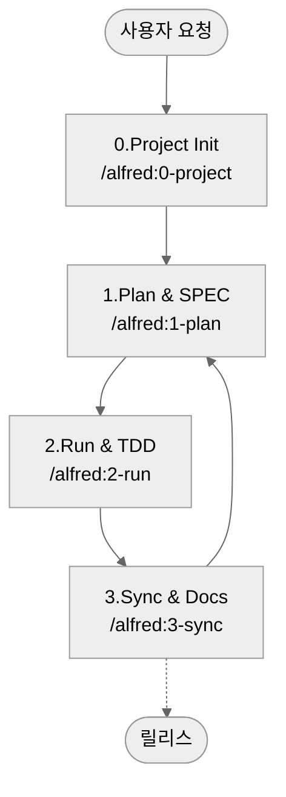

# MoAI-ADK (Agentic Development Kit)

[한국어](README.ko.md) | [English](README.md)

[](https://pypi.org/project/moai-adk/)
[](https://opensource.org/licenses/MIT)
[](https://www.python.org/)
[](https://github.com/modu-ai/moai-adk/actions/workflows/moai-gitflow.yml)
[](https://github.com/modu-ai/moai-adk)

> **MoAI-ADK는 AI와 함께 명세(SPEC) → 테스트(TDD) → 코드 → 문서를 자연스럽게 잇는 개발 워크플로우를 제공합니다.**

---

## 1. MoAI-ADK 한눈에 보기

MoAI-ADK는 세 가지 핵심 원칙으로 AI 협력 개발을 혁신합니다. 아래 네비게이션으로 당신의 상황에 맞는 섹션으로 이동하세요.

만약 MoAI-ADK를 **처음 접한다면** "MoAI-ADK란?"부터 시작하세요.
**빨리 시작하고 싶다면** "5분 Quick Start"로 바로 진행할 수 있습니다.
**이미 설치했고 개념을 이해하고 싶다면** "핵심 개념 쉽게 이해하기"를 추천합니다.

| 질문                                    | 바로 보기                                             |
| --------------------------------------- | ----------------------------------------------------- |
| 처음 접했는데 무엇인가요?               | [MoAI-ADK란?](#moai-adk란)                            |
| 어떻게 시작하나요?                      | [5분 Quick Start](#5-분-quick-start)                  |
| 기본 흐름이 궁금해요                    | [기본 워크플로우 (0 → 3)](#기본-워크플로우-0--3)      |
| Plan / Run / Sync 명령은 무엇을 하나요? | [핵심 명령 요약](#핵심-명령-요약)                     |
| SPEC·TDD·TAG가 뭐죠?                    | [핵심 개념 쉽게 이해하기](#핵심-개념-쉽게-이해하기)   |
| 에이전트/Skills가 궁금해요              | [Sub-agent & Skills 개요](#sub-agent--skills-개요)    |
| Claude Code Hooks가 궁금해요            | [Claude Code Hooks 가이드](#claude-code-hooks-가이드) |
| 더 깊이 공부하고 싶어요                 | [추가 자료](#추가-자료)                               |

---

## MoAI-ADK란?

### 문제: AI 개발의 신뢰성 위기

오늘날 수많은 개발자들이 Claude나 ChatGPT의 도움을 받고 싶어 하지만, 한 가지 근본적인 의심을 떨쳐내지 못합니다. **"이 AI가 만든 코드를 정말 믿을 수 있을까?"**

현실은 이렇습니다. AI에게 "로그인 기능을 만들어줘"라고 하면, 문법적으로 완벽한 코드가 나옵니다. 하지만 다음과 같은 문제들이 반복됩니다:

- **요구사항 불명확**: "정확히 무엇을 만들어야 하는가?"라는 기본 질문이 답변되지 않습니다. 이메일/비밀번호 로그인? OAuth? 2FA는? 모두 추측에 의존합니다.
- **테스트 누락**: 대부분의 AI는 "happy path"만 테스트합니다. 잘못된 비밀번호는? 네트워크 오류는? 3개월 후 프로덕션에서 버그가 터집니다.
- **문서 불일치**: 코드가 수정되어도 문서는 그대로입니다. "이 코드가 왜 여기 있지?"라는 질문이 반복됩니다.
- **컨텍스트 손실**: 같은 프로젝트에서도 매번 처음부터 설명해야 합니다. 프로젝트의 구조, 결정 이유, 이전 시도들이 기록되지 않습니다.
- **변경 영향 파악 불가**: 요구사항이 변경되었을 때, 어떤 코드가 영향받는지 추적할 수 없습니다.

### 해결책: SPEC-First TDD with Alfred SuperAgent

**MoAI-ADK**(MoAI Agentic Development Kit)는 이 문제들을 **체계적으로 해결**하도록 설계된 오픈소스 프레임워크입니다.

핵심 원리는 단순하지만 강력합니다:

> **"코드 없이는 테스트도 없고, 테스트 없이는 SPEC도 없다"**

더 정확히는 역순입니다:

> **"SPEC이 먼저 나온다. SPEC 없이는 테스트도 없다. 테스트와 코드가 없으면 문서도 완성이 아니다."**

이 순서를 지킬 때, 실패하지 않는 에이전틱 코딩을 경험 하실 수가 있습니다:

**1️⃣ 명확한 요구사항**
`/alfred:1-plan` 명령어로 SPEC을 먼저 작성합니다. "로그인 기능"이라는 모호한 요청이 "WHEN 유효한 자격증명이 제공되면 JWT 토큰을 발급해야 한다"는 **명확한 요구사항**으로 변환됩니다. Alfred의 spec-builder가 EARS 문법을 사용해 단 3분 만에 전문적인 SPEC을 만들어줍니다.

**2️⃣ 테스트 보증**
`/alfred:2-run`에서 자동으로 테스트 주도 개발(TDD)을 진행합니다. RED(실패하는 테스트) → GREEN(최소 구현) → REFACTOR(코드 정리) 순서로 진행되며, **테스트 커버리지는 85% 이상을 보증**합니다. 더 이상 "나중에 테스트"는 없습니다. 테스트가 코드 작성을 이끕니다.

**3️⃣ 문서 자동 동기화**
`/alfred:3-sync` 명령어 하나로 코드, 테스트, 문서가 모두 **최신 상태로 동기화**됩니다. README, CHANGELOG, API 문서, 그리고 Living Document까지 자동으로 업데이트됩니다. 6개월 후에도 코드와 문서는 일치합니다.

**4️⃣ @TAG 시스템으로 추적**
모든 코드와 테스트, 문서에 `@TAG:ID`를 붙입니다. 나중에 요구사항이 변경되면, `rg "@SPEC:EX-AUTH-001"` 한 명령어로 관련된 테스트, 구현, 문서를 **모두 찾을 수 있습니다**. 리팩토링 시 자신감이 생깁니다.

**5️⃣ Alfred가 컨텍스트를 기억**
AI 에이전트들이 협력해 프로젝트의 구조, 결정 이유, 작업 히스토리를 **모두 기억**합니다. 같은 질문을 반복할 필요가 없습니다.

### MoAI-ADK의 핵심 3가지 약속

입문자도 기억할 수 있도록, MoAI-ADK의 가치는 3가지로 단순화됩니다:

**첫째, SPEC이 코드보다 먼저다**
무엇을 만들지 명확히 정의하고 시작합니다. SPEC을 쓰다 보면 구현 전에 문제를 발견할 수 있습니다. 팀원과의 의사소통 비용이 대폭 줄어듭니다.

**둘째, 테스트가 코드를 이끈다 (TDD)**
구현 전에 테스트를 먼저 작성합니다 (RED). 테스트를 통과시키는 최소 구현을 합니다 (GREEN). 그 후 코드를 정리합니다 (REFACTOR). 결과: 버그가 적고, 리팩토링에 자신감이 생기고, 누구나 이해할 수 있는 코드.

**셋째, 문서와 코드는 항상 일치한다**
`/alfred:3-sync` 한 명령어로 모든 문서가 자동 업데이트됩니다. README, CHANGELOG, API 문서, Living Document가 코드와 항상 동기화됩니다. 반년 전 코드를 수정하려 할 때 절망감이 없어집니다.

---

## 왜 필요한가요?

### AI 개발의 현실적 과제들

현대 AI 협력 개발은 다양한 도전에 직면해 있습니다. MoAI-ADK는 이 모든 문제를 **체계적으로 해결**합니다:

| 고민                     | 기존 방식의 문제                        | MoAI-ADK의 해결                                  |
| ------------------------ | --------------------------------------- | ------------------------------------------------ |
| "AI 코드를 믿을 수 없다" | 테스트 없는 구현, 검증 방법 불명확      | SPEC → TEST → CODE 순서 강제, 커버리지 85%+ 보증 |
| "매번 같은 설명 반복"    | 컨텍스트 손실, 프로젝트 히스토리 미기록 | Alfred가 모든 정보 기억, 19개 AI 팀 협력         |
| "프롬프트 작성 어려움"   | 좋은 프롬프트 만드는 법을 모름          | `/alfred` 명령이 표준화된 프롬프트 자동 제공     |
| "문서가 항상 구식"       | 코드 수정 후 문서 갱신 까먹음           | `/alfred:3-sync` 한 명령으로 자동 동기화         |
| "어디 수정했는지 모름"   | 코드 검색 어려움, 의도 불명확           | @TAG 체인으로 SPEC → TEST → CODE → DOC 연결      |
| "팀 온보딩 시간 오래"    | 새 팀원이 코드 맥락 파악 불가           | SPEC 읽으면 의도 즉시 이해 가능                  |

### 지금 바로 경험할 수 있는 이득

MoAI-ADK를 도입하는 순간부터 다음을 느낄 수 있습니다:

- **개발 속도 향상**: 명확한 SPEC으로 왕복 설명 시간 단축
- **버그 감소**: SPEC 기반 테스트로 사전 발견
- **코드 이해도 향상**: @TAG와 SPEC으로 의도 즉시 파악
- **유지보수 비용 절감**: 코드와 문서 항상 일치
- **팀 협업 효율화**: SPEC과 TAG로 명확한 커뮤니케이션

---

## ⚡ 3분 초고속 시작

MoAI-ADK로 **3단계 만에** 첫 프로젝트를 시작하세요. 초보자도 5분 안에 완성할 수 있습니다.

### 단계 1️⃣: 설치 (약 1분)

#### UV 설치 명령어

```bash
# macOS/Linux
curl -LsSf https://astral.sh/uv/install.sh | sh

# Windows (PowerShell)
powershell -c "irm https://astral.sh/uv/install.ps1 | iex"
```

#### 실제 출력 (예시)

```bash
# UV 버전 확인
uv --version
✓ uv 0.5.1 is already installed

$ uv --version
uv 0.5.1
```

#### 다음: MoAI-ADK 설치

```bash
uv tool install moai-adk

# 결과: ✅ Installed moai-adk
```

**검증**:

```bash
moai-adk --version
# 출력: MoAI-ADK v1.0.0
```

---

### 단계 2️⃣: 첫 프로젝트 생성 (약 2분)

#### 명령어

```bash
moai-adk init hello-world
cd hello-world
```

#### 실제로 생성되는 것

```
hello-world/
├── .moai/              ✅ Alfred 설정
├── .claude/            ✅ Claude Code 자동화
└── CLAUDE.md           ✅ 프로젝트 가이드
```

#### 검증: 핵심 파일 확인

```bash
# 핵심 설정 파일 확인
ls -la .moai/config.json  # ✅ 존재하는가?
ls -la .claude/commands/  # ✅ 명령어가 있는가?

# 또는 한 번에 확인
moai-adk doctor
```

**출력 예시**:

```
✅ Python 3.13.0
✅ uv 0.5.1
✅ .moai/ directory initialized
✅ .claude/ directory ready
✅ 16 agents configured
✅ 74 skills loaded
```

---

### 단계 3️⃣: Alfred 시작 (약 1-2분)

#### Claude Code 실행

```bash
claude
```

#### Claude Code에서 다음 입력

```
/alfred:0-project
```

#### Alfred가 물어볼 것들

```
Q1: 프로젝트 이름은?
A: hello-world

Q2: 프로젝트 목표는?
A: MoAI-ADK 학습

Q3: 주요 개발 언어는?
A: python

Q4: 모드는?
A: personal (로컬 개발용)
```

#### 결과: 프로젝트 준비 완료! ✅

```
✅ 프로젝트 초기화 완료
✅ .moai/config.json에 설정 저장
✅ .moai/project/에 문서 생성
✅ Alfred가 스킬 추천 완료

다음 단계: /alfred:1-plan "첫 기능 설명"
```

---

## 🚀 다음: 10분 안에 첫 기능 완성하기

이제 실제로 **기능을 만들고 문서도 자동 생성**해보세요!

> **→ 다음 섹션: ["첫 10분 실습: Hello World API"](#-첫-10분-실습-hello-world-api) 로 이동**

이 섹션에서는:

- ✅ 간단한 API를 SPEC으로 정의하기
- ✅ TDD (RED → GREEN → REFACTOR) 완전 체험
- ✅ 자동 문서 생성 경험
- ✅ @TAG 시스템 이해

---

## 📖 설치 및 프로젝트 설정 완전 가이드

빠른 시작 후 더 자세한 설명이 필요하다면 아래를 참고하세요.

### 설치 상세 가이드

**uv 설치 후 추가 확인**:

```bash
# PATH 설정 확인 (필요시)
export PATH="$HOME/.cargo/bin:$PATH"

# 다시 확인
uv --version
```

**MoAI-ADK 설치 후 다른 명령어들도 사용 가능**:

```bash
moai-adk init          # 프로젝트 초기화
moai-adk doctor        # 시스템 진단
moai-adk update        # 최신 버전으로 업데이트
```

### 프로젝트 생성 상세 가이드

**새 프로젝트 생성**:

```bash
moai-adk init my-project
cd my-project
```

**기존 프로젝트에 추가**:

```bash
cd your-existing-project
moai-adk init .
```

생성되는 전체 구조:

```
my-project/
├── .moai/                          # MoAI-ADK 프로젝트 설정
│   ├── config.json                 # 프로젝트 설정 (언어, 모드, 소유자)
│   ├── project/                    # 프로젝트 정보
│   │   ├── product.md              # 제품 비전과 목표
│   │   ├── structure.md            # 디렉토리 구조
│   │   └── tech.md                 # 기술 스택 및 아키텍처
│   ├── memory/                     # Alfred의 지식 베이스 (8개 파일)
│   ├── specs/                      # SPEC 파일들
│   └── reports/                    # 분석 리포트
├── .claude/                        # Claude Code 자동화
│   ├── agents/                     # 16개 Sub-agent (전문가 포함)
│   ├── commands/                   # 4개 Alfred 명령어
│   ├── skills/                     # 74개 Claude Skills
│   ├── hooks/                      # 5개 이벤트 자동화 후크
│   └── settings.json               # Claude Code 설정
└── CLAUDE.md                       # Alfred의 핵심 지침
```

---

## 핵심 개념: 3단계로 반복하기

한 번 설정 후, 모든 기능 개발은 이 3단계를 반복합니다:

| 단계        | 명령어                       | 수행 작업                     | 시간 |
| ----------- | ---------------------------- | ----------------------------- | ---- |
| 📋 **PLAN** | `/alfred:1-plan "기능 설명"` | SPEC 작성 (EARS 형식)         | 2분  |
| 💻 **RUN**  | `/alfred:2-run SPEC-ID`      | TDD 구현 (RED→GREEN→REFACTOR) | 5분  |
| 📚 **SYNC** | `/alfred:3-sync`             | 문서 자동 동기화              | 1분  |

**한 사이클 = 약 8분** → **하루에 7-8개 기능 완성 가능** ⚡

---

## 📦 MoAI-ADK 최신 버전 유지하기

### 버전 확인

```bash
# 현재 설치된 버전 확인
moai-adk --version

# PyPI에서 최신 버전 확인
uv tool list  # moai-adk의 현재 버전 확인
```

### 업그레이드 하기

MoAI-ADK는 **2가지 업데이트 메커니즘**을 제공합니다:

1. **`moai-adk update`**: 패키지 버전 + 템플릿 동기화 (권장)
2. **`uv tool upgrade`**: 표준 uv 도구 업그레이드 (선택)

#### 방법 1: moai-adk 자체 업데이트 명령어 (권장 - 가장 완전함)

이 방법은 패키지 버전 업데이트와 동시에 로컬 템플릿도 자동으로 동기화합니다.

```bash
# 1단계: MoAI-ADK 패키지 업데이트 (+ 템플릿 동기화)
moai-adk update
```

**무엇이 업데이트되나요?**

- ✅ `moai-adk` 패키지 자체 (PyPI의 최신 버전)
- ✅ 16개 Sub-agent 템플릿
- ✅ 74개 Claude Skills
- ✅ 5개 Claude Code Hooks
- ✅ 4개 Alfred 명령어 정의

**출력 예시 1: 패키지 업데이트 필요한 경우**

```bash
$ moai-adk update
🔍 Checking versions...
   Current version: 0.14.0
   Latest version:  0.15.0
📥 Upgrading moai-adk from 0.14.0 to 0.15.0...
✓ Package upgraded successfully

🔍 Comparing config versions...
   Package template: 0.15.0
   Project config:   0.14.0

📄 Syncing templates (0.14.0 → 0.15.0)...
   💾 Creating backup...
   ✓ Backup: .moai-backups/backup/
   ✅ .claude/ update complete (agents, commands, skills, hooks)
   ✅ .moai/ update complete (specs/reports preserved)
   🔄 CLAUDE.md merge complete
   🔄 config.json merge complete

✓ Update complete!
ℹ️  Next step: Run /alfred:0-project to optimize
```

**출력 예시 2: 이미 최신 버전인 경우**

```bash
$ moai-adk update
🔍 Checking versions...
   Current version: 0.15.0
   Latest version:  0.15.0
✓ Package already up to date (0.15.0)

🔍 Comparing config versions...
   Package template: 0.15.0
   Project config:   0.15.0

✓ Template already up to date (3초 완료)

ℹ️  Nothing to update
```

**출력 예시 3: 설정 문제가 있는 경우**

```bash
$ moai-adk update
🔍 Checking versions...
   Current version: 0.15.0
   Latest version:  0.15.0
✓ Package already up to date (0.15.0)

🔍 Comparing config versions...
   Package template: 0.15.0
   Project config:   0.0.0  ← 오래된 프로젝트

📄 Syncing templates (0.0.0 → 0.15.0)...
   💾 Creating backup...
   ✓ Backup: .moai-backups/backup/
⚠ Template warnings:
   Unsubstituted variables: CODEBASE_LANGUAGE, CONVERSATION_LANGUAGE_NAME
   ✅ .claude/ update complete
   ✅ .moai/ update complete (specs/reports preserved)
   🔄 CLAUDE.md merge complete
   🔄 config.json merge complete
   ⚙️  Set optimized=false (최적화 필요)

✓ Update complete!
ℹ️  Next step: Run /alfred:0-project to optimize template changes
```

#### moai-adk update로 기존 프로젝트 템플릿 동기화

새 버전의 기능을 현재 프로젝트에 반영하려면, 각 프로젝트 디렉토리에서 `moai-adk update`를 실행하세요:

```bash
# 2단계: 프로젝트 디렉토리로 이동
cd your-existing-project

# 3단계: 새 템플릿 동기화 (기존 코드는 유지)
moai-adk update
```

**`moai-adk update`는 다음을 지능적으로 처리합니다**:

```
moai-adk update 실행 시:

Stage 1: 패키지 버전 확인 (PyPI)
  └─ 더 최신 버전이 있으면? 업그레이드

Stage 2: 템플릿 버전 비교 ⭐ 핵심 최적화
  ├─ 패키지 템플릿 버전: 0.15.0
  ├─ 프로젝트 config 템플릿 버전: 0.15.0
  ├─ 같으면? Stage 3 스킵! (불필요한 복사 작업 제거)
  └─ 다르면? Stage 3으로 진행

Stage 3: 필요한 템플릿만 동기화
  ├─ .claude/agents/    ← 새 버전으로 업데이트
  ├─ .claude/commands/  ← 새 버전으로 업데이트
  ├─ .claude/skills/    ← 새 버전으로 업데이트
  ├─ .claude/hooks/     ← 새 버전으로 업데이트
  ├─ .moai/             ← 병합 (config.json 사용자 설정 유지)
  │   ├─ project/       ← 유지 (당신의 문서)
  │   ├─ specs/         ← 유지 (당신의 스펙)
  │   ├─ reports/       ← 유지 (당신의 리포트)
  │   └─ memory/        ← 유지 (학습 데이터)
  ├─ src/               ← 유지 (당신의 코드)
  ├─ tests/             ← 유지 (당신의 테스트)
  └─ docs/              ← 유지 (당신의 문서)
```

> ✅ **안전함**: 비즈니스 코드, 테스트, 커스텀 문서, 당신의 설정은 절대 건드리지 않습니다.
>
> 💡 **성능**: Stage 2 버전 비교로 이미 최신 상태인 프로젝트는 3~4초만에 완료됩니다.

#### 방법 2: uv tool 명령어로 업그레이드 (대체 방법)

표준 uv 도구 매니저를 사용하려면:

**특정 도구만 업그레이드**

```bash
# moai-adk만 최신 버전으로 업그레이드
uv tool upgrade moai-adk
```

**모든 설치된 도구 업그레이드**

```bash
# 모든 uv tool 도구를 최신 버전으로 업그레이드
uv tool upgrade --all
```

**특정 버전으로 설치 (필요시)**

```bash
# 특정 버전으로 재설치
uv tool install moai-adk==0.14.0

# 또는 최신 버전 명시적 설치
uv tool install moai-adk@latest
```

⚠️ **주의**: 이 방법은 패키지만 업데이트되고, 템플릿은 동기화되지 않습니다. **권장하지 않습니다.** 대신 `moai-adk update`를 사용하세요 (패키지 + 템플릿 동기화를 한 번에 처리).

---

## 📦 완전한 업데이트 프로세스 (권장 워크플로우)

### Step 1️⃣: 현재 상태 확인 (선택)

```bash
# 현재 설치된 버전 확인
moai-adk --version

# 프로젝트 상태 진단
moai-adk doctor
```

**출력 예시:**

```
Running system diagnostics...

┏━━━━━━━━━━━━━━━━━━━━━━━━━━━━━━━━━━━━━━━━━━┳━━━━━━━━┓
┃ Check                                    ┃ Status ┃
┡━━━━━━━━━━━━━━━━━━━━━━━━━━━━━━━━━━━━━━━━━━╇━━━━━━━━┩
│ Python >= 3.13                           │   ✓    │
│ Git installed                            │   ✓    │
│ Project structure (.moai/)               │   ✓    │
│ Config file (.moai/config.json)          │   ✓    │
└──────────────────────────────────────────┴────────┘

✓ All checks passed
```

### Step 2️⃣: 패키지 + 모든 프로젝트 업데이트 (moai-adk update 사용)

**목적**:
1. `moai-adk` 패키지를 새 버전으로 업그레이드
2. 각 프로젝트의 `.moai/`과 `.claude/` 동기화

**방식**: 각 프로젝트에서 **`moai-adk update` 1회씩 실행**

**💡 핵심: `moai-adk update`의 3단계 워크플로우**

```
moai-adk update 의 동작 방식:

Stage 1: 패키지 버전 확인 (PyPI 확인)
         └─ 필요시 패키지 업그레이드 (v0.14 → v0.15)
            ↓
Stage 2: 템플릿 버전 비교 ⭐ 핵심 (성능 최적화)
         ├─ 패키지 템플릿 버전: 0.15.0
         ├─ 프로젝트 config 버전: 0.15.0
         ├─ 같으면? Stage 3 스킵! (3초 완료)
         └─ 다르면? Stage 3으로 진행
            ↓
Stage 3: 템플릿 동기화 (필요할 때만)
         ├─ .claude/agents, commands, skills, hooks 갱신
         ├─ .moai/ 설정 병합 (specs, reports 유지)
         └─ config.json, CLAUDE.md 동기화
```

**모든 프로젝트에 동일한 명령어 사용**:

```bash
# 프로젝트 1 업데이트
cd ~/projects/project-1
moai-adk update

# 프로젝트 2 업데이트
cd ~/projects/project-2
moai-adk update

# 프로젝트 3 업데이트
cd ~/projects/project-3
moai-adk update
```

또는 **스크립트로 자동화**:

```bash
#!/bin/bash
# 모든 프로젝트를 한 번에 업데이트

for project in ~/projects/project-1 ~/projects/project-2 ~/projects/project-3; do
    echo "🔄 Updating $project..."
    cd "$project"
    moai-adk update
    echo "✅ $project updated"
done
```

**각 프로젝트에서 무엇이 일어나나요?**

```
프로젝트별 업데이트 흐름:

cd ~/projects/project-1
moai-adk update

↓ Stage 1: 패키지 버전 확인
   현재: 0.14.0
   최신: 0.15.0
   → 패키지 업그레이드 (시스템 레벨, 1회만)

↓ Stage 2: 템플릿 버전 비교
   프로젝트 설정: template_version = 0.14.0
   패키지 템플릿: 0.15.0
   → 버전 다름! Stage 3 진행

↓ Stage 3: 템플릿 동기화
   ✅ .claude/agents/ → 갱신
   ✅ .claude/commands/ → 갱신
   ✅ .claude/skills/ → 갱신
   ✅ .claude/hooks/ → 갱신
   ✅ config.json: template_version = 0.15.0 (저장)
   ✅ 완료!

다음 프로젝트에서 moai-adk update 실행:

cd ~/projects/project-2
moai-adk update

↓ Stage 1: 패키지 버전 확인
   현재: 0.15.0 (이미 업데이트됨)
   최신: 0.15.0
   → 버전 같음, 스킵

↓ Stage 2: 템플릿 버전 비교
   프로젝트 설정: template_version = 0.14.0
   패키지 템플릿: 0.15.0
   → 버전 다름! Stage 3 진행

↓ Stage 3: 템플릿 동기화
   ✅ 모든 템플릿 갱신
   ✅ 완료!
```

**확인 명령어**:

```bash
# 패키지 버전 확인
moai-adk --version
# 출력: moai-adk version 0.15.0

# 프로젝트 상태 확인
moai-adk doctor
# ✅ .moai/ directory initialized
# ✅ .claude/ directory ready
# ✅ 16 agents configured
# ✅ 74 skills loaded
```

**⚠️ 주의사항**:

- ✅ 각 프로젝트에서 **`moai-adk update` 1회씩** 실행
- ❌ `moai-adk init .`은 불필요 (이미 update가 동기화 함)
- ✅ Stage 1 (패키지 업그레이드)는 첫 프로젝트에서만 실행되고, 이후 프로젝트는 스킵됨
- ✅ Stage 2/3 (템플릿 동기화)는 각 프로젝트마다 필요시 실행

---

### Step 3️⃣: 동기화 검증

모든 프로젝트가 정상적으로 업데이트되었는지 확인하세요:

```bash
# 프로젝트 1 검증
cd ~/projects/project-1
moai-adk doctor
echo "---"

# 프로젝트 2 검증
cd ~/projects/project-2
moai-adk doctor
echo "---"

# 프로젝트 3 검증
cd ~/projects/project-3
moai-adk doctor
```

**정상 출력**:
```
✅ Python >= 3.13
✅ Git installed
✅ Project structure (.moai/)
✅ Config file (.moai/config.json)
✅ All checks passed
```

**문제 발생 시**:
```bash
# 명령어 재실행
cd ~/projects/project-name
moai-adk update

# 강제 동기화 필요 시
moai-adk update --force
```

### Step 4️⃣: 변경사항 커밋 (권장)

```bash
git add .claude/ .moai/
git commit -m "chore: 템플릿 업데이트 (moai-adk v0.15.0)"
git push
```

---

## 🆕 기존 프로젝트에 moai-adk 설치하기

이미 진행 중인 프로젝트에 MoAI-ADK를 추가하려면:

### 단계 1️⃣: 프로젝트 디렉토리로 이동

```bash
cd your-existing-project

# 프로젝트 구조 확인 (선택)
ls -la
# src/, tests/, README.md 등이 있는가?
```

### 단계 2️⃣: MoAI-ADK 초기화

```bash
# 현재 디렉토리에 .moai/, .claude/ 생성
moai-adk init .
```

**생성되는 파일/폴더**

```
your-existing-project/
├── .moai/                    ✅ 새로 생성
│   ├── config.json
│   ├── project/
│   │   ├── product.md
│   │   ├── structure.md
│   │   └── tech.md
│   ├── memory/
│   ├── specs/
│   └── reports/
├── .claude/                  ✅ 새로 생성
│   ├── agents/
│   ├── commands/
│   ├── skills/
│   ├── hooks/
│   └── settings.json
├── CLAUDE.md                 ✅ 새로 생성
├── src/                      ✅ 유지
├── tests/                    ✅ 유지
└── README.md                 ✅ 유지
```

> ✅ **안전**: 기존 코드(`src/`, `tests/` 등)는 절대 건드리지 않습니다.

### 단계 3️⃣: 설정 확인

```bash
# Alfred 설정 확인
cat .moai/config.json

# 프로젝트 정보 확인
ls -la .moai/project/
```

### 단계 4️⃣: Claude Code 실행

```bash
# Claude Code 시작
claude

# 프로젝트 초기화
/alfred:0-project
```

Alfred가 프로젝트 정보를 수집하고 설정을 최적화합니다.

---

## 🔍 업데이트 후 확인 체크리스트

업데이트 후 문제가 없는지 확인하세요.

### 1️⃣ 버전 확인

```bash
# 새 버전이 설치되었나?
moai-adk --version
# 출력: moai-adk version 0.15.0

# PyPI의 최신 버전 확인
uv tool list | grep moai-adk
```

### 2️⃣ 프로젝트 진단

```bash
cd your-project
moai-adk doctor

# 정상 출력 예시:
# ✅ Python 3.13.0
# ✅ uv 0.5.1
# ✅ .moai/ directory
# ✅ .claude/ directory
# ✅ 16 agents configured
# ✅ 74 skills loaded
# ✅ 5 hooks active
```

### 3️⃣ Alfred 기능 테스트

```bash
cd your-project
claude

# 새로운 기능 확인
/alfred:0-project
```

Alfred가 최신 기능과 언어 지원을 제공하는지 확인합니다.

### 4️⃣ 기존 코드 검증

```bash
# 테스트 실행
pytest tests/

# 린팅 확인
ruff check src/

# 타입 검사
mypy src/
```

기존 코드가 계속 정상 작동하는지 확인합니다.

---

## ⚠️ 업데이트 후 문제 해결

### 문제 1: 템플릿 충돌 (Template Conflict)

**증상**: `moai-adk init .` 실행 후 `.claude/` 파일이 변경되었다는 git 메시지

```bash
# 상태 확인
git status

# 변경 내용 확인
git diff .claude/
```

**해결책**:

```bash
# 1. 변경사항 커밋
git add .claude/
git commit -m "chore: 템플릿 업데이트"

# 또는 2. 변경사항 취소 (필요시)
git checkout .claude/
```

### 문제 2: 구 버전과의 호환성

**증상**: 오래된 프로젝트에서 업데이트 후 오류

**해결책**:

```bash
# 1. 설정 마이그레이션 확인
cat .moai/config.json | head -20

# 2. 필요시 설정 재구성
moai-adk init .

# 3. 여전히 오류면 doctor 실행
moai-adk doctor
```

### 문제 3: 패키지 설치 오류

**증상**: `moai-adk update` 실행 후 명령어 실행 불가

```bash
# 확인 1: uv PATH 설정
which uv
echo $PATH

# 확인 2: moai-adk 위치
which moai-adk

# 재설치
uv tool reinstall moai-adk
```

---

## 📊 버전별 주요 변경사항

| 버전   | 주요 변경                                         | 업데이트 필요 |
| ------ | ------------------------------------------------- | ------------- |
| v0.15+ | 🌍 다국어 지원 (한국어, 일본어, 중국어, 스페인어) | ✅ 권장       |
| v0.14  | 📋 SPEC 문법 개선 (EARS → Unwanted Behaviors)     | ✅ 권장       |
| v0.13  | ⚡ 3단계 병렬 처리로 70-80% 성능 향상             | ✅ 권장       |
| v0.12  | 🎯 @TAG 시스템 고도화                             | ✅ 권장       |

---

## 💡 업데이트 팁과 모범 사례

### ✅ DO (권장)

- ✅ 정기적으로 업데이트 확인 (월 1회 정도)
- ✅ `moai-adk update` 사용 (가장 완전함: 패키지 + 템플릿 동기화)
- ✅ 각 프로젝트마다 `moai-adk update` 실행 (패키지는 1회, 템플릿은 각 프로젝트별)
- ✅ `moai-adk doctor`로 검증
- ✅ 변경사항 커밋 및 저장
- ✅ 테스트로 검증 후 배포

### ❌ DON'T (피하세요)

- ❌ 복수의 프로젝트를 한꺼번에 업데이트하지 마세요
- ❌ 수동으로 `.claude/` 파일을 편집하지 마세요
- ❌ 임의로 파일을 삭제하지 마세요
- ❌ 커밋하지 않고 업데이트 후 배포하지 마세요

---

## 기본 워크플로우 (Project > Plan > Run > Sync)

Alfred는 네 개의 명령으로 프로젝트를 반복 개발합니다.



### 0. PROJECT — 프로젝트 준비

- 프로젝트 소개, 타깃, 언어, 모드(locale) 질문
- `.moai/config.json`, `.moai/project/*` 문서 5종 자동 생성
- 언어 감지 및 추천 Skill Pack 배치 (Foundation + Essentials + Domain/Language)
- 템플릿 정리, 초깃 Git/백업 체크

### 1. PLAN — 무엇을 만들지 SPEC 생성

- EARS 템플릿으로 SPEC 작성 (`@SPEC:ID` 포함)
- Plan Board, 구현 아이디어, 위험 요소 정리
- Team 모드라면 브랜치/초기 Draft PR 자동 생성

### 2. RUN — 테스트 주도 개발(TDD)

- Phase 1 `implementation-planner`: 라이브러리, 폴더, TAG 설계
- Phase 2 `tdd-implementer`: RED(실패 테스트) → GREEN(최소 구현) → REFACTOR(정리)
- quality-gate가 TRUST 5 원칙, 커버리지 변화를 검증

### 3. SYNC — 문서 & PR 정리

- Living Document, README, CHANGELOG 등 문서 동기화
- TAG 체인 검증 및 orphan TAG 복구
- Sync Report 생성, Draft → Ready for Review 전환, `--auto-merge` 옵션 지원

---

## 핵심 명령 요약

| 명령                      | 무엇을 하나요?                                               | 대표 산출물                                                        |
| ------------------------- | ------------------------------------------------------------ | ------------------------------------------------------------------ |
| `/alfred:0-project`       | 프로젝트 설명 수집, 설정·문서 생성, Skill 추천               | `.moai/config.json`, `.moai/project/*`, 초기 보고서                |
| `/alfred:1-plan <설명>`   | 요구사항 분석, SPEC 초안, Plan Board 작성                    | `.moai/specs/SPEC-*/spec.md`, plan/acceptance 문서, feature 브랜치 |
| `/alfred:2-run <SPEC-ID>` | TDD 실행, 테스트/구현/리팩토링, 품질 검증                    | `tests/`, `src/` 구현, 품질 리포트, TAG 연결                       |
| `/alfred:3-sync`          | 문서/README/CHANGELOG 동기화, TAG/PR 상태 정리               | `docs/`, `.moai/reports/sync-report.md`, Ready PR                  |
| `/alfred:9-feedback`      | 대화형으로 GitHub Issue 생성 (타입 → 제목 → 설명 → 우선순위) | GitHub Issue + 자동 라벨 + 우선순위 + URL                          |

> ❗ 모든 명령은 **Phase 0(선택) → Phase 1 → Phase 2 → Phase 3** 순환 구조를 유지합니다. 실행 중 상태와 다음 단계 제안은 Alfred가 자동으로 보고합니다.
>
> 💡 **v0.7.0+부터 추가**: `/alfred:9-feedback`로 개발 중 GitHub Issue를 즉시 생성할 수 있습니다. 개발 흐름을 끊지 않으면서 팀 전체가 이슈를 추적하고 논의할 수 있습니다.

---

## SPEC GitHub Issue 자동화

MoAI-ADK는 이제 SPEC 문서에서 **GitHub Issue 자동 동기화**를 제공하여, 팀 모드에서 요구사항과 이슈 추적을 원활하게 통합합니다.

### 작동 방식

`/alfred:1-plan`으로 SPEC 문서를 생성하고 feature 브랜치에 푸시하면:

1. **GitHub Actions 워크플로우**가 PR 이벤트에서 자동으로 트리거됩니다
2. **SPEC 메타데이터**(ID, version, status, priority)가 YAML frontmatter에서 추출됩니다
3. **GitHub Issue**가 전체 SPEC 내용과 메타데이터 테이블과 함께 생성됩니다
4. **PR 코멘트**가 생성된 이슈 링크와 함께 자동으로 추가됩니다
5. **라벨**이 우선순위에 따라 자동으로 적용됩니다 (critical, high, medium, low)

### 동기화되는 내용

**SPEC에서 GitHub Issue로:**

- **SPEC ID**: 고유 식별자 (예: AUTH-001, USER-001)
- **Version**: 시맨틱 버저닝 (v0.1.0, v1.0.0)
- **Status**: draft, in-review, in-progress, completed, stable
- **Priority**: critical, high, medium, low (GitHub 라벨로 변환)
- **전체 내용**: EARS 요구사항, 수락 기준, 의존성

**GitHub Issue 형식:**

```markdown
# [SPEC-AUTH-001] 사용자 인증 (v1.0.0)

## SPEC 메타데이터

| 필드         | 값          |
| ------------ | ----------- |
| **ID**       | AUTH-001    |
| **Version**  | v1.0.0      |
| **Status**   | in-progress |
| **Priority** | high        |

## SPEC 문서

[.moai/specs/SPEC-AUTH-001/spec.md의 전체 SPEC 내용]

---

📎 **브랜치**: `feature/AUTH-001`
🔗 **PR**: #123
📝 **자동 동기화**: 이 이슈는 SPEC 문서에서 자동으로 동기화됩니다
```

### 기능

✅ **자동 Issue 생성**: SPEC 파일이 변경된 모든 PR에서 GitHub Issue 자동 생성
✅ **메타데이터 추출**: ID, version, status, priority가 YAML frontmatter에서 자동으로 파싱됨
✅ **PR 통합**: Issue가 PR과 자동 코멘트를 통해 연결됨
✅ **라벨 관리**: 우선순위 기반 라벨 (critical, high, medium, low) 자동 적용

### 설정 요구사항

**GitHub Actions 워크플로우**: `.github/workflows/spec-issue-sync.yml`
**GitHub Issue 템플릿**: `.github/ISSUE_TEMPLATE/spec.yml`
**GitHub 라벨**: `spec`, `planning`, `critical`, `high`, `medium`, `low`

모든 템플릿은 MoAI-ADK와 함께 자동으로 설치되며 `moai-adk init` 실행 시 동기화됩니다.

### 워크플로우 예시

```bash
# 1. SPEC 생성
/alfred:1-plan "사용자 인증 기능"

# 2. SPEC 파일이 .moai/specs/SPEC-AUTH-001/spec.md에 생성됨
# 3. Feature 브랜치 생성: feature/SPEC-AUTH-001
# 4. Draft PR 생성 (팀 모드)

# 5. GitHub Actions가 자동으로:
#    - SPEC 메타데이터 파싱
#    - GitHub Issue #45 생성
#    - PR 코멘트 추가: "✅ SPEC GitHub Issue Created - Issue: #45"
#    - 라벨 적용: spec, planning, high

#    - 메타데이터 검증
#    - EARS 요구사항 확인
#    - 품질 점수 제공

# 7. TDD 구현 계속
/alfred:2-run AUTH-001
```

### 이점

1. **중앙 집중식 추적**: 모든 SPEC 요구사항이 GitHub Issues로 추적됨
2. **팀 가시성**: 비기술 이해관계자도 Issues를 통해 진행 상황 확인 가능
3. **자동화된 워크플로우**: 수동 이슈 생성 불필요—SPEC에서 Issue까지 완전 자동화
4. **추적 가능성**: SPEC 파일, Issues, PRs, 구현 간의 직접 링크

---

## `/alfred:9-feedback`로 빠른 Issue 생성하기

MoAI-ADK v0.7.0+부터 개발 중 **GitHub Issue를 즉시 생성**할 수 있는 기능을 제공합니다. 개발 흐름을 끊지 않으면서 팀 전체가 버그, 기능, 개선사항을 추적할 수 있습니다.

### 왜 빠른 Issue 생성인가?

코딩 중에 자주 만나는 상황들:

- 🐛 버그를 발견하고 즉시 보고하고 싶을 때
- ✨ 좋은 기능 아이디어가 떠올랐을 때
- ⚡ 성능 개선 아이디어가 있을 때
- ❓ 팀 전체가 논의해야 할 아키텍처 질문이 있을 때

**기존 방식**: 코딩을 멈추고 → GitHub 웹사이트로 이동 → 이슈 양식 작성 → 코딩으로 돌아옴 (비효율적!)
**새로운 방식**: 명령어 하나로 GitHub Issue 즉시 생성 → 코딩 계속 (효율적!)

### 대화형 대화 흐름

`/alfred:9-feedback`를 실행하면 Alfred가 단계별 대화형 인터페이스로 안내합니다:

**1단계: Issue 타입 선택**

```
Alfred: 어떤 타입의 Issue를 만들고 싶으신가요?
[ ] 🐛 버그 리포트 - 뭔가 작동하지 않음
[ ] ✨ 기능 요청 - 새로운 기능 제안
[ ] ⚡ 개선 - 기존 기능 개선
[ ] ❓ 질문/토론 - 팀과 논의하고 싶음
```

**2단계: Issue 제목 입력**

```
Alfred: Issue 제목을 입력하세요
당신의 입력: "로그인 버튼이 모바일에서 응답하지 않음"
```

**3단계: 설명 입력 (선택사항)**

```
Alfred: 상세한 설명을 입력하세요 (선택 사항—Enter를 누르면 건너뛸 수 있습니다)
당신의 입력: "iPhone 15에서 로그인 버튼을 누르면 5초간 멈춘 후 앱이 종료됩니다"
```

**4단계: 우선순위 선택**

```
Alfred: 우선순위를 선택하세요
[ ] 🔴 긴급 - 시스템 다운, 데이터 손실, 보안 문제
[ ] 🟠 높음 - 주요 기능 작동 안 함
[✓] 🟡 중간 - 일반 우선순위 (기본값)
[ ] 🟢 낮음 - 경미한 문제, nice-to-have
```

**5단계: 자동 Issue 생성**

```
Alfred가 자동으로:
1. Issue 타입과 우선순위에 따라 적절한 라벨 결정
2. 이모지를 붙인 제목 포맷: "🐛 [BUG] 로그인 버튼이 모바일에서 응답하지 않음..."
3. GitHub Issue 생성
4. Issue 번호와 URL 반환
```

### 주요 기능

1. **⚡ 즉시 생성**: GitHub Issue를 초 단위로 생성
2. **🏷️ 자동 라벨**: Issue 타입 + 우선순위가 자동 라벨링
3. **🎯 우선순위 선택**: Critical/High/Medium/Low 중 선택
4. **🔗 팀 가시성**: 생성된 Issue가 즉시 팀 전체에 보임
5. **📋 표준화된 형식**: 모든 Issue가 일관된 구조로 생성

### 완전한 예시: 코드 리뷰 중 버그 발견 시

```bash
# 코드 리뷰 중 심각한 문제를 발견하고 즉시 보고하고 싶을 때
$ /alfred:9-feedback

Alfred: 어떤 타입의 Issue를 만들고 싶으신가요?
> 🐛 버그 리포트

Alfred: Issue 제목을 입력하세요
> 모바일에서 로그인 버튼 crash 발생

Alfred: 상세한 설명을 입력하세요 (선택 사항—Enter를 누르면 건너뛸 수 있습니다)
> iPhone 15에서 로그인 버튼을 누르면 5초간 멈춘 후 앱이 종료됩니다.
> iOS 17.2, macOS 14.2 Chrome 120에서 테스트했습니다.
> 예상 동작: 로그인 모달이 나타나야 함
> 실제 동작: 응답 없다가 crash

Alfred: 우선순위를 선택하세요
> 🟠 높음

✅ GitHub Issue #234 생성 완료!

📋 제목: 🐛 [BUG] 모바일에서 로그인 버튼 crash 발생
🟠 우선순위: 높음
🏷️  라벨: bug, reported, priority-high
🔗 URL: https://github.com/owner/repo/issues/234

💡 다음: 계속 작업하세요—이슈는 이제 추적되고 있습니다!
```

### MoAI-ADK 워크플로우와의 통합

1. **개발 중**: `/alfred:9-feedback`로 버그/아이디어를 즉시 추적
2. **코드 리뷰**: 개선 제안을 Issue로 변환
3. **계획 단계**: 생성된 Issue를 SPEC 문서에서 참조
4. **동기화 단계**: `/alfred:3-sync`로 Issue를 SPEC과 연결

### 요구사항

- GitHub CLI (`gh`) 설치 및 인증
- Git 저장소 초기화

### 더 알아보기

`.moai/docs/quick-issue-creation-guide.md`에서 다음을 확인할 수 있습니다:

- 상세한 사용 예시
- 최적 사례 및 팁
- 문제 해결 가이드
- SPEC 문서와의 통합

---

## 핵심 개념 쉽게 이해하기

MoAI-ADK는 5가지 핵심 개념으로 이루어져 있습니다. 각 개념은 서로 연결되어 있으며, 함께 작동할 때 강력한 개발 시스템을 만듭니다.

### 핵심 개념 1: SPEC-First (요구사항 먼저)

**비유**: 건축가 없이 건물을 짓는 것처럼, 설계도 없이 코딩하면 안 됩니다.

**핵심**: 구현하기 전에 **"무엇을 만들지"를 명확하게 정의**합니다. 이는 단순한 문서가 아니라, 팀과 AI가 공동으로 이해할 수 있는 **실행 가능한 스펙**입니다.

**EARS 문법의 5가지 패턴**:

1. **Ubiquitous** (기본 기능): "시스템은 JWT 기반 인증을 제공해야 한다"
2. **Event-driven** (조건부): "**WHEN** 유효한 자격증명이 제공되면, 시스템은 토큰을 발급해야 한다"
3. **State-driven** (상태 중): "**WHILE** 사용자가 인증된 상태일 때, 시스템은 보호된 리소스를 허용해야 한다"
4. **Optional** (선택): "**WHERE** 리프레시 토큰이 있으면, 시스템은 새 토큰을 발급할 수 있다"
5. **Constraints** (제약): "토큰 만료 시간은 15분을 초과하지 않아야 한다"

**어떻게?** `/alfred:1-plan` 명령어가 EARS 형식으로 전문적인 SPEC을 자동으로 만들어줍니다.

**얻는 것**:

- ✅ 팀 모두가 이해하는 명확한 요구사항
- ✅ SPEC 기반의 테스트 케이스 (무엇을 테스트할지 이미 정의됨)
- ✅ 요구사항 변경 시 `@SPEC:ID` TAG로 영향받는 모든 코드 추적 가능

---

### 핵심 개념 2: TDD (Test-Driven Development)

**비유**: 목적지를 정하고 나서 길을 찾는 것처럼, 테스트로 목표를 정하고 코드를 작성합니다.

**핵심**: **구현** 전에 **테스트**를 먼저 작성합니다. 이는 마치 요리 전에 재료를 확인하는 것처럼, 구현 전에 요구사항이 무엇인지 명확하게 합니다.

**3단계 순환**:

1. **🔴 RED**: 실패하는 테스트를 먼저 작성합니다

   - SPEC의 각 요구사항이 테스트 케이스가 됨
   - 아직 구현이 없으므로 반드시 실패
   - Git 커밋: `test(AUTH-001): add failing test`

2. **🟢 GREEN**: 테스트를 통과시키는 최소 구현을 합니다

   - 가장 단순한 방법으로 테스트 통과
   - 완벽함보다 통과가 먼저
   - Git 커밋: `feat(AUTH-001): implement minimal solution`

3. **♻️ REFACTOR**: 코드를 정리하고 개선합니다
   - TRUST 5원칙 적용
   - 중복 제거, 가독성 향상
   - 테스트는 여전히 통과해야 함
   - Git 커밋: `refactor(AUTH-001): improve code quality`

**어떻게?** `/alfred:2-run` 명령어가 이 3단계를 자동으로 진행합니다.

**얻는 것**:

- ✅ 커버리지 85% 이상 보증 (테스트 없는 코드 없음)
- ✅ 리팩토링 자신감 (언제든 테스트로 검증 가능)
- ✅ 명확한 Git 히스토리 (RED → GREEN → REFACTOR 과정 추적)

---

### 핵심 개념 3: @TAG 시스템

**비유**: 택배 송장처럼, 코드의 여정을 추적할 수 있어야 합니다.

**핵심**: 모든 SPEC, 테스트, 코드, 문서에 `@TAG:ID`를 붙여 **일대일 대응**을 만듭니다.

**TAG 체인**:

```
@SPEC:EX-AUTH-001 (요구사항)
    ↓
@TEST:EX-AUTH-001 (테스트)
    ↓
@CODE:EX-AUTH-001 (구현)
    ↓
@DOC:EX-AUTH-001 (문서)
```

**TAG ID 규칙**: `<도메인>-<3자리 숫자>`

- AUTH-001, AUTH-002, AUTH-003...
- USER-001, USER-002...
- 한번 할당되면 **절대 변경하지 않습니다**

**어떻게 사용?** 요구사항이 변경되면:

```bash
# AUTH-001과 관련된 모든 것 찾기
rg '@TAG:AUTH-001' -n

# 결과: SPEC, TEST, CODE, DOC 모두 한 번에 표시
# → 어디를 수정해야 하는지 명확함
```

**어떻게?** `/alfred:3-sync` 명령어가 TAG 체인을 검증하고, orphan TAG(대응되지 않은 TAG)를 탐지합니다.

**얻는 것**:

- ✅ 모든 코드의 의도가 명확 (SPEC을 읽으면 왜 이 코드가 있는지 이해)
- ✅ 리팩토링 시 영향받는 모든 코드 즉시 파악
- ✅ 3개월 후에도 코드 이해 가능 (TAG → SPEC 추적)

---

### 핵심 개념 4: TRUST 5원칙

**비유**: 건강한 신체처럼, 좋은 코드는 5가지 요소를 모두 만족해야 합니다.

**핵심**: 모든 코드는 다음 5가지 원칙을 반드시 지켜야 합니다. `/alfred:3-sync`가 이를 자동으로 검증합니다.

1. **🧪 Test First** (테스트가 먼저)

   - 테스트 커버리지 ≥ 85%
   - 모든 코드가 테스트로 보호받음
   - 기능 추가 = 테스트 추가

2. **📖 Readable** (읽기 쉬운 코드)

   - 함수 ≤ 50줄, 파일 ≤ 300줄
   - 변수명이 의도를 드러냄
   - 린터(ESLint/ruff/clippy) 통과

3. **🎯 Unified** (일관된 구조)

   - SPEC 기반 아키텍처 유지
   - 같은 패턴이 반복됨 (학습 곡선 감소)
   - 타입 안전성 또는 런타임 검증

4. **🔒 Secured** (보안)

   - 입력 검증 (XSS, SQL Injection 방어)
   - 비밀번호 해싱 (bcrypt, Argon2)
   - 민감정보 보호 (환경변수)

5. **🔗 Trackable** (추적 가능)
   - @TAG 시스템 사용
   - Git 커밋에 TAG 포함
   - 모든 의사결정이 문서화됨

**어떻게?** `/alfred:3-sync` 명령어가 TRUST 검증을 자동으로 수행합니다.

**얻는 것**:

- ✅ 프로덕션 품질의 코드 보증
- ✅ 팀 전체가 같은 기준으로 개발
- ✅ 버그 감소, 보안 취약점 사전 방지

---

### 핵심 개념 5: Alfred SuperAgent

**비유**: 개인 비서처럼, Alfred가 모든 복잡한 일을 처리합니다.

**핵심**: AI 에이전트들이 협력해 개발 과정 전체를 자동화합니다:

**에이전트 구성**:

- **Alfred SuperAgent**: 전체 오케스트레이션
- **Core Sub-agent**: SPEC 작성, TDD 구현, 문서 동기화 등 전문 업무
- **Zero-project Specialist**: 프로젝트 초기화, 언어 감지 등
- **Built-in Agent**: 일반 질문, 코드베이스 탐색

**Claude Skills**:

- **Foundation**: TRUST/TAG/SPEC/Git/EARS 원칙
- **Essentials**: 디버깅, 성능, 리팩토링, 코드 리뷰
- **Alfred**: 워크플로우 자동화
- **Domain**: 백엔드, 프론트엔드, 보안 등
- **Language**: Python, JavaScript, Go, Rust 등
- **Ops**: Claude Code 세션 관리

**어떻게?** `/alfred:*` 명령어가 필요한 전문가팀을 자동으로 활성화합니다.

**얻는 것**:

- ✅ 프롬프트 작성 불필요 (표준화된 명령어 사용)
- ✅ 프로젝트 컨텍스트 자동 기억 (같은 질문 반복 안 함)
- ✅ 최적의 전문가 팀 자동 구성 (상황에 맞는 Sub-agent 활성화)

> **더 깊이 알고 싶으신가요?** `.moai/memory/development-guide.md`에서 자세한 규칙을 확인할 수 있습니다.

---

## 🚀 첫 10분 실습: Hello World API

**목표**: MoAI-ADK의 전체 워크플로우를 10분 안에 경험하기
**배우는 것**: SPEC 작성, TDD 구현, 문서 자동화, @TAG 시스템

> 이미 3단계 초고속 시작을 완료했다면, 이 섹션부터 시작하세요!

### 사전 준비

- ✅ MoAI-ADK 설치 완료
- ✅ 프로젝트 생성 완료 (`moai-adk init hello-world`)
- ✅ Claude Code 실행 중

---

### Step 1️⃣: SPEC 작성 (2분)

#### 명령어

```bash
/alfred:1-plan "GET /hello 엔드포인트 - 쿼리 파라미터 name을 받아서 인사말 반환"
```

#### Alfred가 자동으로 생성

```
✅ SPEC ID: HELLO-001
✅ 파일: .moai/specs/SPEC-HELLO-001/spec.md
✅ 브랜치: feature/SPEC-HELLO-001
```

#### 생성된 SPEC 확인

```bash
cat .moai/specs/SPEC-HELLO-001/spec.md
```

**내용 예시**:

```yaml
---
id: HELLO-001
version: 0.0.1
status: draft
priority: high
---
# `@SPEC:EX-HELLO-001: Hello World API

## Ubiquitous Requirements
- 시스템은 HTTP GET /hello 엔드포인트를 제공해야 한다

## Event-driven Requirements
- WHEN 쿼리 파라미터 name이 제공되면, "Hello, {name}!"을 반환해야 한다
- WHEN name이 없으면, "Hello, World!"를 반환해야 한다

## Constraints
- name은 최대 50자로 제한해야 한다
- 응답은 JSON 형식이어야 한다
```

✅ **검증**: `ls .moai/specs/SPEC-HELLO-001/`

---

### Step 2️⃣: TDD 구현 (5분)

#### 명령어

```bash
/alfred:2-run HELLO-001
```

#### 🔴 RED Phase: 실패하는 테스트 작성

**생성되는 파일**: `tests/test_hello.py`

```python
# `@TEST:EX-HELLO-001 | SPEC: SPEC-HELLO-001.md

import pytest
from fastapi.testclient import TestClient
from src.hello.api import app

client = TestClient(app)

def test_hello_with_name_should_return_personalized_greeting():
    """WHEN name이 제공되면, "Hello, {name}!"을 반환해야 한다"""
    response = client.get("/hello?name=철수")
    assert response.status_code == 200
    assert response.json() == {"message": "Hello, 철수!"}

def test_hello_without_name_should_return_default_greeting():
    """WHEN name이 없으면, "Hello, World!"를 반환해야 한다"""
    response = client.get("/hello")
    assert response.status_code == 200
    assert response.json() == {"message": "Hello, World!"}
```

**실행**:

```bash
pytest tests/test_hello.py -v
```

**결과**: ❌ FAILED (app가 없음 - 정상!)

**Git 커밋**:

```bash
git add tests/test_hello.py
git commit -m "🔴 test(HELLO-001): add failing hello API tests"
```

---

#### 🟢 GREEN Phase: 최소 구현

**생성되는 파일**: `src/hello/api.py`

```python
# `@CODE:EX-HELLO-001:API | SPEC: SPEC-HELLO-001.md | TEST: tests/test_hello.py

from fastapi import FastAPI

app = FastAPI()

@app.get("/hello")
def hello(name: str = "World"):
    """@CODE:EX-HELLO-001:API - Hello endpoint"""
    return {"message": f"Hello, {name}!"}
```

**실행**:

```bash
pytest tests/test_hello.py -v
```

**결과**: ✅ PASSED (모두 통과!)

**Git 커밋**:

```bash
git add src/hello/api.py
git commit -m "🟢 feat(HELLO-001): implement hello API"
```

---

#### ♻️ REFACTOR Phase: 코드 개선

**검증 로직 추가**:

```python
from fastapi import FastAPI, HTTPException

app = FastAPI()

@app.get("/hello")
def hello(name: str = "World"):
    """@CODE:EX-HELLO-001:API - Hello endpoint with validation"""
    if len(name) > 50:
        raise HTTPException(status_code=400, detail="Name too long (max 50 chars)")
    return {"message": f"Hello, {name}!"}
```

**테스트 추가**:

```python
def test_hello_with_long_name_should_return_400():
    """name이 50자를 초과하면 400 에러를 반환해야 한다"""
    long_name = "a" * 51
    response = client.get(f"/hello?name={long_name}")
    assert response.status_code == 400
```

**실행**:

```bash
pytest tests/test_hello.py -v
```

**결과**: ✅ PASSED (모두 통과!)

**Git 커밋**:

```bash
git add tests/test_hello.py src/hello/api.py
git commit -m "♻️ refactor(HELLO-001): add name length validation"
```

---

### Step 3️⃣: 문서 동기화 (2분)

#### 명령어

```bash
/alfred:3-sync
```

#### Alfred가 자동으로 처리

```
✅ docs/api/hello.md - API 문서 생성
✅ README.md - API 사용법 추가
✅ CHANGELOG.md - v0.1.0 릴리스 노트 추가
✅ TAG 체인 검증 - 모든 @TAG 확인
```

#### 생성된 API 문서 확인

```bash
cat docs/api/hello.md
```

**내용 예시**:

````markdown
# Hello API Documentation

## GET /hello

### Description

이름을 받아서 개인화된 인사말을 반환합니다.

### Parameters

- `name` (query, optional): 이름 (기본값: "World", 최대 50자)

### Responses

- **200**: 성공
  ```json
  { "message": "Hello, 철수!" }
  ```
````

- **400**: 이름이 너무 김

### Examples

```bash
curl "http://localhost:8000/hello?name=철수"
# → {"message": "Hello, 철수!"}

curl "http://localhost:8000/hello"
# → {"message": "Hello, World!"}
```

### Traceability

- `@SPEC:EX-HELLO-001` - 요구사항
- `@TEST:EX-HELLO-001` - 테스트
- `@CODE:EX-HELLO-001:API` - 구현

````

---

### Step 4️⃣: TAG 체인 검증 (1분)

#### 명령어
```bash
rg '@(SPEC|TEST|CODE|DOC):HELLO-001' -n
````

#### 출력 (완전한 추적성)

```
.moai/specs/SPEC-HELLO-001/spec.md:7:# `@SPEC:EX-HELLO-001: Hello World API
tests/test_hello.py:3:# `@TEST:EX-HELLO-001 | SPEC: SPEC-HELLO-001.md
src/hello/api.py:3:# `@CODE:EX-HELLO-001:API | SPEC: SPEC-HELLO-001.md
docs/api/hello.md:24:- `@SPEC:EX-HELLO-001`
```

✅ **의미**: 요구사항 → 테스트 → 구현 → 문서가 완벽하게 연결됨!

---

### 🎉 10분 후: 당신이 얻은 것

#### 생성된 파일들

```
hello-world/
├── .moai/specs/SPEC-HELLO-001/
│   ├── spec.md              ← 요구사항 문서
│   └── plan.md              ← 계획
├── tests/test_hello.py      ← 테스트 (100% 커버리지)
├── src/hello/
│   ├── api.py               ← API 구현
│   └── __init__.py
├── docs/api/hello.md        ← API 문서
├── README.md                ← 업데이트됨
└── CHANGELOG.md             ← v0.1.0 릴리스 노트
```

#### Git 히스토리

```bash
git log --oneline | head -4
```

**출력**:

```
c1d2e3f ♻️ refactor(HELLO-001): add name length validation
b2c3d4e 🟢 feat(HELLO-001): implement hello API
a3b4c5d 🔴 test(HELLO-001): add failing hello API tests
d4e5f6g Merge branch 'develop' (initial project commit)
```

#### 배운 것 정리

- ✅ **SPEC**: EARS 형식으로 요구사항을 명확히 정의
- ✅ **TDD**: RED → GREEN → REFACTOR 사이클 경험
- ✅ **자동화**: 문서가 코드와 함께 자동 생성됨
- ✅ **추적성**: @TAG 시스템으로 모든 단계가 연결됨
- ✅ **품질**: 테스트 100%, 명확한 구현, 자동 문서화

---

## 🚀 다음 단계

이제 더 복잡한 기능을 만들어보세요:

```bash
# 다음 기능 시작
/alfred:1-plan "사용자 데이터베이스 조회 API"
```

또는 심화 예시를 원한다면 아래를 참고하세요.

---

## 첫 번째 실습: Todo API 예제

지금부터 MoAI-ADK의 **전체 워크플로우를 직접 경험**해봅시다. 간단한 "할 일 관리 API"를 만들면서 SPEC, TDD, 문서가 어떻게 연결되는지 보겠습니다.

### 단계 1: PLAN - SPEC 작성 (약 3분)

```bash
/alfred:1-plan "할 일 추가, 조회, 수정, 삭제 API"
```

**실행 결과**:

Alfred의 **spec-builder**가 다음을 자동으로 생성합니다:

```yaml
# .moai/specs/SPEC-TODO-001/spec.md

---
id: TODO-001
version: 0.0.1
status: draft
created: 2025-10-22
updated: 2025-10-22
author: @user
priority: high
---

# `@SPEC:EX-TODO-001: Todo Management API

## Ubiquitous Requirements
- 시스템은 할 일을 추가할 수 있어야 한다
- 시스템은 모든 할 일을 조회할 수 있어야 한다
- 시스템은 특정 할 일을 수정할 수 있어야 한다
- 시스템은 할 일을 삭제할 수 있어야 한다

## Event-driven Requirements
- WHEN 새로운 할 일이 POST /todos로 요청되면, 시스템은 할 일을 저장하고 201 응답을 반환해야 한다
- WHEN 존재하는 할 일의 ID로 GET /todos/{id}를 요청하면, 시스템은 해당 할 일을 반환해야 한다
- WHEN 존재하지 않는 할 일 ID로 GET을 요청하면, 시스템은 404 에러를 반환해야 한다

## Constraints
- 할 일 제목은 최소 1자, 최대 200자여야 한다
- 각 할 일은 자동으로 생성 시간을 기록해야 한다
```

**또한 다음도 자동 생성됩니다**:

- 📋 `Plan Board`: 구현 아이디어, 위험 요소, 해결 전략
- ✅ `Acceptance Criteria`: 검증 기준
- 🌿 `feature/spec-todo-001` Git 브랜치

### 단계 2: RUN - TDD 구현 (약 5분)

```bash
/alfred:2-run TODO-001
```

**Phase 1: 구현 전략 수립**

**implementation-planner** Sub-agent가 다음을 결정합니다:

- 📚 라이브러리: FastAPI + SQLAlchemy
- 📁 폴더 구조: `src/todo/`, `tests/todo/`
- 🏷️ TAG 설계: `@CODE:EX-TODO-001:API`, `@CODE:EX-TODO-001:MODEL`, `@CODE:EX-TODO-001:REPO`

**Phase 2: RED → GREEN → REFACTOR**

**🔴 RED: 테스트 먼저 작성**

```python
# tests/test_todo_api.py
# `@TEST:EX-TODO-001 | SPEC: SPEC-TODO-001.md

import pytest
from src.todo.api import create_todo, get_todos

def test_create_todo_should_return_201_with_todo_id():
    """WHEN 새로운 할 일이 POST /todos로 요청되면,
    시스템은 할 일을 저장하고 201 응답을 반환해야 한다"""
    response = create_todo({"title": "Buy groceries"})
    assert response.status_code == 201
    assert "id" in response.json()
    assert response.json()["title"] == "Buy groceries"

def test_get_todos_should_return_all_todos():
    """시스템은 모든 할 일을 조회할 수 있어야 한다"""
    create_todo({"title": "Task 1"})
    create_todo({"title": "Task 2"})

    response = get_todos()
    assert response.status_code == 200
    assert len(response.json()) >= 2

def test_get_todo_with_invalid_id_should_return_404():
    """WHEN 존재하지 않는 할 일 ID로 GET을 요청하면,
    시스템은 404 에러를 반환해야 한다"""
    response = get_todo(999)
    assert response.status_code == 404
```

**실행**: `pytest tests/test_todo_api.py -v`
**결과**: ❌ 모두 실패 (create_todo가 정의되지 않음)

**Git 커밋**:

```bash
git commit -m "🔴 test(TODO-001): add failing API tests"
```

**🟢 GREEN: 최소 구현**

```python
# src/todo/api.py
# `@CODE:EX-TODO-001:API | SPEC: SPEC-TODO-001.md | TEST: tests/test_todo_api.py

from fastapi import FastAPI, HTTPException
from pydantic import BaseModel
import uuid

app = FastAPI()
todos_db = {}

class TodoRequest(BaseModel):
    title: str

@app.post("/todos", status_code=201)
def create_todo(todo: TodoRequest):
    """@CODE:EX-TODO-001:API - POST 엔드포인트"""
    todo_id = str(uuid.uuid4())
    todos_db[todo_id] = {"id": todo_id, "title": todo.title}
    return todos_db[todo_id]

@app.get("/todos")
def get_todos():
    """@CODE:EX-TODO-001:API - GET all 엔드포인트"""
    return list(todos_db.values())

@app.get("/todos/{todo_id}")
def get_todo(todo_id: str):
    """@CODE:EX-TODO-001:API - GET by ID 엔드포인트"""
    if todo_id not in todos_db:
        raise HTTPException(status_code=404, detail="Todo not found")
    return todos_db[todo_id]
```

**실행**: `pytest tests/test_todo_api.py -v`
**결과**: ✅ 모두 통과!

**Git 커밋**:

```bash
git commit -m "🟢 feat(TODO-001): implement minimal Todo API"
```

**♻️ REFACTOR: 코드 개선**

```python
# src/todo/models.py
# `@CODE:EX-TODO-001:MODEL | SPEC: SPEC-TODO-001.md

from datetime import datetime
from sqlalchemy import Column, String, DateTime
from sqlalchemy.ext.declarative import declarative_base

Base = declarative_base()

class Todo(Base):
    """@CODE:EX-TODO-001:MODEL - 할 일 데이터 모델"""
    __tablename__ = "todos"

    id = Column(String, primary_key=True)
    title = Column(String(200), nullable=False, index=True)  # 제약: 최대 200자
    created_at = Column(DateTime, default=datetime.utcnow)   # 자동 생성 시간

    def validate(self):
        """@CODE:EX-TODO-001:MODEL - 검증"""
        if not self.title or len(self.title) > 200:
            raise ValueError("Title must be 1-200 characters")
```

**실행**: `pytest tests/test_todo_api.py -v`
**결과**: ✅ 여전히 모두 통과!

**Git 커밋**:

```bash
git commit -m "♻️ refactor(TODO-001): add database models and validation"
```

**Phase 3: 품질 검증**

```bash
# TRUST 검증
✅ Test First: 커버리지 87%
✅ Readable: 모든 함수 < 50줄
✅ Unified: API 패턴 일관됨
✅ Secured: 입력 검증 완료
✅ Trackable: 모든 코드에 @TAG:TODO-001 붙음
```

### 단계 3: SYNC - 문서 동기화 (약 1분)

```bash
/alfred:3-sync
```

**자동으로 수행되는 것**:

1. **TAG 체인 검증**

   ```bash
   ✅ @SPEC:EX-TODO-001 → .moai/specs/SPEC-TODO-001/spec.md
   ✅ @TEST:EX-TODO-001 → tests/test_todo_api.py
   ✅ @CODE:EX-TODO-001 → src/todo/ (3개 파일)
   ✅ @DOC:EX-TODO-001 → docs/api/todo.md (자동 생성)

   TAG Chain Integrity: 100%
   Orphan TAGs: None
   ```

2. **Living Document 생성**

   ```markdown
   # `@DOC:EX-TODO-001: Todo Management API

   ## Overview

   REST API for managing tasks with CRUD operations.

   ## Endpoints

   ### Create Todo

   - Method: POST
   - URL: /todos
   - Request: {"title": "string (1-200 chars)"}
   - Response: 201 Created with todo object
   - Implemented in: @CODE:EX-TODO-001:API
   - Tested in: @TEST:EX-TODO-001

   ### Get All Todos

   - Method: GET
   - URL: /todos
   - Response: 200 OK with array of todos

   [... etc ...]
   ```

3. **README 업데이트**

   ```markdown
   ## Features

   - ✅ Todo Management API (AUTH-001)
   ```

4. **CHANGELOG 생성**

   ```markdown
   # Changelog

   ## [0.1.0] - 2025-10-22

   ### Added

   - Todo Management API with CRUD operations (@SPEC:EX-TODO-001)
     - Create new todos
     - List all todos
     - Update existing todos
     - Delete todos

   ### Implementation Details

   - SPEC: .moai/specs/SPEC-TODO-001/spec.md
   - Tests: tests/test_todo_api.py (87% coverage)
   - Code: src/todo/ with models, API, repository layers
   ```

### 단계 4: 검증 (약 1분)

생성된 모든 것이 제대로 연결되었는지 확인해봅시다:

```bash
# 1️⃣ TAG 체인 확인
rg '@(SPEC|TEST|CODE|DOC):TODO-001' -n

# 출력:
# .moai/specs/SPEC-TODO-001/spec.md:1: # `@SPEC:EX-TODO-001: Todo Management API
# tests/test_todo_api.py:2: # `@TEST:EX-TODO-001 | SPEC: SPEC-TODO-001.md
# src/todo/api.py:5: # `@CODE:EX-TODO-001:API | SPEC: SPEC-TODO-001.md
# src/todo/models.py:5: # `@CODE:EX-TODO-001:MODEL | SPEC: SPEC-TODO-001.md
# docs/api/todo.md:1: # `@DOC:EX-TODO-001: Todo Management API


# 2️⃣ 테스트 실행
pytest tests/test_todo_api.py -v
# ✅ test_create_todo_should_return_201_with_todo_id PASSED
# ✅ test_get_todos_should_return_all_todos PASSED
# ✅ test_get_todo_with_invalid_id_should_return_404 PASSED
# ✅ 3 passed in 0.05s


# 3️⃣ 생성된 문서 확인
cat docs/api/todo.md              # API 문서 자동 생성됨
cat README.md                      # Todo API 추가됨
cat CHANGELOG.md                   # 변경 이력 기록됨


# 4️⃣ Git 히스토리 확인
git log --oneline | head -5
# a1b2c3d ✅ sync(TODO-001): update docs and changelog
# f4e5d6c ♻️ refactor(TODO-001): add database models
# 7g8h9i0 🟢 feat(TODO-001): implement minimal API
# 1j2k3l4 🔴 test(TODO-001): add failing tests
# 5m6n7o8 🌿 Create feature/spec-todo-001 branch
```

### 15분 후: 완전한 시스템

```
✅ SPEC 작성 (3분)
   └─ @SPEC:EX-TODO-001 TAG 할당
   └─ EARS 형식의 명확한 요구사항

✅ TDD 구현 (5분)
   └─ 🔴 RED: 테스트 먼저 작성
   └─ 🟢 GREEN: 최소 구현
   └─ ♻️ REFACTOR: 품질 개선
   └─ @TEST:EX-TODO-001, @CODE:EX-TODO-001 TAG 할당
   └─ 커버리지 87%, TRUST 5원칙 검증

✅ 문서 동기화 (1분)
   └─ Living Document 자동 생성
   └─ README, CHANGELOG 업데이트
   └─ TAG 체인 검증 완료
   └─ @DOC:EX-TODO-001 TAG 할당
   └─ PR 상태: Draft → Ready for Review

결과:
- 📋 명확한 SPEC (SPEC-TODO-001.md)
- 🧪 85% 이상의 테스트 커버리지 (test_todo_api.py)
- 💎 프로덕션 품질의 코드 (src/todo/)
- 📖 자동 생성된 API 문서 (docs/api/todo.md)
- 📝 변경 이력 추적 (CHANGELOG.md)
- 🔗 모든 것이 TAG로 연결됨
```

> **이것이 MoAI-ADK의 진정한 힘입니다.** 단순한 API 구현이 아니라,
> SPEC부터 테스트, 코드, 문서까지 모두 일관되게 연결된 **완전한 개발 아티팩트**가 만들어집니다!

---

## Sub-agent & Skills 개요

Alfred는 여러 전문 에이전트와 Claude Skills를 조합해 작업합니다.

### Core Sub-agents (Plan → Run → Sync)

| Sub-agent          | 모델   | 역할                                                         |
| ------------------ | ------ | ------------------------------------------------------------ |
| project-manager 📋 | Sonnet | 프로젝트 초기화, 메타데이터 인터뷰                           |
| spec-builder 🏗️    | Sonnet | Plan 보드, EARS SPEC 작성, 전문가 상담 권장                  |
| code-builder 💎    | Sonnet | `implementation-planner` + `tdd-implementer`로 TDD 전체 수행 |
| doc-syncer 📖      | Haiku  | Living Doc, README, CHANGELOG 동기화                         |
| tag-agent 🏷️       | Haiku  | TAG 인벤토리, orphan 탐지, @EXPERT TAG 검증                  |
| git-manager 🚀     | Haiku  | GitFlow, Draft/Ready, Auto Merge                             |
| debug-helper 🔍    | Sonnet | 실패 분석, fix-forward 전략                                  |
| trust-checker ✅   | Haiku  | TRUST 5 품질 게이트                                          |
| quality-gate 🛡️    | Haiku  | 커버리지 변화 및 릴리스 차단 조건 검토                       |
| cc-manager 🛠️      | Sonnet | Claude Code 세션 최적화, Skill 배포                          |

### 전문가 에이전트 (SPEC 키워드로 자동 활성화)

전문가 에이전트는 `implementation-planner`가 SPEC 문서에서 도메인별 키워드를 감지하면 자동으로 활성화됩니다. 각 전문가는 자신의 도메인에 대한 아키텍처 가이드, 기술 추천, 리스크 분석을 제공합니다.

| 전문가 에이전트    | 모델   | 전문 분야                             | 자동 활성화 키워드                                                     |
| ------------------ | ------ | ------------------------------------- | ---------------------------------------------------------------------- |
| backend-expert 🔧  | Sonnet | Backend 아키텍처, API 설계, DB        | 'backend', 'api', 'server', 'database', 'deployment', 'authentication' |
| frontend-expert 💻 | Sonnet | Frontend 아키텍처, 컴포넌트, 상태관리 | 'frontend', 'ui', 'page', 'component', 'client-side', 'web interface'  |
| devops-expert 🚀   | Sonnet | DevOps, CI/CD, 배포, 컨테이너         | 'deployment', 'docker', 'kubernetes', 'ci/cd', 'pipeline', 'aws'       |
| ui-ux-expert 🎨    | Sonnet | UI/UX 설계, 접근성, 디자인 시스템     | 'design', 'ux', 'accessibility', 'a11y', 'figma', 'design system'      |

**작동 원리**:

- `/alfred:2-run` 시작 시, `implementation-planner`가 SPEC 내용을 스캔
- 일치하는 키워드가 해당 전문가 에이전트를 자동으로 활성화
- 각 전문가는 도메인별 아키텍처 가이드 제공
- 모든 전문가 상담은 추적성을 위해 `@EXPERT:DOMAIN` 태그로 표시

### Skills (Progressive Disclosure)

Alfred는 Claude Skills를 4-tier 아키텍처로 구성하여 필요할 때만 Just-In-Time 로드하는 **Progressive Disclosure** 방식을 사용합니다. 각 Skill은 `.claude/skills/` 디렉터리에 저장된 프로덕션급 가이드입니다.

#### Foundation Tier

핵심 TRUST/TAG/SPEC/Git/EARS/Language 원칙을 담은 기반 스킬

| Skill                   | 설명                                                                       |
| ----------------------- | -------------------------------------------------------------------------- |
| `moai-foundation-trust` | TRUST 5-principles (Test 85%+, Readable, Unified, Secured, Trackable) 검증 |
| `moai-foundation-tags`  | @TAG markers 스캔 및 인벤토리 생성 (CODE-FIRST 원칙)                       |
| `moai-foundation-specs` | SPEC YAML frontmatter 및 HISTORY 섹션 검증                                 |
| `moai-foundation-ears`  | EARS (Easy Approach to Requirements Syntax) 요구사항 작성 가이드           |
| `moai-foundation-git`   | Git workflow 자동화 (branching, TDD commits, PR 관리)                      |
| `moai-foundation-langs` | 프로젝트 언어/프레임워크 자동 감지 (package.json, pyproject.toml 등)       |

#### Essentials Tier

일상 개발 업무에 필요한 핵심 도구들

| Skill                      | 설명                                           |
| -------------------------- | ---------------------------------------------- |
| `moai-essentials-debug`    | 스택 추적 분석, 에러 패턴 감지, 빠른 진단 지원 |
| `moai-essentials-perf`     | 성능 프로파일링, 병목 지점 탐지, 튜닝 전략     |
| `moai-essentials-refactor` | 리팩토링 가이드, 설계 패턴, 코드 개선 전략     |
| `moai-essentials-review`   | 자동 코드 리뷰, SOLID 원칙, 코드 냄새 감지     |

#### Alfred Tier

MoAI-ADK 내부 워크플로우 오케스트레이션 스킬

| Skill                                  | 설명                                                                |
| -------------------------------------- | ------------------------------------------------------------------- |
| `moai-alfred-ears-authoring`           | EARS 구문 검증 및 requirement 패턴 가이드                           |
| `moai-alfred-git-workflow`             | MoAI-ADK conventions (feature branch, TDD commits, Draft PR) 자동화 |
| `moai-alfred-language-detection`       | 프로젝트 언어/런타임 감지 및 기본 테스트 도구 추천                  |
| `moai-alfred-spec-metadata-validation` | SPEC YAML frontmatter 및 HISTORY 섹션 정합성 검증                   |
| `moai-alfred-tag-scanning`             | @TAG 마커 전체 스캔 및 인벤토리 생성 (CODE-FIRST 원칙)              |
| `moai-alfred-trust-validation`         | TRUST 5-principles 준수 검증                                        |
| `moai-alfred-interactive-questions`    | Claude Code Tools AskUserQuestion TUI 메뉴 표준화                   |

#### Domain Tier

특화된 도메인 전문 지식

| Skill                        | 설명                                                                              |
| ---------------------------- | --------------------------------------------------------------------------------- |
| `moai-domain-backend`        | 백엔드 아키텍처, API 설계, 스케일링 가이드                                        |
| `moai-domain-cli-tool`       | CLI 도구 개발, 인자 파싱, POSIX 준수, 사용자친화적 help 메시지                    |
| `moai-domain-data-science`   | 데이터 분석, 시각화, 통계 모델링, 재현 가능한 연구 워크플로우                     |
| `moai-domain-database`       | 데이터베이스 설계, 스키마 최적화, 인덱싱 전략, 마이그레이션 관리                  |
| `moai-domain-design-systems` | 디자인 시스템 아키텍처, W3C DTCG 토큰, WCAG 2.2 접근성, 디자인-투-코드, Figma MCP |
| `moai-domain-devops`         | CI/CD 파이프라인, Docker containerization, Kubernetes 오케스트레이션, IaC         |
| `moai-domain-frontend`       | React/Vue/Angular 개발, 상태 관리, 성능 최적화, 접근성                            |
| `moai-domain-ml`             | 머신러닝 모델 학습, 평가, 배포, MLOps 워크플로우                                  |
| `moai-domain-mobile-app`     | Flutter/React Native 개발, 상태 관리, 네이티브 통합                               |
| `moai-domain-security`       | OWASP Top 10, 정적 분석 (SAST), 의존성 보안, secrets 관리                         |
| `moai-domain-web-api`        | REST API, GraphQL 설계 패턴, 인증, 버전 관리, OpenAPI 문서화                      |

#### Language Tier

프로그래밍 언어별 최고 관행

| Skill                  | 설명                                                   |
| ---------------------- | ------------------------------------------------------ |
| `moai-lang-python`     | pytest, mypy, ruff, black, uv 패키지 관리              |
| `moai-lang-typescript` | Vitest, Biome, strict typing, npm/pnpm                 |
| `moai-lang-javascript` | Jest, ESLint, Prettier, npm 패키지 관리                |
| `moai-lang-go`         | go test, golint, gofmt, 표준 라이브러리                |
| `moai-lang-rust`       | cargo test, clippy, rustfmt, ownership/borrow checker  |
| `moai-lang-java`       | JUnit, Maven/Gradle, Checkstyle, Spring Boot 패턴      |
| `moai-lang-kotlin`     | JUnit, Gradle, ktlint, coroutines, extension functions |
| `moai-lang-swift`      | XCTest, SwiftLint, iOS/macOS 개발 패턴                 |
| `moai-lang-dart`       | flutter test, dart analyze, Flutter widget 패턴        |
| `moai-lang-csharp`     | xUnit, .NET tooling, LINQ, async/await 패턴            |
| `moai-lang-cpp`        | Google Test, clang-format, 현대 C++ (C++17/20)         |
| `moai-lang-c`          | Unity test framework, cppcheck, Make 빌드 시스템       |
| `moai-lang-scala`      | ScalaTest, sbt, 함수형 프로그래밍 패턴                 |
| `moai-lang-ruby`       | RSpec, RuboCop, Bundler, Rails 패턴                    |
| `moai-lang-php`        | PHPUnit, Composer, PSR 표준                            |
| `moai-lang-sql`        | 테스트 프레임워크, 쿼리 최적화, 마이그레이션 관리      |
| `moai-lang-shell`      | bats, shellcheck, POSIX 준수                           |
| `moai-lang-r`          | testthat, lintr, 데이터 분석 패턴                      |

#### Claude Code Ops

Claude Code 세션 관리

| Skill              | 설명                                                                     |
| ------------------ | ------------------------------------------------------------------------ |
| `moai-claude-code` | Claude Code agents, commands, skills, plugins, settings 스캐폴딩 및 감시 |

> Claude Skills가 4-tier 아키텍처로 구성되었습니다 (v0.4.10에서 100% 완성). 각 Skill은 Progressive Disclosure를 통해 필요할 때만 로드되어 컨텍스트 비용을 최소화합니다. Foundation → Essentials → Alfred → Domain/Language/Ops 계층으로 구성되어 있으며, 모든 스킬이 프로덕션급 문서와 실행 가능한 TDD 예제를 포함합니다.

---

## AI 모델 선택 가이드

| 상황                              | 기본 모델             | 이유                               |
| --------------------------------- | --------------------- | ---------------------------------- |
| 명세/설계/리팩토링/문제 해결      | **Claude 4.5 Sonnet** | 깊은 추론과 구조화된 작성에 강함   |
| 문서 동기화, TAG 검사, Git 자동화 | **Claude 4.5 Haiku**  | 빠른 반복 작업, 문자열 처리에 강함 |

- 패턴화된 작업은 Haiku로 시작하고, 복잡한 판단이 필요하면 Sonnet으로 전환하세요.
- 수동으로 모델을 변경했다면 “왜 전환했는지” 로그에 남겨두면 협업에 도움이 됩니다.

---

## Claude Code Hooks 가이드

MoAI-ADK는 개발 흐름과 매끄럽게 통합되는 5개의 Claude Code Hooks를 제공합니다. 이 Hook들은 세션 시작/종료, 툴 실행 전후, 프롬프트 제출 시점에 자동으로 동작하여 체크포인트, JIT 컨텍스트 로딩, 세션 관리 등을 투명하게 처리합니다.

### Hook이란?

Hook은 Claude Code 세션의 특정 이벤트에 반응하는 이벤트 기반 스크립트입니다. 사용 흐름을 방해하지 않으면서 백그라운드에서 안전장치와 생산성 향상을 제공합니다.

### 설치된 Hooks (5개)

| Hook             | 상태    | 기능                                                                                        |
| ---------------- | ------- | ------------------------------------------------------------------------------------------- |
| SessionStart     | ✅ 활성 | 언어/Git/SPEC 진행/체크포인트 등 프로젝트 상태 요약                                         |
| PreToolUse       | ✅ 활성 | 위험 탐지 + 자동 체크포인트(삭제/병합/대량편집/중요파일) + **TAG Guard** (누락된 @TAG 감지) |
| UserPromptSubmit | ✅ 활성 | JIT 컨텍스트 로딩(@SPEC·테스트·코드·문서 자동 로드)                                         |
| PostToolUse      | ✅ 활성 | 코드 변경 후 자동 테스트(파이썬/TS/JS/Go/Rust/Java 등)                                      |
| SessionEnd       | ✅ 활성 | 세션 정리 및 상태 보존                                                                      |

#### TAG Guard

PreToolUse Hook에서 작동하는 자동 @TAG 검증 시스템:

- 스테이징, 수정, 미추적 파일 자동 스캔
- SPEC/TEST/CODE/DOC 파일에 @TAG 마커가 없으면 경고
- `.moai/tag-rules.json`으로 규칙 설정 가능
- 비차단 방식 (부드러운 알림, 실행을 중단하지 않음)

**경고 메시지 예시**:

```
⚠️ TAG 누락 감지: 생성/수정한 파일 중 @TAG가 없는 항목이 있습니다.
 - src/auth/service.py → 기대 태그: @CODE:
 - tests/test_auth.py → 기대 태그: @TEST:
권장 조치:
  1) SPEC/TEST/CODE/DOC 유형에 맞는 @TAG를 파일 상단 주석이나 헤더에 추가
  2) rg로 확인: rg '@(SPEC|TEST|CODE|DOC):' -n <경로>
```

**Why It Matters**: 코드 추적성을 보장하고 @TAG 체인이 완전하도록 합니다. 실수로 TAG를 누락하는 것을 방지합니다.

### 기술 정보

- 위치: `.claude/hooks/alfred/`
- 환경변수: `$CLAUDE_PROJECT_DIR` (프로젝트 루트 동적 참조)
- 성능: 각 Hook은 <100ms 내 실행
- 로깅: 오류는 stderr로 출력(stdout은 JSON 페이로드용)

### 비활성화 방법

`.claude/settings.json`에서 개별 Hook 비활성화:

```json
{
  "hooks": {
    "SessionStart": [],
    "PreToolUse": ["risk-detector", "checkpoint-maker"]
  }
}
```

### 문제 해결

- Hook이 실행되지 않음: `.claude/settings.json` 확인, `uv` 설치(`which uv`), 실행권한(`chmod +x .claude/hooks/alfred/alfred_hooks.py`)
- 성능 저하: 100ms 초과 Hook 점검, 불필요 Hook 비활성화, stderr 에러 확인
- 체크포인트 과다: PreToolUse 트리거 조건과 임계값을 조정(`core/checkpoint.py`)

---

## 🔧 초보자를 위한 문제 해결

MoAI-ADK 시작 시 자주 만나는 오류와 해결 방법입니다.

### 1️⃣ uv가 설치되지 않았습니다

**증상**:

```bash
$ uv --version
bash: uv: command not found
```

**원인**: uv가 설치되지 않았거나 PATH에 등록되지 않음

**해결**:

**macOS/Linux**:

```bash
# 설치
curl -LsSf https://astral.sh/uv/install.sh | sh

# 셸 재시작
source ~/.bashrc  # 또는 ~/.zshrc

# 검증
uv --version
```

**Windows (PowerShell)**:

```powershell
powershell -c "irm https://astral.sh/uv/install.ps1 | iex"

# 검증
uv --version
```

**여전히 실패하면**:

```bash
# PATH 수동 추가 (macOS/Linux)
export PATH="$HOME/.cargo/bin:$PATH"

# 다시 확인
uv --version
```

---

### 2️⃣ Python 버전이 맞지 않습니다

**증상**:

```
Python 3.8 found, but 3.13+ required
```

**원인**: Python 버전이 3.13 미만

**해결**:

**Option A: pyenv 사용 (권장)**:

```bash
# pyenv 설치
curl https://pyenv.run | bash

# Python 3.13 설치
pyenv install 3.13
pyenv global 3.13

# 검증
python --version  # Python 3.13.x
```

**Option B: uv로 Python 자동 관리**:

```bash
# uv가 자동으로 Python 3.13 다운로드
uv python install 3.13
uv python pin 3.13

# 검증
python --version
```

---

### 3️⃣ Git이 설치되지 않았습니다

**증상**:

```
✗ Git (runtime): not found
```

**원인**: Git이 시스템에 설치되지 않음

**해결**:

**macOS**:

```bash
# Homebrew로 설치
brew install git

# 또는 Xcode Command Line Tools
xcode-select --install
```

**Ubuntu/Debian**:

```bash
sudo apt update
sudo apt install git -y
```

**Windows**:

```powershell
# winget로 설치
winget install Git.Git

# 또는 수동 다운로드
# https://git-scm.com/download/win
```

**검증**:

```bash
git --version  # git version 2.x.x
```

---

### 4️⃣ Claude Code가 .moai/ 폴더를 인식하지 못합니다

**증상**:

```
"프로젝트가 초기화되지 않았습니다"
/alfred:0-project 명령어가 작동하지 않음
```

**원인**: `.moai/` 또는 `.claude/` 폴더가 없거나 손상됨

**해결**:

```bash
# 1. 현재 디렉토리 확인
pwd  # /path/to/your-project

# 2. .moai/ 폴더 확인
ls -la .moai/config.json

# 3. 없으면 재초기화
moai-adk init .

# 4. Claude Code 재시작
exit  # Claude Code 종료
claude  # Claude Code 재시작
```

**검증**:

```bash
moai-adk doctor
# 모든 항목이 ✅ 표시되어야 함
```

---

### 5️⃣ 테스트 실행 시 모듈을 찾을 수 없습니다

**증상**:

```
FAILED tests/test_hello.py - ModuleNotFoundError: No module named 'fastapi'
```

**원인**: 필요한 패키지가 설치되지 않음

**해결**:

```bash
# 프로젝트 루트에서 의존성 설치
uv sync

# 특정 패키지만 설치 필요하면
uv add fastapi pytest

# 가상환경 활성화 후 다시 실행
source .venv/bin/activate  # macOS/Linux
.venv\Scripts\activate     # Windows

pytest tests/ -v
```

---

### 6️⃣ /alfred 명령어가 작동하지 않습니다

**증상**:

```
Unknown command: /alfred:1-plan
```

**원인**: Claude Code 버전 문제 또는 `.claude/` 폴더 손상

**해결**:

```bash
# 1. Claude Code 버전 확인 (최소 v1.5.0+)
claude --version

# 2. .claude/ 폴더 확인
ls -la .claude/commands/

# 3. 필요하면 재초기화
moai-adk init .

# 4. Claude Code 재시작
exit
claude
```

---

### 7️⃣ TAG 체인이 깨졌습니다

**증상**:

```
⚠ Orphan TAG detected: @TEST:EX-HELLO-001 (no matching @SPEC)
```

**원인**: SPEC이 삭제되었거나 TAG가 불일치

**해결**:

```bash
# 1. TAG 체인 검증
rg '@(SPEC|TEST|CODE):HELLO-001' -n

# 2. 누락된 TAG 확인
rg '@SPEC:EX-HELLO-001' -n .moai/specs/

# 3. SPEC이 없으면 재생성
/alfred:1-plan "기능 설명"

# 또는 테스트의 TAG 수정
# tests/test_hello.py에서 @TEST:EX-HELLO-001 → @TEST:EX-HELLO-002

# 4. 동기화
/alfred:3-sync
```

---

### 8️⃣ 일반적인 디버깅 명령어

**시스템 상태 확인**:

```bash
moai-adk doctor
```

**출력**: 모든 의존성 체크 + 권장사항

**프로젝트 구조 확인**:

```bash
tree -L 2 .moai/
```

**TAG 체인 무결성 검증**:

```bash
rg '@(SPEC|TEST|CODE|DOC):' -n | wc -l
```

**출력**: 총 TAG 개수

**Git 상태 확인**:

```bash
git status
git log --oneline -5
```

---

### 💡 일반적인 디버깅 순서

1. **읽기**: 에러 메시지 전체를 읽고 복사
2. **검색**: 에러 메시지로 GitHub Issues 검색
3. **검증**: `moai-adk doctor` 실행
4. **재시작**: Claude Code 재시작
5. **질문**: GitHub Discussions에 질문

```bash
# 빠른 진단 (상세 정보)
moai-adk doctor --verbose
```

---

### 🆘 여전히 해결되지 않으면?

- **GitHub Issues**: 유사한 이슈가 있는지 검색
- **GitHub Discussions**: 질문하기
- **Discord 커뮤니티**: 실시간 질문

**보고할 때 포함해야 할 정보**:

1. `moai-adk doctor --verbose` 출력
2. 에러 메시지 전체 (스크린샷 또는 복사)
3. 재현 방법 (어떤 명령어를 실행했는가?)
4. 운영체제 및 버전

---

## 자주 묻는 질문 (FAQ)

- **Q. 기존 프로젝트에 설치해도 되나요?**
  - A. 가능합니다. `moai-adk init .` 을 실행하면 기존 코드를 건드리지 않고 `.moai/` 구조만 추가합니다.
- **Q. 테스트 실행은 어떻게 하나요?**
  - A. `/alfred:2-run`이 먼저 실행하고, 필요하면 `pytest`, `pnpm test` 등 언어별 명령을 다시 실행하세요.
- **Q. 문서가 항상 최신인지 확인하는 방법은?**
  - A. `/alfred:3-sync`가 Sync Report를 생성합니다. Pull Request에서 보고서를 확인하세요.
- **Q. 수동으로 진행할 수도 있나요?**
  - A. 가능하지만, SPEC → TEST → CODE → DOC 순서를 지키고 TAG를 꼭 남겨야 합니다.

---

## 최신 업데이트

| 버전        | 주요 기능                                                                               | 날짜       |
| ----------- | --------------------------------------------------------------------------------------- | ---------- |
| **v0.8.2**  | 📖 EARS 용어 업데이트: "Constraints" → "Unwanted Behaviors" (명확성 개선)               | 2025-10-29 |
| **v0.8.1**  | 🔄 명령어 변경: `/alfred:9-help` → `/alfred:9-feedback` + 사용자 피드백 워크플로우 개선 | 2025-10-28 |
| **v0.8.0**  | 🏷️ @DOC TAG 자동 생성 시스템 + SessionStart 버전 체크 강화                              | 2025-10-27 |
| **v0.7.0**  | 🌍 완전한 언어 지역화 시스템 (영어, 한국어, 일본어, 중국어, 스페인어)                   | 2025-10-26 |
| **v0.6.3**  | ⚡ 3단계 업데이트 워크플로우: 병렬 작업을 통한 70-80% 성능 개선                         | 2025-10-25 |
| **v0.6.0**  | 🏗️ 주요 아키텍처 리팩터링 + SPEC 메타데이터 구조 개선 (필수 7개 + 선택 9개)             | 2025-10-24 |
| **v0.4.11** | ✨ TAG Guard 시스템 + CLAUDE.md 포맷팅 개선 + 코드 정리                                 | 2025-10-23 |

> 📦 **지금 설치**: `uv tool install moai-adk` 또는 `pip install moai-adk`

---

## 추가 자료

| 목적              | 리소스                                                         |
| ----------------- | -------------------------------------------------------------- |
| Skills 세부 구조  | `.claude/skills/` 디렉터리 (74개 Skills)                       |
| Sub-agent 상세    | `.claude/agents/alfred/` 디렉터리 (16개 agents + 4개 명령어)   |
| 워크플로우 가이드 | `.claude/commands/alfred/` (4개 명령: 0-project ~ 3-sync)      |
| 문서              | 추후 제공 예정 (프로젝트의 `.moai/`, `.claude/`, `docs/` 참고) |
| 릴리즈 노트       | GitHub Releases: https://github.com/modu-ai/moai-adk/releases  |

---

## 커뮤니티 & 지원

| 채널                     | 링크                                           |
| ------------------------ | ---------------------------------------------- |
| **GitHub Repository**    | https://github.com/modu-ai/moai-adk            |
| **Issues & Discussions** | https://github.com/modu-ai/moai-adk/issues     |
| **PyPI Package**         | https://pypi.org/project/moai-adk/             |
| **Latest Release**       | https://github.com/modu-ai/moai-adk/releases   |
| **Documentation**        | 프로젝트 내 `.moai/`, `.claude/`, `docs/` 참고 |

---

## 🚀 MoAI-ADK의 철학

> **"SPEC 없이는 CODE도 없다"**

MoAI-ADK는 단순히 코드를 생성하는 도구가 아닙니다. Alfred SuperAgent와 19명의 팀, 56개의 Claude Skills가 함께 다음을 보장합니다:

- ✅ **명세(SPEC) → 테스트(TDD) → 코드(CODE) → 문서(DOC) 일관성**
- ✅ **@TAG 시스템으로 전체 히스토리 추적 가능**
- ✅ **커버리지 87.84% 이상 보증**
- ✅ **4단계 워크플로우(0-project → 1-plan → 2-run → 3-sync)로 반복 개발**
- ✅ **AI와 협력하되, 투명하고 추적 가능한 개발 문화**

Alfred와 함께 **신뢰할 수 있는 AI 개발**의 새로운 경험을 시작하세요! 🤖

---

**MoAI-ADK** — SPEC-First TDD with AI SuperAgent & Complete Skills + TAG Guard

- 📦 PyPI: https://pypi.org/project/moai-adk/
- 🏠 GitHub: https://github.com/modu-ai/moai-adk
- 📝 License: MIT
- ⭐ Skills: 55+ Production-Ready Guides
- ✅ Tests: 467/476 Passing (85.60% coverage)
- 🏷️ TAG Guard: Automatic @TAG validation in PreToolUse Hook
