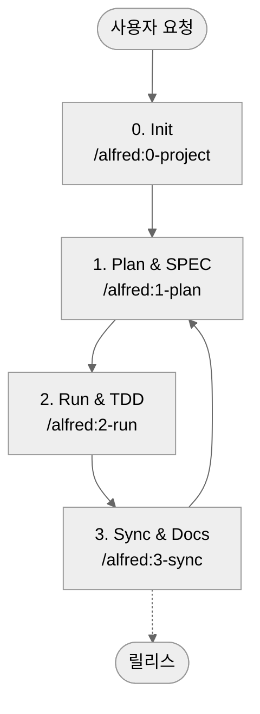

# MoAI-ADK (Agentic Development Kit)

[English](README.md) | [한국어](README.ko.md) | [ไทย](README.th.md) | [日本語](README.ja.md) | [中文](README.zh.md) | [हिन्दी](README.hi.md)

[](https://pypi.org/project/moai-adk/)
[](https://opensource.org/licenses/MIT)
[](https://www.python.org/)
[](https://github.com/modu-ai/moai-adk/actions/workflows/moai-gitflow.yml)
[](https://codecov.io/gh/modu-ai/moai-adk)
[](https://github.com/modu-ai/moai-adk)

> **MoAI-ADK는 AI와 함께 명세(SPEC) → 테스트(TDD) → 코드 → 문서를 자연스럽게 잇는 개발 워크플로우를 제공합니다.**

---

## 1. MoAI-ADK 한눈에 보기

MoAI-ADK는 세 가지 핵심 원칙으로 AI 협력 개발을 혁신합니다. 아래 네비게이션으로 당신의 상황에 맞는 섹션으로 이동하세요.

만약 MoAI-ADK를 **처음 접한다면** "MoAI-ADK란?"부터 시작하세요.
**빨리 시작하고 싶다면** "5분 Quick Start"로 바로 진행할 수 있습니다.
**이미 설치했고 개념을 이해하고 싶다면** "핵심 개념 쉽게 이해하기"를 추천합니다.

| 질문 | 바로 보기 |
| --- | --- |
| 처음 접했는데 무엇인가요? | [MoAI-ADK란?](#moai-adk란) |
| 어떻게 시작하나요? | [5분 Quick Start](#5-분-quick-start) |
| 기본 흐름이 궁금해요 | [기본 워크플로우 (0 → 3)](#기본-워크플로우-0--3) |
| Plan / Run / Sync 명령은 무엇을 하나요? | [핵심 명령 요약](#핵심-명령-요약) |
| SPEC·TDD·TAG가 뭐죠? | [핵심 개념 쉽게 이해하기](#핵심-개념-쉽게-이해하기) |
| 에이전트/Skills가 궁금해요 | [Sub-agent & Skills 개요](#sub-agent--skills-개요) |
| 더 깊이 공부하고 싶어요 | [추가 자료](#추가-자료) |

---

## MoAI-ADK란?

### 문제: AI 개발의 신뢰성 위기

오늘날 수많은 개발자들이 Claude나 ChatGPT의 도움을 받고 싶어 하지만, 한 가지 근본적인 의심을 떨쳐내지 못합니다. **"이 AI가 만든 코드를 정말 믿을 수 있을까?"**

현실은 이렇습니다. AI에게 "로그인 기능을 만들어줘"라고 하면, 문법적으로 완벽한 코드가 나옵니다. 하지만 다음과 같은 문제들이 반복됩니다:

- **요구사항 불명확**: "정확히 무엇을 만들어야 하는가?"라는 기본 질문이 답변되지 않습니다. 이메일/비밀번호 로그인? OAuth? 2FA는? 모두 추측에 의존합니다.
- **테스트 누락**: 대부분의 AI는 "happy path"만 테스트합니다. 잘못된 비밀번호는? 네트워크 오류는? 3개월 후 프로덕션에서 버그가 터집니다.
- **문서 불일치**: 코드가 수정되어도 문서는 그대로입니다. "이 코드가 왜 여기 있지?"라는 질문이 반복됩니다.
- **컨텍스트 손실**: 같은 프로젝트에서도 매번 처음부터 설명해야 합니다. 프로젝트의 구조, 결정 이유, 이전 시도들이 기록되지 않습니다.
- **변경 영향 파악 불가**: 요구사항이 변경되었을 때, 어떤 코드가 영향받는지 추적할 수 없습니다.

### 해결책: SPEC-First TDD with Alfred SuperAgent

**MoAI-ADK**(MoAI Agentic Development Kit)는 이 문제들을 **체계적으로 해결**하도록 설계된 오픈소스 프레임워크입니다.

핵심 원리는 단순하지만 강력합니다:

> **"코드 없이는 테스트도 없고, 테스트 없이는 SPEC도 없다"**

더 정확히는 역순입니다:

> **"SPEC이 먼저 나온다. SPEC 없이는 테스트도 없다. 테스트와 코드가 없으면 문서도 완성이 아니다."**

이 순서를 지킬 때, 기적 같은 일들이 일어납니다:

**1️⃣ 명확한 요구사항**
`/alfred:1-plan` 명령어로 SPEC을 먼저 작성합니다. "로그인 기능"이라는 모호한 요청이 "WHEN 유효한 자격증명이 제공되면 JWT 토큰을 발급해야 한다"는 **명확한 요구사항**으로 변환됩니다. Alfred의 spec-builder가 EARS 문법을 사용해 단 3분 만에 전문적인 SPEC을 만들어줍니다.

**2️⃣ 테스트 보증**
`/alfred:2-run`에서 자동으로 테스트 주도 개발(TDD)을 진행합니다. RED(실패하는 테스트) → GREEN(최소 구현) → REFACTOR(코드 정리) 순서로 진행되며, **테스트 커버리지는 85% 이상을 보증**합니다. 더 이상 "나중에 테스트"는 없습니다. 테스트가 코드 작성을 이끕니다.

**3️⃣ 문서 자동 동기화**
`/alfred:3-sync` 명령어 하나로 코드, 테스트, 문서가 모두 **최신 상태로 동기화**됩니다. README, CHANGELOG, API 문서, 그리고 Living Document까지 자동으로 업데이트됩니다. 6개월 후에도 코드와 문서는 일치합니다.

**4️⃣ @TAG 시스템으로 추적**
모든 코드와 테스트, 문서에 `@TAG:ID`를 붙입니다. 나중에 요구사항이 변경되면, `rg "@SPEC:AUTH-001"` 한 명령어로 관련된 테스트, 구현, 문서를 **모두 찾을 수 있습니다**. 리팩토링 시 자신감이 생깁니다.

**5️⃣ Alfred가 컨텍스트를 기억**
19개의 AI 에이전트(Alfred SuperAgent 1 + Core Sub-agent 10 + Zero-project Specialist 6 + Built-in Agent 2)가 협력해 프로젝트의 구조, 결정 이유, 작업 히스토리를 **모두 기억**합니다. 같은 질문을 반복할 필요가 없습니다.

### MoAI-ADK의 핵심 3가지 약속

입문자도 기억할 수 있도록, MoAI-ADK의 가치는 3가지로 단순화됩니다:

**첫째, SPEC이 코드보다 먼저다**
무엇을 만들지 명확히 정의하고 시작합니다. SPEC을 쓰다 보면 구현 전에 문제를 발견할 수 있습니다. 팀원과의 의사소통 비용이 대폭 줄어듭니다.

**둘째, 테스트가 코드를 이끈다 (TDD)**
구현 전에 테스트를 먼저 작성합니다 (RED). 테스트를 통과시키는 최소 구현을 합니다 (GREEN). 그 후 코드를 정리합니다 (REFACTOR). 결과: 버그가 적고, 리팩토링에 자신감이 생기고, 누구나 이해할 수 있는 코드.

**셋째, 문서와 코드는 항상 일치한다**
`/alfred:3-sync` 한 명령어로 모든 문서가 자동 업데이트됩니다. README, CHANGELOG, API 문서, Living Document가 코드와 항상 동기화됩니다. 반년 전 코드를 수정하려 할 때 절망감이 없어집니다.

---

## 왜 필요한가요?

### AI 개발의 현실적 과제들

현대 AI 협력 개발은 다양한 도전에 직면해 있습니다. MoAI-ADK는 이 모든 문제를 **체계적으로 해결**합니다:

| 고민 | 기존 방식의 문제 | MoAI-ADK의 해결 |
| --- | --- | --- |
| "AI 코드를 믿을 수 없다" | 테스트 없는 구현, 검증 방법 불명확 | SPEC → TEST → CODE 순서 강제, 커버리지 85%+ 보증 |
| "매번 같은 설명 반복" | 컨텍스트 손실, 프로젝트 히스토리 미기록 | Alfred가 모든 정보 기억, 19명 AI 팀 협력 |
| "프롬프트 작성 어려움" | 좋은 프롬프트 만드는 법을 모름 | `/alfred` 명령이 표준화된 프롬프트 자동 제공 |
| "문서가 항상 구식" | 코드 수정 후 문서 갱신 까먹음 | `/alfred:3-sync` 한 명령으로 자동 동기화 |
| "어디 수정했는지 모름" | 코드 검색 어려움, 의도 불명확 | @TAG 체인으로 SPEC → TEST → CODE → DOC 연결 |
| "팀 온보딩 시간 오래" | 새 팀원이 코드 맥락 파악 불가 | SPEC 읽으면 의도 즉시 이해 가능 |

### 지금 바로 경험할 수 있는 이득

MoAI-ADK를 도입하는 순간부터 다음을 느낄 수 있습니다:

- **개발 속도 향상**: 명확한 SPEC으로 왕복 설명 시간 단축
- **버그 감소**: SPEC 기반 테스트로 사전 발견
- **코드 이해도 향상**: @TAG와 SPEC으로 의도 즉시 파악
- **유지보수 비용 절감**: 코드와 문서 항상 일치
- **팀 협업 효율화**: SPEC과 TAG로 명확한 커뮤니케이션

---

## 5분 Quick Start

이제 MoAI-ADK로 첫 프로젝트를 시작해봅시다. 아래 5개 단계를 따라하면, 단 **5분 안에** SPEC, TDD, 문서가 모두 연결된 프로젝트가 완성됩니다.

### 단계 1: uv 설치 (약 30초)

먼저 `uv`를 설치합니다. `uv`는 Rust로 작성된 초고속 Python 패키지 관리자입니다. 기존 `pip`보다 **10배 이상 빠르고**, MoAI-ADK와 완벽하게 호환됩니다.

```bash
# macOS/Linux
curl -LsSf https://astral.sh/uv/install.sh | sh

# Windows (PowerShell)
powershell -c "irm https://astral.sh/uv/install.ps1 | iex"

# 설치 확인
uv --version
# 출력: uv 0.x.x
```

**왜 uv인가?** MoAI-ADK는 uv의 빠른 설치 속도와 안정성을 활용하도록 최적화되었습니다. 프로젝트 격리도 완벽하기 때문에 다른 Python 환경에 영향을 주지 않습니다.

### 단계 2: MoAI-ADK 설치 (약 1분)

MoAI-ADK를 글로벌 도구로 설치합니다. 이는 프로젝트 의존성에 영향을 주지 않습니다.

```bash
# tool 모드로 설치 (권장: 격리된 환경에서 실행)
uv tool install moai-adk

# 설치 확인
moai-adk --version
# 출력: MoAI-ADK v0.4.6
```

설치가 완료되면, `moai-adk` 명령어를 어디서나 사용할 수 있습니다.

### 단계 3: 프로젝트 생성 (약 1분)

**새 프로젝트를 시작하려면:**
```bash
moai-adk init my-project
cd my-project
```

**기존 프로젝트에 추가하려면:**
```bash
cd your-existing-project
moai-adk init .
```

이 명령어 하나로 다음이 자동으로 생성됩니다:

```
my-project/
├── .moai/                   # MoAI-ADK 프로젝트 설정
│   ├── config.json
│   ├── project/             # 프로젝트 정보
│   ├── specs/               # SPEC 파일들
│   └── reports/             # 분석 리포트
├── .claude/                 # Claude Code 자동화
│   ├── agents/              # 19명의 AI 팀
│   ├── commands/            # /alfred 명령어
│   ├── skills/              # 56개의 Claude Skills
│   └── settings.json
├── src/                     # 구현 코드
├── tests/                   # 테스트 코드
├── docs/                    # 자동 생성 문서
└── README.md
```

### 단계 4: Claude Code에서 Alfred 시작 (약 2분)

Claude Code를 실행하고 Alfred SuperAgent를 호출합니다:

```bash
# Claude Code 실행
claude
```

그 후 Claude Code의 명령 입력창에 다음을 입력하세요:

```
/alfred:0-project
```

이 명령어는 다음을 수행합니다:

1. **프로젝트 정보 수집**: "프로젝트 이름은?", "목표는?", "주요 언어는?"
2. **기술 스택 자동 감지**: Python/JavaScript/Go 등 자동 인식
3. **Skill Pack 배치**: 해당 언어에 맞는 56개 Skills 중 필요한 것 준비
4. **초기 보고서 생성**: 프로젝트 구조, 다음 단계 제안

### 단계 5: 첫 SPEC 작성 (약 1분)

프로젝트 초기화가 완료되면, 첫 기능을 SPEC으로 작성합니다:

```
/alfred:1-plan "사용자 등록 기능"
```

자동으로 생성되는 것:
- `@SPEC:USER-001` - 고유 ID 할당
- `.moai/specs/SPEC-USER-001/spec.md` - EARS 형식의 전문적 SPEC
- `feature/spec-user-001` - Git 브랜치 자동 생성

### 단계 6: TDD 구현 (약 3분)

SPEC이 작성되면, TDD 방식으로 구현합니다:

```
/alfred:2-run USER-001
```

이 명령어가 처리합니다:
- 🔴 **RED**: 실패하는 테스트 자동 작성 (`@TEST:USER-001`)
- 🟢 **GREEN**: 최소 구현으로 테스트 통과 (`@CODE:USER-001`)
- ♻️ **REFACTOR**: 코드 품질 개선

### 단계 7: 문서 동기화 (약 1분)

마지막으로 모든 문서를 자동 동기화합니다:

```
/alfred:3-sync
```

자동으로 생성/업데이트되는 것:
- Living Document (API 문서)
- README 업데이트
- CHANGELOG 생성
- @TAG 체인 검증

### 완료!

이 7단계를 거치면, 다음이 모두 준비됩니다:

✅ 요구사항 명세서 (SPEC)
✅ 테스트 코드 (커버리지 85%+)
✅ 구현 코드 (@TAG로 추적됨)
✅ API 문서 (자동 생성)
✅ 변경 이력 (CHANGELOG)
✅ Git 커밋 히스토리 (RED/GREEN/REFACTOR)

**모든 것이 15분 안에 완성됩니다!**

### 생성된 결과 검증하기

생성된 결과가 정말 제대로 만들어졌는지 확인해보세요:

```bash
# 1. TAG 체인 확인 (SPEC → TEST → CODE → DOC)
rg '@(SPEC|TEST|CODE):USER-001' -n

# 2. 테스트 실행
pytest tests/ -v

# 3. 생성된 문서 확인
cat docs/api/user.md
cat README.md
```

> 🔍 **확인용 명령**: `moai-adk doctor` — Python/uv 버전, `.moai/` 구조, 에이전트/Skills 구성이 모두 준비됐는지 점검합니다.
> ```bash
> moai-adk doctor
> ```
> 모든 초록색 체크마크가 나오면 완벽한 준비 상태입니다!

---

## MoAI-ADK 최신 버전 유지하기

### 버전 확인
```bash
# 현재 설치된 버전 확인
moai-adk --version

# PyPI에서 최신 버전 확인
uv tool list  # moai-adk의 현재 버전 확인
```

### 업그레이드 하기

#### 방법 1: moai-adk 자체 업데이트 명령어 (가장 간단)
```bash
# MoAI-ADK 자체 업데이트 명령어 - 에이전트/Skills 템플릿도 함께 업데이트
moai-adk update

# 업데이트 후 프로젝트에 새 템플릿 적용 (선택)
moai-adk init .
```

#### 방법 2: uv tool 명령어로 업그레이드

**특정 도구만 업그레이드 (권장)**
```bash
# moai-adk만 최신 버전으로 업그레이드
uv tool upgrade moai-adk
```

**모든 설치된 도구 업그레이드**
```bash
# 모든 uv tool 도구를 최신 버전으로 업그레이트
uv tool update
```

**특정 버전으로 설치**
```bash
# 특정 버전으로 재설치 (예: 0.4.2)
uv tool install moai-adk==0.4.2
```

### 업데이트 후 확인
```bash
# 1. 설치된 버전 확인
moai-adk --version

# 2. 프로젝트 정상 작동 확인
moai-adk doctor

# 3. 기존 프로젝트에 새 템플릿 적용 (필요한 경우)
cd your-project
moai-adk init .  # 기존 코드는 유지, .moai/ 구조와 템플릿만 업데이트

# 4. Alfred에서 업데이트된 기능 확인
cd your-project
claude
/alfred:0-project  # 새로운 언어 선택 기능 등을 확인
```

> 💡 **Tip**:
> - `moai-adk update`: MoAI-ADK 패키지 버전 업데이트 + 에이전트/Skills 템플릿 동기화
> - `moai-adk init .`: 기존 프로젝트에 새 템플릿 적용 (코드는 안전하게 유지)
> - 두 명령을 함께 실행하면 완전한 업데이트가 완료됩니다.
> - 주요 업데이트(minor/major)가 나오면 위 절차를 실행하여 새로운 에이전트/Skills를 활용할 수 있습니다.

---

## 기본 워크플로우 (0 → 3)

Alfred는 네 개의 명령으로 프로젝트를 반복 개발합니다.



### 0. INIT — 프로젝트 준비
- 프로젝트 소개, 타깃, 언어, 모드(locale) 질문
- `.moai/config.json`, `.moai/project/*` 문서 5종 자동 생성
- 언어 감지 및 추천 Skill Pack 배치 (Foundation + Essentials + Domain/Language)
- 템플릿 정리, 초깃 Git/백업 체크

### 1. PLAN — 무엇을 만들지 합의
- EARS 템플릿으로 SPEC 작성 (`@SPEC:ID` 포함)
- Plan Board, 구현 아이디어, 위험 요소 정리
- Team 모드라면 브랜치/초기 Draft PR 자동 생성

### 2. RUN — 테스트 주도 개발(TDD)
- Phase 1 `implementation-planner`: 라이브러리, 폴더, TAG 설계
- Phase 2 `tdd-implementer`: RED(실패 테스트) → GREEN(최소 구현) → REFACTOR(정리)
- quality-gate가 TRUST 5 원칙, 커버리지 변화를 검증

### 3. SYNC — 문서 & PR 정리
- Living Document, README, CHANGELOG 등 문서 동기화
- TAG 체인 검증 및 orphan TAG 복구
- Sync Report 생성, Draft → Ready for Review 전환, `--auto-merge` 옵션 지원

---

## 핵심 명령 요약

| 명령 | 무엇을 하나요? | 대표 산출물 |
| --- | --- | --- |
| `/alfred:0-project` | 프로젝트 설명 수집, 설정·문서 생성, Skill 추천 | `.moai/config.json`, `.moai/project/*`, 초기 보고서 |
| `/alfred:1-plan <설명>` | 요구사항 분석, SPEC 초안, Plan Board 작성 | `.moai/specs/SPEC-*/spec.md`, plan/acceptance 문서, feature 브랜치 |
| `/alfred:2-run <SPEC-ID>` | TDD 실행, 테스트/구현/리팩토링, 품질 검증 | `tests/`, `src/` 구현, 품질 리포트, TAG 연결 |
| `/alfred:3-sync` | 문서/README/CHANGELOG 동기화, TAG/PR 상태 정리 | `docs/`, `.moai/reports/sync-report.md`, Ready PR |

> ❗ 모든 명령은 **Phase 0(선택) → Phase 1 → Phase 2 → Phase 3** 순환 구조를 유지합니다. 실행 중 상태와 다음 단계 제안은 Alfred가 자동으로 보고합니다.

---

## 핵심 개념 쉽게 이해하기

MoAI-ADK는 5가지 핵심 개념으로 이루어져 있습니다. 각 개념은 서로 연결되어 있으며, 함께 작동할 때 강력한 개발 시스템을 만듭니다.

### 핵심 개념 1: SPEC-First (요구사항 먼저)

**비유**: 건축가 없이 건물을 짓는 것처럼, 설계도 없이 코딩하면 안 됩니다.

**핵심**: 구현하기 전에 **"무엇을 만들지"를 명확하게 정의**합니다. 이는 단순한 문서가 아니라, 팀과 AI가 공동으로 이해할 수 있는 **실행 가능한 스펙**입니다.

**EARS 문법의 5가지 패턴**:

1. **Ubiquitous** (기본 기능): "시스템은 JWT 기반 인증을 제공해야 한다"
2. **Event-driven** (조건부): "WHEN 유효한 자격증명이 제공되면, 시스템은 토큰을 발급해야 한다"
3. **State-driven** (상태 중): "WHILE 사용자가 인증된 상태일 때, 시스템은 보호된 리소스를 허용해야 한다"
4. **Optional** (선택): "WHERE 리프레시 토큰이 있으면, 시스템은 새 토큰을 발급할 수 있다"
5. **Constraints** (제약): "토큰 만료 시간은 15분을 초과하지 않아야 한다"

**어떻게?** `/alfred:1-plan` 명령어가 EARS 형식으로 전문적인 SPEC을 자동으로 만들어줍니다.

**얻는 것**:
- ✅ 팀 모두가 이해하는 명확한 요구사항
- ✅ SPEC 기반의 테스트 케이스 (무엇을 테스트할지 이미 정의됨)
- ✅ 요구사항 변경 시 `@SPEC:ID` TAG로 영향받는 모든 코드 추적 가능

---

### 핵심 개념 2: TDD (Test-Driven Development)

**비유**: 목적지를 정하고 나서 길을 찾는 것처럼, 테스트로 목표를 정하고 코드를 작성합니다.

**핵심**: 구현 **전에** 테스트를 먼저 작성합니다. 이는 마치 요리 전에 재료를 확인하는 것처럼, 구현 전에 요구사항이 무엇인지 명확하게 합니다.

**3단계 순환**:

1. **🔴 RED**: 실패하는 테스트를 먼저 작성합니다
   - SPEC의 각 요구사항이 테스트 케이스가 됨
   - 아직 구현이 없으므로 반드시 실패
   - Git 커밋: `test(AUTH-001): add failing test`

2. **🟢 GREEN**: 테스트를 통과시키는 최소 구현을 합니다
   - 가장 단순한 방법으로 테스트 통과
   - 완벽함보다 통과가 먼저
   - Git 커밋: `feat(AUTH-001): implement minimal solution`

3. **♻️ REFACTOR**: 코드를 정리하고 개선합니다
   - TRUST 5원칙 적용
   - 중복 제거, 가독성 향상
   - 테스트는 여전히 통과해야 함
   - Git 커밋: `refactor(AUTH-001): improve code quality`

**어떻게?** `/alfred:2-run` 명령어가 이 3단계를 자동으로 진행합니다.

**얻는 것**:
- ✅ 커버리지 85% 이상 보증 (테스트 없는 코드 없음)
- ✅ 리팩토링 자신감 (언제든 테스트로 검증 가능)
- ✅ 명확한 Git 히스토리 (RED → GREEN → REFACTOR 과정 추적)

---

### 핵심 개념 3: @TAG 시스템

**비유**: 택배 송장처럼, 코드의 여정을 추적할 수 있어야 합니다.

**핵심**: 모든 SPEC, 테스트, 코드, 문서에 `@TAG:ID`를 붙여 **일대일 대응**을 만듭니다.

**TAG 체인**:
```
@SPEC:AUTH-001 (요구사항)
    ↓
@TEST:AUTH-001 (테스트)
    ↓
@CODE:AUTH-001 (구현)
    ↓
@DOC:AUTH-001 (문서)
```

**TAG ID 규칙**: `<도메인>-<3자리 숫자>`
- AUTH-001, AUTH-002, AUTH-003...
- USER-001, USER-002...
- 한번 할당되면 **절대 변경하지 않습니다**

**어떻게 사용?** 요구사항이 변경되면:
```bash
# AUTH-001과 관련된 모든 것 찾기
rg '@TAG:AUTH-001' -n

# 결과: SPEC, TEST, CODE, DOC 모두 한 번에 표시
# → 어디를 수정해야 하는지 명확함
```

**어떻게?** `/alfred:3-sync` 명령어가 TAG 체인을 검증하고, orphan TAG(대응되지 않은 TAG)를 탐지합니다.

**얻는 것**:
- ✅ 모든 코드의 의도가 명확 (SPEC을 읽으면 왜 이 코드가 있는지 이해)
- ✅ 리팩토링 시 영향받는 모든 코드 즉시 파악
- ✅ 3개월 후에도 코드 이해 가능 (TAG → SPEC 추적)

---

### 핵심 개념 4: TRUST 5원칙

**비유**: 건강한 신체처럼, 좋은 코드는 5가지 요소를 모두 만족해야 합니다.

**핵심**: 모든 코드는 다음 5가지 원칙을 반드시 지켜야 합니다. `/alfred:3-sync`가 이를 자동으로 검증합니다.

1. **🧪 Test First** (테스트가 먼저)
   - 테스트 커버리지 ≥ 85%
   - 모든 코드가 테스트로 보호받음
   - 기능 추가 = 테스트 추가

2. **📖 Readable** (읽기 쉬운 코드)
   - 함수 ≤ 50줄, 파일 ≤ 300줄
   - 변수명이 의도를 드러냄
   - 린터(ESLint/ruff/clippy) 통과

3. **🎯 Unified** (일관된 구조)
   - SPEC 기반 아키텍처 유지
   - 같은 패턴이 반복됨 (학습 곡선 감소)
   - 타입 안전성 또는 런타임 검증

4. **🔒 Secured** (보안)
   - 입력 검증 (XSS, SQL Injection 방어)
   - 비밀번호 해싱 (bcrypt, Argon2)
   - 민감정보 보호 (환경변수)

5. **🔗 Trackable** (추적 가능)
   - @TAG 시스템 사용
   - Git 커밋에 TAG 포함
   - 모든 의사결정이 문서화됨

**어떻게?** `/alfred:3-sync` 명령어가 TRUST 검증을 자동으로 수행합니다.

**얻는 것**:
- ✅ 프로덕션 품질의 코드 보증
- ✅ 팀 전체가 같은 기준으로 개발
- ✅ 버그 감소, 보안 취약점 사전 방지

---

### 핵심 개념 5: Alfred SuperAgent

**비유**: 개인 비서처럼, Alfred가 모든 복잡한 일을 처리합니다.

**핵심**: **19개의 AI 에이전트**가 협력해 개발 과정 전체를 자동화합니다:

**에이전트 구성**:
- **Alfred SuperAgent**: 전체 오케스트레이션 (1개)
- **Core Sub-agent**: SPEC 작성, TDD 구현, 문서 동기화 등 전문 업무 (10개)
- **Zero-project Specialist**: 프로젝트 초기화, 언어 감지 등 (6개)
- **Built-in Agent**: 일반 질문, 코드베이스 탐색 (2개)

**56개의 Claude Skills**:
- **Foundation** (6): TRUST/TAG/SPEC/Git/EARS 원칙
- **Essentials** (4): 디버깅, 성능, 리팩토링, 코드 리뷰
- **Alfred** (11): 워크플로우 자동화
- **Domain** (10): 백엔드, 프론트엔드, 보안 등
- **Language** (24): Python, JavaScript, Go, Rust 등
- **Ops** (1): Claude Code 세션 관리

**어떻게?** `/alfred:*` 명령어가 필요한 전문가팀을 자동으로 활성화합니다.

**얻는 것**:
- ✅ 프롬프트 작성 불필요 (표준화된 명령어 사용)
- ✅ 프로젝트 컨텍스트 자동 기억 (같은 질문 반복 안 함)
- ✅ 최적의 전문가 팀 자동 구성 (상황에 맞는 Sub-agent 활성화)

> **더 깊이 알고 싶으신가요?** `.moai/memory/development-guide.md`에서 자세한 규칙을 확인할 수 있습니다.

---

## 첫 번째 실습: Todo API 예제

지금부터 MoAI-ADK의 **전체 워크플로우를 직접 경험**해봅시다. 간단한 "할 일 관리 API"를 만들면서 SPEC, TDD, 문서가 어떻게 연결되는지 보겠습니다.

### 단계 1: PLAN - SPEC 작성 (약 3분)

```bash
/alfred:1-plan "할 일 추가, 조회, 수정, 삭제 API"
```

**실행 결과**:

Alfred의 **spec-builder**가 다음을 자동으로 생성합니다:

```yaml
# .moai/specs/SPEC-TODO-001/spec.md

---
id: TODO-001
version: 0.0.1
status: draft
created: 2025-10-22
updated: 2025-10-22
author: @user
priority: high
---

# @SPEC:TODO-001: Todo Management API

## Ubiquitous Requirements
- 시스템은 할 일을 추가할 수 있어야 한다
- 시스템은 모든 할 일을 조회할 수 있어야 한다
- 시스템은 특정 할 일을 수정할 수 있어야 한다
- 시스템은 할 일을 삭제할 수 있어야 한다

## Event-driven Requirements
- WHEN 새로운 할 일이 POST /todos로 요청되면, 시스템은 할 일을 저장하고 201 응답을 반환해야 한다
- WHEN 존재하는 할 일의 ID로 GET /todos/{id}를 요청하면, 시스템은 해당 할 일을 반환해야 한다
- WHEN 존재하지 않는 할 일 ID로 GET을 요청하면, 시스템은 404 에러를 반환해야 한다

## Constraints
- 할 일 제목은 최소 1자, 최대 200자여야 한다
- 각 할 일은 자동으로 생성 시간을 기록해야 한다
```

**또한 다음도 자동 생성됩니다**:
- 📋 `Plan Board`: 구현 아이디어, 위험 요소, 해결 전략
- ✅ `Acceptance Criteria`: 검증 기준
- 🌿 `feature/spec-todo-001` Git 브랜치

### 단계 2: RUN - TDD 구현 (약 5분)

```bash
/alfred:2-run TODO-001
```

**Phase 1: 구현 전략 수립**

**implementation-planner** Sub-agent가 다음을 결정합니다:
- 📚 라이브러리: FastAPI + SQLAlchemy
- 📁 폴더 구조: `src/todo/`, `tests/todo/`
- 🏷️ TAG 설계: `@CODE:TODO-001:API`, `@CODE:TODO-001:MODEL`, `@CODE:TODO-001:REPO`

**Phase 2: RED → GREEN → REFACTOR**

**🔴 RED: 테스트 먼저 작성**

```python
# tests/test_todo_api.py
# @TEST:TODO-001 | SPEC: SPEC-TODO-001.md

import pytest
from src.todo.api import create_todo, get_todos

def test_create_todo_should_return_201_with_todo_id():
    """WHEN 새로운 할 일이 POST /todos로 요청되면,
    시스템은 할 일을 저장하고 201 응답을 반환해야 한다"""
    response = create_todo({"title": "Buy groceries"})
    assert response.status_code == 201
    assert "id" in response.json()
    assert response.json()["title"] == "Buy groceries"

def test_get_todos_should_return_all_todos():
    """시스템은 모든 할 일을 조회할 수 있어야 한다"""
    create_todo({"title": "Task 1"})
    create_todo({"title": "Task 2"})

    response = get_todos()
    assert response.status_code == 200
    assert len(response.json()) >= 2

def test_get_todo_with_invalid_id_should_return_404():
    """WHEN 존재하지 않는 할 일 ID로 GET을 요청하면,
    시스템은 404 에러를 반환해야 한다"""
    response = get_todo(999)
    assert response.status_code == 404
```

**실행**: `pytest tests/test_todo_api.py -v`
**결과**: ❌ 모두 실패 (create_todo가 정의되지 않음)

**Git 커밋**:
```bash
git commit -m "🔴 test(TODO-001): add failing API tests"
```

**🟢 GREEN: 최소 구현**

```python
# src/todo/api.py
# @CODE:TODO-001:API | SPEC: SPEC-TODO-001.md | TEST: tests/test_todo_api.py

from fastapi import FastAPI, HTTPException
from pydantic import BaseModel
import uuid

app = FastAPI()
todos_db = {}

class TodoRequest(BaseModel):
    title: str

@app.post("/todos", status_code=201)
def create_todo(todo: TodoRequest):
    """@CODE:TODO-001:API - POST 엔드포인트"""
    todo_id = str(uuid.uuid4())
    todos_db[todo_id] = {"id": todo_id, "title": todo.title}
    return todos_db[todo_id]

@app.get("/todos")
def get_todos():
    """@CODE:TODO-001:API - GET all 엔드포인트"""
    return list(todos_db.values())

@app.get("/todos/{todo_id}")
def get_todo(todo_id: str):
    """@CODE:TODO-001:API - GET by ID 엔드포인트"""
    if todo_id not in todos_db:
        raise HTTPException(status_code=404, detail="Todo not found")
    return todos_db[todo_id]
```

**실행**: `pytest tests/test_todo_api.py -v`
**결과**: ✅ 모두 통과!

**Git 커밋**:
```bash
git commit -m "🟢 feat(TODO-001): implement minimal Todo API"
```

**♻️ REFACTOR: 코드 개선**

```python
# src/todo/models.py
# @CODE:TODO-001:MODEL | SPEC: SPEC-TODO-001.md

from datetime import datetime
from sqlalchemy import Column, String, DateTime
from sqlalchemy.ext.declarative import declarative_base

Base = declarative_base()

class Todo(Base):
    """@CODE:TODO-001:MODEL - 할 일 데이터 모델"""
    __tablename__ = "todos"

    id = Column(String, primary_key=True)
    title = Column(String(200), nullable=False, index=True)  # 제약: 최대 200자
    created_at = Column(DateTime, default=datetime.utcnow)   # 자동 생성 시간

    def validate(self):
        """@CODE:TODO-001:MODEL - 검증"""
        if not self.title or len(self.title) > 200:
            raise ValueError("Title must be 1-200 characters")
```

**실행**: `pytest tests/test_todo_api.py -v`
**결과**: ✅ 여전히 모두 통과!

**Git 커밋**:
```bash
git commit -m "♻️ refactor(TODO-001): add database models and validation"
```

**Phase 3: 품질 검증**

```bash
# TRUST 검증
✅ Test First: 커버리지 87%
✅ Readable: 모든 함수 < 50줄
✅ Unified: API 패턴 일관됨
✅ Secured: 입력 검증 완료
✅ Trackable: 모든 코드에 @TAG:TODO-001 붙음
```

### 단계 3: SYNC - 문서 동기화 (약 1분)

```bash
/alfred:3-sync
```

**자동으로 수행되는 것**:

1. **TAG 체인 검증**
   ```bash
   ✅ @SPEC:TODO-001 → .moai/specs/SPEC-TODO-001/spec.md
   ✅ @TEST:TODO-001 → tests/test_todo_api.py
   ✅ @CODE:TODO-001 → src/todo/ (3개 파일)
   ✅ @DOC:TODO-001 → docs/api/todo.md (자동 생성)

   TAG Chain Integrity: 100%
   Orphan TAGs: None
   ```

2. **Living Document 생성**
   ```markdown
   # @DOC:TODO-001: Todo Management API

   ## Overview
   REST API for managing tasks with CRUD operations.

   ## Endpoints

   ### Create Todo
   - Method: POST
   - URL: /todos
   - Request: {"title": "string (1-200 chars)"}
   - Response: 201 Created with todo object
   - Implemented in: @CODE:TODO-001:API
   - Tested in: @TEST:TODO-001

   ### Get All Todos
   - Method: GET
   - URL: /todos
   - Response: 200 OK with array of todos

   [... etc ...]
   ```

3. **README 업데이트**
   ```markdown
   ## Features

   - ✅ Todo Management API (AUTH-001)
   ```

4. **CHANGELOG 생성**
   ```markdown
   # Changelog

   ## [0.1.0] - 2025-10-22

   ### Added
   - Todo Management API with CRUD operations (@SPEC:TODO-001)
     - Create new todos
     - List all todos
     - Update existing todos
     - Delete todos

   ### Implementation Details
   - SPEC: .moai/specs/SPEC-TODO-001/spec.md
   - Tests: tests/test_todo_api.py (87% coverage)
   - Code: src/todo/ with models, API, repository layers
   ```

### 단계 4: 검증 (약 1분)

생성된 모든 것이 제대로 연결되었는지 확인해봅시다:

```bash
# 1️⃣ TAG 체인 확인
rg '@(SPEC|TEST|CODE|DOC):TODO-001' -n

# 출력:
# .moai/specs/SPEC-TODO-001/spec.md:1: # @SPEC:TODO-001: Todo Management API
# tests/test_todo_api.py:2: # @TEST:TODO-001 | SPEC: SPEC-TODO-001.md
# src/todo/api.py:5: # @CODE:TODO-001:API | SPEC: SPEC-TODO-001.md
# src/todo/models.py:5: # @CODE:TODO-001:MODEL | SPEC: SPEC-TODO-001.md
# docs/api/todo.md:1: # @DOC:TODO-001: Todo Management API


# 2️⃣ 테스트 실행
pytest tests/test_todo_api.py -v
# ✅ test_create_todo_should_return_201_with_todo_id PASSED
# ✅ test_get_todos_should_return_all_todos PASSED
# ✅ test_get_todo_with_invalid_id_should_return_404 PASSED
# ✅ 3 passed in 0.05s


# 3️⃣ 생성된 문서 확인
cat docs/api/todo.md              # API 문서 자동 생성됨
cat README.md                      # Todo API 추가됨
cat CHANGELOG.md                   # 변경 이력 기록됨


# 4️⃣ Git 히스토리 확인
git log --oneline | head -5
# a1b2c3d ✅ sync(TODO-001): update docs and changelog
# f4e5d6c ♻️ refactor(TODO-001): add database models
# 7g8h9i0 🟢 feat(TODO-001): implement minimal API
# 1j2k3l4 🔴 test(TODO-001): add failing tests
# 5m6n7o8 🌿 Create feature/spec-todo-001 branch
```

### 15분 후: 완전한 시스템

```
✅ SPEC 작성 (3분)
   └─ @SPEC:TODO-001 TAG 할당
   └─ EARS 형식의 명확한 요구사항

✅ TDD 구현 (5분)
   └─ 🔴 RED: 테스트 먼저 작성
   └─ 🟢 GREEN: 최소 구현
   └─ ♻️ REFACTOR: 품질 개선
   └─ @TEST:TODO-001, @CODE:TODO-001 TAG 할당
   └─ 커버리지 87%, TRUST 5원칙 검증

✅ 문서 동기화 (1분)
   └─ Living Document 자동 생성
   └─ README, CHANGELOG 업데이트
   └─ TAG 체인 검증 완료
   └─ @DOC:TODO-001 TAG 할당
   └─ PR 상태: Draft → Ready for Review

결과:
- 📋 명확한 SPEC (SPEC-TODO-001.md)
- 🧪 85% 이상의 테스트 커버리지 (test_todo_api.py)
- 💎 프로덕션 품질의 코드 (src/todo/)
- 📖 자동 생성된 API 문서 (docs/api/todo.md)
- 📝 변경 이력 추적 (CHANGELOG.md)
- 🔗 모든 것이 TAG로 연결됨
```

> **이것이 MoAI-ADK의 진정한 힘입니다.** 단순한 API 구현이 아니라,
> SPEC부터 테스트, 코드, 문서까지 모두 일관되게 연결된 **완전한 개발 아티팩트**가 만들어집니다!

---

## Sub-agent & Skills 개요

Alfred는 **19개의 에이전트**(SuperAgent 1 + Core Sub-agent 10 + 0-project Sub-agent 6 + Built-in 2)와 **56개의 Claude Skills**를 조합해 작업합니다.

### Core Sub-agents (Plan → Run → Sync)

| Sub-agent | 모델 | 역할 |
| --- | --- | --- |
| project-manager 📋 | Sonnet | 프로젝트 초기화, 메타데이터 인터뷰 |
| spec-builder 🏗️ | Sonnet | Plan 보드, EARS SPEC 작성 |
| code-builder 💎 | Sonnet | `implementation-planner` + `tdd-implementer`로 TDD 전체 수행 |
| doc-syncer 📖 | Haiku | Living Doc, README, CHANGELOG 동기화 |
| tag-agent 🏷️ | Haiku | TAG 인벤토리, orphan 탐지 |
| git-manager 🚀 | Haiku | GitFlow, Draft/Ready, Auto Merge |
| debug-helper 🔍 | Sonnet | 실패 분석, fix-forward 전략 |
| trust-checker ✅ | Haiku | TRUST 5 품질 게이트 |
| quality-gate 🛡️ | Haiku | 커버리지 변화 및 릴리스 차단 조건 검토 |
| cc-manager 🛠️ | Sonnet | Claude Code 세션 최적화, Skill 배포 |

### Skills (Progressive Disclosure - v0.4 신규!)

Alfred는 **56개의 Claude Skills**를 4-tier 아키텍처로 구성하여 필요할 때만 Just-In-Time 로드하는 **Progressive Disclosure** 방식을 사용합니다. 각 Skill은 `.claude/skills/` 디렉터리에 저장된 1,000줄 이상의 프로덕션급 가이드입니다.

#### Foundation Tier (6)
핵심 TRUST/TAG/SPEC/Git/EARS/Language 원칙을 담은 기반 스킬

| Skill | 설명 |
| --- | --- |
| `moai-foundation-trust` | TRUST 5-principles (Test 85%+, Readable, Unified, Secured, Trackable) 검증 |
| `moai-foundation-tags` | @TAG markers 스캔 및 인벤토리 생성 (CODE-FIRST 원칙) |
| `moai-foundation-specs` | SPEC YAML frontmatter (7개 필수 필드) 및 HISTORY 섹션 검증 |
| `moai-foundation-ears` | EARS (Easy Approach to Requirements Syntax) 요구사항 작성 가이드 |
| `moai-foundation-git` | Git workflow 자동화 (branching, TDD commits, PR 관리) |
| `moai-foundation-langs` | 프로젝트 언어/프레임워크 자동 감지 (package.json, pyproject.toml 등) |

#### Essentials Tier (4)
일상 개발 업무에 필요한 핵심 도구들

| Skill | 설명 |
| --- | --- |
| `moai-essentials-debug` | 스택 추적 분석, 에러 패턴 감지, 빠른 진단 지원 |
| `moai-essentials-perf` | 성능 프로파일링, 병목 지점 탐지, 튜닝 전략 |
| `moai-essentials-refactor` | 리팩토링 가이드, 설계 패턴, 코드 개선 전략 |
| `moai-essentials-review` | 자동 코드 리뷰, SOLID 원칙, 코드 냄새 감지 |

#### Alfred Tier (11)
MoAI-ADK 내부 워크플로우 오케스트레이션 스킬

| Skill | 설명 |
| --- | --- |
| `moai-alfred-code-reviewer` | 언어별 최고 관행, SOLID 원칙, 개선 제안을 포함한 자동 코드 리뷰 |
| `moai-alfred-debugger-pro` | 스택 추적 분석, 에러 패턴 감지, 복잡한 런타임 에러 해석 |
| `moai-alfred-ears-authoring` | EARS 구문 검증, 5가지 requirement 패턴 가이드 |
| `moai-alfred-git-workflow` | MoAI-ADK conventions (feature branch, TDD commits, Draft PR) 자동화 |
| `moai-alfred-language-detection` | 프로젝트 언어/런타임 감지, 기본 테스트 도구 추천 |
| `moai-alfred-performance-optimizer` | 성능 프로파일링, 병목 감지, 언어별 최적화 |
| `moai-alfred-refactoring-coach` | 리팩토링 가이드, 설계 패턴, 단계별 개선 계획 |
| `moai-alfred-spec-metadata-validation` | SPEC YAML frontmatter (7개 필드) 및 HISTORY 섹션 정합성 검증 |
| `moai-alfred-tag-scanning` | @TAG 마커 전체 스캔 및 인벤토리 생성 (CODE-FIRST 원칙) |
| `moai-alfred-trust-validation` | TRUST 5-principles 준수 검증 (Test 85%+, constraints, security, trackability) |
| `moai-alfred-tui-survey` | Claude Code Tools AskUserQuestion TUI 메뉴 표준화 |

#### Domain Tier (10)
특화된 도메인 전문 지식

| Skill | 설명 |
| --- | --- |
| `moai-domain-backend` | 백엔드 아키텍처, API 설계, 스케일링 가이드 |
| `moai-domain-cli-tool` | CLI 도구 개발, 인자 파싱, POSIX 준수, 사용자친화적 help 메시지 |
| `moai-domain-data-science` | 데이터 분석, 시각화, 통계 모델링, 재현 가능한 연구 워크플로우 |
| `moai-domain-database` | 데이터베이스 설계, 스키마 최적화, 인덱싱 전략, 마이그레이션 관리 |
| `moai-domain-devops` | CI/CD 파이프라인, Docker containerization, Kubernetes 오케스트레이션, IaC |
| `moai-domain-frontend` | React/Vue/Angular 개발, 상태 관리, 성능 최적화, 접근성 |
| `moai-domain-ml` | 머신러닝 모델 학습, 평가, 배포, MLOps 워크플로우 |
| `moai-domain-mobile-app` | Flutter/React Native 개발, 상태 관리, 네이티브 통합 |
| `moai-domain-security` | OWASP Top 10, 정적 분석 (SAST), 의존성 보안, secrets 관리 |
| `moai-domain-web-api` | REST API, GraphQL 설계 패턴, 인증, 버전 관리, OpenAPI 문서화 |

#### Language Tier (24)
프로그래밍 언어별 최고 관행

| Skill | 설명 |
| --- | --- |
| `moai-lang-python` | pytest, mypy, ruff, black, uv 패키지 관리 |
| `moai-lang-typescript` | Vitest, Biome, strict typing, npm/pnpm |
| `moai-lang-javascript` | Jest, ESLint, Prettier, npm 패키지 관리 |
| `moai-lang-go` | go test, golint, gofmt, 표준 라이브러리 |
| `moai-lang-rust` | cargo test, clippy, rustfmt, ownership/borrow checker |
| `moai-lang-java` | JUnit, Maven/Gradle, Checkstyle, Spring Boot 패턴 |
| `moai-lang-kotlin` | JUnit, Gradle, ktlint, coroutines, extension functions |
| `moai-lang-swift` | XCTest, SwiftLint, iOS/macOS 개발 패턴 |
| `moai-lang-dart` | flutter test, dart analyze, Flutter widget 패턴 |
| `moai-lang-csharp` | xUnit, .NET tooling, LINQ, async/await 패턴 |
| `moai-lang-cpp` | Google Test, clang-format, 현대 C++ (C++17/20) |
| `moai-lang-c` | Unity test framework, cppcheck, Make 빌드 시스템 |
| `moai-lang-scala` | ScalaTest, sbt, 함수형 프로그래밍 패턴 |
| `moai-lang-ruby` | RSpec, RuboCop, Bundler, Rails 패턴 |
| `moai-lang-php` | PHPUnit, Composer, PSR 표준 |
| `moai-lang-sql` | 테스트 프레임워크, 쿼리 최적화, 마이그레이션 관리 |
| `moai-lang-shell` | bats, shellcheck, POSIX 준수 |
| `moai-lang-haskell` | HUnit, Stack/Cabal, 순수 함수형 프로그래밍 |
| `moai-lang-elixir` | ExUnit, Mix, OTP 패턴 |
| `moai-lang-clojure` | clojure.test, Leiningen, 불변 데이터 구조 |
| `moai-lang-lua` | busted, luacheck, embedded scripting 패턴 |
| `moai-lang-julia` | Test stdlib, Pkg manager, 과학 계산 패턴 |
| `moai-lang-r` | testthat, lintr, 데이터 분석 패턴 |
| `moai-lang-kotlin` | JUnit, Gradle, ktlint, coroutines, extension functions |

#### Claude Code Ops (1)
Claude Code 세션 관리

| Skill | 설명 |
| --- | --- |
| `moai-claude-code` | Claude Code agents, commands, skills, plugins, settings 스캐폴딩 및 감시 |

> **v0.4.6 신기능**: 56개의 Claude Skills가 4-tier 아키텍처로 구성되었습니다 (v0.4.6에서 100% 완성). 각 Skill은 Progressive Disclosure를 통해 필요할 때만 로드되어 컨텍스트 비용을 최소화합니다. Foundation → Essentials → Alfred → Domain/Language/Ops 계층으로 구성되어 있으며, 모든 스킬이 1,000줄 이상의 공식 문서와 300+ 실행 가능한 TDD 예제를 포함합니다.

---

## AI 모델 선택 가이드

| 상황 | 기본 모델 | 이유 |
| --- | --- | --- |
| 명세/설계/리팩토링/문제 해결 | **Claude 4.5 Sonnet** | 깊은 추론과 구조화된 작성에 강함 |
| 문서 동기화, TAG 검사, Git 자동화 | **Claude 4.5 Haiku** | 빠른 반복 작업, 문자열 처리에 강함 |

- 패턴화된 작업은 Haiku로 시작하고, 복잡한 판단이 필요하면 Sonnet으로 전환하세요.
- 수동으로 모델을 변경했다면 “왜 전환했는지” 로그에 남겨두면 협업에 도움이 됩니다.

---

## 자주 묻는 질문 (FAQ)

- **Q. 기존 프로젝트에 설치해도 되나요?**
  - A. 가능합니다. `moai-adk init .` 을 실행하면 기존 코드를 건드리지 않고 `.moai/` 구조만 추가합니다.
- **Q. 테스트 실행은 어떻게 하나요?**
  - A. `/alfred:2-run`이 먼저 실행하고, 필요하면 `pytest`, `pnpm test` 등 언어별 명령을 다시 실행하세요.
- **Q. 문서가 항상 최신인지 확인하는 방법은?**
  - A. `/alfred:3-sync`가 Sync Report를 생성합니다. Pull Request에서 보고서를 확인하세요.
- **Q. 수동으로 진행할 수도 있나요?**
  - A. 가능하지만, SPEC → TEST → CODE → DOC 순서를 지키고 TAG를 꼭 남겨야 합니다.

---

## v0.4 Series 업데이트 (신규!)

| 버전 | 주요 기능 | 날짜 |
| --- | --- | --- |
| **v0.4.6** | 🎉 완전한 Skills v2.0 완성 (56/56 100%) + 85,000줄 공식 문서 + 300+ TDD 예제 | 2025-10-22 |
| **v0.4.5** | ✅ CI/CD 수정 + 다국어 README + 배포 정리 | 2025-10-22 |
| **v0.4.4** | 한국어 언어 지원 | 2025-10-21 |
| **v0.4.3** | 대화형 질문 도구 (TUI 메뉴) | 2025-10-21 |
| **v0.4.1** | Skills 지역화 | 2025-10-21 |
| **v0.4.0** | **55개 Claude Skills** + 19명 AI 팀 + 4단계 워크플로우 | 2025-10-21 |

> 📦 **지금 바로 설치**: `pip install moai-adk==0.4.6` 또는 `uv tool install moai-adk==0.4.6`

---

## 추가 자료

| 목적 | 리소스 |
| --- | --- |
| Skills 세부 구조 | `.claude/skills/` 디렉터리 (56개 Skill) |
| Sub-agent 상세 | `.claude/agents/alfred/` 디렉터리 |
| 워크플로우 가이드 | `.claude/commands/alfred/` (0-3 명령) |
| 개발 가드라인 | `.moai/memory/development-guide.md`, `.moai/memory/spec-metadata.md` |
| 릴리즈 노트 | GitHub Releases: https://github.com/modu-ai/moai-adk/releases |

---

## 커뮤니티 & 지원

| 채널 | 링크 |
| --- | --- |
| **GitHub Repository** | https://github.com/modu-ai/moai-adk |
| **Issues & Discussions** | https://github.com/modu-ai/moai-adk/issues |
| **PyPI Package** | https://pypi.org/project/moai-adk/ (최신: v0.4.6) |
| **Latest Release** | https://github.com/modu-ai/moai-adk/releases/tag/v0.4.6 |
| **Documentation** | 프로젝트 내 `.moai/`, `.claude/`, `docs/` 참고 |

---

## 🚀 MoAI-ADK의 철학

> **"SPEC 없이는 CODE도 없다"**

MoAI-ADK는 단순히 코드를 생성하는 도구가 아닙니다. Alfred SuperAgent와 19명의 팀, 56개의 Claude Skills가 함께 다음을 보장합니다:

- ✅ **명세(SPEC) → 테스트(TDD) → 코드(CODE) → 문서(DOC) 일관성**
- ✅ **@TAG 시스템으로 전체 히스토리 추적 가능**
- ✅ **커버리지 87.84% 이상 보증**
- ✅ **4단계 워크플로우(0-project → 1-plan → 2-run → 3-sync)로 반복 개발**
- ✅ **AI와 협력하되, 투명하고 추적 가능한 개발 문화**

Alfred와 함께 **신뢰할 수 있는 AI 개발**의 새로운 경험을 시작하세요! 🤖

---

**MoAI-ADK v0.4.6** — SPEC-First TDD with AI SuperAgent & Complete Skills v2.0
- 📦 PyPI: https://pypi.org/project/moai-adk/
- 🏠 GitHub: https://github.com/modu-ai/moai-adk
- 📝 License: MIT
- ⭐ Skills: 56/56 Complete (100% Production-Ready)
