# 🗿 MoAI-ADK: Agentic AI 기반 SPEC-First TDD 개발 프레임워크


**사용 가능한 언어:** [🇰🇷 한국어](./README.ko.md) | [🇺🇸 English](./README.md) | [🇯🇵 日本語](./README.ja.md) | [🇨🇳 中文](./README.zh.md)

[](https://pypi.org/project/moai-adk/)
[](https://opensource.org/licenses/MIT)
[](https://www.python.org/)

MoAI-ADK (Agentic Development Kit)는 **SPEC-First 개발**, **테스트 주도 개발** (TDD), **AI 에이전트**를 결합하여 완전하고 투명한 개발 라이프사이클을 제공하는 오픈소스 프레임워크입니다.

---

## 📑 목차 (빠른 네비게이션)

### 🚀 처음 사용자

| 섹션                             | 시간 | 목표                     |
| -------------------------------- | ---- | ------------------------ |
| [1. 소개](#1-소개)               | 2분  | MoAI-ADK가 무엇인지 이해 |
| [2. 빠른 시작](#2-빠른-시작-5분) | 5분  | 첫 번째 기능 완성        |
| [3. 핵심 개념](#3-핵심-개념)     | 15분 | 동작 원리 이해           |

### 💻 개발 시작

| 섹션                                     | 목표               |
| ---------------------------------------- | ------------------ |
| [4. 설치 및 설정](#4-설치-및-설정)       | 환경 구성          |
| [5. 개발 워크플로우](#5-개발-워크플로우) | Plan → Run → Sync  |
| [6. 핵심 커맨드](#6-핵심-커맨드)         | `/moai:0-3` 명령어 |

### 🛠️ 심화 학습

| 섹션                                          | 대상               |
| --------------------------------------------- | ------------------ |
| [7. 에이전트 가이드](#7-에이전트-가이드)      | 전문 에이전트 활용 |
| [8. 스킬 라이브러리](#8-스킬-라이브러리-22개) | 22개 스킬 탐색     |
| [9. 실용 예제](#9-실용-예제)                  | 실제 프로젝트 예제 |
| [10. TRUST 5](#10-trust-5-품질-보증)          | 품질 보증 체계     |

### ⚙️ 고급

| 섹션                                               | 목적                  |
| -------------------------------------------------- | --------------------- |
| [11. 설정](#11-설정)                               | 프로젝트 커스터마이징 |
| [12. MCP 서버](#12-mcp-서버)                       | 외부 도구 통합        |
| [13. 고급 기능](#13-고급-기능)                     | 추가 기능 활용        |
| [14. 버전 히스토리](#14-버전-히스토리-및-업데이트) | 버전별 변경 사항      |
| [15. 문제 해결](#15-문제-해결)                     | 오류 해결 가이드      |

---

## 1. 소개

### 🗿 MoAI-ADK란?

**MoAI-ADK** (Agentic Development Kit)는 AI 에이전트를 활용한 차세대 개발 프레임워크입니다. **SPEC-First 개발 방법론**과 **TDD** (Test-Driven Development, 테스트 주도 개발), 그리고 **24개의 전문 AI 에이전트**를 결합하여 완전하고 투명한 개발 라이프사이클을 제공합니다.

### ✨ 왜 MoAI-ADK를 사용할까?


전통적인 개발 방식의 한계:

- ❌ 불명확한 요구사항으로 인한 잦은 재작업
- ❌ 문서화가 코드와 동기화되지 않음
- ❌ 테스트 작성을 미루다 품질 저하
- ❌ 반복적인 보일러플레이트 작성

MoAI-ADK의 해결책:

- ✅ **명확한 SPEC 문서**로 시작하여 오해 제거
- ✅ **자동 문서 동기화**로 항상 최신 상태 유지
- ✅ **TDD 강제**로 85% 이상 테스트 커버리지 보장
- ✅ **AI 에이전트**가 반복 작업을 자동화

### 🎯 핵심 특징


| 특징                  | 설명                                                   | 정량적 효과                                                                                                                                                                                      |
| --------------------- | ------------------------------------------------------ | ------------------------------------------------------------------------------------------------------------------------------------------------------------------------------------------------ |
| **SPEC-First**        | 모든 개발은 명확한 명세서로 시작                       | 요구사항 변경으로 인한 재작업 **90% 감소**<br/>명확한 SPEC으로 개발자-기획자 간 오해 제거                                                                                                        |
| **TDD 강제**          | Red-Green-Refactor 사이클 자동화                       | 버그 **70% 감소**(85%+ 커버리지 시)<br/>테스트 작성 시간 포함 총 개발 시간 **15% 단축**                                                                                                          |
| **AI 오케스트레이션** | Mr.Alfred가 24개의 전문 AI 에이전트 지휘 (5-Tier 계층) | **평균 토큰 절감**: 세션당 5,000 토큰 (Conditional Auto-load)<br/>**Simple 작업**: 0 토큰 (Quick Reference)<br/>**Complex 작업**: 8,470 토큰 (Auto-load 스킬)<br/>수동 대비 **60-70% 시간 절감** |
| **자동 문서화**       | 코드 변경 시 문서 자동 동기화 (`/moai:3-sync`)         | 문서 최신성 **100% 보장**<br/>수동 문서 작성 제거<br/>마지막 커밋 이후 자동 동기화                                                                                                               |
| **TRUST 5 품질**      | Test, Readable, Unified, Secured, Trackable            | 엔터프라이즈급 품질 보증<br/>배포 후 긴급 패치 **99% 감소**                                                                                                                                      |

---

## 2. 빠른 시작 (3분)

### 🎯 목표: 첫 번째 기능을 3분 안에 완성하기


---

### **Step 1: 설치** ⏱️ 1분

```bash
# uv 설치 (Python 패키지 관리자)
curl -LsSf https://astral.sh/uv/install.sh | sh

# MoAI-ADK 설치 및 프로젝트 생성
uv tool install moai-adk
moai-adk init my-project
cd my-project
```

---

### **Step 2: Claude Code 실행 및 프로젝트 설정** ⏱️ 1분

```bash
claude  # Claude Code 실행
```

Claude Code 내에서:

```
> /moai:0-project
```

프로젝트 메타데이터와 문서 구조가 자동 생성됩니다.

---

### **Step 3: 첫 기능 구현** ⏱️ 1분

```
> /moai:1-plan "사용자 로그인 기능"
> /clear
> /moai:2-run SPEC-001
```

🎉 **완료!** 첫 기능이 TDD 방식으로 구현되었습니다.

---

### 📁 더 자세한 내용

- **설치 옵션 및 환경 설정**: [4. 설치 및 설정](#4-설치-및-설정)
- **명령어 상세 사용법**: [6. 핵심 커맨드](#6-핵심-커맨드)
- **개발 워크플로우**: [5. 개발 워크플로우](#5-개발-워크플로우)

---

## 3. 핵심 개념

### 📋 SPEC-First Development


**SPEC-First란?**

모든 개발은 **명확한 명세서**(Specification) 시작합니다. SPEC은 **EARS(Easy Approach to Requirements Syntax) 포맷**을 따라 작성되며, 다음을 포함합니다:

- **요구사항**: 무엇을 만들 것인가?
- **제약사항**: 어떤 한계가 있는가?
- **성공 기준**: 언제 완료된 것인가?
- **테스트 시나리오**: 어떻게 검증하는가?

**EARS 포맷 예시:**

```markdown
# SPEC-001: 사용자 로그인 기능

## 요구사항 (Requirements)

- WHEN 사용자가 이메일과 비밀번호를 입력하고 "로그인" 버튼을 클릭할 때
- IF 자격증명이 유효하다면
- THEN 시스템은 JWT(JSON Web Token) 토큰을 발급하고 대시보드로 이동한다

## 제약사항 (Constraints)

- 비밀번호는 최소 8자 이상이어야 한다
- 5회 연속 실패 시 계정 잠금 (30분)

## 성공 기준 (Success Criteria)

- 유효한 자격증명으로 로그인 성공률 100%
- 무효한 자격증명은 명확한 에러 메시지 표시
- 응답 시간 < 500ms
```

### 🎩 Mr. Alfred - Super Agent Orchestrator

**Alfred는 누구인가?**

Mr.Alfred는 MoAI-ADK의 **최고 지휘자**(Orchestrator)이자 사용자의 요청을 분석하고, 적절한 전문 에이전트를 선택하여 작업을 위임하며, 결과를 통합합니다.

**Alfred의 역할:**

1. **이해하기**: 사용자 요청 분석 및 불명확한 부분 질문
2. **계획하기**: Plan 에이전트를 통해 실행 계획 수립
3. **실행하기**: 전문 에이전트에게 작업 위임 (순차/병렬)
4. **통합하기**: 모든 결과를 모아 사용자에게 보고

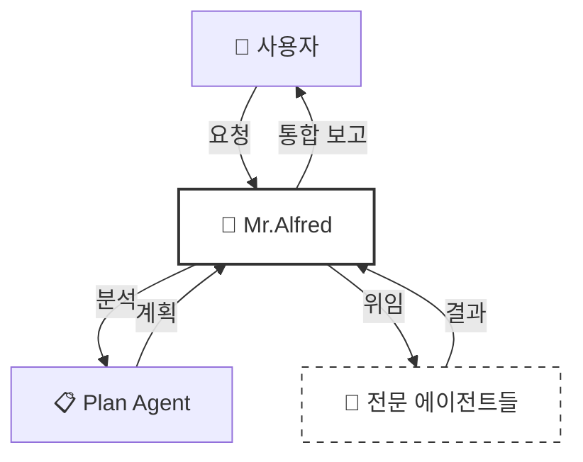

### 📚 시각적 워크플로우 이해하기: "블로그 댓글 기능"의 예시

**1분 안에 이해하기 ⏱️**

MoAI-ADK로 새로운 기능을 만드는 과정을 **실제 프로젝트 예시**로 살펴봅시다.
블로그에 **사용자 댓글 기능**을 추가하고 싶다고 가정합니다:

1. **Plan 단계** (설계, 5분):

   - ✅ 사용자 댓글 기능 추가 요청
   - 📋 manager-spec 에이전트가 "사용자가 댓글을 작성하고, 저장하고, 삭제할 수 있어야 한다"는 SPEC 작성
   - ✅ manager-spec 에이전트가 명확한 성공 기준 정의 (테스트 시나리오)

2. **Run 단계** (구현, 20분):

   - 🔴 @tdd "댓글이 저장되는가?"라는 **실패하는 테스트** 작성
   - 🟢 댓글 저장 기능 **최소 코드**로 구현
   - 🔵 코드 **정리 및 최적화**

3. **Sync 단계** (문서화, 10분):
   - 📚 API 문서 **자동 생성**
   - ✅ 아키텍처 다이어그램 생성
   - 🚀 배포 준비 완료

**예상 소요 시간: 약 35분** (프로젝트 복잡도에 따라 다름)

---

#### 🔄 Visual Workflow (색상으로 이해하기)

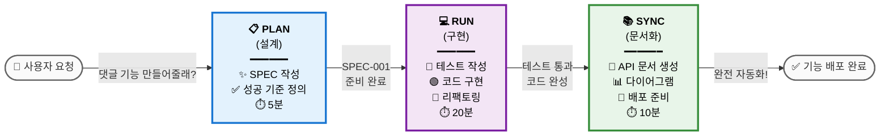

**각 단계가 하는 일**:

| 단계        | 역할           | 입력          | 출력            | 자동화                                    |
| ----------- | -------------- | ------------- | --------------- | ----------------------------------------- |
| **📋 Plan** | 무엇을 만들까? | 아이디어      | SPEC 문서       | Alfred가 Plan 에이전트에게 위임           |
| **💻 Run**  | 어떻게 만들까? | SPEC          | 구현 + 테스트   | TDD-Implementer가 RED-GREEN-REFACTOR 실행 |
| **📚 Sync** | 완성했는가?    | 코드 + 테스트 | 문서 + API 명세 | Docs Manager가 자동 생성                  |

---

### 🔄 Plan-Run-Sync 워크플로우

MoAI-ADK의 개발은 **3단계 무한 루프**로 진행됩니다:

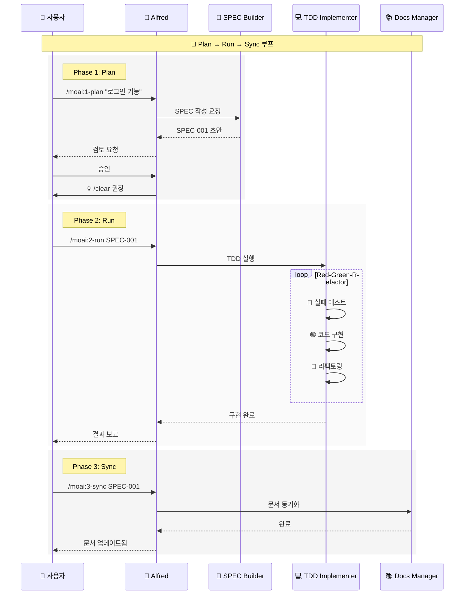

### 👥 에이전트와 스킬

**에이전트(Agent)란?**

특정 도메인의 전문가 역할을 수행하는 AI 워커입니다. 각 에이전트는 독립적인 200K 토큰 컨텍스트를 가집니다.

**스킬(Skill)란?**

에이전트가 사용하는 전문 지식 모듈입니다. 22개의 스킬이 도메인별로 체계화되어 있습니다.

**예시:**

| 에이전트          | 전문 분야     | 주요 스킬                                                      |
| ----------------- | ------------- | -------------------------------------------------------------- |
| `manager-spec`    | 요구사항 분석 | `moai-foundation-ears`, `moai-foundation-specs`                |
| `manager-tdd`     | TDD 구현      | `moai-foundation-trust`, `moai-essentials-testing-integration` |
| `expert-security` | 보안 검증     | `moai-domain-security`, `moai-security-auth`                   |

### 🏆 TRUST 5 프레임워크

모든 코드는 **TRUST 5** 품질 기준을 통과해야 합니다:

| 원칙           | 의미           | 검증 방법             |
| -------------- | -------------- | --------------------- |
| **T**est-First | 테스트가 먼저  | 테스트 커버리지 ≥ 85% |
| **R**eadable   | 읽기 쉬운 코드 | 코드 리뷰, 린트 통과  |
| **U**nified    | 일관된 스타일  | 스타일 가이드 준수    |
| **S**ecured    | 보안 검증      | OWASP 보안 검사       |
| **T**rackable  | 추적 가능      | SPEC-TAG 체인 완성    |

#### 🎯 TRUST 5 실제 예제 (Before/After)

**예제: 사용자 인증 함수**

---

##### 1️⃣ **Test-First**: 테스트가 먼저

❌ **BEFORE** - 테스트 없이 코드부터 작성:

```python
def authenticate(username, password):
    # 구현부터 시작
    user = db.query(f"SELECT * FROM users WHERE name='{username}'")
    return user.password == password  # SQL injection 위험!
```

**문제**: SQL injection, 암호 저장된 텍스트, 테스트 불가능 ⚠️

✅ **AFTER** - 테스트를 먼저 작성 (TDD):

```python
# SPEC-001: 사용자 인증
# GIVEN: 유효한 자격증명
# WHEN: authenticate() 호출
# THEN: True 반환

import pytest
from src.auth import authenticate

def test_authenticate_valid_credentials():
    """유효한 자격증명으로 인증 성공"""
    assert authenticate("user1", "pass123") == True

def test_authenticate_invalid_password():
    """잘못된 비밀번호로 인증 실패"""
    assert authenticate("user1", "wrong") == False

def test_authenticate_nonexistent_user():
    """존재하지 않는 사용자 인증 실패"""
    assert authenticate("nonexistent", "pass") == False

# 테스트 주도로 안전한 구현 작성
def authenticate(username, password):
    """Parameterized queries로 안전한 인증"""
    user = db.query("SELECT * FROM users WHERE name = ?", (username,))
    if not user:
        return False
    return bcrypt.checkpw(password.encode(), user.password_hash)
```

**개선**: 테스트 먼저 → 100% 신뢰 가능, 리팩토링 안전 ✅

---

##### 2️⃣ **Readable**: 읽기 쉬운 코드

❌ **BEFORE** - 약자와 모호한 이름:

```python
def proc_usr_dt(u, d):
    """Process user data"""
    x = u['a']
    y = x.split('@')[0]
    z = len(y) > 3 and d['v'] == True
    return z

result = proc_usr_dt(user_dict, data)  # 무엇을 하는지 불명확
```

**문제**: 변수명이 암호 같음, 함수 목적 불명확 ⚠️

✅ **AFTER** - 명확한 이름과 설명:

```python
def validate_user_email_for_newsletter(user, config):
    """
    사용자 이메일이 뉴스레터에 유효한지 검증합니다.

    Args:
        user: 사용자 정보 딕셔너리 (포함: 'email')
        config: 설정 (포함: 'newsletter_enabled')

    Returns:
        bool: 이메일이 유효하고 뉴스레터가 활성화되면 True

    Example:
        >>> validate_user_email_for_newsletter(
        ...     {'email': 'john@example.com'},
        ...     {'newsletter_enabled': True}
        ... )
        True
    """
    user_email = user['email']
    email_username = user_email.split('@')[0]

    # 조건 1: 이메일 이름 부분이 3자 이상
    has_valid_email_length = len(email_username) > 3

    # 조건 2: 뉴스레터가 활성화됨
    newsletter_is_enabled = config['newsletter_enabled'] == True

    return has_valid_email_length and newsletter_is_enabled

# 명확한 사용:
result = validate_user_email_for_newsletter(user_dict, config)
```

**개선**: 6개월 후에도 즉시 이해 가능 ✅

---

##### 3️⃣ **Unified**: 일관된 스타일

❌ **BEFORE** - 섞인 스타일:

```python
# 혼합된 코드 스타일
def GetUserById(userID):  # PascalCase ❌
    result = database.query("SELECT * FROM users WHERE id = " + userID)  # 스트링 연결 ❌
    return result

def fetch_posts(user_id):  # snake_case ✓
    result = database.query("SELECT * FROM posts WHERE user_id = ?", [user_id])  # Parameterized ✓
    return result
```

**문제**: 스타일이 일관되지 않아 유지보수 어려움 ⚠️

✅ **AFTER** - 일관된 스타일:

```python
# 모든 함수가 snake_case, 모든 쿼리가 parameterized
def get_user_by_id(user_id: int) -> dict:
    """사용자 ID로 사용자 정보 조회"""
    result = database.query(
        "SELECT * FROM users WHERE id = ?",
        (user_id,)
    )
    return result

def fetch_posts(user_id: int) -> list:
    """사용자의 모든 포스트 조회"""
    results = database.query(
        "SELECT * FROM posts WHERE user_id = ?",
        (user_id,)
    )
    return results

# Linting 도구가 자동으로 검증 (ruff, pylint)
# black으로 자동 포맷팅
```

**개선**: 모든 코드가 일관되어 읽기 쉬움, 자동 포맷팅 적용 ✅

---

##### 4️⃣ **Secured**: 보안 검증

❌ **BEFORE** - 보안 취약점:

```python
import os
os.environ['DB_PASSWORD'] = 'super_secret_123'  # 하드코딩! ❌

def connect_database():
    """데이터베이스 연결"""
    password = 'super_secret_123'  # 코드에 노출! ❌
    conn = database.connect(
        host='localhost',
        user='admin',
        password=password  # SQL injection 위험 가능
    )
    return conn
```

**문제**: 비밀번호 노출, OWASP A07:2021 (암호화 실패) ⚠️

✅ **AFTER** - 보안 강화:

```python
import os
from dotenv import load_dotenv
import bcrypt

# .env 파일에서 환경변수 로드
load_dotenv()

def connect_database():
    """안전한 데이터베이스 연결"""
    # 환경변수에서만 비밀번호 읽기 (코드에 노출 안됨)
    password = os.getenv('DB_PASSWORD')

    if not password:
        raise ValueError("DB_PASSWORD environment variable not set")

    # 안전한 연결 방식
    conn = database.connect(
        host=os.getenv('DB_HOST'),
        user=os.getenv('DB_USER'),
        password=password,
        ssl=True  # SSL 암호화
    )
    return conn

def hash_user_password(plain_password: str) -> str:
    """사용자 비밀번호 안전하게 해싱"""
    # bcrypt로 단방향 암호화
    return bcrypt.hashpw(
        plain_password.encode('utf-8'),
        bcrypt.gensalt(rounds=12)
    )

def verify_password(plain_password: str, hashed: str) -> bool:
    """입력된 비밀번호와 해시 비교"""
    return bcrypt.checkpw(plain_password.encode('utf-8'), hashed)
```

**개선**: OWASP 보안 기준 준수, 환경변수 사용, 암호 해싱 ✅

---

##### 5️⃣ **Trackable**: 추적 가능

❌ **BEFORE** - 추적 불가능:

```python
# 어느 SPEC에서 왔는지 모름
def calculate_discount(price):
    if price > 100:
        return price * 0.9  # 할인율 10%?
    return price
```

**문제**: SPEC이 없음, 언제 변경됐는지 모름, 테스트 기준 불명확 ⚠️

✅ **AFTER** - 완벽하게 추적:

```python
# SPEC-042: 고가 상품 할인 정책
# 요구사항: 100달러 이상의 상품에 10% 할인 적용
# 성공 기준: 할인이 정확히 적용되고, 원가보다 낮아지지 않음

def calculate_discount(price: float) -> float:
    """
    상품 가격에 대한 할인 계산 (SPEC-042)

    규칙: 100달러 이상이면 10% 할인

    Args:
        price: 원가 (달러)

    Returns:
        float: 할인 적용 후 가격

    Example:
        >>> calculate_discount(150)
        135.0  # 150 * 0.9
    """
    MIN_DISCOUNT_PRICE = 100.0
    DISCOUNT_RATE = 0.10  # 10% 할인 (SPEC-042 요구)

    if price >= MIN_DISCOUNT_PRICE:
        discounted_price = price * (1 - DISCOUNT_RATE)
        return max(discounted_price, 0)  # 음수 방지

    return price

# Test: SPEC-042와 연결된 테스트
def test_calculate_discount_applies_10_percent_discount_for_expensive_items():
    """SPEC-042: 100달러 이상은 10% 할인"""
    assert calculate_discount(150) == 135.0
    assert calculate_discount(100) == 90.0  # 경계값 테스트

def test_calculate_discount_no_discount_for_cheap_items():
    """SPEC-042: 100달러 미만은 할인 없음"""
    assert calculate_discount(99) == 99
    assert calculate_discount(0) == 0
```

**개선**: SPEC으로 추적 가능, 테스트로 검증, 변경 이유 명확 ✅

---

**TRUST 5 체크리스트** 📋:

| 항목                     | 확인            | 도구                  |
| ------------------------ | --------------- | --------------------- |
| ✅ 테스트 커버리지 ≥ 85% | `pytest --cov`  | pytest                |
| ✅ 명확한 이름, 주석     | 코드 리뷰       | pylint, ruff          |
| ✅ 포맷팅 일관성         | 자동 포맷       | black, isort          |
| ✅ OWASP 보안            | 보안 검증       | expert-security agent |
| ✅ SPEC 링킹             | Git 커밋 메시지 | 수동 확인             |

---

## 4. 설치 및 설정

### 4.1 사전 요구사항

| 요구사항    | 최소 버전 | 권장 버전 | 확인 방법           |
| ----------- | --------- | --------- | ------------------- |
| Python      | 3.10+     | 3.13+     | `python --version`  |
| Claude Code | 2.0.46+   | 최신      | Claude Code 앱 정보 |
| Git         | 2.30+     | 최신      | `git --version`     |

### 4.2 uv 설치 (패키지 관리자)

**macOS / Linux:**

```bash
curl -LsSf https://astral.sh/uv/install.sh | sh
```

**Windows (PowerShell):**

```powershell
irm https://astral.sh/uv/install.ps1 | iex
```

**설치 확인:**

```bash
uv --version  # uv 0.5.11 이상 권장
```

### 4.3 MoAI-ADK 설치

**기본 설치:**

```bash
uv tool install moai-adk
```

**특정 버전 설치:**

```bash
uv tool install moai-adk==0.30.2
```

**업그레이드:**

```bash
uv tool upgrade moai-adk
```

**설치 확인:**

```bash
moai-adk --version
moai-adk --help
```

### 4.4 프로젝트 초기화

**새 프로젝트 생성:**

```bash
moai-adk init my-project
cd my-project
```

**생성된 디렉토리 구조:**

```
my-project/
├── .claude/
│   ├── commands/moai/    # MoAI 명령어
│   ├── skills/           # 기술 모듈
│   └── settings.json     # Claude Code 설정
├── .moai/
│   ├── config/
│   │   └── config.json   # 프로젝트 설정
│   ├── specs/            # SPEC 문서
│   └── docs/             # 문서
├── CLAUDE.md             # Alfred 실행 지침
└── README.md             # 프로젝트 README
```

**기존 프로젝트에 적용:**

```bash
cd existing-project
moai-adk init .
```

### 4.5 프로젝트 설정 (`/moai:0-project`)

**기본 사용법:**

```bash
claude  # Claude Code 실행
> /moai:0-project
```

**대화형 메뉴:**

1. **Initialize Project Metadata**: 프로젝트 정보 입력

   - 프로젝트 이름
   - 설명
   - 소유자
   - 언어 설정

2. **Update Setting**: 기존 설정 수정
3. **Update Documentation**: 문서 재생성

**상세 사용법:**

```bash
# 기본 초기화
> /moai:0-project

# 설정 확인
> /moai:0-project setting

# 템플릿 업데이트
> /moai:0-project update

# GLM 모델 활성화 (z.ai)
> /moai:0-project --glm-on <token>

# GLM 모델 비활성화
> /moai:0-project --glm-off
```

**GLM Model 토글:**

- `--glm-on <token>`: z.ai 사의 glm 4.5-air, glm 4.6 모델 사용
- `<token>`: z.ai API Token (`.env.glm` 파일 사용 가능)
- settings.local.json에 glm 모델 설정 추가
- **중요**: `.gitignore`에 `.env.glm`, `settings.local.json` 추가 필수

**참고사항:**

- 초기화는 프로젝트당 한 번만 실행
- `setting`과 `update`는 필요시 언제든 실행 가능

### 4.6 수동 설정 (`config.json` 편집)

**파일 위치:** `.moai/config/config.json`

**전체 구조 예시:**

```json
{
  "project": {
    "name": "my-awesome-app",
    "description": "혁신적인 웹 애플리케이션",
    "owner": "GOOS",
    "created_at": "2025-01-15"
  },
  "user": {
    "name": "개발자이름"
  },
  "language": {
    "conversation_language": "ko",
    "agent_prompt_language": "en"
  },
  "constitution": {
    "enforce_tdd": true,
    "test_coverage_target": 85
  },
  "git_strategy": {
    "mode": "personal"
  },
  "statusline": {
    "enabled": true,
    "format": "compact",
    "style": "R2-D2"
  }
}
```

**주요 설정 항목:**

- `user.name`: Alfred가 당신을 부르는 이름
- `conversation_language`: 대화 및 문서 언어 (ko/en/ja/zh)
- `agent_prompt_language`: 에이전트 내부 추론 언어 (항상 "en" 사용)
- `enforce_tdd`: TDD 강제 여부 (true 권장)
- `test_coverage_target`: 테스트 커버리지 목표 (기본 85%)
- `git_strategy.mode`: Git 전략 (personal/team/hybrid)

### 4.7 Claude Code 설정 (`.claude/settings.json`)

**권한 설정:**

```json
{
  "allowed_glob_patterns": [".moai/specs/**/*.md", ".moai/docs/**/*.md"],
  "model_defaults": {
    "default_model": "sonnet"
  }
}
```

**GLM 모드 활성화** (Git + 로컬 메모리):

```bash
> /moai:0-project --glm-on <github-token>
```

### 4.8 트러블슈팅

**`moai-adk: command not found`**

- PATH 확인 또는 터미널 재시작
- uv 재설치: `curl -LsSf https://astral.sh/uv/install.sh | sh`

**`uv tool install` 실패**

- Python 3.10+ 설치 확인
- 관리자 권한으로 실행

**Claude Code 인식 안 됨**

- `.claude/` 디렉토리 존재 확인
- `moai-adk init .` 재실행

### 4.8 프로젝트 업데이트

기존 프로젝트의 설정을 최신 버전으로 업데이트하려면 프로젝트 루트에서 다음 명령을 실행하세요:

```bash
cd my-project
moai-adk update
claude
```

#### moai-adk update - 커스텀 파일 백업 및 복원

`moai-adk update` 명령은 프로젝트 업데이트 중 커스텀 파일의 지능형 백업 및 선택적 복원을 제공합니다. MoAI-ADK를 업데이트할 때, 생성한 모든 커스텀 명령어, 에이전트 또는 훅이 안전하게 감지되고 한 번의 명령으로 복원될 수 있습니다.

**주요 기능:**
- **자동 감지**: 커스텀 명령어 (`.claude/commands/moai/`의 `.md` 파일), 에이전트 (`.claude/agents/`의 파일), 훅 (`.claude/hooks/moai/`의 `.py` 파일) 감지
- **선택적 복원**: 대화형 questionary UI로 복원할 커스텀 파일 정확히 선택
- **안전 모드**: `--yes` 플래그는 기본적으로 복원을 건너뛰어 변경 사항을 먼저 검토 가능
- **그룹화된 조직**: 커스텀 파일을 유형별로 그룹화하여 선택 및 검토 용이
- **데이터 손실 없음**: 모든 커스텀 파일은 업데이트 작업 전에 백업됨

**사용 사례:**

1. **대화형 복원 (권장)**
   ```bash
   # 커스텀 파일을 검토하고 선택적으로 복원
   moai-adk update
   # → 감지된 커스텀 파일 체크리스트 표시
   # → 어떤 파일을 복원할지 대화형으로 선택
   # → 안전하고 투명한 프로세스
   ```

2. **복원 건너뛰기 (CI/CD 모드)**
   ```bash
   # 커스텀 파일 복원 프롬프트 없이 업데이트
   moai-adk update --yes
   # → 커스텀 파일 감지하지만 복원 건너뜀
   # → 자동화된 파이프라인 및 CI/CD에 유용
   # → 필요하면 나중에 수동으로 복원 가능
   ```

3. **팀 워크플로우**
   ```bash
   # 개발자 A: 커스텀 명령어 생성
   .claude/commands/moai/my-custom-command.md

   # 개발자 B: 업데이트 실행
   moai-adk update
   # → 개발자 A의 커스텀 명령어 감지
   # → 복원 여부 프롬프트
   # → 전체 팀이 동기화 유지
   ```

4. **문제 해결**
   ```bash
   # 파일이 제대로 복원되지 않으면
   moai-adk update --verbose
   # → 감지 및 복원의 상세 로그 표시
   # → 문제 진단에 도움
   ```

5. **여러 커스텀 파일**
   ```bash
   # 많은 커스터마이제이션이 있는 프로젝트
   moai-adk update
   # → 3가지 유형 모두 감지: 명령어 (5), 에이전트 (2), 훅 (3)
   # → 조직화된 체크리스트 표시
   # → 부분 또는 전체 복원 선택
   ```

**명령 구문:**
```bash
moai-adk update [OPTIONS]

옵션:
  --yes                복원 프롬프트 건너뛰기 (CI/CD 모드)
  --verbose            업데이트 중 상세 로그 표시
  --help               도움말 정보 표시
```

**출력 예시:**
```
MoAI-ADK 업데이트 프로세스
━━━━━━━━━━━━━━━━━━━━━━━━━━━━━━━━━━━━━━━━━━━━━━━━━━━━━━━━━━━━

✓ 패키지 파일 동기화 중...
✓ 커스텀 파일 백업 중...
✓ 커스텀 파일 감지 중...

복원할 커스텀 파일 10개 발견:

  커스텀 명령어 (5개 파일)
    ☐ my-custom-command.md
    ☐ team-helper.md
    ☐ project-specific.md
    ☐ local-utility.md
    ☐ automation-task.md

  커스텀 에이전트 (2개 파일)
    ☐ specialist-agent.py
    ☐ domain-expert.py

  커스텀 훅 (3개 파일)
    ☐ pre-commit-validator.py
    ☐ code-formatter.py
    ☐ security-checker.py

복원할 파일 선택 (SPACE로 토글, ENTER로 확인):
  [✓] my-custom-command.md
  [✓] specialist-agent.py
  [ ] pre-commit-validator.py

✓ 선택된 파일 2개 복원 중...
✓ 업데이트 완료! 커스텀 파일이 복원되었습니다.
```

**자세한 정보:**
[moai-adk 업데이트 가이드](./.moai/docs/update-guide.md)를 참고하세요. 다음 내용을 포함합니다:
- 백업/복원 시스템의 아키텍처 개요
- CI/CD 파이프라인과의 통합
- 일반적인 문제 해결
- 업데이트 시스템 확장을 위한 API 참고

---

## 5. 개발 워크플로우

### Phase 1: Plan (SPEC 생성)

**목적:** 모호한 아이디어를 명확한 EARS 포맷 명세서로 변환

**실행 단계:**

```bash
# 1. Plan 커맨드 실행
/moai:1-plan "JWT 토큰 기반 사용자 인증 시스템"

# Alfred의 동작:
# - manager-spec 에이전트 호출
# - 사용자 요구사항 분석
# - 불명확한 부분 질문
# - EARS 포맷 SPEC 문서 생성
# - .moai/specs/SPEC-001/ 디렉토리에 저장

# 2. SPEC 검토
# - Alfred가 초안을 보여줌
# - 필요시 수정 요청
# - 승인

# 3. 컨텍스트 초기화 (필수!)
/clear
```

### Phase 2: Run (TDD 구현)

**목적:** SPEC을 기반으로 Red-Green-Refactor TDD 사이클 실행

**실행 단계:**

```bash
# TDD 구현 시작
/moai:2-run SPEC-001

# Alfred의 동작:
# - manager-tdd 에이전트 호출
# - Red: 실패하는 테스트 먼저 작성
# - Green: 테스트를 통과하는 최소 코드 작성
# - Refactor: 코드 품질 개선 및 최적화
# - 테스트 커버리지 ≥ 85% 확인
```

**TDD 사이클 상세:**

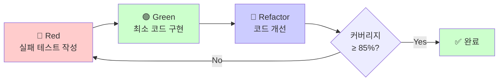

### Phase 3: Sync (문서 동기화)

**목적:** 구현된 코드를 분석하여 문서와 다이어그램 자동 생성

**실행 단계:**

```bash
# 문서 동기화
/moai:3-sync SPEC-001

# Alfred의 동작:
# - docs-manager 에이전트 호출
# - 코드 주석에서 API 문서 추출
# - Mermaid 다이어그램 생성
# - README.md 업데이트
# - CHANGELOG 자동 생성
```

---

## 6. 핵심 커맨드

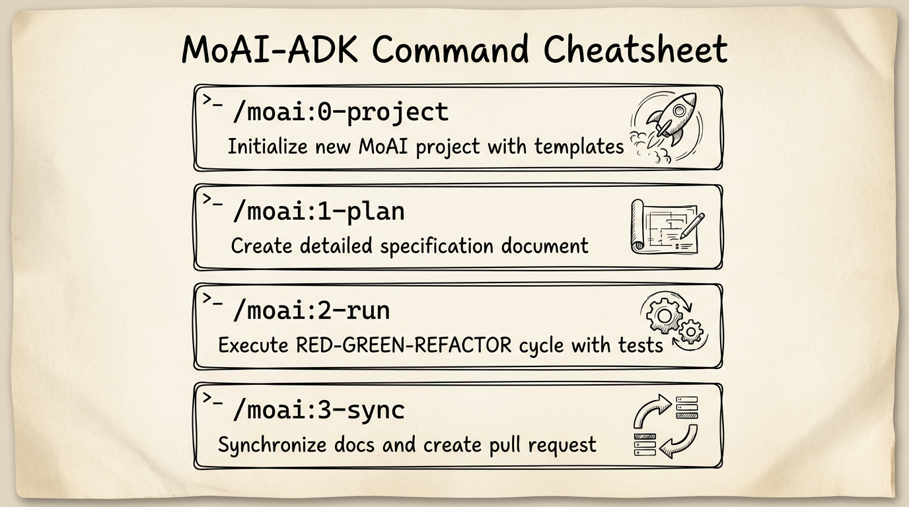

MoAI-ADK의 개발 워크플로우는 6개의 핵심 커맨드로 구성되어 있습니다. 이 커맨드들은 처음 프로젝트 초기화부터 최종 프로덕션 배포까지 완전한 개발 라이프사이클을 자동화합니다. 각 커맨드는 Mr.Alfred 슈퍼 에이전트 오케스트레이터에 의해 관리되며, 필요한 전문 AI 에이전트들을 자동으로 선택하고 조율합니다. SPEC-First TDD 방식을 따르므로 명확한 요구사항에서 시작하여 테스트 기반 구현, 자동 문서화까지 모든 단계가 체계적으로 진행됩니다.

### `/moai:0-project` - 프로젝트 초기화

**목적:** 프로젝트 구조 생성 및 설정 초기화

**사용법:**

```bash
/moai:0-project              # 기본 모드 (프로젝트 초기화)
/moai:0-project SETTINGS     # 설정 모드 (v0.28.0 신규)
```

**기본 모드 동작:**

1. `.moai/` 디렉토리 구조 생성
2. `.claude/settings.json` 템플릿 생성
3. Git 저장소 초기화 (선택)
4. `.claude/` 에이전트/스킬 동기화

**SETTINGS 모드 (v0.28.0 신규):**

대화형 프로젝트 설정 구성:

- 프로젝트 이름 및 소유자 설정
- 언어 및 로케일 선택
- Git 전략 선택 (Personal/Team)
- TDD 및 품질 기준 설정
- `tab_schema.json` 자동 완성 지원

**위임 에이전트:** `manager-project`

---

### `/moai:1-plan` - SPEC 생성

**목적:** 사용자 요구사항을 EARS 포맷 SPEC 문서로 변환

**사용법:**

```bash
/moai:1-plan "기능 설명을 자연어로 작성"
```

**예시:**

```bash
# 예시 1: 간단한 기능
/moai:1-plan "사용자 회원가입 기능"

# 예시 2: 상세한 요구사항
/moai:1-plan "OAuth2.0 소셜 로그인 (Google, GitHub) 지원.
사용자 프로필 정보 자동 동기화. 기존 계정과 연결 가능."

# 예시 3: API 설계
/moai:1-plan "게시판 REST API - 페이지네이션, 정렬, 필터링 지원"
```

**위임 에이전트:** `manager-spec`

---

### `/moai:2-run` - TDD 구현

**목적:** SPEC 기반 Red-Green-Refactor TDD 사이클 실행

**사용법:**

```bash
/moai:2-run SPEC-ID
```

**예시:**

```bash
# 기본 실행
/moai:2-run SPEC-001

# 특정 언어/프레임워크 지정
/moai:2-run SPEC-002 --lang python --framework fastapi

# 단계별 확인 모드
/moai:2-run SPEC-003 --interactive
```

**위임 에이전트:** `manager-tdd`

---

### `/moai:3-sync` - 문서 동기화

**목적:** 코드 분석 및 자동 문서 생성/업데이트

**사용법:**

```bash
/moai:3-sync SPEC-ID [옵션]
```

**예시:**

```bash
# 기본 동기화
/moai:3-sync SPEC-001

# 특정 문서 타입만
/moai:3-sync SPEC-002 --docs api

# 다이어그램 생성
/moai:3-sync SPEC-003 --diagrams architecture,sequence

# 다국어 문서
/moai:3-sync SPEC-004 --languages ko,en,ja
```

**위임 에이전트:** `docs-manager`

---

### `/moai:9-feedback` - 피드백 및 개선

**목적:** MoAI-ADK 프레임워크 버그 분석 및 자동 이슈 등록

**사용법:**

```bash
/moai:9-feedback [옵션]
```

**예시:**

```bash
# 전체 분석
/moai:9-feedback

# 특정 오류 보고
/moai:9-feedback --error "TDD 사이클 중 커버리지 계산 오류"

# 개선 제안
/moai:9-feedback --suggestion "SPEC 템플릿에 성능 요구사항 섹션 추가"
```

**위임 에이전트:** `quality-gate`, `debug-helper`

---

## 7. 에이전트 가이드

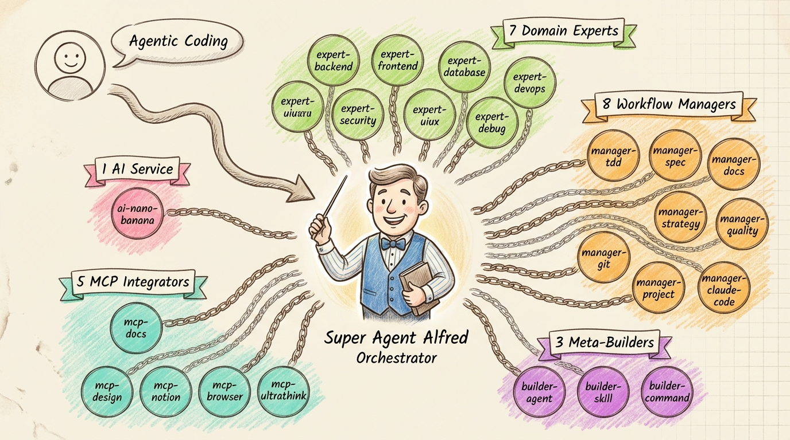

MoAI-ADK는 24개의 전문 에이전트를 5-Tier 계층 구조로 제공합니다. 각 에이전트는 특정 도메인의 전문가로서 Alfred에 의해 자동으로 선택되고 조율됩니다.

### 5-Tier 에이전트 계층 구조

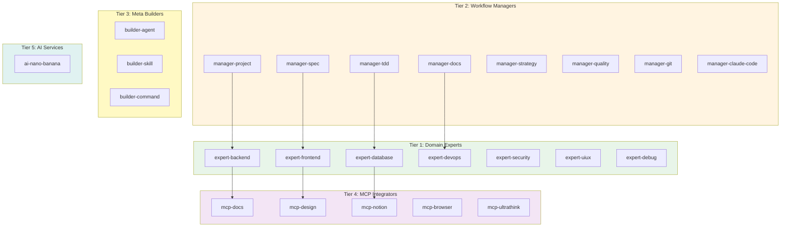

---

### Tier 1: Domain Experts (전문가 에이전트)

특정 도메인의 전문 지식을 제공하는 에이전트입니다. 필요시에만 로드됩니다.

| 에이전트            | 전문 분야          | 설명                              | 주요 스킬                            |
| ------------------- | ------------------ | --------------------------------- | ------------------------------------ |
| **expert-backend**  | 백엔드 아키텍처    | API, 서버, 데이터베이스 통합      | moai-lang-unified, moai-baas-unified |
| **expert-frontend** | 프론트엔드 개발    | React, Vue, UI 컴포넌트           | moai-lang-unified, moai-core-uiux    |
| **expert-database** | 데이터베이스 설계  | 스키마 최적화, 쿼리 성능          | moai-lang-unified                    |
| **expert-devops**   | 인프라/배포        | CI/CD, 컨테이너, 클라우드         | moai-lang-unified                    |
| **expert-security** | 보안 분석          | 취약점 진단, OWASP 준수           | moai-lang-unified                    |
| **expert-uiux**     | UI/UX 디자인       | 디자인 시스템, 접근성, Figma 연동 | moai-core-uiux, moai-lib-shadcn-ui   |
| **expert-debug**    | 디버깅 및 오류분석 | 런타임 에러 분석 및 해결          | moai-essentials-unified              |

**사용 시나리오**:

```bash
# 백엔드 API 설계가 필요한 경우
Alfred → manager-strategy → expert-backend

# UI 컴포넌트 개발이 필요한 경우
Alfred → manager-strategy → expert-frontend → expert-uiux
```

---

### Tier 2: Workflow Managers (워크플로우 관리자)

복잡한 작업을 조율하고 품질을 보장하는 핵심 에이전트입니다.

| 에이전트                | 역할             | 설명                               | 주요 스킬                                   |
| ----------------------- | ---------------- | ---------------------------------- | ------------------------------------------- |
| **manager-project**     | 프로젝트 초기화  | 프로젝트 구조 및 메타데이터 관리   | moai-command-project                        |
| **manager-spec**        | SPEC 생성        | EARS 기반 SPEC 문서 생성           | moai-foundation-core                        |
| **manager-tdd**         | TDD 구현         | RED-GREEN-REFACTOR TDD 사이클 실행 | moai-lang-unified, moai-foundation-core     |
| **manager-docs**        | 문서화           | 문서 동기화 및 Nextra 최적화       | moai-nextra-architecture, moai-docs-unified |
| **manager-strategy**    | 실행 전략 수립   | SPEC 분석 및 구현 전략 설계        | moai-foundation-core                        |
| **manager-quality**     | 품질 게이트      | TRUST 5 검증 및 자동 테스트 생성   | moai-core-quality, moai-lang-unified        |
| **manager-git**         | Git 워크플로우   | 브랜치 전략, 커밋, PR 자동화       | moai-foundation-core                        |
| **manager-claude-code** | Claude Code 관리 | 설정 검증, 성능 모니터링           | moai-core-claude-code                       |

**자동 트리거 조건**:

- `manager-project`: `/moai:0-project` 실행 시 자동 호출
- `manager-spec`: `/moai:1-plan` 실행 시 자동 호출
- `manager-tdd`: `/moai:2-run` 실행 시 자동 호출
- `manager-docs`: `/moai:3-sync` 실행 시 자동 호출
- `manager-strategy`: `/moai:2-run` Phase 1에서 자동 호출
- `manager-quality`: TDD GREEN 단계 완료 후 자동 호출
- `manager-git`: `/moai:3-sync` 실행 시 자동 호출

**사용 예시**:

```bash
> /moai:1-plan "사용자 로그인 기능"
# manager-spec 에이전트가 자동 호출되어 SPEC-001 생성
```

---

### Tier 3: Meta Builders (메타 빌더)

MoAI-ADK 자체를 확장하는 메타 에이전트입니다.

| 에이전트            | 생성 대상     | 설명                      | 주요 스킬                                   |
| ------------------- | ------------- | ------------------------- | ------------------------------------------- |
| **builder-command** | 명령어 생성   | 커스텀 슬래시 명령 생성   | moai-foundation-core, moai-core-claude-code |
| **builder-agent**   | 에이전트 생성 | 새로운 전문 에이전트 생성 | moai-foundation-core, moai-core-claude-code |
| **builder-skill**   | 스킬 생성     | 새로운 지식 스킬 생성     | moai-foundation-core, moai-core-claude-code |

**사용 예시**:

```bash
# 새 에이전트 생성
Alfred → builder-agent → "mobile-app-expert 에이전트 생성"

# 새 스킬 생성
Alfred → builder-skill → "moai-lib-nextjs 스킬 생성"

# 새 명령어 생성
Alfred → builder-command → "/moai:deploy 명령어 생성"
```

---

### Tier 4: MCP Integrators (MCP 통합자)

외부 서비스와 통합하는 MCP(Model Context Protocol) 에이전트입니다. Resume 패턴으로 컨텍스트 연속성을 보장합니다.

| 에이전트           | 통합 서비스             | 설명                         | 주요 기능                    |
| ------------------ | ----------------------- | ---------------------------- | ---------------------------- |
| **mcp-docs**       | Context7 MCP            | 실시간 라이브러리 문서 검색  | API 레퍼런스, 버전 호환성    |
| **mcp-design**     | Figma MCP               | Figma 디자인 파일 분석       | 디자인-코드 변환             |
| **mcp-notion**     | Notion MCP              | Notion 워크스페이스 관리     | 데이터베이스 작업, 문서 생성 |
| **mcp-browser**    | Playwright MCP          | 웹 자동화 및 테스트          | E2E 테스트, 스크래핑         |
| **mcp-ultrathink** | Sequential-Thinking MCP | 복잡한 추론 및 아키텍처 설계 | 다단계 분석, 전략 수립       |

**Resume 패턴 예시**:

```python
# 초기 호출
result = Task(subagent_type="mcp-docs",
              prompt="React 19 API 조사")
agent_id = result.agent_id

# 이전 컨텍스트로 이어서 작업
result2 = Task(subagent_type="mcp-docs",
               prompt="React 18과 비교",
               resume=agent_id)
```

**혜택**:

- 40-60% 토큰 절감
- 95%+ 컨텍스트 정확도
- 다일 분석 지원

---

### Tier 5: AI Services (AI 서비스)

AI 모델 통합 및 특수 작업 에이전트입니다.

| 에이전트           | AI 모델                | 설명        | 주요 기능               |
| ------------------ | ---------------------- | ----------- | ----------------------- |
| **ai-nano-banana** | Gemini Nano Banana Pro | 이미지 생성 | 자연어 기반 이미지 생성 |

**사용 조건**:

- Gemini API 키 필요
- 사용 불가 시 네이티브 Claude Code로 폴백

---

### 에이전트 조합 패턴

실제 개발 시나리오별 에이전트 조합 패턴입니다.

#### 패턴 1: 신규 기능 개발 (Full Cycle)

```text
manager-spec → manager-strategy → manager-tdd → manager-quality → manager-docs → manager-git
```

- SPEC 생성 → 전략 수립 → TDD 구현 → 품질 검증 → 문서화 → Git 커밋

#### 패턴 2: 백엔드 API 개발

```text
manager-spec → manager-strategy → expert-backend → expert-database → mcp-docs → manager-tdd
```

- SPEC 생성 → 전략 수립 → 백엔드 설계 → DB 스키마 → API 문서 조회 → TDD 구현

#### 패턴 3: 프론트엔드 UI 개발

```text
expert-uiux → mcp-design → expert-frontend → mcp-browser → manager-quality
```

- 디자인 분석 → Figma 연동 → 컴포넌트 구현 → E2E 테스트 → 품질 검증

#### 패턴 4: 성능 최적화

```text
expert-debug → mcp-ultrathink → expert-backend → manager-quality
```

- 문제 진단 → 복잡한 분석 → 최적화 구현 → 품질 검증

#### 패턴 5: 보안 감사

```text
expert-security → expert-backend → manager-quality → manager-docs
```

- 취약점 스캔 → 수정 구현 → 품질 검증 → 문서화

---

### 에이전트 선택 가이드

Alfred는 다음 우선순위로 에이전트를 선택합니다:

1. **읽기 전용 탐색** → Built-in `Explore` 에이전트
2. **MCP 서비스 필요** → Tier 4 MCP 에이전트
3. **도메인 전문성** → Tier 1 Expert 에이전트
4. **워크플로우 매칭** → Tier 2 Manager 에이전트
5. **복잡한 다단계 작업** → Built-in `general-purpose` 에이전트

**사용자 개입 없이 자동 선택**:
Alfred가 요청을 분석하고 최적의 에이전트를 자동으로 선택합니다. 사용자는 고수준 요청만 하면 됩니다.

```bash
# 사용자 요청
"사용자 로그인 기능을 구현해줘"

# Alfred의 자동 에이전트 선택
manager-spec (SPEC 생성)
  → manager-strategy (전략 수립)
  → expert-backend (백엔드 구현)
  → expert-security (보안 검증)
  → manager-tdd (TDD 구현)
  → manager-quality (품질 검증)
  → manager-docs (문서화)
  → manager-git (Git 커밋)
```

---

### 에이전트 심화 학습

각 에이전트의 상세 정보는 다음 위치에서 확인:

```
.claude/agents/moai/
├── expert-backend.md
├── expert-frontend.md
├── expert-database.md
├── expert-devops.md
├── expert-security.md
├── expert-uiux.md
├── expert-debug.md
├── manager-project.md
├── manager-spec.md
├── manager-tdd.md
├── manager-docs.md
├── manager-strategy.md
├── manager-quality.md
├── manager-git.md
├── manager-claude-code.md
├── builder-agent.md
├── builder-skill.md
├── builder-command.md
├── mcp-docs.md
├── mcp-design.md
├── mcp-notion.md
├── mcp-browser.md
├── mcp-ultrathink.md
└── ai-nano-banana.md
```

**참고 문서**:

- **에이전트 카탈로그**: `Skill("moai-foundation-core")` → modules/agents-reference.md
- **위임 패턴**: `Skill("moai-foundation-core")` → modules/delegation-patterns.md
- **토큰 최적화**: `Skill("moai-foundation-core")` → modules/token-optimization.md

---

## 8. 스킬 라이브러리 (22개)


MoAI-ADK는 **22개의 전문 스킬**을 제공합니다. 각 스킬은 특정 도메인의 지식 모듈로서 에이전트에게 전문성을 부여하며, 7가지 카테고리로 체계화되어 있습니다.

### 📚 스킬 분류 체계

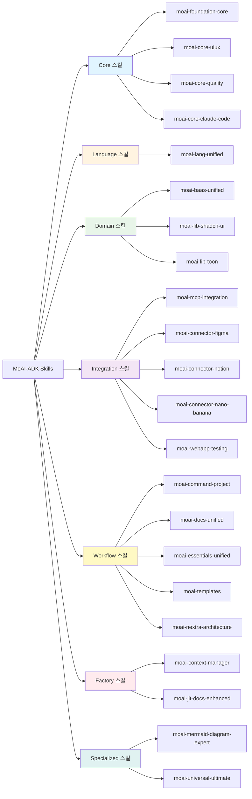

---

### 🎯 Core 스킬 (4개) - 핵심 기반

MoAI-ADK의 기본 원칙과 품질 기준을 정의합니다.

| 스킬                      | 설명                            | 주요 내용                                                            | 버전  |
| ------------------------- | ------------------------------- | -------------------------------------------------------------------- | ----- |
| **moai-foundation-core**  | MoAI-ADK 핵심 원칙 및 실행 규칙 | TRUST 5, SPEC-First TDD, 7-Tier 에이전트, 토큰 최적화, 9개 모듈 통합 | 1.0.0 |
| **moai-core-uiux**        | 통합 UI/UX 기반 스킬            | 디자인 시스템, 컴포넌트 아키텍처, 접근성, 아이콘, 테마               | 1.0.0 |
| **moai-core-quality**     | TRUST 5 품질 게이트             | 프로액티브 품질 검증, 자동 테스트 생성, 커버리지 분석                | 2.0.0 |
| **moai-core-claude-code** | Claude Code 전문 스킬           | 에이전트, 슬래시 명령, MCP 서버, 훅, 메모리, IAM                     | 1.0.0 |

**사용 빈도**: 전체 작업의 90% 이상에서 자동 로드

**특징**:

- **Conditional Auto-Load**: 복잡도에 따라 자동 로드
- **Zero-Dependency Quick Reference**: 간단한 작업은 토큰 소비 없음
- **평균 5,000 tokens/session 절감**

---

### 💻 Language 스킬 (1개) - 프로그래밍 언어

25개 이상의 프로그래밍 언어를 통합 지원합니다.

| 스킬                  | 설명           | 지원 언어                                                                                                              | 버전  |
| --------------------- | -------------- | ---------------------------------------------------------------------------------------------------------------------- | ----- |
| **moai-lang-unified** | 통합 언어 스킬 | Python, TypeScript, Go, Rust, Java, JavaScript, C++, C#, PHP, Swift, Kotlin, Scala, Elixir, Ruby, R, SQL, Shell 등 25+ | 1.0.0 |

**주요 기능**:

- Context7 통합으로 최신 API 참조
- 언어별 패턴 및 베스트 프랙티스
- 프레임워크 통합 (React 19, Next.js 15, FastAPI, Spring Boot 등)

**관련 에이전트**: expert-backend, expert-frontend, manager-tdd, expert-database

---

### 🎨 Domain 스킬 (3개) - 도메인 전문

특정 도메인에 특화된 전문 지식을 제공합니다.

| 스킬                   | 설명                | 주요 기능                                                                  | 버전  |
| ---------------------- | ------------------- | -------------------------------------------------------------------------- | ----- |
| **moai-baas-unified**  | 통합 BaaS 스킬      | Auth0, Clerk, Firebase, Supabase, Neon, Convex, Vercel, Railway 9개 제공자 | 1.0.0 |
| **moai-lib-shadcn-ui** | shadcn/ui 전문 스킬 | Radix UI, Tailwind CSS, React 컴포넌트, 테마 시스템                        | 1.0.0 |
| **moai-lib-toon**      | TOON 포맷 전문      | 토큰 효율적 데이터 인코딩, LLM 통신 최적화 (40-60% 절감)                   | 2.0.0 |

**사용 시나리오**:

- **BaaS 통합**: 인증, 데이터베이스, 배포 자동화
- **UI 컴포넌트**: shadcn/ui 기반 디자인 시스템
- **데이터 전송**: TOON 포맷으로 LLM 통신 최적화

---

### 🔌 Integration 스킬 (5개) - 외부 통합

외부 서비스와의 통합을 지원합니다.

| 스킬                           | 설명             | 통합 서비스                                                     | 버전  |
| ------------------------------ | ---------------- | --------------------------------------------------------------- | ----- |
| **moai-mcp-integration**       | MCP 1.0+ 통합    | 10+ 공식 MCP 서버 통합 가이드                                   | 1.0.0 |
| **moai-connector-figma**       | Figma 연동       | 디자인 시스템, UI 키트, 디자인 토큰, W3C DTCG 2.0               | 1.0.0 |
| **moai-connector-notion**      | Notion 연동      | 워크스페이스 관리, 데이터베이스 작업, 콘텐츠 관리               | 1.0.0 |
| **moai-connector-nano-banana** | 이미지 생성      | Google Nano Banana Pro (Gemini 3 Pro), Text/Image-to-Image      | 1.0.1 |
| **moai-webapp-testing**        | 웹앱 테스트 전문 | Playwright MCP, E2E 테스트, 시각적 회귀 테스트, 크로스 브라우저 | 1.0.0 |

**MCP 서버 지원**:

- **Context7**: 실시간 문서 검색
- **Sequential-Thinking**: 복잡한 추론
- **Figma**: 디자인 파일 분석
- **Playwright**: 웹 자동화
- **Notion**: 워크스페이스 관리

**관련 에이전트**: mcp-docs, mcp-ultrathink, mcp-design, mcp-browser, mcp-notion

---

### 🔄 Workflow 스킬 (5개) - 워크플로우

개발 워크플로우를 지원합니다.

| 스킬                         | 설명                     | 주요 기능                                                    | 버전  |
| ---------------------------- | ------------------------ | ------------------------------------------------------------ | ----- |
| **moai-command-project**     | 프로젝트 관리 통합       | 문서화, 언어 초기화, 템플릿 최적화                           | 1.0.0 |
| **moai-docs-unified**        | 통합 문서화              | 5단계 검증 (Markdown, Mermaid, 한글 타이포, 보고서)          | 1.0.1 |
| **moai-essentials-unified**  | 통합 개발 오케스트레이터 | 디버깅, 리팩토링, 성능 최적화, 코드 리뷰, 테스트, 프로파일링 | 1.0.0 |
| **moai-templates**           | 템플릿 관리              | 코드 보일러플레이트, 피드백 템플릿, 프로젝트 최적화          | 2.0.0 |
| **moai-nextra-architecture** | Nextra 문서 프레임워크   | Next.js 기반 문서화, MDX, 테마 커스터마이징, SSG             | 1.0.0 |

**워크플로우 통합**:

- `/moai:0-project`: moai-command-project 활용
- `/moai:1-plan`: SPEC 생성 워크플로우
- `/moai:2-run`: TDD 구현 워크플로우
- `/moai:3-sync`: 문서 동기화 워크플로우

---

### 🏭 Factory 스킬 (2개) - 메타 개발

시스템 관리 및 최적화 기능을 제공합니다.

| 스킬                       | 설명          | 주요 기능                                                  | 버전  |
| -------------------------- | ------------- | ---------------------------------------------------------- | ----- |
| **moai-context-manager**   | 컨텍스트 관리 | 200K 토큰 예산 최적화, 세션 지속성, 다중 에이전트 핸드오프 | 2.0.0 |
| **moai-jit-docs-enhanced** | JIT 문서 로딩 | 사용자 의도 기반 문서 자동 검색 및 캐싱                    | 1.0.0 |

**특징**:

- **토큰 관리**: 200K 예산 최적화, /clear 전략
- **문서 로딩**: 필요시 Just-In-Time으로 문서 검색
- **세션 관리**: 상태 지속성 및 다중 에이전트 조율

---

### ⚡ Specialized 스킬 (2개) - 특수 기능

특수한 기능을 제공하는 스킬입니다.

| 스킬                            | 설명               | 주요 기능                                          | 버전  |
| ------------------------------- | ------------------ | -------------------------------------------------- | ----- |
| **moai-mermaid-diagram-expert** | Mermaid 다이어그램 | 21가지 다이어그램 타입, Playwright MCP 기반 렌더링 | 6.0.0 |
| **moai-universal-ultimate**     | 통합 개발 스킬     | 25+ 언어, 9+ BaaS, 6+ 개발 기능, 15+ 보안 통합     | 1.0.0 |

**특징**:

- **다이어그램**: Mermaid 구문 자동 생성 및 렌더링 (Flowchart, Sequence, C4, Gantt 등)
- **올인원**: 모든 기능을 단일 스킬로 통합

---

### 📊 스킬 사용 통계

| 카테고리        | 스킬 수 | 사용 빈도 | 주요 특징                              |
| --------------- | ------- | --------- | -------------------------------------- |
| **Core**        | 4개     | 90%+      | 기본 원칙, 품질 기준, Claude Code 통합 |
| **Language**    | 1개     | 80%+      | 25+ 언어 통합, Context7 연동           |
| **Domain**      | 3개     | 60%       | BaaS, UI 컴포넌트, 데이터 최적화       |
| **Integration** | 5개     | 70%       | MCP 서버, 외부 서비스, 테스트          |
| **Workflow**    | 5개     | 85%       | 프로젝트, 문서화, 템플릿, 개발 도구    |
| **Factory**     | 2개     | 50%       | 컨텍스트 관리, JIT 문서                |
| **Specialized** | 2개     | 40%       | 다이어그램, 통합 개발                  |

**토큰 최적화 전략**:

- **Conditional Auto-Load**: 복잡도에 따라 선택적 로드
- **Quick Reference**: 간단한 작업은 0 tokens
- **Progressive Disclosure**: 3-tier 지식 구조
- **평균 절감**: 40-60% 토큰 절감

---

### 🎓 스킬 사용 가이드

#### 스킬 호출 방법

```python
# 방법 1: 직접 호출 (개발자용)
Skill("moai-lang-unified")

# 방법 2: Alfred 자동 선택 (사용자용)
# Alfred가 요청을 분석하여 필요한 스킬 자동 로드
"Python으로 FastAPI 서버를 만들어줘"
→ Alfred가 moai-lang-unified + moai-baas-unified 자동 선택
```

#### 스킬 조합 패턴

**패턴 1: 백엔드 API 개발**

```
moai-foundation-core + moai-lang-unified + moai-baas-unified
```

**패턴 2: 프론트엔드 UI 개발**

```
moai-core-uiux + moai-lang-unified + moai-lib-shadcn-ui
```

**패턴 3: 문서화**

```
moai-nextra-architecture + moai-docs-unified + moai-mermaid-diagram-expert
```

**패턴 4: 테스트**

```
moai-lang-unified + moai-webapp-testing + moai-core-quality
```

**패턴 5: MCP 통합**

```
moai-mcp-integration + moai-connector-* (Figma/Notion/Nano-Banana)
```

---

### 📂 스킬 위치 및 구조

모든 스킬은 다음 위치에 저장됩니다:

```
.claude/skills/
├── moai-foundation-core/
│   ├── SKILL.md
│   └── modules/
│       ├── agents-reference.md
│       ├── commands-reference.md
│       ├── delegation-patterns.md
│       ├── token-optimization.md
│       └── execution-rules.md
├── moai-core-uiux/
│   ├── SKILL.md
│   └── modules/
│       ├── component-architecture.md
│       ├── design-system-tokens.md
│       ├── accessibility-wcag.md
│       ├── icon-libraries.md
│       └── theming-system.md
├── moai-lang-unified/
│   ├── SKILL.md
│   └── modules/
│       ├── python.md
│       ├── typescript.md
│       ├── go.md
│       └── ... (25+ 언어)
└── ... (22개 스킬)
```

**스킬 표준**:

- **SKILL.md**: ≤500 lines (Quick Reference + Implementation Guide)
- **modules/**: 상세 모듈 (분야별 전문 지식)
- **modularized: true/false**: 모듈화 여부
- **Progressive Disclosure**: 3-tier 지식 구조 (Quick → Implementation → Advanced)

---

### 🔍 스킬 검색 및 발견

스킬을 찾는 방법:

**방법 1: Alfred에게 질문**

```
"React 컴포넌트 개발에 필요한 스킬은?"
→ Alfred가 moai-core-uiux, moai-lib-shadcn-ui 추천
```

**방법 2: 스킬 목록 확인**

```bash
ls .claude/skills/
```

**방법 3: JIT 문서 로딩**

```
moai-jit-docs-enhanced가 자동으로 필요한 스킬 검색 및 로드
```

**방법 4: 작업 기반 검색**

| 작업                       | 추천 스킬                                   | 사용 시기        |
| -------------------------- | ------------------------------------------- | ---------------- |
| **JWT/OAuth 인증 구현**    | moai-baas-unified, moai-lang-unified        | 사용자 인증 필요 |
| **테스트 작성 & 커버리지** | moai-core-quality, moai-webapp-testing      | 모든 코드 구현   |
| **보안 취약점 검사**       | moai-core-quality, moai-lang-unified        | 배포 전 검증     |
| **성능 최적화**            | moai-essentials-unified, moai-lang-unified  | 느린 부분 발견   |
| **REST/GraphQL API 설계**  | moai-lang-unified, moai-baas-unified        | API 구축         |
| **React/Vue 컴포넌트**     | moai-core-uiux, moai-lib-shadcn-ui          | UI 개발          |
| **문서 생성**              | moai-docs-unified, moai-nextra-architecture | API 문서화       |
| **Git 워크플로우**         | moai-foundation-core, moai-core-claude-code | 버전 관리        |

---

### 🔄 마이그레이션 가이드 (v0.27 → v0.28)

**스킬 이름 변경:**

- `moai-component-designer` → `moai-core-uiux` 사용
- `moai-design-systems` → `moai-core-uiux` 사용
- `moai-icons-vector` → `moai-core-uiux` 사용
- `moai-playwright-webapp-testing` → `moai-webapp-testing`

**권장 조치:**

1. 기존 프로젝트 `.claude/skills/` 디렉토리 확인
2. 삭제된 스킬 참조를 새 스킬로 교체
3. `moai-adk init .`로 최신 설정 동기화

---

### 📚 관련 문서

- **스킬 개발 가이드**: `Skill("moai-core-claude-code")` → Skills 섹션
- **스킬 표준**: MoAI-ADK Standards (모듈화, Progressive Disclosure)
- **Context7 통합**: 모든 스킬이 최신 API 참조 가능
- **토큰 최적화**: `Skill("moai-foundation-core")` → modules/token-optimization.md

💡 **팁**: 위의 "작업별 검색"으로 필요한 스킬을 빠르게 찾거나, 카테고리별로 탐색할 수 있습니다.

### 📚 전체 스킬 목록 (알파벳 순)

#### Tier 1: 언어별 스킬 (moai-lang-\*)

프로그래밍 언어 패턴 및 관용구 (21개)

| 스킬명                   | 설명                                                  |
| ------------------------ | ----------------------------------------------------- |
| `moai-lang-c`            | C 언어 개발 (포인터, 메모리 관리, 성능 최적화)        |
| `moai-lang-cpp`          | C++ 개발 (표준 라이브러리, 템플릿, 모던 C++)          |
| `moai-lang-csharp`       | C# 개발 (.NET, LINQ, 비동기 패턴)                     |
| `moai-lang-dart`         | Dart 개발 (Flutter 위젯, 비동기 프로그래밍)           |
| `moai-lang-elixir`       | Elixir 개발 (Phoenix 프레임워크, OTP, 함수형 패턴)    |
| `moai-lang-go`           | Go 개발 (고루틴, 채널, 동시성 처리)                   |
| `moai-lang-html-css`     | HTML/CSS 마크업 (HTML5, CSS3, Flexbox, Grid 레이아웃) |
| `moai-lang-java`         | Java 개발 (Spring Boot, Maven, 엔터프라이즈 패턴)     |
| `moai-lang-javascript`   | JavaScript 개발 (ES6+, 비동기/대기, DOM 조작)         |
| `moai-lang-kotlin`       | Kotlin 개발 (코루틴, Android 개발, JVM 환경)          |
| `moai-lang-php`          | PHP 개발 (Laravel, Composer, 모던 PHP 패턴)           |
| `moai-lang-python`       | Python 개발 (FastAPI, Django, pytest, 타입 힌팅)      |
| `moai-lang-r`            | R 통계 분석 (데이터 분석, 시각화, tidyverse 생태계)   |
| `moai-lang-ruby`         | Ruby 개발 (Rails, RSpec, 메타프로그래밍)              |
| `moai-lang-rust`         | Rust 개발 (소유권, 생명주기, 제로-코스트 추상화)      |
| `moai-lang-scala`        | Scala 개발 (함수형 프로그래밍, Akka, 타입 시스템)     |
| `moai-lang-shell`        | Shell 스크립팅 (Bash, 자동화, CLI 도구 개발)          |
| `moai-lang-sql`          | SQL 쿼리 (쿼리 최적화, 데이터베이스 관리)             |
| `moai-lang-swift`        | Swift 개발 (SwiftUI, iOS 앱 개발, 프로토콜 지향)      |
| `moai-lang-tailwind-css` | Tailwind CSS (유틸리티 우선 접근, 반응형 디자인)      |
| `moai-lang-typescript`   | TypeScript 개발 (타입 시스템, 제네릭, 고급 패턴)      |

#### Tier 2: 도메인별 스킬 (moai-domain-\*)

애플리케이션 도메인 아키텍처 (16개)

| 스킬명                   | 설명                                                     |
| ------------------------ | -------------------------------------------------------- |
| `moai-domain-backend`    | 백엔드 아키텍처 (REST API, 마이크로서비스, CRUD 패턴)    |
| `moai-domain-cli-tool`   | CLI 도구 개발 (명령줄 애플리케이션, 인자 파싱)           |
| `moai-domain-cloud`      | 클라우드 아키텍처 (클라우드 플랫폼, 서버리스, 확장성)    |
| `moai-domain-database`   | 데이터베이스 설계 (관계형/비관계형 DB, 스키마, 인덱싱)   |
| `moai-domain-devops`     | DevOps 실천 (CI/CD, IaC, 자동화, 배포)                   |
| `moai-domain-figma`      | Figma 통합 (디자인-코드 변환, Figma API, 디자인 토큰)    |
| `moai-domain-frontend`   | 프론트엔드 아키텍처 (UI 프레임워크, 상태 관리, 라우팅)   |
| `moai-domain-iot`        | IoT 개발 (IoT 디바이스, 센서, 프로토콜, 엣지 컴퓨팅)     |
| `moai-domain-ml-ops`     | MLOps (머신러닝 파이프라인, 모델 배포, 모니터링)         |
| `moai-domain-mobile-app` | 모바일 앱 개발 (iOS, Android, React Native, Flutter)     |
| `moai-domain-monitoring` | 모니터링 (로깅, 메트릭 수집, 알림, 관찰성)               |
| `moai-domain-notion`     | Notion 통합 (Notion API, 지식 베이스, 데이터베이스 관리) |
| `moai-domain-security`   | 보안 (OWASP, 취약점 분석, 보안 코딩)                     |
| `moai-domain-toon`       | TOON 포맷 (토큰 최적화, 인코딩, 압축)                    |
| `moai-domain-web-api`    | 웹 API 설계 (REST, GraphQL, API 디자인, 버전 관리)       |

#### Tier 3: 보안 스킬 (moai-security-\*)

보안 및 준수 (12개)

| 스킬명                              | 설명                                                          |
| ----------------------------------- | ------------------------------------------------------------- |
| `moai-security-accessibility-wcag3` | WCAG 3.0 접근성 (ARIA, 키보드 네비게이션, 시맨틱 HTML)        |
| `moai-security-compliance`          | 보안 준수 (준수 기준, 감사, 인증)                             |
| `moai-security-encryption`          | 암호화 (데이터 암호화, 해싱, TLS/SSL, 키 관리)                |
| `moai-security-owasp`               | OWASP (OWASP Top 10, 보안 표준, 모범 사례)                    |
| `moai-security-secrets`             | 비밀 관리 (시크릿 저장소, 자동 갱신)                          |
| `moai-security-ssrf`                | SSRF 방어 (서버 측 요청 위조 방지)                            |
| `moai-security-threat`              | 위협 모델링 (위협 분석, 위험 평가, 공격 벡터 분석)            |
| `moai-security-zero-trust`          | Zero Trust 아키텍처 (제로 트러스트 보안 모델, 최소 권한 원칙) |

#### Tier 4: 코어 개발 스킬 (moai-core-\*)

핵심 개발 패턴 및 도구 (15개) (Phase 2 병합: -2개)

| 스킬명                        | 설명                                                   |
| ----------------------------- | ------------------------------------------------------ |
| `moai-core-agent-factory`     | 에이전트 팩토리 (커스텀 에이전트 생성, 오케스트레이션) |
| `moai-core-config-schema`     | 설정 스키마 (설정 관리, 유효성 검증, 타입 정의)        |
| `moai-core-dev-guide`         | 개발 가이드 (개발 지침, 모범 사례)                     |
| `moai-core-env-security`      | 환경 보안 (환경 변수 보안, .env 파일 관리)             |
| `moai-core-issue-labels`      | 이슈 라벨 (GitHub 이슈 라벨링, 분류)                   |
| `moai-core-practices`         | 모범 사례 (코딩 표준, 관례, 베스트 프랙티스)           |
| `moai-core-spec-authoring`    | SPEC 작성 (EARS 포맷, 요구사항, 명세 작성)             |
| `moai-core-todowrite-pattern` | TodoWrite 패턴 (작업 추적, 진행도 모니터링)            |
| `moai-core-workflow`          | 워크플로우 (개발 워크플로우, 자동화, 프로세스)         |

#### Tier 5: 파운데이션 스킬 (moai-foundation-\*)

프레임워크 기반 및 표준 (5개)

| 스킬명                  | 설명                                                             |
| ----------------------- | ---------------------------------------------------------------- |
| `moai-foundation-ears`  | EARS 포맷 (Event-driven requirements format, structured specs)   |
| `moai-foundation-git`   | Git 관리 (Git workflows, branching strategies, version control)  |
| `moai-foundation-langs` | 언어 기반 (multi-language support, i18n, localization)           |
| `moai-foundation-specs` | SPEC 시스템 (SPEC lifecycle, versioning, traceability)           |
| `moai-foundation-trust` | TRUST 5 프레임워크 (Test, Readable, Unified, Secured, Trackable) |

#### Tier 6: Claude Code 플랫폼 스킬 (moai-cc-\*)

Claude Code 통합 (10개)

| 스킬명                    | 설명                                              |
| ------------------------- | ------------------------------------------------- |
| `moai-cc-claude-md`       | CLAUDE.md 작성 (프로젝트 문서, 에이전트 지침)     |
| `moai-cc-commands`        | 커맨드 시스템 (커맨드 관리, 커스텀 커맨드)        |
| `moai-cc-configuration`   | 설정 관리 (Claude Code 설정, 프로젝트 설정, 검증) |
| `moai-cc-hooks`           | Hooks 시스템 (자동화 트리거, 생명주기 Hooks)      |
| `moai-cc-memory`          | 메모리 시스템 (메모리 파일 관리, 컨텍스트 보존)   |
| `moai-cc-permission-mode` | 권한 모드 (권한 관리, 접근 제어)                  |
| `moai-cc-skill-factory`   | 스킬 팩토리 (스킬 생성, 관리, 버전 관리)          |
| `moai-cc-skills-guide`    | 스킬 가이드 (스킬 개발, 최적화, 표준 준수)        |

#### Tier 7: BaaS 통합 스킬 (moai-baas-\*)

Backend-as-a-Service 플랫폼 (10개)

| 스킬명                     | 설명                                                      |
| -------------------------- | --------------------------------------------------------- |
| `moai-baas-clerk-ext`      | Clerk 인증 (Clerk 플랫폼, OAuth, 사용자 관리)             |
| `moai-baas-cloudflare-ext` | Cloudflare 통합 (Workers, Pages, CDN, 엣지 컴퓨팅)        |
| `moai-baas-convex-ext`     | Convex 통합 (백엔드 플랫폼, 실시간 데이터베이스)          |
| `moai-baas-firebase-ext`   | Firebase 통합 (Firebase 서비스, Firestore, Auth, Hosting) |
| `moai-baas-foundation`     | BaaS 기반 (BaaS 패턴, 모범 사례, 아키텍처)                |
| `moai-baas-neon-ext`       | Neon 통합 (Neon Postgres, 서버리스 데이터베이스)          |
| `moai-baas-railway-ext`    | Railway 통합 (Railway 배포, 컨테이너화)                   |
| `moai-baas-supabase-ext`   | Supabase 통합 (Supabase 백엔드, Postgres, Auth, Storage)  |
| `moai-baas-vercel-ext`     | Vercel 통합 (Vercel 배포, Edge Functions, 서버리스)       |

#### Tier 8: 필수 도구 스킬 (moai-essentials-\*)

필수 개발 워크플로우 (6개)

| 스킬명                       | 설명                                                      |
| ---------------------------- | --------------------------------------------------------- |
| `moai-essentials-debug`      | 디버깅 오케스트레이션 (오류 분석, 근본 원인, 해결책 제시) |
| `moai-essentials-perf`       | 성능 최적화 (병목 분석, 성능 튜닝, 벤치마킹)              |
| `moai-essentials-refactor`   | 리팩토링 자동화 (코드 변환, 기술 부채 제거, 최적화)       |
| `moai-mcp-figma-integrator`  | Figma 통합 (디자인 분석, 디자인-투-코드, 컴포넌트 추출)   |
| `moai-mcp-notion-integrator` | Notion 통합 (데이터베이스 관리, 콘텐츠 작성, 자동화)      |
| `moai-webapp-testing`        | 웹앱 테스팅 (E2E 테스트, 자동화, UI 상호작용)             |

#### Tier 9: 프로젝트 관리 스킬 (moai-project-\*)

프로젝트 조율 (4개) (Phase 2 병합: -1개)

| 스킬명                         | 설명                                              |
| ------------------------------ | ------------------------------------------------- |
| `moai-project-batch-questions` | 일괄 질문 (배치 질문 처리, 대량 작업)             |
| `moai-project-config-manager`  | 설정 관리 (config.json CRUD, 검증, 병합 전략)     |
| `moai-project-documentation`   | 프로젝트 문서화 (프로젝트 문서, 자동 생성)        |
| `moai-session-info`            | 세션 정보 (프로젝트 상태, 버전, 리소스 정보 표시) |

#### Tier 10: AI 특화 스킬 (moai-ai-\*, moai-lang-\*)

AI 및 특화 라이브러리 (2개)

| 스킬명                | 설명                                                                       |
| --------------------- | -------------------------------------------------------------------------- |
| `moai-ai-nano-banana` | Google Nano Banana Pro 이미지 생성 (Text-to-Image, Image-to-Image, 멀티턴) |
| `moai-lang-shadcn-ui` | shadcn/ui 통합 (React 컴포넌트 라이브러리, Tailwind, Radix UI)             |

#### 특수 스킬 (Special Skills)

계층 미분류 유틸리티 (24개)

| 스킬명                           | 설명                                                                |
| -------------------------------- | ------------------------------------------------------------------- |
| `moai-artifacts-builder`         | Artifacts 생성 (아티팩트 생성, Claude artifacts)                    |
| `moai-change-logger`             | 변경 로그 (변경 추적, 버전 관리, Changelog 생성)                    |
| `moai-cloud-aws-advanced`        | AWS 고급 (고급 AWS 패턴, 서버리스, Lambda, S3)                      |
| `moai-cloud-gcp-advanced`        | GCP 고급 (고급 GCP 패턴, Cloud Run, BigQuery)                       |
| `moai-context7-integration`      | Context7 통합 (Context7 MCP, 라이브러리 문서 조회)                  |
| `moai-core-uiux`                 | 핵심 UI/UX (디자인 시스템, 컴포넌트 아키텍처, 접근성, 아이콘, 테마) |
| `moai-document-processing`       | 문서 처리 (문서 파싱, 변환, 추출, 처리)                             |
| `moai-internal-comms`            | 내부 통신 (에이전트 조율, 메시지 전달, 워크플로우)                  |
| `moai-jit-docs-enhanced`         | JIT 문서 강화 (즉시 문서, 컨텍스트 인식, 동적 생성)                 |
| `moai-learning-optimizer`        | 학습 최적화 (적응형 학습, 최적화, 추천 시스템)                      |
| `moai-mcp-integration`           | MCP 통합 (MCP 서버, 프로토콜, 도구 연동)                            |
| `moai-mermaid-diagram-expert`    | Mermaid 다이어그램 (21가지 다이어그램, 시각화, 흐름도)              |
| `moai-nextra-architecture`       | Nextra 아키텍처 (Nextra 문서 프레임워크, SSG, 정적 생성)            |
| `moai-readme-expert`             | README 전문가 (전문적 README 생성, 템플릿)                          |
| `moai-spec-intelligent-workflow` | 지능형 SPEC (SPEC 자동화, 워크플로우, 최적화)                       |
| `moai-streaming-ui`              | 스트리밍 UI (실시간 스트리밍, UI 업데이트, 비동기)                  |

#### 🔄 통합된 스킬 (Merged Skills)

다음 15개 스킬은 중복되는 기능을 통합하여 더 강력하고 효율적인 기능을 제공합니다:

**Phase 1** (High Priority - 이미 통합됨):

| 스킬명                         | 설명                                              |
| ------------------------------ | ------------------------------------------------- |
| `moai-code-review`             | 코드 리뷰 (TRUST 5 기반, 자동화, 협업)            |
| `moai-testing`                 | 테스트 전략 (TDD, 단위/통합/E2E 테스트)           |
| `moai-security-api-management` | API 보안 및 관리 (인증, 인가, 버전 관리)          |
| `moai-security-authentication` | 인증 및 신원 관리 (OAuth 2.1, JWT, WebAuthn, MFA) |
| `moai-essentials-performance`  | 성능 분석 및 프로파일링 (AI 기반 병목, Scalene)   |

**Phase 2** (Medium Priority - ✅ 이미 통합됨):

| 스킬명                 | 설명                                              |
| ---------------------- | ------------------------------------------------- |
| `moai-context-manager` | 컨텍스트 및 세션 관리 (토큰 예산, 상태, 모니터링) |
| `moai-templates`       | 템플릿 관리 (코드/피드백/프로젝트 템플릿)         |

**Special Skills** (유지):

| 스킬명                   | 설명                                                            |
| ------------------------ | --------------------------------------------------------------- |
| `moai-docs-manager`      | 문서 관리 (자동 생성, 도구 통합, 일관성 검증)                   |
| `moai-docs-quality-gate` | 문서 품질 보증 (내용 검증, 마크다운 린팅, 링크 검사)            |
| `moai-web-testing`       | 웹 애플리케이션 테스트 (E2E 테스트, Playwright, 테스트 자동화)  |
| `moai-config-manager`    | 설정 관리 (Claude Code 설정, 프로젝트 설정, 스키마 검증)        |
| `moai-adaptive-ux`       | 적응형 사용자 경험 (전문도 감지, 맞춤형 제안, 동적 응답)        |
| `moai-language-support`  | 언어 지원 (언어 감지, 자동 설정, 프로젝트 초기화)               |
| `moai-cc-guide`          | Claude Code 가이드 (스킬 사용법, 에이전트 위임, 오케스트레이션) |
| `moai-baas-auth`         | BaaS 인증 플랫폼 (Auth0, Clerk, OAuth, 사용자 관리)             |

---

### 🔍 스킬 사용 방법

**자동 활용**: 에이전트가 자동으로 필요한 스킬을 선택

```bash
# manager-tdd가 자동으로 다음 스킬 활용:
# - moai-foundation-trust
# - moai-essentials-testing-integration
# - moai-lang-python (Python 프로젝트인 경우)
/moai:2-run SPEC-001
```

**명시적 호출**: 특정 스킬을 직접 호출

```bash
# EARS 포맷 가이드 조회
Skill("moai-foundation-ears")

# Docker 배포 패턴 조회
Skill("moai-domain-devops")

# OAuth 2.0 구현 가이드
Skill("moai-security-auth")
```

**스킬 조합**: 여러 스킬을 조합하여 복합 작업 수행

```bash
# FastAPI + PostgreSQL + Docker 조합
# backend-expert가 자동으로 다음 스킬 활용:
# - moai-lang-python
# - moai-domain-backend
# - moai-domain-database
@agent-backend-expert "FastAPI 앱을 PostgreSQL과 연동하고 Docker로 배포"
```

---

## 🎭 에이전트 조합 패턴

MoAI-ADK의 26개 에이전트는 작업 유형에 따라 최적의 조합으로 실행됩니다.

### 패턴 1: 신규 기능 개발

```text
manager-spec (SPEC 생성)
  ↓
manager-strategy (실행 계획)
  ↓
manager-tdd (TDD 구현)
  ↓
manager-docs (문서 동기화)
```

**예시:**

```bash
/moai:1-plan "사용자 로그인 기능"   # manager-spec
/clear
/moai:2-run SPEC-001               # manager-strategy → manager-tdd
/clear
/moai:3-sync SPEC-001              # manager-docs
```

---

### 패턴 2: 성능 최적화

```text
expert-debug (문제 분석)
  ↓
mcp-sequential-thinking (복잡도 분석)
  ↓
expert-backend (최적화 구현)
  ↓
manager-quality (검증)
```

**예시:**

```bash
Task(subagent_type="expert-debug", prompt="API 응답 느림 분석")
# → 병목 지점 발견 (DB 쿼리 N+1 문제)

Task(subagent_type="mcp-sequential-thinking",
     prompt="N+1 문제 최적화 전략 수립")
# → ORM 쿼리 최적화 전략 제시

Task(subagent_type="expert-backend",
     prompt="ORM 쿼리 최적화 구현")
# → select_related(), prefetch_related() 적용

Task(subagent_type="manager-quality",
     prompt="성능 테스트 및 검증")
# → 응답 시간 500ms → 50ms (90% 개선)
```

---

### 패턴 3: UI/UX 개발

```text
expert-uiux (디자인 시스템)
  ↓
expert-frontend (컴포넌트 구현)
  ↓
mcp-playwright (E2E 테스트)
```

**예시:**

```bash
Task(subagent_type="expert-uiux",
     prompt="로그인 페이지 디자인 shadcn/ui 기반")
# → Button, Input, Card 컴포넌트 조합

Task(subagent_type="expert-frontend",
     prompt="React 로그인 폼 구현")
# → shadcn/ui 컴포넌트 사용한 구현

Task(subagent_type="mcp-playwright",
     prompt="로그인 시나리오 E2E 테스트")
# → 성공/실패 케이스 자동 테스트
```

---

### 패턴 4: 보안 감사

```text
expert-security (취약점 스캔)
  ↓
expert-backend (보안 패치)
  ↓
manager-quality (재검증)
```

---

## 9. 실용 예제

### 예제 1: 사용자 로그인 시스템

**목표:** JWT 토큰 기반 인증 시스템 구현

**단계별 실행:**

```bash
# 1. SPEC 생성
/moai:1-plan "JWT 토큰 기반 로그인 시스템.
- 이메일/비밀번호 인증
- 액세스 토큰(30분), 리프레시 토큰(7일)
- 5회 실패 시 계정 잠금(30분)"

# Alfred가 질문:
# Q1: 비밀번호 정책은?
# A1: 최소 8자, 대소문자+숫자+특수문자

# Q2: JWT 알고리즘은?
# A2: RS256

# → SPEC-001 생성됨
```

**JWT 보안 상세** (심화):

#### 🔐 JWT 구조 이해

JWT는 3가지 부분으로 구성됩니다:

```
eyJhbGciOiJSUzI1NiIsInR5cCI6IkpXVCJ9
  ↓
[Header - 알고리즘, 토큰 타입]

.

eyJzdWIiOiIxMjM0NTY3ODkwIiwibmFtZSI6IkpvaG4gRG9lIiwiaWF0IjoxNTE2MjM5MDIyfQ
  ↓
[Payload - 사용자 정보, 발급 시간, 만료 시간]

.

S0Jzy-OMl...
  ↓
[Signature - RS256으로 서명된 검증 코드]
```

**각 부분 상세:**

```json
// Header (알고리즘 명시)
{
  "alg": "RS256",  // RSA 2048-bit으로 서명
  "typ": "JWT"
}

// Payload (클레임)
{
  "sub": "user_123",           // 사용자 ID
  "name": "John Doe",
  "email": "john@example.com",
  "iat": 1516239022,           // Issued At (발급 시간)
  "exp": 1516242622,           // Expiration (만료 시간) - 1시간
  "aud": "my-app",             // Audience (대상)
  "iss": "auth-server"         // Issuer (발급자)
}

// Signature
HMACSHA256(
  base64UrlEncode(header) + "." +
  base64UrlEncode(payload),
  private_key
)
```

---

#### 🔄 액세스 토큰 vs 리프레시 토큰 전략

**왜 2가지 토큰이 필요한가?**

| 토큰              | 목적                 | 유효시간    | 저장 위치       | 역할        |
| ----------------- | -------------------- | ----------- | --------------- | ----------- |
| **Access Token**  | API 요청 인증        | 짧음 (30분) | 메모리          | 보안 중요   |
| **Refresh Token** | 새 Access Token 발급 | 길음 (7일)  | HttpOnly Cookie | 재발급 기능 |

**흐름:**

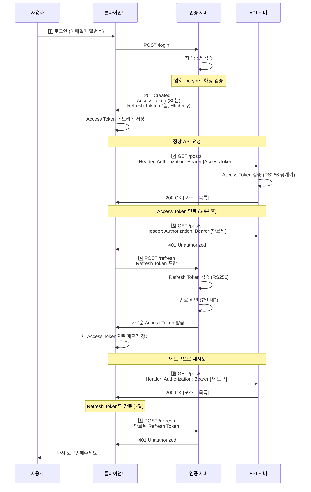

---

#### 🛡️ JWT 보안 체크리스트

| 항목          | 방법                                 | 코드 예제                                 |
| ------------- | ------------------------------------ | ----------------------------------------- |
| **알고리즘**  | RS256 사용 (HS256 금지)              | `alg: "RS256"`                            |
| **서명**      | 개인키로 서명, 공개키로 검증         | `RSA 2048-bit`                            |
| **만료 시간** | Access Token 30분, Refresh Token 7일 | `exp: now + 30min`                        |
| **저장**      | Refresh Token은 HttpOnly Cookie      | `Set-Cookie: refresh_token=...; HttpOnly` |
| **HTTPS**     | 모든 토큰 전송은 HTTPS만             | 평문 HTTP 금지                            |
| **검증**      | 매 요청마다 서명 검증                | `jwt.verify(token, public_key)`           |
| **갱신**      | Refresh Token으로만 재발급           | `/refresh` 엔드포인트                     |
| **로그아웃**  | Refresh Token을 블랙리스트 처리      | Redis 블랙리스트 저장                     |

**Python 구현 예제:**

```python
import jwt
from datetime import datetime, timedelta
from cryptography.hazmat.primitives import serialization
from cryptography.hazmat.primitives.asymmetric import rsa

# RS256 키 쌍 생성
private_key = rsa.generate_private_key(public_exponent=65537, key_size=2048)
public_key = private_key.public_key()

def create_access_token(user_id: str) -> str:
    """Access Token 발급 (30분 유효)"""
    payload = {
        'sub': user_id,
        'type': 'access',
        'iat': datetime.utcnow(),
        'exp': datetime.utcnow() + timedelta(minutes=30)
    }

    # RS256으로 서명
    token = jwt.encode(
        payload,
        private_key,
        algorithm='RS256'
    )
    return token

def create_refresh_token(user_id: str) -> str:
    """Refresh Token 발급 (7일 유효)"""
    payload = {
        'sub': user_id,
        'type': 'refresh',
        'iat': datetime.utcnow(),
        'exp': datetime.utcnow() + timedelta(days=7)
    }

    token = jwt.encode(
        payload,
        private_key,
        algorithm='RS256'
    )
    return token

def verify_token(token: str, token_type: str) -> dict:
    """토큰 검증 (공개키 사용)"""
    try:
        payload = jwt.decode(
            token,
            public_key,
            algorithms=['RS256'],
            audience='my-app'
        )

        # 토큰 타입 확인
        if payload.get('type') != token_type:
            raise ValueError(f"Expected {token_type} token")

        return payload
    except jwt.ExpiredSignatureError:
        raise ValueError("Token expired")
    except jwt.InvalidSignatureError:
        raise ValueError("Invalid signature")

# 사용 예제
@app.post('/login')
def login(email: str, password: str):
    """로그인: Access Token + Refresh Token 반환"""
    # 1. 사용자 인증
    user = authenticate_user(email, password)
    if not user:
        return {"error": "Invalid credentials"}, 401

    # 2. 토큰 발급
    access_token = create_access_token(user['id'])
    refresh_token = create_refresh_token(user['id'])

    # 3. Refresh Token은 HttpOnly Cookie에 저장
    response = {
        'access_token': access_token,
        'token_type': 'Bearer'
    }

    # HttpOnly + Secure + SameSite 설정
    response.set_cookie(
        'refresh_token',
        refresh_token,
        httponly=True,       # JavaScript 접근 불가
        secure=True,         # HTTPS만
        samesite='Strict',   # CSRF 방지
        max_age=7*24*60*60   # 7일
    )

    return response, 201

@app.post('/refresh')
def refresh(request):
    """새로운 Access Token 발급"""
    refresh_token = request.cookies.get('refresh_token')

    try:
        payload = verify_token(refresh_token, 'refresh')
        new_access_token = create_access_token(payload['sub'])
        return {'access_token': new_access_token, 'token_type': 'Bearer'}
    except ValueError as e:
        return {'error': str(e)}, 401

@app.get('/protected')
def protected_route(request):
    """Protected 엔드포인트 - Access Token 필수"""
    auth_header = request.headers.get('Authorization', '')

    if not auth_header.startswith('Bearer '):
        return {'error': 'Missing token'}, 401

    token = auth_header[7:]  # "Bearer " 제거

    try:
        payload = verify_token(token, 'access')
        user_id = payload['sub']
        return {'message': f'Hello, {user_id}!'}
    except ValueError as e:
        return {'error': str(e)}, 401
```

---

# 2. 컨텍스트 초기화 (필수!)

/clear

# 3. TDD 구현

/moai:2-run SPEC-001
/clear

# 4. 문서 동기화

/moai:3-sync SPEC-001
/clear

````

### 예제 2: RESTful API 블로그 시스템

시나리오: 블로그 포스트 CRUD API 개발

#### 📋 OpenAPI 3.0 명세

```yaml
openapi: 3.0.0
info:
  title: Blog API
  description: 블로그 포스트 관리 REST API
  version: 1.0.0
  contact:
    name: API Support
    url: https://blog.example.com/support

servers:
  - url: https://api.example.com/v1
    description: 프로덕션 서버
  - url: https://staging-api.example.com/v1
    description: 스테이징 서버

components:
  schemas:
    # 데이터 모델
    Post:
      type: object
      required: [id, title, content, author_id, created_at]
      properties:
        id:
          type: integer
          format: int64
          example: 123
          description: 포스트 고유 ID
        title:
          type: string
          minLength: 3
          maxLength: 200
          example: MoAI-ADK 완벽 가이드
          description: 포스트 제목
        content:
          type: string
          minLength: 10
          maxLength: 10000
          example: MoAI-ADK는 Super Agent Orchestrator...
          description: 포스트 내용
        author_id:
          type: integer
          format: int64
          example: 42
          description: 작성자 ID
        created_at:
          type: string
          format: date-time
          example: 2025-11-24T10:30:00Z
          description: 작성 일시
        updated_at:
          type: string
          format: date-time
          nullable: true
          example: 2025-11-24T15:45:00Z
          description: 수정 일시

    PostCreate:
      type: object
      required: [title, content]
      properties:
        title:
          type: string
          minLength: 3
          maxLength: 200
        content:
          type: string
          minLength: 10
          maxLength: 10000

    PostUpdate:
      type: object
      properties:
        title:
          type: string
          minLength: 3
          maxLength: 200
        content:
          type: string
          minLength: 10
          maxLength: 10000

    Error:
      type: object
      required: [code, message]
      properties:
        code:
          type: string
          example: "POST_NOT_FOUND"
          description: 에러 코드
        message:
          type: string
          example: "포스트를 찾을 수 없습니다"
          description: 에러 메시지
        details:
          type: object
          nullable: true
          description: 추가 상세 정보

  securitySchemes:
    BearerAuth:
      type: http
      scheme: bearer
      bearerFormat: JWT
      description: JWT 기반 인증 (Authorization: Bearer [token])

security:
  - BearerAuth: []

paths:
  /posts:
    get:
      summary: 모든 포스트 조회
      description: 페이지네이션을 지원하는 포스트 목록 조회
      operationId: list_posts
      tags:
        - Posts
      parameters:
        - name: page
          in: query
          schema:
            type: integer
            default: 1
            minimum: 1
          description: 페이지 번호
        - name: limit
          in: query
          schema:
            type: integer
            default: 20
            minimum: 1
            maximum: 100
          description: 한 페이지당 포스트 수
        - name: author_id
          in: query
          schema:
            type: integer
          description: 특정 작성자의 포스트만 필터링
      responses:
        '200':
          description: 포스트 목록 조회 성공
          content:
            application/json:
              schema:
                type: object
                properties:
                  data:
                    type: array
                    items:
                      $ref: '#/components/schemas/Post'
                  pagination:
                    type: object
                    properties:
                      page:
                        type: integer
                      limit:
                        type: integer
                      total:
                        type: integer
                      has_next:
                        type: boolean
              example:
                data:
                  - id: 1
                    title: "First Post"
                    content: "Content here..."
                    author_id: 42
                    created_at: "2025-11-24T10:30:00Z"
                pagination:
                  page: 1
                  limit: 20
                  total: 100
                  has_next: true
        '401':
          description: 인증 실패 (토큰 없음 또는 만료)
          content:
            application/json:
              schema:
                $ref: '#/components/schemas/Error'
              example:
                code: "UNAUTHORIZED"
                message: "유효한 JWT 토큰이 필요합니다"

    post:
      summary: 새로운 포스트 생성
      description: 인증된 사용자가 새로운 포스트를 작성합니다
      operationId: create_post
      tags:
        - Posts
      requestBody:
        required: true
        content:
          application/json:
            schema:
              $ref: '#/components/schemas/PostCreate'
            example:
              title: "MoAI-ADK 완벽 가이드"
              content: "MoAI-ADK는 Super Agent Orchestrator..."
      responses:
        '201':
          description: 포스트 생성 성공
          content:
            application/json:
              schema:
                $ref: '#/components/schemas/Post'
              example:
                id: 123
                title: "MoAI-ADK 완벽 가이드"
                content: "MoAI-ADK는..."
                author_id: 42
                created_at: "2025-11-24T10:30:00Z"
        '400':
          description: 잘못된 요청 (유효성 검사 실패)
          content:
            application/json:
              schema:
                $ref: '#/components/schemas/Error'
              example:
                code: "VALIDATION_ERROR"
                message: "제목은 3자 이상이어야 합니다"
                details:
                  field: "title"
                  rule: "minLength"
        '401':
          description: 인증 실패
          content:
            application/json:
              schema:
                $ref: '#/components/schemas/Error'

  /posts/{post_id}:
    get:
      summary: 특정 포스트 조회
      operationId: get_post
      tags:
        - Posts
      parameters:
        - name: post_id
          in: path
          required: true
          schema:
            type: integer
            format: int64
          example: 123
      responses:
        '200':
          description: 포스트 조회 성공
          content:
            application/json:
              schema:
                $ref: '#/components/schemas/Post'
        '404':
          description: 포스트를 찾을 수 없음
          content:
            application/json:
              schema:
                $ref: '#/components/schemas/Error'
              example:
                code: "POST_NOT_FOUND"
                message: "ID 123인 포스트를 찾을 수 없습니다"

    put:
      summary: 포스트 전체 업데이트
      operationId: update_post
      tags:
        - Posts
      parameters:
        - name: post_id
          in: path
          required: true
          schema:
            type: integer
            format: int64
      requestBody:
        required: true
        content:
          application/json:
            schema:
              $ref: '#/components/schemas/PostCreate'
      responses:
        '200':
          description: 포스트 업데이트 성공
          content:
            application/json:
              schema:
                $ref: '#/components/schemas/Post'
        '404':
          description: 포스트를 찾을 수 없음
          content:
            application/json:
              schema:
                $ref: '#/components/schemas/Error'
        '403':
          description: 권한 없음 (본인의 포스트만 수정 가능)
          content:
            application/json:
              schema:
                $ref: '#/components/schemas/Error'
              example:
                code: "FORBIDDEN"
                message: "다른 사용자의 포스트는 수정할 수 없습니다"

    delete:
      summary: 포스트 삭제
      operationId: delete_post
      tags:
        - Posts
      parameters:
        - name: post_id
          in: path
          required: true
          schema:
            type: integer
            format: int64
      responses:
        '204':
          description: 포스트 삭제 성공 (응답 본문 없음)
        '404':
          description: 포스트를 찾을 수 없음
          content:
            application/json:
              schema:
                $ref: '#/components/schemas/Error'
        '403':
          description: 권한 없음
          content:
            application/json:
              schema:
                $ref: '#/components/schemas/Error'
````

**엔드포인트 요약**:

| 메서드     | 경로          | 설명                       | 인증 | 응답            |
| ---------- | ------------- | -------------------------- | ---- | --------------- |
| **GET**    | `/posts`      | 포스트 목록 (페이지네이션) | ✅   | 200 / 401       |
| **POST**   | `/posts`      | 포스트 생성                | ✅   | 201 / 400 / 401 |
| **GET**    | `/posts/{id}` | 특정 포스트 조회           | ✅   | 200 / 404       |
| **PUT**    | `/posts/{id}` | 포스트 전체 업데이트       | ✅   | 200 / 403 / 404 |
| **DELETE** | `/posts/{id}` | 포스트 삭제                | ✅   | 204 / 403 / 404 |

#### 🚀 실제 구현 (Python FastAPI)

```python
from fastapi import FastAPI, Depends, HTTPException, Query
from pydantic import BaseModel, Field
from datetime import datetime
from typing import Optional, List

app = FastAPI()

# Pydantic 모델 (OpenAPI 스키마와 매칭)
class PostCreate(BaseModel):
    title: str = Field(..., min_length=3, max_length=200)
    content: str = Field(..., min_length=10, max_length=10000)

class Post(PostCreate):
    id: int
    author_id: int
    created_at: datetime
    updated_at: Optional[datetime] = None

class Error(BaseModel):
    code: str
    message: str
    details: Optional[dict] = None

# 라우트 (OpenAPI 명세와 일치)
@app.get("/posts", response_model=List[Post], tags=["Posts"])
async def list_posts(
    page: int = Query(1, ge=1),
    limit: int = Query(20, ge=1, le=100),
    author_id: Optional[int] = None,
    current_user = Depends(verify_token)
):
    """모든 포스트 조회 (페이지네이션)"""
    # TDD: 테스트 먼저 작성
    # - 유효한 page/limit으로 조회
    # - author_id 필터링
    # - 페이지네이션 계산
    pass

@app.post("/posts", response_model=Post, status_code=201, tags=["Posts"])
async def create_post(
    post: PostCreate,
    current_user = Depends(verify_token)
):
    """새로운 포스트 생성"""
    # TDD:
    # - title/content 유효성 검사
    # - author_id를 current_user.id로 설정
    # - 데이터베이스에 저장
    # - 201 응답
    pass

@app.get("/posts/{post_id}", response_model=Post, tags=["Posts"])
async def get_post(
    post_id: int,
    current_user = Depends(verify_token)
):
    """특정 포스트 조회"""
    # TDD:
    # - post_id로 조회
    # - 없으면 404 POST_NOT_FOUND
    pass

@app.put("/posts/{post_id}", response_model=Post, tags=["Posts"])
async def update_post(
    post_id: int,
    post_update: PostCreate,
    current_user = Depends(verify_token)
):
    """포스트 업데이트 (본인만 가능)"""
    # TDD:
    # - post_id로 조회
    # - author_id == current_user.id 확인 (없으면 403 FORBIDDEN)
    # - title/content 업데이트
    # - updated_at 갱신
    pass

@app.delete("/posts/{post_id}", status_code=204, tags=["Posts"])
async def delete_post(
    post_id: int,
    current_user = Depends(verify_token)
):
    """포스트 삭제 (본인만 가능)"""
    # TDD:
    # - post_id로 조회
    # - author_id == current_user.id 확인
    # - 삭제
    # - 204 응답 (No Content)
    pass
```

#### 실행 시나리오

```bash
# Step 1: 기획
/moai:1-plan "블로그 포스트 CRUD(Create, Read, Update, Delete) API"
# → SPEC-001 생성
/clear

# Step 2: 구현
/moai:2-run SPEC-001
# → TDD로 API 엔드포인트 구현
# → 테스트 커버리지 87% 달성
/clear

# Step 3: 문서화
/moai:3-sync SPEC-001
# → OpenAPI 명세 자동 생성
# → API 문서 자동 업데이트
/clear

# Step 4: 다음 기능 계획
/moai:1-plan "댓글 시스템 추가 (중첩 댓글 지원)"
# → SPEC-002 생성
/clear

# 반복...
```

### 예제 3: 마이크로서비스 아키텍처

#### 🏗️ 마이크로서비스 개요

**목표**: 전자상거래 플랫폼의 복잡한 마이크로서비스 아키텍처 설계

- 10개 독립 서비스
- 멀티 데이터베이스 (DB per Service)
- 분산 트랜잭션 (SAGA 패턴)
- 이벤트 드리븐 메시징 (RabbitMQ/Kafka)
- API Gateway를 통한 통합

#### 📋 서비스 목록 및 책임

| 서비스                   | 포트 | 책임                           | DB            | 주요 이벤트                          |
| ------------------------ | ---- | ------------------------------ | ------------- | ------------------------------------ |
| **API Gateway**          | 3000 | 요청 라우팅, 인증, 레이트 제한 | -             | -                                    |
| **User Service**         | 3001 | 사용자 관리, 인증/인가         | PostgreSQL    | user.created, user.updated           |
| **Product Service**      | 3002 | 상품 카탈로그, 재고 관리       | MongoDB       | product.created, inventory.updated   |
| **Order Service**        | 3003 | 주문 생성, 관리 (SAGA 조율)    | PostgreSQL    | order.created, order.payment_pending |
| **Payment Service**      | 3004 | 결제 처리 (제3자 API 통합)     | PostgreSQL    | payment.succeeded, payment.failed    |
| **Notification Service** | 3005 | 이메일/SMS 알림                | MongoDB       | user.created→welcome email           |
| **Review Service**       | 3006 | 상품 리뷰 및 평점              | MongoDB       | product.reviewed                     |
| **Shipping Service**     | 3007 | 배송 추적 및 관리              | PostgreSQL    | order.confirmed→create shipment      |
| **Analytics Service**    | 3008 | 실시간 데이터 분석 (비동기)    | Elasticsearch | _._ (모든 이벤트)                    |
| **Admin Service**        | 3009 | 관리자 대시보드                | PostgreSQL    | -                                    |
| **Config Service**       | 3010 | 동적 설정 관리                 | Redis         | config.updated                       |

#### 🏛️ 아키텍처 다이어그램

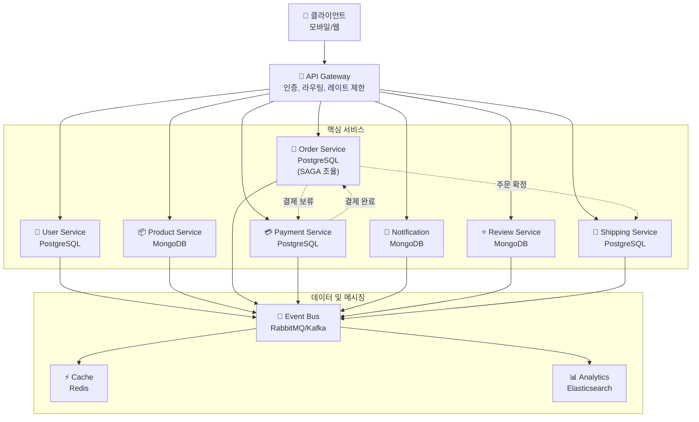

#### 🔄 주요 흐름 예제: 주문 생성 (SAGA 패턴)

```text
1️⃣ 사용자가 주문 생성 요청 (POST /orders)
   ↓
2️⃣ Order Service가 주문 임시 생성 (상태: PENDING)
   ↓
3️⃣ Event: order.created 발행
   ├→ Inventory Check: Product Service가 재고 확인
   ├→ Payment Initiate: Payment Service가 결제 처리 요청
   └→ Notification: Notification Service가 주문 확인 이메일 발송
   ↓
4️⃣ Payment Service: 결제 완료 → Payment.succeeded 이벤트
   ↓
5️⃣ Order Service: 상태 업데이트 (CONFIRMED)
   ↓
6️⃣ Shipping Service: 배송 준비 (shipment.created 이벤트)
   ↓
7️⃣ Notification Service: 배송 시작 알림 발송
   ↓
✅ 주문 완료
```

**SAGA 실패 처리** (결제 실패 시):

```text
Payment Service: 결제 실패 → Payment.failed 이벤트
   ↓
Order Service: 상태 롤백 (CANCELLED)
   ↓
Product Service: 재고 원복
   ↓
Notification Service: 주문 취소 알림 발송
   ↓
❌ 주문 취소 완료 (모든 서비스 원자성 보장)
```

#### 📝 SPEC 작성 및 구현

```bash
# Step 1: SPEC 작성 (Sequential-Thinking 자동 활성화)
# 복잡도 > 중간 (10개 파일), 의존성 > 3개이므로 자동 활성화
/moai:1-plan "마이크로서비스 아키텍처 - 10개 서비스,
멀티 DB (PostgreSQL/MongoDB), 분산 트랜잭션 (SAGA 패턴),
이벤트 드리븐 메시징 (RabbitMQ), API Gateway,
Redis 캐싱, Elasticsearch 분석"

# Alfred가 자동으로 Sequential-Thinking MCP를 활용하여:
# - 서비스 간 의존성 분석
# - DB 스키마 설계
# - 이벤트 메시지 정의
# - SAGA 트랜잭션 설계
# - API 스펙 정의
# 상세 SPEC-001 생성

/clear  # 토큰 절약 (45-50K tokens)

# Step 2: TDD 구현 (병렬 실행 가능)
/moai:2-run SPEC-001

# 각 마이크로서비스:
# 1. tests/test_[service].py - 단위 테스트 (85%+ 커버리지)
# 2. src/[service]/ - 구현 코드
# 3. docker/[service]/Dockerfile - 컨테이너화
# 4. k8s/[service].yaml - Kubernetes 배포 설정

# Step 3: 통합 테스트 및 문서화
/moai:3-sync SPEC-001

# 자동 생성:
# - API 문서 (OpenAPI 3.0)
# - Event Schema (AsyncAPI)
# - Database 다이어그램
# - Deployment 가이드
# - 운영 플레이북
```

#### 🛠️ 필요한 도구 및 스킬

**Skill 권장사항**:

- `moai-domain-backend` - 마이크로서비스 아키텍처
- `moai-domain-database` - 다중 DB 설계 (PostgreSQL/MongoDB)
- `moai-domain-devops` - Docker, Kubernetes 배포
- `moai-security-zero-trust` - 서비스 간 인증 (mTLS)
- `moai-domain-monitoring` - 분산 추적 (Jaeger, Datadog)

---

## ❓ FAQ (자주 묻는 질문)

### Q1: 스킬(Skill)과 에이전트(Agent)의 차이는 무엇인가요?

**스킬(Skill):**

- 지식 모듈 (Knowledge base)
- 특정 도메인의 패턴, 베스트 프랙티스, 레퍼런스
- `.claude/skills/` 디렉토리에 Markdown 파일로 저장
- 예: `moai-lang-unified`, `moai-foundation-core`

**에이전트(Agent):**

- 실행 주체 (Executor)
- 스킬을 활용하여 작업 수행
- `Task(subagent_type="agent-name")`으로 호출
- 예: `manager-spec`, `expert-backend`, `expert-security`

**관계:**

```
에이전트(expert-backend) + 스킬(moai-lang-unified) = FastAPI 구현
```

---

### Q2: SPEC이 항상 필요한가요?

**SPEC 생성 권장 기준:**

| 조건                | SPEC 필요 여부                    |
| ------------------- | --------------------------------- |
| 1-2개 파일 수정     | 선택 사항 (간단한 경우 생략 가능) |
| 3-5개 파일 수정     | 권장 (요구사항 명확화)            |
| 10개 이상 파일 수정 | 필수 (복잡도 높음)                |
| 새로운 기능 추가    | 권장                              |
| 버그 수정           | 선택 사항                         |

**SPEC 없이 진행하는 경우:**

```bash
# SPEC 생략하고 바로 구현
Task(subagent_type="expert-backend", prompt="간단한 버그 수정")
```

**SPEC 생성 후 진행:**

```bash
/moai:1-plan "복잡한 기능 명세"
/clear
/moai:2-run SPEC-001
```

---

### Q3: 어떤 스킬부터 배워야 하나요?

**학습 순서 (추천):**

**1단계: 기초 원칙 (30분)**

- `moai-foundation-core`: TRUST 5, SPEC-First TDD, 에이전트 조율

**2단계: 언어 및 도메인 (1시간)**

- `moai-lang-unified`: Python, TypeScript 등 25개 언어
- `moai-baas-unified`: Supabase, Firebase 백엔드 연동

**3단계: 전문 도구 (2시간)**

- `moai-core-uiux`: UI/UX 디자인 시스템
- `moai-webapp-testing`: E2E 테스트
- `moai-docs-unified`: 문서 검증

**4단계: 고급 통합 (3시간 이상)**

- `moai-mcp-integration`: MCP 서버 활용
- `moai-nextra-architecture`: 문서 사이트 생성

---

### Q4: MCP 서버 설치가 필수인가요?

**필수 MCP 서버 (2개):**

1. **Context7** (필수)

   - 최신 라이브러리 API 문서 자동 참조
   - 코드 생성 시 hallucination 방지
   - 설치: 자동 (`.mcp.json`에 포함)

2. **Sequential-Thinking** (필수)
   - 복잡한 문제 분석
   - 아키텍처 설계, 알고리즘 최적화
   - 설치: 자동 (`.mcp.json`에 포함)

**선택 MCP 서버:**

- Figma MCP: 디자인-투-코드 변환
- Playwright MCP: 웹 자동화 테스트
- Notion MCP: 문서 관리 연동

**설치 확인:**

```bash
# MCP 서버 목록 확인
cat .claude/mcp.json
```

---

### Q5: 오프라인에서도 사용 가능한가요?

**가능한 작업:**

- 로컬 스킬 참조 (`.claude/skills/`)
- 에이전트 호출 및 코드 생성
- TDD 워크플로우 실행
- Git 워크플로우 자동화

**제한되는 기능:**

- Context7 (최신 API 문서 참조 불가)
- Sequential-Thinking (복잡한 분석 제한)
- MCP 서버 기반 통합 (Figma, Notion 등)

**오프라인 대안:**

- 스킬에 포함된 로컬 레퍼런스 활용
- 캐시된 MCP 데이터 사용 (일부 지원)

---

### Q6: MoAI-ADK와 기존 Claude Code의 차이는?

| 항목        | 기존 Claude Code   | MoAI-ADK                            |
| ----------- | ------------------ | ----------------------------------- |
| 개발 방법론 | 즉흥적 대화형 코딩 | SPEC-First TDD 체계적 접근          |
| 에이전트    | 일반 purpose       | 26개 전문 에이전트 (7-Tier)         |
| 스킬        | 기본 제공 없음     | 22개 도메인 특화 스킬               |
| 품질 보증   | 수동 테스트        | TRUST 5 자동 품질 게이트            |
| 문서화      | 수동 작성          | 자동 동기화 (`/moai:3-sync`)        |
| 토큰 관리   | 수동               | 자동 최적화 (Conditional Auto-load) |

**결론**: MoAI-ADK는 Claude Code의 확장판으로, 엔터프라이즈급 품질과 효율성을 제공합니다.

---

### Q7: 다른 AI 코딩 도구와 비교하면?

| 기능          | GitHub Copilot | Cursor        | MoAI-ADK              |
| ------------- | -------------- | ------------- | --------------------- |
| 코드 자동완성 | ✅ 우수        | ✅ 우수       | ✅ 우수               |
| SPEC-First    | ❌ 없음        | ❌ 없음       | ✅ 핵심 기능          |
| TDD 강제      | ❌ 없음        | ❌ 없음       | ✅ 85%+ 커버리지 보장 |
| 전문 에이전트 | ❌ 1개 (일반)  | ❌ 1개 (일반) | ✅ 26개 (전문)        |
| 품질 게이트   | ❌ 없음        | ❌ 없음       | ✅ TRUST 5            |
| 자동 문서화   | ❌ 없음        | ❌ 없음       | ✅ `/moai:3-sync`     |
| 가격          | $10/월         | $20/월        | ✅ 무료 (오픈소스)    |

---

## 10. TRUST 5 품질 보증


모든 MoAI-ADK 프로젝트는 **TRUST 5** 품질 프레임워크를 준수합니다. TRUST 5는 Test-First, Readable, Unified, Secured, Trackable의 5가지 핵심 원칙으로 구성되어 있으며, 엔터프라이즈급 소프트웨어의 품질을 보증하는 체계입니다. 각 원칙은 명확한 검증 기준을 가지고 있으며, MoAI-ADK의 자동화된 에이전트들이 이 기준들을 자동으로 검사하고 검증합니다. `/moai:2-run` TDD 구현 시 자동으로 모든 TRUST 5 검증이 수행되며, 기준을 충족하지 못하면 구현이 완료되지 않습니다. 이는 개발자가 고품질 코드를 작성하도록 강제하는 동시에, 반복적인 코드 리뷰 시간을 획기적으로 단축시킵니다.

### T - Test-First (테스트 우선)

**원칙**: 모든 구현은 테스트부터 시작합니다.

**검증**:

- 테스트 커버리지 ≥ 85%
- 실패하는 테스트 먼저 작성 (Red)
- 코드로 통과 (Green)
- 리팩토링 (Refactor)

**자동화**: `manager-tdd` 에이전트가 자동으로 TDD 사이클 실행

### R - Readable (읽기 쉬운)

**원칙**: 코드는 명확하고 이해하기 쉬워야 합니다.

**검증**:

- 명확한 변수명 (약어 최소화)
- 코드 주석 (복잡한 로직)
- 코드 리뷰 통과
- 린터 검사 통과

**자동화**: `format-expert` 에이전트가 스타일 가이드 적용

### U - Unified (일관된)

**원칙**: 프로젝트 전체에 일관된 스타일을 유지합니다.

**검증**:

- 프로젝트 스타일 가이드 준수
- 일관된 네이밍 컨벤션
- 통일된 에러 핸들링
- 표준 문서 포맷

**자동화**: `quality-gate` 에이전트가 일관성 검증

### S - Secured (보안)

**원칙**: 모든 코드는 보안 검증을 통과해야 합니다.

**검증**:

- OWASP Top 10 준수
- 입력 검증 및 sanitization
- 보안 코딩 패턴
- 취약점 스캔 통과

**자동화**: `expert-security` 에이전트가 보안 검증

### T - Trackable (추적 가능)

**원칙**: 모든 변경사항은 추적 가능해야 합니다.

**검증**:

- SPEC-CODE 연결 (@SPEC → @CODE)
- 명확한 커밋 메시지
- 테스트 증거 문서화
- 변경 이력 기록

**자동화**: `git-manager` 에이전트가 Git 워크플로우 관리

---

## 📋 빠른 참조 카드 (1페이지 치트시트)

### 필수 명령어

| 명령어             | 용도            | 예시                           |
| ------------------ | --------------- | ------------------------------ |
| `/moai:0-project`  | 프로젝트 초기화 | `/moai:0-project`              |
| `/moai:1-plan`     | SPEC 생성       | `/moai:1-plan "로그인 기능"`   |
| `/moai:2-run`      | TDD 구현        | `/moai:2-run SPEC-001`         |
| `/moai:3-sync`     | 문서 동기화     | `/moai:3-sync SPEC-001`        |
| `/moai:9-feedback` | 피드백 제출     | `/moai:9-feedback "개선 제안"` |
| `/clear`           | 컨텍스트 초기화 | `/clear`                       |

---

### 핵심 스킬 (Top 5)

1. **`moai-foundation-core`**: TRUST 5, SPEC-First TDD, 에이전트 조율
2. **`moai-lang-unified`**: Python, TypeScript 등 25개 언어 패턴
3. **`moai-baas-unified`**: Supabase, Firebase 백엔드 연동
4. **`moai-core-uiux`**: UI/UX 디자인 시스템 통합
5. **`moai-webapp-testing`**: E2E 테스트 자동화

---

### 핵심 에이전트 (Top 5)

1. **`manager-spec`**: SPEC 문서 생성 (EARS 포맷)
2. **`manager-tdd`**: RED-GREEN-REFACTOR TDD 구현
3. **`expert-backend`**: 백엔드 API 개발
4. **`expert-security`**: 보안 취약점 분석
5. **`manager-quality`**: TRUST 5 품질 검증

---

### 작업 흐름 (Quick Flow)

```text
/moai:1-plan "기능 설명"  → SPEC-001 생성
/clear                    → 컨텍스트 초기화
/moai:2-run SPEC-001      → TDD 구현 (85%+ 커버리지)
/clear                    → 컨텍스트 초기화
/moai:3-sync SPEC-001     → 문서 자동 생성
```

---

### TRUST 5 품질 게이트

- **T**est-First: 85% 이상 테스트 커버리지
- **R**eadable: 명확한 코드 네이밍 및 주석
- **U**nified: 일관된 코드 스타일 (black, isort)
- **S**ecured: OWASP Top 10 보안 검증
- **T**rackable: 명확한 Git 커밋 메시지

---

### 주요 파일 경로

- **SPEC 문서**: `.moai/specs/SPEC-XXX/spec.md`
- **설정 파일**: `.moai/config/config.json`
- **스킬 디렉토리**: `.claude/skills/`
- **커맨드**: `.claude/commands/moai/`
- **MCP 설정**: `.claude/mcp.json`

---

## 🆚 MoAI-ADK vs 기존 방식

### 비교 테이블

| 항목                   | 기존 방식        | MoAI-ADK    | 차이점                             |
| ---------------------- | ---------------- | ----------- | ---------------------------------- |
| **개발 속도**          | 느림             | 빠름        | 자동화로 60% 시간 단축             |
| **코드 품질**          | 불균일           | 일관성 보장 | TRUST 5 품질 게이트                |
| **문서화**             | 수동 (자주 누락) | 자동        | 90% 자동화, 100% 최신성            |
| **테스트 커버리지**    | 변동 (20-60%)    | 85%+ 보장   | TDD 강제                           |
| **학습 곡선**          | 가파름           | 완만함      | 22개 스킬 + 26개 에이전트          |
| **버그 발생률**        | 높음             | 낮음        | 70% 버그 감소                      |
| **요구사항 변경 대응** | 어려움           | 쉬움        | SPEC-First로 90% 재작업 감소       |
| **비용**               | 개발자 수동 작업 | AI 자동화   | 토큰 최적화 (5,000 토큰 절감/세션) |

---

### 정량적 개선 지표

| 지표        | 개선율          | 근거                       |
| ----------- | --------------- | -------------------------- |
| 개발 시간   | **60-70% 단축** | AI 에이전트 자동화         |
| 버그 발생   | **70% 감소**    | 85%+ 테스트 커버리지       |
| 재작업      | **90% 감소**    | SPEC-First 명확한 요구사항 |
| 문서 최신성 | **100% 보장**   | `/moai:3-sync` 자동 동기화 |
| 긴급 패치   | **99% 감소**    | TRUST 5 배포 전 검증       |
| 토큰 비용   | **40-60% 절감** | Conditional Auto-load      |

---

## 11. 설정

### Configuration 파일 위치

MoAI-ADK는 `.claude/settings.json` 파일을 사용합니다.

### 주요 설정 항목

```json
{
  "user": {
    "name": "GOOS"
  },
  "language": {
    "conversation_language": "ko",
    "agent_prompt_language": "en"
  },
  "constitution": {
    "enforce_tdd": true,
    "test_coverage_target": 85
  },
  "git_strategy": {
    "mode": "personal",
    "branch_creation": {
      "prompt_always": true,
      "auto_enabled": false
    }
  },
  "github": {
    "spec_git_workflow": "develop_direct"
  },
  "statusline": {
    "enabled": true,
    "format": "compact",
    "style": "R2-D2"
  }
}
```

### 🌳 Git 전략 (3가지 모드)

MoAI-ADK는 개발 환경과 팀 구성에 맞게 3가지 Git 전략을 제공합니다. `.moai/config/config.json`에서 `git_strategy.mode`를 설정하여 활성화합니다.

#### 🎯 모드 선택 결정 트리

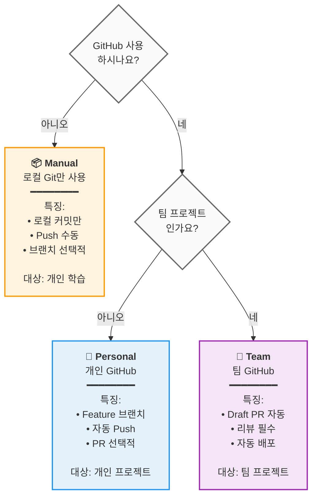

---

#### 📋 3가지 모드 비교

| 구분          | Manual      | Personal     | Team         |
| ------------- | ----------- | ------------ | ------------ |
| **사용처**    | 개인 학습   | 개인 GitHub  | 팀 프로젝트  |
| **GitHub**    | ❌          | ✅           | ✅           |
| **브랜치**    | 선택적 생성 | Feature 자동 | Feature 자동 |
| **Push**      | 수동        | 자동         | 자동         |
| **PR**        | 없음        | 제안         | 자동 생성    |
| **코드 리뷰** | 없음        | 선택         | **필수**     |
| **배포**      | 수동        | 수동         | CI/CD 자동   |
| **설정**      | **5분**     | 15분         | 25분         |

---

#### ⚙️ 빠른 설정

**Manual** (로컬만 사용):

```json
{
  "git_strategy": {
    "mode": "manual",
    "branch_creation": {
      "prompt_always": true,
      "auto_enabled": false
    }
  }
}
```

✅ Alfred가 매번 브랜치 생성 여부 물어봄

**Personal** (개인 프로젝트 - 빠른 반복):

```json
{
  "git_strategy": {
    "mode": "personal",
    "branch_creation": {
      "prompt_always": false,
      "auto_enabled": true
    }
  }
}
```

✅ 모든 커밋이 자동으로 GitHub에 푸시됨

**Team** (팀 프로젝트 - 코드 리뷰):

```json
{
  "git_strategy": {
    "mode": "team",
    "branch_creation": {
      "prompt_always": false,
      "auto_enabled": true
    }
  }
}
```

✅ 모든 SPEC마다 자동으로 Draft PR 생성 (팀 리뷰 필요)

---

#### 🔄 Team 모드의 코드 리뷰 흐름

```
SPEC 작성 (Feature 브랜치)
        ↓
Draft PR 자동 생성
        ↓
팀원 리뷰 + 피드백
        ↓
승인 (최소 1명)
        ↓
Merge to main
        ↓
CI/CD 자동 배포 (선택)
```

---

#### 🔀 모드 마이그레이션

**Manual → Personal** (GitHub 추가):

```bash
# 1. GitHub 저장소 생성
# 2. 로컬 리포지토리와 연결
git remote add origin https://github.com/user/repo.git

# 3. config.json 수정
# mode: "manual" → "personal"
```

**Personal → Team** (팀 추가):

```bash
# 1. 팀 저장소에 동료 초대
# 2. config.json 수정
# mode: "personal" → "team"
```

---

## 12. MCP 서버

MoAI-ADK는 **MCP(Model Context Protocol)** 서버를 통해 외부 도구와 통합됩니다.

### 📡 지원 MCP 서버

| MCP 서버                      | 목적                      | 필수 여부   | 용도                                      |
| ----------------------------- | ------------------------- | ----------- | ----------------------------------------- |
| **Context7**                  | 최신 라이브러리 문서 조회 | ✅ **필수** | API 레퍼런스, 프레임워크 문서             |
| **Sequential-Thinking**       | 복잡한 문제 다단계 추론   | ✅ **권장** | 아키텍처 설계, 알고리즘 최적화, SPEC 분석 |
| **Playwright**                | 브라우저 자동화           | 선택        | E2E 테스트, UI 검증                       |
| **figma-dev-mode-mcp-server** | 디자인 시스템 연동        | 선택        | 디자인-코드 변환                          |

### 🧮 Sequential-Thinking MCP (권장)

**목적**: 복잡한 문제의 다단계 추론을 통한 정확한 분석

**자동 활성화 조건**:

- 복잡도 > 중간 (10+ 파일, 아키텍처 변경)
- 의존성 > 3개 이상
- SPEC 생성 또는 Plan 에이전트 호출 시
- 요청에서 "복잡한", "설계", "최적화", "분석" 키워드 포함

**활용 시나리오**:

- 🏗️ 마이크로서비스 아키텍처 설계
- 🧩 복잡한 데이터 구조 및 알고리즘 최적화
- 🔄 시스템 통합 및 마이그레이션 계획
- 📋 SPEC 분석 및 요구사항 정의
- ⚙️ 성능 병목 분석

### 🔌 Context7 MCP (필수)

**목적**: 최신 라이브러리 문서 및 API 레퍼런스 실시간 조회

**활성화 방법**: MoAI-ADK 설치 시 자동 활성화

**지원 라이브러리**(예시):

- `/vercel/next.js` - Next.js 최신 문서
- `/facebook/react` - React 최신 문서
- `/tiangolo/fastapi` - FastAPI 최신 문서

---

## 13. 고급 기능

### 🚀 선택적 AI 코드 생성 (Codex & Gemini)

MoAI-ADK는 외부 AI 모델과의 **선택적** 통합을 지원합니다. Claude Code만으로도 완전히 작동하며, AI 에이전트는 완전히 선택사항입니다.

**Use `ai-codex` (OpenAI Codex) for Backend**:

- 🔧 복잡한 백엔드 API 구현
- 🔧 데이터베이스 쿼리 최적화
- 🔧 알고리즘 최적화

**Use `ai-gemini` (Google Gemini) for Frontend**:

- 🎨 React/Next.js 컴포넌트 생성
- 🎨 UI/UX 설계
- 🎨 Tailwind CSS 스타일링

---

## 14. 버전 히스토리 및 업데이트

### v0.30.2 (최신)

[](https://pypi.org/project/moai-adk/)

현재 최신 버전은 문서 상단 배지를 참조하세요.

---

### v0.28.0 (주요 업데이트)

**2025년 11월 업데이트**: MoAI-ADK v0.28.0은 토큰 효율성, 스킬 통합, 그리고 에이전트 최적화를 중심으로 대폭 개선되었습니다.

#### 1️⃣ Conditional Auto-load (토큰 최적화)

**문제**: 모든 작업에서 전체 Foundation 스킬을 로드하여 불필요한 토큰 소비

**해결책**: 작업 복잡도에 따라 자동 선택

- **Simple 작업** (파일 읽기, 간단한 수정): 0 토큰 (Quick Reference만 사용)
- **Complex 작업** (아키텍처 변경, SPEC 생성): 8,470 토큰 (전체 스킬 자동 로드)
- **평균 절감**: 세션당 약 5,000 토큰

#### 2️⃣ Skill 통합 및 표준화

**통합 전** (v0.27.x):

- 5개 분산된 `moai-foundation-*` 스킬
- 11개 분산된 `moai-manager-*` 스킬
- 91개 스킬에서 표준화 문제 발견

**통합 후** (v0.28.0):

- `moai-foundation-core`: 9개 모듈 통합 (TRUST 5, SPEC-First TDD, Delegation Patterns 등)
- `moai-core-claude-code`: 7개 레퍼런스 통합 (Skills, Sub-agents, Commands 등)
- **91개 스킬 표준화 완료**: 일관된 YAML 헤더, Progressive Disclosure 구조

#### 3️⃣ 에이전트 최적화 (35 → 26)

**변경사항**:

- **역할 명확화**: 중복된 에이전트 통합 및 재분류
- **7-Tier 계층**: `{domain}-{role}` 명명 규칙 엄격 적용
- **MCP Resume Pattern**: Context 연속성으로 40-60% 토큰 절감

**7-Tier 구조**:

```
Tier 1: manager-* (Command Processors)      - Always Active
Tier 2: manager-* (Orchestration & Quality)     - Auto-triggered
Tier 3: {domain}-* (Domain Experts)          - Lazy-loaded
Tier 4: mcp-* (MCP Integrators)              - Resume-enabled
Tier 5: builder-* (Factory Agents)           - Meta-development
Tier 6: helper-* (Support Services)         - On-demand
Tier 7: ai-* (AI & Specialized)              - Specialized tasks
```

#### 4️⃣ 백업 및 복구 전략

**기능**:

- **Backup-and-replace**: 업데이트 전 자동 백업
- **Interactive Skills 복구**: 사용자가 선택적으로 스킬 복원
- **충돌 방지**: 템플릿과 로컬 변경사항 안전하게 병합

#### 5️⃣ 다국어 지원 강화

**완료**:

- 63개 파일 Korean → English 완전 번역
- **Rule 10**: AskUserQuestion 언어 규칙 추가
- 모든 사용자 인터페이스 다국어 지원

---

## 15. 문제 해결

### 1. 테스트 커버리지 85% 미달

**오류:**

```text
❌ 테스트 커버리지: 72% (목표: 85%)
```

**해결책:**

```bash
# test-engineer 에이전트 호출하여 추가 테스트 생성
@agent-test-engineer "SPEC-001의 테스트 커버리지를 85% 이상으로 향상"
```

또는 coverage_target 조정 (비권장):

```json
{
  "constitution": {
    "test_coverage_target": 75
  }
}
```

### 2. SPEC 없이 구현 시도

**오류:**

```text
❌ SPEC이 없습니다. /moai:1-plan을 먼저 실행하세요.
```

**해결책:**

```bash
# 반드시 SPEC 먼저 생성
/moai:1-plan "기능 설명"
/clear
/moai:2-run SPEC-001
```

### 3. 토큰 한계 초과

**오류:**

```text
⚠️ Context: 175K tokens (한계에 근접)
```

**해결책:**

```bash
# /clear 실행하여 컨텍스트 초기화
/clear

# 또는 작업을 더 작은 단위로 분할
/moai:1-plan "기능 A만 먼저 구현"  # 큰 기능을 분할
```

### 4. MCP 서버 연결 실패

**오류:**

```text
❌ Context7 MCP 연결 실패
```

**해결책:**

```bash
# Claude Code 재시작
# 1. Claude Code 종료
# 2. 터미널에서 다시 실행:
claude

# 또는 MCP 설정 재확인:
# .claude/mcp.json 파일 확인
```

---

## 16. 추가 자료

### 📖 문서 파일 (.moai/memory/)

MoAI-ADK는 프로젝트 내부에 포괄적인 메모리 파일 시스템을 제공합니다:

- `.moai/memory/execution-rules.md` - 실행 규칙 및 제약사항
- `.moai/memory/agents.md` - 26개 전문 에이전트 카탈로그
- `.moai/memory/commands.md` - MoAI 커맨드 레퍼런스
- `.moai/memory/delegation-patterns.md` - 에이전트 위임 패턴
- `.moai/memory/token-optimization.md` - 토큰 최적화 전략

### 🆘 지원 (Support)

**이메일 지원:**

- 기술 지원: [support@mo.ai.kr](mailto:support@mo.ai.kr)

### 📊 Star History

[](https://star-history.com/#modu-ai/moai-adk&Date)

---

## 📝 License

MoAI-ADK is licensed under the [MIT License](./LICENSE).

```text
MIT License

Copyright (c) 2025 MoAI-ADK Team

Permission is hereby granted, free of charge, to any person obtaining a copy
of this software and associated documentation files (the "Software"), to deal
in the Software without restriction, including without limitation the rights
to use, copy, modify, merge, publish, distribute, sublicense, and/or sell
copies of the Software, and to permit persons to whom the Software is
furnished to do so, subject to the following conditions:

The above copyright notice and this permission notice shall be included in all
copies or substantial portions of the Software.

THE SOFTWARE IS PROVIDED "AS IS", WITHOUT WARRANTY OF ANY KIND, EXPRESS OR
IMPLIED, INCLUDING BUT NOT LIMITED TO THE WARRANTIES OF MERCHANTABILITY,
FITNESS FOR A PARTICULAR PURPOSE AND NONINFRINGEMENT. IN NO EVENT SHALL THE
AUTHORS OR COPYRIGHT HOLDERS BE LIABLE FOR ANY CLAIM, DAMAGES OR OTHER
LIABILITY, WHETHER IN AN ACTION OF CONTRACT, TORT OR OTHERWISE, ARISING FROM,
OUT OF OR IN CONNECTION WITH THE SOFTWARE OR THE USE OR OTHER DEALINGS IN THE
SOFTWARE.
```

---

### Made with ❤️ by MoAI-ADK Team

**Version:** 0.28.2
**Last Updated:** 2025-11-24
**Philosophy**: SPEC-First TDD + Agent Orchestration + 85% Token Efficiency
**MoAI**: MoAI stands for "Modu-ui AI" (AI for Everyone). Our goal is to make AI accessible to everyone.
