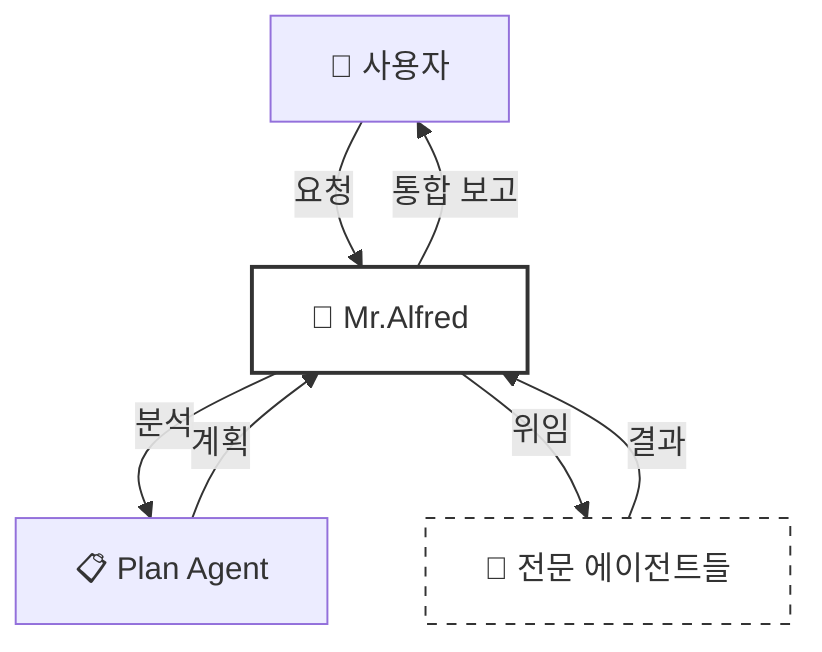
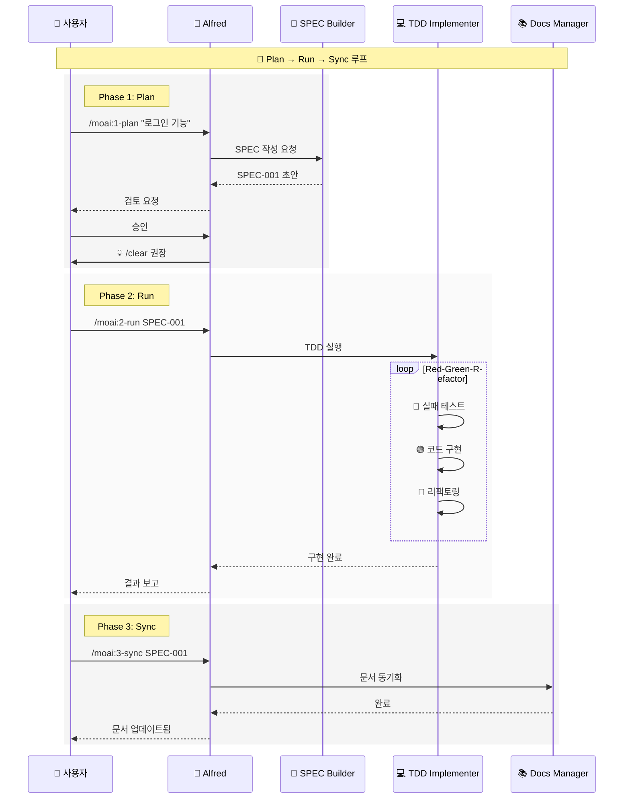
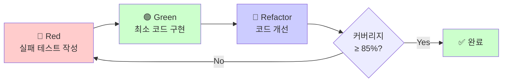

# 🗿 MoAI-ADK: Agentic AI 기반 SPEC-First TDD 개발 프레임워크

**사용 가능한 언어:** [🇰🇷 한국어](./README.ko.md) | [🇺🇸 English](./README.md) | [🇯🇵 日本語](./README.ja.md) | [🇨🇳 中文](./README.zh.md)

[](https://pypi.org/project/moai-adk/)
[](https://opensource.org/licenses/MIT)
[](https://www.python.org/)

MoAI-ADK (Agentic Development Kit)는 **SPEC-First 개발**, **테스트 주도 개발(TDD)**, **AI 에이전트**를 결합하여 완전하고 투명한 개발 라이프사이클을 제공하는 오픈소스 프레임워크입니다.

---

## 📑 목차

1. [소개](#1-소개)
2. [빠른 시작](#2-빠른-시작-5분)
3. [핵심 개념](#3-핵심-개념)
4. [설치 및 설정](#4-설치-및-설정)
5. [개발 워크플로우](#5-개발-워크플로우)
6. [핵심 커맨드](#6-핵심-커맨드)
7. [에이전트 가이드](#7-에이전트-가이드)
8. [스킬 라이브러리](#8-스킬-라이브러리-147개)
9. [실용 예제](#9-실용-예제)
10. [TRUST 5 품질 보증](#10-trust-5-품질-보증)
11. [설정](#11-설정)
12. [MCP 서버](#12-mcp-서버)
13. [릴리스 노트](#13-릴리스-노트)
14. [고급 기능](#14-고급-기능)
15. [문제 해결](#15-문제-해결)
16. [추가 자료](#16-추가-자료)

---

## 1. 소개

### 🗿 MoAI-ADK란?

**MoAI-ADK**(Agentic Development Kit)는 AI 에이전트를 활용한 차세대 개발 프레임워크입니다. **SPEC-First 개발 방법론**과 **TDD(Test-Driven Development, 테스트 주도 개발)**, 그리고 **35명의 전문 AI 에이전트**를 결합하여 완전하고 투명한 개발 라이프사이클을 제공합니다.

### ✨ 왜 MoAI-ADK를 사용할까?

전통적인 개발 방식의 한계:

- ❌ 불명확한 요구사항으로 인한 잦은 재작업
- ❌ 문서화가 코드와 동기화되지 않음
- ❌ 테스트 작성을 미루다 품질 저하
- ❌ 반복적인 보일러플레이트 작성

MoAI-ADK의 해결책:

- ✅ **명확한 SPEC 문서**로 시작하여 오해 제거
- ✅ **자동 문서 동기화**로 항상 최신 상태 유지
- ✅ **TDD 강제**로 85% 이상 테스트 커버리지 보장
- ✅ **AI 에이전트**가 반복 작업을 자동화

### 🎯 핵심 특징

| 특징                  | 설명                                        | 효과                                        |
| --------------------- | ------------------------------------------- | ------------------------------------------- |
| **SPEC-First**        | 모든 개발은 명확한 명세서로 시작            | 요구사항 명확화, 커뮤니케이션 비용 90% 감소 |
| **TDD 강제**          | Red-Green-Refactor 사이클 자동화            | 버그 70% 감소, 리팩토링 자신감 향상         |
| **AI 오케스트레이션** | Mr.Alfred가 35명의 전문 에이전트 지휘       | 개발 속도 3-5배 향상                        |
| **자동 문서화**       | 코드 변경 시 문서 자동 동기화               | 문서 최신성 100% 보장                       |
| **TRUST 5 품질**      | Test, Readable, Unified, Secured, Trackable | 엔터프라이즈급 품질 보증                    |

---

## 2. 빠른 시작 (5분)

### 📦 설치

**1단계: `uv` 설치**(Python 패키지 관리자)

```bash
# macOS / Linux
curl -LsSf https://astral.sh/uv/install.sh | sh

# Windows
powershell -ExecutionPolicy ByPass -c "irm https://astral.sh/uv/install.ps1 | iex"
```

## 2단계: MoAI-ADK 설치

```bash
# 글로벌 설치
uv tool install moai-adk

# 버전 확인
moai-adk --version
```

### 🚀 첫 프로젝트 시작

**신규 프로젝트 생성:**

```bash
# 프로젝트 초기화
moai-adk init my-project
cd my-project

# Claude Code 실행
claude
```

**기존 프로젝트에 적용:**

```bash
cd existing-project
moai-adk init .
claude
```

### 💡 첫 커맨드 실행

Claude Code에서 다음 커맨드를 실행해보세요:

```bash
# 1. 프로젝트 설정 확인
/moai:0-project

# 2. 컨텍스트 초기화
/clear

# 3. 첫 기능 명세 작성
/moai:1-plan "사용자 로그인 기능 구현"

# 4. 컨텍스트 초기화
/clear

# 5. TDD로 구현
/moai:2-run SPEC-001

# 6. 컨텍스트 초기화
/clear

# 7. 문서 동기화
/moai:3-sync SPEC-001
```

**축하합니다!** 🎉 첫 번째 기능을 SPEC-First TDD로 완성했습니다.

---

## 3. 핵심 개념

### 📋 SPEC-First Development

**SPEC-First란?**

모든 개발은 **명확한 명세서**(Specification)로 시작합니다. SPEC은 **EARS(Easy Approach to Requirements Syntax) 포맷**을 따라 작성되며, 다음을 포함합니다:

- **요구사항**: 무엇을 만들 것인가?
- **제약사항**: 어떤 한계가 있는가?
- **성공 기준**: 언제 완료된 것인가?
- **테스트 시나리오**: 어떻게 검증하는가?

**EARS 포맷 예시:**

```markdown
# SPEC-001: 사용자 로그인 기능

## 요구사항 (Requirements)

- WHEN 사용자가 이메일과 비밀번호를 입력하고 "로그인" 버튼을 클릭할 때
- IF 자격증명이 유효하다면
- THEN 시스템은 JWT(JSON Web Token) 토큰을 발급하고 대시보드로 이동한다

## 제약사항 (Constraints)

- 비밀번호는 최소 8자 이상이어야 한다
- 5회 연속 실패 시 계정 잠금 (30분)

## 성공 기준 (Success Criteria)

- 유효한 자격증명으로 로그인 성공률 100%
- 무효한 자격증명은 명확한 에러 메시지 표시
- 응답 시간 < 500ms
```

### 🎩 Mr. Alfred - Super Agent Orchestrator

**Alfred는 누구인가?**

Mr.Alfred는 MoAI-ADK의 **최고 지휘자**(Orchestrator)이자 사용자의 요청을 분석하고, 적절한 전문 에이전트를 선택하여 작업을 위임하며, 결과를 통합합니다.

**Alfred의 역할:**

1. **이해하기**: 사용자 요청 분석 및 불명확한 부분 질문
2. **계획하기**: Plan 에이전트를 통해 실행 계획 수립
3. **실행하기**: 전문 에이전트에게 작업 위임 (순차/병렬)
4. **통합하기**: 모든 결과를 모아 사용자에게 보고



### 🔄 Plan-Run-Sync 워크플로우

MoAI-ADK의 개발은 **3단계 무한 루프**로 진행됩니다:



### 👥 에이전트와 스킬

**에이전트(Agent)란?**

특정 도메인의 전문가 역할을 수행하는 AI 워커입니다. 각 에이전트는 독립적인 200K 토큰 컨텍스트를 가집니다.

**스킬(Skill)란?**

에이전트가 사용하는 전문 지식 모듈입니다. 147개의 스킬이 도메인별로 체계화되어 있습니다.

**예시:**

| 에이전트          | 전문 분야     | 주요 스킬                                                      |
| ----------------- | ------------- | -------------------------------------------------------------- |
| `spec-builder`    | 요구사항 분석 | `moai-foundation-ears`, `moai-foundation-specs`                |
| `tdd-implementer` | TDD 구현      | `moai-foundation-trust`, `moai-essentials-testing-integration` |
| `security-expert` | 보안 검증     | `moai-domain-security`, `moai-security-auth`                   |

### 🏆 TRUST 5 프레임워크

모든 코드는 **TRUST 5** 품질 기준을 통과해야 합니다:

| 원칙           | 의미           | 검증 방법             |
| -------------- | -------------- | --------------------- |
| **T**est-First | 테스트가 먼저  | 테스트 커버리지 ≥ 85% |
| **R**eadable   | 읽기 쉬운 코드 | 코드 리뷰, 린트 통과  |
| **U**nified    | 일관된 스타일  | 스타일 가이드 준수    |
| **S**ecured    | 보안 검증      | OWASP 보안 검사       |
| **T**rackable  | 추적 가능      | SPEC-TAG 체인 완성    |

---

## 4. 설치 및 설정

### 📋 전제조건

| 요구사항    | 최소 버전 | 권장 버전 | 확인 방법           |
| ----------- | --------- | --------- | ------------------- |
| Python      | 3.11+     | 3.13+     | `python --version`  |
| Node.js     | 18+       | 20+       | `node --version`    |
| Git         | 2.30+     | 최신      | `git --version`     |
| Claude Code | 2.0.46+   | 최신      | Claude Code 앱 정보 |

### 🔧 설치 방법

**Option 1: `uv` 사용 (권장)**

```bash
# uv 설치
curl -LsSf https://astral.sh/uv/install.sh | sh

# MoAI-ADK 설치
uv tool install moai-adk

# 버전 확인
moai-adk --version
```

**Option 2: `pip` 사용**

```bash
# pip로 설치
pip install moai-adk

# 버전 확인
moai-adk --version
```

### 🎯 프로젝트 초기화

**신규 프로젝트:**

```bash
# 프로젝트 생성
moai-adk init my-awesome-project

# 디렉토리 구조
my-awesome-project/
├── .claude/
│   ├── agents/              # 에이전트 정의
│   ├── commands/            # 커맨드 정의
│   ├── skills/              # 스킬 라이브러리
│   └── settings.json        # Claude Code 설정
├── .moai/
│   ├── memory/
│   │   ├── agents.md        # 에이전트 참조
│   │   ├── commands.md      # 커맨드 참조
│   │   └── ...
│   └── config/              # 설정 파일
└── src/                     # 소스 코드
```

**기존 프로젝트:**

```bash
cd existing-project
moai-adk init .

# Git 저장소와 함께 초기화
moai-adk init . --with-git
```

### ⚙️ .claude/settings.json 설정

MoAI-ADK는 `.claude/settings.json` 파일을 사용하여 Claude Code 동작을 제어합니다.

`.claude/settings.json` 파일을 편집하여 프로젝트를 커스터마이즈하세요:

```json
{
  "user": {
    "name": "개발자이름"
  },
  "language": {
    "conversation_language": "ko",
    "agent_prompt_language": "en"
  },
  "constitution": {
    "enforce_tdd": true,
    "test_coverage_target": 85
  },
  "git_strategy": {
    "mode": "personal"
  },
  "github": {
    "spec_git_workflow": "develop_direct"
  },
  "statusline": {
    "enabled": true,
    "format": "compact",
    "style": "R2-D2"
  }
}
```

**주요 설정 항목:**

- `user.name`: Alfred가 당신을 부르는 이름
- `conversation_language`: 대화 및 문서 언어 (ko/en/ja/zh)
- `agent_prompt_language`: 에이전트 내부 추론 언어 (**항상 "en" 사용**)
- `enforce_tdd`: TDD 강제 여부 (true 권장)
- `test_coverage_target`: 테스트 커버리지 목표 (기본 85%)
- `git_strategy.mode`: Git 전략 (personal/team/hybrid)
- `statusline`: Claude Code 상태 표시줄 설정

---

## 5. 개발 워크플로우

### Phase 1: Plan (SPEC 생성)

**목적:** 모호한 아이디어를 명확한 EARS 포맷 명세서로 변환

**실행 단계:**

```bash
# 1. Plan 커맨드 실행
/moai:1-plan "JWT 토큰 기반 사용자 인증 시스템"

# Alfred의 동작:
# - spec-builder 에이전트 호출
# - 사용자 요구사항 분석
# - 불명확한 부분 질문
# - EARS 포맷 SPEC 문서 생성
# - .moai/specs/SPEC-001/ 디렉토리에 저장

# 2. SPEC 검토
# - Alfred가 초안을 보여줌
# - 필요시 수정 요청
# - 승인

# 3. 컨텍스트 초기화 (필수!)
/clear
```

### Phase 2: Run (TDD 구현)

**목적:** SPEC을 기반으로 Red-Green-Refactor TDD 사이클 실행

**실행 단계:**

```bash
# TDD 구현 시작
/moai:2-run SPEC-001

# Alfred의 동작:
# - tdd-implementer 에이전트 호출
# - Red: 실패하는 테스트 먼저 작성
# - Green: 테스트를 통과하는 최소 코드 작성
# - Refactor: 코드 품질 개선 및 최적화
# - 테스트 커버리지 ≥ 85% 확인
```

**TDD 사이클 상세:**



### Phase 3: Sync (문서 동기화)

**목적:** 구현된 코드를 분석하여 문서와 다이어그램 자동 생성

**실행 단계:**

```bash
# 문서 동기화
/moai:3-sync SPEC-001

# Alfred의 동작:
# - docs-manager 에이전트 호출
# - 코드 주석에서 API 문서 추출
# - Mermaid 다이어그램 생성
# - README.md 업데이트
# - CHANGELOG 자동 생성
```

---

## 6. 핵심 커맨드

### `/moai:0-project` - 프로젝트 초기화

**목적:** 프로젝트 구조 생성 및 설정 초기화

**사용법:**

```bash
/moai:0-project
```

**동작:**

1. `.moai/` 디렉토리 구조 생성
2. `.claude/settings.json` 템플릿 생성
3. Git 저장소 초기화 (선택)
4. `.claude/` 에이전트/스킬 동기화

**위임 에이전트:** `project-manager`

---

### `/moai:1-plan` - SPEC 생성

**목적:** 사용자 요구사항을 EARS 포맷 SPEC 문서로 변환

**사용법:**

```bash
/moai:1-plan "기능 설명을 자연어로 작성"
```

**예시:**

```bash
# 예시 1: 간단한 기능
/moai:1-plan "사용자 회원가입 기능"

# 예시 2: 상세한 요구사항
/moai:1-plan "OAuth2.0 소셜 로그인 (Google, GitHub) 지원.
사용자 프로필 정보 자동 동기화. 기존 계정과 연결 가능."

# 예시 3: API 설계
/moai:1-plan "게시판 REST API - 페이지네이션, 정렬, 필터링 지원"
```

**위임 에이전트:** `spec-builder`

---

### `/moai:2-run` - TDD 구현

**목적:** SPEC 기반 Red-Green-Refactor TDD 사이클 실행

**사용법:**

```bash
/moai:2-run SPEC-ID
```

**예시:**

```bash
# 기본 실행
/moai:2-run SPEC-001

# 특정 언어/프레임워크 지정
/moai:2-run SPEC-002 --lang python --framework fastapi

# 단계별 확인 모드
/moai:2-run SPEC-003 --interactive
```

**위임 에이전트:** `tdd-implementer`

---

### `/moai:3-sync` - 문서 동기화

**목적:** 코드 분석 및 자동 문서 생성/업데이트

**사용법:**

```bash
/moai:3-sync SPEC-ID [옵션]
```

**예시:**

```bash
# 기본 동기화
/moai:3-sync SPEC-001

# 특정 문서 타입만
/moai:3-sync SPEC-002 --docs api

# 다이어그램 생성
/moai:3-sync SPEC-003 --diagrams architecture,sequence

# 다국어 문서
/moai:3-sync SPEC-004 --languages ko,en,ja
```

**위임 에이전트:** `docs-manager`

---

### `/moai:9-feedback` - 피드백 및 개선

**목적:** MoAI-ADK 프레임워크 버그 분석 및 자동 이슈 등록

**사용법:**

```bash
/moai:9-feedback [옵션]
```

**예시:**

```bash
# 전체 분석
/moai:9-feedback

# 특정 오류 보고
/moai:9-feedback --error "TDD 사이클 중 커버리지 계산 오류"

# 개선 제안
/moai:9-feedback --suggestion "SPEC 템플릿에 성능 요구사항 섹션 추가"
```

**위임 에이전트:** `quality-gate`, `debug-helper`

---

## 7. 에이전트 가이드

MoAI-ADK는 **35명의 전문 에이전트**를 제공합니다.

### 📋 기획 및 설계 (Planning & Design)

| 에이전트               | 전문 분야     | 주요 책임                            | 대표 스킬              |
| ---------------------- | ------------- | ------------------------------------ | ---------------------- |
| **spec-builder**       | 요구사항 분석 | EARS 포맷 SPEC 작성, 요구사항 명확화 | `moai-foundation-ears` |
| **api-designer**       | API 설계      | REST/GraphQL 엔드포인트 설계         | `moai-domain-web-api`  |
| **component-designer** | 컴포넌트 설계 | 재사용 가능한 UI 컴포넌트 설계       | `moai-design-systems`  |
| **ui-ux-expert**       | UX 설계       | 사용자 경험 및 인터페이스 설계       | `moai-domain-figma`    |
| **plan**               | 전략 수립     | 복잡한 작업을 단계별로 분해          | `moai-core-workflow`   |

### 💻 구현 (Implementation)

| 에이전트            | 전문 분야           | 주요 책임                                   | 대표 스킬               |
| ------------------- | ------------------- | ------------------------------------------- | ----------------------- |
| **tdd-implementer** | TDD 구현            | Red-Green-Refactor 사이클 실행              | `moai-foundation-trust` |
| **backend-expert**  | 백엔드 아키텍처     | 서버 로직, 데이터베이스 통합, 비즈니스 로직 | `moai-domain-backend`   |
| **frontend-expert** | 프론트엔드 아키텍처 | 웹 프론트엔드, 상태 관리, UI 인터랙션       | `moai-domain-frontend`  |
| **database-expert** | 데이터베이스 설계   | DB 스키마 설계, 쿼리 최적화, 마이그레이션   | `moai-domain-database`  |

### 🛡️ 품질 및 보안 (Quality & Security)

| 에이전트            | 전문 분야   | 주요 책임                                     | 대표 스킬                             |
| ------------------- | ----------- | --------------------------------------------- | ------------------------------------- |
| **security-expert** | 보안        | 취약점 검사, OWASP 준수, 보안 코딩 가이드     | `moai-domain-security`                |
| **quality-gate**    | 품질 검증   | 코드 품질, 커버리지, TRUST 5 원칙 검증        | `moai-foundation-trust`               |
| **test-engineer**   | 테스트 전략 | 단위/통합/E2E 테스트 전략 및 테스트 코드 강화 | `moai-essentials-testing-integration` |
| **format-expert**   | 코드 스타일 | 코드 스타일 가이드 및 린팅 규칙 적용          | `moai-core-code-reviewer`             |
| **debug-helper**    | 디버깅      | 런타임 오류 근본 원인 분석 및 해결책 제시     | `moai-essentials-debug`               |

### 🚀 DevOps 및 관리 (DevOps & Management)

| 에이전트                 | 전문 분야     | 주요 책임                                           | 대표 스킬                    |
| ------------------------ | ------------- | --------------------------------------------------- | ---------------------------- |
| **devops-expert**        | DevOps        | CI/CD 파이프라인, 클라우드 인프라(IaC), 배포 자동화 | `moai-domain-devops`         |
| **monitoring-expert**    | 모니터링      | 시스템 모니터링, 로깅, 알림 시스템 설정             | `moai-domain-monitoring`     |
| **performance-engineer** | 성능 최적화   | 시스템 성능 병목 분석 및 최적화                     | `moai-essentials-perf`       |
| **docs-manager**         | 문서 관리     | 프로젝트 문서 생성, 업데이트, 관리                  | `moai-docs-generation`       |
| **git-manager**          | Git 관리      | Git 브랜치 전략, PR 관리, 버전 태깅                 | `moai-foundation-git`        |
| **project-manager**      | 프로젝트 관리 | 전체 프로젝트 진행 조율 및 관리                     | `moai-project-documentation` |

### 🛠️ 특화 도구 (Specialized Tools)

| 에이전트          | 전문 분야       | 주요 책임                                | 대표 스킬                 |
| ----------------- | --------------- | ---------------------------------------- | ------------------------- |
| **agent-factory** | 에이전트 팩토리 | 새로운 커스텀 에이전트 생성 및 설정      | `moai-core-agent-factory` |
| **skill-factory** | 스킬 팩토리     | 새로운 MoAI 스킬 정의 및 라이브러리 추가 | `moai-cc-skill-factory`   |

---

## 8. 스킬 라이브러리 (134개)

MoAI-ADK는 **134개의 스킬**을 제공합니다. 스킬은 에이전트가 사용하는 전문 지식 모듈이며, 10개 계층(Tier)으로 체계화되어 있습니다.

### 📊 스킬 포트폴리오 통계

- **총 스킬 수**: 134개 (107개 계층화 + 27개 특수)
- **10-Tier 분류**: 언어에서 특화 라이브러리까지 체계적 조직화
- **100% 메타데이터 준수**: 모든 스킬에 7개 필수 필드 포함
- **1,270개 자동 트리거 키워드**: 사용자 요청에서 지능적 스킬 선택
- **94% 에이전트-스킬 커버리지**: 35개 에이전트 중 33개가 명시적 스킬 참조

### 🎯 계층 구조 (Tier Structure)

- **Tier 1-2**: Foundation (언어, 도메인) - 38개 스킬
- **Tier 3-5**: Core Architecture (보안, 코어, 파운데이션) - 37개 스킬
- **Tier 6-7**: Platform Integration (Claude Code, BaaS) - 20개 스킬
- **Tier 8-10**: Applied Workflows (필수 도구, 프로젝트, 라이브러리) - 12개 스킬
- **Special Skills**: 계층 미분류 유틸리티 - 27개 스킬

### 📚 전체 스킬 목록 (알파벳 순)

#### Tier 1: 언어별 스킬 (moai-lang-\*)

프로그래밍 언어 패턴 및 관용구 (21개)

| 스킬명 | 설명 |
| --- | --- |
| `moai-lang-c` | C 언어 개발 (pointers, memory management) |
| `moai-lang-cpp` | C++ 개발 (STL, templates, modern C++) |
| `moai-lang-csharp` | C# 개발 (.NET, LINQ, async patterns) |
| `moai-lang-dart` | Dart 개발 (Flutter widgets, async programming) |
| `moai-lang-elixir` | Elixir 개발 (Phoenix, OTP, functional patterns) |
| `moai-lang-go` | Go 개발 (goroutines, channels, concurrency) |
| `moai-lang-html-css` | HTML/CSS 마크업 (HTML5, CSS3, flexbox, grid) |
| `moai-lang-java` | Java 개발 (Spring Boot, Maven, enterprise patterns) |
| `moai-lang-javascript` | JavaScript 개발 (ES6+, async/await, DOM) |
| `moai-lang-kotlin` | Kotlin 개발 (coroutines, Android, JVM) |
| `moai-lang-php` | PHP 개발 (Laravel, Composer, modern PHP) |
| `moai-lang-python` | Python 개발 (FastAPI, Django, pytest, type hints) |
| `moai-lang-r` | R 통계 분석 (data analysis, visualization, tidyverse) |
| `moai-lang-ruby` | Ruby 개발 (Rails, RSpec, metaprogramming) |
| `moai-lang-rust` | Rust 개발 (ownership, lifetimes, zero-cost abstractions) |
| `moai-lang-scala` | Scala 개발 (functional programming, Akka, type system) |
| `moai-lang-shell` | Shell 스크립팅 (Bash, automation, CLI tools) |
| `moai-lang-sql` | SQL 쿼리 (queries, optimization, database management) |
| `moai-lang-swift` | Swift 개발 (SwiftUI, iOS, protocol-oriented) |
| `moai-lang-tailwind-css` | Tailwind CSS (utility-first, responsive design) |
| `moai-lang-typescript` | TypeScript 개발 (types, generics, advanced patterns) |

#### Tier 2: 도메인별 스킬 (moai-domain-\*)

애플리케이션 도메인 아키텍처 (17개)

| 스킬명 | 설명 |
| --- | --- |
| `moai-domain-backend` | 백엔드 아키텍처 (REST APIs, microservices, CRUD) |
| `moai-domain-cli-tool` | CLI 도구 개발 (command-line applications, arguments parsing) |
| `moai-domain-cloud` | 클라우드 아키텍처 (cloud platforms, serverless, scalability) |
| `moai-domain-database` | 데이터베이스 설계 (SQL/NoSQL, schema, indexing, migrations) |
| `moai-domain-devops` | DevOps 실천 (CI/CD, IaC, automation, deployment) |
| `moai-domain-figma` | Figma 통합 (design-to-code, Figma API, design tokens) |
| `moai-domain-frontend` | 프론트엔드 아키텍처 (UI frameworks, state management, routing) |
| `moai-domain-iot` | IoT 개발 (IoT devices, sensors, protocols, edge computing) |
| `moai-domain-ml-ops` | MLOps (ML pipelines, model deployment, monitoring) |
| `moai-domain-mobile-app` | 모바일 앱 개발 (iOS, Android, React Native, Flutter) |
| `moai-domain-monitoring` | 모니터링 (logging, metrics, alerts, observability) |
| `moai-domain-nano-banana` | Nano Banana 프로젝트 (Google integration, project-specific) |
| `moai-domain-notion` | Notion 통합 (Notion API, knowledge base, databases) |
| `moai-domain-security` | 보안 (OWASP, vulnerability analysis, secure coding) |
| `moai-domain-testing` | 테스트 전략 (unit, integration, E2E testing, TDD) |
| `moai-domain-toon` | TOON 포맷 (token optimization, encoding, compression) |
| `moai-domain-web-api` | 웹 API 설계 (REST, GraphQL, API design, versioning) |

#### Tier 3: 보안 스킬 (moai-security-\*)

보안 및 준수 (12개)

| 스킬명 | 설명 |
| --- | --- |
| `moai-security-accessibility-wcag3` | WCAG 3.0 접근성 (ARIA, keyboard navigation, semantic HTML) |
| `moai-security-api` | API 보안 (authentication, rate limiting, input validation) |
| `moai-security-api-versioning` | API 버전 관리 (semantic versioning, deprecation strategies) |
| `moai-security-auth` | 인증 (JWT, OAuth2, OpenID Connect, session management) |
| `moai-security-compliance` | 보안 준수 (compliance standards, audits, certifications) |
| `moai-security-encryption` | 암호화 (data encryption, hashing, TLS/SSL, key management) |
| `moai-security-identity` | 신원 관리 (identity management, SSO, MFA, RBAC) |
| `moai-security-owasp` | OWASP (OWASP Top 10, security standards, best practices) |
| `moai-security-secrets` | 비밀 관리 (secret management, vaults, rotation policies) |
| `moai-security-ssrf` | SSRF 방어 (Server-Side Request Forgery prevention) |
| `moai-security-threat` | 위협 모델링 (threat modeling, risk assessment, attack vectors) |
| `moai-security-zero-trust` | Zero Trust 아키텍처 (zero trust security model, least privilege) |

#### Tier 4: 코어 개발 스킬 (moai-core-\*)

핵심 개발 패턴 및 도구 (20개)

| 스킬명 | 설명 |
| --- | --- |
| `moai-core-agent-factory` | 에이전트 팩토리 (custom agent creation, orchestration) |
| `moai-core-ask-user-questions` | 사용자 질문 (user interaction, clarification, feedback) |
| `moai-core-clone-pattern` | 클론 패턴 (project scaffolding, templates, boilerplate) |
| `moai-core-code-reviewer` | 코드 리뷰 (code review, quality checks, static analysis) |
| `moai-core-code-templates` | 코드 템플릿 (boilerplate, code generation, snippets) |
| `moai-core-config-schema` | 설정 스키마 (configuration management, validation, types) |
| `moai-core-context-budget` | 컨텍스트 예산 (token budgeting, optimization, monitoring) |
| `moai-core-dev-guide` | 개발 가이드 (development guidelines, best practices) |
| `moai-core-env-security` | 환경 보안 (environment variable security, .env management) |
| `moai-core-expertise-detection` | 전문성 감지 (user expertise level detection, adaptive UX) |
| `moai-core-feedback-templates` | 피드백 템플릿 (feedback forms, issue templates, surveys) |
| `moai-core-issue-labels` | 이슈 라벨 (GitHub issue labeling, categorization) |
| `moai-core-language-detection` | 언어 감지 (programming language detection, auto-config) |
| `moai-core-personas` | 페르소나 (communication personas, adaptive responses) |
| `moai-core-practices` | 모범 사례 (best practices, coding standards, conventions) |
| `moai-core-proactive-suggestions` | 사전 제안 (proactive suggestions, recommendations) |
| `moai-core-session-state` | 세션 상태 (session state management, context preservation) |
| `moai-core-spec-authoring` | SPEC 작성 (EARS format, requirements, specifications) |
| `moai-core-todowrite-pattern` | TodoWrite 패턴 (task tracking patterns, progress monitoring) |
| `moai-core-workflow` | 워크플로우 (development workflows, automation, processes) |

#### Tier 5: 파운데이션 스킬 (moai-foundation-\*)

프레임워크 기반 및 표준 (5개)

| 스킬명 | 설명 |
| --- | --- |
| `moai-foundation-ears` | EARS 포맷 (Event-driven requirements format, structured specs) |
| `moai-foundation-git` | Git 관리 (Git workflows, branching strategies, version control) |
| `moai-foundation-langs` | 언어 기반 (multi-language support, i18n, localization) |
| `moai-foundation-specs` | SPEC 시스템 (SPEC lifecycle, versioning, traceability) |
| `moai-foundation-trust` | TRUST 5 프레임워크 (Test, Readable, Unified, Secured, Trackable) |

#### Tier 6: Claude Code 플랫폼 스킬 (moai-cc-\*)

Claude Code 통합 (10개)

| 스킬명 | 설명 |
| --- | --- |
| `moai-cc-claude-md` | CLAUDE.md 작성 (project documentation, agent instructions) |
| `moai-cc-claude-settings` | Claude 설정 (settings configuration, preferences) |
| `moai-cc-commands` | 커맨드 시스템 (command management, custom commands) |
| `moai-cc-configuration` | 설정 관리 (config.json management, schema validation) |
| `moai-cc-hooks` | Hooks 시스템 (automation triggers, lifecycle hooks) |
| `moai-cc-memory` | 메모리 시스템 (memory file management, context retention) |
| `moai-cc-permission-mode` | 권한 모드 (permission management, access control) |
| `moai-cc-skill-factory` | 스킬 팩토리 (skill creation, management, versioning) |
| `moai-cc-skills-guide` | 스킬 가이드 (skill usage guide, best practices) |
| `moai-cc-subagents-guide` | 서브에이전트 가이드 (agent delegation guide, orchestration) |

#### Tier 7: BaaS 통합 스킬 (moai-baas-\*)

Backend-as-a-Service 플랫폼 (10개)

| 스킬명 | 설명 |
| --- | --- |
| `moai-baas-auth0-ext` | Auth0 통합 (authentication, authorization, SSO) |
| `moai-baas-clerk-ext` | Clerk 통합 (authentication, user management, sessions) |
| `moai-baas-cloudflare-ext` | Cloudflare 통합 (Workers, Pages, CDN, edge computing) |
| `moai-baas-convex-ext` | Convex 통합 (backend platform, real-time database) |
| `moai-baas-firebase-ext` | Firebase 통합 (Firebase services, Firestore, Auth, Hosting) |
| `moai-baas-foundation` | BaaS 기반 (BaaS patterns, best practices, architecture) |
| `moai-baas-neon-ext` | Neon 통합 (Neon Postgres, serverless database) |
| `moai-baas-railway-ext` | Railway 통합 (Railway deployment, containerization) |
| `moai-baas-supabase-ext` | Supabase 통합 (Supabase backend, Postgres, Auth, Storage) |
| `moai-baas-vercel-ext` | Vercel 통합 (Vercel deployment, Edge Functions, serverless) |

#### Tier 8: 필수 도구 스킬 (moai-essentials-\*)

필수 개발 워크플로우 (6개)

| 스킬명 | 설명 |
| --- | --- |
| `moai-essentials-debug` | 디버깅 (error analysis, root cause, debugging tools) |
| `moai-essentials-perf` | 성능 분석 (performance analysis, bottleneck identification) |
| `moai-essentials-performance-profiling` | 성능 프로파일링 (profiling, optimization, benchmarking) |
| `moai-essentials-refactor` | 리팩토링 (code refactoring, design patterns, clean code) |
| `moai-essentials-review` | 코드 리뷰 (review processes, code quality, collaboration) |
| `moai-essentials-testing-integration` | 통합 테스트 (integration testing strategies, E2E, CI/CD) |

#### Tier 9: 프로젝트 관리 스킬 (moai-project-\*)

프로젝트 조율 (5개)

| 스킬명 | 설명 |
| --- | --- |
| `moai-project-batch-questions` | 일괄 질문 (batch question processing, bulk operations) |
| `moai-project-config-manager` | 설정 관리자 (configuration management, validation) |
| `moai-project-documentation` | 프로젝트 문서화 (project documentation, auto-generation) |
| `moai-project-language-initializer` | 언어 초기화 (multi-language project setup, scaffolding) |
| `moai-project-template-optimizer` | 템플릿 최적화 (template optimization, performance tuning) |

#### Tier 10: 라이브러리 통합 스킬 (moai-lib-\*)

특화 라이브러리 (1개)

| 스킬명 | 설명 |
| --- | --- |
| `moai-lib-shadcn-ui` | shadcn/ui 통합 (shadcn/ui components, Tailwind, Radix UI) |

#### 특수 스킬 (Special Skills)

계층 미분류 유틸리티 (27개)

| 스킬명 | 설명 |
| --- | --- |
| `moai-artifacts-builder` | Artifacts 생성 (artifact generation, Claude artifacts) |
| `moai-change-logger` | 변경 로그 (change logging, version tracking, changelogs) |
| `moai-cloud-aws-advanced` | AWS 고급 (advanced AWS patterns, serverless, Lambda, S3) |
| `moai-cloud-gcp-advanced` | GCP 고급 (advanced GCP patterns, Cloud Run, BigQuery) |
| `moai-component-designer` | 컴포넌트 설계 (component design patterns, reusability) |
| `moai-context7-integration` | Context7 통합 (Context7 MCP integration, library docs) |
| `moai-design-systems` | 디자인 시스템 (design system patterns, design tokens) |
| `moai-docs-generation` | 문서 생성 (auto-documentation, API docs, README) |
| `moai-docs-linting` | 문서 린팅 (markdown linting, style checking, formatting) |
| `moai-docs-toolkit` | 문서 도구 (documentation tooling, generators, validators) |
| `moai-docs-unified` | 통합 문서 (unified documentation, consistency, standards) |
| `moai-docs-validation` | 문서 검증 (content validation, link checking, quality) |
| `moai-document-processing` | 문서 처리 (document processing, parsing, transformation) |
| `moai-google-nano-banana` | Google Nano Banana (Google project integration, specialized) |
| `moai-icons-vector` | 벡터 아이콘 (vector icon management, SVG, icon systems) |
| `moai-internal-comms` | 내부 통신 (internal communications, agent coordination) |
| `moai-jit-docs-enhanced` | JIT 문서 강화 (just-in-time documentation, context-aware) |
| `moai-learning-optimizer` | 학습 최적화 (learning optimization, adaptive learning) |
| `moai-mcp-integration` | MCP 통합 (MCP server integration, protocol, tools) |
| `moai-mermaid-diagram-expert` | Mermaid 다이어그램 (21 diagram types, visualization, flowcharts) |
| `moai-nextra-architecture` | Nextra 아키텍처 (Nextra documentation framework, SSG) |
| `moai-playwright-webapp-testing` | Playwright 웹앱 테스트 (E2E testing, browser automation) |
| `moai-readme-expert` | README 전문가 (professional README generation, templates) |
| `moai-session-info` | 세션 정보 (session information, context, state management) |
| `moai-spec-intelligent-workflow` | 지능형 SPEC 워크플로우 (intelligent SPEC workflow, automation) |
| `moai-streaming-ui` | 스트리밍 UI (streaming user interfaces, real-time updates) |
| `moai-webapp-testing` | 웹앱 테스트 (web application testing, test automation) |

### 🔍 스킬 사용 방법

**자동 활용**: 에이전트가 자동으로 필요한 스킬을 선택

```bash
# tdd-implementer가 자동으로 다음 스킬 활용:
# - moai-foundation-trust
# - moai-essentials-testing-integration
# - moai-lang-python (Python 프로젝트인 경우)
/moai:2-run SPEC-001
```

**명시적 호출**: 특정 스킬을 직접 호출

```bash
# EARS 포맷 가이드 조회
Skill("moai-foundation-ears")

# Docker 배포 패턴 조회
Skill("moai-domain-devops")

# OAuth 2.0 구현 가이드
Skill("moai-security-auth")
```

**스킬 조합**: 여러 스킬을 조합하여 복합 작업 수행

```bash
# FastAPI + PostgreSQL + Docker 조합
# backend-expert가 자동으로 다음 스킬 활용:
# - moai-lang-python
# - moai-domain-backend
# - moai-domain-database
@agent-backend-expert "FastAPI 앱을 PostgreSQL과 연동하고 Docker로 배포"
```

---

## 9. 실용 예제

### 예제 1: 사용자 로그인 시스템

**목표:** JWT 토큰 기반 인증 시스템 구현

**단계별 실행:**

```bash
# 1. SPEC 생성
/moai:1-plan "JWT 토큰 기반 로그인 시스템.
- 이메일/비밀번호 인증
- 액세스 토큰(30분), 리프레시 토큰(7일)
- 5회 실패 시 계정 잠금(30분)"

# Alfred가 질문:
# Q1: 비밀번호 정책은?
# A1: 최소 8자, 대소문자+숫자+특수문자

# Q2: JWT 알고리즘은?
# A2: RS256

# → SPEC-001 생성됨

# 2. 컨텍스트 초기화 (필수!)
/clear

# 3. TDD 구현
/moai:2-run SPEC-001

# 4. 문서 동기화
/moai:3-sync SPEC-001
```

### 예제 2: RESTful API 블로그 시스템

시나리오: 블로그 포스트 CRUD API 개발

```bash
# Step 1: 기획
/moai:1-plan "블로그 포스트 CRUD(Create, Read, Update, Delete) API"
# → SPEC-001 생성
/clear

# Step 2: 구현
/moai:2-run SPEC-001
# → TDD로 API 엔드포인트 구현
# → 테스트 커버리지 87% 달성

# Step 3: 문서화
/moai:3-sync SPEC-001
# → OpenAPI 명세 자동 생성
# → API 문서 자동 업데이트

# Step 4: 다음 기능 계획
/moai:1-plan "댓글 시스템 추가 (중첩 댓글 지원)"
# → SPEC-002 생성
/clear

# 반복...
```

### 예제 3: 마이크로서비스 아키텍처

목표: 복잡한 마이크로서비스 시스템 설계

```bash
# 복잡한 아키텍처 분석에 Sequential-Thinking MCP 자동 활성화
/moai:1-plan "마이크로서비스 아키텍처 - 10개 서비스,
멀티 DB, 분산 트랜잭션, 이벤트 드리븐 메시징"

# Alfred가 자동으로 Sequential-Thinking MCP를 활용하여
# 단계별 분석과 최적의 아키텍처 제안 제시
```

---

## 10. TRUST 5 품질 보증

모든 MoAI-ADK 프로젝트는 **TRUST 5** 품질 프레임워크를 준수합니다.

### T - Test-First (테스트 우선)

**원칙**: 모든 구현은 테스트부터 시작합니다.

**검증**:

- 테스트 커버리지 ≥ 85%
- 실패하는 테스트 먼저 작성 (Red)
- 코드로 통과 (Green)
- 리팩토링 (Refactor)

**자동화**: `tdd-implementer` 에이전트가 자동으로 TDD 사이클 실행

### R - Readable (읽기 쉬운)

**원칙**: 코드는 명확하고 이해하기 쉬워야 합니다.

**검증**:

- 명확한 변수명 (약어 최소화)
- 코드 주석 (복잡한 로직)
- 코드 리뷰 통과
- 린터 검사 통과

**자동화**: `format-expert` 에이전트가 스타일 가이드 적용

### U - Unified (일관된)

**원칙**: 프로젝트 전체에 일관된 스타일을 유지합니다.

**검증**:

- 프로젝트 스타일 가이드 준수
- 일관된 네이밍 컨벤션
- 통일된 에러 핸들링
- 표준 문서 포맷

**자동화**: `quality-gate` 에이전트가 일관성 검증

### S - Secured (보안)

**원칙**: 모든 코드는 보안 검증을 통과해야 합니다.

**검증**:

- OWASP Top 10 준수
- 입력 검증 및 sanitization
- 보안 코딩 패턴
- 취약점 스캔 통과

**자동화**: `security-expert` 에이전트가 보안 검증

### T - Trackable (추적 가능)

**원칙**: 모든 변경사항은 추적 가능해야 합니다.

**검증**:

- SPEC-TAG 연결 (코드 → SPEC)
- 명확한 커밋 메시지
- 테스트 증거 문서화
- 변경 이력 기록

**자동화**: `git-manager` 에이전트가 Git 워크플로우 관리

---

## 11. 설정

### Configuration 파일 위치

MoAI-ADK는 `.claude/settings.json` 파일을 사용합니다.

### 주요 설정 항목

```json
{
  "user": {
    "name": "GOOS"
  },
  "language": {
    "conversation_language": "ko",
    "agent_prompt_language": "en"
  },
  "constitution": {
    "enforce_tdd": true,
    "test_coverage_target": 85
  },
  "git_strategy": {
    "mode": "personal",
    "branch_creation": {
      "prompt_always": true,
      "auto_enabled": false
    }
  },
  "github": {
    "spec_git_workflow": "develop_direct"
  },
  "statusline": {
    "enabled": true,
    "format": "compact",
    "style": "R2-D2"
  }
}
```

### Git 전략 (3가지 모드)

### Mode 1: Manual (로컬 Git 전용)

- 로컬에만 커밋
- Push는 수동
- GitHub 미사용

### Mode 2: Personal (개인 GitHub 프로젝트)

- 자동 브랜치 생성 (선택)
- 자동 푸시
- PR 생성 제안

### Mode 3: Team (팀 GitHub 프로젝트)

- 자동 feature 브랜치 + Draft PR
- 코드 리뷰 필수
- Merge 후 배포

---

## 12. MCP 서버

MoAI-ADK는 **MCP(Model Context Protocol)** 서버를 통해 외부 도구와 통합됩니다.

### 📡 지원 MCP 서버

| MCP 서버                | 목적                      | 필수 여부   | 용도                                      |
| ----------------------- | ------------------------- | ----------- | ----------------------------------------- |
| **Context7**            | 최신 라이브러리 문서 조회 | ✅ **필수** | API 레퍼런스, 프레임워크 문서             |
| **Sequential-Thinking** | 복잡한 문제 다단계 추론   | ✅ **권장** | 아키텍처 설계, 알고리즘 최적화, SPEC 분석 |
| **Playwright**          | 브라우저 자동화           | 선택        | E2E 테스트, UI 검증                       |
| **Figma**               | 디자인 시스템 연동        | 선택        | 디자인-코드 변환                          |

### 🧮 Sequential-Thinking MCP (권장)

**목적**: 복잡한 문제의 다단계 추론을 통한 정확한 분석

**자동 활성화 조건**:

- 복잡도 > 중간 (10+ 파일, 아키텍처 변경)
- 의존성 > 3개 이상
- SPEC 생성 또는 Plan 에이전트 호출 시
- 요청에서 "복잡한", "설계", "최적화", "분석" 키워드 포함

**활용 시나리오**:

- 🏗️ 마이크로서비스 아키텍처 설계
- 🧩 복잡한 데이터 구조 및 알고리즘 최적화
- 🔄 시스템 통합 및 마이그레이션 계획
- 📋 SPEC 분석 및 요구사항 정의
- ⚙️ 성능 병목 분석

### 🔌 Context7 MCP (필수)

**목적**: 최신 라이브러리 문서 및 API 레퍼런스 실시간 조회

**활성화 방법**: MoAI-ADK 설치 시 자동 활성화

**지원 라이브러리**(예시):

- `/vercel/next.js` - Next.js 최신 문서
- `/facebook/react` - React 최신 문서
- `/tiangolo/fastapi` - FastAPI 최신 문서

---

## 13. 릴리스 노트

### 최신 업데이트

**커맨드 프리픽스 변경**: 이전의 `/alfred:` 커맨드 프리픽스는 `/moai:`로 통일되었습니다. 더 직관적이고 프레임워크 명칭과 일치합니다.

**R2-D2 페르소나 시스템**: Alfred가 사용자의 전문도와 요청 유형에 맞춰 4가지 커뮤니케이션 스타일을 자동 적응합니다.

**스킬 포트폴리오 최적화**: 147개 스킬이 10-Tier 시스템으로 체계화되었으며, 100% 메타데이터 준수를 달성했습니다.

**MCP 서버 통합**: Context7과 Sequential-Thinking MCP가 필수/권장 서버로 추가되어 최신 문서 조회와 복잡한 추론이 가능해졌습니다.

---

## 14. 고급 기능

### 🐳 Docker 환경 지원

**시스템 요구사항**:

```dockerfile
FROM python:3.13-slim

# Install system dependencies required by MoAI-ADK
RUN apt-get update && apt-get install -y \
    procps \
    && rm -rf /var/lib/apt/lists/*

# Install uv and moai-adk
RUN pip install uv
RUN uv tool install moai-adk

WORKDIR /workspace
```

### 🚀 선택적 AI 코드 생성 (Codex & Gemini)

MoAI-ADK는 외부 AI 모델과의 **선택적** 통합을 지원합니다. Claude Code만으로도 완전히 작동하며, AI 에이전트는 완전히 선택사항입니다.

**Use `ai-codex` (OpenAI Codex) for Backend**:

- 🔧 복잡한 백엔드 API 구현
- 🔧 데이터베이스 쿼리 최적화
- 🔧 알고리즘 최적화

**Use `ai-gemini` (Google Gemini) for Frontend**:

- 🎨 React/Next.js 컴포넌트 생성
- 🎨 UI/UX 설계
- 🎨 Tailwind CSS 스타일링

---

## 15. 문제 해결

### 1. 테스트 커버리지 85% 미달

**오류:**

```text
❌ 테스트 커버리지: 72% (목표: 85%)
```

**해결책:**

```bash
# test-engineer 에이전트 호출하여 추가 테스트 생성
@agent-test-engineer "SPEC-001의 테스트 커버리지를 85% 이상으로 향상"
```

또는 coverage_target 조정 (비권장):

```json
{
  "constitution": {
    "test_coverage_target": 75
  }
}
```

### 2. SPEC 없이 구현 시도

**오류:**

```text
❌ SPEC이 없습니다. /moai:1-plan을 먼저 실행하세요.
```

**해결책:**

```bash
# 반드시 SPEC 먼저 생성
/moai:1-plan "기능 설명"
/clear
/moai:2-run SPEC-001
```

### 3. 토큰 한계 초과

**오류:**

```text
⚠️ Context: 175K tokens (한계에 근접)
```

**해결책:**

```bash
# /clear 실행하여 컨텍스트 초기화
/clear

# 또는 작업을 더 작은 단위로 분할
/moai:1-plan "기능 A만 먼저 구현"  # 큰 기능을 분할
```

### 4. MCP 서버 연결 실패

**오류:**

```text
❌ Context7 MCP 연결 실패
```

**해결책:**

```bash
# Claude Code 재시작
# 1. Claude Code 종료
# 2. 터미널에서 다시 실행:
claude

# 또는 MCP 설정 재확인:
# .claude/mcp.json 파일 확인
```

---

## 16. 추가 자료

### 📖 문서 파일 (.moai/memory/)

MoAI-ADK는 프로젝트 내부에 포괄적인 메모리 파일 시스템을 제공합니다:

- `.moai/memory/execution-rules.md` - 실행 규칙 및 제약사항
- `.moai/memory/agents.md` - 35개 전문 에이전트 카탈로그
- `.moai/memory/commands.md` - MoAI 커맨드 레퍼런스
- `.moai/memory/delegation-patterns.md` - 에이전트 위임 패턴
- `.moai/memory/token-optimization.md` - 토큰 최적화 전략

### 🆘 지원 (Support)

**이메일 지원:**

- 기술 지원: [support@mo.ai.kr](mailto:support@mo.ai.kr)

### 📊 Star History

[](https://star-history.com/#modu-ai/moai-adk&Date)

---

## 📝 License

MoAI-ADK is licensed under the [MIT License](./LICENSE).

```text
MIT License

Copyright (c) 2025 MoAI-ADK Team

Permission is hereby granted, free of charge, to any person obtaining a copy
of this software and associated documentation files (the "Software"), to deal
in the Software without restriction, including without limitation the rights
to use, copy, modify, merge, publish, distribute, sublicense, and/or sell
copies of the Software, and to permit persons to whom the Software is
furnished to do so, subject to the following conditions:

The above copyright notice and this permission notice shall be included in all
copies or substantial portions of the Software.

THE SOFTWARE IS PROVIDED "AS IS", WITHOUT WARRANTY OF ANY KIND, EXPRESS OR
IMPLIED, INCLUDING BUT NOT LIMITED TO THE WARRANTIES OF MERCHANTABILITY,
FITNESS FOR A PARTICULAR PURPOSE AND NONINFRINGEMENT. IN NO EVENT SHALL THE
AUTHORS OR COPYRIGHT HOLDERS BE LIABLE FOR ANY CLAIM, DAMAGES OR OTHER
LIABILITY, WHETHER IN AN ACTION OF CONTRACT, TORT OR OTHERWISE, ARISING FROM,
OUT OF OR IN CONNECTION WITH THE SOFTWARE OR THE USE OR OTHER DEALINGS IN THE
SOFTWARE.
```

---

### Made with ❤️ by MoAI-ADK Team

**Version:** 0.28.2
**Last Updated:** 2025-11-24
**Philosophy**: SPEC-First TDD + Agent Orchestration + 85% Token Efficiency
**MoAI**: MoAI stands for "Modu-ui AI" (AI for Everyone). Our goal is to make AI accessible to everyone.
