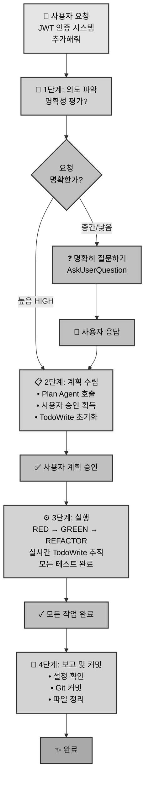
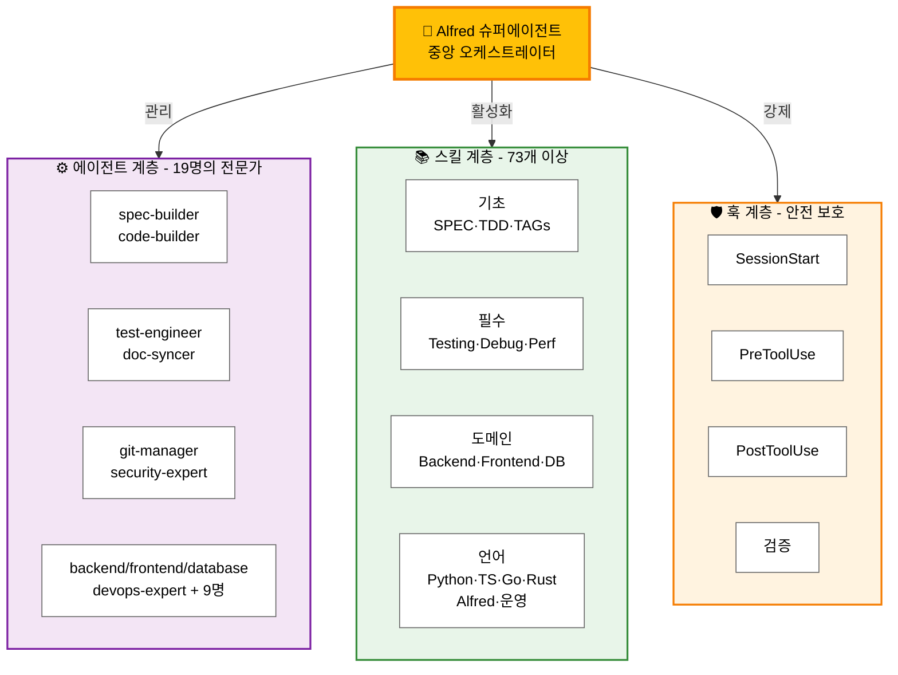

# MoAI-ADK: AI 기반 SPEC-First TDD 개발 프레임워크

[](https://pypi.org/project/moai-adk/)
[](https://opensource.org/licenses/MIT)
[](https://www.python.org/)
[](https://github.com/modu-ai/moai-adk/actions/workflows/moai-gitflow.yml)
[](https://codecov.io/gh/modu-ai/moai-adk)
[](https://github.com/modu-ai/moai-adk)

> **신뢰할 수 있고 유지보수하기 쉬운 소프트웨어를 AI의 도움으로 빌드하세요. 요구사항부터 문서화까지 완벽하게 동기화됩니다.**

MoAI-ADK (Agentic Development Kit)는 **SPEC-First 개발**, **테스트 주도 개발(TDD)**, 그리고 **AI 에이전트**를 결합한 오픈소스 프레임워크입니다. 요구사항부터 코드, 문서까지 모든 산출물이 자동으로 추적 가능하고, 테스트되며, 동기화됩니다.

---

## 🎯 우리가 해결하는 문제

### 기존 AI 기반 개발의 6가지 문제

| 문제 | 영향 |
|------|------|
| **모호한 요구사항** | 개발자가 40% 시간을 요구사항 명확화에 사용 |
| **부족한 테스트** | 테스트되지 않은 코드로 인한 프로덕션 버그 |
| **동기화되지 않는 문서** | 구현과 맞지 않는 문서 |
| **잃어버린 컨텍스트** | 팀원들 간 반복적인 설명 필요 |
| **불가능한 영향 분석** | 요구사항 변경 시 영향받는 코드 파악 불가 |
| **일관성 없는 품질** | 수동 QA로 인한 엣지 케이스 누락 |

### MoAI-ADK의 해결책

✅ **SPEC-First**: 코드 작성 전 명확한 요구사항 정의
✅ **보증된 테스트**: 자동 TDD를 통해 87.84%+ 테스트 커버리지 달성
✅ **살아있는 문서**: 자동 동기화되어 절대 떨어지지 않는 문서
✅ **지속적인 컨텍스트**: Alfred가 프로젝트 이력과 패턴을 기억
✅ **완전한 추적성**: `@TAG` 시스템으로 모든 산출물 연결
✅ **품질 자동화**: TRUST 5 원칙을 자동으로 강제

---

## ⚡ 핵심 기능

### 1. SPEC-First 개발
- **EARS 형식 명세서**: 구조화되고 명확한 요구사항
- **구현 전 명확화**: 비용이 큰 재작업 방지
- **자동 추적성**: 요구사항에서 코드, 테스트까지 연결

### 2. 자동화된 TDD 워크플로우
- **RED → GREEN → REFACTOR** 사이클 자동 관리
- **테스트 우선 보증**: 테스트 없는 코드는 없음
- **87.84%+ 커버리지**: 체계적 테스팅으로 달성

### 3. Alfred 슈퍼에이전트
- **19개의 전문 AI 에이전트** (spec-builder, code-builder, doc-syncer 등)
- **73개 이상의 프로덕션급 스킬** (모든 개발 영역 커버)
- **적응형 학습**: 프로젝트 패턴으로부터 자동 학습
- **스마트 컨텍스트 관리**: 프로젝트 구조와 의존성 이해

### 4. @TAG 시스템
모든 산출물을 연결하는 완전한 추적성 시스템:
```
@SPEC:AUTH-001 (요구사항)
    ↓
@TEST:AUTH-001 (테스트)
    ↓
@CODE:AUTH-001:SERVICE (구현)
    ↓
@DOC:AUTH-001 (문서)
```

### 5. 살아있는 문서
- **실시간 동기화**: 코드와 문서가 항상 일치
- **수동 업데이트 불필요**: 자동 생성
- **다중언어 지원**: Python, TypeScript, Go, Rust 등
- **자동 다이어그램 생성**: 코드 구조에서 자동 생성

### 6. 품질 보증
- **TRUST 5 원칙**: Test-first, Readable, Unified, Secured, Trackable
- **자동화된 품질 게이트** (린팅, 타입 체크, 보안 검사)
- **Pre-commit 검증**: 위반 사항 사전 차단
- **종합 리포팅**: 실행 가능한 메트릭

---

## 🚀 빠른 시작

### 설치

#### 권장: uv tool (CLI - 전역 접근)

```bash
# uv tool을 사용하여 moai-adk를 전역 명령어로 설치
uv tool install moai-adk

# 설치 확인
moai-adk --version

# 어디서나 새 프로젝트 초기화 가능
moai-adk init my-awesome-project
cd my-awesome-project
```

#### 대체: pip 사용

```bash
# 전통적인 pip 설치
pip install moai-adk

# 새 프로젝트 초기화
moai-adk init my-awesome-project
cd my-awesome-project
```

#### 최신 버전으로 업그레이드

```bash
# uv tool을 사용한 업데이트 (권장)
uv tool upgrade moai-adk

# 또는 재설치
uv tool install --force moai-adk
```

#### ⚠️ 중요: 설정 최적화

설치 또는 업그레이드 후 **반드시** 설정 최적화를 실행하여 프로젝트를 구성해야 합니다:

```bash
# 프로젝트 설정 최적화 및 환경 구성
/alfred:0-project
```

이 명령어는 프로젝트 메타데이터, 언어 설정, 개발 구성을 초기화합니다. 개발을 시작하기 전에 먼저 실행하세요!

### 5분 빠른 시작

```bash
# 0. 새 프로젝트 생성 및 초기화
moai-adk init my-awesome-project
cd my-awesome-project

# 1. 프로젝트 설정 최적화
/alfred:0-project

# 2. 기능에 대한 SPEC 작성
/alfred:1-plan "JWT를 사용한 사용자 인증 시스템"

# 3. 자동화된 TDD로 구현
/alfred:2-run AUTH-001

# 4. 문서 자동 동기화
/alfred:3-sync
```

완료! 이제 당신은 다음을 얻었습니다:
- ✅ 명확한 SPEC 문서
- ✅ 종합적인 테스트
- ✅ 구현 코드
- ✅ 업데이트된 문서
- ✅ @TAG 참조가 포함된 Git 히스토리

### 다음 단계

- 📖 **워크플로우 배우기**: [4단계 개발 프로세스](#alfred가-사용자-지시를-처리하는-방식---상세-워크플로우-분석)
- 🏗️ **아키텍처 이해하기**: [핵심 아키텍처](#️-핵심-아키텍처)
- 💡 **예제 보기**: [예제 프로젝트](https://adk.mo.ai.kr/examples)

---

## 🧠 Alfred가 사용자 지시를 처리하는 방식 - 상세 워크플로우 분석

Alfred는 4단계 워크플로우를 통해 개발 생명주기 전체를 체계적으로 관리합니다. Alfred가 사용자의 요청을 이해하고, 계획하고, 실행하고, 검증하는 방식을 살펴보겠습니다.

### 1단계: 지시 의도 파악

**목표**: 작업 시작 전 사용자 의도를 명확히 파악

**동작 방식:**
- Alfred는 요청의 명확성을 평가합니다:
  - **HIGH 명확성**: 기술 스택, 요구사항, 범위 모두 명시됨 → 2단계로 바로 진행
  - **MEDIUM/LOW 명확성**: 여러 해석이 가능함 → `AskUserQuestion`으로 명확히

**Alfred가 질문하는 경우:**
- 모호한 요청 (여러 해석 가능)
- 아키텍처 결정 필요
- 기술 스택 선택 필요
- 비즈니스/UX 결정 필요

**예시:**
```
사용자: "시스템에 인증 기능을 추가해줘"

Alfred의 분석:
- JWT, OAuth, 세션 기반 중 어느 것? (불명확)
- 인증 흐름은 어떻게? (불명확)
- 다중인증(MFA)이 필요한가? (불명확)

실행: AskUserQuestion으로 명확히 질문
```

### 2단계: 실행 계획 수립

**목표**: 사용자 승인을 받은 실행 전략 수립

**프로세스:**
1. **Plan Agent 필수 호출**: Alfred가 Plan agent를 호출하여:
   - 작업을 구조화된 단계로 분해
   - 작업 간 의존성 파악
   - 순차 실행 vs 병렬 실행 결정
   - 생성/수정/삭제할 파일 명시
   - 작업 규모 및 예상 범위 추정

2. **사용자 계획 승인**: Alfred가 AskUserQuestion으로 계획 제시:
   - 전체 파일 변경 목록을 미리 공개
   - 구현 방식을 명확히 설명
   - 위험 요소를 사전에 공개

3. **TodoWrite 초기화**: 승인된 계획 기반 작업 목록 생성:
   - 모든 작업 항목을 명시적으로 나열
   - 각 작업의 완료 기준을 명확히 정의

**SPEC-AUTH-001 예시 계획:**
```markdown
## SPEC-AUTH-001 계획

### 생성될 파일
- .moai/specs/SPEC-AUTH-001/spec.md
- .moai/specs/SPEC-AUTH-001/plan.md
- .moai/specs/SPEC-AUTH-001/acceptance.md

### 구현 단계
1. RED: JWT 인증 테스트 작성 (실패)
2. GREEN: JWT 토큰 서비스 최소 구현
3. REFACTOR: 에러 처리 및 보안 강화
4. SYNC: 문서 업데이트

### 위험 요소
- 써드파티 서비스 연동 지연
- 토큰 저장소 보안 고려사항
```

### 3단계: 작업 실행 (엄격한 TDD 준수)

**목표**: TDD 원칙 준수하며 투명하게 진행 상황 추적

**TDD 실행 사이클:**

**1. RED 단계** - 먼저 실패하는 테스트 작성
- 테스트 코드만 작성
- 테스트는 의도적으로 실패해야 함
- 구현 코드 변경 금지
- 진행 상황 추적: `TodoWrite: "RED: 테스트 작성" → in_progress`

**2. GREEN 단계** - 테스트를 통과하는 최소 코드 작성
- 테스트 통과에 필요한 최소 코드만 추가
- 과도한 기능 개발 금지
- 테스트 통과에 집중
- 진행 상황 추적: `TodoWrite: "GREEN: 최소 구현" → in_progress`

**3. REFACTOR 단계** - 코드 품질 개선
- 테스트 통과 유지하며 설계 개선
- 코드 중복 제거
- 가독성 및 유지보수성 향상
- 진행 상황 추적: `TodoWrite: "REFACTOR: 품질 개선" → in_progress`

**TodoWrite 규칙:**
- 각 작업: `content` (명령형), `activeForm` (현재진행형), `status` (pending/in_progress/completed)
- **정확히 ONE 작업만 in_progress** 상태 유지
- **실시간 업데이트 의무**: 작업 시작/완료 시 즉시 상태 변경
- **엄격한 완료 기준**: 모든 테스트 통과, 구현 완료, 에러 없을 때만 completed로 표시

**실행 중 금지 사항:**
- ❌ RED 단계 중 구현 코드 변경
- ❌ GREEN 단계 중 과도한 기능 개발
- ❌ TodoWrite 추적 없는 작업 실행
- ❌ 테스트 없는 코드 생성

**실제 사례 - Agent 모델 지시어 변경:**

*배경:* 사용자가 모든 agent의 모델 지시어를 `sonnet`에서 `inherit`로 변경 요청 (동적 모델 선택 활성화)

**계획 승인:**
- 26개 파일 변경 필요 (로컬 13개 + 템플릿 13개)
- 파일 명시적 식별: `implementation-planner.md`, `spec-builder.md` 등
- 위험 요소: develop 브랜치 merge 충돌 → `-X theirs` 전략으로 완화

**RED 단계:**
- 모든 agent 파일이 `model: inherit` 보유하는지 검증 테스트
- 템플릿 파일과 로컬 파일 일치 확인

**GREEN 단계:**
- 13개 로컬 agent 파일 업데이트: `model: sonnet` → `model: inherit`
- Python 스크립트로 13개 템플릿 파일 업데이트 (이식성)
- 다른 모델 지시어 변경 사항 없는지 확인

**REFACTOR 단계:**
- Agent 파일 일관성 검토
- 고아 변경사항 없는지 확인
- Pre-commit 훅 검증 통과 확인

**결과:**
- 26개 파일 모두 성공적으로 업데이트
- Pre-commit @TAG 검증 통과
- Feature 브랜치를 develop에 깔끔하게 merge

### 4단계: 보고 및 커밋

**목표**: 작업 기록 및 git 히스토리 생성 (필요에 따라)

**설정 준수 우선:**
- `.moai/config.json`의 `report_generation` 설정 확인
- `enabled: false` → 상태 리포트만 제공, 파일 생성 금지
- `enabled: true` AND 사용자 명시 요청 → 문서 파일 생성

**Git 커밋:**
- 모든 Git 작업은 git-manager 호출
- TDD 커밋 사이클 준수: RED → GREEN → REFACTOR
- 각 커밋 메시지는 워크플로우 단계와 목적 명시

**커밋 시퀀스 예시:**

```bash
# RED: 실패하는 테스트 작성
commit 1: "test: JWT 인증 통합 테스트 추가"

# GREEN: 최소 구현
commit 2: "feat: JWT 토큰 서비스 구현 (최소)"

# REFACTOR: 품질 개선
commit 3: "refactor: JWT 에러 처리 및 보안 강화"

# Develop으로 merge
commit 4: "merge: SPEC-AUTH-001을 develop으로 merge"
```

**프로젝트 정리:**
- 불필요한 임시 파일 삭제
- 과도한 백업 파일 제거
- 작업 공간을 깔끔하게 유지

---

### 워크플로우 시각화



---

### 핵심 의사결정 포인트

| 상황 | Alfred의 실행 | 결과 |
|------|--------------|------|
| 명확한 요청 | 2단계로 바로 진행 | 빠른 실행 |
| 모호한 요청 | 1단계에서 질문 | 정확한 이해 |
| 대규모 파일 변경 | Plan Agent가 모든 파일 식별 | 완전한 가시성 |
| GREEN 단계 테스트 실패 | REFACTOR 계속 → 조사 | 품질 유지 |
| 설정 충돌 | `.moai/config.json` 우선 확인 | 사용자 설정 존중 |

---

### 품질 검증

4 단계 모두 완료 후 Alfred가 검증:

✅ **지시 의도 파악**: 사용자 의도가 명확하고 승인되었는가?
✅ **계획 수립**: Plan Agent 계획이 수립되고 사용자가 승인했는가?
✅ **TDD 준수**: RED-GREEN-REFACTOR 사이클을 엄격히 따랐는가?
✅ **실시간 추적**: 모든 작업이 TodoWrite로 투명하게 추적되었는가?
✅ **설정 준수**: `.moai/config.json` 설정을 엄격히 따랐는가?
✅ **품질 보증**: 모든 테스트가 통과하고 코드 품질이 보증되었는가?
✅ **정리 완료**: 불필요한 파일이 삭제되고 프로젝트가 깔끔한가?

---

## 🏗️ 핵심 아키텍처

### 시스템 구성



### 주요 구성 요소

**Alfred 슈퍼에이전트**
- 19개의 전문 AI 에이전트 관리
- 프로젝트 패턴으로부터 적응형 학습
- 상황 인식 의사결정
- 투명한 진행 상황 추적

**전문 에이전트** (19개)
- **spec-builder**: EARS 형식의 요구사항 엔지니어링
- **code-builder**: TDD 기반 구현
- **test-engineer**: 종합적 테스트 커버리지
- **doc-syncer**: 문서 생성 및 동기화
- **git-manager**: 버전 관리 자동화
- **security-expert**: 보안 분석 및 준수
- **backend-expert**: 서버측 아키텍처
- **frontend-expert**: UI/컴포넌트 설계
- **database-expert**: 스키마 및 쿼리 최적화
- **devops-expert**: 배포 및 인프라
- **그 외 9개 영역 전문가...**

**Claude 스킬** (73개 이상)
6개 계층으로 조직:
- **기초**: 핵심 개발 패턴 (SPEC, TDD, TAGs)
- **필수**: 테스팅, 디버깅, 성능, 보안
- **도메인**: Backend, Frontend, Database, Mobile, ML, DevOps
- **언어**: Python, TypeScript, Go, Rust, PHP, Ruby 등
- **Alfred**: 워크플로우, 오케스트레이션, 의사결정 트리
- **운영**: 배포, 모니터링, 인시던트 대응

---

## 📊 통계 및 메트릭

| 항목 | 수치 |
|------|------|
| **테스트 커버리지** | 87.84%+ 보증 |
| **전문 에이전트** | 19명 팀 |
| **프로덕션급 스킬** | 73개 이상 |
| **지원 언어** | 12개 이상 (Python, TypeScript, Go, Rust, PHP, Ruby, Java, Kotlin, R, Bash, Shell) |
| **SPEC 패턴** | 5개 이상 EARS 형식 |
| **품질 게이트** | TRUST 5 + 추가 검사 |
| **Git 자동화** | 완전한 GitFlow 지원 |

---

## 💡 MoAI-ADK를 선택하는 이유

### 개인 개발자를 위해
- **컨텍스트 전환 감소**: Alfred가 전체 프로젝트 기억
- **코드 품질 향상**: 자동 TDD로 프로덕션 버그 방지
- **시간 절약**: 자동 문서화로 수동 업데이트 불필요
- **패턴 학습**: 코드베이스로부터 자동 학습

### 팀을 위해
- **통일된 표준**: TRUST 5 원칙을 팀 전체에 강제
- **투명한 워크플로우**: @TAG를 통한 완전한 감사 추적
- **협업**: 공유된 컨텍스트와 명확한 요구사항
- **온보딩**: 신입 팀원이 패턴을 즉시 이해

### 조직을 위해
- **규정 준수 준비**: 보안 및 감사 추적 내장
- **유지보수성**: 코드가 문서화되고, 테스트되며, 추적 가능
- **확장성**: 코드베이스와 함께 성장하는 패턴
- **투자 보호**: 완전한 추적성으로 기술 부채 방지

---

## 📚 문서 및 자료

| 자료 | 링크 |
|------|------|
| **온라인 문서** | [adk.mo.ai.kr](https://adk.mo.ai.kr) |
| **빠른 시작 가이드** | [설치 및 설정](https://adk.mo.ai.kr/getting-started) |
| **API 레퍼런스** | [명령어 및 스킬](https://adk.mo.ai.kr/api) |
| **예제 프로젝트** | [튜토리얼](https://adk.mo.ai.kr/examples) |
| **문제 해결** | [FAQ 및 도움말](https://adk.mo.ai.kr/troubleshooting) |
| **GitHub 저장소** | [modu-ai/moai-adk](https://github.com/modu-ai/moai-adk) |
| **이슈 추적** | [GitHub Issues](https://github.com/modu-ai/moai-adk/issues) |
| **커뮤니티** | [GitHub Discussions](https://github.com/modu-ai/moai-adk/discussions) |

---

## 🤝 기여하기

MoAI-ADK는 오픈소스 커뮤니티에 의해 유지보수됩니다. 기여를 환영합니다!

### 시작하기

```bash
# 저장소 클론
git clone https://github.com/modu-ai/moai-adk.git
cd moai-adk

# 개발 환경 설정
uv venv
source .venv/bin/activate
uv pip install -e ".[dev]"

# 테스트 실행
pytest

# 문서 빌드
cd docs && make html
```

### 개발 워크플로우

1. **Feature 브랜치 생성**: `git checkout -b feature/SPEC-XXX`
2. **SPEC-First TDD 준수**: `/alfred:0-project`, `/alfred:1-plan`, `/alfred:2-run`
3. **문서 동기화**: `/alfred:3-sync`
4. **PR 제출**: `develop` 브랜치를 대상으로

자세한 내용은 [CONTRIBUTING.md](CONTRIBUTING.md)를 참조하세요.

---

## 📋 라이선스

MIT 라이선스 - 자세한 내용은 [LICENSE](LICENSE)를 참조하세요.

**요약**: MoAI-ADK를 상업 및 개인 프로젝트에서 사용할 수 있습니다. 저작권 표시는 권장하지만 필수는 아닙니다.

---

## 🗺️ 프로젝트 상태 및 로드맵

**완료**:
- ✅ 핵심 SPEC-First 프레임워크
- ✅ RED-GREEN-REFACTOR 자동화
- ✅ 완전한 추적성을 위한 @TAG 시스템
- ✅ 19개의 전문 에이전트
- ✅ 73개 이상의 프로덕션급 스킬
- ✅ 다중언어 지원
- ✅ GitFlow와의 Git 통합
- ✅ Pre-commit 검증 훅
- ✅ MCP 서버 통합

**진행 중**:
- 🔄 향상된 AI 모델 선택 (Haiku/Sonnet 최적화)
- 🔄 확장된 문서 생성
- 🔄 성능 프로파일링 도구

**계획 중**:
- 📅 시각적 워크플로우 IDE 통합
- 📅 실시간 협업 기능
- 📅 확장된 보안 규정 준수 (SOC 2, ISO 27001)
- 📅 모바일 앱 지원
- 📅 엔터프라이즈 대시보드

---

## ❓ 자주 묻는 질문

### Q: MoAI-ADK 사용에 AI 크레딧이 필요한가요?
**A**: MoAI-ADK는 Claude Code 내에서 Claude 구독으로 사용 가능합니다. Claude Code 가입 시 기본으로 제공되는 Claude API 접근권이 포함되어 있습니다.

### Q: MoAI-ADK를 다른 AI 모델과 함께 사용할 수 있나요?
**A**: 현재 Claude 모델(Haiku, Sonnet, Opus)에 최적화되어 있습니다. 다른 모델과의 통합은 로드맵에 있습니다.

### Q: MoAI-ADK는 엔터프라이즈 사용에 적합한가요?
**A**: 네. SPEC-First TDD, 보안 규정 준수, 감사 추적으로 엔터프라이즈 개발에 이상적입니다. [엔터프라이즈 가이드](https://adk.mo.ai.kr/enterprise)를 참조하세요.

### Q: MoAI-ADK는 데이터 개인정보를 어떻게 처리하나요?
**A**: 코드는 Claude API로 전송됩니다. [개인정보 정책](https://adk.mo.ai.kr/privacy) 및 [보안 가이드](https://adk.mo.ai.kr/security)를 참조하세요.

### Q: MoAI-ADK에 기여할 수 있나요?
**A**: 물론이죠! [CONTRIBUTING.md](CONTRIBUTING.md)에서 가이드라인을 확인하세요.

---

## 📞 지원 및 커뮤니티

- **🐛 Issue Tracker**: 버그를 보고하고 기능을 요청하세요
- **📧 이메일**: support@mo.ai.kr
- **🌐 웹사이트**: [adk.mo.ai.kr](https://adk.mo.ai.kr)

---

## 🙏 감사의 말씀

MoAI-ADK는 AI 기반 개발, 테스트 주도 개발, 소프트웨어 엔지니어링 모범 사례에 대한 수년 간의 연구를 기반으로 합니다. 오픈소스 커뮤니티와 모든 기여자에게 감사합니다.

---

**❤️ MoAI 팀이 만들었습니다**

AI 도움으로 신뢰할 수 있고 유지보수하기 쉬운 소프트웨어를 빌드하세요. 오늘 시작하세요:

```bash
pip install moai-adk
moai-adk init my-project
```

[📖 전체 문서 읽기 →](https://adk.mo.ai.kr)
