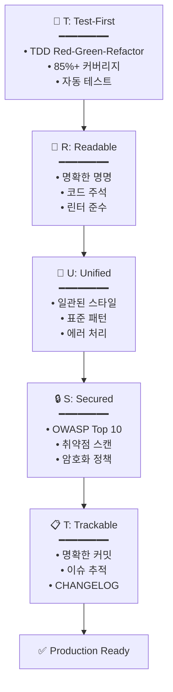

# 🗿 MoAI-ADK: Agentic AI 개발 프레임워크


**사용 가능한 언어:** [🇰🇷 한국어](./README.ko.md) | [🇺🇸 English](./README.md) | [🇯🇵 日本語](./README.ja.md) | [🇨🇳 中文](./README.zh.md)

[](https://pypi.org/project/moai-adk/)
[](./LICENSE)
[](https://www.python.org/)

> **"바이브 코딩의 목적은 빠른 생산성이 아니라 코드 품질이다."**

MoAI-ADK는 **품질 있는 코드를 만드는 AI 개발 환경**을 제공합니다. SPEC-First TDD, 테스트 주도 개발, 지속적 리팩토링과 20개 전문 AI 에이전트가 함께합니다.

---

## 🎁 MoAI-ADK 스폰서: z.ai GLM 4.7

**💎 비용 효율적인 AI 개발을 위한 최적 솔루션**

MoAI-ADK는 **z.ai GLM 4.7**과 파트너십을 통해 개발자들에게 경제적인 AI 개발 환경을 제공합니다.

### 🚀 GLM 4.7 특별 혜택

| 혜택                 | 설명                                           |
| -------------------- | ---------------------------------------------- |
| **💰 70% 비용 절감**  | Claude 대비 1/7 가격으로 동등한 성능           |
| **⚡ 빠른 응답 속도** | 최적화된 인프라로 저지연 응답 제공             |
| **🔄 호환성**         | Claude Code와 완벽 호환, 별도 코드 수정 불필요 |
| **📈 무제한 사용**    | 일간/주간 토큰 리밋 없이 자유롭게 사용         |

### 🎁 가입 특별 할인

**👉 [GLM 4.7 가입하기 (10% 추가 할인)](https://z.ai/subscribe?ic=1NDV03BGWU)**

이 링크를 통해 가입하면:

- ✅ **추가 10% 할인** 혜택
- ✅ **MoAI 오픈소스 개발**에 기여 (리워드 크레딧은 오픈소스 프로젝트에 사용됩니다)

### 💡 사용 가이드

```bash
# 1. GLM API 키 발급
위 링크에서 가입 후 API 키 발급

# 2. MoAI-ADK에 GLM 설정
moai glm YOUR_API_KEY
```

> **💡 팁**: Worktree 환경에서 GLM 4.7을 활용하면 Opus로 설계하고 GLM으로 대량 구현하여 비용을 최대 70% 절감할 수 있습니다.

---

## 🌟 핵심 가치

- **🎯 SPEC-First**: 명확한 명세서로 90% 재작업 감소
- **🔴 TDD 강제**: 85%+ 테스트 커버리지 자동 보장
- **🤖 AI 오케스트레이션**: 20개 전문 에이전트 + 48개 스킬
- **🌐 다국어 라우팅**: 한국어/영어/일본어/중국어 자동 지원
- **🌳 Worktree 병렬 개발**: 완전 격리 환경에서 무제한 병렬 작업
- **🏆 MoAI Rank**: 바이브 코딩 리더보드로 동기부여

---

> **📚 상세 내용은 공식 온라인 문서를 참고하세요:** [https://adk.mo.ai.kr](https://adk.mo.ai.kr)
>

## 1. 30초 설치

### 🚀 방법 1: 빠른 설치 (권장)

```bash
curl -LsSf https://modu-ai.github.io/moai-adk/install.sh | sh
```

### 🔧 방법 2: 수동 설치

```bash
# Step 1: uv 설치 (macOS/Linux)
curl -LsSf https://astral.sh/uv/install.sh | sh

# Step 2: MoAI-ADK 설치
uv tool install moai-adk
```

### 🎨 대화형 설정 마법사

`moai init` 명령어 실행 시 **9단계 대화형 마법사**가 시작됩니다:


---

#### Step 1: 언어 선택

대화 언어를 선택합니다. 이후 모든 안내가 선택한 언어로 표시됩니다.

```
🌐 Language Selection
❯ Select your conversation language: [↑↓] Navigate  [Enter] Select
❯ Korean (한국어)
  English
  Japanese (日本語)
  Chinese (中文)
```

---

#### Step 2: 이름 입력

사용자 이름을 입력합니다. AI가 개인화된 응답을 제공합니다.

```
👤 사용자 설정
❯ 사용자 이름을 입력하세요 (선택사항):
```

---

#### Step 3: GLM API 키 입력

Z.AI사의 GLM API 키를 입력합니다.

```
🔑 API 키 입력                                                                                  
GLM CodePlan API key (optional - press Enter to skip)                                           
                                                                                                
✓ 기존 GLM API 키를 찾았습니다: 99c1a2df...                                                     
Enter를 누르면 기존 키 유지, 새 키를 입력하면 교체됩니다                                        
                                                                                                
? GLM API 키를 입력하세요: 
```

> 🎁 **GLM 가입 혜택**: GLM 계정이 없다면 아래 링크로 가입하세요!
>
> **👉 [GLM 가입하기 (10% 추가 할인)](https://z.ai/subscribe?ic=1NDV03BGWU)**
>
> 이 링크를 통해 가입하면 **추가 10% 할인** 혜택을 받을 수 있습니다.
> 또한 링크를 통한 가입 시 발생하는 리워드는 **MoAI 오픈소스 개발**에 사용됩니다. 🙏

---

#### Step 4: 프로젝트 설정

프로젝트 이름을 입력합니다.

```
📁 프로젝트 설정
❯ 프로젝트 이름: MoAI-ADK
```

---

#### Step 5: Git 설정

Git 모드를 선택합니다.

```
🔀 Git 설정
❯ Git 모드를 선택하세요: [↑↓] Navigate  [Enter] Select
❯ manual (로컬만) - 로컬 저장소만 사용
  personal (GitHub 개인) - GitHub 개인 계정 사용
  team (GitHub 팀) - GitHub 팀/조직 사용
```

---

#### Step 6: GitHub 사용자명

personal/team 선택 시 GitHub 사용자명을 입력합니다.

```
❯ GitHub 사용자명:
```

---

#### Step 7: 커밋 메시지 언어

Git 커밋 메시지에 사용할 언어를 선택합니다.

```
🗣️ 출력 언어 설정
❯ 커밋 메시지 언어: [↑↓] Navigate  [Enter] Select
  English
❯ Korean (한국어)
  Japanese (日本語)
  Chinese (中文)
```

---

#### Step 8: 코드 주석 언어

코드 주석에 사용할 언어를 선택합니다.

```
❯ 코드 주석 언어: [↑↓] Navigate  [Enter] Select
  English
❯ Korean (한국어)
  Japanese (日本語)
  Chinese (中文)
```

---

#### Step 9: 문서 언어

문서에 사용할 언어를 선택합니다.

```
❯ 문서 언어: [↑↓] Navigate  [Enter] Select
  English
❯ Korean (한국어)
  Japanese (日本語)
  Chinese (中文)
```

> 💡 **토큰 최적화 전략**: 에이전트에게 지시하는 내부 프롬프트는 **영어로 고정**되어 있습니다.
>
> **이유**: 비영어권 언어는 Claude에서 **12%~20% 토큰을 추가 소모**합니다. 무한 반복 에이전트 작업이 많아지면 비용과 주간 토큰 리밋에 큰 영향을 주기 때문에, MoAI는 내부 에이전트 지시는 영어로 고정하고 **일반 대화만 사용자 언어로 제공**합니다.
>
> 이것이 MoAI의 **토큰 낭비를 줄이기 위한 노력**입니다.

---

#### 설치 완료

모든 설정이 완료되면 5단계 설치가 자동 진행됩니다:

```
🚀 Starting installation...

Phase 1: Preparation and backup...        ████████████████ 100%
Phase 2: Creating directory structure...  ████████████████ 100%
Phase 3: Installing resources...          ████████████████ 100%
Phase 4: Generating configurations...     ████████████████ 100%
Phase 5: Validation and finalization...   ████████████████ 100%

✅ Initialization Completed Successfully!
────────────────────────────────────────────────────────────────

📊 Summary:
  📁 Location:   /path/to/my-project
  🌐 Language:   Auto-detect (use /moai:0-project)
  🔀 Git:        manual (github-flow, branch: manual)
  🌍 Locale:     ko
  📄 Files:      47 created
  ⏱️  Duration:   1234ms

🚀 Next Steps:
  1. Run cd my-project to enter the project
  2. Run /moai:0-project in Claude Code for full setup
  3. Start developing with MoAI-ADK!
```

### 기존 프로젝트에 추가

```bash
cd your-existing-project
moai init .
# 기존 파일은 그대로 유지됩니다
```

---

### 🔄 MoAI-ADK 업데이트

기존 프로젝트를 최신 버전으로 업데이트합니다.

```bash
moai update
```

**3단계 스마트 업데이트 워크플로우**:

```
Stage 1: 📦 패키지 버전 확인
         └─ PyPI에서 최신 버전 확인 → 필요시 자동 업그레이드

Stage 2: 🔍 Config 버전 비교
         └─ 패키지 템플릿 vs 프로젝트 설정 비교
         └─ 동일하면 스킵 (70-80% 성능 향상)

Stage 3: 📄 템플릿 동기화
         └─ 백업 생성 → 템플릿 업데이트 → 사용자 설정 복원
```

**주요 옵션**:

```bash
# 버전만 확인 (업데이트 없음)
moai update --check

# 템플릿만 동기화 (패키지 업그레이드 스킵)
moai update --templates-only

# 설정 편집 모드 (init 마법사 재실행)
moai update --config
moai update -c

# 백업 없이 강제 업데이트
moai update --force

# All is well~  자동 모드 (모든 확인 자동 승인)
moai update --yes
```

**머지 전략 선택**:

```
🔀 Choose merge strategy:
  [1] Auto-merge (default)
      → 템플릿 + 사용자 변경 사항 자동 보존
  [2] Manual merge
      → 백업 + 머지 가이드 생성 (직접 제어)
```

```bash
# Auto-merge 강제 (기본값)
moai update --merge

# Manual merge 강제
moai update --manual
```

**자동 보존되는 항목**:

| 항목                | 설명                                          |
| ------------------- | --------------------------------------------- |
| **사용자 설정**     | `.claude/settings.local.json` (MCP, GLM 설정) |
| **커스텀 에이전트** | 템플릿에 없는 사용자 생성 에이전트            |
| **커스텀 명령어**   | 사용자 정의 슬래시 명령어                     |
| **커스텀 스킬**     | 사용자 정의 스킬                              |
| **커스텀 훅**       | 사용자 정의 훅 스크립트                       |
| **SPEC 문서**       | `.moai/specs/` 폴더 전체                      |
| **리포트**          | `.moai/reports/` 폴더 전체                    |

> 💡 **업데이트 팁**: `moai update -c`로 언제든 언어, API 키, Git 설정을 변경할 수 있습니다.
> 사용자의 명령어, 에이전트, 스킬, 훅은 moai 이외의 폴더에 생성해서 사용 하시면 좋습니다.

---

## 2. 프로젝트 문서 생성 (선택 사항)

신규 프로젝트나 기존 프로젝트에서 **Claude Code가 프로젝트를 이해하는 데 도움**이 되는 프로젝 문서를 자동 생성할 수 있습니다:

```
> /moai:0-project
```

### 생성되는 3개 파일

| 파일                         | 목적          | 주요 내용                                                  |
| ---------------------------- | ------------- | ---------------------------------------------------------- |
| `.moai/project/product.md`   | **제품 개요** | 프로젝트 이름/설명, 타겟 사용자, 핵심 기능, 사용 사례      |
| `.moai/project/structure.md` | **구조 분석** | 디렉토리 트리, 주요 폴더 목적, 핵심 파일 위치, 모듈 구성   |
| `.moai/project/tech.md`      | **기술 스택** | 사용 기술, 프레임워크 선택 이유, 개발 환경, 빌드/배포 설정 |

### 왜 필요한가요?

- **컨텍스트 제공**: Claude Code가 프로젝트 맥락을 빠르게 파악
- **일관성 유지**: 팀원 간 프로젝트 이해도 공유
- **온보딩 가속화**: 새 개발자의 프로젝트 파악 시간 단축
- **AI 협업 최적화**: 더 정확한 코드 제안과 리뷰 가능

> 💡 **팁**: 프로젝트 초기 또는 구조 변경 시 `/moai:0-project`를 실행하면 최신 상태로 문서가 갱신됩니다.

---

## 3. 핵심 명령어 모음

### 🎯 `/moai:0-project` - 프로젝트 초기화

```bash
> /moai:0-project
```

프로젝트의 현재 상태를 자동으로 분석하여 최적의 개발 환경을 구성합니다. 프로그래밍 언어와 프레임워크를 감지하고, Git 워크플로우와 품질 보증 기준을 자동으로 설정합니다. 모든 구성이 완료되면 즉시 개발을 시작할 수 있는 준비 상태가 됩니다.

**작업 내용**:

- ✅ 프로젝트 구조 분석
- ✅ 프로그래밍 언어/프레임워크 감지
- ✅ `.moai/config/config.yaml` 생성
- ✅ Git 워크플로우 설정
- ✅ 세션 메모리 시스템 구성
- ✅ 품질 보증 기준 설정

---

### 📋 `/moai:1-plan` - SPEC 작성

```bash
> /moai:1-plan "기능 설명"
```

EARS 형식을 사용하여 모호함 없는 명세서를 자동으로 생성합니다. 요구사항 정의, 성공 기준, 테스트 시나리오를 포함하여 개발 방향을 명확히 제시합니다. 생성된 SPEC은 개발팀과 AI가 동일한 이해를 공유하는 단일 출처(Source of Truth)로 작동합니다.

**자동 생성**:

- EARS 형식 명세서
- 요구사항 정의
- 성공 기준
- 테스트 시나리오

**예시**:

```bash
> /moai:1-plan "사용자 프로필 페이지"
# → SPEC-002 생성

> /moai:1-plan "결제 API"
# → SPEC-003 생성
```

**중요**: 반드시 다음에 `> /clear` 실행

---

### 💻 `/moai:2-run` - TDD 구현

```bash
> /moai:2-run SPEC-001
```

Red-Green-Refactor 사이클을 통해 테스트 먼저 작성하고, 이를 통과하는 코드를 구현합니다. 모든 구현은 85% 이상의 테스트 커버리지와 린팅, 타입 검사, 보안 검사를 통과해야 합니다. TRUST 5 품질 원칙을 자동으로 검증하여 안정적인 코드만 커밋됩니다.

**자동 실행**:

- 🔴 테스트 먼저 작성 (Red)
- 🟢 테스트 통과 코드 (Green)
- 🔵 리팩토링 (Refactor)
- ✅ TRUST 5 검증

**검증 항목**:

- 테스트 커버리지 >= 85%
- 린팅 통과
- 타입 검사 통과
- 보안 검사 통과

---

### 📚 `/moai:3-sync` - 문서 동기화

```bash
> /moai:3-sync SPEC-001
```

품질 검증을 시작으로 문서 동기화, Git 커밋, PR 자동화를 수행합니다. API 문서, 아키텍처 다이어그램, README, CHANGELOG를 자동으로 생성하고 최신 상태로 유지합니다. 변경사항을 자동으로 커밋하고 팀 모드에서는 PR을 Draft에서 Ready로 전환합니다.

**자동 실행되는 작업**:

1. **Phase 1: 품질 검증**
   - 테스트 실행 (pytest, jest, go test 등)
   - 린터 검사 (ruff, eslint, golangci-lint 등)
   - 타입 체커 (mypy, tsc, go vet 등)
   - 코드 리뷰 (manager-quality)

2. **Phase 2-3: 문서 동기화**
   - API 문서 자동 생성
   - 아키텍처 다이어그램 업데이트
   - README 업데이트
   - SPEC 문서 동기화

3. **Phase 4: Git 자동화**
   - 변경사항 커밋
   - PR Draft → Ready 전환
   - (선택) Auto-merge

**실행 모드**:

- `auto` (기본): 변경된 파일만 선택 동기화
- `force`: 전체 문서 재생성
- `status`: 상태 확인만 수행
- `project`: 프로젝트 전체 동기화

**자세한 내용**: 명령 파일 참조

---

### 🚀 `/moai:alfred` - 완전 자율 자동화

```bash
> /moai:alfred "기능 설명"
```

사용자가 목표를 제시하면 AI가 스스로 탐색, 계획, 구현, 검증을 모두 수행합니다. 병렬 탐색으로 코드베이스를 분석하고, 자율 루프를 통해 이슈를 스스로 수정합니다. 완료 마커(`<promise>DONE</promise>`)를 감지하면 자동으로 종료되어 개발자는 최종 결과만 확인하면 됩니다.

**한 번에 실행**:

1. **Phase 0**: 병렬 탐색 (Explore + Research + Quality)
2. **Phase 1**: SPEC 생성 (EARS 형식)
3. **Phase 2**: TDD 구현 (자율 루프)
4. **Phase 3**: 문서 동기화

**옵션**:

- `--loop`: 자율 반복 수정 활성화 (AI가 스스로 이슈 해결)
- `--max N`: 최대 반복 횟수 지정 (기본값: 100)
- `--parallel`: 병렬 탐색 활성화 (더 빠른 분석)
- `--branch`: 기능 브랜치 자동 생성
- `--pr`: 완료 후 Pull Request 생성
- `--resume SPEC`: 이어서 하기

**예시**:

```bash
# 기본 자율 실행
> /moai:alfred "JWT 인증 추가"

# 자동 루프 + 병렬 탐색
> /moai:alfred "JWT 인증" --loop --parallel

# 이어서 하기
> /moai:alfred resume SPEC-AUTH-001
```

---

### 🔁 `/moai:loop` - 자율 반복 수정

```bash
> /moai:loop
```

AI가 스스로 LSP 오류, 테스트 실패, 커버리지 부족을 진단하고 수정을 반복합니다. 병렬 진단으로 LSP, AST-grep, Tests, Coverage를 동시에 실행하여 3-4배 빠르게 이슈를 해결합니다. 완료 마커를 감지하거나 최대 반복 횟수에 도달할 때까지 자율적으로 실행됩니다.

**자율 루프 흐름**:

```text
병렬 진단 → TODO 생성 → 수정 실행 → 검증 → 반복
    ↓
완료 마커 감지 → <promise>DONE</promise>
```

**옵션**:

- `--max N`: 최대 반복 횟수 (기본값: 100)
- `--auto`: 자동 수정 활성화 (Level 1-3)
- `--parallel`: 병렬 진단 실행 (권장)
- `--errors`: 에러만 수정
- `--coverage`: 커버리지 포함 (85% 목표)
- `--resume ID`: 스냅샷 복구

**예시**:

```bash
# 기본 자율 루프
> /moai:loop

# 병렬 + 자동 수정
> /moai:loop --parallel --auto

# 최대 50회 반복
> /moai:loop --max 50

# 스냅샷 복구
> /moai:loop --resume latest
```

---

### 🔧 `/moai:fix` - 단발 자동 수정

```bash
> /moai:fix
```

LSP 오류, linting 이슈를 병렬로 스캔하고 한 번에 수정합니다. Level 1-2는 즉시 수정하고, Level 3은 사용자 승인 후 수정하며, Level 4는 수동 수정이 필요하다고 보고합니다. `--dry` 옵션으로 미리보기를 확인 후 실제 수정을 적용할 수 있습니다.

**병렬 스캔**:

```text
LSP ├─┐
    ├─→ 통합 결과 (3.75배 빠름)
AST ├─┤
    ├─┘
Linter
```

**수정 레벨**:

| Level | 설명      | 승인   | 예시                 |
| ----- | --------- | ------ | -------------------- |
| 1     | 즉시 수정 | 불필요 | import 정렬, 공백    |
| 2     | 안전 수정 | 로그만 | 변수 이름, 타입 추가 |
| 3     | 승인 필요 | 필요   | 로직 변경, API 수정  |
| 4     | 수동 필요 | 불가능 | 보안, 아키텍처       |

**옵션**:

- `--dry`: 미리보기만 (실제 수정 없음)
- `--parallel`: 병렬 스캔 (권장)
- `--level N`: 최대 수정 레벨 (기본값: 3)
- `--errors`: 에러만 수정
- `--security`: 보안 검사 포함
- `--no-fmt`: 포맷팅 스킵

**예시**:

```bash
# 기본 수정
> /moai:fix

# 병렬 스캔
> /moai:fix --parallel

# 미리보기
> /moai:fix --dry

# 특정 파일
> /moai:fix src/auth.py
```

---

### ⏹️ `/moai:cancel-loop` - 루프 취소

```bash
> /moai:cancel-loop
```

실행 중인 자율 루프를 안전하게 취소하고 모든 진행 상태를 스냅샷으로 저장합니다. 취소 시 TODO 상태, 수정 내역, 반복 횟수가 모두 보존되어 나중에 이어서 계속할 수 있습니다. `--list` 옵션으로 이전 스냅샷을 확인하고 특정 시점으로 복구할 수 있습니다.

**옵션**:

- `--force`: 확인 없이 취소
- `--snapshot`: 스냅샷 저장
- `--keep`: state 파일 보존
- `--reason TEXT`: 취소 사유 기록
- `--list`: 스냅샷 목록 확인

**복구**:

```bash
# 최신 스냅샷 복구
> /moai:loop --resume latest

# 특정 스냅샷 복구
> /moai:loop --resume cancel-20240111-105230
```

**예시**:

```bash
# 기본 취소 (확인 후)
> /moai:cancel-loop

# 강제 취소
> /moai:cancel-loop --force

# 스냅샷 저장
> /moai:cancel-loop --snapshot

# 스냅샷 목록
> /moai:cancel-loop --list
```

**실제 출력 결과**:

```

⏺ ✅ 루프 취소 완료

  상태 보고

  ═══════════════════════════════════════════════════════
           Loop: Cancelled (No Active Loop)
  ═══════════════════════════════════════════════════════

  ### Status
  - 실행 중인 루프: 없음
  - 완료된 작업: 100%
  - 남은 TODO: 0개

  ### Completed Tasks
  ✅ README.ko.md "3. 핵심 명령어 모음" 섹션 업데이트
  ✅ Fenced code blocks 언어 지정 추가 (MD040) - 9건
  ✅ Emphasis → Heading 변경 (MD036) - 2건
  ✅ Table column style 수정 (MD060) - 2건

  ### Changes Summary
  - 명령어 개수: 4개 → 8개 (loop, fix, cancel-loop 추가)
  - 설명 스타일: 간단 목록 → 3문장 이상 상세 설명
  - Markdown linting: 13건 이슈 → 0건

  ═══════════════════════════════════════════════════════

  최종 파일 상태

  README.ko.md:
  - 모든 markdown linting 이슈 해결
  - 8개 핵심 명령어 상세 설명 완료
  - 표준 markdown 형식 준수

  ---
  모든 작업이 성공적으로 완료되었습니다! 🎉
```


---

## 4. Mr.Alfred와 Sub-Agents

### 🎩 Mr.Alfred - Super Agent (수석 오케스트레이터)

**역할**: 사용자 요청을 분석하고 적절한 전문 에이전트에게 위임

**작업 흐름**:

1. **Understand**: 요청 분석 및 명확화
2. **Plan**: Plan 에이전트를 통한 실행 계획 수립
3. **Execute**: 전문 에이전트에게 작업 위임 (순차/병렬)
4. **Integrate**: 결과 통합 및 사용자 보고

### 🌐 다국어 자동 라우팅 (NEW)

Alfred는 4개 언어 요청을 자동으로 인식하고 올바른 에이전트를 호출합니다:

| 요청 언어 | 예시                        | 호출 에이전트  |
| --------- | --------------------------- | -------------- |
| 영어      | "Design backend API"        | expert-backend |
| 한국어    | "백엔드 API 설계해줘"       | expert-backend |
| 일본어    | "バックエンドAPIを設計して" | expert-backend |
| 중국어    | "设计后端API"               | expert-backend |

---

### 🔧 Tier 1: 도메인 전문가 (8개)

| 에이전트               | 전문 분야                | 사용 예시              |
| ---------------------- | ------------------------ | ---------------------- |
| **expert-backend**     | FastAPI, Django, DB 설계 | API 설계, 쿼리 최적화  |
| **expert-frontend**    | React, Vue, Next.js      | UI 컴포넌트, 상태 관리 |
| **expert-security**    | 보안 분석, OWASP         | 보안 감사, 취약점 분석 |
| **expert-devops**      | Docker, K8s, CI/CD       | 배포 자동화, 인프라    |
| **expert-debug**       | 버그 분석, 성능          | 문제 진단, 병목 해결   |
| **expert-performance** | 프로파일링, 최적화       | 응답 시간 개선         |
| **expert-refactoring** | 코드 리팩토링, AST-Grep  | 대규모 코드 변환       |
| **expert-testing**     | 테스트 전략, E2E         | 테스트 계획, 커버리지  |

---

### 🎯 Tier 2: 워크플로우 관리자 (8개)

| 에이전트                | 역할             | 자동 호출 시점    |
| ----------------------- | ---------------- | ----------------- |
| **manager-spec**        | SPEC 작성 (EARS) | `/moai:1-plan`    |
| **manager-tdd**         | TDD 자동 실행    | `/moai:2-run`     |
| **manager-docs**        | 문서 자동 생성   | `/moai:3-sync`    |
| **manager-quality**     | TRUST 5 검증     | 구현 완료 후      |
| **manager-strategy**    | 실행 전략 수립   | 복잡한 기획 시    |
| **manager-project**     | 프로젝트 초기화  | `/moai:0-project` |
| **manager-git**         | Git 워크플로우   | 브랜치/PR 관리    |
| **manager-claude-code** | Claude Code 통합 | 설정 최적화       |

---

### 🏗️ Tier 3: Claude Code Builder (4개)

| 에이전트            | 역할             | 사용 예시            |
| ------------------- | ---------------- | -------------------- |
| **builder-agent**   | 새 에이전트 생성 | 조직 전문가 에이전트 |
| **builder-skill**   | 새 스킬 생성     | 팀 전용 스킬 모듈    |
| **builder-command** | 새 명령어 생성   | 커스텀 워크플로우    |
| **builder-plugin**  | 플러그인 생성    | 배포용 플러그인      |

---

## 5. Agent-Skills

### 📚 스킬 라이브러리 구조

```text
🏗️ Foundation (5)    → 핵심 철학, 실행 규칙
🎯 Domain (4)        → 도메인 전문 지식
💻 Language (16)     → 16개 프로그래밍 언어
🚀 Platform (10)     → 클라우드/BaaS 통합
📋 Workflow (7)      → 자동화 워크플로우
📚 Library (4)       → 특수 라이브러리
🛠️ Tool (2)          → 개발 도구
```

### 자주 쓰는 스킬 조합

| 목적              | 스킬 조합                                                                |
| ----------------- | ------------------------------------------------------------------------ |
| **백엔드 API**    | `moai-lang-python` + `moai-domain-backend` + `moai-platform-supabase`    |
| **프론트엔드 UI** | `moai-lang-typescript` + `moai-domain-frontend` + `moai-library-shadcn`  |
| **문서 생성**     | `moai-library-nextra` + `moai-workflow-docs` + `moai-library-mermaid`    |
| **테스트**        | `moai-lang-python` + `moai-workflow-testing` + `moai-foundation-quality` |

### 스킬 사용법

```python
# 방법 1: 직접 호출 (Agent)
Skill("moai-lang-python")

# 방법 2: Alfred 자동 선택 (일반 사용자)
"FastAPI 서버 만들어줘"
→ Alfred가 자동으로 moai-lang-python 선택
```

---

## 5. TRUST 5 품질 원칙

MoAI-ADK의 모든 프로젝트는 **TRUST 5** 품질 프레임워크를 따릅니다.

### 🏆 TRUST 5 = Test + Readable + Unified + Secured + Trackable



### T - Test-First (테스트 우선)

**원칙**: 모든 구현은 테스트부터 시작

**검증**:

- 테스트 커버리지 >= 85%
- 실패하는 테스트 먼저 작성 (Red)
- 테스트 통과 코드 (Green)
- 리팩토링 (Refactor)

### R - Readable (가독성)

**원칙**: 코드는 명확하고 이해하기 쉬워야 함

**검증**:

- 명확한 변수명
- 복잡한 로직에 주석
- 코드 리뷰 통과
- 린터 검사 통과

### U - Unified (통일성)

**원칙**: 프로젝트 전체에 일관된 스타일 유지

**검증**:

- 프로젝트 스타일 가이드 준수
- 일관된 명명 규칙
- 통일된 에러 처리
- 표준 문서 형식

### S - Secured (보안)

**원칙**: 모든 코드는 보안 검사 통과

**검증**:

- OWASP Top 10 체크
- 의존성 취약점 스캔
- 암호화 정책 준수
- 접근 제어 검증

### T - Trackable (추적 가능성)

**원칙**: 모든 변경은 명확하게 추적 가능

**검증**:

- 명확한 커밋 메시지
- 이슈 추적 (GitHub Issues)
- CHANGELOG 유지
- 코드 리뷰 기록

---

## 6. 자동 품질 검사

### 🔍 AST-Grep 기반 구조적 검사

**AST-Grep**는 텍스트가 아닌 **코드 구조**를 분석합니다:

| 기능              | 설명             | 예시                                  |
| ----------------- | ---------------- | ------------------------------------- |
| **구조적 검색**   | AST 패턴 매칭    | 파라미터화되지 않은 SQL 쿼리 찾기     |
| **보안 스캔**     | 자동 취약점 탐지 | SQL Injection, XSS, 하드코딩된 비밀키 |
| **패턴 리팩토링** | 안전한 코드 변환 | 변수명 일괄 변경, 함수 추출           |
| **다국어 지원**   | 40+ 언어         | Python, TypeScript, Go, Rust...       |

### 자동 검사 흐름

```text
코드 작성
    ↓
[Hook] AST-Grep 자동 스캔
    ↓
⚠️  취약점 발견시 즉시 알림
    ↓
✅ 안전한 코드로 리팩토링
```

**검출 예시**:

```bash
⚠️  AST-Grep: Potential SQL injection in src/auth.py:47
   Pattern: execute(f"SELECT * FROM users WHERE id={user_id}")
   Suggestion: execute("SELECT * FROM users WHERE id=%s", (user_id,))
```

---

## 7. 🌳 Worktree 병렬 개발

MoAI-ADK의 핵심 혁신: **Worktree로 완전 격리, 무제한 병렬 개발**

### 💡 왜 Worktree인가?

**문제점**: `moai glm`/`moai cc`로 LLM을 변경하면 **모든 열려있는 세션**에 적용됩니다. 동일 세션에서 모델을 변경하면 인증 오류로 이어서 진행이 어렵습니다.

**해결책**: Git Worktree로 각 SPEC을 완전히 격리하여 독립적인 LLM 설정 유지

---

### 📦 Worktree 워크플로우

```text
┌─────────────────────────────────────────────────────────────────┐
│  터미널 1 (Claude Opus) - SPEC 설계 전용                        │
│  ━━━━━━━━━━━━━━━━━━━━━━━━━━━━━━━━━━━━━━━━━━━━━━━━━━━━━━━━━━━━━  │
│  $ cd my-project                                                │
│  $ claude                                                        │
│                                                                  │
│  > /moai:1-plan "사용자 인증 시스템" --worktree                   │
│  ✅ SPEC-AUTH-001 생성 완료                                      │
│  ✅ Worktree 생성: ~/moai/worktrees/my-project/SPEC-AUTH-001     │
│  ✅ Branch: feature/SPEC-AUTH-001                                │
│                                                                  │
│  > /moai:1-plan "결제 시스템" --worktree                          │
│  ✅ SPEC-PAY-002 생성 완료                                       │
│  ✅ Worktree 생성: ~/moai/worktrees/my-project/SPEC-PAY-002      │
│                                                                  │
│  > /moai:1-plan "대시보드 UI" --worktree                         │
│  ✅ SPEC-UI-003 생성 완료                                        │
│  ✅ Worktree 생성: ~/moai/worktrees/my-project/SPEC-UI-003       │
│                                                                  │
│  💡 Opus로 모든 SPEC 계획 완료 (세션 유지 중...)                  │
└─────────────────────────────────────────────────────────────────┘

┌─────────────────────────────────────────────────────────────────┐
│  터미널 2 - SPEC-AUTH-001 Worktree (GLM 4.7)                    │
│  ━━━━━━━━━━━━━━━━━━━━━━━━━━━━━━━━━━━━━━━━━━━━━━━━━━━━━━━━━━━━━  │
│  $ moai-worktree go SPEC-AUTH-001                                │
│  # 또는 단축어: moai-wt go SPEC-AUTH-001                          │
│                                                                  │
│  📁 현재 위치: ~/moai/worktrees/my-project/SPEC-AUTH-001        │
│  🔀 Branch: feature/SPEC-AUTH-001                                │
│                                                                  │
│  $ moai glm                                                       │
│  ✅ Switched to GLM backend                                      │
│                                                                  │
│  $ claude                                                        │
│  > /moai:2-run SPEC-AUTH-001                                     │
│  🔄 TDD 실행 중... (Red → Green → Refactor)                       │
│  ✅ 구현 완료!                                                   │
│  ✅ 테스트 통과 (Coverage: 92%)                                  │
│                                                                  │
│  > /moai:3-sync SPEC-AUTH-001                                    │
│  ✅ 문서 동기화 완료                                             │
│                                                                  │
│  # 완료 후 병합                                                   │
│  $ git checkout main                                             │
│  $ git merge feature/SPEC-AUTH-001                               │
│  $ moai-worktree clean --merged-only                             │
└─────────────────────────────────────────────────────────────────┘

┌─────────────────────────────────────────────────────────────────┐
│  터미널 3 - SPEC-PAY-002 Worktree (GLM 4.7)                     │
│  ━━━━━━━━━━━━━━━━━━━━━━━━━━━━━━━━━━━━━━━━━━━━━━━━━━━━━━━━━━━━━  │
│  $ moai-wt go SPEC-PAY-002                                       │
│  $ moai glm                                                       │
│  $ claude                                                        │
│                                                                  │
│  > /moai:alfred SPEC-PAY-002                                     │
│  🔄 Plan → Run → Sync 자동 실행                                  │
│  ✅ 완료!                                                        │
│                                                                  │
│  $ git checkout main && git merge feature/SPEC-PAY-002           │
└─────────────────────────────────────────────────────────────────┘

┌─────────────────────────────────────────────────────────────────┐
│  터미널 4 - SPEC-UI-003 Worktree (GLM 4.7)                      │
│  ━━━━━━━━━━━━━━━━━━━━━━━━━━━━━━━━━━━━━━━━━━━━━━━━━━━━━━━━━━━━━  │
│  $ moai-wt go SPEC-UI-003                                        │
│  $ moai glm                                                       │
│  $ claude                                                        │
│  > /moai:alfred SPEC-UI-003                                      │
│  ✅ 완료!                                                        │
└─────────────────────────────────────────────────────────────────┘
```

---

### 🎯 핵심 워크플로우

#### Phase 1: Claude 4.5 Opus로 계획 (터미널 1)

```bash
/moai:1-plan "기능 설명" --worktree
```

- ✅ SPEC 문서 생성
- ✅ Worktree 자동 생성
- ✅ 기능 브랜치 자동 생성

#### Phase 2: GLM 4.7으로 구현 (터미널 2, 3, 4...)

```bash
moai-wt go SPEC-ID
moai glm
claude
> /moai:2-run SPEC-ID
> /moai:3-sync SPEC-ID
```

- ✅ 독립된 작업 환경
- ✅ GLM 비용 효율
- ✅ 충돌 없는 병렬 개발

**Phase 3: 병합 및 정리**

```bash
git checkout main
git merge feature/SPEC-ID
moai-wt clean --merged-only
```

---

### ✨ Worktree 장점

| 장점            | 설명                                      |
| --------------- | ----------------------------------------- |
| **완전 격리**   | 각 SPEC이 독립된 Git 상태, 파일 충돌 없음 |
| **LLM 독립**    | 각 Worktree에서 별도 LLM 설정 가능        |
| **무제한 병렬** | 의존성없이 무제한 SPEC 병렬 개발          |
| **안전 병합**   | 완료된 SPEC만 순차적으로 main에 병합      |

---

### 📊 Worktree 명령어

| 명령어                   | 설명                             | 사용 예시                      |
| ------------------------ | -------------------------------- | ------------------------------ |
| `moai-wt new SPEC-ID`    | 새 Worktree 생성                 | `moai-wt new SPEC-AUTH-001`    |
| `moai-wt go SPEC-ID`     | Worktree 진입 (새 셸 열기)       | `moai-wt go SPEC-AUTH-001`     |
| `moai-wt list`           | Worktree 목록 확인               | `moai-wt list`                 |
| `moai-wt remove SPEC-ID` | Worktree 제거                    | `moai-wt remove SPEC-AUTH-001` |
| `moai-wt status`         | Worktree 상태 및 레지스트리 확인 | `moai-wt status`               |
| `moai-wt sync [SPEC-ID]` | Worktree 동기화                  | `moai-wt sync --all`           |
| `moai-wt clean`          | 병합된 Worktree 정리             | `moai-wt clean --merged-only`  |
| `moai-wt recover`        | 디스크에서 레지스트리 복구       | `moai-wt recover`              |
| `moai-wt config`         | Worktree 설정 확인               | `moai-wt config root`          |

---

## 8. MoAI Rank 소개

**에이전틱 코딩의 새로운 차원**: 당신의 코딩 여정을 추적하고, 글로벌 개발자들과 경쟁하세요!

### 왜 MoAI Rank인가?

| 기능                   | 설명                       |
| ---------------------- | -------------------------- |
| **📊 토큰 트래킹**      | 세션별 AI 사용량 자동 기록 |
| **🏆 글로벌 리더보드**  | 일간/주간/월간/전체 순위   |
| **🎭 코딩 스타일 분석** | 당신만의 개발 패턴 발견    |
| **📈 대시보드**         | 시각화된 통계와 인사이트   |

---

### 🚀 CLI 명령어

```bash
❯ moai rank
Usage: moai rank [OPTIONS] COMMAND [ARGS]...

  MoAI Rank - Token usage leaderboard.

  Track your Claude Code token usage and compete on the leaderboard.
  Visit https://rank.mo.ai.kr for the web dashboard.

Commands:
  register   Register with MoAI Rank via GitHub OAuth.
  status     Show your current rank and statistics.
  exclude    Exclude a project from session tracking.
  include    Re-include a previously excluded project.
  logout     Remove stored MoAI Rank credentials.
```

---

### Step 1: GitHub OAuth 등록

```bash
❯ moai rank register

╭──────────────────────────── Registration ────────────────────────────╮
│ MoAI Rank Registration                                               │
│                                                                      │
│ This will open your browser to authorize with GitHub.                │
│ After authorization, your API key will be stored securely.           │
╰──────────────────────────────────────────────────────────────────────╯

Opening browser for GitHub authorization...
Waiting for authorization (timeout: 5 minutes)...

╭───────────────────────── Registration Complete ──────────────────────╮
│ Successfully registered as your-github-id                            │
│                                                                      │
│ API Key: moai_rank_a9011fac_c...                                     │
│ Stored in: ~/.moai/rank/credentials.json                             │
╰──────────────────────────────────────────────────────────────────────╯

╭───────────────────────── Global Hook Installed ──────────────────────╮
│ Session tracking hook installed globally.                            │
│                                                                      │
│ Your Claude Code sessions will be automatically tracked.             │
│ Hook location: ~/.claude/hooks/moai/session_end__rank_submit.py      │
│                                                                      │
│ To exclude specific projects:                                        │
│   moai rank exclude /path/to/project                                 │
╰──────────────────────────────────────────────────────────────────────╯
```

---

### Step 2: 내 순위 확인

```bash
❯ moai rank status

╭────────────────────────────── MoAI Rank ─────────────────────────────╮
│ your-github-id                                                       │
│                                                                      │
│ 🏆 Global Rank: #42                                                  │
╰──────────────────────────────────────────────────────────────────────╯
╭───── Daily ──────╮  ╭───── Weekly ─────╮  ╭──── Monthly ─────╮  ╭──── All Time ────╮
│ #12              │  │ #28              │  │ #42              │  │ #156             │
╰──────────────────╯  ╰──────────────────╯  ╰──────────────────╯  ╰──────────────────╯
╭─────────────────────────── Token Usage ──────────────────────────────╮
│ 1,247,832 total tokens                                               │
│                                                                      │
│ Input  ██████████████░░░░░░ 847,291 (68%)                            │
│ Output ██████░░░░░░░░░░░░░░ 400,541 (32%)                            │
│                                                                      │
│ Sessions: 47                                                         │
╰──────────────────────────────────────────────────────────────────────╯

● Hook: Installed  |  https://rank.mo.ai.kr
```

---

### Step 3: 웹 대시보드


**[https://rank.mo.ai.kr](https://rank.mo.ai.kr)**

대시보드에서:

- 토큰 사용량 추이
- 도구 사용 통계
- 모델별 사용 분석
- 주간/월간 리포트

📖 **자세한 내용**: [modu-ai/moai-rank](https://github.com/modu-ai/moai-rank) 저장소를 참고하세요.

---

### Step 4: 수집되는 메트릭

| 메트릭          | 설명                          |
| --------------- | ----------------------------- |
| **토큰 사용량** | 입력/출력 토큰, 캐시 토큰     |
| **도구 사용**   | Read, Edit, Bash 등 사용 횟수 |
| **모델 사용**   | Opus, Sonnet, Haiku별 분량    |
| **코드 메트릭** | 추가/삭제 라인, 수정 파일     |
| **세션 정보**   | 지속 시간, 턴 수, 타임스탬프  |

### 🔒 프라이버시 보호

```bash
# 현재 프로젝트 제외
moai rank exclude

# 특정 경로 제외
moai rank exclude /path/to/private

# 와일드카드 패턴
moai rank exclude "*/confidential/*"

# 제외 목록 확인
moai rank list-excluded
```

**보증**: 수집 데이터는 **수치 메트릭만** (코드 내용, 파일 경로 미전송) 

---

## 9. FAQ 5개

### Q1: SPEC는 항상 필요한가요?

| 조건          | SPEC 필요 여부   |
| ------------- | ---------------- |
| 1-2 파일 수정 | 선택 (생략 가능) |
| 3-5 파일 수정 | 권장             |
| 10+ 파일 수정 | 필수             |
| 새 기능 추가  | 권장             |
| 버그 수정     | 선택             |

### Q2: MCP 서버 설치가 필요한가요?

**필수 (2개)**:

- **Context7**: 최신 라이브러리 문서, Skill 래퍼런스 생성시 사용

**선택**:
- claude-in-chrome: 브라우저에서 Claude 사용 및 웹 자동화 테스트 
- Playwright: 웹 자동화 테스트
- Figma: 디자인 시스템

### Q3: MoAI Rank는 비용이 드나요?

무료입니다. 세션 데이터만 자동 수집합니다.

### Q4: GLM 설정은 필수인가요?

아닙니다. Claude만 사용해도 됩니다. 다만 비용 절감을 위해 권장합니다.

### Q5: 기존 프로젝트에도 적용 가능한가요?

네. `moai init .`으로 기존 파일은 그대로 유지됩니다.

---

## 17. 커뮤니티 & 지원

### 🌐 참여하기

- **Discord (공식)**: [https://discord.gg/umywNygN](https://discord.gg/umywNygN)
- **GitHub**: [https://github.com/modu-ai/moai-adk](https://github.com/modu-ai/moai-adk)
- **개발자 블로그**: [https://goos.kim](https://goos.kim)

### 🆘 지원

- 이메일: [support@mo.ai.kr](mailto:support@mo.ai.kr)
- 문서: [https://adk.mo.ai.kr](https://adk.mo.ai.kr)

---

## 📝 라이선스

Copyleft License (COPYLEFT-3.0) - [LICENSE](./LICENSE)

---

## 🙏 Made with ❤️ by MoAI-ADK Team

**Last Updated:** 2026-01-11
**Philosophy**: SPEC-First TDD + Agent Orchestration + Hybrid LLM
**MoAI**: MoAI는 "모두를 위한 AI (Modu-ui AI)"를 의미합니다.

> **"무한가능주의 - 모두의 AI"**
