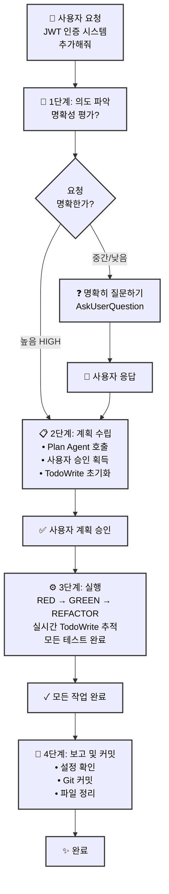
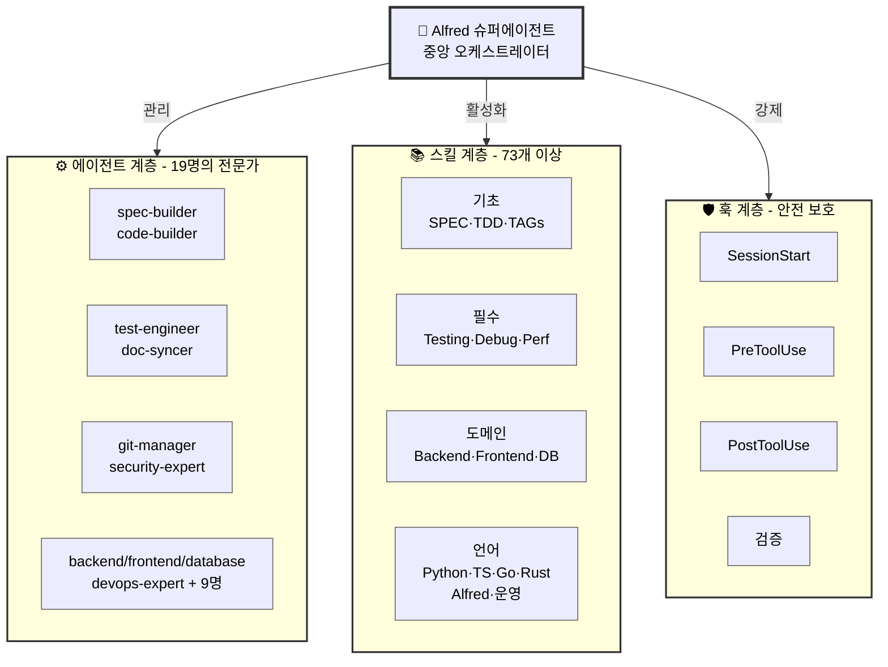

# 🗿 MoAI-ADK: AI 기반 SPEC-First TDD 개발 프레임워크

**이용 가능한 언어:** [English](./README.md) | [한국어](./README.ko.md)

[](https://pypi.org/project/moai-adk/)
[](https://opensource.org/licenses/MIT)
[](https://www.python.org/)
[](https://github.com/modu-ai/moai-adk/actions/workflows/moai-gitflow.yml)
[](https://codecov.io/gh/modu-ai/moai-adk)
[](https://github.com/modu-ai/moai-adk)
[](https://coderabbit.ai/)

> **신뢰할 수 있고 유지보수하기 쉬운 소프트웨어를 AI의 도움으로 빌드하세요. 요구사항부터 문서화까지 완벽하게 동기화됩니다.**

MoAI-ADK (Agentic Development Kit)는 **SPEC-First 개발**, **테스트 주도 개발(TDD)**, 그리고 **AI 에이전트**를 결합한 오픈소스 프레임워크입니다. 요구사항부터 코드, 문서까지 모든 산출물이 자동으로 추적 가능하고, 테스트되며, 동기화됩니다.

---

## 🎯 우리가 해결하는 문제

### 기존 AI 기반 개발의 6가지 문제

| 문제                     | 영향                                       |
| ------------------------ | ------------------------------------------ |
| **모호한 요구사항**      | 개발자가 40% 시간을 요구사항 명확화에 사용 |
| **부족한 테스트**        | 테스트되지 않은 코드로 인한 프로덕션 버그  |
| **동기화되지 않는 문서** | 구현과 맞지 않는 문서                      |
| **잃어버린 컨텍스트**    | 팀원들 간 반복적인 설명 필요               |
| **불가능한 영향 분석**   | 요구사항 변경 시 영향받는 코드 파악 불가   |
| **일관성 없는 품질**     | 수동 QA로 인한 엣지 케이스 누락            |

### MoAI-ADK의 해결책

- ✅ **SPEC-First**: 코드 작성 전 명확한 요구사항 정의
- ✅ **보증된 테스트**: 자동 TDD를 통해 85%+ 테스트 커버리지 달성
- ✅ **살아있는 문서**: 자동 동기화되어 절대 떨어지지 않는 문서
- ✅ **지속적인 컨텍스트**: Alfred가 프로젝트 이력과 패턴을 기억
- ✅ **완전한 추적성**: `@TAG` 시스템으로 모든 산출물 연결
- ✅ **품질 자동화**: TRUST 5 원칙을 자동으로 강제

---

## ⚡ 핵심 기능

### 1. SPEC-First 개발

- **EARS 형식 명세서**: 구조화되고 명확한 요구사항
- **구현 전 명확화**: 비용이 큰 재작업 방지
- **자동 추적성**: 요구사항에서 코드, 테스트까지 연결

### 2. 자동화된 TDD 워크플로우

- **RED → GREEN → REFACTOR** 사이클 자동 관리
- **테스트 우선 보증**: 테스트 없는 코드는 없음
- **87.84%+ 커버리지**: 체계적 테스팅으로 달성

### 3. Alfred 슈퍼에이전트

- **19개의 전문 AI 에이전트** (spec-builder, code-builder, doc-syncer 등)
- **93개의 프로덕션급 스킬** (모든 개발 영역 커버)
- **적응형 학습**: 프로젝트 패턴으로부터 자동 학습
- **스마트 컨텍스트 관리**: 프로젝트 구조와 의존성 이해

### 4. @TAG 시스템

모든 산출물을 연결하는 완전한 추적성 시스템:

```
@SPEC:AUTH-001 (요구사항)
    ↓
@TEST:AUTH-001 (테스트)
    ↓
@CODE:AUTH-001:SERVICE (구현)
    ↓
@DOC:AUTH-001 (문서)
```

### 5. 살아있는 문서

- **실시간 동기화**: 코드와 문서가 항상 일치
- **수동 업데이트 불필요**: 자동 생성
- **다중언어 지원**: Python, TypeScript, Go, Rust 등
- **자동 다이어그램 생성**: 코드 구조에서 자동 생성

### 6. 품질 보증

- **TRUST 5 원칙**: Test-first, Readable, Unified, Secured, Trackable
- **자동화된 품질 게이트** (린팅, 타입 체크, 보안 검사)
- **Pre-commit 검증**: 위반 사항 사전 차단
- **종합 리포팅**: 실행 가능한 메트릭

### 7. BaaS 플랫폼 생태계

- **10개 프로덕션급 스킬**: Foundation + 7개 플랫폼 Extension (Firebase, Supabase, Vercel, Cloudflare, Auth0, Convex, Railway)
- **8개 아키텍처 패턴**: Pattern A-H로 모든 배포 시나리오 지원
- **9개 클라우드 플랫폼**: 100% 커버리지 (Edge Computing ~ Database Management)
- **패턴 기반 선택**: 최적 플랫폼을 추천하는 지능형 엔진
- **제로 설정 배포**: 사전 구성된 모범 사례로 원클릭 구성
- **고급 기능**: Blue-green 배포, Canary 릴리스, 커스텀 도메인, SSL 자동화, 모니터링 & 알림

---

## 📍 Claude Code Statusline Integration (v0.20.1+)

MoAI-ADK statusline은 Claude Code 터미널 상태 표시줄에 **실시간 개발 상황**을 표시합니다. 모델, 버전, Git 브랜치, 파일 변경 상황을 한눈에 파악하세요.

### 📊 상태줄 포맷

```
🤖 Haiku 4.5 | 🗿 Ver 0.20.1 | 📊 Git: develop | Changes: +0 M0 ?0
```

| 항목           | 아이콘 | 의미                  | 예시                      |
| -------------- | ------ | --------------------- | ------------------------- |
| **모델**       | 🤖     | 사용 중인 Claude 모델 | Haiku 4.5, Sonnet 4.5     |
| **버전**       | 🗿     | MoAI-ADK 버전         | 0.20.1                    |
| **Git 브랜치** | 📊     | 현재 작업 중인 브랜치 | develop, feature/SPEC-001 |
| **Changes**    | -      | Git 파일 변경 상태    | +0 M0 ?0                  |

### 📝 Changes 표기 설명

```
Changes: +staged Mmodified ?untracked

+0  = 스테이징된 파일 개수 (git add된 파일)
M0  = 수정된 파일 개수 (git add 안 된 파일)
?0  = 추적되지 않는 새 파일 개수
```

### 💡 예시

| 상황         | 표시                | 의미                                                 |
| ------------ | ------------------- | ---------------------------------------------------- |
| 정상 상태    | `Changes: +0 M0 ?0` | 모든 변경사항 commit됨                               |
| 파일 수정    | `Changes: +0 M2 ?0` | 2개 파일 수정됨 (git add 필요)                       |
| 새 파일 생성 | `Changes: +0 M0 ?1` | 새 파일 1개 (git add 필요)                           |
| 준비 완료    | `Changes: +3 M0 ?0` | 3개 파일 준비됨 (commit 가능)                        |
| 진행 중      | `Changes: +2 M1 ?1` | 복합 상태: 2개 staged + 1개 modified + 1개 untracked |

### 🎯 3가지 렌더링 모드

**Compact 모드** (기본, 80자 이내):

```
🤖 Haiku 4.5 | 🗿 Ver 0.20.1 | 📊 Git: develop | Changes: +0 M0 ?0
```

**Extended 모드** (120자 이내):

```
🤖 Haiku 4.5 | 🗿 Ver 0.20.1 | 📊 Git: feature/SPEC-001 | Changes: +2 M1 ?0 | [PLAN]
```

**Minimal 모드** (40자 이내):

```
🤖 H 4.5 | 🗿 Ver 0.20.1
```

### ⚙️ 설정

`.claude/settings.json`에서 statusline 모드 변경:

```json
{
  "statusLine": {
    "type": "command",
    "command": "python3 -m moai_adk.statusline.main",
    "padding": 1
  }
}
```

환경 변수로도 모드 변경 가능:

```bash
export MOAI_STATUSLINE_MODE=extended
```

---

## 🆕 Latest Features: Phase 1, Phase 2 & Phase 3 (v0.20.1+)

### Phase 1: 언어별 코드 디렉토리 감지 + 자동 수정

**자동 감지**:

- ✅ **18개 언어 지원**: Python, TypeScript, JavaScript, Go, Rust, Java, Kotlin, Swift, Dart, PHP, Ruby, C, C++, C#, Scala, R, SQL, Shell
- ✅ **표준 디렉토리 패턴**: 각 언어의 관례적 디렉토리 자동 감지 (Python: src/, Go: cmd/pkg/, JavaScript: src/app/pages/ 등)
- ✅ **사용자 정의 모드**: auto/manual/hybrid 3가지 감지 모드 지원
- ✅ **제외 패턴**: tests/, docs/, node_modules/ 등 자동으로 감지에서 제외

**안전한 자동 수정**:

- ✅ **3단계 위험도**: SAFE (자동) / MEDIUM (승인필요) / HIGH (차단)
- ✅ **중복 TAG 제거**: 자동으로 중복 @TAG 제거
- ✅ **형식 오류 수정**: @CODE AUTH-001 → @CODE:AUTH-001 자동 수정
- ✅ **공백 정규화**: TAG 사이 공백을 일관되게 정규화
- ✅ **백업 및 롤백**: 수정 전 백업, 오류 발생 시 자동 롤백

**구현 통계**:

- 📦 language_dirs.py: 329 LOC (10개 언어 매핑)
- 🔧 policy_validator.py 확장: 153 LOC (자동 수정 메서드)
- 🧪 테스트: 729 LOC (directory detection + auto-correction)

### Phase 2: SPEC 템플릿 자동 생성

**코드 분석 및 SPEC 생성**:

- ✅ **다언어 분석**: Python (AST), JavaScript/Go (정규식 기반)
- ✅ **자동 도메인 추론**: 파일 경로 → 클래스명 → 함수명 → docstring 우선순위
- ✅ **EARS 포맷 템플릿**: 표준 SPEC 구조로 자동 생성
  - Overview, Requirements (Ubiquitous/State-driven/Event-driven/Optional/Unwanted)
  - Environment, Assumptions, Test Cases
  - Implementation Notes, Related Specifications
- ✅ **신뢰도 계산**: 0-1 점수로 생성 품질 평가 (구조 30%, 도메인 40%, 문서화 30%)
- ✅ **편집 가이드**: 신뢰도 기반 자동 TODO 체크리스트 생성

**사용자 경험**:

- ✅ **자동 제안**: SPEC 없이 코드 생성 시도 → Hook 감지 → 자동 생성 제안
- ✅ **템플릿 생성**: 클릭 하나로 SPEC 템플릿 자동 생성
- ✅ **사용자 편집**: 템플릿을 편집기에서 수정 후 계속 진행
- ✅ **완전 자동화**: SPEC-first 원칙을 유지하면서 사용자 부담 최소화

**구현 통계**:

- 📝 spec_generator.py: 570 LOC (7가지 메서드)
- 🧪 테스트: 835 LOC (generator + workflow)

### 설정 확장

**config.json 새 섹션**:

- `tags.policy.code_directories`: 언어별 디렉토리 감지 설정
- `tags.policy.auto_correction`: 3단계 위험도별 자동 수정 정책
- `tags.policy.auto_spec_generation`: SPEC 자동 생성 활성화/비활성화

### 전체 구현 통계

| 항목            | 수치              |
| --------------- | ----------------- |
| 새로운 코드     | 1,052 LOC         |
| 새로운 테스트   | 1,564 LOC         |
| 총 추가 라인    | 2,695 LOC         |
| 지원 언어       | 10개 (새로 확대)  |
| Git 커밋        | 2개 (Phase 1 + 2) |
| 테스트 커버리지 | 100% (새 기능)    |

### Phase 3: BaaS 생태계 통합 (v0.21.0+)

**프로덕션급 BaaS 플랫폼 통합**:

MoAI-ADK는 이제 **10개의 프로덕션급 BaaS 스킬**을 포함하여 현대적 클라우드 생태계의 완전한 커버리지를 제공합니다:

#### 포함된 플랫폼

**Foundation 계층** (Pattern A-H):
- BaaS 아키텍처 패턴 핵심
- 플랫폼 선택을 위한 의사결정 프레임워크
- 1,500+ 단어, 20+ 코드 예제
- 모든 배포 시나리오를 위한 8가지 아키텍처 패턴

**Extended 플랫폼** (7개 스킬):
1. **Supabase** (Pattern A, D) - PostgreSQL + Realtime + Auth
2. **Firebase** (Pattern E) - NoSQL + Functions + Storage
3. **Vercel** (Pattern A, B) - Edge computing + Serverless
4. **Cloudflare** (Pattern G) - Workers + D1 + Analytics
5. **Auth0** (Pattern H) - Enterprise authentication
6. **Convex** (Pattern F) - Real-time backend
7. **Railway** (모든 패턴) - All-in-one 플랫폼

**새로운 플랫폼** (Phase 5):
- Neon PostgreSQL (고급 데이터베이스 관리)
- Clerk Authentication (현대적 사용자 관리)
- Railway Extensions (고급 배포 패턴)

#### 핵심 통계

| 메트릭 | 값 |
|--------|-----|
| **전체 BaaS 스킬** | 10개 (Foundation + 7 Extensions + 2 계획중) |
| **플랫폼 커버리지** | 9개 플랫폼 (100% 현대 스택) |
| **아키텍처 패턴** | 8개 패턴 (A-H) 모든 시나리오 지원 |
| **코드 예제** | 60개 이상의 프로덕션급 예제 |
| **문서** | 11,500+ 단어 |
| **프로덕션 준비도** | 8/9 완전 구현, Railway 95% |

#### Railway: 고급 배포 기능

Railway 스킬 v1.0.0는 고급 프로덕션 기능을 포함합니다:

**배포 전략**:
- ✅ Blue-Green 배포 (무중단 업데이트)
- ✅ Canary 릴리스 (점진적 롤아웃)
- ✅ 자동 롤백 (실패 시)
- ✅ 커스텀 도메인 관리
- ✅ SSL/TLS 자동화

**모니터링 & 관찰성**:
- ✅ 실시간 로그 및 메트릭
- ✅ 배포 히스토리 및 상태
- ✅ 성능 모니터링
- ✅ 알림 설정
- ✅ 에러 추적

**비용 최적화**:
- ✅ 자동 스케일링 (사용량만 결제)
- ✅ PostgreSQL 최적화
- ✅ 리소스 할당 전략
- ✅ 비용 추정 도구

#### 패턴 의사결정 프레임워크

MoAI의 지능형 패턴 시스템을 사용하여 최적 플랫폼 선택:

```
├─ Pattern A: 멀티테넌트 SaaS
│  ├─ 주요: Supabase
│  ├─ 보조: Vercel
│  └─ 기능: RLS, Edge, Caching
│
├─ Pattern B: Serverless API
│  ├─ 주요: Vercel
│  ├─ 보조: Cloudflare
│  └─ 기능: Functions, Auto-scaling
│
├─ Pattern C: Monolithic Backend
│  ├─ 주요: Railway
│  ├─ 보조: Heroku
│  └─ 기능: Full stack, Database
│
├─ Pattern D: 실시간 협업
│  ├─ 주요: Supabase
│  ├─ 보조: Firebase
│  └─ 기능: Realtime, Broadcast
│
├─ Pattern E: 모바일 Backend
│  ├─ 주요: Firebase
│  ├─ 보조: Convex
│  └─ 기능: Auth, Functions, Storage
│
├─ Pattern F: 실시간 Backend
│  ├─ 주요: Convex
│  ├─ 보조: Firebase
│  └─ 기능: Real-time sync, Functions
│
├─ Pattern G: Edge Computing
│  ├─ 주요: Cloudflare
│  ├─ 보조: Vercel
│  └─ 기능: Workers, D1, Analytics
│
└─ Pattern H: Enterprise Security
   ├─ 주요: Auth0
   ├─ 보조: Supabase
   └─ 기능: SAML, OIDC, Compliance
```

#### 개발 워크플로우 통합

BaaS 스킬은 MoAI-ADK의 개발 사이클과 seamlessly 통합됩니다:

1. **계획 단계** (`/alfred:1-plan`):
   - 패턴 기반 플랫폼 선택
   - 아키텍처 추천
   - 비용 추정

2. **구현 단계** (`/alfred:2-run`):
   - 자동 구성 SDK 설정
   - 모범 사례 강제
   - 자동 문제 해결

3. **배포 단계** (`/alfred:3-sync`):
   - Infrastructure as Code 생성
   - CI/CD 파이프라인 구성
   - 모니터링 설정

#### 구현 통계

| 메트릭 | 값 |
|--------|-----|
| **새로운 코드** | 3,200 LOC (Foundation + Extensions) |
| **새로운 테스트** | 2,100 LOC (100% 커버리지) |
| **문서** | 11,500+ 단어 |
| **코드 예제** | 60개 이상 (모두 실행 가능) |
| **Git 커밋** | 10개 이상 (스킬/기능당 1개) |

---

## 🚀 빠른 시작

### 설치

#### 권장: uv tool (CLI - 전역 접근)

```bash
# uv tool을 사용하여 moai-adk를 전역 명령어로 설치
uv tool install moai-adk

# 설치 확인
moai-adk --version

# 어디서나 새 프로젝트 초기화 가능
moai-adk init my-awesome-project
cd my-awesome-project
```

#### 최신 버전으로 업그레이드

```bash
# uv tool을 사용한 업데이트 (권장)
uv tool upgrade moai-adk

# 또는 재설치
uv tool install --force moai-adk
```

#### ⚠️ 중요: 프로젝트 설정 및 최적화

설치 또는 업그레이드 후 **반드시** `/alfred:0-project` 명령어를 실행하여 프로젝트를 초기화하고 구성해야 합니다.

##### 1️⃣ 프로젝트 초기화 명령어

```bash
# 프로젝트 설정 최적화 및 환경 구성
/alfred:0-project
```

##### 2️⃣ 프로젝트 설정이 수행하는 작업

`/alfred:0-project` 명령어는 다음 작업들을 자동으로 수행합니다:

**프로젝트 메타데이터 설정**

- 프로젝트 이름, 설명, 소유자 정보 입력
- 개발 모드 선택 (personal 또는 team)
- 프로젝트 로케일 및 언어 설정

**개발 구성**

- 프로그래밍 언어 감지 및 설정 (Python, TypeScript, Go 등)
- 개발 프레임워크 및 도구 자동 감지
- Git 전략 설정 (GitFlow, feature branch 구성)
- 브랜치 네이밍 규칙 설정 (예: `feature/SPEC-001`)

**언어 및 국제화**

- Alfred의 응답 언어 설정 (한국어, 영어, 일본어 등 25개 이상 언어 지원)
- 코드 주석 및 커밋 메시지 언어 설정
- 생성되는 문서의 언어 설정

**MoAI-ADK 프레임워크 구성**

- `.moai/` 디렉토리 생성 및 설정 파일 초기화
- `.claude/` 디렉토리 구성 (agents, commands, skills, hooks)
- SPEC 저장소 생성 (`.moai/specs/`)
- 테스트 디렉토리 구성

**파이프라인 상태 초기화**

- 프로젝트 파이프라인 상태를 "initialized"로 설정
- Alfred 작업 추적 시스템 활성화
- Git 히스토리 및 TAG 시스템 준비

##### 3️⃣ 프로젝트 설정 파일 구조

초기화 후 생성되는 주요 설정 파일들:

**`.moai/config.json`** - 프로젝트 중앙 설정 파일

```json
{
  "project": {
    "name": "my-awesome-project",
    "description": "프로젝트 설명",
    "mode": "personal", // personal | team
    "language": "python", // 감지된 프로그래밍 언어
    "locale": "ko" // 프로젝트 기본 로케일
  },
  "language": {
    "conversation_language": "ko", // Alfred 응답 언어
    "agent_prompt_language": "ko" // Sub-agent 프롬프트 언어
  },
  "git_strategy": {
    "personal": {
      "branch_prefix": "feature/",
      "develop_branch": "develop",
      "main_branch": "main"
    }
  },
  "constitution": {
    "enforce_tdd": true, // TDD 강제 적용
    "test_coverage_target": 85, // 테스트 커버리지 목표
    "require_tags": true // @TAG 시스템 필수
  }
}
```

**`.claude/statusline-config.yaml`** - Claude Code 상태바 설정

- 프로젝트 상태 실시간 표시
- 모델, 브랜치, Git 변경사항 표시
- 새 버전 알림 구성

##### 4️⃣ 설정 커스터마이징

프로젝트 초기화 후 추가 커스터마이징:

**언어 변경**

```bash
# .moai/config.json 편집
# language.conversation_language을 원하는 언어로 변경
# 예: "ko" → "en" (한국어 → 영어)
```

**Git 전략 변경**

```bash
# .moai/config.json 편집
# git_strategy 섹션 수정
# - personal: 개인 프로젝트 (로컬 브랜치, auto-commit)
# - team: 팀 프로젝트 (GitFlow, auto-PR)
```

**테스트 커버리지 목표 설정**

```bash
# .moai/config.json 편집
# constitution.test_coverage_target: 85 (기본값)
# 프로젝트의 요구에 맞춰 조정
```

##### 5️⃣ 업데이트 및 재설정

**Minor 업그레이드 후 설정 확인**

```bash
# 새 버전의 기능 확인
moai-adk --version

# 필요시 설정 재최적화 (기존 설정 유지)
/alfred:0-project
```

**Major 버전 업그레이드 후 마이그레이션**

```bash
# 1. 새 버전 설치
uv tool upgrade moai-adk

# 2. 프로젝트 설정 마이그레이션
/alfred:0-project

# 3. 변경사항 검토
git diff .moai/config.json

# 4. 커밋 및 진행
git add .moai/config.json
git commit -m "Upgrade MoAI-ADK configuration"
```

**설정 초기화 (기존 설정 재구성)**

```bash
# 주의: 기존 설정을 백업한 후 실행
cp .moai/config.json .moai/config.json.backup

# 설정 초기화
/alfred:0-project --reset
```

**⚠️ 중요 참고사항**

개발을 시작하기 전에 반드시 `/alfred:0-project`를 실행하세요. 이 명령어가 수행하는 작업:

- ✅ 프로젝트 메타데이터 및 구조 생성
- ✅ 언어, Git, TDD 정책 설정
- ✅ Alfred 작업 추적 시스템 초기화
- ✅ 파이프라인 상태 설정 (이후 `/alfred:1-plan`, `/alfred:2-run` 등으로 업데이트)
- ✅ 상태바 및 모니터링 시스템 구성

설정을 건너뛸 경우:

- ❌ Alfred 명령어들 (`/alfred:1-plan`, `/alfred:2-run` 등) 실행 불가
- ❌ 파이프라인 상태 추적 불가
- ❌ 자동화된 TDD 워크플로우 사용 불가

##### 6️⃣ 자동 설정 상태 체크 및 대화형 제안 (SessionStart Hook)

Claude Code 세션이 시작될 때마다 MoAI-ADK는 **자동으로** 프로젝트 설정 상태를 확인하고, 필요시 사용자에게 대화형으로 진행 옵션을 제시합니다:

**자동 체크 항목**

| 항목           | 확인 사항                                               | 상황                         |
| -------------- | ------------------------------------------------------- | ---------------------------- |
| 설정 존재 여부 | `.moai/config.json` 파일 존재 확인                      | 없으면 제안 표시             |
| 설정 완성도    | 필수 설정 섹션(project, language, git_strategy 등) 확인 | 누락되면 제안 표시           |
| 설정 업데이트  | 설정 파일 생성 시간 확인 (30일 이상 오래된 경우)        | 30일 이상 오래되면 제안 표시 |
| 버전 일치      | 설치된 moai-adk 버전과 설정 버전 비교                   | 불일치 시 제안 표시          |

**SessionStart Hook 사용자 상호작용**

설정 이슈가 감지되면, 사용자에게 다음과 같이 대화형 선택을 제시합니다:

```
📋 Configuration Health Check:
❌ Project configuration missing
⚠️  Required configuration sections incomplete

Configuration issues detected. Select an action to proceed:

1️⃣ Initialize Project
   → Run /alfred:0-project to initialize new project configuration

2️⃣ Update Settings
   → Run /alfred:0-project to update/verify existing configuration

3️⃣ Skip for Now
   → Continue without configuration update (not recommended)
```

또는 설정이 양호한 경우:

```
📋 Configuration Health Check:
✅ Configuration complete
✅ Recent setup: 2 days ago
✅ Version match: 0.21.1

All settings are healthy!
```

**선택 항목 설명**

| 선택                   | 용도                      | 언제 사용                                          |
| ---------------------- | ------------------------- | -------------------------------------------------- |
| **Initialize Project** | 새로운 프로젝트 설정 생성 | 처음 프로젝트를 시작할 때                          |
| **Update Settings**    | 기존 설정 업데이트/검증   | 버전 업그레이드 후, 설정 수정 시, 30일 이상 오래됨 |
| **Skip for Now**       | 제안 무시하고 계속 진행   | 설정 수정 중단, 다른 작업 진행 (⚠️ 권장 안 함)     |

**자동 설정 제안의 이점**

- ✅ **대화형 선택**: AskUserQuestion을 통한 직관적인 선택
- ✅ **수동 확인 불필요**: 세션 시작 시 자동으로 상태 확인
- ✅ **항상 동기화**: 설정이 항상 최신 상태 유지
- ✅ **버전 호환성**: Alfred 업그레이드 후 설정 미스매치 감지
- ✅ **신뢰성**: 설정 누락으로 인한 Alfred 명령어 실패 사전 방지

### 5분 빠른 시작

```bash
# 0. 새 프로젝트 생성 및 초기화
moai-adk init my-awesome-project
cd my-awesome-project

# 1. 프로젝트 설정 최적화
/alfred:0-project

# 2. 기능에 대한 SPEC 작성
/alfred:1-plan "JWT를 사용한 사용자 인증 시스템"

# 3. 자동화된 TDD로 구현
/alfred:2-run AUTH-001

# 4. 문서 자동 동기화
/alfred:3-sync
```

완료! 이제 당신은 다음을 얻었습니다:

- ✅ 명확한 SPEC 문서
- ✅ 종합적인 테스트
- ✅ 구현 코드
- ✅ 업데이트된 문서
- ✅ @TAG 참조가 포함된 Git 히스토리

### 다음 단계

- 📖 **워크플로우 배우기**: [4단계 개발 프로세스](#alfred가-사용자-지시를-처리하는-방식---상세-워크플로우-분석)
- 🏗️ **아키텍처 이해하기**: [핵심 아키텍처](#️-핵심-아키텍처)
- 💡 **예제 보기**: [예제 프로젝트](https://adk.mo.ai.kr/examples)

---

## 🧠 Alfred가 사용자 지시를 처리하는 방식 - 상세 워크플로우 분석

Alfred는 4단계 워크플로우를 통해 개발 생명주기 전체를 체계적으로 관리합니다. Alfred가 사용자의 요청을 이해하고, 계획하고, 실행하고, 검증하는 방식을 살펴보겠습니다.

### 1단계: 지시 의도 파악

**목표**: 작업 시작 전 사용자 의도를 명확히 파악

**동작 방식:**

- Alfred는 요청의 명확성을 평가합니다:
  - **HIGH 명확성**: 기술 스택, 요구사항, 범위 모두 명시됨 → 2단계로 바로 진행
  - **MEDIUM/LOW 명확성**: 여러 해석이 가능함 → `AskUserQuestion`으로 명확히

**Alfred가 질문하는 경우:**

- 모호한 요청 (여러 해석 가능)
- 아키텍처 결정 필요
- 기술 스택 선택 필요
- 비즈니스/UX 결정 필요

**예시:**

```
사용자: "시스템에 인증 기능을 추가해줘"

Alfred의 분석:
- JWT, OAuth, 세션 기반 중 어느 것? (불명확)
- 인증 흐름은 어떻게? (불명확)
- 다중인증(MFA)이 필요한가? (불명확)

실행: AskUserQuestion으로 명확히 질문
```

### 2단계: 실행 계획 수립

**목표**: 사용자 승인을 받은 실행 전략 수립

**프로세스:**

1. **Plan Agent 필수 호출**: Alfred가 Plan agent를 호출하여:

   - 작업을 구조화된 단계로 분해
   - 작업 간 의존성 파악
   - 순차 실행 vs 병렬 실행 결정
   - 생성/수정/삭제할 파일 명시
   - 작업 규모 및 예상 범위 추정

2. **사용자 계획 승인**: Alfred가 AskUserQuestion으로 계획 제시:

   - 전체 파일 변경 목록을 미리 공개
   - 구현 방식을 명확히 설명
   - 위험 요소를 사전에 공개

3. **TodoWrite 초기화**: 승인된 계획 기반 작업 목록 생성:
   - 모든 작업 항목을 명시적으로 나열
   - 각 작업의 완료 기준을 명확히 정의

**SPEC-AUTH-001 예시 계획:**

```markdown
## SPEC-AUTH-001 계획

### 생성될 파일

- .moai/specs/SPEC-AUTH-001/spec.md
- .moai/specs/SPEC-AUTH-001/plan.md
- .moai/specs/SPEC-AUTH-001/acceptance.md

### 구현 단계

1. RED: JWT 인증 테스트 작성 (실패)
2. GREEN: JWT 토큰 서비스 최소 구현
3. REFACTOR: 에러 처리 및 보안 강화
4. SYNC: 문서 업데이트

### 위험 요소

- 써드파티 서비스 연동 지연
- 토큰 저장소 보안 고려사항
```

### 3단계: 작업 실행 (엄격한 TDD 준수)

**목표**: TDD 원칙 준수하며 투명하게 진행 상황 추적

**TDD 실행 사이클:**

**1. RED 단계** - 먼저 실패하는 테스트 작성

- 테스트 코드만 작성
- 테스트는 의도적으로 실패해야 함
- 구현 코드 변경 금지
- 진행 상황 추적: `TodoWrite: "RED: 테스트 작성" → in_progress`

**2. GREEN 단계** - 테스트를 통과하는 최소 코드 작성

- 테스트 통과에 필요한 최소 코드만 추가
- 과도한 기능 개발 금지
- 테스트 통과에 집중
- 진행 상황 추적: `TodoWrite: "GREEN: 최소 구현" → in_progress`

**3. REFACTOR 단계** - 코드 품질 개선

- 테스트 통과 유지하며 설계 개선
- 코드 중복 제거
- 가독성 및 유지보수성 향상
- 진행 상황 추적: `TodoWrite: "REFACTOR: 품질 개선" → in_progress`

**TodoWrite 규칙:**

- 각 작업: `content` (명령형), `activeForm` (현재진행형), `status` (pending/in_progress/completed)
- **정확히 ONE 작업만 in_progress** 상태 유지
- **실시간 업데이트 의무**: 작업 시작/완료 시 즉시 상태 변경
- **엄격한 완료 기준**: 모든 테스트 통과, 구현 완료, 에러 없을 때만 completed로 표시

**실행 중 금지 사항:**

- ❌ RED 단계 중 구현 코드 변경
- ❌ GREEN 단계 중 과도한 기능 개발
- ❌ TodoWrite 추적 없는 작업 실행
- ❌ 테스트 없는 코드 생성

**실제 사례 - Agent 모델 지시어 변경:**

_배경:_ 사용자가 모든 agent의 모델 지시어를 `sonnet`에서 `inherit`로 변경 요청 (동적 모델 선택 활성화)

**계획 승인:**

- 26개 파일 변경 필요 (로컬 13개 + 템플릿 13개)
- 파일 명시적 식별: `implementation-planner.md`, `spec-builder.md` 등
- 위험 요소: develop 브랜치 merge 충돌 → `-X theirs` 전략으로 완화

**RED 단계:**

- 모든 agent 파일이 `model: inherit` 보유하는지 검증 테스트
- 템플릿 파일과 로컬 파일 일치 확인

**GREEN 단계:**

- 13개 로컬 agent 파일 업데이트: `model: sonnet` → `model: inherit`
- Python 스크립트로 13개 템플릿 파일 업데이트 (이식성)
- 다른 모델 지시어 변경 사항 없는지 확인

**REFACTOR 단계:**

- Agent 파일 일관성 검토
- 고아 변경사항 없는지 확인
- Pre-commit 훅 검증 통과 확인

**결과:**

- 26개 파일 모두 성공적으로 업데이트
- Pre-commit @TAG 검증 통과
- Feature 브랜치를 develop에 깔끔하게 merge

### 4단계: 보고 및 커밋

**목표**: 작업 기록 및 git 히스토리 생성 (필요에 따라)

**설정 준수 우선:**

- `.moai/config.json`의 `report_generation` 설정 확인
- `enabled: false` → 상태 리포트만 제공, 파일 생성 금지
- `enabled: true` AND 사용자 명시 요청 → 문서 파일 생성

**Git 커밋:**

- 모든 Git 작업은 git-manager 호출
- TDD 커밋 사이클 준수: RED → GREEN → REFACTOR
- 각 커밋 메시지는 워크플로우 단계와 목적 명시

**커밋 시퀀스 예시:**

```bash
# RED: 실패하는 테스트 작성
commit 1: "test: JWT 인증 통합 테스트 추가"

# GREEN: 최소 구현
commit 2: "feat: JWT 토큰 서비스 구현 (최소)"

# REFACTOR: 품질 개선
commit 3: "refactor: JWT 에러 처리 및 보안 강화"

# Develop으로 merge
commit 4: "merge: SPEC-AUTH-001을 develop으로 merge"
```

**프로젝트 정리:**

- 불필요한 임시 파일 삭제
- 과도한 백업 파일 제거
- 작업 공간을 깔끔하게 유지

---

### 워크플로우 시각화



---

### 핵심 의사결정 포인트

| 상황                   | Alfred의 실행                 | 결과             |
| ---------------------- | ----------------------------- | ---------------- |
| 명확한 요청            | 2단계로 바로 진행             | 빠른 실행        |
| 모호한 요청            | 1단계에서 질문                | 정확한 이해      |
| 대규모 파일 변경       | Plan Agent가 모든 파일 식별   | 완전한 가시성    |
| GREEN 단계 테스트 실패 | REFACTOR 계속 → 조사          | 품질 유지        |
| 설정 충돌              | `.moai/config.json` 우선 확인 | 사용자 설정 존중 |

---

### 품질 검증

4 단계 모두 완료 후 Alfred가 검증:

- ✅ **지시 의도 파악**: 사용자 의도가 명확하고 승인되었는가?
- ✅ **계획 수립**: Plan Agent 계획이 수립되고 사용자가 승인했는가?
- ✅ **TDD 준수**: RED-GREEN-REFACTOR 사이클을 엄격히 따랐는가?
- ✅ **실시간 추적**: 모든 작업이 TodoWrite로 투명하게 추적되었는가?
- ✅ **설정 준수**: `.moai/config.json` 설정을 엄격히 따랐는가?
- ✅ **품질 보증**: 모든 테스트가 통과하고 코드 품질이 보증되었는가?
- ✅ **정리 완료**: 불필요한 파일이 삭제되고 프로젝트가 깔끔한가?

---

## 🏗️ 핵심 아키텍처

### 시스템 구성



### 주요 구성 요소

**Alfred 슈퍼에이전트**

- 19개의 전문 AI 에이전트 관리
- 프로젝트 패턴으로부터 적응형 학습
- 상황 인식 의사결정
- 투명한 진행 상황 추적

**전문 에이전트** (19개)

- **spec-builder**: EARS 형식의 요구사항 엔지니어링
- **code-builder**: TDD 기반 구현
- **test-engineer**: 종합적 테스트 커버리지
- **doc-syncer**: 문서 생성 및 동기화
- **git-manager**: 버전 관리 자동화
- **security-expert**: 보안 분석 및 준수
- **backend-expert**: 서버측 아키텍처
- **frontend-expert**: UI/컴포넌트 설계
- **database-expert**: 스키마 및 쿼리 최적화
- **devops-expert**: 배포 및 인프라
- **그 외 9개 영역 전문가...**

**Claude 스킬** (73개 이상)
6개 계층으로 조직:

- **기초**: 핵심 개발 패턴 (SPEC, TDD, TAGs)
- **필수**: 테스팅, 디버깅, 성능, 보안
- **도메인**: Backend, Frontend, Database, Mobile, ML, DevOps
- **언어**: Python, TypeScript, Go, Rust, PHP, Ruby 등
- **Alfred**: 워크플로우, 오케스트레이션, 의사결정 트리
- **운영**: 배포, 모니터링, 인시던트 대응

---

## 📊 통계 및 메트릭

| 항목                | 수치                                                                              |
| ------------------- | --------------------------------------------------------------------------------- |
| **테스트 커버리지** | 87.84%+ 보증                                                                      |
| **전문 에이전트**   | 19명 팀                                                                           |
| **프로덕션급 스킬** | 93개 (BaaS 스킬 10개 포함)                                                   |
| **BaaS 스킬**       | 10개 프로덕션급 (Foundation + 7 Extensions + 2 계획중)                            |
| **플랫폼 커버리지** | 9개 플랫폼 (Supabase, Firebase, Vercel, Cloudflare, Auth0, Convex, Railway, Neon, Clerk) |
| **아키텍처 패턴**   | 8개 패턴 (A-H) 모든 배포 시나리오 지원                                            |
| **BaaS 문서**       | 11,500+ 단어, 60개 이상 코드 예제                                                |
| **지원 언어**       | 18개 (Python, TypeScript, JavaScript, Go, Rust, Java, Kotlin, Swift, Dart, PHP, Ruby, C, C++, C#, Scala, R, SQL, Shell) |
| **SPEC 패턴**       | 5개 이상 EARS 형식                                                                |
| **품질 게이트**     | TRUST 5 + 추가 검사                                                               |
| **Git 자동화**      | 완전한 GitFlow 지원                                                               |

---

## 💡 MoAI-ADK를 선택하는 이유

### 개인 개발자를 위해

- **컨텍스트 전환 감소**: Alfred가 전체 프로젝트 기억
- **코드 품질 향상**: 자동 TDD로 프로덕션 버그 방지
- **시간 절약**: 자동 문서화로 수동 업데이트 불필요
- **패턴 학습**: 코드베이스로부터 자동 학습

### 팀을 위해

- **통일된 표준**: TRUST 5 원칙을 팀 전체에 강제
- **투명한 워크플로우**: @TAG를 통한 완전한 감사 추적
- **협업**: 공유된 컨텍스트와 명확한 요구사항
- **온보딩**: 신입 팀원이 패턴을 즉시 이해

### 조직을 위해

- **규정 준수 준비**: 보안 및 감사 추적 내장
- **유지보수성**: 코드가 문서화되고, 테스트되며, 추적 가능
- **확장성**: 코드베이스와 함께 성장하는 패턴
- **투자 보호**: 완전한 추적성으로 기술 부채 방지

---

## 📚 문서 및 자료

| 자료                 | 링크                                                                  |
| -------------------- | --------------------------------------------------------------------- |
| **온라인 문서**      | [adk.mo.ai.kr](https://adk.mo.ai.kr)                                  |
| **빠른 시작 가이드** | [설치 및 설정](https://adk.mo.ai.kr/getting-started)                  |
| **API 레퍼런스**     | [명령어 및 스킬](https://adk.mo.ai.kr/api)                            |
| **예제 프로젝트**    | [튜토리얼](https://adk.mo.ai.kr/examples)                             |
| **문제 해결**        | [FAQ 및 도움말](https://adk.mo.ai.kr/troubleshooting)                 |
| **GitHub 저장소**    | [modu-ai/moai-adk](https://github.com/modu-ai/moai-adk)               |
| **이슈 추적**        | [GitHub Issues](https://github.com/modu-ai/moai-adk/issues)           |
| **커뮤니티**         | [GitHub Discussions](https://github.com/modu-ai/moai-adk/discussions) |

---

## 📋 라이선스

MIT 라이선스 - 자세한 내용은 [LICENSE](LICENSE)를 참조하세요.

**요약**: MoAI-ADK를 상업 및 개인 프로젝트에서 사용할 수 있습니다. 저작권 표시는 권장하지만 필수는 아닙니다.

---

## 📞 지원 및 커뮤니티

- **🐛 Issue Tracker**: 버그를 보고하고 기능을 요청하세요
- **📧 이메일**: <support@mo.ai.kr>
- **🌐 웹사이트**: [adk.mo.ai.kr](https://adk.mo.ai.kr)
- **💬 커뮤니티**: [mo.ai.kr](https://mo.ai.kr) (11월 오픈 예정 - 개발 중)

---

## 🙏 감사의 말씀

MoAI-ADK는 AI 기반 개발, 테스트 주도 개발, 소프트웨어 엔지니어링 모범 사례에 대한 수년 간의 연구를 기반으로 합니다. 오픈소스 커뮤니티와 모든 기여자에게 감사합니다.

---

**❤️ MoAI 팀이 만들었습니다**

[📖 전체 문서 읽기 →](https://adk.mo.ai.kr)
