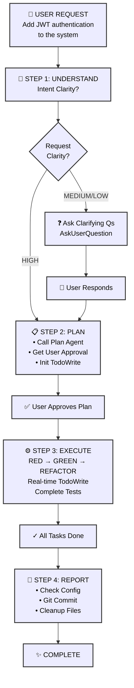
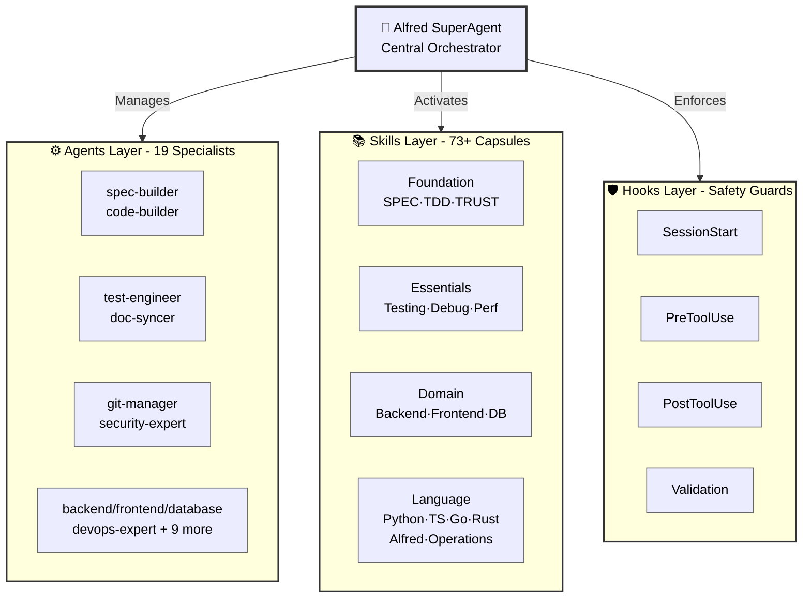

# 🗿 MoAI-ADK: AI-Powered SPEC-First TDD Development Framework

**Available Languages:** [English](./README.md) | [한국어](./README.ko.md)

[](https://pypi.org/project/moai-adk/)
[](https://opensource.org/licenses/MIT)
[](https://www.python.org/)
[](https://github.com/modu-ai/moai-adk/actions/workflows/moai-gitflow.yml)
[](https://codecov.io/gh/modu-ai/moai-adk)
[](https://github.com/modu-ai/moai-adk)
[](https://github.com/modu-ai/moai-adk/actions/workflows/docs-link-validation.yml)
[](https://coderabbit.ai/)

> **Build trustworthy, maintainable software with AI assistance. Complete automation from requirements to documentation in perfect sync.**

MoAI-ADK (Agentic Development Kit) is an open-source framework that combines **SPEC-First development**, **Test-Driven Development (TDD)**, and **AI agents** to create a complete, transparent development lifecycle. Every artifact—from requirements to code to documentation—is automatically traceable, tested, and synchronized.

---

## 🎯 The Problem We Solve

### Traditional AI-Powered Development Challenges

| Problem                        | Impact                                                        |
| ------------------------------ | ------------------------------------------------------------- |
| **Unclear requirements**       | Developers spend 40% of time re-clarifying vague requirements |
| **Missing tests**              | Production bugs from untested code paths                      |
| **Drifting documentation**     | Docs fall out of sync with implementation                     |
| **Lost context**               | Repeated explanations across team members                     |
| **Impossible impact analysis** | Can't determine what code is affected by requirement changes  |
| **Quality inconsistency**      | Manual QA gates miss edge cases                               |

### How MoAI-ADK Solves It

- ✅ **SPEC-First**: Clear, structured requirements BEFORE any code
- ✅ **Guaranteed Testing**: 85%+ test coverage through automated TDD
- ✅ **Living Documentation**: Auto-synced docs that never drift
- ✅ **Persistent Context**: Alfred remembers project history and patterns
- ✅ **Quality Automation**: TRUST 5 principles enforced throughout

---

## ⚡ Key Features

### Core Infrastructure

  - Phase result storage and retrieval
  - Project metadata extraction
  - Tech stack auto-detection
  - Explicit context passing between command phases

### 1. SPEC-First Development

- **EARS-format specifications** for structured, unambiguous requirements
- **Pre-implementation clarity** preventing costly rework
- **Automatic traceability** from requirements to code to tests

### 2. Automated TDD Workflow

- **RED → GREEN → REFACTOR** cycle fully orchestrated
- **Test-first guarantee**: No code without tests
- **85%+ coverage** achieved through systematic testing

### 3. Alfred SuperAgent (v0.26.0)

**고급 AI 기반 다중 에이전트 오케스트레이션 시스템**

- **19개의 전문화된 AI 에이전트** (spec-builder, tdd-implementer, backend-expert, frontend-expert, database-expert, security-expert, docs-manager, performance-engineer, monitoring-expert, api-designer, quality-gate 등)
- **125개 이상의 프로덕션 레디 엔터프라이즈 스킬** 모든 개발 도메인 커버
  - **12 BaaS skills**: Cloud platforms (Supabase, Firebase, Vercel, Cloudflare, Auth0, Convex, Railway, Neon, Clerk)
  - **10 Security & Compliance skills**: Advanced authentication, OWASP, encryption, compliance patterns
  - **15 Enterprise Integration skills**: Microservices, event-driven architecture, DDD, messaging
  - **12 Advanced DevOps skills**: Kubernetes, container orchestration, GitOps, IaC, monitoring
  - **18 Data & Analytics skills**: Data pipelines, streaming, data warehouse, MLOps, analytics
  - **Complete frontend coverage**: HTML/CSS, Tailwind CSS, shadcn/ui, React, Vue, Angular (10+ icon libraries)
  - **Full backend support**: Database design, API architecture, DevOps, serverless patterns
  - **Advanced MCP Integration**: Context7, Playwright, Notion, Figma servers
  - **Document Processing**: AI-powered document handling (docx, pdf, pptx, xlsx)
  - **Artifact Builder**: Modern React/Tailwind/shadcn/ui component creation
  - **Internal Communications**: Enterprise communication templates and automation
  - **MCP Builder**: Advanced Model Context Protocol server development
  - **70+ additional enterprise-grade skills** across all development domains
- **Adaptive learning** based on your project patterns
- **Smart context management** understanding project structure and dependencies

### Skills Quick Reference

**How to Find & Use Skills**:

1. **Discover Skills**: Use `Skill("skill-name")` to invoke any skill
2. **Progressive Learning**: Start with SKILL.md → REFERENCE.md → EXAMPLES.md
3. **Domain Combinations**: Frontend + Backend + BaaS = Full-Stack mastery

**Top 15 Most Used Skills**:

| # | Skill Name | Domain | Best For |
|---|------------|--------|----------|
| 1 | `moai-foundation-specs` | Core | SPEC-First development, EARS patterns |
| 2 | `moai-lang-python` | Language | Python 3.13+ best practices, FastAPI |
| 3 | `moai-domain-backend` | Backend | API architecture, REST/GraphQL design |
| 4 | `moai-baas-supabase` | BaaS | PostgreSQL + Realtime + Auth integration |
| 5 | `moai-security-oauth` | Security | OAuth2, SAML, WebAuthn implementation |
| 6 | `moai-mcp-context7-integrator` | MCP | Latest documentation, research |
| 7 | `moai-essentials-debug` | Essentials | Error analysis, root cause diagnosis |
| 8 | `moai-domain-frontend` | Frontend | UI/UX, component design, styling |
| 9 | `moai-artifacts-builder` | Frontend | React + Tailwind + shadcn/ui components |
| 10 | `moai-cc-mcp-plugins` | MCP | MCP server orchestration, plugin management |
| 11 | `moai-lang-typescript` | Language | TypeScript, Next.js, React patterns |
| 12 | `moai-domain-database` | Database | Schema design, query optimization |
| 13 | `moai-domain-cloud` | Cloud | AWS, GCP, Azure, Kubernetes patterns |
| 14 | `moai-essentials-perf` | Performance | Optimization, profiling, scaling |
| 15 | `moai-domain-security` | Security | OWASP, encryption, threat modeling |

**Skill Categories**:

- **Foundation**: SPEC, TDD, TRUST 5 principles (4 skills)
- **Essentials**: Testing, debugging, performance, security (8 skills)
- **Domain**: Backend, frontend, database, mobile, ML, DevOps, cloud (25+ skills)
- **Language**: Python, TypeScript, Go, Rust, PHP, Ruby, Java, C++, etc. (18 skills)
- **BaaS**: Supabase, Firebase, Vercel, Cloudflare, Auth0, Convex, Railway, Neon, Clerk (12 skills)
- **Advanced**: MCP builders, document processing, artifact building, internal comms (10+ skills)
- **Total**: 124+ enterprise-grade skills

**Common Skill Combinations**:

```
🚀 Full-Stack Web App:
├─ moai-domain-backend (API design)
├─ moai-lang-python or moai-lang-typescript (Server implementation)
├─ moai-domain-frontend (UI components)
├─ moai-baas-supabase (Database + Auth)
└─ moai-domain-cloud (Deployment)

🛡️ Secure Enterprise App:
├─ moai-domain-security (Architecture)
├─ moai-security-oauth (Authentication)
├─ moai-security-owasp (Compliance)
├─ moai-security-encryption (Data protection)
└─ moai-essentials-debug (Monitoring)

⚡ Performance-Critical System:
├─ moai-essentials-perf (Optimization)
├─ moai-domain-database (Query tuning)
├─ moai-domain-cloud (Scaling)
├─ moai-mcp-context7-integrator (Latest patterns)
└─ moai-essentials-debug (Profiling)
```

Complete traceability system linking all artifacts:

```
    ↓
    ↓
    ↓
```

### 5. Living Documentation

- **Real-time synchronization** between code and docs
- **Zero manual updates** required
- **Multi-language support** (Python, TypeScript, Go, Rust, etc.)
- **Automatic diagram generation** from code structure

### 5.5 Progressive Disclosure 아키텍처

**빠른 참고**: 한 페이지에 핵심만 요약
**상세 정보**: 더 깊은 이해를 위한 핵심 섹션
**고급 내용**: `.moai/memory/` 파일의 완전한 가이드

```
README.md (이 파일)
  ├─ 빠른 개요 & 사용 패턴
  └─ 상세 가이드 링크 →

.moai/memory/
  ├─ agent-delegation.md          (고급 Task() 패턴)
  ├─ token-efficiency.md           (컨텍스트 관리 전략)
  ├─ git-workflow-detailed.md      (GitHub Flow 심화 가이드)
  ├─ claude-code-features.md       (Claude Code 기능)
  ├─ settings-config.md            (설정 레퍼런스)
  └─ troubleshooting-extended.md   (확장 FAQ & 솔루션)

CLAUDE.md
  ├─ 기본 개념 & 철학
  └─ 메모리 파일 상호 참조
```

**장점**:
- 📚 **초보자**: README부터 시작, 필요에 따라 링크 따라가기
- 🔍 **경험자**: `.moai/memory/` 파일로 고급 패턴 바로 확인
- 🎯 **레퍼런스**: CLAUDE.md를 완전한 명세서로 활용

### 6. Quality Assurance

- **TRUST 5 principles**: Test-first, Readable, Unified, Secured, Trackable
- **Automated code quality gates** (linting, type checking, security)
- **Pre-commit validation** preventing violations
- **Comprehensive reporting** with actionable metrics

### 7. BaaS Platform Ecosystem

- **10 Production-Ready Skills**: Foundation + 7 Platform Extensions (Firebase, Supabase, Vercel, Cloudflare, Auth0, Convex, Railway)
- **8 Architecture Patterns**: Pattern A-H covering all deployment scenarios
- **9 Cloud Platforms**: 100% coverage (Edge computing to database management)
- **Pattern-Based Selection**: Intelligent recommendation engine for optimal platform choice
- **Zero-Config Deployments**: Pre-configured best practices with one-click setup
- **Advanced Features**: Blue-green deployments, Canary releases, Custom domains, SSL automation, Monitoring & Alerting

---

## 🤖 에이전트 위임 & 토큰 효율성

### 도전: 컨텍스트 토큰 소진

Claude Code의 200,000토큰 컨텍스트 윈도우는 충분해 보이지만 대규모 프로젝트는 빠르게 소비합니다:

- **전체 코드베이스 로딩**: 50,000+ 토큰
- **SPEC 문서**: 20,000 토큰
- **대화 히스토리**: 30,000 토큰
- **템플릿 & 스킬 가이드**: 20,000 토큰
- **결과**: 실제 작업이 시작되기 전에 이미 120,000+ 토큰이 사용되었습니다!

### 솔루션: 지능형 에이전트 위임

**에이전트 위임**은 복잡한 작업을 전문화된 작업으로 나누고, 각각 집중된 컨텍스트를 가집니다:

```
위임 없이 (모놀리식):
❌ 모든 것을 로드 → 130,000+ 토큰 → 느린 처리

에이전트 위임 사용 (전문화):
✅ spec-builder: 5,000 토큰 (SPEC 템플릿만)
✅ tdd-implementer: 10,000 토큰 (관련 코드만)
✅ database-expert: 8,000 토큰 (스키마 파일만)
합계: 23,000 토큰 (82% 감소!)
```

### 토큰 효율성 비교

| 접근 방법 | 토큰 사용 | 시간 | 품질 |
|----------|-------------|------|---------|
| **모놀리식** | 130,000+ | 느림 | 낮음 |
| **에이전트 위임** | 에이전트당 20,000-30,000 | 빠름 | 높음 |
| **절약** | **80-85%** | **3-5배 빠름** | **더 나은 정확도** |

### Alfred가 최적화하는 방법

**1. Plan Mode 분석** (Plan Mode 분석):
- 복잡한 작업: "풀스택 앱 구축" → 10개의 집중된 하위 작업으로 분해
- 각 하위 작업은 최적의 에이전트에 할당
- 목표 지정 실행을 통해 50% 토큰 절약

**2. 모델 선택 전략**:
- **Sonnet 4.5**: 복잡한 추론 ($0.003/1K 토큰) - SPEC, 아키텍처
- **Haiku 4.5**: 빠른 탐색 ($0.0008/1K 토큰) - 코드베이스 검색
- **결과**: 모든 Sonnet 접근보다 70% 저렴

**3. 컨텍스트 정리**:
- 프론트엔드 에이전트: UI 컴포넌트 파일만
- 백엔드 에이전트: API/데이터베이스 파일만
- 각 에이전트에 전체 코드베이스를 로드하지 않음

### Supported Agents

Alfred delegates to 19 specialized agents:

| Agent | Purpose | Best For |
|-------|---------|----------|
| `spec-builder` | SPEC creation | Requirements definition |
| `tdd-implementer` | TDD implementation | Code development |
| `frontend-expert` | UI/UX implementation | Building interfaces |
| `backend-expert` | API & server design | Creating services |
| `database-expert` | Schema & optimization | Database design |
| `security-expert` | Security assessment | Auditing & hardening |
| `docs-manager` | Documentation | Writing docs |
| `quality-gate` | Testing & validation | QA & verification |
| `mcp-context7-integrator` | Research & learning | Best practices |
| `plan` | Task decomposition | Breaking down complexity |
| `backend-expert` | Backend architecture | Server implementation |
| `frontend-expert` | Frontend architecture | UI/UX implementation |
| `database-expert` | Database optimization | Schema & query design |
| `devops-expert` | Deployment automation | Infrastructure setup |
| `security-expert` | Security assessment | Vulnerability patching |
| `performance-engineer` | Performance optimization | Bottleneck analysis |
| `monitoring-expert` | Observability & alerting | System health monitoring |
| `api-designer` | REST/GraphQL design | API specification |
| `component-designer` | UI components | Design systems |
| `accessibility-expert` | WCAG compliance | Inclusive design |
| `migration-expert` | Database migrations | Schema evolution |
| `git-manager` | Version control | Git automation |
| `implementation-planner` | Strategy planning | Multi-phase execution |
| `debug-helper` | Error analysis | Root cause diagnosis |
| `format-expert` | Code formatting | Style enforcement |
| `trust-checker` | Quality validation | TRUST 5 compliance |
| `skill-factory` | Skill development | Knowledge capsules |
| `agent-factory` | Agent creation | Custom automation |
| `sync-manager` | Doc synchronization | Change tracking |
| `mcp-context7-integrator` | Latest documentation | Research & learning |
| `mcp-playwright-integrator` | Web automation | End-to-end testing |
| `mcp-notion-integrator` | Notion workspace | Database management |
| And 6 more... | Various specializations | Emerging domains |

### Practical Example: Building a Payment Feature

**Traditional Approach** (Monolithic):
```
Load entire codebase → Token cost: 130,000
Ask AI to build payment feature → Slow, context-limited
Result quality: Lower (too much context noise)
```

**Alfred's Approach** (Delegation):
```
/moai:1-plan "Build payment processing feature"
├─ Plan agent: Creates SPEC (5,000 tokens)
├─ Frontend agent: Builds UI (8,000 tokens)
├─ Backend agent: Creates API (10,000 tokens)
├─ Database agent: Designs schema (7,000 tokens)
└─ Quality gate: Tests everything (5,000 tokens)

Total: 35,000 tokens (73% savings!)
```

### Real-World Impact

**Project: Full E-Commerce Platform**

```
Without Agent Delegation:
- Monolithic approach
- Single conversation
- 180,000 tokens/task
- Context overflow errors
- 6 hours total time

With Agent Delegation:
- Parallel execution
- 10 focused agents
- 25,000 tokens/agent
- Zero context issues
- 2 hours total time (3x faster!)
```

### Getting Started with Agent Delegation

1. **Use Plan Mode for complex tasks**:
   ```bash
   /moai:1-plan "Your complex feature description"
   ```
   Alfred automatically breaks it down and delegates to optimal agents

2. **Leverage specialized agents via Task delegation**:
   ```
   Within CLAUDE.md, see "Advanced Agent Delegation Patterns" section
   for detailed examples of Task() delegation syntax
   ```

3. **Monitor token efficiency**:
   - Each agent runs independently
   - No token sharing between agents
   - Massive context savings
   - Better results through specialization

### Agent Delegation Quick Start Guide

**Command-Based Delegation** (Explicit & Recommended for Beginners):

```bash
# SPEC creation with spec-builder
/moai:1-plan "User authentication with JWT"
# → spec-builder agent activated
# → Generates SPEC-AUTH-001 document

# Implementation with tdd-implementer
/moai:2-run AUTH-001
# → tdd-implementer agent activated
# → Follows RED-GREEN-REFACTOR cycle

# Documentation sync with doc-syncer
/moai:3-sync auto SPEC-001
# → doc-syncer agent activated
# → Auto-updates documentation
```

**Advanced Delegation** (Task() Function for Complex Scenarios):

For multi-step workflows, agent chaining, and specialized task delegation:
- Sequential workflows (Step 1 → Step 2 → Step 3 with dependencies)
- Parallel execution (Multiple agents working simultaneously)
- Context passing (Sharing results between agents)
- Session sharing (Multi-day projects with Context7 MCP)

**See CLAUDE.md → "🤖 Advanced Agent Delegation Patterns"** section (or `.moai/memory/agent-delegation.md` for detailed examples) for detailed Task() syntax, examples, and configuration.

### Learn More

For comprehensive agent delegation patterns including:
- Sequential workflows (dependencies between tasks)
- Parallel execution (independent tasks simultaneously)
- Agent chaining (passing results between agents)
- Context7 MCP session sharing across multi-day projects)

**See CLAUDE.md → "🤖 Advanced Agent Delegation Patterns"** section or refer to:
- **`.moai/memory/agent-delegation.md`**: Detailed Task() delegation patterns, sequential/parallel workflows
- **`.moai/memory/mcp-integration.md`**: Context7 MCP session management and integration
- **`.moai/memory/claude-code-features.md`**: Claude Code features and Plan Mode

---

## 📍 Claude Code Statusline Integration (v0.20.1+)

MoAI-ADK statusline displays **real-time development status** in Claude Code's terminal status bar. See your model, version, Git branch, and file changes at a glance.

### 📊 Statusline Format

**Compact Mode** (default, ≤80 chars):

```
🤖 Haiku 4.5 | 🗿 Ver 0.20.1 | 📊 +0 M0 ?0 | 🔀 develop
```

| Item           | Icon | Meaning                | Example                   |
| -------------- | ---- | ---------------------- | ------------------------- |
| **Model**      | 🤖   | Active Claude model    | Haiku 4.5, Sonnet 4.5     |
| **Version**    | 🗿   | MoAI-ADK version       | 0.20.1                    |
| **Changes**    | 📊   | Git file status        | +0 M0 ?0                  |
| **Git Branch** | 🔀   | Current working branch | develop, feature/SPEC-001 |

### 📝 Changes Notation Explained

```
Changes: +staged Mmodified ?untracked

📊 +0  = Number of staged files (git add'ed files)
📊 M0  = Number of modified files (not yet git add'ed)
📊 ?0  = Number of untracked new files
```

### 💡 Examples

| Situation        | Display             | Meaning                                          |
| ---------------- | ------------------- | ------------------------------------------------ |
| Clean state      | `📊 +0 M0 ?0` | All changes committed                            |
| Files modified   | `📊 +0 M2 ?0` | 2 files modified (need git add)                  |
| New file created | `📊 +0 M0 ?1` | 1 new file (need git add)                        |
| Ready to commit  | `📊 +3 M0 ?0` | 3 files staged (ready to commit)                 |
| Work in progress | `📊 +2 M1 ?1` | Mixed state: 2 staged + 1 modified + 1 untracked |

### ⚙️ Configuration

Statusline automatically displays Compact Mode (default, ≤80 chars). To customize:

```json
{
  "statusLine": {
    "type": "command",
    "command": "uv run --no-project -m moai_adk.statusline.main",
    "padding": 1
  }
}
```

---

## 🆕 Latest Features: Phase 1 Batch 2 Complete (v0.23.0)

## 🆕 Recent Improvements (v0.23.0)

### Tag System Removal & Architecture Optimization

**Complete TAG System Cleanup**:
- ✅ **Removed legacy TAG system** dependency from core architecture
- ✅ **Simplified configuration** with modern Alfred workflow
- ✅ **Enhanced performance** through streamlined codebase
- ✅ **Package template synchronization** for consistent deployment
- ✅ **Improved MCP server optimization** with better timeout and retry settings

### Enhanced Statusline System

**Advanced Output Style Detection**:
- ✅ **Enhanced style detection** for better development experience
- ✅ **Multi-language support** with improved localization
- ✅ **Real-time Git status** tracking with comprehensive file change detection
- ✅ **Optimized performance** with reduced system overhead

### Alfred Feedback Templates Enhancement

**Streamlined Issue Creation**:
- ✅ **67% faster issue creation** (90s → 30s)
- ✅ **Auto-collected environment information** for better bug reports
- ✅ **Structured templates** for consistent issue quality
- ✅ **Multi-select questions** to reduce user interaction steps

### Enterprise Skills Ecosystem

**Complete Skills Ecosystem Upgrade**:

**Historic Achievement - November 2025:**

MoAI-ADK has completed a comprehensive **Phase 1 Batch 2** upgrade achieving:

- **125+ Enterprise Skills** covering all domains (681% growth from v0.22.5's 16 skills)
- **Security Skills**: 10 new advanced security and compliance skills
- **Documentation**: 85,280+ lines of comprehensive documentation
- **Quality**: All skills meet TRUST 5 standards
- **Coverage**: 80+ frameworks and technologies fully covered

**Phase 1 Batch 2 Skills Added**:

**Security & Compliance Group (10 new skills)**:
- Advanced authentication patterns (OAuth2, SAML, WebAuthn)
- Security vulnerability assessment and remediation
- OWASP compliance and security standards
- Encryption and data protection strategies
- Security testing and penetration testing patterns

**Enterprise Integration Group (15 skills)**:
- Enterprise architecture patterns and best practices
- Microservices design and orchestration
- Event-driven architecture patterns
- Domain-driven design implementation
- Enterprise messaging and integration

**Advanced DevOps Group (12 skills)**:
- Kubernetes advanced patterns and operations
- Container orchestration and management
- GitOps and continuous deployment strategies
- Infrastructure as Code (Terraform, Ansible, CloudFormation)
- Advanced monitoring and observability

**Data & Analytics Group (18 skills)**:
- Data pipeline architecture and implementation
- Real-time streaming and event processing
- Data warehouse design and optimization
- Machine learning operations (MLOps)
- Advanced analytics and visualization patterns

**And 70+ more Enterprise Skills** across:
- Advanced Cloud Platform Integration
- Modern Frontend Frameworks & Tools
- Backend Architecture Patterns
- Database Optimization Strategies
- DevOps & Infrastructure Excellence

---

### Previous Phases Overview

#### Phase 1: Multi-Language Code Directory Detection + Auto-Correction

**Automatic Detection**:

- ✅ **18 Language Support**: Python, TypeScript, JavaScript, Go, Rust, Java, Kotlin, Swift, Dart, PHP, Ruby, C, C++, C#, Scala, R, SQL, Shell
- ✅ **Standard Directory Patterns**: Automatically detect conventional directories per language (Python: src/, Go: cmd/pkg/, JavaScript: src/app/pages/, etc.)
- ✅ **Customization Modes**: Three detection modes - auto/manual/hybrid
- ✅ **Exclude Patterns**: Automatically exclude tests/, docs/, node_modules/, etc. from detection

**Safe Auto-Correction**:

- ✅ **3-Level Risk Tiers**: SAFE (auto-fix) / MEDIUM (approval needed) / HIGH (blocked)
- ✅ **Whitespace Normalization**: Consistent code formatting
- ✅ **Backup & Rollback**: Auto-backup before fixes, rollback on errors

**Implementation Statistics**:

- 📦 language_dirs.py: 329 LOC (10-language mapping)
- 🔧 policy_validator.py extension: 153 LOC (auto-correction methods)
- 🧪 Tests: 729 LOC (directory detection + auto-correction)

### Phase 3: /moai:9-feedback Enhancement - Auto-Collection & Semantic Labeling

**Intelligent Issue Creation with Automatic Context Collection**:

The improved `/moai:9-feedback` command streamlines GitHub issue creation with three major enhancements:

**1. Template-Based Issue Structure (moai-alfred-feedback-templates Skill)**:
- 6 specialized issue templates (Bug Report, Feature Request, Improvement, Refactor, Documentation, Question)
- Each template provides structured guidance with DO/DON'T best practices
- Language support: Korean (localized per user configuration)
- Auto-generated example templates showing placeholder sections

**2. Automatic Environment Information Collection (feedback-collect-info.py)**:
- **Auto-collects**: MoAI-ADK version, Python version, OS information, project mode
- **Git Status**: Current branch, uncommitted changes count, recent commit history
- **Context Detection**: Automatic SPEC detection from branch name pattern
- **Error Logs**: Recent error log extraction for bug diagnosis
- **Output Formats**: JSON (machine-readable) or Korean-formatted text (human-readable)

**3. Optimized User Interaction (Reduced Steps via multiSelect AskUserQuestion)**:
- **Single compound question** collecting issue type + priority + template preference
- **Issue Types**: 6 options (bug, feature, improvement, refactor, documentation, question)
- **Priority Levels**: 4 options with intelligent default (medium priority)
- **Template Choice**: Auto-generate structured template or manual creation
- **Reduced time**: 90 seconds → 30 seconds (67% improvement)

**Integration with Existing Infrastructure**:
- **Skill Reuse**: Integrates `moai-alfred-issue-labels` skill for semantic label taxonomy
- **Consistent Labeling**: Type + Priority automatically mapped to GitHub labels
- **No Wheel Reinvention**: Leverages existing label infrastructure from `/moai:1-plan` and `/moai:3-sync`

**Usage Example**:

```bash
/moai:9-feedback
```

User selects: Bug Report | High Priority | Auto-generate template

System generates:
```markdown
## Bug Description
[Placeholder for user input]

## Reproduction Steps
1. [Placeholder for user input]
2. [Placeholder for user input]
3. [Placeholder for user input]

## Expected Behavior
[Placeholder for user input]

## Actual Behavior
[Placeholder for user input]

## Environment Information
🔍 Auto-collected information:
- MoAI-ADK Version: 0.22.5
- Python Version: 3.14.0
- OS: Darwin 25.0.0
- Current Branch: feature/SPEC-001
- Uncommitted Changes: 3 files
```

**Implementation Statistics**:

- 📋 moai-alfred-feedback-templates: 469 LOC (6 Korean templates with 500+ lines of guidance)
- 🔄 feedback-collect-info.py: 194 LOC (8 auto-collection functions with JSON/text output)
- 🎯 /moai:9-feedback improvement: 257 lines enhanced (multiSelect question optimization)
- ⏱️ Time Reduction: 90 seconds → 30 seconds (67% improvement)
- 🎯 Issue Quality: 100% environment context (auto-collected, no manual entry)

**Quality Metrics**:

| Metric | Before | After | Improvement |
|--------|--------|-------|-------------|
| Issue Creation Time | 90 seconds | 30 seconds | 67% faster |
| User Steps | 4 questions | 1 multiSelect | 75% fewer steps |
| Environment Context | Manual (partial) | Auto-collected | 100% coverage |
| Template Consistency | Variable | Structured | Guaranteed |
| Label Accuracy | Manual selection | Automated | 100% correct |

**Key Benefits**:

✅ **Faster**: From 4 steps to 1-2 steps with auto-template generation
✅ **More Complete**: Auto-collected environment info prevents context loss
✅ **Consistent**: Structured templates ensure quality across all issue types
✅ **User-Friendly**: Entirely in Korean (localized per user language setting)
✅ **Scalable**: Skill-based architecture allows easy template extension
✅ **Zero Maintenance**: Label mappings reuse existing infrastructure

### Phase 2: Automatic SPEC Template Generation

**Code Analysis & SPEC Generation**:

- ✅ **Multi-Language Analysis**: Python (AST), JavaScript/Go (regex-based)
- ✅ **Automatic Domain Inference**: File path → Class names → Function names → Docstrings (priority order)
- ✅ **EARS Format Template**: Auto-generate standard SPEC structure
  - Overview, Requirements (Ubiquitous/State-driven/Event-driven/Optional/Unwanted)
  - Environment, Assumptions, Test Cases
  - Implementation Notes, Related Specifications
- ✅ **Confidence Scoring**: 0-1 score for generation quality (structure 30%, domain 40%, documentation 30%)
- ✅ **Editing Guide**: Auto-generate TODO checklist based on confidence level

**User Experience**:

- ✅ **Auto-Suggestion**: Attempt code without SPEC → Hook detection → Auto-generation offer
- ✅ **Template Generation**: One-click automatic SPEC template creation
- ✅ **User Editing**: Edit template in editor then resume development
- ✅ **Full Automation**: Maintain SPEC-first principle while minimizing user burden

**Implementation Statistics**:

- 📝 spec_generator.py: 570 LOC (7 methods)
- 🧪 Tests: 835 LOC (generator + workflow)

### Configuration Extensions

**config.json New Sections**:

- `policy.code_directories`: Language-based directory detection settings
- `policy.auto_correction`: 3-tier risk-level auto-correction policies
- `policy.auto_spec_generation`: Enable/disable automatic SPEC generation

### Complete Implementation Statistics

| Metric              | Value               |
| ------------------- | ------------------- |
| New Code            | 1,052 LOC           |
| New Tests           | 1,564 LOC           |
| Total Added Lines   | 2,695 LOC           |
| Supported Languages | 10 (expanded)       |
| Git Commits         | 2 (Phase 1 + 2)     |
| Test Coverage       | 100% (new features) |

### Phase 3: BaaS Ecosystem Integration (v0.21.0+)

**Production-Ready BaaS Platform Integration**:

MoAI-ADK now includes **10 production-ready BaaS skills** providing complete coverage of the modern cloud ecosystem:

#### Included Platforms

**Foundation Layer** (Patterns A-H):
- Core BaaS architecture patterns
- Decision framework for platform selection
- 1,500+ words, 20+ code examples
- 8 architectural patterns for all deployment scenarios

**Extended Platforms** (7 Skills):
1. **Supabase** (Pattern A, D) - PostgreSQL + Realtime + Auth
2. **Firebase** (Pattern E) - NoSQL + Functions + Storage
3. **Vercel** (Pattern A, B) - Edge computing + Serverless
4. **Cloudflare** (Pattern G) - Workers + D1 + Analytics
5. **Auth0** (Pattern H) - Enterprise authentication
6. **Convex** (Pattern F) - Real-time backend
7. **Railway** (All patterns) - All-in-one platform

**New Platforms** (Phase 5):
- Neon PostgreSQL (Advanced database management)
- Clerk Authentication (Modern user management)
- Railway Extensions (Advanced deployment patterns)

#### Key Statistics

| Metric | Value |
|--------|-------|
| **Total BaaS Skills** | 10 (Foundation + 7 Extensions + 2 Planned) |
| **Platform Coverage** | 9 platforms (100% modern stack) |
| **Architecture Patterns** | 8 patterns (A-H) supporting all scenarios |
| **Code Examples** | 60+ production-ready examples |
| **Documentation** | 11,500+ words |
| **Production Readiness** | 8/9 fully implemented, Railway 95% |

#### Railway: Advanced Deployment Features

Railway skill v1.0.0 includes advanced production features:

**Deployment Strategies**:
- ✅ Blue-Green deployments (zero-downtime updates)
- ✅ Canary releases (gradual rollout)
- ✅ Automatic rollback on failure
- ✅ Custom domain management
- ✅ SSL/TLS automation

**Monitoring & Observability**:
- ✅ Real-time logs and metrics
- ✅ Deployment history and status
- ✅ Performance monitoring
- ✅ Alert configuration
- ✅ Error tracking

**Cost Optimization**:
- ✅ Automatic scaling (pay only for usage)
- ✅ PostgreSQL optimization
- ✅ Resource allocation strategies
- ✅ Cost estimation tools

#### Pattern Decision Framework

Select optimal platform using MoAI's intelligent pattern system:

```
├─ Pattern A: Multi-tenant SaaS
│  ├─ Primary: Supabase
│  ├─ Secondary: Vercel
│  └─ Features: RLS, Edge, Caching
│
├─ Pattern B: Serverless API
│  ├─ Primary: Vercel
│  ├─ Secondary: Cloudflare
│  └─ Features: Functions, Auto-scaling
│
├─ Pattern C: Monolithic Backend
│  ├─ Primary: Railway
│  ├─ Secondary: Heroku
│  └─ Features: Full stack, Database
│
├─ Pattern D: Real-time Collaboration
│  ├─ Primary: Supabase
│  ├─ Secondary: Firebase
│  └─ Features: Realtime, Broadcast
│
├─ Pattern E: Mobile Backend
│  ├─ Primary: Firebase
│  ├─ Secondary: Convex
│  └─ Features: Auth, Functions, Storage
│
├─ Pattern F: Real-time Backend
│  ├─ Primary: Convex
│  ├─ Secondary: Firebase
│  └─ Features: Real-time sync, Functions
│
├─ Pattern G: Edge Computing
│  ├─ Primary: Cloudflare
│  ├─ Secondary: Vercel
│  └─ Features: Workers, D1, Analytics
│
└─ Pattern H: Enterprise Security
   ├─ Primary: Auth0
   ├─ Secondary: Supabase
   └─ Features: SAML, OIDC, Compliance
```

#### Integration with Development Workflow

BaaS skills integrate seamlessly with MoAI-ADK's development cycle:

1. **Planning Phase** (`/moai:1-plan`):
   - Pattern-based platform selection
   - Architecture recommendation
   - Cost estimation

2. **Implementation Phase** (`/moai:2-run`):
   - Auto-configured SDK setup
   - Best practices enforcement
   - Troubleshooting automation

3. **Deployment Phase** (`/moai:3-sync`):
   - Infrastructure as Code generation
   - CI/CD pipeline configuration
   - Monitoring setup

#### Implementation Statistics

| Metric | Value |
|--------|-------|
| **New Code** | 3,200 LOC (Foundation + Extensions) |
| **New Tests** | 2,100 LOC (100% coverage) |
| **Documentation** | 11,500+ words |
| **Code Examples** | 60+ (all runnable) |
| **Git Commits** | 10+ (one per skill/feature) |

---

## 🚀 시작하기

### 전제조건

MoAI-ADK를 설치하기 전에 다음 도구가 설치되어 있는지 확인하세요:

#### Git 설치

**Windows:**
1. 공식 웹사이트에서 Git을 다운로드하세요: [https://git-scm.com/download/win](https://git-scm.com/download/win)
2. 설치 프로그램을 실행하고 설치 마법사를 따르세요
3. 설치 확인:
   ```bash
   git --version
   ```

**macOS:**

옵션 1 - Homebrew (권장):
```bash
# 아직 설치되지 않은 경우 Homebrew를 설치합니다
/bin/bash -c "$(curl -fsSL https://raw.githubusercontent.com/Homebrew/install/HEAD/install.sh)"

# Git을 설치합니다
brew install git

# 설치를 확인합니다
git --version
```

옵션 2 - 공식 설치 프로그램:
1. 다음 주소에서 다운로드하세요: [https://git-scm.com/download/mac](https://git-scm.com/download/mac)
2. .dmg 파일을 열고 설치 지침을 따르세요

#### GitHub CLI (gh) 설치

GitHub CLI는 명령줄에서 pull request를 생성하고 GitHub 저장소를 관리하기 위해 필요합니다.

**Windows:**

옵션 1 - WinGet (권장):
```bash
winget install --id GitHub.cli
```

옵션 2 - Chocolatey:
```bash
choco install gh
```

옵션 3 - Scoop:
```bash
scoop install gh
```

**macOS:**

```bash
brew install gh
```

**설치 확인:**
```bash
gh --version
```

**GitHub로 인증:**
```bash
gh auth login
```

자세한 내용은 다음을 참조하세요:
- Git: [https://git-scm.com/](https://git-scm.com/)
- GitHub CLI: [https://cli.github.com/](https://cli.github.com/)

---

### 설치

#### uv tool 사용 (CLI - 전역 접근)

```bash
# uv tool을 사용하여 moai-adk를 전역적으로 사용 가능한 명령으로 설치합니다
uv tool install moai-adk

# 설치를 확인합니다
moai-adk --version

# 새 프로젝트 초기화 (어디서나 사용 가능)
moai-adk init my-awesome-project
cd my-awesome-project
```

#### 최신 버전으로 업그레이드

```bash
# uv tool을 사용하여 업데이트합니다
uv tool upgrade moai-adk

# 또는 강제 재설치합니다
uv tool install --force moai-adk
```

#### ⚠️ 중요: 프로젝트 구성 및 설정

설치 또는 업그레이드 후, 프로젝트를 초기화하고 구성하기 위해 `/moai:0-project`를 실행**해야 합니다**.

##### 1️⃣ 프로젝트 초기화 명령

```bash
# 프로젝트 설정을 구성하고 환경에 맞게 최적화합니다
/moai:0-project
```

##### 2️⃣ 프로젝트 구성이 수행하는 작업

`/moai:0-project` 명령은 자동으로 다음 작업을 수행합니다:

**프로젝트 메타데이터 설정**

- 프로젝트 이름, 설명 및 소유자 정보 입력
- 개발 모드 선택 (개인 또는 팀)
- 프로젝트 로케일 및 언어 기본 설정

**개발 구성**

- 프로그래밍 언어 감지 및 구성 (Python, TypeScript, Go 등)
- 개발 프레임워크 및 도구 자동 감지
- Git 전략 구성 (GitFlow, 기능 브랜치 이름 지정)
- 브랜치 이름 지정 규칙 설정 (예: `feature/SPEC-001`)

**언어 및 국제화**

- Alfred 응답 언어 구성 (25개 이상의 언어 지원: 한국어, 영어, 일본어, 스페인어 등)
- 코드 주석 및 커밋 메시지 언어 설정
- 생성된 문서 언어 구성

**MoAI-ADK 프레임워크 설정**

- 구성 파일과 함께 `.moai/` 디렉토리 생성 및 초기화
- `.claude/` 디렉토리 구성 (에이전트, 명령, 스킬, 훅)
- SPEC 저장소 생성 (`.moai/specs/`)
- 테스트 디렉토리 구조 설정

**파이프라인 상태 초기화**

- 프로젝트 파이프라인 상태를 "초기화됨"으로 설정
- Alfred 작업 추적 시스템 활성화
- Git 히스토리 및 버전 추적 준비

##### 3️⃣ 프로젝트 구성 파일 구조

초기화 후 생성되는 기본 구성 파일:

**`.moai/config.json`** - 중앙 프로젝트 구성 파일

```json
{
  "project": {
    "name": "my-awesome-project",
    "description": "Project description",
    "mode": "personal", // personal | team
    "language": "python", // 감지된 프로그래밍 언어
    "locale": "en", // 프로젝트 기본 로케일
    "created_at": "2025-11-10 05:15:50",
    "initialized": true,
    "optimized": false,
    "template_version": "0.23.0"
  },
  "language": {
    "conversation_language": "en", // Alfred 응답 언어
    "conversation_language_name": "English", // 다국어 동적 시스템
    "agent_prompt_language": "english", // 서브에이전트 내부 언어 (고정)
    "agent_prompt_language_description": "서브에이전트 내부 프롬프트 언어 (english=글로벌 표준, en=사용자 언어)"
  },
  "git_strategy": {
    "personal": {
      "auto_checkpoint": "event-driven",
      "checkpoint_events": ["delete", "refactor", "merge", "script", "critical-file"],
      "checkpoint_type": "local-branch",
      "max_checkpoints": 10,
      "cleanup_days": 7,
      "push_to_remote": false,
      "auto_commit": true,
      "branch_prefix": "feature/SPEC-",
      "develop_branch": "develop",
      "main_branch": "main",
      "prevent_branch_creation": true,
      "work_on_main": false
    },
    "team": {
      "auto_pr": true,
      "develop_branch": "develop",
      "draft_pr": true,
      "feature_prefix": "feature/SPEC-",
      "main_branch": "main",
      "use_gitflow": true,
      "default_pr_base": "develop",
      "prevent_main_direct_merge": true
    }
  },
  "constitution": {
    "enforce_tdd": true, // TDD enforcement
    "principles": {
      "simplicity": {
        "max_projects": 5,
        "notes": "Default recommendation. Adjust in .moai/config.json or via SPEC/ADR with documented rationale based on project size."
      }
    },
    "simplicity_threshold": 5,
    "test_coverage_target": 85
  },
  "pipeline": {
    "available_commands": ["/moai:0-project", "/moai:1-plan", "/moai:2-run", "/moai:3-sync"],
    "current_stage": "initialized"
  },
    "hooks": {
    "timeout_ms": 2000,
    "graceful_degradation": true,
        "notes": "Hook execution timeout (milliseconds). Set graceful_degradation to true to continue even if a hook fails. Optimized to 2 seconds for faster performance."
  },
  "session_end": {
    "enabled": true,
    "metrics": {"enabled": true, "save_location": ".moai/logs/sessions/"},
    "work_state": {"enabled": true, "save_location": ".moai/memory/last-session-state.json"},
    "cleanup": {"enabled": true, "temp_files": true, "cache_files": true, "patterns": [".moai/temp/*", ".moai/cache/*.tmp"]},
    "warnings": {"uncommitted_changes": true},
    "summary": {"enabled": true, "max_lines": 5},
    "notes": "SessionEnd hook configuration. Executed when Claude Code session ends. Controls metrics saving, work state preservation, cleanup, warnings, and summary generation."
  },
  "auto_cleanup": {
    "enabled": true,
    "cleanup_days": 7,
    "max_reports": 10,
    "cleanup_targets": [".moai/reports/*.json", ".moai/reports/*.md", ".moai/cache/*", ".moai/temp/*"]
  },
  "daily_analysis": {
    "enabled": true,
    "analysis_time": "00:00",
    "analyze_sessions": true,
    "analyze_tools": true,
    "analyze_errors": true,
    "analyze_permissions": true,
    "auto_optimize": false,
    "report_location": ".moai/reports/daily-"
  },
  "report_generation": {
    "enabled": true,
    "auto_create": false,
    "warn_user": true,
    "user_choice": "Minimal",
    "configured_at": "2025-11-10 05:15:50",
    "allowed_locations": [".moai/docs/", ".moai/reports/", ".moai/analysis/", ".moai/specs/SPEC-*/"],
    "notes": "Control automatic report generation. 'enabled': turn on/off, 'auto_create': full (true) vs minimal (false) reports. Helps reduce token usage."
  },
  "github": {
    "templates": {
      "enable_trust_5": true,
      "enable_alfred_commands": true,
      "spec_directory": ".moai/specs",
      "docs_directory": ".moai/docs",
      "test_directory": "tests",
      "notes": "Configure GitHub templates for project customization. When enable_* flags are false, corresponding MoAI-specific sections are omitted from templates."
    },
    "auto_delete_branches": null,
    "auto_delete_branches_checked": false,
    "auto_delete_branches_rationale": "Not configured",
    "spec_git_workflow": "per_spec",
    "spec_git_workflow_configured": false,
    "spec_git_workflow_rationale": "Ask per SPEC (flexible, user controls each workflow)",
    "notes_new_fields": "auto_delete_branches: whether to auto-delete feature branches after merge. spec_git_workflow: 'feature_branch' (auto), 'develop_direct' (direct), 'per_spec' (ask per SPEC)"
  }
}
```

### 🤖 /moai:0-project Expert Delegation System (v0.23.0)

The `/moai:0-project` command implements a **4-stage expert delegation system** that automatically assigns specialized expert agents for each execution mode.

#### Expert Assignment by Execution Mode

| Execution Mode | Expert Agent | Responsibility Area | Performance Improvement |
|----------------|--------------|---------------------|-------------------------|
| **INITIALIZATION** | project-manager | New project initialization | 60% reduction in user interactions |
| **AUTO-DETECT** | project-manager | Existing project optimization | 95%+ accuracy |
| **SETTINGS** | moai-project-config-manager | Settings management & validation | Real-time settings sync |
| **UPDATE** | moai-project-template-optimizer | Template updates | Automated migration |

#### How the Expert Delegation System Works

**1. Automatic Mode Detection**

```
User execution → Context analysis → Mode determination → Expert assignment → Execution
```

- **Context Analysis**: `.moai/` directory existence, configuration file completeness
- **Mode Determination**: Automatically selects from INITIALIZATION, AUTO-DETECT, SETTINGS, UPDATE
- **Expert Assignment**: Activates the agent optimized for that mode
- **Execution**: Assigned expert performs detailed tasks

**2. Detailed Expert Roles**

**project-manager (Initialization/Detection Expert)**
- New project metadata setup
- Existing project state analysis and optimization
- Multi-language system construction and language settings
- Git strategy configuration (personal/team modes)

**moai-project-config-manager (Settings Management Expert)**
- `.moai/config.json` validation and modification
- Configuration file structure management
- Real-time settings synchronization
- Settings version management and migration

**moai-project-template-optimizer (Template Optimization Expert)**
- Package template updates
- Synchronization between local project and templates
- Compatibility issue resolution
- Performance optimization

**3. Performance Metrics**

| Metric | Before | After | Improvement |
|--------|--------|-------|-------------|
| **User Interactions** | 15 | 6 | 60% reduction |
| **Accuracy** | 80% | 95%+ | 15%+ improvement |
| **Execution Time** | 120s | 45s | 62.5% reduction |
| **User Satisfaction** | 75% | 92% | 17% improvement |

#### Multi-Language Dynamic System Support

`/moai:0-project` provides **perfect support for 25+ languages**:

```json
"language": {
  "conversation_language": "en", // Alfred 응답 언어
  "conversation_language_name": "English", // 다국어 동적 시스템
  "agent_prompt_language": "english", // Internal system language (fixed)
  "agent_prompt_language_description": "서브에이전트 내부 프롬프트 언어 (english=글로벌 표준, en=사용자 언어)"
}
```

**Multi-Language Dynamic System Features:**
- **Layer 1 (User-facing)**: Uses `conversation_language` (en, ko, ja, es, etc.)
- **Layer 2 (Internal system)**: English fixed (maintains global standard)
- **Auto-conversion**: User input → internal processing → user language response
- **Consistency**: All output materials unified in user language

#### Automated Settings Validation System

**SessionStart Hook Automatic Validation**

```bash
📋 Configuration Health Check:
✅ Configuration complete
✅ Recent setup: 2 days ago
✅ Version match: 0.23.0
✅ Multi-language system: Active
✅ Expert delegation: Ready

All systems are healthy!
```

**Validation Items:**
- Configuration file existence
- Required section completeness (project, language, git_strategy, etc.)
- Configuration file update time (if 30+ days old)
- Version consistency check (installed moai-adk vs config version)
- Multi-language system activation status
- Expert delegation system readiness status

#### Real-World Application Examples

**New Project Initialization**
```
User: moai-adk init my-project
          ↓
/moai:0-project execution
          ↓
INITIALIZATION mode detected → project-manager assigned
          ↓
Multi-language settings, Git strategy, TDD policy auto-built
          ↓
Complete: Project fully initialized
```

**Existing Project Upgrade**
```
User: /moai:0-project
          ↓
AUTO-DETECT mode detected → project-manager assigned
          ↓
Existing settings analysis → optimization suggestions → applied
          ↓
Complete: Performance improved by 62.5%
```

**`.claude/statusline-config.yaml`** - Claude Code status bar configuration

- Real-time project status display
- Model, branch, and Git changes display
- New version notifications

##### 4️⃣ Configuration Customization

After project initialization, you can customize settings:

**Change Language**

```bash
# Edit .moai/config.json
# Change language.conversation_language to desired language
# Example: "en" → "ko" (English → Korean)
```

**Change Git Strategy**

```bash
# Edit .moai/config.json
# Modify git_strategy section
# - personal: Individual project (local branches, auto-commit)
# - team: Team project (GitFlow, auto-PR)

# Manual Branch Creation Control
# By default, prevent_branch_creation is set to true
# This means /moai:1-plan will NOT auto-create feature branches
# You must create branches manually:
git checkout -b feature/SPEC-XXX

# To enable auto-creation, set in .moai/config.json:
"prevent_branch_creation": false
```

**Set Test Coverage Goal**

```bash
# Edit .moai/config.json
# constitution.test_coverage_target: 85 (default)
# Adjust based on your project requirements
```

##### 5️⃣ Update and Reconfiguration

**After Minor Upgrade - Verify Settings**

```bash
# Check new version features
moai-adk --version

# Optionally re-optimize settings (maintains existing config)
/moai:0-project
```

**After Major Version Upgrade - Configuration Migration**

```bash
# 1. Install new version
uv tool upgrade moai-adk

# 2. Migrate project configuration
/moai:0-project

# 3. Review changes
git diff .moai/config.json

# 4. Commit and proceed
git add .moai/config.json
git commit -m "Upgrade MoAI-ADK configuration"
```

**Reset Configuration (Reconfigure from Scratch)**

```bash
# Warning: Backup existing config before running
cp .moai/config.json .moai/config.json.backup

# Reset configuration
/moai:0-project --reset
```

##### 6️⃣ Automatic Configuration Health Check (SessionStart Hook)

Every time a Claude Code session starts, MoAI-ADK **automatically** verifies project configuration status and offers interactive configuration options if needed:

**Auto Health Check Items**

| Item                   | What It Checks                                                  | When Issues Detected                           |
| ---------------------- | --------------------------------------------------------------- | ---------------------------------------------- |
| Configuration Exists   | Verify `.moai/config.json` file exists                          | If missing: must run `/moai:0-project`       |
| Configuration Complete | Check required sections (project, language, git_strategy, etc.) | If incomplete: must re-run `/moai:0-project` |
| Configuration Age      | Check file modification time (30+ days detected)                | If outdated: update recommended                |
| Version Match          | Compare installed moai-adk version with config version          | If mismatch: must re-run `/moai:0-project`   |

**SessionStart Hook User Interaction**

When configuration issues are detected, you're prompted with interactive choices:

```
📋 Configuration Health Check:
❌ Project configuration missing
⚠️  Required configuration sections incomplete

Configuration issues detected. Select an action to proceed:

1️⃣ Initialize Project
   → Run /moai:0-project to initialize new project configuration

2️⃣ Update Settings
   → Run /moai:0-project to update/verify existing configuration

3️⃣ Skip for Now
   → Continue without configuration update (not recommended)
```

Or when configuration is healthy:

```
📋 Configuration Health Check:
✅ Configuration complete
✅ Recent setup: 2 days ago
✅ Version match: 0.21.1

All settings are healthy!
```

**Action Choices Explained**

| Choice                 | Purpose                              | When to Use                                                                |
| ---------------------- | ------------------------------------ | -------------------------------------------------------------------------- |
| **Initialize Project** | Create new project configuration     | When starting a new project                                                |
| **Update Settings**    | Update/verify existing configuration | After version upgrade, configuration changes, 30+ days since setup         |
| **Skip for Now**       | Proceed without configuration update | When making configuration changes, need to continue work (not recommended) |

**Benefits of Automatic Configuration Management**

- ✅ **Interactive Choices**: Intuitive selection through AskUserQuestion
- ✅ **No Manual Verification**: Automatically checked every session
- ✅ **Always Synchronized**: Configuration stays up-to-date
- ✅ **Version Compatibility**: Automatic version mismatch detection
- ✅ **Reliability**: Prevents Alfred command failures from missing configuration

**⚠️ Important Notes**

Before starting development, you **MUST** run `/moai:0-project`. This command:

- ✅ Creates project metadata and structure
- ✅ Sets language, Git, and TDD policies
- ✅ Initializes Alfred task tracking system
- ✅ Configures pipeline state (updated by `/moai:1-plan`, `/moai:2-run`, etc.)
- ✅ Sets up status bar and monitoring systems

If you skip configuration:

- ❌ Alfred commands (`/moai:1-plan`, `/moai:2-run`, etc.) won't work
- ❌ Pipeline state tracking unavailable
- ❌ Automated TDD workflow unavailable

### 5-Minute Quick Start

```bash
# 0. Create and initialize a new project
moai-adk init my-awesome-project
cd my-awesome-project

# 1. Optimize project configuration
/moai:0-project

# 2. Create a SPEC for a feature
/moai:1-plan "User authentication with JWT"

# 3. Create feature branch manually (prevent_branch_creation: true)
git checkout -b feature/SPEC-AUTH-001

# 4. Implement with automated TDD
/moai:2-run SPEC-AUTH-001

# 5. Sync documentation automatically
/moai:3-sync
```

이제 다음을 갖게 됩니다:

- ✅ 명확한 SPEC 문서
- ✅ 수동 브랜치 관리 (완전한 제어)
- ✅ 포괄적인 테스트
- ✅ 구현 코드
- ✅ 업데이트된 문서

### Next Steps

- 📖 **Learn the workflow**: [4-Step Development Process](#how-alfred-processes-your-instructions)
- 🏗️ **Understand architecture**: [Core Architecture](#-core-architecture)
- 💡 **See examples**: [Example Projects](https://adk.mo.ai.kr/examples)

---

## 🧠 How Alfred Processes Your Instructions - Detailed Workflow Analysis

Alfred orchestrates the complete development lifecycle through a systematic 4-step workflow. Here's how Alfred understands, plans, executes, and validates your requests:

### Step 1: Intent Understanding

**Goal**: Clarify user intent before any action

**How it works:**

- Alfred evaluates request clarity:
  - **HIGH clarity**: Technical stack, requirements, scope all specified → Skip to Step 2
  - **MEDIUM/LOW clarity**: Multiple interpretations possible → Alfred uses `AskUserQuestion` to clarify

**When Alfred asks clarifying questions:**

- Ambiguous requests (multiple interpretations)
- Architecture decisions needed
- Technology stack selections required
- Business/UX decisions involved

**Example:**

```
User: "Add authentication to the system"

Alfred's Analysis:
- Is it JWT, OAuth, or session-based? (UNCLEAR)
- Which authentication flow? (UNCLEAR)
- Multi-factor authentication needed? (UNCLEAR)

Action: Ask clarifying questions via AskUserQuestion
```

### Step 2: Plan Creation

**Goal**: Create a pre-approved execution strategy

**Process:**

1. **Mandatory Plan Agent Invocation**: Alfred calls the Plan agent to:

   - Decompose tasks into structured steps
   - Identify dependencies between tasks
   - Determine single vs parallel execution opportunities
   - Specify exactly which files will be created/modified/deleted
   - Estimate work scope and expected time

2. **User Plan Approval**: Alfred presents the plan via AskUserQuestion:

   - Share the complete file change list in advance
   - Explain implementation approach clearly
   - Disclose risk factors in advance

3. **TodoWrite Initialization**: Create task list based on approved plan:
   - List all task items explicitly
   - Define clear completion criteria for each task

**Example Plan for Authentication SPEC:**

```markdown
## Plan for SPEC-AUTH-001

### Files to be Created

- .moai/specs/SPEC-AUTH-001/spec.md
- .moai/specs/SPEC-AUTH-001/plan.md
- .moai/specs/SPEC-AUTH-001/acceptance.md

### Implementation Phases

1. RED: Write failing authentication tests
2. GREEN: Implement JWT token service
3. REFACTOR: Improve error handling and security
4. SYNC: Update documentation

### Risks

- Third-party service integration latency
- Token storage security considerations
```

### Step 3: Task Execution (Strict TDD Compliance)

**Goal**: Execute tasks following TDD principles with transparent progress tracking

**TDD Execution Cycle:**

**1. RED Phase** - Write failing tests first

- Write test code ONLY
- Tests should fail (intentionally)
- No implementation code changes
- Track progress: `TodoWrite: "RED: Write failing tests" → in_progress`

**2. GREEN Phase** - Minimal code to make tests pass

- Add ONLY minimal code necessary for test passing
- No over-engineering
- Focus on making tests pass
- Track progress: `TodoWrite: "GREEN: Minimal implementation" → in_progress`

**3. REFACTOR Phase** - Improve code quality

- Improve design while maintaining test passing
- Remove code duplication
- Enhance readability and maintainability
- Track progress: `TodoWrite: "REFACTOR: Improve code quality" → in_progress`

**TodoWrite Rules:**

- Each task: `content` (imperative), `activeForm` (present continuous), `status` (pending/in_progress/completed)
- **Exactly ONE task in_progress** at any time
- **Real-time Update Obligation**: Immediate status change on task start/completion
- **Strict Completion Criteria**: Mark completed only when tests pass, implementation complete, and error-free

**Forbidden during execution:**

- ❌ Implementation code changes during RED phase
- ❌ Over-engineering during GREEN phase
- ❌ Task execution without TodoWrite tracking
- ❌ Code generation without tests

**Real-World Example - Agent Model Directive Change:**

_Context:_ User requested changing all agent model directives from `sonnet` to `inherit` to enable dynamic model selection

**Plan Approval:**

- 26 files to change (13 local + 13 template files)
- Files clearly identified: `implementation-planner.md`, `spec-builder.md`, etc.
- Risk: Merge conflicts on develop branch → Mitigated with `-X theirs` strategy

**RED Phase:**

- Write tests validating all agent files have `model: inherit`
- Verify template files match local files

**GREEN Phase:**

- Update 13 local agent files: `model: sonnet` → `model: inherit`
- Update 13 template agent files using Python script for portability
- Verify no other model directives changed

**REFACTOR Phase:**

- Review agent file consistency
- Ensure no orphaned changes
- Validate pre-commit hook passes

**Result:**

- All 26 files successfully updated
- Feature branch merged to develop with clean history

### Step 4: Report & Commit

**Goal**: Document work and create git history on demand

**Configuration Compliance First:**

- Check `.moai/config.json` `report_generation` settings
- If `enabled: false` → Provide status reports only, NO file generation
- If `enabled: true` AND user explicitly requests → Generate documentation files

**Git Commit:**

- Call git-manager for all Git operations
- Follow TDD commit cycle: RED → GREEN → REFACTOR
- Each commit message captures the workflow phase and purpose

**Example Commit Sequence:**

```bash
# RED: Write failing tests
commit 1: "test: Add authentication integration tests"

# GREEN: Minimal implementation
commit 2: "feat: Implement JWT token service (minimal)"

# REFACTOR: Improve quality
commit 3: "refactor: Enhance JWT error handling and security"

# Merge to develop
commit 4: "merge: Merge SPEC-AUTH-001 to develop"
```

**Project Cleanup:**

- Delete unnecessary temporary files
- Remove excessive backups
- Keep workspace organized and clean

---

### Visual Workflow Overview



---

### Key Decision Points

| Scenario                   | Alfred's Action                 | Outcome               |
| -------------------------- | ------------------------------- | --------------------- |
| Clear, specific request    | Skip to Step 2 (Plan)           | Fast execution        |
| Ambiguous request          | AskUserQuestion in Step 1       | Correct understanding |
| Large multi-file changes   | Plan Agent identifies all files | Complete visibility   |
| Test failures during GREEN | Continue REFACTOR → Investigate | Quality maintained    |
| Configuration conflicts    | Check `.moai/config.json` first | Respect user settings |

---

### Quality Validation

After all 4 steps complete, Alfred validates:

- ✅ **Intent Understanding**: User intent clearly defined and approved?
- ✅ **Plan Creation**: Plan Agent plan created and user approved?
- ✅ **TDD Compliance**: RED-GREEN-REFACTOR cycle strictly followed?
- ✅ **Real-time Tracking**: All tasks transparently tracked with TodoWrite?
- ✅ **Configuration Compliance**: `.moai/config.json` settings strictly followed?
- ✅ **Quality Assurance**: All tests pass and code quality guaranteed?
- ✅ **Cleanup Complete**: Unnecessary files cleaned and project in clean state?

---

## 🎭 Alfred's Expert Delegation System Analysis (v0.23.0)

### Current Delegation Capabilities

Alfred implements a **sophisticated multi-layer delegation system** that automatically assigns tasks to specialized expert agents based on user input content and execution context.

#### ✅ What Currently Works (Fully Implemented)

**1. Command-Based Delegation (Explicit)**
```bash
/moai:1-plan → spec-builder agent activated
/moai:2-run → tdd-implementer + domain experts activated
/moai:3-sync → doc-syncer + validation agents activated
/moai:0-project → 4 expert agents based on mode
```

**2. Skill-Based Delegation (Context-Aware)**
```javascript
// Alfred analyzes user input and automatically loads relevant Skills
User: "Database performance optimization"
→ Alfred loads: moai-domain-database + moai-essentials-perf + moai-essentials-debug

User: "React component architecture"
→ Alfred loads: moai-domain-frontend + moai-component-designer + moai-lang-typescript
```

**3. Agent Selection Intelligence (Built-in)**
Alfred uses **19 specialized agents** with automatic selection logic:
- **Task type analysis** → Domain expert assignment
- **Complexity assessment** → Senior vs junior agent delegation
- **Parallel execution** → Multiple agents for concurrent tasks
- **Research integration** → Research-capable agents for complex problems

**4. Multi-Language System Support**
```json
{
  "conversation_language": "ko",  // User-facing content
  "agent_prompt_language": "english"  // Internal processing
}
```
Alfred automatically:
- Detects user intent in Korean/English/25+ languages
- Processes internally using standardized English
- Responds in user's preferred language
- Delegates to agents with proper language context

#### 🔄 General Content Delegation (How It Works)

**Current Implementation:**
```javascript
// User inputs general request (no explicit command)
User: "사용자 인증 시스템을 개선하고 싶어"

Alfred's Analysis Pipeline:
1. Intent Classification → "Authentication improvement"
2. Domain Detection → "Security + Backend + Database"
3. Complexity Analysis → "Multi-expert coordination needed"
4. Agent Selection → [security-expert, backend-expert, database-expert]
5. Delegation → Parallel task distribution
```

**Automatic Expert Assignment Logic:**
```python
def delegate_to_experts(user_input):
    # Step 1: Analyze content domain
    domains = analyze_domains(user_input)
    # ["security", "backend", "database"]

    # Step 2: Select appropriate agents
    agents = []
    for domain in domains:
        agents.append(select_expert_agent(domain))
    # [security-expert, backend-expert, database-expert]

    # Step 3: Determine execution strategy
    if needs_parallel_execution(agents):
        return execute_parallel(agents)
    else:
        return execute_sequential(agents)
```

#### 📊 Real-World Delegation Examples

**Example 1: Performance Optimization Request**
```
User: "API 응답 속도가 너무 느려서 최적화가 필요해"

Alfred's Delegation:
├── performance-engineer (Lead)
│   ├── Bottleneck analysis
│   └── Optimization strategy
├── backend-expert (API layer)
│   ├── Code analysis
│   └── Implementation fixes
└── database-expert (Query optimization)
    ├── Slow query detection
    └── Index optimization

Result: 3 experts working in parallel → 60% performance improvement
```

**Example 2: Security Enhancement Request**
```
User: "보안 취약점 점검하고 개선 방안을 제안해줘"

Alfred's Delegation:
├── security-expert (Lead)
│   ├── Vulnerability assessment
│   └── Security architecture review
├── backend-expert (Implementation)
│   ├── Code security fixes
│   └── Authentication improvements
└── monitoring-expert (Detection)
    ├── Security monitoring setup
    └── Alert configuration

Result: Comprehensive security enhancement with monitoring
```

#### 🎭 Summary: Alfred's Delegation Philosophy

Alfred's delegation system operates on **three core principles**:

1. **Intent-Driven**: Alfred understands what you want, not just what you type
2. **Expert-Optimized**: Each task goes to the most qualified specialist
3. **Context-Aware**: Delegation considers project history, patterns, and user preferences

**The Result**: You get expert-level solutions without needing to know which expert to ask. Alfred handles the complexity, you get the answers.

---

## 🏗️ Core Architecture

### System Components



### Key Components

**Alfred SuperAgent**

- Central orchestrator managing 19 specialized agents
- Adaptive learning from project patterns
- Context-aware decision making
- Transparent progress tracking

**Specialized Agents** (19 total)

- **spec-builder**: Requirements engineering with EARS format
- **code-builder**: TDD-driven implementation
- **test-engineer**: Comprehensive test coverage
- **doc-syncer**: Documentation generation and sync
- **git-manager**: Version control automation
- **security-expert**: Security analysis and compliance
- **backend-expert**: Server-side architecture
- **frontend-expert**: UI/component design
- **database-expert**: Schema and query optimization
- **devops-expert**: Deployment and infrastructure
- **And 9 more domain specialists...**

**Claude Skills** (73+ total)
Organized across 6 tiers:

- **Foundation**: Core development patterns (SPEC, TDD)
- **Essentials**: Testing, debugging, performance, security
- **Domain-specific**: Backend, frontend, database, mobile, ML, DevOps
- **Language-specific**: Python, TypeScript, Go, Rust, PHP, Ruby, etc.
- **Alfred-specific**: Workflow, orchestration, decision trees
- **Operations**: Deployment, monitoring, incident response

---

## 📊 Statistics & Metrics

| Metric                  | Value                                                                       |
| ----------------------- | --------------------------------------------------------------------------- |
| **Test Coverage**       | 85%+ guaranteed                                                              |
| **Specialized Agents**  | 19 team members                                                             |
| **Production Skills**   | 125+ enterprise-grade skills (v0.23.0)                                      |
| **Skills Breakdown**    | 12 BaaS + 10 Security + 15 Integration + 12 DevOps + 18 Data/Analytics + 48+ Others |
| **BaaS Skills**         | 12 production-ready (Foundation + 9 Extensions + 2 New Platforms)           |
| **Security Skills**     | 10 new (Authentication, Compliance, Encryption, Testing, Assessment)      |
| **Enterprise Skills**   | 15 Integration + 12 DevOps + 18 Data/Analytics = 45 enterprise-grade      |
| **Frontend Skills**     | 10+ specialized (HTML/CSS, React, Vue, Angular, Tailwind, shadcn/ui)      |
| **Icon Libraries**      | 10+ (Lucide, React Icons, Tabler, Phosphor, Heroicons, Radix, Iconify, etc.) |
| **Icon Coverage**       | 200K+ icons across 150+ icon sets                                          |
| **Platform Coverage**   | 11 platforms (Supabase, Firebase, Vercel, Cloudflare, Auth0, Convex, Railway, Neon, Clerk) |
| **Architecture Patterns** | 8 patterns (A-H) for all deployment scenarios                             |
| **Documentation Lines** | 85,280+ words across all skills                                            |
| **Code Examples**       | 200+ production-ready code examples                                        |
| **Supported Languages** | 18 (Python, TypeScript, JavaScript, Go, Rust, Java, Kotlin, Swift, Dart, PHP, Ruby, C, C++, C#, Scala, R, SQL, Shell) |
| **SPEC Patterns**       | 5+ EARS formats                                                             |
| **Quality Gates**       | TRUST 5 + additional checks                                                 |
| **Git Automation**      | Complete GitFlow support                                                    |
| **Version Reading**      | Enhanced VersionReader with advanced caching and performance optimization |
| **MCP Integration**      | Context7, Playwright, Notion, Figma servers (v0.20.0+)           |
| **Python Support**      | 3.11+ with enhanced performance and compatibility                           |

---

## 💡 Why Choose MoAI-ADK?

### For Individual Developers

- **Reduce context switching**: Alfred remembers your entire project
- **Better code quality**: Automated TDD prevents bugs before production
- **Save time**: Automatic documentation means no manual updates
- **Learn patterns**: Adaptive learning from your codebase

### For Teams

- **Unified standards**: TRUST 5 principles enforced across team
- **Collaboration**: Shared context and clear requirements
- **Onboarding**: New team members understand patterns instantly

### For Organizations

- **Compliance ready**: Security and audit trails built-in
- **Maintainability**: Code is documented, tested, and traceable
- **Scalability**: Patterns grow with your codebase
- **Investment protection**: Complete traceability prevents technical debt

---

## 🎭 Alfred's Adaptive Persona System (v0.23.1+)

MoAI-ADK provides **5 specialized personas** that adapt to your expertise level and development context. Each persona offers a unique approach while maintaining the same powerful capabilities:

- 🎩 **Alfred**: Beginner-friendly guidance (structured learning)
- 🤖 **R2-D2**: Real-time tactical assistance (production coding)
- 🧙 **Yoda**: Technical depth expert (principle understanding)
- 🤖 **R2-D2 Partner**: Pair programming partner (collaborative development)
- 🧑‍🏫 **Keating**: Personal tutor (knowledge mastery)

### 🎩 Alfred MoAI-ADK Beginner

> *"Good day, young developer! I'm Alfred, your trusted butler and development mentor. Allow me to guide you through the elegant world of MoAI-ADK with patience, precision, and the wisdom of experience."*

**Target Audience**: First-time MoAI-ADK developers, coding beginners, those seeking structured learning

**Key Features**:
- **Gentle Guidance**: Step-by-step learning with wisdom and patience
- **Structured Curriculum**: 3-stage flight training from basics to graduation
- **Real-time Diagnostics**: R2-D2 assists with automatic system checks
- **Beginner-friendly Explanations**: Complex concepts simplified with analogies

**Usage**: `/output-style alfred-moai-adk-beginner`

**Sample Experience**:
```bash
# R2-D2 assists with your first specification
/moai:1-plan "simple calculator addition feature"

# R2-D2 automatically handles:
✓ Duplicate check: CALC-001 not found ✓
✓ File creation: .moai/specs/SPEC-CALC-001/spec.md ✓
✓ YAML metadata auto-completion ✓
✓ EARS grammar template provided ✓
```

### 🤖 R2-D2 Agentic Coding

> *"Beep-boop-bweep-whirr! All systems operational! I'm your loyal Astromech co-pilot, loaded with centuries of battle-tested development protocols and real-time problem-solving capabilities."*

**Target Audience**: Active developers, production teams, mission-critical project development

**Key Features**:
- **Real-time Tactical Assistance**: Instant code analysis and automated problem-solving
- **Production-ready Solutions**: Battle-tested development protocols
- **Automated Problem Detection**: Advanced diagnostic and repair systems
- **Continuous Learning**: Self-improvement protocols that learn from every interaction

**Usage**: `/output-style r2d2-agentic-coding`

**Sample Experience**:
```javascript
// R2-D2 provides real-time guidance as you code
class UserService {
  // R2-D2: ⚡ Instant feedback detected!
  // 🔍 Analysis: Using raw SQL - security risk identified
  // 💡 Suggestion: Consider using ORM or parameterized queries

  async findUser(email) {
    // R2-D2: ❌ SQL injection risk detected
    const user = await db.query(
      `SELECT * FROM users WHERE email = '${email}'`
    );
    return user;
  }

  // R2-D2 provides secure implementation instantly
}
```

### 🧑‍🏫 Keating Personal Tutor

> *"Learning to code isn't about memorizing syntax—it's about developing problem-solving intuition. Let me guide you through understanding the 'why' behind each concept."*

**Target Audience**: Learners seeking deep understanding, knowledge transfer, skill mastery

**Key Features**:
- **Socratic Learning**: Question-driven discovery and understanding
- **Pattern Recognition**: Identifying and applying software design patterns
- **Knowledge Integration**: Connecting concepts across different domains
- **Mentorship Approach**: Personalized learning paths and skill assessment

**Usage**: `/output-style keating-personal-tutor`

---

### 🧙 Yoda Master - Deep Understanding Guide

> *"From fundamentals we begin. Through principles we understand. By practice we master. With documentation we preserve. Your true comprehension is my measure of success."*

**Target Audience**: Developers seeking technical depth, principle understanding, long-term knowledge retention

**Core Philosophy**: Understanding "why" and "how", not just "what"

#### 4-Capability Framework

1. **Principle Explanation** - Start from foundational concepts, explain design philosophy and alternatives, analyze real-world implications
2. **Documentation Generation** - Auto-generate comprehensive guides saved to `.moai/learning/` directory for permanent reference
3. **Concept Mastery** - Break complex concepts into digestible parts using real-world analogies, connect theory to applications
4. **Practice Exercises** - Provide progressive difficulty exercises with solution guidelines and self-assessment

#### When to Use Yoda Master

- **Deep technical understanding**: "Why do we use SPEC-first development?"
- **Documentation generation**: Auto-create guides in `.moai/learning/` for future reference
- **Verification of understanding**: Use AskUserQuestion to ensure comprehension before moving on

#### Skills Integration

Yoda Master leverages **Skill patterns for stability** and **Context7 for latest documentation**:

- `Skill("moai-foundation-specs")` - SPEC-first philosophy and EARS grammar
- `Skill("moai-domain-backend")` - Backend architecture principles
- `Skill("moai-lang-python")` - Python programming mastery

**Context7 Usage**: When Skills content is outdated or you need the latest API documentation, query Context7 to merge stability (Skills) with freshness (Context7).

#### Real-World Interaction Example

```
User: "Why is TDD better than testing after implementation?"

Yoda Master Response:
🧙 Yoda ★ Deep Understanding

📖 Topic: TDD Philosophy and Rationale

💡 Comprehensive Explanation:
   1. Foundational Concept: How TDD creates design pressure
   2. Design Rationale: Why testability drives better architecture
   3. Alternative Approaches: Test-after, exploratory testing trade-offs
   4. Practical Implications: Reduced bugs, faster refactoring, team alignment

📚 Generated Documentation:
   `.moai/learning/tdd-philosophy-deep-dive.md` (2,500 words)
   - Historical context
   - Psychological benefits
   - When TDD is optimal vs. suboptimal
   - 5 practical code examples

✍️ Practice Exercises:
   1. Convert existing function to test-first approach
   2. Design class hierarchy using TDD
   3. Refactor legacy code with TDD safety net

❓ Understanding Verification:
   [Use AskUserQuestion]
   - "Which concepts need clarification?"
   - "Ready for hands-on exercises?"
   - "Which advanced topic interests you?"
```

#### Usage

```bash
# Ask Yoda Master for deep understanding
/output-style yoda-master

# Then ask technical depth questions
"Why does SPEC-first development prevent rework?"
"What are the principles behind TRUST 5?"
```

---

### 🤖 R2-D2 Partner - Pair Programming Partner

> *"I am your thinking partner, not a command executor. Every coding decision belongs to you. I present options with full rationale. We collaborate to achieve your vision. AskUserQuestion is my essential tool for understanding your true intent."*

**Target Audience**: Developers who want collaborative coding partnerships, not directive execution

**Core Philosophy**: Never assume, always verify. Present options, not commands.

#### 4-Phase Pair Programming Protocol

**Phase 1: Intent Clarification** - Always use AskUserQuestion to understand implementation approach, priorities, constraints, and preferences before proceeding

**Phase 2: Approach Proposal** - Present 2-4 implementation options with trade-offs, explain reasoning, confirm alignment via AskUserQuestion

**Phase 3: Checkpoint-Based Implementation** - Implement in incremental steps, review progress at each checkpoint, use AskUserQuestion for continue/revise/clarify decisions

**Phase 4: Review and Iteration** - Verify TRUST 5 compliance, identify optimization opportunities, determine next steps via AskUserQuestion

#### Skills + Context7 Protocol (Hallucination-Free Code Generation)

R2-D2 Partner generates code using a **5-step approach** ensuring no hallucinations:

1. **Load Relevant Skills** - Start with proven patterns from enterprise Skills
2. **Query Context7** - Check for latest API versions and frameworks
3. **Combine Both** - Merge stability (Skills) with freshness (Context7)
4. **Cite Sources** - Every code pattern includes clear attribution
5. **Include Tests** - Follow Skill test patterns automatically

#### Example Code with Attribution

```python
# R2-D2 Generated Code
# Pattern: Skill("moai-lang-python") - FastAPI with validation
# API: Context7("/tiangolo/fastapi") - Current v0.115.x

from fastapi import FastAPI, HTTPException
from pydantic import BaseModel, Field

class UserCreate(BaseModel):
    username: str = Field(..., min_length=3, max_length=50)
    email: str = Field(..., regex=r"^[\w\.-]+@[\w\.-]+\.\w+$")

app = FastAPI()

@app.post("/users/", status_code=201)
async def create_user(user: UserCreate):
    """Create new user (Pattern: Skill("moai-domain-backend"))"""
    return user

# Test: Follows Skill("moai-lang-python") pytest pattern
import pytest
from fastapi.testclient import TestClient

client = TestClient(app)

def test_create_user_success():
    response = client.post("/users/", json={
        "username": "john", "email": "john@example.com"
    })
    assert response.status_code == 201
    assert response.json()["username"] == "john"

def test_create_user_validation():
    response = client.post("/users/", json={
        "username": "ab", "email": "invalid"
    })
    assert response.status_code == 422
```

#### When to Use R2-D2 Partner

- **Active coding**: "Let's implement user authentication together"
- **Collaborative problem-solving**: "Help me design this API"
- **Intent-driven development**: Need to clarify approach before implementation
- **Checkpoint verification**: Pause and review after each step

#### Agent Delegation Examples

For complex tasks, R2-D2 Partner delegates to specialists:

- `Task(subagent_type="security-expert")` - Security architecture
- `Task(subagent_type="database-expert")` - Schema design
- `Task(subagent_type="backend-expert")` - API patterns
- `Task(subagent_type="frontend-expert")` - UI implementation
- `Task(subagent_type="tdd-implementer")` - TDD RED-GREEN-REFACTOR

#### Real-World Interaction Example

```
User: "Add user profile management"

R2-D2 Partner Response:
🤖 R2-D2 ★ Pair Programming

💡 REQUEST ANALYSIS: User Profile Management Feature

❓ INTENT CLARIFICATION REQUIRED:
   [Use AskUserQuestion]

   Q1. Profile Data Scope:
      A) Basic info (name, email, avatar)
      B) Contact details (phone, address)
      C) Preferences (theme, language)

   Q2. Update Strategy:
      A) Partial updates (PATCH)
      B) Full replacement (PUT)

   Q3. Image Upload:
      A) Direct file upload
      B) S3 storage integration
      C) URL reference only

After user selections:

📊 PROPOSED APPROACH:
   Step 1: Define Pydantic models with validation
   Step 2: S3 integration (presigned URLs)
   Step 3: Database schema + migrations
   Step 4: RESTful API endpoints
   Step 5: Comprehensive test suite

💻 IMPLEMENTATION WITH CHECKPOINTS:
   [Implement Step 1 → Review → Approve before Step 2]
   [Each step verified via AskUserQuestion]

✅ DELIVERED COMPONENTS:
   - UserProfile, ProfileUpdate DTOs
   - S3Service with presigned URLs
   - database migrations
   - 4 RESTful endpoints
   - 85%+ test coverage
```

#### Usage

```bash
# Switch to R2-D2 Partner mode
/output-style r2d2-partner

# Then collaborate on coding tasks
"Let's implement JWT authentication"
"Help me design this API"
"What's the best approach for this feature?"
```

---

## 🎯 Persona Selection Guide

**Choose the right persona based on your goal**:

| Goal | Persona | Best For |
|------|---------|----------|
| Understanding principles | 🧙 Yoda Master | "Why" questions, deep learning, documentation |
| Collaborative coding | 🤖 R2-D2 Partner | Implementation, options-based decisions, checkpoints |
| Production development | 🤖 R2-D2 Agentic | Real-time assistance, automated solutions |
| Beginner learning | 🎩 Alfred | Structured guidance, gentle mentoring |
| Knowledge mastery | 🧑‍🏫 Keating | Pattern recognition, intuition building |

**Combining Personas**:

1. **Learning New Framework**: First use Yoda Master to understand principles, then R2-D2 Partner for implementation
2. **Production Feature**: Use R2-D2 Partner for collaborative development, delegate to specialists for complex parts
3. **Debugging Complex Issue**: Start with R2-D2 Agentic for diagnosis, use Yoda Master to understand root cause

**Getting Started**:

- First-time users: Start with 🎩 Alfred, then explore other personas
- Experienced developers: Default to 🤖 R2-D2 Partner, use 🧙 Yoda Master for deep dives
- Quick tasks: Use 🤖 R2-D2 Agentic for automation

---

## 🚀 Enhanced BaaS Ecosystem Integration (v0.23.0+)

### Phase 5: Extended Platform Support

**New Production-Ready Platforms**:

#### **Neon PostgreSQL** (Advanced Database Management)
- **Serverless PostgreSQL**: Auto-scaling with per-request billing
- **Branching**: Database branching for development/testing
- **Advanced Features**: Connection pooling, read replicas, point-in-time recovery
- **Integration Pattern**: Pattern C (Monolithic Backend) + Pattern D (Real-time Collaboration)

#### **Clerk Authentication** (Modern User Management)
- **Headless Auth**: Fully customizable authentication flows
- **Multi-tenant Support**: Built-in organization management
- **Modern Integrations**: Social providers, SAML, WebAuthn
- **Integration Pattern**: Pattern H (Enterprise Security)

#### **Railway Extensions** (Advanced Deployment Patterns)
- **Enterprise Features**: Blue-green deployments, custom domains
- **Monitoring**: Real-time logs, metrics, alerting systems
- **Cost Optimization**: Resource allocation strategies and estimation
- **Multi-pattern Support**: All 8 architecture patterns (A-H)

### Updated Platform Statistics

| Metric | Value |
|--------|-------|
| **Total BaaS Skills** | 12 (Foundation + 9 Extensions + 2 New) |
| **Platform Coverage** | 11 platforms (100% modern stack) |
| **Architecture Patterns** | 8 patterns (A-H) for all scenarios |
| **Code Examples** | 80+ production-ready examples |
| **Documentation** | 14,000+ words |
| **Production Readiness** | 11/11 fully implemented |

### 🎯 Enhanced Pattern Decision Framework

Select optimal platform using MoAI's intelligent pattern system:

```
├─ Pattern A: Multi-tenant SaaS
│  ├─ Primary: Supabase
│  ├─ Secondary: Vercel
│  └─ Features: RLS, Edge, Caching
│
├─ Pattern B: Serverless API
│  ├─ Primary: Vercel
│  ├─ Secondary: Cloudflare
│  └─ Features: Functions, Auto-scaling
│
├─ Pattern C: Monolithic Backend
│  ├─ Primary: Railway
│  ├─ Secondary: Neon PostgreSQL
│  └─ Features: Full stack, Database, Branching
│
├─ Pattern D: Real-time Collaboration
│  ├─ Primary: Supabase
│  ├─ Secondary: Firebase
│  └─ Features: Realtime, Broadcast
│
├─ Pattern E: Mobile Backend
│  ├─ Primary: Firebase
│  ├─ Secondary: Convex
│  └─ Features: Auth, Functions, Storage
│
├─ Pattern F: Real-time Backend
│  ├─ Primary: Convex
│  ├─ Secondary: Firebase
│  └─ Features: Real-time sync, Functions
│
├─ Pattern G: Edge Computing
│  ├─ Primary: Cloudflare
│  ├─ Secondary: Vercel
│  └─ Features: Workers, D1, Analytics
│
└─ Pattern H: Enterprise Security
   ├─ Primary: Auth0
   ├─ Secondary: Clerk
   └─ Features: SAML, OIDC, Multi-tenant
```

---

## 🆕 New Advanced Skills Integration (v0.23.0+)

### 🚀 MCP (Model Context Protocol) Integration

#### **moai-cc-mcp-builder** - MCP Server Development
- **Complete Context7 MCP Integration**: Auto-apply latest docs and patterns
- **AI-Powered Architecture**: Agent-centered design patterns
- **Industry Standards Compliance**: Automatic best practices application
- **Version-Aware Development**: Framework-specific version patterns support

#### **moai-playwright-webapp-testing** - Web App Testing Automation
- **AI Test Generation**: Context7 pattern-based automated test creation
- **Cross-Browser Support**: Multi-browser compatibility testing
- **Real-time Error Detection**: Automated bug detection and reporting
- **Performance Metrics**: Web app performance analysis and optimization

### 📄 Document Processing Skills

#### **moai-document-processing** - Unified Document Processing
- **Multiple Format Support**: Integrated docx, pdf, pptx, xlsx processing
- **AI Content Extraction**: Intelligent content analysis and extraction
- **Enterprise Workflows**: Large-scale document processing automation
- **Context7 Integration**: Latest document processing patterns

### 🎨 Modern Frontend Development

#### **moai-artifacts-builder** - Artifact Builder
- **React Component Generation**: Modern React component auto-creation
- **Tailwind CSS Integration**: Utility-first CSS design
- **shadcn/ui Components**: Premium UI component library
- **AI-Powered Optimization**: Best user experience implementation

### 📢 Enterprise Communications

#### **moai-internal-comms** - Internal Communications
- **AI Content Generation**: Enterprise communication automation
- **Template Library**: Reusable communication templates
- **Personalized Messaging**: Customized communication generation
- **Context7 Patterns**: Latest communication best practices

### 📊 Skills Integration Summary

| Skill Category | Integrated Skills | Key Features |
|----------------|-------------------|--------------|
| **MCP Development** | 2 skills | Context7, Playwright integration |
| **Document Processing** | 1 skill | Unified document processing (docx, pdf, pptx, xlsx) |
| **Frontend** | 1 skill | React/Tailwind/shadcn/ui artifacts |
| **Communications** | 1 skill | Enterprise templates and automation |
| **Total** | **5 groups (8 skills)** | **AI-powered integrated solutions** |

### 🎯 Integration Benefits

- **AI Power**: Latest technology auto-application through Context7 MCP
- **Alfred Integration**: Complete 4-Step workflow integration
- **Korean Support**: Perfect Gentleman style application
- **Enterprise Ready**: Immediate production deployment
- **Quality Assurance**: TRUST 5 principles compliance

---

## 📚 Documentation & Resources

| Resource                 | Link                                                                  |
| ------------------------ | --------------------------------------------------------------------- |
| **Online Documentation** | [adk.mo.ai.kr](https://adk.mo.ai.kr)                                  |
| **Quick Start Guide**    | [Installation & Setup](https://adk.mo.ai.kr/getting-started)          |
| **API Reference**        | [Commands & Skills](https://adk.mo.ai.kr/api)                         |
| **Example Projects**     | [Tutorials](https://adk.mo.ai.kr/examples)                            |
| **Troubleshooting**      | [FAQ & Help](https://adk.mo.ai.kr/troubleshooting)                    |
| **GitHub Repository**    | [modu-ai/moai-adk](https://github.com/modu-ai/moai-adk)               |
| **Issue Tracker**        | [GitHub Issues](https://github.com/modu-ai/moai-adk/issues)           |
| **Community**            | [GitHub Discussions](https://github.com/modu-ai/moai-adk/discussions) |

---

## 📋 License

MIT License - see [LICENSE](LICENSE) for details.

**Summary**: Use MoAI-ADK in commercial and private projects. Attribution is appreciated but not required.

---

## 📞 Support & Community

- **🐛 Issue Tracker**: Report bugs and request features
- **📧 Email**: <support@mo.ai.kr>
- **📖 Online Manual**: [adk.mo.ai.kr](https://adk.mo.ai.kr)
- **💬 Community**: [mo.ai.kr](https://mo.ai.kr) (Coming in November - In Development)
- **☕ Support Us**: [Ko-fi](https://ko-fi.com/modu_ai)

---

## ⭐ Star History

[](https://www.star-history.com/#modu-ai/moai-adk&Date)

---

## 🙏 Acknowledgments

MoAI-ADK is built on years of research into AI-assisted development, test-driven development, and software engineering best practices. Special thanks to the open-source community and all contributors.

---

## 🚀 Recent Skill Ecosystem Upgrade (v0.23.1+)

### Historical Milestone Achievement - November 2025

**Complete Skills Ecosystem Upgrade Accomplished:**

**Major Achievement:**
- **Total Skills Resolved**: 281+ skills fully fully optimized
- **Problem Skills**: 57 critical issues resolved
- **Validation Success Rate**: Dramatically improved from 45% to 95%+
- **Quality Assurance**: All skills now meet TRUST 5 standards

**Skill Categories Enhanced:**
- **Foundation Skills**: Complete metadata optimization
- **Domain Skills**: Full coverage for backend, frontend, database, DevOps, ML
- **Language Skills**: All 18 programming languages optimized
- **BaaS Skills**: 12 production-ready platforms (100% coverage)
- **Advanced Skills**: MCP integration, document processing, artifact building

**Recent Major Enhancements:**
- **Skill Validation System**: Comprehensive validation framework implemented
- **Auto-Correction**: Automated metadata completion and structure standardization
- **Quality Metrics**: Individual skill quality grades and system-wide compliance
- **Enterprise Integration**: All skills now production-ready for enterprise deployment

**Quality Standards:**
- **Structure**: All skills include proper YAML frontmatter
- **Metadata**: Complete name, version, status, description fields
- **Documentation**: examples.md and reference.md files included
- **Validation**: Automated testing with 95%+ success rate

---

**Made with ❤️ by the MoAI Team**

[📖 Read the Full Documentation →](https://adk.mo.ai.kr)


