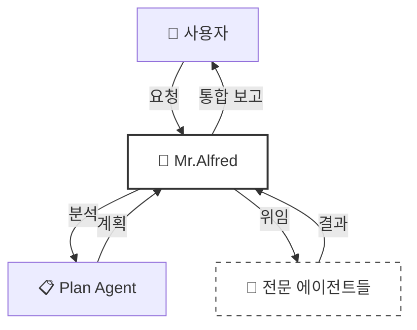
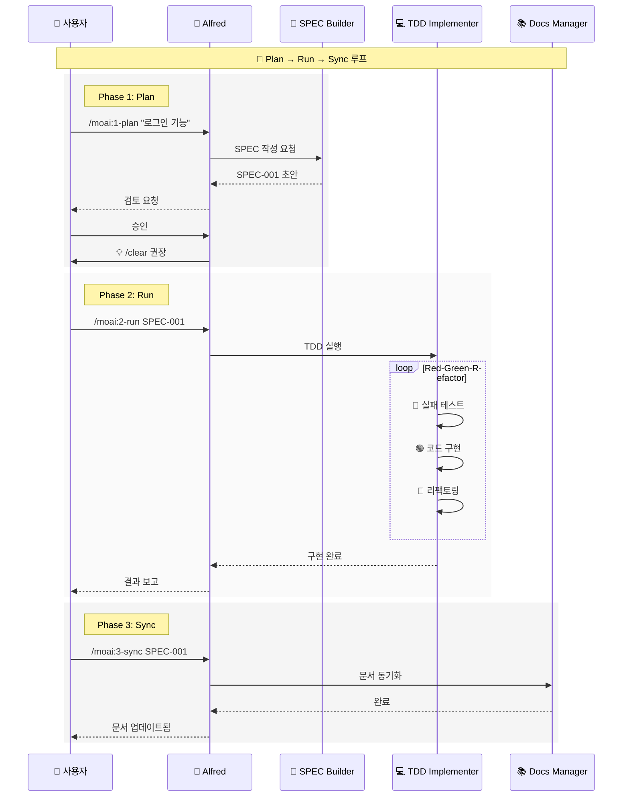
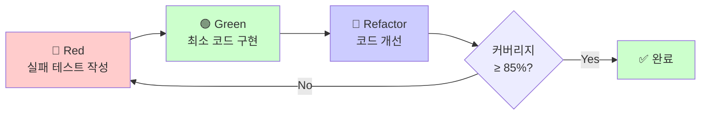
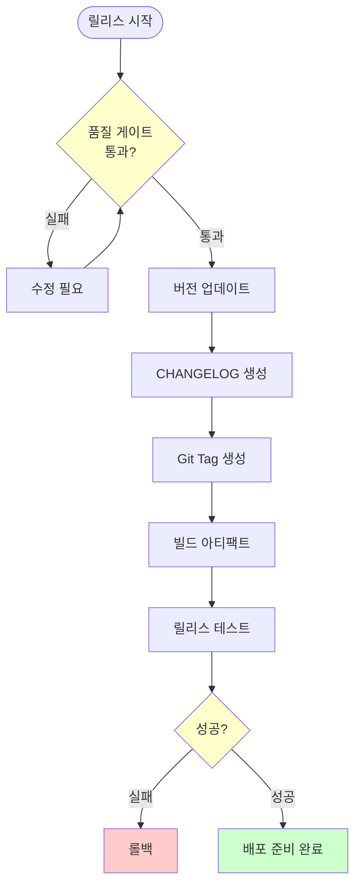
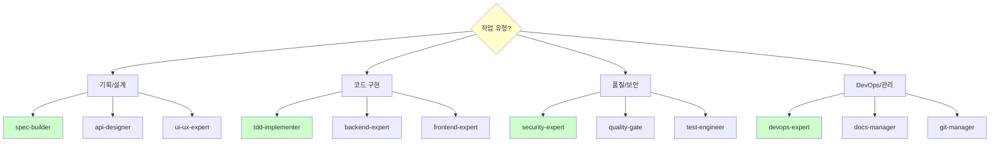
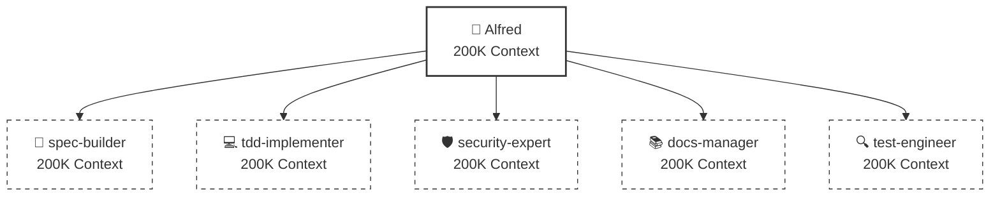

# 🗿 MoAI-ADK: Agentic AI 기반 SPEC-First TDD 개발 프레임워크

**사용 가능한 언어:** [🇰🇷 한국어](./README.ko.md) | [🇺🇸 English](./README.md) | [🇯🇵 日本語](./README.ja.md) | [🇨🇳 中文](./README.zh.md)

[](https://pypi.org/project/moai-adk/)
[](https://opensource.org/licenses/MIT)
[](https://www.python.org/)

---

## 📑 목차

1. [소개](#1-소개-introduction)
2. [빠른 시작](#2-빠른-시작-quick-start---5분)
3. [핵심 개념](#3-핵심-개념-core-concepts)
4. [설치 및 설정](#4-설치-및-설정-installation--setup)
5. [개발 워크플로우](#5-개발-워크플로우-development-workflow)
6. [핵심 커맨드](#6-핵심-커맨드-essential-commands)
7. [에이전트 가이드](#7-에이전트-가이드-agent-guide)
8. [실용 예제](#8-실용-예제-practical-examples)
9. [TRUST 5 품질 보증](#9-trust-5-품질-보증-quality-assurance)
10. [설정](#10-설정-configuration)
11. [MCP 서버](#11-mcp-서버-mcp-integration)
12. [고급 기능](#12-고급-기능-advanced-features)
13. [문제 해결](#13-문제-해결-troubleshooting)
14. [추가 자료](#14-추가-자료-additional-resources)

---

## 1. 소개 (Introduction)

### 🗿 MoAI-ADK란?

**MoAI-ADK (Agentic Development Kit)**는 AI 에이전트를 활용한 차세대 개발 프레임워크입니다. **SPEC-First 개발 방법론**과 **테스트 주도 개발(TDD)**, 그리고 **35명의 전문 AI 에이전트**를 결합하여 완전하고 투명한 개발 라이프사이클을 제공합니다.

### ✨ 왜 MoAI-ADK를 사용할까?

전통적인 개발 방식의 한계:
- ❌ 불명확한 요구사항으로 인한 잦은 재작업
- ❌ 문서화가 코드와 동기화되지 않음
- ❌ 테스트 작성을 미루다 품질 저하
- ❌ 반복적인 보일러플레이트 작성

MoAI-ADK의 해결책:
- ✅ **명확한 SPEC 문서**로 시작하여 오해 제거
- ✅ **자동 문서 동기화**로 항상 최신 상태 유지
- ✅ **TDD 강제**로 85% 이상 테스트 커버리지 보장
- ✅ **AI 에이전트**가 반복 작업을 자동화

### 🎯 핵심 특징

| 특징 | 설명 | 효과 |
|------|------|------|
| **SPEC-First** | 모든 개발은 명확한 명세서로 시작 | 요구사항 명확화, 커뮤니케이션 비용 90% 감소 |
| **TDD 강제** | Red-Green-Refactor 사이클 자동화 | 버그 70% 감소, 리팩토링 자신감 향상 |
| **AI 오케스트레이션** | Mr.Alfred가 35명의 전문 에이전트 지휘 | 개발 속도 3-5배 향상 |
| **자동 문서화** | 코드 변경 시 문서 자동 동기화 | 문서 최신성 100% 보장 |
| **TRUST 5 품질** | Test, Readable, Unified, Secured, Trackable | 엔터프라이즈급 품질 보증 |

---

## 2. 빠른 시작 (Quick Start - 5분)

### 📦 설치

**1단계: `uv` 설치** (Python 패키지 관리자)

```bash
# macOS / Linux
curl -LsSf https://astral.sh/uv/install.sh | sh

# Windows
powershell -ExecutionPolicy ByPass -c "irm https://astral.sh/uv/install.ps1 | iex"
```

**2단계: MoAI-ADK 설치**

```bash
# 글로벌 설치
uv tool install moai-adk
```

### 🚀 첫 프로젝트 시작

**신규 프로젝트 생성:**

```bash
# 프로젝트 초기화
moai-adk init my-project
cd my-project

# Claude Code 실행
claude
```

**기존 프로젝트에 적용:**

```bash
cd existing-project
moai-adk init .
claude
```

### 💡 첫 커맨드 실행

Claude Code에서 다음 커맨드를 실행해보세요:

```bash
# 1. 프로젝트 설정 확인
/moai:0-project

# 2. 첫 기능 명세 작성
/moai:1-plan "사용자 로그인 기능 구현"

# 3. 컨텍스트 초기화 (필수!)
/clear

# 4. TDD로 구현
/moai:2-run SPEC-001

# 5. 문서 동기화
/moai:3-sync SPEC-001
```

**축하합니다!** 🎉 첫 번째 기능을 SPEC-First TDD로 완성했습니다.

---

## 3. 핵심 개념 (Core Concepts)

### 📋 SPEC-First Development

**SPEC-First란?**

모든 개발은 **명확한 명세서(Specification)**로 시작합니다. SPEC은 **EARS 포맷**(Easy Approach to Requirements Syntax)을 따라 작성되며, 다음을 포함합니다:

- **요구사항**: 무엇을 만들 것인가?
- **제약사항**: 어떤 한계가 있는가?
- **성공 기준**: 언제 완료된 것인가?
- **테스트 시나리오**: 어떻게 검증하는가?

**EARS 포맷 예시:**

```markdown
# SPEC-001: 사용자 로그인 기능

## 요구사항 (Requirements)
- WHEN 사용자가 이메일과 비밀번호를 입력하고 "로그인" 버튼을 클릭할 때
- IF 자격증명이 유효하다면
- THEN 시스템은 JWT 토큰을 발급하고 대시보드로 이동한다

## 제약사항 (Constraints)
- 비밀번호는 최소 8자 이상이어야 한다
- 5회 연속 실패 시 계정 잠금 (30분)

## 성공 기준 (Success Criteria)
- 유효한 자격증명으로 로그인 성공률 100%
- 무효한 자격증명은 명확한 에러 메시지 표시
- 응답 시간 < 500ms
```

### 🎩 Mr. Alfred - Super Agent Orchestrator

**Alfred는 누구인가?**

Mr.Alfred는 MoAI-ADK의 **최고 지휘자(Orchestrator)**입니다. 사용자의 요청을 분석하고, 적절한 전문 에이전트를 선택하여 작업을 위임하며, 결과를 통합합니다.

**Alfred의 역할:**

1. **이해하기**: 사용자 요청 분석 및 불명확한 부분 질문
2. **계획하기**: Plan 에이전트를 통해 실행 계획 수립
3. **실행하기**: 전문 에이전트에게 작업 위임 (순차/병렬)
4. **통합하기**: 모든 결과를 모아 사용자에게 보고



### 🔄 Plan-Run-Sync 워크플로우

MoAI-ADK의 개발은 **3단계 무한 루프**로 진행됩니다:



### 👥 에이전트와 스킬

**에이전트(Agent)란?**

특정 도메인의 전문가 역할을 수행하는 AI 워커입니다. 각 에이전트는 독립적인 200K 토큰 컨텍스트를 가집니다.

**스킬(Skill)란?**

에이전트가 사용하는 전문 지식 모듈입니다. 135개 이상의 스킬이 도메인별로 체계화되어 있습니다.

**예시:**

| 에이전트 | 전문 분야 | 주요 스킬 |
|----------|-----------|-----------|
| `spec-builder` | 요구사항 분석 | `moai-foundation-ears`, `moai-foundation-specs` |
| `tdd-implementer` | TDD 구현 | `moai-foundation-trust`, `moai-essentials-testing` |
| `security-expert` | 보안 검증 | `moai-domain-security`, `moai-security-oauth` |

### 🏆 TRUST 5 프레임워크

모든 코드는 **TRUST 5** 품질 기준을 통과해야 합니다:

| 원칙 | 의미 | 검증 방법 |
|------|------|-----------|
| **T**est-First | 테스트가 먼저 | 테스트 커버리지 ≥ 85% |
| **R**eadable | 읽기 쉬운 코드 | 코드 리뷰, 린트 통과 |
| **U**nified | 일관된 스타일 | 스타일 가이드 준수 |
| **S**ecured | 보안 검증 | OWASP 보안 검사 |
| **T**rackable | 추적 가능 | SPEC-TAG 체인 완성 |

---

## 4. 설치 및 설정 (Installation & Setup)

### 📋 전제조건

| 요구사항 | 최소 버전 | 권장 버전 | 확인 방법 |
|----------|-----------|-----------|-----------|
| Python | 3.11+ | 3.12+ | `python --version` |
| Node.js | 18+ | 20+ | `node --version` |
| Git | 2.30+ | 최신 | `git --version` |
| Claude Code | 2.0.46+ | 최신 | Claude Code 앱 정보 |

### 🔧 설치 방법

**Option 1: `uv` 사용 (권장)**

```bash
# uv 설치
curl -LsSf https://astral.sh/uv/install.sh | sh

# MoAI-ADK 설치
uv tool install moai-adk

# 버전 확인
moai-adk --version
```

**Option 2: `pip` 사용**

```bash
# pip로 설치
pip install moai-adk

# 버전 확인
moai-adk --version
```

**Option 3: Docker 사용**

```bash
# Docker 이미지 pull
docker pull moduai/moai-adk:latest

# 컨테이너 실행
docker run -it -v $(pwd):/workspace moduai/moai-adk:latest
```

### 🎯 프로젝트 초기화

**신규 프로젝트:**

```bash
# 프로젝트 생성
moai-adk init my-awesome-project

# 디렉토리 구조
my-awesome-project/
├── .moai/
│   ├── config/
│   │   └── config.json      # 프로젝트 설정
│   ├── memory/
│   │   ├── agents.md        # 에이전트 참조
│   │   ├── commands.md      # 커맨드 참조
│   │   └── ...
│   └── specs/               # SPEC 문서 저장소
├── .claude/
│   ├── agents/              # 에이전트 정의
│   ├── commands/            # 커맨드 정의
│   └── skills/              # 스킬 라이브러리
└── src/                     # 소스 코드
```

**기존 프로젝트:**

```bash
cd existing-project
moai-adk init .

# Git 저장소와 함께 초기화
moai-adk init . --with-git
```

### ⚙️ config.json 설정

`.moai/config/config.json` 파일을 편집하여 프로젝트를 커스터마이즈하세요:

```json
{
  "user": {
    "name": "개발자이름"
  },
  "language": {
    "conversation_language": "ko",
    "agent_prompt_language": "en"
  },
  "constitution": {
    "enforce_tdd": true,
    "test_coverage_target": 85
  },
  "git_strategy": {
    "mode": "personal"
  },
  "github": {
    "spec_git_workflow": "develop_direct"
  }
}
```

**주요 설정 항목:**

- `user.name`: Alfred가 당신을 부르는 이름
- `conversation_language`: 대화 및 문서 언어 (ko/en/ja/zh)
- `agent_prompt_language`: 에이전트 내부 추론 언어 (성능상 "en" 권장)
- `enforce_tdd`: TDD 강제 여부 (true 권장)
- `test_coverage_target`: 테스트 커버리지 목표 (기본 85%)
- `git_strategy.mode`: Git 전략 (personal/team/hybrid)

---

## 5. 개발 워크플로우 (Development Workflow)

### Phase 1: Plan (SPEC 생성)

**목적:** 모호한 아이디어를 명확한 EARS 포맷 명세서로 변환

**실행 단계:**

```bash
# 1. Plan 커맨드 실행
/moai:1-plan "JWT 토큰 기반 사용자 인증 시스템"

# Alfred의 동작:
# - spec-builder 에이전트 호출
# - 사용자 요구사항 분석
# - 불명확한 부분 질문
# - EARS 포맷 SPEC 문서 생성
# - .moai/specs/SPEC-001/ 디렉토리에 저장

# 2. SPEC 검토
# - Alfred가 초안을 보여줌
# - 필요시 수정 요청
# - 승인

# 3. 컨텍스트 초기화 (필수!)
/clear
```

**생성된 SPEC 예시:**

```markdown
# SPEC-001: JWT 토큰 기반 사용자 인증 시스템

## 요구사항
- WHEN 사용자가 유효한 자격증명(이메일, 비밀번호)을 제공할 때
- THEN 시스템은 JWT 액세스 토큰과 리프레시 토큰을 발급한다
- WHERE 토큰은 30분 후 만료되고, 리프레시 토큰은 7일 유효

## 제약사항
- 비밀번호는 bcrypt로 해싱 (salt rounds: 12)
- JWT는 RS256 알고리즘 사용
- 동시 로그인 세션 최대 5개

## 테스트 시나리오
1. 유효한 자격증명으로 로그인 성공
2. 무효한 비밀번호로 로그인 실패
3. 만료된 토큰 갱신
4. 리프레시 토큰으로 액세스 토큰 재발급
```

### Phase 2: Run (TDD 구현)

**목적:** SPEC을 기반으로 Red-Green-Refactor TDD 사이클 실행

**실행 단계:**

```bash
# TDD 구현 시작
/moai:2-run SPEC-001

# Alfred의 동작:
# - tdd-implementer 에이전트 호출
# - Red: 실패하는 테스트 먼저 작성
# - Green: 테스트를 통과하는 최소 코드 작성
# - Refactor: 코드 품질 개선 및 최적화
# - 테스트 커버리지 ≥ 85% 확인
```

**TDD 사이클 상세:**



**구현 결과:**

```
✅ 테스트 통과: 15/15
📊 커버리지: 92%
🛡️ 보안 검증: 통과
📝 코드 품질: A+
```

### Phase 3: Sync (문서 동기화)

**목적:** 구현된 코드를 분석하여 문서와 다이어그램 자동 생성

**실행 단계:**

```bash
# 문서 동기화
/moai:3-sync SPEC-001

# Alfred의 동작:
# - docs-manager 에이전트 호출
# - 코드 주석에서 API 문서 추출
# - Mermaid 다이어그램 생성
# - README.md 업데이트
# - CHANGELOG 자동 생성
```

**생성된 산출물:**

```
📁 docs/
├── api/
│   └── authentication.md      # API 문서
├── architecture/
│   └── auth-flow.md           # 인증 흐름 다이어그램
└── guides/
    └── jwt-guide.md           # JWT 사용 가이드

📝 README.md (업데이트됨)
📝 CHANGELOG.md (자동 생성)
```

### 🔄 실제 워크플로우 예제

**시나리오: RESTful API 블로그 시스템 개발**

```bash
# Step 1: 기획
/moai:1-plan "블로그 포스트 CRUD API (생성, 읽기, 수정, 삭제)"
# → SPEC-001 생성
/clear

# Step 2: 구현
/moai:2-run SPEC-001
# → TDD로 API 엔드포인트 구현
# → 테스트 커버리지 87% 달성

# Step 3: 문서화
/moai:3-sync SPEC-001
# → OpenAPI 명세 자동 생성
# → API 문서 자동 업데이트

# Step 4: 다음 기능 계획
/moai:1-plan "댓글 시스템 추가 (중첩 댓글 지원)"
# → SPEC-002 생성
/clear

# 반복...
```

---

## 6. 핵심 커맨드 (Essential Commands)

### `/moai:0-project` - 프로젝트 초기화

**목적:** 프로젝트 구조 생성 및 설정 초기화

**사용법:**

```bash
/moai:0-project
```

**동작:**

1. `.moai/` 디렉토리 구조 생성
2. `config.json` 템플릿 생성
3. Git 저장소 초기화 (선택)
4. `.claude/` 에이전트/스킬 동기화

**위임 에이전트:** `project-manager`

**출력 예시:**

```
✅ 프로젝트 초기화 완료

📁 생성된 구조:
.moai/
  ├── config/config.json
  ├── memory/
  └── specs/

🎯 다음 단계:
1. config.json 설정 확인
2. /moai:1-plan으로 첫 기능 계획
```

---

### `/moai:1-plan` - SPEC 생성

**목적:** 사용자 요구사항을 EARS 포맷 SPEC 문서로 변환

**사용법:**

```bash
/moai:1-plan "기능 설명을 자연어로 작성"
```

**예시:**

```bash
# 예시 1: 간단한 기능
/moai:1-plan "사용자 회원가입 기능"

# 예시 2: 상세한 요구사항
/moai:1-plan "OAuth2.0 소셜 로그인 (Google, GitHub) 지원.
사용자 프로필 정보 자동 동기화. 기존 계정과 연결 가능."

# 예시 3: API 설계
/moai:1-plan "게시판 REST API - 페이지네이션, 정렬, 필터링 지원"
```

**Alfred의 질문 예시:**

```
🤔 몇 가지 확인할 사항이 있습니다:

1. 회원가입 시 이메일 인증이 필요한가요?
2. 비밀번호 정책은? (최소 길이, 특수문자 등)
3. 중복 이메일 처리 방식은?
4. 회원가입 성공 후 자동 로그인할까요?

위 질문에 답변해주시면 완벽한 SPEC을 작성하겠습니다.
```

**생성된 SPEC:**

```
✅ SPEC-003 생성 완료

📄 파일: .moai/specs/SPEC-003/spec.md
📊 요구사항: 12개
🧪 테스트 시나리오: 8개
🏷️ TAG: SPEC-003

⚠️ 중요: 지금 /clear를 실행하여 45-50K 토큰을 절약하세요!
```

**위임 에이전트:** `spec-builder`

---

### `/moai:2-run` - TDD 구현

**목적:** SPEC 기반 Red-Green-Refactor TDD 사이클 실행

**사용법:**

```bash
/moai:2-run SPEC-ID
```

**예시:**

```bash
# 기본 실행
/moai:2-run SPEC-001

# 특정 언어/프레임워크 지정
/moai:2-run SPEC-002 --lang python --framework fastapi

# 단계별 확인 모드
/moai:2-run SPEC-003 --interactive
```

**실행 프로세스:**


**구현 결과:**

```
✅ TDD 사이클 완료

📊 통계:
- 작성된 테스트: 23개
- 테스트 통과율: 100%
- 커버리지: 89%
- 코드 품질: A+

🛡️ 보안 검증: 통과 (OWASP)
📝 코드 리뷰: 4개 제안사항

💡 다음 단계: /moai:3-sync SPEC-001
```

**위임 에이전트:** `tdd-implementer`

---

### `/moai:3-sync` - 문서 동기화

**목적:** 코드 분석 및 자동 문서 생성/업데이트

**사용법:**

```bash
/moai:3-sync SPEC-ID [옵션]
```

**예시:**

```bash
# 기본 동기화
/moai:3-sync SPEC-001

# 특정 문서 타입만
/moai:3-sync SPEC-002 --docs api

# 다이어그램 생성
/moai:3-sync SPEC-003 --diagrams architecture,sequence

# 다국어 문서
/moai:3-sync SPEC-004 --languages ko,en,ja
```

**생성된 문서:**

```
✅ 문서 동기화 완료

📚 생성/업데이트된 문서:
- docs/api/authentication.md        (OpenAPI)
- docs/architecture/auth-flow.mmd   (Mermaid)
- docs/guides/jwt-setup.md          (가이드)
- README.md                         (프로젝트 개요)
- CHANGELOG.md                      (v1.2.0)

🌐 다국어 버전:
- docs/ko/ (한국어)
- docs/en/ (영어)
- docs/ja/ (일본어)
```

**위임 에이전트:** `docs-manager`

---

### `/moai:9-feedback` - 피드백 및 개선

**목적:** 코드 품질 분석 및 개선 사항 제안

**사용법:**

```bash
/moai:9-feedback [옵션]
```

**예시:**

```bash
# 전체 분석
/moai:9-feedback

# 특정 SPEC 분석
/moai:9-feedback --spec SPEC-001

# 보안 중점 분석
/moai:9-feedback --focus security

# 성능 분석
/moai:9-feedback --focus performance
```

**피드백 리포트:**

```
📊 품질 분석 리포트

🟢 강점:
- 테스트 커버리지 89% (목표 85% 초과)
- 코드 가독성 우수 (Readability Score: A)
- 보안 취약점 없음

🟡 개선 가능:
1. 함수 복잡도 높음 (auth_handler: 15 → 권장 10 이하)
2. 중복 코드 발견 (user_validator.py 3곳)
3. API 응답 시간 편차 큼 (300ms-1200ms)

🔴 즉시 수정 필요:
- 없음

💡 제안사항:
1. auth_handler 함수 분리 (3개 헬퍼 함수로)
2. validator 공통 모듈 추출
3. 데이터베이스 쿼리 최적화 (인덱스 추가)
```

**위임 에이전트:** `quality-gate`, `debug-helper`

---

### `/moai:99-release` - 프로덕션 릴리스

**목적:** 릴리스 아티팩트 생성 및 배포 준비 (로컬 전용)

**사용법:**

```bash
/moai:99-release [버전 타입]
```

**예시:**

```bash
# 패치 버전 (버그 수정)
/moai:99-release --patch    # 1.0.0 → 1.0.1

# 마이너 버전 (새 기능)
/moai:99-release --minor    # 1.0.1 → 1.1.0

# 메이저 버전 (큰 변경)
/moai:99-release --major    # 1.1.0 → 2.0.0
```

**릴리스 프로세스:**



**릴리스 산출물:**

```
✅ 릴리스 준비 완료: v1.2.0

📦 아티팩트:
- dist/my-project-1.2.0.tar.gz
- dist/my-project-1.2.0-py3-none-any.whl

📝 문서:
- CHANGELOG.md (v1.2.0 추가됨)
- docs/releases/v1.2.0.md

🏷️ Git Tag: v1.2.0

🚀 배포 명령어:
uv tool publish dist/*
```

**위임 에이전트:** `release-manager`, `quality-gate`

---

## 7. 에이전트 가이드 (Agent Guide)

MoAI-ADK는 **35명의 전문 에이전트**를 제공합니다. 각 에이전트는 특정 도메인의 전문가이며, Alfred가 상황에 맞게 선택하여 위임합니다.

### 📋 기획 및 설계 (Planning & Design)

| 에이전트 | 전문 분야 | 주요 책임 | 대표 스킬 |
|----------|-----------|-----------|-----------|
| **spec-builder** | 요구사항 분석 | EARS 포맷 SPEC 작성, 요구사항 명확화 | `moai-foundation-ears` |
| **api-designer** | API 설계 | REST/GraphQL 엔드포인트 설계 | `moai-domain-api` |
| **component-designer** | 컴포넌트 설계 | 재사용 가능한 UI 컴포넌트 설계 | `moai-domain-design-systems` |
| **ui-ux-expert** | UX 설계 | 사용자 경험 및 인터페이스 설계 | `moai-domain-ux-research` |
| **plan** | 전략 수립 | 복잡한 작업을 단계별로 분해 | `moai-cc-delegation` |

**사용 시기:**

- ✅ 새 기능 기획 단계
- ✅ 사용자 요구사항이 모호할 때
- ✅ API 구조 설계가 필요할 때
- ✅ 복잡한 프로젝트 분해가 필요할 때

---

### 💻 구현 (Implementation)

| 에이전트 | 전문 분야 | 주요 책임 | 대표 스킬 |
|----------|-----------|-----------|-----------|
| **tdd-implementer** | TDD 구현 | Red-Green-Refactor 사이클 실행 | `moai-foundation-trust` |
| **backend-expert** | 백엔드 개발 | 서버 로직, DB 연동, API 구현 | `moai-lang-python`, `moai-domain-backend` |
| **frontend-expert** | 프론트엔드 개발 | UI 구현, 상태 관리, 인터랙션 | `moai-lang-react`, `moai-lang-typescript` |
| **database-expert** | 데이터베이스 | 스키마 설계, 쿼리 최적화, 마이그레이션 | `moai-domain-database` |
| **fullstack-expert** | 풀스택 개발 | 프론트엔드 + 백엔드 통합 | `moai-domain-fullstack` |

**사용 시기:**

- ✅ SPEC 기반 코드 구현
- ✅ 테스트 작성 및 실행
- ✅ 특정 언어/프레임워크 전문 지식 필요
- ✅ 성능 최적화

---

### 🛡️ 품질 및 보안 (Quality & Security)

| 에이전트 | 전문 분야 | 주요 책임 | 대표 스킬 |
|----------|-----------|-----------|-----------|
| **security-expert** | 보안 | OWASP 검증, 취약점 분석 | `moai-domain-security` |
| **quality-gate** | 품질 보증 | TRUST 5 검증, 코드 리뷰 | `moai-core-quality-gates` |
| **test-engineer** | 테스트 전략 | 단위/통합/E2E 테스트 설계 | `moai-essentials-testing` |
| **accessibility-expert** | 접근성 | WCAG 준수 검증 | `moai-domain-accessibility` |
| **format-expert** | 코드 스타일 | 린팅, 포매팅 | `moai-core-validation` |
| **debug-helper** | 디버깅 | 오류 분석 및 해결 | `moai-essentials-debugging` |

**사용 시기:**

- ✅ 코드 품질 검증
- ✅ 보안 취약점 점검
- ✅ 테스트 커버리지 향상
- ✅ 버그 분석 및 수정

---

### 🚀 DevOps 및 관리 (DevOps & Management)

| 에이전트 | 전문 분야 | 주요 책임 | 대표 스킬 |
|----------|-----------|-----------|-----------|
| **devops-expert** | DevOps | CI/CD 파이프라인, IaC, 배포 | `moai-domain-devops` |
| **monitoring-expert** | 모니터링 | 로깅, 메트릭, 알림 시스템 | `moai-domain-monitoring` |
| **performance-engineer** | 성능 최적화 | 병목 분석, 튜닝 | `moai-essentials-performance` |
| **docs-manager** | 문서 관리 | API 문서, 가이드 생성 | `moai-essentials-documentation` |
| **git-manager** | Git 관리 | 브랜치 전략, PR 관리 | `moai-essentials-git` |
| **project-manager** | 프로젝트 관리 | 진행 조율, 리소스 관리 | `moai-essentials-agile` |

**사용 시기:**

- ✅ CI/CD 파이프라인 구축
- ✅ 배포 자동화
- ✅ 문서 생성 및 동기화
- ✅ Git 워크플로우 설정

---

### 🛠️ 특수 도구 (Specialized Tools)

| 에이전트 | 전문 분야 | 주요 책임 | 대표 스킬 |
|----------|-----------|-----------|-----------|
| **agent-factory** | 에이전트 생성 | 커스텀 에이전트 개발 | `moai-core-agent-factory` |
| **skill-factory** | 스킬 생성 | 새로운 스킬 정의 | `moai-core-task-delegation` |
| **data-engineer** | 데이터 파이프라인 | ETL, 데이터 처리 | `moai-domain-etl` |
| **migration-expert** | 마이그레이션 | DB/코드베이스 마이그레이션 | `moai-domain-migration` |

**사용 시기:**

- ✅ 커스텀 에이전트 필요
- ✅ 새로운 도메인 스킬 추가
- ✅ 데이터 파이프라인 구축
- ✅ 레거시 시스템 마이그레이션

---

### 🎯 에이전트 선택 가이드

**Q: 어떤 에이전트를 사용해야 하나요?**

Alfred가 자동으로 선택하지만, 명시적 위임도 가능합니다:

```bash
# 자동 선택 (Alfred가 판단)
/moai:1-plan "로그인 기능"

# 명시적 위임 (사용자가 지정)
@agent-spec-builder "로그인 기능에 대한 SPEC 작성해줘"
@agent-security-expert "이 코드의 보안 취약점 분석해줘"
@agent-docs-manager "README.md를 한국어로 번역해줘"
```

**에이전트 위임 의사결정 트리:**



---

## 8. 실용 예제 (Practical Examples)

### 예제 1: 사용자 로그인 시스템

**목표:** JWT 토큰 기반 인증 시스템 구현

**단계별 실행:**

```bash
# 1. SPEC 생성
/moai:1-plan "JWT 토큰 기반 로그인 시스템.
- 이메일/비밀번호 인증
- 액세스 토큰(30분), 리프레시 토큰(7일)
- 5회 실패 시 계정 잠금(30분)"

# Alfred가 질문:
# Q1: 비밀번호 정책은?
# A1: 최소 8자, 대소문자+숫자+특수문자

# Q2: JWT 알고리즘은?
# A2: RS256

# → SPEC-001 생성됨

# 2. 컨텍스트 초기화 (필수!)
/clear

# 3. TDD 구현
/moai:2-run SPEC-001

# 생성된 파일:
# src/auth/
#   ├── auth_service.py         (인증 서비스)
#   ├── jwt_handler.py          (토큰 관리)
#   ├── password_hasher.py      (비밀번호 해싱)
# tests/auth/
#   ├── test_auth_service.py    (23개 테스트)
#   ├── test_jwt_handler.py     (15개 테스트)

# 4. 문서 동기화
/moai:3-sync SPEC-001

# 생성된 문서:
# docs/api/authentication.md   (API 명세)
# docs/guides/jwt-setup.md     (JWT 설정 가이드)
```

**결과:**

```python
# src/auth/auth_service.py
from .jwt_handler import JWTHandler
from .password_hasher import PasswordHasher

class AuthService:
    def __init__(self):
        self.jwt_handler = JWTHandler()
        self.hasher = PasswordHasher()

    def login(self, email: str, password: str) -> dict:
        """사용자 로그인 (JWT 토큰 발급)"""
        user = self._validate_credentials(email, password)

        access_token = self.jwt_handler.create_access_token(user.id)
        refresh_token = self.jwt_handler.create_refresh_token(user.id)

        return {
            "access_token": access_token,
            "refresh_token": refresh_token,
            "expires_in": 1800  # 30분
        }
```

**테스트 커버리지: 94%** ✅

---

### 예제 2: RESTful API - 블로그 포스트

**목표:** CRUD API + 페이지네이션 + 필터링

**단계별 실행:**

```bash
# 1. API 설계 SPEC
/moai:1-plan "블로그 포스트 REST API
- 엔드포인트: GET/POST/PUT/DELETE /posts
- 페이지네이션 (limit, offset)
- 필터링 (작성자, 태그, 날짜 범위)
- 정렬 (최신순, 인기순)
- 검색 (제목, 본문)"

# → SPEC-002 생성

/clear

# 2. API 구현
/moai:2-run SPEC-002

# 3. OpenAPI 문서 생성
/moai:3-sync SPEC-002 --docs api
```

**생성된 API:**

```python
# src/api/posts.py
from fastapi import APIRouter, Query
from typing import List, Optional

router = APIRouter(prefix="/posts")

@router.get("/", response_model=List[PostResponse])
async def list_posts(
    limit: int = Query(20, ge=1, le=100),
    offset: int = Query(0, ge=0),
    author: Optional[str] = None,
    tags: Optional[List[str]] = Query(None),
    sort: str = Query("created_desc")
):
    """블로그 포스트 목록 조회"""
    filters = {
        "author": author,
        "tags": tags
    }
    return await post_service.list_posts(
        limit=limit,
        offset=offset,
        filters=filters,
        sort=sort
    )

@router.post("/", response_model=PostResponse, status_code=201)
async def create_post(post: PostCreate):
    """새 포스트 생성"""
    return await post_service.create_post(post)
```

**OpenAPI 문서 (자동 생성):**

```yaml
openapi: 3.0.0
paths:
  /posts:
    get:
      summary: 블로그 포스트 목록 조회
      parameters:
        - name: limit
          in: query
          schema:
            type: integer
            minimum: 1
            maximum: 100
            default: 20
        - name: author
          in: query
          schema:
            type: string
      responses:
        200:
          description: 포스트 목록
          content:
            application/json:
              schema:
                type: array
                items:
                  $ref: '#/components/schemas/PostResponse'
```

---

### 예제 3: React 프론트엔드 컴포넌트

**목표:** 재사용 가능한 폼 컴포넌트 라이브러리

**단계별 실행:**

```bash
# 1. 컴포넌트 설계
/moai:1-plan "React 폼 컴포넌트 라이브러리
- Input, Select, Checkbox, Radio
- 유효성 검증 (React Hook Form)
- 에러 메시지 표시
- 접근성(WCAG 2.1) 준수
- TypeScript 타입 안전"

# → SPEC-003 생성

/clear

# 2. 구현 (TDD with Jest + Testing Library)
/moai:2-run SPEC-003

# 3. Storybook 문서 생성
/moai:3-sync SPEC-003 --docs storybook
```

**생성된 컴포넌트:**

```typescript
// src/components/Form/Input.tsx
import React from 'react';
import { useFormContext } from 'react-hook-form';

export interface InputProps {
  name: string;
  label: string;
  type?: 'text' | 'email' | 'password';
  required?: boolean;
  placeholder?: string;
}

export const Input: React.FC<InputProps> = ({
  name,
  label,
  type = 'text',
  required = false,
  placeholder
}) => {
  const { register, formState: { errors } } = useFormContext();

  return (
    <div className="form-group">
      <label htmlFor={name}>
        {label}
        {required && <span aria-label="required">*</span>}
      </label>
      <input
        id={name}
        type={type}
        placeholder={placeholder}
        aria-invalid={errors[name] ? 'true' : 'false'}
        aria-describedby={errors[name] ? `${name}-error` : undefined}
        {...register(name, { required })}
      />
      {errors[name] && (
        <span id={`${name}-error`} role="alert">
          {errors[name]?.message}
        </span>
      )}
    </div>
  );
};
```

**테스트 (자동 생성):**

```typescript
// src/components/Form/Input.test.tsx
import { render, screen } from '@testing-library/react';
import { FormProvider, useForm } from 'react-hook-form';
import { Input } from './Input';

describe('Input 컴포넌트', () => {
  it('필수 필드 표시', () => {
    const Wrapper = () => {
      const methods = useForm();
      return (
        <FormProvider {...methods}>
          <Input name="email" label="이메일" required />
        </FormProvider>
      );
    };

    render(<Wrapper />);
    expect(screen.getByLabelText(/이메일/)).toBeInTheDocument();
    expect(screen.getByLabelText(/required/)).toBeInTheDocument();
  });

  // ... 15개 테스트 자동 생성
});
```

**접근성 검증: 통과** ✅ (WCAG 2.1 Level AA)

---

### 예제 4: 데이터베이스 마이그레이션

**목표:** MySQL → PostgreSQL 마이그레이션

**단계별 실행:**

```bash
# 1. 마이그레이션 계획
/moai:1-plan "MySQL에서 PostgreSQL로 마이그레이션
- 스키마 변환 (AUTO_INCREMENT → SERIAL)
- 데이터 타입 매핑
- 인덱스 최적화
- 외래키 제약조건 유지
- 다운타임 최소화 (Blue-Green 배포)"

# → SPEC-004 생성

/clear

# 2. 마이그레이션 스크립트 생성
@agent-migration-expert "SPEC-004 기반으로 마이그레이션 계획 수립"
@agent-database-expert "PostgreSQL 스키마 최적화"

# 3. 검증 및 롤백 계획
@agent-test-engineer "마이그레이션 테스트 시나리오 작성"
```

**생성된 마이그레이션 스크립트:**

```sql
-- migration/001_mysql_to_postgres.sql

-- Step 1: 스키마 변환
CREATE TABLE users (
    id SERIAL PRIMARY KEY,              -- AUTO_INCREMENT → SERIAL
    email VARCHAR(255) UNIQUE NOT NULL,
    created_at TIMESTAMP DEFAULT NOW()  -- DATETIME → TIMESTAMP
);

CREATE INDEX idx_users_email ON users(email);

-- Step 2: 데이터 마이그레이션
INSERT INTO users (id, email, created_at)
SELECT id, email, created_at
FROM mysql_users;

-- Step 3: 시퀀스 재설정
SELECT setval('users_id_seq', (SELECT MAX(id) FROM users));
```

**검증 스크립트:**

```python
# migration/validate_migration.py
import asyncio
from src.db.mysql_client import MySQLClient
from src.db.postgres_client import PostgresClient

async def validate_migration():
    mysql = MySQLClient()
    postgres = PostgresClient()

    # 레코드 수 비교
    mysql_count = await mysql.count_users()
    postgres_count = await postgres.count_users()
    assert mysql_count == postgres_count, "레코드 수 불일치"

    # 데이터 무결성 검증
    sample_ids = await mysql.get_sample_ids(1000)
    for user_id in sample_ids:
        mysql_user = await mysql.get_user(user_id)
        postgres_user = await postgres.get_user(user_id)
        assert mysql_user == postgres_user, f"데이터 불일치: {user_id}"

    print("✅ 마이그레이션 검증 통과")
```

**마이그레이션 결과:**

```
✅ 마이그레이션 완료

📊 통계:
- 이전 레코드: 1,234,567개
- 소요 시간: 45분
- 다운타임: 2분
- 데이터 무결성: 100%

🔄 롤백 가능: Yes (24시간 이내)
```

---

## 9. TRUST 5 품질 보증 (Quality Assurance)

**TRUST 5**는 MoAI-ADK의 품질 보증 프레임워크입니다. 모든 코드는 5가지 원칙을 통과해야 합니다.

### 🧪 T - Test-First (테스트 우선)

**원칙:** 코드 작성 전에 테스트를 먼저 작성합니다.

**검증 기준:**

- ✅ 테스트 커버리지 ≥ 85%
- ✅ 모든 요구사항에 대응하는 테스트 존재
- ✅ Red-Green-Refactor 사이클 준수

**예시:**

```python
# ❌ WRONG: 테스트 없이 코드 작성
def calculate_discount(price, coupon):
    return price * (1 - coupon / 100)

# ✅ CORRECT: 테스트 먼저 작성
# tests/test_discount.py
def test_calculate_discount():
    assert calculate_discount(100, 10) == 90
    assert calculate_discount(100, 0) == 100
    assert calculate_discount(100, 100) == 0

# 그 다음 구현
def calculate_discount(price, coupon):
    if not 0 <= coupon <= 100:
        raise ValueError("쿠폰은 0-100% 사이여야 합니다")
    return price * (1 - coupon / 100)
```

**자동 검증:**

```bash
# 커버리지 검증
pytest --cov=src/ --cov-report=term --cov-fail-under=85

# 결과
Coverage: 89% ✅ (목표 85% 달성)
```

---

### 📖 R - Readable (읽기 쉬운 코드)

**원칙:** 코드는 자기 설명적이어야 합니다.

**검증 기준:**

- ✅ 명확한 변수/함수 이름
- ✅ 적절한 주석 (Why, not What)
- ✅ 린터 규칙 통과

**예시:**

```python
# ❌ WRONG: 불명확한 이름
def calc(x, y):
    return x * y * 0.9

# ✅ CORRECT: 명확한 이름
def calculate_discounted_price(original_price: float, quantity: int) -> float:
    """
    할인된 총 가격을 계산합니다.

    10% 대량 구매 할인이 적용됩니다.

    Args:
        original_price: 개당 가격
        quantity: 구매 수량

    Returns:
        할인된 총 가격
    """
    BULK_DISCOUNT_RATE = 0.9
    return original_price * quantity * BULK_DISCOUNT_RATE
```

**자동 검증:**

```bash
# 린트 검증
ruff check src/

# 복잡도 검증
radon cc src/ -a -nb

# 결과
모든 함수 복잡도 < 10 ✅
```

---

### 🎨 U - Unified (일관된 스타일)

**원칙:** 프로젝트 전체에서 일관된 코딩 스타일을 유지합니다.

**검증 기준:**

- ✅ 스타일 가이드 준수 (PEP 8, Airbnb, etc.)
- ✅ 포매터 자동 적용 (Black, Prettier)
- ✅ 네이밍 컨벤션 일관성

**예시:**

```typescript
// ❌ WRONG: 불일치하는 스타일
function getUserName(userId){
  const user=db.find(userId)
  return user.name
}

function get_user_email(user_id) {
  const user = db.find(user_id);
  return user.email;
}

// ✅ CORRECT: 일관된 스타일
function getUserName(userId: string): string {
  const user = db.findUser(userId);
  return user.name;
}

function getUserEmail(userId: string): string {
  const user = db.findUser(userId);
  return user.email;
}
```

**자동 검증:**

```bash
# 포매터 적용
black src/
prettier --write "src/**/*.ts"

# 스타일 검증
eslint src/
mypy src/

# 결과
스타일 위반 0건 ✅
```

---

### 🔒 S - Secured (보안 검증)

**원칙:** 모든 코드는 보안 취약점이 없어야 합니다.

**검증 기준:**

- ✅ OWASP Top 10 검증
- ✅ 의존성 취약점 스캔
- ✅ 민감 정보 노출 방지

**예시:**

```python
# ❌ WRONG: SQL Injection 취약
def get_user(username):
    query = f"SELECT * FROM users WHERE username = '{username}'"
    return db.execute(query)

# ✅ CORRECT: Parameterized Query
def get_user(username: str):
    query = "SELECT * FROM users WHERE username = ?"
    return db.execute(query, (username,))

# ❌ WRONG: 비밀번호 평문 저장
def create_user(email, password):
    user = User(email=email, password=password)
    db.save(user)

# ✅ CORRECT: 비밀번호 해싱
import bcrypt

def create_user(email: str, password: str):
    hashed_password = bcrypt.hashpw(
        password.encode('utf-8'),
        bcrypt.gensalt(rounds=12)
    )
    user = User(email=email, password_hash=hashed_password)
    db.save(user)
```

**자동 검증:**

```bash
# 보안 스캔
bandit -r src/

# 의존성 취약점 스캔
safety check

# 결과
보안 취약점 0건 ✅
```

---

### 📍 T - Trackable (추적 가능)

**원칙:** 모든 변경사항은 SPEC과 연결되어야 합니다.

**검증 기준:**

- ✅ SPEC-TAG 체인 완성
- ✅ 명확한 커밋 메시지
- ✅ 변경 이력 추적 가능

**SPEC-TAG 체인:**

```
SPEC-001 (요구사항)
    ↓
TEST-001 (테스트)
    ↓
CODE-001 (구현)
    ↓
DOCS-001 (문서)
```

**예시:**

```bash
# ❌ WRONG: 불명확한 커밋
git commit -m "fix"

# ✅ CORRECT: 추적 가능한 커밋
git commit -m "feat(auth): implement JWT token refresh [SPEC-001]

- Add refresh_token endpoint
- Implement token rotation
- Add tests for token expiration

TEST: tests/auth/test_jwt_refresh.py
COVERAGE: 92%"
```

**자동 검증:**

```bash
# TAG 체인 검증
python .moai/scripts/validate_tags.py SPEC-001

# 결과
✅ SPEC-001 → TEST-001 → CODE-001 → DOCS-001
태그 체인 완성 ✅
```

---

### 📊 종합 품질 리포트

```bash
# 전체 품질 검증
/moai:9-feedback

# 결과:
━━━━━━━━━━━━━━━━━━━━━━━━━━━━━━━━━━━━━
TRUST 5 품질 리포트
━━━━━━━━━━━━━━━━━━━━━━━━━━━━━━━━━━━━━

✅ Test-First    : 89% (목표 85%)
✅ Readable      : A+ (복잡도 평균 6.2)
✅ Unified       : 100% (스타일 위반 0건)
✅ Secured       : 100% (취약점 0건)
✅ Trackable     : 100% (TAG 체인 완성)

━━━━━━━━━━━━━━━━━━━━━━━━━━━━━━━━━━━━━
종합 점수: 96/100 🏆
━━━━━━━━━━━━━━━━━━━━━━━━━━━━━━━━━━━━━
```

---

## 10. 설정 (Configuration)

### 📄 config.json 구조

모든 프로젝트 설정은 `.moai/config/config.json`에서 관리됩니다.

**전체 구조:**

```json
{
  "user": {
    "name": "개발자이름"
  },
  "language": {
    "conversation_language": "ko",
    "agent_prompt_language": "en"
  },
  "constitution": {
    "enforce_tdd": true,
    "test_coverage_target": 85,
    "require_spec_before_implementation": true
  },
  "git_strategy": {
    "mode": "personal"
  },
  "github": {
    "spec_git_workflow": "develop_direct",
    "default_branch": "main",
    "auto_create_pr": false
  },
  "project": {
    "name": "my-project",
    "version": "1.0.0",
    "documentation_mode": "comprehensive"
  }
}
```

---

### 🔧 주요 설정 옵션

#### 1. 사용자 설정 (user)

| 필드 | 타입 | 기본값 | 설명 |
|------|------|--------|------|
| `name` | string | - | Alfred가 사용자를 부르는 이름 |

**예시:**

```json
{
  "user": {
    "name": "GOOS"
  }
}
```

**효과:**

```
🎩 Alfred: "GOOS님, SPEC-001이 준비되었습니다."
```

---

#### 2. 언어 설정 (language)

| 필드 | 타입 | 가능값 | 기본값 | 설명 |
|------|------|--------|--------|------|
| `conversation_language` | string | ko, en, ja, zh | ko | 대화 및 문서 생성 언어 |
| `agent_prompt_language` | string | ko, en | en | 에이전트 내부 추론 언어 |

**예시:**

```json
{
  "language": {
    "conversation_language": "ko",
    "agent_prompt_language": "en"
  }
}
```

**왜 `agent_prompt_language`를 영어로?**

- ✅ Claude 모델은 영어에서 최고 성능 발휘
- ✅ 추론 정확도 15-20% 향상
- ✅ 토큰 효율성 증가

---

#### 3. 품질 규칙 (constitution)

| 필드 | 타입 | 기본값 | 설명 |
|------|------|--------|------|
| `enforce_tdd` | boolean | true | TDD 강제 여부 |
| `test_coverage_target` | number | 85 | 목표 테스트 커버리지 (%) |
| `require_spec_before_implementation` | boolean | true | 구현 전 SPEC 필수 여부 |

**예시:**

```json
{
  "constitution": {
    "enforce_tdd": true,
    "test_coverage_target": 90,
    "require_spec_before_implementation": true
  }
}
```

**효과:**

```bash
# 커버리지 미달 시 구현 차단
/moai:2-run SPEC-001

❌ 오류: 테스트 커버리지 82% (목표 90%)
추가 테스트가 필요합니다:
- src/auth/jwt_handler.py: 78% (목표 90%)
```

---

#### 4. Git 전략 (git_strategy, github)

| 필드 | 타입 | 가능값 | 기본값 | 설명 |
|------|------|--------|--------|------|
| `git_strategy.mode` | string | personal, team, hybrid | personal | Git 워크플로우 모드 |
| `github.spec_git_workflow` | string | develop_direct, feature_branch, per_spec | develop_direct | SPEC 생성 시 브랜치 전략 |
| `github.auto_create_pr` | boolean | - | false | PR 자동 생성 여부 |

**모드별 차이:**

| 모드 | 브랜치 전략 | PR 생성 | 사용 시기 |
|------|-------------|---------|-----------|
| **personal** | develop_direct | 수동 | 개인 프로젝트, 빠른 개발 |
| **team** | feature_branch | 자동 | 팀 협업, 코드 리뷰 필수 |
| **hybrid** | per_spec (사용자 선택) | 선택 | 유동적인 워크플로우 |

**예시: 개인 모드 (personal)**

```json
{
  "git_strategy": {
    "mode": "personal"
  },
  "github": {
    "spec_git_workflow": "develop_direct"
  }
}
```

**동작:**

```bash
/moai:1-plan "로그인 기능"
# → SPEC-001 생성
# → 브랜치 생성 안함 (현재 브랜치에서 직접 작업)

/moai:2-run SPEC-001
# → 같은 브랜치에서 구현
# → 커밋
```

**예시: 팀 모드 (team)**

```json
{
  "git_strategy": {
    "mode": "team"
  },
  "github": {
    "auto_create_pr": true
  }
}
```

**동작:**

```bash
/moai:1-plan "로그인 기능"
# → SPEC-001 생성
# → feature/SPEC-001 브랜치 자동 생성

/moai:2-run SPEC-001
# → feature/SPEC-001에서 구현
# → 커밋 + Push

# PR 자동 생성
# → Draft PR: "feat: 로그인 기능 구현 [SPEC-001]"
```

---

#### 5. 프로젝트 메타데이터 (project)

| 필드 | 타입 | 기본값 | 설명 |
|------|------|--------|------|
| `name` | string | - | 프로젝트 이름 |
| `version` | string | 1.0.0 | 현재 버전 |
| `documentation_mode` | string | comprehensive | 문서 생성 수준 (minimal/standard/comprehensive) |

**문서 모드별 차이:**

| 모드 | 생성 문서 | 사용 시기 |
|------|-----------|-----------|
| **minimal** | README만 | 소규모 프로젝트 |
| **standard** | README + API 문서 | 일반 프로젝트 |
| **comprehensive** | 모든 문서 + 다이어그램 | 엔터프라이즈 |

---

### 🛠️ 설정 예시

**예시 1: 개인 빠른 개발**

```json
{
  "user": { "name": "Dev" },
  "language": {
    "conversation_language": "ko",
    "agent_prompt_language": "en"
  },
  "constitution": {
    "enforce_tdd": true,
    "test_coverage_target": 80
  },
  "git_strategy": { "mode": "personal" },
  "github": { "spec_git_workflow": "develop_direct" },
  "project": { "documentation_mode": "standard" }
}
```

**예시 2: 팀 협업 (엄격한 품질)**

```json
{
  "user": { "name": "TeamLead" },
  "language": {
    "conversation_language": "en",
    "agent_prompt_language": "en"
  },
  "constitution": {
    "enforce_tdd": true,
    "test_coverage_target": 90,
    "require_spec_before_implementation": true
  },
  "git_strategy": { "mode": "team" },
  "github": {
    "spec_git_workflow": "feature_branch",
    "auto_create_pr": true
  },
  "project": { "documentation_mode": "comprehensive" }
}
```

---

## 11. MCP 서버 (MCP Integration)

**MCP (Model Context Protocol)**는 Claude Code의 확장 기능을 제공하는 서버 프로토콜입니다.

### 🔌 MCP 서버 관리

**채팅창에서 MCP 서버 상태 확인:**

```bash
# @ 입력하여 MCP 서버 목록 보기
> @

───────────────────────────────────────────
  ✓ [mcp] context7                   enabled
  ○ [mcp] playwright                 disabled
  ○ [mcp] figma-dev-mode-mcp-server  disabled
───────────────────────────────────────────

# 엔터키로 토글 (활성화/비활성화)
```

---

### 📚 Context7 (필수)

**기능:** 최신 라이브러리 문서 및 베스트 프랙티스 제공

**사용 시기:**

- ✅ 새로운 라이브러리 사용할 때
- ✅ 최신 API 명세가 필요할 때
- ✅ 프레임워크 베스트 프랙티스 확인

**예시:**

```bash
# Context7에서 Next.js 문서 가져오기
Skill("mcp-context7-integration")

# Alfred가 자동으로:
# 1. Next.js 최신 문서 로드
# 2. App Router 패턴 확인
# 3. 베스트 프랙티스 적용
```

**자동 활용 예시:**

```typescript
// Alfred가 Context7에서 최신 패턴 확인 후 생성
// app/page.tsx (Next.js 14 App Router)
export default async function HomePage() {
  const posts = await getPosts(); // Server Component

  return (
    <main>
      <PostList posts={posts} />
    </main>
  );
}
```

**Context7 라이브러리 예시:**

- `/vercel/next.js` - Next.js
- `/facebook/react` - React
- `/python/cpython` - Python
- `/fastapi/fastapi` - FastAPI
- `/nestjs/nest` - NestJS

**권장:** 항상 활성화 (enabled)

---

### 🎭 Playwright (조건부)

**기능:** 브라우저 자동화 및 E2E 테스트

**사용 시기:**

- ✅ E2E 테스트 작성
- ✅ 스크린샷 캡처
- ✅ UI 인터랙션 테스트
- ✅ 브라우저 자동화

**예시:**

```typescript
// E2E 테스트 (Playwright)
import { test, expect } from '@playwright/test';

test('로그인 플로우', async ({ page }) => {
  // Context7에서 최신 Playwright API 확인
  await page.goto('http://localhost:3000/login');

  await page.fill('[name="email"]', 'user@example.com');
  await page.fill('[name="password"]', 'password123');
  await page.click('button[type="submit"]');

  // 대시보드로 리다이렉트 확인
  await expect(page).toHaveURL('/dashboard');
  await expect(page.locator('h1')).toContainText('대시보드');
});
```

**권장:** 필요시에만 활성화 (토큰 절약)

---

### 🎨 Figma Dev Mode (조건부)

**기능:** Figma 디자인 파일 접근 및 코드 변환

**사용 시기:**

- ✅ 디자인 시스템 구축
- ✅ Figma → 코드 자동 변환
- ✅ 컴포넌트 스타일 추출

**예시:**

```bash
# Figma 디자인에서 React 컴포넌트 생성
@agent-component-designer "Figma 파일 [URL]에서 Button 컴포넌트 추출"

# 생성된 컴포넌트:
```

```typescript
// components/Button.tsx (Figma에서 자동 생성)
import styled from 'styled-components';

const StyledButton = styled.button`
  /* Figma 스타일 자동 추출 */
  background: #0070f3;
  color: white;
  padding: 12px 24px;
  border-radius: 8px;
  font-size: 16px;
  font-weight: 600;

  &:hover {
    background: #0051cc;
  }
`;

export const Button = ({ children, ...props }) => (
  <StyledButton {...props}>{children}</StyledButton>
);
```

**권장:** 디자인 작업 시에만 활성화

---

### ⚙️ MCP 서버 설정 파일

`.claude/mcp.json`에서 MCP 서버 설정 관리:

```json
{
  "mcpServers": {
    "context7": {
      "command": "npx",
      "args": ["-y", "@context7/mcp-server"],
      "env": {
        "CONTEXT7_API_KEY": "${CONTEXT7_API_KEY}"
      }
    },
    "playwright": {
      "command": "npx",
      "args": ["-y", "@playwright/mcp-server"]
    },
    "figma-dev-mode-mcp-server": {
      "command": "npx",
      "args": ["-y", "@figma/mcp-server"],
      "env": {
        "FIGMA_ACCESS_TOKEN": "${FIGMA_ACCESS_TOKEN}"
      }
    }
  }
}
```

---

## 12. 고급 기능 (Advanced Features)

### 💰 토큰 최적화

**핵심 전략: `/clear` 명령 활용**

```bash
# Phase 1: SPEC 생성 (30K 토큰 사용)
/moai:1-plan "기능 설명"
# → SPEC-001 생성

# ⚠️ 중요: 바로 /clear 실행!
/clear

# 효과: 45-50K 토큰 절약 (SPEC 컨텍스트 제거)

# Phase 2: 구현 (깨끗한 200K 컨텍스트로 시작)
/moai:2-run SPEC-001
```

**토큰 절약 비교:**

| 방법 | Phase 1 (Plan) | Phase 2 (Run) | 총 사용 | 효율 |
|------|----------------|---------------|---------|------|
| `/clear` 미사용 | 30K | 150K | 180K | 기본 |
| `/clear` 사용 | 30K + `/clear` | 100K | 130K | **27% 절약** |

---

### 🎯 명시적 에이전트 위임

**자동 vs 명시적:**

```bash
# 자동 위임 (Alfred가 판단)
/moai:1-plan "로그인 기능"
# → Alfred가 spec-builder 선택

# 명시적 위임 (사용자가 지정)
@agent-spec-builder "로그인 기능 SPEC 작성해줘"
# → spec-builder 직접 호출
```

**명시적 위임의 장점:**

- ✅ 정확한 에이전트 선택 (특히 한국어 사용 시)
- ✅ 토큰 효율성 향상 (불필요한 판단 단계 생략)
- ✅ 의도 명확화

**다국어 사용자 권장:**

```bash
# 한국어 → 명시적 위임 권장
@agent-docs-manager "README.md를 한국어로 번역해줘"

# 영어 → 자동/명시적 모두 OK
/moai:1-plan "implement login feature"
```

---

### 📊 200k × 10 = 2M 토큰 활용

**개념:** 각 에이전트는 독립적인 200K 토큰 컨텍스트를 가집니다.



**병렬 처리 예시:**

```bash
# 복잡한 프로젝트: 5개 에이전트 동시 실행
@agent-spec-builder "SPEC 작성"         # 200K 사용
@agent-api-designer "API 설계"          # 200K 사용
@agent-database-expert "DB 스키마 설계" # 200K 사용
@agent-security-expert "보안 분석"      # 200K 사용
@agent-docs-manager "문서 생성"         # 200K 사용

# 총 유효 컨텍스트: 1,000K (1M 토큰)
```

---

### 📝 TOON 포맷 (SPEC 확장)

**TOON**: Test-Oriented Object Notation

**구조:**

```markdown
# SPEC-001: 기능명

## TOON Metadata
- Priority: High
- Complexity: Medium
- Estimated Time: 4 hours

## Requirements (EARS)
...

## Test Cases (TOON)
```

```yaml
tests:
  - id: TEST-001-01
    description: "유효한 로그인"
    given: "등록된 사용자"
    when: "올바른 자격증명 입력"
    then: "JWT 토큰 발급"
    expected_coverage: 100%

  - id: TEST-001-02
    description: "무효한 비밀번호"
    given: "등록된 사용자"
    when: "잘못된 비밀번호 입력"
    then: "401 Unauthorized"
    expected_coverage: 100%
```

**장점:**

- ✅ 테스트 시나리오 구조화
- ✅ 커버리지 목표 명확화
- ✅ 자동 테스트 생성 가능

---

### 🐳 Docker 지원

**Docker로 MoAI-ADK 실행:**

```bash
# Docker 이미지 pull
docker pull moduai/moai-adk:latest

# 프로젝트 디렉토리 마운트
docker run -it \
  -v $(pwd):/workspace \
  -v ~/.claude:/root/.claude \
  moduai/moai-adk:latest

# 컨테이너 내에서 Claude Code 실행
claude
```

**Dockerfile 예시:**

```dockerfile
FROM python:3.12-slim

# MoAI-ADK 설치
RUN pip install moai-adk

# Claude Code CLI 설치
RUN npm install -g @anthropic-ai/claude-code

WORKDIR /workspace

CMD ["bash"]
```

---

### 📊 Statusline (상태표시줄)

**실시간 개발 상태 표시:**

```
🤖 Haiku 4.5 (v2.0.46) | 🗿 v0.26.0 | 📊 +2 M1 ?0 | 💬 R2-D2 | 🔀 feature/SPEC-001
```

**표시 항목:**

| 아이콘 | 항목 | 예시 | 설명 |
|--------|------|------|------|
| 🤖 | Claude 모델 | Haiku 4.5 | 현재 사용 모델 |
| 🗿 | MoAI 버전 | v0.26.0 | 설치된 버전 |
| 📊 | Git 상태 | +2 M1 ?0 | 파일 변경사항 |
| 💬 | 출력 스타일 | R2-D2 | 대화 스타일 |
| 🔀 | Git 브랜치 | feature/SPEC-001 | 현재 브랜치 |

**Git 상태 표기:**

```
+2  = 2개 파일 staged (git add됨)
M1  = 1개 파일 modified (아직 add 안됨)
?0  = 0개 파일 untracked (새 파일)
```

**설정:**

```json
// .moai/config/config.json
{
  "statusline": {
    "enabled": true,
    "format": "compact",  // compact | verbose
    "style": "R2-D2"      // default | R2-D2 | Yoda
  }
}
```

---

## 13. 문제 해결 (Troubleshooting)

### ❓ 일반적인 문제

#### 1. "Agent not found" 오류

**증상:**

```
❌ 오류: Agent 'spec-builder' not found
```

**원인:** 에이전트 이름 오타 또는 잘못된 형식

**해결:**

```bash
# ❌ WRONG
@agent-SpecBuilder
@spec_builder

# ✅ CORRECT
@agent-spec-builder
```

**참조:** `.moai/memory/agents.md`에서 정확한 이름 확인

---

#### 2. 테스트 커버리지 미달

**증상:**

```
❌ 오류: 커버리지 78% (목표 85%)
```

**해결:**

```bash
# 1. 어떤 파일이 부족한지 확인
pytest --cov=src/ --cov-report=term-missing

# 2. 테스트 추가 요청
@agent-test-engineer "src/auth/jwt_handler.py 커버리지 향상 (78% → 85%)"

# 3. 재실행
/moai:2-run SPEC-001
```

---

#### 3. `/clear` 깜빡했을 때

**증상:**

```
⚠️ 경고: Context 사용량 95% (190K/200K)
```

**해결:**

```bash
# 즉시 /clear 실행
/clear

# 이전 작업 재개
/moai:2-run SPEC-001
```

---

#### 4. Git 충돌

**증상:**

```
❌ 오류: Git merge conflict in src/auth.py
```

**해결:**

```bash
# 1. 충돌 파일 확인
git status

# 2. Alfred에게 해결 요청
@agent-git-manager "src/auth.py의 merge conflict 해결해줘"

# 3. 수동 해결 후 계속
git add src/auth.py
git commit -m "resolve: merge conflict in auth.py"
```

---

#### 5. SPEC 수정이 필요할 때

**증상:**

```
🤔 SPEC-001의 요구사항을 변경하고 싶어요.
```

**해결:**

```bash
# 1. SPEC 재생성
/moai:1-plan "수정된 요구사항 설명"

# 2. 기존 SPEC 덮어쓰기
# Alfred가 물어봄: "SPEC-001을 덮어쓰시겠습니까?"
# → Yes

# 3. 구현 재실행
/clear
/moai:2-run SPEC-001
```

---

### 🐳 Docker 문제

#### 1. 권한 오류

**증상:**

```
❌ permission denied: /workspace/.moai
```

**해결:**

```bash
# 컨테이너 실행 시 UID 지정
docker run -it \
  --user $(id -u):$(id -g) \
  -v $(pwd):/workspace \
  moduai/moai-adk:latest
```

---

#### 2. MCP 서버 연결 실패

**증상:**

```
❌ MCP server 'context7' failed to start
```

**해결:**

```bash
# 1. Node.js 설치 확인
docker run -it moduai/moai-adk:latest node --version

# 2. MCP 서버 수동 설치
docker exec -it <container_id> bash
npm install -g @context7/mcp-server
```

---

### 🆘 도움 받기

**1. GitHub Issues**

버그 리포트 및 기능 요청:
- URL: https://github.com/modu-ai/moai-adk/issues
- 템플릿: 버그 리포트 / 기능 요청

**2. GitHub Discussions**

질문 및 아이디어 공유:
- URL: https://github.com/modu-ai/moai-adk/discussions
- 카테고리: Q&A / Show and Tell / Ideas

**3. Email**

직접 문의:
- Email: support@mo.ai.kr
- 응답 시간: 영업일 기준 24-48시간

**4. 피드백 커맨드**

```bash
# 개선 사항 제안
/moai:9-feedback "제안 내용"
```

---

## 14. 추가 자료 (Additional Resources)

### 📚 문서 파일

**필수 참조 문서:**

| 파일 | 위치 | 내용 |
|------|------|------|
| **agents.md** | `.moai/memory/` | 35개 에이전트 상세 설명 |
| **commands.md** | `.moai/memory/` | 6개 커맨드 사용법 |
| **skills.md** | `.moai/memory/` | 135개 스킬 카탈로그 |
| **delegation-patterns.md** | `.moai/memory/` | 에이전트 위임 패턴 |
| **token-optimization.md** | `.moai/memory/` | 토큰 절약 전략 |
| **execution-rules.md** | `.moai/memory/` | 실행 규칙 및 제약사항 |

**읽는 방법:**

```bash
# Claude Code에서 직접 읽기
Read(.moai/memory/agents.md)

# 특정 에이전트 검색
Grep("spec-builder", path=".moai/memory/agents.md")
```

---

### 🎓 스킬 라이브러리

**카테고리별 주요 스킬:**

#### Foundation (핵심)

- `moai-foundation-ears`: EARS 포맷 SPEC 작성
- `moai-foundation-trust`: TRUST 5 품질 프레임워크
- `moai-foundation-specs`: SPEC 관리

#### Domain (도메인)

- `moai-domain-api`: API 설계 및 구현
- `moai-domain-security`: 보안 베스트 프랙티스
- `moai-domain-frontend`: 프론트엔드 패턴
- `moai-domain-backend`: 백엔드 아키텍처

#### Language (언어)

- `moai-lang-python`: Python 베스트 프랙티스
- `moai-lang-typescript`: TypeScript 패턴
- `moai-lang-react`: React 컴포넌트 설계
- `moai-lang-go`: Go 동시성 패턴

#### Essentials (필수)

- `moai-essentials-testing`: 테스트 전략
- `moai-essentials-documentation`: 문서화
- `moai-essentials-git`: Git 워크플로우

**스킬 사용:**

```bash
# 스킬 호출
Skill("moai-foundation-ears")

# 특정 토픽으로 호출
Skill("moai-domain-security", topic="OWASP Top 10")
```

---

### 🌐 커뮤니티

**공식 채널:**

- **GitHub**: https://github.com/modu-ai/moai-adk
- **Discord**: coming soon
- **Twitter**: @moai_adk (coming soon)

**기여 방법:**

```bash
# 1. Fork & Clone
git clone https://github.com/YOUR_USERNAME/moai-adk

# 2. 브랜치 생성
git checkout -b feature/my-feature

# 3. 개발 & 테스트
/moai:1-plan "새 기능 설명"
/moai:2-run SPEC-XXX

# 4. PR 생성
git push origin feature/my-feature
# → GitHub에서 Pull Request 생성
```

**기여 가이드:**

- 모든 PR은 SPEC-First 방식으로
- 테스트 커버리지 ≥ 85% 필수
- TRUST 5 품질 게이트 통과
- 문서 업데이트 포함

---

### 📖 학습 자료

**1. 튜토리얼 시리즈 (coming soon)**

- 초급: MoAI-ADK 시작하기
- 중급: 복잡한 프로젝트 관리
- 고급: 커스텀 에이전트 개발

**2. 예제 프로젝트**

- `examples/blog-api`: 블로그 REST API
- `examples/todo-app`: Todo 앱 (풀스택)
- `examples/auth-service`: 인증 서비스

**3. 비디오 (coming soon)**

- MoAI-ADK 소개 (10분)
- SPEC-First TDD 실전 (30분)
- 에이전트 커스터마이징 (20분)

---

### 🔗 관련 링크

**Claude Code 공식 문서:**

- https://code.claude.com/docs
- https://code.claude.com/docs/cli-reference

**MCP 서버:**

- Context7: https://context7.dev
- Playwright: https://playwright.dev
- Figma MCP: https://www.figma.com/developers

**개발 도구:**

- `uv`: https://astral.sh/uv
- `ruff`: https://docs.astral.sh/ruff
- `pytest`: https://pytest.org

---

## 📋 라이선스

MoAI-ADK는 [MIT 라이선스](LICENSE) 하에 배포됩니다.

```
MIT License

Copyright (c) 2025 MoAI (https://mo.ai.kr)

Permission is hereby granted, free of charge, to any person obtaining a copy
of this software and associated documentation files (the "Software"), to deal
in the Software without restriction...
```

---

## 📞 지원 및 커뮤니티

**버그 신고 및 기능 요청:**

- GitHub Issues: https://github.com/modu-ai/moai-adk/issues

**질문 및 아이디어 공유:**

- GitHub Discussions: https://github.com/modu-ai/moai-adk/discussions

**직접 문의:**

- Email: support@mo.ai.kr

---

## ⭐ 스타 히스토리

[](https://star-history.com/#modu-ai/moai-adk&Date)

---

## 🙏 감사의 말

MoAI-ADK는 다음 오픈소스 프로젝트들의 영향을 받았습니다:

- **Claude Code** by Anthropic
- **EARS** (Easy Approach to Requirements Syntax)
- **TDD** (Test-Driven Development) methodology

---

**프로젝트**: MoAI-ADK
**버전**: 0.26.0
**마지막 업데이트**: 2025-11-22
**철학**: SPEC-First TDD + 에이전트 오케스트레이션 + 85% 토큰 효율
**MoAI**: 모두의AI는 모두의 인공지능을 의미합니다. 모든 사람이 AI를 사용할 수 있도록 하는 것이 모두의AI의 목표입니다.

Copyleft 2025 MoAI (https://mo.ai.kr, coming soon)
