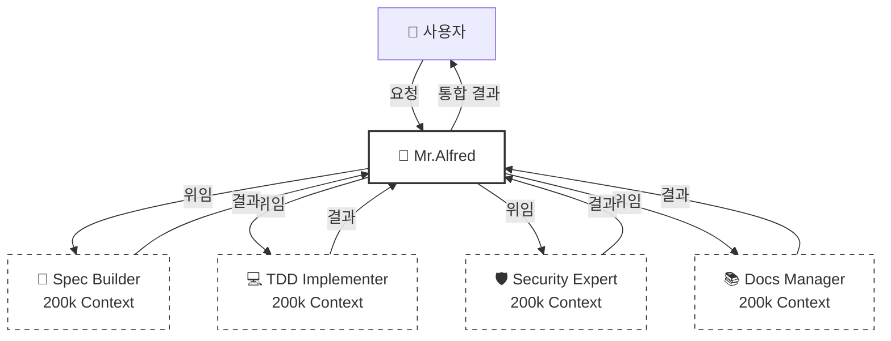
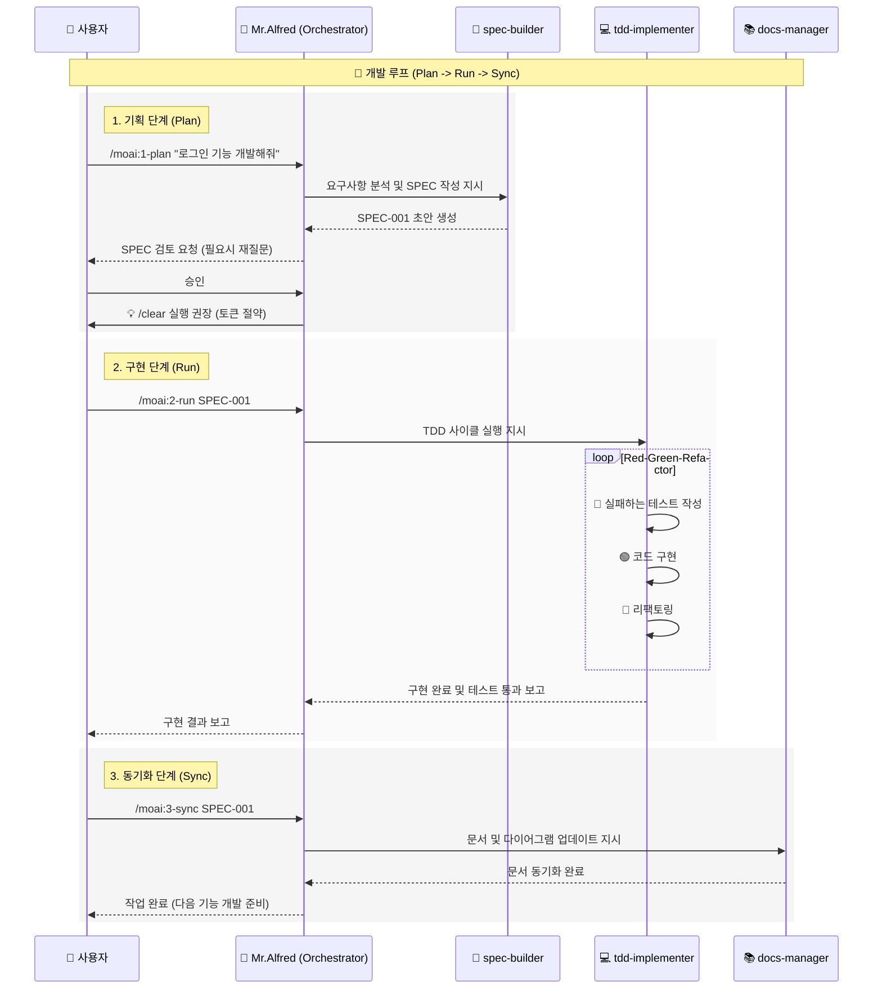

# 🗿 MoAI-ADK: Agentic AI 기반 SPEC-First TDD 개발 프레임워크

**사용 가능한 언어:** [🇰🇷 한국어](./README.ko.md) | [🇺🇸 English](./README.md) | [🇯🇵 日本語](./README.ja.md) | [🇨🇳 中文](./README.zh.md)

[](https://pypi.org/project/moai-adk/)
[](https://opensource.org/licenses/MIT)
[](https://www.python.org/)

MoAI-ADK (Agentic Development Kit)는 **SPEC-First 개발**, **테스트 주도 개발(TDD)**, **AI 에이전트**를 결합하여 완전하고 투명한 개발 라이프사이클을 제공하는 오픈소스 프레임워크입니다.

---

## 🚀 설치 및 업데이트

MoAI-ADK는 `uv` 툴을 사용하여 설치 및 관리하는 것을 권장합니다.

### uv 설치 (사전 준비)

**macOS / Linux:**

```bash
curl -LsSf https://astral.sh/uv/install.sh | sh
```

**Windows:**

```powershell
powershell -ExecutionPolicy ByPass -c "irm https://astral.sh/uv/install.ps1 | iex"
```

### 패키지 설치 (Global)

```bash
uv tool install moai-adk

# 신규 프로젝트 생성
moai-adk init project-name
cd project-name
claude

# 기존의 프로젝트 생성
cd existing-project
moai-adk init .
claude
```

### 패키지 업데이트 (Global)

```bash
uv tool update moai-adk
```

### 프로젝트 업데이트

기존 프로젝트의 설정을 최신 버전으로 업데이트하려면 프로젝트 루트에서 다음 명령어를 실행하세요:

```bash
cd project-name
moai-adk update
claude
```

---

## ⚙️ 설정 (Configuration)

프로젝트 루트의 `.moai/config/config.json` 파일에서 모든 설정을 관리합니다.

### 주요 설정 항목

- **`user.name`**: 사용자 이름 (예: "GOOS") - _Mr.Alfred가 당신을 부르는 이름입니다._
- **`language.conversation_language`**: 대화 언어 (예: "ko") - _모든 메시지, SPEC, 문서가 이 언어로 생성됩니다._
- **`language.agent_prompt_language`**: 에이전트 추론 언어 (권장: "en") - _최고의 성능을 위해 영어 유지를 권장합니다._
- **`constitution.enforce_tdd`**: TDD 강제 여부 (기본값: true)

---

## 🤖 에이전트 위임 & 토큰 효율성 (2M 토큰 활용)

### 💡 200k \* 10 = 2M 토큰의 마법

Claude Code의 대화 세션은 **200k 토큰**으로 제한되지만, MoAI-ADK는 **최대 10대의 에이전트를 병렬로 운영**할 수 있습니다.
각 에이전트는 독립적인 200k 토큰 컨텍스트를 가지므로, 이론적으로 **2,000,000 (2M) 토큰**의 컨텍스트를 활용하는 것과 같은 효과를 냅니다.



### 🎯 명시적 에이전트 위임 (다국어 사용자 필독)

자동 트리거가 작동하지만, 한국어 등 비영어권 언어 사용 시에는 **명시적 위임**이 가장 정확하고 효율적입니다.

**사용 예시:**

> **"@agent-docs-manager README.md 문서를 한국어 README.ko.md 로 번역해줘"**

> **"@agent-tdd-implementer SPEC-001 명세서를 기반으로 로그인 기능을 구현해줘"**

> **"@agent-spec-builder 사용자 인증 시스템에 대한 요구사항을 분석해서 SPEC을 작성해줘"**

---

## 🔌 MCP 서버 설정

MoAI-ADK는 강력한 기능을 위해 MCP(Model Context Protocol) 서버를 활용합니다.
채팅창에 `@`를 입력하여 MCP 서버 상태를 확인하고 켜고 끌 수 있습니다.

```text
> @
───────────────────────────────────────────────────────────
  ✓ [mcp] context7                   enabled  (⏎ to toggle)
  ○ [mcp] playwright                 disabled (⏎ to toggle)
  ○ [mcp] figma-dev-mode-mcp-server  disabled (⏎ to toggle)
```

- **context7 (필수)**: 최신 라이브러리 문서 및 베스트 프랙티스를 제공합니다. 항상 켜두세요.
- **playwright**: 브라우저 자동화 및 E2E 테스트에 사용됩니다. 필요시에만 켜세요.
- **figma-dev-mode-mcp-server**: figma 디자인 페이지 작업이 필요할 때 사용합니다.

---

## 🔄 개발 워크플로우 (Alfred와의 상호작용)

MoAI-ADK의 개발은 **Plan (기획) -> Run (구현) -> Sync (동기화)** 의 무한 루프로 진행됩니다.
Mr.Alfred는 이 과정에서 사용자의 의도를 파악하고, 전문 에이전트들을 지휘하여 작업을 완수합니다.

### 1. Plan (`/moai:1-plan`)

사용자의 모호한 아이디어를 명확한 **EARS 포맷의 SPEC 문서**로 변환합니다.
Alfred는 `spec-builder`에게 지시하여 요구사항을 분석하고, 빠진 부분을 질문하며 완벽한 명세서를 만듭니다.

### 2. Run (`/moai:2-run`)

확정된 SPEC을 기반으로 **TDD (Red-Green-Refactor)** 사이클을 돕니다.
Alfred는 `tdd-implementer`에게 테스트 작성을 지시하고, 테스트를 통과하는 코드를 구현한 뒤, 품질을 위해 리팩토링을 수행합니다.

### 3. Sync (`/moai:3-sync`)

구현된 코드를 분석하여 **문서와 다이어그램을 최신화**합니다.
Alfred는 `docs-manager`를 통해 코드가 변경될 때마다 문서가 자동으로 동기화되도록 합니다.

### MoAI-ADK Agentic Workflow



---

## 💻 커맨드 사용법 (Commands)

### 1. `/moai:0-project` (프로젝트 초기화)

- **목적**: 새로운 프로젝트 구조를 초기화하고 설정을 감지합니다.
- **실행**: `.moai` 디렉토리 생성, 설정 파일 생성, Git 저장소 설정.
- **위임**: `project-manager`

### 2. `/moai:1-plan` (명세서 생성)

- **목적**: 사용자 요구사항을 분석하여 EARS 포맷의 SPEC 문서를 생성합니다.
- **사용법**: `/moai:1-plan "JWT 토큰 기반 사용자 인증 시스템"`
- **위임**: `spec-builder`
- **중요**: 실행 후 반드시 `/clear`를 실행하여 컨텍스트를 비워야 합니다 (45-50k 토큰 절약).

### 3. `/moai:2-run` (TDD 구현)

- **목적**: 생성된 SPEC을 기반으로 Red-Green-Refactor TDD 사이클을 실행합니다.
- **사용법**: `/moai:2-run SPEC-001`
- **위임**: `tdd-implementer`

### 4. `/moai:3-sync` (문서 동기화)

- **목적**: 구현된 코드를 분석하여 문서, 다이어그램, API 명세를 자동 생성 및 동기화합니다.
- **사용법**: `/moai:3-sync SPEC-001`
- **위임**: `docs-manager`

### 5. `/moai:9-feedback` (피드백 및 개선)

- **목적**: 사용자가 기능 개선을 요청하거나 버그를 제보할 때 사용합니다. 코드 리뷰나 테스트 결과를 분석하여 개선 사항을 도출합니다.
- **위임**: `quality-gate`, `debug-helper`

---

## 🕵️ 에이전트 및 스킬 (Agents & Skills)

MoAI-ADK는 35명의 전문 에이전트와 135개 이상의 스킬을 보유하고 있습니다.

### 📋 기획 및 설계 (Planning & Design)

| 에이전트                 | 역할 및 설명                                                   | 주요 스킬 (Skills)                                        |
| :----------------------- | :------------------------------------------------------------- | :-------------------------------------------------------- |
| **`spec-builder`**       | 사용자 요구사항을 분석하여 EARS 포맷의 SPEC 문서를 작성합니다. | `moai-foundation-ears`, `moai-foundation-specs`           |
| **`api-designer`**       | REST/GraphQL API 아키텍처, 엔드포인트, 스키마를 설계합니다.    | `moai-domain-api`, `moai-domain-microservices`            |
| **`component-designer`** | 재사용 가능한 UI 컴포넌트 구조와 디자인 시스템을 설계합니다.   | `moai-domain-design-systems`, `moai-domain-ui-components` |
| **`ui-ux-expert`**       | 사용자 경험(UX) 흐름과 인터페이스(UI) 디자인을 담당합니다.     | `moai-domain-ux-research`, `moai-domain-wireframing`      |

### 💻 구현 (Implementation)

| 에이전트              | 역할 및 설명                                                          | 주요 스킬 (Skills)                                                |
| :-------------------- | :-------------------------------------------------------------------- | :---------------------------------------------------------------- |
| **`tdd-implementer`** | TDD 사이클(Red-Green-Refactor)을 엄격하게 준수하며 코드를 구현합니다. | `moai-foundation-trust`, `moai-essentials-testing`                |
| **`backend-expert`**  | 서버 로직, 데이터베이스 연동, 비즈니스 로직을 구현합니다.             | `moai-domain-backend`, `moai-lang-python`, `moai-lang-go` 등      |
| **`frontend-expert`** | 웹 프론트엔드, 상태 관리, UI 인터랙션을 구현합니다.                   | `moai-domain-frontend`, `moai-lang-react`, `moai-lang-typescript` |
| **`database-expert`** | DB 스키마 설계, 쿼리 최적화, 마이그레이션을 수행합니다.               | `moai-domain-database`, `moai-domain-etl`                         |

### 🛡️ 품질 및 보안 (Quality & Security)

| 에이전트                   | 역할 및 설명                                                   | 주요 스킬 (Skills)                                                        |
| :------------------------- | :------------------------------------------------------------- | :------------------------------------------------------------------------ |
| **`security-expert`**      | 보안 취약점 점검, OWASP 준수, 시큐어 코딩 가이드를 제공합니다. | `moai-domain-security`, `moai-security-oauth`, `moai-essentials-security` |
| **`quality-gate`**         | 코드 품질, 커버리지, TRUST 5 원칙 준수 여부를 최종 검증합니다. | `moai-core-quality-gates`, `moai-core-compliance`                         |
| **`test-engineer`**        | 단위/통합/E2E 테스트 전략 수립 및 테스트 코드를 고도화합니다.  | `moai-essentials-testing`, `mcp-playwright-integration`                   |
| **`accessibility-expert`** | 웹 접근성(WCAG) 표준 준수 여부를 진단하고 개선합니다.          | `moai-domain-accessibility`                                               |
| **`format-expert`**        | 코드 스타일 가이드 및 린팅 규칙을 적용합니다.                  | `moai-core-validation`                                                    |
| **`debug-helper`**         | 런타임 오류의 원인을 분석하고 해결책을 제시합니다.             | `moai-essentials-debugging`, `moai-essentials-profiling`                  |

### 🚀 DevOps 및 관리 (DevOps & Management)

| 에이전트                   | 역할 및 설명                                                      | 주요 스킬 (Skills)                                              |
| :------------------------- | :---------------------------------------------------------------- | :-------------------------------------------------------------- |
| **`devops-expert`**        | CI/CD 파이프라인, 클라우드 인프라(IaC), 배포 자동화를 담당합니다. | `moai-domain-devops`, `moai-domain-cloud`, `docker-integration` |
| **`monitoring-expert`**    | 시스템 모니터링, 로깅 설정, 알림 시스템을 구축합니다.             | `moai-domain-monitoring`, `moai-core-monitoring`                |
| **`performance-engineer`** | 시스템 성능 병목을 분석하고 최적화 방안을 적용합니다.             | `moai-essentials-performance`, `moai-essentials-profiling`      |
| **`docs-manager`**         | 프로젝트 문서를 생성, 업데이트하고 관리합니다.                    | `moai-essentials-documentation`, `moai-foundation-specs`        |
| **`git-manager`**          | Git 브랜치 전략, PR 관리, 버전 태깅을 수행합니다.                 | `moai-essentials-git`, `moai-essentials-versioning`             |
| **`project-manager`**      | 프로젝트 전반의 진행 상황을 조율하고 관리합니다.                  | `moai-essentials-agile`, `moai-essentials-collaboration`        |

### 🛠️ 특수 도구 (Specialized Tools)

| 에이전트            | 역할 및 설명                                         | 주요 스킬 (Skills)          |
| :------------------ | :--------------------------------------------------- | :-------------------------- |
| **`agent-factory`** | 새로운 커스텀 에이전트를 생성하고 설정합니다.        | `moai-core-agent-factory`   |
| **`skill-factory`** | 새로운 MoAI 스킬을 정의하고 라이브러리에 추가합니다. | `moai-core-task-delegation` |

---

## 📍 Claude Code 상태표시줄 통합

MoAI-ADK 상태표시줄은 Claude Code 터미널 상태바에 **실시간 개발 상태**를 표시합니다. 모델, 버전, Git 브랜치, 파일 변경사항을 한눈에 확인하세요.

### 📊 상태표시줄 형식

**컴팩트 모드** (기본값, ≤80자):

```
🤖 Haiku 4.5 (v2.0.46) | 🗿 v0.26.0 | 📊 +0 M0 ?0 | 💬 R2-D2 | 🔀 develop
```

| 항목            | 아이콘 | 의미                    | 예시                                      |
| --------------- | ------ | ----------------------- | ----------------------------------------- |
| **모델**        | 🤖     | Claude 모델 + Code 버전 | Haiku 4.5 (v2.0.46), Sonnet 4.0 (v4.0.15) |
| **버전**        | 🗿     | MoAI-ADK 버전           | v0.26.0                                   |
| **변경사항**    | 📊     | Git 파일 상태           | +0 M0 ?0                                  |
| **출력 스타일** | 💬     | 선택된 UI/UX 스타일     | R2-D2, Yoda, default                      |
| **Git 브랜치**  | 🔀     | 현재 작업 브랜치        | develop, feature/SPEC-001                 |

### 📝 변경사항 표기법 설명

```
변경사항: +staged Mmodified ?untracked

📊 +0  = 스테이징된 파일 수 (git add된 파일)
📊 M0  = 수정된 파일 수 (아직 git add 안 됨)
📊 ?0  = 추적되지 않는 새 파일 수
```

### 💡 예시

| 상황           | 표시          | 의미                                                |
| -------------- | ------------- | --------------------------------------------------- |
| 깨끗한 상태    | `📊 +0 M0 ?0` | 모든 변경사항 커밋됨                                |
| 파일 수정됨    | `📊 +0 M2 ?0` | 2개 파일 수정됨 (git add 필요)                      |
| 새 파일 생성됨 | `📊 +0 M0 ?1` | 1개 새 파일 (git add 필요)                          |
| 커밋 준비됨    | `📊 +3 M0 ?0` | 3개 파일 스테이징됨 (커밋 준비 완료)                |
| 작업 진행 중   | `📊 +2 M1 ?1` | 혼합 상태: 2개 스테이징 + 1개 수정 + 1개 추적 안 됨 |

---

## 📚 문서 및 리소스

상세한 정보는 다음 메모리 파일들을 참조하세요.

- **`.moai/memory/agents.md`**: 35개 에이전트 상세 설명
- **`.moai/memory/commands.md`**: 6개 명령어 실행 프로세스
- **`.moai/memory/skills.md`**: 135개 스킬 카탈로그
- **`.moai/memory/delegation-patterns.md`**: 에이전트 위임 패턴
- **`.moai/memory/token-optimization.md`**: 토큰 최적화 전략

---

## 📋 라이선스

MoAI-ADK는 [MIT 라이선스](LICENSE) 하에 배포됩니다.

---

## 📞 지원 및 커뮤니티

- **GitHub Issues**: [버그 신고 및 기능 요청](https://github.com/modu-ai/moai-adk/issues)
- **GitHub Discussions**: [질문하고 아이디어 공유](https://github.com/modu-ai/moai-adk/discussions)
- **Email**: <support@mo.ai.kr>

---

## ⭐ 스타 히스토리

[](https://star-history.com/#modu-ai/moai-adk&Date)

---

**프로젝트**: MoAI-ADK
**버전**: 0.26.0
**마지막 업데이트**: 2025-11-20
**철학**: SPEC-First TDD + 에이전트 오케스트레이션 + 85% 토큰 효율
**MoAI**: 모두의AI는 모두의 인공지능을 의미합니다. 모든 사람이 AI를 사용할 수 있도록 하는 것이 모두의AI의 목표입니다.

Copyleft 2025 MoAI (https://mo.ai.kr , coming soon)
