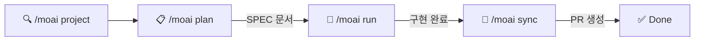
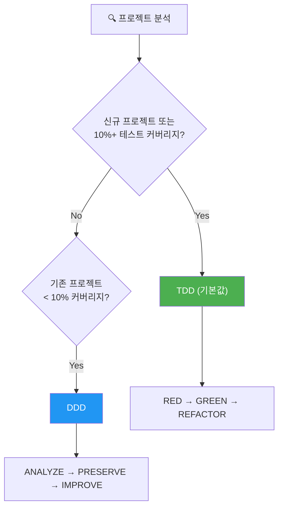
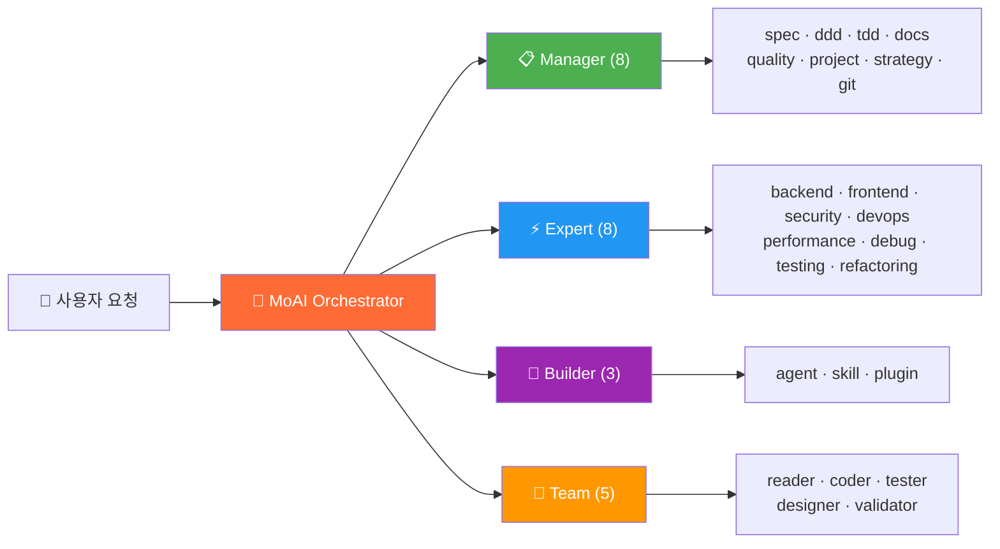
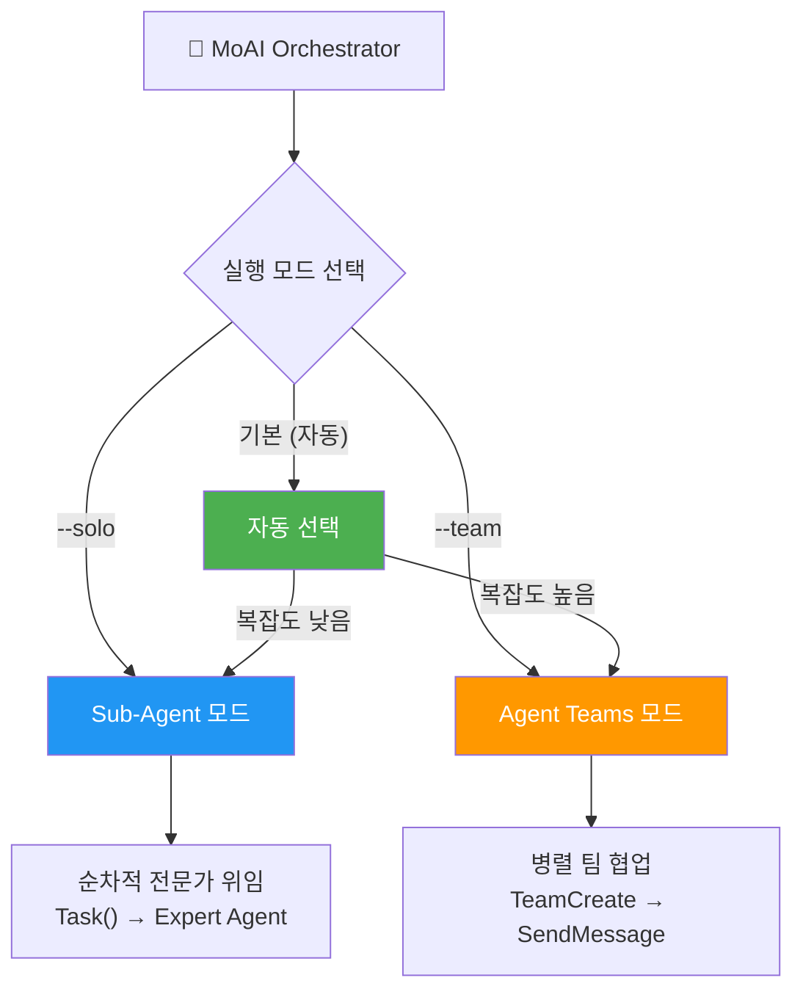
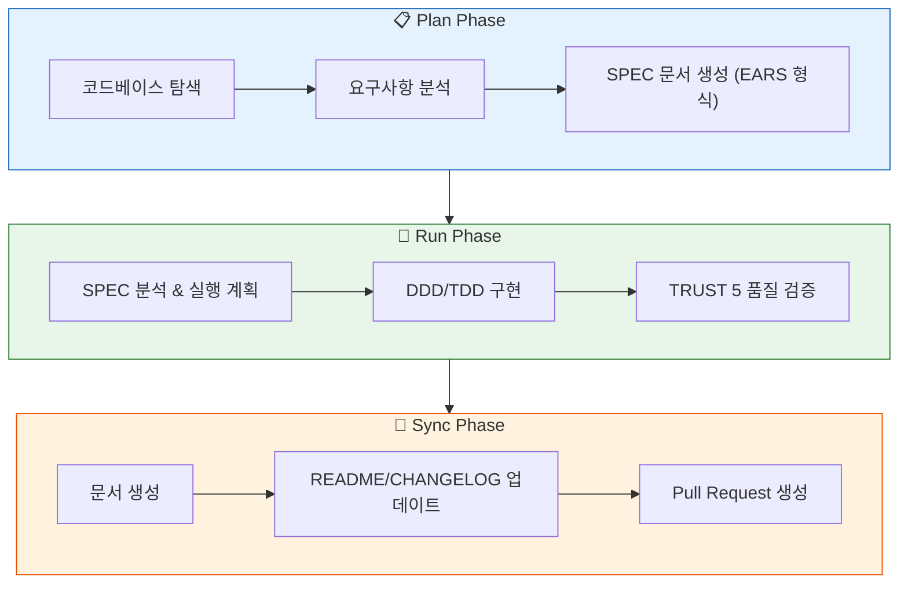
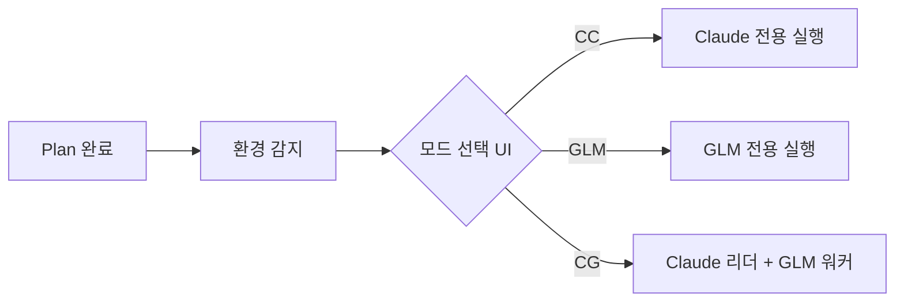
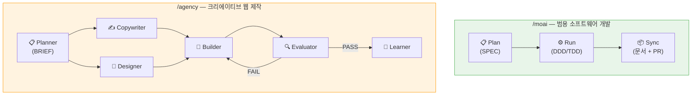
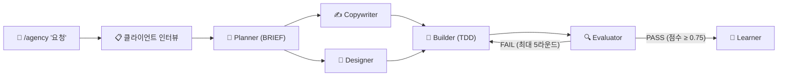
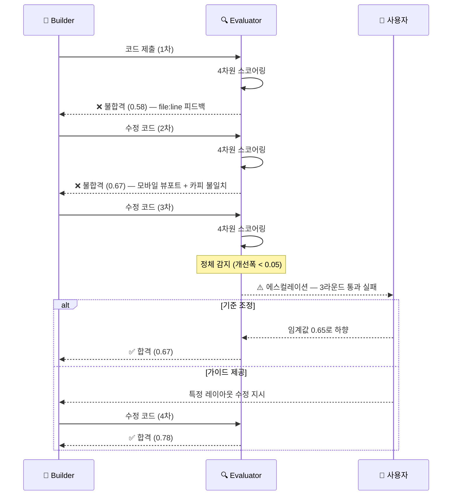
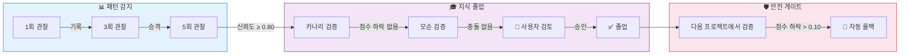

<p align="center">
  
</p>

<h1 align="center">MoAI-ADK</h1>

<p align="center">
  <strong>Claude Code를 위한 Agentic Development Kit</strong>
</p>

<p align="center">
  <a href="./README.md">English</a> ·
  <a href="./README.ko.md">한국어</a> ·
  <a href="./README.ja.md">日本語</a> ·
  <a href="./README.zh.md">中文</a>
</p>

<p align="center">
  <a href="https://github.com/modu-ai/moai-adk/actions/workflows/ci.yml"></a>
  <a href="https://github.com/modu-ai/moai-adk/actions/workflows/codeql.yml"></a>
  <a href="https://codecov.io/gh/modu-ai/moai-adk"></a>
  <br>
  <a href="https://go.dev/"></a>
  <a href="https://github.com/modu-ai/moai-adk/releases"></a>
  <a href="./LICENSE"></a>
</p>

<p align="center">
  <a href="https://adk.mo.ai.kr"><strong>Official Documentation</strong></a>
</p>

---

> 📚 **[공식 문서](https://adk.mo.ai.kr)** | **[Discord 커뮤니티](https://discord.gg/Z7E7Mdc5aN)**

---

> **"바이브 코딩의 목적은 빠른 생산성이 아니라 코드 품질이다."**

MoAI-ADK는 Claude Code를 위한 **고성능 AI 개발 환경**입니다. 24개 전문 AI 에이전트와 52개 스킬이 협력하여 품질 있는 코드를 만듭니다. 신규 프로젝트와 기능 개발에는 TDD(기본값)를, 테스트 커버리지가 낮은 기존 프로젝트에는 DDD를 자동 적용하며, Sub-Agent와 Agent Teams 이중 실행 모드를 지원합니다.

Go로 작성된 단일 바이너리 — 의존성 없이 모든 플랫폼에서 즉시 실행됩니다.

---

## 왜 MoAI-ADK인가?

Python 기반 MoAI-ADK(~73,000줄)를 Go로 완전히 재작성했습니다.

| 항목 | Python Edition | Go Edition |
|------|---------------|------------|
| 배포 | pip + venv + 의존성 | **단일 바이너리**, 의존성 없음 |
| 시작 시간 | ~800ms 인터프리터 부팅 | **~5ms** 네이티브 실행 |
| 동시성 | asyncio / threading | **네이티브 goroutines** |
| 타입 안전성 | 런타임 (mypy 선택) | **컴파일 타임 강제** |
| 크로스 플랫폼 | Python 런타임 필요 | **프리빌트 바이너리** (macOS, Linux, Windows) |
| 훅 실행 | Shell 래퍼 + Python | **컴파일된 바이너리**, JSON 프로토콜 |

### 핵심 수치

- **38,700+줄** Go 코드, **38개** 패키지
- **85-100%** 테스트 커버리지
- **24개** 전문 AI 에이전트 + **52개** 스킬
- **18개** 프로그래밍 언어 지원
- **25개** Claude Code 훅 이벤트

---

## 하네스 엔지니어링 아키텍처

MoAI-ADK는 **하네스 엔지니어링(Harness Engineering)** 패러다임을 구현합니다 — 코드를 직접 작성하는 대신 AI 에이전트를 위한 환경을 설계합니다.

| 구성 요소 | 설명 | 명령어 |
|-----------|------|--------|
| **자가 검증 루프** | 에이전트가 코드 작성 → 테스트 → 실패 → 수정 → 통과 사이클을 자율적으로 반복 | `/moai loop` |
| **컨텍스트 맵** | 코드베이스 아키텍처 맵과 문서를 에이전트가 항상 참조 가능 | `/moai codemaps` |
| **세션 지속성** | `progress.md`가 완료된 단계를 추적; 중단된 실행이 자동으로 재시작 | `/moai run SPEC-XXX` |
| **실패 체크리스트** | 모든 인수 조건이 실행 시작 시 대기(pending) 작업으로 등록; 구현되면 완료로 표시 | `/moai run SPEC-XXX` |
| **언어 중립** | 16개 언어 지원: 언어 자동 감지, 적합한 LSP/린터/테스트/커버리지 도구 자동 선택 | 전체 워크플로우 |
| **가비지 컬렉션** | 죽은 코드, AI Slop, 미사용 임포트 주기적 스캔 및 제거 | `/moai clean` |
| **스캐폴딩 우선** | 구현 전 빈 파일 스텁 생성으로 엔트로피 방지 | `/moai run SPEC-XXX` |

> "인간은 방향을 잡고, 에이전트는 실행합니다." — 엔지니어의 역할이 코드 작성에서 하네스 설계(SPEC, 품질 게이트, 피드백 루프)로 전환됩니다.

---

## 시스템 요구사항

| 플랫폼 | 지원 환경 | 비고 |
|--------|----------|------|
| macOS | Terminal, iTerm2 | 완전 지원 |
| Linux | Bash, Zsh | 완전 지원 |
| Windows | **WSL (권장)**, PowerShell 7.x+ | 네이티브 cmd.exe 미지원 |

**필수 조건:**
- **Git**이 모든 플랫폼에서 설치되어 있어야 합니다
- **Windows 사용자**: [Git for Windows](https://gitforwindows.org/) **필수 설치** (Git Bash 포함)
  - **WSL** (Windows Subsystem for Linux) 사용을 권장합니다
  - PowerShell 7.x 이상도 지원됩니다
  - 레거시 Windows PowerShell 5.x 및 cmd.exe는 **지원하지 않습니다**

---

## 빠른 시작

### 1. 설치

#### macOS / Linux / WSL

```bash
curl -fsSL https://raw.githubusercontent.com/modu-ai/moai-adk/main/install.sh | bash
```

#### Windows (PowerShell 7.x+)

> **권장**: 최상의 경험을 위해 WSL에서 위의 Linux 설치 명령어를 사용하세요.

```powershell
irm https://raw.githubusercontent.com/modu-ai/moai-adk/main/install.ps1 | iex
```

> [Git for Windows](https://gitforwindows.org/)가 먼저 설치되어 있어야 합니다.

#### 소스에서 빌드 (Go 1.26+)

```bash
git clone https://github.com/modu-ai/moai-adk.git
cd moai-adk && make build
```

> 프리빌트 바이너리는 [Releases](https://github.com/modu-ai/moai-adk/releases) 페이지에서 다운로드할 수 있습니다.

### 2. Windows 특정 이슈

#### 한글 사용명 경로 에러

Windows 사용자 이름에 비ASCII 문자(한글, 중국어 등)가 포함된 경우,
Windows 8.3 짧은 파일 이름 변환으로 인해 `EINVAL` 에러가 발생할 수 있습니다.

**해결책 1:** 대체 임시 디렉터리 설정:

```bash
# 명령 프롬프트
set MOAI_TEMP_DIR=C:\temp
mkdir C:\temp 2>nul

# PowerShell
$env:MOAI_TEMP_DIR="C:\temp"
New-Item -ItemType Directory -Path "C:\temp" -Force
```

**해결책 2:** 8.3 파일 이름 생성 비활성화 (관리자 권한 필요):

```bash
fsutil 8dot3name set 1
```

**해결책 3:** ASCII만 포함하는 새 Windows 사용자 계정 생성.

### 3. 프로젝트 초기화

```bash
moai init my-project
```

대화형 마법사가 언어, 프레임워크, 방법론을 자동 감지하고 Claude Code 통합 파일을 생성합니다.

### 4. Claude Code에서 개발 시작

```bash
# Claude Code 실행 후
/moai project                            # 프로젝트 문서 생성 (product.md, structure.md, tech.md)
/moai plan "사용자 인증 기능 추가"        # SPEC 문서 생성
/moai run SPEC-AUTH-001                   # DDD/TDD 구현
/moai sync SPEC-AUTH-001                  # 문서 동기화 & PR 생성
/moai github issues                      # GitHub 이슈 자동화 (Agent Teams)
/moai github pr 123                       # PR 다각도 검토 (multi-perspective)
```


```mermaid
graph LR
    A["🔍 /moai project"] --> B["📋 /moai plan"]
    B -->|"SPEC 문서"| C["🔨 /moai run"]
    C -->|"구현 완료"| D["📄 /moai sync"]
    D -->|"PR 생성"| E["✅ Done"]
```

---

## MoAI 개발 방법론

MoAI-ADK는 프로젝트 상태에 따라 최적의 개발 방법론을 자동 선택합니다.


```mermaid
flowchart TD
    A["🔍 프로젝트 분석"] --> B{"신규 프로젝트 또는<br/>10%+ 테스트 커버리지?"}
    B -->|"Yes"| C["TDD (기본값)"]
    B -->|"No"| D{"기존 프로젝트<br/>< 10% 커버리지?"}
    D -->|"Yes"| E["DDD"]
    C --> F["RED → GREEN → REFACTOR"]
    E --> G["ANALYZE → PRESERVE → IMPROVE"]

    style C fill:#4CAF50,color:#fff
    style E fill:#2196F3,color:#fff
```

### TDD 방법론 (기본값)

신규 프로젝트와 기능 개발에 권장되는 기본 방법론입니다. 테스트를 먼저 작성합니다.

| 단계 | 설명 |
|------|------|
| **RED** | 기대 동작을 정의하는 실패 테스트 작성 |
| **GREEN** | 테스트를 통과하는 최소 코드 작성 |
| **REFACTOR** | 테스트를 유지하면서 코드 품질 개선. REFACTOR 완료 후 `/simplify`가 자동 실행됩니다. |

브라운필드 프로젝트(기존 코드베이스)에서는 **RED 전 분석 단계**가 추가됩니다: 테스트 작성 전에 기존 코드를 읽어 현재 동작을 파악합니다.

### DDD 방법론 (테스트 커버리지 < 10% 기존 프로젝트)

테스트 커버리지가 최소인 기존 프로젝트에서 안전하게 리팩토링하기 위한 방법론입니다.

```
ANALYZE   → 기존 코드와 의존성 분석, 도메인 경계 식별
PRESERVE  → 특성 테스트 작성, 현재 동작 스냅샷 캡처
IMPROVE   → 테스트로 보호된 상태에서 점진적 개선. IMPROVE 완료 후 /simplify가 자동 실행됩니다.
```

> 방법론은 `moai init` 시 자동 선택되며 (`--mode <ddd|tdd>`, 기본값: tdd), `.moai/config/sections/quality.yaml`의 `development_mode`에서 변경할 수 있습니다.
>
> **참고**: MoAI-ADK v2.5.0+는 이진 방법론 선택(TDD 또는 DDD만)을 사용합니다. 명확성과 일관성을 위해 hybrid 모드는 제거되었습니다.

### 자동 품질 & 스케일아웃 레이어

MoAI-ADK v2.6.0+는 MoAI가 **자율적으로** 호출하는 두 가지 Claude Code 네이티브 스킬을 통합합니다 — 플래그나 수동 명령이 필요 없습니다.

| 스킬 | 역할 | 트리거 |
|------|------|--------|
| `/simplify` | 품질 강화 | TDD REFACTOR 및 DDD IMPROVE 단계 완료 후 **항상** 실행 |
| `/batch` | 스케일아웃 실행 | 작업 복잡도가 임계값을 초과할 때 자동 트리거 |

**`/simplify` — 자동 품질 패스**

병렬 에이전트로 변경된 코드를 재사용 기회, 품질 문제, 효율성, CLAUDE.md 준수 여부 측면에서 검토하고 자동으로 수정합니다. 구성 없이 매 구현 주기 후 MoAI가 직접 호출합니다.

**`/batch` — 병렬 스케일아웃**

대규모 병렬 작업을 위해 격리된 git worktree에서 수십 개의 에이전트를 실행합니다. 각 에이전트는 테스트를 실행하고 결과를 보고하며, MoAI가 이를 합칩니다. 워크플로우별 자동 트리거 조건:

| 워크플로우 | 트리거 조건 |
|-----------|------------|
| `run` | 작업 수 ≥ 5, 또는 예상 파일 변경 수 ≥ 10, 또는 독립 작업 수 ≥ 3 |
| `mx` | 소스 파일 수 ≥ 50 |
| `coverage` | P1+P2 커버리지 갭 ≥ 10 |
| `clean` | 확인된 데드 코드 항목 ≥ 20 |

---

## AI 에이전트 오케스트레이션

MoAI는 **전략적 오케스트레이터**입니다. 직접 코드를 작성하지 않고, 24개 전문 에이전트에게 작업을 위임합니다.


```mermaid
graph LR
    U["👤 사용자 요청"] --> M["🗿 MoAI Orchestrator"]

    M --> MG["📋 Manager (8)"]
    M --> EX["⚡ Expert (8)"]
    M --> BL["🔧 Builder (3)"]
    M --> TM["👥 Team (5)"]

    MG --> MG1["spec · ddd · tdd · docs<br/>quality · project · strategy · git"]
    EX --> EX1["backend · frontend · security · devops<br/>performance · debug · testing · refactoring"]
    BL --> BL1["agent · skill · plugin"]
    TM --> TM1["reader · coder · tester<br/>designer · validator"]

    style M fill:#FF6B35,color:#fff
    style MG fill:#4CAF50,color:#fff
    style EX fill:#2196F3,color:#fff
    style BL fill:#9C27B0,color:#fff
    style TM fill:#FF9800,color:#fff
```

### 에이전트 카테고리

| 카테고리 | 수량 | 에이전트 | 역할 |
|----------|------|---------|------|
| **Manager** | 8 | spec, ddd, tdd, docs, quality, project, strategy, git | 워크플로우 조율, SPEC 생성, 품질 관리 |
| **Expert** | 8 | backend, frontend, security, devops, performance, debug, testing, refactoring | 도메인 전문 구현, 분석, 최적화 |
| **Builder** | 3 | agent, skill, plugin | 새로운 MoAI 컴포넌트 생성 |
| **Team** | 5 | reader, coder, tester, designer, validator | 병렬 팀 기반 개발 |

### 52개 스킬 (프로그레시브 디스클로저)

토큰 효율을 위해 3단계 프로그레시브 디스클로저 시스템으로 관리됩니다:

| 카테고리 | 스킬 수 | 예시 |
|----------|---------|------|
| **Foundation** | 5 | core, claude, philosopher, quality, context |
| **Workflow** | 11 | spec, project, ddd, tdd, testing, worktree, thinking... |
| **Domain** | 5 | backend, frontend, database, uiux, data-formats |
| **Language** | 18 | Go, Python, TypeScript, Rust, Java, Kotlin, Swift, C++... |
| **Platform** | 9 | Vercel, Supabase, Firebase, Auth0, Clerk, Railway... |
| **Library** | 3 | shadcn, nextra, mermaid |
| **Tool** | 2 | ast-grep, svg |
| **Specialist** | 10 | Figma, Flutter, Electron, Pencil... |

---

## 모델 정책 (토큰 최적화)

MoAI-ADK는 Claude Code 구독 요금제에 맞춰 24개 에이전트에 최적의 AI 모델을 할당합니다. 요금제의 사용량 제한 내에서 품질을 극대화합니다.

| 정책 | 요금제 | 🟣 Opus | 🔵 Sonnet | 🟡 Haiku | 용도 |
|------|--------|------|--------|-------|------|
| **High** | Max $200/월 | 16 | 5 | 3 | 최고 품질, 최대 처리량 |
| **Medium** | Max $100/월 | 3 | 17 | 4 | 품질과 비용의 균형 |
| **Low** | Plus $20/월 | 0 | 13 | 11 | 경제적, Opus 미포함 |

> **왜 중요한가요?** Plus $20 요금제는 Opus를 포함하지 않습니다. `Low`로 설정하면 모든 에이전트가 Sonnet과 Haiku만 사용하여 사용량 제한 오류를 방지합니다. 상위 요금제에서는 핵심 에이전트(보안, 전략, 아키텍처)에 Opus를, 일반 작업에 Sonnet/Haiku를 배분합니다.

### 티어별 에이전트 모델 배정

#### Manager Agents

| 에이전트 | High | Medium | Low |
|---------|------|--------|-----|
| manager-spec | 🟣 opus | 🟣 opus | 🔵 sonnet |
| manager-strategy | 🟣 opus | 🟣 opus | 🔵 sonnet |
| manager-ddd | 🟣 opus | 🔵 sonnet | 🔵 sonnet |
| manager-tdd | 🟣 opus | 🔵 sonnet | 🔵 sonnet |
| manager-project | 🟣 opus | 🔵 sonnet | 🟡 haiku |
| manager-docs | 🔵 sonnet | 🟡 haiku | 🟡 haiku |
| manager-quality | 🟡 haiku | 🟡 haiku | 🟡 haiku |
| manager-git | 🟡 haiku | 🟡 haiku | 🟡 haiku |

#### Expert Agents

| 에이전트 | High | Medium | Low |
|---------|------|--------|-----|
| expert-backend | 🟣 opus | 🔵 sonnet | 🔵 sonnet |
| expert-frontend | 🟣 opus | 🔵 sonnet | 🔵 sonnet |
| expert-security | 🟣 opus | 🟣 opus | 🔵 sonnet |
| expert-debug | 🟣 opus | 🔵 sonnet | 🔵 sonnet |
| expert-refactoring | 🟣 opus | 🔵 sonnet | 🔵 sonnet |
| expert-devops | 🟣 opus | 🔵 sonnet | 🟡 haiku |
| expert-performance | 🟣 opus | 🔵 sonnet | 🟡 haiku |
| expert-testing | 🟣 opus | 🔵 sonnet | 🟡 haiku |

#### Builder Agents

| 에이전트 | High | Medium | Low |
|---------|------|--------|-----|
| builder-agent | 🟣 opus | 🔵 sonnet | 🟡 haiku |
| builder-skill | 🟣 opus | 🔵 sonnet | 🟡 haiku |
| builder-plugin | 🟣 opus | 🔵 sonnet | 🟡 haiku |

#### Team Agents

| 에이전트 | High | Medium | Low |
|---------|------|--------|-----|
| team-reader | 🔵 sonnet | 🔵 sonnet | 🔵 sonnet |
| team-coder | 🔵 sonnet | 🔵 sonnet | 🔵 sonnet |
| team-tester | 🔵 sonnet | 🔵 sonnet | 🔵 sonnet |
| team-designer | 🔵 sonnet | 🔵 sonnet | 🔵 sonnet |
| team-validator | 🟡 haiku | 🟡 haiku | 🟡 haiku |

### 설정 방법

```bash
# 프로젝트 초기화 시
moai init my-project          # 대화형 마법사에서 모델 정책 선택

# 기존 프로젝트 재설정
moai update                   # 각 설정 단계별 대화형 프롬프트
```

`moai update` 실행 시 다음 항목을 묻습니다:
- **모델 정책 재설정?** (y/n) - 모델 정책 설정 마법사 재실행
- **GLM 설정 업데이트?** (y/n) - settings.local.json에 GLM 환경 변수 구성

> 기본 정책은 `High`입니다. GLM 설정은 `settings.local.json`에 격리됩니다 (Git에 커밋되지 않음).

---

## 이중 실행 모드

MoAI-ADK는 Claude Code가 지원하는 **Sub-Agent**와 **Agent Teams** 두 가지 실행 모드를 모두 제공합니다.


```mermaid
graph TD
    A["🗿 MoAI Orchestrator"] --> B{"실행 모드 선택"}
    B -->|"--solo"| C["Sub-Agent 모드"]
    B -->|"--team"| D["Agent Teams 모드"]
    B -->|"기본 (자동)"| E["자동 선택"]

    C --> F["순차적 전문가 위임<br/>Task() → Expert Agent"]
    D --> G["병렬 팀 협업<br/>TeamCreate → SendMessage"]
    E -->|"복잡도 높음"| D
    E -->|"복잡도 낮음"| C

    style C fill:#2196F3,color:#fff
    style D fill:#FF9800,color:#fff
    style E fill:#4CAF50,color:#fff
```

### Agent Teams 모드 (기본값)

MoAI-ADK는 프로젝트 복잡도를 자동으로 분석하여 최적의 실행 모드를 선택합니다:

| 조건 | 선택 모드 | 이유 |
|------|-----------|------|
| 도메인 3개 이상 | Agent Teams | 멀티 도메인 조율 |
| 영향 파일 10개 이상 | Agent Teams | 대규모 변경 |
| 복잡도 점수 7 이상 | Agent Teams | 높은 복잡도 |
| 그 외 | Sub-Agent | 단순하고 예측 가능한 워크플로우 |

**Agent Teams 모드**는 병렬 팀 기반 개발을 사용합니다:

- 여러 에이전트가 동시에 작업하고 공유 작업 목록으로 협업
- `TeamCreate`, `SendMessage`, `TaskList`를 통한 실시간 조율
- 대규모 기능 개발, 멀티 도메인 작업에 적합

```bash
/moai plan "대규모 기능"          # 자동: researcher + analyst + architect 병렬
/moai run SPEC-XXX                # 자동: backend-dev + frontend-dev + tester 병렬
/moai run SPEC-XXX --team         # Agent Teams 모드 강제
```

**Agent Teams용 품질 훅:**
- **TeammateIdle 훅**: 팀원이 대기 상태로 전환되기 전 LSP 품질 게이트 검증 (에러, 타입 에러, 린트 에러)
- **TaskCompleted 훅**: 작업이 SPEC-XXX 패턴을 참조할 때 SPEC 문서 존재 확인
- 모든 검증은 graceful degradation 사용 - 경고는 로그되지만 작업은 계속됨

### Sub-Agent 모드 (`--solo`)

기존 Claude Code의 `Task()` API를 활용한 순차적 에이전트 위임 방식입니다.

- 하나의 전문 에이전트에게 작업을 위임하고 결과를 받음
- 단계별로 Manager → Expert → Quality 순서로 진행
- 단순하고 예측 가능한 워크플로우에 적합

```bash
/moai run SPEC-AUTH-001 --solo    # Sub-Agent 모드 강제
```

---

## MoAI 워크플로우

### Plan → Run → Sync 파이프라인

MoAI의 핵심 워크플로우는 3단계로 구성됩니다:


```mermaid
graph TB
    subgraph Plan ["📋 Plan Phase"]
        P1["코드베이스 탐색"] --> P2["요구사항 분석"]
        P2 --> P3["SPEC 문서 생성 (EARS 형식)"]
    end

    subgraph Run ["🔨 Run Phase"]
        R1["SPEC 분석 & 실행 계획"] --> R2["DDD/TDD 구현"]
        R2 --> R3["TRUST 5 품질 검증"]
    end

    subgraph Sync ["📄 Sync Phase"]
        S1["문서 생성"] --> S2["README/CHANGELOG 업데이트"]
        S2 --> S3["Pull Request 생성"]
    end

    Plan --> Run
    Run --> Sync

    style Plan fill:#E3F2FD,stroke:#1565C0
    style Run fill:#E8F5E9,stroke:#2E7D32
    style Sync fill:#FFF3E0,stroke:#E65100
```

#### 실행 모드 선택 게이트

Plan 단계에서 Run 단계로 전환 시, MoAI가 현재 실행 환경(cc/glm/cg)을 자동으로 감지하고, 구현 시작 전에 사용자가 모드를 확인하거나 변경할 수 있는 선택 UI를 표시합니다.


```mermaid
graph LR
    A["Plan 완료"] --> B["환경 감지"]
    B --> C{"모드 선택 UI"}
    C -->|"CC"| D["Claude 전용 실행"]
    C -->|"GLM"| E["GLM 전용 실행"]
    C -->|"CG"| F["Claude 리더 + GLM 워커"]
```

이 게이트는 환경 상태와 관계없이 올바른 실행 모드를 사용하도록 보장하여, 구현 중 모드 불일치를 방지합니다.

### /moai 서브커맨드

모든 서브커맨드는 Claude Code 내에서 `/moai <서브커맨드>`로 실행합니다.

#### 핵심 워크플로우

| 서브커맨드 | 별칭 | 목적 | 주요 플래그 |
|-----------|------|------|------------|
| `plan` | `spec` | SPEC 문서 생성 (EARS 형식) | `--worktree`, `--branch`, `--resume SPEC-XXX`, `--team` |
| `run` | `impl` | SPEC의 DDD/TDD 구현 | `--resume SPEC-XXX`, `--team` |
| `sync` | `docs`, `pr` | 문서 동기화, 코드맵 업데이트, PR 생성 | `--merge`, `--skip-mx` |

#### 품질 & 테스팅

| 서브커맨드 | 별칭 | 목적 | 주요 플래그 |
|-----------|------|------|------------|
| `fix` | — | LSP 에러, 린트, 타입 에러 자동 수정 (단일 패스) | `--dry`, `--seq`, `--level N`, `--resume`, `--team` |
| `loop` | — | 완료까지 반복 자동 수정 (최대 100회) | `--max N`, `--auto-fix`, `--seq` |
| `review` | `code-review` | 보안 및 @MX 태그 준수 코드 리뷰 | `--staged`, `--branch`, `--security` |
| `coverage` | `test-coverage` | 테스트 커버리지 분석 및 갭 보완 (16개 언어) | `--target N`, `--file PATH`, `--report` |
| `e2e` | — | E2E 테스트 (Claude-in-Chrome, Playwright CLI, Agent Browser) | `--record`, `--url URL`, `--journey NAME` |
| `clean` | `refactor-clean` | 데드 코드 식별 및 안전한 제거 | `--dry`, `--safe-only`, `--file PATH` |

#### 문서 & 코드베이스

| 서브커맨드 | 별칭 | 목적 | 주요 플래그 |
|-----------|------|------|------------|
| `project` | `init` | 프로젝트 문서 생성 (product.md, structure.md, tech.md, .moai/project/codemaps/) | — |
| `mx` | — | 코드베이스 스캔 및 @MX 코드 레벨 주석 추가 | `--all`, `--dry`, `--priority P1-P4`, `--force`, `--team` |
| `codemaps` | `update-codemaps` | `.moai/project/codemaps/`에 아키텍처 문서 생성 | `--force`, `--area AREA` |
| `feedback` | `fb`, `bug`, `issue` | 사용자 피드백 수집 및 GitHub 이슈 생성 | — |

#### 기본 워크플로우

| 서브커맨드 | 목적 | 주요 플래그 |
|-----------|------|------------|
| *(없음)* | 완전 자율 plan → run → sync 파이프라인. 복잡도 점수 >= 5일 때 SPEC 자동 생성. | `--loop`, `--max N`, `--branch`, `--pr`, `--resume SPEC-XXX`, `--team`, `--solo` |

### 실행 모드 플래그

워크플로우 실행 시 에이전트 디스패치 방식을 제어합니다:

| 플래그 | 모드 | 설명 |
|--------|------|------|
| `--team` | Agent Teams | 병렬 팀 기반 실행. 여러 에이전트가 동시 작업. |
| `--solo` | Sub-Agent | 페이즈별 순차 단일 에이전트 위임. |
| *(기본)* | 자동 | 복잡도 기반 자동 선택 (도메인 >= 3, 파일 >= 10, 점수 >= 7). |

**`--team`은 세 가지 실행 환경을 지원합니다:**

| 환경 | 명령어 | 리더 | 워커 | 용도 |
|------|--------|------|------|------|
| Claude 전용 | `moai cc` | Claude | Claude | 최고 품질 |
| GLM 전용 | `moai glm` | GLM | GLM | 최대 비용 절감 |
| CG (Claude+GLM) | `moai cg` | Claude | GLM | 품질 + 비용 균형 |

> **v2.7.1 신규**: CG 모드가 **기본** 팀 모드로 변경되었습니다. `--team` 사용 시, `moai cc` 또는 `moai glm`으로 명시적으로 변경하지 않는 한 CG 모드로 실행됩니다.

> **참고**: `moai cg`는 tmux pane 레벨 환경 격리를 사용하여 Claude 리더와 GLM 워커를 분리합니다. `moai glm` 모드에서 전환 시, `moai cg`가 GLM 설정을 자동으로 리셋합니다 — 중간에 `moai cc`를 실행할 필요 없습니다.

### 자율 개발 루프 (Ralph Engine)

LSP 진단과 AST-grep을 결합한 자율 에러 수정 엔진입니다:

```bash
/moai fix       # 단일 패스: 스캔 → 분류 → 수정 → 검증
/moai loop      # 반복 수정: 완료 마커 감지까지 반복 (최대 100회)
```

**Ralph Engine 동작:**
1. **병렬 스캔**: LSP 진단 + AST-grep + 린터를 동시 실행
2. **자동 분류**: 에러를 Level 1(자동 수정) ~ Level 4(사용자 개입)로 분류
3. **수렴 감지**: 동일 에러 반복 시 대체 전략 적용
4. **완료 조건**: 0 에러, 0 타입 에러, 85%+ 커버리지

### 권장 워크플로우 체인

**신규 기능 개발:**
```
/moai plan → /moai run SPEC-XXX → /moai review → /moai coverage → /moai sync SPEC-XXX
```

**버그 수정:**
```
/moai fix (또는 /moai loop) → /moai review → /moai sync
```

**리팩토링:**
```
/moai plan → /moai clean → /moai run SPEC-XXX → /moai review → /moai coverage → /moai codemaps
```

**문서 업데이트:**
```
/moai codemaps → /moai sync
```

---

## TRUST 5 품질 프레임워크

모든 코드 변경은 5가지 품질 기준으로 검증됩니다:

| 기준 | 설명 | 검증 항목 |
|------|------|-----------|
| **T**ested | 테스트됨 | 85%+ 커버리지, 특성 테스트, 유닛 테스트 통과 |
| **R**eadable | 읽기 쉬움 | 명확한 명명 규칙, 일관된 코드 스타일, 린트 오류 0 |
| **U**nified | 통일됨 | 일관된 포맷팅, 임포트 순서, 프로젝트 구조 준수 |
| **S**ecured | 안전함 | OWASP 준수, 입력 검증, 보안 경고 0 |
| **T**rackable | 추적 가능 | 컨벤셔널 커밋, 이슈 참조, 구조화된 로그 |

---

## Task 메트릭 로깅

MoAI-ADK는 개발 세션 중 Task 도구 메트릭을 자동으로 캡처합니다:

- **위치**: `.moai/logs/task-metrics.jsonl`
- **캡처 메트릭**: 토큰 사용량, 도구 호출, 소요 시간, 에이전트 타입
- **목적**: 세션 분석, 성능 최적화, 비용 추적

Task 도구 완료 시 PostToolUse 훅이 메트릭을 로깅합니다. 이 데이터를 사용하여 에이전트 효율성을 분석하고 토큰 소비를 최적화하세요.

---

## CLI 명령어

| 명령어 | 설명 |
|--------|------|
| `moai init` | 대화형 프로젝트 설정 (언어/프레임워크/방법론 자동 감지) |
| `moai doctor` | 시스템 상태 진단 및 환경 검증 |
| `moai status` | Git 브랜치, 품질 메트릭 등 프로젝트 상태 요약 |
| `moai update` | 최신 버전으로 업데이트 (자동 롤백 지원) |
| `moai update --check` | 설치 없이 업데이트 확인 |
| `moai update --project` | 프로젝트 템플릿만 동기화 |
| `moai worktree new <name>` | 새 Git worktree 생성 (병렬 브랜치 개발) |
| `moai worktree list` | 활성 worktree 목록 |
| `moai worktree switch <name>` | worktree 전환 |
| `moai worktree sync` | 업스트림과 동기화 |
| `moai worktree remove <name>` | worktree 제거 |
| `moai worktree clean` | 오래된 worktree 정리 |
| `moai worktree go <name>` | 현재 셸에서 worktree 디렉터리로 이동 |
| `moai hook <event>` | Claude Code 훅 디스패처 |
| `moai glm` | GLM 5 API로 Claude Code 시작 (비용 효율적 대안) |
| `moai cc` | GLM 설정 없이 Claude Code 시작 (Claude 전용 모드) |
| `moai cg` | CG 모드 실행 — Claude 리더 + GLM 팀원 (Claude Code 자동 시작, tmux 필수) |
| `moai version` | 버전, 커밋 해시, 빌드 날짜 정보 |

---

## Claude x GLM 멀티 LLM

MoAI-ADK는 **z.ai GLM**을 Claude Code의 대안 AI 백엔드로 지원하며, 멀티 LLM 개발 워크플로우를 구현합니다.

| 항목 | 내용 |
|------|------|
| GLM Coding Plan | **$10/월**부터 ([z.ai](https://z.ai/subscribe?ic=1NDV03BGWU)) |
| 호환성 | Claude Code와 코드 수정 없이 바로 사용 가능 |
| 모델 | GLM-5.1, GLM-4.7, GLM-4.5-Air 및 무료 모델 |

**기본 모델 매핑:**

| Claude 티어 | GLM 모델 | 입력 (1M 토큰당) | 출력 (1M 토큰당) |
|-------------|----------|------------------|------------------|
| Opus | GLM-5.1 | $2.00 | $8.00 |
| Sonnet | GLM-4.7 | $0.60 | $2.20 |
| Haiku | GLM-4.5-Air | $0.20 | $1.10 |

> 무료 모델도 제공: GLM-4.7-Flash, GLM-4.5-Flash. 전체 가격은 [z.ai Pricing](https://docs.z.ai/guides/overview/pricing) 참조.

**[GLM Coding Plan 가입하기](https://z.ai/subscribe?ic=1NDV03BGWU)**

### CG 모드 (Claude + GLM 하이브리드)

CG 모드는 Leader는 **Claude API**, Workers는 **GLM API**를 사용하는 하이브리드 모드입니다. tmux session-level 환경변수를 활용한 pane 격리로 구현됩니다.

#### 작동 원리

```
moai cg 실행
    │
    ├── 1. tmux session env에 GLM 설정 주입
    │      (ANTHROPIC_AUTH_TOKEN, BASE_URL, MODEL_* 변수)
    │
    ├── 2. settings.local.json에서 GLM env 제거
    │      → Leader pane은 Claude API 사용
    │
    ├── 3. CLAUDE_CODE_TEAMMATE_DISPLAY=tmux 설정
    │      → Workers는 새 pane에서 GLM env 상속
    │
    └── 4. Claude Code 실행 (현재 프로세스 교체)

┌─────────────────────────────────────────────────────────────┐
│  LEADER (현재 tmux pane, Claude API)                        │
│  - /moai --team 실행 시 워크플로우 조율                       │
│  - plan, quality, sync 단계 수행                             │
│  - GLM env 없음 → Claude API 사용                            │
└──────────────────────┬──────────────────────────────────────┘
                       │ Agent Teams (새 tmux panes)
                       ▼
┌─────────────────────────────────────────────────────────────┐
│  TEAMMATES (새 tmux panes, GLM API)                         │
│  - tmux session env 상속 → GLM API 사용                      │
│  - run 단계의 구현 작업 수행                                  │
│  - SendMessage으로 리더와 통신                               │
└─────────────────────────────────────────────────────────────┘
```

#### 사용 방법

```bash
# 1. GLM API 키 저장 (최초 1회)
moai glm sk-your-glm-api-key

# 2. tmux 세션 확인 (이미 tmux 사용 중이면 생략)
# 새 tmux 세션이 필요한 경우:
tmux new -s moai

# VS Code 터미널 설정에서 "기본 실행 터미널"을 tmux로 설정하면
# 자동으로 tmux 환경에서 시작되어 이 단계를 생략할 수 있습니다.

# 3. CG 모드 실행 (Claude Code 자동 시작)
moai cg

# 4. Team 작업 실행
/moai --team "작업 설명"
```

#### 주의사항

| 항목 | 설명 |
|------|------|
| **tmux 환경** | 이미 tmux를 사용 중인 터미널에서는 새 세션 생성 불필요. VS Code 터미널 기본값을 tmux로 설정하면 편리. |
| **자동 실행** | `moai cg`가 현재 pane에서 Claude Code를 자동으로 실행합니다. `claude`를 별도로 실행할 필요 없음. |
| **세션 종료 시** | session_end hook이 tmux session env를 자동 제거 → 다음 세션에서 Claude로 복귀 |
| **Agent Teams 통신** | SendMessage 도구로 Leader↔Workers 통신 가능 |

#### 모드 비교

| 명령어 | Leader | Workers | tmux 필요 | 비용 절감 | 사용 시나리오 |
|--------|--------|---------|-----------|-----------|---------------|
| `moai cc` | Claude | Claude | 아니오 | - | 복잡한 작업, 최고 품질 |
| `moai glm` | GLM | GLM | 권장 | ~70% | 비용 최적화 |
| `moai cg` | Claude | GLM | **필수** | **~60%** | 품질 + 비용 균형 |

#### Display 모드

Agent Teams는 두 가지 display 모드를 지원합니다:

| 모드 | 설명 | 통신 | Leader/Worker 분리 |
|------|------|------|-------------------|
| `in-process` | 기본 모드, 모든 터미널 | ✅ SendMessage | ❌ 동일 env |
| `tmux` | split-pane 표시 | ✅ SendMessage | ✅ session env 분리 |

**CG 모드는 `tmux` display 모드에서만 Leader/Worker API 분리가 가능합니다.**

---

## @MX 태그 시스템

MoAI-ADK는 **@MX 코드 레벨 주석 시스템**을 사용하여 AI 에이전트 간 컨텍스트, 불변 계약, 위험 영역을 전달합니다.

### @MX 태그란 무엇인가요?

@MX 태그는 코드에 직접 추가하는 주석으로, AI 에이전트가 코드베이스를 더 빠르고 정확하게 이해할 수 있게 돕습니다.

```go
// @MX:ANCHOR: [AUTO] 훅 레지스트리 디스패치 - 5개 이상의 호출자
// @MX:REASON: [AUTO] 모든 훅 이벤트의 중앙 진입점이므로 변경 시 영향 범위 큼
func DispatchHook(event string, data []byte) error {
    // ...
}

// @MX:WARN: [AUTO] Goroutine이 context.Context 없이 실행됨
// @MX:REASON: [AUTO] 컨텍스트 취소가 불가능하여 리소스 누수 위험
func processAsync() {
    go func() {
        // ...
    }()
}
```

### 태그 유형

| 태그 타입 | 용도 | 설명 |
|----------|------|------|
| `@MX:ANCHOR` | 중요 계약 | fan_in >= 3인 함수, 변경 시 영향 범위 큼 |
| `@MX:WARN` | 위험 영역 | Goroutine, 복잡도 >= 15, 전역 상태 변이 |
| `@MX:NOTE` | 컨텍스트 | 마법 상수, 누락된 godoc, 비즈니스 규칙 |
| `@MX:TODO` | 미완성 작업 | 누락된 테스트, 구현되지 않은 기능 |

### 왜 모든 코드에 @MX 태그가 없나요?

@MX 태그 시스템은 **"모든 코드에 태그를 추가하는 것"이 목적이 아닙니다.** 핵심은 **"AI가 가장 먼저 주목해야 할 위험/중요 코드만 표시"**하는 것입니다.

| 우선순위 | 조건 | 태그 타입 |
|----------|------|----------|
| **P1 (Critical)** | fan_in >= 3 | `@MX:ANCHOR` |
| **P2 (Danger)** | goroutine, complexity >= 15 | `@MX:WARN` |
| **P3 (Context)** | magic constant, no godoc | `@MX:NOTE` |
| **P4 (Missing)** | no test file | `@MX:TODO` |

**대부분의 코드는 아무 조건도 만족하지 못해 태그가 없습니다.** 이것이 **정상**입니다.

### 예시: 태그 유무 결정

```go
// ❌ 태그 없음 (fan_in = 1, 복잡도 낮음)
func calculateTotal(items []Item) int {
    total := 0
    for _, item := range items {
        total += item.Price
    }
    return total
}

// ✅ @MX:ANCHOR 추가 (fan_in = 5)
// @MX:ANCHOR: [AUTO] 설정 관리자 로드 - 5개 이상의 호출자
// @MX:REASON: [AUTO] 모든 CLI 명령어의 설정 진입점
func LoadConfig() (*Config, error) {
    // ...
}
```

### 설정 (`.moai/config/sections/mx.yaml`)

```yaml
thresholds:
  fan_in_anchor: 3        # 3개 미만 호출자 = ANCHOR 없음
  complexity_warn: 15     # 복잡도 15 미만 = WARN 없음
  branch_warn: 8          # 분기 8개 미만 = WARN 없음

limits:
  anchor_per_file: 3      # 파일당 최대 3개 ANCHOR
  warn_per_file: 5        # 파일당 최대 5개 WARN

exclude:
  - "**/*_generated.go"   # 생성된 파일 제외
  - "**/vendor/**"        # 외부 라이브러리 제외
  - "**/mock_*.go"        # 목 파일 제외
```

### MX 태그 스캔 실행

```bash
# 전체 코드베이스 스캔 (Go 프로젝트)
/moai mx --all

# 미리보기만 (파일 수정 없음)
/moai mx --dry

# 우선순위별 스캔 (P1만)
/moai mx --priority P1

# 특정 언어만 스캔
/moai mx --all --lang go,python
```

### 다른 프로젝트에서도 MX 태그가 적은 이유

| 상황 | 이유 |
|------|------|
| **신규 프로젝트** | fan_in이 0인 함수들이 대부분 → 태그 없음 (정상) |
| **작은 프로젝트** | 함수 개수 적음 = 호출 관계 단순 = 태그 적음 |
| **높은 품질 코드** | 복잡도 낮음, goroutine 없음 → WARN 없음 |
| **높은 임계값 설정** | `fan_in_anchor: 5`로 설정되면 태그 더 적음 |

### 핵심 원칙

MX 태그 시스템은 **"신호 대 잡음비(Signal-to-Noise Ratio)"**를 최적화하는 것을 목표로 합니다:

- ✅ **정말 중요한 코드만 표시** → AI가 핵심을 빠르게 파악
- ❌ **모든 코드에 태그 추가** → 노이즈 증가, 오히려 중요 태그 찾기 어려움

---

## AI Agency: 자기진화 웹/앱 프로덕션 하네스 (v3.2)

> 원하는 것을 설명하세요. Agency가 인터뷰하고, 디자인하고, 빌드하고, 테스트하고, 학습합니다 — 자율적으로.

MoAI-ADK에는 **AI Agency**가 포함되어 있습니다 — 웹사이트와 웹 애플리케이션을 자율적으로 제작하는 전문 하네스입니다. `/moai "설명"`이 전체 개발 워크플로우를 실행하듯, `/agency "설명"`은 브리프부터 배포 코드까지 전체 크리에이티브 프로덕션 파이프라인을 실행합니다.

### 왜 Agency? — /moai vs /agency 비교


```mermaid
flowchart TB
    subgraph MOAI["/moai — 범용 소프트웨어 개발"]
        direction LR
        M1["📋 Plan<br>(SPEC)"] --> M2["⚙️ Run<br>(DDD/TDD)"] --> M3["📦 Sync<br>(문서 + PR)"]
    end

    subgraph AGENCY["/agency — 크리에이티브 웹 제작"]
        direction LR
        A1["📋 Planner<br>(BRIEF)"] --> A2["✍️ Copywriter"]
        A1 --> A3["🎨 Designer"]
        A2 --> A4["🔨 Builder"]
        A3 --> A4
        A4 --> A5["🔍 Evaluator"]
        A5 -->|"FAIL"| A4
        A5 -->|"PASS"| A6["🧠 Learner"]
    end

    style MOAI fill:#e8f5e9,stroke:#4caf50
    style AGENCY fill:#fff3e0,stroke:#ff9800
```

| 구분 | `/moai` | `/agency` |
|------|---------|-----------|
| **목적** | 모든 소프트웨어 (백엔드, CLI, 라이브러리, API) | 웹사이트, 랜딩페이지, 웹앱 |
| **입력** | 기능 설명 → SPEC 명세서 | 비즈니스 목표 → BRIEF 문서 |
| **고유 단계** | DDD/TDD 구현 사이클 | 카피라이팅 + 디자인 시스템 → 코드 |
| **품질 보장** | manager-quality 1회 검증 | **GAN Loop** (Builder↔Evaluator, 최대 5라운드) |
| **자기 학습** | 없음 | **Learner**가 패턴 감지 → 스킬 진화 제안 |
| **브랜드** | 없음 | 브랜드 컨텍스트가 헌법적 제약으로 적용 |
| **에이전트** | 20개 (manager/expert/builder) | 6개 (planner/copywriter/designer/builder/evaluator/learner) |

**어떤 것을 사용해야 할까?**
- REST API, CLI 도구, 라이브러리를 만든다면 → `/moai`
- 마케팅 웹사이트, SaaS 랜딩 페이지, 디자인이 포함된 웹앱이라면 → `/agency`
- 카피, 디자인 토큰, 코드를 분리된 산출물로 필요하다면 → `/agency`

### 빠른 시작: 한 줄 명령, 전체 파이프라인

```bash
/agency "내 AI 개발자 도구 스타트업을 위한 SaaS 랜딩 페이지"
```

이 한 줄 명령으로 **전체 자율 워크플로우**가 시작됩니다:

1. **클라이언트 인터뷰** — 비즈니스, 브랜드, 기술 선호에 대한 9개 구조화된 질문 (설정 완료 시 생략)
2. **BRIEF 생성** — Planner가 요청을 포괄적인 프로젝트 브리프로 확장
3. **카피 + 디자인** — Copywriter가 브랜드 기반 마케팅 카피 작성; Designer가 토큰 기반 디자인 시스템 생성
4. **코드 구현** — Builder가 TDD로 프로덕션 코드 구현 (기본: Next.js + Tailwind)
5. **품질 보증** — Evaluator가 Playwright 테스트, Lighthouse 감사, 4차원 스코어링 실행
6. **GAN Loop** — 품질 미달 시 Builder와 Evaluator가 반복 (최대 5라운드)
7. **자기학습** — Learner가 세션의 패턴을 감지하고 스킬 개선을 제안

**소요 시간**: 완전한 랜딩 페이지 기준 15-45분, 완전 자율.

### 파이프라인 아키텍처


```mermaid
flowchart LR
    REQ["🎯 /agency '요청'"] --> INT["📋 클라이언트 인터뷰"]
    INT --> P["📝 Planner (BRIEF)"]
    P --> C["✍️ Copywriter"]
    P --> D["🎨 Designer"]
    C --> B["🔨 Builder (TDD)"]
    D --> B
    B --> E["🔍 Evaluator"]
    E -->|"FAIL (최대 5라운드)"| B
    E -->|"PASS (점수 ≥ 0.75)"| L["🧠 Learner"]
```

### 각 에이전트의 역할

| 에이전트 | 모델 | 하는 일 |
|----------|------|---------|
| **Planner** | opus | 클라이언트 인터뷰 수행, 구조화된 BRIEF 문서 생성 |
| **Copywriter** | sonnet | 구조화된 JSON으로 마케팅 카피 작성 — 헤드라인, 본문, CTA — 브랜드 보이스 규칙 적용 |
| **Designer** | sonnet | 완전한 디자인 시스템 생성 — 컬러 토큰, 타이포그래피 스케일, 간격, 컴포넌트 스펙 |
| **Builder** | sonnet | TDD(RED-GREEN-REFACTOR)로 프로덕션 코드 구현. 기본 스택: Next.js, TypeScript, Tailwind, shadcn/ui |
| **Evaluator** | sonnet | Playwright 시각 테스트 + Lighthouse 감사. 4차원 스코어링: 디자인 품질(30%), 독창성(25%), 완성도(25%), 기능성(20%) |
| **Learner** | opus | 반복 패턴 감지, 5계층 안전 게이트를 통한 스킬 진화 제안 |

### GAN Loop: 적대적 품질 보증

Evaluator는 **기본적으로 회의적** — 결함을 찾도록 조정되어 있습니다.


```mermaid
sequenceDiagram
    participant B as 🔨 Builder
    participant E as 🔍 Evaluator
    participant U as 👤 사용자

    B->>E: 코드 제출 (1차)
    E->>E: 4차원 스코어링
    E-->>B: ❌ 불합격 (0.58) — file:line 피드백

    B->>E: 수정 코드 (2차)
    E->>E: 4차원 스코어링
    E-->>B: ❌ 불합격 (0.67) — 모바일 뷰포트 + 카피 불일치

    B->>E: 수정 코드 (3차)
    E->>E: 4차원 스코어링
    Note over E: 정체 감지 (개선폭 < 0.05)
    E-->>U: ⚠️ 에스컬레이션 — 3라운드 통과 실패

    alt 기준 조정
        U-->>E: 임계값 0.65로 하향
        E-->>B: ✅ 합격 (0.67)
    else 가이드 제공
        U-->>B: 특정 레이아웃 수정 지시
        B->>E: 수정 코드 (4차)
        E-->>B: ✅ 합격 (0.78)
    end
```

**스코어링 차원** (합격 임계값: 0.75):

| 차원 | 가중치 | 측정 대상 | 자동 불합격 트리거 |
|------|--------|---------|------------------|
| 디자인 품질 | 30% | 시각적 완성도, 간격, 타이포, 색상 조화 | AI 클리셰 (보라색 그라디언트 + 흰색 카드 + 일반 아이콘) |
| 독창성 | 25% | 고유한 브랜드 표현, 비템플릿 느낌 | 카피가 Copywriter 출력과 다름 |
| 완성도 | 25% | 모든 섹션, 반응형, 인터랙티브 요소 | 모바일 뷰포트 깨짐, 404 링크 |
| 기능성 | 20% | 링크, 폼, 애니메이션, Lighthouse 점수 | Lighthouse 접근성 < 80 |

**반복 흐름**: Evaluator가 file:line 참조와 함께 구체적 피드백 제공 → Builder 수정 → 재평가. 3회 실패 후 사용자에게 에스컬레이션.

### 브랜드 컨텍스트: 크리에이티브 헌법

첫 실행 시 Agency가 **구조화된 클라이언트 인터뷰** (4단계 9개 질문)를 수행합니다:

| 단계 | 질문 | 저장 위치 |
|------|------|-----------|
| 비즈니스 컨텍스트 | 목표, 타겟 고객, 성공 KPI | `.agency/context/target-audience.md` |
| 브랜드 정체성 | 보이스 형용사, 참고 사이트, 디자인 선호 | `.agency/context/brand-voice.md`, `visual-identity.md` |
| 기술 범위 | 필요 페이지, 기술 요구사항 | `.agency/context/tech-preferences.md` |
| 품질 기대 | 우선순위 요소 | `.agency/context/quality-standards.md` |

브랜드 컨텍스트는 **모든 에이전트**에게 불변 제약으로 전달됩니다. Evaluator는 브랜드 일관성을 필수 통과 기준으로 평가합니다. 5개 이상 프로젝트 완료 후 인터뷰는 핵심 3개 질문으로 축소됩니다.

### 자기진화와 안전

모든 스킬은 **정적 + 동적 존** 구조:
- **정적 존**: 핵심 원칙 (자동 수정 불가)
- **동적 존**: 규칙, 휴리스틱, 안티패턴 (Learner를 통해 진화)


```mermaid
flowchart LR
    subgraph Observation["📊 패턴 감지"]
        O1["1회 관찰"] -->|"기록"| O2["3회 관찰"]
        O2 -->|"승격"| O3["5회 관찰"]
    end

    subgraph Graduation["🎓 지식 졸업"]
        O3 -->|"신뢰도 ≥ 0.80"| G1["카나리 검증"]
        G1 -->|"점수 하락 없음"| G2["모순 검증"]
        G2 -->|"충돌 없음"| G3["👤 사용자 검토"]
        G3 -->|"승인"| G4["✅ 졸업"]
    end

    subgraph Safety["🛡️ 안전 게이트"]
        G4 --> S1["다음 프로젝트에서 검증"]
        S1 -->|"점수 하락 > 0.10"| S2["🔄 자동 롤백"]
    end

    style Observation fill:#e3f2fd,stroke:#1976d2
    style Graduation fill:#f3e5f5,stroke:#7b1fa2
    style Safety fill:#fce4ec,stroke:#c62828
```

**지식 졸업 생명주기**: observation (1회) → heuristic (3회) → rule (5회, 신뢰도 ≥ 0.80) → graduated (사용자 승인 후 적용)

**5계층 안전 아키텍처**:
1. **Frozen Guard** — 정체성, 안전 가드레일, 윤리적 경계 수정 차단
2. **Canary Check** — 최근 3개 프로젝트 그림자 평가; 점수 하락 > 0.10 시 거부
3. **Contradiction Detector** — 기존 규칙과 충돌하는 규칙 플래그
4. **Rate Limiter** — 주당 최대 3회 진화, 24시간 쿨다운, 최대 50개 활성 학습
5. **Human Oversight** — before/after diff와 근거 제시; 사용자 승인 필수

**안티패턴 보호**: 단일 치명적 실패(점수 하락 > 0.20)가 발생하면 즉시 안티패턴으로 분류 — 해당 패턴은 FROZEN 처리되어 진화로 제거 불가. 사람만 재분류 가능.

### 명령어

```bash
# 자율 워크플로우 (권장)
/agency "내 AI 스타트업을 위한 SaaS 랜딩 페이지"  # 전체 파이프라인: 인터뷰 → 빌드 → 테스트 → 학습

# 단계별 워크플로우
/agency brief "개발자 도구 랜딩 페이지"        # 인터뷰 + BRIEF만 (빌드 전 검토)
/agency build BRIEF-001                       # 기존 BRIEF에서 전체 파이프라인 실행
/agency build BRIEF-001 --step                # 각 단계마다 승인 후 진행

# 품질 & 리뷰
/agency review BRIEF-001                      # 기존 빌드에 Evaluator 재실행
/agency phase BRIEF-001 copywriter            # 특정 단계만 재실행

# 자기진화
/agency learn                                 # 패턴 감지를 위한 피드백 기록
/agency evolve                                # 학습을 스킬 규칙으로 승격
/agency evolve --agent copywriter             # 특정 에이전트만 진화

# 세션 & 프로필
/agency resume BRIEF-001                      # 중단된 워크플로우 재개
/agency profile                               # 적응 통계 및 진화 이력 조회

# 시스템 관리
/agency sync-upstream                         # 포크된 에이전트를 MoAI 업데이트와 동기화
/agency rollback agency-copywriting           # 스킬을 이전 버전으로 롤백
/agency config                                # 파이프라인 설정 조회/편집
```

### 기본 기술 스택 (설정 가능)

| 레이어 | 기본값 | 설정 파일 |
|--------|--------|-----------|
| 프레임워크 | Next.js + App Router | `.agency/context/tech-preferences.md` |
| 언어 | TypeScript (strict) | `.agency/context/tech-preferences.md` |
| 스타일링 | Tailwind CSS v4 | `.agency/context/tech-preferences.md` |
| 컴포넌트 | shadcn/ui | `.agency/context/tech-preferences.md` |
| 테스팅 | Vitest + Playwright | `.agency/config.yaml` |
| 호스팅 | Vercel | `.agency/context/tech-preferences.md` |

> [Agency 문서](https://adk.mo.ai.kr/agency)

---

## 자주 묻는 질문 (FAQ)

### Q: 왜 모든 Go 코드에 @MX 태그가 없나요?

**A: 이것이 정상입니다.** @MX 태그는 "필요한 코드에만" 추가됩니다. 대부분의 코드는 충분히 단순하고 안전해서 태그가 필요 없습니다.

| 질문 | 답변 |
|------|------|
| 태그가 없는 건 문제인가? | **아닙니다.** 대부분의 코드는 태그가 필요 없습니다. |
| 언제 태그가 추가되나? | **높은 fan_in**, **복잡한 로직**, **위험 패턴**이 있을 때만 |
| 모든 프로젝트가 비슷한가? | **네.** 모든 프로젝트에서 대부분의 코드는 태그가 없습니다. |

자세한 내용은 위의 **"@MX 태그 시스템"** 섹션을 참조하세요.

---

### Q: statusline의 버전 표시는 무엇을 의미하나요?

MoAI statusline은 버전 정보와 업데이트 알림을 함께 표시합니다:

```
🗿 v2.2.2 ⬆️ v2.2.5
```

- **`v2.2.2`**: 현재 설치된 버전
- **`⬆️ v2.2.5`**: 업데이트 가능한 새 버전

최신 버전을 사용 중일 때는 버전 번호만 표시됩니다:
```
🗿 v2.2.5
```

**업데이트 방법**: `moai update` 실행 시 업데이트 알림이 사라집니다.

**참고**: Claude Code의 빌트인 버전 표시(`🔅 v2.1.38`)와는 다릅니다. MoAI 표시는 MoAI-ADK 버전을 추적하며, Claude Code는 자체 버전을 별도로 표시합니다.

---

### Q: statusline 세그먼트를 어떻게 커스터마이징하나요?

Statusline v3는 **멀티라인 레이아웃**과 실시간 API 사용량 모니터링을 제공합니다:

**Full 모드** (5줄 — 40-block 개별 바):
```
🤖 Opus 4.6 │ 🔅 v2.1.74 │ 🗿 v2.7.12 │ ⏳ 5h 32m │ 💬 MoAI
CW: 🔋 █████████████████████░░░░░░░░░░░░░░░░░░░ 52%
5H: 🔋 █░░░░░░░░░░░░░░░░░░░░░░░░░░░░░░░░░░░░░░░ 4%
7D: 🔋 ██████████████████████░░░░░░░░░░░░░░░░░░░ 56%
📁 moai-adk-go │ 🔀 main │ 📊 +0 M38 ?2
```

**기본(Default) 모드** (3줄 — 10-block 인라인 바):
```
🤖 Opus 4.6 │ 🔅 v2.1.74 │ 🗿 v2.7.12 │ ⏳ 16m │ 💬 MoAI
CW: 🔋 ██░░░░░░░░ 25% │ 5H: 🔋 █░░░░░░░░░ 12% │ 7D: 🔋 ░░░░░░░░░░ 3%
📁 moai-adk-go │ 🔀 fix/my-feature │ 📊 +0 M38 ?2
```

2가지 디스플레이 모드를 지원합니다:

- **Full** (5줄): 모든 세그먼트 + 40-block 사용량 바 개별 라인 표시 (model, context, usage bars, git, version, output style, directory)
- **Default** (3줄): 핵심 세그먼트 + 10-block 인라인 사용량 바 (model, context, usage bars, git status, branch, version)

`.moai/config/sections/statusline.yaml`을 직접 편집하세요:

```yaml
statusline:
  preset: default  # 또는 full
  segments:
    model: true
    context: true
    usage_5h: true    # 5시간 API 사용량 바
    usage_7d: true    # 7일 API 사용량 바
    output_style: true
    directory: true
    git_status: true
    claude_version: true
    moai_version: true
    git_branch: true
```

> **참고**: v2.7.8부터 `moai init`/`moai update` 마법사에서 세그먼트 프리셋 선택 UI가 제거되었습니다. 위의 YAML 파일에서 직접 설정하세요.

---

### Q: "Allow external CLAUDE.md file imports?" 경고가 나타납니다

프로젝트를 열 때 Claude Code가 외부 파일 import에 대한 보안 프롬프트를 표시할 수 있습니다:

```
External imports:
  /Users/<user>/.moai/config/sections/quality.yaml
  /Users/<user>/.moai/config/sections/user.yaml
  /Users/<user>/.moai/config/sections/language.yaml
```

**권장 조치**: **"No, disable external imports"** 선택 ✅

**이유:**
- 프로젝트의 `.moai/config/sections/`에 이미 이 파일들이 존재합니다
- 프로젝트별 설정이 전역 설정보다 우선 적용됩니다
- 필수 설정은 이미 CLAUDE.md 텍스트에 포함되어 있습니다
- 외부 import를 비활성화하는 것이 더 안전하며 기능에 영향을 주지 않습니다

**파일 설명:**
- `quality.yaml`: TRUST 5 프레임워크 및 개발 방법론 설정
- `language.yaml`: 언어 설정 (대화, 코멘트, 커밋)
- `user.yaml`: 사용자 이름 (선택 사항, Co-Authored-By 표시용)

---

## 기여

기여를 환영합니다! 자세한 가이드는 [CONTRIBUTING.ko.md](CONTRIBUTING.ko.md)를 참조하세요.

### 빠른 시작

1. 저장소를 포크하세요
2. 기능 브랜치 생성: `git checkout -b feature/my-feature`
3. 테스트 작성 (새 코드는 TDD, 기존 코드는 특성 테스트)
4. 모든 테스트 통과 확인: `make test`
5. 린팅 통과 확인: `make lint`
6. 코드 포맷팅: `make fmt`
7. 컨벤셔널 커밋 메시지로 커밋
8. 풀 리퀘스트 오픈

**코드 품질 요구사항**: 85%+ 커버리지 · 0 린트 오류 · 0 타입 오류 · 컨벤셔널 커밋

### 커뮤니티

- [Issues](https://github.com/modu-ai/moai-adk/issues) — 버그 리포트, 기능 요청

---

## Star History

[](https://www.star-history.com/#modu-ai/moai-adk&type=date&legend=top-left)

---

## 라이선스

[Apache License 2.0](./LICENSE) — 자세한 내용은 LICENSE 파일을 참조하세요.

## 관련 링크

- [공식 문서](https://adk.mo.ai.kr)
- [Claude Code](https://docs.anthropic.com/en/docs/claude-code)
- [Discord 커뮤니티](https://discord.gg/Z7E7Mdc5aN) — 실시간 소통, 팁 공유
