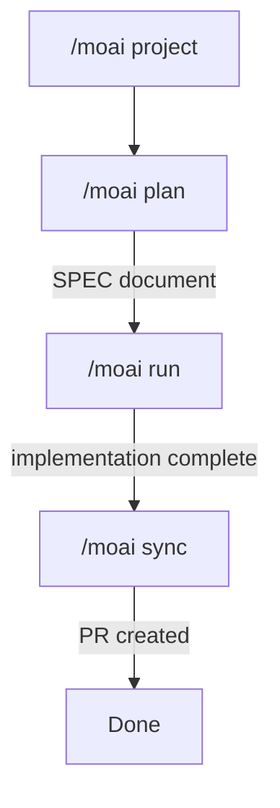
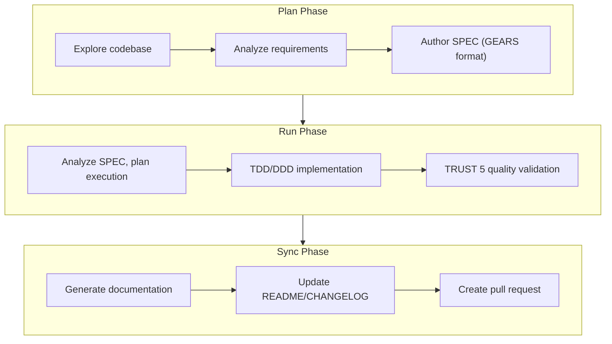
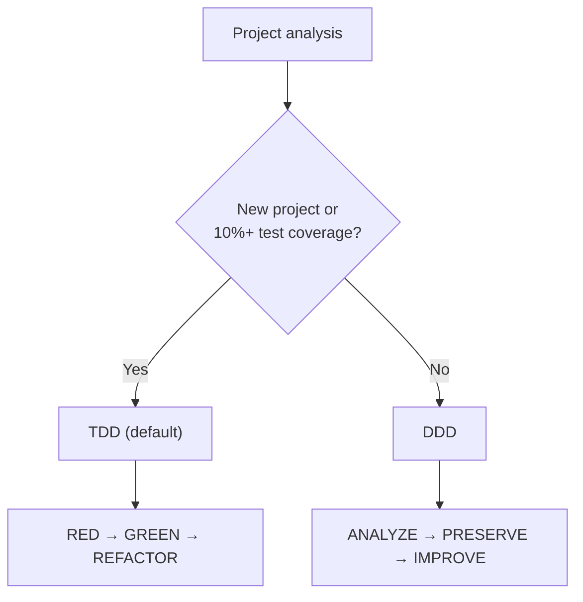
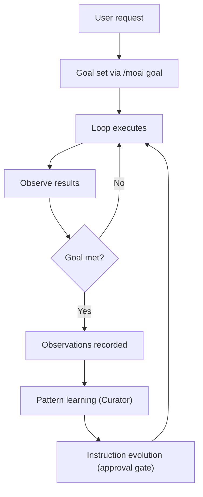
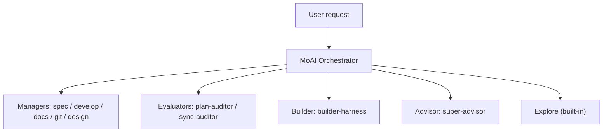

<p align="center">
  
</p>

<h1 align="center">MoAI-ADK</h1>

<p align="center">
  <strong>토크노믹스를 위해 설계된 에이전틱 개발 키트</strong>
</p>

<p align="center">
  <a href="./README.md">English</a> ·
  한국어 ·
  <a href="./README.ja.md">日本語</a> ·
  <a href="./README.zh.md">中文</a>
</p>

<p align="center">
  <a href="https://github.com/modu-ai/moai-adk/actions/workflows/ci.yml"></a>
  <a href="https://github.com/modu-ai/moai-adk/actions/workflows/codeql.yml"></a>
  <a href="https://codecov.io/gh/modu-ai/moai-adk"></a>
  <br>
  <a href="https://go.dev/"></a>
  <a href="https://github.com/modu-ai/moai-adk/releases"></a>
  <a href="./LICENSE"></a>
</p>

<p align="center">
  <a href="https://adk.mo.ai.kr"><strong>공식 문서</strong></a> ·
  <a href="https://adk.mo.ai.kr/book">도서: Claude Code 실전 에이전틱 코딩</a> ·
  <a href="https://discord.gg/Z7E7Mdc5aN">Discord</a>
</p>

---

> **"바이브코딩의 목적은 빠른 생산성이 아니라 코드 품질이다."**

MoAI-ADK(Agentic Development Kit)는 이 원칙 하나로 움직인다. 북극성은 토크노믹스(Token Economics) — 같은 품질을 더 적은 토큰으로 내고, 같은 토큰이면 품질을 더 끌어올린다. 어떤 모델을 쓸지, 얼마나 깊이 추론할지, 컨텍스트를 어떻게 소비할지는 그때그때 운에 맡기지 않고 시스템이 정한다. Go로 짠 단일 바이너리라 macOS·Linux·Windows 어디서든 별도 의존성 없이 바로 돌아간다.

---

## 에이전틱 코딩의 세 가지 비용

에이전틱 코딩은 시작은 빠르다. 문제는 유지다. 실제로 겪는 비용은 세 가지다.

- **세션이 길어질수록 토큰 지출이 복리로 붙는다.** 토큰 단가는 해마다 떨어지는데 코딩 에이전트의 총 청구액은 오히려 오른다. 매 턴 쌓인 컨텍스트를 통째로 다시 읽는 구조라, 작업이 길어질수록 이 기본 비용이 수십 턴에 걸쳐 곱해진다. 토큰은 싸지는데 청구서는 두꺼워지는 역설이다.
- **AI가 만든 코드가 검증 없이 나간다.** 모델은 "이 변경이 맞다"고 말하지만 그 말을 붙잡아 세우는 게이트가 없다. 테스트도 린트도 커버리지도 보안 검사도 "나중에 하면 되는 일"로 밀린다. 품질은 모든 병합에 붙는 속성이 아니라 한 번의 주장으로 남는다.
- **긴 세션은 컨텍스트 한계에서 끊기고 하던 일을 잃는다.** 어제 잘 돌던 세션이 오늘은 작업 한복판에서 멈춘다. 컨텍스트 윈도우가 찬 것이다. 넘겨줄 방법이 없으면 진행하던 작업도 그때까지의 추론도 함께 사라지고, 다음 세션은 백지에서 다시 시작한다.

세 비용의 뿌리는 하나다. 모델은 토큰 단위로 움직이는 확률적 작업자다. 예산도 품질 기준도 지난 세션이 어디서 끊겼는지도 기억하지 못한다. 비용 상한, 통과하는 테스트 스위트, `/clear`를 건너뛰는 연속성 — 이런 속성은 매 턴 프롬프트로 다시 심을 수 있는 게 아니다. 한 번이라도 잊은 턴은 언제든 나쁜 샘플 하나 차이로 무너질 수 있다. 그래서 이런 속성은 모델을 바깥에서 감싸는 시스템이 강제해야 한다. 어느 턴이 어떻게 흘러가든 시스템은 속성을 흔들림 없이 붙든다. 그 시스템이 하네스다. 하네스를 짜는 일이 하네스 엔지니어링이고, Anthropic의 에이전트 가이드가 만나는 지점도 여기다. MoAI-ADK는 이 세 비용을 "어쩔 수 없는 현실"이 아니라 메커니즘으로 풀 수 있는 엔지니어링 문제로 본다.

---

## 비용별 대응 메커니즘

문제가 구조적이면 해법도 구조여야 한다. 아래 메커니즘은 모두 모델의 턴 단위 재량 바깥에서 작동한다 — 선언적 설정, 훅, 게이트. 모델이 틀린 턴을 내놓아도 그대로 버틴다. 고통마다 측정 가능한 증거를 낀 구체적 메커니즘이 붙는다.

| 고통 | 메커니즘 | 증거 |
|------|-----------|----------|
| 구현 토큰 비용 | **CG 모드** — Claude 리더가 계획하고 감사하며, GLM 워커가 대량 구현 수행 (`moai cg`) | 구현 집중 작업에서 **60-70% 비용 절감** |
| 세션 내 폭주하는 지출 | **Token Circuit Breaker + 예산 추적** — 스테이터스라인 비용/CW% 게이지, 예산 초과 전 안전한 중단 | 터진 뒤가 아니라 터지기 전에 멈춤; 비용이 매 턴 보임 |
| 검증되지 않은 품질 | **SPEC 3-페이즈 라이프사이클 + TRUST 5 게이트 + 독립 감사관** (plan-auditor, sync-auditor) | 모든 병합이 테스트 / 린트 / 커버리지 게이트를 통과; 작성자가 자기 작업을 채점하지 않음 |
| 컨텍스트 한계에서의 세션 손실 | **세션 핸드오프 자동 재개** — 컨텍스트 윈도우 임계점에서 붙여넣기 즉시 쓸 수 있는 재개 메시지 | `/clear` 후 한 번의 붙여넣기로 진행 상태, 적용된 교훈, 전제 조건 복원 |
| 작업에 맞지 않는 모델 | **No-Haiku 3-티어 모델 정책** — 페이즈와 SPEC 크기별 선언적 모델 + effort | 중요한 곳엔 Opus급 판단, 안전한 곳에만 저렴한 모델 |

이 숫자들 자체가 도구가 강제하는 규율의 산물이다. v2.14.0에서 v3.0.0-rc12까지 **80일** 동안 **2,373개 커밋**이 쌓였고, 그 결과가 **480개 이상의 SPEC 문서**, **27개** 템플릿 관리 스킬, 그리고 **16개** 지원 언어를 아우르는 **36개**의 최상위 CLI 커맨드다. 이 변경 전부가 예외 없이 아래 plan → run → sync 파이프라인을 통과했다.

---

## 순정 Claude Code와의 차이

MoAI-ADK는 Claude Code **위에** 얹히는 하네스다. Claude Code를 대체하지 않고, Claude Code가 당신 손에 맡겨둔 부분을 구조로 감싼다.

| 항목 | 순정 Claude Code | Claude Code + MoAI-ADK |
|-----------|-------------------|------------------------|
| 모델 라우팅 | 수동 — 매번 직접 모델 선택 | 페이즈와 SPEC 크기별 선언적 No-Haiku 3-티어 정책 (max / medium / low) |
| 품질 게이트 | 강제되는 것 없음 | 모든 변경에 TRUST 5 (Tested / Readable / Unified / Secured / Trackable) |
| 스펙 / 요구사항 | 즉흥적 프롬프트 | GEARS 형식 요구사항 + 인수 기준을 갖춘 SPEC 3-페이즈 라이프사이클 (plan → run → sync) |
| 비용 제어 | 없음 | 예산 추적 + Token Circuit Breaker + CG 하이브리드 (60-70% 절감) |
| 세션 연속성 | `/clear` 후 수동 재프롬프트 | 자동 핸드오프 — 진행 상태와 전제 조건을 담아 한 번 붙여넣는 재개 |
| 학습 | 세션 간 정적 | 자가 진화 하네스 (관찰 → 휴리스틱 → 규칙 → 자동 업데이트), 항상 승인 게이트 뒤에서 |
| 멀티 에이전트 | 수동, 프롬프트별 | Analyze-First 라우팅과 분리된 계획/감사 역할을 갖춘 11-에이전트 카탈로그 |

두 열을 가르는 건 재량이냐 보장이냐다. 왼쪽에서는 매 동작이 "이번 턴에 모델이 제대로 골랐는가"에 달려 있다. 오른쪽에서는 같은 동작이 파이프라인의 속성이라, 어느 턴이 맞히든 빗나가든 상관없이 강제된다.

---

## 설치와 시작

`moai init`이 끝나는 순간 하네스가 바로 돈다. Claude Code 터미널 스테이터스라인에 비용/컨텍스트 게이지가 뜨고, TRUST 5 품질 게이트가 워크플로우에 물리며, `/moai` 커맨드 전체를 채팅에서 바로 쓸 수 있다.

### 요구사항

| 플랫폼 | 지원 환경 | 비고 |
|----------|----------------------|-------|
| macOS | Terminal, iTerm2 | 완전 지원 |
| Linux | Bash, Zsh | 완전 지원 |
| Windows | **WSL (권장)**, PowerShell 7.x+ | 네이티브 cmd.exe는 미지원 |

**사전 요구사항**

- 모든 플랫폼에 **Git** 설치 필수
- **Claude Code** — MoAI-ADK는 Claude Code를 위한 하네스다
- **Windows 사용자**: [Git for Windows](https://gitforwindows.org/)가 **필수** (Git Bash 포함); 레거시 Windows PowerShell 5.x와 cmd.exe는 **미지원**
- **권장**: `gh` CLI (PR 자동화) · `tmux` (CG 모드) · 사용 언어의 린트/테스트 툴체인 (예: `golangci-lint`)

### 설치

#### macOS / Linux / WSL

```bash
curl -fsSL https://raw.githubusercontent.com/modu-ai/moai-adk/main/install.sh | bash
```

#### Windows (PowerShell 7.x+)

> **권장**: 가장 원활하게 쓰려면 위의 Linux 설치 명령으로 WSL을 사용한다.

```powershell
irm https://raw.githubusercontent.com/modu-ai/moai-adk/main/install.ps1 | iex
```

> [Git for Windows](https://gitforwindows.org/)가 먼저 설치되어 있어야 한다.

#### 소스에서 빌드 (Go 1.26+)

```bash
git clone https://github.com/modu-ai/moai-adk.git
cd moai-adk && make build
```

> 사전 빌드된 바이너리는 [Releases](https://github.com/modu-ai/moai-adk/releases) 페이지에서 받을 수 있다.

### 프로젝트 초기화

```bash
moai init my-project
```

대화형 마법사가 언어와 프레임워크, 방법론을 자동으로 감지하고, 모델 정책을 고른 뒤 Claude Code 통합 파일까지 만든다.

### Claude Code에서 시작

```bash
claude        # launch Claude Code inside the project
```

```text
/moai plan "Add JWT login"      # author a SPEC
/moai run SPEC-AUTH-001         # TDD/DDD implementation
/moai sync SPEC-AUTH-001        # sync docs + create PR
```

자연어로 던져도 된다. `/moai "fix the login bug"`처럼 쓰면 의도 분석 (Analyze-First 라우팅)이 요청을 읽고 알맞은 워크플로우로 넘긴다. 어떤 대화 언어로 적어도 통한다.


```mermaid
flowchart TD
    A["/moai project"] --> B["/moai plan"]
    B -->|"SPEC document"| C["/moai run"]
    C -->|"implementation complete"| D["/moai sync"]
    D -->|"PR created"| E["Done"]
```

### Windows 참고: 비ASCII 사용자명 경로

Windows 사용자명에 비ASCII 문자 (한국어, 중국어 등)가 섞여 있으면 8.3 짧은 파일명 변환 때문에 `EINVAL` 오류가 날 수 있다. 우회 방법은 다음과 같다.

```powershell
# Option 1: point MoAI at an ASCII-only temp directory
$env:MOAI_TEMP_DIR="C:\temp"
New-Item -ItemType Directory -Path "C:\temp" -Force

# Option 2: disable 8.3 filename generation (requires admin)
fsutil 8dot3name set 1
```

세 번째 방법은 ASCII만 쓴 사용자명으로 Windows 계정을 새로 만드는 것이다.

---

## 개발 워크플로우

### Analyze-First 라우팅

`/moai`의 기본 라우팅은 언어에 얽매이지 않는 의도 분석이다. 요청을 영어 키워드로 맞춰 보는 게 아니라 의미로 분류하기 때문에, 어떤 대화 언어로 써도 통한다.

1. 의도 분석 (언어 독립적 분류)
2. 컨텍스트 충분성 검사 (컨텍스트가 부족하면 소크라테스식 인터뷰 실행)
3. 실행 계획 구성 (스킬 / 에이전트 / 동적 워크플로우 체인)
4. 오케스트레이션 모드 선택 (solo-sequential / parallel-subagents / dynamic-workflow)

### SPEC 3-페이즈 라이프사이클

```
/moai plan → [plan-auditor audit] → Implementation Kickoff Approval (human gate) → /moai run → /moai sync → [sync-auditor scoring]
```

- 라이프사이클은 정확히 세 페이즈 — **plan → run → sync**
- Tier S/M/L 크기 분류가 검증 깊이와 PR 라우팅을 결정한다
- GEARS 형식 요구사항 + 인수 기준 (AC) — 완료는 "된 것 같다"가 아니라 증거로 판정한다


```mermaid
flowchart TB
    subgraph Plan ["Plan Phase"]
        P1["Explore codebase"] --> P2["Analyze requirements"]
        P2 --> P3["Author SPEC (GEARS format)"]
    end

    subgraph Run ["Run Phase"]
        R1["Analyze SPEC, plan execution"] --> R2["TDD/DDD implementation"]
        R2 --> R3["TRUST 5 quality validation"]
    end

    subgraph Sync ["Sync Phase"]
        S1["Generate documentation"] --> S2["Update README/CHANGELOG"]
        S2 --> S3["Create pull request"]
    end

    Plan --> Run
    Run --> Sync
```

### 개발 방법론 — TDD와 DDD

방법론은 `moai init`이 프로젝트 상태를 보고 정한다 (`--mode <ddd|tdd>`, 기본값 tdd). 나중에 바꾸려면 `.moai/config/sections/quality.yaml`의 `development_mode`만 손보면 된다.


```mermaid
flowchart TD
    A["Project analysis"] --> B{"New project or<br/>10%+ test coverage?"}
    B -->|"Yes"| C["TDD (default)"]
    B -->|"No"| D["DDD"]
    C --> F["RED → GREEN → REFACTOR"]
    D --> G["ANALYZE → PRESERVE → IMPROVE"]
```

| 방법론 | 사이클 | 대상 |
|-------------|-------|-----|
| **TDD** (기본) | RED (실패하는 테스트) → GREEN (최소 통과) → REFACTOR (녹색 테스트 아래 품질 개선) | 신규 프로젝트와 기능 작업 |
| **DDD** | ANALYZE (의존성, 도메인 경계) → PRESERVE (특성화 테스트) → IMPROVE (테스트 보호 아래 점진적 변경) | 커버리지 10% 미만의 기존 코드 |

### TRUST 5 품질 게이트

모든 코드 변경은 다섯 가지 기준으로 검증된다:

| 기준 | 의미 | 검증 |
|-----------|---------|------------|
| **T**ested | 테스트됨 | 85%+ 커버리지, 특성화 테스트, 단위 테스트 통과 |
| **R**eadable | 읽기 쉬움 | 명확한 네이밍, 일관된 스타일, 린트 오류 0 |
| **U**nified | 통일됨 | 일관된 포매팅, import 순서, 프로젝트 구조 준수 |
| **S**ecured | 보안됨 | OWASP 준수, 입력 검증, 보안 경고 0 |
| **T**rackable | 추적 가능 | Conventional commits, 이슈 참조, 구조화된 로깅 |

---

## 비용 제어

### CG 모드

구현 작업에는 세 가지 세션 모드가 있다 — `moai cc`(Claude 전용), `moai glm`(GLM 전용), `moai cg`(하이브리드, Claude 리더 + GLM 워커). CG 모드는 Claude가 계획하고 감사하는 동안 GLM 워커가 대량 구현을 맡는 구조다. CG 모드는 구현 작업 비용을 60-70% 절감한다.

### Token Circuit Breaker와 예산 추적

스테이터스라인이 비용과 CW%(컨텍스트 윈도우 사용률) 게이지를 매 턴 보여주고, 예산을 넘기기 전에 안전하게 중단한다. 터진 뒤가 아니라 터지기 전에 멈추는 구조다.

### 스테이터스라인

MoAI는 Claude Code 터미널 맨 아래에 정보가 꽉 찬 스테이터스라인을 그린다. 모델 티어/effort, MoAI 버전 (업데이트가 있으면 마커까지), Git 브랜치와 변경 상태, 컨텍스트 윈도우 사용률 (CW%), 캐시 적중률, 세션 비용/토큰이 한 줄에 담긴다.

CW% 옆에는 2단계 `/clear` 마커가 뜬다. 모델별 임계점 (Opus 4.8, GLM-5.2[1m] 같은 1M-컨텍스트 모델은 50%, 200K 모델은 90%)에서 소프트 경고가 먼저 뜨고, 절대 한도에 닿으면 하드 마커가 붙는다. 참고로 Claude Code는 GLM-5.2를 200K 모델로 잘못 보고한다 (업스트림 Issue #653). MoAI가 `internal/statusline/memory.go`에서 1M으로 바로잡으므로, CW%는 MoAI 스테이터스라인 쪽을 믿으면 된다.

> → 자세히: [스테이터스라인](https://adk.mo.ai.kr/ko/advanced/statusline)

### 세션 핸드오프 자동 재개

컨텍스트 윈도우가 임계점 (1M-컨텍스트 모델 50%, 200K 모델 90%)에 닿으면, MoAI가 재개 메시지를 하나 뽑아 낸다. 여기엔 진행 상태와 그동안 적용한 교훈, 검증 가능한 전제 조건이 담긴다. `/clear` 뒤에 이 메시지를 한 번 붙여넣기만 하면 다음 세션이 끊긴 자리에서 그대로 이어진다.

---

## 자동화 루프와 학습

### /moai goal — 선언적 에이전틱 루프

완료 조건 하나만 선언해 두면, 그 조건이 충족되거나 턴 한도 (기본 30)에 닿을 때까지 세션이 알아서 일한다. 구현은 `internal/goal/`에 있고, goal 상태는 세션별로 `.moai/state/goal/<session-id>.json`에 담긴다. 판정은 2-티어 Stop-hook 평가기가 맡는다. Tier 1은 기계적 검사 — 종료 코드, grep 카운트, 파일 존재, 턴 한도. Tier 2는 체크포인트를 짚어 가며 오케스트레이터가 스스로 평가한다.

```text
/moai goal "go test ./... exits 0 and every AC is recorded as PASS"
/moai goal status
/moai goal clear
```

### /moai loop vs /moai fix — 진단 기반 자가 수리

`/moai loop`는 Ralph Engine (`internal/ralph/engine.go`) 위에 얹은 goal 엔진 프리셋이다. LSP 진단과 AST-grep, 린터를 한꺼번에 병렬로 돌려 스캔하고, 나온 문제를 Level 1 (자동 수정 가능)부터 Level 4 (사람 손이 필요)까지 나눈 뒤, 큐가 빌 때까지 돈다. 같은 오류가 계속 뜨면 전략을 바꾸는 수렴 감지가 붙어 있고, 무한히 도는 걸 막는 하드 반복 한도가 안전핀 역할을 한다.

| 명령 | 목표 | 실행 | 사용 시점 |
|---------|------|-----------|-------------|
| `/moai fix` | 단일 패스 수리 | 스캔-분류-수정-검증 1회 | 명확한 오류, 빠른 수정 |
| `/moai loop` | 끝날 때까지 반복 | 진단 → 분류 → 수정 → 검증 루프 | 복합 오류, 근본 원인 수리 |

### 자가 진화 하네스

에이전트는 자기가 굴러가는 과정에서 두 갈래로 배운다. 하나는 관찰을 쌓는 루프, 다른 하나는 그 관찰에서 진화하는 하네스다.


```mermaid
flowchart TD
    A["User request"] --> B["Goal set via /moai goal"]
    B --> C["Loop executes"]
    C --> D["Observe results"]
    D --> E{"Goal met?"}
    E -->|"No"| C
    E -->|"Yes"| F["Observations recorded"]
    F --> G["Pattern learning (Curator)"]
    G --> H["Instruction evolution (approval gate)"]
    H --> C
```

```
loop runs → observations accumulate (Routing Ledger) → patterns learned (Curator) → instructions evolve (approval gate)
```

- **Routing Observation Ledger** (`internal/harness/routing/`) — 라우팅 결정과 게이트 증거를 프라이버시 보존 다이제스트로 기록한다
- **4-티어 학습 사다리** (`internal/harness/learner.go`) — 관찰 (≥1) → 휴리스틱 (≥3) → 규칙 (≥5) → 자동 업데이트 (≥10, 사용자 승인 필수); 신뢰도 하한 0.70
- **5-계층 안전 파이프라인** — observer (`internal/harness/observer.go`) → learner → applier (`internal/harness/applier.go`, 스냅샷 우선 제한 편집) → config/marker 업데이터 → 사용자 승인 게이트; 모든 적용은 `moai harness rollback`으로 되돌릴 수 있다
- 산출물은 `.moai/harness/` 아래에 저장된다 (`usage-log.jsonl`, 학습된 규칙)

```bash
moai harness status      # learning state: observations, patterns, proposals
moai harness apply       # apply a proposal (passes the user approval gate)
moai harness rollback    # revert the last application
moai harness disable     # turn learning off
```

> → 자세히: [자가 진화 하네스](https://adk.mo.ai.kr/ko/advanced/self-evolving)

### 결정 메모리

MoAI-ADK는 사용자가 AskUserQuestion에서 내린 결정을 기억해 두었다가, 다음 추천을 그 사람에게 맞춘다.

- **3-티어 메모리** — Core (핫 선호) / Recall (최근 세션) / Archival (28일 TTL, 소프트 삭제)
- **적응적 배치** — 질문은 불확실성이 가장 높은 곳 (p ≈ 0.5)에서 나온다; 추천은 시스템 기본값이 아니라 관찰된 통계적 다수를 따른다
- **감쇠 정책** — 멱법칙 가중치, `(age+1)^(-0.5)`; 선호를 쓰면 새로고침된다
- **제어** — `moai preference list | decay-scan | toggle`; 민감한 보안 도메인은 공개와 함께 중립 추천을 제공한다

> → 자세히: [결정 메모리](https://adk.mo.ai.kr/ko/advanced/decision-memory) · [카탈로그 시스템](https://adk.mo.ai.kr/ko/advanced/catalog-system)

### Harness v4 Builder

```text
/moai harness "build me a harness for CLI template development"
```

자연어로 던진 요청이 도메인·목표·제약 추출을 거치고 승인 게이트를 통과하면, 이 프로젝트에만 맞춘 에이전트와 스킬, 커맨드가 만들어진다. `/moai project`를 돌리면 프로젝트 문서 (product.md, structure.md, tech.md, codemaps/)를 뽑으면서 하네스까지 같이 짠다.

> → 자세히: [Harness v4 Builder](https://adk.mo.ai.kr/ko/advanced/harness-v4-builder)

### Ultracode — xhigh 노력 + 자동 오케스트레이션

```text
/effort ultracode
```

`/effort ultracode`는 `xhigh` 추론 노력에 자동 동적 워크플로우 오케스트레이션을 얹는다 (Claude Code v2.1.154+). 세션 안에서 무게 있는 작업이 나올 때마다 알맞은 오케스트레이션 프리미티브가 자동으로 골라지고, 큰 팬아웃은 중간 결과를 세션 컨텍스트가 아니라 스크립트 변수에 담아 돈다. 전체 코드베이스를 훑거나 독립 작업 수백 개를 처리하는 식으로, 팬아웃 자체가 비용의 대부분을 차지하는 대규모 병렬 스윕·감사·마이그레이션에 어울린다. 요청 하나만 이렇게 돌리고 싶다면 세션 전체를 갈아엎지 말고 `ultracode` 키워드를 앞에 붙인다.

> → 자세히: [동적 워크플로우와 Ultracode](https://adk.mo.ai.kr/ko/advanced/ultracode-workflows)

---

## 에이전트 구성

### 11-에이전트 카탈로그

유지 에이전트 11개: MoAI 커스텀 10개 + Anthropic 내장 `Explore`.

| 분류 | 에이전트 | 역할 |
|----------|-------|------|
| **Manager** | manager-spec | Plan-phase SPEC 작성 |
| | manager-develop | Run-phase TDD/DDD/autofix 구현 |
| | manager-docs | Sync-phase 문서화 |
| | manager-git | PR 생성 및 라우팅 |
| | manager-design | Design-phase 협업 (Claude Design) |
| **Evaluator** | plan-auditor | 독립 계획 감사 (편향 방지) |
| | sync-auditor | 4-차원 품질 채점 (Functionality 40 · Security 25 · Craft 20 · Consistency 15) |
| **Builder** | builder-harness | 프로젝트 전용 에이전트, 스킬, 커맨드, 훅 스캐폴딩 |
| **Advisor** | super-advisor | 온디맨드 고추론 자문 (E1-E4 에스컬레이션) |
| **Specialist** | e2e-tester | 웹/모바일/데스크톱 E2E 테스트 실행 (CLI 우선) |
| **Built-in** | Explore | 읽기 전용 코드베이스 탐색 |

계획과 감사는 설계 단계부터 갈라놨다. 작성한 쪽이 자기 작업에 점수를 매기는 일은 없다.


```mermaid
flowchart TD
    U["User request"] --> M["MoAI Orchestrator"]
    M --> MG1["Managers: spec / develop / docs / git / design"]
    M --> EV["Evaluators: plan-auditor / sync-auditor"]
    M --> BD["Builder: builder-harness"]
    M --> AD["Advisor: super-advisor"]
    M --> EX["Explore (built-in)"]
```

### 오케스트레이션 프리미티브

정적 Agent Teams 계층은 v3에서 물러났다. 지금 남은 건 오케스트레이션 프리미티브 셋인데, 계획을 누가 쥐느냐로 골라 쓴다.

| 프리미티브 | 형태 | 적합한 경우 |
|-----------|-------|----------|
| 순차 서브에이전트 | 오케스트레이터가 턴 단위로 위임 | 코딩 중심 작업 |
| 병렬 팬아웃 | 한 턴에 여러 읽기 전용 `Agent()` 호출 | 리서치, 리뷰, 감사 |
| 동적 워크플로우 | 스크립트가 수십 개 에이전트를 오케스트레이션; 결과는 스크립트 변수에 유지 | 코드베이스 스윕, 대규모 마이그레이션 |

네이티브 Claude Code 팀메이트 런타임 (`moai cg` tmux pane)은 이 은퇴와 상관없이 그대로 돌아간다.

---

## 레퍼런스

### `/moai` 슬래시 서브커맨드

> **헷갈리기 쉬운 구분**: `moai` (터미널 CLI)와 `/moai` (Claude Code 슬래시 커맨드)는 다른 도구다. 앞의 것은 셸에서 돌리는 Go 바이너리 (`moai init`, `moai doctor`)이고, 뒤의 것은 Claude Code 채팅에서 부르는 AI 워크플로우 라우터 (`/moai plan`, `/moai run`)다.

16개 항목 — 이름 있는 서브커맨드 15개 + 자연어 기본 경로:

| 서브커맨드 | 역할 |
|------------|------|
| `plan` / `run` / `sync` | SPEC 3-페이즈 파이프라인 |
| `goal` / `loop` / `fix` | 선언적 goal 루프 · 반복 수리 · 단일 패스 수리 |
| `project` / `harness` | 프로젝트 문서 + 하네스 생성 · 하네스 라이프사이클 |
| `review` / `gate` / `clean` | 코드 리뷰 · 사전 커밋 품질 게이트 · 데드 코드 제거 |
| `codemaps` / `feedback` | 아키텍처 문서 · GitHub 이슈 보고 |
| `e2e` | 멀티플랫폼 E2E 테스트 (웹/모바일/데스크톱, CLI 우선) |
| *(자연어)* | 자율 plan → run → sync 파이프라인으로의 Analyze-First 라우팅 |

> → 자세히: [워크플로우 커맨드](https://adk.mo.ai.kr/ko/workflow-commands) · [유틸리티 커맨드](https://adk.mo.ai.kr/ko/utility-commands)

### CLI 커맨드 (최상위 36개)

`moai` 바이너리에 등록된 최상위 커맨드는 36개다. 그중 자주 손이 가는 것부터 본다.

| 커맨드 | 설명 |
|---------|-------------|
| `moai init` | 대화형 프로젝트 설정 (언어/프레임워크/방법론 자동 감지) |
| `moai doctor` | 시스템 상태 진단과 환경 검증 |
| `moai status` | 프로젝트 상태 요약 (Git 브랜치, 품질 지표) |
| `moai update` | 최신 버전으로 업데이트 (자동 롤백 지원) |
| `moai update -c` | init 마법사 재실행으로 설정 편집 (템플릿 동기화 없음) |
| `moai cc` / `moai glm` / `moai cg` | Claude 전용 / GLM 전용 / 하이브리드 Claude 리더 + GLM 워커 세션 |
| `moai worktree <new\|list\|switch\|sync\|remove\|clean\|go>` | 병렬 SPEC 개발을 위한 Git worktree 관리 |
| `moai session <list\|register\|current>` | 멀티 세션 조율 |
| `moai spec <audit\|archive\|lint\|list\|new>` | SPEC 라이프사이클 도구 |
| `moai goal <arm\|status\|clear>` | Goal 엔진 CLI |
| `moai harness <status\|apply\|rollback\|disable>` | 하네스 학습 라이프사이클 |
| `moai handoff <save\|list>` | 세션 핸드오프 기록 |
| `moai preference <list\|decay-scan\|toggle>` | 결정 메모리 관리 |
| `moai hook <event>` | Claude Code 훅 디스패처 |
| `moai web` | Web Console — 6탭 설정 콘솔 (identity, language, launch, git_strategy, llm, agentfm) + 서브 에이전트 4색 티어 배지 (en/ko/ja/zh) |
| `moai inventory` | 세션, worktree, 하네스의 읽기 전용 인벤토리 (`--json` 지원) |
| `moai version` | 버전, 커밋 해시, 빌드 날짜 |

나머지 등록 커맨드는 다음과 같다: `clean`, `codemaps`, `feedback`, `loop`, `lsp`, `ast-grep`, `agent`, `workflow`, `statusline`, `telemetry`, `constitution`, `state`, `tool-policy`, `migrate`, `profile`, `pr`, `github`, `research`.

> 커맨드마다 레퍼런스 페이지가 docs-site에 마련돼 있다. 특히 v3에서 `goal`, `handoff`, `harness`, `init`, `launchers`, `loop`, `pr`, `session`, `spec`, `tool-policy`, `worktree` 등 **CLI 레퍼런스 페이지 11개**가 새로 들어왔다.
> → 자세히: [CLI 레퍼런스](https://adk.mo.ai.kr/ko/cli-reference)

### 훅

모든 훅 이벤트는 JSON stdin/stdout으로 주고받는 Claude Code 훅 프로토콜을 따른다.

- **27개 이벤트 타입** — SessionStart, PreToolUse, PostToolUse, SessionEnd, Stop, SubagentStop, PreCompact, PostCompact, TeammateIdle, TaskCompleted 등
- **4개 훅 타입** — command (셸 스크립트), prompt (LLM 평가), agent (서브에이전트 검증), http (웹훅 엔드포인트)
- 태스크 지표는 세션 분석과 비용 추적을 위해 `.moai/logs/task-metrics.jsonl`에 기록된다

> → 자세히: [훅 가이드](https://adk.mo.ai.kr/ko/advanced/hooks-guide) · [훅 레퍼런스](https://adk.mo.ai.kr/ko/advanced/hooks-reference)

### 출력 스타일

| 스타일 | 성격 | 대상 |
|-------|-----------|----------|
| **MoAI** (expert) | 밀도 높고 간결 | 숙련 개발자 |
| **MoAI-Easy** (basic) | 친절하고 설명적 — 제품 기본값 | 신규 사용자 |
| **MoAI-Learn** (learn) | 소크라테스식 튜터 | 학습자 |

전환은 `/config`로 한다 (선택값은 우선순위가 가장 높은 `settings.local.json`에 저장된다). 출력 스타일은 세션이 시작할 때 딱 한 번만 읽히기 때문에, 바꿔도 `/clear`를 하거나 새 세션을 열어야 반영된다.

> → 자세히: [Advanced 가이드](https://adk.mo.ai.kr/ko/advanced)

### @MX 태그 시스템

@MX 태그는 AI 에이전트끼리 컨텍스트와 불변 계약, 위험 구역을 주고받는 인라인 코드 어노테이션이다.

```go
// @MX:ANCHOR: [AUTO] Hook registry dispatch - 5+ callers
// @MX:REASON: [AUTO] Central entry point for all hook events, changes have wide impact
func DispatchHook(event string, data []byte) error {
    // ...
}
```

| 태그 | 목적 | 트리거 |
|-----|---------|---------|
| `@MX:ANCHOR` | 불변 계약 | fan_in >= 3 — 변경 파급이 큼 |
| `@MX:WARN` | 위험 구역 | 고루틴, 복잡도 >= 15, 전역 상태 변경 |
| `@MX:NOTE` | 컨텍스트 | 매직 상수, 문서 누락, 비즈니스 규칙 |
| `@MX:TODO` | 미완 작업 | 테스트 누락, 미구현 기능 |

이 시스템의 핵심은 신호 대 잡음비다. **AI가 제일 먼저 알아야 할 코드에만 태그가 붙는다.** 대부분의 코드는 어느 기준에도 걸리지 않아 태그가 없는데, 이건 결함이 아니라 원래 그러라고 만든 동작이다. 임계값과 파일당 한도는 `.moai/config/sections/mx.yaml`에서 조정하고, 태그 자체는 plan/run/sync 페이즈 안에서 자동으로 만들어지고 관리된다.

> → 자세히: [@MX 태그 시스템](https://adk.mo.ai.kr/ko/advanced/mx-tags)

### Worktree 격리

`/moai plan --worktree`를 쓰면 SPEC마다 병렬 개발용으로 격리된 git worktree가 하나씩 붙고, 그 라이프사이클은 `moai worktree`가 챙긴다 (`new --tmux`를 주면 worktree 안에 tmux 세션까지 자동으로 띄운다).

> → 자세히: [Git Worktree 가이드](https://adk.mo.ai.kr/ko/worktree)

### 16개 지원 언어

go · python · typescript · javascript · rust · java · kotlin · csharp · ruby · php · elixir · cpp · scala · r · flutter · swift — 프로젝트 마커로 알아서 감지하고, 언어마다 그 언어의 표준 린트/포맷/테스트 툴체인을 돌린다. 설치돼 있지 않은 도구는 군말 없이 건너뛴다.

> → 자세히: [CLI 레퍼런스 — init](https://adk.mo.ai.kr/ko/cli-reference/init)

---

## FAQ

### Q: 왜 모든 함수에 @MX 태그가 없나요?

**정상이다.** 태그는 팬인이 높거나 복잡하거나 위험한 코드만 골라 표시한다. 어느 프로젝트든 코드 대부분은 어떤 태그 기준에도 안 걸리고, 태그가 없는 파일은 결함이 아니다.

### Q: 스테이터스라인의 버전 표시는 무슨 뜻인가요?

```
🗿 v3.0.0-rc11 ⬆️ v3.0.0-rc12
```

앞의 값은 지금 설치된 MoAI-ADK 버전이고, 화살표는 받을 수 있는 업데이트가 있다는 표시다 (`moai update`를 돌리면 사라진다). Claude Code 자체 버전 표시와는 별개다.

---

## 커뮤니티와 문서

### 기여하기

기여는 언제든 환영한다. 자세한 절차는 [CONTRIBUTING.md](CONTRIBUTING.md)에 정리해 두었다.

1. 리포지토리 포크
2. 기능 브랜치 생성: `git checkout -b feature/my-feature`
3. 테스트 작성 (신규 코드는 TDD, 기존 코드는 특성화 테스트)
4. 테스트, 린트, 포맷 통과 확인: `make test` · `make lint` · `make fmt`
5. Conventional commit 메시지로 커밋하고 풀 리퀘스트 열기

**코드 품질 요구사항**: 85%+ 커버리지 · 린트 오류 0 · 타입 오류 0 · Conventional commits

### 커뮤니티

- [Discord](https://discord.gg/Z7E7Mdc5aN) — 실시간 토론과 팁
- [Issues](https://github.com/modu-ai/moai-adk/issues) — 버그 리포트, 기능 요청 (Claude Code 안에서는 `/moai feedback`)

### 라이선스

[Apache License 2.0](./LICENSE) — 자세한 내용은 LICENSE 파일을 참조한다.

### 문서 가이드

[adk.mo.ai.kr](https://adk.mo.ai.kr) 온라인 문서는 12개 섹션으로 나뉘어 있다. 각 섹션이 무엇을 다루고 어디로 들어가면 되는지 정리했다.

| 섹션 | 설명 |
|------|------|
| [시작하기](https://adk.mo.ai.kr/ko/getting-started) | 소개, 설치, Windows 가이드, init 마법사, 퀵스타트, CLI 개요, FAQ |
| [핵심 개념](https://adk.mo.ai.kr/ko/core-concepts) | MoAI-ADK 정체성, 컨스티튜션, 하네스 엔지니어링, SPEC 기반 개발, DDD, TRUST 5 |
| [워크플로우 커맨드](https://adk.mo.ai.kr/ko/workflow-commands) | `plan` · `run` · `sync` · `project` · `harness` · `design` — SPEC 파이프라인의 주축 |
| [유틸리티 커맨드](https://adk.mo.ai.kr/ko/utility-commands) | `fix` · `loop` · `gate` · `review` · `clean` · `codemaps` · `e2e` · `feedback` · `goal` · `moai` |
| [CLI 레퍼런스](https://adk.mo.ai.kr/ko/cli-reference) | 터미널 `moai` 바이너리의 모든 커맨드 — `status`, `profile`, `doctor`, `update`, `web`, `goal`, `handoff`, `harness`, `init`, `worktree` 등 |
| [Claude Code 가이드](https://adk.mo.ai.kr/ko/claude-code) | Claude Code 통합 — 기초, 컨텍스트·메모리, 에이전틱, 확장성 (스킬·훅·플러그인) |
| [Multi-LLM](https://adk.mo.ai.kr/ko/multi-llm) | CG 모드 (Claude 리더 + GLM 워커)와 모델 정책 |
| [비용 최적화](https://adk.mo.ai.kr/ko/cost-optimization) | 프롬프트 캐싱 전략과 토큰 비용 절감 |
| [가이드](https://adk.mo.ai.kr/ko/guides) | CI 자율화, multi-LLM CI 등 실전 운영 레시피 |
| [Git Worktree](https://adk.mo.ai.kr/ko/worktree) | 병렬 SPEC 개발을 위한 worktree 가이드, 예제, FAQ |
| [Advanced](https://adk.mo.ai.kr/ko/advanced) | 토크노믹스 개요, 토큰 예산, 스테이터스라인, settings.json, 훅, @MX 태그, 스킬 가이드, Harness v4 Builder, 자가 진화, 결정 메모리, 카탈로그 시스템, 보안 노트, CLAUDE.md/에이전트 가이드 등 심화 주제 |
| [기여하기](https://adk.mo.ai.kr/ko/contributing) | 오픈소스 기여 가이드 |

### 링크

- [공식 문서](https://adk.mo.ai.kr)
- [도서: Claude Code 실전 에이전틱 코딩](https://adk.mo.ai.kr/book)
- [CHANGELOG](./CHANGELOG.md)
- [Claude Code](https://docs.anthropic.com/en/docs/claude-code)
- [Discord 커뮤니티](https://discord.gg/Z7E7Mdc5aN)
