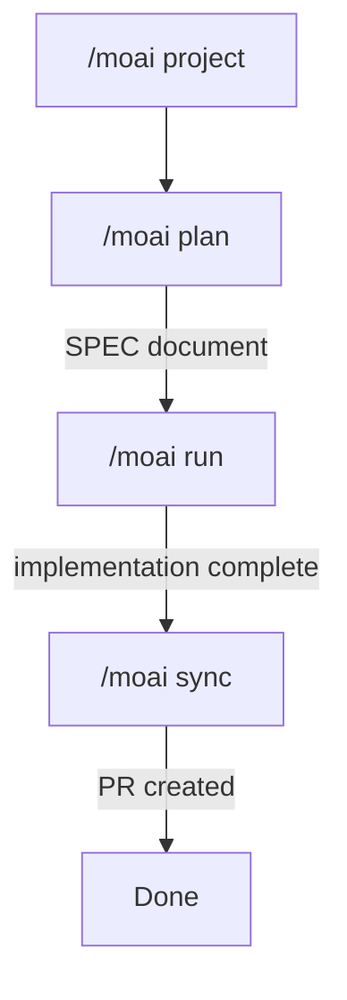
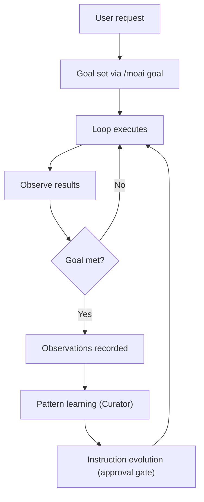
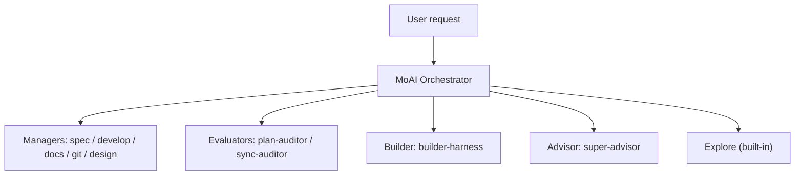
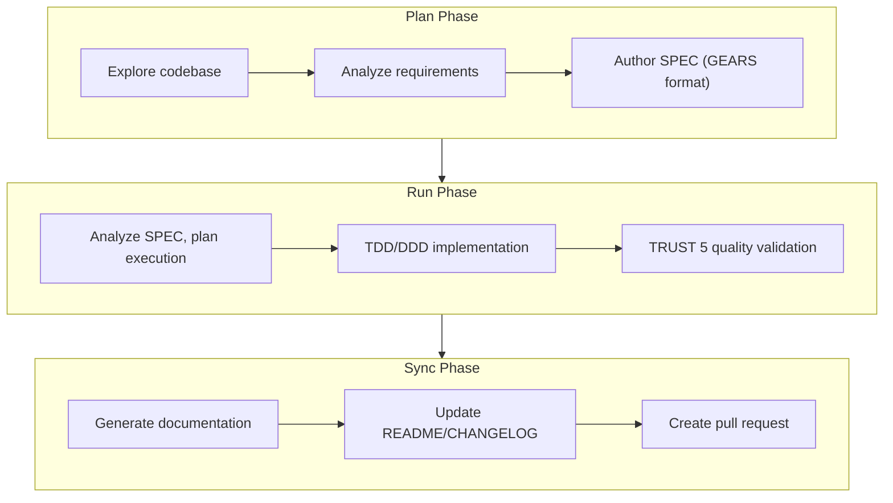
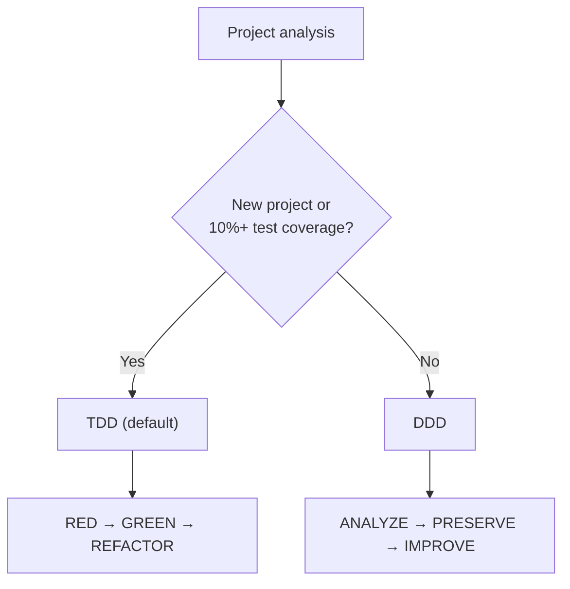

<p align="center">
  
</p>

<h1 align="center">MoAI-ADK</h1>

<p align="center">
  <strong>토크노믹스를 위해 설계된 에이전틱 개발 키트</strong>
</p>

<p align="center">
  <a href="./README.md">English</a> ·
  한국어 ·
  <a href="./README.ja.md">日本語</a> ·
  <a href="./README.zh.md">中文</a>
</p>

<p align="center">
  <a href="https://github.com/modu-ai/moai-adk/actions/workflows/ci.yml"></a>
  <a href="https://github.com/modu-ai/moai-adk/actions/workflows/codeql.yml"></a>
  <a href="https://codecov.io/gh/modu-ai/moai-adk"></a>
  <br>
  <a href="https://go.dev/"></a>
  <a href="https://github.com/modu-ai/moai-adk/releases"></a>
  <a href="./LICENSE"></a>
</p>

<p align="center">
  <a href="https://adk.mo.ai.kr"><strong>공식 문서</strong></a> ·
  <a href="https://adk.mo.ai.kr/book">도서: Claude Code 실전 에이전틱 코딩</a> ·
  <a href="https://discord.gg/Z7E7Mdc5aN">Discord</a>
</p>

---

> **"바이브코딩의 목적은 빠른 생산성이 아니라 코드 품질이다."**

MoAI-ADK (Agentic Development Kit)는 **토크노믹스** (Token Economics)를 북극성으로 삼는 에이전틱 개발 키트입니다: 더 적은 토큰으로 같은 코드 품질을, 같은 토큰으로 더 높은 품질을. 모델 선택, 추론 깊이, 컨텍스트 사용은 운에 맡기지 않고 시스템이 관리합니다.

Go로 작성된 단일 바이너리. macOS, Linux, Windows에서 의존성 없이 즉시 실행됩니다.

---

## 왜 토크노믹스인가

토큰 가격은 계속 떨어지지만, 에이전틱 개발은 가격 하락보다 빠르게 토큰을 소모합니다. 더 많은 에이전트가 병렬로 실행되고, 컨텍스트는 길어지고, 추론은 깊어집니다 — 그래서 실제 비용은 **모델의 가격표가 아니라 토큰을 어떻게 운용하느냐**로 결정됩니다.

MoAI-ADK의 답은 세 가지입니다:

1. **작업마다 알맞은 모델과 추론 깊이를 배정한다** — 계획은 깊게, 구현은 저렴하게, 검증은 독립적으로.
2. **컨텍스트를 다이어트한다** — 상시 로드 지침을 최소화하고 프롬프트 캐시 적중률을 측정한다.
3. **예산은 시스템이 지킨다** — 에이전트별 토큰 사용량을 추적하고, 한도 직전에 중간 붕괴 없이 우아하게 멈춘다.

---

## 세 가지 기둥

### 기둥 1 — 토크노믹스 (Token Economics)

달러당 품질을 극대화하는 지능적 자원 배분. No-Haiku 3-티어 모델 정책 (max / medium / low), 플랜 인지 티어 프로파일 (API 종량제 vs. 구독 플랜), Claude × GLM 하이브리드 (CG 모드, 구현 집중 작업에서 60-70% 비용 절감), 그리고 예산 초과 전에 우아하게 중단하는 Token Circuit Breaker.

### 기둥 2 — 재귀적 자가 학습

루프가 관찰을 축적하고, 하네스가 학습하고, 지침이 진화합니다. Routing Observation Ledger가 라우팅 결정을 기록하고, Curator가 이를 개선 제안으로 전환하며, 4-티어 학습 사다리 (관찰 → 휴리스틱 → 규칙 → 자동 업데이트)가 하네스를 업그레이드합니다 — 항상 사용자 승인 게이트 뒤에서.

### 기둥 3 — 에이전틱 하네스

코드를 직접 작성하는 대신, 에이전트가 잘 일하는 환경을 설계합니다: 11-에이전트 카탈로그, SPEC 기반 3-페이즈 워크플로우 (plan → run → sync), TRUST 5 품질 게이트, 그리고 자연어 요청에서 프로젝트 전용 하네스를 생성하는 Harness v4 Builder.

---

## 숫자로 보는 v3

v2.14.0 (2026-04-24)에서 v3.0.0-rc11 (2026-07-13)까지 — **80일**:

- 두 태그 사이 **2,373 커밋** — feat 727 · docs 517 · fix 240
- **9개의 릴리스 후보** (rc1 → rc11)
- 에이전트 카탈로그 **22 → 10** 통합 (더 적은 에이전트, 더 저렴한 위임)
- `.moai/specs/` 아래에서 스펙 우선 개발을 이끄는 **480+ SPEC 문서**
- 템플릿 관리 `moai-*` 스킬 **27개** · 최상위 CLI 커맨드 **36개** · 지원 프로그래밍 언어 **16개**

---

## 빠른 시작

### 1. 설치

#### macOS / Linux / WSL

```bash
curl -fsSL https://raw.githubusercontent.com/modu-ai/moai-adk/main/install.sh | bash
```

#### Windows (PowerShell 7.x+)

> **권장**: 최상의 경험을 위해 위의 Linux 설치 명령과 함께 WSL을 사용하세요.

```powershell
irm https://raw.githubusercontent.com/modu-ai/moai-adk/main/install.ps1 | iex
```

> [Git for Windows](https://gitforwindows.org/)가 먼저 설치되어 있어야 합니다.

#### 소스에서 빌드 (Go 1.26+)

```bash
git clone https://github.com/modu-ai/moai-adk.git
cd moai-adk && make build
```

> 사전 빌드된 바이너리는 [Releases](https://github.com/modu-ai/moai-adk/releases) 페이지에서 받을 수 있습니다.

### 2. 프로젝트 초기화

```bash
moai init my-project
```

대화형 마법사가 언어, 프레임워크, 방법론을 자동 감지하고, 모델 정책을 선택하며, Claude Code 통합 파일을 생성합니다.

### 3. Claude Code로 개발 시작

```bash
claude        # launch Claude Code inside the project
```

```text
/moai plan "Add JWT login"      # author a SPEC
/moai run SPEC-AUTH-001         # TDD/DDD implementation
/moai sync SPEC-AUTH-001        # sync docs + create PR
```

자연어로 요청해도 됩니다 — `/moai "fix the login bug"`는 의도 분석 (Analyze-First 라우팅)을 거쳐 알맞은 워크플로우로 연결되며, 어떤 대화 언어든 동작합니다.


```mermaid
flowchart TD
    A["/moai project"] --> B["/moai plan"]
    B -->|"SPEC document"| C["/moai run"]
    C -->|"implementation complete"| D["/moai sync"]
    D -->|"PR created"| E["Done"]
```

### 4. Windows 참고: 비ASCII 사용자명 경로

Windows 사용자명에 비ASCII 문자 (한국어, 중국어 등)가 포함되어 있으면 Windows 8.3 짧은 파일명 변환으로 인한 `EINVAL` 오류가 발생할 수 있습니다. 우회 방법:

```powershell
# Option 1: point MoAI at an ASCII-only temp directory
$env:MOAI_TEMP_DIR="C:\temp"
New-Item -ItemType Directory -Path "C:\temp" -Force

# Option 2: disable 8.3 filename generation (requires admin)
fsutil 8dot3name set 1
```

세 번째 방법은 ASCII 전용 사용자명으로 Windows 계정을 새로 만드는 것입니다.

---

## 시스템 요구사항

| 플랫폼 | 지원 환경 | 비고 |
|----------|----------------------|-------|
| macOS | Terminal, iTerm2 | 완전 지원 |
| Linux | Bash, Zsh | 완전 지원 |
| Windows | **WSL (권장)**, PowerShell 7.x+ | 네이티브 cmd.exe는 미지원 |

**사전 요구사항:**

- 모든 플랫폼에 **Git** 설치 필수
- **Claude Code** — MoAI-ADK는 Claude Code를 위한 하네스입니다
- **Windows 사용자**: [Git for Windows](https://gitforwindows.org/)가 **필수** (Git Bash 포함); 레거시 Windows PowerShell 5.x와 cmd.exe는 **미지원**
- **권장**: `gh` CLI (PR 자동화) · `tmux` (CG 모드) · 사용 언어의 린트/테스트 툴체인 (예: `golangci-lint`)

---

## 설계 계보 — 하네스 엔지니어링

MoAI-ADK는 Lilian Weng의 [**Harness Engineering for Self-Improvement**](https://lilianweng.github.io/posts/2026-07-04-harness/) (2026-07-04)에 제시된 하네스 엔지니어링 프레임워크를 의도적으로 승계하며, 그 설계 패턴과 자가 개선 루프를 동작하는 구현으로 옮겼습니다.

> **하네스란?** — "A harness is the system surrounding a base model that orchestrates execution and decides how the model thinks and plans, calls tools and acts, perceives and manages context, stores artifacts, and evaluates results." — Lilian Weng (2026-07-04)

Weng은 재귀적 자가 개선 (RSI)의 단기 경로가 "모델이 자기 가중치를 편집하는 것"이 아니라 **학습 파이프라인과 배포 시스템 — 즉 하네스 — 을 개선하는 것**이라고 예측했습니다. MoAI-ADK는 정확히 이 경로를 택합니다: 모델 가중치가 아니라 하네스 (스킬과 에이전트 지침)를 재귀적으로 개선합니다.

### 승계 지도 — Weng의 프레임워크에서 MoAI-ADK로

| Lilian Weng 하네스 개념 | MoAI-ADK 구현 |
|---|---|
| **Harness** — 베이스 모델을 둘러싼 실행/운영 계층 | MoAI-ADK = Claude Code 하네스 (단일 Go 바이너리 + CLAUDE.md 오케스트레이터) |
| **Pattern 1: Workflow Automation** — plan → execute → observe → improve 목표 루프 | `/moai goal` 엔진, `/moai loop` Ralph Engine, Analyze-First 라우팅 |
| **Pattern 2: File-System Persistent Memory** — "파일에 저장되는 지속 상태" | `.moai/specs/`, `progress.md`, `usage-log.jsonl`, `.moai/state/`, 세션 핸드오프 |
| **Pattern 3: Sub-agents & Backend Jobs** — 병렬성을 명시적이고 점검 가능하게 | 11개 유지 에이전트, `Agent()` 스폰, 동적 워크플로우 |
| **Self-Harness** — propose-evaluate-accept; 제한된 편집 + 회귀 게이트 | `internal/harness/` 4-티어 사다리 + 5-계층 안전 파이프라인 (applier = 제한된 편집, 회귀 게이트 = 검증) |
| **Meta-Harness** — "하네스를 최적화하는 하네스" | `builder-harness` — 하네스가 하네스를 만든다; `/moai project`가 자동 생성 |
| **"Improve the improver"** — RSI의 단기 경로는 배포 시스템 개선 | 재귀적 하네스 진화 — 루프가 관찰을 축적하고, 하네스가 자신의 스킬/에이전트 지침을 업그레이드 |
| **"Evaluators and permissions live outside the loop"** — 보상 해킹 방어 | Layer-5 사용자 승인 게이트 + 구현 착수 승인 — 인간 감독이 진화 루프 바깥에 위치 |
| **"Humans move up the stack, not out of the loop"** | 오케스트레이터가 단일 인간 접점; AskUserQuestion 게이트 결정과 SPEC 승인 게이트 |

> Weng의 경고는 충실히 지켜집니다: 평가자와 권한 통제는 하네스 진화 루프의 **바깥**에 있어야 합니다. MoAI-ADK는 Tier-4 자동 업데이트를 사용자 승인 게이트에 묶어, 자동화된 진화가 인간 감독 없는 폐쇄 루프로 도는 일이 없도록 합니다.

---

## 토크노믹스 자세히 보기

### No-Haiku 3-티어 모델 정책

모델과 추론 깊이 (effort)는 작업 페이즈와 SPEC 크기 (Tier S/M/L)에 따라 선언적으로 배정됩니다. 정책 티어는 닫힌 집합 — `max`, `medium`, `low` — 이며 `internal/config/model_routing.go`의 HARD 린트 규칙으로 검증됩니다 (닫힌 집합: effort `low/medium/high/xhigh/max`, tier `S/M/L`, phase `plan/run/sync`).

| 정책 | 대상 플랜 | 성격 |
|--------|-------------|-----------|
| **max** | Max $200/월 | 최고 품질 — 계획과 감사에 Opus급 모델 |
| **medium** | Max $100/월 | 품질과 비용의 균형 |
| **low** | Plus $20/월 | Opus 접근 불가 — Sonnet 중심 라우팅 |

"No-Haiku"라는 이름은 품질이 중요한 페이즈를 가장 싼 모델로 라우팅하던 관행에서 벗어난 v3의 전환을 표시합니다: 저렴한 모델은 안전한 곳에만 쓰고, 독립적 판단이 필요한 곳에는 절대 쓰지 않습니다.

### 플랜 인지 티어 프로파일 (plan_type)

같은 워크플로우라도 **API 종량제 과금과 구독 플랜**에서는 최적 배분이 다릅니다. 플랜 인지 프로파일은 과금 플랜별로 별도의 Tier × Phase 모델/effort 매트릭스를 적용하며, GLM 백엔드에는 effort 오버레이를 얹습니다.

### Claude × GLM 하이브리드 (CG 모드)

`moai cg`는 Claude 리더와 GLM 워커를 함께 실행합니다: 전략, 계획, 감사는 Claude API에 남고 대량 구현은 GLM으로 갑니다. 구현 집중 작업에서 비용을 **60-70%** 절감합니다.

MoAI-ADK는 Claude Code의 대체 백엔드로 **z.ai GLM**을 지원합니다 — 코드 변경이 필요 없습니다.

| 항목 | 세부 내용 |
|------|---------|
| GLM Coding Plan | **월 $10**부터 ([z.ai](https://z.ai/subscribe?ic=1NDV03BGWU)) |
| 호환성 | Claude Code에서 그대로 동작 |
| 모델 | glm-5.2[1m], glm-4.7, glm-4.5-air 및 무료 모델 |

**기본 모델 매핑:**

| Claude 티어 | GLM 모델 | 입력 (1M 토큰당) | 출력 (1M 토큰당) |
|-------------|-----------|----------------------|------------------------|
| Opus / Sonnet / Haiku / Fable | glm-5.2[1m] | $2.00 | $8.00 |

> 네 개의 Claude 티어 모두 단일 1M-컨텍스트 모델인 `glm-5.2[1m]`로 통일됩니다. 티어 슬롯에 1M-컨텍스트 모델과 200K-컨텍스트 모델을 섞으면 에이전트 스폰 세션 공유가 깨집니다 — 1M-컨텍스트 세션과 200K-컨텍스트 세션은 공유될 수 없습니다.

> `[1m]` 접미사는 Claude Code의 1M-토큰 컨텍스트 모드를 활성화합니다. Claude Code는 업스트림 z.ai API를 호출하기 전에 이 접미사를 파싱해 제거합니다. 매핑은 네 개의 `ANTHROPIC_DEFAULT_*_MODEL` 환경변수 (`OPUS`/`SONNET`/`HAIKU`/`FABLE`, 마지막은 Claude Code v2.1.202부터 공식 지원)를 모두 `glm-5.2`로 설정하는 방식으로 구현됩니다.

**모드 비교:**

| 명령 | 리더 | 워커 | tmux | 비용 절감 | 적합한 경우 |
|---------|--------|---------|------|--------------|----------|
| `moai cc` | Claude | Claude | 불필요 | — | 복잡한 작업, 최대 품질 |
| `moai glm` | GLM | GLM | 권장 | ~70% | 최대 비용 절감 |
| `moai cg` | Claude | GLM | **필수** | **~60%** | 품질 + 비용 균형 |

**CG 모드 실전:**

```bash
# 1. Save your GLM API key (once)
moai glm sk-your-glm-api-key

# 2. Make sure you are inside tmux (skip if already there)
tmux new -s moai

# 3. Launch CG mode (starts Claude Code automatically)
moai cg
```

CG 모드는 tmux 세션 수준 환경변수로 리더와 워커를 격리합니다: GLM 설정은 tmux 세션 env에 주입되고 (워커는 새 pane에서 이를 상속) `settings.local.json`에서는 제거됩니다 (리더 pane은 Claude API 유지). 세션 종료 훅이 tmux env를 자동으로 정리합니다.

### Token Circuit Breaker

`internal/runtime/budget.go`는 경고 우선 정책으로 에이전트별 토큰 사용량을 추적합니다: 사용량이 올라가면 경고하고, 하드 임계점에서 **우아한 중단** (진행 상태 저장 + 핸드오프 메시지 발행)을 수행합니다. 세션을 자동으로 지우는 일은 절대 없습니다.

### 컨텍스트 다이어트 + 프롬프트 캐싱

- 상시 로드 컨텍스트 예산 가드 — 슬림해진 CLAUDE.md와 경로 스코프 규칙 파일이 턴당 고정 비용을 낮게 유지
- **캐시 적중률** 스테이터스라인 세그먼트가 다이어트의 효과를 실시간으로 측정 가능하게 함
- 검증 출력은 파일 리다이렉트 계약을 따름 — 긴 로그는 디스크로, 컨텍스트에는 종료 코드와 제한된 tail만

---

## 재귀적 자가 학습

MoAI-ADK의 핵심 혁신은 에이전트가 자신의 운영으로부터 학습하는 재귀 시스템입니다. 두 개의 동작으로 구성됩니다: 관찰을 축적하는 루프, 그리고 거기서 진화하는 하네스.


```mermaid
flowchart TD
    A["User request"] --> B["Goal set via /moai goal"]
    B --> C["Loop executes"]
    C --> D["Observe results"]
    D --> E{"Goal met?"}
    E -->|"No"| C
    E -->|"Yes"| F["Observations recorded"]
    F --> G["Pattern learning (Curator)"]
    G --> H["Instruction evolution (approval gate)"]
    H --> C
```

### 자가 진화 하네스

```
loop runs → observations accumulate (Routing Ledger) → patterns learned (Curator) → instructions evolve (approval gate)
```

- **Routing Observation Ledger** (`internal/harness/routing/`) — 라우팅 결정과 게이트 증거를 프라이버시 보존 다이제스트로 기록
- **4-티어 학습 사다리** (`internal/harness/learner.go`) — 관찰 (≥1) → 휴리스틱 (≥3) → 규칙 (≥5) → 자동 업데이트 (≥10, 사용자 승인 필수); 신뢰도 하한 0.70
- **5-계층 안전 파이프라인** — observer (`internal/harness/observer.go`) → learner → applier (`internal/harness/applier.go`, 스냅샷 우선 제한 편집) → config/marker 업데이터 → 사용자 승인 게이트; 모든 적용은 `moai harness rollback`으로 되돌릴 수 있음
- 산출물은 `.moai/harness/` 아래에 저장 (`usage-log.jsonl`, 학습된 규칙)

```bash
moai harness status      # learning state: observations, patterns, proposals
moai harness apply       # apply a proposal (passes the user approval gate)
moai harness rollback    # revert the last application
moai harness disable     # turn learning off
```

### /moai goal — 선언적 에이전틱 루프

완료 조건을 선언하면 조건이 충족되거나 턴 한도 (기본 30)에 도달할 때까지 세션이 계속 일합니다. `internal/goal/`에 세션별 goal 상태 (`.moai/state/goal/<session-id>.json`)로 구현되며, 하이브리드 2-티어 Stop-hook 평가기를 사용합니다 — Tier 1은 기계적 검사 (종료 코드, grep 카운트, 파일 존재, 턴 한도), Tier 2는 체크포인트를 통한 오케스트레이터 자기 평가.

```text
/moai goal "go test ./... exits 0 and every AC is recorded as PASS"
/moai goal status
/moai goal clear
```

### /moai loop vs /moai fix — 진단 기반 자가 수리

`/moai loop`은 Ralph Engine (`internal/ralph/engine.go`) 위에 구축된 goal 엔진 프리셋입니다: LSP 진단 + AST-grep + 린터를 병렬로 스캔하고, 발견 사항을 Level 1 (자동 수정 가능)부터 Level 4 (인간 필요)까지 분류하며, 큐가 소진될 때까지 반복합니다 — 같은 오류가 반복되면 전략을 바꾸는 수렴 감지와 안전 정지 역할의 하드 반복 한도를 갖추고 있습니다.

| 명령 | 목표 | 실행 | 사용 시점 |
|---------|------|-----------|-------------|
| `/moai fix` | 단일 패스 수리 | 스캔-분류-수정-검증 1회 | 명확한 오류, 빠른 수정 |
| `/moai loop` | 끝날 때까지 반복 | 진단 → 분류 → 수정 → 검증 루프 | 복합 오류, 근본 원인 수리 |

### Analyze-First 라우팅

언어 독립적 의도 분석이 `/moai`의 기본 라우팅입니다. 요청은 의미로 분류되며 — 영어 키워드 매칭에 절대 좌우되지 않으므로 — 어떤 대화 언어든 동작합니다:

1. 의도 분석 (언어 독립적 분류)
2. 컨텍스트 충분성 검사 (컨텍스트가 부족하면 소크라테스식 인터뷰 실행)
3. 실행 계획 구성 (스킬 / 에이전트 / 동적 워크플로우 체인)
4. 오케스트레이션 모드 선택 (solo-sequential / parallel-subagents / dynamic-workflow)

### 세션 핸드오프 자동 재개

컨텍스트 윈도우 임계점 (1M-컨텍스트 모델 50%, 200K 모델 90%)에서 MoAI는 붙여넣기 즉시 사용 가능한 재개 메시지 — 진행 상태, 적용된 교훈, 검증 가능한 전제 조건 포함 — 를 발행하여, `/clear` 후 붙여넣기 한 번으로 다음 세션이 이어집니다.

---

## 에이전틱 하네스

코드를 직접 작성하는 대신, 에이전트가 일하는 환경을 만듭니다.

### 11-에이전트 카탈로그

유지 에이전트 11개: MoAI 커스텀 10개 + Anthropic 내장 `Explore`.

| 분류 | 에이전트 | 역할 |
|----------|-------|------|
| **Manager** | manager-spec | Plan-phase SPEC 작성 |
| | manager-develop | Run-phase TDD/DDD/autofix 구현 |
| | manager-docs | Sync-phase 문서화 |
| | manager-git | PR 생성 및 라우팅 |
| | manager-design | Design-phase 협업 (Claude Design) |
| **Evaluator** | plan-auditor | 독립 계획 감사 (편향 방지) |
| | sync-auditor | 4-차원 품질 채점 (Functionality 40 · Security 25 · Craft 20 · Consistency 15) |
| **Builder** | builder-harness | 프로젝트 전용 에이전트, 스킬, 커맨드, 훅 스캐폴딩 |
| **Advisor** | super-advisor | 온디맨드 고추론 자문 (E1-E4 에스컬레이션) |
| **Specialist** | e2e-specialist | 웹/모바일/데스크톱 E2E 테스트 실행 (CLI 우선) |
| **Built-in** | Explore | 읽기 전용 코드베이스 탐색 |

계획과 감사는 설계상 분리되어 있습니다 — 작성자가 자기 작업을 채점하는 일은 없습니다.


```mermaid
flowchart TD
    U["User request"] --> M["MoAI Orchestrator"]
    M --> MG1["Managers: spec / develop / docs / git / design"]
    M --> EV["Evaluators: plan-auditor / sync-auditor"]
    M --> BD["Builder: builder-harness"]
    M --> AD["Advisor: super-advisor"]
    M --> EX["Explore (built-in)"]
```

### SPEC 3-페이즈 라이프사이클

```
/moai plan → [plan-auditor audit] → Implementation Kickoff Approval (human gate) → /moai run → /moai sync → [sync-auditor scoring]
```

- 라이프사이클은 정확히 세 페이즈 — **plan → run → sync**
- Tier S/M/L 크기 분류가 검증 깊이와 PR 라우팅을 결정
- GEARS 형식 요구사항 + 인수 기준 (AC) — 완료는 "된 것 같다"가 아니라 증거로 판정


```mermaid
flowchart TB
    subgraph Plan ["Plan Phase"]
        P1["Explore codebase"] --> P2["Analyze requirements"]
        P2 --> P3["Author SPEC (GEARS format)"]
    end

    subgraph Run ["Run Phase"]
        R1["Analyze SPEC, plan execution"] --> R2["TDD/DDD implementation"]
        R2 --> R3["TRUST 5 quality validation"]
    end

    subgraph Sync ["Sync Phase"]
        S1["Generate documentation"] --> S2["Update README/CHANGELOG"]
        S2 --> S3["Create pull request"]
    end

    Plan --> Run
    Run --> Sync
```

### 개발 방법론 — TDD와 DDD

MoAI-ADK는 `moai init` 시 프로젝트 상태에서 방법론을 선택합니다 (`--mode <ddd|tdd>`, 기본값: tdd); 이후에는 `.moai/config/sections/quality.yaml`의 `development_mode`로 변경할 수 있습니다.


```mermaid
flowchart TD
    A["Project analysis"] --> B{"New project or<br/>10%+ test coverage?"}
    B -->|"Yes"| C["TDD (default)"]
    B -->|"No"| D["DDD"]
    C --> F["RED → GREEN → REFACTOR"]
    D --> G["ANALYZE → PRESERVE → IMPROVE"]
```

| 방법론 | 사이클 | 대상 |
|-------------|-------|-----|
| **TDD** (기본) | RED (실패하는 테스트) → GREEN (최소 통과) → REFACTOR (녹색 테스트 아래 품질 개선) | 신규 프로젝트와 기능 작업 |
| **DDD** | ANALYZE (의존성, 도메인 경계) → PRESERVE (특성화 테스트) → IMPROVE (테스트 보호 아래 점진적 변경) | 커버리지 10% 미만의 기존 코드 |

### TRUST 5 품질 게이트

모든 코드 변경은 다섯 가지 기준으로 검증됩니다:

| 기준 | 의미 | 검증 |
|-----------|---------|------------|
| **T**ested | 테스트됨 | 85%+ 커버리지, 특성화 테스트, 단위 테스트 통과 |
| **R**eadable | 읽기 쉬움 | 명확한 네이밍, 일관된 스타일, 린트 오류 0 |
| **U**nified | 통일됨 | 일관된 포매팅, import 순서, 프로젝트 구조 준수 |
| **S**ecured | 보안됨 | OWASP 준수, 입력 검증, 보안 경고 0 |
| **T**rackable | 추적 가능 | Conventional commits, 이슈 참조, 구조화된 로깅 |

### Harness v4 Builder

```text
/moai harness "build me a harness for CLI template development"
```

자연어 요청이 도메인/목표/제약 추출과 승인 게이트를 거쳐 프로젝트 전용 에이전트, 스킬, 커맨드를 생성합니다. `/moai project`는 프로젝트 문서 (product.md, structure.md, tech.md, codemaps/)를 생성하면서 하네스도 함께 자동 구성합니다.

### 오케스트레이션 프리미티브

정적 Agent Teams 계층은 v3에서 은퇴했습니다. 계획을 누가 쥐느냐에 따라 선택하는 세 가지 오케스트레이션 프리미티브가 남아 있습니다:

| 프리미티브 | 형태 | 적합한 경우 |
|-----------|-------|----------|
| 순차 서브에이전트 | 오케스트레이터가 턴 단위로 위임 | 코딩 중심 작업 |
| 병렬 팬아웃 | 한 턴에 여러 읽기 전용 `Agent()` 호출 | 리서치, 리뷰, 감사 |
| 동적 워크플로우 | 스크립트가 수십 개 에이전트를 오케스트레이션; 결과는 스크립트 변수에 유지 | 코드베이스 스윕, 대규모 마이그레이션 |

네이티브 Claude Code 팀메이트 런타임 (`moai cg` tmux pane)은 이 은퇴와 무관하게 유지됩니다.

### 결정 메모리

MoAI-ADK는 사용자의 AskUserQuestion 결정을 포착해 향후 추천을 개인화합니다:

- **3-티어 메모리** — Core (핫 선호) / Recall (최근 세션) / Archival (28일 TTL, 소프트 삭제)
- **적응적 배치** — 질문은 불확실성이 가장 높은 곳 (p ≈ 0.5)에서 발생; 추천은 시스템 기본값이 아니라 관찰된 통계적 다수를 따름
- **감쇠 정책** — 멱법칙 가중치, `(age+1)^(-0.5)`; 선호를 사용하면 새로고침됨
- **제어** — `moai preference list | decay-scan | toggle`; 민감한 보안 도메인은 공개와 함께 중립 추천 제공

---

## 왜 Go인가

Python 기반 MoAI-ADK (~73,000 라인)를 Go로 완전히 재작성했습니다.

| 측면 | Python 에디션 | Go 에디션 |
|--------|---------------|------------|
| 배포 | pip + venv + 의존성 | **단일 바이너리**, 의존성 제로 |
| 시작 시간 | ~800ms 인터프리터 부팅 | **~5ms** 네이티브 실행 |
| 동시성 | asyncio / threading | **네이티브 고루틴** |
| 타입 안전성 | 런타임 (mypy 선택) | **컴파일 타임 강제** |
| 크로스 플랫폼 | Python 런타임 필요 | **사전 빌드 바이너리** (macOS, Linux, Windows) |
| 훅 실행 | 셸 래퍼 + Python | **컴파일된 바이너리**, JSON 프로토콜 |

---

## 도구 레퍼런스

### `/moai` 슬래시 서브커맨드

> **중요한 구분**: `moai` (터미널 CLI) ≠ `/moai` (Claude Code 슬래시 커맨드). 전자는 셸에서 실행하는 Go 바이너리 (`moai init`, `moai doctor`)이고, 후자는 Claude Code 채팅 안에서 실행하는 AI 워크플로우 라우터 (`/moai plan`, `/moai run`)입니다. 서로 다른 도구입니다.

15개 항목 — 이름 있는 서브커맨드 14개 + 자연어 기본 경로:

| 서브커맨드 | 역할 |
|------------|------|
| `plan` / `run` / `sync` | SPEC 3-페이즈 파이프라인 |
| `goal` / `loop` / `fix` | 선언적 goal 루프 · 반복 수리 · 단일 패스 수리 |
| `project` / `harness` | 프로젝트 문서 + 하네스 생성 · 하네스 라이프사이클 |
| `review` / `gate` / `clean` | 코드 리뷰 · 사전 커밋 품질 게이트 · 데드 코드 제거 |
| `mx` / `codemaps` / `feedback` | @MX 어노테이션 · 아키텍처 문서 · GitHub 이슈 보고 |
| *(자연어)* | 자율 plan → run → sync 파이프라인으로의 Analyze-First 라우팅 |

### CLI 커맨드 (최상위 36개)

`moai` 바이너리는 최상위 커맨드 36개를 등록합니다. 일상적으로 쓰는 것들:

| 커맨드 | 설명 |
|---------|-------------|
| `moai init` | 대화형 프로젝트 설정 (언어/프레임워크/방법론 자동 감지) |
| `moai doctor` | 시스템 상태 진단과 환경 검증 |
| `moai status` | 프로젝트 상태 요약 (Git 브랜치, 품질 지표) |
| `moai update` | 최신 버전으로 업데이트 (자동 롤백 지원) |
| `moai update -c` | init 마법사 재실행으로 설정 편집 (템플릿 동기화 없음) |
| `moai cc` / `moai glm` / `moai cg` | Claude 전용 / GLM 전용 / 하이브리드 Claude 리더 + GLM 워커 세션 |
| `moai worktree <new\|list\|switch\|sync\|remove\|clean\|go>` | 병렬 SPEC 개발을 위한 Git worktree 관리 |
| `moai session <list\|register\|current>` | 멀티 세션 조율 |
| `moai spec <audit\|archive\|lint\|list\|new>` | SPEC 라이프사이클 도구 |
| `moai goal <arm\|status\|clear>` | Goal 엔진 CLI |
| `moai harness <status\|apply\|rollback\|disable>` | 하네스 학습 라이프사이클 |
| `moai handoff <save\|list>` | 세션 핸드오프 기록 |
| `moai preference <list\|decay-scan\|toggle>` | 결정 메모리 관리 |
| `moai hook <event>` | Claude Code 훅 디스패처 |
| `moai web` | Web Console — 설정 CRUD, SPEC 보드, 에이전트 구성 (en/ko/ja/zh) |
| `moai inventory` | 세션, worktree, 하네스의 읽기 전용 인벤토리 (`--json` 지원) |
| `moai version` | 버전, 커밋 해시, 빌드 날짜 |

이 밖에 등록된 커맨드: `mx`, `clean`, `codemaps`, `feedback`, `loop`, `lsp`, `ast-grep`, `agent`, `workflow`, `statusline`, `telemetry`, `constitution`, `state`, `tool-policy`, `migrate`, `profile`, `pr`, `github`, `research`.

### 훅

모든 훅 이벤트는 JSON stdin/stdout 통신의 Claude Code 훅 프로토콜을 따릅니다:

- **27개 이벤트 타입** — SessionStart, PreToolUse, PostToolUse, SessionEnd, Stop, SubagentStop, PreCompact, PostCompact, TeammateIdle, TaskCompleted 등
- **4개 훅 타입** — command (셸 스크립트), prompt (LLM 평가), agent (서브에이전트 검증), http (웹훅 엔드포인트)
- 태스크 지표는 세션 분석과 비용 추적을 위해 `.moai/logs/task-metrics.jsonl`에 기록

### 스테이터스라인

MoAI는 Claude Code 터미널 하단에 풍부한 스테이터스라인을 렌더링합니다: 모델 티어/effort, MoAI 버전 (업데이트 마커 포함), Git 브랜치와 변경 상태, 컨텍스트 윈도우 사용률 (CW%), 캐시 적중률, 세션 비용/토큰.

CW%에는 2단계 `/clear` 마커가 붙습니다 — 모델별 임계점 (Opus 4.8, GLM-5.2[1m] 같은 1M-컨텍스트 모델은 50%; 200K 모델은 90%)의 소프트 경고와 절대 한도의 하드 마커. Claude Code는 GLM-5.2를 200K 모델로 잘못 보고합니다 (업스트림 Issue #653); MoAI가 `internal/statusline/memory.go`에서 1M으로 보정하므로 MoAI 스테이터스라인의 CW%를 신뢰하세요.

### 출력 스타일

| 스타일 | 성격 | 대상 |
|-------|-----------|----------|
| **MoAI** (expert) | 밀도 높고 간결 | 숙련 개발자 |
| **MoAI-Easy** (basic) | 친절하고 설명적 — 제품 기본값 | 신규 사용자 |
| **MoAI-Learn** (learn) | 소크라테스식 튜터 | 학습자 |

`/config`로 전환합니다 (최고 우선순위 스코프인 `settings.local.json`에 저장). 출력 스타일은 세션 시작 시 1회만 읽히므로 — 변경은 `/clear` 또는 새 세션부터 반영됩니다.

### @MX 태그 시스템

@MX 태그는 AI 에이전트 사이에 컨텍스트, 불변 계약, 위험 구역을 전달하는 인라인 코드 어노테이션입니다.

```go
// @MX:ANCHOR: [AUTO] Hook registry dispatch - 5+ callers
// @MX:REASON: [AUTO] Central entry point for all hook events, changes have wide impact
func DispatchHook(event string, data []byte) error {
    // ...
}
```

| 태그 | 목적 | 트리거 |
|-----|---------|---------|
| `@MX:ANCHOR` | 불변 계약 | fan_in >= 3 — 변경 파급이 큼 |
| `@MX:WARN` | 위험 구역 | 고루틴, 복잡도 >= 15, 전역 상태 변경 |
| `@MX:NOTE` | 컨텍스트 | 매직 상수, 문서 누락, 비즈니스 규칙 |
| `@MX:TODO` | 미완 작업 | 테스트 누락, 미구현 기능 |

이 시스템은 신호 대 잡음비를 최적화합니다: **AI가 가장 먼저 알아야 하는 코드만 태그를 받습니다.** 대부분의 코드는 어떤 기준에도 해당하지 않아 태그가 없으며 — 그것이 정상이고 의도된 것입니다. 임계값과 파일당 한도는 `.moai/config/sections/mx.yaml`에서 설정하며, `/moai mx --all` (또는 `--dry`, `--priority P1`)로 스캔합니다.

### Worktree 격리

`/moai plan --worktree`는 각 SPEC에 병렬 개발용 격리 git worktree를 부여하고, `moai worktree`가 라이프사이클을 관리합니다 (`new --tmux`는 worktree 안에 tmux 세션을 자동 생성).

### 16개 지원 언어

go · python · typescript · javascript · rust · java · kotlin · csharp · ruby · php · elixir · cpp · scala · r · flutter · swift — 프로젝트 마커로 감지되며, 각 언어는 자체 표준 린트/포맷/테스트 툴체인을 실행합니다. 설치되지 않은 도구는 우아하게 건너뜁니다.

---

## FAQ

### Q: 왜 모든 함수에 @MX 태그가 없나요?

**정상입니다.** 태그는 팬인이 높거나, 복잡하거나, 위험한 코드만 표시합니다. 어느 프로젝트든 대부분의 코드는 어떤 태그 기준에도 해당하지 않으며 — 태그 없는 파일은 결함이 아닙니다.

### Q: 스테이터스라인의 버전 표시는 무슨 뜻인가요?

```
🗿 v3.0.0-rc10 ⬆️ v3.0.0-rc11
```

첫 번째 값은 설치된 MoAI-ADK 버전이고, 화살표는 사용 가능한 업데이트를 표시합니다 (`moai update`를 실행하면 사라짐). Claude Code 자체 버전 표시와는 별개입니다.

### Q: Claude Code가 "Allow external CLAUDE.md file imports?"를 물어봅니다

**"No, disable external imports."를 선택하세요.** 프로젝트의 `.moai/config/sections/`에 이미 해당 파일들이 있고, 프로젝트 스코프 설정이 우선하며, 외부 임포트 비활성화가 기능 손실 없이 더 안전한 선택입니다.

---

## 기여하기

기여를 환영합니다! 자세한 지침은 [CONTRIBUTING.md](CONTRIBUTING.md)를 참조하세요.

1. 리포지토리 포크
2. 기능 브랜치 생성: `git checkout -b feature/my-feature`
3. 테스트 작성 (신규 코드는 TDD, 기존 코드는 특성화 테스트)
4. 테스트, 린트, 포맷 통과 확인: `make test` · `make lint` · `make fmt`
5. Conventional commit 메시지로 커밋하고 풀 리퀘스트 열기

**코드 품질 요구사항**: 85%+ 커버리지 · 린트 오류 0 · 타입 오류 0 · Conventional commits

### 커뮤니티

- [Discord](https://discord.gg/Z7E7Mdc5aN) — 실시간 토론과 팁
- [Issues](https://github.com/modu-ai/moai-adk/issues) — 버그 리포트, 기능 요청 (Claude Code 안에서는 `/moai feedback`)

---

## Star History

[](https://www.star-history.com/#modu-ai/moai-adk&type=date&legend=top-left)

---

## 라이선스

[Apache License 2.0](./LICENSE) — 자세한 내용은 LICENSE 파일을 참조하세요.

## 링크

- [공식 문서](https://adk.mo.ai.kr)
- [도서: Claude Code 실전 에이전틱 코딩](https://adk.mo.ai.kr/book)
- [CHANGELOG](./CHANGELOG.md)
- [Claude Code](https://docs.anthropic.com/en/docs/claude-code)
- [Discord 커뮤니티](https://discord.gg/Z7E7Mdc5aN)
