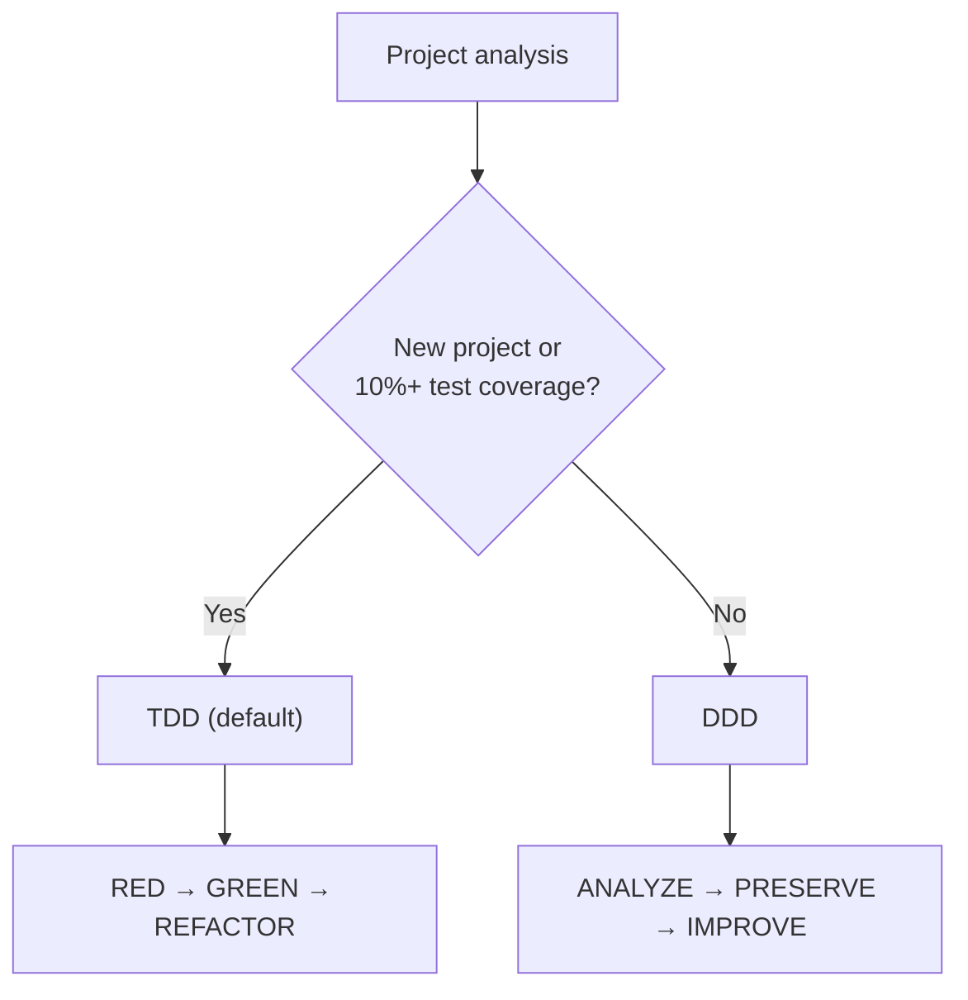

<p align="center">
  
</p>

<h1 align="center">MoAI-ADK</h1>

<p align="center">
  <strong>Claude Code를 위한 에이전틱 개발 하네스 — 비용, 자기 개선, 품질 관리 세 가지로 감싼다</strong>
</p>

<p align="center">
  <a href="./README.md">English</a> ·
  한국어 ·
  <a href="./README.ja.md">日本語</a> ·
  <a href="./README.zh.md">中文</a>
</p>

<p align="center">
  <a href="https://book.mo.ai.kr" target="_blank"><strong>공식 도서: 클로드 코드로 시작하는 실전 에이전틱 코딩</strong></a><br>
  MoAI-ADK 저자가 쓴 실전 하네스 엔지니어링 가이드 — <a href="https://book.mo.ai.kr" target="_blank">book.mo.ai.kr</a>
</p>

<p align="center">
  <a href="https://github.com/modu-ai/moai-adk/actions/workflows/ci.yml"></a>
  <a href="https://github.com/modu-ai/moai-adk/actions/workflows/codeql.yml"></a>
  <a href="https://codecov.io/gh/modu-ai/moai-adk"></a>
  <br>
  <a href="https://go.dev/"></a>
  <a href="https://github.com/modu-ai/moai-adk/releases"></a>
  <a href="./LICENSE"></a>
</p>

<p align="center">
  <a href="https://adk.mo.ai.kr"><strong>공식 문서</strong></a> ·
  <a href="https://adk.mo.ai.kr/book">도서: 클로드 코드로 시작하는 실전 에이전틱 코딩</a> ·
  <a href="https://discord.gg/Z7E7Mdc5aN">Discord</a>
</p>

---

> **"모델은 토큰 단위로 움직이는 확률적 작업자다. 매 턴마다 자기가 돈을 얼마나 쓰는지, 결과물의 품질이 기준에 닿는지, 지난 세션이 어디서 끊겼는지 기억하지 못한다. 하네스는 이 세 가지를 바깥에서 강제한다."**

---

## MoAI-ADK: 세 가지 핵심을 갖춘 에이전틱 하네스

MoAI-ADK(Agentic Development Kit)는 Claude Code가 코드를 만들게 하고, 그 코드를 예측 가능한 비용으로 믿을 수 있게 만들며, 갈수록 나아지는 궤도에 올려놓는다. 하네스는 모델을 바깥에서 감싸는 시스템이다. 모델은 토큰 단위로 움직이는 확률적 작업자라 예산도 품질 기준도, 지난 세션이 어디서 끊겼는지도 매 턴 기억하지 못한다. 비용 상한, 통과하는 테스트 스위트, 쌓이는 학습 루프, `/clear`를 넘나드는 연속성. 이런 속성은 턴마다 프롬프트로 다시 심을 수 있는 게 아니라 시스템이 바깥에서 강제해야 한다.

그 속성은 셋이다. MoAI-ADK는 어느 하나가 아니라 이 셋 모두로 Claude Code를 감싼다.

- **🪙 비용** — 토크노믹스: 같은 품질을 더 적은 토큰으로, 같은 토큰으로 더 높은 품질을.
- **🧠 자기 개선** — 에이전틱 루프 엔지니어링: 하네스가 돌수록 나아지고, 관찰을 규칙으로 바꾼다.
- **🛡️ 품질 관리** — 에이전틱 하네스: SPEC 라이프사이클, TRUST 5 게이트, 그리고 재작업(가장 큰 토큰 낭비)을 막는 격리.

Claude Code를 대체하지는 않는다. 모델 라우팅, 품질 게이트, 비용 제어, 학습 루프, 세션 연속성처럼 Claude Code가 사용자 몫으로 남겨둔 부분을 구조로 감쌀 뿐이다. Go로 짠 단일 바이너리라 macOS·Linux·Windows에서 별도 의존성 없이 바로 돈다.

<p align="center">
  
</p>

---

## 왜 이 세 가지인가

비용만 붙들고 최적화하면 함정에 빠진다. 단가를 밀어붙이는 동안 품질은 소리 없이 무너지고, 곧바로 재작업과 디버깅 루프가 따라붙는다. 그런데 재작업이야말로 모든 토큰 지출 중 가장 비싸다. 학습 루프 없이 품질 게이트만 세우면 세션마다 같은 실수를 되풀이한다. 비용 상한 없이 자율 루프를 돌리면 과제 하나가 튀어 쿼터를 갉아먹는다. 셋은 서로 맞물려 돌아간다: **품질이 재작업을 막아 주니 비용이 감당할 만한 수준에 머물고, 루프가 통한 패턴을 기억해 두니 품질을 강제할 수 있으며, 비용 게이트가 초과 전에 멈춰 주니 루프가 알맞은 가격에 머문다.**

MoAI-ADK의 설계 결정은 하나같이 이 셋 가운데 하나를 강화한다. 어떤 모델을 쓸지, 얼마나 깊이 추론할지, 컨텍스트를 어떻게 쓸지는 턴마다 운에 맡기지 않는다. 시스템이 정하고, 그 결정을 남겨 다음 실행이 더 똑똑해지게 한다.

<p align="center">
  
</p>

---

## 🪙 비용 — 토크노믹스

토큰 단가는 계속 내려가는데, 정작 에이전트 워크플로우의 실제 지출은 오른다. 에이전트는 한 과제를 풀려고 수십에서 수백 스텝을 돌고, 그만큼 토큰을 태운다. 종량제에서는 이게 곧 청구서이고, 구독제에서는 전 모델이 공유하는 주간 쿼터를 갉아먹는다.

### 비용은 단가가 아니라 배정이 결정한다

DeepSWE 리더보드(113과제, effort 단계별 뷰) 실측을 보면 이 문제가 그대로 드러난다. 같은 Claude 계열 안에서도 과제당 비용은 토큰 단가가 아니라 모델이 얼마나 효율적으로 *완주*하느냐를 따라간다.

| 모델 [effort] | Pass@1 | 과제당 비용 | 출력 토큰 | 스텝 |
|---|---|---|---|---|
| claude-opus-5 [low] | 58% | **$1.66** | 20k | 36 |
| claude-opus-5 [medium] | 69% | $3.29 | 37k | 52 |
| claude-opus-5 [high] | 73% | $6.08 | 64k | 73 |
| claude-opus-5 [max] | 74% | $11.84 | 118k | 99 |
| claude-sonnet-5 [max] | 54% | **$26.40** | 214k | 268 |

Opus 5는 **가장 낮은** effort에서도 Sonnet 5의 **가장 높은** effort보다 점수가 높으면서(58% vs 54%) 과제당 비용은 16분의 1이다($1.66 vs $26.40) — Sonnet의 토큰당 단가가 더 싼데도 그렇다. 원인은 36스텝과 268스텝의 차이다. 청구서를 불리는 쪽은 토큰 단가가 아니라 재시도 루프다. "약한 모델을 세게 굴리면 싸다"는 통념은 성립하지 않는다. 비용은 단가가 아니라 **작업에 맞는 모델·추론 깊이 배정**이 결정한다.

#### 네 단계: 측정 → 라우팅 → 다이어트 → 방어

<p align="center">
  
</p>

### 라우팅 — 작업마다 맞는 모델과 추론 깊이

<p align="center">
  
</p>

**라우팅 — 작업마다 알맞은 모델과 추론 깊이 배정.** 작업 단계(plan / run / sync)와 SPEC 크기(Tier S / M / L)에 따라 모델과 추론 effort(low / medium / high / max)를 선언적으로 배정한다. 깊은 추론이 필요한 계획 단계에는 추론이 센 모델을 붙이고, 기계적 반복이 많은 구현 단계에는 가벼운 모델을 붙인다.

- **No-Haiku 3-티어 정책** — Haiku는 라우팅 세트에서 뺀다. 단발·입력 지배 작업은 Sonnet low effort가 맡고, 멀티턴 에이전틱 작업은 전부 Opus가 맡는다.
- **프로파일 매트릭스** — 11 에이전트 × 3 프로파일 = 33셀. `moai model profile`이 각 에이전트의 `{model, effort}` 쌍을 해석한다.
- **CG 모드** — `moai cg`는 Claude 리더(전략·계획·감사)와 GLM 워커(대량 구현)를 결합한다. 구현 중심 작업에서 **60-70% 비용 절감**.

<p align="center">
  
</p>

### DeepSWE 벤치마크 — 가성비 최적점은 어디인가

| 모델 [effort] | 점수 | 과제당 비용 | 비고 |
|---|---|---|---|
| opus-5 [low] | 58%±2 | $1.66 | |
| opus-5 [medium] | **69%±1** | **$3.29** | **가성비 최적점** |
| opus-5 [high] | 73%±2 | $6.08 | 점수 +4pt, 비용 1.8배 |
| opus-5 [xhigh] | 73%±3 | $9.07 | **순손실** — high와 동점, 비용만 +49% |
| opus-5 [max] | 74%±4 | $11.84 | |
| glm-5.2 [max] | 44%±2 | $3.92 | API 종량제 열세 · z.ai 정액제에서 가치 |
| sonnet-5 [max] | 54%±4 | $26.40 | opus-5 [low]에 파레토 지배당함 |


> 출처: [DeepSWE v1.1 리더보드](https://deepswe.datacurve.ai) (datacurve.ai, 113과제, 2026-07-25)

### 검증 비용과 예산 관리 — 컨텍스트는 가볍게, 초과 전에 멈추기

**검증 비용을 줄이는 방식 — 컨텍스트는 가볍게, 증거는 디스크로.** 검증 명령의 긴 출력은 디스크 파일로 흘려보내고, 컨텍스트에는 exit code와 bounded tail(최대 50줄)만 남긴다. 프롬프트 캐시를 재사용하고(적중 시 비용 0.1×), 컨텍스트가 임계(1M 50% / 200K 90%)에 닿으면 `/clear`를 자동으로 권고한다. 그렇게 컨텍스트 윈도우를 계속 가볍게 유지한다.

**예산 방어 — 초과 전에 중단하고 다음 세션으로 이어.** 토큰 회로 차단기(Token Circuit Breaker)가 hard-limit(기본 90%)에 닿으면 작업을 멈추고, 진행 상태를 `progress.md`에 저장한 뒤, 그대로 붙여넣어 쓸 resume 메시지를 내놓는다. 스테이터스라인은 컨텍스트 사용률·캐시 적중률·rate limit 소진율을 늘 띄워 둔다.

---

## 🧠 자기 개선 — 에이전틱 루프 엔지니어링

지난 세션의 실수를 반복하지 않는 세션이 가장 싸다. 자기 개선은 매 실행을 다음 실행의 재료로 바꾼다. 라우팅 결정과 게이트 증거를 남기고, 되풀이되는 패턴은 규칙으로 승격하며, goal을 선언해 두면 조건이 충족될 때까지 세션이 계속 일한다.

**`/moai goal` · `/moai loop`**. 완료 조건 하나만 선언하면 충족되거나 턴 한도(기본 30)에 닿을 때까지 세션이 알아서 일한다. `--max-turns 0`을 주면 오토컴팩트 기반의 무한 goal이 도는데, `--max-duration`과 정체 가드가 실제 상한이 된다. `/moai loop`는 LSP 진단·AST-grep·린터를 병렬로 훑어, 잡힌 문제를 레벨로 묶어 큐가 빌 때까지 돈다.

**결정 메모리.** 라우팅 결정과 게이트 증거, 되풀이되는 교정 내용을 기록해 둔다. 그래서 다음 세션은 맨땅이 아니라 지난 세션이 배운 지점에서 출발한다.

**하네스 자가 진화.** 실패 패턴이 관측되면 규칙 변경 제안으로 올라온다. 몰래 적용하지 않고 승인을 받아 반영한다.

---

## 🛡️ 품질 관리 — 에이전틱 하네스

재작업이 가장 큰 토큰 낭비다. 배포됐다가 되돌아온 버그 하나가 라우팅 최적화를 죄다 합친 것보다 비싸다. 품질 관리는 "끝"을 *검증된 끝*으로 만들고, 병렬 에이전트끼리 서로 밟지 않도록 작업을 갈라 놓는다.

### SPEC 3단계 라이프사이클

plan → run → sync. Tier S/M/L 크기 분류가 검증 깊이와 PR 라우팅을 정하고, GEARS 형식 요구사항과 인수 기준이 완료 여부를 증거로 판정한다.

<p align="center">
  
</p>

**TRUST 5 품질 게이트**. Tested(85%+ 커버리지) · Readable · Unified · Secured · Trackable, 모든 변경에 적용한다. 판정은 에이전트가 아니라 게이트가 내린다.

**11-에이전트 카탈로그**. MoAI 커스텀 10개 + 내장 Explore. 계획과 감사를 설계 단계부터 분리해, 작성한 쪽이 자기 작업에 점수를 매기지 않는다.

### 확장 지점 — 검증된 패턴을 프로젝트 맞춤으로 복제

**Harness v4 Builder**. 자연어 요청 → 도메인·목표·제약 추출 → 승인 게이트 → 프로젝트 전용 에이전트·스킬·커맨드·훅 스캐폴딩.

**@MX 태그**. AI 에이전트끼리 컨텍스트·불변 계약·위험 구역을 주고받는 인라인 코드 어노테이션이다.

**worktree 격리**. SPEC마다 독립된 작업 트리를 둔다. `moai cc -w <이름>`으로 진입하고, `--spawn`을 붙이면 현재 세션을 유지한 채 새 창에서 연다.

---

## 인프라는 셋 모두를 지탱한다

별도 의존성 없이 macOS·Linux·Windows에서 도는 Go 단일 바이너리는 토크노믹스만이 아니라 셋 모두의 밑바탕이다. 훅 시스템이 게이트를 기계적으로 강제하고, 스테이터스라인이 비용과 컨텍스트를 실시간으로 보여주며, SPEC 라이프사이클이 `/clear`를 넘어 작업을 이어 준다. 셋 모두 같은 바이너리 위에서 돌아간다. 어느 것도 나중에 덧붙인 게 아니다.

---

## 빠른 시작

### 설치

#### macOS / Linux / WSL

```bash
curl -fsSL https://raw.githubusercontent.com/modu-ai/moai-adk/main/install.sh | bash
```

#### Windows (PowerShell 7.x+)

```powershell
irm https://raw.githubusercontent.com/modu-ai/moai-adk/main/install.ps1 | iex
```

#### 소스에서 빌드 (Go 1.26+)

```bash
git clone https://github.com/modu-ai/moai-adk.git
cd moai-adk && make build
```

### 프로젝트 초기화

```bash
moai init my-project
```

대화형 마법사가 언어·프레임워크·방법론을 자동 감지하고, 모델 정책을 고른 뒤 Claude Code 통합 파일까지 만든다.

새로 기능: `moai init --autonomy-tier=<semi-auto|automatic|fully-autonomous>` 플래그(또는 마법사 페이지 / `moai web` 콘솔 토글)로 자율성 등급을 고를 수 있다. 기본값 `semi-auto`는 동작 변화가 없고, `automatic`은 일상 작업용으로 `defaultMode: auto`를 적용하며, `fully-autonomous`(`bypassPermissions`)는 옵트인 전용이라 샌드박스 증명(환경변수 마커 또는 `--sandbox-proof`)이 있어야 한다. 증명이 없으면 `automatic`으로 내려간다. 파괴적 동작을 막는 deny/ask 규칙은 모든 등급에서 동일하게 적용된다.

### 첫 워크플로우

```bash
claude        # 프로젝트 안에서 Claude Code 실행
```

```text
/moai plan "Add JWT login"      # SPEC 작성
/moai run SPEC-AUTH-001         # TDD/DDD 구현
/moai sync SPEC-AUTH-001        # 문서 동기화 + PR 생성
```

자연어로 던져도 된다. `/moai "fix the login bug"`처럼 쓰면 의도 분석(Analyze-First 라우팅)이 요청을 읽고 알맞은 워크플로우로 넘긴다.

### 요구사항

| 플랫폼 | 지원 환경 | 비고 |
|----------|----------------------|-------|
| macOS | Terminal, iTerm2 | 완전 지원 |
| Linux | Bash, Zsh | 완전 지원 |
| Windows | **WSL (권장)**, PowerShell 7.x+ | 네이티브 cmd.exe 미지원 |

**사전 요구사항**

- 모든 플랫폼에 **Git** 설치 필수
- **Claude Code** — MoAI-ADK는 Claude Code를 위한 하네스다
- **권장**: `gh` CLI(PR 자동화) · `tmux`(CG 모드) · 사용 언어의 린트/테스트 툴체인(예: `golangci-lint`)

---

## 레퍼런스

### /moai 슬래시 서브커맨드 (15개)

| 서브커맨드 | 역할 |
|------------|------|
| `plan` / `run` / `sync` | SPEC 3-페이즈 파이프라인 |
| `project` / `harness` / `design` | 프로젝트 문서+하네스 생성 · 하네스 라이프사이클 · Design-phase 협업 |
| `goal` / `loop` / `fix` | 선언적 goal 루프 · 반복 수리 · 단일 패스 수리 |
| `review` / `gate` / `clean` | 코드 리뷰 (`--deep`으로 다중 에이전트 적대적 취약점 스캔) · 사전 커밋 품질 게이트 · 데드 코드 제거 |
| `mx` / `codemaps` / `feedback` | @MX 어노테이션 · 아키텍처 문서 · GitHub 이슈 보고 |
| `e2e` | 멀티플랫폼 E2E 테스트 (웹/모바일/데스크톱, CLI 우선) |
| *(자연어)* | 자율 plan → run → sync 파이프라인으로 넘기는 Analyze-First 라우팅 |

> → 자세히: [워크플로우 커맨드](https://adk.mo.ai.kr/ko/workflow-commands) · [유틸리티 커맨드](https://adk.mo.ai.kr/ko/utility-commands)

### CLI 커맨드 (자주 쓰는 13개)

| 커맨드 | 설명 |
|---------|-------------|
| `moai init` | 대화형 프로젝트 설정 (언어/프레임워크/방법론 자동 감지) |
| `moai doctor` | 시스템 상태 진단과 환경 검증 |
| `moai status` | 프로젝트 상태 요약 (Git 브랜치, 품질 지표) |
| `moai update` | 최신 버전으로 업데이트 (자동 롤백 지원) |
| `moai cc` / `moai glm` / `moai cg` | Claude 전용 / GLM 전용 / 하이브리드 Claude 리더 + GLM 워커 세션 |
| `moai worktree <sync\|done\|remove\|clean\|recover\|snapshot\|verify\|restore>` | Git worktree 유지 관리 (진입은 런처가 담당) |
| `moai session <list\|register\|current>` | 멀티 세션 조율 |
| `moai spec <audit\|archive\|lint\|list\|new>` | SPEC 라이프사이클 도구 |
| `moai goal <arm\|status\|clear>` | Goal 엔진 CLI |
| `moai harness <status\|apply\|rollback\|disable>` | 하네스 학습 라이프사이클 |
| `moai handoff <save\|list>` | 세션 핸드오프 기록 |
| `moai preference <list\|decay-scan\|toggle>` | 결정 메모리 관리 |
| `moai web` | Web Console — 6탭 설정 콘솔 |

> 전체 36개 커맨드: [CLI 레퍼런스](https://adk.mo.ai.kr/ko/cli-reference)

### 11-에이전트 카탈로그

| 분류 | 에이전트 | 비용 | 역할 |
|----------|-------|------|------|
| **Manager** | manager-spec | 🔴 | Plan-phase SPEC 작성 |
| | manager-develop | 🔴 | Run-phase TDD/DDD/autofix 구현 |
| | manager-docs | 🔵 | Sync-phase 문서화 |
| | manager-git | 🩵 | PR 생성 및 라우팅 |
| | manager-design | 🟠 | Design-phase 협업 (Claude Design) |
| **Evaluator** | plan-auditor | 🔴 | 독립 계획 감사 (편향 방지) |
| | sync-auditor | 🔴 | 4-차원 품질 채점 (Functionality 40 · Security 25 · Craft 20 · Consistency 15) |
| **Builder** | builder-harness | 🟠 | 프로젝트 전용 에이전트·스킬·커맨드·훅 스캐폴딩 |
| **Advisor** | super-advisor | 🔵 | 온디맨드 고추론 자문 (E1-E4 에스컬레이션) |
| **Specialist** | e2e-tester | 🟠 | 웹/모바일/데스크톱 E2E 테스트 실행 (CLI 우선) |
| **Built-in** | Explore | ⚪ | 읽기 전용 코드베이스 탐색 |

비용 색은 기본 `medium` 프로파일의 model×effort 셀 기준(`moai model profile`로 확인): 🔴 opus+high · 🟠 opus+medium · 🔵 opus+low · 🩵 sonnet+low · ⚪ 세션 모델 상속(사용자 추가 에이전트). 프로파일을 `high`/`low`로 바꾸면 배정도 달라진다. 오래 걸리는 위임은 진행 상태가 Task 채널에 쌓이고, 오케스트레이터가 아이콘 Progress Board로 중계한다.

### TRUST 5 품질 게이트

| 기준 | 의미 | 검증 |
|-----------|---------|------------|
| **T**ested | 테스트됨 | 85%+ 커버리지, 특성화 테스트, 단위 테스트 통과 |
| **R**eadable | 읽기 쉬움 | 명확한 네이밍, 일관된 스타일, 린트 오류 0 |
| **U**nified | 통일됨 | 일관된 포매팅, import 순서, 프로젝트 구조 준수 |
| **S**ecured | 보안됨 | OWASP 준수, 입력 검증, 보안 경고 0 |
| **T**rackable | 추적 가능 | Conventional commits, 이슈 참조, 구조화된 로깅 |

### 방법론 선택 (TDD vs DDD)


```mermaid
flowchart TD
    A["Project analysis"] --> B{"New project or<br/>10%+ test coverage?"}
    B -->|"Yes"| C["TDD (default)"]
    B -->|"No"| D["DDD"]
    C --> F["RED → GREEN → REFACTOR"]
    D --> G["ANALYZE → PRESERVE → IMPROVE"]
```

| 방법론 | 사이클 | 대상 |
|-------------|-------|-----|
| **TDD** (기본) | RED → GREEN → REFACTOR | 신규 프로젝트와 기능 작업 |
| **DDD** | ANALYZE → PRESERVE → IMPROVE | 커버리지 10% 미만의 기존 코드 |

---

## 스테이터스라인 읽는 법

```
🤖 Opus │ 🧠 xhigh·t │ ♻️ 87% │ 🔅 v2.1.212 │ 🗿 v3.0.1 │ ⏳ 2h 34m │ 💬 MoAI
🪫 CW: ████████░░ 88% (⚠️/clear) │ 🔋 5H: ████░░░░░░ 45% (4h 30m) │ 🪫 7D: ████████░░ 82% (Jan 21)
📁 moai-adk-go │ 🔀 modu-ai/moai-adk | 🅱️ feat/statusline ↑2 +3 │ 💾 +1 M2 ?0 │ 📋 [run SPEC-AUTH-001-run] │ 💌 PR #1042 (⌥approved)
```

| 요소 | 의미 |
|------|------|
| 🤖 모델 | 현재 활성 모델 |
| 🧠 effort | 추론 노력 레벨 — 확장 사고가 켜지면 `·t` 접미 |
| ♻️ 캐시 적중률 | 프롬프트 캐시 적중률 |
| CW: 컨텍스트 | 컨텍스트 윈도우 사용률 + 2단계 `/clear` 마커 (⚠️ 소프트, 🛑 하드) |
| 5H / 7D | 요금제 사용률 + 리셋 시간 |
| 📁 디렉터리 | 프로젝트 디렉터리 이름 |
| 🔀 리포 | GitHub 리포 identity `owner/name` |
| 🅱️ 브랜치 | 현재 브랜치 + `↑`ahead `↓`behind + `+`더티 카운트 |
| 💾 git 상태 | staged / modified / untracked 카운트 |
| 📋 태스크 | 활성 SPEC 워크플로우 `[커맨드 SPEC-ID-단계]` |
| 💌 PR | 활성 GitHub PR 번호 + 리뷰 상태 (`⌥state`) |

> 자세히: [스테이터스라인 가이드](https://adk.mo.ai.kr/ko/advanced/statusline)

---

## Claude × GLM 멀티 LLM

MoAI-ADK는 Claude Code의 대체 백엔드로 **z.ai GLM**을 지원한다. 전환은 환경변수만 바꾸면 되고 코드는 그대로다. 하네스와 SPEC 워크플로우, 품질 게이트는 어느 백엔드에서든 똑같이 돈다.

| 항목 | 내용 |
|---|---|
| GLM Coding Plan | 월 **$10**부터 ([가입](https://z.ai/subscribe?ic=1NDV03BGWU)) |
| 호환성 | Claude Code에 그대로 붙는다 — 코드 수정 없음 |
| 모델 | glm-5.2, glm-4.7, glm-4.5-air, 그리고 무료 모델 |

### 세 가지 실행 모드

| 커맨드 | 리더 | 워커 | tmux | 비용 절감 | 쓰는 상황 |
|---|---|---|---|---|---|
| `moai cc` | Claude | Claude | 필요 없음 | — | 최고 품질, 복잡한 작업 |
| `moai glm` | GLM | GLM | 권장 | 약 70% | 비용 최적화 |
| `moai cg` | Claude | GLM | **필수** | 약 60% | 품질과 비용의 균형 |

**CG 모드**가 하이브리드다. Claude 리더가 전략·계획·감사를 맡고 GLM 워커가 대량 구현을 담당하며, tmux 세션 단위 환경 격리로 둘을 잇는다.

```bash
moai glm sk-your-glm-api-key   # save the key once
moai cg                        # enter CG mode (Claude leader + GLM workers)
```

### 기본 모델 매핑

Claude 티어는 `ANTHROPIC_DEFAULT_*_MODEL` 환경변수로 GLM 모델에 매핑한다.

| Claude 티어 | GLM 모델 | 컨텍스트 |
|---|---|---|
| Opus | glm-5.2 | 1M |
| Sonnet | glm-4.7 | 202K |
| Haiku | glm-4.5-air | 128K |
| Fable | glm-5.2 | 1M |

> 무료 모델도 쓸 수 있다(GLM-4.7-Flash, GLM-4.5-Flash). 전체 표는 [z.ai 요금 안내](https://docs.z.ai/guides/overview/pricing)를 참조한다.
>
> → 자세히: [Multi-LLM 가이드](https://adk.mo.ai.kr/ko/multi-llm)

---

## FAQ

### Q: 왜 모든 함수에 @MX 태그가 없나요?

정상이다. 태그는 팬인이 높거나 복잡하거나 위험한 코드만 골라 표시한다. 코드 대부분은 어떤 태그 기준에도 안 걸리고, 태그가 없는 파일은 결함이 아니다.

### Q: 스테이터스라인의 버전 표시는 무슨 뜻인가요?

```
🗿 v3.0.1 ⬆️ v3.0.2
```

앞의 값은 지금 설치된 MoAI-ADK 버전이고, 화살표는 받을 수 있는 업데이트가 있다는 표시다. `moai update`를 실행하면 사라진다.

### Q: GLM 없이 Claude만으로 쓸 수 있나요?

그렇다. `moai cc`가 Claude 전용 세션이다. CG 모드(`moai cg`, Claude 리더 + GLM 워커)와 GLM 전용(`moai glm`)은 비용 절감을 위한 선택지일 뿐, 하네스·SPEC 워크플로우·품질 게이트는 세 모드 모두에서 동일하게 돈다.

### Q: 기존 프로젝트에도 적용되나요?

그렇다. `moai init`이 프로젝트 상태를 감지해 방법론을 정한다 — 커버리지 10% 미만의 기존 코드에는 DDD(특성화 테스트로 동작을 고정한 뒤 점진 개선), 신규/충분히 테스트된 코드에는 TDD가 붙는다.

### Q: `moai mx query` 출력에서 `"rotRisk": "no-trigger"`는 무슨 뜻인가요?

짝이 되는 `@MX:UPGRADE` 보조 줄이 없는 `@MX:DEBT` 태그를 표시한다 — 끝 조건이 없는 작업 단순화라서 조용히 부패한다. 부패 게이트는 `@MX:UPGRADE`의 부재다. `@MX:CEILING`의 부재는 품질 메모일 뿐 부패 게이트가 아니다. `@MX:UPGRADE`를 동반한 `@MX:DEBT`는 빈 `rotRisk`를 보고한다.

### Q: 스캐너가 `"lsp"` 대신 `fan_in_method: "textual"`을 보고하는 이유는?

스캐너는 언어 서버의 `textDocument/references`를 우선하지만, 비엄격 모드(기본값)에서는 LSP를 쓸 수 없을 때 조용히 텍스트 grep으로 폴백한다. 결과의 `fan_in_method` 필드가 어느 엔진이 카운트를 만들었는지 드러낸다. `MOAI_MX_QUERY_STRICT=1`을 설정하면 폴백 대신 `LSPRequiredError`를 올린다 — 우아한 저하보다 정확도가 중요한 CI에서 쓸모 있다.

### Q: 내 언어의 복잡도 메트릭이 없는 이유는?

복잡도는 CGO가 필요한 tree-sitter로 잰다. non-CGO 빌드는 모든 언어에 `Supported: false`를 반환하는 단단한 스텁이다 — 폴백 휴리스틱은 없다. CGO 빌드에서도 스캐폴드된 언어, 1 MiB를 넘는 파일, 파싱 에러, 쿼리 컴파일 에러는 `Supported: false`를 낸다. 이 값은 조용한 건너뜀이지 에러가 아니다.

### Q: MoAI는 언제 MX 스캔을 자동으로 돌리나요?

다섯 지점이다: 명시적 `moai mx scan` CLI; SessionStart의 지연 콜드스타트 스캔(타임박스, 페일오픈); PostToolUse 검증(사이드카 인덱스를 읽되 다시 짓지 않음); SessionEnd 배치 검증; 그리고 `/moai sync` 게이트(P1/P2 발견이 막고, `--skip-mx`로 빠져나간다). 참고로 `mxIndexScanTimeoutDefault`(콜드스타트 스캔 상한)과 `DefaultSessionStartDriftTimeout`(드리프트 스캔 상한)은 서로 다른 두 개의 2초 상수다 — 값이 같은 건 우연이지, 같은 게이트가 아니다.

---

## 커뮤니티와 문서

### 기여하기

기여는 언제든 환영한다. 자세한 절차는 [CONTRIBUTING.md](CONTRIBUTING.md)에 정리해 두었다.

1. 리포지토리 포크
2. 기능 브랜치 생성: `git checkout -b feature/my-feature`
3. 테스트 작성 (신규 코드는 TDD, 기존 코드는 특성화 테스트)
4. 테스트·린트·포맷 통과 확인: `make test` · `make lint` · `make fmt`
5. Conventional commit 메시지로 커밋하고 풀 리퀘스트 열기

**코드 품질 요구사항**: 85%+ 커버리지 · 린트 오류 0 · 타입 오류 0 · Conventional commits

### 커뮤니티

- [Discord](https://discord.gg/Z7E7Mdc5aN) — 실시간 토론과 팁
- [Issues](https://github.com/modu-ai/moai-adk/issues) — 버그 리포트, 기능 요청 (Claude Code 안에서는 `/moai feedback`)

### 라이선스

[Apache License 2.0](./LICENSE) — 자세한 내용은 LICENSE 파일을 참조한다.

### 문서 가이드

[adk.mo.ai.kr](https://adk.mo.ai.kr) 온라인 문서는 12개 섹션으로 나뉘어 있다.

| 섹션 | 설명 |
|------|------|
| [시작하기](https://adk.mo.ai.kr/ko/getting-started) | 소개, 설치, Windows 가이드, init 마법사, 퀵스타트, CLI 개요, FAQ |
| [핵심 개념](https://adk.mo.ai.kr/ko/core-concepts) | MoAI-ADK 정체성, 컨스티튜션, 하네스 엔지니어링, SPEC 기반 개발, DDD, TRUST 5 |
| [워크플로우 커맨드](https://adk.mo.ai.kr/ko/workflow-commands) | `plan` · `run` · `sync` — SPEC 파이프라인의 주축 |
| [유틸리티 커맨드](https://adk.mo.ai.kr/ko/utility-commands) | `fix` · `loop` · `gate` · `review` · `clean` · `codemaps` · `e2e` · `feedback` · `goal` |
| [CLI 레퍼런스](https://adk.mo.ai.kr/ko/cli-reference) | 터미널 `moai` 바이너리의 모든 커맨드 — `status`, `profile`, `doctor`, `update`, `web`, `goal`, `handoff`, `harness`, `init`, `worktree` 등 |
| [Claude Code 가이드](https://adk.mo.ai.kr/ko/claude-code) | Claude Code 통합 — 기초, 컨텍스트·메모리, 에이전틱, 확장성 (스킬·훅·플러그인) |
| [Multi-LLM](https://adk.mo.ai.kr/ko/multi-llm) | CG 모드와 모델 정책 |
| [비용 최적화](https://adk.mo.ai.kr/ko/cost-optimization) | 프롬프트 캐싱 전략과 토큰 비용 절감 |
| [가이드](https://adk.mo.ai.kr/ko/guides) | CI 자율화, multi-LLM CI 등 실전 운영 레시피 |
| [Git Worktree](https://adk.mo.ai.kr/ko/worktree) | 병렬 SPEC 개발을 위한 worktree 가이드, 예시, FAQ |
| [Advanced](https://adk.mo.ai.kr/ko/advanced) | 토크노믹스 개요, 토큰 예산, 스테이터스라인, settings.json, 훅, @MX 태그, 스킬 가이드, Harness v4 Builder, 자가 진화, 결정 메모리, 카탈로그 시스템, 보안 노트, CLAUDE.md/에이전트 가이드 |
| [기여하기](https://adk.mo.ai.kr/ko/contributing) | 오픈소스 기여 가이드 |

### 링크

- [공식 문서](https://adk.mo.ai.kr)
- [도서: 클로드 코드로 시작하는 실전 에이전틱 코딩](https://adk.mo.ai.kr/book)
- [CHANGELOG](./CHANGELOG.md)
- [Claude Code](https://code.claude.com/docs/en)
- [Discord 커뮤니티](https://discord.gg/Z7E7Mdc5aN)

---

## 스타 히스토리

<a href="https://www.star-history.com/?type=date&repos=modu-ai%2Fmoai-adk">
 <picture>
   <source media="(prefers-color-scheme: dark)" srcset="https://api.star-history.com/chart?repos=modu-ai/moai-adk&type=date&theme=dark&legend=top-left&sealed_token=9wFuBO5GMKxHZsaknxlIW3oypXLJlyW1qqq8T--aTRyfp6j9EK9KTR2vJvyAG8AKSs3Lindw7LUt-m-I6ysz9BoV6kdtrKlJYTViQAYR56A_3ie4ZVOqIw" />
   <source media="(prefers-color-scheme: light)" srcset="https://api.star-history.com/chart?repos=modu-ai/moai-adk&type=date&legend=top-left&sealed_token=9wFuBO5GMKxHZsaknxlIW3oypXLJlyW1qqq8T--aTRyfp6j9EK9KTR2vJvyAG8AKSs3Lindw7LUt-m-I6ysz9BoV6kdtrKlJYTViQAYR56A_3ie4ZVOqIw" />
   
 </picture>
</a>

<p align="center">
  <sub>MoAI-ADK 팀이 만들었습니다 · <a href="https://adk.mo.ai.kr">adk.mo.ai.kr</a></sub>
</p>
