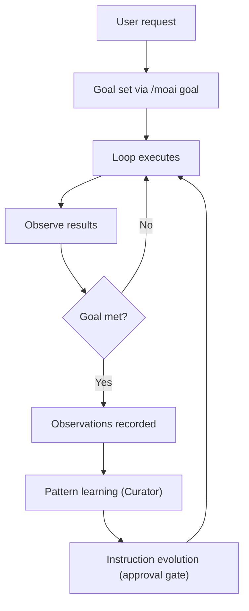
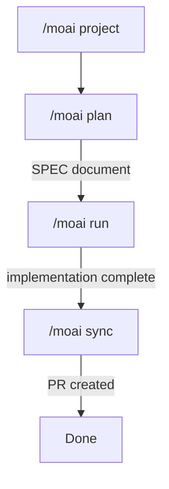
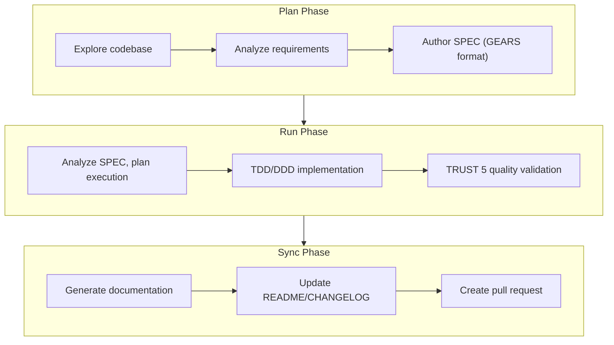
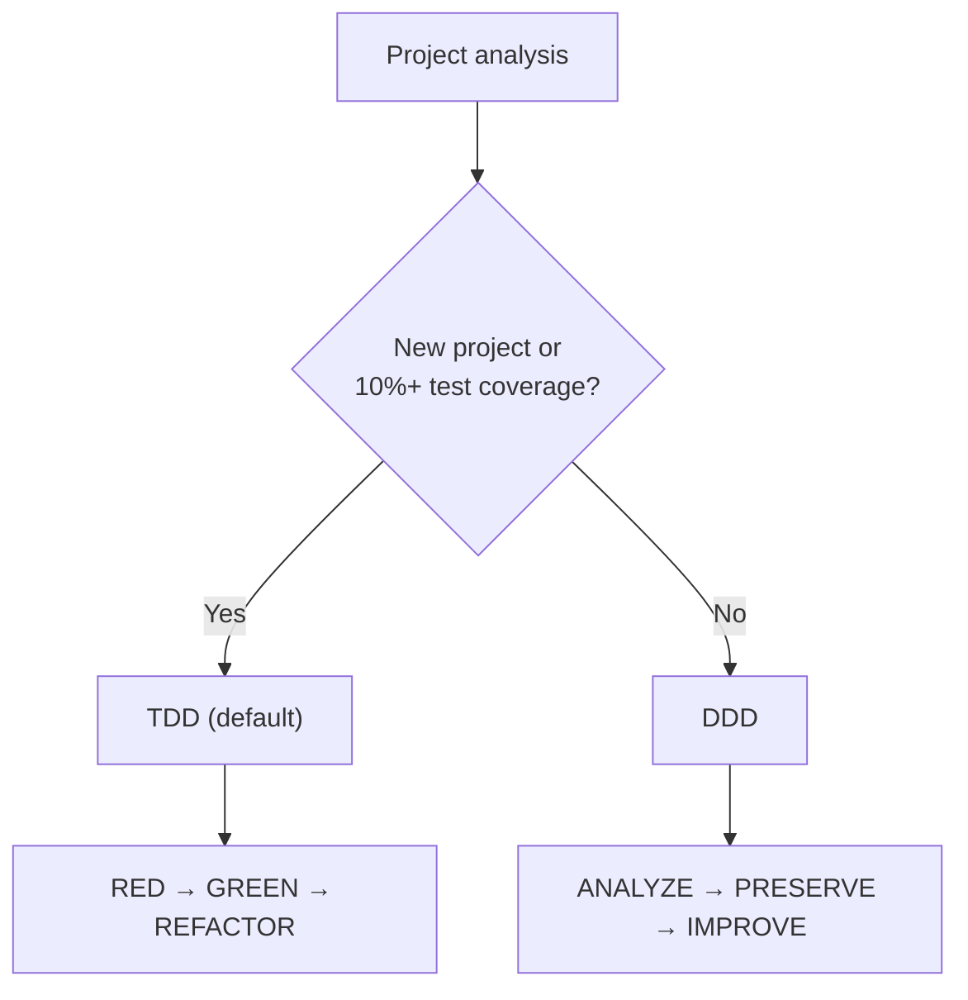
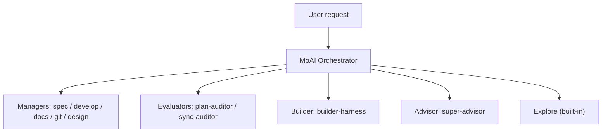

<p align="center">
  
</p>

<h1 align="center">MoAI-ADK</h1>

<p align="center">
  <strong>토크노믹스를 위해 설계된 에이전틱 개발 키트</strong>
</p>

<p align="center">
  <a href="./README.md">English</a> ·
  한국어 ·
  <a href="./README.ja.md">日本語</a> ·
  <a href="./README.zh.md">中文</a>
</p>

<p align="center">
  <a href="https://book.mo.ai.kr" target="_blank"><strong>공식 도서 『클로드 코드로 시작하는 실전 에이전틱 코딩』</strong></a><br>
  MoAI-ADK 제작자가 직접 쓴 하네스 엔지니어링 실전 가이드 — <a href="https://book.mo.ai.kr" target="_blank">book.mo.ai.kr</a>
</p>

<p align="center">
  <a href="https://github.com/modu-ai/moai-adk/actions/workflows/ci.yml"></a>
  <a href="https://github.com/modu-ai/moai-adk/actions/workflows/codeql.yml"></a>
  <a href="https://codecov.io/gh/modu-ai/moai-adk"></a>
  <br>
  <a href="https://go.dev/"></a>
  <a href="https://github.com/modu-ai/moai-adk/releases"></a>
  <a href="./LICENSE"></a>
</p>

<p align="center">
  <a href="https://adk.mo.ai.kr"><strong>공식 문서</strong></a> ·
  <a href="https://adk.mo.ai.kr/book">도서: Claude Code 실전 에이전틱 코딩</a> ·
  <a href="https://discord.gg/Z7E7Mdc5aN">Discord</a>
</p>

---

> **"바이브코딩의 목적은 빠른 생산성이 아니라 코드 품질이다."**

---

## MoAI-ADK란

MoAI-ADK(Agentic Development Kit)는 Claude Code **위에** 얹히는 하네스다. 하네스는 모델을 바깥에서 감싸는 시스템이다. 모델은 토큰 단위로 움직이는 확률적 작업자라 예산도 품질 기준도 지난 세션이 어디서 끊겼는지도 기억하지 못한다. 비용 상한, 통과하는 테스트 스위트, `/clear`를 건너뛰는 연속성 — 이런 속성은 매 턴 프롬프트로 다시 심을 수 있는 게 아니라 시스템이 바깥에서 강제해야 한다. 그 시스템이 하네스다.

모든 설계는 토크노믹스(Token Economics)를 향한다 — 같은 품질을 더 적은 토큰으로, 같은 토큰이면 더 높은 품질로. 어떤 모델을 쓸지, 얼마나 깊이 추론할지, 컨텍스트를 어떻게 소비할지는 그때그때 운에 맡기지 않고 시스템이 정한다.

Claude Code를 대체하지 않는다. Claude Code가 사용자에게 맡겨둔 부분 — 모델 라우팅, 품질 게이트, 비용 제어, 세션 연속성 — 을 구조로 감쌀 뿐이다. Go로 짠 단일 바이너리라 macOS·Linux·Windows에서 별도 의존성 없이 바로 돈다.

---

## 2.0에서 3.0으로

v3를 써야 하는 이유는 기능이 늘어서가 아니다. 비용과 학습이라는 두 축을 시스템이 떠안았기 때문이다. v2가 개별 레버(캐시, GLM)를 손에 쥐여준 도구였다면, v3는 그 레버들을 닫힌 루프로 묶어 시스템 속성으로 만든다.

### 문제 — 토큰 단가는 내렸는데 비용은 올랐다

토큰 단가는 계속 내려가는데, 정작 에이전틱 워크로드의 실제 지출은 오른다. 에이전트는 한 과제를 풀려고 수십에서 수백 스텝을 돌고, 그만큼 토큰을 태운다. 종량제에서는 이게 곧 청구서이고, 구독제에서는 전 모델이 공유하는 주간 쿼터를 갉아먹는다. 그래서 "어떤 모델을 얼마나 깊이 굴릴 것인가"라는 토큰 규율이 경쟁축이 된다. 단가 인하는 이 문제를 풀어주지 않는다.

### 증거 — 같은 생태계 안에서도 비용은 두 배 넘게 갈린다

같은 Claude 계열, 같은 최고 effort(max)로 돌려도 과제 하나를 푸는 비용은 크게 벌어진다. DeepSWE 리더보드(113 tasks) 실측을 정리한 내부 보고서의 숫자다.

| 모델 [max] | Pass@1 | 과제당 비용 | $/해결과제 | 토큰/해결과제 | 스텝 |
|---|---|---|---|---|---|
| claude-opus-4.8 | 59% | $13.22 | **$22.4** | 229k | 120 |
| claude-fable-5 | 70% | $21.63 | $30.9 | 170k | 88 |
| claude-sonnet-5 | 54% | $26.40 | $48.9 | 396k | 268 |

핵심은 sonnet-5 max가 opus-4.8 max보다 **비싸면서(과제당 $26.40 vs $13.22) 점수는 낮다(54% vs 59%)**는 것이다. 원인은 268스텝·214k 출력토큰 — 최고 effort에서 재시도 루프가 폭주한다. "약한 모델을 세게 굴리면 싸다"는 통념은 성립하지 않는다. 오히려 스텝을 세 배 돌며 쿼터를 더 태운다. 곧, 비용은 모델 단가가 아니라 **작업에 맞는 모델·추론 깊이 배정**이 결정한다.

### v3의 답 — 비용을 시스템 속성으로

v3는 이 배정을 그때그때 운에 맡기지 않고 4계층 토크노믹스 스택으로 닫는다.

1. **계측** — SPEC 단위 토큰 회계. 스테이터스라인이 비용·CW%·캐시 적중률을 매 턴 노출하고, 검증 실측을 `.moai/state/verify/`에 남긴다.
2. **라우팅** — Tier(S/M/L)×Phase 매트릭스로 모델과 effort를 선언적으로 배정하고, 종량제·구독제를 구분하는 plan_type 프로파일을 얹는다. 위 실측이 그대로 정책이 된다 — 추론엔 상위 모델, 실행엔 high 상한, 기계 작업엔 최저가.
3. **검증경제** — verify-diet. 검증 로그 원문은 디스크로 리다이렉트하고 컨텍스트에는 종료 코드와 꼬리 요약만 남긴다.
4. **예산방어** — Token Circuit Breaker가 예산 초과 전에 우아하게 멈추고 핸드오프를 만든다.

v2도 캐시와 GLM이라는 레버는 있었다. v3는 그 레버들을 계측 → 라우팅 → 다이어트 → 방어로 묶어, 비용을 한 번 짜면 끝나는 설정이 아니라 매 턴 유지되는 시스템 속성으로 만든다.

### 두 번째 축 — 쓸수록 나아진다

v2의 하네스는 세션이 끝나면 그 자리에 멈춰 있었다. v3는 루프(`/moai goal`·`/moai loop`)가 관찰을 쌓고, 그 관찰이 스킬과 에이전트 지침을 다듬는다. 4-티어 학습 사다리(관찰 ≥1 → 휴리스틱 ≥3 → 규칙 ≥5 → 자동 업데이트 ≥10, 사용자 승인 필수·신뢰도 하한 0.70)는 `internal/harness/learner.go`에 구현돼 돌아가고, 모든 적용은 `moai harness rollback`으로 되돌릴 수 있다. 관찰을 규칙으로 승격하는 Curator 파이프라인은 아직 다듬는 중이지만, 학습 사다리 엔진 자체는 라이브다. 자세한 동작은 아래 [재귀적 자가 학습](#재귀적-자가-학습--하네스가-진화) 절에서 다룬다.

### 그래서 무엇이 바뀌었나 (증거)

아래 표의 우측 항목은 모두 v2.14.0 → v3.0.0 구간에서 새로 들어온 것이다.

| 축 | v2.x | v3.x |
|-----|-------|-------|
| 모델 정책 | 페이즈·크기 무관 수동 선택 | **No-Haiku 3-티어 모델 정책** (max / medium / low) + 요금제 인지 plan_type 프로파일 |
| 비용 제어 | 사후 확인 | **Token Circuit Breaker** — 예산 초과 전 우아한 중단 + 핸드오프 생성 |
| 학습 · 루프 | 세션 간 정적 | **자가 진화 하네스** (Routing Ledger + Curator) · **결정 메모리** · **`/moai goal` 조건 선언형 루프** |
| 에이전트 구성 | 다수 에이전트, 역할 혼재 | **11-에이전트 카탈로그** — 계획/감사 역할 분리, 더 적은 에이전트로 더 싼 위임 |
| 멀티 LLM | 단일 백엔드 | **CG 모드** (Claude 리더 + GLM 워커) — 구현 작업 60-70% 절감 |
| 터미널 UX | 초기 CLI | **TUX v3** — Charm 기반 마법사·변경 미리보기·라이브 진행 표시 |

### v3를 만든 8가지 테마

v2.14.0 이후 쌓인 커밋을 주제로 묶으면 여덟 갈래다. 아래 커밋 수는 커밋 제목 기준 집계로, 절대량이 아니라 상대 규모를 보여주는 신호다.

| 테마 | 증거 (SPEC 계열 / 키워드 커밋 수) | v3 산출물 |
|------|-----------------------------------|-----------|
| 하네스 심화 | `harness` 283 · HARNESS-EVOLVE 34 · HARNESS-V4 18 | 자가 진화 하네스(Ledger+Curator), Harness v4 Builder |
| Web Console | WEB-CONSOLE 134 · WEBCONF-SIMPLIFY 21 · `web` 188 | `moai web` 6탭 설정 콘솔 + 4색 티어 배지 |
| 에이전트 카탈로그·팀 은퇴 | `agent` 182 · AGENT-TEAM-REBUILD 15 · AGENT-TEAM-RETIRE 13 | 카탈로그 정비 → 11개, 정적 Agent Teams 은퇴 |
| 세션 연속성·자동화 루프 | `handoff` 91 · `session` 83 · `loop` 52 · `goal` 38 | auto-resume 핸드오프, `/moai goal` 엔진, Ralph 루프, 결정 메모리 |
| CLI/터미널 UX | CLI-TUX-V3 56 · `tux` 56 | Charm(huh v2/bubbletea v2) 마법사, 변경 미리보기 |
| 토크노믹스 | `glm` 49 · `token` 44 · `cache` 28 · model-policy 21 · WORKFLOW-CACHE-OPT 12 | No-Haiku 3-티어, plan_type, CG/GLM, Circuit Breaker, 프롬프트 캐시 |
| 문서·i18n 재구축 | DOCS-V3-REBUILD 49 · `docs-site` 38 · HUMANIZE 19 | geekdoc 이관, 4-locale, 문서 humanize |
| 보안·격리·중립성 | SEC-HARDEN 41 · TEMPLATE-ISOLATION 23 · `permission` 16 | 8-티어 설정 병합, OS 샌드박스, 템플릿 중립성 가드 |

### 숫자로 보는 v3

v2.14.0(2026-04-24)에서 v3.0.0-rc11(2026-07-13)까지 **80일** 동안 **2,373개 커밋**이 쌓였다 (**feat 816** · fix 252 · docs 581). 결과는 이렇다.

- **500개** SPEC 문서 기반 개발 (`.moai/specs/`)
- **moai-\* 27개** 템플릿 관리 스킬 · **36개** 최상위 CLI 커맨드 · **16개** `/moai` 서브커맨드 (+ 자연어 기본 경로)
- **11-에이전트** 카탈로그 (MoAI 커스텀 10 + 내장 Explore) · **16개** 지원 언어

이 모든 변경이 예외 없이 plan → run → sync 파이프라인을 통과했다.

---

## MoAI 3.0의 핵심 가치와 역량

MoAI 3.0을 움직이는 가치는 셋이다. 가치마다 그것을 이루는 역량을 아래에 붙였다. 명령과 표는 [레퍼런스](#레퍼런스)에서 자세히 다룬다.

### 토크노믹스 — 비용을 시스템이 관리

비용은 모델 가격이 아니라 토큰 운용 방식이 결정한다. 작업마다 맞는 모델과 추론 깊이를 배정하고, 컨텍스트를 다이어트하고, 예산을 시스템이 지킨다.

- **No-Haiku 3-티어 모델 정책** — 페이즈와 SPEC 크기(Tier S/M/L)별로 모델과 추론 노력(effort)을 선언적으로 배정한다. 정책은 세 가지 — max / medium / low.
- **plan_type 프로파일** — 요금제 인지. API 종량제와 구독 요금제에 서로 다른 Tier×Phase 매트릭스를 적용하고, GLM 백엔드에는 effort 오버레이를 얹는다.
- **CG 모드** — `moai cg`는 Claude 리더가 계획·감사하고 GLM 워커가 대량 구현을 맡는 하이브리드다. 구현 집중 작업에서 **60-70% 비용 절감**.
- **Token Circuit Breaker + 스테이터스라인** — 스테이터스라인이 비용·CW%(컨텍스트 윈도우 사용률)·캐시 적중률을 매 턴 보여주고, 예산 초과 전에 안전하게 중단한다. CW% 옆 2단계 `/clear` 마커는 모델별 임계(1M-컨텍스트 모델 50%, 200K 모델 90%)에서 뜬다. Claude Code가 GLM-5.2를 200K 모델로 잘못 보고하지만(업스트림 Issue #653) MoAI가 `internal/statusline/memory.go`에서 1M으로 바로잡는다.
- **컨텍스트 다이어트 + 프롬프트 캐시** — 항시 로드되는 지침을 최소화하고, 검증 로그는 디스크에 리다이렉트해 컨텍스트에는 요약만 남긴다. 캐시 적중률을 스테이터스라인에 노출해 다이어트 효과를 즉시 측정한다.

> → 자세히: [모델 정책](https://adk.mo.ai.kr/ko/multi-llm/model-policy) · [No-Haiku 3-티어](https://adk.mo.ai.kr/ko/advanced/no-haiku-3tier) · [plan_type 프로파일](https://adk.mo.ai.kr/ko/advanced/plan-type-profiles) · [CG 모드](https://adk.mo.ai.kr/ko/multi-llm/cg-mode) · [스테이터스라인](https://adk.mo.ai.kr/ko/advanced/statusline) · [토큰 예산](https://adk.mo.ai.kr/ko/advanced/token-budget) · [프롬프트 캐싱](https://adk.mo.ai.kr/ko/cost-optimization/prompt-caching)

### 재귀적 자가 학습 — 하네스가 진화

에이전트는 스스로 일하면서 배운다. 루프가 관찰을 쌓고, 그 관찰에서 하네스가 진화한다.


```mermaid
flowchart TD
    A["User request"] --> B["Goal set via /moai goal"]
    B --> C["Loop executes"]
    C --> D["Observe results"]
    D --> E{"Goal met?"}
    E -->|"No"| C
    E -->|"Yes"| F["Observations recorded"]
    F --> G["Pattern learning (Curator)"]
    G --> H["Instruction evolution (approval gate)"]
    H --> C
```

- **Routing Observation Ledger** — 라우팅 결정과 게이트 증거를 프라이버시 보존 다이제스트로 기록한다.
- **4-티어 학습 사다리** — 관찰 (≥1) → 휴리스틱 (≥3) → 규칙 (≥5) → 자동 업데이트 (≥10, 사용자 승인 필수); 신뢰도 하한 0.70.
- **Curator + 5-계층 안전 파이프라인** — 스냅샷 우선 제한 편집. 모든 적용은 `moai harness rollback`으로 되돌릴 수 있다.
- **`/moai goal`** — 완료 조건 하나만 선언하면 충족되거나 턴 한도(기본 30)에 닿을 때까지 세션이 알아서 일한다. 구현은 `internal/goal/`, 상태는 `.moai/state/goal/<session-id>.json`에 담기고, 판정은 2-티어 Stop-hook 평가기(Tier 1 기계 검사 · Tier 2 오케스트레이터 자가 평가)가 맡는다.
- **세션 핸드오프 auto-resume** — 컨텍스트 윈도우 임계(1M 모델 50% / 200K 모델 90%)에서 붙여넣기 한 번으로 다음 세션이 이어진다. 진행 상태·교훈·전제 조건이 자동 포함된다.
- **결정 메모리** — 3-티어(Core / Recall / Archival 28일 TTL). 질문은 불확실성이 가장 높은 곳(p ≈ 0.5)에서 나오고, 추천은 시스템 기본값이 아니라 관찰된 통계적 다수를 따른다. 감쇠 정책은 멱법칙 가중치 `(age+1)^(-0.5)`이며, 제어는 `moai preference list | decay-scan | toggle`로 한다.

```bash
moai harness status      # learning state: observations, patterns, proposals
moai harness apply       # apply a proposal (passes the user approval gate)
moai harness rollback    # revert the last application
moai harness disable     # turn learning off
```

```text
/moai goal "go test ./... exits 0 and every AC is recorded as PASS"
/moai goal status
/moai goal clear
```

> → 자세히: [자가 진화 하네스](https://adk.mo.ai.kr/ko/advanced/self-evolving) · [결정 메모리](https://adk.mo.ai.kr/ko/advanced/decision-memory) · [카탈로그 시스템](https://adk.mo.ai.kr/ko/advanced/catalog-system)

### 에이전틱 하네스 — 에이전트가 일할 환경 설계

코드를 직접 쓰는 대신, 에이전트가 잘 일할 환경을 설계한다.

- **SPEC 3-페이즈 라이프사이클** — plan → run → sync. Tier S/M/L 크기 분류가 검증 깊이와 PR 라우팅을 정하고, GEARS 형식 요구사항 + 인수 기준으로 완료를 증거로 판정한다.
- **TRUST 5 품질 게이트** — Tested(85%+ 커버리지) · Readable · Unified · Secured · Trackable, 모든 변경에 적용.
- **11-에이전트 카탈로그** — MoAI 커스텀 10개 + 내장 Explore. 계획과 감사를 설계 단계부터 분리해, 작성한 쪽이 자기 작업에 점수를 매기지 않는다.
- **Harness v4 Builder** — 자연어 요청 → 도메인·목표·제약 추출 → 승인 게이트 → 프로젝트 전용 에이전트·스킬·커맨드 생성.
- **@MX 태그** — AI 에이전트끼리 컨텍스트·불변 계약·위험 구역을 주고받는 인라인 코드 어노테이션.
- **worktree 격리** — `/moai plan --worktree`로 SPEC마다 병렬 개발용 격리 worktree를 붙인다.
- **Web Console** — `moai web`는 브라우저에서 설정을 편집하는 6탭 콘솔 + 서브 에이전트 4색 티어 배지를 제공한다 (en/ko/ja/zh).
- **OS 샌드박스 + 8-티어 설정 병합** — 도구 실행을 OS 수준 샌드박스(Bubblewrap/Seatbelt/Docker)로 격리하고, 설정은 8-티어 우선순위 병합으로 결정론적으로 해석한다.

> → 자세히: [워크플로우 커맨드](https://adk.mo.ai.kr/ko/workflow-commands) · [Harness v4 Builder](https://adk.mo.ai.kr/ko/advanced/harness-v4-builder) · [@MX 태그](https://adk.mo.ai.kr/ko/advanced/mx-tags)

---

## 빠른 시작

`moai init`이 끝나는 순간 하네스가 바로 돈다. Claude Code 스테이터스라인에 비용/컨텍스트 게이지가 뜨고, TRUST 5 품질 게이트가 워크플로우에 물리며, `/moai` 커맨드 전체를 채팅에서 쓸 수 있다.

### 설치

#### macOS / Linux / WSL

```bash
curl -fsSL https://raw.githubusercontent.com/modu-ai/moai-adk/main/install.sh | bash
```

#### Windows (PowerShell 7.x+)

> **권장**: 가장 원활하게 쓰려면 위의 Linux 설치 명령으로 WSL을 사용한다.

```powershell
irm https://raw.githubusercontent.com/modu-ai/moai-adk/main/install.ps1 | iex
```

> [Git for Windows](https://gitforwindows.org/)가 먼저 설치되어 있어야 한다.

#### 소스에서 빌드 (Go 1.26+)

```bash
git clone https://github.com/modu-ai/moai-adk.git
cd moai-adk && make build
```

> 사전 빌드된 바이너리는 [Releases](https://github.com/modu-ai/moai-adk/releases) 페이지에서 받을 수 있다.

### 프로젝트 초기화

```bash
moai init my-project
```

대화형 마법사가 언어와 프레임워크, 방법론을 자동으로 감지하고, 모델 정책을 고른 뒤 Claude Code 통합 파일까지 만든다.

### 첫 워크플로우

```bash
claude        # launch Claude Code inside the project
```

```text
/moai plan "Add JWT login"      # author a SPEC
/moai run SPEC-AUTH-001         # TDD/DDD implementation
/moai sync SPEC-AUTH-001        # sync docs + create PR
```

자연어로 던져도 된다. `/moai "fix the login bug"`처럼 쓰면 의도 분석(Analyze-First 라우팅)이 요청을 읽고 알맞은 워크플로우로 넘긴다. 어떤 대화 언어로 적어도 통한다.


```mermaid
flowchart TD
    A["/moai project"] --> B["/moai plan"]
    B -->|"SPEC document"| C["/moai run"]
    C -->|"implementation complete"| D["/moai sync"]
    D -->|"PR created"| E["Done"]
```

### 요구사항

| 플랫폼 | 지원 환경 | 비고 |
|----------|----------------------|-------|
| macOS | Terminal, iTerm2 | 완전 지원 |
| Linux | Bash, Zsh | 완전 지원 |
| Windows | **WSL (권장)**, PowerShell 7.x+ | 네이티브 cmd.exe는 미지원 |

**사전 요구사항**

- 모든 플랫폼에 **Git** 설치 필수
- **Claude Code** — MoAI-ADK는 Claude Code를 위한 하네스다
- **Windows 사용자**: [Git for Windows](https://gitforwindows.org/)가 **필수** (Git Bash 포함); 레거시 Windows PowerShell 5.x와 cmd.exe는 **미지원**
- **권장**: `gh` CLI (PR 자동화) · `tmux` (CG 모드) · 사용 언어의 린트/테스트 툴체인 (예: `golangci-lint`)

### Windows 비ASCII 사용자명 경로

Windows 사용자명에 비ASCII 문자 (한국어, 중국어 등)가 섞여 있으면 8.3 짧은 파일명 변환 때문에 `EINVAL` 오류가 날 수 있다. 우회 방법은 다음과 같다.

```powershell
# Option 1: point MoAI at an ASCII-only temp directory
$env:MOAI_TEMP_DIR="C:\temp"
New-Item -ItemType Directory -Path "C:\temp" -Force

# Option 2: disable 8.3 filename generation (requires admin)
fsutil 8dot3name set 1
```

세 번째 방법은 ASCII만 쓴 사용자명으로 Windows 계정을 새로 만드는 것이다.

---

## 레퍼런스

각 가치에 딸린 역량을 명령 표·파이프라인·에이전트·어노테이션까지 한데 모았다. 개별 항목의 심화 문서는 각 표 아래 링크를 따라간다.

### /moai 슬래시 서브커맨드

> **헷갈리기 쉬운 구분**: `moai` (터미널 CLI)와 `/moai` (Claude Code 슬래시 커맨드)는 다른 도구다. 앞의 것은 셸에서 돌리는 Go 바이너리 (`moai init`, `moai doctor`)이고, 뒤의 것은 Claude Code 채팅에서 부르는 AI 워크플로우 라우터 (`/moai plan`, `/moai run`)다.

명명된 서브커맨드 16개 + 자연어 기본 경로:

| 서브커맨드 | 역할 |
|------------|------|
| `plan` / `run` / `sync` | SPEC 3-페이즈 파이프라인 |
| `project` / `harness` / `design` | 프로젝트 문서+하네스 생성 · 하네스 라이프사이클 · Design-phase 협업 |
| `goal` / `loop` / `fix` | 선언적 goal 루프 · 반복 수리 · 단일 패스 수리 |
| `review` / `gate` / `clean` | 코드 리뷰 · 사전 커밋 품질 게이트 · 데드 코드 제거 |
| `mx` / `codemaps` / `feedback` | @MX 어노테이션 · 아키텍처 문서 · GitHub 이슈 보고 |
| `e2e` | 멀티플랫폼 E2E 테스트 (웹/모바일/데스크톱, CLI 우선) |
| *(자연어)* | 자율 plan → run → sync 파이프라인으로의 Analyze-First 라우팅 |

> → 자세히: [워크플로우 커맨드](https://adk.mo.ai.kr/ko/workflow-commands) · [유틸리티 커맨드](https://adk.mo.ai.kr/ko/utility-commands)

### CLI 커맨드 (최상위 36개)

`moai` 바이너리에 등록된 최상위 커맨드는 36개다. 그중 자주 손이 가는 것부터 본다.

| 커맨드 | 설명 |
|---------|-------------|
| `moai init` | 대화형 프로젝트 설정 (언어/프레임워크/방법론 자동 감지) |
| `moai doctor` | 시스템 상태 진단과 환경 검증 |
| `moai status` | 프로젝트 상태 요약 (Git 브랜치, 품질 지표) |
| `moai update` | 최신 버전으로 업데이트 (자동 롤백 지원) |
| `moai update -c` | init 마법사 재실행으로 설정 편집 (템플릿 동기화 없음) |
| `moai cc` / `moai glm` / `moai cg` | Claude 전용 / GLM 전용 / 하이브리드 Claude 리더 + GLM 워커 세션 |
| `moai worktree <new\|list\|switch\|sync\|remove\|clean\|go>` | 병렬 SPEC 개발을 위한 Git worktree 관리 |
| `moai session <list\|register\|current>` | 멀티 세션 조율 |
| `moai spec <audit\|archive\|lint\|list\|new>` | SPEC 라이프사이클 도구 |
| `moai goal <arm\|status\|clear>` | Goal 엔진 CLI |
| `moai harness <status\|apply\|rollback\|disable>` | 하네스 학습 라이프사이클 |
| `moai handoff <save\|list>` | 세션 핸드오프 기록 |
| `moai preference <list\|decay-scan\|toggle>` | 결정 메모리 관리 |
| `moai hook <event>` | Claude Code 훅 디스패처 |
| `moai web` | Web Console — 6탭 설정 콘솔 (identity, language, launch, git_strategy, llm, agentfm) + 서브 에이전트 4색 티어 배지 (en/ko/ja/zh) |
| `moai inventory` | 세션, worktree, 하네스의 읽기 전용 인벤토리 (`--json` 지원) |
| `moai version` | 버전, 커밋 해시, 빌드 날짜 |

나머지 등록 커맨드는 다음과 같다: `agent`, `ast-grep`, `clean`, `constitution`, `github`, `loop`, `lsp`, `migrate`, `migration`, `mx`, `profile`, `pr`, `research`, `state`, `telemetry`, `tool-policy`, `verify`, `workflow`.

> 커맨드마다 레퍼런스 페이지가 docs-site에 마련돼 있다. 특히 v3에서 `goal`, `handoff`, `harness`, `init`, `launchers`, `loop`, `pr`, `session`, `spec`, `tool-policy`, `worktree` 등 **CLI 레퍼런스 페이지 11개**가 새로 들어왔다.
> → 자세히: [CLI 레퍼런스](https://adk.mo.ai.kr/ko/cli-reference)

### SPEC 3-페이즈 · 개발 방법론 · TRUST 5

```
/moai plan → [plan-auditor audit] → Implementation Kickoff Approval (human gate) → /moai run → /moai sync → [sync-auditor scoring]
```

`/moai`의 기본 라우팅은 언어 독립적 의도 분석이다 — 요청을 영어 키워드가 아니라 의미로 분류하기 때문에 어떤 대화 언어로 써도 통한다.

1. 의도 분석 (언어 독립적 분류)
2. 컨텍스트 충분성 검사 (부족하면 소크라테스식 인터뷰 실행)
3. 실행 계획 구성 (스킬 / 에이전트 / 동적 워크플로우 체인)
4. 오케스트레이션 모드 선택 (solo-sequential / parallel-subagents / dynamic-workflow)


```mermaid
flowchart TB
    subgraph Plan ["Plan Phase"]
        P1["Explore codebase"] --> P2["Analyze requirements"]
        P2 --> P3["Author SPEC (GEARS format)"]
    end

    subgraph Run ["Run Phase"]
        R1["Analyze SPEC, plan execution"] --> R2["TDD/DDD implementation"]
        R2 --> R3["TRUST 5 quality validation"]
    end

    subgraph Sync ["Sync Phase"]
        S1["Generate documentation"] --> S2["Update README/CHANGELOG"]
        S2 --> S3["Create pull request"]
    end

    Plan --> Run
    Run --> Sync
```

방법론은 `moai init`이 프로젝트 상태를 보고 정한다 (`--mode <ddd|tdd>`, 기본값 tdd). 나중에 바꾸려면 `.moai/config/sections/quality.yaml`의 `development_mode`만 손보면 된다.


```mermaid
flowchart TD
    A["Project analysis"] --> B{"New project or<br/>10%+ test coverage?"}
    B -->|"Yes"| C["TDD (default)"]
    B -->|"No"| D["DDD"]
    C --> F["RED → GREEN → REFACTOR"]
    D --> G["ANALYZE → PRESERVE → IMPROVE"]
```

| 방법론 | 사이클 | 대상 |
|-------------|-------|-----|
| **TDD** (기본) | RED (실패하는 테스트) → GREEN (최소 통과) → REFACTOR (녹색 테스트 아래 품질 개선) | 신규 프로젝트와 기능 작업 |
| **DDD** | ANALYZE (의존성, 도메인 경계) → PRESERVE (특성화 테스트) → IMPROVE (테스트 보호 아래 점진적 변경) | 커버리지 10% 미만의 기존 코드 |

| 기준 | 의미 | 검증 |
|-----------|---------|------------|
| **T**ested | 테스트됨 | 85%+ 커버리지, 특성화 테스트, 단위 테스트 통과 |
| **R**eadable | 읽기 쉬움 | 명확한 네이밍, 일관된 스타일, 린트 오류 0 |
| **U**nified | 통일됨 | 일관된 포매팅, import 순서, 프로젝트 구조 준수 |
| **S**ecured | 보안됨 | OWASP 준수, 입력 검증, 보안 경고 0 |
| **T**rackable | 추적 가능 | Conventional commits, 이슈 참조, 구조화된 로깅 |

`/moai loop`은 Ralph Engine(`internal/ralph/engine.go`) 위에 얹은 goal 엔진 프리셋으로, LSP 진단·AST-grep·린터를 병렬로 스캔해 나온 문제를 Level 1(자동 수정 가능)부터 Level 4(사람 손이 필요)까지 나눈 뒤 큐가 빌 때까지 돈다.

| 명령 | 목표 | 실행 | 사용 시점 |
|---------|------|-----------|-------------|
| `/moai fix` | 단일 패스 수리 | 스캔-분류-수정-검증 1회 | 명확한 오류, 빠른 수정 |
| `/moai loop` | 끝날 때까지 반복 | 진단 → 분류 → 수정 → 검증 루프 | 복합 오류, 근본 원인 수리 |

### 11-에이전트 카탈로그 · 오케스트레이션 프리미티브

유지 에이전트 11개: MoAI 커스텀 10개 + Anthropic 내장 `Explore`.

| 분류 | 에이전트 | 역할 |
|----------|-------|------|
| **Manager** | manager-spec | Plan-phase SPEC 작성 |
| | manager-develop | Run-phase TDD/DDD/autofix 구현 |
| | manager-docs | Sync-phase 문서화 |
| | manager-git | PR 생성 및 라우팅 |
| | manager-design | Design-phase 협업 (Claude Design) |
| **Evaluator** | plan-auditor | 독립 계획 감사 (편향 방지) |
| | sync-auditor | 4-차원 품질 채점 (Functionality 40 · Security 25 · Craft 20 · Consistency 15) |
| **Builder** | builder-harness | 프로젝트 전용 에이전트, 스킬, 커맨드, 훅 스캐폴딩 |
| **Advisor** | super-advisor | 온디맨드 고추론 자문 (E1-E4 에스컬레이션) |
| **Specialist** | e2e-tester | 웹/모바일/데스크톱 E2E 테스트 실행 (CLI 우선) |
| **Built-in** | Explore | 읽기 전용 코드베이스 탐색 |


```mermaid
flowchart TD
    U["User request"] --> M["MoAI Orchestrator"]
    M --> MG1["Managers: spec / develop / docs / git / design"]
    M --> EV["Evaluators: plan-auditor / sync-auditor"]
    M --> BD["Builder: builder-harness"]
    M --> AD["Advisor: super-advisor"]
    M --> EX["Explore (built-in)"]
```

정적 Agent Teams 계층은 v3에서 물러났다. 지금 남은 건 오케스트레이션 프리미티브 셋인데, 계획을 누가 쥐느냐로 골라 쓴다.

| 프리미티브 | 형태 | 적합한 경우 |
|-----------|-------|----------|
| 순차 서브에이전트 | 오케스트레이터가 턴 단위로 위임 | 코딩 중심 작업 |
| 병렬 팬아웃 | 한 턴에 여러 읽기 전용 `Agent()` 호출 | 리서치, 리뷰, 감사 |
| 동적 워크플로우 | 스크립트가 수십 개 에이전트를 오케스트레이션; 결과는 스크립트 변수에 유지 | 코드베이스 스윕, 대규모 마이그레이션 |

네이티브 Claude Code 팀메이트 런타임(`moai cg` tmux pane)은 이 은퇴와 상관없이 그대로 돌아간다. 대규모 병렬 스윕·감사·마이그레이션을 한 요청으로 돌리려면 `/effort ultracode`(xhigh 노력 + 자동 동적 워크플로우 오케스트레이션, Claude Code v2.1.154+)를 쓰거나, 요청 앞에 `ultracode` 키워드만 붙인다.

> → 자세히: [동적 워크플로우와 Ultracode](https://adk.mo.ai.kr/ko/advanced/ultracode-workflows)

### @MX 태그 · 훅 · 출력 스타일

@MX 태그는 AI 에이전트끼리 컨텍스트와 불변 계약, 위험 구역을 주고받는 인라인 코드 어노테이션이다.

```go
// @MX:ANCHOR: [AUTO] Hook registry dispatch - 5+ callers
// @MX:REASON: [AUTO] Central entry point for all hook events, changes have wide impact
func DispatchHook(event string, data []byte) error {
    // ...
}
```

| 태그 | 목적 | 트리거 |
|-----|---------|---------|
| `@MX:ANCHOR` | 불변 계약 | fan_in >= 3 — 변경 파급이 큼 |
| `@MX:WARN` | 위험 구역 | 고루틴, 복잡도 >= 15, 전역 상태 변경 |
| `@MX:NOTE` | 컨텍스트 | 매직 상수, 문서 누락, 비즈니스 규칙 |
| `@MX:TODO` | 미완 작업 | 테스트 누락, 미구현 기능 |

핵심은 신호 대 잡음비다. AI가 제일 먼저 알아야 할 코드에만 태그가 붙는다. 대부분의 코드는 어느 기준에도 안 걸려 태그가 없는데, 이건 결함이 아니라 원래 그러라고 만든 동작이다. 임계값과 파일당 한도는 `.moai/config/sections/mx.yaml`에서 조정하고, 태그는 plan/run/sync 페이즈 안에서 자동으로 만들어지고 관리된다.

훅은 JSON stdin/stdout으로 주고받는 Claude Code 훅 프로토콜을 따른다.

- **26개 이벤트 타입** — SessionStart, PreToolUse, PostToolUse, SessionEnd, Stop, SubagentStop, PreCompact, PostCompact, TeammateIdle, TaskCompleted 등
- **4개 훅 타입** — command (셸 스크립트), prompt (LLM 평가), agent (서브에이전트 검증), http (웹훅 엔드포인트)
- 태스크 지표는 세션 분석과 비용 추적을 위해 `.moai/logs/task-metrics.jsonl`에 기록된다

출력 스타일은 세 가지다. 전환은 `/config`로 하고(선택값은 우선순위가 가장 높은 `settings.local.json`에 저장), 세션 시작 시 한 번만 읽히므로 `/clear`나 새 세션에서 반영된다.

| 스타일 | 성격 | 대상 |
|-------|-----------|----------|
| **MoAI** (expert) | 밀도 높고 간결 | 숙련 개발자 |
| **MoAI-Easy** (basic) | 친절하고 설명적 — 제품 기본값 | 신규 사용자 |
| **MoAI-Learn** (learn) | 소크라테스식 튜터 | 학습자 |

**16개 지원 언어**: go · python · typescript · javascript · rust · java · kotlin · csharp · ruby · php · elixir · cpp · scala · r · flutter · swift — 프로젝트 마커로 감지하고, 언어마다 그 언어의 표준 린트/포맷/테스트 툴체인을 돌린다. 설치돼 있지 않은 도구는 군말 없이 건너뛴다.

> → 자세히: [@MX 태그 시스템](https://adk.mo.ai.kr/ko/advanced/mx-tags) · [훅 가이드](https://adk.mo.ai.kr/ko/advanced/hooks-guide) · [훅 레퍼런스](https://adk.mo.ai.kr/ko/advanced/hooks-reference) · [Git Worktree 가이드](https://adk.mo.ai.kr/ko/worktree) · [Advanced 가이드](https://adk.mo.ai.kr/ko/advanced)

---

## FAQ

### Q: 왜 모든 함수에 @MX 태그가 없나요?

**정상이다.** 태그는 팬인이 높거나 복잡하거나 위험한 코드만 골라 표시한다. 어느 프로젝트든 코드 대부분은 어떤 태그 기준에도 안 걸리고, 태그가 없는 파일은 결함이 아니다.

### Q: 스테이터스라인의 버전 표시는 무슨 뜻인가요?

```
🗿 v3.0.0-rc11 ⬆️ v3.0.0-rc12
```

앞의 값은 지금 설치된 MoAI-ADK 버전이고, 화살표는 받을 수 있는 업데이트가 있다는 표시다 (`moai update`를 돌리면 사라진다). Claude Code 자체 버전 표시와는 별개다.

### Q: GLM 없이 Claude만으로 쓸 수 있나요?

**쓸 수 있다.** `moai cc`가 Claude 전용 세션이다. CG 모드(`moai cg`, Claude 리더 + GLM 워커)와 GLM 전용(`moai glm`)은 비용 절감을 위한 선택지일 뿐, 하네스·SPEC 워크플로우·품질 게이트는 세 모드 모두에서 동일하게 돈다.

### Q: 기존 프로젝트에도 적용되나요?

**적용된다.** `moai init`이 프로젝트 상태를 감지해 방법론을 정한다 — 커버리지 10% 미만의 기존 코드에는 DDD(특성화 테스트로 동작을 고정한 뒤 점진 개선), 신규/충분히 테스트된 코드에는 TDD가 붙는다.

---

## 커뮤니티와 문서

### 기여하기

기여는 언제든 환영한다. 자세한 절차는 [CONTRIBUTING.md](CONTRIBUTING.md)에 정리해 두었다.

1. 리포지토리 포크
2. 기능 브랜치 생성: `git checkout -b feature/my-feature`
3. 테스트 작성 (신규 코드는 TDD, 기존 코드는 특성화 테스트)
4. 테스트, 린트, 포맷 통과 확인: `make test` · `make lint` · `make fmt`
5. Conventional commit 메시지로 커밋하고 풀 리퀘스트 열기

**코드 품질 요구사항**: 85%+ 커버리지 · 린트 오류 0 · 타입 오류 0 · Conventional commits

### 커뮤니티

- [Discord](https://discord.gg/Z7E7Mdc5aN) — 실시간 토론과 팁
- [Issues](https://github.com/modu-ai/moai-adk/issues) — 버그 리포트, 기능 요청 (Claude Code 안에서는 `/moai feedback`)

### 라이선스

[Apache License 2.0](./LICENSE) — 자세한 내용은 LICENSE 파일을 참조한다.

### 문서 가이드

[adk.mo.ai.kr](https://adk.mo.ai.kr) 온라인 문서는 12개 섹션으로 나뉘어 있다. 각 섹션이 무엇을 다루고 어디로 들어가면 되는지 정리했다.

| 섹션 | 설명 |
|------|------|
| [시작하기](https://adk.mo.ai.kr/ko/getting-started) | 소개, 설치, Windows 가이드, init 마법사, 퀵스타트, CLI 개요, FAQ |
| [핵심 개념](https://adk.mo.ai.kr/ko/core-concepts) | MoAI-ADK 정체성, 컨스티튜션, 하네스 엔지니어링, SPEC 기반 개발, DDD, TRUST 5 |
| [워크플로우 커맨드](https://adk.mo.ai.kr/ko/workflow-commands) | `plan` · `run` · `sync` · `project` · `harness` · `design` — SPEC 파이프라인의 주축 |
| [유틸리티 커맨드](https://adk.mo.ai.kr/ko/utility-commands) | `fix` · `loop` · `gate` · `review` · `clean` · `codemaps` · `e2e` · `feedback` · `goal` · `moai` |
| [CLI 레퍼런스](https://adk.mo.ai.kr/ko/cli-reference) | 터미널 `moai` 바이너리의 모든 커맨드 — `status`, `profile`, `doctor`, `update`, `web`, `goal`, `handoff`, `harness`, `init`, `worktree` 등 |
| [Claude Code 가이드](https://adk.mo.ai.kr/ko/claude-code) | Claude Code 통합 — 기초, 컨텍스트·메모리, 에이전틱, 확장성 (스킬·훅·플러그인) |
| [Multi-LLM](https://adk.mo.ai.kr/ko/multi-llm) | CG 모드 (Claude 리더 + GLM 워커)와 모델 정책 |
| [비용 최적화](https://adk.mo.ai.kr/ko/cost-optimization) | 프롬프트 캐싱 전략과 토큰 비용 절감 |
| [가이드](https://adk.mo.ai.kr/ko/guides) | CI 자율화, multi-LLM CI 등 실전 운영 레시피 |
| [Git Worktree](https://adk.mo.ai.kr/ko/worktree) | 병렬 SPEC 개발을 위한 worktree 가이드, 예제, FAQ |
| [Advanced](https://adk.mo.ai.kr/ko/advanced) | 토크노믹스 개요, 토큰 예산, 스테이터스라인, settings.json, 훅, @MX 태그, 스킬 가이드, Harness v4 Builder, 자가 진화, 결정 메모리, 카탈로그 시스템, 보안 노트, CLAUDE.md/에이전트 가이드 등 심화 주제 |
| [기여하기](https://adk.mo.ai.kr/ko/contributing) | 오픈소스 기여 가이드 |

### 링크

- [공식 문서](https://adk.mo.ai.kr)
- [도서: Claude Code 실전 에이전틱 코딩](https://adk.mo.ai.kr/book)
- [CHANGELOG](./CHANGELOG.md)
- [Claude Code](https://docs.anthropic.com/en/docs/claude-code)
- [Discord 커뮤니티](https://discord.gg/Z7E7Mdc5aN)
