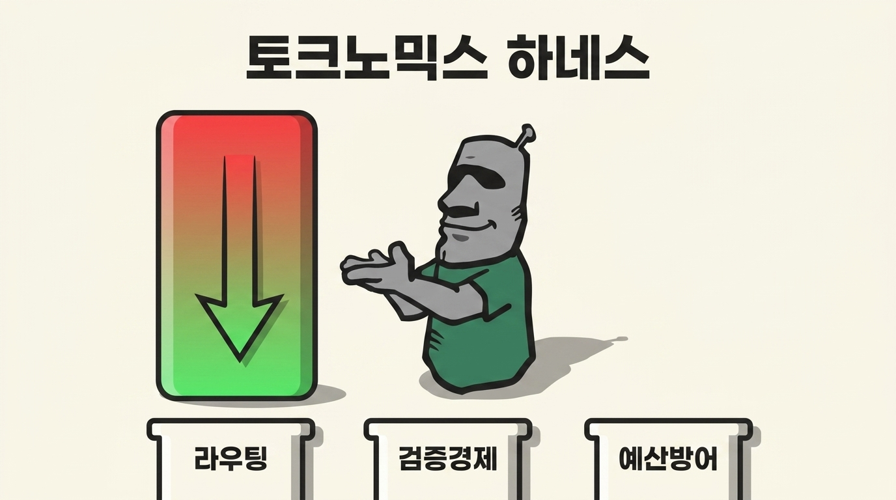
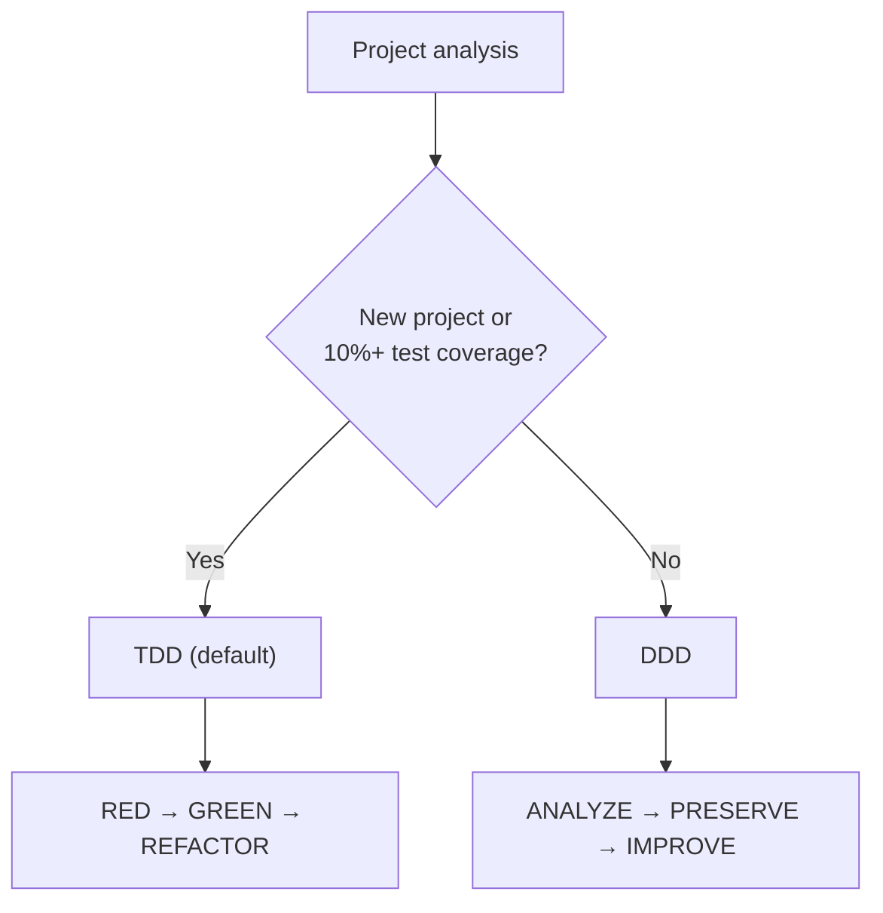

<p align="center">
  
</p>

<h1 align="center">MoAI-ADK</h1>

<p align="center">
  <strong>토크노믹스를 위해 설계된 에이전틱 개발 키트</strong>
</p>

<p align="center">
  <a href="./README.md">English</a> ·
  한국어 ·
  <a href="./README.ja.md">日本語</a> ·
  <a href="./README.zh.md">中文</a>
</p>

<p align="center">
  <a href="https://book.mo.ai.kr" target="_blank"><strong>공식 도서 『클로드 코드로 시작하는 실전 에이전틱 코딩』</strong></a><br>
  MoAI-ADK 제작자가 직접 쓴 하네스 엔지니어링 실전 가이드 — <a href="https://book.mo.ai.kr" target="_blank">book.mo.ai.kr</a>
</p>

<p align="center">
  <a href="https://github.com/modu-ai/moai-adk/actions/workflows/ci.yml"></a>
  <a href="https://github.com/modu-ai/moai-adk/actions/workflows/codeql.yml"></a>
  <a href="https://codecov.io/gh/modu-ai/moai-adk"></a>
  <br>
  <a href="https://go.dev/"></a>
  <a href="https://github.com/modu-ai/moai-adk/releases"></a>
  <a href="./LICENSE"></a>
</p>

<p align="center">
  <a href="https://adk.mo.ai.kr"><strong>공식 문서</strong></a> ·
  <a href="https://adk.mo.ai.kr/book">도서: Claude Code 실전 에이전틱 코딩</a> ·
  <a href="https://discord.gg/Z7E7Mdc5aN">Discord</a>
</p>

---

> **"토크노믹스는 토큰 소비를 경제적으로 사용을 목표로 하는 하네스이다."**

---

## MoAI-ADK는 토크노믹스 하네스다

MoAI-ADK(Agentic Development Kit)는 Claude Code가 코드를 생산하게 하고, 그 코드가 예측 가능한 비용으로 믿을 수 있게 만든다. 하네스는 모델을 바깥에서 감싸는 시스템이다. 모델은 토큰 단위로 움직이는 확률적 작업자라 예산도 품질 기준도 지난 세션이 어디서 끊겼는지도 기억하지 못한다. 비용 상한, 통과하는 테스트 스위트, `/clear`를 건너뛰는 연속성 — 이런 속성은 매 턴 프롬프트로 다시 심을 수 있는 게 아니라 시스템이 바깥에서 강제해야 한다.

모든 설계는 토크노믹스를 향한다. 어떤 모델을 쓸지, 얼마나 깊이 추론할지, 컨텍스트를 어떻게 소비할지는 그때그때 운에 맡기지 않고 시스템이 정한다. Claude Code를 대체하지 않는다. Claude Code가 사용자에게 맡겨둔 부분 — 모델 라우팅, 품질 게이트, 비용 제어, 세션 연속성 — 을 구조로 감쌀 뿐이다. Go로 짠 단일 바이너리라 macOS·Linux·Windows에서 별도 의존성 없이 바로 돈다.

---

## 왜 토크노믹스인가

토큰 단가가 계속 내려가는데, 정작 에이전틱 워크플로우의 실제 지출은 오른다. 에이전트는 한 과제를 풀려고 수십에서 수백 스텝을 돌고, 그만큼 토큰을 태운다. 종량제에서는 이게 곧 청구서이고, 구독제에서는 전 모델이 공유하는 주간 쿼터를 갉아먹는다.

### 비용은 모델 단가가 아니라 배정이 결정한다

DeepSWE 리더보드(113 tasks) 실측이 이 문제를 보여준다. 같은 Claude 계열, 같은 최고 effort(max)로 돌려도 과제 하나를 푸는 비용은 크게 벌어진다.

| 모델 [max] | Pass@1 | 과제당 비용 | $/해결과제 | 토큰/해결과제 | 스텝 |
|---|---|---|---|---|---|
| claude-opus-4.8 | 59% | $13.22 | **$22.4** | 229k | 120 |
| claude-fable-5 | 70% | $21.63 | $30.9 | 170k | 88 |
| claude-sonnet-5 | 54% | $26.40 | **$48.9** | 396k | 268 |

Sonnet 5 max는 Opus 4.8 max보다 **비싸면서(과제당 $26.40 vs $13.22) 점수는 낮다(54% vs 59%)**. 원인은 268스텝 — 최고 effort에서 재시도 루프가 폭주한다. "약한 모델을 세게 굴리면 싸다"는 통념은 성립하지 않는다. 오히려 스텝을 세 배 돌며 쿼터를 더 태운다. 즉, 비용은 모델 단가가 아니라 **작업에 맞는 모델·추론 깊이 배정**이 결정한다.

MoAI-ADK는 이 배정을 그때그때 운에 맡기지 않고 시스템으로 만든다.

---

## 3축으로 경제화

### 라우팅 — 작업마다 맞는 모델과 추론 깊이 배정

**Tier×Phase 매트릭스**. 작업 단계(phase: plan / run / sync)와 SPEC 크기(Tier S / M / L)에 따라 모델과 추론 깊이(effort)를 선언적으로 배정한다. 깊은 추론이 필요한 계획 단계에는 고추론 모델을, 기계적 반복이 많은 구현 단계에는 가벼운 모델을 배정하여 비용 대비 품질을 극대화한다.

**No-Haiku 3-티어 정책**. Haiku를 라우팅 모델 세트에서 배제하고, 3-티어 구조(Sonnet / Opus / Fable)로 작업을 분산한다. 기계 작업에는 Sonnet low effort를 배정하여 스텝 수를 최소화하고, 추론이 필요한 곳에는 상위 모델을 배정한다.

**plan_type 프로파일**. API 종량제와 구독 요금제는 최적 배분이 다르다. API에서는 달러가 유일한 제약이고, 구독에서는 주간 토큰 쿼터가 제약이다. 60-셀 프로필 매트릭스(10 에이전트 × 3 티어 × 2 plan_type)이 요금제별로 다른 모델/effort를 적용한다.

**CG 모드 (Claude + GLM)**. `moai cg`는 Claude 리더와 GLM 워커를 결합한 하이브리드 모드다. 전략, 계획, 감사는 Claude가 담당하고, 대량 구현 작업은 GLM이 담당한다. 구현 중심 작업에서 **60-70% 비용 절감** 효과가 있다.

### 검증경제 — 컨텍스트를 다이어트하고 증거는 디스크에

**verify-diet**. 검증 명령의 장문 출력을 디스크 파일로 리다이렉트하고, 컨텍스트에는 exit code와 bounded tail(최대 50줄)만 남긴다. 이 파일-리다이렉트 계약은 검증 증거의 무결성을 유지하면서 컨텍스트 소비를 줄인다. 증거는 `.moai/state/verify/<session>/` 하위에 영속화된다.

**프롬프트 캐시**. 요청의 앞부분이 직전 요청과 동일할 때, 그 부분을 다시 처리하지 않고 재사용한다. 캐시에서 읽은 토큰은 기본 입력 단가의 0.1배로 청구된다. 항시 로드되는 지침을 최소화하면 이 적중률이 바로 올라간다. 스테이터스라인의 캐시 히트율 세그먼트(`♻️`)로 실시간 확인이 가능하다.

**컨텍스트 다이어트**. `/clear` 전략을 적용한다. SPEC phase가 끝나면 `/clear`하고, 진행 상태를 `progress.md`에 저장한 뒤 붙여넣기 가능한 resume 메시지를 발행한다. 컨텍스트 윈도우 임계(1M 모델 50% / 200K 모델 90%)에서 자동으로 권고가 뜬다.

### 예산방어 — 초과 전에 중단하고 다음 세션으로 이어

**Token Circuit Breaker**. 에이전트별 토큰 사용량이 hard-limit(기본 90%)에 도달하면 중단을 수행한다. 진행 상태를 `progress.md`에 저장하고, 붙여넣기 가능한 핸드오프 메시지(paste-ready resume)를 발행하며, 자동 `/clear`는 절대 하지 않는다. 시스템은 사용자가 `/clear`를 실행하도록 권고만 하며, 사용자가 판단하여 실행한다.

**스테이터스라인**. 컨텍스트 사용률(CW%), 프롬프트 캐시 적중률, rate limit 소진율을 터미널 하단에 항상 띄워 두면 토큰 운용 상태를 한눈에 읽을 수 있다. CW% 옆 `(⚠️/clear)` 마커는 모델별 임계에서 뜬다.

---

## 인프라가 토크노믹스를 지속시킨다

### 품질 구조 — 재작업·디버깅 반복(토큰 낭비 최악 case)을 방지

**SPEC 3-페이즈 라이프사이클**. plan → run → sync. Tier S/M/L 크기 분류가 검증 깊이와 PR 라우팅을 정하고, GEARS 형식 요구사항 + 인수 기준으로 완료를 증거로 판정한다.

**TRUST 5 품질 게이트**. Tested(85%+ 커버리지) · Readable · Unified · Secured · Trackable, 모든 변경에 적용한다. 검증을 에이전트가 아닌 게이트가 판정한다.

**11-에이전트 카탈로그**. MoAI 커스텀 10개 + 내장 Explore. 계획과 감사를 설계 단계부터 분리해, 작성한 쪽이 자기 작업에 점수를 매기지 않는다.

### 학습 루프 — 루프가 돌수록 토큰 효율 개선

**`/moai goal`·`/moai loop`**. 완료 조건 하나만 선언하면 충족되거나 턴 한도(기본 30)에 닿을 때까지 세션이 알아서 일한다. `/moai loop`은 LSP 진단·AST-grep·린터를 병렬로 스캔해, 나온 문제를 큐가 빌 때까지 돈다.

**Routing Ledger**. 라우팅 결정과 게이트 증거를 프라이버시 보존 다이제스트로 기록한다. 관찰이 규칙으로 승격된다.

**4-티어 학습 사다리**. 관찰 (≥1) → 휴리스틱 (≥3) → 규칙 (≥5) → 자동 업데이트 (≥10, 사용자 승인 필수); 신뢰도 하한 0.70. 모든 적용은 `moai harness rollback`으로 되돌릴 수 있다.

**결정 메모리**. 질문은 불확실성이 가장 높은 곳(p ≈ 0.5)에서 나오고, 추천은 시스템 기본값이 아니라 관찰된 통계적 다수를 따른다.

### 확장 지점 — 동일 패턴을 프로젝트 맞춤으로 복제해 재사용 효율

**Harness v4 Builder**. 자연어 요청 → 도메인·목표·제약 추출 → 승인 게이트 → 프로젝트 전용 에이전트·스킬·커맨드 생성.

**@MX 태그**. AI 에이전트끼리 컨텍스트·불변 계약·위험 구역을 주고받는 인라인 코드 어노테이션이다.

**worktree 격리**. `/moai plan --worktree`로 SPEC마다 병렬 개발용 격리 worktree를 붙인다.

---



---

## 빠른 시작

### 설치

#### macOS / Linux / WSL

```bash
curl -fsSL https://raw.githubusercontent.com/modu-ai/moai-adk/main/install.sh | bash
```

#### Windows (PowerShell 7.x+)

```powershell
irm https://raw.githubusercontent.com/modu-ai/moai-adk/main/install.ps1 | iex
```

#### 소스에서 빌드 (Go 1.26+)

```bash
git clone https://github.com/modu-ai/moai-adk.git
cd moai-adk && make build
```

### 프로젝트 초기화

```bash
moai init my-project
```

대화형 마법사가 언어와 프레임워크, 방법론을 자동으로 감지하고, 모델 정책을 고른 뒤 Claude Code 통합 파일까지 만든다.

### 첫 워크플로우

```bash
claude        # launch Claude Code inside the project
```

```text
/moai plan "Add JWT login"      # author a SPEC
/moai run SPEC-AUTH-001         # TDD/DDD implementation
/moai sync SPEC-AUTH-001        # sync docs + create PR
```

자연어로 던져도 된다. `/moai "fix the login bug"`처럼 쓰면 의도 분석(Analyze-First 라우팅)이 요청을 읽고 알맞은 워크플로우로 넘긴다.

### 요구사항

| 플랫폼 | 지원 환경 | 비고 |
|----------|----------------------|-------|
| macOS | Terminal, iTerm2 | 완전 지원 |
| Linux | Bash, Zsh | 완전 지원 |
| Windows | **WSL (권장)**, PowerShell 7.x+ | 네이티브 cmd.exe는 미지원 |

**사전 요구사항**

- 모든 플랫폼에 **Git** 설치 필수
- **Claude Code** — MoAI-ADK는 Claude Code를 위한 하네스다
- **권장**: `gh` CLI (PR 자동화) · `tmux` (CG 모드) · 사용 언어의 린트/테스트 툴체인 (예: `golangci-lint`)

---

## 레퍼런스

### /moai 슬래시 서브커맨드 (16개)

| 서브커맨드 | 역할 |
|------------|------|
| `plan` / `run` / `sync` | SPEC 3-페이즈 파이프라인 |
| `project` / `harness` / `design` | 프로젝트 문서+하네스 생성 · 하네스 라이프사이클 · Design-phase 협업 |
| `goal` / `loop` / `fix` | 선언적 goal 루프 · 반복 수리 · 단일 패스 수리 |
| `review` / `gate` / `clean` | 코드 리뷰 · 사전 커밋 품질 게이트 · 데드 코드 제거 |
| `mx` / `codemaps` / `feedback` | @MX 어노테이션 · 아키텍처 문서 · GitHub 이슈 보고 |
| `e2e` | 멀티플랫폼 E2E 테스트 (웹/모바일/데스크톱, CLI 우선) |
| *(자연어)* | 자율 plan → run → sync 파이프라인으로 넘기는 Analyze-First 라우팅 |

> → 자세히: [워크플로우 커맨드](https://adk.mo.ai.kr/ko/workflow-commands) · [유틸리티 커맨드](https://adk.mo.ai.kr/ko/utility-commands)

### CLI 커맨드 (자주 쓰는 12개)

| 커맨드 | 설명 |
|---------|-------------|
| `moai init` | 대화형 프로젝트 설정 (언어/프레임워크/방법론 자동 감지) |
| `moai doctor` | 시스템 상태 진단과 환경 검증 |
| `moai status` | 프로젝트 상태 요약 (Git 브랜치, 품질 지표) |
| `moai update` | 최신 버전으로 업데이트 (자동 롤백 지원) |
| `moai cc` / `moai glm` / `moai cg` | Claude 전용 / GLM 전용 / 하이브리드 Claude 리더 + GLM 워커 세션 |
| `moai worktree <new|list|switch|sync|remove|clean|go>` | 병렬 SPEC 개발을 위한 Git worktree 관리 |
| `moai session <list|register|current>` | 멀티 세션 조율 |
| `moai spec <audit|archive|lint|list|new>` | SPEC 라이프사이클 도구 |
| `moai goal <arm|status|clear>` | Goal 엔진 CLI |
| `moai harness <status|apply|rollback|disable>` | 하네스 학습 라이프사이클 |
| `moai handoff <save|list>` | 세션 핸드오프 기록 |
| `moai preference <list|decay-scan|toggle>` | 결정 메모리 관리 |
| `moai web` | Web Console — 6탭 설정 콘솔 |

> 전체 36개 커맨드: [CLI 레퍼런스](https://adk.mo.ai.kr/ko/cli-reference)

### 11-에이전트 카탈로그

| 분류 | 에이전트 | 역할 |
|----------|-------|------|
| **Manager** | manager-spec | Plan-phase SPEC 작성 |
| | manager-develop | Run-phase TDD/DDD/autofix 구현 |
| | manager-docs | Sync-phase 문서화 |
| | manager-git | PR 생성 및 라우팅 |
| | manager-design | Design-phase 협업 (Claude Design) |
| **Evaluator** | plan-auditor | 독립 계획 감사 (편향 방지) |
| | sync-auditor | 4-차원 품질 채점 (Functionality 40 · Security 25 · Craft 20 · Consistency 15) |
| **Builder** | builder-harness | 프로젝트 전용 에이전트, 스킬, 커맨드, 훅 스캐폴딩 |
| **Advisor** | super-advisor | 온디맨드 고추론 자문 (E1-E4 에스컬레이션) |
| **Specialist** | e2e-tester | 웹/모바일/데스크톱 E2E 테스트 실행 (CLI 우선) |
| **Built-in** | Explore | 읽기 전용 코드베이스 탐색 |

### TRUST 5 품질 게이트

| 기준 | 의미 | 검증 |
|-----------|---------|------------|
| **T**ested | 테스트됨 | 85%+ 커버리지, 특성화 테스트, 단위 테스트 통과 |
| **R**eadable | 읽기 쉬움 | 명확한 네이밍, 일관된 스타일, 린트 오류 0 |
| **U**nified | 통일됨 | 일관된 포매팅, import 순서, 프로젝트 구조 준수 |
| **S**ecured | 보안됨 | OWASP 준수, 입력 검증, 보안 경고 0 |
| **T**rackable | 추적 가능 | Conventional commits, 이슈 참조, 구조화된 로깅 |

### 방법론 선택 (TDD vs DDD)


```mermaid
flowchart TD
    A["Project analysis"] --> B{"New project or<br/>10%+ test coverage?"}
    B -->|"Yes"| C["TDD (default)"]
    B -->|"No"| D["DDD"]
    C --> F["RED → GREEN → REFACTOR"]
    D --> G["ANALYZE → PRESERVE → IMPROVE"]
```

| 방법론 | 사이클 | 대상 |
|-------------|-------|-----|
| **TDD** (기본) | RED → GREEN → REFACTOR | 신규 프로젝트와 기능 작업 |
| **DDD** | ANALYZE → PRESERVE → IMPROVE | 커버리지 10% 미만의 기존 코드 |

---

## 스테이터스라인 읽는 법

```
🤖 Opus │ 🧠 xhigh·t │ ♻️ 87% │ 🔅 v2.1.212 │ 🗿 v3.0.0 │ ⏳ 2h 34m │ 💬 MoAI
🪫 CW: ████████░░ 88% (⚠️/clear) │ 🔋 5H: ████░░░░░░ 45% (4h 30m) │ 🪫 7D: ████████░░ 82% (Jan 21)
📁 moai-adk-go │ 🔀 modu-ai/moai-adk | 🅱️ feat/statusline ↑2 +3 │ 💾 +1 M2 ?0 │ 📋 [run SPEC-AUTH-001-run] │ 💌 PR #1042 (⌥approved)
```

| 요소 | 의미 |
|------|------|
| 🤖 모델 | 현재 활성 모델 |
| 🧠 effort | 추론 노력 레벨 — 확장 사고가 켜지면 `·t` 접미 |
| ♻️ 캐시 적중률 | 프롬프트 캐시 적중률 |
| CW: 컨텍스트 | 컨텍스트 윈도우 사용률 + 2단계 `/clear` 마커 (⚠️ 소프트, 🛑 하드) |
| 5H / 7D | 요금제 사용률 + 리셋 시간 |
| 📁 디렉터리 | 프로젝트 디렉터리 이름 |
| 🔀 리포 | GitHub 리포 identity `owner/name` |
| 🅱️ 브랜치 | 현재 브랜치 + `↑`ahead `↓`behind + `+`더티 카운트 |
| 💾 git 상태 | staged / modified / untracked 카운트 |
| 📋 태스크 | 활성 SPEC 워크플로우 `[커맨드 SPEC-ID-단계]` |
| 💌 PR | 활성 GitHub PR 번호 + 리뷰 상태 (`⌥state`) |

> 자세히: [스테이터스라인 가이드](https://adk.mo.ai.kr/ko/advanced/statusline)

---

## FAQ

### Q: 왜 모든 함수에 @MX 태그가 없나요?

정상이다. 태그는 팬인이 높거나 복잡하거나 위험한 코드만 골라 표시한다. 코드 대부분은 어떤 태그 기준에도 안 걸리고, 태그가 없는 파일은 결함이 아니다.

### Q: 스테이터스라인의 버전 표시는 무슨 뜻인가요?

```
🗿 v3.0.0 ⬆️ v3.0.1
```

앞의 값은 지금 설치된 MoAI-ADK 버전이고, 화살표는 받을 수 있는 업데이트가 있다는 표시다.

### Q: GLM 없이 Claude만으로 쓸 수 있나요?

쓸 수 있다. `moai cc`가 Claude 전용 세션이다. CG 모드(`moai cg`, Claude 리더 + GLM 워커)와 GLM 전용(`moai glm`)은 비용 절감을 위한 선택지일 뿐, 하네스·SPEC 워크플로우·품질 게이트는 세 모드 모두에서 동일하게 돈다.

### Q: 기존 프로젝트에도 적용되나요?

적용된다. `moai init`이 프로젝트 상태를 감지해 방법론을 정한다 — 커버리지 10% 미만의 기존 코드에는 DDD(특성화 테스트로 동작을 고정한 뒤 점진 개선), 신규/충분히 테스트된 코드에는 TDD가 붙는다.

---

## 커뮤니티와 문서

### 기여하기

기여는 언제든 환영한다. 자세한 절차는 [CONTRIBUTING.md](CONTRIBUTING.md)에 정리해 두었다.

1. 리포지토리 포크
2. 기능 브랜치 생성: `git checkout -b feature/my-feature`
3. 테스트 작성 (신규 코드는 TDD, 기존 코드는 특성화 테스트)
4. 테스트, 린트, 포맷 통과 확인: `make test` · `make lint` · `make fmt`
5. Conventional commit 메시지로 커밋하고 풀 리퀘스트 열기

**코드 품질 요구사항**: 85%+ 커버리지 · 린트 오류 0 · 타입 오류 0 · Conventional commits

### 커뮤니티

- [Discord](https://discord.gg/Z7E7Mdc5aN) — 실시간 토론과 팁
- [Issues](https://github.com/modu-ai/moai-adk/issues) — 버그 리포트, 기능 요청 (Claude Code 안에서는 `/moai feedback`)

### 라이선스

[Apache License 2.0](./LICENSE) — 자세한 내용은 LICENSE 파일을 참조한다.

### 문서 가이드

[adk.mo.ai.kr](https://adk.mo.ai.kr) 온라인 문서는 12개 섹션으로 나뉘어 있다.

| 섹션 | 설명 |
|------|------|
| [시작하기](https://adk.mo.ai.kr/ko/getting-started) | 소개, 설치, Windows 가이드, init 마법사, 퀵스타트, CLI 개요, FAQ |
| [핵심 개념](https://adk.mo.ai.kr/ko/core-concepts) | MoAI-ADK 정체성, 컨스티튜션, 하네스 엔지니어링, SPEC 기반 개발, DDD, TRUST 5 |
| [워크플로우 커맨드](https://adk.mo.ai.kr/ko/workflow-commands) | `plan` · `run` · `sync` — SPEC 파이프라인의 주축 |
| [유틸리티 커맨드](https://adk.mo.ai.kr/ko/utility-commands) | `fix` · `loop` · `gate` · `review` · `clean` · `codemaps` · `e2e` · `feedback` · `goal` |
| [CLI 레퍼런스](https://adk.mo.ai.kr/ko/cli-reference) | 터미널 `moai` 바이너리의 모든 커맨드 |
| [Claude Code 가이드](https://adk.mo.ai.kr/ko/claude-code) | Claude Code 통합 — 기초, 컨텍스트·메모리, 에이전틱, 확장성 |
| [Multi-LLM](https://adk.mo.ai.kr/ko/multi-llm) | CG 모드와 모델 정책 |
| [비용 최적화](https://adk.mo.ai.kr/ko/cost-optimization) | 프롬프트 캐싱 전략과 토큰 비용 절감 |
| [가이드](https://adk.mo.ai.kr/ko/guides) | CI 자율화, multi-LLM CI 등 실전 운영 레시피 |
| [Git Worktree](https://adk.mo.ai.kr/ko/worktree) | 병렬 SPEC 개발을 위한 worktree 가이드 |
| [Advanced](https://adk.mo.ai.kr/ko/advanced) | 토크노믹스 개요, 토큰 예산, 스테이터스라인, settings.json, 훅, @MX 태그, 스킬 가이드, Harness v4 Builder, 자가 진화, 결정 메모리 |
| [기여하기](https://adk.mo.ai.kr/ko/contributing) | 오픈소스 기여 가이드 |

### 링크

- [공식 문서](https://adk.mo.ai.kr)
- [도서: Claude Code 실전 에이전틱 코딩](https://adk.mo.ai.kr/book)
- [CHANGELOG](./CHANGELOG.md)
- [Claude Code](https://docs.anthropic.com/en/docs/claude-code)
- [Discord 커뮤니티](https://discord.gg/Z7E7Mdc5aN)
