<p align="center">
  
</p>

<h1 align="center">MoAI-ADK</h1>

<p align="center">
  <strong>검증-구동 에이전트 오케스트레이션 하네스 — Claude Code가 쓴 코드를 믿을 수 있게 만드는 구조</strong>
</p>

<p align="center">
  <a href="./README.md">English</a> ·
  한국어 ·
  <a href="./README.ja.md">日本語</a> ·
  <a href="./README.zh.md">中文</a>
</p>

<p align="center">
  <a href="https://github.com/modu-ai/moai-adk/actions/workflows/ci.yml"></a>
  <a href="https://github.com/modu-ai/moai-adk/actions/workflows/codeql.yml"></a>
  <a href="https://codecov.io/gh/modu-ai/moai-adk"></a>
  <br>
  <a href="https://go.dev/"></a>
  <a href="https://github.com/modu-ai/moai-adk/releases"></a>
  <a href="./LICENSE"></a>
</p>

<p align="center">
  <a href="https://adk.mo.ai.kr"><strong>공식 문서</strong></a> ·
  <a href="https://adk.mo.ai.kr/book">도서: 클로드 코드로 시작하는 실전 에이전틱 코딩</a> ·
  <a href="https://discord.gg/Z7E7Mdc5aN">Discord</a>
</p>

---

> **"모델은 토큰 단위로 나아가는 확률적 작업자다. 이번 턴에 무엇을 얼마나 썼는지, 결과가 좋은지, 지난 세션에서 어디까지 했는지를 턴마다 기억하지 못한다. 하네스는 이 세 가지를 바깥에서 강제한다."**

---

## v3.1 새 기능 — 칸반 모드

> v3.1은 광복절인 8월 15일에 맞춰 내놓는다. 한 세션이 컨텍스트 한도에 묶인 채 일하던 방식에서 풀려난다는 뜻을 담았다. 다만 한도 자체가 없어지는 것은 아니다 — 실제로 달라지는 지점은 아래에 그대로 적는다.

세션 하나는 컨텍스트 창 하나를 쓴다. 긴 SPEC은 그 창을 채우고, 뒤에 오는 작업은 앞의 것을 전부 지고 간다. 계획은 이미 끝났는데도 리뷰하는 내내 창에 남아 있고, 그 리뷰는 문서를 쓰는 내내 또 남아 있다. 흔한 탈출구인 `/clear`는 짐과 함께 맥락까지 버린다.

칸반 모드는 작업 하나를 **터미널 한 개가 아니라 네 개로** 나눈다. 리드 세션이 체인을 몰고, 세 개의 동반 세션이 `plan`·`run`·`sync` 한 칸씩을 맡아 **자기 칸의 맥락만** 진다. 검토는 별도 칸이 아니라 sync 게이트가 흡수한다 — sync 단계가 리뷰 렌즈를 직접 돌려 판정을 낸다. 무제한이 되는 것이 아니다 — 세션마다 한도는 그대로 있다. 달라지는 것은 어느 세션도 세 단계치 이력을 짊어지지 않는다는 점이고, 그래서 같은 예산이 훨씬 멀리 가며, 끝난 단계는 카드를 잃지 않고 비울 수 있다.

<p align="center">
  
</p>

칸마다 백엔드와 추론 강도를 다르게 둘 수 있다. 위 화면은 Plan을 Opus 5 high로, Run을 GLM 5.2 xhigh로, Sync를 GLM 5.2로 돌린다. 칸마다 필요한 추론의 깊이가 같지 않기 때문이다.

### 시작하기

```bash
moai cc -k                    # 리드 — run-id를 알려주고 체인을 깐다
moai cc -k --name plan        # 동반 세션, 각자 별도 터미널에서
moai cc -k --name run
moai cc -k --name sync
```

동반 세션은 **터미널을 하나씩 새로 열어 직접** 띄운다. 이름은 역할만으로 붙인다 — run-id는 리드 세션의 식별자이고 동반 세션이 물고 다니지 않는다. 같은 역할 이름이 이미 살아 있으면 다음 번호가 붙는다. 세션은 다른 세션을 대신 띄우지 못한다. 어느 칸이든 `moai cc` 대신 `moai glm`을 쓰면 그 칸만 GLM 백엔드로 돈다.

### 어느 백엔드로 나눌까

칸반을 열 때 부트스트랩 안내가 기본 추천을 함께 알려 준다 — 토큰 가용성을 우선하면 리더는 `moai glm -k`, plan은 `moai cc -k --name plan`, run은 `moai glm -k --name run`, sync는 `moai cc -k --name sync`다. 그림의 이유는 레인마다 필요한 추론의 종류다. plan과 sync는 판단과 리뷰를 도는 칸이라 Claude에 두고, run은 구현 중심이라 GLM로 비용을 낮춘다. 리더는 판정을 내리는 자리가 아니라 큐를 지키며 카드를 나르는 자리라, 상시 대기 비용이 크지 않은 GLM이 어울린다. GLM 리더 아래에서 Claude 판정이 필요해지면 `judge`라는 이름의 세션으로 빠져나간다 — GLM 리더가 Claude를 쓰는 유일한 경로다. 한 계정이 429로 막히기 시작하면 레인을 계정에 분산해 배치하는 운영이 통한다. 이 조합은 어디까지나 기본 추천일 뿐 — 다른 조합이나 전 세션을 한 백엔드로 통일해도 무방하다.

### 팩토리 모드 (Factory Mode) — 레인 N개에 카드를 한꺼번에

`-f`는 칸반의 두 번째 형태인 팩토리 리드를 연다. 칸반 카드가 칸을 옮겨 다니는 것과 달리, 팩토리 카드는 **통째로 레인 하나**에 들어가 그 레인이 세션 안에서 `plan → run → sync`를 순서대로 지나간다. 단계마다 `Agent()` 서브에이전트로 띄운다. 레인 이름은 `lane-1` … `lane-N`이다.

```bash
moai cc -f                    # 리드 — 기본은 레인 하나(lane-1)
moai cc -f 4                  # 리드 — 레인 4개
moai cc -f lane-1             # 레인 하나, 각자 별도 터미널에서
moai glm -f lane-3            # …GLM 백엔드로 띄운 레인 하나
```

레인은 `moai cc -f lane-<n>`으로 하나씩 늘린다. 이 형태는 레인 이름을 이미 정하므로 `--name`/`-n`을 함께 주면 에러다. 번호는 살아 있는 세션이 쥔 것만 건너뛴다 — 죽은 레인의 번호는 풀려서 다시 쓰인다. 어느 번호를 누가 쥐고 있는지는 `.moai/state/factory/workers.json`에 적히고, 남은 claim도 여기서 치운다. 레인 하나가 동시에 돌리는 `Agent()` 서브에이전트는 최대 10개이고, 쓰기를 맡는 스폰은 각자의 워크트리로 격리한다. 레인을 한꺼번에 켜지 말고 첫 레인을 먼저 올려 실제로 출력이 나오는 것을 확인한 뒤 나머지를 띄운다. 카드는 레인에 쪼개어 넣지 않는다. `-k`는 그대로 세 역할짜리 칸반 체인을 돌린다. 한 번의 실행에 진입 토큰은 하나뿐이라 `-k`와 `-f`를 함께 쓰면 에러이고, `moai cg`는 팩토리 모드를 거부한다.

> 자세히: [칸반 모드 — 팩토리 모드](https://adk.mo.ai.kr/ko/advanced/kanban-mode)

보드는 `backlog → plan → run → sync → done` 다섯 칸이다. `backlog`에는 주인 세션이 일부러 없다. 그래서 일감은 사람이 넣을 때만 보드에 들어온다.

```text
/moai todo "rename 힌트가 낡았다"   # 카드 추가
/moai todo                          # 큐 확인
```

보드를 정직하게 유지하는 규칙이 둘 있다. 리드는 카드의 `progress.md`에서 **직접 읽은 증거로만** 카드를 넘긴다 — 동반 세션의 답장으로는 넘기지 않는다. 답장은 관측이 아니라 주장이고, 세션 간 전달은 보장되지도 않기 때문이다. 그리고 단계가 끝나면 리드가 해당 세션을 `/clear` 해달라고 요청한다. `/clear`는 사람이 직접 치는 명령이라 지시로 보낼 수 없다.

### 네 세션이 쓰는 말

칸반 문서가 되풀이하는 낱말을 그림 한 장으로 묶으면 이렇다. **칸** (column) 은 보드의 단계이고, **레인** (lane) 은 카드 한 장을 그 단계들 사이로 끝까지 나르는 세션과 워크트리의 짝이다 — 정류장과 노선의 차이다.

```text
운영자 ── /moai todo ──▶ backlog ─▶ plan ─▶ run ─▶ sync ─▶ done
                          (리드가 직접 읽은 증거로만 카드를 다음 칸으로)

레인 — 카드 t0:  run 세션 + 워크트리 t0      ┐ 두 흐름은 같은 보드를
레인 — 카드 t1:  run 세션 + 워크트리 t1      ┘ 나란히 흐르고 섞이지 않는다
```

| 낱말 | 한 줄 정의 |
|---|---|
| 카드 (card) | 작업 단위 하나. `/moai todo`로 들어오고 짧은 아이디로 불린다 |
| 칸 (column) | 보드의 단계 하나 — 다섯 칸은 고정 순서 |
| 백로그 (backlog) | 입구 대기열. 주인 세션이 없어 사람만 넣을 수 있다 |
| 레인 (lane) | 카드 한 장을 끝까지 나르는 세션+워크트리의 짝. 병렬 작업 흐름 하나 |
| 리드 (lead) | 조율하는 세션. 읽은 증거로만 카드를 넘기고, 코드는 직접 쓰지 않는다 |
| 동반 세션 (companion) | 칸마다 앉아 일하는 세션. 터미널 하나씩 사람이 직접 띄운다 |
| 런 아이디 (run-id) | 리드가 시작할 때 알려주는 짧은 식별자. 리드 세션의 이름이고 동반 세션은 물지 않는다 |
| 워크트리 (worktree) | 카드 전용 격리 체크아웃. 디렉터리는 카드 아이디, 브랜치는 한 일을 담은 `WT-<슬러그>`. run부터 sync까지 하나가 관통한다 |
| 배차 (dispatch) | 리드가 동반 세션에 보내는 지시 — 일의 포인터이지 복사물이 아니다 |

정의와 예시를 갖춘 정식 용어집: [칸반 보드 용어](https://adk.mo.ai.kr/ko/core-concepts/kanban-board-terms)

### 보드를 눈으로 보기

`moai web`은 로컬 콘솔을 띄운다. 칸반 화면에서 칸반 체인과 SPEC 파이프라인을 함께 보고, Overview·Specs·Monitor·Settings 화면이 함께 붙는다.

<p align="center">
  
</p>

자세한 안내: [칸반 모드](https://adk.mo.ai.kr/ko/advanced/kanban-mode) · [manager-lead 리드 코디네이터](https://adk.mo.ai.kr/ko/advanced/manager-lead) · [`/moai todo`](https://adk.mo.ai.kr/ko/utility-commands/moai-todo)

### v3.1.1에서 더해진 것

칸반 모드 말고도 v3.1.1에 들어온 것들이다. 각각은 뒤의 해당 절에서 자세히 다룬다.

**홈 디렉터리 정리.** 오래 쓸수록 `~/.moai`에는 지난 실행 산출물이 쌓인다. `moai clean --home`이 허용목록 범위 안에서만 그것을 치운다 — 기본은 dry-run이라 무엇이 지워질지 먼저 보여주고, 실제 삭제는 `--force`를 줘야 한다. 며칠 지난 것부터 치울지는 `state.home_retention_days`(기본 30일, `0`이면 끔)로 정한다. 지금 얼마나 불었는지는 `moai doctor`의 Home Disk Usage 항목이 알려준다. 홈 경로 자체는 `MOAI_HOME` 환경변수로 옮길 수 있다 — 절대 경로만 받는다. 다만 이 변수를 읽는 건 Go 프로세스뿐이라, 경로를 옮겨도 statusline과 셸 훅은 여전히 `$HOME/.moai`를 본다. `.env.glm` 같은 셸 쪽 자격증명과 statusline 데이터만 옛 자리에 남아, 상태가 조용히 두 곳으로 갈린다.

<p align="center">
  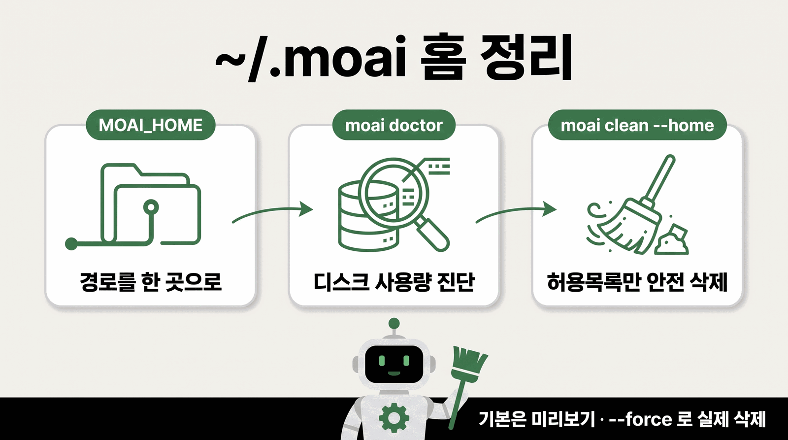
</p>

**세션 간 메시지 설정.** 다른 Claude Code 세션이 보내는 메시지를 바로 받을지, 승인을 받고 받을지, 아예 막을지를 `crosssession.yaml`에서 정한다. 이 머신 밖으로 나가는 메시지에 승인을 요구하는 스위치도 여기 있다.

<p align="center">
  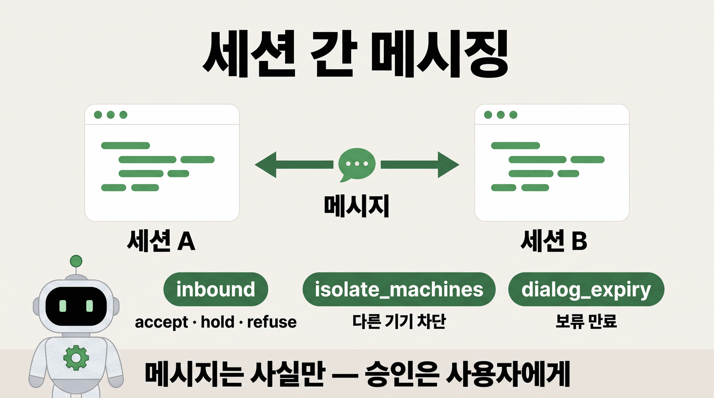
</p>

**스테이터스라인 GitLab 지원.** `statusline.forge`로 열린 작업을 GitHub과 GitLab 중 어느 쪽에서 셀지 고른다. 비워 두면 origin 리모트 호스트를 보고 판단한다.

**맨 `/loop`가 칸반 포먼이 된다.** 인자 없이 `/loop`만 치면 백로그 큐를 지켜보다 운영자가 이미 `picked`로 골라둔 다음 카드를 격리된 워커에 배차하고, 완료는 주장이 아니라 읽은 증거로 확인한 뒤 보고하는 사이클이 돈다. 사람이 지켜보지 않는 자리라 카드를 큐에 넣는 것도 고르는 것도 운영자 몫이고, 포먼은 고르지 않고 나르기만 한다.

---

## 왜 moai-adk인가요?

에이전트가 코드를 쓰는 시대가 왔지만, 에이전트가 내놓은 결과를 그대로 믿을 수는 없다. "테스트가 통과했습니다"라는 말이 진짜 테스트를 돌린 결과인지, 그냥 에이전트의 추측인지를 구분하는 것이 처음부터 가장 큰 문제다. moai-adk는 바로 그 지점에서 출발한다 — **검증하지 않은 완료 선언을 시스템 차원에서 금지**하고, 모든 완료 주장에 실제로 돌린 명령과 그 출력을 증거로 묶는다.

moai-adk는 Claude Code를 바깥에서 감싸는 하네스다. Claude Code를 대체하지 않고, 사용자가 직접 챙겨야 했던 부분 — 어느 모델을 쓸지, 얼마나 깊이 추론할지, 결과를 어떻게 검증할지, 세션이 끊겼을 때 어떻게 이을지, 병렬로 돌릴 때 서로 밟지 않게 어떻게 갈라놓을지 — 을 구조로 떠맡는다. 검증 무결성, SPEC 라이프사이클, 진짜 경계가 있는 자율 실행, 살아 있는 코드베이스 내비게이터, 자가 개선 루프, 병렬 안전 구조. 이 여섯 가지가 moai-adk의 정체성을 이룬다.

<p align="center">
  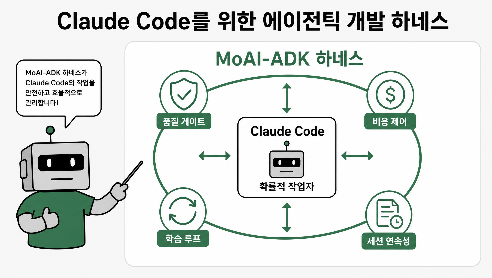
</p>

이 정체성은 세 가지 핵심 (three axes) 으로 정리된다 — 같은 품질을 더 적은 토큰으로 얻는 **비용** (토크노믹스), 관측을 규칙으로 바꿔 달라질수록 잘되는 **자가 개선** (에이전틱 루프 엔지니어링), 그리고 재작업을 구조적으로 막는 **품질 관리** (SPEC 라이프사이클·TRUST 5 게이트·격리). 어느 하나만으로는 부족하다 — 아래에서 각각이 왜 서로를 필요로 하는지 본다.

### 여덟 가지 차별점

| 차별점 | 설명 |
|---|---|
| **거짓 검증 없음** | "테스트가 통과했다"는 주장은 반드시 실제로 돌린 명령과 그 출력에 귀속된다. 돌리지 않은 검증을 성공으로 말하는 것을 시스템이 금지한다 — 검증 주장 무결성(verification-claim integrity)이 모든 에이전트와 오케스트레이터 표면에 묶여 있다. |
| **자율 + 진짜 경계** | `/moai goal`이 완료 조건을 선언하면 세션이 조건을 채울 때까지 알아서 일한다. 다만 턴 한도(기본 30), 정체 가드, 벽시계 예산, 사전 승인 게이트라는 네 개의 하드 경계가 묶여 있어 무한 루프에 빠지지 않는다. |
| **병렬 안전** | SPEC마다 독립된 작업 트리를 주고, 브랜치 상태 가드가 주 체크아웃에서 실수로 브랜치를 바꾸는 것을 막으며, 쓰기 에이전트를 띄우기 전에 원격과의 간격을 검사한다. 두 개의 쓰기 에이전트가 동시에 돌지 않는다. |
| **장기 지속** | `/clear`를 넘어도 작업이 이어진다. 진행 상태는 `progress.md`에, 핸드오프 메시지는 메모리에, 라우팅 결정은 결정 메모리에 남는다. 다음 세션은 맨땅이 아니라 지난 세션이 배운 지점에서 시작한다. |
| **비용 효율** | 작업 단계와 SPEC 크기에 맞춰 모델과 추론 깊이를 선언적으로 배정한다. Claude 리더 + GLM 워커의 CG 모드는 구현 중심 작업에서 60–70% 비용을 줄인다. 프롬프트 캐시를 재사용하고 긴 출력은 디스크로 흘려보내 컨텍스트를 가볍게 유지한다. |
| **16가지 프로그래밍 언어 동등 지원** | Go, Python, TypeScript, JavaScript, Rust, Java, Kotlin, C#, Ruby, PHP, Elixir, C++, Scala, R, Flutter, Swift — 16가지 프로그래밍 언어를 한 집단으로 묶어 마커 기반 자동 감지로 처리한다. 어느 하나가 우대를 받지 않는다. |
| **자가 개선** | 되풀이되는 실패 패턴을 관측하면 규칙 변경 제안으로 올린다. 몰래 적용하지 않고 승인을 받아 반영한다. 라우팅 결정과 게이트 증거가 결정 메모리에 쌓여 다음 실행의 재료가 된다. |
| **모국어 친화** | 한국어·일본어·중국어·영어 네 로케일을 같은 PR에서 다루고, 번역투를 금지하며 모국어 글말을 따로 둔다. 모국어를 쓰는 사용자에게 영어를 강제하지 않는다. |

### 무엇이 다른가

| | Claude Code 단독 | 일반 하네스 | **moai-adk** |
|---|---|---|---|
| 완료 주장의 증거 귀속 | 사용자가 직접 확인 | 보통 없음 | 시스템이 강제 (5-섹션 증거 보고 형식) |
| SPEC 라이프사이클 | 없음 | 제한적 | plan→run→sync 3-페이즈 + Tier S/M/L |
| 자율 루프의 하드 경계 | 해당 없음 | 대개 turn cap만 | 턴 한도 + 정체 가드 + 벽시계 + 승인 게이트 |
| 병렬 작업 격리 | 수동 | 제한적 | worktree + 브랜치 가드 + 사전 동기화 검사 |
| 세션 연속성 | `/clear` 후 끊김 | 제한적 | 핸드오프 + 메모리 + 진행 파일 |
| 16가지 프로그래밍 언어 동등 처리 | 해당 없음 | 해당 없음 | 마커 자동 감지 + 언어별 툴체인 |
| 자가 개선 루프 | 없음 | 제한적 | 실패 관측 → 규칙 승격 (승인제) |

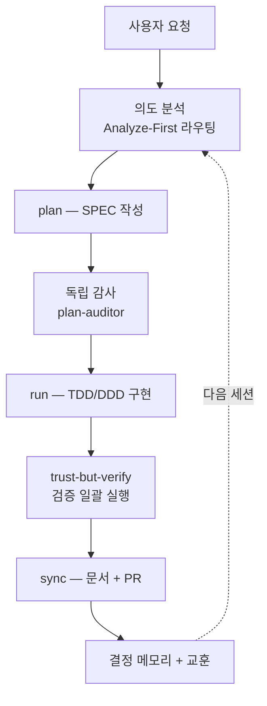
```mermaid
flowchart TD
    User["사용자 요청"] --> Analyze["의도 분석<br/>Analyze-First 라우팅"]
    Analyze --> Plan["plan — SPEC 작성"]
    Plan --> Audit["독립 감사<br/>plan-auditor"]
    Audit --> Run["run — TDD/DDD 구현"]
    Run --> Verify["trust-but-verify<br/>검증 일괄 실행"]
    Verify --> Sync["sync — 문서 + PR"]
    Sync --> Learn["결정 메모리 + 교훈"]
    Learn -.다음 세션.-> Analyze
```

### 세 핵심이 서로를 지탱한다

비용만 밀면 품질이 조용히 무너진다 — 재작업과 디버그 루프가 뒤따르고, 재작업은 모든 토큰 지출 중 가장 비싸다. 품질 게이트만 있고 학습 루프가 없으면 같은 실수가 매 세션 반복된다. 비용 상한 없는 자율 루프는 과제 하나가 할당량 전체를 태울 수 있다. 세 핵심은 서로를 지탱한다 — **품질이 재작업을 막아 비용이 경제적으로 유지되고, 루프가 잘 통했던 것을 포착해 품질이 강제 가능해지며, 비용 게이트가 초과 전에 멈춰 루프가 감당 가능한 범위에 머문다.**

모든 설계 결정은 이 세 핵심 중 하나에 속한다. 어느 모델을 쓸지, 얼마나 깊이 추론할지, 컨텍스트를 어떻게 쓸지 — 어느 것도 턴마다 그때그때 정해지지 않는다. 시스템이 정하고, 그 결정을 기록해 다음 실행이 더 똑똑해진다.

<p align="center">
  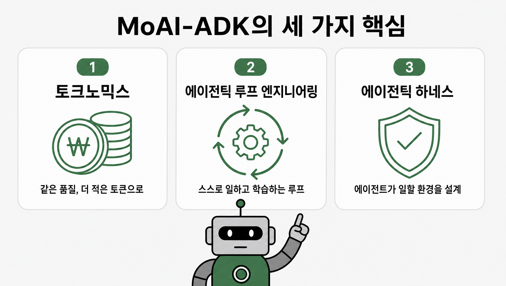
</p>

### 비용은 단가가 아니라 배정이 결정한다

토큰 가격은 3년간 **98% 떨어졌지만** (Linux Foundation), 같은 기간 기업의 AI 지출은 **320% 올랐다**. 가격 하락을 사용량 증가가 덮어쓴 것이다. 에이전트는 과제 하나를 풀기 위해 수십에서 수백 스텝을 돌고, 토큰을 그에 비례해 태운다. 사용량 과금에서는 이것이 그대로 청구서가 되고, 구독제에서는 모든 모델이 공유하는 주간 할당량을 잡아먹는다.

Uber는 Claude Code를 엔지니어 5,000명에게 배포했다가 **4개월에 1년치 코딩 예산을 태웠고**, 월별 토큰 한도를 도입했다. Meta·Amazon·Microsoft도 각자 무제한 AI 정책을 철회했다. 과제에 맞는 모델을 배정해 토큰 효율을 높이는 **토크노믹스** 는 기술 업계의 새 기준선이 됐다.

전통적 비용 통제는 단가 상승에 맞춰 지어졌으므로, 단가는 떨어지는데 총지출은 오르는 이 역설 앞에서 무력하다. 병목은 단가가 아니라 사용량, 정확히는 에이전트가 과제를 끝내기 전까지 도는 스텝 수다.

DeepSWE 리더보드 (과제 113개, 노력도별 보기)가 이를 보여준다. 같은 Claude 계열 안에서 과제당 비용은 모델이 토큰을 얼마에 파는지가 아니라 **얼마나 효율적으로 끝내는지**를 따라간다.

| 모델 [effort] | 점수 | 과제당 비용 | 비고 |
|---|---|---|---|
| opus-5 [low] | 58%±2 | **$1.66** | |
| opus-5 [medium] | **69%±1** | **$3.29** | **가성비 무릎** |
| opus-5 [high] | 73%±2 | $6.08 | 점수 +4, 비용 1.8배 |
| opus-5 [xhigh] | 73%±3 | $9.07 | 순손실 — high와 동점, 비용만 +49% |
| opus-5 [max] | 74%±4 | $11.84 | |
| glm-5.2 [max] | 44%±2 | $3.92 | API 과금에서 불리 · z.ai 정액제에서는 유용 |
| sonnet-5 [max] | 54%±4 | $26.40 | opus-5 [low]에 지배된다 |

Opus 5를 가장 낮은 노력으로 돌린 쪽이 Sonnet 5를 가장 높은 노력으로 돌린 쪽보다 점수가 높고 (58% vs 54%), 과제당 비용은 16분의 1이다 ($1.66 vs $26.40) — Sonnet의 토큰 단가가 더 싸다는 점은 이길 수 없다. 원인은 268 스텝 대 36 스텝이다. 청구서를 쓰는 것은 토큰 요율이 아니라 재시도 루프다. 비용은 **과제마다 알맞은 모델과 추론 깊이를 배정**하는 것으로 결정된다.

<p align="center">
  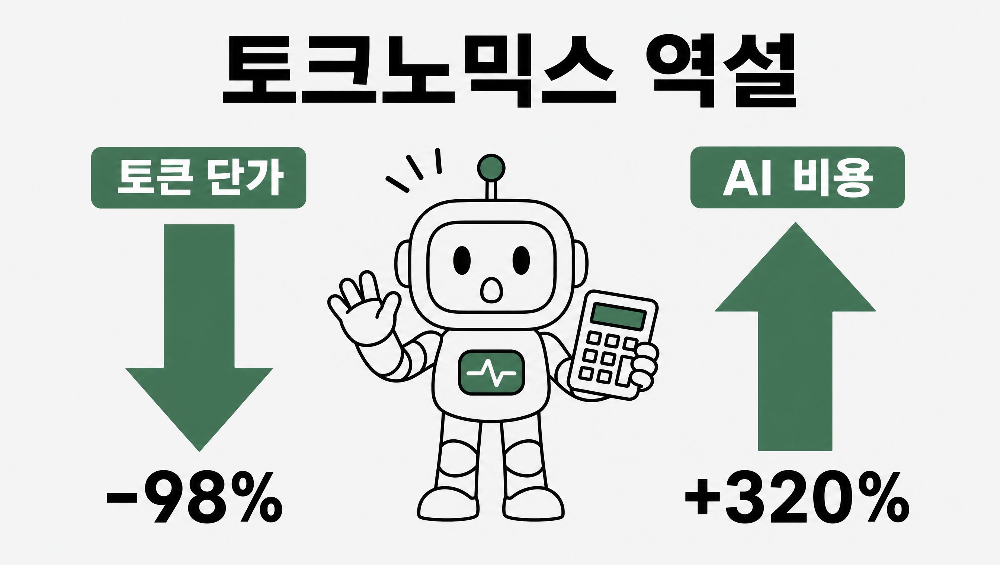
</p>


> 출처: [DeepSWE v1.1 리더보드](https://deepswe.datacurve.ai) (datacurve.ai, 과제 113개, 2026-07-25)

---

## 빠르게 시작

### 설치

#### macOS / Linux / WSL

```bash
curl -fsSL https://adk.mo.ai.kr/install.sh | bash
```

#### Windows (PowerShell 7.x+)

```powershell
irm https://adk.mo.ai.kr/install.ps1 | iex
```

#### 소스에서 빌드 (Go 1.26+)

```bash
git clone https://github.com/modu-ai/moai-adk.git
cd moai-adk && make build
```

이미 설치했다면 `moai update`로 최신 버전으로 올린다. v3.1.1부터 `moai update`는 템플릿 관리 디렉터리를 지우고 다시 깔기 전에, 그 안에 있던 관리 대상 밖 파일을 `.moai-backups/<타임스탬프>/pre-clean/`으로 먼저 옮겨 둔다. 백업이 실패하면 삭제로 넘어가지 않고 그 자리에서 멈춘다 — 직접 넣어 둔 파일이 재배포에 조용히 쓸려 나가지 않는다.

> 💡 **비용을 줄이려면 — z.ai GLM 추천**: [이 링크](https://z.ai/subscribe?ic=1NDV03BGWU)로 z.ai에 가입하면 일정 토큰을 보너스로 받는다. 이 링크는 moai-adk 오픈소스 개발을 후원하는 경로이기도 하다. 무료 모델(GLM-4.7-Flash, GLM-4.5-Flash)도 있으니 [z.ai 요금제](https://docs.z.ai/guides/overview/pricing)를 참고한다.

### 프로젝트 초기화

```bash
moai init my-project
cd my-project
```

대화형 마법사가 언어·프레임워크·방법론을 자동으로 감지하고, 모델 정책을 고른 뒤 Claude Code 통합 파일까지 만든다.

### 첫 워크플로우

```bash
claude        # 또는 moai cc — 프로젝트 안에서 Claude Code 실행
```

```text
/moai plan "JWT 로그인 추가"      # SPEC 작성
/moai run SPEC-AUTH-001           # TDD/DDD 구현
/moai sync SPEC-AUTH-001          # 문서 동기화 + PR 생성
```

자연어로 던져도 된다. `/moai "로그인 버그 잡아줘"`처럼 쓰면 의도 분석(Analyze-First 라우팅)이 요청을 읽고 알맞은 워크플로우로 넘긴다.

### 요구사항

| 플랫폼 | 지원 환경 | 비고 |
|---|---|---|
| macOS | Terminal, iTerm2 | 완전 지원 |
| Linux | Bash, Zsh | 완전 지원 |
| Windows | **WSL 권장**, PowerShell 7.x+ | 네이티브 cmd.exe 미지원 |

- **Git** — 모든 플랫폼에서 필수
- **Claude Code** — moai-adk는 Claude Code를 위한 하네스다
- **권장**: `gh` CLI(PR 자동화), `tmux`(CG 모드), 사용 언어의 린트/테스트 툴체인(예: `golangci-lint`)

---

## 핵심 기능

### 단일 진입점 `/moai`

자연어와 16개 서브커맨드가 같은 파이프라인으로 들어간다. `/moai plan`, `/moai run`, `/moai sync`가 SPEC 파이프라인의 주축이고, `goal`, `loop`, `fix`, `review`, `gate`, `clean`, `codemaps`, `e2e`, `mx`, `feedback`, `project`, `harness`, `todo`가 주변을 채운다.

> 은퇴한 서브커맨드 4개 — `design` · `brain` · `coverage` · `security`. `security`가 하던 일은 `moai-ref-owasp-checklist` + `moai-ref-llm-security` 스킬이 대신한다.

### MCP 서버

`moai init`은 기본으로 **정확히 하나**의 활성 MCP 엔트리를 깐다 — 자체 `moai mcp-server`(로컬 stdio 서버)다. 이 서버가 여섯 그룹으로 묶인 21개 MoAI 도구를 Claude Code에 노출한다. 문서에 기록되었지만 비활성인 네 엔트리(`context7`, `chrome-devtools`, `playwright`, `ast-grep`)는 `moai mcp add <이름>`으로 켠다. `moai mcp add|remove|list` CLI가 atomic-RWM seam으로 엔트리를 관리하므로, 사용자가 `.mcp.json`을 직접 손편집할 일은 없다.

| 그룹 | 도구 | 목적 |
|------|------|------|
| SPEC 라이프사이클 | `spec_progress`, `spec_audit`, `spec_drift` | 시대 분류 + 드리프트 감지 |
| 검증 | `verify_snapshot`, `verify_trend` | 키별 증거 스냅샷 |
| 골 + 세션 | `goal_arm`, `goal_status`, `session_list` | 자율 루프 + 다중 세션 조율 |
| 교차 모델 감사 | `audit_multi`, `codex_audit`, `glm_audit`, `audit_cache` | 다중 감사자 수렴 |
| codex 위임 | `codex_task`, `codex_setup`, `codex_job_*` | 백그라운드 교차 모델 작업 |
| GLM 위임 | `glm_task`, `glm_job_status`, `glm_job_result`, `glm_job_cancel` | GLM(z.ai) 백그라운드 작업 위임 |

모든 백엔드는 fail-open이다 — GLM(`~/.moai/.env.glm`)과 codex(`~/.codex/auth.json`)는 선택적이며, 사용 불가 백엔드는 `inconclusive`를 반환할 뿐 hard error가 아니다.

> 자세히: [MCP 서버 가이드](https://adk.mo.ai.kr/ko/guides/mcp-server) · [Claude Code MCP](https://adk.mo.ai.kr/ko/claude-code/extensibility/mcp)

### goal 엔진 — 진짜 경계가 있는 자율 루프

완료 조건을 선언하면 세션이 조건을 채울 때까지 알아서 일한다. 턴 한도, 정체 가드, 벽시계 예산, 사전 승인 게이트가 묶여 있어 무한 루프에 빠지지 않는다. 기계적 조건(명령 종료 코드)과 모델 조건(대화 기록의 주장)을 같이 쓴다. `--max-turns 0`으로 auto-compact 기반 무한 골을 무장할 수도 있다 — 이때는 `--max-duration`과 정체 가드가 경계를 만든다.

### 병렬 worktree

SPEC마다 독립된 작업 트리를 준다. `moai cc -w <이름>`으로 진입하고, `--spawn`을 붙이면 현재 세션을 유지한 채 새 창에서 연다. 브랜치 상태 가드가 주 체크아웃에서 실수로 브랜치를 바꾸는 것을 막는다.

### 칸반 모드

`--kanban`(짧게 `-k`)은 세션 런처 스위치로, 리드 세션의 지휘 아래 하나의 SPEC을 `plan → run → sync`로 밀고 가며 다중 세션 보드로 조율한다. 보드의 뼈대가 **Origin-Trail Chain**이다 — append-only JSONL 계보 트리로 worktree 조상을 추적하고, 깊이 망각(`/clear` 뒤 루트-리프 체인 복구)을 해결하며, 하트비트 부실로 죽은 리더 세션을 감지한다.

| 개념 | 하는 일 |
|------|--------|
| Origin-Trail Chain | `.moai/state/chain/events.jsonl`의 append-only JSONL 이벤트 스트림 |
| WorktreeNode (13 필드) | 세션별 상태: ID, 부모, 깊이, origin 체인, 마일스톤, 재개 목표 |
| CWD 충돌 해결 | `(worktree_path, session_id)` 쌍으로 재사용 경로를 구분 |
| 깊이 상한 | 중첩 복잡도를 제한 |

> **지금 쓸 수 있다**: `moai cc -k`(또는 `moai glm -k`)로 리드를 띄우고, `-k --name <role>`로 동반 세션을 하나씩 붙인다 — 터미널당 하나씩 손으로 띄운다. `moai chain <status|lineage|back|list|prune>`으로 계보를 읽고, `moai todo`(인자 없이 대기열 보기, `add`·`list`·`next`·`done`·`unpick`·`drop`·`undrop`·`edit`·`move`, 두 단어 이상은 그대로 카드 추가)로 `backlog` 컬럼을 운영한다. 실행 순서는 위 "v3.1 새 기능 — 칸반 모드" 절에 있다.

> 자세히: [칸반 모드 가이드](https://adk.mo.ai.kr/ko/advanced/kanban-mode)

### CG 모드 — Claude 리더 + GLM 워커

Claude가 전략·계획·감사를 맡고 GLM이 대량 구현을 맡는다. tmux 세션 단위 환경 격리로 둘을 잇고, 구현 중심 작업에서 60–70% 비용을 줄인다.

<p align="center">
  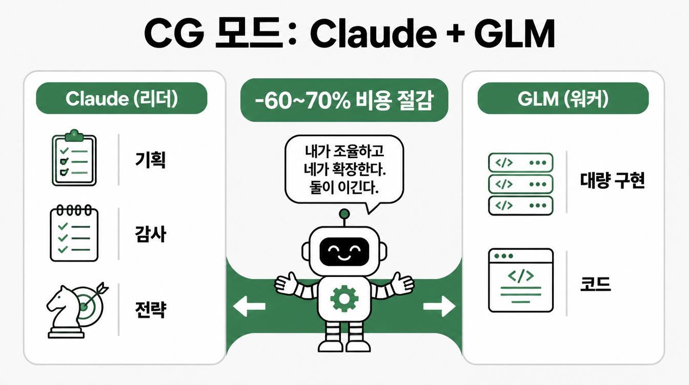
</p>

### 16가지 프로그래밍 언어 동등 지원

Go, Python, TypeScript, JavaScript, Rust, Java, Kotlin, C#, Ruby, PHP, Elixir, C++, Scala, R, Flutter, Swift. 마커 기반 자동 감지로 각 언어의 표준 린트/포맷/테스트 툴체인을 돌린다.

### 자동 품질 게이트

TRUST 5(Tested · Readable · Unified · Secured · Trackable)가 모든 변경에 적용된다. `/moai gate`가 린트 + 포맷 + 타입 + 테스트를 한 번에 돌리고, sync-auditor가 기능·보안·제작·일관성 4차원으로 점수를 매긴다.

### @MX 태그

AI 에이전트끼리 컨텍스트·불변 계약·위험 구역을 주고받는 인라인 코드 어노테이션이다. 팬인이 높거나 복잡하거나 위험한 코드만 골라 표시한다.

### Navigator — 살아 있는 코드베이스 지도

`@NAV:DEC`, `@NAV:SYM`, `@MX:SPEC` 세 토큰 계열을 하나의 주소 가능 그래프(`nav-graph.json`)로 묶는다. 설계 결정·SPEC·코드 심볼이 양방향으로 이어져, 코드를 고칠 때 그 결정의 맥락이 따라온다.

### 세션 핸드오프

`/clear`를 넘어도 작업이 이어진다. 6-블록 paste-ready resume 메시지가 진행 상태를 다음 세션으로 가져가고, 자동 주입 모드에서는 메시지 한 줄로 세션을 재개한다.

### loop / fix — 에러 주도 개발

`/moai loop`가 LSP 진단·AST-grep·린터를 병렬로 훑어 잡힌 문제를 레벨로 묶고 큐가 빌 때까지 돈다. `/moai fix`는 한 패스로 끝내는 단발 수리다.

### review --deep

`/moai review --deep`이 다중 에이전트 적대적 취약점 스캔을 돌린다. OWASP · LLM 보안 · 공급망 · DevSecOps 레퍼런스 스킬이 뒤에 붙는다.

### 4-로케일 문서

한국어·일본어·중국어·영어 문서를 같은 PR에서 다룬다. 번역투를 금지하고 모국어 글말을 따로 두며, 4-로케일 패리티 검사가 빌드 게이트에 묶여 있다.

### moai web 콘솔

<p align="center">
  
</p>

`moai web`이 로컬호스트에만 열리는 콘솔을 띄운다. 화면은 Overview·Kanban·Specs·Monitor·Settings 다섯 개이고, 설정 화면은 Identity·Language·LLM·3rd Party LLM·Workflow·Git & Worktree·Audit·Agents·Report·MCP·Cross-Session 열한 개 탭으로 나뉜다. 프로파일 생성·이름 변경·삭제도 같은 화면에서 한다.

### ref / domain 스킬

ref 스킬 11개(`moai-ref-api-patterns`, `moai-ref-owasp-checklist`, `moai-ref-llm-security`, `moai-ref-react-patterns`, `moai-ref-testing-pyramid`, `moai-ref-ui-polish`, `moai-ref-secops`, `moai-ref-supply-chain`, `moai-ref-seo`, `moai-ref-git-workflow`, `moai-ref-cross-model-audit`)와 domain 스킬 7개(`moai-domain-backend`, `moai-domain-frontend`, `moai-domain-database`, `moai-domain-design-dna`, `moai-domain-html-report`, `moai-domain-humanize`, `moai-domain-svg-infographic`)가 에이전트에 현장 지식을 주입한다.

### 크로스 플랫폼

별도 의존성 없이 macOS·Linux·Windows에서 도는 Go 단일 바이너리다. 훅 시스템이 게이트를 기계적으로 강제하고, 스테이터스라인이 비용과 컨텍스트를 실시간으로 보여준다.

---

## 어떻게 돌아가나요?

### SPEC 3-페이즈 라이프사이클

모든 작업은 plan → run → sync 세 페이즈로 흐른다. Tier S/M/L 크기 분류가 검증 깊이와 PR 라우팅을 정한다. GEARS 형식 요구사항과 인수 기준이 완료를 증거로 판정한다.

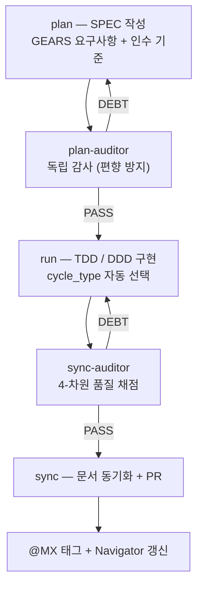
```mermaid
flowchart TD
    P["plan — SPEC 작성<br/>GEARS 요구사항 + 인수 기준"] --> PA["plan-auditor<br/>독립 감사 (편향 방지)"]
    PA -->|PASS| R["run — TDD / DDD 구현<br/>cycle_type 자동 선택"]
    PA -->|DEBT| P
    R --> SA["sync-auditor<br/>4-차원 품질 채점"]
    SA -->|PASS| S["sync — 문서 동기화 + PR"]
    SA -->|DEBT| R
    S --> MX["@MX 태그 + Navigator 갱신"]
```

<p align="center">
  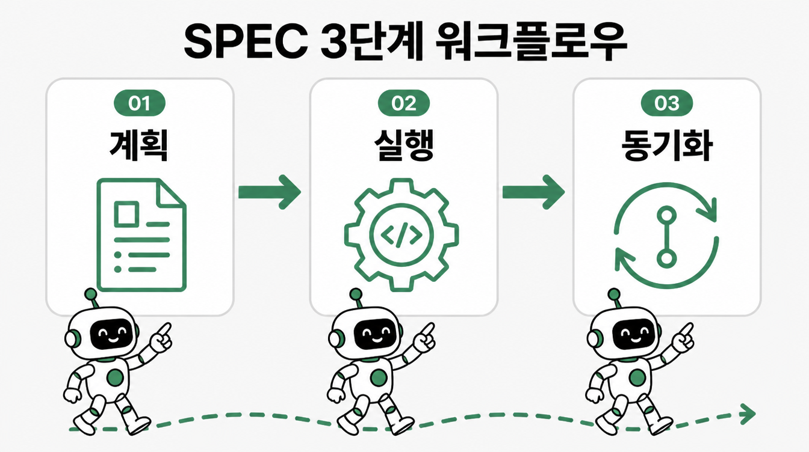
</p>

방법론(TDD/DDD)은 프로젝트 상태가 고른다. `moai init`이 커버리지를 보고 자동 선택한다.

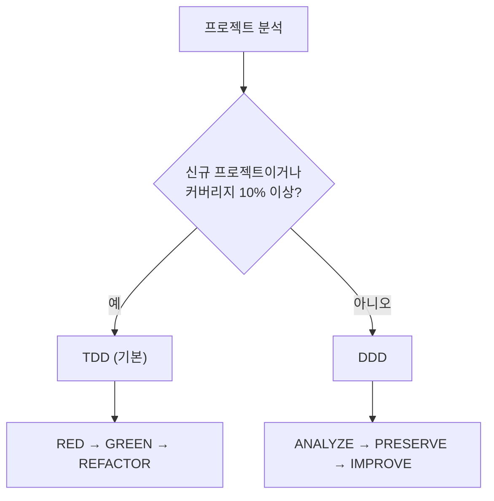
```mermaid
flowchart TD
    A["프로젝트 분석"] --> B{"신규 프로젝트이거나<br/>커버리지 10% 이상?"}
    B -->|"예"| C["TDD (기본)"]
    B -->|"아니오"| D["DDD"]
    C --> F["RED → GREEN → REFACTOR"]
    D --> G["ANALYZE → PRESERVE → IMPROVE"]
```

| 방법론 | 주기 | 대상 |
|---|---|---|
| **TDD** (기본) | RED → GREEN → REFACTOR | 신규 프로젝트·기능 작업 |
| **DDD** | ANALYZE → PRESERVE → IMPROVE | 커버리지 10% 미만의 기존 코드 |

### 12-에이전트 카탈로그

| 분류 | 에이전트 | 비용 | 역할 |
|------|------|------|------|
| **매니저** | manager-spec | 🔴 | plan 단계 SPEC 작성 |
| | manager-develop | 🔴 | run 단계 TDD/DDD/autofix 구현 |
| | manager-docs | 🔵 | sync 단계 문서화 |
| | manager-git | 🩵 | PR 생성·라우팅 |
| | manager-design | 🟠 | 디자인 단계 협업 (Claude Design) |
| | manager-lead | 🔴 | 계층 팀 Tier L 조율 + 칸반·팩토리 리드 세션 배차 (유일한 Agent 보유, 깊이 2 봉인) |
| **평가자** | plan-auditor | 🔴 | 독립 plan 감사 (편향 방지) |
| | sync-auditor | 🔴 | 4차원 품질 채점 (기능성 40 · 보안 25 · 제작 20 · 일관성 15) |
| **빌더** | builder-harness | 🟠 | 프로젝트 전용 에이전트·스킬·커맨드·훅 스캐폴딩 |
| **자문** | super-advisor | 🔵 | 고추론 자문 (E1-E4 에스컬레이션) |
| **스페셜리스트** | e2e-tester | 🟠 | 웹/모바일/데스크톱 E2E 테스트 실행 (CLI 우선) |
| **내장** | Explore | ⚪ | 읽기 전용 코드베이스 탐색 |

비용 색은 기본 `medium` 프로파일의 모델×추론 셀을 따른다 (`moai model profile`으로 확인): 🔴 opus+high · 🟠 opus+medium · 🔵 opus+low · 🩵 sonnet+low · ⚪ 세션 모델 상속 (사용자 추가 에이전트). 프로파일(`high`/`low`)을 바꾸면 배정이 달라진다. 작성과 감사를 처음부터 나눠 맡기니 자기 일을 자기가 채점하는 일이 없다.

열두 개 가운데 열한 개가 moai-adk가 만든 에이전트이고, `Explore`는 Claude Code에 이미 있는 내장 에이전트다. `Explore`는 자기 모델을 따로 갖지 않고 세션 모델을 그대로 물려받아 프로파일 셀이 없다. 그래서 카탈로그는 12개이고, 뒤에 나오는 모델 프로파일 절의 셀 수는 11 × 3 = 33이다 — 두 숫자는 서로 어긋난 것이 아니라 세는 대상이 다르다.

### trust-but-verify — 완료 주장에 증거를 묶기

에이전트가 "테스트가 통과했다"고 보고할 때, 오케스트레이터는 그 주장을 그대로 믿지 않고 직접 검증 일괄을 돌린다. 7개 읽기 전용 검증(테스트·커버리지·서브에이전트 경계·센티널 스캔·CLI 스모크·벤치마크·린트)을 한 턴에 병렬로 돌려 각각의 exit code와 출력을 증거로 남긴다.

검증 주장 무결성(verification-claim integrity) 규칙이 이 흐름을 뒤에서 받친다 — 돌리지 않은 검증을 성공으로 말하면 안 되고, 이전에 잰 값을 새 측정인 척 가져오면 안 되고, 관측하지 못한 것을 빈칸으로 넘기면 안 된다. 5-섹션 보고 형식(주장 · 증거 · baseline 귀속 · 미검증 · 잔여 위험)이 에이전트와 오케스트레이터의 모든 완료 보고에 묶여 있다.

### 검증 비용을 줄이고, 예산 초과 전에 멈춘다

검증은 필요하지만 검증 출력까지 컨텍스트에 앉을 필요는 없다. 장황한 검증 출력은 디스크 파일로 흘려보내고, 컨텍스트에는 exit code와 잘린 꼬리(최대 50줄)만 남긴다. 프롬프트 캐시를 재사용해 (캐시 읽기는 0.1배 비용) 창을 가볍게 유지하고, 컨텍스트 다이어트 `/clear` 전략이 임계(1M 50% / 200K 90%)에서 권고를 낸다.

예산 쪽은 토큰 회로 차단기가 지킨다 — 하드 한도(기본 90%)에서 실행을 중단하고, 진행 상태를 `progress.md`에 저장하며, 붙여넣기만 하면 이어지는 resume 메시지를 낸다. 스테이터스라인이 컨텍스트 사용량·캐시 적중률·레이트리밋 소진을 항상 보여주므로, 초과는 눈에 띈 채로 지나가지 않는다.

### 스테이터스라인 읽기

```
🤖 Opus │ 🧠 xhigh·t │ ♻️ 87% │ 🔅 cc v2.1.212 │ 🗿 v3.1.1 │ ⏳ 2h 34m │ 💬 MoAI
🪫 CW: ████████░░ 88% (⚠️/clear) │ 🔋 5H: ████░░░░░░ 45% (4h 30m) │ 🪫 7D: ████████░░ 82% (Jan 21)
📁 moai-adk-go │ 📡 modu-ai/moai-adk | 🅱️ feat/statusline ↑2 +3 │ 📫 +1 M2 ?0 │ 📋 [run SPEC-AUTH-001-run] │ 💌 PR #1042 (⌥approved)
🏷️ run │ 🔄 TODO: 1 / 3 │ 🔀 2 / 1
```

| 요소 | 의미 |
|------|------|
| 🤖 모델 | 현재 활성 모델 |
| 🧠 effort | 추론 강도 — 확장 추론이 켜져 있으면 `·t` 접미 |
| ♻️ 캐시 적중률 | 프롬프트 캐시 적중률 |
| CW: 컨텍스트 | 컨텍스트 창 사용률 + 2단계 `/clear` 마커 (⚠️ 소프트, 🛑 하드) |
| 5H / 7D | 요금제 사용률 + 초기화 시각 |
| 📁 디렉터리 | 프로젝트 디렉터리 이름 |
| 📡 리포 | GitHub 리포 `owner/name` (PR 아이콘 🔀와 구분) |
| 🅱️ 브랜치 | 현재 브랜치 + `↑`앞섬 `↓`뒤짐 + `+`변경 수 |
| 📫 git 상태 | 사서함 아이콘(📬 스테이지 / 📫 수정 / 📪 추적 안 됨 / 📭 깨끗) + 개수 |
| 📋 작업 | 활성 SPEC 워크플로우 `[커맨드 SPEC-ID-페이즈]` |
| 💌 PR | 활성 GitHub PR 번호 + 리뷰 상태 (`⌥상태`) |
| 🏷️ 세션 라인 | 마지막 줄에 조건부 — 세션 이름 · 👤 에이전트 · 🔄 `TODO: 진행 중 / 대기` 백로그 · 🔀 열린 이슈/PR 수 |

> 자세히: [스테이터스라인 가이드](https://adk.mo.ai.kr/ko/advanced/statusline)

---

## 워크플로우 예시

### 새 기능 만들기 (TDD)

```text
/moai plan "사용자 프로필 이미지 업로드 추가"
/moai run SPEC-PROFILE-001
/moai sync SPEC-PROFILE-001
```

신규 코드나 커버리지가 충분한 코드에는 TDD(RED → GREEN → REFACTOR)가 붙는다. `moai init`이 프로젝트 상태를 감지해 TDD와 DDD 중 하나를 고른다.

### 장시간 돌리기 (goal)

```text
/moai plan "결제 모듈 리팩터링"
/moai run SPEC-PAY-001
/moai goal "go test ./... exits 0 && lint clean, or stop after 20 turns"
```

완료 조건을 선언하면 세션이 조건을 채울 때까지 알아서 일한다. 턴 한도가 기본 30이고 정체 가드가 묶여 있다. 컨텍스트가 임계(1M 50% / 200K 90%)에 닿으면 `/clear`를 권고하고 진행 상태를 `progress.md`에 저장한다.

### 병렬로 돌리기 (worktree)

```bash
moai cc -w feature-auth        # auth 작업 트리 열기
moai cc -w feature-billing --spawn   # billing은 새 창에서, 현재 세션 유지
```

```text
# auth 트리 안에서
/moai run SPEC-AUTH-001

# billing 트리 안에서
/moai run SPEC-BILL-001
```

SPEC마다 독립된 작업 트리를 주어 두 에이전트가 서로 밟지 않게 한다. 브랜치 상태 가드가 주 체크아웃에서 실수로 브랜치를 바꾸는 것을 막는다.

### 비용 줄이기 (CG 모드)

```bash
moai glm sk-your-glm-api-key   # 키 한 번 저장
moai cg                        # Claude 리더 + GLM 워커 하이브리드 진입
```

```text
/moai run SPEC-DATA-001        # 구현 중심 작업 → GLM 워커가 대량 구현 담당
```

CG 모드는 Claude 리더가 전략·계획·감사를 맡고 GLM 워커가 대량 구현을 맡는다. 구현 중심 작업에서 60–70% 비용을 줄인다. 하네스·SPEC 워크플로우·품질 게이트는 세 모드 모두에서 동일하게 돈다.

### 버그 자동으로 잡기 (loop)

```text
/moai loop
```

LSP 진단·AST-grep·린터를 병렬로 훑어 잡힌 문제를 레벨로 묶고 큐가 빌 때까지 돈다. 단발 문제는 `/moai fix`로 한 패스에 끝낸다.

---

## 설정과 프로파일

### `.moai/config/sections/`

프로젝트 설정은 YAML 단면 파일로 나뉜다. `moai init`이 깔아 주는 단면은 모두 33개이고, 그 가운데 자주 손대는 것은 아래 여섯 개다.

| 단면 | 역할 |
|---|---|
| `language.yaml` | 사용자 이름 · 대화 언어 · 코드 주석 언어 · 커밋 메시지 언어 |
| `quality.yaml` | 품질 게이트 · 개발 모드(TDD/DDD) · 커버리지 |
| `harness.yaml` | 하네스 깊이(minimal · standard · thorough) · 자동 감지 |
| `workflow.yaml` | 워크플로우 동작 |
| `lsp.yaml` | LSP 게이트 임계값 (SSOT) |
| `user.yaml` | 사용자 정보 |

v3.1.1에서 손댈 만한 단면이 넷 늘었다.

| 단면 | 역할 |
|---|---|
| `crosssession.yaml` | 세션 간 메시지 취급. `inbound`(빈 값·`accept`·`hold`·`refuse`), `isolate_machines`(이 머신 밖으로 나가는 메시지에 승인을 요구할지), `dialog_expiry`(보류된 메시지의 승인 대화 기한) |
| `cache.yaml` | 프롬프트 캐시 설정 파일. `session_ttl`(`1h`·`5m`·`off`)과 `spec_ttl`, 캐시할 최소 조각 크기를 담고 `moai web` 설정 편집기를 그대로 오간다. 다만 지금은 이 값을 읽는 코드가 없어, 고쳐도 동작은 달라지지 않는다 |
| `state.yaml` | `home_retention_days` — `moai clean --home`이 며칠 지난 것부터 치울지. HOME 티어(`~/.moai/config/sections/state.yaml`)에서만 읽고, 기본은 30일, `0`을 주면 홈 정리를 끈다 |
| `statusline.yaml` | 기존 테마·세그먼트 토글에 `forge` 키가 붙었다. `github`·`gitlab`·`none` 중 하나로, 스테이터스라인이 열린 작업을 어느 호스팅에서 셀지 정한다. 비워 두면 origin 리모트 호스트로 판단하므로, 자체 호스팅 인스턴스에서는 직접 적어 준다 |

`gate.yaml`의 `ast_grep_gate.rules_dir`은 새 키가 아니라 **기본값이 바뀐 키**다. 빈 문자열이던 기본값이 `.moai/config/astgrep-rules`가 됐고, `moai init`/`moai update`가 그 자리에 번들 룰셋을 깐다. 코드 쪽 폴백 경로는 사라졌으니 이제 이 키가 룰셋 위치의 유일한 출처다 — 룰을 다른 곳으로 옮겼다면 이 값도 함께 고쳐야 게이트가 룰을 찾는다.

환경변수가 파일 값을 덮어쓴다. 자세한 우선순위와 전체 단면 목록은 [CLI 레퍼런스](https://adk.mo.ai.kr/ko/cli-reference)를 본다.

### 모델 프로파일 — high / medium / low

`moai model profile`이 11 에이전트 × 3개 프로파일 = 33셀의 `{model, effort}` 짝을 해석한다.

<p align="center">
  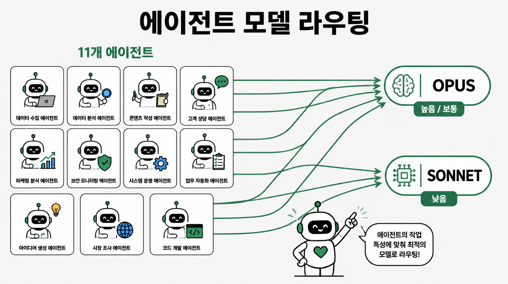
</p>

| 프로파일 | 성격 | 언제 |
|---|---|---|
| **high** | Opus 중심, 높은 추론 | 복잡한 계획 · 보안 감사 · 어려운 디버그 |
| **medium** (기본) | 균형 | 일반적인 SPEC |
| **low** | Sonnet + 낮은 추론 | 기계적 반복 · 문서 · 단발 작업 |

배정은 작업 단계(plan / run / sync)와 SPEC 크기(Tier S / M / L)를 따라간다 — 깊은 추론이 필요한 계획 단계에 추론이 센 모델, 기계적 반복이 이어지는 구현 단계에 가벼운 모델. No-Haiku 3-티어 정책으로 단발·입력 지배 작업은 Sonnet low, 멀티턴 에이전틱 작업은 전부 Opus가 맡는다.

### settings.json / settings.local.json 분리

| 파일 | 역할 | 템플릿 |
|---|---|---|
| `.claude/settings.json` | 템플릿에서 렌더 — 프로젝트 공유 설정 | 포함 |
| `.claude/settings.local.json` | 런타임 관리 — 머신별 값(tmux pane ID · API 토큰 · 절대 경로) | **절대 포함 않음** |

`settings.local.json`은 `moai glm`, `moai cc`, `moai cg`가 런타임에 고치고 SessionStart 훅이 환경을 채운다. 실수로 커밋했으면 `git rm --cached .claude/settings.local.json`으로 뺀다.

---

## 어디서나 쓸 수 있어요

### 16가지 프로그래밍 언어 동등 지원

| | | | |
|---|---|---|---|
| Go | Python | TypeScript | JavaScript |
| Rust | Java | Kotlin | C# |
| Ruby | PHP | Elixir | C++ |
| Scala | R | Flutter | Swift |

각 언어를 프로젝트 마커로 자동 감지해서 그 언어의 표준 린트/포맷/테스트 툴체인을 돌린다. 설치되지 않은 도구는 조용히 건너뛴다. Dart/Flutter의 정식 이름은 "flutter"다. 어느 하나가 우대를 받지 않는다.

### 4-로케일 문서

| 로케일 | 사이트 |
|---|---|
| 한국어 | adk.mo.ai.kr/ko |
| English | adk.mo.ai.kr/en |
| 日本語 | adk.mo.ai.kr/ja |
| 中文 | adk.mo.ai.kr/zh |

네 로케일을 같은 PR에서 다루고 4-로케일 패리티 검사가 빌드 게이트에 묶여 있다. 번역투를 금지하고 모국어 글말을 따로 둔다.

### 운영체제

| 플랫폼 | 상태 |
|---|---|
| macOS | 완전 지원 (Terminal, iTerm2) |
| Linux | 완전 지원 (Bash, Zsh) |
| Windows | WSL 권장, PowerShell 7.x+ 지원, 네이티브 cmd.exe 미지원 |

### Claude + GLM

z.ai GLM을 Claude Code의 대체 백엔드로 쓴다. 환경변수만 바꾸면 코드는 그대로다. 세 실행 모드가 있다.

| 커맨드 | 리더 | 워커 | tmux | 비용 절감 |
|---|---|---|---|---|
| `moai cc` | Claude | Claude | 필요 없음 | — |
| `moai glm` | GLM | GLM | 권장 | 약 70% |
| `moai cg` | Claude | GLM | 필수 | 약 60% |

GLM Coding Plan은 월 $10부터다. glm-5.3, glm-4.7, glm-4.5-air와 무료 모델(GLM-4.7-Flash, GLM-4.5-Flash)을 쓸 수 있다.

Claude의 각 티어는 `ANTHROPIC_DEFAULT_*_MODEL` 환경변수를 통해 GLM 모델로 매핑된다:

| Claude 티어 | GLM 모델 | 컨텍스트 |
|---|---|---|
| Opus | glm-5.3 | 1M |
| Sonnet | glm-5.3 | 1M |
| Haiku | glm-5.3 | 1M |
| Fable | glm-5.3 | 1M |

> 자세히: [Multi-LLM 가이드](https://adk.mo.ai.kr/ko/multi-llm) · [z.ai 요금제](https://docs.z.ai/guides/overview/pricing)

---

## 문서와 학습

### 공식 문서 — adk.mo.ai.kr

[adk.mo.ai.kr](https://adk.mo.ai.kr) 온라인 문서는 12개 섹션으로 나뉜다.

| 섹션 | 설명 |
|---|---|
| [시작하기](https://adk.mo.ai.kr/ko/getting-started) | 소개 · 설치 · Windows 가이드 · init 마법사 · 퀵스타트 · CLI 개요 · FAQ |
| [핵심 개념](https://adk.mo.ai.kr/ko/core-concepts) | 정체성 · 컨스티튜션 · 하네스 엔지니어링 · SPEC 기반 개발 · DDD · TRUST 5 |
| [워크플로우 커맨드](https://adk.mo.ai.kr/ko/workflow-commands) | `plan` · `run` · `sync` — SPEC 파이프라인 주축 |
| [유틸리티 커맨드](https://adk.mo.ai.kr/ko/utility-commands) | `fix` · `loop` · `gate` · `review` · `clean` · `codemaps` · `e2e` · `feedback` · `goal` · `todo` |
| [CLI 레퍼런스](https://adk.mo.ai.kr/ko/cli-reference) | 터미널 `moai` 바이너리의 모든 커맨드 (전체 49개) |
| [Claude Code 가이드](https://adk.mo.ai.kr/ko/claude-code) | Claude Code 통합 — 기초 · 컨텍스트/메모리 · 에이전틱 · 확장성 |
| [Multi-LLM](https://adk.mo.ai.kr/ko/multi-llm) | CG 모드와 모델 정책 |
| [비용 최적화](https://adk.mo.ai.kr/ko/cost-optimization) | 프롬프트 캐싱 전략과 토큰 비용 절감 |
| [가이드](https://adk.mo.ai.kr/ko/guides) | CI 자율화 · multi-LLM CI 등 실전 운영 레시피 |
| [Git Worktree](https://adk.mo.ai.kr/ko/worktree) | 병렬 SPEC 개발을 위한 worktree 가이드 |
| [Advanced](https://adk.mo.ai.kr/ko/advanced) | 토크노믹스 · 토큰 예산 · 스테이터스라인 · settings.json · 훅 · @MX 태그 · 스킬 · Harness v4 Builder · 자가 진화 · 결정 메모리 |
| [기여하기](https://adk.mo.ai.kr/ko/contributing) | 오픈소스 기여 가이드 |

### 도서

[**클로드 코드로 시작하는 실전 에이전틱 코딩**](https://adk.mo.ai.kr/book) — moai-adk 저자가 쓴 실전 하네스 엔지니어링 가이드. [book.mo.ai.kr](https://book.mo.ai.kr)

### CLI 명령표 (자주 쓰는 17개)

| 커맨드 | 설명 |
|---|---|
| `moai init` | 대화형 프로젝트 설정 (언어/프레임워크/방법론 자동 감지) |
| `moai doctor` | 시스템 상태 진단과 환경 검증 — Home Disk Usage 항목이 `~/.moai`가 얼마나 불었는지 권고로 알려준다 |
| `moai status` | 프로젝트 상태 요약 (Git 브랜치, 품질 지표) |
| `moai update` | 최신 버전으로 업데이트 (삭제 전 백업 · 자동 롤백 지원) |
| `moai graph <build\|query>` | 코드베이스 그래프(edges.jsonl) 생성·조회 — 호출자 찾기, 폭발 반경, 마일스톤 교차검사 |
| `moai cc` / `moai glm` / `moai cg` | Claude 전용 / GLM 전용 / 하이브리드 세션 |
| `moai worktree <sync\|done\|remove\|clean\|recover\|snapshot\|verify\|restore>` | Git worktree 유지 관리 (워크트리 진입은 런처의 몫) |
| `moai session <list\|register\|current>` | 멀티 세션 조율 |
| `moai spec <audit\|archive\|lint\|list\|new>` | SPEC 라이프사이클 도구 |
| `moai goal <arm\|status\|clear>` | Goal 엔진 CLI |
| `moai harness <status\|apply\|rollback\|disable>` | 하네스 학습 라이프사이클 |
| `moai handoff <save\|list>` | 세션 핸드오프 기록 |
| `moai preference <list\|decay-scan\|toggle>` | 결정 메모리 관리 |
| `moai memory <doctor\|archive>` | 에이전트 메모리 점검과 오래된 항목 보관 |
| `moai tokens record` | 풀별 토큰 사용 원장 기록 |
| `moai clean [--home]` | 오래된 실행 산출물 정리. `--home`을 붙이면 `~/.moai`를 허용목록 범위 안에서 치운다. 기본은 dry-run이고 `--force`를 줘야 실제로 지운다 |
| `moai web` | 웹 콘솔 — 5개 화면(Overview · Kanban · Specs · Monitor · Settings), 11-탭 설정 |

> 전체 49개 커맨드: [CLI 레퍼런스](https://adk.mo.ai.kr/ko/cli-reference)

### ref / domain 스킬

**ref (현장 지식) 11개**: `moai-ref-api-patterns`, `moai-ref-owasp-checklist`, `moai-ref-llm-security`, `moai-ref-react-patterns`, `moai-ref-testing-pyramid`, `moai-ref-ui-polish`, `moai-ref-secops`, `moai-ref-supply-chain`, `moai-ref-seo`, `moai-ref-git-workflow`, `moai-ref-cross-model-audit`

**domain (전문 영역) 7개**: `moai-domain-backend`, `moai-domain-frontend`, `moai-domain-database`, `moai-domain-design-dna`, `moai-domain-html-report`, `moai-domain-humanize`, `moai-domain-svg-infographic`

`moai-domain-design-dna`는 v3.1.1에 새로 들어왔다. 스크린샷이든 이미지 묶음이든 살아 있는 URL이든 참고할 디자인 하나를 받아 색·간격·모서리·타이포 같은 잴 수 있는 값과 그 디자인의 결, 특수 렌더링 효과까지 Design DNA JSON 한 벌로 역추출한다. 그 JSON을 다시 넣으면 같은 결을 지닌 새 산출물을 만든다 — "이 화면처럼 만들어 줘"를 말로 옮기지 않고 값으로 옮기는 경로다.

### CHANGELOG

최근 변경은 [CHANGELOG.md](./CHANGELOG.md)를 본다.

### 코드 품질 요구사항

모든 기여는 TRUST 5 게이트를 지난다 — 85% 이상 커버리지 · 린트 오류 0 · 타입 오류 0 · Conventional commits. 기존 코드는 특성화 테스트로 동작을 고정한 뒤 점진 개선(DDD), 신규 코드는 RED → GREEN → REFACTOR(TDD).

---

## 자주 묻는 질문

### 모든 함수에 @MX 태그가 없는 이유는?

정상이다. 태그는 팬인이 높거나, 복잡하거나, 위험한 코드에만 붙는다. 어느 프로젝트든 대부분의 코드는 태그 임계에 닿지 않으며, 태그 없는 파일은 결함이 아니다.

### 스테이터스라인의 버전 표시는 무슨 뜻인가?

```
🗿 v3.1.0 ⬆️ v3.1.1
```

앞의 값이 현재 설치된 moai-adk 버전이고, 화살표는 올릴 수 있는 업데이트가 있다는 뜻이다. `moai update`를 실행하면 사라진다.

### GLM 없이 Claude만 쓸 수 있나?

된다. `moai cc`가 Claude 전용 세션을 띄운다. CG 모드(`moai cg`, Claude 리더 + GLM 워커)와 GLM 전용(`moai glm`)은 비용 절감 옵션이고, 하네스·SPEC 워크플로우·품질 게이트는 세 모드 모두에서 동일하게 돈다.

### 기존 프로젝트에서도 쓸 수 있나?

된다. `moai init`이 프로젝트 상태를 감지해 방법론을 고른다 — 커버리지 10% 미만의 기존 코드에는 DDD(특성화 테스트로 동작을 고정한 뒤 점진 개선), 신규·잘 테스트된 코드에는 TDD.

---

## 함께 만들어요

### 기여하기

기여는 언제든 환영한다. 자세한 절차는 [CONTRIBUTING.md](CONTRIBUTING.md)에 정리해 두었다.

1. 리포지토리 포크
2. 기능 브랜치 생성: `git checkout -b feature/my-feature`
3. 테스트 작성 — 신규 코드는 TDD, 기존 코드는 특성화 테스트
4. 테스트 · 린트 · 포맷 통과 확인: `make test` · `make lint` · `make fmt`
5. Conventional commit 메시지로 커밋하고 풀 리퀘스트 열기

**코드 품질 요구사항**: 85% 이상 커버리지 · 린트 오류 0 · 타입 오류 0 · Conventional commits

### 피드백

Claude Code 안에서는 `/moai feedback`으로 버그 리포트와 기능 요청을 GitHub 이슈로 바로 올린다. 터미널에서는 [GitHub Issues](https://github.com/modu-ai/moai-adk/issues)를 쓴다.

### 커뮤니티

- [Discord](https://discord.gg/Z7E7Mdc5aN) — 실시간 토론과 팁
- [GitHub Issues](https://github.com/modu-ai/moai-adk/issues) — 버그 리포트 · 기능 요청

### 라이선스

[Apache License 2.0](./LICENSE) — 자세한 내용은 LICENSE 파일을 본다.

---

## 스타 히스토리

<a href="https://www.star-history.com/?type=date&repos=modu-ai%2Fmoai-adk">
 <picture>
   <source media="(prefers-color-scheme: dark)" srcset="https://api.star-history.com/chart?repos=modu-ai/moai-adk&type=date&theme=dark&legend=top-left&sealed_token=9wFuBO5GMKxHZsaknxlIW3oypXLJlyW1qqq8T--aTRyfp6j9EK9KTR2vJvyAG8AKSs3Lindw7LUt-m-I6ysz9BoV6kdtrKlJYTViQAYR56A_3ie4ZVOqIw" />
   <source media="(prefers-color-scheme: light)" srcset="https://api.star-history.com/chart?repos=modu-ai/moai-adk&type=date&legend=top-left&sealed_token=9wFuBO5GMKxHZsaknxlIW3oypXLJlyW1qqq8T--aTRyfp6j9EK9KTR2vJvyAG8AKSs3Lindw7LUt-m-I6ysz9BoV6kdtrKlJYTViQAYR56A_3ie4ZVOqIw" />
   
 </picture>
</a>

<p align="center">
  <sub>MoAI-ADK 팀이 만들었습니다 · <a href="https://adk.mo.ai.kr">adk.mo.ai.kr</a></sub>
</p>
