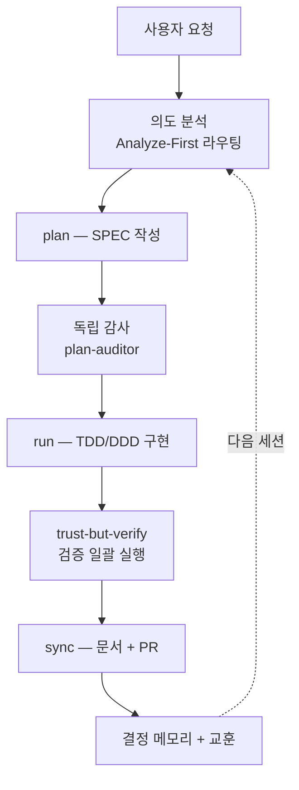
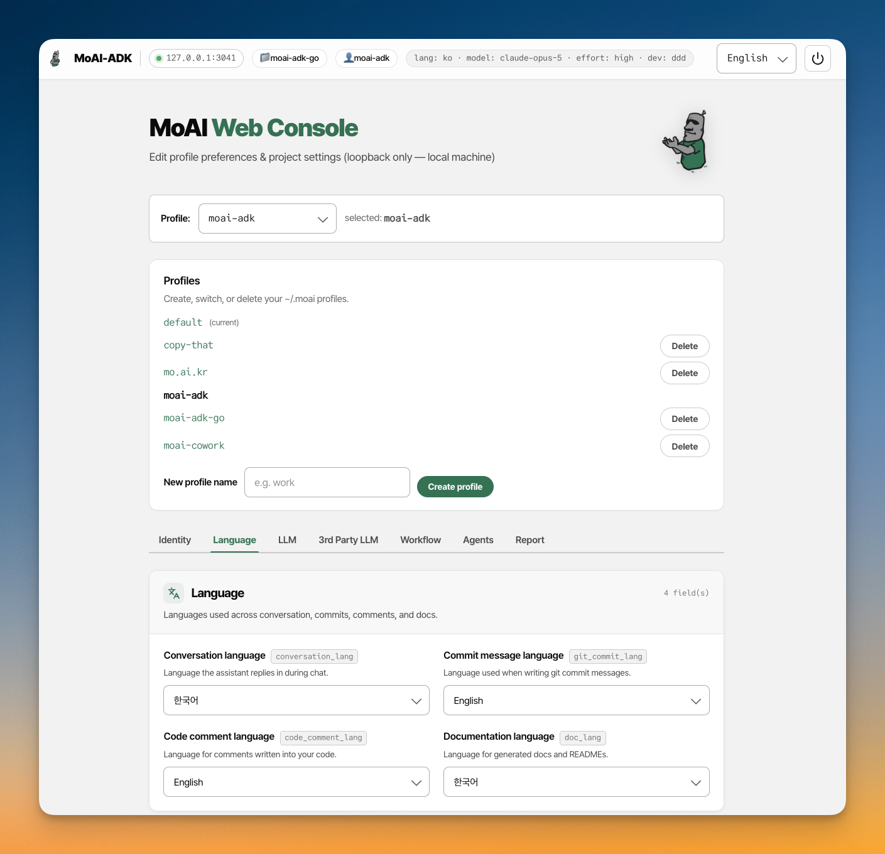
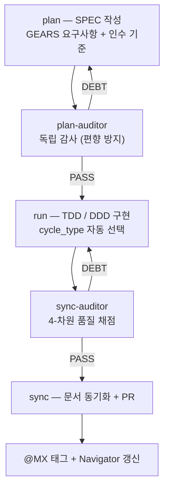

<p align="center">
  
</p>

<h1 align="center">MoAI-ADK</h1>

<p align="center">
  <strong>검증-구동 에이전트 오케스트레이션 하네스 — Claude Code가 쓴 코드를 믿을 수 있게 만드는 구조</strong>
</p>

<p align="center">
  <a href="./README.md">English</a> ·
  한국어 ·
  <a href="./README.ja.md">日本語</a> ·
  <a href="./README.zh.md">中文</a>
</p>

<p align="center">
  <a href="https://github.com/modu-ai/moai-adk/actions/workflows/ci.yml"></a>
  <a href="https://github.com/modu-ai/moai-adk/actions/workflows/codeql.yml"></a>
  <a href="https://codecov.io/gh/modu-ai/moai-adk"></a>
  <br>
  <a href="https://go.dev/"></a>
  <a href="https://github.com/modu-ai/moai-adk/releases"></a>
  <a href="./LICENSE"></a>
</p>

<p align="center">
  <a href="https://adk.mo.ai.kr"><strong>공식 문서</strong></a> ·
  <a href="https://adk.mo.ai.kr/book">도서: 클로드 코드로 시작하는 실전 에이전틱 코딩</a> ·
  <a href="https://discord.gg/Z7E7Mdc5aN">Discord</a>
</p>

---

## 왜 moai-adk인가요?

에이전트가 코드를 쓰는 시대가 왔지만, 에이전트가 내놓은 결과를 그대로 믿을 수는 없다. "테스트가 통과했습니다"라는 말이 진짜 테스트를 돌린 결과인지, 그냥 에이전트의 추측인지를 구분하는 것이 처음부터 가장 큰 문제다. moai-adk는 바로 그 지점에서 출발한다 — **검증하지 않은 완료 선언을 시스템 차원에서 금지**하고, 모든 완료 주장에 실제로 돌린 명령과 그 출력을 증거로 묶는다.

moai-adk는 Claude Code를 바깥에서 감싸는 하네스다. Claude Code를 대체하지 않고, 사용자가 직접 챙겨야 했던 부분 — 어느 모델을 쓸지, 얼마나 깊이 추론할지, 결과를 어떻게 검증할지, 세션이 끊겼을 때 어떻게 이을지, 병렬로 돌릴 때 서로 밟지 않게 어떻게 갈라놓을지 — 을 구조로 떠맡는다. 검증 무결성, SPEC 라이프사이클, 진짜 경계가 있는 자율 실행, 살아 있는 코드베이스 내비게이터, 자가 개선 루프, 병렬 안전 구조. 이 여섯 가지가 moai-adk의 정체성을 이룬다.

### 여덟 가지 차별점

| 차별점 | 설명 |
|---|---|
| **거짓 검증 없음** | "테스트가 통과했다"는 주장은 반드시 실제로 돌린 명령과 그 출력에 귀속된다. 돌리지 않은 검증을 성공으로 말하는 것을 시스템이 금지한다 — 검증 주장 무결성(verification-claim integrity)이 모든 에이전트와 오케스트레이터 표면에 묶여 있다. |
| **자율 + 진짜 경계** | `/moai goal`이 완료 조건을 선언하면 세션이 조건을 채울 때까지 알아서 일한다. 다만 턴 한도(기본 30), 정체 가드, 벽시계 예산, 사전 승인 게이트라는 네 개의 하드 경계가 묶여 있어 무한 루프에 빠지지 않는다. |
| **병렬 안전** | SPEC마다 독립된 작업 트리를 주고, 브랜치 상태 가드가 주 체크아웃에서 실수로 브랜치를 바꾸는 것을 막으며, 쓰기 에이전트를 띄우기 전에 원격과의 간격을 검사한다. 두 개의 쓰기 에이전트가 동시에 돌지 않는다. |
| **장기 지속** | `/clear`를 넘어도 작업이 이어진다. 진행 상태는 `progress.md`에, 핸드오프 메시지는 메모리에, 라우팅 결정은 결정 메모리에 남는다. 다음 세션은 맨땅이 아니라 지난 세션이 배운 지점에서 시작한다. |
| **비용 효율** | 작업 단계와 SPEC 크기에 맞춰 모델과 추론 깊이를 선언적으로 배정한다. Claude 리더 + GLM 워커의 CG 모드는 구현 중심 작업에서 60–70% 비용을 줄인다. 프롬프트 캐시를 재사용하고 긴 출력은 디스크로 흘려보내 컨텍스트를 가볍게 유지한다. |
| **16가지 프로그래밍 언어 동등 지원** | Go, Python, TypeScript, JavaScript, Rust, Java, Kotlin, C#, Ruby, PHP, Elixir, C++, Scala, R, Flutter, Swift — 16가지 프로그래밍 언어를 한 집단으로 묶어 마커 기반 자동 감지로 처리한다. 어느 하나가 우대를 받지 않는다. |
| **자가 개선** | 되풀이되는 실패 패턴을 관측하면 규칙 변경 제안으로 올린다. 몰래 적용하지 않고 승인을 받아 반영한다. 라우팅 결정과 게이트 증거가 결정 메모리에 쌓여 다음 실행의 재료가 된다. |
| **모국어 친화** | 한국어·일본어·중국어·영어 네 로케일을 같은 PR에서 다루고, 번역투를 금지하며 모국어 글말을 따로 둔다. 모국어를 쓰는 사용자에게 영어를 강제하지 않는다. |

### 무엇이 다른가

| | Claude Code 단독 | 일반 하네스 | **moai-adk** |
|---|---|---|---|
| 완료 주장의 증거 귀속 | 사용자가 직접 확인 | 보통 없음 | 시스템이 강제 (5-섹션 증거 보고 형식) |
| SPEC 라이프사이클 | 없음 | 제한적 | plan→run→sync 3-페이즈 + Tier S/M/L |
| 자율 루프의 하드 경계 | 해당 없음 | 대개 turn cap만 | 턴 한도 + 정체 가드 + 벽시계 + 승인 게이트 |
| 병렬 작업 격리 | 수동 | 제한적 | worktree + 브랜치 가드 + 사전 동기화 검사 |
| 세션 연속성 | `/clear` 후 끊김 | 제한적 | 핸드오프 + 메모리 + 진행 파일 |
| 16가지 프로그래밍 언어 동등 처리 | 해당 없음 | 해당 없음 | 마커 자동 감지 + 언어별 툴체인 |
| 자가 개선 루프 | 없음 | 제한적 | 실패 관측 → 규칙 승격 (승인제) |


```mermaid
flowchart TD
    User["사용자 요청"] --> Analyze["의도 분석<br/>Analyze-First 라우팅"]
    Analyze --> Plan["plan — SPEC 작성"]
    Plan --> Audit["독립 감사<br/>plan-auditor"]
    Audit --> Run["run — TDD/DDD 구현"]
    Run --> Verify["trust-but-verify<br/>검증 일괄 실행"]
    Verify --> Sync["sync — 문서 + PR"]
    Sync --> Learn["결정 메모리 + 교훈"]
    Learn -.다음 세션.-> Analyze
```

---

## 빠르게 시작

### 설치

#### macOS / Linux / WSL

```bash
curl -fsSL https://adk.mo.ai.kr/install.sh | bash
```

#### Windows (PowerShell 7.x+)

```powershell
irm https://adk.mo.ai.kr/install.ps1 | iex
```

#### 소스에서 빌드 (Go 1.26+)

```bash
git clone https://github.com/modu-ai/moai-adk.git
cd moai-adk && make build
```

이미 설치했다면 `moai update`로 최신 버전으로 올린다.

> 💡 **비용을 줄이려면 — z.ai GLM 추천**: [이 링크](https://z.ai/subscribe?ic=1NDV03BGWU)로 z.ai에 가입하면 일정 토큰을 보너스로 받습니다. 이 링크는 moai-adk 오픈소스 개발을 후원하는 경로이기도 합니다. 무료 모델(GLM-4.7-Flash, GLM-4.5-Flash)도 있으니 [z.ai 요금제](https://docs.z.ai/guides/overview/pricing)를 참고하세요.

### 프로젝트 초기화

```bash
moai init my-project
cd my-project
```

대화형 마법사가 언어·프레임워크·방법론을 자동으로 감지하고, 모델 정책을 고른 뒤 Claude Code 통합 파일까지 만든다.

### 첫 워크플로우

```bash
claude        # 또는 moai cc — 프로젝트 안에서 Claude Code 실행
```

```text
/moai plan "JWT 로그인 추가"      # SPEC 작성
/moai run SPEC-AUTH-001           # TDD/DDD 구현
/moai sync SPEC-AUTH-001          # 문서 동기화 + PR 생성
```

자연어로 던져도 된다. `/moai "로그인 버그 잡아줘"`처럼 쓰면 의도 분석(Analyze-First 라우팅)이 요청을 읽고 알맞은 워크플로우로 넘긴다.

### 요구사항

| 플랫폼 | 지원 환경 | 비고 |
|---|---|---|
| macOS | Terminal, iTerm2 | 완전 지원 |
| Linux | Bash, Zsh | 완전 지원 |
| Windows | **WSL 권장**, PowerShell 7.x+ | 네이티브 cmd.exe 미지원 |

- **Git** — 모든 플랫폼에서 필수
- **Claude Code** — moai-adk는 Claude Code를 위한 하네스다
- **권장**: `gh` CLI(PR 자동화), `tmux`(CG 모드), 사용 언어의 린트/테스트 툴체인(예: `golangci-lint`)

---

## 핵심 기능

### 단일 진입점 `/moai`

자연어와 15개 서브커맨드가 같은 파이프라인으로 들어간다. `/moai plan`, `/moai run`, `/moai sync`가 SPEC 파이프라인의 주축이고, `goal`, `loop`, `fix`, `review`, `gate`, `clean`, `codemaps`, `e2e`, `mx`, `feedback`, `project`, `harness`가 주변을 채운다.

### goal 엔진 — 진짜 경계가 있는 자율 루프

완료 조건을 선언하면 세션이 조건을 채울 때까지 알아서 일한다. 턴 한도, 정체 가드, 벽시계 예산, 사전 승인 게이트가 묶여 있어 무한 루프에 빠지지 않는다. 기계적 조건(명령 종료 코드)과 모델 조건(대화 기록의 주장)을 같이 쓴다.

### 병렬 worktree

SPEC마다 독립된 작업 트리를 준다. `moai cc -w <이름>`으로 진입하고, `--spawn`을 붙이면 현재 세션을 유지한 채 새 창에서 연다. 브랜치 상태 가드가 주 체크아웃에서 실수로 브랜치를 바꾸는 것을 막는다.

### CG 모드 — Claude 리더 + GLM 워커

Claude가 전략·계획·감사를 맡고 GLM이 대량 구현을 맡는다. tmux 세션 단위 환경 격리로 둘을 잇고, 구현 중심 작업에서 60–70% 비용을 줄인다.

### 16가지 프로그래밍 언어 동등 지원

Go, Python, TypeScript, JavaScript, Rust, Java, Kotlin, C#, Ruby, PHP, Elixir, C++, Scala, R, Flutter, Swift. 마커 기반 자동 감지로 각 언어의 표준 린트/포맷/테스트 툴체인을 돌린다.

### 자동 품질 게이트

TRUST 5(Tested · Readable · Unified · Secured · Trackable)가 모든 변경에 적용된다. `/moai gate`가 린트 + 포맷 + 타입 + 테스트를 한 번에 돌리고, sync-auditor가 기능·보안·제작·일관성 4차원으로 점수를 매긴다.

### @MX 태그

AI 에이전트끼리 컨텍스트·불변 계약·위험 구역을 주고받는 인라인 코드 어노테이션이다. 팬인이 높거나 복잡하거나 위험한 코드만 골라 표시한다.

### Navigator — 살아 있는 코드베이스 지도

`@NAV:DEC`, `@NAV:SYM`, `@MX:SPEC` 세 토큰族을 하나의 주소 가능 그래프(`nav-graph.json`)로 묶는다. 설계 결정·SPEC·코드 심볼이 양방향으로 이어져, 코드를 고칠 때 그 결정의 맥락이 따라온다.

### 세션 핸드오프

`/clear`를 넘어도 작업이 이어진다. 6-블록 paste-ready resume 메시지가 진행 상태를 다음 세션으로 가져가고, 자동 주입 모드에서는 메시지 한 줄로 세션을 재개한다.

### loop / fix — 에러 주도 개발

`/moai loop`가 LSP 진단·AST-grep·린터를 병렬로 훑어 잡힌 문제를 레벨로 묶고 큐가 빌 때까지 돈다. `/moai fix`는 한 패스로 끝내는 단발 수리다.

### review --deep

`/moai review --deep`이 다중 에이전트 적대적 취약점 스캔을 돌린다. OWASP · LLM 보안 · 공급망 · DevSecOps 레퍼런스 스킬이 뒤에 붙는다.

### 4-로케일 문서

한국어·일본어·중국어·영어 문서를 같은 PR에서 다룬다. 번역투를 금지하고 모국어 글말을 따로 두며, 4-로케일 패리티 검사가 빌드 게이트에 묶여 있다.

### moai web 콘솔

<p align="center">
  
</p>

`moai web`이 브라우저에서 쓰는 6-탭 로컬 설정 콘솔을 띄운다 — 에이전트·스킬·훅·게이트·프로파일·언어 설정을 터미널 밖에서 편집한다.

### ref / domain 스킬

`moai-ref-api-patterns`, `moai-ref-owasp-checklist`, `moai-ref-llm-security`, `moai-ref-react-patterns`, `moai-ref-testing-pyramid`, `moai-ref-ui-polish`, `moai-ref-secops`, `moai-ref-supply-chain`, `moai-ref-seo`, `moai-ref-git-workflow`와 `moai-domain-backend`, `moai-domain-frontend`, `moai-domain-database`, `moai-domain-testing`, `moai-domain-uiux`가 에이전트에 현장 지식을 주입한다.

### 크로스 플랫폼

별도 의존성 없이 macOS·Linux·Windows에서 도는 Go 단일 바이너리다. 훅 시스템이 게이트를 기계적으로 강제하고, 스테이터스라인이 비용과 컨텍스트를 실시간으로 보여준다.

---

## 어떻게 돌아가나요?

### SPEC 3-페이즈 라이프사이클

모든 작업은 plan → run → sync 세 페이즈로 흐른다. Tier S/M/L 크기 분류가 검증 깊이와 PR 라우팅을 정한다.


```mermaid
flowchart TD
    P["plan — SPEC 작성<br/>GEARS 요구사항 + 인수 기준"] --> PA["plan-auditor<br/>독립 감사 (편향 방지)"]
    PA -->|PASS| R["run — TDD / DDD 구현<br/>cycle_type 자동 선택"]
    PA -->|DEBT| P
    R --> SA["sync-auditor<br/>4-차원 품질 채점"]
    SA -->|PASS| S["sync — 문서 동기화 + PR"]
    SA -->|DEBT| R
    S --> MX["@MX 태그 + Navigator 갱신"]
```

### trust-but-verify — 완료 주장에 증거를 묶기

에이전트가 "테스트가 통과했다"고 보고할 때, 오케스트레이터는 그 주장을 그대로 믿지 않고 직접 검증 일괄을 돌린다. 7개 읽기 전용 검증(테스트·커버리지·서브에이전트 경계·센티넬 스캔·CLI 스모크·벤치마크·린트)을 한 턴에 병렬로 돌려 각각의 exit code와 출력을 증거로 남긴다.

검증 주장 무결성(verification-claim integrity) 규칙이 이 흐름을 뒤에서 받친다 — 돌리지 않은 검증을 성공으로 말하면 안 되고, 이전에 잰 값을 새 측정인 척 가져오면 안 되고, 관측하지 못한 것을 빈칸으로 넘기면 안 된다. 5-섹션 보고 형식(주장 · 증거 · baseline 귀속 · 미검증 · 잔여 위험)이 에이전트와 오케스트레이터의 모든 완료 보고에 묶여 있다.

---

## 워크플로우 예시

### 새 기능 만들기 (TDD)

```text
/moai plan "사용자 프로필 이미지 업로드 추가"
/moai run SPEC-PROFILE-001
/moai sync SPEC-PROFILE-001
```

신규 코드나 커버리지가 충분한 코드에는 TDD(RED → GREEN → REFACTOR)가 붙는다. `moai init`이 프로젝트 상태를 감지해 TDD와 DDD 중 하나를 고른다.

### 장시간 돌리기 (goal)

```text
/moai plan "결제 모듈 리팩터링"
/moai run SPEC-PAY-001
/moai goal "go test ./... exits 0 && lint clean, or stop after 20 turns"
```

완료 조건을 선언하면 세션이 조건을 채울 때까지 알아서 일한다. 턴 한도가 기본 30이고 정체 가드가 묶여 있다. 컨텍스트가 임계(1M 50% / 200K 90%)에 닿으면 `/clear`를 권고하고 진행 상태를 `progress.md`에 저장한다.

### 병렬로 돌리기 (worktree)

```bash
moai cc -w feature-auth        # auth 작업 트리 열기
moai cc -w feature-billing --spawn   # billing은 새 창에서, 현재 세션 유지
```

```text
# auth 트리 안에서
/moai run SPEC-AUTH-001

# billing 트리 안에서
/moai run SPEC-BILL-001
```

SPEC마다 독립된 작업 트리를 주어 두 에이전트가 서로 밟지 않게 한다. 브랜치 상태 가드가 주 체크아웃에서 실수로 브랜치를 바꾸는 것을 막는다.

### 비용 줄이기 (CG 모드)

```bash
moai glm sk-your-glm-api-key   # 키 한 번 저장
moai cg                        # Claude 리더 + GLM 워커 하이브리드 진입
```

```text
/moai run SPEC-DATA-001        # 구현 중심 작업 → GLM 워커가 대량 구현 담당
```

CG 모드는 Claude 리더가 전략·계획·감사를 맡고 GLM 워커가 대량 구현을 맡는다. 구현 중심 작업에서 60–70% 비용을 줄인다. 하네스·SPEC 워크플로우·품질 게이트는 세 모드 모두에서 동일하게 돈다.

### 버그 자동으로 잡기 (loop)

```text
/moai loop
```

LSP 진단·AST-grep·린터를 병렬로 훑어 잡힌 문제를 레벨로 묶고 큐가 빌 때까지 돈다. 단발 문제는 `/moai fix`로 한 패스에 끝낸다.

---

## 설정과 프로파일

### `.moai/config/sections/`

프로젝트 설정은 YAML 단면 파일로 나뉜다.

| 단면 | 역할 |
|---|---|
| `language.yaml` | 사용자 이름 · 대화 언어 · 코드 주석 언어 · 커밋 메시지 언어 |
| `quality.yaml` | 품질 게이트 · 개발 모드(TDD/DDD) · 커버리지 |
| `harness.yaml` | 하네스 깊이(minimal · standard · thorough) · 자동 감지 |
| `workflow.yaml` | 워크플로우 동작 |
| `lsp.yaml` | LSP 게이트 임계값 (SSOT) |
| `user.yaml` | 사용자 정보 |

환경변수가 파일 값을 덮어쓴다. 자세한 우선순위와 전체 단면 목록은 [CLI 레퍼런스](https://adk.mo.ai.kr/ko/cli-reference)를 본다.

### 모델 프로파일 — high / medium / low

`moai model profile`이 11개 에이전트 × 3개 프로파일 = 33셀의 `{model, effort}` 짝을 해석한다.

| 프로파일 | 성격 | 언제 |
|---|---|---|
| **high** | Opus 중심, 높은 추론 | 복잡한 계획 · 보안 감사 · 어려운 디버그 |
| **medium** (기본) | 균형 | 일반적인 SPEC |
| **low** | Sonnet + 낮은 추론 | 기계적 반복 · 문서 · 단발 작업 |

11개 에이전트는 각자 역할에 맞춰 배정받는다 — 계획 단계에는 추론이 센 모델, 구현 단계에는 가벼운 모델. No-Haiku 3-티어 정책으로 단발·입력 지배 작업은 Sonnet low, 멀티턴 에이전틱 작업은 전부 Opus가 맡는다.

### settings.json / settings.local.json 분리

| 파일 | 역할 | 템플릿 |
|---|---|---|
| `.claude/settings.json` | 템플릿에서 렌더 — 프로젝트 공유 설정 | 포함 |
| `.claude/settings.local.json` | 런타임 관리 — 머신별 값(tmux pane ID · API 토큰 · 절대 경로) | **절대 포함 않음** |

`settings.local.json`은 `moai glm`, `moai cc`, `moai cg`가 런타임에 고치고 SessionStart 훅이 환경을 채운다. 실수로 커밋했으면 `git rm --cached .claude/settings.local.json`으로 뺀다.

---

## 어디서나 쓸 수 있어요

### 16가지 프로그래밍 언어 동등 지원

| | | | |
|---|---|---|---|
| Go | Python | TypeScript | JavaScript |
| Rust | Java | Kotlin | C# |
| Ruby | PHP | Elixir | C++ |
| Scala | R | Flutter | Swift |

각 언어를 프로젝트 마커로 자동 감지해서 그 언어의 표준 린트/포맷/테스트 툴체인을 돌린다. 설치되지 않은 도구는 조용히 건너뛴다. Dart/Flutter의 정식 이름은 "flutter"다. 어느 하나가 우대우를 받지 않는다.

### 4-로케일 문서

| 로케일 | 사이트 |
|---|---|
| 한국어 | adk.mo.ai.kr/ko |
| English | adk.mo.ai.kr/en |
| 日本語 | adk.mo.ai.kr/ja |
| 中文 | adk.mo.ai.kr/zh |

네 로케일을 같은 PR에서 다루고 4-로케일 패리티 검사가 빌드 게이트에 묶여 있다. 번역투를 금지하고 모국어 글말을 따로 둔다.

### 운영체제

| 플랫폼 | 상태 |
|---|---|
| macOS | 완전 지원 (Terminal, iTerm2) |
| Linux | 완전 지원 (Bash, Zsh) |
| Windows | WSL 권장, PowerShell 7.x+ 지원, 네이티브 cmd.exe 미지원 |

### Claude + GLM

z.ai GLM을 Claude Code의 대체 백엔드로 쓴다. 환경변수만 바꾸면 코드는 그대로다. 세 실행 모드가 있다.

| 커맨드 | 리더 | 워커 | tmux | 비용 절감 |
|---|---|---|---|---|
| `moai cc` | Claude | Claude | 필요 없음 | — |
| `moai glm` | GLM | GLM | 권장 | 약 70% |
| `moai cg` | Claude | GLM | 필수 | 약 60% |

GLM Coding Plan은 월 $10부터다. 무료 모델(GLM-4.7-Flash, GLM-4.5-Flash)도 쓸 수 있다.

---

## 문서와 학습

### 공식 문서 — adk.mo.ai.kr

[adk.mo.ai.kr](https://adk.mo.ai.kr) 온라인 문서는 12개 섹션으로 나뉜다.

| 섹션 | 설명 |
|---|---|
| [시작하기](https://adk.mo.ai.kr/ko/getting-started) | 소개 · 설치 · Windows 가이드 · init 마법사 · 퀵스타트 · CLI 개요 · FAQ |
| [핵심 개념](https://adk.mo.ai.kr/ko/core-concepts) | 정체성 · 컨스티튜션 · 하네스 엔지니어링 · SPEC 기반 개발 · DDD · TRUST 5 |
| [워크플로우 커맨드](https://adk.mo.ai.kr/ko/workflow-commands) | `plan` · `run` · `sync` — SPEC 파이프라인 주축 |
| [유틸리티 커맨드](https://adk.mo.ai.kr/ko/utility-commands) | `fix` · `loop` · `gate` · `review` · `clean` · `codemaps` · `e2e` · `feedback` · `goal` |
| [CLI 레퍼런스](https://adk.mo.ai.kr/ko/cli-reference) | 터미널 `moai` 바이너리의 모든 커맨드 (전체 36개) |
| [Claude Code 가이드](https://adk.mo.ai.kr/ko/claude-code) | Claude Code 통합 — 기초 · 컨텍스트/메모리 · 에이전틱 · 확장성 |
| [Multi-LLM](https://adk.mo.ai.kr/ko/multi-llm) | CG 모드와 모델 정책 |
| [비용 최적화](https://adk.mo.ai.kr/ko/cost-optimization) | 프롬프트 캐싱 전략과 토큰 비용 절감 |
| [가이드](https://adk.mo.ai.kr/ko/guides) | CI 자율화 · multi-LLM CI 등 실전 운영 레시피 |
| [Git Worktree](https://adk.mo.ai.kr/ko/worktree) | 병렬 SPEC 개발을 위한 worktree 가이드 |
| [Advanced](https://adk.mo.ai.kr/ko/advanced) | 토크노믹스 · 토큰 예산 · 스테이터스라인 · settings.json · 훅 · @MX 태그 · 스킬 · Harness v4 Builder · 자가 진화 · 결정 메모리 |
| [기여하기](https://adk.mo.ai.kr/ko/contributing) | 오픈소스 기여 가이드 |

### 도서

[**클로드 코드로 시작하는 실전 에이전틱 코딩**](https://adk.mo.ai.kr/book) — moai-adk 저자가 쓴 실전 하네스 엔지니어링 가이드. [book.mo.ai.kr](https://book.mo.ai.kr)

### CLI 명령표 (자주 쓰는 13개)

| 커맨드 | 설명 |
|---|---|
| `moai init` | 대화형 프로젝트 설정 (언어/프레임워크/방법론 자동 감지) |
| `moai doctor` | 시스템 상태 진단과 환경 검증 |
| `moai status` | 프로젝트 상태 요약 (Git 브랜치, 품질 지표) |
| `moai update` | 최신 버전으로 업데이트 (자동 롤백 지원) |
| `moai cc` / `moai glm` / `moai cg` | Claude 전용 / GLM 전용 / 하이브리드 세션 |
| `moai worktree <sync\|done\|remove\|clean\|recover>` | Git worktree 유지 관리 |
| `moai session <list\|register\|current>` | 멀티 세션 조율 |
| `moai spec <audit\|archive\|lint\|list\|new>` | SPEC 라이프사이클 도구 |
| `moai goal <arm\|status\|clear>` | Goal 엔진 CLI |
| `moai harness <status\|apply\|rollback\|disable>` | 하네스 학습 라이프사이클 |
| `moai handoff <save\|list>` | 세션 핸드오프 기록 |
| `moai preference <list\|decay-scan\|toggle>` | 결정 메모리 관리 |
| `moai web` | Web Console — 6-탭 설정 콘솔 |

> 전체 36개 커맨드: [CLI 레퍼런스](https://adk.mo.ai.kr/ko/cli-reference)

### ref / domain 스킬

**ref (현장 지식)**: `moai-ref-api-patterns`, `moai-ref-owasp-checklist`, `moai-ref-llm-security`, `moai-ref-react-patterns`, `moai-ref-testing-pyramid`, `moai-ref-ui-polish`, `moai-ref-secops`, `moai-ref-supply-chain`, `moai-ref-seo`, `moai-ref-git-workflow`

**domain (전문 영역)**: `moai-domain-backend`, `moai-domain-frontend`, `moai-domain-database`, `moai-domain-testing`, `moai-domain-uiux`, `moai-domain-html-report`, `moai-domain-humanize`, `moai-domain-svg-infographic`

### CHANGELOG

최근 변경은 [CHANGELOG.md](./CHANGELOG.md)를 본다.

### 코드 품질 요구사항

모든 기여는 TRUST 5 게이트를 지난다 — 85% 이상 커버리지 · 린트 오류 0 · 타입 오류 0 · Conventional commits. 기존 코드는 특성화 테스트로 동작을 고정한 뒤 점진 개선(DDD), 신규 코드는 RED → GREEN → REFACTOR(TDD).

---

## 함께 만들어요

### 기여하기

기여는 언제든 환영한다. 자세한 절차는 [CONTRIBUTING.md](CONTRIBUTING.md)에 정리해 두었다.

1. 리포지토리 포크
2. 기능 브랜치 생성: `git checkout -b feature/my-feature`
3. 테스트 작성 — 신규 코드는 TDD, 기존 코드는 특성화 테스트
4. 테스트 · 린트 · 포맷 통과 확인: `make test` · `make lint` · `make fmt`
5. Conventional commit 메시지로 커밋하고 풀 리퀘스트 열기

**코드 품질 요구사항**: 85% 이상 커버리지 · 린트 오류 0 · 타입 오류 0 · Conventional commits

### 피드백

Claude Code 안에서는 `/moai feedback`으로 버그 리포트와 기능 요청을 GitHub 이슈로 바로 올린다. 터미널에서는 [GitHub Issues](https://github.com/modu-ai/moai-adk/issues)를 쓴다.

### 커뮤니티

- [Discord](https://discord.gg/Z7E7Mdc5aN) — 실시간 토론과 팁
- [GitHub Issues](https://github.com/modu-ai/moai-adk/issues) — 버그 리포트 · 기능 요청

### 라이선스

[Apache License 2.0](./LICENSE) — 자세한 내용은 LICENSE 파일을 본다.

---

## 스타 히스토리

<a href="https://www.star-history.com/?type=date&repos=modu-ai%2Fmoai-adk">
 <picture>
   <source media="(prefers-color-scheme: dark)" srcset="https://api.star-history.com/chart?repos=modu-ai/moai-adk&type=date&theme=dark&legend=top-left&sealed_token=9wFuBO5GMKxHZsaknxlIW3oypXLJlyW1qqq8T--aTRyfp6j9EK9KTR2vJvyAG8AKSs3Lindw7LUt-m-I6ysz9BoV6kdtrKlJYTViQAYR56A_3ie4ZVOqIw" />
   <source media="(prefers-color-scheme: light)" srcset="https://api.star-history.com/chart?repos=modu-ai/moai-adk&type=date&legend=top-left&sealed_token=9wFuBO5GMKxHZsaknxlIW3oypXLJlyW1qqq8T--aTRyfp6j9EK9KTR2vJvyAG8AKSs3Lindw7LUt-m-I6ysz9BoV6kdtrKlJYTViQAYR56A_3ie4ZVOqIw" />
   
 </picture>
</a>

<p align="center">
  <sub>MoAI-ADK 팀이 만들었습니다 · <a href="https://adk.mo.ai.kr">adk.mo.ai.kr</a></sub>
</p>
