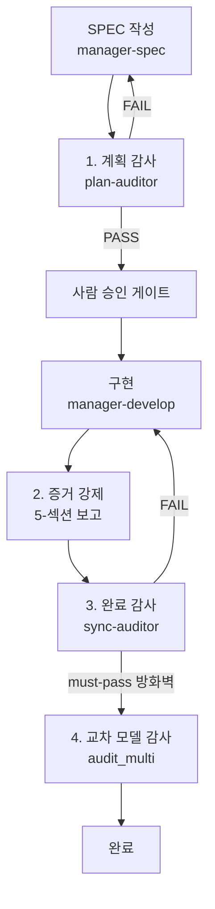

<p align="center">
  
</p>

<h1 align="center">MoAI-ADK</h1>

<p align="center">
  <strong>코드를 쓰는 에이전트와 그 코드를 판정하는 에이전트를 분리하는 Claude Code 하네스</strong>
</p>

<p align="center">
  <a href="./README.md">English</a> ·
  한국어 ·
  <a href="./README.ja.md">日本語</a> ·
  <a href="./README.zh.md">中文</a>
</p>

<p align="center">
  <a href="https://book.mo.ai.kr" target="_blank"><strong>공식 도서: Claude Code로 하는 실전 에이전틱 코딩</strong></a><br>
  MoAI-ADK 저자가 쓴 하네스 엔지니어링 실습서 — <a href="https://book.mo.ai.kr" target="_blank">book.mo.ai.kr</a>
</p>

<p align="center">
  <a href="https://github.com/modu-ai/moai-adk/actions/workflows/ci.yml"></a>
  <a href="https://github.com/modu-ai/moai-adk/actions/workflows/codeql.yml"></a>
  <a href="https://codecov.io/gh/modu-ai/moai-adk"></a>
  <br>
  <a href="https://go.dev/"></a>
  <a href="https://github.com/modu-ai/moai-adk/releases"></a>
  <a href="./LICENSE"></a>
</p>

<p align="center">
  <a href="https://adk.mo.ai.kr/ko"><strong>공식 문서</strong></a> ·
  <a href="https://adk.mo.ai.kr/ko/getting-started">시작하기</a> ·
  <a href="https://adk.mo.ai.kr/book">도서</a>
</p>

---

> **"에이전트가 코드를 쓰는 건 이제 어렵지 않다. 어려운 건 그 코드가 괜찮다고 말한 게 누구인가다."**

---

## 에이전트는 자기 답안을 자기가 채점한다

에이전트에게 기능 하나를 맡기면 코드가 나온다. 테스트도 함께 나오고, 마지막에 "테스트를 통과했습니다"라는 문장이 붙는다.

그 문장은 **주장이지 사실이 아니다.** 코드를 쓴 주체와 그 코드가 괜찮다고 판정한 주체가 같기 때문이다. 시험지를 낸 사람이 자기 답안을 채점한 것이고, 채점 결과를 검토할 사람이 아무도 없다.

여기에 두 번째 문제가 겹친다. 언어 모델은 구조적으로 **동의하는 쪽으로 기울어 있다.** MoAI-ADK가 모든 감사관 에이전트에 걸어 두는 규율은 이 편향을 이름으로 지목한다.

> RLHF 훈련 기울기가 아첨 쪽으로 편향되므로, 근거 없이 PASS 하고 싶은 충동은 판정이 아니라 아첨 신호로 취급하라.
>
> — `.claude/rules/moai/core/agent-common-protocol.md`

자기 채점과 동의 편향이 겹치면 결과는 하나다. **통과했다는 보고가 통과했다는 사실보다 항상 많아진다.**

바이브 코딩은 이 문제를 속도로 덮는다. 결과물이 빨리 나오니 검증이 느슨한 것이 잘 보이지 않는다. MoAI-ADK는 반대 방향을 택했다. 속도를 조금 내주고, **판정하는 주체를 쓰는 주체에서 떼어낸다.**

## 쓴 쪽과 판정하는 쪽을 분리한다

반박하기 어려운 지점은 여기다.

> **한 에이전트가 자기 작업을 검증했다는 주장은, 그 주장을 검증할 다른 주체가 없으면 검증이 아니다.**

이것은 모델 성능 문제가 아니라 구조 문제다. 그래서 "우리 모델은 정직합니다"로는 답할 수 없다. 더 좋은 모델을 쓰면 자기 채점의 정확도는 올라가겠지만, 자기 채점이라는 사실은 그대로다. 판정 주체를 분리하지 않는 한 남는다.

MoAI-ADK는 SPEC을 쓰는 에이전트, 구현하는 에이전트, 계획을 감사하는 에이전트, 완료를 감사하는 에이전트를 각각 따로 둔다. 감사관은 구현자의 보고를 읽지 않는다. 명령을 직접 실행하고 출력을 본다.

## 네 겹의 교차 검증

작업 하나가 완료로 인정받으려면 서로 다른 네 개의 관문을 지나야 한다. 각 관문의 판정 주체가 모두 다르다.


```mermaid
flowchart TD
    A[SPEC 작성<br/>manager-spec] --> B[1. 계획 감사<br/>plan-auditor]
    B -->|PASS| C[사람 승인 게이트]
    C --> D[구현<br/>manager-develop]
    D --> E[2. 증거 강제<br/>5-섹션 보고]
    E --> F[3. 완료 감사<br/>sync-auditor]
    F -->|must-pass 방화벽| G[4. 교차 모델 감사<br/>audit_multi]
    G --> H[완료]
    B -->|FAIL| A
    F -->|FAIL| D
```

### 1. 계획 감사 — 코드를 쓰기 전에

`plan-auditor`가 SPEC 문서를 적대적 관점으로 심사한다. 통과 기준은 규모에 따라 다르다 — Tier S는 0.75, M은 0.80, L은 0.85.

핵심은 채점 방식이다.

- **차원별 독립 채점.** 한 영역의 PASS가 다른 영역의 FAIL을 상쇄하지 못한다.
- **근거 없는 PASS는 자동 강등.** 증거를 대지 못한 PASS 판정은 UNVERIFIED로 내려가고, must-pass 기준에서는 FAIL로 계산된다.
- **점수가 내려가면 멈춘다.** 재감사에서 점수가 이전보다 낮아지면 무한 반복 대신 STOP을 내고 범위 축소를 사람에게 묻는다.

계획 단계에서 걸러진 결함은 구현 단계에서 걸러진 결함보다 훨씬 싸다.

### 2. 증거 강제 — 안 본 것을 적게 만든다

검증을 보고할 때 다섯 섹션을 채워야 한다.

| 섹션 | 내용 |
|---|---|
| Claim | 무엇을 주장하는가 |
| Evidence | 실제로 실행한 명령과 **그 출력 원문** (요약 불가) |
| Baseline-attribution | 무엇에 대고 측정했는가 |
| **Gaps** | 검증하지 **않은** 것 |
| Residual-risk | 검증했음에도 남는 위험 |

네 번째 섹션이 이 형식의 핵심이다. 안 본 것을 명시적으로 적게 만들면, 검증하지 않은 항목이 통과한 것처럼 조용히 지나가지 못한다.

같은 규율이 반대 방향에도 걸린다. 결함이 **있다**는 주장도 도구로 확인해야 한다. 텍스트 패턴에서 추론한 결함은 가설이지 결함이 아니다.

자세히: [검증-주장 무결성](https://adk.mo.ai.kr/ko/core-concepts/verification-claim-integrity)

### 3. 완료 감사 — 평균으로 덮이지 않는다

`sync-auditor`가 구현 결과를 네 차원으로 채점한다. Functionality 40%, Security 25%, Craft 20%, Consistency 15%.

두 가지가 이 관문을 다르게 만든다.

- **must-pass 방화벽.** Functionality와 Security는 각각 독립적으로 통과해야 한다. 하나라도 실패하면 나머지 점수와 무관하게 전체 FAIL이다.
- **산술평균이 아니라 조화평균.** 한 차원이 낮으면 전체가 끌려 내려간다. 잘한 영역으로 못한 영역을 덮을 수 없다.

감사관은 구현자의 보고를 신뢰하지 않는다. 테스트 러너를 직접 돌리고 그 출력을 SPEC의 인수 기준 표와 대조한다.

### 4. 교차 모델 감사 — 다른 회사 모델에게 묻는다

같은 계열 모델이 같은 편향을 공유한다면, 한 계열 안에서 아무리 나눠도 그 편향은 걸러지지 않는다. `audit_multi`는 Claude·codex·GLM이 **각자 독립적으로** 판정하게 하고 결과를 수렴시킨다. 판정이 갈리면 그 불일치 자체를 표면으로 올린다.

한 백엔드를 쓸 수 없어도 감사는 진행된다. 응답 없는 백엔드는 `inconclusive`를 반환할 뿐 오류가 아니다.

### 이 네 겹을 떠받치는 것

교차 검증은 공짜가 아니다. 판정 주체를 늘리면 토큰을 더 쓰고, 세션도 더 길어진다. 아래는 그 비용을 감당 가능하게 만드는 기반이다.

| | |
|---|---|
| **비용 관리** | 역할별 모델·추론 강도 라우팅, 컨텍스트 예산 관리. 감사 계층을 늘리고도 비용이 선형으로 늘지 않게 한다 |
| **16개 언어** | Go·Python·TypeScript·Rust·Java 등 16개 언어를 동등하게 감지하고, 각 언어의 표준 lint·test 도구로 감사한다 |
| **세션 연속성** | 컨텍스트 한계에 닿으면 붙여넣기 가능한 재개 메시지를 만들어 다음 세션이 같은 지점에서 이어받는다 |
| **병렬 안전** | 에이전트마다 격리된 git 워크트리에서 작업해, 동시에 도는 판정 주체들이 서로의 작업 트리를 덮어쓰지 않는다 |

## 에이전트끼리 어떻게 통신하는가

교차 검증이 실제로 굴러가려면 판정 주체들이 서로 다른 맥락에 살아야 한다. 같은 대화 안에 있으면 앞선 주장에 물들기 때문이다.

칸반 모드는 각 단계를 **독립된 세션**으로 띄운다. 리드 세션이 카드를 여섯 칼럼(`backlog → plan → run → review → sync → done`)으로 옮기고, 각 칼럼을 맡은 동반 세션에 메시지로 작업을 지시한다.

리드가 지키는 규율이 하나 있다.

> **리드는 보고를 믿고 카드를 옮기지 않는다. 근거를 직접 읽고 옮긴다.**

동반 세션이 "끝났습니다"라고 답해도 그것만으로는 카드가 움직이지 않는다. 리드는 그 단계가 남긴 증거 파일을 읽고, 읽히지 않거나 낡았으면 카드를 그 자리에 두고 이유를 보고한다. 실패 신호가 없다는 것은 통과의 증거가 아니다.

여기에 더해 대규모 작업에서는 `manager-kanban`이 인수 기준별 PASS 주장에 대해 다른 에이전트의 교차 검증을 발동한다.

그리고 어떤 점수도 사람을 건너뛰지 못한다. 구현 착수 전 승인 게이트는 감사 점수가 아무리 높아도 우회되지 않는다.

자세히: [칸반 모드](https://adk.mo.ai.kr/ko/advanced/kanban-mode)

## 무엇이 달라지는가

| | Claude Code 단독 | 일반 하네스 | MoAI-ADK |
|---|---|---|---|
| 코드 생성 | 가능 | 가능 | 가능 |
| 품질 판정 주체 | 작성자 본인 | 작성자 본인 | **분리된 감사관** |
| 계획 단계 심사 | 없음 | 대개 없음 | Tier별 임계 점수 |
| 증거 요구 | 없음 | 규약에 따라 다름 | 5-섹션, Gaps 필수 |
| 미검증 PASS 처리 | 통과 | 통과 | **FAIL로 강등** |
| 차원 간 상쇄 | 해당 없음 | 평균으로 덮임 | **must-pass 방화벽** |
| 다른 계열 모델 검증 | 없음 | 드묾 | claude + codex + GLM 수렴 |
| 판정 주체의 맥락 | 공유 | 대개 공유 | 세션·워크트리 분리 |

MoAI-ADK는 Claude Code를 대체하지 않는다. Claude Code가 사용자에게 맡겨 둔 부분 — 판정 주체 분리, 증거 규약, 감사 게이트, 세션 연속성 — 을 구조로 채운다. Go로 쓰인 단일 바이너리이며 macOS·Linux·Windows에서 추가 의존성 없이 돈다.

## 시작하기

### 설치

```bash
# macOS / Linux / WSL
curl -fsSL https://adk.mo.ai.kr/install.sh | bash
```

```powershell
# Windows (PowerShell 7.x+)
irm https://adk.mo.ai.kr/install.ps1 | iex
```

```bash
# 소스에서 빌드 (Go 1.26+)
git clone https://github.com/modu-ai/moai-adk.git
cd moai-adk && make build
```

### 첫 프로젝트

```bash
moai init my-project
```

대화형 마법사가 언어·프레임워크·방법론을 자동으로 감지하고, 모델 정책을 고르고, Claude Code 연동 파일을 만든다.

### 첫 워크플로

```bash
claude        # 프로젝트 안에서 Claude Code 실행
```

```text
/moai plan "JWT 로그인 추가"    # SPEC 작성 → 계획 감사
/moai run SPEC-AUTH-001         # TDD/DDD 구현 → 증거 기록
/moai sync SPEC-AUTH-001        # 완료 감사 → 문서 동기화 → PR
```

자연어도 된다. `/moai "로그인 버그 고쳐줘"`라고 쓰면 의도를 분석해 적절한 워크플로로 보낸다.

### 준비물

- **Git** — 모든 플랫폼에서 필수
- **Claude Code** — MoAI-ADK는 Claude Code를 감싸는 하네스다
- 권장: `gh` CLI (PR 자동화) · `tmux` (CG 모드) · 프로젝트 언어의 lint·test 도구

Windows는 **WSL 사용을 권장**한다. PowerShell 7.x 이상도 지원하지만 네이티브 `cmd.exe`는 지원하지 않는다.

자세히: [설치 가이드](https://adk.mo.ai.kr/ko/getting-started) · [빠른 시작](https://adk.mo.ai.kr/ko/getting-started/quickstart)

## 문서

전체 문서는 [adk.mo.ai.kr](https://adk.mo.ai.kr/ko)에 있다.

| 무엇을 찾는가 | 문서 |
|---|---|
| MoAI-ADK가 무엇인지, 왜 이렇게 설계했는지 | [핵심 개념](https://adk.mo.ai.kr/ko/core-concepts) |
| 설치부터 첫 SPEC까지 | [시작하기](https://adk.mo.ai.kr/ko/getting-started) |
| `plan` · `run` · `sync` 3단계 파이프라인 | [워크플로 명령](https://adk.mo.ai.kr/ko/workflow-commands) |
| `review` · `gate` · `fix` 등 나머지 명령 | [유틸리티 명령](https://adk.mo.ai.kr/ko/utility-commands) |
| 모든 CLI 플래그와 옵션 | [CLI 레퍼런스](https://adk.mo.ai.kr/ko/cli-reference) |
| 병렬 작업용 워크트리 격리 | [워크트리](https://adk.mo.ai.kr/ko/worktree) |
| 토큰 비용을 줄이는 방법 | [비용 최적화](https://adk.mo.ai.kr/ko/cost-optimization) |
| Claude와 GLM을 함께 쓰기 | [멀티 LLM](https://adk.mo.ai.kr/ko/multi-llm) |
| 에이전트·훅·설정 커스터마이징 | [심화](https://adk.mo.ai.kr/ko/advanced) |
| 실전 시나리오별 예시 | [가이드](https://adk.mo.ai.kr/ko/guides) |
| Claude Code 자체 기능 정리 | [Claude Code](https://adk.mo.ai.kr/ko/claude-code) |
| 버전별 변경 사항 | [변경 이력](https://adk.mo.ai.kr/ko/changelog) |
| 외부 자료와 링크 모음 | [자료실](https://adk.mo.ai.kr/ko/resources) |

## 함께 만들기

이슈와 PR을 환영한다. 기여 방법은 [기여 가이드](https://adk.mo.ai.kr/ko/contributing)에 정리해 두었다.

- **버그 신고·기능 제안** — [GitHub Issues](https://github.com/modu-ai/moai-adk/issues)
- **세션 안에서 바로 신고** — `/moai feedback`
- **라이선스** — [Apache-2.0](./LICENSE)

## Star History

<a href="https://star-history.com/#modu-ai/moai-adk&Date">
  
</a>
