# 🗿 MoAI-ADK: AI와 함께 대화하며 코딩하는 바이브 코딩 프레임워크


**사용 가능한 언어:** [🇰🇷 한국어](./README.ko.md) | [🇺🇸 English](./README.md) | [🇯🇵 日本語](./README.ja.md) | [🇨🇳 中文](./README.zh.md)

[](https://pypi.org/project/moai-adk/)
[](./LICENSE)
[](https://www.python.org/)

> **"바이브 코딩의 목적은 빠른 생산성이 아니라 코드 품질이다."**

MoAI-ADK는 **품질 있는 코드를 만드는 AI 개발 환경**을 제공합니다. SPEC-First TDD, 테스트 주도 개발, 지속적 리팩토링과 20개 전문 AI 에이전트가 함께합니다.

---

## 🎁 MoAI-ADK 스폰서: z.ai GLM 4.7

**💎 비용 효율적인 AI 개발을 위한 최적 솔루션**

MoAI-ADK는 **z.ai GLM 4.7**과 파트너십을 통해 개발자들에게 경제적인 AI 개발 환경을 제공합니다.

### 🚀 GLM 4.7 특별 혜택

| 혜택                 | 설명                                           |
| -------------------- | ---------------------------------------------- |
| **💰 70% 비용 절감**  | Claude 대비 1/7 가격으로 동등한 성능           |
| **⚡ 빠른 응답 속도** | 최적화된 인프라로 저지연 응답 제공             |
| **🔄 호환성**         | Claude Code와 완벽 호환, 별도 코드 수정 불필요 |
| **📈 무제한 사용**    | 일간/주간 토큰 리밋 없이 자유롭게 사용         |

### 🎁 가입 특별 할인

**👉 [GLM 4.7 가입하기 (10% 추가 할인)](https://z.ai/subscribe?ic=1NDV03BGWU)**

이 링크를 통해 가입하면:

- ✅ **추가 10% 할인** 혜택
- ✅ **MoAI 오픈소스 개발**에 기여 (리워드 크레딧은 오픈소스 프로젝트에 사용됩니다)

### 💡 사용 가이드

```bash
# 1. GLM API 키 발급
위 링크에서 가입 후 API 키 발급

# 2. MoAI-ADK에 GLM 설정
moai glm YOUR_API_KEY
```

> **💡 팁**: Worktree 환경에서 GLM 4.7을 활용하면 Opus로 설계하고 GLM으로 대량 구현하여 비용을 최대 70% 절감할 수 있습니다.

---

## 🌟 핵심 가치

- **🎯 SPEC-First**: 명확한 명세서로 90% 재작업 감소
- **🔴 TDD 강제**: 85%+ 테스트 커버리지 자동 보장
- **🤖 AI 오케스트레이션**: 20개 전문 에이전트 + 48개 스킬
- **🌐 다국어 라우팅**: 한국어/영어/일본어/중국어 자동 지원
- **🌳 Worktree 병렬 개발**: 완전 격리 환경에서 무제한 병렬 작업
- **🏆 MoAI Rank**: 바이브 코딩 리더보드로 동기부여

---

## PART A: 지금 바로 시작하기 (5분)

---

## 1. 30초 설치

```bash
# Step 1: uv 설치 (macOS/Linux)
curl -LsSf https://astral.sh/uv/install.sh | sh

# Step 2: MoAI-ADK 설치
uv tool install moai-adk
```

### 🎨 대화형 설정 마법사

`moai init` 명령어 실행 시 **9단계 대화형 마법사**가 시작됩니다:


---

#### Step 1: 언어 선택

대화 언어를 선택합니다. 이후 모든 안내가 선택한 언어로 표시됩니다.

```
🌐 Language Selection
❯ Select your conversation language: [↑↓] Navigate  [Enter] Select
❯ Korean (한국어)
  English
  Japanese (日本語)
  Chinese (中文)
```

---

#### Step 2: 이름 입력

사용자 이름을 입력합니다. AI가 개인화된 응답을 제공합니다.

```
👤 사용자 설정
❯ 사용자 이름을 입력하세요 (선택사항):
```

---

#### Step 3: GLM API 키 입력

Z.AI사의 GLM API 키를 입력합니다.

```
🔑 API 키 입력                                                                                  
GLM CodePlan API key (optional - press Enter to skip)                                           
                                                                                                
✓ 기존 GLM API 키를 찾았습니다: 99c1a2df...                                                     
Enter를 누르면 기존 키 유지, 새 키를 입력하면 교체됩니다                                        
                                                                                                
? GLM API 키를 입력하세요: 
```

> 🎁 **GLM 가입 혜택**: GLM 계정이 없다면 아래 링크로 가입하세요!
>
> **👉 [GLM 가입하기 (10% 추가 할인)](https://z.ai/subscribe?ic=1NDV03BGWU)**
>
> 이 링크를 통해 가입하면 **추가 10% 할인** 혜택을 받을 수 있습니다.
> 또한 링크를 통한 가입 시 발생하는 리워드는 **MoAI 오픈소스 개발**에 사용됩니다. 🙏

---

#### Step 4: 프로젝트 설정

프로젝트 이름을 입력합니다.

```
📁 프로젝트 설정
❯ 프로젝트 이름: MoAI-ADK
```

---

#### Step 5: Git 설정

Git 모드를 선택합니다.

```
🔀 Git 설정
❯ Git 모드를 선택하세요: [↑↓] Navigate  [Enter] Select
❯ manual (로컬만) - 로컬 저장소만 사용
  personal (GitHub 개인) - GitHub 개인 계정 사용
  team (GitHub 팀) - GitHub 팀/조직 사용
```

---

#### Step 6: GitHub 사용자명

personal/team 선택 시 GitHub 사용자명을 입력합니다.

```
❯ GitHub 사용자명:
```

---

#### Step 7: 커밋 메시지 언어

Git 커밋 메시지에 사용할 언어를 선택합니다.

```
🗣️ 출력 언어 설정
❯ 커밋 메시지 언어: [↑↓] Navigate  [Enter] Select
  English
❯ Korean (한국어)
  Japanese (日本語)
  Chinese (中文)
```

---

#### Step 8: 코드 주석 언어

코드 주석에 사용할 언어를 선택합니다.

```
❯ 코드 주석 언어: [↑↓] Navigate  [Enter] Select
  English
❯ Korean (한국어)
  Japanese (日本語)
  Chinese (中文)
```

---

#### Step 9: 문서 언어

문서에 사용할 언어를 선택합니다.

```
❯ 문서 언어: [↑↓] Navigate  [Enter] Select
  English
❯ Korean (한국어)
  Japanese (日本語)
  Chinese (中文)
```

> 💡 **토큰 최적화 전략**: 에이전트에게 지시하는 내부 프롬프트는 **영어로 고정**되어 있습니다.
>
> **이유**: 비영어권 언어는 Claude에서 **12%~20% 토큰을 추가 소모**합니다. 무한 반복 에이전트 작업이 많아지면 비용과 주간 토큰 리밋에 큰 영향을 주기 때문에, MoAI는 내부 에이전트 지시는 영어로 고정하고 **일반 대화만 사용자 언어로 제공**합니다.
>
> 이것이 MoAI의 **토큰 낭비를 줄이기 위한 노력**입니다.

---

#### 설치 완료

모든 설정이 완료되면 5단계 설치가 자동 진행됩니다:

```
🚀 Starting installation...

Phase 1: Preparation and backup...        ████████████████ 100%
Phase 2: Creating directory structure...  ████████████████ 100%
Phase 3: Installing resources...          ████████████████ 100%
Phase 4: Generating configurations...     ████████████████ 100%
Phase 5: Validation and finalization...   ████████████████ 100%

✅ Initialization Completed Successfully!
────────────────────────────────────────────────────────────────

📊 Summary:
  📁 Location:   /path/to/my-project
  🌐 Language:   Auto-detect (use /moai:0-project)
  🔀 Git:        manual (github-flow, branch: manual)
  🌍 Locale:     ko
  📄 Files:      47 created
  ⏱️  Duration:   1234ms

🚀 Next Steps:
  1. Run cd my-project to enter the project
  2. Run /moai:0-project in Claude Code for full setup
  3. Start developing with MoAI-ADK!
```

### 기존 프로젝트에 추가

```bash
cd your-existing-project
moai init .
# 기존 파일은 그대로 유지됩니다
```

---

### 🔄 MoAI-ADK 업데이트

기존 프로젝트를 최신 버전으로 업데이트합니다.

```bash
moai update
```

**3단계 스마트 업데이트 워크플로우**:

```
Stage 1: 📦 패키지 버전 확인
         └─ PyPI에서 최신 버전 확인 → 필요시 자동 업그레이드

Stage 2: 🔍 Config 버전 비교
         └─ 패키지 템플릿 vs 프로젝트 설정 비교
         └─ 동일하면 스킵 (70-80% 성능 향상)

Stage 3: 📄 템플릿 동기화
         └─ 백업 생성 → 템플릿 업데이트 → 사용자 설정 복원
```

**주요 옵션**:

```bash
# 버전만 확인 (업데이트 없음)
moai update --check

# 템플릿만 동기화 (패키지 업그레이드 스킵)
moai update --templates-only

# 설정 편집 모드 (init 마법사 재실행)
moai update --config
moai update -c

# 백업 없이 강제 업데이트
moai update --force

# All is well~  자동 모드 (모든 확인 자동 승인)
moai update --yes
```

**머지 전략 선택**:

```
🔀 Choose merge strategy:
  [1] Auto-merge (default)
      → 템플릿 + 사용자 변경 사항 자동 보존
  [2] Manual merge
      → 백업 + 머지 가이드 생성 (직접 제어)
```

```bash
# Auto-merge 강제 (기본값)
moai update --merge

# Manual merge 강제
moai update --manual
```

**자동 보존되는 항목**:

| 항목                | 설명                                          |
| ------------------- | --------------------------------------------- |
| **사용자 설정**     | `.claude/settings.local.json` (MCP, GLM 설정) |
| **커스텀 에이전트** | 템플릿에 없는 사용자 생성 에이전트            |
| **커스텀 명령어**   | 사용자 정의 슬래시 명령어                     |
| **커스텀 스킬**     | 사용자 정의 스킬                              |
| **커스텀 훅**       | 사용자 정의 훅 스크립트                       |
| **SPEC 문서**       | `.moai/specs/` 폴더 전체                      |
| **리포트**          | `.moai/reports/` 폴더 전체                    |

> 💡 **업데이트 팁**: `moai update -c`로 언제든 언어, API 키, Git 설정을 변경할 수 있습니다.
> 사용자의 명령어, 에이전트, 스킬, 훅은 moai 이외의 폴더에 생성해서 사용 하시면 좋습니다.

---

## 2. 프로젝트 문서 생성 (선택 사항)

신규 프로젝트나 기존 프로젝트에서 **Claude Code가 프로젝트를 이해하는 데 도움**이 되는 프로젝 문서를 자동 생성할 수 있습니다:

```
> /moai:0-project
```

### 생성되는 3개 파일

| 파일                         | 목적          | 주요 내용                                                  |
| ---------------------------- | ------------- | ---------------------------------------------------------- |
| `.moai/project/product.md`   | **제품 개요** | 프로젝트 이름/설명, 타겟 사용자, 핵심 기능, 사용 사례      |
| `.moai/project/structure.md` | **구조 분석** | 디렉토리 트리, 주요 폴더 목적, 핵심 파일 위치, 모듈 구성   |
| `.moai/project/tech.md`      | **기술 스택** | 사용 기술, 프레임워크 선택 이유, 개발 환경, 빌드/배포 설정 |

### 왜 필요한가요?

- **컨텍스트 제공**: Claude Code가 프로젝트 맥락을 빠르게 파악
- **일관성 유지**: 팀원 간 프로젝트 이해도 공유
- **온보딩 가속화**: 새 개발자의 프로젝트 파악 시간 단축
- **AI 협업 최적화**: 더 정확한 코드 제안과 리뷰 가능

> 💡 **팁**: 프로젝트 초기 또는 구조 변경 시 `/moai:0-project`를 실행하면 최신 상태로 문서가 갱신됩니다.

---

## 3. 3분 첫 기능 완성

Claude Code에서 다음 명령어를 순서대로 실행하세요:

### Step 1: Plan (1분)

```
> /moai:1-plan 사용자 로그인 기능 구현 해줘.
```

✅ 자동 생성됨:

- SPEC-001 문서 (.moai/specs/SPEC-001/spec.md)
- 요구사항 (EARS 형식)
- 제약 조건
- 성공 기준
- 테스트 시나리오

### Step 2: Clear (10초)

```
> /clear
```

토큰 효율을 위해 컨텍스트를 정리합니다.

### Step 3: Run (2분)

```
> /moai:2-run SPEC-001
```

자동 실행됨:

- 🔴 **RED**: 실패하는 테스트 작성
- 🟢 **GREEN**: 테스트 통과 코드 구현
- 🔵 **REFACTOR**: 코드 최적화
- ✅ **TRUST 5 검증**: 품질 자동 검사

### Step 4: Sync (선택)

```
> /moai:3-sync SPEC-001
```

자동 생성됨:

- API 문서
- 아키텍처 다이어그램
- README 업데이트
- 배포 준비

**🎉 완료!** 첫 번째 기능이 구현되었습니다.

---

## PART B: 바이브 코딩 마스터하기 (20분)

---

## 4. 바이브 코딩이란?

**바이브 코딩(Vibe Coding)** = AI와 함께 흐름 타며 코딩하는 경험

| 전통적 개발      | 바이브 코딩           |
| ---------------- | --------------------- |
| 문서 작성 → 코딩 | 대화하며 동시에 진행  |
| 재작업 잦음      | SPEC로 한 번에 완성   |
| 테스트 나중에    | TDD로 먼저 검증       |
| 코드만 작성      | 코드 + 문서 동시 생성 |
| 혼자 고민        | 20명의 전문가와 협업  |

**핵심 철학**: "AI는 도구가 아니라 파트너다."

---

## 5. 핵심 명령어 4개

### 🎯 `/moai:0-project` - 프로젝트 초기화

```bash
> /moai:0-project
```

**작업 내용**:

- ✅ 프로젝트 구조 분석
- ✅ 프로그래밍 언어/프레임워크 감지
- ✅ `.moai/config/config.json` 생성
- ✅ Git 워크플로우 설정
- ✅ 세션 메모리 시스템 구성
- ✅ 품질 보증 기준 설정

---

### 📋 `/moai:1-plan` - SPEC 작성

```bash
> /moai:1-plan "기능 설명"
```

**자동 생성**:

- EARS 형식 명세서
- 요구사항 정의
- 성공 기준
- 테스트 시나리오

**예시**:

```bash
> /moai:1-plan "사용자 프로필 페이지"
# → SPEC-002 생성

> /moai:1-plan "결제 API"
# → SPEC-003 생성
```

**중요**: 반드시 다음에 `> /clear` 실행

---

### 💻 `/moai:2-run` - TDD 구현

```bash
> /moai:2-run SPEC-001
```

**자동 실행**:

- 🔴 테스트 먼저 작성 (Red)
- 🟢 테스트 통과 코드 (Green)
- 🔵 리팩토링 (Refactor)
- ✅ TRUST 5 검증

**검증 항목**:

- 테스트 커버리지 >= 85%
- 린팅 통과
- 타입 검사 통과
- 보안 검사 통과

---

### 📚 `/moai:3-sync` - 문서 동기화

```bash
> /moai:3-sync SPEC-001
```

**자동 생성**:

- API 레퍼런스
- 아키텍처 다이어그램
- 배포 가이드
- README 업데이트
- CHANGELOG

---

### 🚀 `/moai:alfred` - 원클릭 자동화

```bash
> /moai:alfred "기능 설명"
```

**한 번에 실행**:

1. Plan (SPEC 생성)
2. Run (TDD 구현)
3. Sync (문서 동기화)

**옵션**:

- `--branch`: 기능 브랜치 자동 생성
- `--pr`: 완료 후 Pull Request 생성

---

## 6. Mr.Alfred와 20개 에이전트

### 🎩 Mr.Alfred - 수석 오케스트레이터

**역할**: 사용자 요청을 분석하고 적절한 전문 에이전트에게 위임

**작업 흐름**:

1. **Understand**: 요청 분석 및 명확화
2. **Plan**: Plan 에이전트를 통한 실행 계획 수립
3. **Execute**: 전문 에이전트에게 작업 위임 (순차/병렬)
4. **Integrate**: 결과 통합 및 사용자 보고

### 🌐 다국어 자동 라우팅 (NEW)

Alfred는 4개 언어 요청을 자동으로 인식하고 올바른 에이전트를 호출합니다:

| 요청 언어 | 예시                        | 호출 에이전트  |
| --------- | --------------------------- | -------------- |
| 영어      | "Design backend API"        | expert-backend |
| 한국어    | "백엔드 API 설계해줘"       | expert-backend |
| 일본어    | "バックエンドAPIを設計して" | expert-backend |
| 중국어    | "设计后端API"               | expert-backend |

---

### 🔧 Tier 1: 도메인 전문가 (8개)

| 에이전트               | 전문 분야                | 사용 예시              |
| ---------------------- | ------------------------ | ---------------------- |
| **expert-backend**     | FastAPI, Django, DB 설계 | API 설계, 쿼리 최적화  |
| **expert-frontend**    | React, Vue, Next.js      | UI 컴포넌트, 상태 관리 |
| **expert-security**    | 보안 분석, OWASP         | 보안 감사, 취약점 분석 |
| **expert-devops**      | Docker, K8s, CI/CD       | 배포 자동화, 인프라    |
| **expert-debug**       | 버그 분석, 성능          | 문제 진단, 병목 해결   |
| **expert-performance** | 프로파일링, 최적화       | 응답 시간 개선         |
| **expert-refactoring** | 코드 리팩토링, AST-Grep  | 대규모 코드 변환       |
| **expert-testing**     | 테스트 전략, E2E         | 테스트 계획, 커버리지  |

---

### 🎯 Tier 2: 워크플로우 관리자 (8개)

| 에이전트                | 역할             | 자동 호출 시점    |
| ----------------------- | ---------------- | ----------------- |
| **manager-spec**        | SPEC 작성 (EARS) | `/moai:1-plan`    |
| **manager-tdd**         | TDD 자동 실행    | `/moai:2-run`     |
| **manager-docs**        | 문서 자동 생성   | `/moai:3-sync`    |
| **manager-quality**     | TRUST 5 검증     | 구현 완료 후      |
| **manager-strategy**    | 실행 전략 수립   | 복잡한 기획 시    |
| **manager-project**     | 프로젝트 초기화  | `/moai:0-project` |
| **manager-git**         | Git 워크플로우   | 브랜치/PR 관리    |
| **manager-claude-code** | Claude Code 통합 | 설정 최적화       |

---

### 🏗️ Tier 3: 메타 생성기 (4개)

| 에이전트            | 역할             | 사용 예시            |
| ------------------- | ---------------- | -------------------- |
| **builder-agent**   | 새 에이전트 생성 | 조직 전문가 에이전트 |
| **builder-skill**   | 새 스킬 생성     | 팀 전용 스킬 모듈    |
| **builder-command** | 새 명령어 생성   | 커스텀 워크플로우    |
| **builder-plugin**  | 플러그인 생성    | 배포용 플러그인      |

---

## 7. 48개 스킬 한눈에

### 📚 스킬 라이브러리 구조

```
🏗️ Foundation (5)    → 핵심 철학, 실행 규칙
🎯 Domain (4)        → 도메인 전문 지식
💻 Language (16)     → 16개 프로그래밍 언어
🚀 Platform (10)     → 클라우드/BaaS 통합
📋 Workflow (7)      → 자동화 워크플로우
📚 Library (4)       → 특수 라이브러리
🛠️ Tool (2)          → 개발 도구
```

### 자주 쓰는 스킬 조합

| 목적              | 스킬 조합                                                                |
| ----------------- | ------------------------------------------------------------------------ |
| **백엔드 API**    | `moai-lang-python` + `moai-domain-backend` + `moai-platform-supabase`    |
| **프론트엔드 UI** | `moai-lang-typescript` + `moai-domain-frontend` + `moai-library-shadcn`  |
| **문서 생성**     | `moai-library-nextra` + `moai-workflow-docs` + `moai-library-mermaid`    |
| **테스트**        | `moai-lang-python` + `moai-workflow-testing` + `moai-foundation-quality` |

### 스킬 사용법

```python
# 방법 1: 직접 호출 (개발자)
Skill("moai-lang-python")

# 방법 2: Alfred 자동 선택 (일반 사용자)
"FastAPI 서버 만들어줘"
→ Alfred가 자동으로 moai-lang-python 선택
```

---

## PART D: 품질 보장 시스템 (10분)

---

## 8. TRUST 5 품질 원칙


MoAI-ADK의 모든 프로젝트는 **TRUST 5** 품질 프레임워크를 따릅니다.

### 🏆 TRUST 5 = Test + Readable + Unified + Secured + Trackable

```mermaid
graph TD
    T1["🔴 T: Test-First<br/>━━━━━━━━<br/>• TDD Red-Green-Refactor<br/>• 85%+ 커버리지<br/>• 자동 테스트"]
    R["📖 R: Readable<br/>━━━━━━━━<br/>• 명확한 명명<br/>• 코드 주석<br/>• 린터 준수"]
    U["🔄 U: Unified<br/>━━━━━━━━<br/>• 일관된 스타일<br/>• 표준 패턴<br/>• 에러 처리"]
    S["🔒 S: Secured<br/>━━━━━━━━<br/>• OWASP Top 10<br/>• 취약점 스캔<br/>• 암호화 정책"]
    T2["📋 T: Trackable<br/>━━━━━━━━<br/>• 명확한 커밋<br/>• 이슈 추적<br/>• CHANGELOG"]

    T1 --> R --> U --> S --> T2 --> Deploy["✅ Production Ready"]
```



### T - Test-First (테스트 우선)

**원칙**: 모든 구현은 테스트부터 시작

**검증**:

- 테스트 커버리지 >= 85%
- 실패하는 테스트 먼저 작성 (Red)
- 테스트 통과 코드 (Green)
- 리팩토링 (Refactor)

### R - Readable (가독성)

**원칙**: 코드는 명확하고 이해하기 쉬워야 함

**검증**:

- 명확한 변수명
- 복잡한 로직에 주석
- 코드 리뷰 통과
- 린터 검사 통과

### U - Unified (통일성)

**원칙**: 프로젝트 전체에 일관된 스타일 유지

**검증**:

- 프로젝트 스타일 가이드 준수
- 일관된 명명 규칙
- 통일된 에러 처리
- 표준 문서 형식

### S - Secured (보안)

**원칙**: 모든 코드는 보안 검사 통과

**검증**:

- OWASP Top 10 체크
- 의존성 취약점 스캔
- 암호화 정책 준수
- 접근 제어 검증

### T - Trackable (추적 가능성)

**원칙**: 모든 변경은 명확하게 추적 가능

**검증**:

- 명확한 커밋 메시지
- 이슈 추적 (GitHub Issues)
- CHANGELOG 유지
- 코드 리뷰 기록

---

## 9. 자동 품질 검사

### 🔍 AST-Grep 기반 구조적 검사

**AST-Grep**는 텍스트가 아닌 **코드 구조**를 분석합니다:

| 기능              | 설명             | 예시                                  |
| ----------------- | ---------------- | ------------------------------------- |
| **구조적 검색**   | AST 패턴 매칭    | 파라미터화되지 않은 SQL 쿼리 찾기     |
| **보안 스캔**     | 자동 취약점 탐지 | SQL Injection, XSS, 하드코딩된 비밀키 |
| **패턴 리팩토링** | 안전한 코드 변환 | 변수명 일괄 변경, 함수 추출           |
| **다국어 지원**   | 40+ 언어         | Python, TypeScript, Go, Rust...       |

### 자동 검사 흐름

```
코드 작성
    ↓
[AST-Grep 자동 스캔]
    ↓
⚠️  취약점 발견시 즉시 알림
    ↓
✅ 안전한 코드로 리팩토링
```

**검출 예시**:

```bash
⚠️  AST-Grep: Potential SQL injection in src/auth.py:47
   Pattern: execute(f"SELECT * FROM users WHERE id={user_id}")
   Suggestion: execute("SELECT * FROM users WHERE id=%s", (user_id,))
```

---

## PART C: 🌳 Worktree 병렬 개발

MoAI-ADK의 핵심 혁신: **Worktree로 완전 격리, 무제한 병렬 개발**

### 💡 왜 Worktree인가?

**문제점**: `moai glm`/`moai cc`로 LLM을 변경하면 **모든 열려있는 세션**에 적용됩니다. 동일 세션에서 모델을 변경하면 인증 오류로 이어서 진행이 어렵습니다.

**해결책**: Git Worktree로 각 SPEC을 완전히 격리하여 독립적인 LLM 설정 유지

---

### 📦 Worktree 워크플로우

```
┌─────────────────────────────────────────────────────────────────┐
│  터미널 1 (Claude Opus) - SPEC 설계 전용                        │
│  ━━━━━━━━━━━━━━━━━━━━━━━━━━━━━━━━━━━━━━━━━━━━━━━━━━━━━━━━━━━━━  │
│  $ cd my-project                                                │
│  $ claude                                                        │
│                                                                  │
│  > /moai:1-plan "사용자 인증 시스템" --worktree                   │
│  ✅ SPEC-AUTH-001 생성 완료                                      │
│  ✅ Worktree 생성: ~/moai/worktrees/my-project/SPEC-AUTH-001     │
│  ✅ Branch: feature/SPEC-AUTH-001                                │
│                                                                  │
│  > /moai:1-plan "결제 시스템" --worktree                          │
│  ✅ SPEC-PAY-002 생성 완료                                       │
│  ✅ Worktree 생성: ~/moai/worktrees/my-project/SPEC-PAY-002      │
│                                                                  │
│  > /moai:1-plan "대시보드 UI" --worktree                         │
│  ✅ SPEC-UI-003 생성 완료                                        │
│  ✅ Worktree 생성: ~/moai/worktrees/my-project/SPEC-UI-003       │
│                                                                  │
│  💡 Opus로 모든 SPEC 계획 완료 (세션 유지 중...)                  │
└─────────────────────────────────────────────────────────────────┘

┌─────────────────────────────────────────────────────────────────┐
│  터미널 2 - SPEC-AUTH-001 Worktree (GLM 4.7)                    │
│  ━━━━━━━━━━━━━━━━━━━━━━━━━━━━━━━━━━━━━━━━━━━━━━━━━━━━━━━━━━━━━  │
│  $ moai-worktree go SPEC-AUTH-001                                │
│  # 또는 단축어: moai-wt go SPEC-AUTH-001                          │
│                                                                  │
│  📁 현재 위치: ~/moai/worktrees/my-project/SPEC-AUTH-001        │
│  🔀 Branch: feature/SPEC-AUTH-001                                │
│                                                                  │
│  $ moai glm                                                       │
│  ✅ Switched to GLM backend                                      │
│                                                                  │
│  $ claude                                                        │
│  > /moai:2-run SPEC-AUTH-001                                     │
│  🔄 TDD 실행 중... (Red → Green → Refactor)                       │
│  ✅ 구현 완료!                                                   │
│  ✅ 테스트 통과 (Coverage: 92%)                                  │
│                                                                  │
│  > /moai:3-sync SPEC-AUTH-001                                    │
│  ✅ 문서 동기화 완료                                             │
│                                                                  │
│  # 완료 후 병합                                                   │
│  $ git checkout main                                             │
│  $ git merge feature/SPEC-AUTH-001                               │
│  $ moai-worktree clean --merged-only                             │
└─────────────────────────────────────────────────────────────────┘

┌─────────────────────────────────────────────────────────────────┐
│  터미널 3 - SPEC-PAY-002 Worktree (GLM 4.7)                     │
│  ━━━━━━━━━━━━━━━━━━━━━━━━━━━━━━━━━━━━━━━━━━━━━━━━━━━━━━━━━━━━━  │
│  $ moai-wt go SPEC-PAY-002                                       │
│  $ moai glm                                                       │
│  $ claude                                                        │
│                                                                  │
│  > /moai:alfred SPEC-PAY-002                                     │
│  🔄 Plan → Run → Sync 자동 실행                                  │
│  ✅ 완료!                                                        │
│                                                                  │
│  $ git checkout main && git merge feature/SPEC-PAY-002           │
└─────────────────────────────────────────────────────────────────┘

┌─────────────────────────────────────────────────────────────────┐
│  터미널 4 - SPEC-UI-003 Worktree (GLM 4.7)                      │
│  ━━━━━━━━━━━━━━━━━━━━━━━━━━━━━━━━━━━━━━━━━━━━━━━━━━━━━━━━━━━━━  │
│  $ moai-wt go SPEC-UI-003                                        │
│  $ moai glm                                                       │
│  $ claude                                                        │
│  > /moai:alfred SPEC-UI-003                                      │
│  ✅ 완료!                                                        │
└─────────────────────────────────────────────────────────────────┘
```

---

### 🎯 핵심 워크플로우

**Phase 1: Opus로 계획 (터미널 1)**

```bash
/moai:1-plan "기능 설명" --worktree
```

- ✅ SPEC 문서 생성
- ✅ Worktree 자동 생성
- ✅ 기능 브랜치 자동 생성

**Phase 2: GLM으로 구현 (터미널 2, 3, 4...)**

```bash
moai-wt go SPEC-ID
moai glm
claude
> /moai:2-run SPEC-ID
> /moai:3-sync SPEC-ID
```

- ✅ 독립된 작업 환경
- ✅ GLM 비용 효율
- ✅ 충돌 없는 병렬 개발

**Phase 3: 병합 및 정리**

```bash
git checkout main
git merge feature/SPEC-ID
moai-wt clean --merged-only
```

---

### ✨ Worktree 장점

| 장점            | 설명                                      |
| --------------- | ----------------------------------------- |
| **완전 격리**   | 각 SPEC이 독립된 Git 상태, 파일 충돌 없음 |
| **LLM 독립**    | 각 Worktree에서 별도 LLM 설정 가능        |
| **무제한 병렬** | 의존성없이 무제한 SPEC 병렬 개발          |
| **안전 병합**   | 완료된 SPEC만 순차적으로 main에 병합      |

---

### 📊 Worktree 명령어

| 명령어                        | 설명                 |
| ----------------------------- | -------------------- |
| `moai-wt go SPEC-ID`          | Worktree 진입        |
| `moai-wt list`                | Worktree 목록 확인   |
| `moai-wt clean --merged-only` | 병합된 Worktree 정리 |
| `moai-wt sync --all`          | 모든 Worktree 동기화 |

---

## PART E: 🏆 MoAI Rank - 코딩 리더보드

---

## 11. MoAI Rank 소개

**바이브 코딩의 새로운 차원**: 당신의 코딩 여정을 추적하고, 글로벌 개발자들과 경쟁하세요!

### 왜 MoAI Rank인가?

| 기능                   | 설명                       |
| ---------------------- | -------------------------- |
| **📊 토큰 트래킹**      | 세션별 AI 사용량 자동 기록 |
| **🏆 글로벌 리더보드**  | 일간/주간/월간/전체 순위   |
| **🎭 코딩 스타일 분석** | 당신만의 개발 패턴 발견    |
| **📈 대시보드**         | 시각화된 통계와 인사이트   |

---

## 12. 빠른 시작

### 🚀 CLI 명령어

```
❯ moai rank
Usage: moai rank [OPTIONS] COMMAND [ARGS]...

  MoAI Rank - Token usage leaderboard.

  Track your Claude Code token usage and compete on the leaderboard.
  Visit https://rank.mo.ai.kr for the web dashboard.

Commands:
  register   Register with MoAI Rank via GitHub OAuth.
  status     Show your current rank and statistics.
  exclude    Exclude a project from session tracking.
  include    Re-include a previously excluded project.
  logout     Remove stored MoAI Rank credentials.
```

---

### Step 1: GitHub OAuth 등록

```
❯ moai rank register

╭──────────────────────────── Registration ────────────────────────────╮
│ MoAI Rank Registration                                               │
│                                                                      │
│ This will open your browser to authorize with GitHub.                │
│ After authorization, your API key will be stored securely.           │
╰──────────────────────────────────────────────────────────────────────╯

Opening browser for GitHub authorization...
Waiting for authorization (timeout: 5 minutes)...

╭───────────────────────── Registration Complete ──────────────────────╮
│ Successfully registered as your-github-id                            │
│                                                                      │
│ API Key: moai_rank_a9011fac_c...                                     │
│ Stored in: ~/.moai/rank/credentials.json                             │
╰──────────────────────────────────────────────────────────────────────╯

╭───────────────────────── Global Hook Installed ──────────────────────╮
│ Session tracking hook installed globally.                            │
│                                                                      │
│ Your Claude Code sessions will be automatically tracked.             │
│ Hook location: ~/.claude/hooks/moai/session_end__rank_submit.py      │
│                                                                      │
│ To exclude specific projects:                                        │
│   moai rank exclude /path/to/project                                 │
╰──────────────────────────────────────────────────────────────────────╯
```

---

### Step 2: 내 순위 확인

```
❯ moai rank status

╭────────────────────────────── MoAI Rank ─────────────────────────────╮
│ your-github-id                                                       │
│                                                                      │
│ 🏆 Global Rank: #42                                                  │
╰──────────────────────────────────────────────────────────────────────╯
╭───── Daily ──────╮  ╭───── Weekly ─────╮  ╭──── Monthly ─────╮  ╭──── All Time ────╮
│ #12              │  │ #28              │  │ #42              │  │ #156             │
╰──────────────────╯  ╰──────────────────╯  ╰──────────────────╯  ╰──────────────────╯
╭─────────────────────────── Token Usage ──────────────────────────────╮
│ 1,247,832 total tokens                                               │
│                                                                      │
│ Input  ██████████████░░░░░░ 847,291 (68%)                            │
│ Output ██████░░░░░░░░░░░░░░ 400,541 (32%)                            │
│                                                                      │
│ Sessions: 47                                                         │
╰──────────────────────────────────────────────────────────────────────╯

● Hook: Installed  |  https://rank.mo.ai.kr
```

---

### 🌐 웹 대시보드

```
https://rank.mo.ai.kr
```

대시보드에서:

- 토큰 사용량 추이
- 도구 사용 통계
- 모델별 사용 분석
- 주간/월간 리포트

📖 **자세한 내용**: [modu-ai/moai-rank](https://github.com/modu-ai/moai-rank) 저장소를 참고하세요.

---

## 13. 나의 코딩 스타일

도구 사용 패턴으로 발견하는 당신만의 바이브 코딩 스타일:

| 스타일           | 특징          | 주요 도구           | 성향        |
| ---------------- | ------------- | ------------------- | ----------- |
| **🔍 Explorer**   | 코드 탐험가   | Read, Grep, Glob    | 이해 중심   |
| **✨ Creator**    | 새로운 창조자 | Write, 새 파일 생성 | 창작 중심   |
| **🔧 Refactorer** | 개선의 달인   | Edit, MultiEdit     | 최적화 중심 |
| **⚡ Automator**  | 자동화 마스터 | Bash, Task          | 효율 중심   |

---

## 14. 대시보드 활용

### 📊 수집되는 메트릭

| 메트릭          | 설명                          |
| --------------- | ----------------------------- |
| **토큰 사용량** | 입력/출력 토큰, 캐시 토큰     |
| **도구 사용**   | Read, Edit, Bash 등 사용 횟수 |
| **모델 사용**   | Opus, Sonnet, Haiku별 분량    |
| **코드 메트릭** | 추가/삭제 라인, 수정 파일     |
| **세션 정보**   | 지속 시간, 턴 수, 타임스탬프  |

### 🔒 프라이버시 보호

```bash
# 현재 프로젝트 제외
moai rank exclude

# 특정 경로 제외
moai rank exclude /path/to/private

# 와일드카드 패턴
moai rank exclude "*/confidential/*"

# 제외 목록 확인
moai rank list-excluded
```

**보증**: 수집 데이터는 **수치 메트릭만** (코드 내용, 파일 경로 미전송)

---

## PART F: 더 알아보기 (필요시)

---

## 15. 고급 기능 링크

상세 가이드는 별도 문서를 참고하세요:

| 기능                | 문서                                                 | 설명                   |
| ------------------- | ---------------------------------------------------- | ---------------------- |
| **Git Worktree**    | [docs/worktree.md](./docs/worktree.md)               | 병렬 개발 상세 가이드  |
| **GLM Integration** | [docs/glm-integration.md](./docs/glm-integration.md) | z.ai GLM 설정          |
| **고급 설정**       | [docs/advanced-config.md](./docs/advanced-config.md) | Git 전략 3모드         |
| **에이전트 상세**   | [docs/agents.md](./docs/agents.md)                   | 20개 에이전트 레퍼런스 |
| **스킬 카탈로그**   | [docs/skills.md](./docs/skills.md)                   | 48개 스킬 상세         |

---

## 16. FAQ 5개

### Q1: SPEC는 항상 필요한가요?

| 조건          | SPEC 필요 여부   |
| ------------- | ---------------- |
| 1-2 파일 수정 | 선택 (생략 가능) |
| 3-5 파일 수정 | 권장             |
| 10+ 파일 수정 | 필수             |
| 새 기능 추가  | 권장             |
| 버그 수정     | 선택             |

### Q2: MCP 서버 설치가 필요한가요?

**필수 (2개)**:

- **Context7**: 최신 라이브러리 문서 (자동 포함)
- **Sequential-Thinking**: 복잡한 문제 분석 (자동 포함)

**선택**:

- Playwright: 웹 자동화 테스트
- Figma: 디자인 시스템

### Q3: MoAI Rank는 비용이 드나요?

무료입니다. 세션 데이터만 자동 수집합니다.

### Q4: GLM 설정은 필수인가요?

아닙니다. Claude만 사용해도 됩니다. 다만 비용 절감을 위해 권장합니다.

### Q5: 기존 프로젝트에도 적용 가능한가요?

네. `moai init .`으로 기존 파일은 그대로 유지됩니다.

---

## 17. 커뮤니티 & 지원

### 🌐 참여하기

- **Discord (공식)**: [https://discord.gg/umywNygN](https://discord.gg/umywNygN)
- **GitHub**: [https://github.com/modu-ai/moai-adk](https://github.com/modu-ai/moai-adk)
- **개발자 블로그**: [https://goos.kim](https://goos.kim)

### 🆘 지원

- 이메일: [support@mo.ai.kr](mailto:support@mo.ai.kr)
- 문서: [https://docs.moai.kr](https://docs.moai.kr)

---

## 📝 라이선스

Copyleft License (COPYLEFT-3.0) - [LICENSE](./LICENSE)

---

## 🙏 Made with ❤️ by MoAI-ADK Team

**Version:** 0.42.0
**Last Updated:** 2026-01-11
**Philosophy**: SPEC-First TDD + Agent Orchestration + Hybrid LLM
**MoAI**: MoAI는 "모두를 위한 AI (Modu-ui AI)"를 의미합니다.

> **"모두가 AI를 자유롭게 사용할 수 있는 세상"**
