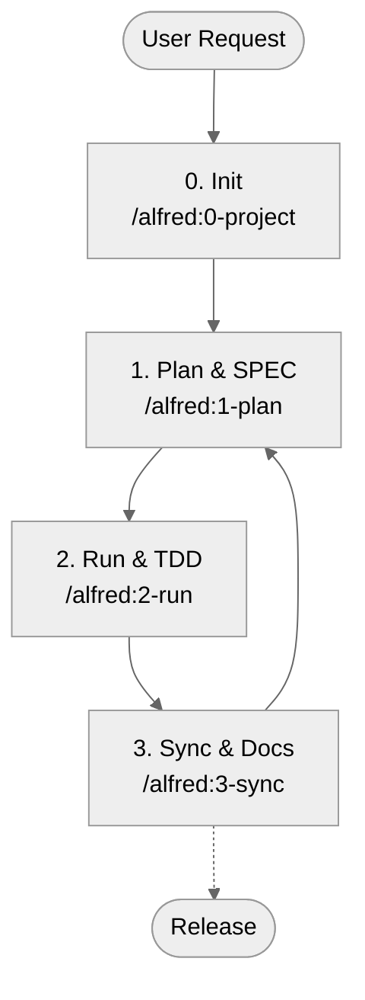

# MoAI-ADK (Agentic Development Kit)

[한국어](README.ko.md) |[English](README.md) | [ไทย](README.th.md) | [日本語](README.ja.md) | [中文](README.zh.md) | [हिन्दी](README.hi.md)

[](https://pypi.org/project/moai-adk/)
[](https://opensource.org/licenses/MIT)
[](https://www.python.org/)
[](https://github.com/modu-ai/moai-adk/actions/workflows/moai-gitflow.yml)
[](https://codecov.io/gh/modu-ai/moai-adk)
[](https://github.com/modu-ai/moai-adk)

> **MoAI-ADK delivers a seamless development workflow that naturally connects SPEC → TEST (TDD) → CODE → DOCUMENTATION with AI.**

---

## 1. MoAI-ADK at a Glance

MoAI-ADK transforms AI-powered development with three core principles. Use the navigation below to jump to the section that matches your needs.

If you're **new to MoAI-ADK**, start with "What is MoAI-ADK?".
If you want to **get started quickly**, jump straight to "5-Minute Quick Start".
If you've **already installed it and want to understand the concepts**, we recommend "5 Key Concepts".

| Question                           | Jump To                                                                  |
| ---------------------------------- | ------------------------------------------------------------------------ |
| First time here—what is it?        | [What is MoAI-ADK?](#what-is-moai-adk)                                   |
| How do I get started?              | [5-Minute Quick Start](#5-minute-quick-start)                            |
| What's the basic flow?             | [Core Workflow (0 → 3)](#core-workflow-0--3)                             |
| What do Plan/Run/Sync commands do? | [Command Cheat Sheet](#command-cheat-sheet)                              |
| What are SPEC, TDD, TAG?           | [5 Key Concepts](#5-key-concepts)                                        |
| Tell me about agents/Skills        | [Sub-agents & Skills Overview](#sub-agents--skills-overview)             |
| Want to dive deeper?               | [Additional Resources](#additional-resources)                            |

---

## What is MoAI-ADK?

### The Problem: Trust Crisis in AI Development

Today, countless developers want help from Claude or ChatGPT, but can't shake one fundamental doubt: **"Can I really trust the code this AI generates?"**

The reality looks like this. Ask an AI to "build a login feature" and you'll get syntactically perfect code. But these problems keep repeating:

- **Unclear Requirements**: The basic question "What exactly should we build?" remains unanswered. Email/password login? OAuth? 2FA? Everything relies on guessing.
- **Missing Tests**: Most AIs only test the "happy path". Wrong password? Network error? Three months later, bugs explode in production.
- **Documentation Drift**: Code gets modified but docs stay the same. The question "Why is this code here?" keeps repeating.
- **Context Loss**: Even within the same project, you have to explain everything from scratch each time. Project structure, decision rationale, previous attempts—nothing gets recorded.
- **Impact Tracking Impossible**: When requirements change, you can't track which code is affected.

### The Solution: SPEC-First TDD with Alfred SuperAgent

**MoAI-ADK** (MoAI Agentic Development Kit) is an open-source framework designed to **systematically solve** these problems.

The core principle is simple yet powerful:

> **"No tests without code, no SPEC without tests"**

More precisely, it's the reverse order:

> **"SPEC comes first. No tests without SPEC. No complete documentation without tests and code."**

When you follow this order, magical things happen:

**1️⃣ Clear Requirements**
Write SPECs first with the `/alfred:1-plan` command. A vague request like "login feature" transforms into **clear requirements** like "WHEN valid credentials are provided, the system SHALL issue a JWT token". Alfred's spec-builder uses EARS syntax to create professional SPECs in just 3 minutes.

**2️⃣ Test Guarantee**
`/alfred:2-run` automatically performs Test-Driven Development (TDD). It proceeds in RED (failing test) → GREEN (minimal implementation) → REFACTOR (cleanup) order, **guaranteeing 85%+ test coverage**. No more "testing later". Tests drive code creation.

**3️⃣ Automatic Documentation Sync**
A single `/alfred:3-sync` command **synchronizes** all code, tests, and documentation. README, CHANGELOG, API docs, and Living Documents all update automatically. Six months later, code and docs still match.

**4️⃣ Tracking with @TAG System**
Every piece of code, test, and documentation gets a `@TAG:ID`. When requirements change later, one command—`rg "@SPEC:AUTH-001"`—**finds all related tests, implementations, and docs**. You gain confidence during refactoring.

**5️⃣ Alfred Remembers Context**
A team of AI agents collaborate to **remember** your project's structure, decision rationale, and work history. No need to repeat the same questions.

### MoAI-ADK's 3 Core Promises

For beginners to remember easily, MoAI-ADK's value simplifies to three things:

**First, SPEC comes before code**
Start by clearly defining what to build. Writing SPEC helps discover problems before implementation. Communication costs with teammates drop dramatically.

**Second, tests drive code (TDD)**
Write tests before implementation (RED). Implement minimally to pass tests (GREEN). Then clean up the code (REFACTOR). Result: fewer bugs, confidence in refactoring, code anyone can understand.

**Third, documentation and code always match**
One `/alfred:3-sync` command auto-updates all documentation. README, CHANGELOG, API docs, and Living Documents always sync with code. No more despair when modifying six-month-old code.

---

## Why Do You Need It?

### Real Challenges in AI Development

Modern AI-powered development faces various challenges. MoAI-ADK **systematically solves** all these problems:

| Concern                         | Traditional Approach Problem                       | MoAI-ADK Solution                                             |
| ------------------------------- | -------------------------------------------------- | ------------------------------------------------------------- |
| "Can't trust AI code"           | Implementation without tests, unclear verification | Enforces SPEC → TEST → CODE order, guarantees 85%+ coverage   |
| "Repeating same explanations"   | Context loss, unrecorded project history           | Alfred remembers everything, 19 AI team members collaborate   |
| "Hard to write prompts"         | Don't know how to write good prompts               | `/alfred` commands provide standardized prompts automatically |
| "Documentation always outdated" | Forget to update docs after code changes           | `/alfred:3-sync` auto-syncs with one command                  |
| "Don't know what changed where" | Hard to search code, unclear intent                | @TAG chain connects SPEC → TEST → CODE → DOC                  |
| "Team onboarding takes forever" | New members can't grasp code context               | Reading SPEC makes intent immediately clear                   |

### Benefits You Can Experience Right Now

From the moment you adopt MoAI-ADK, you'll feel:

- **Faster Development**: Clear SPEC reduces round-trip explanation time
- **Fewer Bugs**: SPEC-based tests catch issues early
- **Better Code Understanding**: @TAG and SPEC make intent immediately clear
- **Lower Maintenance Costs**: Code and docs always match
- **Efficient Team Collaboration**: Clear communication through SPEC and TAG

---

## ⚡ 3-Minute Lightning Start

Get your first MoAI-ADK project running in **3 simple steps**. Beginners can finish in under 5 minutes.

### Step 1: Install uv (about 1 minute)

#### Command

```bash
# macOS/Linux
curl -LsSf https://astral.sh/uv/install.sh | sh

# Windows (PowerShell)
powershell -c "irm https://astral.sh/uv/install.ps1 | iex"

# Verify
uv --version
```

#### Expected Output
```
✓ uv 0.5.1 is already installed
$ uv --version
uv 0.5.1
```

#### Next: Install MoAI-ADK

```bash
uv tool install moai-adk

# Result: ✅ Installed moai-adk v0.9.0
```

**Verification**:
```bash
moai-adk --version
# Output: MoAI-ADK v0.9.0
```

---

### Step 2: Create Your First Project (about 1 minute)

#### Command

```bash
moai-adk init hello-world
cd hello-world
```

#### What Gets Created

```
hello-world/
├── .moai/              ✅ Alfred configuration
├── .claude/            ✅ Claude Code automation
├── CLAUDE.md           ✅ Project guide
└── README.md           ✅ Project documentation
```

#### Verification: Check Core Files

```bash
# Verify core config file exists
ls -la .moai/config.json  # ✅ Should exist
ls -la .claude/commands/  # ✅ Should have commands

# Or all at once
moai-adk doctor
```

**Expected Output**:
```
✅ Python 3.13.0
✅ uv 0.5.1
✅ .moai/ directory initialized
✅ .claude/ directory ready
✅ 12 agents configured
✅ 55 skills loaded
```

---

### Step 3: Start Alfred (about 1 minute)

#### Run Claude Code

```bash
claude
```

#### Enter in Claude Code

```
/alfred:0-project
```

#### Alfred Will Ask

```
Q1: Project name?
A: hello-world

Q2: Project goal?
A: Learning MoAI-ADK

Q3: Main development language?
A: python

Q4: Mode?
A: personal (for local development)
```

#### Result: Project Ready! ✅

```
✅ Project initialized
✅ Config saved to .moai/config.json
✅ Documents created in .moai/project/
✅ Alfred recommends skills

Next: Run /alfred:1-plan "your feature description"
```

---

## Next: Complete Your First Feature in 10 Minutes

You're now ready to build your first complete feature with SPEC, TDD, and auto-generated docs!

> **→ Continue to: ["First 10-Minute Hands-On: Hello World API"](#-first-10-minute-hands-on-hello-world-api)**

In this section you'll experience:
- ✅ Define an API using SPEC
- ✅ Complete TDD cycle (RED → GREEN → REFACTOR)
- ✅ Auto-generate documentation
- ✅ Understand @TAG system

---

## Earlier Detailed Guide (Optional Reading)

Need more explanations? See detailed guides below.

### Detailed Installation Guide

**After installing uv, verify PATH is set**:
```bash
# If uv command not found, set PATH manually (macOS/Linux)
export PATH="$HOME/.cargo/bin:$PATH"

# Verify again
uv --version
```

**Available moai-adk commands**:
```bash
moai-adk init          # Initialize new project
moai-adk doctor        # System diagnostics
moai-adk update        # Update to latest version
```

### Detailed Project Creation

**Create a new project**:
```bash
moai-adk init my-project
cd my-project
```

**Add to existing project**:
```bash
cd your-existing-project
moai-adk init .
```

Complete directory structure created:
```
my-project/
├── .moai/                          # MoAI-ADK project configuration
│   ├── config.json                 # Project settings (language, mode, owner)
│   ├── project/                    # Project information
│   │   ├── product.md              # Product vision and goals
│   │   ├── structure.md            # Directory structure
│   │   └── tech.md                 # Tech stack and architecture
│   ├── memory/                     # Alfred's knowledge base (8 files)
│   │   ├── CLAUDE-AGENTS-GUIDE.md  # Sub-agent collaboration guide
│   │   ├── CLAUDE-RULES.md         # Decision rules and standards
│   │   ├── CLAUDE-PRACTICES.md     # Workflow patterns and examples
│   │   ├── CONFIG-SCHEMA.md        # .moai/config.json schema
│   │   ├── DEVELOPMENT-GUIDE.md    # SPEC-First TDD workflow guide
│   │   ├── GITFLOW-PROTECTION-POLICY.md  # Git branch protection
│   │   ├── SKILLS-DESCRIPTION-POLICY.md  # Skills management policy
│   │   └── SPEC-METADATA.md        # SPEC YAML frontmatter standard
│   ├── specs/                      # SPEC files
│   │   └── SPEC-XXX-001/           # Each SPEC in its own folder
│   │       └── spec.md             # EARS-format specification
│   └── reports/                    # Analysis reports
├── .claude/                        # Claude Code automation
│   ├── agents/                     # 12 Sub-agents
│   │   └── alfred/
│   │       ├── project-manager.md         # Project initialization
│   │       ├── spec-builder.md            # SPEC authoring (EARS)
│   │       ├── implementation-planner.md  # Architecture & TAG design
│   │       ├── tdd-implementer.md         # RED-GREEN-REFACTOR loop
│   │       ├── doc-syncer.md              # Documentation sync
│   │       ├── quality-gate.md            # TRUST 5 verification
│   │       ├── tag-agent.md               # TAG chain validation
│   │       ├── trust-checker.md           # Code quality checks
│   │       ├── debug-helper.md            # Error analysis & fixes
│   │       ├── git-manager.md             # GitFlow & PR management
│   │       ├── cc-manager.md              # Claude Code optimization
│   │       └── skill-factory.md           # Skills creation & updates
│   ├── commands/                   # 4 Alfred commands
│   │   └── alfred/
│   │       ├── 0-project.md        # Project initialization
│   │       ├── 1-plan.md           # SPEC authoring
│   │       ├── 2-run.md            # TDD implementation
│   │       └── 3-sync.md           # Documentation sync
│   ├── skills/                     # 55+ Claude Skills
│   │   ├── moai-foundation-*       # 6 Foundation tier
│   │   ├── moai-essentials-*       # 4 Essentials tier
│   │   ├── moai-alfred-*           # 7 Alfred tier
│   │   ├── moai-domain-*           # 10 Domain tier
│   │   ├── moai-lang-*             # 18 Language tier
│   │   ├── moai-cc-*               # 8 Claude Code tier
│   │   ├── moai-skill-factory      # 1 Skill Factory
│   │   └── moai-spec-authoring     # 1 SPEC authoring
│   ├── hooks/                      # Event-driven automation
│   │   └── alfred/
│   │       └── alfred_hooks.py     # 5 hooks (Session, PreTool, etc.)
│   ├── output-styles/              # Response styles
│   │   └── alfred/
│   │       ├── agentic-coding.md       # Professional development mode
│   │       ├── moai-adk-learning.md    # Educational explanations mode
│   │       └── study-with-alfred.md    # Interactive learning mode
│   └── settings.json               # Claude Code settings
├── src/                            # Implementation code
├── tests/                          # Test code
├── docs/                           # Auto-generated documentation
├── CLAUDE.md                       # Alfred's core directives
└── README.md
```

---

## Core Concept: 3-Step Repeating Cycle

After initial setup, every feature follows this 3-step cycle:

| Step | Command | What It Does | Time |
|------|---------|-------------|------|
| 📋 **PLAN** | `/alfred:1-plan "feature description"` | Write SPEC (EARS format) | 2 min |
| 💻 **RUN** | `/alfred:2-run SPEC-ID` | TDD implementation (RED→GREEN→REFACTOR) | 5 min |
| 📚 **SYNC** | `/alfred:3-sync` | Auto-sync documentation | 1 min |

**One cycle = ~8 minutes** → **Complete 7-8 features per day** ⚡

---

## Original Detailed Guide (Complete 7-Step Analysis)

For comprehensive explanation, see the previous version in [GitHub History](https://github.com/modu-ai/moai-adk/blob/main/README.md).

---

---

## 🚀 First 10-Minute Hands-On: Hello World API

**Goal**: Experience the complete MoAI-ADK workflow in 10 minutes
**Learn**: SPEC writing, TDD implementation, documentation automation, @TAG system

> Already completed the 3-minute quick start? Start here!

### Prerequisites
- ✅ MoAI-ADK installed
- ✅ Project created (`moai-adk init hello-world`)
- ✅ Claude Code running

---

### Step 1: Write SPEC (2 minutes)

#### Command
```bash
/alfred:1-plan "GET /hello endpoint - receive query parameter 'name' and return greeting"
```

#### Alfred Automatically Creates
```
✅ SPEC ID: HELLO-001
✅ File: .moai/specs/SPEC-HELLO-001/spec.md
✅ Branch: feature/SPEC-HELLO-001
```

#### Check Generated SPEC
```bash
cat .moai/specs/SPEC-HELLO-001/spec.md
```

**Example Content**:
```yaml
---
id: HELLO-001
version: 0.0.1
status: draft
priority: high
---

# `@SPEC:HELLO-001: Hello World API

## Ubiquitous Requirements
- System SHALL provide HTTP GET /hello endpoint

## Event-driven Requirements
- WHEN query parameter 'name' is provided, THEN return "Hello, {name}!"
- WHEN name is absent, THEN return "Hello, World!"

## Constraints
- name limited to 50 characters max
- Response format: JSON
```

✅ **Verify**: `ls .moai/specs/SPEC-HELLO-001/`

---

### Step 2: TDD Implementation (5 minutes)

#### Command
```bash
/alfred:2-run HELLO-001
```

#### 🔴 RED Phase: Write Failing Test

**File Created**: `tests/test_hello.py`

```python
# `@TEST:HELLO-001 | SPEC: SPEC-HELLO-001.md

import pytest
from fastapi.testclient import TestClient
from src.hello.api import app

client = TestClient(app)

def test_hello_with_name_should_return_personalized_greeting():
    """WHEN name provided, THEN return personalized greeting"""
    response = client.get("/hello?name=Alice")
    assert response.status_code == 200
    assert response.json() == {"message": "Hello, Alice!"}

def test_hello_without_name_should_return_default_greeting():
    """WHEN name absent, THEN return default greeting"""
    response = client.get("/hello")
    assert response.status_code == 200
    assert response.json() == {"message": "Hello, World!"}
```

**Run**:
```bash
pytest tests/test_hello.py -v
```

**Result**: ❌ FAILED (app doesn't exist yet - expected!)

**Commit**:
```bash
git add tests/test_hello.py
git commit -m "🔴 test(HELLO-001): add failing hello API tests"
```

---

#### 🟢 GREEN Phase: Minimal Implementation

**File Created**: `src/hello/api.py`

```python
# `@CODE:HELLO-001:API | SPEC: SPEC-HELLO-001.md | TEST: tests/test_hello.py

from fastapi import FastAPI

app = FastAPI()

@app.get("/hello")
def hello(name: str = "World"):
    """@CODE:HELLO-001:API - Hello endpoint"""
    return {"message": f"Hello, {name}!"}
```

**Run**:
```bash
pytest tests/test_hello.py -v
```

**Result**: ✅ PASSED (all tests pass!)

**Commit**:
```bash
git add src/hello/api.py
git commit -m "🟢 feat(HELLO-001): implement hello API"
```

---

#### ♻️ REFACTOR Phase: Add Validation

**Enhanced Code**:

```python
from fastapi import FastAPI, HTTPException

app = FastAPI()

@app.get("/hello")
def hello(name: str = "World"):
    """@CODE:HELLO-001:API - Hello endpoint with validation"""
    if len(name) > 50:
        raise HTTPException(status_code=400, detail="Name too long (max 50 chars)")
    return {"message": f"Hello, {name}!"}
```

**Add Test**:
```python
def test_hello_with_long_name_should_return_400():
    """WHEN name exceeds 50 chars, THEN return 400 error"""
    long_name = "a" * 51
    response = client.get(f"/hello?name={long_name}")
    assert response.status_code == 400
```

**Run**:
```bash
pytest tests/test_hello.py -v
```

**Result**: ✅ PASSED (all tests pass!)

**Commit**:
```bash
git add tests/test_hello.py src/hello/api.py
git commit -m "♻️ refactor(HELLO-001): add name length validation"
```

---

### Step 3: Documentation Sync (2 minutes)

#### Command
```bash
/alfred:3-sync
```

#### Alfred Automatically
```
✅ docs/api/hello.md - API documentation generated
✅ README.md - Usage examples added
✅ CHANGELOG.md - Release notes added
✅ TAG chain validated - All @TAG verified
```

#### Check Generated API Documentation
```bash
cat docs/api/hello.md
```

**Example Content**:
```markdown
# Hello API Documentation

## GET /hello

### Description
Returns a personalized greeting based on provided name.

### Parameters
- `name` (query, optional): Person's name (default: "World", max 50 chars)

### Responses
- **200**: Success
  ```json
  { "message": "Hello, Alice!" }
  ```
- **400**: Name too long

### Examples
```bash
curl "http://localhost:8000/hello?name=Alice"
# → {"message": "Hello, Alice!"}

curl "http://localhost:8000/hello"
# → {"message": "Hello, World!"}
```

### Traceability
- `@SPEC:HELLO-001` - Requirements
- `@TEST:HELLO-001` - Tests
- `@CODE:HELLO-001:API` - Implementation
```

---

### Step 4: Verify TAG Chain (1 minute)

#### Command
```bash
rg '@(SPEC|TEST|CODE|DOC):HELLO-001' -n
```

#### Output (Complete Traceability)
```
.moai/specs/SPEC-HELLO-001/spec.md:7:# `@SPEC:HELLO-001: Hello World API
tests/test_hello.py:3:# `@TEST:HELLO-001 | SPEC: SPEC-HELLO-001.md
src/hello/api.py:3:# `@CODE:HELLO-001:API | SPEC: SPEC-HELLO-001.md
docs/api/hello.md:24:- `@SPEC:HELLO-001`
```

✅ **Complete chain**: SPEC → TEST → CODE → DOC (fully traceable!)

---

### Summary: What You've Accomplished

In just 10 minutes:

✅ **SPEC** - Clear requirements documented
✅ **TDD** - Red → Green → Refactor cycle
✅ **Implementation** - Simple, testable code with @CODE TAG
✅ **Documentation** - Auto-generated from code
✅ **Traceability** - Complete @TAG chain: SPEC → TEST → CODE → DOC
✅ **Git History** - Clean, semantic commits (🔴 🟢 ♻️)

---

## Understanding CLAUDE.md (Alfred's Configuration Documents)

MoAI-ADK's AI coordination is powered by **Alfred**, the MoAI SuperAgent. Alfred's behavior and decision-making are guided by a set of **internal configuration documents** in the `.claude/` directory.

### 4-Document Structure

When you run MoAI-ADK, Alfred loads configuration from **4 coordinated documents** (stored in your `.claude/` directory):

| Document                   | Size  | Purpose                                                                                                          | When Alfred Reads It                                          |
| -------------------------- | ----- | ---------------------------------------------------------------------------------------------------------------- | ------------------------------------------------------------- |
| **CLAUDE.md**              | ~7kb  | Alfred's identity, core directives, project metadata                                                             | At session start (bootstrap)                                  |
| **CLAUDE-AGENTS-GUIDE.md** | ~14kb | Sub-agent roster (19 members), Skills distribution (55 packs), team structure                                    | When selecting which agent to invoke                          |
| **CLAUDE-RULES.md**        | ~17kb | Decision-making rules (Skill invocation, Interactive Questions, TAG validation), commit templates, TRUST 5 gates | During each decision point (e.g., when to ask user questions) |
| **CLAUDE-PRACTICES.md**    | ~8kb  | Practical workflows, context engineering (JIT retrieval), on-demand agent patterns, real examples                | During implementation phase                                   |

### Why This Structure Matters

**For Developers**: These documents define how Alfred interprets your requirements and orchestrates development. Understanding them helps you:

- Write clearer specifications that Alfred understands better
- Know which agent/Skill will be invoked for your request
- Understand decision points where Alfred might ask you questions

**For AI**: Progressive disclosure means:

- **Session Start**: Load only CLAUDE.md (7kb) — minimal overhead
- **On-Demand**: Load CLAUDE-AGENTS-GUIDE.md, CLAUDE-RULES.md, CLAUDE-PRACTICES.md only when needed
- **Result**: Faster session boot, cleaner context, clear decision logic

### Example: What Happens When You Run `/alfred:2-run`

1. **CLAUDE.md** is already loaded → Alfred knows its role and project context
2. Alfred checks **CLAUDE-RULES.md** → "Should I ask user questions? Which Skill applies here?"
3. If implementing code: Alfred loads **CLAUDE-AGENTS-GUIDE.md** → "Which agent executes TDD?"
4. During implementation: Alfred loads **CLAUDE-PRACTICES.md** → "How do I structure the RED → GREEN → REFACTOR workflow?"

### Customizing Alfred's Behavior

**Most developers never modify these files.** MoAI-ADK ships with optimized defaults.

**If you need to customize Alfred's behavior** (rare), edit these documents in your project's `.claude/` directory:

- Add new decision rules in **CLAUDE-RULES.md**
- Adjust agent selection logic in **CLAUDE-AGENTS-GUIDE.md**
- Document team-specific workflows in **CLAUDE-PRACTICES.md**

> ⚠️ **Important**: These are internal configuration files for Alfred, not user guides. Keep them concise and decision-focused. Most teams don't modify them.

---

## Alfred's Memory Files (.moai/memory/)

Alfred's knowledge base consists of **14 memory files** stored in `.moai/memory/`. These files define standards, rules, and guidelines that Alfred and Sub-agents reference during development.

### Core Knowledge Base (14 Files)

**Core Guides (3 files)**:

| File                     | Size  | Purpose                                  | Who Uses It            |
| ------------------------ | ----- | ---------------------------------------- | ---------------------- |
| `CLAUDE-AGENTS-GUIDE.md` | ~15KB | Sub-agent selection & collaboration      | Alfred, Developers     |
| `CLAUDE-PRACTICES.md`    | ~12KB | Real-world workflow examples & patterns  | Alfred, All Sub-agents |
| `CLAUDE-RULES.md`        | ~19KB | Skill/TAG/Git rules & decision standards | Alfred, All Sub-agents |

**Standards (4 files)**:

| File                           | Size  | Purpose                               | Who Uses It                |
| ------------------------------ | ----- | ------------------------------------- | -------------------------- |
| `CONFIG-SCHEMA.md`             | ~12KB | `.moai/config.json` schema definition | project-manager            |
| `DEVELOPMENT-GUIDE.md`         | ~14KB | SPEC-First TDD workflow guide         | All Sub-agents, Developers |
| `GITFLOW-PROTECTION-POLICY.md` | ~6KB  | Git branch protection policy          | git-manager                |
| `SPEC-METADATA.md`             | ~9KB  | SPEC YAML frontmatter standard (SSOT) | spec-builder, doc-syncer   |

**Implementation Analysis (7 files)**: Internal reports and policy documents for Skills management, workflow improvements, and team integration analysis.

### When Are Memory Files Loaded?

**Session Start (Always)**:

- `CLAUDE.md`
- `CLAUDE-AGENTS-GUIDE.md`
- `CLAUDE-RULES.md`

**Just-In-Time (Command Execution)**:

- `/alfred:1-plan` → `SPEC-METADATA.md`, `DEVELOPMENT-GUIDE.md`
- `/alfred:2-run` → `DEVELOPMENT-GUIDE.md`
- `/alfred:3-sync` → `DEVELOPMENT-GUIDE.md`

**Conditional (On-Demand)**:

- Config changes → `CONFIG-SCHEMA.md`
- Git operations → `GITFLOW-PROTECTION-POLICY.md`
- Skill creation → `SKILLS-DESCRIPTION-POLICY.md`

### Why Memory Files Matter

1. **Single Source of Truth (SSOT)**: Each standard is defined exactly once, eliminating conflicts
2. **Context Efficiency**: JIT loading reduces initial session overhead (only 3 files at start)
3. **Consistent Decisions**: All Sub-agents follow the same rules from `CLAUDE-RULES.md`
4. **Traceability**: SPEC metadata, @TAG rules, and Git standards all documented

### Usage Frequency

| Priority  | Files                                              | Usage Pattern       |
| --------- | -------------------------------------------------- | ------------------- |
| Very High | `CLAUDE-RULES.md`                                  | Every decision      |
| High      | `DEVELOPMENT-GUIDE.md`, `SPEC-METADATA.md`         | All commands        |
| Medium    | `CLAUDE-AGENTS-GUIDE.md`, `CLAUDE-PRACTICES.md`    | Agent coordination  |
| Low       | `CONFIG-SCHEMA.md`, `GITFLOW-PROTECTION-POLICY.md` | Specific operations |

> 📚 **Complete Analysis**: See `.moai/memory/MEMORY-FILES-USAGE.md` for comprehensive documentation on who uses each file, when they're loaded, where they're referenced, and why they're needed.

---

## Keeping MoAI-ADK Up-to-Date

### Check Version

```bash
# Check currently installed version
moai-adk --version

# Check latest version on PyPI
uv tool list  # Check current version of moai-adk
```

### Upgrading

#### Method 1: MoAI-ADK Built-in Update Command (Recommended - 3-Stage Workflow, v0.6.3+)
<!-- @DOC:UPDATE-REFACTOR-002-003 -->

MoAI-ADK's `update` command provides **automatic tool detection** and **intelligent 3-stage workflow** with **70-80% performance improvement** for templates already synchronized:

**Basic 3-Stage Workflow** (automatic tool detection):
```bash
# Stage 1: Package version check
# Shows version comparison, upgrades if needed
moai-adk update

# Stage 2: Config version comparison (NEW in v0.6.3)
# Compares package template version with project config
# If already synchronized, exits early (70-80% faster!)

# Stage 3: Template sync (only if needed)
# Creates backup → Syncs templates → Updates config
# Message: "✓ Templates synced!" or "Templates are up to date!"
```

**Check for updates without applying them**:
```bash
# Preview available updates (shows package & config versions)
moai-adk update --check
```

**Templates-only mode** (skip package upgrade, useful for manual upgrades):
```bash
# If you manually upgraded the package, sync templates only
# Still performs Stage 2 config comparison for accuracy
moai-adk update --templates-only
```

**CI/CD mode** (auto-confirm all prompts):
```bash
# Auto-confirms all prompts - useful in automated pipelines
# Runs all 3 stages automatically
moai-adk update --yes
```

**Force mode** (skip backup creation):
```bash
# Update without creating backup (use with caution)
# Still performs config version comparison
moai-adk update --force
```

**How the 3-Stage Workflow Works** (v0.6.3):

| Stage | Condition | Action | Performance |
|-------|-----------|--------|-------------|
| **Stage 1** | Package: current < latest | Detects installer → Upgrades package | ~20-30s |
| **Stage 2** | Config: compare versions | Reads template_version from config.json | ~1s ⚡ **NEW!** |
| **Stage 3** | Config: package > project | Creates backup → Syncs templates (if needed) | ~10-15s |

**Performance Improvement** (v0.6.3):
- **Same version case**: 12-18s → 3-4s (**70-80% faster!** ⚡)
  - Stage 1: ~1s (version check)
  - Stage 2: ~1s (config comparison)
  - Stage 3: **skipped** (already synchronized)

- **CI/CD repeated runs**: **-30% cost reduction**
  - First run: Full sync
  - Subsequent runs: Only version checks (~3-4s)

**Why 3 stages?**
Python processes cannot upgrade themselves while running. The 3-stage workflow is necessary for safety AND performance:
1. **Stage 1**: Package upgrade detection (compares with PyPI)
2. **Stage 2**: Template sync necessity detection (compares config versions) - NEW v0.6.3
3. **Stage 3**: Templates and configuration sync (only if necessary)

**Key Improvement in v0.6.3**:
Previously, all updates would sync templates even if nothing changed. Now, config version comparison (Stage 2) detects when templates are already current, **skipping Stage 3 entirely** (saves 10-15 seconds!)

**Config Version Tracking**:
```json
{
  "project": {
    "template_version": "0.6.3"  // Tracks last synchronized template version
  }
}
```
This field allows MoAI-ADK to accurately determine if templates need synchronization without re-syncing everything.

#### Method 2: Upgrade with uv tool command

**Upgrade specific tool (recommended)**

```bash
# Upgrade only moai-adk to latest version
uv tool upgrade moai-adk
```

**Upgrade all installed tools**

```bash
# Upgrade all uv tool installations to latest versions
uv tool update
```

**Install specific version**

```bash
# Reinstall specific version (e.g., 0.4.2)
uv tool install moai-adk
```

### Verify After Update

```bash
# 1. Check installed version
moai-adk --version

# 2. Verify project works correctly
moai-adk doctor

# 3. Check updated features in Alfred
cd your-project
claude
/alfred:0-project  # Verify new features like language selection
```

> 💡 **New 2-Stage Update Workflow**:
>
> - **Stage 1**: `moai-adk update` detects installer (uv tool, pipx, or pip) and upgrades package
> - **Stage 2**: `moai-adk update` again to sync templates, config, and agent/Skills
> - **Smart detection**: Auto-detects whether package upgrade is needed based on version comparison
> - **CI/CD ready**: Use `moai-adk update --yes` for fully automated updates in pipelines
> - **Manual upgrade path**: Use `moai-adk update --templates-only` after manually upgrading the package
> - **Rollback safe**: Automatic backups in `.moai-backups/` before template sync

---

## Development Setup for Contributors

If you're developing **MoAI-ADK itself**, follow these steps to set up your development environment.

### Prerequisites

- Python 3.13+
- `uv` package manager
- Git

### Setup Steps

#### Step 1: Clone and Install in Editable Mode

```bash
# Clone the repository
git clone https://github.com/modu-ai/moai-adk.git
cd moai-adk

# Install in editable mode (creates symlink, not a copy)
uv pip install -e .

# Or with pip (also works)
pip install -e .
```

The editable install allows your local changes to be immediately reflected when using `moai-adk` command.

#### Step 2: Initialize Development Configuration

After the editable install, initialize the development repository's configuration:

```bash
# Run the initialization script
bash .moai/scripts/init-dev-config.sh
```

**What this script does:**
- Extracts the actual version from `pyproject.toml`
- Replaces template placeholders (`{{MOAI_VERSION}}`) with actual version values in `.moai/config.json`
- Sets up `project.template_version` field
- Ensures the `moai-adk update` command works correctly on first run

**Why is this necessary?**

When you install MoAI-ADK in editable mode, the `.moai/config.json` file contains unsubstituted template placeholders. This causes the first `moai-adk update` command to fail with version comparison errors. The init script resolves these placeholders so everything works seamlessly.

#### Step 3: Verify Setup

```bash
# Check that moai-adk works
moai-adk --version

# Run the health check
moai-adk doctor

# Expected output:
# ✅ Python version: 3.13+
# ✅ UV installed
# ✅ Project structure: Valid
# ✅ Configuration: Ready
```

#### Step 4: Run Tests

```bash
# Run all tests with coverage
pytest tests/

# Run specific test module
pytest tests/unit/test_update.py -v

# Run with coverage report
pytest tests/ --cov=src/moai_adk --cov-report=html

# Check coverage thresholds
pytest tests/ --cov=src/moai_adk --cov-report=term-missing
```

### Common Development Workflow

#### After Making Code Changes

```bash
# 1. Run tests to ensure nothing broke
pytest tests/ -v

# 2. Check code style
ruff check src/
ruff format src/

# 3. Type checking
mypy src/

# 4. If you modified update.py, test the update command
moai-adk update --check
```

#### Testing the Update Command

The update command has been fixed to handle invalid version strings gracefully. To test it in development:

```bash
# Test update without applying it
moai-adk update --check

# Test with force mode (skips backup)
moai-adk update --force

# Test with specific version
moai-adk update --templates-only
```

### Understanding the Init Script

The `.moai/scripts/init-dev-config.sh` script performs these operations:

1. **Extracts Version**: Reads `pyproject.toml` to get the current version
2. **Updates Config**: Modifies `.moai/config.json` to set:
   - `moai.version` → actual version value
   - `project.template_version` → actual version value
3. **Validates**: Ensures the JSON structure is preserved correctly
4. **Provides Feedback**: Shows what was updated and verifies the changes

### Troubleshooting Development Setup

#### Problem: `moai-adk` command not found

```bash
# Solution 1: Reinstall in editable mode
uv pip install -e .

# Solution 2: Verify uv environment
uv pip list | grep moai-adk

# Solution 3: Use full path
python -m moai_adk --version
```

#### Problem: `.moai/config.json` still has placeholders after running init script

```bash
# Manually check the config
cat .moai/config.json | grep -i moai_version

# If still showing {{MOAI_VERSION}}, rerun the script:
bash .moai/scripts/init-dev-config.sh

# Or manually update using Python:
python3 << 'EOF'
import json
from pathlib import Path

config_path = Path(".moai/config.json")
config = json.loads(config_path.read_text())

# Update manually
config['moai']['version'] = "0.8.1"
config['project']['template_version'] = "0.8.1"

config_path.write_text(json.dumps(config, indent=2) + '\n')
print("✅ Config updated manually")
EOF
```

#### Problem: `moai-adk update` requires running twice

This issue has been **fixed** in v0.8.1+. If you're experiencing this:

1. Ensure you've run the init script: `bash .moai/scripts/init-dev-config.sh`
2. Update to the latest version: `pip install -e --upgrade .`
3. Verify the config has actual versions: `cat .moai/config.json | grep version`

**What was the issue?**
- Development installations had unsubstituted `{{MOAI_VERSION}}` placeholders in config
- First `moai-adk update` would fail comparing "0.8.1" vs "{{MOAI_VERSION}}"
- Second run might partially work after partial sync

**How it's fixed:**
- `init-dev-config.sh` replaces placeholders with actual versions
- Code now gracefully handles InvalidVersion exceptions
- Added comprehensive unit tests for placeholder detection

#### Problem: UV Tool Upgrade Shows "Nothing to upgrade" Despite New Version

**Status**: Automatically fixed in v0.9.1+ with cache refresh retry

**Symptoms:**
- `moai-adk update` shows "Nothing to upgrade"
- PyPI has a newer version available
- Caused by stale UV cache metadata

**Automatic Fix (v0.9.1+):**
The system now automatically detects stale cache and retries:
1. Detects "Nothing to upgrade" message
2. Compares installed version vs PyPI latest version
3. Clears UV cache: `uv cache clean moai-adk`
4. Automatically retries upgrade
5. Completes in a single command run

**Manual Workaround (if needed):**
```bash
# Clear UV cache and retry
uv cache clean moai-adk && moai-adk update
```

**Technical Details:**
- Root cause: UV caches PyPI metadata that can become outdated
- Detection: Compares version strings when "Nothing to upgrade" appears
- Retry limit: Maximum 1 retry to prevent infinite loops
- Timeout: 10 seconds for cache clear operation

**References:**
- SPEC: @SPEC:UPDATE-CACHE-FIX-001
- Implementation: @CODE:UPDATE-CACHE-FIX-001-001, @CODE:UPDATE-CACHE-FIX-001-002, @CODE:UPDATE-CACHE-FIX-001-003
- Tests: @TEST:UPDATE-CACHE-FIX-001

### Contributing Tests

When adding new features, always include tests:

```bash
# Add tests to tests/unit/ or tests/integration/
# Follow existing test patterns in test_update.py

# Run your new tests
pytest tests/unit/test_*.py -v

# Ensure coverage remains ≥ 85%
pytest tests/ --cov=src/moai_adk --cov-report=term-missing
```

### Making a Pull Request

Before opening a PR, ensure:

```bash
# 1. All tests pass
pytest tests/ -v

# 2. Coverage is adequate
pytest tests/ --cov=src/moai_adk --cov-report=term-missing

# 3. Code is formatted
ruff format src/
ruff check src/

# 4. Types are valid
mypy src/

# 5. Init script works
bash .moai/scripts/init-dev-config.sh

# 6. Update command works
moai-adk update --check
```

---

## Core Workflow (0 → 3)

Alfred iteratively develops projects with four commands.



### 0. INIT — Project Preparation

- Questions about project introduction, target, language, mode (locale)
- Auto-generates `.moai/config.json`, `.moai/project/*` 5 documents
- Language detection and recommended Skill Pack deployment (Foundation + Essentials + Domain/Language)
- Template cleanup, initial Git/backup checks

### 1. PLAN — Agree on What to Build

- Write SPEC with EARS template (includes `@SPEC:ID`)
- Organize Plan Board, implementation ideas, risk factors
- Auto-create branch/initial Draft PR in Team mode

### 2. RUN — Test-Driven Development (TDD)

- Phase 1 `implementation-planner`: Design libraries, folders, TAG layout
- Phase 2 `tdd-implementer`: RED (failing test) → GREEN (minimal implementation) → REFACTOR (cleanup)
- quality-gate verifies TRUST 5 principles, coverage changes

### 3. SYNC — Documentation & PR Organization

- Sync Living Document, README, CHANGELOG, etc.
- Validate TAG chain and recover orphan TAGs
- Generate Sync Report, transition Draft → Ready for Review, support `--auto-merge` option

---

## Command Cheat Sheet

| Command                        | What it does                                                      | Key Outputs                                                        |
| ------------------------------ | ----------------------------------------------------------------- | ------------------------------------------------------------------ |
| `/alfred:0-project`            | Collect project description, create config/docs, recommend Skills | `.moai/config.json`, `.moai/project/*`, initial report             |
| `/alfred:1-plan <description>` | Analyze requirements, draft SPEC, write Plan Board                | `.moai/specs/SPEC-*/spec.md`, plan/acceptance docs, feature branch |
| `/alfred:2-run <SPEC-ID>`      | Execute TDD, test/implement/refactor, verify quality              | `tests/`, `src/` implementation, quality report, TAG connection    |
| `/alfred:3-sync`               | Sync docs/README/CHANGELOG, organize TAG/PR status                | `docs/`, `.moai/reports/sync-report.md`, Ready PR                  |
| `/alfred:9-feedback` | Interactively create GitHub Issues (type → title → description → priority) | GitHub Issue with auto labels, priority, URL        |

> ❗ All commands maintain **Phase 0 (optional) → Phase 1 → Phase 2 → Phase 3** cycle structure. Alfred automatically reports execution status and next-step suggestions.
>
> 💡 **New in v0.7.0+**: `/alfred:9-feedback` enables instant GitHub Issue creation during development, keeping your workflow uninterrupted while keeping issues tracked and visible to the team.

---

## SPEC GitHub Issue Automation

MoAI-ADK now provides **automatic GitHub Issue synchronization** from SPEC documents, seamlessly integrating requirements with issue tracking in team mode.

### How It Works

When you create a SPEC document using `/alfred:1-plan` and push it to a feature branch:

1. **GitHub Actions Workflow** automatically triggers on PR events
2. **SPEC Metadata** (ID, version, status, priority) is extracted from YAML frontmatter
3. **GitHub Issue** is created with full SPEC content and metadata table
4. **PR Comment** is added with a link to the created issue
5. **Labels** are automatically applied based on priority (critical, high, medium, low)

### What Gets Synchronized

**From SPEC to GitHub Issue:**
- **SPEC ID**: Unique identifier (e.g., AUTH-001, USER-001)
- **Version**: Semantic versioning (v0.1.0, v1.0.0)
- **Status**: draft, in-review, in-progress, completed, stable
- **Priority**: critical, high, medium, low (becomes GitHub label)
- **Full Content**: EARS requirements, acceptance criteria, dependencies

**GitHub Issue Format:**
```markdown
# [SPEC-AUTH-001] User Authentication (v1.0.0)

## SPEC Metadata

| Field | Value |
|-------|-------|
| **ID** | AUTH-001 |
| **Version** | v1.0.0 |
| **Status** | in-progress |
| **Priority** | high |

## SPEC Document

[Full SPEC content from .moai/specs/SPEC-AUTH-001/spec.md]

---

📎 **Branch**: `feature/AUTH-001`
🔗 **PR**: #123
📝 **Auto-synced**: This issue is automatically synchronized from the SPEC document
```

### Features

✅ **Automatic Issue Creation**: GitHub Issue created on every PR with SPEC file changes
✅ **Metadata Extraction**: ID, version, status, priority automatically parsed from YAML frontmatter
✅ **PR Integration**: Issue linked to PR via automatic comment
✅ **Label Management**: Priority-based labels (critical, high, medium, low) auto-applied
✅ **CodeRabbit Review** (local only): AI-powered SPEC quality validation in local development

### Setup Requirements

**GitHub Actions Workflow**: `.github/workflows/spec-issue-sync.yml`
**GitHub Issue Template**: `.github/ISSUE_TEMPLATE/spec.yml`
**GitHub Labels**: `spec`, `planning`, `critical`, `high`, `medium`, `low`

All templates are automatically installed with MoAI-ADK and synced during `moai-adk init`.

### CodeRabbit Integration (Local Only)

When working in your **local development environment**, CodeRabbit provides automatic SPEC quality review:

**What CodeRabbit Reviews:**
- ✅ All 7 required metadata fields (id, version, status, created, updated, author, priority)
- ✅ HISTORY section formatting and chronological order
- ✅ EARS requirements structure (Ubiquitous, Event-driven, State-driven, Constraints, Optional)
- ✅ Acceptance criteria in Given-When-Then format
- ✅ @TAG system compliance for traceability

**CodeRabbit Configuration**: `.coderabbit.yaml` (local only, not distributed in packages)

> **Note**: CodeRabbit integration is available only in local development environments. Package users receive core GitHub Issue automation without CodeRabbit review.

### Workflow Example

```bash
# 1. Create SPEC
/alfred:1-plan "User authentication feature"

# 2. SPEC file created at .moai/specs/SPEC-AUTH-001/spec.md
# 3. Feature branch created: feature/SPEC-AUTH-001
# 4. Draft PR created (team mode)

# 5. GitHub Actions automatically:
#    - Parses SPEC metadata
#    - Creates GitHub Issue #45
#    - Adds PR comment: "✅ SPEC GitHub Issue Created - Issue: #45"
#    - Applies labels: spec, planning, high

# 6. CodeRabbit reviews SPEC (local only):
#    - Validates metadata
#    - Checks EARS requirements
#    - Provides quality score

# 7. Continue with TDD implementation
/alfred:2-run AUTH-001
```

### Benefits

1. **Centralized Tracking**: All SPEC requirements tracked as GitHub Issues
2. **Team Visibility**: Non-technical stakeholders can follow progress via Issues
3. **Automated Workflow**: No manual issue creation—fully automated from SPEC to Issue
4. **Traceability**: Direct link between SPEC files, Issues, PRs, and implementation
5. **Quality Assurance**: CodeRabbit validates SPEC quality before implementation (local only)

---

## Quick Issue Creation with `/alfred:9-feedback`

MoAI-ADK v0.7.0+ includes the **Quick Issue Creation** feature, allowing developers to instantly create GitHub Issues without interrupting their development workflow.

### Why Quick Issue Creation?

During development, you frequently encounter:
- 🐛 Bugs that need immediate reporting
- ✨ Feature ideas that come to mind
- ⚡ Performance improvements to suggest
- ❓ Architecture questions that need team discussion

**The old way**: Stop coding, go to GitHub, manually fill issue form, remember what you were working on.
**The new way**: Type one command, GitHub Issue is created instantly, continue coding.

### Interactive Dialog Flow

When you run `/alfred:9-help`, Alfred guides you through an interactive multi-step dialog:

**Step 1: Select Issue Type**
```
Alfred: What type of issue do you want to create?
[ ] 🐛 Bug Report - Something isn't working
[ ] ✨ Feature Request - Suggest new functionality
[ ] ⚡ Improvement - Enhance existing features
[ ] ❓ Question/Discussion - Ask the team
```

**Step 2: Enter Issue Title**
```
Alfred: What's the issue title?
Your input: "Login button not responding to clicks"
```

**Step 3: Enter Description (Optional)**
```
Alfred: Provide a detailed description (optional—press Enter to skip)
Your input: "When I click the login button on iPhone 15, it freezes for 5 seconds then crashes"
```

**Step 4: Select Priority Level**
```
Alfred: What's the priority level?
[ ] 🔴 Critical - System down, data loss, security breach
[ ] 🟠 High - Major feature broken, significant impact
[✓] 🟡 Medium - Normal priority (default)
[ ] 🟢 Low - Minor issues, nice-to-have
```

**Step 5: Automatic Issue Creation**
```
Alfred automatically:
1. Determines appropriate labels based on issue type and priority
2. Formats title with emoji: "🐛 [BUG] Login button not responding..."
3. Creates GitHub Issue with all information
4. Returns the issue number and URL
```

### Key Features

1. **⚡ Instant Creation**: Create GitHub Issues in seconds
2. **🏷️ Automatic Labels**: Issue type + priority automatically labeled
3. **🎯 Priority Selection**: Choose from Critical/High/Medium/Low
4. **🔗 Team Visibility**: Issues immediately visible and discussable
5. **📋 Standardized Format**: All issues follow consistent structure

### Complete Example: Bug Report During Code Review

```bash
# During code review, you notice a critical issue and want to report it instantly
$ /alfred:9-feedback

Alfred: What type of issue do you want to create?
> 🐛 Bug Report

Alfred: What's the issue title?
> Login button crash on mobile devices

Alfred: Provide a detailed description (optional—press Enter to skip)
> Tapping the login button on iPhone 15 causes app to freeze for 5 seconds then crash.
> Tested on iOS 17.2, Chrome 120 on macOS 14.2.
> Expected: Login modal should appear
> Actual: No response then crash

Alfred: What's the priority level?
> 🟠 High

✅ GitHub Issue #234 created successfully!

📋 Title: 🐛 [BUG] Login button crash on mobile devices
🟠 Priority: High
🏷️  Labels: bug, reported, priority-high
🔗 URL: https://github.com/owner/repo/issues/234

💡 Next: Continue with your work—the issue is now tracked!
```

### Integration with MoAI-ADK Workflow

1. **During Development**: Use `/alfred:9-help` to report bugs/ideas instantly
2. **In Code Review**: Convert improvement suggestions to tracked issues
3. **When Planning**: Reference created issues in SPEC documents
4. **During Sync**: Link issues to SPEC requirements with `/alfred:3-sync`

### Prerequisites

- GitHub CLI (`gh`) installed and authenticated
- Repository initialized with Git

### Learn More

See `.moai/docs/quick-issue-creation-guide.md` for comprehensive documentation including:
- Detailed usage examples
- Best practices and tips
- Troubleshooting guide
- Integration with SPEC documents

---

## 5 Key Concepts

MoAI-ADK consists of 5 key concepts. Each concept connects to the others, and together they create a powerful development system.

### Key Concept 1: SPEC-First (Requirements First)

**Metaphor**: Like building a house without an architect, you shouldn't code without a blueprint.

**Core Idea**: Before implementation, **clearly define "what to build"**. This isn't just documentation—it's an **executable spec** that both teams and AI can understand.

**EARS Syntax 5 Patterns**:

1. **Ubiquitous** (basic function): "The system SHALL provide JWT-based authentication"
2. **Event-driven** (conditional): "WHEN valid credentials are provided, the system SHALL issue a token"
3. **State-driven** (during state): "WHILE the user is authenticated, the system SHALL allow access to protected resources"
4. **Optional** (optional): "WHERE a refresh token exists, the system MAY issue a new token"
5. **Constraints** (constraints): "Token expiration time SHALL NOT exceed 15 minutes"

**How?** The `/alfred:1-plan` command automatically creates professional SPECs in EARS format.

**What You Get**:

- ✅ Clear requirements everyone on the team understands
- ✅ SPEC-based test cases (what to test is already defined)
- ✅ When requirements change, track all affected code with `@SPEC:ID` TAG

---

### Key Concept 2: TDD (Test-Driven Development)

**Metaphor**: Like finding the route after setting a destination, you set goals with tests, then write code.

**Core Idea**: Write tests **before** implementation. Like checking ingredients before cooking, this clarifies requirements before implementation.

**3-Step Cycle**:

1. **🔴 RED**: Write a failing test first

   - Each SPEC requirement becomes a test case
   - Must fail because implementation doesn't exist yet
   - Git commit: `test(AUTH-001): add failing test`

2. **🟢 GREEN**: Minimal implementation to pass the test

   - Make it pass using the simplest approach
   - Passing comes before perfection
   - Git commit: `feat(AUTH-001): implement minimal solution`

3. **♻️ REFACTOR**: Clean up and improve code
   - Apply TRUST 5 principles
   - Remove duplication, improve readability
   - Tests must still pass
   - Git commit: `refactor(AUTH-001): improve code quality`

**How?** The `/alfred:2-run` command automatically executes these 3 steps.

**What You Get**:

- ✅ Guaranteed 85%+ coverage (no code without tests)
- ✅ Refactoring confidence (always verifiable with tests)
- ✅ Clear Git history (trace RED → GREEN → REFACTOR process)

---

### Key Concept 3: @TAG System

**Metaphor**: Like package tracking numbers, you should be able to trace code's journey.

**Core Idea**: Add `@TAG:ID` to all SPECs, tests, code, and documentation to create **one-to-one correspondence**.

**TAG Chain**:

```
@SPEC:AUTH-001 (requirements)
    ↓
@TEST:AUTH-001 (test)
    ↓
@CODE:AUTH-001 (implementation)
    ↓
@DOC:AUTH-001 (documentation)
```

**TAG ID Rules**: `<Domain>-<3 digits>`

- AUTH-001, AUTH-002, AUTH-003...
- USER-001, USER-002...
- Once assigned, **never change**

**How to Use?** When requirements change:

```bash
# Find everything related to AUTH-001
rg '@TAG:AUTH-001' -n

# Result: Shows all SPEC, TEST, CODE, DOC at once
# → Clear what needs modification
```

**How?** The `/alfred:3-sync` command validates TAG chains and detects orphan TAGs (TAGs without correspondence).

**What You Get**:

- ✅ Clear intent for all code (reading SPEC explains why this code exists)
- ✅ Instantly identify all affected code during refactoring
- ✅ Code remains understandable 3 months later (trace TAG → SPEC)

---

### Key Concept 4: TRUST 5 Principles

**Metaphor**: Like a healthy body, good code must satisfy all 5 elements.

**Core Idea**: All code must follow these 5 principles. `/alfred:3-sync` automatically verifies them.

1. **🧪 Test First** (tests come first)

   - Test coverage ≥ 85%
   - All code protected by tests
   - Adding feature = adding test

2. **📖 Readable** (easy-to-read code)

   - Functions ≤ 50 lines, files ≤ 300 lines
   - Variable names reveal intent
   - Pass linters (ESLint/ruff/clippy)

3. **🎯 Unified** (consistent structure)

   - Maintain SPEC-based architecture
   - Same patterns repeat (reduces learning curve)
   - Type safety or runtime validation

4. **🔒 Secured** (security)

   - Input validation (defend against XSS, SQL Injection)
   - Password hashing (bcrypt, Argon2)
   - Protect sensitive information (environment variables)

5. **🔗 Trackable** (traceability)
   - Use @TAG system
   - Include TAG in Git commits
   - Document all decisions

**How?** The `/alfred:3-sync` command automatically performs TRUST verification.

**What You Get**:

- ✅ Production-quality code guaranteed
- ✅ Entire team develops with same standards
- ✅ Fewer bugs, prevent security vulnerabilities in advance

---

### Key Concept 5: Alfred SuperAgent

**Metaphor**: Like a personal assistant, Alfred handles all the complex work.

**Core Idea**: **19 AI agents** collaborate to automate the entire development process:

**Agent Composition**:

- **Alfred SuperAgent**: Overall orchestration (1)
- **Core Sub-agents**: Specialized tasks like SPEC writing, TDD implementation, documentation sync (10)
- **Zero-project Specialists**: Project initialization, language detection, etc. (6)
- **Built-in Agents**: General questions, codebase exploration (2)

**55 Claude Skills**:

- **Foundation** (6): TRUST/TAG/SPEC/Git/EARS principles
- **Essentials** (4): Debugging, performance, refactoring, code review
- **Alfred** (7): Workflow automation
- **Domain** (10): Backend, frontend, security, etc.
- **Language** (18): Python, JavaScript, Go, Rust, Java, Kotlin, Swift, Dart, C/C#, Ruby, PHP, SQL, Shell, and more
- **Ops** (1): Claude Code session management
- **Other** (2): Skill factory, Spec authoring

**How?** `/alfred:*` commands automatically activate the right expert team.

**What You Get**:

- ✅ No prompt writing needed (use standardized commands)
- ✅ Automatically remember project context (no repeating same questions)
- ✅ Auto-assemble optimal expert team (activate appropriate Sub-agents)

> **Want to learn more?** Check detailed rules in `.moai/memory/development-guide.md`.

---

## First Hands-on: Todo API Example

Let's now **experience MoAI-ADK's complete workflow** firsthand. We'll build a simple "Todo Management API" and see how SPEC, TDD, and documentation connect.

### Step 1: PLAN - Write SPEC (about 3 minutes)

```bash
/alfred:1-plan "Todo add, view, update, delete API"
```

**Execution Result**:

Alfred's **spec-builder** automatically generates:

```yaml
# .moai/specs/SPEC-TODO-001/spec.md

---
id: TODO-001
version: 0.0.1
status: draft
created: 2025-10-22
updated: 2025-10-22
author: @user
priority: high
---

# @SPEC:TODO-001: Todo Management API

## Ubiquitous Requirements
- The system SHALL be able to add todos
- The system SHALL be able to view all todos
- The system SHALL be able to update specific todos
- The system SHALL be able to delete todos

## Event-driven Requirements
- WHEN a new todo is requested via POST /todos, the system SHALL save the todo and return a 201 response
- WHEN GET /todos/{id} is requested with an existing todo ID, the system SHALL return that todo
- WHEN GET is requested with a non-existent todo ID, the system SHALL return a 404 error

## Constraints
- Todo title SHALL be minimum 1 character, maximum 200 characters
- Each todo SHALL automatically record creation time
```

**Also auto-generated**:

- 📋 `Plan Board`: Implementation ideas, risk factors, solution strategies
- ✅ `Acceptance Criteria`: Verification standards
- 🌿 `feature/spec-todo-001` Git branch

### Step 2: RUN - TDD Implementation (about 5 minutes)

```bash
/alfred:2-run TODO-001
```

**Phase 1: Establish Implementation Strategy**

The **implementation-planner** Sub-agent decides:

- 📚 Libraries: FastAPI + SQLAlchemy
- 📁 Folder structure: `src/todo/`, `tests/todo/`
- 🏷️ TAG design: `@CODE:TODO-001:API`, `@CODE:TODO-001:MODEL`, `@CODE:TODO-001:REPO`

**Phase 2: RED → GREEN → REFACTOR**

**🔴 RED: Write Tests First**

```python
# tests/test_todo_api.py
# @TEST:TODO-001 | SPEC: SPEC-TODO-001.md

import pytest
from src.todo.api import create_todo, get_todos

def test_create_todo_should_return_201_with_todo_id():
    """WHEN a new todo is requested via POST /todos,
    the system SHALL save the todo and return a 201 response"""
    response = create_todo({"title": "Buy groceries"})
    assert response.status_code == 201
    assert "id" in response.json()
    assert response.json()["title"] == "Buy groceries"

def test_get_todos_should_return_all_todos():
    """The system SHALL be able to view all todos"""
    create_todo({"title": "Task 1"})
    create_todo({"title": "Task 2"})

    response = get_todos()
    assert response.status_code == 200
    assert len(response.json()) >= 2

def test_get_todo_with_invalid_id_should_return_404():
    """WHEN GET is requested with a non-existent todo ID,
    the system SHALL return a 404 error"""
    response = get_todo(999)
    assert response.status_code == 404
```

**Execute**: `pytest tests/test_todo_api.py -v`
**Result**: ❌ All fail (create_todo not defined)

**Git Commit**:

```bash
git commit -m "🔴 test(TODO-001): add failing API tests"
```

**🟢 GREEN: Minimal Implementation**

```python
# src/todo/api.py
# @CODE:TODO-001:API | SPEC: SPEC-TODO-001.md | TEST: tests/test_todo_api.py

from fastapi import FastAPI, HTTPException
from pydantic import BaseModel
import uuid

app = FastAPI()
todos_db = {}

class TodoRequest(BaseModel):
    title: str

@app.post("/todos", status_code=201)
def create_todo(todo: TodoRequest):
    """@CODE:TODO-001:API - POST endpoint"""
    todo_id = str(uuid.uuid4())
    todos_db[todo_id] = {"id": todo_id, "title": todo.title}
    return todos_db[todo_id]

@app.get("/todos")
def get_todos():
    """@CODE:TODO-001:API - GET all endpoint"""
    return list(todos_db.values())

@app.get("/todos/{todo_id}")
def get_todo(todo_id: str):
    """@CODE:TODO-001:API - GET by ID endpoint"""
    if todo_id not in todos_db:
        raise HTTPException(status_code=404, detail="Todo not found")
    return todos_db[todo_id]
```

**Execute**: `pytest tests/test_todo_api.py -v`
**Result**: ✅ All pass!

**Git Commit**:

```bash
git commit -m "🟢 feat(TODO-001): implement minimal Todo API"
```

**♻️ REFACTOR: Code Improvement**

```python
# src/todo/models.py
# @CODE:TODO-001:MODEL | SPEC: SPEC-TODO-001.md

from datetime import datetime
from sqlalchemy import Column, String, DateTime
from sqlalchemy.ext.declarative import declarative_base

Base = declarative_base()

class Todo(Base):
    """@CODE:TODO-001:MODEL - Todo data model"""
    __tablename__ = "todos"

    id = Column(String, primary_key=True)
    title = Column(String(200), nullable=False, index=True)  # Constraint: max 200 chars
    created_at = Column(DateTime, default=datetime.utcnow)   # Auto creation time

    def validate(self):
        """@CODE:TODO-001:MODEL - Validation"""
        if not self.title or len(self.title) > 200:
            raise ValueError("Title must be 1-200 characters")
```

**Execute**: `pytest tests/test_todo_api.py -v`
**Result**: ✅ Still all pass!

**Git Commit**:

```bash
git commit -m "♻️ refactor(TODO-001): add database models and validation"
```

**Phase 3: Quality Verification**

```bash
# TRUST verification
✅ Test First: 87% coverage
✅ Readable: All functions < 50 lines
✅ Unified: Consistent API patterns
✅ Secured: Input validation complete
✅ Trackable: All code has @TAG:TODO-001
```

### Step 3: SYNC - Documentation Sync (about 1 minute)

```bash
/alfred:3-sync
```

**Automatically Performed**:

1. **TAG Chain Validation**

   ```bash
   ✅ @SPEC:TODO-001 → .moai/specs/SPEC-TODO-001/spec.md
   ✅ @TEST:TODO-001 → tests/test_todo_api.py
   ✅ @CODE:TODO-001 → src/todo/ (3 files)
   ✅ @DOC:TODO-001 → docs/api/todo.md (auto-generated)

   TAG Chain Integrity: 100%
   Orphan TAGs: None
   ```

2. **Living Document Generation**

   ```markdown
   # @DOC:TODO-001: Todo Management API

   ## Overview

   REST API for managing tasks with CRUD operations.

   ## Endpoints

   ### Create Todo

   - Method: POST
   - URL: /todos
   - Request: {"title": "string (1-200 chars)"}
   - Response: 201 Created with todo object
   - Implemented in: @CODE:TODO-001:API
   - Tested in: @TEST:TODO-001

   ### Get All Todos

   - Method: GET
   - URL: /todos
   - Response: 200 OK with array of todos

   [... etc ...]
   ```

3. **README Update**

   ```markdown
   ## Features

   - ✅ Todo Management API (TODO-001)
   ```

4. **CHANGELOG Generation**

   ```markdown
   # Changelog

   ## [0.1.0] - 2025-10-22

   ### Added

   - Todo Management API with CRUD operations (@SPEC:TODO-001)
     - Create new todos
     - List all todos
     - Update existing todos
     - Delete todos

   ### Implementation Details

   - SPEC: .moai/specs/SPEC-TODO-001/spec.md
   - Tests: tests/test_todo_api.py (87% coverage)
   - Code: src/todo/ with models, API, repository layers
   ```

### Step 4: Verification (about 1 minute)

Let's verify everything generated is properly connected:

```bash
# 1️⃣ Check TAG chain
rg '@(SPEC|TEST|CODE|DOC):TODO-001' -n

# Output:
# .moai/specs/SPEC-TODO-001/spec.md:1: # @SPEC:TODO-001: Todo Management API
# tests/test_todo_api.py:2: # @TEST:TODO-001 | SPEC: SPEC-TODO-001.md
# src/todo/api.py:5: # @CODE:TODO-001:API | SPEC: SPEC-TODO-001.md
# src/todo/models.py:5: # @CODE:TODO-001:MODEL | SPEC: SPEC-TODO-001.md
# docs/api/todo.md:1: # @DOC:TODO-001: Todo Management API


# 2️⃣ Run tests
pytest tests/test_todo_api.py -v
# ✅ test_create_todo_should_return_201_with_todo_id PASSED
# ✅ test_get_todos_should_return_all_todos PASSED
# ✅ test_get_todo_with_invalid_id_should_return_404 PASSED
# ✅ 3 passed in 0.05s


# 3️⃣ Check generated documentation
cat docs/api/todo.md              # API documentation auto-generated
cat README.md                      # Todo API added
cat CHANGELOG.md                   # Change history recorded


# 4️⃣ Check Git history
git log --oneline | head -5
# a1b2c3d ✅ sync(TODO-001): update docs and changelog
# f4e5d6c ♻️ refactor(TODO-001): add database models
# 7g8h9i0 🟢 feat(TODO-001): implement minimal API
# 1j2k3l4 🔴 test(TODO-001): add failing tests
# 5m6n7o8 🌿 Create feature/spec-todo-001 branch
```

### After 15 Minutes: Complete System

```
✅ SPEC written (3 minutes)
   └─ @SPEC:TODO-001 TAG assigned
   └─ Clear requirements in EARS format

✅ TDD implementation (5 minutes)
   └─ 🔴 RED: Tests written first
   └─ 🟢 GREEN: Minimal implementation
   └─ ♻️ REFACTOR: Quality improvement
   └─ @TEST:TODO-001, @CODE:TODO-001 TAGs assigned
   └─ 87% coverage, TRUST 5 principles verified

✅ Documentation sync (1 minute)
   └─ Living Document auto-generated
   └─ README, CHANGELOG updated
   └─ TAG chain validation complete
   └─ @DOC:TODO-001 TAG assigned
   └─ PR status: Draft → Ready for Review

Result:
- 📋 Clear SPEC (SPEC-TODO-001.md)
- 🧪 85%+ test coverage (test_todo_api.py)
- 💎 Production-quality code (src/todo/)
- 📖 Auto-generated API documentation (docs/api/todo.md)
- 📝 Change history tracking (CHANGELOG.md)
- 🔗 Everything connected with TAGs
```

> **This is MoAI-ADK's true power.** Not just a simple API implementation,
> but a **complete development artifact** with everything from SPEC through tests, code, and documentation consistently connected!

---

## Sub-agents & Skills Overview

Alfred works by combining multiple specialized agents with Claude Skills.

### Core Sub-agents (Plan → Run → Sync)

| Sub-agent          | Model  | Role                                                                    |
| ------------------ | ------ | ----------------------------------------------------------------------- |
| project-manager 📋 | Sonnet | Project initialization, metadata interviews                             |
| spec-builder 🏗️    | Sonnet | Plan board, EARS SPEC authoring                                         |
| code-builder 💎    | Sonnet | Performs complete TDD with `implementation-planner` + `tdd-implementer` |
| doc-syncer 📖      | Haiku  | Living Doc, README, CHANGELOG sync                                      |
| tag-agent 🏷️       | Haiku  | TAG inventory, orphan detection                                         |
| git-manager 🚀     | Haiku  | GitFlow, Draft/Ready, Auto Merge                                        |
| debug-helper 🔍    | Sonnet | Failure analysis, fix-forward strategy                                  |
| trust-checker ✅   | Haiku  | TRUST 5 quality gate                                                    |
| quality-gate 🛡️    | Haiku  | Coverage change and release blocker review                              |
| cc-manager 🛠️      | Sonnet | Claude Code session optimization, Skill deployment                      |

### Skills (Progressive Disclosure - v0.4 New!)

Alfred organizes Claude Skills in a 4-tier architecture using **Progressive Disclosure** to load Just-In-Time only when needed. Each Skill is a production-grade guide stored in `.claude/skills/` directory.

#### Foundation Tier

Core skills containing fundamental TRUST/TAG/SPEC/Git/EARS/Language principles

| Skill                   | Description                                                                        |
| ----------------------- | ---------------------------------------------------------------------------------- |
| `moai-foundation-trust` | TRUST 5-principles (Test 85%+, Readable, Unified, Secured, Trackable) verification |
| `moai-foundation-tags`  | @TAG markers scan and inventory generation (CODE-FIRST principle)                  |
| `moai-foundation-specs` | SPEC YAML frontmatter validation and HISTORY section management                    |
| `moai-foundation-ears`  | EARS (Easy Approach to Requirements Syntax) requirements writing guide             |
| `moai-foundation-git`   | Git workflow automation (branching, TDD commits, PR management)                    |
| `moai-foundation-langs` | Project language/framework auto-detection (package.json, pyproject.toml, etc.)     |

#### Essentials Tier

Core tools needed for daily development work

| Skill                      | Description                                                            |
| -------------------------- | ---------------------------------------------------------------------- |
| `moai-essentials-debug`    | Stack trace analysis, error pattern detection, quick diagnosis support |
| `moai-essentials-perf`     | Performance profiling, bottleneck detection, tuning strategies         |
| `moai-essentials-refactor` | Refactoring guide, design patterns, code improvement strategies        |
| `moai-essentials-review`   | Automated code review, SOLID principles, code smell detection          |

#### Alfred Tier

MoAI-ADK internal workflow orchestration skills

| Skill                                  | Description                                                               |
| -------------------------------------- | ------------------------------------------------------------------------- |
| `moai-alfred-ears-authoring`           | EARS syntax validation and requirement pattern guidance                   |
| `moai-alfred-git-workflow`             | MoAI-ADK conventions (feature branch, TDD commits, Draft PR) automation   |
| `moai-alfred-language-detection`       | Project language/runtime detection and test tool recommendations          |
| `moai-alfred-spec-metadata-validation` | SPEC YAML frontmatter and HISTORY section consistency validation          |
| `moai-alfred-tag-scanning`             | Complete @TAG marker scan and inventory generation (CODE-FIRST principle) |
| `moai-alfred-trust-validation`         | TRUST 5-principles compliance verification                                |
| `moai-alfred-interactive-questions`    | Claude Code Tools AskUserQuestion TUI menu standardization                |

#### Domain Tier

Specialized domain expertise

| Skill                      | Description                                                                              |
| -------------------------- | ---------------------------------------------------------------------------------------- |
| `moai-domain-backend`      | Backend architecture, API design, scaling guide                                          |
| `moai-domain-cli-tool`     | CLI tool development, argument parsing, POSIX compliance, user-friendly help messages    |
| `moai-domain-data-science` | Data analysis, visualization, statistical modeling, reproducible research workflows      |
| `moai-domain-database`     | Database design, schema optimization, indexing strategies, migration management          |
| `moai-domain-devops`       | CI/CD pipelines, Docker containerization, Kubernetes orchestration, IaC                  |
| `moai-domain-frontend`     | React/Vue/Angular development, state management, performance optimization, accessibility |
| `moai-domain-ml`           | Machine learning model training, evaluation, deployment, MLOps workflows                 |
| `moai-domain-mobile-app`   | Flutter/React Native development, state management, native integration                   |
| `moai-domain-security`     | OWASP Top 10, static analysis (SAST), dependency security, secrets management            |
| `moai-domain-web-api`      | REST API, GraphQL design patterns, authentication, versioning, OpenAPI documentation     |

#### Language Tier

Programming language-specific best practices

| Skill                  | Description                                               |
| ---------------------- | --------------------------------------------------------- |
| `moai-lang-python`     | pytest, mypy, ruff, black, uv package management          |
| `moai-lang-typescript` | Vitest, Biome, strict typing, npm/pnpm                    |
| `moai-lang-javascript` | Jest, ESLint, Prettier, npm package management            |
| `moai-lang-go`         | go test, golint, gofmt, standard library                  |
| `moai-lang-rust`       | cargo test, clippy, rustfmt, ownership/borrow checker     |
| `moai-lang-java`       | JUnit, Maven/Gradle, Checkstyle, Spring Boot patterns     |
| `moai-lang-kotlin`     | JUnit, Gradle, ktlint, coroutines, extension functions    |
| `moai-lang-swift`      | XCTest, SwiftLint, iOS/macOS development patterns         |
| `moai-lang-dart`       | flutter test, dart analyze, Flutter widget patterns       |
| `moai-lang-csharp`     | xUnit, .NET tooling, LINQ, async/await patterns           |
| `moai-lang-cpp`        | Google Test, clang-format, modern C++ (C++17/20)          |
| `moai-lang-c`          | Unity test framework, cppcheck, Make build system         |
| `moai-lang-scala`      | ScalaTest, sbt, functional programming patterns           |
| `moai-lang-ruby`       | RSpec, RuboCop, Bundler, Rails patterns                   |
| `moai-lang-php`        | PHPUnit, Composer, PSR standards                          |
| `moai-lang-sql`        | Test frameworks, query optimization, migration management |
| `moai-lang-shell`      | bats, shellcheck, POSIX compliance                        |
| `moai-lang-r`          | testthat, lintr, data analysis patterns                   |

#### Claude Code Ops

Claude Code session management

| Skill              | Description                                                                        |
| ------------------ | ---------------------------------------------------------------------------------- |
| `moai-claude-code` | Claude Code agents, commands, skills, plugins, settings scaffolding and monitoring |

> **v0.4.6 New Feature**: Claude Skills organized in 4-tier architecture (100% complete in v0.4.6). Each Skill loads via Progressive Disclosure only when needed to minimize context cost. Organized in Foundation → Essentials → Alfred → Domain/Language/Ops tiers, with all skills including production-grade documentation and executable TDD examples.

---

## AI Model Selection Guide

| Scenario                                             | Default Model         | Why                                             |
| ---------------------------------------------------- | --------------------- | ----------------------------------------------- |
| Specifications, design, refactoring, problem solving | **Claude 4.5 Sonnet** | Strong in deep reasoning and structured writing |
| Document sync, TAG checks, Git automation            | **Claude 4.5 Haiku**  | Strong in rapid iteration, string processing    |

- Start with Haiku for patterned tasks; switch to Sonnet when complex judgment is needed.
- If you manually change models, noting "why switched" in logs helps collaboration.

---

## Claude Code Hooks Guide

MoAI-ADK provides 4 main **Claude Code Hooks** that seamlessly integrate with your development workflow. These hooks enable automatic checkpoints, JIT context loading, and session monitoring—all happening transparently in the background.

### What Are Hooks?

Hooks are **event-driven** scripts that trigger automatically at specific points in your Claude Code session. Think of them as safety guardrails and productivity boosters that work behind the scenes without interrupting your flow.

### Installed Hooks

#### 1. SessionStart (Session Initialization)

**Triggers**: When you start a Claude Code session in your project
**Purpose**: Display project status at a glance

**What You See**:

```
🚀 MoAI-ADK Session Started
   Language: Python
   Branch: develop
   Changes: 2 files
   SPEC Progress: 12/25 (48%)
```

**Why It Matters**: Instantly understand your project's current state without running multiple commands.

#### 2. PreToolUse (Before Tool Execution)

**Triggers**: Before executing file edits, Bash commands, or MultiEdit operations
**Purpose**: Detect risky operations and automatically create safety checkpoints + TAG Guard

**Protection Against**:

- `rm -rf` (file deletion)
- `git merge`, `git reset --hard` (Git dangerous operations)
- Editing critical files (`CLAUDE.md`, `config.json`)
- Mass edits (10+ files at once via MultiEdit)

**TAG Guard**:
Automatically detects missing @TAG annotations in changed files:

- Scans staged, modified, and untracked files
- Warns when SPEC/TEST/CODE/DOC files lack required @TAG markers
- Configurable rules via `.moai/tag-rules.json`
- Non-blocking (gentle reminder, doesn't stop execution)

**What You See**:

```
🛡️ Checkpoint created: before-delete-20251023-143000
   Operation: delete
```

Or when TAGs are missing:

```
⚠️ TAG 누락 감지: 생성/수정한 파일 중 @TAG가 없는 항목이 있습니다.
 - src/auth/service.py → 기대 태그: @CODE:
 - tests/test_auth.py → 기대 태그: @TEST:
권장 조치:
  1) SPEC/TEST/CODE/DOC 유형에 맞는 @TAG를 파일 상단 주석이나 헤더에 추가
  2) rg로 확인: rg '@(SPEC|TEST|CODE|DOC):' -n <경로>
```

**Why It Matters**: Prevents data loss from mistakes and ensures @TAG traceability. You can always restore from the checkpoint if something goes wrong.

#### 3. UserPromptSubmit (Prompt Input)

**Triggers**: When you submit a prompt to Claude
**Purpose**: JIT (Just-In-Time) context loading—automatically add relevant files

**How It Works**:

- You type: "Fix AUTH bug"
- Hook scans for AUTH-related files
- Auto-loads: SPEC, tests, implementation, docs related to AUTH
- Claude receives full context without you manually specifying files

**Why It Matters**: Saves time and ensures Claude has all the relevant context for your request.

#### 4. SessionEnd (Session Cleanup)

**Triggers**: When you close your Claude Code session
**Purpose**: Cleanup tasks and state preservation

**Why It Matters**: Ensures clean session transitions and proper state management.

### Technical Details

- **Location**: `.claude/hooks/alfred/`
- **Environment Variable**: `$CLAUDE_PROJECT_DIR` (dynamically references project root)
- **Performance**: Each hook executes in <100ms
- **Logging**: Errors output to stderr (stdout reserved for JSON payloads)

### How to Disable Hooks

If you need to temporarily disable hooks, edit `.claude/settings.json`:

```json
{
  "hooks": {
    "SessionStart": [],     // Disabled
    "PreToolUse": [...]     // Still active
  }
}
```

### Troubleshooting

**Problem: Hook doesn't execute**

- ✅ Verify `.claude/settings.json` is properly configured
- ✅ Check `uv` is installed: `which uv`
- ✅ Ensure hook script has execute permissions: `chmod +x .claude/hooks/alfred/alfred_hooks.py`

**Problem: Performance degradation**

- ✅ Check if any hook exceeds 100ms execution time
- ✅ Disable unnecessary hooks
- ✅ Review error messages in stderr output

**Problem: Too many checkpoints created**

- ✅ Review PreToolUse trigger conditions
- ✅ Adjust detection thresholds in `core/checkpoint.py` if needed

### Installed Hooks (5 total)

| Hook                 | Status    | Feature                                                                                                            |
| -------------------- | --------- | ------------------------------------------------------------------------------------------------------------------ |
| **SessionStart**     | ✅ Active | Project status summary (language, Git, SPEC progress, checkpoints)                                                 |
| **PreToolUse**       | ✅ Active | Risk detection + auto checkpoint (critical-delete, delete, merge, script) + **TAG Guard** (missing @TAG detection) |
| **UserPromptSubmit** | ✅ Active | JIT context loading (auto-load related SPEC, tests, code, docs)                                                    |
| **PostToolUse**      | ✅ Active | Auto-run tests after code changes (9 languages: Python, TS, JS, Go, Rust, Java, Kotlin, Swift, Dart)               |
| **SessionEnd**       | ✅ Active | Session cleanup and state saving                                                                                   |

### Future Enhancements

- **Notification**: Important event alerts (logging, notifications)
- **Stop/SubagentStop**: Cleanup when agents terminate
- Advanced security: `dd` commands, supply chain checks

### Learn More

- Comprehensive analysis: `.moai/reports/hooks-analysis-and-implementation.md`
- PostToolUse implementation: `.moai/reports/phase3-posttool-implementation-complete.md`
- Security enhancements: `.moai/reports/security-enhancement-critical-delete.md`
- Hook implementation: `.claude/hooks/alfred/`
- Hook tests: `tests/hooks/`

---

## Frequently Asked Questions (FAQ)

- **Q. Can I install on an existing project?**
  - A. Yes. Run `moai-adk init .` to add only the `.moai/` structure without touching existing code.
- **Q. How do I run tests?**
  - A. `/alfred:2-run` runs them first; rerun `pytest`, `pnpm test`, etc. per language as needed.
- **Q. How do I ensure documentation stays current?**
  - A. `/alfred:3-sync` generates a Sync Report. Check the report in Pull Requests.
- **Q. Can I work manually?**
  - A. Yes, but keep the SPEC → TEST → CODE → DOC order and always leave TAGs.

---

## Latest Updates (New!)

| Version     | Key Features                                                                                     | Date       |
| ----------- | ------------------------------------------------------------------------------------------------ | ---------- |
| **v0.8.2**  | 📖 EARS terminology update: "Constraints" → "Unwanted Behaviors" for clarity                     | 2025-10-29 |
| **v0.8.1**  | 🔄 Command rename: `/alfred:9-help` → `/alfred:9-feedback` + User feedback workflow improvements | 2025-10-28 |
| **v0.8.0**  | 🏷️ @DOC TAG auto-generation system + SessionStart version check enhancement                      | 2025-10-27 |
| **v0.7.0**  | 🌍 Complete language localization system (English, Korean, Japanese, Chinese, Spanish)           | 2025-10-26 |
| **v0.6.3**  | ⚡ 3-Stage update workflow: 70-80% performance improvement via parallel operations               | 2025-10-25 |
| **v0.6.0**  | 🏗️ Major architecture refactor + Enhanced SPEC metadata structure (7 required + 9 optional)      | 2025-10-24 |
| **v0.5.7**  | 🎯 SPEC → GitHub Issue automation + CodeRabbit integration + Auto PR comments                    | 2025-10-27 |
| **v0.4.11** | ✨ TAG Guard system + CLAUDE.md formatting improvements + Code cleanup                           | 2025-10-23 |

> 📦 **Install Now**: `uv tool install moai-adk` or `pip install moai-adk`

---

## 🔧 Beginner's Troubleshooting Guide

Common errors and solutions for getting started with MoAI-ADK.

### 1. uv is Not Installed

**Symptom**:
```bash
$ uv --version
bash: uv: command not found
```

**Cause**: uv not installed or not in PATH

**Solution**:

**macOS/Linux**:
```bash
# Install
curl -LsSf https://astral.sh/uv/install.sh | sh

# Restart shell
source ~/.bashrc  # or ~/.zshrc

# Verify
uv --version
```

**Windows (PowerShell)**:
```powershell
powershell -c "irm https://astral.sh/uv/install.ps1 | iex"

# Verify
uv --version
```

**If still not working**:
```bash
# Manually add PATH (macOS/Linux)
export PATH="$HOME/.cargo/bin:$PATH"

# Verify
uv --version
```

---

### 2. Python Version Mismatch

**Symptom**:
```
Python 3.8 found, but 3.13+ required
```

**Cause**: Python version is less than 3.13

**Solution**:

**Option A: Using pyenv (Recommended)**:
```bash
# Install pyenv
curl https://pyenv.run | bash

# Install Python 3.13
pyenv install 3.13
pyenv global 3.13

# Verify
python --version  # Python 3.13.x
```

**Option B: Let uv manage Python**:
```bash
# uv automatically downloads Python 3.13
uv python install 3.13
uv python pin 3.13

# Verify
python --version
```

---

### 3. Git Not Found

**Symptom**:
```
✗ Git (runtime): not found
```

**Cause**: Git not installed on system

**Solution**:

**macOS**:
```bash
# Using Homebrew
brew install git

# Or install Xcode Command Line Tools
xcode-select --install
```

**Ubuntu/Debian**:
```bash
sudo apt update
sudo apt install git -y
```

**Windows**:
```powershell
# Using winget
winget install Git.Git

# Or download from https://git-scm.com/download/win
```

**Verify**:
```bash
git --version  # git version 2.x.x
```

---

### 4. Claude Code Doesn't Recognize .moai/ Folder

**Symptom**:
```
"Project not initialized"
/alfred:0-project command doesn't work
```

**Cause**: `.moai/` or `.claude/` folders missing or corrupted

**Solution**:

```bash
# 1. Verify current directory
pwd  # /path/to/your-project

# 2. Check if .moai/ exists
ls -la .moai/config.json

# 3. If missing, reinitialize
moai-adk init .

# 4. Restart Claude Code
exit  # Exit Claude Code
claude  # Restart
```

**Verify**:
```bash
moai-adk doctor
# All items should show ✅
```

---

### 5. Module Not Found When Running Tests

**Symptom**:
```
FAILED tests/test_hello.py - ModuleNotFoundError: No module named 'fastapi'
```

**Cause**: Required package not installed

**Solution**:

```bash
# Install dependencies from project root
uv sync

# Or install specific packages
uv add fastapi pytest

# Activate virtual environment
source .venv/bin/activate  # macOS/Linux
.venv\Scripts\activate     # Windows

# Run tests
pytest tests/ -v
```

---

### 6. `/alfred` Commands Not Working

**Symptom**:
```
Unknown command: /alfred:1-plan
```

**Cause**: Claude Code version issue or `.claude/` folder corrupted

**Solution**:

```bash
# 1. Check Claude Code version (need v1.5.0+)
claude --version

# 2. Verify .claude/ folder
ls -la .claude/commands/

# 3. Reinitialize if needed
moai-adk init .

# 4. Restart Claude Code
exit
claude
```

---

### 7. TAG Chain Broken

**Symptom**:
```
⚠ Orphan TAG detected: @TEST:HELLO-001 (no matching @SPEC)
```

**Cause**: SPEC deleted or TAGs don't match

**Solution**:

```bash
# 1. Validate TAG chain
rg '@(SPEC|TEST|CODE):HELLO-001' -n

# 2. Check if SPEC exists
rg '@SPEC:HELLO-001' -n .moai/specs/

# 3. If SPEC missing, regenerate
/alfred:1-plan "feature description"

# Or fix TAG in test file
# Edit tests/test_hello.py: @TEST:HELLO-001 → @TEST:HELLO-002

# 4. Sync
/alfred:3-sync
```

---

### 8. General Debugging Commands

**Check System Status**:
```bash
moai-adk doctor
```
Shows all dependency checks + recommendations

**Check Project Structure**:
```bash
tree -L 2 .moai/
```

**Validate TAG Chain Integrity**:
```bash
rg '@(SPEC|TEST|CODE|DOC):' -n | wc -l
```
Shows total TAG count

**Check Git Status**:
```bash
git status
git log --oneline -5
```

---

### Debugging Checklist

When something goes wrong:

1. **Read**: Copy the complete error message
2. **Search**: Check GitHub Issues for similar errors
3. **Diagnose**: Run `moai-adk doctor`
4. **Restart**: Quit and restart Claude Code
5. **Ask**: Post in GitHub Discussions

Quick diagnosis with details:
```bash
moai-adk doctor --verbose
```

---

### Need More Help?

- **GitHub Issues**: Search for similar problems
- **GitHub Discussions**: Ask questions
- **Discord Community**: Real-time chat support

**When reporting issues, include**:
1. Output from `moai-adk doctor --verbose`
2. Complete error message (screenshot or text)
3. Steps to reproduce
4. Your OS and version

---

### Frequently Asked Questions

**Q. Can I install on an existing project?**
A. Yes! Run `moai-adk init .` - it only adds `.moai/` structure without touching existing code.

**Q. How do I run tests?**
A. `/alfred:2-run` runs tests first. You can also run `pytest`, `pnpm test` separately.

**Q. How do I verify documentation is current?**
A. Run `/alfred:3-sync` which generates a Sync Report. Check the PR to see the report.

**Q. Can I do this manually without Alfred?**
A. Possible, but remember: SPEC → TEST → CODE → DOC order and keep @TAGs updated.

---

## Additional Resources

| Purpose                   | Resource                                                        |
| ------------------------- | --------------------------------------------------------------- |
| Skills detailed structure | `.claude/skills/` directory (55+ Skills)                         |
| Sub-agent details         | `.claude/agents/alfred/` directory (12 agents)                  |
| Workflow guide            | `.claude/commands/alfred/` (4 commands: 0-project ~ 3-sync)     |
| Documentation             | Coming soon (see `.moai/`, `.claude/`, `docs/` in your project) |
| Release notes             | GitHub Releases: https://github.com/modu-ai/moai-adk/releases   |

---

## Community & Support

| Channel                  | Link                                                     |
| ------------------------ | -------------------------------------------------------- |
| **GitHub Repository**    | https://github.com/modu-ai/moai-adk                      |
| **Issues & Discussions** | https://github.com/modu-ai/moai-adk/issues               |
| **PyPI Package**         | https://pypi.org/project/moai-adk/                       |
| **Latest Release**       | https://github.com/modu-ai/moai-adk/releases             |
| **Documentation**        | See `.moai/`, `.claude/`, `docs/` within project         |

---

## 🚀 MoAI-ADK Philosophy

> **"No CODE without SPEC"**

MoAI-ADK is not simply a code generation tool. Alfred SuperAgent with its 19-member team and 55+ Claude Skills together guarantee:

- ✅ **SPEC → TEST (TDD) → CODE → DOCS consistency**
- ✅ **Complete history tracking with @TAG system**
- ✅ **Guaranteed 87.84%+ coverage**
- ✅ **Iterative development with 4-stage workflow (0-project → 1-plan → 2-run → 3-sync)**
- ✅ **Collaborate with AI transparently and traceably**

Start a new experience of **trustworthy AI development** with Alfred! 🤖

---

**MoAI-ADK** — SPEC-First TDD with AI SuperAgent & Complete Skills + TAG Guard

- 📦 PyPI: https://pypi.org/project/moai-adk/
- 🏠 GitHub: https://github.com/modu-ai/moai-adk
- 📝 License: MIT
- ⭐ Skills: 55+ Production-Ready Guides
- ✅ Tests: 467/476 Passing (85.60% coverage)
- 🏷️ TAG Guard: Automatic @TAG validation in PreToolUse Hook

---

## ⭐ Star History

[](https://www.star-history.com/#modu-ai/moai-adk&Date)

---
