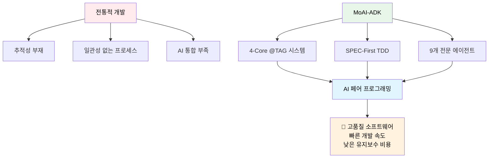
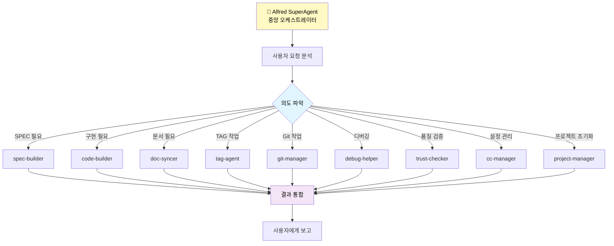
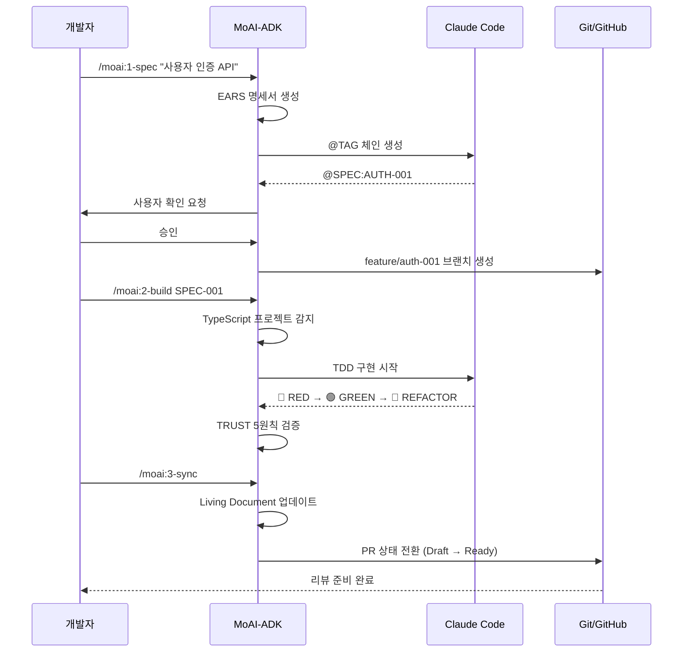

# 🗿 MoAI-ADK (Agentic Development Kit)

[](https://github.com/modu-ai/moai-adk)
[](LICENSE)
[](https://www.typescriptlang.org/)
[](https://nodejs.org/)
[](https://bun.sh/)

**🎯 TypeScript 기반 SPEC-First TDD 개발 프레임워크**

**⚡ AI 페어 프로그래밍 완전 통합 + 범용 언어 지원**

---

## 📚 공식 문서

**상세한 가이드, 튜토리얼, API 참조는 공식 문서를 참고하세요:**

🌐 **https://moai-adk.vercel.app**

---

## 목차

- [개요](#개요)
- [핵심 기능](#핵심-기능)
- [시스템 요구사항](#시스템-요구사항)
- [설치 가이드](#설치-가이드)
- [빠른 시작](#빠른-시작)
- [3단계 개발 워크플로우](#3단계-개발-워크플로우)
- [9개 전문 에이전트 시스템](#9개-전문-에이전트-시스템)
- [@TAG 시스템](#tag-시스템-4-core)
- [언어 지원](#언어-지원)
- [CLI 명령어](#cli-명령어)
- [문제 해결](#문제-해결)
- [개발 참여](#개발-참여)
- [라이선스](#라이선스)

---

## 개요

### 🎯 MoAI-ADK가 해결하는 문제

MoAI-ADK(Agentic Development Kit)는 현대 소프트웨어 개발에서 가장 큰 도전 과제를 해결하기 위해 설계되었습니다:

**1. 요구사항과 구현 간의 추적성 부재**
- 전통적 개발: 요구사항 → 설계 → 구현 → 테스트 → 문서화 과정이 각각 분리되어 진행
- 결과: 추적성 손실, 품질 관리 어려움, 유지보수 비용 증가

**MoAI-ADK 해결책:**
- **4-Core @TAG 시스템**: `@SPEC` → `@TEST` → `@CODE` → `@DOC` 체인으로 완전한 추적성 보장
- **CODE-FIRST 원칙**: 코드 자체를 스캔하여 TAG 무결성 검증 (중간 캐시 없음)

**2. 일관성 없는 개발 프로세스**
- 프로젝트마다, 팀마다 다른 개발 방식
- 결과: 협업 어려움, 품질 편차, 온보딩 시간 증가

**MoAI-ADK 해결책:**
- **SPEC-First TDD 방법론**: 명세 없이는 코드 없음, 테스트 없이는 구현 없음
- **3단계 워크플로우**: `/moai:1-spec` → `/moai:2-build` → `/moai:3-sync`
- **TRUST 5원칙**: Test First, Readable, Unified, Secured, Trackable

**3. AI 도구와의 통합 부족**
- Claude Code, GitHub Copilot 등 AI 도구가 있지만 체계적 통합 부재
- 결과: AI의 잠재력을 최대로 활용하지 못함

**MoAI-ADK 해결책:**
- **🎩 Alfred SuperAgent**: 9개 전문 에이전트를 오케스트레이션하는 중앙 조율자
- **Claude Code 완전 통합**: Agents, Commands, Hooks, Output Styles 모두 제공
- **지능형 라우팅**: 사용자 의도를 분석하여 적절한 에이전트에게 자동 위임

### 🚀 왜 MoAI-ADK인가?



---

## 핵심 기능

### 🎯 3단계 워크플로우

MoAI-ADK의 핵심은 **SPEC-First TDD 방법론**입니다:

```mermaid
graph LR
    A[1️⃣ SPEC 작성] -->|EARS 명세| B[2️⃣ TDD 구현]
    B -->|Red-Green-Refactor| C[3️⃣ 문서 동기화]
    C -->|Living Document| D[배포 준비]

    A -->|@SPEC TAG| E[@TAG 체인]
    B -->|@TEST, @CODE TAG| E
    C -->|@DOC TAG| E

    E --> F[완전한 추적성]

    style A fill:#e3f2fd
    style B fill:#f3e5f5
    style C fill:#e8f5e8
    style D fill:#fff3e0
```

#### **1단계: SPEC 작성** (`/moai:1-spec`)
- **EARS 형식** 명세서 자동 생성
- **@SPEC TAG** 생성으로 추적성 시작점 확보
- **Personal 모드**: `.moai/specs/` 로컬 파일 생성
- **Team 모드**: GitHub Issue 자동 생성
- **Git 자동화**: 사용자 확인 후 feature 브랜치 생성

#### **2단계: TDD 구현** (`/moai:2-build`)
- **언어 자동 감지**: Python, TypeScript, Java, Go, Rust 등
- **도구 자동 선택**: 언어별 최적 테스트/빌드 도구 매핑
- **TDD 사이클**:
  - 🔴 **RED**: `@TEST TAG` 생성 및 실패하는 테스트 작성
  - 🟢 **GREEN**: `@CODE TAG` 생성 및 최소 구현
  - 🔵 **REFACTOR**: 코드 품질 개선
- **TRUST 5원칙** 자동 검증

#### **3단계: 문서 동기화** (`/moai:3-sync`)
- **Living Document** 자동 업데이트
- **@DOC TAG** 생성으로 문서 추적성 확보
- **TAG 체인 검증**: `@SPEC` → `@TEST` → `@CODE` → `@DOC` 무결성 확인
- **고아 TAG 탐지**: 끊어진 참조 자동 발견
- **PR 상태 전환**: Draft → Ready for Review (Team 모드)

### 🤖 9개 전문 에이전트 시스템

**🎩 Alfred SuperAgent**가 중앙 오케스트레이터 역할을 수행하며, 8개 전문 에이전트를 조율합니다:



| 에이전트 | 페르소나 | 전문 영역 | 핵심 책임 |
|---------|---------|----------|----------|
| **🎩 Alfred** | AI 집사 | 오케스트레이션 | 요청 분석 및 에이전트 위임 |
| **spec-builder** | 🏗️ 설계자 | 요구사항 설계 | EARS 명세, 아키텍처 설계 |
| **code-builder** | 💎 장인 | TDD 구현 | Red-Green-Refactor, 코드 품질 |
| **doc-syncer** | 📖 편집자 | 문서 관리 | Living Document, API 문서 동기화 |
| **tag-agent** | 🏷️ 사서 | 추적성 관리 | TAG 시스템, 코드 스캔, 체인 검증 |
| **git-manager** | 🚀 정원사 | 버전 관리 | Git 워크플로우, 브랜치 전략, 배포 |
| **debug-helper** | 🔬 탐정 | 문제 해결 | 오류 진단, 근본 원인 분석, 해결 방안 |
| **trust-checker** | ✅ 감사관 | 품질 검증 | TRUST 5원칙, 성능/보안 검사 |
| **cc-manager** | 🛠️ 관리자 | 개발 환경 | Claude Code 설정, 권한, 표준화 |
| **project-manager** | 📋 기획자 | 프로젝트 관리 | 초기화, 문서 구축, 전략 수립 |

### 🏷️ @TAG 시스템 (4-Core)

**CODE-FIRST 원칙**으로 코드 자체를 진실의 원천으로 사용:

```
@SPEC:ID → @TEST:ID → @CODE:ID → @DOC:ID
```

#### TAG 체계 철학

1. **단순성**: 4개의 핵심 TAG만 사용
2. **TDD 완벽 정렬**: Red (TEST) → Green (CODE) → Refactor (DOC)
3. **추적성**: 정규식 패턴으로 코드 직접 스캔
4. **무결성**: 고아 TAG 자동 탐지

#### TAG BLOCK 템플릿

**소스 코드 (src/)**:
```typescript
// @CODE:AUTH-001 | SPEC: SPEC-AUTH-001.md | TEST: tests/auth/service.test.ts
```

**테스트 코드 (tests/)**:
```typescript
// @TEST:AUTH-001 | SPEC: SPEC-AUTH-001.md
```

**SPEC 문서 (.moai/specs/)**:
```markdown
# @SPEC:AUTH-001: JWT 인증 시스템
```

#### @CODE 서브 카테고리

구현 세부사항은 주석 레벨로 표기:
- `@CODE:ID:API` - REST API, GraphQL 엔드포인트
- `@CODE:ID:UI` - 컴포넌트, 뷰, 화면
- `@CODE:ID:DATA` - 데이터 모델, 스키마, 타입
- `@CODE:ID:DOMAIN` - 비즈니스 로직, 도메인 규칙
- `@CODE:ID:INFRA` - 인프라, 데이터베이스, 외부 연동

### 🌍 범용 언어 지원

**지능형 언어 감지 + 동적 도구 매핑**:

| 언어 | 테스트 프레임워크 | 린터/포매터 | 빌드 도구 | 지원 상태 |
|------|----------------|-------------|----------|----------|
| **TypeScript** | Vitest/Jest | Biome/ESLint | tsup/Vite | ✅ Full |
| **Python** | pytest | ruff/black | uv/pip | ✅ Full |
| **Java** | JUnit | checkstyle | Maven/Gradle | ✅ Full |
| **Go** | go test | golint/gofmt | go mod | ✅ Full |
| **Rust** | cargo test | clippy/rustfmt | cargo | ✅ Full |
| **JavaScript** | Vitest/Jest | Biome/ESLint | Vite | ✅ Full |
| **C#** | NUnit | dotnet format | dotnet | 🚧 Beta |
| **Ruby** | RSpec | RuboCop | bundler | 🚧 Beta |

**통일된 워크플로우**: 언어에 관계없이 동일한 3단계 개발 프로세스 적용

---

## 시스템 요구사항

### 🔴 필수 요구사항

- **Node.js**: 18.0 이상
- **Git**: 2.30.0 이상
- **npm**: 8.0.0 이상 (또는 **Bun 1.2.0 이상 강력 추천**)
- **Claude Code**: v1.2.0 이상 (에이전트 시스템 완전 통합용)

### 🌍 지원 운영체제

- **Windows**: 10/11 (PowerShell 5.1+)
- **macOS**: 12 Monterey 이상 (M1/M2 네이티브 지원)
- **Linux**: Ubuntu 20.04+, CentOS 8+, Debian 11+, Arch Linux

---

## 설치 가이드

### 1. 시스템 환경 준비

```bash
# 기본 도구 버전 확인
node --version    # v18.0.0 이상 필요
git --version     # 2.30.0 이상 필요
npm --version     # 8.0.0 이상 필요
```

### 2. MoAI-ADK 설치

#### **Option A: Bun 설치 (최적 성능, 강력 추천) 🔥**

```bash
# Bun 설치 (아직 없는 경우)
curl -fsSL https://bun.sh/install | bash  # macOS/Linux
# 또는
powershell -c "iwr bun.sh/install.ps1|iex"  # Windows

# MoAI-ADK 전역 설치
bun add -g moai-adk
```

#### **Option B: npm 설치 (표준 옵션)**

```bash
npm install -g moai-adk
```

#### **Option C: 개발자 설치 (로컬 개발용)**

```bash
git clone https://github.com/modu-ai/moai-adk.git
cd moai-adk/moai-adk-ts
bun install  # 또는 npm install
bun run build
npm link
```

### 3. 설치 확인

```bash
# 버전 확인
moai --version

# 시스템 진단
moai doctor

# 도움말
moai help
```

---

## 빠른 시작

### 1. 새 프로젝트 생성

```bash
moai init my-project
cd my-project
```

**생성되는 프로젝트 구조**:

```
my-project/
├── .moai/              # MoAI-ADK 설정 및 문서
│   ├── config.json     # 프로젝트 설정
│   ├── project/        # 프로젝트 정의 (product/structure/tech)
│   ├── memory/         # 개발 가이드
│   └── specs/          # SPEC 문서 저장소
├── .claude/            # Claude Code 통합 설정
│   ├── agents/         # 9개 전문 에이전트
│   │   └── moai/       # MoAI 에이전트들
│   ├── commands/       # 워크플로우 명령어
│   │   └── moai/       # /moai:1-spec, /moai:2-build, /moai:3-sync
│   ├── hooks/          # 자동화 훅 (pre-write-guard, tag-enforcer 등)
│   │   └── moai/
│   ├── output-styles/  # 출력 스타일 (pair, beginner, study)
│   └── settings.json   # Claude Code 환경 설정
└── CLAUDE.md           # 프로젝트 개발 가이드
```

### 2. 프로젝트 상태 확인

```bash
# 전체 프로젝트 상태
moai status

# 상세 정보 포함
moai status --verbose
```

### 3. 시스템 진단 실행

```bash
# 기본 진단
moai doctor

# 백업 목록 확인
moai doctor --list-backups
```

---

## 3단계 개발 워크플로우

### 실전 시나리오: E-Commerce 사용자 인증 API 개발

실제 프로젝트에서 MoAI-ADK를 어떻게 활용하는지 단계별로 살펴보겠습니다:



### Step 1: SPEC 작성

```bash
/moai:1-spec "JWT 기반 사용자 인증 시스템"
```

**자동 생성되는 것들:**

1. **EARS 형식 명세서** (`.moai/specs/SPEC-AUTH-001/spec.md`):
```markdown
# @SPEC:AUTH-001: JWT 기반 사용자 인증 시스템

## EARS 요구사항

### Ubiquitous Requirements (기본 요구사항)
- 시스템은 사용자 인증 기능을 제공해야 한다

### Event-driven Requirements (이벤트 기반)
- WHEN 사용자가 유효한 이메일과 패스워드로 로그인하면, 시스템은 JWT 토큰을 발급해야 한다
- WHEN 액세스 토큰이 만료되면, 시스템은 401 에러를 반환해야 한다

### State-driven Requirements (상태 기반)
- WHILE 사용자가 인증된 상태일 때, 시스템은 보호된 리소스 접근을 허용해야 한다

### Optional Features (선택적 기능)
- WHERE 리프레시 토큰이 제공되면, 시스템은 새로운 액세스 토큰을 발급할 수 있다

### Constraints (제약사항)
- IF 잘못된 토큰이 제공되면, 시스템은 접근을 거부해야 한다
- 액세스 토큰 만료시간은 15분을 초과하지 않아야 한다
```

2. **@SPEC TAG** 생성
3. **Git 작업**: `feature/auth-001-jwt-authentication` 브랜치 생성 (사용자 확인 후)
4. **GitHub Issue** 템플릿 (Team 모드)

### Step 2: TDD 구현

```bash
/moai:2-build SPEC-AUTH-001
```

**자동 진행 과정:**

1. **프로젝트 언어 감지**: TypeScript 프로젝트 자동 감지
2. **도구 선택**: Vitest + TypeScript + Biome 자동 매핑
3. **🔴 RED Phase**: 실패하는 테스트 작성 (`@TEST:AUTH-001`)
   ```typescript
   // @TEST:AUTH-001 | SPEC: SPEC-AUTH-001.md
   describe('JWT Authentication', () => {
     test('@TEST:AUTH-001: should generate valid JWT token', async () => {
       const authService = new AuthService();
       const token = await authService.generateToken({ userId: 1 });
       expect(token).toBeTruthy();
       expect(() => jwt.verify(token, publicKey)).not.toThrow();
     });
   });
   ```

4. **🟢 GREEN Phase**: 최소 구현으로 테스트 통과 (`@CODE:AUTH-001`)
   ```typescript
   // @CODE:AUTH-001 | SPEC: SPEC-AUTH-001.md | TEST: tests/auth/service.test.ts
   export class AuthService {
     async generateToken(payload: TokenPayload): Promise<string> {
       return jwt.sign(payload, this.privateKey, {
         algorithm: 'RS256',
         expiresIn: '15m'
       });
     }
   }
   ```

5. **🔵 REFACTOR Phase**: 코드 품질 개선
6. **TRUST 5원칙** 자동 검증

### Step 3: 문서 동기화

```bash
/moai:3-sync
```

**자동 업데이트:**

1. **Living Document** 갱신
2. **API 문서** 자동 생성
3. **TAG 체인 검증**: `@SPEC:AUTH-001` → `@TEST:AUTH-001` → `@CODE:AUTH-001` → `@DOC:AUTH-001`
4. **고아 TAG** 탐지 및 정리
5. **PR 상태** 전환: Draft → Ready for Review (Team 모드)

---

## 9개 전문 에이전트 시스템

### 🎩 Alfred SuperAgent - 중앙 오케스트레이터

**페르소나**: 모두의 AI 집사 - 정확하고 예의 바르며, 모든 요청을 체계적으로 처리

**역할**: 사용자 요청 분석 → 적절한 에이전트 식별 → 위임 → 결과 통합 → 사용자에게 보고

**위임 전략**:
- **직접 처리**: 간단한 정보 조회, 파일 읽기, 기본 분석
- **Single Agent**: 단일 에이전트로 완결 가능한 작업
- **Sequential**: 의존성이 있는 다단계 작업 (8-project → 1-spec → 2-build → 3-sync)
- **Parallel**: 독립적인 작업들을 동시 실행 (테스트 + 린트 + 빌드)

### 에이전트별 상세 기능

| 에이전트 | 주요 역할 | 핵심 기능 | 사용법 |
|---------|---------|---------|--------|
| **🏗️ spec-builder** | EARS 명세 작성 | • EARS 형식 명세서 자동 생성<br/>• @SPEC TAG 생성<br/>• 브랜치/Issue/PR 템플릿 | `@agent-spec-builder "사용자 인증"` |
| **💎 code-builder** | TDD 구현 | • @TAG 통합 TDD<br/>• Red-Green-Refactor<br/>• 언어별 최적 도구 선택 | `@agent-code-builder "SPEC-001"` |
| **📖 doc-syncer** | 문서 동기화 | • Living Document 자동 업데이트<br/>• API 문서 생성<br/>• PR 상태 전환 | `@agent-doc-syncer "update docs"` |
| **🏷️ tag-agent** | @TAG 관리 | • TAG 체인 생성/검증<br/>• 고아 TAG 탐지<br/>• TAG 인덱싱 및 추적 | `@agent-tag-agent "validate"` |
| **🚀 git-manager** | Git 자동화 | • 사용자 확인 후 브랜치 생성<br/>• 커밋 메시지 자동화<br/>• Personal/Team 모드 | `@agent-git-manager "create branch"` |
| **🔬 debug-helper** | 오류 진단 | • 지능형 오류 분석<br/>• 근본 원인 추적<br/>• 해결책 제안 | `@agent-debug-helper "error message"` |
| **✅ trust-checker** | 품질 검증 | • TRUST 5원칙 검증<br/>• 보안 스캐닝<br/>• 코드 품질 매트릭스 | `@agent-trust-checker "check"` |
| **🛠️ cc-manager** | Claude Code 관리 | • 에이전트 설정 최적화<br/>• 출력 스타일 조정<br/>• 훅 시스템 관리 | `@agent-cc-manager "optimize"` |
| **📋 project-manager** | 프로젝트 초기화 | • 프로젝트 문서 생성<br/>• 언어별 최적화 설정<br/>• Personal/Team 모드 선택 | `/moai:8-project` |

---

## @TAG 시스템 (4-Core)

### TAG 체계 철학

```
@SPEC:ID → @TEST:ID → @CODE:ID → @DOC:ID
```

**핵심 원칙**:
1. **단순성**: 4개의 핵심 TAG만 사용
2. **TDD 완벽 정렬**: RED (TEST) → GREEN (CODE) → REFACTOR (DOC)
3. **CODE-FIRST**: TAG는 코드 자체에만 존재 (정규식 패턴으로 직접 스캔)
4. **무결성**: 고아 TAG 자동 탐지, 끊어진 참조 검증

### TAG 사용 규칙

**TAG ID 형식**: `<도메인>-<3자리>` (예: AUTH-003)

**중복 방지**:
```bash
# 새 TAG 생성 전 기존 TAG 검색
rg "@SPEC:AUTH" -n          # SPEC 문서에서 AUTH 도메인 검색
rg "@CODE:AUTH-001" -n      # 특정 ID 검색
rg "AUTH-001" -n            # ID 전체 검색
```

**TAG 체인 검증**:
```bash
# /moai:3-sync 실행 시 자동 스캔
rg '@(SPEC|TEST|CODE|DOC):' -n .moai/specs/ tests/ src/ docs/

# 고아 TAG 탐지
rg '@CODE:AUTH-001' -n src/            # CODE는 있는데
rg '@SPEC:AUTH-001' -n .moai/specs/    # SPEC이 없으면 고아
```

### 올바른 TAG 사용 패턴

✅ **권장 패턴**:
```typescript
// @CODE:AUTH-001 | SPEC: SPEC-AUTH-001.md | TEST: tests/auth/service.test.ts
export class AuthService { ... }
```

❌ **금지 패턴**:
```typescript
// @TEST:AUTH-001 -> @CODE:AUTH-001    ❌ 순서 표기 불필요
// @CODE:AUTH-001, @CODE:AUTH-002      ❌ 하나의 파일에 여러 ID
// @SPEC:AUTH-001                        ❌ 구형 TAG 사용 금지
// @CODE:ABC-123                        ❌ 의미 없는 도메인명
```

---

## 언어 지원

### 지원 언어 및 도구 체인

| 언어 | 테스트 프레임워크 | 린터/포매터 | 빌드 도구 | 타입 시스템 |
|------|----------------|-------------|----------|-----------|
| **TypeScript** | Vitest/Jest | Biome/ESLint | tsup/Vite | ✅ Built-in |
| **Python** | pytest | ruff/black | uv/pip | ⚠️ mypy (선택) |
| **Java** | JUnit 5 | checkstyle | Maven/Gradle | ✅ Built-in |
| **Go** | go test | golint/gofmt | go mod | ✅ Built-in |
| **Rust** | cargo test | clippy/rustfmt | cargo | ✅ Built-in |

### 언어별 TDD 구현 예시

#### TypeScript (Vitest)

```typescript
// @TEST:AUTH-001 | SPEC: SPEC-AUTH-001.md
describe('AuthService', () => {
  test('@TEST:AUTH-001: should authenticate valid user', async () => {
    const service = new AuthService();
    const result = await service.authenticate('user@example.com', 'password');
    expect(result.success).toBe(true);
  });
});

// @CODE:AUTH-001 | SPEC: SPEC-AUTH-001.md | TEST: tests/auth/service.test.ts
export class AuthService {
  async authenticate(email: string, password: string): Promise<AuthResult> {
    // @CODE:AUTH-001:DOMAIN: 입력 검증
    this.validateInput(email, password);
    // @CODE:AUTH-001:DATA: 사용자 조회
    const user = await this.userRepository.findByEmail(email);
    return this.verifyCredentials(user, password);
  }
}
```

#### Python (pytest)

```python
# @TEST:AUTH-001 | SPEC: SPEC-AUTH-001.md
def test_should_authenticate_valid_user():
    """@TEST:AUTH-001: 유효한 사용자 인증 검증"""
    service = AuthenticationService()
    result = service.authenticate("user@example.com", "password")
    assert result.success is True

# @CODE:AUTH-001 | SPEC: SPEC-AUTH-001.md | TEST: tests/auth/test_service.py
class AuthenticationService:
    """@CODE:AUTH-001: 사용자 인증 서비스"""

    def authenticate(self, email: str, password: str) -> AuthResult:
        """@CODE:AUTH-001:API: 사용자 인증 API"""
        # @CODE:AUTH-001:DOMAIN: 입력 검증
        self._validate_input(email, password)
        # @CODE:AUTH-001:DATA: 사용자 조회
        user = self.user_repository.find_by_email(email)
        return self._verify_credentials(user, password)
```

---

## CLI 명령어

### `moai init [project-name]`

새 MoAI-ADK 프로젝트를 초기화합니다.

**사용 가능한 옵션:**
- `-t, --template <type>`: 템플릿 타입 (standard, minimal, advanced)
- `-i, --interactive`: 대화형 설정 마법사
- `-b, --backup`: 설치 전 백업 생성
- `-f, --force`: 기존 파일 강제 덮어쓰기
- `--personal`: 개인 모드 (기본값)
- `--team`: 팀 모드 (GitHub Issue/PR 통합)

**사용 예:**
```bash
moai init my-project                    # 기본 템플릿
moai init my-api --template advanced    # 고급 템플릿
moai init --interactive                 # 대화형 마법사
moai init --team                        # 팀 모드
```

### `moai doctor`

시스템 환경을 진단하고 문제점을 식별합니다.

**진단 항목:**
- Node.js, Git, npm/Bun 버전 확인
- 프로젝트 언어별 도구 검증
- Claude Code 연동 상태 확인
- 시스템 요구사항 자동 검증

**사용 예:**
```bash
moai doctor                  # 기본 진단
moai doctor --list-backups   # 백업 목록 확인
```

### `moai status`

프로젝트 현재 상태를 확인합니다.

**사용 예:**
```bash
moai status                  # 기본 상태
moai status --verbose        # 상세 정보 포함
```

### `moai update`

MoAI-ADK 템플릿을 최신 버전으로 업데이트합니다.

**사용 가능한 옵션:**
- `-c, --check`: 업데이트 확인만 수행
- `--no-backup`: 백업 생성 건너뛰기
- `-v, --verbose`: 상세 업데이트 정보
- `--package-only`: 패키지만 업데이트
- `--resources-only`: 프로젝트 리소스만 업데이트

**사용 예:**
```bash
moai update --check          # 업데이트 확인
moai update --verbose        # 상세 업데이트
```

### `moai restore <backup-path>`

백업에서 프로젝트를 복원합니다.

**사용 예:**
```bash
moai restore backup-20241201.tar.gz
moai restore backup.tar.gz --dry-run    # 미리보기
moai restore backup.tar.gz --force      # 강제 복원
```

---

## TRUST 5원칙

모든 개발 과정에서 TRUST 원칙을 준수합니다:

### T - Test First (테스트 우선)

**SPEC → Test → Code 사이클**:
- **@SPEC**: EARS 형식 명세서 우선 작성
- **RED**: `@TEST` TAG - 실패하는 테스트 작성
- **GREEN**: `@CODE` TAG - 최소 구현으로 테스트 통과
- **REFACTOR**: `@CODE` TAG - 코드 품질 개선

### R - Readable (가독성)

**코드 제약**:
- 파일당 ≤300 LOC
- 함수당 ≤50 LOC
- 매개변수 ≤5개
- 복잡도 ≤10

### U - Unified (통합성)

**SPEC 기반 아키텍처**:
- 모듈 간 명확한 책임 분리
- 타입 안전성 보장
- 언어별 경계를 SPEC이 정의

### S - Secured (보안성)

**보안 by 설계**:
- 입력 검증
- 정적 분석
- 보안 스캐닝
- 접근 제어

### T - Trackable (추적성)

**@TAG 시스템으로 완전한 추적성**:
- `@SPEC` → `@TEST` → `@CODE` → `@DOC` 체인
- 코드 직접 스캔으로 무결성 검증
- 고아 TAG 자동 탐지

---

## 문제 해결

### 자주 발생하는 문제

#### 1. 설치 실패

**권한 문제:**
```bash
sudo npm install -g moai-adk
```

**캐시 문제:**
```bash
npm cache clean --force
npm install -g moai-adk
```

#### 2. 명령어 인식 안 됨

**PATH 확인:**
```bash
echo $PATH
npm list -g --depth=0
```

**셸 재시작:**
```bash
source ~/.bashrc  # bash
source ~/.zshrc   # zsh
```

#### 3. Claude Code 연동 문제

- `.claude/settings.json` 파일 확인
- Claude Code 최신 버전 사용 확인
- 에이전트 파일 권한 확인

### 로그 확인

로그 파일 위치:

```bash
# 일반 로그
~/.moai/logs/moai.log

# 에러 로그
~/.moai/logs/error.log

# 프로젝트별 로그
.moai/logs/
```

---

## 개발 참여

### 기여 방법

1. Repository Fork
2. 기능 브랜치 생성 (`git checkout -b feature/new-feature`)
3. 변경사항 커밋 (`git commit -am 'Add new feature'`)
4. 브랜치 푸시 (`git push origin feature/new-feature`)
5. Pull Request 생성

### 개발 환경 설정

```bash
# 저장소 클론
git clone https://github.com/modu-ai/moai-adk.git
cd moai-adk/moai-adk-ts

# 의존성 설치 (Bun 권장)
bun install

# 개발 모드 실행
bun run dev

# 빌드
bun run build

# 테스트
bun test

# 코드 품질 검사
bun run check
```

### 코딩 규칙

- TRUST 5원칙 준수
- @TAG 시스템 적용
- TypeScript strict 모드 사용
- ≤50 LOC per function
- Test coverage ≥85%

---

## 라이선스

이 프로젝트는 [MIT License](LICENSE)를 따릅니다.

---

## 문서 및 지원

- **📚 공식 문서**: https://moai-adk.vercel.app
- **🐛 Issues**: [GitHub Issues](https://github.com/modu-ai/moai-adk/issues)
- **💬 Discussions**: [GitHub Discussions](https://github.com/modu-ai/moai-adk/discussions)
- **📦 npm Package**: [moai-adk](https://www.npmjs.com/package/moai-adk)

---

**MoAI-ADK v0.0.1** - TypeScript 기반 SPEC-First TDD 개발 프레임워크

Made with ❤️ by MoAI Team
