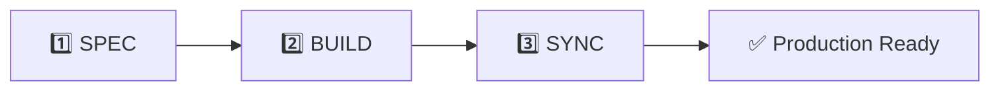

# MoAI-ADK (Agentic Development Kit)

[](https://www.npmjs.com/package/moai-adk)
[](https://opensource.org/licenses/MIT)
[](https://www.typescriptlang.org/)
[](https://nodejs.org/)
[](https://bun.sh/)

**AI 페어 프로그래밍을 위한 SPEC-First TDD 개발 프레임워크**

> "명세 없으면 코드 없다. 테스트 없으면 구현 없다."

---

## 목차

- [Meet Alfred](#-meet-alfred---your-ai-development-partner)
- [The Problem](#-the-problem---바이브-코딩의-한계)
- [The Solution](#-the-solution---alfreds-3-step-workflow)
- [Quick Start](#-quick-start-in-5-minutes)
- [How Alfred Works](#️-how-alfred-works)
- [Language Support](#-universal-language-support)
- [CLI Commands](#-cli-reference)
- [FAQ](#-faq)
- [Support](#-support)

---

## 🎩 Meet Alfred - Your AI Development Partner

안녕하세요, **Alfred**입니다! 🎩

저는 MoAI-ADK의 중앙 오케스트레이터로서 9개의 전문 에이전트를 조율하며 여러분의 AI 페어 프로그래밍을 돕습니다.

### 흥미로운 사실

이 프로젝트의 모든 코드는 **100% AI에 의해 작성**되었습니다:

- **GPT-5 Pro**와 **Claude 4.1 Opus**가 설계 단계부터 참여
- **모두의AI(MoAI-LAB)** 팀이 Claude Code와 Agentic Coding 방법론으로 개발
- 저와 제 팀(9개 에이전트)이 직접 SPEC 작성, TDD 실행, 문서 동기화

AI와 인간이 협력하여 소프트웨어를 개발하는 **새로운 패러다임의 실제 사례**입니다.

### Alfred가 제공하는 가치

- **일관성**: 항상 동일한 3단계 파이프라인 (SPEC → TDD → Sync)
- **품질**: TRUST 5원칙 자동 검증
- **추적성**: CODE-FIRST @TAG 시스템
- **범용성**: Python, TypeScript, Java, Go, Rust, Dart, Swift, Kotlin 등 모든 주요 언어 지원

---

## 🚨 The Problem - 바이브 코딩의 한계

AI 도구(ChatGPT, Claude, Copilot)로 빠르게 코딩하는 시대, 개발 속도는 빨라졌지만 **새로운 문제**들이 생겨났습니다.

### 1. 아름답지만 작동하지 않는 코드

AI가 생성한 코드는 문법적으로 완벽하고 구조도 우아합니다. 하지만:

- **컴파일은 되지만 실행은 안 됨**: 타입은 맞는데 로직이 틀림
- **엣지 케이스 처리 부족**: 정상 시나리오만 고려, 예외 상황 무시
- **성능 문제**: 알고리즘은 맞는데 O(n³) 복잡도로 구현
- **의존성 지옥**: 필요 없는 라이브러리까지 추천받아 설치

실제로 돌려보기 전까지는 문제를 알 수 없습니다.

### 2. 플랑켄슈타인 코드의 탄생

여러 AI 도구를 번갈아 사용하다 보면:

- **일관성 없는 코딩 스타일**: 월요일 ChatGPT 코드 + 수요일 Claude 코드 + 금요일 Gemini 코드
- **중복 로직 난무**: 같은 기능을 서로 다른 방식으로 3번 구현
- **아키텍처 붕괴**: MVC 패턴으로 시작했는데 어느새 Hexagonal + Clean Architecture 혼재
- **네이밍 혼란**: `getUserData()`, `fetchUser()`, `retrieveUserInfo()` 모두 같은 기능

각 부분은 훌륭하지만, 전체는 재앙입니다.

### 3. 디버깅 지옥

문제가 발생했을 때:

- **원인 추적 불가**: "이 함수가 왜 이렇게 구현되었지?" → AI 채팅 히스토리 이미 삭제됨
- **사이드 이펙트 파악 불가**: "이 코드 수정하면 뭐가 깨질까?" → 직접 실행해봐야 앎
- **테스트 부재**: "테스트는 나중에" → 나중은 영원히 오지 않음
- **문서 없음**: AI는 코드만 만들어주지, README는 안 써줌

결국 `console.log()` 디버깅으로 며칠을 보냅니다.

### 4. 요구사항 추적성 상실

시간이 지나면:

- **"왜"를 잃어버림**: 비즈니스 로직의 배경을 모름
- **변경 이력 부재**: 누가, 언제, 왜 이 코드를 바꿨는지 기록 없음
- **의사결정 근거 사라짐**: "왜 JWT를 선택했지?" → 기억 안 남
- **규정 준수 불가**: 금융/의료 등 감사 추적 필요한 산업에서 치명적

코드는 있는데 컨텍스트가 없습니다.

### 5. 팀 협업 붕괴

여러 개발자가 AI를 사용하면:

- **스파게티 코드 양산**: 각자 AI로 만든 코드를 그냥 합침
- **코드 리뷰 불가**: "이게 뭐 하는 코드인지 모르겠어요"
- **온보딩 악몽**: 새 팀원이 코드베이스 이해하는 데 한 달 이상 소요
- **기술 부채 폭발**: "건드리면 안 되는 코드" 영역 점점 확대

결국 프로젝트를 처음부터 다시 만드는 게 낫다는 결론에 도달합니다.

### 바이브 코딩의 역설

AI가 코드를 빠르게 생성해주지만, 그 코드는 **유지보수할 수 없는 블랙박스**가 됩니다. 생산성은 높아졌는데 품질은 낮아지는 딜레마에 빠집니다.

---

## ✨ The Solution - Alfred's 3-Step Workflow

Alfred는 AI 시대의 코드 품질 문제를 **체계적인 3단계 워크플로우**로 해결합니다.



### 1️⃣ SPEC - 명세 작성

**명령어**: `/alfred:1-spec "기능 설명"`

**What Alfred does**:

- EARS 형식으로 구조화된 명세 자동 생성
- `@SPEC:ID` TAG 부여
- Git 브랜치 생성 (`feature/SPEC-ID-name`)
- HISTORY 섹션 자동 추가 (변경 이력 추적)

**Why it matters**: 6개월 후에도 "왜 이렇게 만들었는지" 즉시 확인 가능

### 2️⃣ BUILD - TDD 구현

**명령어**: `/alfred:2-build SPEC-ID`

**What Alfred does**:

- 🔴 RED: 실패하는 테스트 작성 (`@TEST:ID`)
- 🟢 GREEN: 최소 구현으로 테스트 통과 (`@CODE:ID`)
- 🔵 REFACTOR: 코드 품질 개선 + TDD 이력 주석

**Why it matters**: 테스트가 안전망 역할, 자신감 있게 리팩토링 가능

### 3️⃣ SYNC - 문서 동기화

**명령어**: `/alfred:3-sync`

**What Alfred does**:

- TAG 체인 검증 (`@SPEC → @TEST → @CODE → @DOC`)
- 고아 TAG 자동 탐지 및 경고
- Living Document 자동 생성
- PR 상태 전환 (Draft → Ready)

**Why it matters**: 코드와 문서가 항상 동기화, 추적성 100% 보장

---

## 🚀 Quick Start in 5 Minutes

### Step 1: 설치

```bash
# Bun 권장 (5배 빠른 성능)
curl -fsSL https://bun.sh/install | bash
bun add -g moai-adk

# 또는 npm 사용
npm install -g moai-adk

# 설치 확인
moai --version
```

### Step 2: 프로젝트 초기화

```bash
# 새 프로젝트 생성
moai init my-project
cd my-project

# 시스템 진단
moai doctor
```

**Claude Code에서 프로젝트 설정** (필수 사항):

```text
/alfred:8-project 
```

Alfred가 자동으로 수행하는 작업:

**새 프로젝트**:

- `.moai/project/product.md` 생성 (제품 정의, 미션, 사용자)
- `.moai/project/structure.md` 생성 (시스템 아키텍처, 모듈 설계)
- `.moai/project/tech.md` 생성 (기술 스택, 품질 게이트, 배포 전략)
- 언어별 최적 도구 체인 자동 설정

**기존 프로젝트**:

- 코드베이스 자동 스캔 (언어, 프레임워크, 의존성 감지)
- 폴더 구조 분석 (src/, tests/, docs/ 자동 인식)
- 현재 상태 기반 최적 설정 제안

이렇게 하면 Alfred가 프로젝트 컨텍스트를 완벽하게 이해하고, 향후 모든 작업에서 일관성을 보장합니다.

### Step 3: 첫 기능 개발 (3단계 워크플로우)

Claude Code를 열고 다음 명령어를 차례로 실행:

```text
# 1️⃣ SPEC 작성
/alfred:1-spec "JWT 기반 사용자 로그인 API"

# 2️⃣ TDD 구현
/alfred:2-build SPEC-AUTH-001

# 3️⃣ 문서 동기화
/alfred:3-sync
```

**결과**: 명세, 테스트, 코드, 문서가 완벽하게 추적 가능한 상태로 완성! 🎉

---

## 🏗️ How Alfred Works

### Alfred의 9개 전문 에이전트

Alfred는 중앙 오케스트레이터로서 9개의 전문 에이전트를 조율합니다:

| 에이전트 | 전문 영역 | 호출 시점 |
|---------|----------|----------|
| **spec-builder** | EARS 명세 작성 | `/alfred:1-spec` |
| **code-builder** | TDD 구현 | `/alfred:2-build` |
| **doc-syncer** | 문서 동기화 | `/alfred:3-sync` |
| **tag-agent** | TAG 체인 검증 | 자동 (동기화 시) |
| **git-manager** | Git 워크플로우 | 자동 (필요 시) |
| **debug-helper** | 오류 진단 | `@agent-debug-helper` |
| **trust-checker** | TRUST 검증 | `@agent-trust-checker` |
| **cc-manager** | Claude Code 설정 | `@agent-cc-manager` |
| **project-manager** | 프로젝트 초기화 | `/alfred:8-project` |

### TRUST 5원칙 (품질 보증)

Alfred는 모든 코드에 TRUST 5원칙을 적용합니다:

#### T - Test First

- SPEC → Test → Code 순서 엄수
- 테스트 커버리지 ≥ 85%

#### R - Readable

- 파일 ≤300 LOC, 함수 ≤50 LOC
- 복잡도 ≤10, 매개변수 ≤5개

#### U - Unified

- SPEC 기반 아키텍처
- 타입 안전성 보장

#### S - Secured

- 입력 검증, SQL Injection 방어
- XSS/CSRF 방어, 비밀번호 해싱

#### T - Trackable

- CODE-FIRST @TAG 시스템
- 완전한 추적 체인 보장

### @TAG 시스템

모든 코드는 4가지 TAG로 완벽하게 추적됩니다:

```text
@SPEC:ID → @TEST:ID → @CODE:ID → @DOC:ID
```

**TAG ID 규칙**: `<도메인>-<3자리>` (예: `AUTH-001`, `PAYMENT-042`)

**검증 방법**:

```bash
# 전체 TAG 스캔
rg '@(SPEC|TEST|CODE|DOC):' -n

# 특정 TAG 추적
rg 'AUTH-001' -n
```

---

## 🌍 Universal Language Support

MoAI-ADK는 모든 주요 언어를 지원하며, 언어별 최적 도구 체인을 자동으로 선택합니다.

### 웹/백엔드

| 언어 | 테스트 | 린터 | 타입 | 상태 |
|------|--------|------|------|------|
| **TypeScript** | Vitest/Jest | Biome/ESLint | ✅ | Full |
| **Python** | pytest | ruff/black | mypy | Full |
| **Java** | JUnit 5 | checkstyle | ✅ | Full |
| **Go** | go test | golint | ✅ | Full |
| **Rust** | cargo test | clippy | ✅ | Full |

### 모바일

| 언어/프레임워크 | 테스트 | 린터 | 상태 |
|----------------|--------|------|------|
| **Flutter/Dart** | flutter test | dart analyze | Full |
| **Swift/iOS** | XCTest | SwiftLint | Full |
| **Kotlin/Android** | JUnit + Espresso | detekt | Full |
| **React Native** | Jest + RNTL | ESLint | Full |

### 자동 언어 감지

시스템이 프로젝트를 스캔하여 자동으로 감지:

- `package.json` → TypeScript/JavaScript
- `requirements.txt` → Python
- `go.mod` → Go
- `Cargo.toml` → Rust
- `pubspec.yaml` → Flutter/Dart

---

## 💻 CLI Reference

### 핵심 명령어

```bash
# 프로젝트 초기화
moai init [project] [options]

# 시스템 진단
moai doctor [options]

# 프로젝트 상태 확인
moai status [options]

# 백업 복원
moai restore <backup-path> [options]
```

### Claude Code 전용 명령어

```text
# 템플릿 업데이트 (권장 ⭐)
/alfred:9-update

# 프로젝트 설정
/alfred:8-project "프로젝트명"
```

### moai init

**옵션**:

- `-t, --template <type>`: standard/minimal/advanced
- `-i, --interactive`: 대화형 모드
- `--personal`: Personal 모드 (기본값)
- `--team`: Team 모드 (GitHub 통합)
- `-b, --backup`: 백업 생성
- `-f, --force`: 강제 덮어쓰기

### moai doctor

**옵션**:

- `-l, --list-backups`: 사용 가능한 백업 목록 표시

### moai status

**옵션**:

- `-v, --verbose`: 상세 상태 정보 표시
- `-p, --project-path <path>`: 프로젝트 디렉토리 경로 지정

### moai restore

**옵션**:

- `--dry-run`: 미리보기
- `--force`: 강제 복원

---

## ❓ FAQ

### Q1: MoAI-ADK는 무료인가요?

네, MIT 라이선스 오픈소스로 상업적 사용을 포함해 무료입니다. (Claude Code는 Anthropic의 유료 서비스)

### Q2: 기존 프로젝트에 적용 가능한가요?

가능합니다:

```bash
cd existing-project
moai init --force
```

### Q3: 어떤 언어를 지원하나요?

**웹/백엔드**: TypeScript, JavaScript, Python, Java, Go, Rust

**모바일**: Flutter/Dart, Swift/iOS, Kotlin/Android, React Native

모든 언어에서 동일한 3단계 워크플로우 사용 가능!

### Q4: TAG를 수동으로 붙여야 하나요?

아니요! Alfred가 `/alfred:2-build` 실행 시 자동으로 `@TEST:ID`, `@CODE:ID` TAG를 부여합니다.

### Q5: Team 모드는 어떻게 사용하나요?

```bash
moai init --team
```

Team 모드에서는 SPEC → GitHub Issue, TDD → Pull Request 자동 생성을 지원합니다.

### Q6: 학습 곡선은 어떤가요?

- **5분**: 첫 기능 개발 완료
- **1시간**: 3단계 워크플로우 이해
- **1일**: TAG 시스템 숙달
- **1주**: 팀 프로젝트 적용

### Q7: 업데이트는 어떻게 하나요?

**권장**: Claude Code에서 `/alfred:9-update` 사용

```text
/alfred:9-update                    # 업데이트 확인 및 실행
/alfred:9-update --check            # 확인만
/alfred:9-update --check-quality    # 업데이트 후 TRUST 검증
```

**왜 `/alfred:9-update`를 권장하나요?**

Alfred가 직접 파일을 처리하여 더 안전하고 똑똑합니다:

- ✅ **프로젝트 문서 보호**: `{{PROJECT_NAME}}` 패턴 검증으로 사용자 수정 파일 자동 백업
- ✅ **자동 권한 처리**: 훅 파일에 `chmod +x` 자동 적용 (Unix 계열)
- ✅ **Output Styles 복사**: `.claude/output-styles/alfred/` 자동 동기화
- ✅ **5단계 검증**: 파일 존재/개수/권한/무결성/버전 자동 확인
- ✅ **에러 처리**: 문제 발생 시 `debug-helper` 자동 지원

CLI `moai update`는 단순 파일 복사만 수행합니다.

### Q8: 에러 발생 시 어떻게 하나요?

debug-helper 에이전트를 사용하세요:

```text
@agent-debug-helper "에러 메시지"
```

근본 원인 분석과 해결책을 제공합니다.

---

## 📞 Support

- **공식 문서**: <https://moai-adk.vercel.app>
- **버그 리포트**: [GitHub Issues](https://github.com/modu-ai/moai-adk/issues)
- **질문 & 토론**: [GitHub Discussions](https://github.com/modu-ai/moai-adk/discussions)
- **npm 패키지**: [moai-adk](https://www.npmjs.com/package/moai-adk)

---

**MoAI-ADK v0.1.0** - TypeScript 기반 SPEC-First TDD 개발 프레임워크

Made with ❤️ by MoAI-LAB

---

## 라이선스

이 프로젝트는 [MIT License](LICENSE)를 따릅니다.
