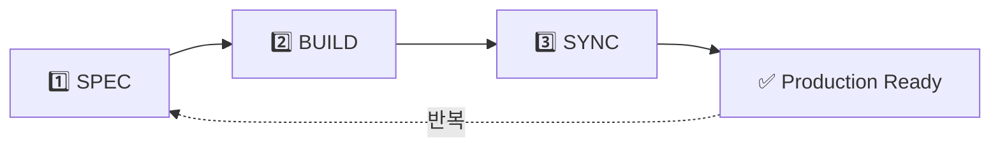

# MoAI-ADK (Agentic Development Kit)

[](https://www.npmjs.com/package/moai-adk)
[](https://opensource.org/licenses/MIT)
[](https://www.typescriptlang.org/)
[](https://nodejs.org/)
[](https://bun.sh/)

## MoAI-ADK

### 모두의AI 에이전틱 코딩 개발 프레임워크


> "SPEC이 없으면 CODE도 없다."

---

## 목차

- [Meet Alfred](#-meet-alfred---your-ai-development-partner)
- [The Problem](#-the-problem---바이브-코딩의-한계)
- [The Solution](#-the-solution---alfreds-3-step-workflow)
- [Quick Start](#-quick-start-in-5-minutes)
- [How Alfred Works](#️-how-alfred-works)
- [Output Styles](#-alfreds-output-styles)
- [Language Support](#-universal-language-support)
- [CLI Commands](#-cli-reference)
- [FAQ](#-faq)
- [Support](#-support)

---

## 🎩 Meet Alfred - Your AI Development Partner

안녕하세요, 모두의AI SuperAgent **AI 🎩 Alfred**입니다!

저는 MoAI-ADK(Agentic Development Kit)의 SuperAgent이자 중앙 오케스트레이터(Central Orchestrator)입니다. MoAI-ADK는 Alfred를 포함하여 **총 10개의 AI 에이전트로 구성된 에이전틱 코딩 AI 팀**입니다. 저는 9개의 전문 에이전트(spec-builder, code-builder, doc-syncer 등)를 조율하여 여러분의 Claude Code 환경 속에서 공동 개발 작업을 완벽하게 지원합니다.

**Alfred라는 이름의 유래**: 배트맨 영화에 나오는 충실한 집사 Alfred Pennyworth에서 영감을 받아 지었다고 합니다. 집사 Alfred가 배트맨(Bruce Wayne)을 위해 모든 준비를 완벽하게 갖추고, 위험에 처했을 때 즉각적인 지원을 제공하며, 항상 한 걸음 앞서 생각하듯이, 저 또한 여러분의 개발 과정 속에서 필요한 모든 것을 미리 준비하고, 문제가 발생하면 즉시 해결책을 제시하며, 언제나 여러분이 창의적인 문제 해결에만 집중할 수 있도록 뒷받침합니다. 여러분은 코드의 "왜(Why)"에 집중하시고, "어떻게(How)"는 제가 책임지겠습니다.

### 🌟 흥미로운 사실: AI가 만든 AI 개발 도구

이 프로젝트의 모든 코드는 **100% AI에 의해 작성**되었습니다. AI가 직접 설계하고 구현한 AI 개발 프레임워크입니다.

**설계 단계부터 AI 협업**: 초기 아키텍처 설계 단계부터 **GPT-5 Pro**와 **Claude 4.1 Opus** 두 AI 모델이 함께 참여했습니다. 두 AI가 서로 다른 관점에서 설계를 검토하고 토론하며, 더 나은 방향을 제시하고, 최적의 아키텍처를 함께 만들어냈습니다. 이는 마치 두 명의 시니어 아키텍트가 화이트보드 앞에서 "이 부분은 싱글톤 패턴이 적합할까, 팩토리 패턴이 적합할까?"를 논의하는 것과 같은 과정이었습니다. GPT-5 Pro는 폭넓은 사례 분석을, Claude 4.1 Opus는 깊이 있는 코드 구조 설계를 담당하며 서로 보완했습니다.

**Agentic Coding 방법론의 실제 적용**: **모두의AI**팀이 Claude Code와 Agentic Coding 방법론을 활용하여 개발했습니다. 전통적인 방식처럼 사람이 키보드 앞에 앉아 모든 코드를 직접 타이핑하는 대신, AI 에이전트들이 SPEC을 읽고 이해하고, 테스트를 먼저 작성하고(TDD Red), 구현 코드를 만들고(TDD Green), 리팩토링하고(TDD Refactor), 문서를 동기화하는 전 과정을 **자율적으로** 수행했습니다. 저 Alfred와 9개 전문 에이전트로 구성된 **10개 AI 에이전트 팀**이 직접 `.moai/specs/` 폴더에 SPEC 문서를 작성하고, `tests/` 폴더에 테스트 코드를 만들고, `src/` 폴더에 구현 코드를 작성했습니다.

### 🎩 Alfred가 제공하는 4가지 핵심 가치

#### 1️⃣ 일관성(Consistency): 플랑켄슈타인 코드를 방지하는 3단계 파이프라인

Alfred는 모든 개발 작업을 **SPEC → TDD → Sync**라는 3단계 파이프라인으로 표준화합니다. 월요일에 ChatGPT로 만든 코드, 수요일에 Claude로 만든 코드, 금요일에 Copilot으로 만든 코드가 서로 다른 스타일, 네이밍 규칙, 아키텍처 패턴을 가지는 "플랑켄슈타인 코드"의 문제를 **원천적으로 차단**합니다. 같은 프로젝트 안에서 `getUserInfo()`, `fetchUser()`, `retrieveUserData()` 같은 이름으로 똑같은 기능이 3번 구현되는 악몽을 경험해보셨나요? Alfred는 이런 일이 절대 일어나지 않도록 보장합니다.

이 3단계 파이프라인은 마치 자동차 공장의 조립 라인처럼 작동합니다. 어떤 기능을 만들든(사용자 인증, 결제 시스템, 알림 기능), 누가 만들든(신입 개발자, 시니어 개발자, AI 도구), 언제 만들든(월요일 오전, 금요일 밤) 항상 같은 프로세스를 거치게 됩니다. 결과적으로 **6개월 후에 코드를 다시 봐도**, **새로운 팀원이 코드를 처음 봐도**, "아, 이건 Alfred 방식으로 만들어졌구나. SPEC을 먼저 보고, 테스트를 보고, 구현을 보면 되겠네"라고 즉시 이해할 수 있습니다. 일관성은 유지보수성의 핵심이며, **기술 부채를 줄이는 가장 강력한 무기**입니다.

#### 2️⃣ 품질(Quality): TRUST 5원칙으로 자동 보장되는 코드 품질

Alfred는 모든 코드에 **TRUST 5원칙**(Test First, Readable, Unified, Secured, Trackable)을 자동으로 적용하고 검증합니다. 사람이 일일이 체크리스트를 들고 "테스트 커버리지 확인했나? 함수 길이 확인했나? 보안 취약점 확인했나?"를 물어볼 필요가 없습니다. Alfred가 **자동으로** 테스트 커버리지를 측정하고(≥85% 필수), 코드 복잡도를 분석하고(복잡도 ≤10), 보안 취약점을 스캔하고(SQL Injection, XSS 체크), TAG 추적성을 보장합니다(고아 TAG 자동 탐지).

예를 들어, 함수가 50줄을 넘어가면 Alfred가 즉시 경고합니다: "이 함수는 너무 길어요. 작은 함수로 분리해주세요." 테스트 커버리지가 85% 미만이면 빌드를 멈춥니다: "테스트가 부족합니다. 엣지 케이스를 더 테스트해주세요." SQL 쿼리에 사용자 입력을 직접 넣는 코드가 발견되면 보안 가이드를 제시합니다: "SQL Injection 취약점이 있습니다. Prepared Statement를 사용하세요." 이런 자동 검증 시스템 덕분에 여러분은 "좋은 코드를 작성해야지"라고 **의식적으로 생각할 필요 없이**, 자연스럽게 좋은 코드를 작성하게 됩니다. 품질은 선택이 아니라 **기본값(default)**입니다.

#### 3️⃣ 추적성(Traceability): 6개월 후에도 "왜"를 찾을 수 있는 @TAG 시스템

Alfred의 **@TAG 시스템**은 모든 코드 조각을 `@SPEC:ID → @TEST:ID → @CODE:ID → @DOC:ID`로 완벽하게 연결합니다. 6개월 후 누군가 "왜 이 함수는 이렇게 복잡하게 구현했나요? 더 간단하게 할 수 있지 않나요?"라고 물어보면, **@TAG를 따라가면 답을 찾을 수 있습니다**. SPEC 문서를 열어 "아, 이건 금융 규정 때문에 3단계 검증이 필수구나"를 확인하고, TEST 코드를 보며 "이 엣지 케이스들이 실제로 프로덕션에서 발생했던 버그구나"를 이해하고, CODE를 보며 "이렇게 구현한 이유가 있었구나"를 납득하고, DOC을 보며 "다른 팀원들도 이 문제를 겪었고 해결책을 공유했구나"를 배웁니다.

특히 Alfred의 TAG 시스템은 **CODE-FIRST** 방식을 사용합니다. 중간에 별도의 데이터베이스나 YAML 파일, JSON 캐시 파일을 두지 않고, **코드 자체를 직접 스캔**하여 TAG를 찾습니다(`rg '@CODE:AUTH-001' -n`). 이는 "**코드가 진실의 유일한 원천(single source of truth)**"이라는 철학을 반영한 것입니다. TAG는 외부 문서가 아니라 살아있는 코드 안에 주석으로 존재하며, 코드가 변경되면 TAG도 함께 변경됩니다. 코드와 문서가 따로 놀 수 없습니다. 추적성은 문서화의 부산물이 아니라 **코드의 일부**입니다. 금융, 의료, 국방 등 규정 준수(compliance)가 중요한 산업에서는 이런 추적성이 선택이 아니라 필수입니다.

#### 4️⃣ 범용성(Universality): 한 번 배우면 어디서나 쓸 수 있는 워크플로우

Alfred는 특정 언어나 프레임워크에 종속되지 않습니다. **Python, TypeScript, Java, Go, Rust, Dart, Swift, Kotlin** 등 모든 주요 프로그래밍 언어를 지원하며, 각 언어에 최적화된 도구 체인(테스트 프레임워크, 린터, 타입 체커)을 자동으로 선택합니다. 백엔드 개발자가 Python FastAPI로 API 서버를 만들든, 프론트엔드 개발자가 TypeScript React로 웹앱을 만들든, 모바일 개발자가 Flutter로 앱을 만들든, **모두 같은 3단계 워크플로우**를 사용합니다.

예를 들어, Python 프로젝트에서는 `pytest`(테스트)와 `ruff`(린터)와 `mypy`(타입 체커)를 자동으로 사용하고, TypeScript 프로젝트에서는 `Vitest`와 `Biome`를 사용하고, Go 프로젝트에서는 `go test`와 `golint`를 사용하고, Rust 프로젝트에서는 `cargo test`와 `clippy`를 사용합니다. 여러분은 "내 프로젝트는 Python이야"라고 선택만 하면 되고, 나머지 도구 선택과 설정은 **Alfred가 알아서** 합니다. 팀에 백엔드 개발자, 프론트엔드 개발자, 모바일 개발자가 섞여 있어도 모두가 "Alfred 워크플로우"라는 공통 언어로 소통할 수 있습니다. 범용성은 **팀 협업의 핵심**이며, 개발자 온보딩 시간을 획기적으로 줄여줍니다.

---

## 🚨 The Problem - 바이브 코딩의 한계

AI 도구(Codex, Claude, Gemini)로 빠르게 코딩하는 시대가 열렸습니다. 개발 속도는 확실히 빨라졌지만, **새로운 종류의 문제**들이 생겨났습니다. 아래 5가지 현실적인 문제들을 살펴보세요.

### 1. 아름답지만 작동하지 않는 코드

**문제 상황**: AI가 생성한 코드는 문법적으로 완벽하고 구조도 우아합니다. 코드 리뷰를 하면 "와, 깔끔한데?"라는 반응이 나옵니다. 하지만 실제로 실행해보면...

- **컴파일은 되지만 실행은 안 됨**: TypeScript 타입은 완벽하게 맞는데, 런타임에 `undefined` 에러가 발생합니다. "분명 타입 체크는 통과했는데 왜?"
- **엣지 케이스 처리 부족**: 정상 시나리오(happy path)만 고려하고, 빈 배열, null 값, 네트워크 타임아웃 같은 예외 상황은 완전히 무시합니다.
- **성능 문제**: 알고리즘은 맞는데 `O(n³)` 복잡도로 구현되어, 데이터가 100개일 때는 괜찮지만 10,000개가 되면 서버가 멈춥니다.
- **의존성 지옥**: 단순한 날짜 포맷팅을 위해 100MB짜리 라이브러리를 추천받아 설치하고, 나중에 보안 취약점 경고가 쏟아집니다.

**AI 예측 사례**: 한 개발자가 ChatGPT로 사용자 인증 코드를 생성했습니다. 코드는 아름다웠고 컴파일도 완벽했습니다. 하지만 실제로 배포 후, 비밀번호가 평문(plain text)으로 데이터베이스에 저장되고 있었습니다. AI는 "사용자 인증"이라는 요청만 받았지, "보안 요구사항"을 명시적으로 듣지 못했기 때문입니다. 실제로 돌려보기 전까지는 이런 치명적인 문제를 알 수 없습니다.

### 2. 플랑켄슈타인 코드의 탄생

**문제 상황**: 여러 AI 도구를 번갈아 사용하거나, 같은 AI라도 다른 세션에서 코드를 생성하다 보면 일관성 없는 코드베이스가 만들어집니다.

- **일관성 없는 코딩 스타일**: 월요일에 ChatGPT가 만든 코드는 함수형 프로그래밍 스타일, 수요일에 Claude가 만든 코드는 객체지향 스타일, 금요일에 Gemini가 만든 코드는 절차형 스타일. 같은 프로젝트 안에서 3가지 패러다임이 혼재합니다.
- **중복 로직 난무**: 같은 기능(예: 이메일 유효성 검증)을 `validateEmail()`, `checkEmailFormat()`, `isEmailValid()`라는 이름으로 3번 구현합니다. 각 AI 세션이 이전 코드를 모르기 때문입니다.
- **아키텍처 붕괴**: 프로젝트는 MVC 패턴으로 시작했는데, 어느새 Hexagonal Architecture와 Clean Architecture가 혼재되고, 일부는 CQRS 패턴까지 섞여있습니다.
- **네이밍 혼란**: `getUserData()`, `fetchUser()`, `retrieveUserInfo()`, `loadUserProfile()` 모두 같은 기능인데 이름만 다릅니다.

**AI 예측 사례**: 스타트업 팀이 6개월간 AI로 빠르게 프로토타입을 만들었습니다. 기능은 모두 작동했지만, 코드베이스는 각 개발자가 다른 AI로 만든 코드들이 뒤섞인 "플랑켄슈타인"이 되었습니다. 각 부분은 훌륭했지만, 전체는 재앙이었습니다. 결국 기술 부채를 갚기 위해 3개월을 투자했고, 그 사이 경쟁사에 시장을 빼앗겼습니다. "빠르게 만들었지만, 느리게 망했다"는 교훈만 남았습니다.

### 3. 디버깅 지옥

**문제 상황**: 프로덕션에서 버그가 발생했을 때, 원인을 찾는 것이 거의 불가능합니다.

- **원인 추적 불가**: "이 함수가 왜 이렇게 복잡하게 구현되었지?" → AI 채팅 히스토리는 이미 삭제되었고, 당시 개발자도 기억이 안 납니다.
- **사이드 이펙트 파악 불가**: "이 코드를 수정하면 다른 곳이 깨질까?" → 테스트가 없으니 직접 실행해봐야 하는데, 모든 경우의 수를 다 테스트할 수 없습니다.
- **테스트 부재**: AI에게 "테스트도 작성해줘"라고 요청하면 테스트는 만들어주지만, 실제로 실행해보지 않았기 때문에 그 테스트조차 제대로 작동하는지 확인이 안 됩니다. "테스트는 나중에"라는 생각으로 미루면, 나중은 영원히 오지 않습니다.
- **문서 없음**: AI는 코드만 만들어주지, README나 API 문서는 안 써줍니다. 설사 문서를 만들어달라고 해도, 코드가 변경되면 문서는 outdated 상태가 됩니다.

**AI 예측 사례**: 금요일 저녁 6시, 프로덕션에서 결제 실패 버그가 보고되었습니다. 개발자는 3개월 전에 AI로 생성한 결제 로직을 열어봤지만, 왜 이렇게 구현했는지 전혀 기억이 안 났습니다. AI 채팅은 삭제되었고, 주석도 없었습니다. 결국 `console.log()`를 수십 개 찍어가며 디버깅했고, 원인을 찾는 데 주말 이틀이 걸렸습니다. 문제는 단순한 타임존 처리 버그였지만, 추적성이 없어서 찾기가 너무 어려웠습니다.

### 4. 요구사항 추적성 상실

**AI 예측 사례**: 시간이 지날수록 "왜 이 코드를 이렇게 만들었는지" 맥락을 잃어버립니다.

- **"왜"를 잃어버림**: 비즈니스 로직의 배경과 이유를 모릅니다. "왜 결제 금액이 10만원을 넘으면 추가 인증을 요구하나요?" → "글쎄요, AI가 그렇게 만들었는데요..."
- **변경 이력 부재**: 누가, 언제, 왜 이 코드를 바꿨는지 기록이 없습니다. Git 커밋 메시지도 "fix bug", "update code" 같은 무의미한 메시지뿐입니다.
- **의사결정 근거 사라짐**: "왜 JWT를 선택했고, Session 대신 사용하나요?" → "기억 안 나요. AI가 추천해서요."
- **규정 준수 불가**: 금융, 의료, 국방 등 감사 추적(audit trail)이 필수인 산업에서는 이런 추적성 부재가 치명적입니다. "이 개인정보 처리 로직이 GDPR을 준수하는지 증명해주세요" → 증명 불가능.

**AI 예측 사례**: 핀테크 스타트업이 감사를 받았습니다. 감사관이 "이 고객 신용 평가 로직의 근거를 설명해주세요"라고 요청했지만, 코드만 있고 SPEC 문서가 없었습니다. 누가 왜 이 알고리즘을 선택했는지, 어떤 비즈니스 요구사항을 반영한 것인지 아무도 몰랐습니다. AI가 생성한 코드였고, 작동하니까 그냥 사용했던 것입니다. 결과적으로 금융 라이선스 승인이 6개월 지연되었습니다. 코드는 있는데 컨텍스트가 없어서 생긴 비극입니다.

### 5. 팀 협업 붕괴

**문제 상황**: 여러 개발자가 각자 AI를 사용하면서 협업이 무너집니다.

- **스파게티 코드 양산**: A 개발자는 ChatGPT로, B 개발자는 Claude로, C 개발자는 Copilot으로 각자 코드를 만들어서 Git에 푸시합니다. 코드 리뷰 없이 그냥 머지합니다. 3개월 후 코드베이스는 스파게티가 됩니다.
- **코드 리뷰 불가**: 리뷰어가 "이게 뭐 하는 코드인지 모르겠어요. 설명 부탁드려요"라고 하면, 작성자도 "저도 AI가 만든 건데, 잘 모르겠어요"라고 답합니다.
- **온보딩 악몽**: 새로 입사한 개발자가 코드베이스를 이해하는 데 한 달 이상 걸립니다. 멘토가 "이 부분은... 음... 솔직히 저도 잘 모르겠네요"라고 답하는 순간, 신입은 절망합니다.
- **기술 부채 폭발**: "이 코드 건드리면 뭔가 깨질 것 같아서 못 건드리겠어요"라는 "금기 코드" 영역이 점점 확대됩니다. 리팩토링은 불가능해지고, 새 기능은 덕지덕지 붙여나갑니다.

**AI 상상하는 사례**: 10명 규모의 개발 팀이 각자 AI로 빠르게 기능을 만들었습니다. 개별 기능은 모두 작동했지만, 통합하니 충돌이 발생했습니다. 같은 데이터베이스 테이블을 서로 다른 방식으로 접근하고, API 응답 형식도 제각각이었습니다. 코드 리뷰를 하려 해도, 각자가 만든 코드를 본인도 완전히 이해하지 못했기 때문에 리뷰가 불가능했습니다. 결국 CTO가 "이 프로젝트는 유지보수가 불가능하다. 처음부터 다시 만들자"는 결론을 내렸고, 6개월의 개발이 물거품이 되었습니다.

### 💔 바이브 코딩의 역설

**속도와 품질의 트레이드오프**: AI가 코드를 빠르게 생성해주지만, 그 코드는 **유지보수할 수 없는 블랙박스**가 됩니다. 생산성은 높아졌는데 품질은 낮아지는 딜레마에 빠집니다. 1주일 만에 만든 프로토타입이 3개월 동안 기술 부채를 만들어냅니다.

**단기 이익, 장기 손해**: 처음엔 "와, AI 덕분에 개발이 빨라졌어!"라고 기뻐하지만, 3개월 후엔 "이 코드 어떻게 유지보수하지?"라고 고민하고, 6개월 후엔 "차라리 처음부터 다시 만들까?"라고 좌절합니다.

**해결책의 필요성**: 이 문제를 해결하려면, AI의 속도는 유지하면서도 코드의 **일관성, 품질, 추적성**을 보장하는 체계적인 방법론이 필요합니다. 바로 여기서 **Alfred와 MoAI-ADK**가 등장합니다.

---

## ✨ The Solution - MoAI-ADK's 3-Step Workflow

Alfred는 AI 시대의 코드 품질 문제를 **체계적인 3단계 MoAI-ADK 워크플로우**로 해결합니다. 바이브 코딩의 혼란을 **일관성, 품질, 추적성**이 보장되는 체계적인 프로세스로 전환합니다.

이 3단계 워크플로우는 소프트웨어 공학의 오랜 지혜(명세 작성, TDD, 문서화)를 AI 시대에 맞게 재해석한 것입니다. 사람이 일일이 하기엔 번거롭지만, AI 에이전트가 자동화하면 놀라울 정도로 효율적입니다.



### 1️⃣ SPEC - 명세 작성 (Specification)

**명령어**: `/alfred:1-spec "JWT 기반 사용자 로그인 API"`

**핵심 철학**: "코드를 쓰기 전에 무엇을 만들지 먼저 정의하라." SPEC 없이 코드를 작성하는 것은 지도 없이 여행을 떠나는 것과 같습니다.

**Alfred가 자동으로 수행하는 작업**:

1. **EARS 형식 명세 자동 생성**: Alfred가 여러분의 간단한 요청("JWT 로그인")을 구조화된 EARS 문법으로 변환합니다.
   - **Ubiquitous**: "시스템은 JWT 토큰 기반 인증을 제공해야 한다"
   - **Event-driven**: "WHEN 사용자가 유효한 이메일/비밀번호를 입력하면, 시스템은 JWT 토큰을 발급해야 한다"
   - **State-driven**: "WHILE 토큰이 유효한 동안, 시스템은 인증된 요청을 허용해야 한다"
   - **Constraints**: "IF 토큰이 만료되었으면, 시스템은 401 에러를 반환해야 한다"

2. **`@SPEC:ID` TAG 부여**: 영구적인 추적 ID를 생성합니다 (예: `@SPEC:AUTH-001`). 이 ID는 절대 변하지 않으며, 앞으로 모든 테스트, 코드, 문서가 이 ID를 참조합니다.

3. **Git 브랜치 자동 생성**: `feature/SPEC-AUTH-001-jwt-login` 브랜치를 만들고 전환합니다. GitFlow 전략을 자동으로 적용합니다.

4. **HISTORY 섹션 자동 추가**: 변경 이력을 추적합니다.
   ```yaml
   ## HISTORY
   - v1.0.0 (2025-10-02): INITIAL - JWT 인증 SPEC 최초 작성
   ```

**실제 생성되는 파일 예시** (`.moai/specs/SPEC-AUTH-001.md`):
```markdown
---
id: AUTH-001
title: JWT 기반 사용자 로그인 API
version: 1.0.0
status: Draft
created: 2025-10-02
author: AI Alfred
tags: [authentication, jwt, api]
---

# @SPEC:AUTH-001 | JWT 기반 사용자 로그인 API

## 요구사항 (EARS)

### Ubiquitous
- 시스템은 JWT 토큰 기반 사용자 인증을 제공해야 한다

### Event-driven
- WHEN 사용자가 POST /api/auth/login에 이메일/비밀번호를 전송하면
  - 시스템은 DB에서 사용자를 조회해야 한다
  - 비밀번호가 일치하면 JWT 토큰을 생성해야 한다
  - 응답으로 { token, expiresIn } JSON을 반환해야 한다

### Constraints
- IF 이메일이 존재하지 않으면, 404 에러를 반환해야 한다
- IF 비밀번호가 틀리면, 401 에러를 반환해야 한다
- IF 토큰 만료 시간은 24시간이어야 한다

## HISTORY
- v1.0.0 (2025-10-02): INITIAL - JWT 인증 SPEC 최초 작성
```

**Why it matters**: 6개월 후 누군가 "왜 토큰 만료 시간이 24시간이지?"라고 물어보면, SPEC 문서를 열어 HISTORY를 확인하면 됩니다. "아, v1.0.0에서 보안팀 요구사항으로 24시간으로 결정되었구나" 같은 맥락을 즉시 파악할 수 있습니다.

### 2️⃣ BUILD - TDD 구현 (Test-Driven Development)

**명령어**: `/alfred:2-build AUTH-001`

**핵심 철학**: "테스트를 먼저 작성하고, 그 다음 코드를 작성하라." TDD는 코드의 안전망이자, 살아있는 문서이며, 리팩토링의 자신감입니다.

**Alfred가 수행하는 TDD 사이클**:

#### 🔴 RED Phase - 실패하는 테스트 작성

Alfred가 SPEC을 읽고 테스트 코드를 먼저 생성합니다 (`@TEST:AUTH-001`).

```typescript
// tests/auth/login.test.ts
// @TEST:AUTH-001 | SPEC: SPEC-AUTH-001.md

import { describe, it, expect } from 'vitest';
import { loginUser } from '@/services/auth';

describe('JWT 로그인 API', () => {
  it('유효한 이메일/비밀번호로 로그인 시 JWT 토큰을 반환한다', async () => {
    const result = await loginUser('user@example.com', 'password123');

    expect(result.token).toBeDefined();
    expect(result.expiresIn).toBe(86400); // 24시간 = 86400초
    expect(result.token).toMatch(/^eyJ/); // JWT 형식 확인
  });

  it('존재하지 않는 이메일로 로그인 시 404 에러', async () => {
    await expect(
      loginUser('nonexistent@example.com', 'password')
    ).rejects.toThrow('User not found');
  });

  it('틀린 비밀번호로 로그인 시 401 에러', async () => {
    await expect(
      loginUser('user@example.com', 'wrongpassword')
    ).rejects.toThrow('Invalid password');
  });
});

// TDD History:
// - 2025-10-02: RED - 테스트 최초 작성 (당연히 실패)
```

이 테스트를 실행하면 **당연히 실패**합니다. 아직 `loginUser` 함수를 구현하지 않았으니까요. 이것이 RED 단계입니다.

#### 🟢 GREEN Phase - 최소 구현으로 테스트 통과

이제 Alfred가 테스트를 통과시키는 **최소한의 코드**만 작성합니다 (`@CODE:AUTH-001`).

```typescript
// src/services/auth.ts
// @CODE:AUTH-001 | SPEC: SPEC-AUTH-001.md | TEST: tests/auth/login.test.ts

import jwt from 'jsonwebtoken';
import bcrypt from 'bcrypt';
import { getUserByEmail } from '@/db/users';

export async function loginUser(email: string, password: string) {
  // 사용자 조회
  const user = await getUserByEmail(email);
  if (!user) {
    throw new Error('User not found'); // 404
  }

  // 비밀번호 검증
  const isValid = await bcrypt.compare(password, user.hashedPassword);
  if (!isValid) {
    throw new Error('Invalid password'); // 401
  }

  // JWT 토큰 생성
  const token = jwt.sign(
    { userId: user.id, email: user.email },
    process.env.JWT_SECRET!,
    { expiresIn: '24h' } // 24시간
  );

  return {
    token,
    expiresIn: 86400 // 24시간 = 86400초
  };
}

// TDD History:
// - 2025-10-02: GREEN - 테스트 통과하는 최소 구현
```

테스트를 다시 실행하면 **모두 통과**합니다. 이것이 GREEN 단계입니다.

#### 🔵 REFACTOR Phase - 코드 품질 개선

이제 Alfred가 코드를 리팩토링하여 품질을 높입니다. TRUST 5원칙을 적용합니다.

```typescript
// src/services/auth.ts
// @CODE:AUTH-001 | SPEC: SPEC-AUTH-001.md | TEST: tests/auth/login.test.ts

import jwt from 'jsonwebtoken';
import bcrypt from 'bcrypt';
import { getUserByEmail } from '@/db/users';
import { UnauthorizedError, NotFoundError } from '@/errors';

const TOKEN_EXPIRY = '24h';
const TOKEN_EXPIRY_SECONDS = 86400;

interface LoginResult {
  token: string;
  expiresIn: number;
}

export async function loginUser(
  email: string,
  password: string
): Promise<LoginResult> {
  // 입력 검증 (Secured)
  if (!email || !password) {
    throw new UnauthorizedError('Email and password required');
  }

  // 사용자 조회
  const user = await getUserByEmail(email);
  if (!user) {
    throw new NotFoundError('User not found');
  }

  // 비밀번호 검증
  const isValid = await verifyPassword(password, user.hashedPassword);
  if (!isValid) {
    throw new UnauthorizedError('Invalid password');
  }

  // JWT 토큰 생성
  const token = generateJwtToken(user);

  return {
    token,
    expiresIn: TOKEN_EXPIRY_SECONDS
  };
}

// 작은 함수로 분리 (Readable)
async function verifyPassword(
  plain: string,
  hashed: string
): Promise<boolean> {
  return bcrypt.compare(plain, hashed);
}

function generateJwtToken(user: User): string {
  return jwt.sign(
    { userId: user.id, email: user.email },
    getJwtSecret(),
    { expiresIn: TOKEN_EXPIRY }
  );
}

function getJwtSecret(): string {
  const secret = process.env.JWT_SECRET;
  if (!secret) {
    throw new Error('JWT_SECRET not configured');
  }
  return secret;
}

// TDD History:
// - 2025-10-02: RED - 테스트 최초 작성
// - 2025-10-02: GREEN - 테스트 통과
// - 2025-10-02: REFACTOR - 함수 분리, 타입 추가, 에러 처리 개선
```

테스트를 다시 실행하면 **여전히 통과**합니다. 리팩토링은 외부 동작을 바꾸지 않고 내부 구조만 개선하기 때문입니다.

**Why it matters**: 테스트가 안전망 역할을 합니다. 나중에 누군가 이 코드를 수정하더라도, 테스트가 깨지면 즉시 알 수 있습니다. "리팩토링은 위험해"가 아니라 "테스트만 통과하면 안전해"로 바뀝니다.

### 3️⃣ SYNC - 문서 동기화 (Synchronization)

**명령어**: `/alfred:3-sync`

**핵심 철학**: "코드와 문서는 항상 동기화되어야 한다." 문서가 outdated되는 순간, 아무도 문서를 믿지 않게 됩니다.

**Alfred가 자동으로 수행하는 작업**:

1. **TAG 체인 검증**: `@SPEC:AUTH-001` → `@TEST:AUTH-001` → `@CODE:AUTH-001` 체인이 완전한지 검증합니다.
   ```bash
   ✅ SPEC-AUTH-001.md에 @SPEC:AUTH-001 존재
   ✅ tests/auth/login.test.ts에 @TEST:AUTH-001 존재
   ✅ src/services/auth.ts에 @CODE:AUTH-001 존재
   ✅ TAG 체인 완전함
   ```

2. **고아 TAG 자동 탐지**: SPEC 없이 CODE만 있거나, TEST 없이 CODE만 있는 경우를 찾아냅니다.
   ```bash
   ⚠️ 경고: @CODE:PAYMENT-005가 src/payment.ts에 있지만
          @SPEC:PAYMENT-005를 찾을 수 없습니다
   ❌ 고아 TAG 발견! 문서화 필요
   ```

3. **Living Document 자동 생성**: 코드에서 추출한 정보로 최신 문서를 생성합니다 (`docs/api/auth.md`).
   ```markdown
   # 인증 API 문서

   마지막 업데이트: 2025-10-02 (코드와 자동 동기화됨)

   ## POST /api/auth/login

   JWT 토큰 기반 사용자 로그인

   **SPEC**: SPEC-AUTH-001.md
   **구현**: src/services/auth.ts
   **테스트**: tests/auth/login.test.ts

   ### 요청
   ```json
   {
     "email": "user@example.com",
     "password": "password123"
   }
   ```

   ### 응답 (200 OK)
   ```json
   {
     "token": "eyJhbGc...",
     "expiresIn": 86400
   }
   ```

   ### 에러
   - 404: 사용자를 찾을 수 없음
   - 401: 비밀번호가 틀림
   ```

4. **PR 상태 전환**: GitHub PR을 Draft에서 Ready for Review로 전환합니다.
   ```bash
   🎉 PR #42 상태 변경: Draft → Ready for Review
   📝 리뷰어: @team-lead, @security-team 자동 할당
   ```

**Why it matters**: 코드와 문서가 항상 동기화되어 추적성이 100% 보장됩니다. 6개월 후에도 "이 API가 어떻게 작동하지?"를 궁금해하지 않아도 됩니다. Living Document를 열어보면 최신 정보가 있습니다.

---

**3단계 워크플로우의 선순환**:

```
SPEC (무엇을) → BUILD (어떻게 + 검증) → SYNC (추적성 보장)
                                              ↓
                                         다음 SPEC
```

이 사이클을 반복하면 할수록 코드베이스는 더 체계적이고, 더 안전하고, 더 추적 가능해집니다. 바이브 코딩의 혼란에서 벗어나 **엔지니어링의 품격**을 되찾습니다.

---

## 🚀 Quick Start (3분 실전)

### 📋 준비물

- ✅ Bun 또는 npm 설치됨
- ✅ Claude Code 실행 중
- ✅ Git 설치됨 (선택사항)

### ⚡ 3단계로 시작하기

#### 1️⃣ 설치 (30초)

```bash
# Bun 권장 (5배 빠른 성능)
curl -fsSL https://bun.sh/install | bash
bun add -g moai-adk

# 또는 npm 사용
npm install -g moai-adk

# 설치 확인
moai --version
# 출력: v0.x.x
```

#### 2️⃣ 초기화 (1분)

**터미널에서:**
```bash
# 새 프로젝트 생성
moai init my-project
cd my-project

# 시스템 진단 (선택사항)
moai doctor
```

**Claude Code에서** (필수):
```text
/alfred:8-project
```

Alfred가 자동으로 수행:
- `.moai/project/` 문서 3종 생성 (product/structure/tech.md)
- 언어별 최적 도구 체인 설정
- 프로젝트 컨텍스트 완벽 이해

#### 3️⃣ 첫 기능 개발 (1분 30초)

**Claude Code에서 3단계 워크플로우 실행:**

```text
# SPEC 작성
/alfred:1-spec "JWT 기반 사용자 로그인 API"

# TDD 구현
/alfred:2-build AUTH-001

# 문서 동기화
/alfred:3-sync
```

### 🎉 완료!

**생성된 것들:**
- ✅ `.moai/specs/SPEC-AUTH-001.md` (명세)
- ✅ `tests/auth/login.test.ts` (테스트)
- ✅ `src/services/auth.ts` (구현)
- ✅ `docs/api/auth.md` (문서)
- ✅ `@SPEC → @TEST → @CODE → @DOC` TAG 체인

### 💡 다음 단계

- 📖 [Output Styles](#-alfreds-output-styles) - 학습 모드로 전환
- 🌍 [Language Support](#-universal-language-support) - 다른 언어 사용
- 💻 [CLI Reference](#-cli-reference) - 모든 명령어 보기

---

## 🏗️ How Alfred Works - 10개 AI 에이전트 팀

MoAI-ADK는 **Alfred (SuperAgent) + 9개 전문 에이전트 = 총 10개 AI 에이전트**로 구성된 에이전틱 코딩 팀입니다. 각 에이전트는 IT 업계의 실제 직무에 매핑되어 명확한 역할을 가지고 있습니다.

### 🎩 Alfred - SuperAgent (1번째 에이전트)

**역할**: 중앙 오케스트레이터 (Central Orchestrator)

**책임**:
- 사용자 요청 분석 및 작업 분해
- 적절한 전문 에이전트 선택 및 조율
- 에이전트 간 협업 관리
- 품질 게이트 검증 및 결과 통합

**작동 방식**:
```
사용자 요청 → Alfred 분석 → 작업 분해/라우팅
    ├─→ 직접 처리 (간단한 조회, 파일 읽기)
    ├─→ Single Agent (단일 전문가 위임)
    ├─→ Sequential (순차: 1-spec → 2-build → 3-sync)
    └─→ Parallel (병렬: 테스트 + 린트 + 빌드)
→ 품질 게이트 검증 → Alfred 결과 통합 보고
```

---

### 9개 전문 에이전트 (2-10번째 에이전트)

Alfred가 조율하는 전문 에이전트들입니다.

#### 핵심 3단계 에이전트 (자동 호출)

| 에이전트 | 페르소나 | 전문 영역 | 호출 시점 |
|---------|---------|----------|----------|
| **spec-builder** 🏗️ | 시스템 아키텍트 | EARS 명세 작성 | `/alfred:1-spec` |
| **code-builder** 💎 | 수석 개발자 | TDD 구현 | `/alfred:2-build` |
| **doc-syncer** 📖 | 테크니컬 라이터 | 문서 동기화 | `/alfred:3-sync` |

#### 품질 보증 에이전트 (온디맨드)

| 에이전트 | 페르소나 | 전문 영역 | 호출 방법 |
|---------|---------|----------|----------|
| **tag-agent** 🏷️ | 지식 관리자 | TAG 체인 검증 | `@agent-tag-agent` |
| **debug-helper** 🔬 | SRE 전문가 | 오류 진단 | `@agent-debug-helper` |
| **trust-checker** ✅ | QA 리드 | TRUST 검증 | `@agent-trust-checker` |
| **git-manager** 🚀 | 릴리스 엔지니어 | Git 워크플로우 | `@agent-git-manager` |

#### 시스템 관리 에이전트

| 에이전트 | 페르소나 | 전문 영역 | 호출 방법 |
|---------|---------|----------|----------|
| **cc-manager** 🛠️ | 데브옵스 엔지니어 | Claude Code 설정 | `@agent-cc-manager` |
| **project-manager** 📋 | 프로젝트 매니저 | 프로젝트 초기화 | `/alfred:8-project` |

### 에이전트 협업 아키텍처

```
                    🎩 Alfred (SuperAgent)
                      중앙 오케스트레이터
                            │
         ┌──────────────────┼──────────────────┐
         │                  │                  │
    핵심 3단계          품질 보증          시스템 관리
    ├─ spec-builder   ├─ tag-agent      ├─ cc-manager
    ├─ code-builder   ├─ trust-checker  └─ project-manager
    └─ doc-syncer     ├─ debug-helper
                      └─ git-manager
```

### 협업 원칙

**단일 책임 (Single Responsibility)**:
- 각 에이전트는 자신의 전문 영역만 담당
- 다른 에이전트의 영역을 침범하지 않음

**중앙 조율 (Central Orchestration)**:
- Alfred만이 에이전트 간 작업을 조율
- 에이전트끼리 직접 호출 금지

**품질 게이트 (Quality Gates)**:
- 각 단계 완료 시 TRUST 원칙 자동 검증
- TAG 무결성 자동 확인

---

### TRUST 5원칙 (품질 보증)

Alfred는 모든 코드에 TRUST 5원칙을 적용합니다:

#### T - Test First

- SPEC → Test → Code 순서 엄수
- 테스트 커버리지 ≥ 85%

#### R - Readable

- 파일 ≤300 LOC, 함수 ≤50 LOC
- 복잡도 ≤10, 매개변수 ≤5개

#### U - Unified

- SPEC 기반 아키텍처
- 타입 안전성 보장

#### S - Secured

- 입력 검증, SQL Injection 방어
- XSS/CSRF 방어, 비밀번호 해싱

#### T - Trackable

- CODE-FIRST @TAG 시스템
- 완전한 추적 체인 보장

### @TAG 시스템

모든 코드는 4가지 TAG로 완벽하게 추적됩니다:

```text
@SPEC:ID → @TEST:ID → @CODE:ID → @DOC:ID
```

**TAG ID 규칙**: `<도메인>-<3자리>` (예: `AUTH-001`, `PAYMENT-042`)

**검증 방법**:

```bash
# 전체 TAG 스캔
rg '@(SPEC|TEST|CODE|DOC):' -n

# 특정 TAG 추적
rg 'AUTH-001' -n
```

---

## 🎨 Alfred's Output Styles

Alfred는 개발 상황에 따라 **4가지 대화 스타일**을 제공합니다. 같은 요청도 스타일별로 다르게 응답합니다.

### 📊 스타일 비교 (한눈에 보기)

**테스트 요청**: "JWT 기반 사용자 인증 구현"

| 스타일 | 응답 길이 | 설명 수준 | 코드 예시 | 대상 개발자 | 사용 시나리오 |
|--------|----------|----------|----------|------------|--------------|
| `alfred-pro` | 23줄 | 최소 | 파일 경로만 | 3년+ 경력 | 실무 프로젝트 빠른 개발 |
| `beginner-learning` | 63줄 | 최대 | 단계별 설명 | 입문자 | 프로그래밍 처음 배움 |
| `pair-collab` | 70줄 | 중간 | 선택지 제시 | 시니어/리드 | 팀 기술 선택 논의 |
| `study-deep` | 148줄 | 심화 | 개념+구현+팁 | 학습자 | 새로운 기술 학습 |

### 🔄 스타일 전환 방법

```bash
/output-style alfred-pro           # 전문 개발 (기본값)
/output-style beginner-learning    # 초보자 학습
/output-style pair-collab          # 페어 협업
/output-style study-deep           # 심화 학습
```

### 🎯 스타일 선택 가이드

| 상황 | 추천 스타일 | 이유 |
|------|-----------|------|
| 실무 프로젝트 빠르게 개발 | `alfred-pro` | 간결하고 빠름 |
| 프로그래밍 처음 배움 | `beginner-learning` | 친절하고 상세함 |
| 팀과 기술 선택 논의 | `pair-collab` | 질문과 토론 중심 |
| 새로운 기술 학습 | `study-deep` | 개념부터 체계적 학습 |
| 코드 리뷰 세션 | `pair-collab` | 트레이드오프 분석 |
| 온보딩 (신입 교육) | `study-deep` | 개념 + 실습 + 팁 |

### 💡 모든 스타일에서 동일하게 작동

- ✅ 9개 전문 에이전트 조율
- ✅ SPEC-First TDD 워크플로우
- ✅ TRUST 5원칙 자동 검증
- ✅ @TAG 추적성 보장

**차이점은 오직 설명 방식**:
- 📝 간결 vs 상세
- 🎓 빠른 구현 vs 개념 학습
- 💬 기술적 vs 친절 vs 협업적 vs 교육적

---

### 1️⃣ alfred-pro (전문 개발)

**응답 방식**: 간결, 결과 중심, 최소 설명
**대상**: 3년+ 경력 개발자, 프로덕션 환경

<details>
<summary><b>출력 예시</b></summary>

```
JWT 인증 구현 시작.

/alfred:1-spec "JWT 기반 사용자 인증 API"
✅ SPEC-AUTH-001.md 생성
✅ feature/SPEC-AUTH-001-jwt-auth 브랜치 생성

/alfred:2-build AUTH-001
🔴 RED: tests/auth/jwt.test.ts (커버리지: 90%)
🟢 GREEN: src/auth/jwt.service.ts, src/middleware/auth.middleware.ts
🔵 REFACTOR: TRUST 검증 완료, 복잡도≤10, LOC≤50

/alfred:3-sync
✅ @SPEC → @TEST → @CODE 체인 검증
✅ docs/api/auth.md 생성
✅ PR #42 Ready for Review

구현 완료.
```

</details>

---

### 2️⃣ beginner-learning (초보자 학습)

**응답 방식**: 상세한 단계별 설명, 개념 먼저 설명
**대상**: 프로그래밍 입문자, 개발 학습자

<details>
<summary><b>출력 예시</b></summary>

```
JWT 인증 구현을 시작합니다.

━━━━━━━━━━━━━━━━━━━━━━━━━━━━━━━━━━━━━━━━━━
🎯 목표: JWT 기반 로그인 시스템 구현
━━━━━━━━━━━━━━━━━━━━━━━━━━━━━━━━━━━━━━━━━━

**JWT (JSON Web Token)**
사용자 인증을 위한 토큰 기반 방식.
로그인 시 토큰을 발급하고, 이후 요청에서 토큰으로 인증 확인.

━━━━━━━━━━━━━━━━━━━━━━━━━━━━━━━━━━━━━━━━━━
📝 1단계: SPEC 작성
━━━━━━━━━━━━━━━━━━━━━━━━━━━━━━━━━━━━━━━━━━

구현 전에 명세를 먼저 작성합니다.

/alfred:1-spec "JWT 기반 사용자 인증 API"

✅ .moai/specs/SPEC-AUTH-001.md 생성
   → 요구사항, 제약사항, 테스트 시나리오 포함
   → 나중에 "왜 이렇게 만들었지?" 궁금할 때 참조

━━━━━━━━━━━━━━━━━━━━━━━━━━━━━━━━━━━━━━━━━━
🧪 2단계: TDD 구현
━━━━━━━━━━━━━━━━━━━━━━━━━━━━━━━━━━━━━━━━━━

테스트를 먼저 작성하고, 그 다음 코드를 작성합니다.

/alfred:2-build AUTH-001

🔴 RED (테스트 작성):
   - tests/auth/jwt.test.ts 작성
   - 아직 구현 코드가 없어서 실패 (정상)

🟢 GREEN (최소 구현):
   - src/auth/jwt.service.ts 작성
   - 테스트 통과하는 최소 코드 작성

🔵 REFACTOR (코드 품질 개선):
   - 함수 분리, 타입 추가, 에러 처리
   - TRUST 5원칙 적용

━━━━━━━━━━━━━━━━━━━━━━━━━━━━━━━━━━━━━━━━━━
📚 3단계: 문서 동기화
━━━━━━━━━━━━━━━━━━━━━━━━━━━━━━━━━━━━━━━━━━

/alfred:3-sync

✅ @TAG 추가: @SPEC → @TEST → @CODE 체인 생성
✅ API 문서 자동 생성: docs/api/auth.md
✅ PR 상태 전환: Draft → Ready for Review

━━━━━━━━━━━━━━━━━━━━━━━━━━━━━━━━━━━━━━━━━━
완료한 작업:
- SPEC 문서 작성
- 테스트 우선 작성 (TDD)
- 코드 구현 및 리팩토링
- 문서 자동 동기화

다음 기능 구현을 시작하시겠습니까?
```

</details>

---

### 3️⃣ pair-collab (페어 협업)

**응답 방식**: 질문 기반, 트레이드오프 분석, 선택지 제시
**대상**: 시니어/리드 개발자, 아키텍트, 코드 리뷰

<details>
<summary><b>출력 예시</b></summary>

```
JWT 인증 구현 전에 설계 결정이 필요합니다.

━━━━━━━━━━━━━━━━━━━━━━━━━━━━━━━━━━━━━━━━━━
🤔 설계 질문
━━━━━━━━━━━━━━━━━━━━━━━━━━━━━━━━━━━━━━━━━━

**Q1: 토큰 저장 방식**

| 방식 | 장점 | 단점 | 사용 시나리오 |
|------|------|------|--------------|
| localStorage | 간단, 새로고침 유지 | XSS 위험 | 내부 도구 |
| httpOnly Cookie | XSS 방어 | CSRF 대응 필요 | 프로덕션 (권장) |
| memory (state) | 최대 보안 | 새로고침 시 로그아웃 | 금융/의료 |

**권장**: httpOnly Cookie + CSRF 토큰

**Q2: 토큰 만료 시간**

- Access Token: 15분 (보안 우선)
- Refresh Token: 7일 (UX 우선)

서비스 특성에 따라 조정 가능 (예: 뱅킹 앱 → 5분/1일)

**Q3: 토큰 갱신 전략**

```typescript
// 옵션 A: 자동 갱신
if (tokenExpiresIn < 5 * 60) await refreshToken();

// 옵션 B: 만료 후 갱신
// 401 에러 → Refresh Token 재발급
```

**트레이드오프**:
- 옵션 A: UX ↑, 서버 부하 ↑
- 옵션 B: 보안 ↑, 일시적 끊김

━━━━━━━━━━━━━━━━━━━━━━━━━━━━━━━━━━━━━━━━━━
📋 구현 계획 (httpOnly + 자동 갱신 기준)
━━━━━━━━━━━━━━━━━━━━━━━━━━━━━━━━━━━━━━━━━━

**1. SPEC 명세**:
   - Storage: httpOnly Cookie
   - Expiry: Access 15m, Refresh 7d
   - Strategy: Auto-refresh at 5m remaining
   - Security: Double Submit Cookie (CSRF)

**2. TDD 시나리오**:
   - ✅ 로그인 → 2개 토큰 발급
   - ✅ Access 만료 → 자동 갱신
   - ✅ Refresh 만료 → 재로그인
   - ✅ CSRF 공격 → 차단

**3. 보안 체크리스트**:
   - [ ] XSS: httpOnly + Secure
   - [ ] CSRF: SameSite=Strict
   - [ ] Replay Attack: JWT ID + Redis

이 방향으로 진행하시겠습니까? 조정 사항이 있으면 말씀하세요.
```

</details>

---

### 4️⃣ study-deep (심화 학습)

**응답 방식**: 개념 → 실습 → 전문가 팁 (3단계 학습)
**대상**: 신기술 학습자, 프레임워크 전환자

<details>
<summary><b>출력 예시</b></summary>

```
━━━━━━━━━━━━━━━━━━━━━━━━━━━━━━━━━━━━━━━━━━
📚 1단계: 개념 (Concept)
━━━━━━━━━━━━━━━━━━━━━━━━━━━━━━━━━━━━━━━━━━

**JWT (JSON Web Token)**
Stateless 인증을 위한 토큰 기반 방식.

**Session vs JWT**

| 방식 | 저장 위치 | 확장성 | 특징 |
|------|----------|--------|------|
| Session | 서버 메모리/DB | 낮음 | Stateful, 서버 의존 |
| JWT | 클라이언트 | 높음 | Stateless, 분산 시스템 |

**JWT 구조 (3 Parts)**

eyJhbGc.eyJzdWI.SflKxw
  ↓       ↓       ↓
Header  Payload  Signature

1. Header: {"alg": "HS256", "typ": "JWT"}
2. Payload: {"sub": "user-123", "email": "user@example.com", "exp": 1735689600}
3. Signature: HMACSHA256(base64(header + payload), SECRET_KEY)

**보안**
- Payload는 Base64 인코딩 (암호화 아님)
- 민감 정보 절대 포함 금지
- HTTPS 필수, exp claim 필수

━━━━━━━━━━━━━━━━━━━━━━━━━━━━━━━━━━━━━━━━━━
🛠️ 2단계: 실습 (Practice)
━━━━━━━━━━━━━━━━━━━━━━━━━━━━━━━━━━━━━━━━━━

MoAI-ADK로 TDD 구현.

/alfred:1-spec "JWT 기반 사용자 인증 API"
- WHEN POST /api/auth/login → JWT 반환
- IF 토큰 만료 15분

/alfred:2-build AUTH-001

🔴 RED: expect(token.split('.')).toHaveLength(3)
🟢 GREEN: jwt.sign(payload, SECRET, {expiresIn: '15m'})
🔵 REFACTOR: 타입 안전성, 환경 검증, 표준 claims

━━━━━━━━━━━━━━━━━━━━━━━━━━━━━━━━━━━━━━━━━━
💎 3단계: 전문가 팁 (Expert Tips)
━━━━━━━━━━━━━━━━━━━━━━━━━━━━━━━━━━━━━━━━━━

**1. Access + Refresh Token**

const accessToken = generateJWT(payload, '15m');
const refreshToken = generateRefresh(userId);
await saveRefreshToken(userId, refreshToken);  // DB 저장

- Access 탈취 → 15분 후 무효화
- Refresh → DB에서 즉시 폐기 가능

**2. 알고리즘**

| 알고리즘 | 사용 사례 |
|---------|----------|
| HS256 (대칭키) | 단일 서버 |
| RS256 (비대칭키) | MSA, 멀티 서비스 |

**3. Payload 최적화**

❌ {userId, email, name, address}  // 비대
✅ {sub: '123', email, role}  // 최소

**4. 보안 체크리스트**

- [ ] HTTPS 필수
- [ ] SECRET_KEY ≥256bit
- [ ] exp claim 필수
- [ ] 민감 정보 제외

**5. 라이브러리**

| 언어 | 라이브러리 |
|------|-----------|
| TypeScript | jsonwebtoken |
| Python | PyJWT |
| Go | golang-jwt/jwt |
| Rust | jsonwebtoken |

**학습 경로**
1. ✅ JWT 기본
2. ⏭️ Refresh Token
3. ⏭️ OAuth 2.0
4. ⏭️ Zero Trust
```

</details>

---

## 🌍 Universal Language Support

MoAI-ADK는 모든 주요 언어를 지원하며, 언어별 최적 도구 체인을 자동으로 선택합니다.

### 웹/백엔드

| 언어 | 테스트 | 린터 | 타입 | 상태 |
|------|--------|------|------|------|
| **TypeScript** | Vitest/Jest | Biome/ESLint | ✅ | Full |
| **Python** | pytest | ruff/black | mypy | Full |
| **Java** | JUnit 5 | checkstyle | ✅ | Full |
| **Go** | go test | golint | ✅ | Full |
| **Rust** | cargo test | clippy | ✅ | Full |

### 모바일

| 언어/프레임워크 | 테스트 | 린터 | 상태 |
|----------------|--------|------|------|
| **Flutter/Dart** | flutter test | dart analyze | Full |
| **Swift/iOS** | XCTest | SwiftLint | Full |
| **Kotlin/Android** | JUnit + Espresso | detekt | Full |
| **React Native** | Jest + RNTL | ESLint | Full |

### 자동 언어 감지

시스템이 프로젝트를 스캔하여 자동으로 감지:

- `package.json` → TypeScript/JavaScript
- `requirements.txt` → Python
- `go.mod` → Go
- `Cargo.toml` → Rust
- `pubspec.yaml` → Flutter/Dart

---

## 🔮 Future Roadmap

### Alfred - 첫 번째 공개 SuperAgent

**Alfred**는 MoAI-ADK의 **첫 번째 공개 SuperAgent**입니다. 개발 워크플로우(SPEC-First TDD)에 특화되어 있으며, 10개 AI 에이전트 팀을 조율합니다.

### 향후 추가 예정 SuperAgent

MoAI-ADK는 **모듈형 에이전트 아키텍처**로 설계되어, 다양한 도메인별 SuperAgent를 추가할 수 있습니다:

| SuperAgent | 전문 영역 | 주요 기능 | 예상 출시 |
|-----------|---------|----------|----------|
| 🖋️ **Writing Agent** | 기술 문서 작성 | 블로그, 튜토리얼, API 문서 자동 생성 | TBD |
| 🚀 **Startup MVP Agent** | 제품 개발 | 기획→개발→배포 End-to-End 지원 | TBD |
| 📊 **Analytics Agent** | 데이터 분석 | EDA, 시각화, ML 모델 추천 | TBD |
| 🎨 **Design System Agent** | UI/UX | 컴포넌트 라이브러리, 디자인 토큰 관리 | TBD |

### 에이전트 생태계 비전

```text
MoAI-ADK Ecosystem
├─ 🎩 Alfred (개발 워크플로우) ← 현재 공개
│   └─ 9개 서브에이전트
├─ 🖋️ Writing Agent (콘텐츠 제작) ← 향후
├─ 🚀 Startup MVP Agent (제품 개발) ← 향후
├─ 📊 Analytics Agent (데이터 분석) ← 향후
└─ 🎨 Design System Agent (디자인 시스템) ← 향후
```

### 설치 방법 (향후)

```bash
moai agent install writing-agent
moai agent install startup-mvp-agent
moai agent list  # 설치된 에이전트 목록
```

**핵심 철학**: "한 가지를 완벽하게, 그 다음 확장하라"

---

## 💻 CLI Reference

### 핵심 명령어

```bash
# 프로젝트 초기화
moai init [project] [options]

# 시스템 진단
moai doctor [options]

# 프로젝트 상태 확인
moai status [options]

# 백업 복원
moai restore <backup-path> [options]
```

### Claude Code 전용 명령어

```text
# 템플릿 업데이트 (권장 ⭐)
/alfred:9-update

# 프로젝트 설정
/alfred:8-project "프로젝트명"
```

### moai init [project]

**옵션**:

- `--personal`: Personal 모드로 초기화 (기본값)
- `--team`: Team 모드로 초기화 (GitHub 통합)
- `-b, --backup`: 설치 전 백업 생성
- `-f, --force`: 기존 파일 강제 덮어쓰기

### moai doctor

시스템 진단을 실행합니다.

**옵션**:

- `-l, --list-backups`: 사용 가능한 백업 목록 표시

### moai status

MoAI-ADK 프로젝트 상태를 표시합니다.

**옵션**:

- `-v, --verbose`: 상세 상태 정보 표시
- `-p, --project-path <path>`: 프로젝트 디렉토리 경로 지정

### moai restore <backup-path>

백업 디렉토리에서 MoAI-ADK를 복원합니다.

**옵션**:

- `--dry-run`: 변경 없이 복원할 내용 미리보기
- `--force`: 기존 파일 강제 덮어쓰기

**참고**: MoAI-ADK 업데이트는 Claude Code에서 `/alfred:9-update` 명령어를 사용하세요.

---

## ❓ FAQ

### Q1: MoAI-ADK는 무료인가요?

✅ **네, 완전 무료입니다!**

- MIT 라이선스 오픈소스
- 상업적 사용 포함 무료
- Claude Code는 Anthropic의 유료 서비스 (별도)

### Q2: 기존 프로젝트에 적용 가능한가요?

✅ **가능합니다!**

```bash
cd existing-project
moai init .
```

Alfred가 자동으로:
- 언어/프레임워크 감지
- 폴더 구조 분석
- 최적 설정 제안

### Q3: 어떤 언어를 지원하나요?

✅ **모든 주요 언어 지원!**

**웹/백엔드**: TypeScript, JavaScript, Python, Java, Go, Rust
**모바일**: Flutter/Dart, Swift/iOS, Kotlin/Android, React Native

→ 모든 언어에서 **동일한 3단계 워크플로우** 사용 가능!

### Q4: 학습 곡선은 어떤가요?

✅ **매우 빠릅니다!**

- ⚡ **3분**: 첫 기능 개발 완료
- 📚 **1시간**: 3단계 워크플로우 완전 이해
- 🏷️ **1일**: TAG 시스템 숙달
- 👥 **1주**: 팀 프로젝트 적용

### Q5: 업데이트는 어떻게 하나요?

✅ **Claude Code에서 간단하게!**

```text
/alfred:9-update
```

**왜 이 방법을 권장하나요?**
- 자동 백업 (사용자 파일 보호)
- 권한 자동 설정 (`chmod +x`)
- 5단계 검증 (파일/권한/무결성)
- 에러 발생 시 `debug-helper` 자동 지원

---

**더 궁금한 점이 있으신가요?**

- 📖 **공식 문서**: <https://moai-adk.vercel.app>
- 💬 **질문 & 토론**: [GitHub Discussions](https://github.com/modu-ai/moai-adk/discussions)
- 🐛 **버그 리포트**: [GitHub Issues](https://github.com/modu-ai/moai-adk/issues)

---

## 📞 Support

- **공식 문서**: <https://moai-adk.vercel.app>
- **버그 리포트**: [GitHub Issues](https://github.com/modu-ai/moai-adk/issues)
- **질문 & 토론**: [GitHub Discussions](https://github.com/modu-ai/moai-adk/discussions)
- **npm 패키지**: [moai-adk](https://www.npmjs.com/package/moai-adk)

---

Made with MoAI's 🪿

---

## 라이선스

이 프로젝트는 [MIT License](LICENSE)를 따릅니다.
