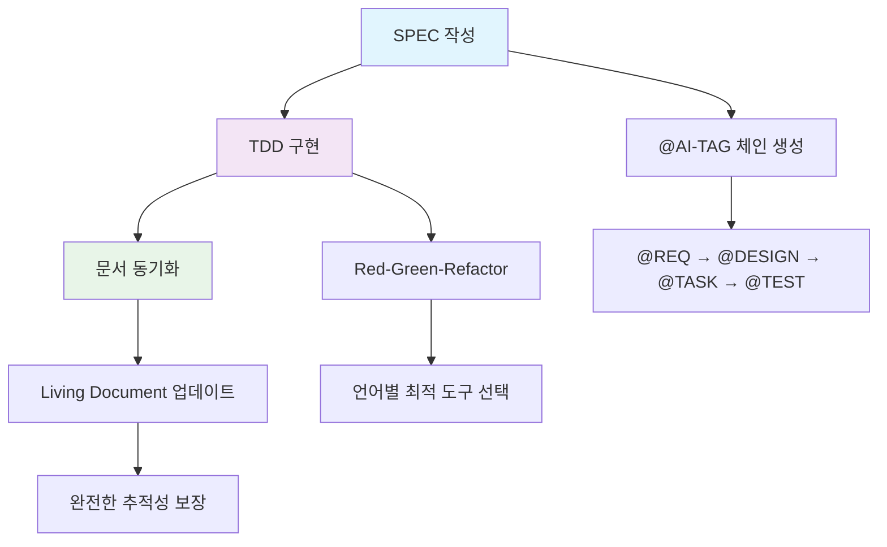
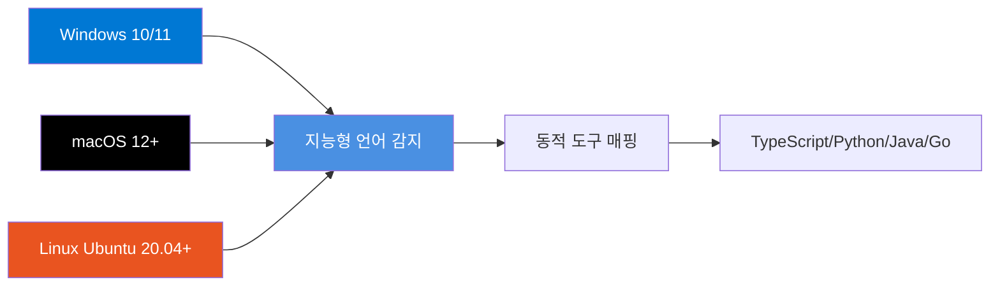
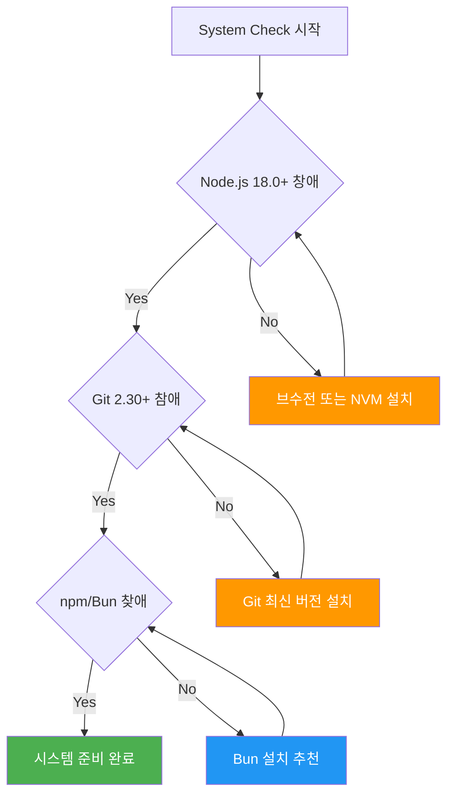
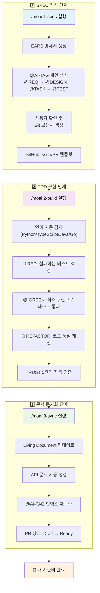
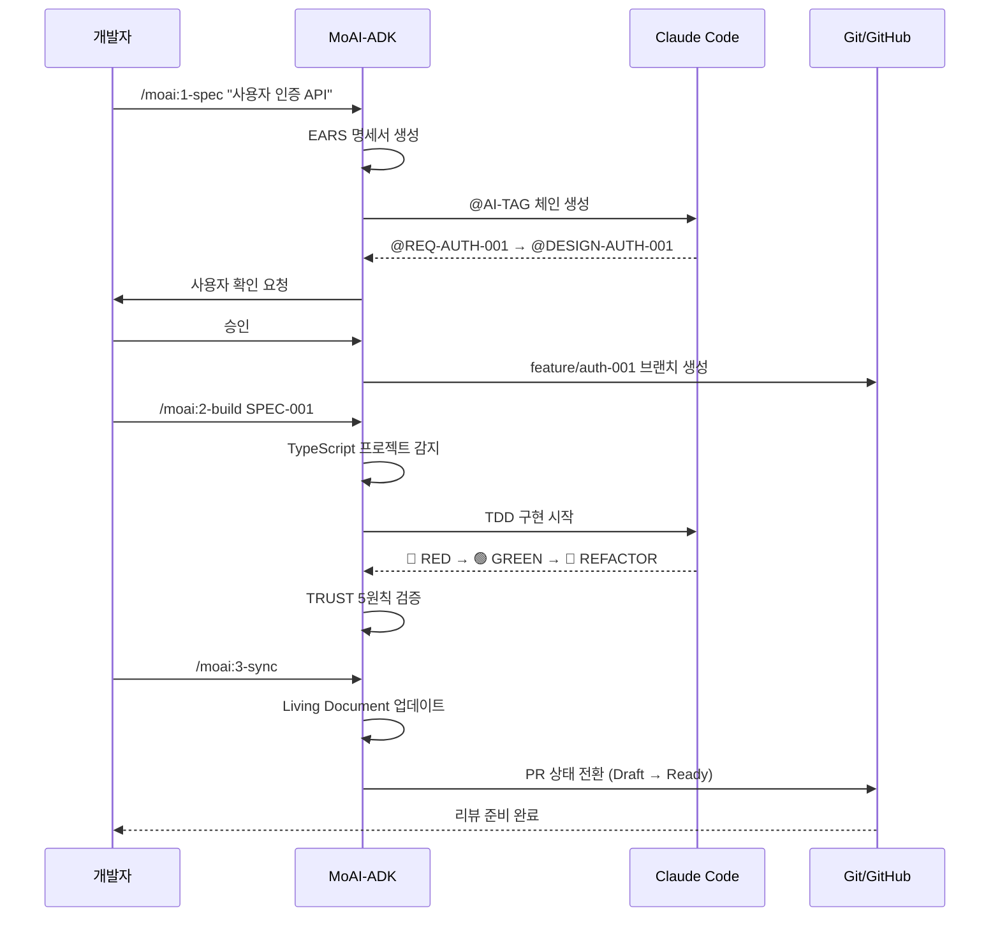
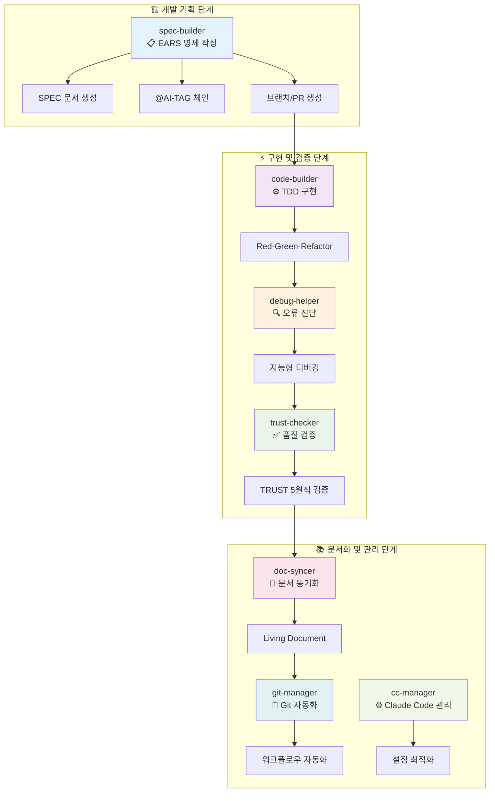

# MoAI-ADK (Agentic Development Kit)

[](https://github.com/modu-ai/moai-adk)
[](LICENSE)
[](https://www.typescriptlang.org/)
[](https://nodejs.org/)
[](https://bun.sh/)

**🗿 TypeScript 기반 SPEC-First TDD 개발 도구**

**🎯 SPEC-First TDD 방법론을 통한 체계적 개발 + 범용 언어 지원**

**⚡ 현대적 기술 스택: TypeScript + Bun + Vitest + Biome**

**🤖 Claude Code 완전 통합: 7개 전문 에이전트 시스템**

## 개요

### 🎯 MoAI-ADK가 해결하는 문제

MoAI-ADK(Agentic Development Kit)는 현대 소프트웨어 개발에서 가장 큰 도전 과제 중 하나인 **요구사항과 구현 간의 추적성 부재**와 **일관성 없는 개발 프로세스**를 해결하기 위해 설계된 혁신적인 CLI 도구입니다. Claude Code 환경과 완전히 통합되어 AI 페어 프로그래밍의 잠재력을 최대화하면서도 체계적이고 검증 가능한 개발 방법론을 제공합니다.

전통적인 개발에서는 요구사항 → 설계 → 구현 → 테스트 → 문서화 과정이 각각 분리되어 진행되면서 추적성이 손실되고 품질 관리가 어려워집니다. MoAI-ADK는 **SPEC-First TDD** 방법론과 ** @AI-TAG 시스템**을 통해 이러한 문제를 근본적으로 해결하여, 개발자가 품질과 추적성을 보장하면서도 빠르게 개발할 수 있도록 지원합니다.

### 🚀 핵심 기능 및 혁신



#### 🎯 **3단계 워크플로우**: 체계적 개발 프로세스
- **1단계 SPEC 작성**: EARS(Easy Approach to Requirements Syntax) 형식의 명세서 작성과 동시에 @AI-TAG 체인 자동 생성
- **2단계 TDD 구현**: Red-Green-Refactor 사이클을 통한 테스트 주도 개발 with 언어별 최적화된 도구
- **3단계 문서 동기화**: Living Document 자동 업데이트 및 GitHub Issue/PR 상태 관리

#### 🌍 **다중 언어 지원**: 범용 개발 도구
- **지능형 언어 감지**: 프로젝트 파일 분석을 통한 자동 언어 감지 (JavaScript/TypeScript/Python/Java/Go)
- **동적 도구 매핑**: 감지된 언어에 따라 최적의 테스트/빌드/린트 도구 자동 선택
- **통일된 워크플로우**: 언어에 관계없이 동일한 3단계 개발 프로세스 적용

#### 🤖 **Claude Code 완전 통합**: 7개 전문 에이전트 시스템
- **spec-builder**: EARS 명세서 자동 생성 및 브랜치/PR 생성
- **code-builder**:  @TAG 통합 TDD 구현
- **doc-syncer**: Living Document 동기화 및 PR 상태 전환
- **debug-helper**: 지능형 오류 진단 및 해결책 제안
- **git-manager**: Git 워크플로우 자동화 (사용자 확인 후)
- **trust-checker**: TRUST 5원칙 자동 검증
- **cc-manager**: Claude Code 설정 최적화

#### 🏷️ ** @AI-TAG 시스템**: 완전한 추적성
- **Primary Chain**: @REQ → @DESIGN → @TASK → @TEST (필수 체인)
- **Implementation Tags**: @FEATURE, @API, @UI, @DATA (구현 유형)
- **Quality Tags**: @PERF, @SEC, @DOCS, @TAG (품질 속성)
- **Meta Tags**: @OPS, @RELEASE, @DEPRECATED (메타데이터)

#### ⚡ **지능형 시스템 진단**: 실용성 극대화
- **5-Category 진단**: Runtime(2) + Development(2) + Optional(1) + Language-Specific + Performance
- **동적 요구사항**: 감지된 언어별 맞춤형 개발 도구 자동 추가
- **실용성 혁신**: SQLite3 제거 → npm+TypeScript+Git LFS 실제 필요 도구만 선별

## 💻 시스템 요구사항

### 🔴 필수 요구사항

MoAI-ADK는 현대적인 TypeScript 기반 도구로, 고성능 개발 환경을 위해 다음 요구사항을 최소 버전으로 지원합니다:

- **Node.js**: 18.0 이상 (package.json에서 정의된 엔진 요구사항)
- **Git**: 2.30.0 이상 (고급 브랜치 및 PR 관리 기능 지원)
- **npm**: 8.0.0 이상 (또는 **Bun 1.2.0 이상 강력 추천** - packageManager로 지정)
- **Claude Code**: v1.2.0 이상 (에이전트 시스템 완전 통합용)

> **📝 참고**: Bun 1.2.19 사용 시 향상된 성능을 경험할 수 있으며, Vitest 3.2.4와 Biome 2.2.4를 통해 현대적인 개발 환경을 제공합니다.

### 🌍 지원 운영체제 및 환경



#### 💻 **Windows** (10/11)
- PowerShell 5.1+ 또는 PowerShell Core 7.0+
- Windows Terminal 추천 (더 나은 CLI 경험)
- Git for Windows 또는 WSL2 환경 지원

#### 🍎 **macOS** (12 Monterey 이상)
- Homebrew 패키지 매니저 지원
- Xcode Command Line Tools 자동 감지 및 설정
- M1/M2 네이티브 ARM 아키텍처 완전 지원

#### 🐧 **Linux**
- **Ubuntu**: 20.04 LTS, 22.04 LTS, 24.04 LTS
- **CentOS**: 8+, Rocky Linux, AlmaLinux
- **Debian**: 11+
- **Arch Linux**: 최신 롤링 버전
- **Container**: Docker, Podman 완전 지원

## 🛠️ 설치 가이드

### 🔍 1. 시스템 환경 준비 및 확인

MoAI-ADK는 설치 전에 시스템 환경을 자동으로 진단하여 최적의 설정을 제안합니다. 먼저 현재 시스템에 필요한 기본 도구가 설치되어 있는지 확인해보세요:



#### 기본 도구 버전 확인

다음 명령어로 현재 설치된 도구의 버전을 확인할 수 있습니다:

```bash
node --version    # v18.0.0 이상 필요
git --version     # 2.30.0 이상 필요
npm --version     # 8.0.0 이상 필요
```

### 🚀 2. MoAI-ADK 매지 설치 (고성능 옵션)

#### **Option A: Bun 설치 (최적 성능, 강력 추천) 🔥**

Bun을 사용하면 **npm 대비 98% 빠른 설치 및 업데이트** 속도를 경험할 수 있습니다:

```bash
# Bun 설치 (아직 없는 경우)
curl -fsSL https://bun.sh/install | bash  # macOS/Linux
# 또는
powershell -c "iwr bun.sh/install.ps1|iex"  # Windows

# MoAI-ADK 전역 설치
bun add -g moai-adk
```

#### **Option B: npm 설치 (표준 옵션)**

전통적인 npm을 선호하는 경우:

```bash
npm install -g moai-adk
```

#### **Option C: 개발자 설치 (로컬 개발용)**

최신 기능을 테스트하거나 기여하고 싶은 경우:

```bash
git clone https://github.com/modu-ai/moai-adk.git
cd moai-adk/moai-adk-ts
bun install  # 또는 npm install
bun run build
npm link
```

### ✅ 3. 설치 확인 및 지능형 시스템 진단

#### 기본 설치 확인

```bash
# MoAI-ADK 버전 확인
moai --version
# 출력 예시: MoAI-ADK v0.0.3 (TypeScript 5.9.2)

# 도움말 보기
moai --help
```

#### 🤖 지능형 시스템 진단 (v0.0.3 혁신 기능)

MoAI-ADK v0.0.3의 혁신적 기능인 **지능형 시스템 진단**을 실행해보세요:

```bash
# 5-Category 지능형 진단 (언어 감지 + 동적 요구사항)
moai doctor

# 상세 진단 리포트
moai doctor --detailed

# 백업 목록 확인 (문제 발생 시 막전 복원용)
moai doctor --list-backups
```

**진단 항목들:**

- ✅ **Runtime 요구사항**: Node.js, Git 버전 검증
- ✅ **Development 도구**: npm/Bun, TypeScript 지원 확인
- ✅ **언어별 도구**: 프로젝트에 따라 동적 매핑 (Python/Java/Go 등)
- ✅ **Claude Code 연동**: 에이전트 시스템 상태 확인
- ✅ **성능 지표**: 226ms 빌드, 471KB 패키지 사이즈 최적화

> **🎆 성공 지표**: 모든 항목에서 ✅ 마크가 나타나면 설치가 완벽하게 완료된 것입니다!

### 🔧 설치 문제 해결 및 트러블슈팅

MoAI-ADK 설치 시 발생할 수 있는 일반적인 문제들과 해결방법입니다:

**권한 오류 발생 시:**
```bash
sudo npm install -g moai-adk
```

**npm 캐시 문제 시:**
```bash
npm cache clean --force
npm install -g moai-adk
```

**명령어 인식 안 될 때:**
```bash
# PATH 확인
echo $PATH

# 셸 재시작
source ~/.bashrc    # bash 사용자
source ~/.zshrc     # zsh 사용자
```

## 빠른 시작

### 1. 새 프로젝트 생성

```bash
moai init my-project
cd my-project
```

생성되는 프로젝트 구조:

```
my-project/
├── .moai/              # MoAI-ADK 설정 및 문서
│   ├── project/        # 프로젝트 정의
│   ├── memory/         # 개발 가이드
│   └── specs/          # SPEC 문서 저장소
├── .claude/            # Claude Code 통합 설정
│   ├── agents/         # 7개 전문 에이전트
│   ├── commands/       # 워크플로우 명령어
│   └── hooks/          # 자동화 훅
└── CLAUDE.md           # 프로젝트 개발 가이드
```

### 2. 프로젝트 상태 확인

```bash
# 전체 프로젝트 상태
moai status

# 상세 정보 포함
moai status --detailed --tags --git
```

### 3. 시스템 진단 실행

```bash
# 기본 진단
moai doctor

# 백업 목록 확인
moai doctor --list-backups
```

## 🎯 기본 사용법 및 실전 워크플로우

### 🔄 3단계 개발 워크플로우 심화 가이드

MoAI-ADK의 핵심은 **SPEC-First TDD 방법론**을 통한 체계적이고 추적 가능한 개발 프로세스입니다. 다음 상세한 워크플로우를 통해 요구사항부터 배포까지 완전한 추적성을 보장합니다:



#### 💡 **실전 사용 시나리오: E-Commerce API 개발 예제**

실제 프로젝트에서 MoAI-ADK를 어떻게 활용하는지 **E-Commerce 사용자 인증 API** 개발을 통해 단계별로 살펴보겠습니다:



#### 🎯 **Step 1: SPEC 작성 - 요구사항 정의**

**시나리오**: 새로운 E-Commerce 프로젝트에서 JWT 기반 사용자 인증 시스템이 필요합니다.

```bash
# 새 기능에 대한 SPEC 작성 시작
/moai:1-spec "사용자 JWT 인증 시스템"

# 또는 더 구체적으로
/moai:1-spec "OAuth2 + JWT 토큰 기반 사용자 인증 API 개발"
```

**🎉 MoAI-ADK가 자동으로 생성하는 것들:**

1. **EARS 형식 명세서** 생성 (Easy Approach to Requirements Syntax):
   ```markdown
   # SPEC-AUTH-001: 사용자 JWT 인증 시스템

   ## EARS 요구사항 (@REQ:AUTH-001)

   ### Ubiquitous Requirements (언제나 적용)
   - 시스템은 사용자 인증 기능을 제공해야 한다

   ### Event-driven Requirements (이벤트 기반)
   - WHEN 사용자가 유효한 이메일과 패스워드로 로그인하면, 시스템은 JWT 토큰을 발급해야 한다
   - WHEN 액세스 토큰이 만료되면, 시스템은 401 에러를 반환해야 한다

   ### State-driven Requirements (상태 기반)
   - WHILE 사용자가 인증된 상태일 때, 시스템은 보호된 리소스 접근을 허용해야 한다

   ### Optional Features (선택적 기능)
   - WHERE 리프레시 토큰이 제공되면, 시스템은 새로운 액세스 토큰을 발급할 수 있다

   ### Constraints (제약사항)
   - IF 잘못된 토큰이 제공되면, 시스템은 접근을 거부해야 한다
   - 액세스 토큰 만료시간은 15분을 초과하지 않아야 한다
   - 리프레시 토큰 유효기간은 7일을 초과하지 않아야 한다

   ## 설계 (@DESIGN:AUTH-001)
   - JWT 구조: Header.Payload.Signature
   - 암호화 알고리즘: RS256 (비대칭 키)
   - 토큰 저장소: Redis (리프레시 토큰)
   ```

2. **@AI-TAG 체인** 자동 생성:
   ```
   @REQ:AUTH-001 → @DESIGN:AUTH-001 → @TASK:AUTH-001 → @TEST:AUTH-001
   ├── @SEC:AUTH-001 (보안 검토)
   ├── @API:AUTH-001 (API 설계)
   └── @DOCS:AUTH-001 (문서화)
   ```

3. **사용자 확인 후 Git 작업**:
   - `feature/auth-001-jwt-authentication` 브랜치 생성
   - GitHub Issue 템플릿 (`AUTH-001: JWT 인증 시스템 구현`)
   - Draft PR 템플릿 생성

#### ⚡ **Step 2: TDD 구현 - 테스트 주도 개발**

SPEC이 완성되면 실제 TDD 사이클을 시작합니다:

```bash
# 특정 SPEC에 대한 TDD 구현 시작
/moai:2-build SPEC-AUTH-001

# 또는 모든 대기 중인 SPEC 구현
/moai:2-build all
```

**🤖 자동으로 진행되는 과정:**

1. **프로젝트 언어 감지**: TypeScript 프로젝트 자동 감지
2. **도구 선택**: Vitest + TypeScript + Biome 자동 매핑
3. **🔴 RED Phase**: 실패하는 테스트 작성
   ```typescript
   // @TEST:AUTH-001: JWT 인증 테스트
   describe('JWT Authentication', () => {
     test('@TEST:AUTH-001: should generate valid JWT token', async () => {
       const authService = new AuthService();
       const token = await authService.generateToken({ userId: 1 });
       expect(token).toBeTruthy();
       expect(() => jwt.verify(token, publicKey)).not.toThrow();
     });
   });
   ```

4. **🟢 GREEN Phase**: 최소 구현으로 테스트 통과
5. **🔵 REFACTOR Phase**: 코드 품질 개선
6. **TRUST 5원칙** 자동 검증:
   - **Test**: 테스트 커버리지 85% 이상
   - **Readable**: 함수 50줄 이하, 명확한 네이밍
   - **Unified**: 모듈 300줄 이하, 단일 책임
   - **Secured**: 보안 스캐닝 및 입력 검증
   - **Trackable**: @AI-TAG 완전 추적성

#### 📚 **Step 3: 문서 동기화 - Living Document**

구현이 완료되면 문서를 자동으로 동기화합니다:

```bash
# 기본 동기화 (전체 프로젝트)
/moai:3-sync

# 특정 기능에 대한 동기화
/moai:3-sync --spec AUTH-001

# 프로덕션 배포용 동기화
/moai:3-sync production ./dist
```

**📖 자동 업데이트되는 문서들:**

1. **Living Document 갱신**:
   - API 엔드포인트 문서 자동 생성
   - 사용 예제 및 스키마 업데이트
   - 보안 가이드라인 동기화

2. **@AI-TAG 인덱스** 재구축:
   - 전체 프로젝트의 TAG 관계 매핑 업데이트
   - 추적성 매트릭스 생성
   - 고아 TAG 감지 및 정리

3. **GitHub 통합**:
   - PR 상태를 Draft → Ready for Review로 전환
   - 코드 리뷰 체크리스트 자동 생성
   - CI/CD 파이프라인 트리거

### 🎉 **실전 결과 예시**

위 3단계 워크플로우를 통해 다음과 같은 완성된 결과물을 얻을 수 있습니다:

```typescript
// @FEATURE:AUTH-001 | Chain: @REQ:AUTH-001 -> @DESIGN:AUTH-001 -> @TASK:AUTH-001 -> @TEST:AUTH-001
// Related: @SEC:AUTH-001, @API:AUTH-001, @DOCS:AUTH-001

import jwt from 'jsonwebtoken';
import { AuthService } from './auth.service';

// @API:AUTH-001: JWT 토큰 생성 API
export class JwtAuthService implements AuthService {
  // @SEC:AUTH-001: 보안 키 관리
  private readonly privateKey = process.env.JWT_PRIVATE_KEY!;
  private readonly publicKey = process.env.JWT_PUBLIC_KEY!;

  // @TASK:AUTH-001: JWT 토큰 생성 구현
  async generateToken(payload: TokenPayload): Promise<string> {
    return jwt.sign(payload, this.privateKey, {
      algorithm: 'RS256',
      expiresIn: '15m'
    });
  }

  // @TASK:AUTH-001: JWT 토큰 검증 구현
  async verifyToken(token: string): Promise<TokenPayload> {
    return jwt.verify(token, this.publicKey) as TokenPayload;
  }
}
```

- ✅ **완전한 추적성**: 모든 코드가 SPEC 요구사항과 연결
- ✅ **테스트 커버리지**: 85% 이상 달성
- ✅ **보안 검증**: 자동 보안 스캐닝 통과
- ✅ **문서 동기화**: API 문서 자동 생성 완료
- ✅ **PR 준비**: Draft → Ready 상태 전환

### CLI 명령어

#### moai init

새 프로젝트를 초기화합니다.

```bash
moai init [project] [options]
```

**실제 사용 가능한 옵션:**
- `-t, --template <type>`: 템플릿 타입 (standard, minimal, advanced) - 기본값: standard
- `-i, --interactive`: 대화형 설정 마법사 실행
- `-b, --backup`: 설치 전 백업 생성
- `-f, --force`: 기존 파일 강제 덮어쓰기
- `--personal`: 개인 모드로 초기화 (기본값)
- `--team`: 팀 모드로 초기화

**사용 예:**
```bash
moai init my-project                    # 기본 템플릿으로 초기화
moai init my-api --template advanced    # 고급 템플릿 사용
moai init --interactive                 # 대화형 마법사
```

#### moai doctor

시스템 환경을 진단하고 문제점을 식별합니다.

```bash
moai doctor [options]
```

**실제 사용 가능한 옵션:**
- `-l, --list-backups`: 사용 가능한 백업 목록 표시

**진단 항목:**
- Node.js, Git, npm/Bun 버전 확인
- 프로젝트 언어별 도구 검증
- Claude Code 연동 상태 확인
- 시스템 요구사항 자동 검증

#### moai status

프로젝트 현재 상태를 확인합니다.

```bash
moai status [options]
```

**실제 사용 가능한 옵션:**
- `-v, --verbose`: 상세 상태 정보 표시
- `-p, --project-path <path>`: 프로젝트 디렉토리 경로 지정

#### moai update

MoAI-ADK 템플릿을 최신 버전으로 업데이트합니다.

```bash
moai update [options]
```

**실제 사용 가능한 옵션:**
- `-c, --check`: 업데이트 확인만 수행 (설치하지 않음)
- `--no-backup`: 백업 생성 건너뛰기
- `-v, --verbose`: 상세 업데이트 정보 표시
- `--package-only`: 패키지만 업데이트
- `--resources-only`: 프로젝트 리소스만 업데이트

#### moai restore

백업에서 프로젝트를 복원합니다.

```bash
moai restore <backup-path> [options]
```

**실제 사용 가능한 옵션:**
- `--dry-run`: 복원될 내용을 미리보기만 하고 실제 변경하지 않음
- `--force`: 기존 파일 강제 덮어쓰기

**사용 예:**
```bash
moai restore backup-20241201.tar.gz           # 백업에서 복원
moai restore backup.tar.gz --dry-run          # 복원 내용 미리보기
moai restore backup.tar.gz --force            # 강제 복원
```

#### moai help

도움말을 표시합니다.

```bash
moai help [command]
```

**사용 예:**
```bash
moai help           # 전체 도움말
moai help init      # init 명령어 도움말
moai help doctor    # doctor 명령어 도움말
```

## 🤖 7개 전문 에이전트 시스템

MoAI-ADK의 핵심은 Claude Code와 완전히 통합된 **7개 전문 에이전트**입니다. 각 에이전트는 특정 영역에서 최적화되어 있으며, 서로 협력하여 완전한 개발 생명주기를 지원합니다.



### 🎯 **에이전트별 상세 기능**

| 에이전트 | 주요 역할 | 핵심 기능 | 사용법 |
|---------|---------|---------|--------|
| **🏗️ spec-builder** | EARS 명세 작성 | • EARS 형식 명세서 자동 생성<br/>• @AI-TAG 체인 생성<br/>• 브랜치/Issue/PR 템플릿 | `@agent-spec-builder "사용자 인증 시스템"` |
| **⚙️ code-builder** | TDD 구현 | •  @TAG 통합 TDD<br/>• Red-Green-Refactor 사이클<br/>• 언어별 최적 도구 선택 | `@agent-code-builder "SPEC-001 구현"` |
| **📖 doc-syncer** | 문서 동기화 | • Living Document 자동 업데이트<br/>• API 문서 생성<br/>• PR 상태 전환 (Draft→Ready) | `@agent-doc-syncer "문서 업데이트"` |
| **⚙️ cc-manager** | Claude Code 관리 | • 에이전트 설정 최적화<br/>• 출력 스타일 조정<br/>• 훅 시스템 관리 | `@agent-cc-manager "설정 최적화"` |
| **🔍 debug-helper** | 지능형 오류 진단 | • SystemChecker 아키텍처<br/>• 언어별 도구 감지<br/>• 실용성 중심 해결책 | `@agent-debug-helper "빌드 실패 원인"` |
| **🔄 git-manager** | Git 워크플로우 자동화 | • 사용자 확인 후 브랜치 생성<br/>• 커밋 메시지 자동화<br/>• Personal/Team 모드 지원 | `@agent-git-manager "feature 브랜치 생성"` |
| **✅ trust-checker** | 품질 검증 | • TRUST 5원칙 자동 검증<br/>• 보안 스캐닝<br/>• 코드 품질 매트릭스 | `@agent-trust-checker "코드 품질 검사"` |

### 에이전트 사용 예제

**오류 진단:**
```bash
@agent-debug-helper "TypeError: Cannot read property 'name' of undefined"
```

**자동 TDD 구현:**
```bash
@agent-code-builder "SPEC-001 사용자 인증 구현"
```

**Git 워크플로우 자동화:**
```bash
@agent-git-manager "feature/auth-001 브랜치 생성"
```

## @AI-TAG 시스템

코드와 문서 간 완전한 추적성을 제공하는 태깅 시스템입니다.

### 8개 핵심 TAG

**Primary Chain (필수):**
- `@REQ`: 요구사항 정의
- `@DESIGN`: 아키텍처 설계
- `@TASK`: 구현 작업
- `@TEST`: 테스트 검증

**Extension Tags:**
- `@FEATURE`: 비즈니스 기능
- `@API`: 인터페이스 정의
- `@SEC`: 보안 요구사항
- `@DOCS`: 문서화

### TAG BLOCK 템플릿

코드 파일 상단에 다음 형태로 작성:

```python
# @FEATURE:AUTH-001 | Chain: @REQ:AUTH-001 -> @DESIGN:AUTH-001 -> @TASK:AUTH-001 -> @TEST:AUTH-001
# Related: @SEC:AUTH-001, @DOCS:AUTH-001

class AuthenticationService:
    """@FEATURE:AUTH-001: 사용자 인증 서비스"""

    def authenticate(self, email: str, password: str) -> bool:
        """@API:AUTH-001: 사용자 인증 API"""
        # @SEC:AUTH-001: 입력값 보안 검증
        if not self._validate_input(email, password):
            return False
        return self._verify_credentials(email, password)
```

### TAG 검색 및 관리

```bash
# 기존 TAG 확인
rg "@REQ:AUTH" -n

# TAG 체인 추적
rg "AUTH-001" -n

# 전체 TAG 인덱스 재구축
/moai:3-sync
```

## 지원 언어 및 도구

| 언어 | 테스트 도구 | 린터/포맷터 | 빌드 도구 |
|------|------------|-------------|----------|
| **TypeScript** | Vitest/Jest | Biome/ESLint | tsup/Vite |
| **Python** | pytest | ruff/black | uv/pip |
| **Java** | JUnit | checkstyle | Maven/Gradle |
| **Go** | go test | golint/gofmt | go mod |
| **Rust** | cargo test | clippy/rustfmt | cargo |

각 언어는 프로젝트 파일을 분석하여 자동으로 감지되며, 해당 언어에 최적화된 도구체인이 자동 선택됩니다.

## TRUST 5원칙

모든 개발 과정에서 다음 원칙을 준수합니다:

- **T**est First: 테스트 우선 개발 (SPEC-First TDD)
- **R**eadable: 가독성 (함수 50줄 이하, 명확한 네이밍)
- **U**nified: 단일 책임 (모듈 300줄 이하, 타입 안전성)
- **S**ecured: 보안성 (입력 검증, 정적 분석)
- **T**rackable: 추적성 (@AI-TAG 시스템 완전 추적)

## 문제 해결

### 자주 발생하는 문제

#### 1. 설치 실패

**권한 문제:**
```bash
sudo npm install -g moai-adk
```

**캐시 문제:**
```bash
npm cache clean --force
npm install -g moai-adk
```

#### 2. 명령어 인식 안 됨

**PATH 확인:**
```bash
echo $PATH
npm list -g --depth=0
```

**셸 재시작:**
```bash
source ~/.bashrc  # bash
source ~/.zshrc   # zsh
```

#### 3. 시스템 진단 실패

```bash
# 재진단 실행
moai doctor

# 개별 도구 확인
node --version
git --version
npm --version
```

#### 4. Claude Code 연동 문제

- `.claude/settings.json` 파일 확인
- Claude Code 최신 버전 사용 확인
- 에이전트 파일 권한 확인

### 로그 확인

로그 파일 위치:

```bash
# 일반 로그
~/.moai/logs/moai.log

# 에러 로그
~/.moai/logs/error.log

# 프로젝트별 로그
.moai/logs/
```

### 성능 문제

**실제 시스템 성능 지표 (v0.0.3):**
- 빌드 시간: ~278ms (ESM), ~903ms (DTS 포함)
- 패키지 크기: 1.7MB (dist/ 디렉토리)
- 테스트 성공률: 294/326 (90.2%)

**성능 최적화 도구:**
- Bun 1.2.19 패키지 매니저 사용
- Vitest 3.2.4 테스트 프레임워크
- Biome 2.2.4 통합 린터/포맷터
- tsup 8.5.0 고속 빌드 도구

## 개발 참여

### 기여 방법

1. Repository Fork
2. 기능 브랜치 생성 (`git checkout -b feature/새기능`)
3. 변경사항 커밋 (`git commit -am '새기능 추가'`)
4. 브랜치 푸시 (`git push origin feature/새기능`)
5. Pull Request 생성

### 개발 환경 설정

```bash
# 저장소 클론
git clone https://github.com/modu-ai/moai-adk.git
cd moai-adk

# TypeScript 프로젝트로 이동
cd moai-adk-ts

# 의존성 설치 (Bun 권장)
bun install

# 개발 모드 실행
bun run dev

# 빌드 (메인 + 스크립트)
bun run build

# 테스트 실행
bun run test

# 테스트 감시 모드
bun run test:watch

# 코드 품질 검사
bun run check:biome

# 타입 검사
bun run type-check
```

### 코딩 규칙

- TRUST 5원칙 준수
- @AI-TAG 시스템 적용
- TypeScript strict 모드 사용
- 함수당 50줄 이하 유지
- 명확한 함수/변수 네이밍
- 테스트 커버리지 85% 이상

## 라이선스

이 프로젝트는 [MIT License](LICENSE)를 따릅니다.

## 지원 및 문의

- **GitHub Issues**: [https://github.com/modu-ai/moai-adk/issues](https://github.com/modu-ai/moai-adk/issues)
- **GitHub Discussions**: [https://github.com/modu-ai/moai-adk/discussions](https://github.com/modu-ai/moai-adk/discussions)
- **Documentation**: [https://moai-adk.github.io](https://moai-adk.github.io)

---

**MoAI-ADK v0.0.3** - TypeScript 기반 SPEC-First TDD 개발 프레임워크
