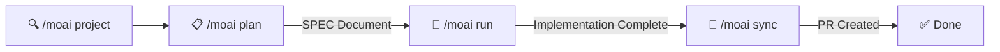
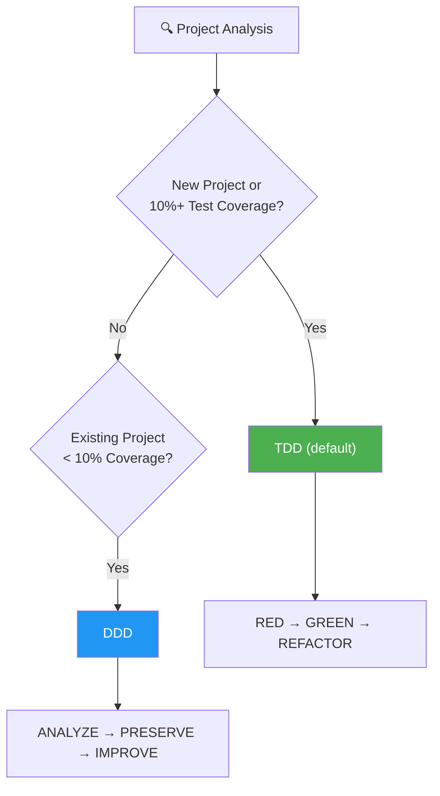
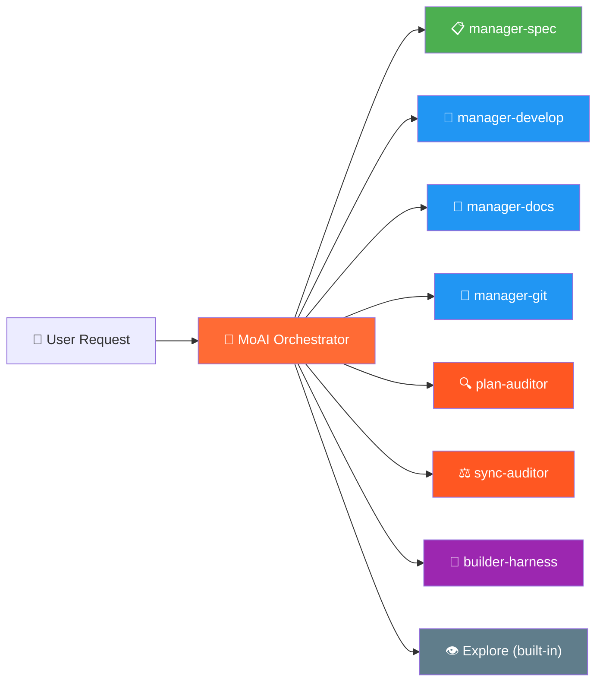
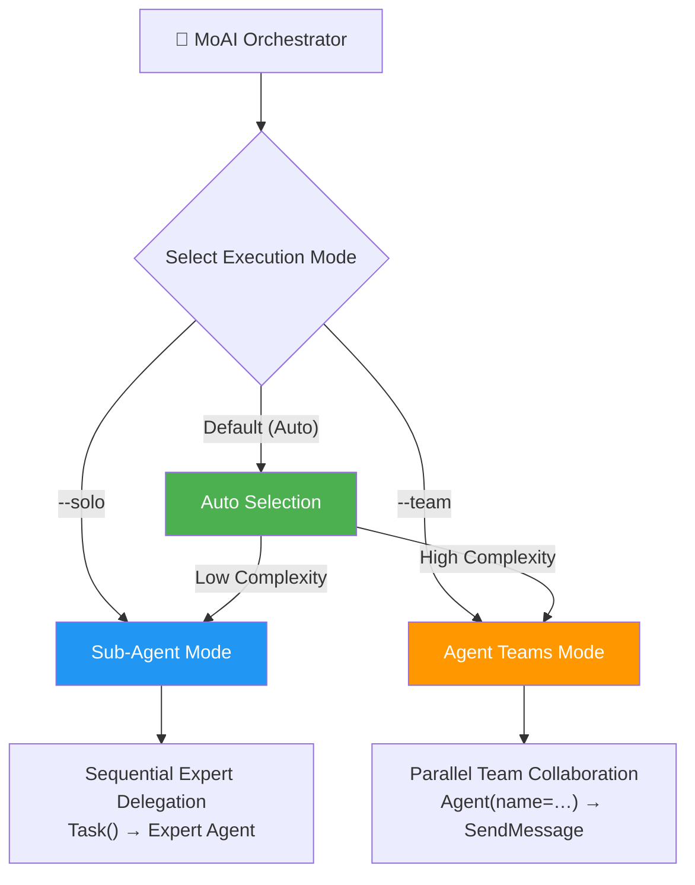
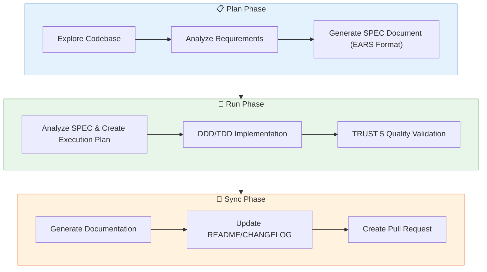
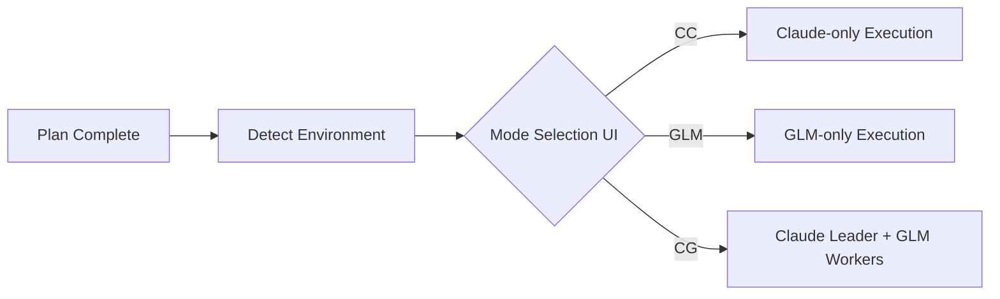
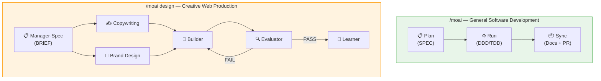
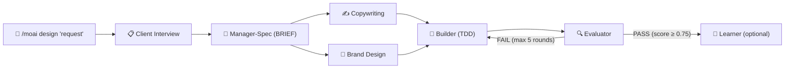
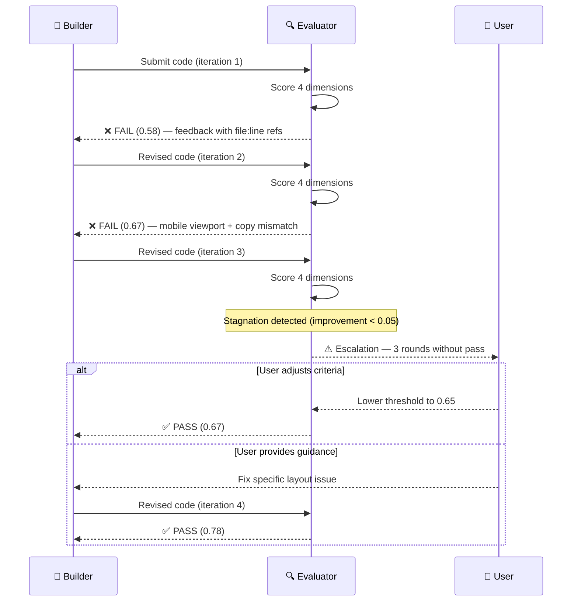

<p align="center">
  
</p>

<h1 align="center">MoAI-ADK</h1>

<p align="center">
  <strong>Agentic Development Kit for Claude Code</strong>
</p>

<p align="center">
  <a href="./README.md">English</a> ·
  <a href="./README.ko.md">한국어</a> ·
  <a href="./README.ja.md">日本語</a> ·
  <a href="./README.zh.md">中文</a>
</p>

<p align="center">
  <a href="https://github.com/modu-ai/moai-adk/actions/workflows/ci.yml"></a>
  <a href="https://github.com/modu-ai/moai-adk/actions/workflows/codeql.yml"></a>
  <a href="https://codecov.io/gh/modu-ai/moai-adk"></a>
  <br>
  <a href="https://go.dev/"></a>
  <a href="https://github.com/modu-ai/moai-adk/releases"></a>
  <a href="./LICENSE"></a>
</p>

<p align="center">
  <a href="https://adk.mo.ai.kr"><strong>Official Documentation</strong></a>
</p>

---

> 📚 **[Official Documentation](https://adk.mo.ai.kr)**

---

> **"The purpose of vibe coding is not rapid productivity but code quality."**

MoAI-ADK is a **high-performance AI development environment** for Claude Code. 8 retained AI agents (7 MoAI-custom + 1 Anthropic built-in `Explore`) and 30 `moai-*` template-managed skills collaborate to produce quality code. It automatically applies TDD (default) for new projects and feature development, or DDD for existing projects with minimal test coverage, and supports dual execution modes with Sub-Agent and Agent Teams.

A single binary written in Go -- runs instantly on any platform with zero dependencies.


---

## Why MoAI-ADK?

We completely rewrote the Python-based MoAI-ADK (~73,000 lines) in Go.

| Aspect | Python Edition | Go Edition |
|--------|---------------|------------|
| Distribution | pip + venv + dependencies | **Single binary**, zero dependencies |
| Startup time | ~800ms interpreter boot | **~5ms** native execution |
| Concurrency | asyncio / threading | **Native goroutines** |
| Type safety | Runtime (mypy optional) | **Compile-time enforced** |
| Cross-platform | Python runtime required | **Prebuilt binaries** (macOS, Linux, Windows) |
| Hook execution | Shell wrapper + Python | **Compiled binary**, JSON protocol |

### Key Numbers

- **100K+ lines** of Go code across **100+** packages
- **85-100%** test coverage
- **8** retained AI agents + **30** `moai-*` skills (template-managed; excludes 2 `harness-moaiadk-*` user-owned)
- **16** programming languages supported
- **27** Claude Code hook events

---

## Harness Engineering Architecture

MoAI-ADK implements the **Harness Engineering** paradigm — designing the environment for AI agents rather than writing code directly.

| Component | Description | Command |
|-----------|-------------|---------|
| **Self-Verify Loop** | Agents write code → test → fail → fix → pass cycle autonomously | `/moai loop` |
| **Context Map** | Codebase architecture maps and documentation always available to agents | `/moai codemaps` |
| **Session Persistence** | `progress.md` tracks completed phases across sessions; interrupted runs resume automatically | `/moai run SPEC-XXX` |
| **Failing Checklist** | All acceptance criteria registered as pending tasks at run start; marked complete as implemented | `/moai run SPEC-XXX` |
| **Language-Agnostic** | 16 languages supported: auto-detects language, selects correct LSP/linter/test/coverage tools | All workflows |
| **Garbage Collection** | Periodic scan and removal of dead code, AI Slop, and unused imports | `/moai clean` |
| **Scaffolding First** | Empty file stubs created before implementation to prevent entropy | `/moai run SPEC-XXX` |
| **Harness v4 Builder** | Orchestrator-direct harness build system with 4-phase workflow (ANALYZE → PLAN → GENERATE → ACTIVATE), manifest-driven Runner, and conditional worktree isolation | `/moai:harness <natural-language request>` |
| **Harness Lifecycle** | List/edit/remove harness lifecycle commands (`/harness:<name>` list, edit, remove) | `/moai:harness status`, `/moai:harness edit <name>`, `/moai:harness remove <name>` |

> "Human steers, agents execute." — The engineer's role shifts from writing code to designing the harness: SPECs, quality gates, and feedback loops.

**Harness v4 Architecture**: See [SPEC-V3R6-HARNESS-V4-001](.moai/specs/SPEC-V3R6-HARNESS-V4-001/spec.md) and [`.claude/skills/moai/workflows/harness-builder.md`](.claude/skills/moai/workflows/harness-builder.md) for the orchestrator-direct Builder workflow, manifest.json schema, Runner primitive mapping, and conditional worktree isolation rules.

---

## System Requirements

| Platform | Supported Environments | Notes |
|----------|----------------------|-------|
| macOS | Terminal, iTerm2 | Fully supported |
| Linux | Bash, Zsh | Fully supported |
| Windows | **WSL (recommended)**, PowerShell 7.x+ | Native cmd.exe is not supported |

**Prerequisites:**
- **Git** must be installed on all platforms
- **Windows users**: [Git for Windows](https://gitforwindows.org/) is **required** (includes Git Bash)
  - Use **WSL** (Windows Subsystem for Linux) for the best experience
  - PowerShell 7.x or later is supported as an alternative
  - Legacy Windows PowerShell 5.x and cmd.exe are **not supported**

---

## Quick Start

### 1. Installation

#### macOS / Linux / WSL

```bash
curl -fsSL https://raw.githubusercontent.com/modu-ai/moai-adk/main/install.sh | bash
```

#### Windows (PowerShell 7.x+)

> **Recommended**: Use WSL with the Linux installation command above for the best experience.

```powershell
irm https://raw.githubusercontent.com/modu-ai/moai-adk/main/install.ps1 | iex
```

> Requires [Git for Windows](https://gitforwindows.org/) to be installed first.

#### Build from Source (Go 1.26+)

```bash
git clone https://github.com/modu-ai/moai-adk.git
cd moai-adk && make build
```

> Prebuilt binaries are available on the [Releases](https://github.com/modu-ai/moai-adk/releases) page.

### 2. Windows-Specific Issues

#### Korean Username Path Errors

If your Windows username contains non-ASCII characters (Korean, Chinese, etc.),
you may encounter `EINVAL` errors due to Windows 8.3 short filename conversion.

**Workaround 1:** Set an alternative temp directory:

```bash
# Command Prompt
set MOAI_TEMP_DIR=C:\temp
mkdir C:\temp 2>nul

# PowerShell
$env:MOAI_TEMP_DIR="C:\temp"
New-Item -ItemType Directory -Path "C:\temp" -Force
```

**Workaround 2:** Disable 8.3 filename generation (requires admin):

```bash
fsutil 8dot3name set 1
```

**Workaround 3:** Create a new Windows user account with ASCII-only username.

### 3. Initialize a Project

```bash
moai init my-project
```

An interactive wizard auto-detects your language, framework, and methodology, then generates Claude Code integration files.

### 4. Start Developing with Claude Code

```bash
# After launching Claude Code
/moai project                            # Generate project docs (product.md, structure.md, tech.md)
/moai plan "Add user authentication"     # Create a SPEC document
/moai run SPEC-AUTH-001                   # DDD/TDD implementation
/moai sync SPEC-AUTH-001                  # Sync docs & create PR
/moai github issues                      # Fix GitHub issues with Agent Teams
/moai github pr 123                       # Review PR with multi-perspective analysis
```


```mermaid
graph LR
    A["🔍 /moai project"] --> B["📋 /moai plan"]
    B -->|"SPEC Document"| C["🔨 /moai run"]
    C -->|"Implementation Complete"| D["📄 /moai sync"]
    D -->|"PR Created"| E["✅ Done"]
```

---

## MoAI Development Methodology

MoAI-ADK automatically selects the optimal development methodology based on your project's state.


```mermaid
flowchart TD
    A["🔍 Project Analysis"] --> B{"New Project or<br/>10%+ Test Coverage?"}
    B -->|"Yes"| C["TDD (default)"]
    B -->|"No"| D{"Existing Project<br/>< 10% Coverage?"}
    D -->|"Yes"| E["DDD"]
    C --> F["RED → GREEN → REFACTOR"]
    E --> G["ANALYZE → PRESERVE → IMPROVE"]

    style C fill:#4CAF50,color:#fff
    style E fill:#2196F3,color:#fff
```

### TDD Methodology (Default)

The default methodology for new projects and feature development. Write tests first, then implement.

| Phase | Description |
|-------|-------------|
| **RED** | Write a failing test that defines expected behavior |
| **GREEN** | Write minimal code to make the test pass |
| **REFACTOR** | Improve code quality while keeping tests green. `/simplify` runs automatically after REFACTOR completes. |

For brownfield projects (existing codebases), TDD is enhanced with a **pre-RED analysis step**: read existing code to understand current behavior before writing tests.

### DDD Methodology (Existing Projects with < 10% Coverage)

A methodology for safely refactoring existing projects with minimal test coverage.

```
ANALYZE   → Analyze existing code and dependencies, identify domain boundaries
PRESERVE  → Write characterization tests, capture current behavior snapshots
IMPROVE   → Improve incrementally under test protection. /simplify runs automatically after IMPROVE completes.
```

> The methodology is automatically selected during `moai init` (`--mode <ddd|tdd>`, default: tdd) and can be changed via `development_mode` in `.moai/config/sections/quality.yaml`.
>
> **Note**: MoAI-ADK v2.5.0+ uses binary methodology selection (TDD or DDD only). The hybrid mode has been removed for clarity and consistency.

### Auto Quality & Scale-Out Layer

MoAI-ADK v2.6.0+ integrates two Claude Code native skills that MoAI invokes **autonomously** — no flags or manual commands required.

| Skill | Role | Trigger |
|-------|------|---------|
| `/simplify` | Quality enforcement | **Always** runs after every TDD REFACTOR and DDD IMPROVE phase |
| `/batch` | Scale-out execution | Auto-triggered when task complexity exceeds thresholds |

**`/simplify` — Automatic Quality Pass**

Uses parallel agents to review changed code for reuse opportunities, quality issues, efficiency, and CLAUDE.md compliance, then auto-fixes findings. MoAI calls this directly after every implementation cycle — no configuration needed.

**`/batch` — Parallel Scale-Out**

Spawns dozens of agents in isolated git worktrees for large-scale parallel work. Each agent runs tests and reports results; MoAI merges them. Auto-triggered per workflow:

| Workflow | Trigger Condition |
|----------|------------------|
| `run` | tasks ≥ 5, OR predicted file changes ≥ 10, OR independent tasks ≥ 3 |
| `mx` | source files ≥ 50 |
| `coverage` | P1+P2 coverage gaps ≥ 10 |
| `clean` | confirmed dead code items ≥ 20 |

---

## AI Agent Orchestration

MoAI is a **strategic orchestrator**. Rather than writing code directly, it delegates tasks to 8 retained agents.


```mermaid
graph LR
    U["👤 User Request"] --> M["🗿 MoAI Orchestrator"]

    M --> MS["📋 manager-spec"]
    M --> MD["🔨 manager-develop"]
    M --> MDoc["📄 manager-docs"]
    M --> MG["🌿 manager-git"]
    M --> PA["🔍 plan-auditor"]
    M --> SA["⚖️ sync-auditor"]
    M --> BH["🔧 builder-harness"]
    M --> EX["👁️ Explore (built-in)"]

    style M fill:#FF6B35,color:#fff
    style MS fill:#4CAF50,color:#fff
    style MD fill:#2196F3,color:#fff
    style MDoc fill:#2196F3,color:#fff
    style MG fill:#2196F3,color:#fff
    style PA fill:#FF5722,color:#fff
    style SA fill:#FF5722,color:#fff
    style BH fill:#9C27B0,color:#fff
    style EX fill:#607D8B,color:#fff
```

### Agent Categories

| Category | Count | Agents | Role |
|----------|-------|--------|------|
| **Manager** | 4 | manager-spec, manager-develop, manager-docs, manager-git | Plan-phase authoring, run-phase implementation, sync-phase docs, PR routing |
| **Evaluator** | 2 | plan-auditor, sync-auditor | Independent plan-phase audit, sync-phase 4-dimension quality scoring |
| **Builder** | 1 | builder-harness | Dynamic project-specific harness specialist generation |
| **Anthropic built-in** | 1 | Explore | Read-only codebase exploration (invoked directly, no MoAI file) |

**Total: 8 retained agents** (7 MoAI-custom + 1 Anthropic built-in `Explore`)

12 legacy agent names (e.g. `manager-strategy`, `manager-quality`, `manager-project`, the 6 `expert-*` agents) are **archived** and MUST NOT be spawned. When a paste-ready resume or `Agent()` invocation references an archived name, the orchestrator rejects the spawn and consults the migration table at `.claude/rules/moai/workflow/archived-agent-rejection.md`.

Note: Dynamic team teammates (researcher, analyst, architect, implementer, tester, designer, reviewer) are spawned at runtime via role profiles, not as static agent definitions.

### `/moai` Slash Commands (17)

MoAI exposes **17 `/moai` slash commands** in `.claude/commands/moai/`, managed through a 3-level progressive disclosure system for token efficiency (skill metadata is always listed; bodies load on invocation; bundled references load on demand).

| Group | Commands |
|-------|----------|
| **Workflow** | `plan`, `run`, `sync`, `project` |
| **Utility** | `fix`, `loop`, `clean`, `mx`, `codemaps`, `coverage`, `e2e` |
| **Quality** | `review`, `gate` |
| **Design** | `design` |
| **Autonomy** | `brain`, `harness` |
| **Feedback** | `feedback` |

The full command set (17 total): `brain` · `clean` · `codemaps` · `coverage` · `design` · `e2e` · `feedback` · `fix` · `gate` · `harness` · `loop` · `mx` · `plan` · `project` · `review` · `run` · `sync`.

---

## Model Policy (Token Optimization)

MoAI-ADK assigns optimal AI models to each of the 8 retained agents based on your Claude Code subscription plan. This maximizes quality within your plan's rate limits.

| Policy | Plan | 🟣 Opus | 🔵 Sonnet | 🟡 Haiku | Best For |
|--------|------|------|--------|-------|----------|
| **High** | Max $200/mo | 16 | 5 | 3 | Maximum quality, highest throughput |
| **Medium** | Max $100/mo | 3 | 17 | 4 | Balanced quality and cost |
| **Low** | Plus $20/mo | 0 | 13 | 11 | Budget-friendly, no Opus access |

> **Why does this matter?** The Plus $20 plan does not include Opus access. Setting `Low` ensures all agents use only Sonnet and Haiku, preventing rate limit errors. Higher plans benefit from Opus on critical agents (security, strategy, architecture) while using Sonnet/Haiku for routine tasks.

### Agent Model Assignment by Tier

Only the 8 retained agents appear below. 12 legacy agent names are archived — for the migration table of `manager-strategy`, `manager-quality`, `manager-project`, the 6 `expert-*` agents, and others, see `.claude/rules/moai/workflow/archived-agent-rejection.md`.

#### Manager Agents

| Agent | High | Medium | Low |
|-------|------|--------|-----|
| manager-spec | 🟣 opus | 🟣 opus | 🔵 sonnet |
| manager-develop | 🟣 opus | 🔵 sonnet | 🔵 sonnet |
| manager-docs | 🔵 sonnet | 🟡 haiku | 🟡 haiku |
| manager-git | 🟡 haiku | 🟡 haiku | 🟡 haiku |

#### Evaluator Agents

| Agent | High | Medium | Low |
|-------|------|--------|-----|
| plan-auditor | 🟣 opus | 🟣 opus | 🔵 sonnet |
| sync-auditor | 🟣 opus | 🔵 sonnet | 🔵 sonnet |

#### Builder Agents

| Agent | High | Medium | Low |
|-------|------|--------|-----|
| builder-harness | 🟣 opus | 🔵 sonnet | 🟡 haiku |

#### Anthropic Built-in

| Agent | High | Medium | Low |
|-------|------|--------|-----|
| Explore (Anthropic built-in) | (inherits session model — no MoAI model-policy assignment) | | |

#### Team Role Profiles (dynamic, not static agents)

Team role profiles (researcher, analyst, architect, implementer, tester, designer, reviewer) are spawned dynamically at runtime via `Agent(subagent_type: "general-purpose")` with model + isolation overrides from `workflow.yaml`. They are NOT static agent definitions and do not have fixed tier-mapping rows.

### Configuration

```bash
# During project initialization
moai init my-project          # Interactive wizard includes model policy selection

# Reconfigure existing project
moai update                   # Interactive prompts for each configuration step
```

During `moai update`, you'll be asked:
- **Reset model policy?** (y/n) - Re-run model policy configuration wizard
- **Update GLM settings?** (y/n) - Configure GLM environment variables in settings.local.json

> Default policy is `High`. GLM settings are isolated in `settings.local.json` (not committed to Git).

---

## Dual Execution Modes

MoAI-ADK provides both **Sub-Agent** and **Agent Teams** execution modes supported by Claude Code.


```mermaid
graph TD
    A["🗿 MoAI Orchestrator"] --> B{"Select Execution Mode"}
    B -->|"--solo"| C["Sub-Agent Mode"]
    B -->|"--team"| D["Agent Teams Mode"]
    B -->|"Default (Auto)"| E["Auto Selection"]

    C --> F["Sequential Expert Delegation<br/>Task() → Expert Agent"]
    D --> G["Parallel Team Collaboration<br/>Agent(name=…) → SendMessage"]
    E -->|"High Complexity"| D
    E -->|"Low Complexity"| C

    style C fill:#2196F3,color:#fff
    style D fill:#FF9800,color:#fff
    style E fill:#4CAF50,color:#fff
```

### Agent Teams Mode (Default)

MoAI-ADK automatically analyzes project complexity and selects the optimal execution mode:

| Condition | Selected Mode | Reason |
|-----------|---------------|--------|
| 3+ domains | Agent Teams | Multi-domain coordination |
| 10+ affected files | Agent Teams | Large-scale changes |
| Complexity score 7+ | Agent Teams | High complexity |
| Otherwise | Sub-Agent | Simple, predictable workflow |

**Agent Teams Mode** uses parallel team-based development:

- Multiple agents work simultaneously, collaborating through a shared task list
- Real-time coordination via `Agent(name=…)` (implicit team), `SendMessage`, and `TaskList`
- Best suited for large-scale feature development and multi-domain tasks

```bash
/moai plan "large feature"          # Auto: researcher + analyst + architect in parallel
/moai run SPEC-XXX                  # Auto: backend-dev + frontend-dev + tester in parallel
/moai run SPEC-XXX --team           # Force Agent Teams mode
```

**Quality Hooks for Agent Teams:**
- **TeammateIdle Hook**: Validates LSP quality gates before teammate goes idle (errors, type errors, lint errors)
- **TaskCompleted Hook**: Verifies SPEC document exists when task references SPEC-XXX patterns
- All validation uses graceful degradation - warnings logged but work continues

### Sub-Agent Mode (`--solo`)

A sequential agent delegation approach using Claude Code's `Task()` API.

- Delegates a task to a single specialized agent and receives the result
- Progresses step by step: Manager → Expert → Quality
- Best suited for simple and predictable workflows

```bash
/moai run SPEC-AUTH-001 --solo      # Force Sub-Agent mode
```

---

## MoAI Workflow

### Plan → Run → Sync Pipeline

MoAI's core workflow consists of three phases:


```mermaid
graph TB
    subgraph Plan ["📋 Plan Phase"]
        P1["Explore Codebase"] --> P2["Analyze Requirements"]
        P2 --> P3["Generate SPEC Document (EARS Format)"]
    end

    subgraph Run ["🔨 Run Phase"]
        R1["Analyze SPEC & Create Execution Plan"] --> R2["DDD/TDD Implementation"]
        R2 --> R3["TRUST 5 Quality Validation"]
    end

    subgraph Sync ["📄 Sync Phase"]
        S1["Generate Documentation"] --> S2["Update README/CHANGELOG"]
        S2 --> S3["Create Pull Request"]
    end

    Plan --> Run
    Run --> Sync

    style Plan fill:#E3F2FD,stroke:#1565C0
    style Run fill:#E8F5E9,stroke:#2E7D32
    style Sync fill:#FFF3E0,stroke:#E65100
```

> **3-phase lifecycle (V3R6)**: MoAI's lifecycle is exactly three phases — plan → run → sync. The former fourth "Mx-phase" was retired per `SPEC-V3R6-LIFECYCLE-REDESIGN-001`; MX Tag validation is now a cross-cutting sync concern, not a separate phase. Dynamic workflows (`/effort ultracode`, Claude Code v2.1.154+) are available as an optional fan-out primitive within the run phase.

#### Execution Mode Selection Gate

When transitioning from Plan to Run phase, MoAI automatically detects the current execution environment (cc/glm/cg) and presents a selection UI for the user to confirm or change the mode before implementation begins.


```mermaid
graph LR
    A["Plan Complete"] --> B["Detect Environment"]
    B --> C{"Mode Selection UI"}
    C -->|"CC"| D["Claude-only Execution"]
    C -->|"GLM"| E["GLM-only Execution"]
    C -->|"CG"| F["Claude Leader + GLM Workers"]
```

This gate ensures the correct execution mode is used regardless of the environment state, preventing mode mismatches during implementation.

### /moai Subcommands

All subcommands are invoked within Claude Code as `/moai <subcommand>`.

#### Core Workflow

| Subcommand | Aliases | Purpose | Key Flags |
|------------|---------|---------|-----------|
| `plan` | `spec` | Create SPEC document (EARS format) | `--worktree`, `--branch`, `--resume SPEC-XXX`, `--team`, `--tmux` |
| `run` | `impl` | DDD/TDD implementation of a SPEC | `--resume SPEC-XXX`, `--team` |
| `sync` | `docs`, `pr` | Sync documentation, codemaps, and create PR | `--merge`, `--skip-mx` |

#### Quality & Testing

| Subcommand | Aliases | Purpose | Key Flags |
|------------|---------|---------|-----------|
| `fix` | — | Auto-fix LSP errors, linting, type errors (single pass) | `--dry`, `--seq`, `--level N`, `--resume`, `--team` |
| `loop` | — | Iterative auto-fix until completion (max 100 iterations) | `--max N`, `--auto-fix`, `--seq` |
| `review` | `code-review` | Code review with security and @MX tag compliance check | `--staged`, `--branch`, `--security` |
| `coverage` | `test-coverage` | Test coverage analysis and gap filling (16 languages) | `--target N`, `--file PATH`, `--report` |
| `e2e` | — | E2E testing (Claude-in-Chrome, Playwright CLI, or Agent Browser) | `--record`, `--url URL`, `--journey NAME` |
| `clean` | `refactor-clean` | Dead code identification and safe removal | `--dry`, `--safe-only`, `--file PATH` |

#### Documentation & Codebase

| Subcommand | Aliases | Purpose | Key Flags |
|------------|---------|---------|-----------|
| `project` | `init` | Generate project docs (product.md, structure.md, tech.md, .moai/project/codemaps/) | — |
| `mx` | — | Scan codebase and add @MX code-level annotations | `--all`, `--dry`, `--priority P1-P4`, `--force`, `--team` |
| `codemaps` | `update-codemaps` | Generate architecture docs in `.moai/project/codemaps/` | `--force`, `--area AREA` |
| `feedback` | `fb`, `bug`, `issue` | Collect user feedback and create GitHub issues | — |

#### Default Workflow

| Subcommand | Purpose | Key Flags |
|------------|---------|-----------|
| *(none)* | Full autonomous plan → run → sync pipeline. Auto-generates SPEC when complexity score >= 5. | `--loop`, `--max N`, `--branch`, `--pr`, `--resume SPEC-XXX`, `--team`, `--solo` |

### Execution Mode Flags

Control how agents are dispatched during workflow execution:

| Flag | Mode | Description |
|------|------|-------------|
| `--team` | Agent Teams | Parallel team-based execution. Multiple agents work simultaneously. |
| `--solo` | Sub-Agent | Sequential single-agent delegation per phase. |
| *(default)* | Auto | System auto-selects based on complexity (domains >= 3, files >= 10, or score >= 7). |

**`--team` supports three execution environments:**

| Environment | Command | Leader | Workers | Best For |
|-------------|---------|--------|---------|----------|
| Claude-only | `moai cc` | Claude | Claude | Maximum quality |
| GLM-only | `moai glm` | GLM | GLM | Maximum cost savings |
| CG (Claude+GLM) | `moai cg` | Claude | GLM | Quality + cost balance |

> **New in v2.7.1**: CG mode is now the **default** team mode. When using `--team`, the system runs in CG mode unless explicitly changed with `moai cc` or `moai glm`.

> **Note**: `moai cg` uses tmux pane-level env isolation to separate Claude leader from GLM workers. If switching from `moai glm`, `moai cg` automatically resets GLM settings first — no need to run `moai cc` in between.

### Autonomous Development Loop (Ralph Engine)

An autonomous error-fixing engine that combines LSP diagnostics with AST-grep:

```bash
/moai fix       # Single pass: scan → classify → fix → verify
/moai loop      # Iterative fix: repeats until completion marker detected (max 100 iterations)
```

**How the Ralph Engine works:**
1. **Parallel Scan**: Runs LSP diagnostics + AST-grep + linters simultaneously
2. **Auto-Classification**: Classifies errors from Level 1 (auto-fix) to Level 4 (user intervention)
3. **Convergence Detection**: Applies alternative strategies when the same error repeats
4. **Completion Criteria**: 0 errors, 0 type errors, 85%+ coverage

### Recommended Workflow Chains

**New Feature Development:**
```
/moai plan → /moai run SPEC-XXX → /moai review → /moai coverage → /moai sync SPEC-XXX
```

**Bug Fix:**
```
/moai fix (or /moai loop) → /moai review → /moai sync
```

**Refactoring:**
```
/moai plan → /moai clean → /moai run SPEC-XXX → /moai review → /moai coverage → /moai codemaps
```

**Documentation Update:**
```
/moai codemaps → /moai sync
```

---

## TRUST 5 Quality Framework

Every code change is validated against five quality criteria:

| Criterion | Meaning | Validation |
|-----------|---------|------------|
| **T**ested | Tested | 85%+ coverage, characterization tests, unit tests passing |
| **R**eadable | Readable | Clear naming conventions, consistent code style, 0 lint errors |
| **U**nified | Unified | Consistent formatting, import ordering, project structure adherence |
| **S**ecured | Secured | OWASP compliance, input validation, 0 security warnings |
| **T**rackable | Trackable | Conventional commits, issue references, structured logging |

---

## Task Metrics Logging

MoAI-ADK automatically captures Task tool metrics during development sessions:

- **Location**: `.moai/logs/task-metrics.jsonl`
- **Captured Metrics**: Token usage, tool calls, duration, agent type
- **Purpose**: Session analytics, performance optimization, cost tracking

Metrics are logged by the PostToolUse hook when Task tool completes. Use this data to analyze agent efficiency and optimize token consumption.

### Hook Protocol (v2.10.1)

All hook events follow the Claude Code hooks protocol with JSON stdin/stdout communication:

- **27 event types**: SessionStart, PreToolUse, PostToolUse, SessionEnd, Stop, SubagentStop, PreCompact, PostCompact, PostToolUseFailure, Notification, SubagentStart, UserPromptSubmit, PermissionRequest, PermissionDenied, TeammateIdle, TaskCompleted, TaskCreated, WorktreeCreate, WorktreeRemove, InstructionsLoaded, StopFailure, ConfigChange, CwdChanged, FileChanged, Elicitation, ElicitationResult, Setup
- **4 hook types**: command (shell scripts), prompt (LLM evaluation), agent (subagent verification), http (webhook endpoints)
- **Smart behaviors**: PermissionDenied auto-retry for read-only tools, StopFailure error-type responses, PostCompact session memo restoration, SubagentStart context injection
- **Matchers**: Event-specific filtering (tool name, session source, error type, config source)
- **CLAUDE_ENV_FILE**: Environment variable persistence via CwdChanged/FileChanged hooks

---

## CLI Commands

| Command | Description |
|---------|-------------|
| `moai init` | Interactive project setup (auto-detects language/framework/methodology) |
| `moai doctor` | System health diagnosis and environment verification |
| `moai status` | Project status summary including Git branch, quality metrics, etc. |
| `moai inventory` | Unified read-only inventory of active sessions, worktrees, and harnesses (add `--json` for structured output) |
| `moai update` | Update to the latest version (with automatic rollback support) |
| `moai update --check` | Check for updates without installing |
| `moai update --project` | Sync project templates only |
| `moai worktree new <name>` | Create a new Git worktree (parallel branch development). Add `--tmux` to auto-create a tmux session in the worktree |
| `moai worktree list` | List active worktrees |
| `moai worktree switch <name>` | Switch to a worktree |
| `moai worktree sync` | Sync with upstream |
| `moai worktree remove <name>` | Remove a worktree |
| `moai worktree clean` | Clean up stale worktrees |
| `moai worktree go <name>` | Navigate to worktree directory in current shell |
| `moai hook <event>` | Claude Code hook dispatcher |
| `moai glm` | Start Claude Code with GLM 5 API (cost-effective alternative) |
| `moai cc` | Start Claude Code without GLM settings (Claude-only mode) |
| `moai cg` | Launch CG mode — Claude leader + GLM teammates (auto-starts Claude Code, tmux required) |
| `moai version` | Display version, commit hash, and build date |

---

## Claude x GLM Multi-LLM

MoAI-ADK supports **z.ai GLM** as an alternative AI backend for Claude Code, enabling multi-LLM development workflows.

| Item | Details |
|------|---------|
| GLM Coding Plan | From **$10/month** ([z.ai](https://z.ai/subscribe?ic=1NDV03BGWU)) |
| Compatibility | Works with Claude Code — no code changes needed |
| Models | glm-5.2[1m], glm-4.7, glm-4.5-air, and free models |

**Default Model Mapping:**

| Claude Tier | GLM Model | Input (per 1M tokens) | Output (per 1M tokens) |
|-------------|-----------|----------------------|------------------------|
| Opus | glm-5.2[1m] | $2.00 | $8.00 |
| Sonnet | glm-4.7 | $0.60 | $2.20 |
| Haiku | glm-4.5-air | $0.20 | $1.10 |

> The `[1m]` suffix on `glm-5.2[1m]` activates Claude Code's 1M-token context mode. Claude Code parses and strips the suffix before the upstream z.ai API call, so z.ai never sees it.

> Free models also available: GLM-4.7-Flash, GLM-4.5-Flash. See [z.ai Pricing](https://docs.z.ai/guides/overview/pricing) for full details.

**[Sign up for GLM Coding Plan](https://z.ai/subscribe?ic=1NDV03BGWU)**

### CG Mode (Claude + GLM Hybrid)

CG Mode is a hybrid mode where the Leader uses **Claude API** while Workers use **GLM API**. It's implemented via tmux session-level environment variable isolation.

#### How It Works

```
moai cg execution
    │
    ├── 1. Inject GLM config into tmux session env
    │      (ANTHROPIC_AUTH_TOKEN, BASE_URL, MODEL_* vars)
    │
    ├── 2. Remove GLM env from settings.local.json
    │      → Leader pane uses Claude API
    │
    ├── 3. Set CLAUDE_CODE_TEAMMATE_DISPLAY=tmux
    │      → Workers inherit GLM env in new panes
    │
    └── 4. Launch Claude Code (replaces current process)

┌─────────────────────────────────────────────────────────────┐
│  LEADER (current tmux pane, Claude API)                     │
│  - Orchestrates workflow when /moai --team runs             │
│  - Handles plan, quality, sync phases                       │
│  - No GLM env → uses Claude API                             │
└──────────────────────┬──────────────────────────────────────┘
                       │ Agent Teams (new tmux panes)
                       ▼
┌─────────────────────────────────────────────────────────────┐
│  TEAMMATES (new tmux panes, GLM API)                        │
│  - Inherit tmux session env → use GLM API                   │
│  - Execute implementation tasks in run phase                │
│  - Communicate with leader via SendMessage                  │
└─────────────────────────────────────────────────────────────┘
```

#### Usage

```bash
# 1. Save GLM API key (once)
moai glm sk-your-glm-api-key

# 2. Verify tmux environment (skip if already in tmux)
# If you need a new tmux session:
tmux new -s moai

# TIP: Set VS Code terminal default to tmux for automatic tmux environment.
# This allows you to skip this step entirely.

# 3. Launch CG mode (automatically starts Claude Code)
moai cg

# 4. Run team workflow
/moai --team "your task description"
```

#### Important Notes

| Item | Description |
|------|-------------|
| **tmux Environment** | If already using tmux, no need to create a new session. Set VS Code terminal default to tmux for convenience. |
| **Auto Launch** | `moai cg` automatically launches Claude Code in the current pane. No need to run `claude` separately. |
| **Session End** | session_end hook automatically clears tmux session env → next session uses Claude |
| **Agent Teams Communication** | SendMessage tool enables Leader↔Workers communication |

#### Mode Comparison

| Command | Leader | Workers | tmux Required | Cost Savings | Use Case |
|---------|--------|---------|---------------|--------------|----------|
| `moai cc` | Claude | Claude | No | - | Complex work, maximum quality |
| `moai glm` | GLM | GLM | Recommended | ~70% | Cost optimization |
| `moai cg` | Claude | GLM | **Required** | **~60%** | Quality + cost balance |

#### Display Modes

Agent Teams supports two display modes:

| Mode | Description | Communication | Leader/Worker Separation |
|------|-------------|---------------|--------------------------|
| `in-process` | Default mode, all terminals | ✅ SendMessage | ❌ Same env |
| `tmux` | Split-pane display | ✅ SendMessage | ✅ Session env isolation |

**CG Mode only supports Leader/Worker API separation in `tmux` display mode.**

---

## @MX Tag System

MoAI-ADK uses **@MX code-level annotation system** to communicate context, invariants, and danger zones between AI agents.

### What are @MX Tags?

@MX tags are inline code annotations that help AI agents understand your codebase faster and more accurately.

```go
// @MX:ANCHOR: [AUTO] Hook registry dispatch - 5+ callers
// @MX:REASON: [AUTO] Central entry point for all hook events, changes have wide impact
func DispatchHook(event string, data []byte) error {
    // ...
}

// @MX:WARN: [AUTO] Goroutine executes without context.Context
// @MX:REASON: [AUTO] Cannot cancel goroutine, potential resource leak
func processAsync() {
    go func() {
        // ...
    }()
}
```

### Tag Types

| Tag Type | Purpose | Description |
|----------|---------|-------------|
| `@MX:ANCHOR` | Important contracts | Functions with fan_in >= 3, changes have wide impact |
| `@MX:WARN` | Danger zones | Goroutines, complexity >= 15, global state mutation |
| `@MX:NOTE` | Context | Magic constants, missing godoc, business rules |
| `@MX:TODO` | Incomplete work | Missing tests, unimplemented features |

### Why doesn't every code have @MX tags?

The @MX tag system is **NOT designed to add tags to all code.** The core principle is to **"mark only the most dangerous/important code that AI needs to notice first."**

| Priority | Condition | Tag Type |
|----------|-----------|----------|
| **P1 (Critical)** | fan_in >= 3 | `@MX:ANCHOR` |
| **P2 (Danger)** | goroutine, complexity >= 15 | `@MX:WARN` |
| **P3 (Context)** | magic constant, no godoc | `@MX:NOTE` |
| **P4 (Missing)** | no test file | `@MX:TODO` |

**Most code doesn't meet any criteria, so it has no tags.** This is **normal**.

### Example: Tag Decision

```go
// ❌ No tag (fan_in = 1, low complexity)
func calculateTotal(items []Item) int {
    total := 0
    for _, item := range items {
        total += item.Price
    }
    return total
}

// ✅ @MX:ANCHOR added (fan_in = 5)
// @MX:ANCHOR: [AUTO] Config manager load - 5+ callers
// @MX:REASON: [AUTO] Entry point for all CLI commands
func LoadConfig() (*Config, error) {
    // ...
}
```

### Configuration (`.moai/config/sections/mx.yaml`)

```yaml
thresholds:
  fan_in_anchor: 3        # < 3 callers = no ANCHOR
  complexity_warn: 15     # < 15 complexity = no WARN
  branch_warn: 8          # < 8 branches = no WARN

limits:
  anchor_per_file: 3      # Max 3 ANCHOR tags per file
  warn_per_file: 5        # Max 5 WARN tags per file

exclude:
  - "**/*_generated.go"   # Exclude generated files
  - "**/vendor/**"        # Exclude external libraries
  - "**/mock_*.go"        # Exclude mock files
```

### Running MX Tag Scan

```bash
# Scan entire codebase (Go projects)
/moai mx --all

# Preview only (no file modifications)
/moai mx --dry

# Scan by priority (P1 only)
/moai mx --priority P1

# Scan specific languages only
/moai mx --all --lang go,python
```

### Why Other Projects Also Have Few MX Tags

| Situation | Reason |
|-----------|--------|
| **New projects** | Most functions have fan_in = 0 → no tags (normal) |
| **Small projects** | Few functions = simple call graph = fewer tags |
| **High-quality code** | Low complexity, no goroutines → no WARN tags |
| **High thresholds** | `fan_in_anchor: 5` = even fewer tags |

### Core Principle

The @MX tag system optimizes **"Signal-to-Noise Ratio"**:

- ✅ **Mark only truly important code** → AI quickly identifies core areas
- ❌ **Tag all code** → Increases noise, makes important tags harder to find

---

## Design System: Hybrid Web & App Production (v3.2, SPEC-AGENCY-ABSORB-001)

> Just describe what you want. Design system interviews you, designs, builds, tests, and learns — autonomously.

MoAI-ADK includes an integrated **Design System** — a specialized harness for autonomous website and web application production. Like `/moai "description"` runs the full development workflow, `/moai design "description"` runs the full creative production pipeline from brief to deployed code.

### Why Design? — /moai vs /moai design


```mermaid
flowchart TB
    subgraph MOAI["/moai — General Software Development"]
        direction LR
        M1["📋 Plan<br>(SPEC)"] --> M2["⚙️ Run<br>(DDD/TDD)"] --> M3["📦 Sync<br>(Docs + PR)"]
    end

    subgraph DESIGN["/moai design — Creative Web Production"]
        direction LR
        D1["📋 Manager-Spec<br>(BRIEF)"] --> D2["✍️ Copywriting"]
        D1 --> D3["🎨 Brand Design"]
        D2 --> D4["🔨 Builder"]
        D3 --> D4
        D4 --> D5["🔍 Evaluator"]
        D5 -->|"FAIL"| D4
        D5 -->|"PASS"| D6["🧠 Learner"]
    end

    style MOAI fill:#e8f5e9,stroke:#4caf50
    style DESIGN fill:#fff3e0,stroke:#ff9800
```

| Aspect | `/moai` | `/moai design` |
|--------|---------|-----------|
| **Purpose** | Any software (backend, CLI, library, API) | Websites, landing pages, web apps |
| **Input** | Feature description → SPEC | Business goal → BRIEF |
| **Unique Phase** | DDD/TDD implementation cycle | Copywriting + Design System → Code |
| **Quality** | Single manager-quality pass | **GAN Loop** (Builder↔Evaluator, max 5 rounds) |
| **Self-Learning** | None | **Learner** detects patterns → proposes skill evolution |
| **Brand** | None | Brand context as constitutional constraint |
| **Implementation** | 20 agents (manager/expert/builder) | 4 skills (copywriting, brand-design, design-import, gan-loop) + sync-auditor |

**When to use which:**
- Building a REST API, CLI tool, or library? → `/moai`
- Building a marketing website, SaaS landing page, or web app with design? → `/moai design`
- Need copy, design tokens, and code as separate artifacts? → `/moai design`

### Quick Start: One Command, Full Pipeline

```bash
/moai design "SaaS landing page for my AI developer tools startup"
```

This single command triggers the **entire autonomous workflow**:

1. **Client Interview** — Manager-spec asks 9 structured questions about your business, brand, and tech preferences (skipped if already configured)
2. **BRIEF Generation** — Manager-spec expands your request into a comprehensive project brief
3. **Copy + Design** — moai-domain-copywriting produces brand-aligned marketing copy; moai-domain-brand-design creates a full design system with tokens (Path B). Alternative Path A: moai-workflow-design-import parses Claude Design handoff bundles.
4. **Code Implementation** — manager-develop (cycle_type=tdd) or a harness-generated frontend specialist implements production code using TDD (Next.js + Tailwind by default)
5. **Quality Assurance** — sync-auditor runs Playwright tests, Lighthouse audits, and 4-dimension scoring with Sprint Contract protocol
6. **GAN Loop** — If quality fails, manager-develop (or the harness specialist) and sync-auditor iterate via moai-workflow-gan-loop (up to 5 rounds) until threshold is met
7. **Self-Learning** — (Optional) Learner detects patterns from the session and proposes skill improvements

**Typical duration**: 15-45 minutes for a complete landing page, fully autonomous.

### Pipeline Architecture


```mermaid
flowchart LR
    REQ["🎯 /moai design 'request'"] --> INT["📋 Client Interview"]
    INT --> P["📝 Manager-Spec (BRIEF)"]
    P --> C["✍️ Copywriting"]
    P --> D["🎨 Brand Design"]
    C --> B["🔨 Builder (TDD)"]
    D --> B
    B --> E["🔍 Evaluator"]
    E -->|"FAIL (max 5 rounds)"| B
    E -->|"PASS (score ≥ 0.75)"| L["🧠 Learner (optional)"]
```

### What Each Skill Does

| Skill | Purpose |
|-------|---------|
| **manager-spec** | Conducts client interview, generates structured BRIEF document |
| **moai-domain-copywriting** | Writes marketing copy as structured JSON — headlines, body, CTAs — following brand voice rules |
| **moai-domain-brand-design** | Creates complete design system — color tokens, typography scale, spacing, component specs (Path B) |
| **moai-workflow-design-import** | Parses Claude Design handoff bundles (ZIP/HTML) for design tokens and components (Path A) |
| **manager-develop** (cycle_type=tdd) | Implements production code with TDD (RED-GREEN-REFACTOR). Default stack: Next.js, TypeScript, Tailwind, shadcn/ui. A harness-generated frontend specialist (per `SPEC-V3R6-HARNESS-NAMESPACE-V2-001`) may substitute for domain-specific work. |
| **sync-auditor** | Runs Playwright visual tests + Lighthouse audits. Scores 4 dimensions with Sprint Contract protocol and must-pass criteria validation |
| **moai-workflow-gan-loop** | Manages GAN Loop iteration: Builder-Evaluator negotiates Sprint Contract, implements, scores, escalates on stagnation |

### The GAN Loop: Adversarial Quality Assurance

The Evaluator is **skeptical by default** — tuned to find defects, not rationalize acceptance.


```mermaid
sequenceDiagram
    participant B as 🔨 Builder
    participant E as 🔍 Evaluator
    participant U as 👤 User

    B->>E: Submit code (iteration 1)
    E->>E: Score 4 dimensions
    E-->>B: ❌ FAIL (0.58) — feedback with file:line refs

    B->>E: Revised code (iteration 2)
    E->>E: Score 4 dimensions
    E-->>B: ❌ FAIL (0.67) — mobile viewport + copy mismatch

    B->>E: Revised code (iteration 3)
    E->>E: Score 4 dimensions
    Note over E: Stagnation detected (improvement < 0.05)
    E-->>U: ⚠️ Escalation — 3 rounds without pass

    alt User adjusts criteria
        U-->>E: Lower threshold to 0.65
        E-->>B: ✅ PASS (0.67)
    else User provides guidance
        U-->>B: Fix specific layout issue
        B->>E: Revised code (iteration 4)
        E-->>B: ✅ PASS (0.78)
    end
```

**Scoring dimensions** (must-pass threshold: 0.75):

| Dimension | Weight | What It Measures | Auto-FAIL Triggers |
|-----------|--------|-----------------|-------------------|
| Design Quality | 30% | Visual polish, spacing, typography, color harmony | AI cliches (purple gradients + white cards + generic icons) |
| Originality | 25% | Unique brand expression, non-template feel | Copy differs from Copywriter output |
| Completeness | 25% | All sections, responsive, interactive elements | Mobile viewport broken, any 404 link |
| Functionality | 20% | Working links, forms, animations, Lighthouse score | Lighthouse Accessibility < 80 |

**Iteration flow**: Evaluator provides specific feedback with file:line references → Builder fixes → re-evaluation. After 3 failed iterations, escalates to user with options: adjust criteria, provide guidance, or force-pass.

### Brand Context: Your Creative Constitution

On first run, Design System conducts a **structured client interview** (9 questions across 4 phases):

| Phase | Questions | Populates |
|-------|-----------|-----------|
| Business Context | Objective, target customer, success KPIs | `.moai/project/brand/target-audience.md` |
| Brand Identity | Voice adjectives, reference sites, design preferences | `.moai/project/brand/brand-voice.md`, `visual-identity.md` |
| Technical Scope | Pages needed, tech requirements | `.moai/project/tech.md` |
| Quality Expectations | Priority factors | `.moai/config/sections/design.yaml` |

Brand context flows through **every skill** as an immutable constraint. The sync-auditor scores brand consistency as a must-pass criterion. After 5+ projects, the interview adapts to ask only 3 key questions.

### Self-Evolution with Safety

Every skill has **Static + Dynamic zones**:
- **Static Zone**: Core principles (never auto-modified)
- **Dynamic Zone**: Rules, heuristics, anti-patterns (evolved via Learner)


```mermaid
flowchart LR
    subgraph Observation["📊 Pattern Detection"]
        O1["1x seen"] -->|"Logged"| O2["3x seen"]
        O2 -->|"Promoted"| O3["5x seen"]
    end

    subgraph Graduation["🎓 Knowledge Graduation"]
        O3 -->|"confidence ≥ 0.80"| G1["Canary Check"]
        G1 -->|"No score drop"| G2["Contradiction Check"]
        G2 -->|"No conflicts"| G3["👤 Human Review"]
        G3 -->|"Approved"| G4["✅ Graduated"]
    end

    subgraph Safety["🛡️ Safety Gates"]
        G4 --> S1["Verify in next project"]
        S1 -->|"Score drops > 0.10"| S2["🔄 Auto-Rollback"]
    end

    style Observation fill:#e3f2fd,stroke:#1976d2
    style Graduation fill:#f3e5f5,stroke:#7b1fa2
    style Safety fill:#fce4ec,stroke:#c62828
```

**Knowledge Graduation lifecycle**: observation (1x) → heuristic (3x) → rule (5x, confidence ≥ 0.80) → graduated (applied with user approval)

**5-Layer Safety Architecture**:
1. **Frozen Guard** — Blocks modification of identity, safety rails, and ethical boundaries
2. **Canary Check** — Shadow-evaluates last 3 projects; rejects if any score drops > 0.10
3. **Contradiction Detector** — Flags rules that conflict with existing ones
4. **Rate Limiter** — Max 3 evolutions/week, 24h cooldown, max 50 active learnings
5. **Human Oversight** — Presents before/after diff with evidence; requires user approval

**Anti-Pattern Protection**: A single critical failure (score drop > 0.20) triggers immediate Anti-Pattern classification — the pattern is FROZEN and can never be evolved away. Only human intervention can reclassify.

### Commands

```bash
# Autonomous workflow (recommended)
/moai design "SaaS landing page for my AI startup"  # Full pipeline: interview → build → test → learn

# Alternative paths
/moai design brief "landing page for dev tools"    # Interview + BRIEF only (review before building)
/moai design build BRIEF-001                       # Run full pipeline from existing BRIEF
/moai design import /path/to/design.zip            # Import Claude Design handoff bundle (Path A)

# Legacy v2.x commands (deprecated, redirects to /moai design — see SPEC-AGENCY-ABSORB-001)
/agency "..."                                      # Redirects to /moai design with deprecation warning
/agency brief "..."                                # Not supported; use /moai design brief
```

### Default Tech Stack (configurable)

| Layer | Default | Configured via |
|-------|---------|---------------|
| Framework | Next.js + App Router | `.moai/project/tech.md` |
| Language | TypeScript (strict) | `.moai/project/tech.md` |
| Styling | Tailwind CSS v4 | `.moai/project/tech.md` |
| Components | shadcn/ui | `.moai/project/tech.md` |
| Testing | Vitest + Playwright | `.moai/config/sections/design.yaml` |
| Hosting | Vercel | `.moai/project/tech.md` |

### Migration from legacy v2.x

Existing projects using the v2.x `/agency` command can migrate to `/moai design` via:
```bash
moai migrate agency
```

This command safely moves legacy `.agency/` data to `.moai/project/brand/` and `.moai/config/sections/design.yaml`. Data is preserved as `.agency.archived/` for recovery if needed. See [SPEC-AGENCY-ABSORB-001](.moai/specs/SPEC-AGENCY-ABSORB-001/spec.md) for absorption history.

> [Design System Documentation](https://adk.mo.ai.kr/design)

---

> **Database schema tooling**: database-schema synchronization is handled by the CLI hook `moai hook db-schema-sync` (see the CLI reference), not a dedicated slash command.

---

## Frequently Asked Questions

### Q: Why doesn't every Go code have @MX tags?

**A: This is normal.** @MX tags are added "only where needed." Most code is simple and safe enough that tags aren't required.

| Question | Answer |
|----------|--------|
| Is having no tags a problem? | **No.** Most code doesn't need tags. |
| When are tags added? | **High fan_in**, **complex logic**, **danger patterns** only |
| Are all projects similar? | **Yes.** Most code in every project has no tags. |

See the **"@MX Tag System"** section above for details.

---

### Q: How do I customize which statusline segments are displayed?

The statusline v3 features a **multi-line layout** with real-time API usage monitoring:

**Full mode** (5 lines — 40-block individual bars):
```
🤖 Opus 4.7 │ 🔅 v2.1.170 │ 🗿 v2.7.12 │ ⏳ 5h 32m │ 💬 MoAI
CW: 🔋 █████████████████████░░░░░░░░░░░░░░░░░░░ 52%
5H: 🔋 █░░░░░░░░░░░░░░░░░░░░░░░░░░░░░░░░░░░░░░░ 4%
7D: 🔋 ██████████████████████░░░░░░░░░░░░░░░░░░░ 56%
📁 moai-adk-go │ 🅱️ main │ 📭 +0 M38 ?2
```

**Default mode** (3 lines — 10-block inline bars):
```
🤖 Opus 4.7 │ 🔅 v2.1.170 │ 🗿 v2.7.12 │ ⏳ 16m │ 💬 MoAI
CW: 🔋 ██░░░░░░░░ 25% │ 5H: 🔋 █░░░░░░░░░ 12% │ 7D: 🔋 ░░░░░░░░░░ 3%
📁 moai-adk-go │ 🅱️ fix/my-feature │ 📭 +0 M38 ?2
```

2 display modes are available:

- **Full** (5 lines): All segments with individual 40-block usage bars per line (model, context, usage bars, git, version, output style, directory)
- **Default** (3 lines): Core segments with inline 10-block usage bars (model, context, usage bars, git status, branch, version)

Edit `.moai/config/sections/statusline.yaml` directly:

```yaml
statusline:
  segments:
    model: true
    context: true
    usage_5h: true    # 5-hour API usage bar
    usage_7d: true    # 7-day API usage bar
    output_style: true
    directory: true
    git_status: true
    claude_version: true
    moai_version: true
    git_branch: true
```

> **Note**: The `preset` shorthand (`full`/`compact`/`minimal`) has been retired — configure the segment map directly above. A legacy `preset:` key in an existing config is silently ignored by the loader. Segment selection was already removed from the `moai init`/`moai update` wizard as of v2.7.8.

---

### Q: What does the version indicator in statusline mean?

The MoAI statusline shows version information with update notifications:

```
🗿 v2.2.2 ⬆️ v2.2.5
```

- **`v2.2.2`**: Currently installed version
- **`⬆️ v2.2.5`**: New version available for update

When you're on the latest version, only the version number is displayed:
```
🗿 v2.2.5
```

**To update**: Run `moai update` and the update notification will disappear.

**Note**: This is different from Claude Code's built-in version indicator (`🔅 v2.1.38`). The MoAI indicator tracks MoAI-ADK versions, while Claude Code shows its own version separately.

---

### Q: "Allow external CLAUDE.md file imports?" warning appears

When opening a project, Claude Code may show a security prompt about external file imports:

```
External imports:
  /Users/<user>/.moai/config/sections/quality.yaml
  /Users/<user>/.moai/config/sections/user.yaml
  /Users/<user>/.moai/config/sections/language.yaml
```

**Recommended action**: Select **"No, disable external imports"** ✅

**Why?**
- Your project's `.moai/config/sections/` already contains these files
- Project-specific settings take precedence over global settings
- The essential configuration is already embedded in CLAUDE.md text
- Disabling external imports is more secure and doesn't affect functionality

**What are these files?**
- `quality.yaml`: TRUST 5 framework and development methodology settings
- `language.yaml`: Language preferences (conversation, comments, commits)
- `user.yaml`: User name (optional, for Co-Authored-By attribution)

---

## Contributing

Contributions are welcome! See [CONTRIBUTING.md](CONTRIBUTING.md) for detailed guidelines.

### Quick Start

1. Fork the repository
2. Create a feature branch: `git checkout -b feature/my-feature`
3. Write tests (TDD for new code, characterization tests for existing code)
4. Ensure all tests pass: `make test`
5. Ensure linting passes: `make lint`
6. Format code: `make fmt`
7. Commit with conventional commit messages
8. Open a pull request

**Code quality requirements**: 85%+ coverage · 0 lint errors · 0 type errors · Conventional commits

### Community

- [Issues](https://github.com/modu-ai/moai-adk/issues) -- Bug reports, feature requests

---

## Star History

[](https://www.star-history.com/#modu-ai/moai-adk&type=date&legend=top-left)

---

## License

[Apache License 2.0](./LICENSE) -- See the LICENSE file for details.

## Links

- [Official Documentation](https://adk.mo.ai.kr)
- [Claude Code](https://docs.anthropic.com/en/docs/claude-code)
