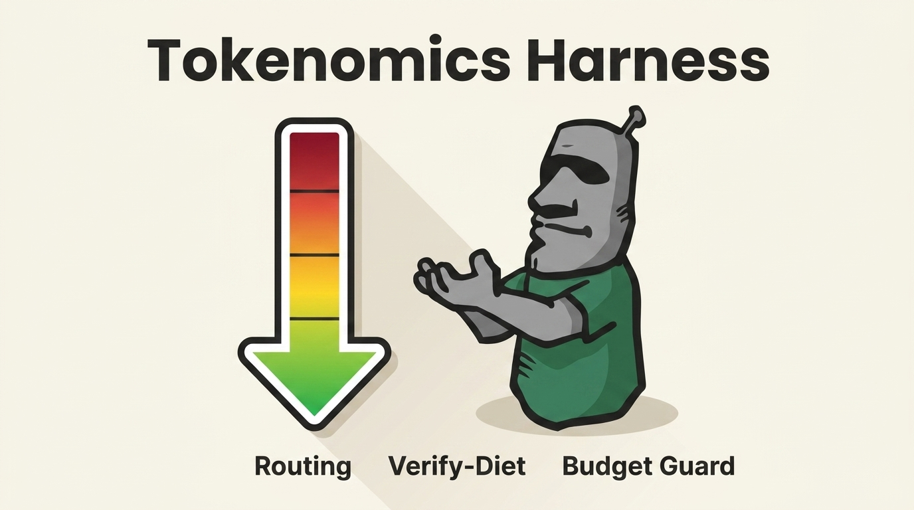
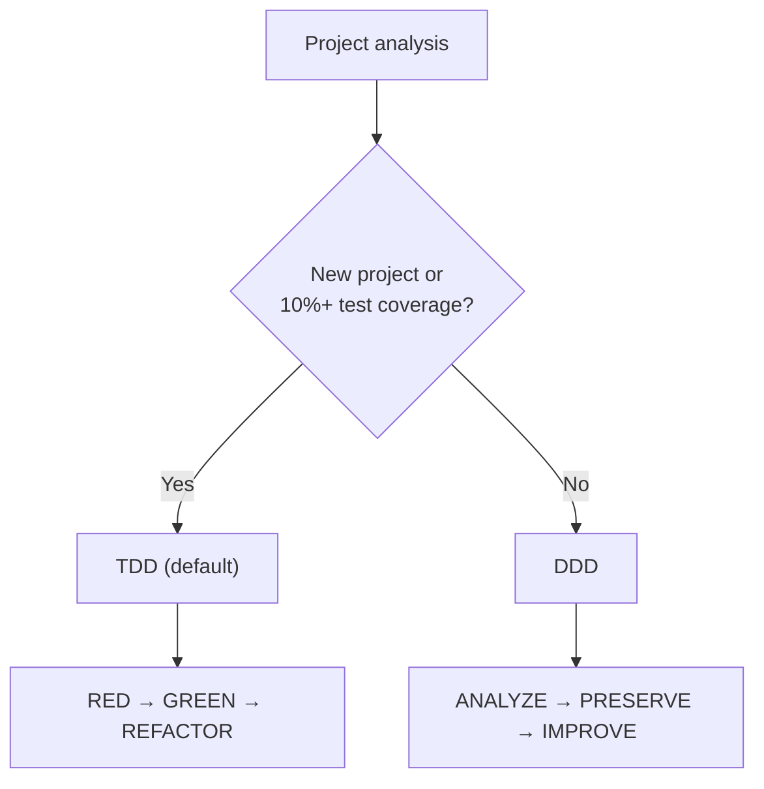

<p align="center">
  
</p>

<h1 align="center">MoAI-ADK</h1>

<p align="center">
  <strong>An Agentic Development Kit designed for Tokenomics</strong>
</p>

<p align="center">
  English ·
  <a href="./README.ko.md">한국어</a> ·
  <a href="./README.ja.md">日本語</a> ·
  <a href="./README.zh.md">中文</a>
</p>

<p align="center">
  <a href="https://book.mo.ai.kr" target="_blank"><strong>Official Book: Practical Agentic Coding with Claude Code</strong></a><br>
  A hands-on harness engineering guide by the MoAI-ADK author — <a href="https://book.mo.ai.kr" target="_blank">book.mo.ai.kr</a>
</p>

<p align="center">
  <a href="https://github.com/modu-ai/moai-adk/actions/workflows/ci.yml"></a>
  <a href="https://github.com/modu-ai/moai-adk/actions/workflows/codeql.yml"></a>
  <a href="https://codecov.io/gh/modu-ai/moai-adk"></a>
  <br>
  <a href="https://go.dev/"></a>
  <a href="https://github.com/modu-ai/moai-adk/releases"></a>
  <a href="./LICENSE"></a>
</p>

<p align="center">
  <a href="https://adk.mo.ai.kr"><strong>Official Documentation</strong></a> ·
  <a href="https://adk.mo.ai.kr/book">Book: Practical Agentic Coding with Claude Code</a> ·
  <a href="https://discord.gg/Z7E7Mdc5aN">Discord</a>
</p>

---

> **"Tokenomics is a harness designed to make token consumption economical."**

---

## MoAI-ADK is a Tokenomics Harness

MoAI-ADK (Agentic Development Kit) enables Claude Code to produce code, then makes that code reliable at predictable cost. A harness wraps the model from the outside. The model is a stochastic worker moving token by token — it remembers neither budget, nor quality bar, nor where the last session broke off. Cost ceilings, passing test suites, continuity that survives `/clear` — properties like these cannot be re-seeded by a prompt every turn; the system must enforce them from the outside.

Every design decision serves one goal: token economics — the same quality for fewer tokens, higher quality for the same tokens. Which model to use, how deeply to reason, how to spend context — none of this is left to chance turn by turn; the system decides.

It does not replace Claude Code. It only wraps, in structure, the parts Claude Code leaves to you — model routing, quality gates, cost control, session continuity. A single binary written in Go, it runs on macOS, Linux, and Windows with no extra dependencies.

---

## Why Tokenomics

Token prices keep falling, but actual agent workflow spend rises. Agents spin through dozens to hundreds of steps to solve a single task, consuming proportionally more tokens. In usage-based pricing, this becomes the invoice; in subscription, it consumes the weekly quota shared by all models.

### Cost is determined by assignment, not unit price

The DeepSWE leaderboard (113 tasks) demonstrates this problem. Even within the same Claude family and at the same max effort, per-task costs vary widely.

| Model [max] | Pass@1 | Per-task cost | $/solved | Tokens/solved | Steps |
|---|---|---|---|---|---|
| claude-opus-4.8 | 59% | $13.22 | **$22.4** | 229k | 120 |
| claude-fable-5 | 70% | $21.63 | $30.9 | 170k | 88 |
| claude-sonnet-5 | 54% | $26.40 | **$48.9** | 396k | 268 |

Sonnet 5 max is **more expensive than Opus 4.8 max per task** ($26.40 vs $13.22) while scoring lower (54% vs 59%). The cause is 268 steps — at max effort, retry loops explode. "Use a weaker model harder to save money" does not hold. It burns three times the steps, consuming more quota. Cost is determined by **assigning the right model and reasoning depth to each task**, not by unit price.

MoAI-ADK systematizes this assignment instead of leaving it to chance.

---

## Three Axes of Economization

### Routing — Assign the right model and reasoning depth to each task

**Tier×Phase Matrix**. Declaratively assign models and reasoning effort (effort) by work phase (plan / run / sync) and SPEC size (Tier S / M / L). Deploy high-reasoning models to planning phases that need deep inference, and light models to implementation phases with mechanical repetition. Maximize quality per cost.

**No-Haiku 3-Tier Policy**. Exclude Haiku from the routing model set, distributing work across a 3-tier structure (Sonnet / Opus / Fable). Assign Sonnet low effort to mechanical tasks to minimize step count, and deploy upper-tier models where reasoning matters.

**Profile Matrix**. A single per-agent profile matrix maps each retained agent to a `{model, effort}` pair. One profile axis — `max` / `medium` (default) / `low`, selected via `llm.profile` (`moai init --profile`, `moai update --profile`) — picks the active column; `moai model profile` resolves each agent's cell. The 10 grouped agents draw model+effort from the matrix (no Haiku anywhere), while `Explore` and user-defined agents inherit the session model.

**CG Mode (Claude + GLM)**. `moai cg` is a hybrid mode combining Claude leader and GLM workers. Strategy, planning, and audits run on Claude; bulk implementation runs on GLM. **60-70% cost savings** on implementation-heavy workloads.

### Verification Economy — Diet context, persist evidence to disk

**verify-diet**. Redirect verbose verification output to disk files, leaving only exit code and bounded tail (max 50 lines) in context. This file-redirect contract maintains verification evidence integrity while reducing context consumption. Evidence persists under `.moai/state/verify/<session>/`.

**Prompt Cache**. When a request's prefix matches the previous request, reuse that section instead of reprocessing. Cached reads cost 0.1× the base input price. Minimize always-loaded instructions and the hit rate rises immediately. The statusline cache hit segment (`♻️`) shows real-time monitoring.

**Context Diet**. Apply `/clear` strategy. When SPEC phase completes, `/clear` and save progress to `progress.md`, then issue a paste-ready resume message. At context window thresholds (1M model 50% / 200K model 90%), automatic recommendations appear.

### Budget Defense — Stop before overage, resume in next session

**Token Circuit Breaker**. When agent token usage hits hard-limit (default 90%), execute abort. Save progress to `progress.md`, issue paste-ready resume message, and never auto-`/clear`. The system only recommends `/clear`; the user decides and executes.

**Statusline**. Keep context usage rate (CW%), prompt cache hit rate, and rate limit depletion visible in terminal at all times. The `(⚠️/clear)` marker next to CW% appears at model-specific thresholds.

---

## Infrastructure Sustains Tokenomics

### Quality Structure — Prevent rework and debug loops (worst token waste)

**SPEC 3-Phase Lifecycle**. plan → run → sync. Tier S/M/L size classification determines verification depth and PR routing. GEARS format requirements + acceptance criteria judge completion by evidence.

**TRUST 5 Quality Gates**. Tested (85%+ coverage) · Readable · Unified · Secured · Trackable, applied to every change. Gates judge verification, not agents.

**11-Agent Catalog**. MoAI custom 10 + built-in Explore. Separate planning and auditing from the start so the authoring side cannot grade its own work.

### Learning Loops — Token efficiency improves as loops run

**`/moai goal`·`/moai loop`**. Declare a completion condition and the session works until it is satisfied or the turn limit (default 30) is reached. `/moai loop` scans LSP diagnostics · AST-grep · linter in parallel, buckets issues by level, and runs until the queue drains.

**Routing Ledger**. Record routing decisions and gate evidence as privacy-preserving digests. Observations upgrade to rules.

**4-Tier Learning Ladder**. Observation (≥1) → Heuristic (≥3) → Rule (≥5) → Auto-update (≥10, user approval required); trust threshold 0.70. All applications revertible via `moai harness rollback`. Harness edits (rule/agent/hook changes) follow a predict–verify discipline: each edit records a falsifiable prediction, must pass held-in/held-out double checks before acceptance, and rejected edits stay on record.

**Decision Memory**. Questions emerge where uncertainty is highest (p ≈ 0.5); recommendations follow observed statistical majority, not system defaults.

### Extension Points — Duplicate proven patterns for project-specific reuse efficiency

**Harness v4 Builder**. Natural language request → domain·goal·constraint extraction → approval gate → project-specific agents·skills·commands·hooks scaffolding.

**@MX Tags**. Inline code annotations where AI agents exchange context, invariants, and danger zones.

**worktree isolation**. Attach isolated worktrees per SPEC for parallel development via `/moai plan --worktree`.

---



---

## Quick Start

### Install

#### macOS / Linux / WSL

```bash
curl -fsSL https://raw.githubusercontent.com/modu-ai/moai-adk/main/install.sh | bash
```

#### Windows (PowerShell 7.x+)

```powershell
irm https://raw.githubusercontent.com/modu-ai/moai-adk/main/install.ps1 | iex
```

#### Build from source (Go 1.26+)

```bash
git clone https://github.com/modu-ai/moai-adk.git
cd moai-adk && make build
```

### Project Initialization

```bash
moai init my-project
```

Interactive wizard auto-detects language, framework, and methodology, selects model policy, and generates Claude Code integration files.

### First Workflow

```bash
claude        # launch Claude Code inside the project
```

```text
/moai plan "Add JWT login"      # author a SPEC
/moai run SPEC-AUTH-001         # TDD/DDD implementation
/moai sync SPEC-AUTH-001        # sync docs + create PR
```

Natural language works too. `/moai "fix the login bug"` triggers intent analysis (Analyze-First routing) to read the request and route to the appropriate workflow.

### Requirements

| Platform | Supported Environments | Notes |
|----------|----------------------|-------|
| macOS | Terminal, iTerm2 | Full support |
| Linux | Bash, Zsh | Full support |
| Windows | **WSL (recommended)**, PowerShell 7.x+ | Native cmd.exe unsupported |

**Prerequisites**

- **Git** required on all platforms
- **Claude Code** — MoAI-ADK is a harness for Claude Code
- **Recommended**: `gh` CLI (PR automation) · `tmux` (CG mode) · language linter/test toolchain (e.g., `golangci-lint`)

---

## Reference

### /moai Slash Commands (16)

| Subcommand | Role |
|------------|------|
| `plan` / `run` / `sync` | SPEC 3-phase pipeline |
| `project` / `harness` / `design` | Project docs+harness generation · harness lifecycle · Design-phase collaboration |
| `goal` / `loop` / `fix` | Declarative goal loops · iterative fixes · single-pass fixes |
| `review` / `gate` / `clean` | Code review (`--deep` for multi-agent adversarial vulnerability scan) · pre-commit quality gates · dead code removal |
| `mx` / `codemaps` / `feedback` | @MX annotations · architecture docs · GitHub issue reporting |
| `e2e` | Multi-platform E2E tests (web/mobile/desktop, CLI-first) |
| *(natural language)* | Analyze-First routing: autonomous plan → run → sync pipeline |

> → Details: [Workflow Commands](https://adk.mo.ai.kr/en/workflow-commands) · [Utility Commands](https://adk.mo.ai.kr/en/utility-commands)

### CLI Commands (frequently used 12)

| Command | Description |
|---------|-------------|
| `moai init` | Interactive project setup (auto-detects language/framework/methodology) |
| `moai doctor` | System state diagnosis and environment verification |
| `moai status` | Project status summary (Git branch, quality metrics) |
| `moai update` | Update to latest version (auto-rollback supported) |
| `moai cc` / `moai glm` / `moai cg` | Claude-only / GLM-only / hybrid Claude leader + GLM worker sessions |
| `moai worktree <new|list|switch|sync|remove|clean|go>` | Git worktree management for parallel SPEC development |
| `moai session <list|register|current>` | Multi-session coordination |
| `moai spec <audit|archive|lint|list|new>` | SPEC lifecycle tools |
| `moai goal <arm|status|clear>` | Goal engine CLI |
| `moai harness <status|apply|rollback|disable>` | Harness learning lifecycle |
| `moai handoff <save|list>` | Session handoff records |
| `moai preference <list|decay-scan|toggle>` | Decision memory management |
| `moai web` | Web Console — 6-tab settings console |

> Full 36 commands: [CLI Reference](https://adk.mo.ai.kr/en/cli-reference)

### 11-Agent Catalog

| Category | Agent | Cost | Role |
|----------|-------|------|------|
| **Manager** | manager-spec | 🔴 | Plan-phase SPEC authoring |
| | manager-develop | 🔴 | Run-phase TDD/DDD/autofix implementation |
| | manager-docs | 🔵 | Sync-phase documentation |
| | manager-git | 🩵 | PR creation and routing |
| | manager-design | 🟠 | Design-phase collaboration (Claude Design) |
| **Evaluator** | plan-auditor | 🔴 | Independent plan audit (bias prevention) |
| | sync-auditor | 🔴 | 4-dimensional quality scoring (Functionality 40 · Security 25 · Craft 20 · Consistency 15) |
| **Builder** | builder-harness | 🟠 | Project-specific agents, skills, commands, hooks scaffolding |
| **Advisor** | super-advisor | 🔵 | On-demand high-reasoning consultation (E1-E4 escalation) |
| **Specialist** | e2e-tester | 🟠 | Web/mobile/desktop E2E test execution (CLI-first) |
| **Built-in** | Explore | ⚪ | Read-only codebase exploration |

Cost colors follow the default `medium` profile's model×effort cells (inspect via `moai model profile`): 🔴 opus+high · 🟠 opus+medium · 🔵 sonnet+medium / fable+low · 🩵 sonnet+low · ⚪ session-model inherit. Assignments shift when switching profiles (`max`/`low`). Progress of long-running delegations is recorded on the Task channel and relayed by the orchestrator as an icon Progress Board.

### TRUST 5 Quality Gates

| Criterion | Meaning | Verification |
|-----------|---------|------------|
| **T**ested | Tested | 85%+ coverage, characterization tests, unit tests pass |
| **R**eadable | Readable | Clear naming, consistent style, lint errors 0 |
| **U**nified | Unified | Consistent formatting, import order, project structure compliance |
| **S**ecured | Secured | OWASP compliance, input validation, security warnings 0 |
| **T**rackable | Trackable | Conventional commits, issue references, structured logging |

### Methodology Selection (TDD vs DDD)


```mermaid
flowchart TD
    A["Project analysis"] --> B{"New project or<br/>10%+ test coverage?"}
    B -->|"Yes"| C["TDD (default)"]
    B -->|"No"| D["DDD"]
    C --> F["RED → GREEN → REFACTOR"]
    D --> G["ANALYZE → PRESERVE → IMPROVE"]
```

| Methodology | Cycle | Target |
|-------------|-------|-----|
| **TDD** (default) | RED → GREEN → REFACTOR | New projects and feature work |
| **DDD** | ANALYZE → PRESERVE → IMPROVE | Existing code with <10% coverage |

---

## Reading the Statusline

```
🤖 Opus │ 🧠 xhigh·t │ ♻️ 87% │ 🔅 v2.1.212 │ 🗿 v3.0.0 │ ⏳ 2h 34m │ 💬 MoAI
🪫 CW: ████████░░ 88% (⚠️/clear) │ 🔋 5H: ████░░░░░░ 45% (4h 30m) │ 🪫 7D: ████████░░ 82% (Jan 21)
📁 moai-adk-go │ 🔀 modu-ai/moai-adk | 🅱️ feat/statusline ↑2 +3 │ 💾 +1 M2 ?0 │ 📋 [run SPEC-AUTH-001-run] │ 💌 PR #1042 (⌥approved)
```

| Element | Meaning |
|------|------|
| 🤖 Model | Current active model |
| 🧠 effort | Reasoning effort level — `·t` suffix when extended reasoning active |
| ♻️ Cache hit rate | Prompt cache hit rate |
| CW: Context | Context window usage rate + 2-stage `/clear` markers (⚠️ soft, 🛑 hard) |
| 5H / 7D | Pricing plan usage rate + reset time |
| 📁 Directory | Project directory name |
| 🔀 Repo | GitHub repo identity `owner/name` |
| 🅱️ Branch | Current branch + `↑`ahead `↓`behind + `+`dirty count |
| 💾 git status | staged / modified / untracked counts |
| 📋 Task | Active SPEC workflow `[command SPEC-ID-phase]` |
| 💌 PR | Active GitHub PR number + review state (`⌥state`) |

> Details: [Statusline Guide](https://adk.mo.ai.kr/en/advanced/statusline)

---

## FAQ

### Q: Why doesn't every function have an @MX tag?

Normal. Tags mark high-fan-in, complex, or dangerous code. Most code in any project won't hit any tag threshold, and a file without tags is not a defect.

### Q: What does the statusline version display mean?

```
🗿 v3.0.0 ⬆️ v3.0.1
```

The first value is the currently installed MoAI-ADK version; the arrow indicates an available update. Disappears after running `moai update`.

### Q: Can I use Claude only without GLM?

Yes. `moai cc` launches a Claude-only session. CG mode (`moai cg`, Claude leader + GLM workers) and GLM-only (`moai glm`) are cost-saving options; the harness·SPEC workflow·quality gates work identically across all three modes.

### Q: Does it work on existing projects?

Yes. `moai init` detects project state and selects methodology — DDD (characterization tests fix behavior, then incremental improvement) for existing code with <10% coverage, TDD for new/well-tested code.

---

## Community and Documentation

### Contributing

Contributions are welcome. See [CONTRIBUTING.md](CONTRIBUTING.md) for detailed procedures.

1. Fork the repository
2. Create a feature branch: `git checkout -b feature/my-feature`
3. Write tests (TDD for new code, characterization tests for existing code)
4. Verify tests, lint, format pass: `make test` · `make lint` · `make fmt`
5. Commit with Conventional commit message and open pull request

**Code quality requirements**: 85%+ coverage · lint errors 0 · type errors 0 · Conventional commits

### Community

- [Discord](https://discord.gg/Z7E7Mdc5aN) — Real-time discussion and tips
- [Issues](https://github.com/modu-ai/moai-adk/issues) — Bug reports, feature requests (use `/moai feedback` in Claude Code)

### License

[Apache License 2.0](./LICENSE) — see LICENSE file for details.

### Documentation Guide

[adk.mo.ai.kr](https://adk.mo.ai.kr) online documentation is organized into 12 sections.

| Section | Description |
|---------|-------------|
| [Getting Started](https://adk.mo.ai.kr/en/getting-started) | Introduction, installation, Windows guide, init wizard, quickstart, CLI overview, FAQ |
| [Core Concepts](https://adk.mo.ai.kr/en/core-concepts) | MoAI-ADK identity, constitution, harness engineering, SPEC-based development, DDD, TRUST 5 |
| [Workflow Commands](https://adk.mo.ai.kr/en/workflow-commands) | `plan` · `run` · `sync` — SPEC pipeline backbone |
| [Utility Commands](https://adk.mo.ai.kr/en/utility-commands) | `fix` · `loop` · `gate` · `review` · `clean` · `codemaps` · `e2e` · `feedback` · `goal` |
| [CLI Reference](https://adk.mo.ai.kr/en/cli-reference) | All `moai` binary commands — `status`, `profile`, `doctor`, `update`, `web`, `goal`, `handoff`, `harness`, `init`, `worktree`, etc. |
| [Claude Code Guide](https://adk.mo.ai.kr/en/claude-code) | Claude Code integration — basics, context·memory, agentic, extensibility (skills·hooks·plugins) |
| [Multi-LLM](https://adk.mo.ai.kr/en/multi-llm) | CG mode and model policy |
| [Cost Optimization](https://adk.mo.ai.kr/en/cost-optimization) | Prompt caching strategies and token cost reduction |
| [Guides](https://adk.mo.ai.kr/en/guides) | CI automation, multi-LLM CI, and other operational recipes |
| [Git Worktree](https://adk.mo.ai.kr/en/worktree) | Worktree guide for parallel SPEC development, examples, FAQ |
| [Advanced](https://adk.mo.ai.kr/en/advanced) | Tokenomics overview, token budget, statusline, settings.json, hooks, @MX tags, skill guide, Harness v4 Builder, self-evolution, decision memory, catalog system, security notes, CLAUDE.md/agent guide |
| [Contributing](https://adk.mo.ai.kr/en/contributing) | Open-source contribution guide |

### Links

- [Official Documentation](https://adk.mo.ai.kr)
- [Book: Practical Agentic Coding with Claude Code](https://adk.mo.ai.kr/book)
- [CHANGELOG](./CHANGELOG.md)
- [Claude Code](https://code.claude.com/docs/en)
- [Discord Community](https://discord.gg/Z7E7Mdc5aN)
